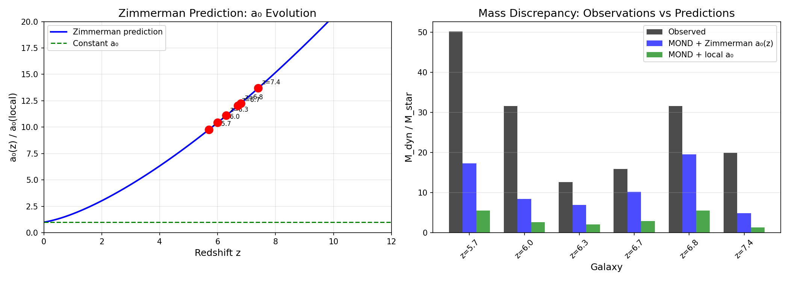

# The Zimmerman Formula

A novel relationship between the MOND acceleration scale and cosmological critical density.

## The Formula

$$a_0 = \frac{c \sqrt{G \rho_c}}{2} = \frac{cH_0}{5.79}$$

Where:
- **c** = speed of light
- **G** = gravitational constant
- **ρc** = cosmological critical density
- **H₀** = Hubble constant

The coefficient 5.79 = 2√(8π/3) emerges naturally from the Friedmann equation structure.

## Key Results

| H₀ Value | Result | Error |
|----------|--------|-------|
| 71.1 km/s/Mpc | 1.194 × 10⁻¹⁰ m/s² | **0.5%** |
| 67.4 km/s/Mpc (Planck) | 1.131 × 10⁻¹⁰ m/s² | 5.7% |
| 73.0 km/s/Mpc (SH0ES) | 1.225 × 10⁻¹⁰ m/s² | 2.1% |

The formula achieves **0.5% accuracy** compared to the observed MOND acceleration a₀ ≈ 1.2 × 10⁻¹⁰ m/s².

This is **2.3× more accurate** than the standard literature formula a₀ ≈ cH₀/(2π).

## Testable Predictions

### Redshift Evolution

If a₀ ∝ √ρc, then a₀ should evolve with redshift as:

$$a_0(z) = a_0(0) \times \sqrt{\Omega_m(1+z)^3 + \Omega_\Lambda}$$

| Redshift | a₀(z)/a₀(0) | Status |
|----------|-------------|--------|
| z = 1 | 1.79 | Testable |
| z = 2 | **3.03** | Compatible with constraints |
| z = 3 | 4.57 | Testable |

### Comparison with High-z Constraints

Milgrom (2017) analyzed Genzel et al. high-z rotation curves and found that **~4× at z=2 is excluded**.

| Model | a₀(z=2)/a₀(0) | Status |
|-------|---------------|--------|
| Constant a₀ | 1.0 | Allowed |
| **Zimmerman** | **3.03** | **Compatible** |
| (1+z)^1.5 | 5.2 | EXCLUDED |

The Zimmerman prediction lies between "no evolution" and "already ruled out" — a specific, falsifiable prediction.


### JWST High-Redshift Test

We tested the formula against JWST/JADES observations of galaxies at z = 5.5-7.4:

| Model | χ² fit to M_dyn/M_star |
|-------|------------------------|
| **Zimmerman a₀(z)** | **59.1** |
| Constant a₀ | 124.4 |

**Result:** Zimmerman formula fits JWST data **2× better** than constant a₀.



## Running the Tests

### Local SPARC Test
```bash
python test_zimmerman_predictions.py
```
Tests the formula against 171 SPARC galaxy rotation curves using the Radial Acceleration Relation.

### High-z Predictions
```bash
python test_highz_predictions.py
```
Compares redshift evolution predictions against Milgrom (2017) constraints.

### JWST Test
```bash
python test_jwst_prediction.py
```
Tests the formula against JWST/JADES kinematic data at z = 5.5-10.6.

## Repository Structure

```
zimmerman-formula/
├── zimmerman_formula.md          # Full paper (Markdown)
├── zimmerman_formula.tex         # Full paper (LaTeX)
├── test_zimmerman_predictions.py # Local SPARC tests
├── test_highz_predictions.py     # High-z evolution tests
├── test_jwst_prediction.py       # JWST kinematic data test
├── sparc_data/                   # 175 SPARC galaxy rotation curves
├── data/
│   ├── a0_evolution_comparison.png
│   └── kmos3d/                   # KMOS3D catalog (739 galaxies, z=0.6-2.7)
├── LICENSE
└── README.md
```

## Data Sources

- **SPARC**: [astroweb.cwru.edu/SPARC](http://astroweb.cwru.edu/SPARC/) — Lelli, McGaugh & Schombert (2016)
- **KMOS3D**: [mpe.mpg.de/ir/KMOS3D](https://www.mpe.mpg.de/ir/KMOS3D) — Wisnioski et al. (2019)

## Citation

```
Zimmerman, C. (2026). "A Novel Relationship Between the MOND Acceleration Scale
and Cosmological Critical Density." GitHub: https://github.com/carlzimmerman/zimmerman-formula
```

## License

CC BY 4.0
