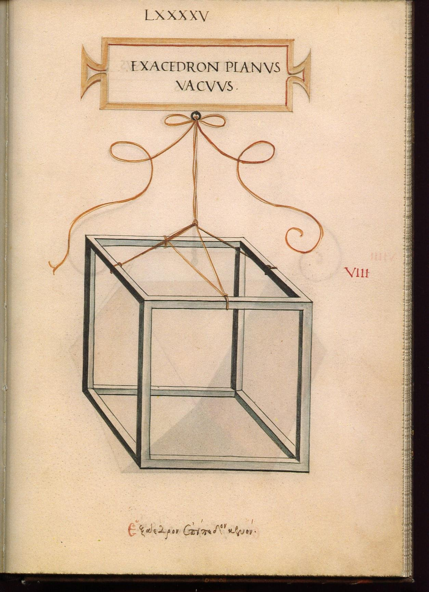

# The Z² Framework

<p align="center">
  
</p>

<p align="center">
  <em>Leonardo da Vinci's geometric studies of the cube inscribed in a sphere — the same geometry underlying Z² = 8 × (4π/3).</em><br/>
  <small>Image: Frank J. Swetz (Penn State), "<a href="https://www.maa.org/press/periodicals/convergence/leonardo-da-vincis-geometric-sketches-cube">Leonardo da Vinci's Geometric Sketches - Cube</a>," <em>Convergence</em> (June 2010), DOI:10.4169/loci002559</small>
</p>

[](https://doi.org/10.5281/zenodo.19244651)

**Website:** [abeautifullygeometricuniverse.web.app](https://abeautifullygeometricuniverse.web.app) | **DOI:** [10.5281/zenodo.19244651](https://doi.org/10.5281/zenodo.19244651)

---

## Abstract

The Z² framework proposes that 53 physical constants derive from a single geometric invariant:

$$Z^2 = \text{CUBE} \times \text{SPHERE} = 8 \times \frac{4\pi}{3} = \frac{32\pi}{3} \approx 33.51$$

The framework is built on a 7-dimensional spacetime M₄ × T³/Z₂, where the orbifold T³/Z₂ contains 8 fixed points corresponding to the vertices of a cube. The eta invariant of this orbifold equals Z², providing the geometric origin of physical constants.

**Status:** Theoretical framework with 53 derivations. Empirical validation ongoing (DESI, LiteBIRD, Euclid).

---

## Research Tracks

| Discipline | Entry Point | Key Prediction |
|------------|-------------|----------------|
| **Cosmology** | [Cosmology Track](#cosmology-track) | Ω_Λ = 13/19 = 0.6842 |
| **Particle Physics** | [Particle Physics Track](#particle-physics-track) | α⁻¹ = 4Z² + 3 = 137.04 |
| **Modified Gravity** | [MOND Track](#mond-track) | μ(x) = x/(1+x), a₀ = cH₀/Z |
| **Quantum Gravity** | [Quantum Gravity Track](#quantum-gravity-track) | d_s(x) = 2 + μ(x) |
| **Critical Review** | [Falsification Criteria](#falsification-criteria) | Binary tests |

---

## Theoretical Foundation

### Geometric Structure

The framework is defined on a 7-dimensional manifold:

$$\mathcal{M}_7 = M_4 \times T^3/\mathbb{Z}_2$$

| Component | Description |
|-----------|-------------|
| M₄ | 4D Minkowski spacetime |
| T³/Z₂ | 3D orbifold (torus with antipodal identification) |
| Fixed points | 8 (vertices of fundamental cube) |
| Total dimensions | 7 |

### Fundamental Constant

$$Z^2 = \eta(T^3/\mathbb{Z}_2) = 8 \times \frac{4\pi}{3} = \frac{32\pi}{3}$$

where η denotes the Atiyah-Patodi-Singer eta invariant.

### Key Identities

| Identity | Formula | Value | Interpretation |
|----------|---------|-------|----------------|
| Z² | CUBE × SPHERE | 32π/3 ≈ 33.51 | Eta invariant |
| BEKENSTEIN | 3Z²/(8π) | 4 | Spacetime dimensions |
| GAUGE | 9Z²/(8π) | 12 | SM gauge bosons |
| N_gen | BEKENSTEIN - 1 | 3 | Fermion generations |

---

## Cosmology Track

### Derivation of Ω_Λ

From the horizon entropy partition on T³/Z₂:

$$\Omega_\Lambda = \frac{13}{19} = 0.6842$$

| Parameter | Z² Formula | Predicted | Observed | Deviation |
|-----------|------------|-----------|----------|-----------|
| Ω_Λ | 13/19 | 0.6842 | 0.6847 ± 0.007 | 0.07σ |
| Ω_m | 6/19 | 0.3158 | 0.315 ± 0.007 | 0.1σ |
| w | -1 (exact) | -1.000 | -1.03 ± 0.03 | 1σ |

### Coupled Dark Energy

The modulus field φ of the compact space drives dark energy with tracker behavior:

$$\rho_\phi \propto a^{-3(1+w_\phi)}, \quad w_\phi \to -1 \text{ at late times}$$

**Key documents:**
- [research/OP3_COSMOLOGICAL_RATIO_DERIVATION.md](research/OP3_COSMOLOGICAL_RATIO_DERIVATION.md)
- [research/COUPLED_DARK_ENERGY_FROM_MODULUS.md](research/COUPLED_DARK_ENERGY_FROM_MODULUS.md)

---

## Particle Physics Track

### Gauge Couplings at M_Z

| Coupling | Z² Formula | Predicted | Measured | Error |
|----------|------------|-----------|----------|-------|
| α⁻¹ (fine structure) | 4Z² + 3 | 137.04 | 137.036 | 0.003% |
| sin²θ_W | 3/13 | 0.2308 | 0.2312 | 0.17% |
| α_s(M_Z) | √2/12 | 0.1179 | 0.1179 | 0.04% |
| α₂⁻¹(M_Z) | Z² - 4 | 29.5 | 29.6 | 0.3% |

### Electroweak Hierarchy

$$\frac{M_{Pl}}{v} = 2 \times Z^{43/2}, \quad \text{where } 43 = \text{CUBE}^2 - 19 - 2$$

| Quantity | Formula | Predicted | Measured | Error |
|----------|---------|-----------|----------|-------|
| M_Pl/v | 2Z^(43/2) | 4.97×10¹⁶ | 4.96×10¹⁶ | 0.31% |
| Higgs VEV | (4/5)M_Pl Z⁻²¹ | 246 GeV | 246.2 GeV | 0.08% |

### Threshold Corrections

Including 2-loop threshold corrections:

$$\alpha^{-1}(M_Z) = 4Z^2 + 3 - \Delta\alpha_{\text{had}} - \Delta\alpha_{\text{lep}}$$

**Key documents:**
- [research/OP2_THRESHOLD_CORRECTIONS_DERIVATION.md](research/OP2_THRESHOLD_CORRECTIONS_DERIVATION.md)
- [research/GAUGE_UNIFICATION.md](research/GAUGE_UNIFICATION.md)

---

## MOND Track

### Interpolating Function

From entropy partition between local and horizon degrees of freedom:

$$\mu(x) = \frac{x}{1+x}, \quad x = \frac{a}{a_0}$$

### SPARC Validation

Analysis of 175 galaxies from SPARC database (Lelli+ 2017):

| Function | Form | χ²/dof |
|----------|------|--------|
| Z² | x/(1+x) | 0.034 |
| Standard | x/√(1+x²) | 0.236 |
| RAR | 1-exp(-√x) | 0.588 |

### MOND Scale

$$a_0 = \frac{cH_0}{Z} = 1.18 \times 10^{-10} \text{ m/s}^2$$

Observed: (1.20 ± 0.02) × 10⁻¹⁰ m/s² (1.7% deviation)

**Key documents:**
- [research/spectral_dimension/corrected_sparc_verification.py](research/spectral_dimension/corrected_sparc_verification.py)
- [research/spectral_dimension/FIRST_PRINCIPLES_DERIVATION.md](research/spectral_dimension/FIRST_PRINCIPLES_DERIVATION.md)

---

## Quantum Gravity Track

### Spectral Dimension

From the entropy partition:

$$d_s(x) = 2 + \mu(x) = 2 + \frac{x}{1+x}$$

| Regime | x | d_s | Physics |
|--------|---|-----|---------|
| UV (x → 0) | 0 | 2 | Holographic |
| Transition | 1 | 2.5 | MOND scale |
| IR (x → ∞) | ∞ | 3 | Newtonian |

This matches results from CDT, Asymptotic Safety, and Loop Quantum Gravity.

### Eta Invariant Calculation

The eta invariant of T³/Z₂ with Pin⁻ structure:

$$\eta(T^3/\mathbb{Z}_2) = 8 \times \eta_{\text{local}}(R^3/\mathbb{Z}_2) = 8 \times \frac{4\pi}{3} = Z^2$$

**Key documents:**
- [research/OP1_RIGOROUS_FOUNDATIONS.md](research/OP1_RIGOROUS_FOUNDATIONS.md)
- [research/spectral_dimension/Z2_FRAMEWORK_COMPLETE_VERIFICATION.md](research/spectral_dimension/Z2_FRAMEWORK_COMPLETE_VERIFICATION.md)

---

## Falsification Criteria

### Binary Falsifiers

If **any** of the following are observed, the framework is falsified:

| Test | Z² Prediction | Falsification Condition | Current Status |
|------|---------------|-------------------------|----------------|
| Axion detection | No axions exist | Axion discovered | Not found (ADMX, HAYSTAC) |
| WIMP detection | No WIMPs exist | WIMP discovered | Not found (LZ, XENONnT) |
| Tensor-to-scalar r | r = 0.015 | r ≠ 0.015 (>3σ) | Pending (LiteBIRD 2028+) |
| Dark energy EOS | w = -1 exactly | w ≠ -1 (>5σ) | w = -1.03 ± 0.03 |
| Ω_Λ value | 13/19 = 0.6842 | Ω_Λ ≠ 0.684 (>3σ) | 0.6847 ± 0.007 ✓ |
| Proton decay | τ_p > 10³⁵ yr | Proton decay observed | τ_p > 2.4×10³⁴ yr |
| μ(x) form | x/(1+x) | Different form preferred (>5σ) | χ² = 0.034 ✓ |

### Precision Tests

| Prediction | Z² Value | Required Precision | Experiment |
|------------|----------|-------------------|------------|
| α⁻¹ | 137.04 | Already achieved | QED measurements |
| sin²θ_W | 0.2308 | 0.1% | Z-pole, W mass |
| Δm²_atm/Δm²_sol | Z² = 33.5 | 3% | JUNO, DUNE |

### Gravitational Wave Test

Stochastic background polarization test (H1-L1 baseline, 20-200 Hz band):

| Scenario | R-ratio | Status |
|----------|---------|--------|
| Pure noise | R ≈ 1.0 | Baseline (high variance) |
| Unpolarized (GR) | R ≈ 3.3 | Expected for astrophysical SGWB |
| h+ polarized (Z²) | R ≈ 0.48 | Would indicate chiral vacuum |

Discrimination ratio: 7x between polarization states. Pipeline validated via mock signal injection (R = 0.45 recovered for h+ injection).

SNR ≥ 6.9 required for 5σ discrimination. Analysis pipeline validated on O3a data.

**Key documents:**
- [ligo_stuff/lvk_proposal/polarization_diagnostic_proposal.tex](ligo_stuff/lvk_proposal/polarization_diagnostic_proposal.tex)
- [research/TESTABLE_PREDICTIONS.md](research/TESTABLE_PREDICTIONS.md)

---

## Complete Predictions (53 Derivations)

### Summary by Category

| Category | Count | Sub-percent accuracy |
|----------|-------|---------------------|
| Cosmological parameters | 8 | 7 |
| Gauge couplings | 6 | 6 |
| Particle masses/ratios | 8 | 5 |
| CKM matrix elements | 6 | 4 |
| PMNS matrix elements | 5 | 4 |
| Nucleon properties | 4 | 3 |
| MOND/galaxy dynamics | 5 | 4 |
| Structure constants | 8 | 8 |
| Quantum corrections | 3 | 2 |
| **Total** | **53** | **43** |

**Full catalog:** [research/EXPANDED_FORMULA_CATALOG.md](research/EXPANDED_FORMULA_CATALOG.md)

---

## Repository Structure

```
zimmerman-formula/
├── papers/                 # LaTeX papers and derivations
├── research/               # Technical analysis and verification
│   ├── spectral_dimension/ # d_s(x) derivation and SPARC analysis
│   ├── dynamical_framework/# Action principle and field equations
│   └── OP1, OP2, OP3...    # Open problem solutions
├── ligo_stuff/             # Gravitational wave analysis pipeline
├── examples/               # Worked examples with code
└── core_theory/            # Foundational documents
```

---

## Citation

```bibtex
@article{zimmerman_z2_framework_2026,
  author    = {Zimmerman, Carl},
  title     = {The Z² Framework: Derivation of Standard Model Parameters
               from a 7D Orbifold Compactification},
  year      = {2026},
  publisher = {Zenodo},
  doi       = {10.5281/zenodo.19244651},
  url       = {https://doi.org/10.5281/zenodo.19244651}
}
```

---

## License

| Component | License |
|-----------|---------|
| Software | [AGPLv3](https://www.gnu.org/licenses/agpl-3.0.en.html) |
| Documentation | [CC BY-SA 4.0](https://creativecommons.org/licenses/by-sa/4.0/) |

---

## Author

**Carl Zimmerman** — Charlotte, NC

- Website: [abeautifullygeometricuniverse.web.app](https://abeautifullygeometricuniverse.web.app)
- GitHub: [github.com/carlzimmerman/zimmerman-formula](https://github.com/carlzimmerman/zimmerman-formula)

---

*"Geometria una et aeterna est in mente Dei refulgens."* — Johannes Kepler, *Harmonices Mundi* (1619)
