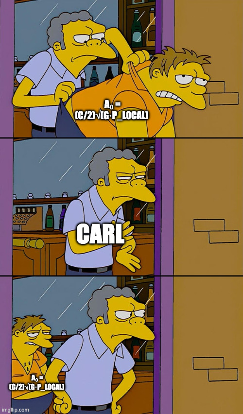

# Meme: "a₀ = (c/2)√(G·ρ_local) keeps coming back"

**Template:** Moe throws Barney out of the bar / Barney crawls right back in.

- **Moe (throwing it out):** CARL
- **Barney (the thing being thrown out, and crawling back):** `a₀ = (c/2)√(G·ρ_LOCAL)`

**The joke:** the local‑density reading of a₀ keeps getting tossed (it breaks the universal galaxy RAR — a
galaxy's local matter density is ~10⁻²¹ kg/m³ ≫ ρ_DE, which would blow a₀ up ~1000×), but it *keeps crawling
back* because it's the one framework‑native thing that could lighten the cluster deficit. Filed 2026‑06‑14.
