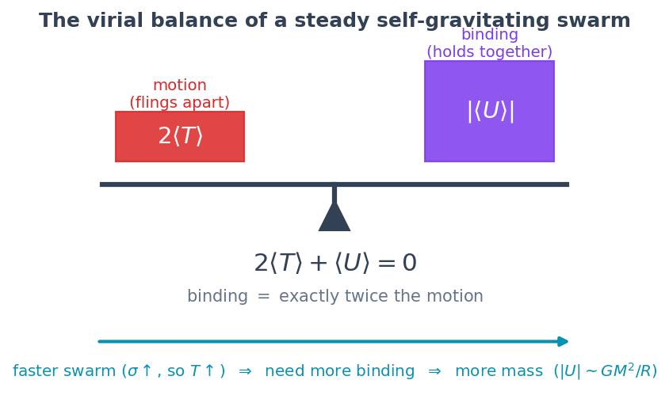
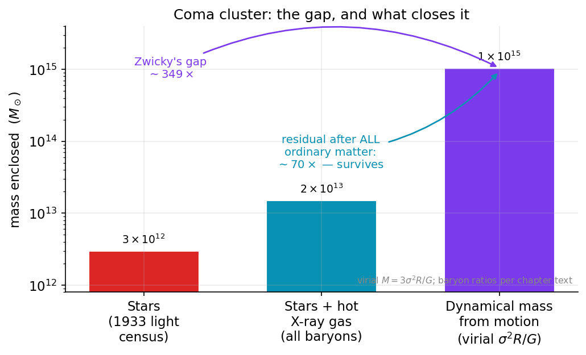
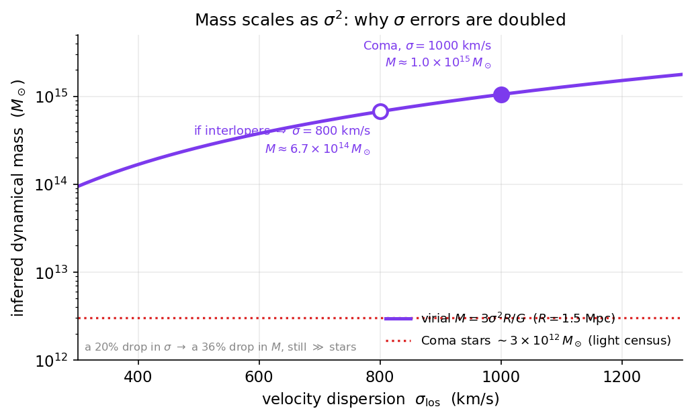

# Chapter 3: The Virial Theorem and Fritz Zwicky's Heavy Cluster (1933)

> *Watch a swarm of bees on a summer evening. Each bee darts where it likes, yet the swarm holds together — it does not fly apart into the dusk. Something keeps it bound. In 1933 a sharp-tongued Swiss astronomer looked at a swarm of galaxies, measured how fast they were moving, and realized that whatever was holding them together had to weigh hundreds of times more than everything he could see. Almost nobody believed him for forty years.*

## A swarm that should not hold together

Let me start with the bees, because the whole chapter really is the bees.

Picture a loose swarm of bees hovering over a meadow. Each individual bee is in furious motion — left, right, up, down — and no two of them are doing the same thing at the same moment. And yet, step back, and the *swarm* is a thing. It has an edge. It stays roughly the same size. It does not, over the next few seconds, spray itself across the whole field and vanish.

Now here is the question I want you to hold onto for the rest of the chapter. **What keeps the swarm together?**

For real bees, the answer is the bees themselves: they can see each other, sense each other, and they actively steer to stay near their neighbors. A swarm is held together by *behavior*. But suppose you found a swarm of objects that could not see one another, could not steer, could not change their minds — objects that simply move in whatever direction they happen to be moving, forever, unless something pulls on them. Objects like, say, planets. Or stars. Or whole galaxies.

For objects like that, the only thing that can hold a fast-moving swarm together is **gravity** — the mutual pull of all that mass on all the other mass. And now the question gets teeth. If you know how fast the members of the swarm are moving, and you know how big the swarm is, you can *work backwards* and ask: how much gravity — and therefore how much mass — would it take to keep these things from flying apart?

This is, at heart, a weighing. We met its smaller cousin in Chapter 2, where we weighed the Sun by watching the planets orbit it, and weighed our own Galaxy by watching stars circle its center. Those were clean cases: one big central mass, and tidy near-circular orbits around it. A galaxy cluster is messier. The galaxies in a cluster do not orbit a single point in neat ellipses; they swarm, plunging in and racing out and crossing past one another along every direction at once, like the bees. So we need a weighing tool built for swarms rather than for orbits. That tool is the **virial theorem**, and learning to read it is the real business of this chapter.

When we point that tool at the first cluster anyone pointed it at, it tells us something startling — the same startling thing this whole book is, in the end, about. The swarm is moving *far* too fast. To hold it together, gravity needs vastly more mass than the glowing galaxies provide. Either there is a great deal of matter we cannot see, or our law of gravity is not telling us the truth on these scales.

That is the fork in the road. We will spend the book walking down it carefully. But it was first glimpsed, clearly and correctly, by one difficult man in 1933, and his name was Fritz Zwicky.

## The man nobody wanted to listen to

Fritz Zwicky was Bulgarian-born, Swiss-raised, and Caltech-employed, and by every account that survives him he was brilliant, original, abrasive, and almost impossible to get along with. He called colleagues he disliked "spherical bastards" — spherical, he explained, because they were bastards no matter which way you looked at them. He worked on problems decades ahead of the field and was often right in ways nobody around him could yet verify, which is a recipe for being both correct and ignored at the same time.

This is worth pausing on, because it is part of the story and not just color. Science is done by people, and people decide whose ideas to take seriously partly on the merits and partly on everything else — temperament, status, the fashions of the moment, whether the claim is comfortable. Zwicky's central discovery was uncomfortable, his manner made him easy to dismiss, and his tools were crude enough that a skeptic could wave the result away as a rough estimate gone wrong. So it sat, more or less, for forty years. I am going to ask you to keep this in mind later in the book, when we talk about ideas that the mainstream finds uncomfortable today — including, in full honesty, parts of the framework this book is about. Being ignored is not evidence that you are right. Zwicky happened to be right. Most uncomfortable outsiders are not. The only way to tell the difference is to do the patient, both-ways work of checking, and that is exactly what the rest of this book tries to do.

Among many other things, Zwicky (with Walter Baade) coined the term *supernova*, predicted neutron stars two years after the neutron was discovered, and was the first to seriously propose that galaxy clusters could act as gravitational lenses — all ideas that took decades to be vindicated. But the one I want to follow is the one he published in 1933, in a Swiss journal, in German, in a paper that the wider community would essentially overlook for a generation.

He was looking at the Coma cluster.

## What a galaxy cluster is

Let me define the object, because it is easy to picture and easy to underestimate.

A **galaxy** is an island of stars — our own Milky Way holds a few hundred billion of them, bound together by gravity, slowly turning. A **galaxy cluster** is the next rung up the ladder: a swarm of *galaxies*, hundreds or even thousands of them, held together by their mutual gravity into a single bound structure spanning millions of light-years. Clusters are the largest gravitationally bound objects in the universe. (Bigger structures exist — the great cosmic web of filaments and walls — but those are still expanding apart with the universe; a cluster is the largest thing that has actually pulled itself together and stopped flying apart.)

The **Coma cluster** is one of the nearest rich clusters, sitting in the direction of the faint northern constellation Coma Berenices — "Berenice's Hair." It is a magnificent thing: a roughly spherical swarm of well over a thousand galaxies, about 320 million light-years away, the whole assemblage spanning some twenty million light-years. To the eye through a telescope it is a sprinkle of soft elliptical smudges, each smudge a galaxy of a hundred billion suns. This is the swarm Zwicky weighed.

He weighed it two different ways, and the two answers did not agree. Not by a little. By a factor of hundreds. Understanding *how* he weighed it — and why the disagreement is so hard to explain away — is the heart of the chapter, so let us build the tool slowly.

## The first weighing: counting the light

The easy way to weigh a cluster is to count its light. We can see the galaxies; we know roughly how much mass it takes to make a galaxy shine as brightly as it does (we calibrate that on nearby galaxies whose masses we can measure other ways); so we add up all the light, convert light to mass at that exchange rate, and out comes a mass for the cluster. Call this the **luminous mass** — the mass we can account for by what glows.

When Zwicky did this for Coma, he got a number — a large number, naturally, since a thousand galaxies is a great deal of stuff. Let us hold that number in one hand.

The point is not that this method is silly. It is the obvious, honest first estimate, and a version of it is still how we take inventory of the *visible* universe. The trouble is what happens when we weigh the same cluster a completely different way — by its motion — and get an answer hundreds of times larger to hold in the other hand.

## The second weighing: reading the motion

Here is the idea, in plain words first, before any mathematics.

Take the swarm of galaxies. Measure how fast they are moving relative to one another — not in a single direction, but the typical *spread* of their speeds. Some galaxies are racing toward us, some away, some across; what we want is the characteristic size of that scatter of velocities. This quantity has a name we will use constantly: the **velocity dispersion**, usually written with the Greek letter sigma, $\sigma$. It is simply a measure of how widely the speeds in the swarm are spread out around the average — a fast, chaotic swarm has a large $\sigma$; a slow, placid one has a small $\sigma$.

We can actually measure $\sigma$, and this is one of the loveliest tricks in astronomy. Light from a galaxy moving *toward* us is shifted slightly toward the blue end of the spectrum; light from one moving *away* is shifted toward the red. (You have heard the same effect with sound — the pitch of an ambulance siren drops as it passes you. Light does the analogous thing with color.) By spreading each galaxy's light into a spectrum and measuring this Doppler shift, we read off each galaxy's speed along our line of sight. Do that for many galaxies in the cluster, look at how widely those speeds are spread, and you have measured the velocity dispersion of the swarm directly. For Coma, Zwicky and his contemporaries found galaxies whose line-of-sight speeds scattered over something like a thousand kilometers per second — staggeringly fast, far faster than anyone would have guessed for a "stable" structure.

Now comes the logic, and it is the same logic as the bees. These galaxies are moving *fast*. They are not steered, they cannot change their minds, they simply coast on whatever path gravity bends them onto. For such a fast swarm not to have long ago dispersed into the surrounding emptiness, gravity must be reining it in — and the faster the swarm moves, the more gravity, and therefore the more *mass*, it takes to keep the lid on. So the velocity dispersion is a scale. Measure how fast the swarm boils, and you can infer how heavy the pot must be to keep it from boiling over.

To turn that intuition into a number, we need the tool I promised you: the virial theorem.

## The virial theorem, gently

The word *virial* comes from the Latin *vis*, "force" — it is just an old name and you can let it wash over you. Here is what the theorem says, in words that a sixteen-year-old can carry away and that are, I promise, exactly right.

In any swarm of objects held together by their own gravity, and settled into a steady state — neither collapsing nor flying apart — there is a fixed accounting relationship between two quantities:

- the **kinetic energy** of the swarm: how much energy is tied up in all that motion (more mass moving, and moving faster, means more kinetic energy); and
- the **gravitational potential energy** of the swarm: a measure of how tightly the swarm is bound together by gravity (more mass packed into a smaller space means a deeper, more negative potential energy).

The virial theorem says these two are locked in a specific ratio. Loosely: *a self-gravitating swarm carries exactly twice as much "binding" as it does "motion."* The motion is trying to fling the swarm apart; the binding is holding it together; and for a steady swarm, the binding wins by precisely a factor of two. Tip the balance — make the galaxies move a little faster — and to keep the swarm steady you need *more binding*, which means *more mass*. That is the whole engine of the argument.

***Figure 3.3 — The virial balance: binding wins by exactly a factor of two.*** A schematic of $2\langle T\rangle+\langle U\rangle=0$ — for a steady self-gravitating swarm the binding $|U|$ is locked at exactly twice the motion energy $2T$. The left pan shows a placid, slow swarm; the right pan shows Coma boiling at $\sigma=1000$ km/s. To keep the boiling swarm steady the binding must rise to match, and since binding scales as $GM^2/R$ that means more mass. This is a conceptual diagram of the chapter's energy-accounting argument, not plotted data.

**Source:** Figure generated by [`book/figures/ch03_virial_balance.py`](https://github.com/carlzimmerman/zimmerman-formula/blob/main/book/figures/ch03_virial_balance.py). Illustrates the virial theorem $2\langle T\rangle+\langle U\rangle=0$ as stated in this chapter's Deeper Dive; standard result, see e.g. Zwicky 1933, Helv. Phys. Acta 6, 110.

The beautiful thing is what this lets you do. If you can measure the *motion* (from the velocity dispersion $\sigma$) and the *size* of the swarm (from how big it looks on the sky and how far away it is), the virial theorem hands you the *mass* — and crucially, it hands you the **total** mass, every gram of it, whether it glows or not. Gravity does not care whether matter is luminous. A swarm responds to *all* the mass that is there. So this second weighing measures something the first weighing cannot: the true gravitating mass, light and dark alike.

That distinction — *light* counts only what glows, *motion* counts everything that pulls — is the seam that the whole missing-mass story is going to pry open. Let us now make it quantitative.

> **Deeper Dive: The virial theorem, stated and motivated**
>
> For a bound, self-gravitating system of point masses in a stationary (time-averaged steady) state, the virial theorem relates the time-averaged total kinetic energy $\langle T\rangle$ and total gravitational potential energy $\langle U\rangle$:
> $$2\langle T\rangle + \langle U\rangle = 0.$$
>
> *Sketch of why.* Define the scalar moment of inertia about the center of mass, $I=\sum_i m_i\,\mathbf r_i\cdot\mathbf r_i$. Differentiating twice in time,
> $$\tfrac12 \ddot I = \sum_i m_i\,\dot{\mathbf r}_i\cdot\dot{\mathbf r}_i + \sum_i m_i\,\mathbf r_i\cdot\ddot{\mathbf r}_i = 2T + \sum_i \mathbf r_i\cdot\mathbf F_i .$$
> The last term, $\sum_i \mathbf r_i\cdot\mathbf F_i$, is the *virial of Clausius*. For forces derived from a gravitational ($1/r$) potential, this virial equals exactly the total potential energy $U$ (a consequence of $U$ being homogeneous of degree $-1$ in the coordinates — Euler's theorem on homogeneous functions). Hence
> $$\tfrac12\ddot I = 2T + U.$$
> For a system that is neither expanding nor contracting on average, the long-time average of $\ddot I$ vanishes, $\langle \ddot I\rangle = 0$, leaving
> $$2\langle T\rangle + \langle U\rangle = 0.$$
>
> This is the cluster-scale analogue of the orbital weighings of Chapter 2. There we used the special case of a single test mass on a closed orbit (where $\langle T\rangle = -\tfrac12\langle U\rangle$ recovers $v^2 = GM/r$ for a circular orbit). Here we apply it to a whole swarm at once — its great virtue being that it needs no knowledge of the individual orbits, only the *statistics* of the motion and the size of the system.
>
> **A caution to carry forward.** The derivation assumed (i) a steady state ($\langle\ddot I\rangle=0$ — the cluster is "virialized," neither collapsing nor expanding), (ii) that we have captured *all* the kinetic and potential energy, and (iii) that gravity is the only relevant force. Each assumption is a place where, decades later, the careful resolution of the Coma discrepancy would do its work. Hold them.

> **Deeper Dive: From velocity dispersion to mass, $M\sim \sigma^2 R/G$**
>
> Specialize the theorem to a roughly spherical cluster of total mass $M$ and characteristic radius $R$, made of $N$ galaxies of (nearly) equal mass.
>
> *Kinetic term.* The total kinetic energy is $T=\tfrac12 M\langle v^2\rangle$, where $\langle v^2\rangle$ is the mean-square three-dimensional speed of the galaxies. We do not measure the full 3-D speed — only the component along our line of sight, whose dispersion is $\sigma_{\rm los}$. For an isotropic velocity field the three directions share equally, so $\langle v^2\rangle = 3\sigma_{\rm los}^2$. Thus
> $$T = \tfrac32 M\,\sigma_{\rm los}^2 .$$
>
> *Potential term.* The gravitational potential energy of a bound mass distribution can be written
> $$U = -\,\alpha\,\frac{GM^2}{R},$$
> where the dimensionless number $\alpha$ (of order unity; $\alpha=3/5$ for a uniform sphere, somewhat different for centrally concentrated ones) absorbs the details of the mass profile. $R$ is an appropriately defined characteristic radius (a "gravitational radius").
>
> *Assemble.* Inserting $T$ and $U$ into $2\langle T\rangle+\langle U\rangle=0$:
> $$2\left(\tfrac32 M\sigma_{\rm los}^2\right) - \alpha\,\frac{GM^2}{R} = 0
> \;\;\Longrightarrow\;\;
> \boxed{\,M \;=\; \frac{3}{\alpha}\,\frac{\sigma_{\rm los}^2\,R}{G}\,}.$$
>
> Up to the order-unity factor $3/\alpha$, this is the workhorse relation
> $$M \sim \frac{\sigma^2 R}{G}.$$
> Read it like a sentence: *the mass of a swarm is set by how fast it moves squared, times how big it is, divided by Newton's constant.* Faster swarm, or bigger swarm, means more mass needed to bind it. It is dimensionally identical to the orbital weighing $M\sim v^2 r/G$ of Chapter 2 — the same physics, dressed for a crowd instead of a single orbit. And, to repeat the load-bearing point: the $M$ it returns is the *total dynamical mass*, everything that gravitates, seen or unseen.

## The number that should not be

Now we put the two weighings side by side, because the entire 1933 result lives in their comparison.

The first weighing — counting the light — gave Zwicky a luminous mass: the mass you can account for with glowing galaxies. The second weighing — the virial theorem applied to the velocity dispersion — gave him a dynamical mass: the total mass actually needed to keep the swarm bound. If our inventory of the universe were complete, these two numbers ought to roughly agree. Most of a cluster's mass should be in its stars, and the stars are exactly what glows.

They did not agree. The dynamical mass came out *enormously* larger than the luminous mass — Zwicky's own estimate put the discrepancy at a factor of order a few hundred. Coma was moving as though it weighed hundreds of times more than its visible galaxies could account for. The swarm was boiling far, far too hard for the heat we could see under the pot.

Zwicky stated the conclusion plainly, and his German gave us the phrase that has haunted physics ever since. He wrote that the cluster must contain a great deal of **dunkle Materie** — *dark matter* — matter that exerts gravity but emits no light we can detect. Either that, he reasoned, or something was badly wrong with how we were applying the laws of physics on these scales.

I want to dwell on the precision of that last sentence, because Zwicky framed the fork in the road correctly on the very first day, and the rest of this book is a long walk down it. He did *not* say "there must be invisible particles." He said the *gravitating mass* implied by the *motion* vastly exceeds the *luminous mass* implied by the *light*. That is a statement about a mismatch — about two weighings disagreeing. It does not, by itself, tell you whether the fix is *more matter than we can see* or *a different law of motion than we assumed*. Those are the two roads of Chapter 5, and they were both already implicit in the 1933 discrepancy. We should be honest that Zwicky's own language leaned toward unseen matter; but the logical structure of his result — a clash between two ways of weighing — is exactly the structure that, ninety years later, still admits both answers.

> **Worked Example: Weighing Coma by its motion**
>
> Let us do the second weighing slowly, with round modern numbers, to see the discrepancy appear in our own hands. We will use the virial estimate $M \simeq \dfrac{3\,\sigma_{\rm los}^2 R}{G}$ (taking the order-unity factor as $\approx 1$ for an order-of-magnitude estimate; a careful profile changes the answer by a factor of order one, not the conclusion).
>
> **Step 1 — Gather the ingredients in SI units.**
> - Velocity dispersion of Coma: $\sigma_{\rm los}\approx 1000~\text{km/s} = 1.0\times 10^{6}~\text{m/s}$.
> - Characteristic radius: take $R\approx 1.5~\text{Mpc}$. One megaparsec is $3.086\times 10^{22}~\text{m}$, so $R \approx 1.5\times 3.086\times 10^{22} \approx 4.6\times 10^{22}~\text{m}$.
> - Newton's constant: $G = 6.67\times 10^{-11}~\text{m}^3\,\text{kg}^{-1}\,\text{s}^{-2}$.
>
> **Step 2 — Form $\sigma^2 R$.**
> $$\sigma_{\rm los}^2 R = (1.0\times 10^{6})^2 \times (4.6\times 10^{22}) = (1.0\times 10^{12})\times(4.6\times 10^{22}) = 4.6\times 10^{34}~\text{m}^3\,\text{s}^{-2}.$$
>
> **Step 3 — Divide by $G$ and multiply by 3.**
> $$M \simeq \frac{3\times 4.6\times 10^{34}}{6.67\times 10^{-11}} \approx \frac{1.4\times 10^{35}}{6.67\times 10^{-11}} \approx 2\times 10^{45}~\text{kg}.$$
>
> **Step 4 — Translate into Suns.** One solar mass is $M_\odot \approx 2\times 10^{30}~\text{kg}$, so
> $$M \approx \frac{2\times 10^{45}}{2\times 10^{30}} \approx 1\times 10^{15}~M_\odot .$$
>
> A *thousand trillion* solar masses of gravitating matter. Now compare with the light: Coma's galaxies, totaled up, shine like a few times $10^{12}~M_\odot$ worth of stars. The dynamical mass exceeds the stellar mass by a factor of *several hundred*. That factor — give or take, depending on exactly which radius and dispersion you adopt — is Zwicky's 1933 result, reproduced in four lines of arithmetic. The swarm is hundreds of times too heavy for its light.
>
> *(Two honest footnotes on the numbers. First, Zwicky himself used a different, smaller distance to Coma than we now know to be correct, and the older "Hubble constant" of his day inflated the discrepancy further; with modern distances the bare stars-only factor is somewhat smaller than his original headline. Second — and this matters for Part VI — the dynamical mass above is robust; it is the *visible* side of the ledger that grew when we learned what else is in there. We turn to that next.)*

## Forty years in the drawer

Here is the part of the story that should make any working scientist uneasy.

A result this dramatic — a factor of *hundreds*, in the nearest rich cluster, stated clearly with the right tool — and the community essentially set it aside for four decades. There were reasons, and not all of them were unreasonable.

The honest objections went roughly like this. The virial theorem assumes the cluster is *virialized* — settled into a steady state, neither collapsing nor flying apart. Was Coma really settled, or was it a young, still-forming structure caught mid-collapse, in which case the theorem simply does not apply? The velocity dispersion was hard to measure well with the spectra of the day, and a few fast interloper galaxies — objects in the foreground or background, not truly cluster members — can inflate $\sigma$ and, since mass goes as $\sigma^2$, badly inflate the inferred mass. The radius and the mass profile were uncertain, and they enter the answer too. And the whole estimate was an order-of-magnitude affair, exactly the kind of result a busy field is tempted to file under "interesting, probably an error somewhere, let us wait for better data."

There was also, I think, a quieter reason, and it is the one I asked you to hold onto earlier. The claim was *uncomfortable*. It said the universe is mostly made of something we cannot see, discovered by a man who was difficult to like, published in a venue the Anglo-American mainstream did not closely read, using a tool whose assumptions could be questioned. Each of those, alone, is a small excuse. Together they were enough to keep one of the most important measurements of the twentieth century in a drawer until the 1970s.

I tell this not to scold the scientists of the 1940s — hindsight is cheap, and waiting for better data is usually the right instinct. I tell it because it is a clean lesson in how discovery actually goes, and because it cuts *both ways*, which is the spirit of this entire book. On one side: the mainstream can be slow, and an uncomfortable outsider can be right, and Zwicky was. On the other side: the way you *establish* that the outsider was right is not by admiring his boldness — it is by the patient, decades-long work of better spectra, better distances, more clusters, and an independent line of evidence that nobody could wave away. That independent line arrived in the 1970s, on a completely different scale, from the rotation of individual galaxies, and it is the subject of Chapter 4. When Vera Rubin's flat rotation curves landed, suddenly Zwicky's lonely cluster result was no longer lonely. Two utterly different measurements — one on the scale of clusters, one on the scale of single galaxies — pointed at the same missing mass. That convergence is what turned a filed-away curiosity into a crisis.

## What we now know is in the Coma cluster

Now let me close the loop on the numbers honestly, because the modern resolution of Zwicky's discrepancy is genuinely instructive — and it carries a sting that returns in Part VI.

When Zwicky weighed Coma's *light*, he counted essentially the stars in the galaxies. But it turns out the stars are not where most of the *ordinary*, visible-in-principle matter lives. Decades later, X-ray telescopes — which see the hot, ionized gas that fills the space *between* the galaxies — revealed that the Coma cluster is bathed in an enormous atmosphere of gas at a hundred million degrees, glowing not in visible light but in X-rays. And there is *a lot* of it: this intracluster gas outweighs all the stars in all the galaxies, typically by a factor of several. So Zwicky's first weighing missed most of the ordinary matter, simply because most of it does not shine in visible light. Add the hot gas back in, and the "missing mass" shrinks.

But — and this is the crucial *both-ways* point — it does **not** go away. Even after you count the stars *and* the hot X-ray gas, the total ordinary (baryonic) matter still falls short of the dynamical mass demanded by the motion, by a factor of several. So the modern accounting splits Zwicky's discrepancy into two pieces:

1. A part that was a *bookkeeping* gap — ordinary matter (the hot gas) that genuinely exists, genuinely gravitates, and was simply invisible to a 1933 visible-light census. This part is now *closed*. It was never the deep mystery; it was Zwicky weighing the light without knowing about the X-rays.
2. A residual part that *survives* the full ordinary-matter census — the dynamical mass still exceeds stars-plus-gas by a factor of several. *This* is the part that is either genuinely non-luminous matter of an unknown kind, or a sign that gravity behaves differently on these scales than Newton's law assumes.

In the standard cosmological picture, that residual is dark matter — a new kind of particle, which we will go hunting for in Chapter 6. In the modified-dynamics picture, which this book ultimately explores, the residual is a hint that the law of inertia itself changes at very low accelerations. And here is where I must be scrupulously honest, in the way I will try to be throughout: clusters are the *hardest* case for the modified-dynamics road. The framework at the center of this book — like the broader family of modified-dynamics theories it belongs to — does flatten and substantially reduce the cluster discrepancy, but it does **not** fully close it on its own terms. A residual mass discrepancy in clusters remains an open problem, shared across the whole modified-dynamics family. I am not going to hide that behind the bees. We will give it a full and fair hearing in Part VI, where it belongs, and I will tell you exactly how large the residual is and exactly why it is hard. For now, simply file the fact: the very first place the missing mass was ever found — galaxy clusters — is also, ninety years on, the place where the alternative to dark-matter particles has its toughest fight. This is not a theory of everything yet, as frustrating as it may be, and the cluster residual is one of the honest reasons why.

## Why the chapter matters for the rest of the book

Step back and notice what Zwicky actually gave us, because we will use all of it.

He gave us a **tool** — the virial theorem, which lets us weigh a swarm by its motion rather than its light, and which returns the *total* gravitating mass, dark and luminous together. We will reach for $M\sim\sigma^2 R/G$ again whenever we weigh a cluster.

He gave us a **method of inference** — compare two independent weighings, one sensitive only to what glows and one sensitive to everything that gravitates, and let their disagreement tell you what is hidden. That two-weighings logic is the deep structure of *all* the missing-mass evidence, from Coma to rotation curves to gravitational lensing.

He gave us a **fork**, framed correctly from the first day: a mismatch between mass-from-motion and mass-from-light, which can be cured *either* by adding unseen matter *or* by changing the law of dynamics. He leaned toward the first; this book will follow the second a long way down; and the honest truth is that the question is not yet settled.

And he gave us a **cautionary tale** about how science treats uncomfortable claims from difficult outsiders — a tale that runs both ways, and that I will not let you forget when we get to the controversial parts. The mainstream was too slow with Zwicky. But the thing that *vindicated* him was not his boldness; it was a second, independent measurement that nobody could explain away. Keep your eye on that standard. It is the one this book will be held to as well.

That second, independent measurement is where we go next. In the 1970s a careful, persistent observer named Vera Rubin pointed her spectrograph not at a swarm of galaxies but at the stars circling within a *single* galaxy — and found them moving in a way that, all over again, demanded far more mass than the light could explain. Two scales, two methods, one missing universe. On to Chapter 4.

***Figure 3.1 — Two weighings of the Coma cluster, and what closes the gap (and what does not).*** The dynamical mass from the virial theorem ($M\simeq 3\sigma^2 R/G$ with $\sigma=1000$ km/s and $R=1.5$ Mpc) towers over the stars by a factor of several hundred. Adding the hot X-ray gas (a few times the stellar mass) closes most of Zwicky's headline gap, but a residual factor of several survives the full ordinary-matter census. The dynamical bar is computed from the framework's/Newton's shared virial relation; the stellar, gas, and total-baryon bars use the round ratios stated in the chapter (gas a few times the stars; baryons still short by a factor of several). Illustrative, model-generated to the chapter's own numbers.

**Source:** Figure generated by [`book/figures/ch03_coma_two_weighings.py`](https://github.com/carlzimmerman/zimmerman-formula/blob/main/book/figures/ch03_coma_two_weighings.py). Virial weighing $M\sim\sigma^2R/G$ as in this chapter's Worked Example; Coma missing-mass result from Zwicky 1933, Helv. Phys. Acta 6, 110; hot intracluster gas dominating the stellar mass is the modern X-ray picture.

## Summary

- A **galaxy cluster** is a gravitationally bound swarm of hundreds or thousands of galaxies — the largest bound objects in the universe. The **Coma cluster** is a nearby rich example, and the first to be weighed by its motion.
- Like a swarm of bees, a fast-moving swarm of galaxies can only be held together if something supplies enough gravity — and therefore enough **mass** — to keep it from dispersing. The faster the swarm moves, the more mass it takes.
- The **velocity dispersion** $\sigma$ is the spread of galaxy speeds in a cluster, measured from the Doppler shifts of their light. It tells us how fast the swarm is "boiling."
- The **virial theorem**, $2\langle T\rangle+\langle U\rangle=0$, relates a self-gravitating swarm's kinetic and potential energy in a steady state. Applied to a cluster it yields the weighing $M\sim \sigma^2 R/G$ — and crucially returns the **total** gravitating mass, luminous and dark alike.
- In **1933 Fritz Zwicky** applied this to Coma and found its dynamical mass (from motion) exceeds its luminous mass (from light) by a factor of *hundreds*. He named the implied missing component **dunkle Materie / dark matter** — while framing the result correctly as a mismatch that could mean unseen matter *or* a failure of the assumed law of dynamics.
- The result was largely **ignored for forty years**, partly for honest reasons (was Coma virialized? were the velocities trustworthy?) and partly because the claim was uncomfortable and its author abrasive and outside the mainstream. It was vindicated only when an *independent* line of evidence — Rubin's rotation curves (Chapter 4) — converged on the same conclusion.
- The **modern resolution** splits the discrepancy: hot X-ray gas, invisible in 1933, accounts for much of the gap (ordinary matter that was simply uncounted), but a **residual** discrepancy of a factor of several survives the full ordinary-matter census. That residual is dark matter in the standard picture — and, in the modified-dynamics picture this book explores, the cluster residual is the *hardest* case, only partly cured and shared across the whole MOND family. Honestly: not solved, and we return to it in Part VI.

## Questions

1. **(Easy.)** In your own words, why can a swarm of galaxies that move *faster* only be held together by *more* mass? Use the bee-swarm picture, and connect it to the relation $M\sim\sigma^2 R/G$.

2. **(Easy.)** What are the two independent ways Zwicky "weighed" the Coma cluster, and which kinds of matter does each one detect? Why would you expect them to agree if our inventory of matter were complete?

3. **(Intermediate — calculation.)** Redo the Worked Example, but suppose a later survey found that several fast "galaxies" near Coma were actually foreground interlopers, lowering the measured velocity dispersion from $1000~\text{km/s}$ to $800~\text{km/s}$. By what factor does the inferred dynamical mass change? Does this fully resolve the discrepancy with the luminous mass? (Hint: mass scales as $\sigma^2$.)

***Figure 3.2 — Mass goes as the square of the boiling speed.*** The virial weighing $M=3\sigma^2 R/G$ (at fixed $R=1.5$ Mpc) plotted against velocity dispersion $\sigma$. Because $M\propto\sigma^2$, a measurement error in $\sigma$ is doubled in the mass: the purple dot is Coma at $\sigma=1000$ km/s, and the open dot shows what Question 3 explores — if fast interlopers had inflated $\sigma$ and the true value were $800$ km/s, the inferred mass drops by $(800/1000)^2=0.64$, a 36% reduction that still leaves a factor-of-hundreds gap above the stars. Computed directly from the chapter's virial relation.

**Source:** Figure generated by [`book/figures/ch03_virial_mass_vs_sigma.py`](https://github.com/carlzimmerman/zimmerman-formula/blob/main/book/figures/ch03_virial_mass_vs_sigma.py). Virial estimator $M\sim\sigma^2R/G$ as derived in this chapter's Deeper Dive; original application to Coma from Zwicky 1933, Helv. Phys. Acta 6, 110.

4. **(Intermediate — conceptual.)** The virial derivation assumed $\langle\ddot I\rangle = 0$ — that the cluster is in a steady, "virialized" state. Explain physically what could go wrong if Coma were actually still collapsing (not yet virialized). Would assuming virial equilibrium for a *collapsing* system tend to *over*- or *under*-estimate the true mass, and why?

5. **(Advanced.)** Adding the hot intracluster gas to the ledger closes much, but not all, of Zwicky's gap. Look up (or estimate) the rough ratio of gas mass to stellar mass in a rich cluster like Coma, and the rough ratio of total dynamical mass to total *baryonic* (stars + gas) mass. From those two numbers, argue quantitatively that the residual discrepancy after counting all ordinary matter is a factor of several, not a factor of hundreds — and not zero.

6. **(Research-level / open.)** The cluster residual is the toughest case for any modified-dynamics alternative to dark-matter particles, including the framework in this book. Sketch, in qualitative terms, what an honest test would need to look like to *distinguish* "there is extra unseen particle matter in clusters" from "the law of dynamics changes at low acceleration, and clusters retain a residual the modification only partly cures." What independent observable — beyond the velocity dispersion itself — might break the degeneracy? (We take this up in earnest in Part VI; there is no settled answer, which is precisely why it is research-level.)
