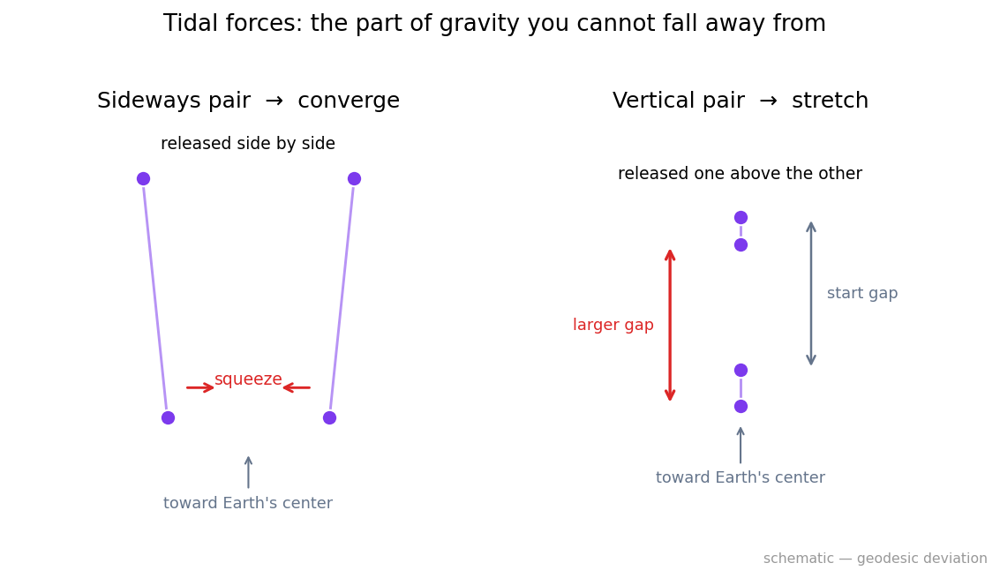
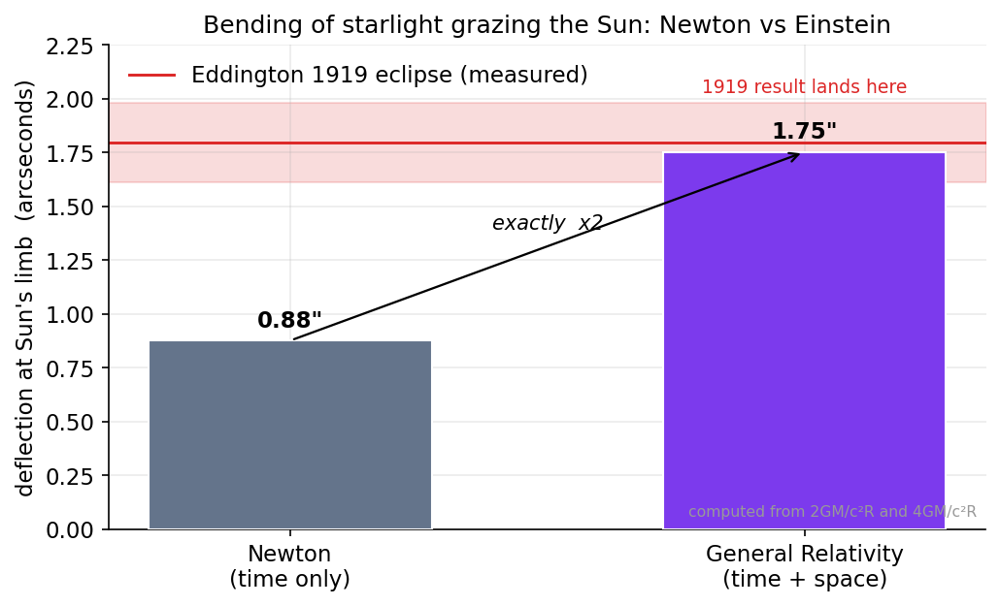
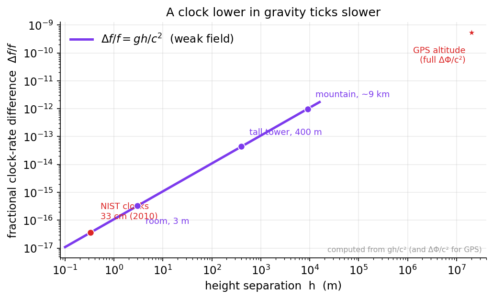

# Chapter 7: Einstein's Gravity: The Equivalence Principle and Curved Spacetime

*Imagine you woke up in a falling elevator. For a few seconds — before anything went wrong — you would feel completely weightless, floating, serene. Einstein's whole theory of gravity grew out of taking that floating feeling seriously.*

---

## Where We Are

In the first part of this book we met a puzzle that refuses to go away. Galaxies spin too fast for the matter we can see (Chapter 4). Clusters of galaxies are far heavier than their starlight suggests (Chapter 3). Something is missing — either invisible *stuff* we have not yet found, or a flaw in the *law* we are using to add up the gravity. We laid out that fork in Chapter 5, and now we are walking down the road toward understanding the law itself, deeply enough to ask whether it might be the thing at fault.

To do that honestly, we need the best theory of gravity humanity has ever written down: Albert Einstein's **General Relativity**, published in 1915. Newton's gravity, which we used in Chapter 2 to weigh the planets, is a magnificent approximation — good enough to fly spacecraft to Saturn. But it is an approximation. Underneath it is something stranger and more beautiful, and we cannot understand modern cosmology, dark energy, the framework at the center of this book, or even what the word *acceleration* really means without it.

Here is the good news, and I mean it sincerely: the central idea of General Relativity is one of the most approachable big ideas in all of physics. It begins not with a page of equations but with a single, almost childlike observation about what falling feels like. We will start exactly there, build the intuition carefully, and only then — in clearly marked boxes you are welcome to skip — lay out the mathematics that a physicist would want to see. If you are sixteen and curious, the main thread is yours, all the way through. If you have a PhD, the Deeper Dive boxes are where the metric tensor and the geodesic equation live.

Let's begin by falling.

---

## The Happiest Thought of Einstein's Life

In 1907, two years after his miraculous burst of papers on relativity and the quantum, Einstein was sitting in the patent office in Bern when a thought struck him that he later called *"the happiest thought of my life."* It was this:

> A person in free fall does not feel their own weight.

That's it. That's the seed of everything. Let me unpack why such a plain sentence could reshape physics.

Think about what it feels like to stand on the floor right now. You feel a pressure on the soles of your feet — the floor pushing up on you. We usually say "that's gravity pulling me down," but notice: you do not actually feel the pull of gravity. What you feel is the *floor*, stopping you from falling. Gravity, if anything, feels like nothing at all. It is the *interruption* of gravity — the floor, the chair, the ground — that you actually sense.

Now imagine the floor vanishes. You begin to fall. In that first instant, before air rushes past and before fear sets in, the pressure on your feet is gone. You feel *weightless*. A cup of water falling beside you would not spill — the water and the cup fall together, so the water presses on no wall. An accelerometer in your pocket — the same little chip that knows which way your phone is tilted — would read *zero*. Not "falling." Zero. As far as that instrument is concerned, you are floating peacefully in deep space.

This is the heart of it. **Free fall** — moving under gravity alone, with nothing pushing or holding you — feels *exactly* like floating in empty space far from everything. And the reverse is true too. Standing on the Earth, feeling your weight, is indistinguishable from standing in a rocket out in deep space, accelerating upward at just the right rate. In both cases the floor pushes up on your feet with the same firmness; in both cases a dropped coin falls to the floor the same way.

> *A note on words. Throughout this chapter, "acceleration" means a change in motion — speeding up, slowing down, or changing direction. An accelerometer measures the real, physical kind you can feel: the push of a floor, the shove of a rocket. Crucially, free fall registers as **zero** on such a device, even though in everyday language we'd say a falling person is "accelerating downward." Holding both of these ideas at once is the whole trick of this chapter.*

### The Elevator

Einstein dramatized this with a thought experiment that has been taught ever since — the elevator. We'll use it carefully, because like all good analogies it can be pushed too far, and we'll be honest about where it breaks.

**Scene one.** You are inside a windowless elevator, and you feel pinned to the floor with your normal weight. Two possibilities: (a) the elevator is sitting still on the surface of the Earth, or (b) the elevator is far out in space, being towed by a rocket that accelerates "upward" at 9.8 meters per second every second — the rate that, on Earth, we call one *g*.

Can you tell which? You drop a ball; it falls to the floor at 9.8 m/s² either way. You stand on a bathroom scale; it reads your normal weight either way. You jump; you come back down the same way. **Inside the box, with no window, there is no experiment you can do to tell gravity from acceleration.** That is the claim.

**Scene two.** Now the elevator is in free fall — the cable has snapped on Earth, or equivalently the rocket engine in deep space has switched off. You float. The ball you release floats beside you. Your scale reads zero. Again: is this a broken elevator plunging toward the ground, or a peaceful capsule drifting in empty space? **You cannot tell.** Gravity, locally, has been switched off simply by letting yourself fall.

This is the **equivalence principle**: *the effects of gravity and the effects of acceleration are locally indistinguishable.* A uniform gravitational field can be perfectly mimicked by an accelerating frame, and — more powerfully — it can be perfectly *erased*, locally, by going into free fall. Astronauts on the International Space Station are not "beyond Earth's gravity" — Earth's pull up there is nearly as strong as on the ground. They float because they, and their station, are in continuous free fall, forever falling around the Earth and forever missing it. The equivalence principle is why.

> *Margin aside: the word "locally" is doing heavy lifting and we'll honor it in a moment. For now, read "locally" as "in a small enough region, for a short enough time."*

---

## Why This Was Always Hiding in Plain Sight

There's a clue physics had been sitting on for three hundred years, and the equivalence principle finally explained it.

Recall Newton's two great laws. First, his **second law of motion**: a force *F* gives a body of mass *m* an acceleration *a*, with *F = m a*. The *m* here measures how hard the body is to push — its sluggishness, its resistance to being accelerated. We call it the **inertial mass**. (We will spend all of Chapter 13 asking what this stubbornness really *is*; for now, just hold the idea: inertial mass is the *m* in *F = ma*.)

Second, Newton's **law of gravity**: the gravitational pull on a body is proportional to a quantity we might call its **gravitational mass** — the "gravitational charge" that makes it respond to gravity, the analog of electric charge in electromagnetism.

There is no obvious reason these two masses should be the same number. One says how hard a thing is to shove; the other says how strongly gravity grabs it. They are conceptually unrelated — a brick's resistance to a kick has nothing logically to do with how heavy it feels. And yet, when you work out the motion of a falling object, the two masses appear on opposite sides of the equation and *cancel*:

$$m_{\text{inertial}}\, a = m_{\text{grav}}\, g \quad\Longrightarrow\quad a = \frac{m_{\text{grav}}}{m_{\text{inertial}}}\, g.$$

If — and only if — the two masses are equal, that ratio is exactly 1, and then *a = g* for everything, regardless of what it is. A feather and a cannonball, a hydrogen atom and a planet, all fall with the same acceleration. This is Galileo's famous discovery, the one demonstrated on the Moon in 1971 when astronaut David Scott dropped a hammer and a falcon feather together and they hit the lunar dust at the same instant, with no air to cheat.

Newton noticed this coincidence and tested it with pendulums. He had no explanation for it; it was just a brute, suspicious fact that gravitational and inertial mass are equal to fantastic precision. (Today, torsion-balance experiments and lunar laser ranging confirm the equality to better than one part in a trillion — among the most precisely tested facts in all of science.)

Einstein's leap was to say: *this is not a coincidence at all. It is the deepest hint we have about the nature of gravity.* The two masses are equal because gravity is not really a force acting on a special "gravitational charge." Gravity is something every object responds to *identically*, regardless of its makeup — and the only things that affect all objects identically are features of **space and time themselves**. If everything falls the same way, then "the way things fall" is a property of the *arena*, not of the objects in it.

That single reframing — from a force pulling on charges to a shaping of the arena — is General Relativity in embryo.

> **Deeper Dive: Weak, Einstein, and Strong Equivalence Principles**
>
> Physicists slice the equivalence principle into a few sharper statements, and the distinctions matter for everything later in this book.
>
> **The Weak Equivalence Principle (WEP)**, also called the *universality of free fall*: the trajectory of a freely falling test body (one small and light enough not to disturb the field, and electrically neutral) depends only on its initial position and velocity, not on its internal structure or composition. Equivalently, $m_{\text{inertial}} = m_{\text{grav}}$ for all bodies. The dimensionless figure of merit is the *Eötvös parameter*,
> $$\eta = 2\,\frac{|a_1 - a_2|}{|a_1 + a_2|},$$
> the fractional difference in free-fall acceleration between two test materials. The MICROSCOPE satellite mission (2017–2022) measured $\eta \lesssim 10^{-15}$ — no violation seen.
>
> **The Einstein Equivalence Principle (EEP)** adds two clauses to the WEP: *local Lorentz invariance* (the outcome of any local non-gravitational experiment is independent of the velocity of the freely-falling frame) and *local position invariance* (independent of where and when in the universe the frame is). The EEP is the real engine: it is essentially the statement that *in any local free-fall frame, the laws of physics reduce to those of special relativity*. This is what licenses the geometric picture — that gravity is curvature of spacetime and nothing else couples to it preferentially.
>
> **The Strong Equivalence Principle (SEP)** extends the EEP to include *gravitational* experiments and *self-gravitating* bodies — a planet or a star, whose own gravitational binding energy contributes to its mass. The SEP demands that even this gravitational energy fall the same way as everything else. General Relativity satisfies the SEP exactly. Almost every *alternative* theory of gravity violates it at some level, which is precisely why the SEP is such a powerful discriminator. Lunar laser ranging tests it via the "Nordtvedt effect" (would the Earth and Moon, with different self-energies, fall differently toward the Sun?); no violation is seen to high precision.
>
> Why flag all this now? Because the framework at the center of this book — de Sitter–Unruh modified inertia — lives exactly at these joints. It is a theory in which *inertia itself* is modified at very low accelerations, and any such theory must answer to the equivalence principle with great care. We are laying the groundwork honestly: when we reach Part V, you will already know which principles are sacred and which are negotiable.

---

## From "Gravity Is Acceleration" to "Spacetime Is Curved"

So far we have a striking equivalence: locally, gravity and acceleration are the same. But here is where Einstein's genius turned a clever observation into a new picture of reality. The key word, again, is **locally**.

Inside a *small* elevator over a *short* time, you truly cannot tell free fall from floating. But make the elevator big enough, or watch long enough, and the disguise slips.

Picture a very tall elevator — kilometers tall — falling toward the Earth. Release two balls, one near the left wall, one near the right. Each ball falls straight toward the *center* of the Earth. But the center of the Earth is one specific point, so the two balls' paths are not quite parallel — they aim very slightly *toward each other*. Over the fall, the balls drift closer together. An observer inside, who believes they are floating peacefully in deep space, would be baffled: two motionless balls, untouched, slowly creeping toward one another as if by some faint mutual attraction.

Now release one ball near the ceiling and one near the floor. The lower ball is a little closer to the Earth, where gravity is a touch stronger, so it falls a little faster. The two balls *separate* vertically as they fall.

These residual effects — the squeezing sideways, the stretching vertically — are real, measurable, and *cannot* be transformed away by any choice of frame. They are what's left of gravity after you've fallen freely to switch off its "uniform" part. We call them **tidal forces**, because they are exactly what raises the ocean tides: the Moon pulls the near side of the Earth a bit harder than the far side, stretching the oceans into a bulge on both sides.

***Figure 7.3 — Tidal forces are curvature you cannot erase.*** A schematic of the chapter's tall-elevator thought experiment, the heart of geodesic deviation. *Left:* two balls released side by side each fall toward the single center of the Earth, so their not-quite-parallel paths drift *together* — the sideways squeeze. *Right:* the lower ball sits where gravity is slightly stronger and falls a touch faster, so a vertically separated pair drifts *apart* — the vertical stretch. Neither effect can be removed by any choice of falling frame; that irreducible relative acceleration *is* the Riemann curvature tensor (geodesic deviation). Conceptual diagram, not to scale.

**Source:** Figure generated by [`book/figures/ch07_tidal_geodesic_deviation.py`](https://github.com/carlzimmerman/zimmerman-formula/blob/main/book/figures/ch07_tidal_geodesic_deviation.py). Schematic illustrating the equation of geodesic deviation $D^2\xi^\mu/d\tau^2 = -R^\mu{}_{\alpha\nu\beta}u^\alpha\xi^\nu u^\beta$ from this chapter's Deeper Dive (standard General Relativity).

Here is the punchline, and it is worth reading slowly:

**The uniform part of gravity is a fiction you can erase by falling. The *non-uniform* part — the tidal part — is the real, irreducible thing. And the irreducible thing is curvature.**

> *Margin aside: this is why "gravity is fake" is too glib. The part you can fall away from is frame-dependent. The tidal part — true curvature — is there in every frame. It is as real as anything in physics.*

### What "Curvature" Means Here

What does it mean to say spacetime is *curved*? Let's build the idea on a surface we can actually picture: the Earth.

Imagine two explorers standing on the equator, a hundred miles apart, both pointing due north. They each start walking north in a perfectly straight line — never turning, always going as "straight" as the ground allows. At the start, their paths are exactly parallel. But as they walk, something curious happens: they get closer and closer together, and at the North Pole their two perfectly-straight paths *cross*.

Neither explorer ever turned. Each walked the straightest possible line. Yet their parallel paths converged. Why? Because the surface they're walking on is **curved**. On a flat plane, straight parallel lines stay parallel forever. On a sphere, they don't. The convergence of initially-parallel "straight" lines *is the definition of curvature*. You can detect that a surface is curved purely from inside it — from how straight lines behave — without ever stepping outside to look.

Now compare that to our two falling balls. They start on parallel paths and drift together — *exactly* like the two explorers. Einstein's astonishing claim is that this is the same phenomenon. The balls are each traveling the straightest possible path, not through space, but through **spacetime** — the four-dimensional fabric that weaves together the three dimensions of space with the one dimension of time. They converge because spacetime, near a mass like the Earth, is curved.

This is the sentence that the whole rest of physics hangs on:

> **Mass and energy curve spacetime, and objects in free fall simply follow the straightest available paths through that curved spacetime. What we call "gravity" is the name we give to those paths bending.**

Objects don't fall because a force yanks them. They fall because they are coasting — moving as freely and straightly as they can — through a spacetime whose very geometry has been warped by the matter around them. The Moon is not held by an invisible rope. The Moon is *coasting in a straight line*, and that straight line happens to loop around the Earth because the Earth has curved the spacetime the Moon moves through.

### The Rubber Sheet — Handle With Care

You have surely seen the popular picture: spacetime as a stretched rubber sheet, a heavy bowling ball (a star) sitting in the middle making a dent, and smaller balls (planets) rolling around the dent like marbles circling a drain. It's a useful image, and I'll let you keep it — but I owe you the honest fine print, because the analogy quietly cheats in three ways.

First, **it uses gravity to explain gravity.** The marbles roll into the dent because *real* gravity (the Earth's, pulling down on the table) tugs them downward into the depression. That's circular. In genuine General Relativity, nothing pulls "down"; there is no extra direction for things to fall into.

Second, **it shows only space, and leaves out time** — yet the curvature of *time* is the part that matters most for everyday gravity. Here is a fact that surprises almost everyone: the reason an apple falls from a tree is overwhelmingly because of how mass curves *time*, not space. Clocks run very slightly slower deeper in a gravitational field (we'll prove this shortly), and an object's natural "straight" path through spacetime bends toward where its own time runs slowest. The spatial dent in the rubber sheet is real but, for slow-moving things like apples and planets, it's a minor effect. The rubber sheet shows you the small part and hides the big part.

Third, **the sheet is a two-dimensional surface bending into a visible third dimension.** Real spacetime is four-dimensional and curves *intrinsically* — there is no extra outside dimension it bends "into." Its curvature is the explorers-converging kind, detectable entirely from within, not the kind you see by looking at a dented sheet from across the room.

So keep the rubber sheet as a first mental hook, but hold it loosely. The truer picture is the one we built with the explorers: **straight lines through a curved geometry, converging or diverging in ways that flat geometry forbids — and the most important curvature is in the dimension of time.**

> **Deeper Dive: The Metric, Geodesics, and Christoffel Symbols**
>
> Here is the mathematical skeleton beneath the story. Skip it freely; the narrative continues below.
>
> **The metric.** Spacetime is described by a *metric tensor*, written $g_{\mu\nu}$ (the indices $\mu,\nu$ each run over the four coordinates: one time, three space). The metric is the machine that tells you the spacetime "distance" — the *interval* — between two nearby events:
> $$ds^2 = g_{\mu\nu}\,dx^\mu dx^\nu,$$
> using the Einstein summation convention (repeated indices are summed). In the flat spacetime of special relativity, in ordinary coordinates, the metric is the *Minkowski metric* $\eta_{\mu\nu} = \mathrm{diag}(-c^2, 1, 1, 1)$, giving $ds^2 = -c^2 dt^2 + dx^2 + dy^2 + dz^2$. The crucial minus sign on the time term is what distinguishes spacetime from ordinary four-dimensional space; it is why time is *different*. Gravity is encoded entirely in how $g_{\mu\nu}$ departs from $\eta_{\mu\nu}$ from place to place. The metric *is* the gravitational field.
>
> **Geodesics.** A **geodesic** is the spacetime version of a straight line: the path that extremizes the interval between two events — the worldline a freely-falling body actually follows. For massive bodies it is the path of greatest *proper time* (the time read by a clock carried along it). The geodesic equation is
> $$\frac{d^2 x^\mu}{d\tau^2} + \Gamma^\mu_{\;\alpha\beta}\,\frac{dx^\alpha}{d\tau}\frac{dx^\beta}{d\tau} = 0,$$
> where $\tau$ is proper time. Read it as Newton's first law, generalized: the first term is the "acceleration" of the path; if the $\Gamma$ term vanished, you'd get straight-line, constant-velocity motion. The $\Gamma$ term is what curved spacetime adds.
>
> **Christoffel symbols.** The $\Gamma^\mu_{\;\alpha\beta}$ are the *Christoffel symbols* (the "connection"), built from derivatives of the metric:
> $$\Gamma^\mu_{\;\alpha\beta} = \tfrac{1}{2} g^{\mu\lambda}\left(\partial_\alpha g_{\lambda\beta} + \partial_\beta g_{\lambda\alpha} - \partial_\lambda g_{\alpha\beta}\right).$$
> They encode how the coordinate grid twists and stretches from point to point. Two warnings. (1) The $\Gamma$ are *not* a tensor — they can be made to vanish at any single chosen point by a clever change of coordinates. That is the equivalence principle in mathematical dress: *the local free-fall frame is the frame in which all the Christoffel symbols vanish at your location*, so motion is momentarily straight-line and the laws of special relativity hold. (2) What you *cannot* make vanish, even at a point, is the *derivative* of the $\Gamma$ — and that is curvature, the genuinely real thing, treated in the next box.

---

## Tidal Forces Are Curvature: The Real Thing You Cannot Erase

Let's nail down the distinction that the falling-elevator made vivid, because it is the conceptual hinge of the whole theory.

When you go into free fall, you can erase gravity *at a point*. Right where you are, your accelerometer reads zero, the floor is gone, you float. The Christoffel symbols vanish at your location; physics looks just like special relativity. This is what makes a free-fall frame an **inertial frame** — a frame in which a body left alone moves in a straight line at constant speed, with no mysterious forces. Einstein's insight is that *free fall is the natural state of motion*, the true generalization of Newton's "moving in a straight line, undisturbed."

But you cannot erase gravity over an *extended region*. Pull back to the kilometer-tall elevator and the tidal effects reappear — the sideways squeeze, the vertical stretch. No single choice of falling frame can kill those everywhere at once, because they come from the field being *different in different places*. That difference-of-the-field — the way neighboring free-fall frames tilt relative to each other — is curvature, and it is absolutely real. It is the same quantity for every observer. It is gravity's true, irreducible signature.

> **Deeper Dive: The Riemann Tensor and Geodesic Deviation**
>
> Curvature is captured by the *Riemann curvature tensor* $R^\rho_{\;\sigma\mu\nu}$, built from the Christoffel symbols and their first derivatives:
> $$R^\rho_{\;\sigma\mu\nu} = \partial_\mu \Gamma^\rho_{\;\nu\sigma} - \partial_\nu \Gamma^\rho_{\;\mu\sigma} + \Gamma^\rho_{\;\mu\lambda}\Gamma^\lambda_{\;\nu\sigma} - \Gamma^\rho_{\;\nu\lambda}\Gamma^\lambda_{\;\mu\sigma}.$$
> Unlike the $\Gamma$, the Riemann tensor is a genuine tensor: if it is nonzero in one frame, it is nonzero in all of them. It cannot be transformed away by any clever coordinates. *Riemann $=0$ everywhere means flat spacetime — no gravity. Riemann $\neq 0$ means real gravity.* This is the precise statement of "tidal forces cannot be erased."
>
> The physical meaning lives in the *equation of geodesic deviation*. Take two nearby freely-falling particles separated by a small vector $\xi^\mu$. Their separation evolves as
> $$\frac{D^2 \xi^\mu}{d\tau^2} = -\,R^\mu_{\;\alpha\nu\beta}\,u^\alpha \xi^\nu u^\beta,$$
> where $u^\alpha$ is the four-velocity. This is the mathematics of our two falling balls drifting together: the relative acceleration of neighboring free-fall paths is *directly* the Riemann tensor contracted with their separation. Tidal force *is* curvature, exactly, not by analogy.
>
> Contracting Riemann gives the objects that appear in Einstein's field equations (Chapter 8): the *Ricci tensor* $R_{\mu\nu} = R^\lambda_{\;\mu\lambda\nu}$ and the *Ricci scalar* $R = g^{\mu\nu}R_{\mu\nu}$. Loosely, the full Riemann tensor controls *tidal distortion*; its Ricci contraction controls how a small ball of free-falling dust *changes volume*, which is what mass and energy directly source. We are now one chapter away from the equation that ties matter to geometry.

---

## The First Predictions: Bending Light and Slowing Time

A new theory earns its keep by predicting something Newton's gravity does not. General Relativity made two clean predictions right out of the gate, both flowing directly from the equivalence principle, and both since confirmed to exquisite precision. Beautifully, you can see both coming with nothing more than the accelerating elevator.

### Light Bends

Picture again the elevator in deep space, accelerating "upward" at a steady rate. A laser pointer is fixed to the left wall and fires a thin pulse of light straight across, horizontally, toward the right wall.

Light is fast but not infinitely fast. During the tiny time the pulse takes to cross the elevator, the elevator has moved *upward* a little, because it's accelerating. So the spot where the light lands on the right wall is a hair *lower* than where it left. From inside the elevator, the light's path looks *bent downward* — it traces a faint curve, just as a thrown ball would, because while the light flew straight, the floor accelerated up to meet it.

Now invoke the equivalence principle: if this happens in an accelerating elevator, it must happen identically in a gravitational field. Therefore **gravity bends light.** A ray of starlight grazing the Sun should be deflected by the Sun's gravity.

Newton's theory, with some hand-waving about light having mass, predicts a deflection too — but only *half* as much. General Relativity's full answer is doubled, because (as our rubber-sheet fine print warned) light is fast enough to feel the curvature of *space* as well as the curvature of *time*, and the two contributions add. The famous 1919 eclipse expedition led by Arthur Eddington measured the deflection of stars seen near the eclipsed Sun and found Einstein's larger value, not Newton's. It made Einstein a worldwide celebrity overnight. Today the same effect, scaled up by whole galaxies acting as lenses, is a workhorse of cosmology — *gravitational lensing* — and it will matter a great deal when we weigh galaxy clusters (Chapter 3 introduced the problem; Chapter 28 returns to a real difficulty the framework has with lensing specifically).

***Figure 7.1 — Why General Relativity doubles Newton's light-bending.*** The deflection of a starlight ray grazing the Sun, computed from the standard formulas: Newton's "light-has-mass" estimate gives $\delta = 2GM_\odot/(c^2 R_\odot) \approx 0.87''$ (curvature of *time* only), while General Relativity gives exactly twice that, $\delta = 4GM_\odot/(c^2 R_\odot) \approx 1.75''$, because fast-moving light also feels the curvature of *space* — the two contributions add. The red band marks the 1919 Eddington eclipse result, which landed on Einstein's value, not Newton's. Values computed from the formulas using hardcoded solar constants; the measurement band is the historically reported range.

**Source:** Figure generated by [`book/figures/ch07_light_bending_newton_vs_gr.py`](https://github.com/carlzimmerman/zimmerman-formula/blob/main/book/figures/ch07_light_bending_newton_vs_gr.py). Deflection formulas are textbook General Relativity; the eclipse measurement is Dyson, Eddington & Davidson 1920 (the 1919 expedition described in the chapter).

### Time Slows

Now the laser fires from the *floor* of the accelerating elevator straight *up* to the ceiling. Light is a wave; count its crests as a frequency — that frequency is the ticking of a tiny clock. While the light travels up, the elevator accelerates, so by the time the crests reach the ceiling, the ceiling is *moving away* from where the floor was when they left. Like a receding ambulance siren dropping in pitch (the Doppler effect), the light arrives *redshifted* — stretched to lower frequency. The ceiling sees the floor's "clock" ticking slow.

By the equivalence principle, the same must happen in gravity: **a clock lower in a gravitational field runs slower than a clock higher up.** This is **gravitational redshift**, or equivalently *gravitational time dilation*. A clock on the ground ticks measurably slower than one on a mountaintop. This is not a trick of perception; it is real, and we depend on it daily — the GPS satellites in your phone's navigation must correct for the fact that their clocks, higher in Earth's field, tick faster than clocks on the ground by about 38 microseconds per day. Ignore the correction and GPS positions would drift off by kilometers within hours.

And recall what I claimed earlier: it is *this* curvature of time, far more than any curvature of space, that makes apples fall. An object's free-fall path bends toward the region where its own proper time runs slowest. Gravity, for slow everyday objects, is mostly the curvature of time. Let's make that quantitative.

> **Worked Example: How Much Slower Does a Clock Tick on the Ground?**
>
> Let's compute the gravitational redshift between the floor and the ceiling of an ordinary room, slowly and from the equivalence principle, then check it against the exact formula.
>
> **Step 1 — Set up the equivalence-principle version.** Replace the room (height $h$, in Earth's gravity $g$) by an elevator accelerating upward at $g$ in deep space. Light leaves the floor and takes time $t = h/c$ to reach the ceiling, where $c = 3.0\times10^8$ m/s is the speed of light.
>
> **Step 2 — Find the velocity gained.** In that time the elevator (and its ceiling) speeds up by $\Delta v = g\,t = g h / c$.
>
> **Step 3 — Apply the Doppler shift.** The ceiling is receding from the light's source at $\Delta v$ when the light arrives, so the fractional frequency drop is
> $$\frac{\Delta f}{f} = -\frac{\Delta v}{c} = -\frac{g h}{c^2}.$$
> The minus sign means the ceiling receives a *lower* frequency: the floor clock looks slow. By the equivalence principle, this is exactly the gravitational redshift between floor and ceiling.
>
> **Step 4 — Put in numbers.** Take a generous room height $h = 3$ m, with $g = 9.8\ \text{m/s}^2$:
> $$\frac{\Delta f}{f} = \frac{(9.8)(3)}{(3.0\times10^8)^2} = \frac{29.4}{9.0\times10^{16}} \approx 3.3\times10^{-16}.$$
>
> **Step 5 — Interpret.** A clock on the floor runs slow by about 3 parts in $10^{16}$ relative to one near the ceiling — roughly *one second every 100 million years*. Vanishingly small in a room, yes. But in 2010 a team at the U.S. National Institute of Standards and Technology measured exactly this, using two optical atomic clocks separated vertically by just **33 centimeters**, and detected the difference. The equivalence-principle prediction held.
>
> **A check against the exact result.** General Relativity's exact weak-field formula for the fractional clock rate difference is $\Delta f/f = \Delta\Phi/c^2$, where $\Phi$ is the Newtonian gravitational potential and $\Delta\Phi = g h$ near the surface. Our quick derivation gave precisely $g h/c^2$ — the same answer. The elevator did not cheat us. That agreement, from such a simple argument, is a small taste of why physicists trust the equivalence principle so deeply.

***Figure 7.2 — How much slower a lower clock ticks.*** The weak-field gravitational redshift from the Worked Example, $\Delta f/f = gh/c^2$, plotted against the height separation $h$ between two clocks (purple line). Markers show real milestones: the 2010 NIST experiment that resolved the shift across just 33 cm, a 3 m room ($\approx 3\times10^{-16}$, matching the chapter's number), a 400 m tower, a 9 km mountain, and — using the full potential difference — the GPS-satellite altitude where the effect reaches $\sim 5\times10^{-10}$ and must be corrected daily. Computed directly from $gh/c^2$ with hardcoded $g$ and $c$; the GPS point uses the exact potential difference $\Delta\Phi/c^2$.

**Source:** Figure generated by [`book/figures/ch07_gravitational_redshift_scaling.py`](https://github.com/carlzimmerman/zimmerman-formula/blob/main/book/figures/ch07_gravitational_redshift_scaling.py). Formula $\Delta f/f = \Delta\Phi/c^2$ is the standard weak-field result derived in the chapter's Worked Example; the 33 cm clock comparison is Chou et al. 2010, *Science* 329, 1630 (the NIST experiment described in the text).

---

## What This Buys Us, and the Honest Limits

Step back and take stock of what we've built, because it is the foundation for everything that follows in this book.

We started with a feeling — weightlessness in free fall — and let it carry us to a complete reimagining of gravity:

- Gravity is not a force reaching across space to pull on a special "gravitational charge." It is the **shape of spacetime**, and freely falling objects merely follow the straightest available paths — **geodesics** — through that shape.
- The local, uniform part of gravity is frame-dependent: you can erase it by falling, entering a **free-fall (inertial) frame** where physics is that of special relativity and accelerometers read zero.
- The non-local, tidal part — **curvature**, the Riemann tensor — is real, the same for everyone, and cannot be erased by any choice of motion. That is gravity's irreducible core.
- From the equivalence principle alone, gravity must **bend light** and **slow clocks**, both confirmed to extraordinary precision.

What we have *not* yet done is say *how much* spacetime curves in response to a given amount of matter. The elevator and the explorers gave us the language of curvature; they did not give us the law that ties curvature to mass and energy. That law is Einstein's field equations, and it is the subject of Chapter 8. Only with it in hand can we describe an expanding universe (Chapter 9), the cosmic microwave background (Chapter 10), and the 1998 discovery of cosmic acceleration and dark energy (Chapter 11) — the dark energy whose density, the framework at the heart of this book proposes, sets the galactic acceleration scale $a_0$.

Let me be honest about the standing of what we've covered, both ways, as I promised at the outset. General Relativity is not a fringe idea or a clever conjecture: it is among the most thoroughly tested theories in all of science. Light bending, gravitational redshift, the precession of Mercury's orbit, the slow inspiral of binary pulsars, the gravitational waves detected by LIGO in 2015, the black-hole shadow imaged by the Event Horizon Telescope in 2019 — every clean test it has faced, it has passed, often to many decimal places. When we later question whether the *law* of gravity might need modifying to explain galaxy rotation curves, we do so with full respect for how staggeringly well General Relativity works wherever we can test it directly.

And yet — this is the both-ways honesty this book insists on — General Relativity is *not* the final word, and everyone in the field knows it. It does not, by itself, explain the flat rotation curves of Chapter 4 (that takes either dark matter or a modification). It clashes with quantum mechanics at the smallest scales, where its smooth geometry and the quantum's restless jitter cannot both be exactly right; reconciling them is the great unfinished business of physics. The equivalence principle itself, sacred as it is, is *tested*, not *guaranteed* — which is why missions like MICROSCOPE keep pushing the precision, and why the framework in Part V, which modifies inertia at low accelerations, must be scrupulous about respecting it. General Relativity is the deepest and best-confirmed picture of gravity we have — and it is *not a theory of everything yet, as frustrating as it may be.* That phrase will return often. It is the spirit in which honest physics is done.

With the geometry of spacetime now in hand, we are ready to ask the question that turns geometry into a law of nature: *exactly how does matter tell spacetime how to curve?* Turn the page.

---

## Summary

- **The happiest thought:** a person in free fall feels no weight. Free fall feels identical to floating in deep space; standing on Earth feels identical to accelerating in a rocket. Gravity and acceleration are locally indistinguishable — the **equivalence principle**.
- **The old clue explained:** inertial mass (resistance to being pushed) equals gravitational mass (response to gravity) to better than one part in a trillion. Newton found this a coincidence; Einstein saw it as the signal that gravity affects all objects identically — so it must be a property of the *arena* (spacetime), not of the objects.
- **The reframing:** mass and energy curve **spacetime** (the four-dimensional weave of space and time, described by the **metric** $g_{\mu\nu}$); freely falling bodies follow **geodesics**, the straightest available paths. "Gravity" is the name for those paths bending.
- **The crucial distinction:** the uniform part of gravity is frame-dependent and can be erased by entering a **free-fall (inertial) frame**. The tidal part — **curvature**, captured by the Riemann tensor — cannot be erased and is the same for all observers. Tidal forces *are* curvature, exactly (geodesic deviation).
- **The rubber sheet** is a useful first image but cheats three ways: it uses gravity to explain gravity, it omits time (whose curvature dominates everyday gravity), and it bends into a fictitious extra dimension. Trust the explorers-converging picture instead.
- **First predictions, both from the equivalence principle:** gravity **bends light** (twice Newton's value; Eddington 1919) and **slows clocks** (gravitational redshift; GPS, NIST tabletop clocks). The curvature of *time* is what makes apples fall.
- **Honest standing:** General Relativity passes every direct test to high precision, yet does not alone explain rotation curves, clashes with quantum mechanics, and rests on an equivalence principle that is tested rather than guaranteed. It is the best theory of gravity we have — and *not a theory of everything yet, as frustrating as it may be.*

---

## Questions

1. **(Easy)** A friend says, "Astronauts on the Space Station float because there's no gravity up there." Using the equivalence principle, explain what's actually going on. (Hint: how strong is Earth's gravity at the Station's altitude, and what are the astronauts actually doing?)

2. **(Easy–Medium)** Explain in your own words why dropping a ball inside a windowless elevator cannot tell you whether the elevator is sitting on Earth or accelerating through deep space. Then describe one experiment, using a *very tall* elevator, that *could* tell the difference, and say what physical quantity it is detecting.

3. **(Medium)** The rubber-sheet analogy "cheats in three ways," per this chapter. State all three, and explain which of the three is most important for understanding why an everyday apple falls from a tree.

4. **(Medium–Hard, quantitative)** Redo the Worked Example for two clocks separated by the height of a tall building, $h = 400$ m. By what fractional amount do their rates differ? Over a 30-year career, roughly how much less does the ground-floor worker age than the top-floor worker, in nanoseconds? (Use $\Delta f/f = gh/c^2$.)

5. **(Hard / conceptual)** The Christoffel symbols can be made to vanish at any single point by choosing the right coordinates, but the Riemann tensor cannot. Explain, in words, why this mathematical fact is the precise statement of "you can erase gravity locally but not its tidal part," and connect it to what an observer in a small versus a large falling elevator would measure.

6. **(Research-level / open-ended)** The Strong Equivalence Principle requires that a body's *gravitational binding energy* fall the same way as ordinary mass-energy. Many modified-gravity and modified-inertia theories violate the SEP. Look ahead to Part V of this book: the de Sitter–Unruh framework modifies *inertia* at very low accelerations. Sketch, conceptually, why a theory that changes the inertial response of matter must be especially careful about the equivalence principle — and propose one kind of observation (galactic, Solar-System, or laboratory) that could in principle catch such a theory violating it. (There is no single right answer; this is the kind of question working physicists actually argue about.)
