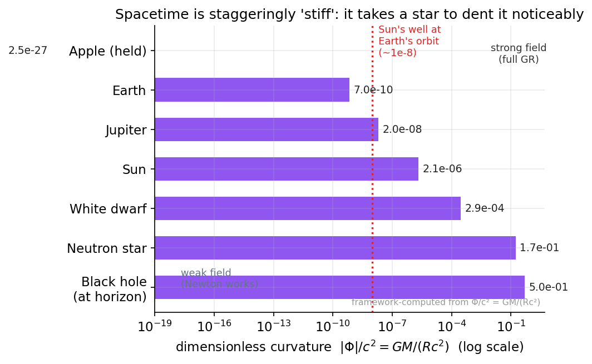
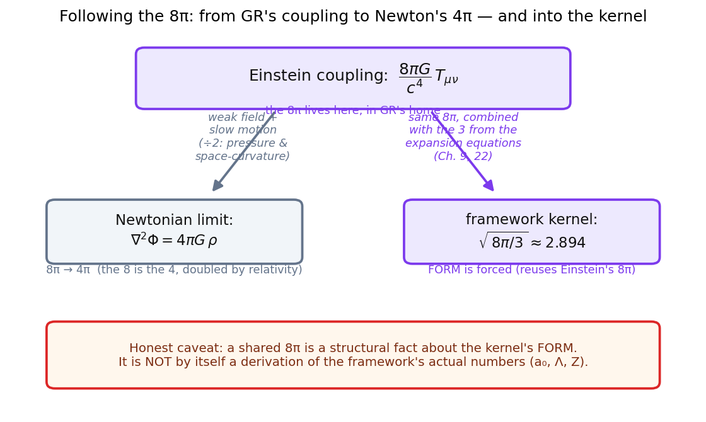
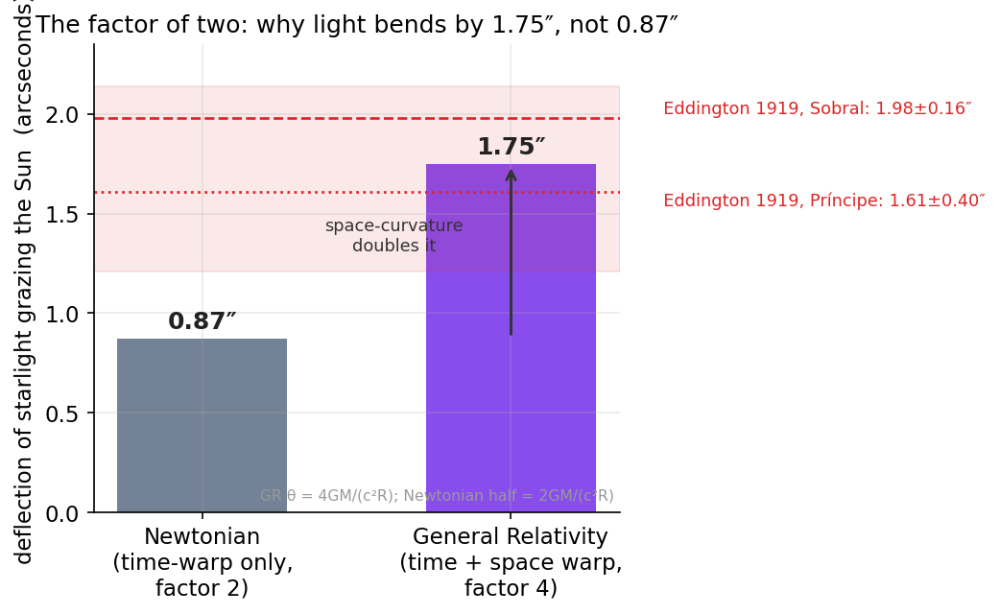

# Chapter 8: The Field Equations: How Matter Tells Spacetime to Curve

> "Spacetime tells matter how to move; matter tells spacetime how to curve." — John Archibald Wheeler

We left Chapter 7 with a beautiful but unfinished picture. Einstein had taught us that gravity is not a force reaching across space, the way Newton imagined, but the *shape* of space and time themselves. A planet orbiting the Sun is not being yanked by an invisible rope; it is rolling along the straightest available path through a landscape that the Sun has bent. The famous trampoline picture — a heavy ball pressing down a stretched rubber sheet, smaller balls curving around it — captures the flavor of it.

But a picture is not a law. The trampoline tells you that mass makes a dent. It does not tell you *how deep* the dent is. It does not tell you whether a kilogram of rock and a kilogram of light make the same dent, or whether the dent from two kilograms is twice as deep or four times as deep or a hundred times as deep. To turn Einstein's beautiful idea into physics — into something you can calculate, test, and possibly prove wrong — you need an equation that says, with numbers, exactly how much curvature a given amount of matter and energy produces.

That equation is the subject of this chapter. It is called the **Einstein field equations** (the plural is traditional — it is really one tensor equation that packs many ordinary equations inside it). It is, by a wide margin, one of the deepest things human beings have ever written down. And tucked inside it is a single, innocent-looking number — the factor 8π — that I am going to ask you to keep an eye on for the rest of this book. That same 8π will walk back onto the stage many chapters from now, in the heart of the framework this book is about. I want you to meet it here, honestly, in its home, long before we ask it to do anything new.

Let me be clear at the outset, as I will try to be everywhere in this book: General Relativity is rock-solid, confirmed physics. It has passed every test thrown at it for over a century. Nothing in the framework I'll describe later overturns it or competes with it. The framework lives *inside* General Relativity's world and borrows its furniture — including, quite literally, this 8π. So this chapter is not controversial. It is the bedrock. Let's lay it carefully.

## A Two-Way Conversation

Wheeler's sentence at the top of this chapter is the best one-line summary of General Relativity ever written, so let me unpack it slowly, because it really is the whole story.

*Spacetime tells matter how to move.* This is the half we met in Chapter 7. Give me a curved spacetime — say, the warped region around the Sun — and the rule for how a freely-falling object moves is simple: it follows the straightest possible path through that curvature. We have a name for "straightest possible path" in a curved space: a **geodesic**. On the flat surface of a table, a geodesic is an ordinary straight line. On the curved surface of the Earth, a geodesic is a great circle — which is why long-distance flights from New York to Tokyo arc up over Alaska instead of going "straight" across on the map. The plane *is* going straight, as straight as the curved Earth allows. A planet orbiting the Sun is doing the same thing: traveling as straight as it can through spacetime that the Sun has curved. There is no force. There is just geometry, and the honest attempt of a moving thing to go straight through it.

*Matter tells spacetime how to curve.* This is the other half, the half we tackle now. The Sun's curvature did not come from nowhere. The Sun — its mass, its energy, its pressure — is what *produces* the curvature in the first place. Pile up matter and energy in a region, and spacetime in and around that region bends in response. Take the matter away, and the bend relaxes back to flat. The field equations are the precise, quantitative statement of this second half: given a particular arrangement of matter and energy, exactly how much, and in exactly what pattern, does spacetime curve?

Notice that this is a genuine *conversation*, a feedback loop, not a one-way command. The Sun curves spacetime; that curvature tells the Earth how to move; but the Earth has mass too, so the Earth also curves spacetime, however slightly, and that curvature tells the Sun how to move (the Sun really does wobble a tiny bit in response to the Earth). Each side is constantly listening and responding to the other. This back-and-forth is what makes the equations so hard to solve exactly — the matter and the geometry are tangled together, each defining the other — and it is also what makes them so alive. Spacetime in General Relativity is not a fixed stage on which the play happens. It is one of the actors.

> **Margin aside.** When Einstein first published the full field equations in November 1915, he was, by his own account, almost overcome — he wrote of palpitations of the heart. He had been chasing the right form for eight years, taking wrong turns, nearly being scooped by the mathematician David Hilbert in the final weeks. The equation we are about to meet is the thing he was chasing.

## What the Equation Says, in Words

Before we look at a single symbol, let me tell you what the field equations say in plain English, because the plain-English version is genuinely understandable and it is most of what a newcomer needs.

The equation has a left-hand side and a right-hand side, joined by an equals sign, and the two sides mean two completely different kinds of thing.

**The left-hand side is geometry.** It is a careful, mathematical description of how curved spacetime is at a given point — not just "curved" in a vague way, but curved in a specific bookkeeping that keeps track of how curvature behaves in every direction and how it changes from place to place. This is the "shape of spacetime" side.

**The right-hand side is stuff.** It is a careful description of all the matter and energy at that point — the mass, yes, but also the energy (because, by E = mc², energy and mass are the same currency), and also the pressure, and the flow of momentum, and the energy carried by light. Everything that has energy or exerts pressure goes on this side. This is the "what's here" side.

The equation simply sets them equal, with a conversion factor in between:

> **curvature of spacetime = (a constant) × (matter and energy present).**

That's it. That is the field equation in words. The geometry on the left is *determined by* the stuff on the right. Wherever there is more energy and pressure, there is more curvature, in lockstep, point by point, throughout the universe.

The "constant" in the middle is the conversion factor between the two sides — between "amount of stuff" and "amount of bending." It has to be there for the same reason any conversion factor has to be there: the two sides are measured in different units, like dollars and euros, or like miles and kilometers. You cannot just say "100 dollars = 100 euros"; you need the exchange rate. The constant in the field equations is the exchange rate between matter-energy and curvature. And as we will see, that exchange rate is set by Newton's gravitational constant G, the speed of light c — and that factor of 8π.

## Why the Coupling Has to Be So Weak (and What That Means)

Here is a question worth pausing on, because the answer tells you something deep about why the universe looks the way it does. The conversion factor between matter and curvature is, in everyday units, *fantastically* small. It takes an enormous amount of matter to make even a tiny amount of curvature. The Sun — a third of a million Earth masses of blazing plasma — bends spacetime so gently that the effect on a passing ray of starlight is to deflect it by less than two thousandths of a degree. The whole Earth, all six thousand billion billion tonnes of it, curves spacetime just enough to make you fall at a leisurely ten meters per second squared.

People sometimes say spacetime is "stiff," and that is exactly the right word. Think of a thick steel beam versus a soft rubber band. Apply the same push to each: the rubber band deforms a lot, the steel beam barely flinches. The steel beam is stiff — it resists being deformed. Spacetime is staggeringly stiffer than the stiffest steel. It takes the mass of a star to dimple it noticeably, and the mass of a galaxy to bend it enough to act as a lens for the light of galaxies behind it.

***Figure 8.1 — How feebly matter dents spacetime.*** The dimensionless curvature $|\Phi|/c^2 = GM/(Rc^2)$ at each object's own surface, on a logarithmic scale spanning eighteen orders of magnitude. Even the entire Sun warps spacetime by only about two parts in a million at its surface (and one part in a hundred million out at Earth's orbit, red marker) — the quantitative meaning of "spacetime is stiff." Only at neutron stars and black-hole horizons does the warp approach order one. Computed directly from the framework's (i.e. General Relativity's) potential formula; masses and radii are standard published constants.

**Source:** Figure generated by [`book/figures/ch08_spacetime_stiffness_ladder.py`](https://github.com/carlzimmerman/zimmerman-formula/blob/main/book/figures/ch08_spacetime_stiffness_ladder.py). Underlying relation is the weak-field potential $\Phi=-GM/r$ of the Einstein field equations in the Newtonian limit; constants $G=6.674\times10^{-11}$ SI, $c=3.00\times10^8$ m/s, $M_\odot=1.989\times10^{30}$ kg as used in the chapter's Worked Example.

The single number that sets this stiffness is the coupling constant on the right-hand side of the field equations. A larger coupling would mean a floppier spacetime — a universe where modest lumps of matter made deep wells, where gravity was violent and grabby, where stars and planets and the slow patient gathering of structure over billions of years might never have had the gentle conditions they needed. A smaller coupling would mean a spacetime so rigid that gravity could barely gather anything at all. The value we actually have — set by G and c and 8π — gives us a universe stiff enough to be calm and orderly, yet yielding enough that gravity, given eons, can build galaxies. We do not get to choose this number; the universe handed it to us. But it is worth appreciating how much rides on it.

I will flag something now and return to it much later in the book. When we get to the framework at the center of this story (Chapter 22 in particular), we will find that *its* central kernel also contains an 8π — the very same 8π that lives here, in the coupling of the field equations, multiplied by the 3 that comes from the expanding-universe equations we'll meet in Chapter 9. That the framework's kernel is forced to wear the same 8π that General Relativity wears is one of the genuinely satisfying things about it — it means the framework is not inventing new furniture, it is reusing Einstein's. But I want to be scrupulous and say the matching thing in the same breath, as I'll do throughout: the appearance of a shared 8π is a structural fact about the *form* of the kernel; it is not, by itself, a derivation of the framework's actual *numbers*. We will spend whole chapters later being careful about exactly which parts of the framework are forced and which are not. For now, just meet the 8π and remember its face.

***Figure 8.3 — Following the 8π.*** A conceptual map of the one number the chapter asks you to watch. The $8\pi$ in the Einstein coupling $8\pi G/c^4$ sheds a factor of two in the Newtonian limit to become Poisson's $4\pi G$ (left branch — "the 8 is the 4, doubled by relativity"), and the *same* $8\pi$, combined with the $3$ from the expanding-universe equations, reappears in the framework's gravitational kernel $\sqrt{8\pi/3}\approx 2.894$ (right branch). Schematic illustrating the relationships discussed in the text; the orange box carries the chapter's explicit caveat that a shared $8\pi$ fixes the kernel's *form*, not the framework's actual numbers.

**Source:** Figure generated by [`book/figures/ch08_8pi_lineage.py`](https://github.com/carlzimmerman/zimmerman-formula/blob/main/book/figures/ch08_8pi_lineage.py). Conceptual content from this chapter (the $8\pi\!\to\!4\pi$ Newtonian-limit chain and the foreshadowed kernel); the kernel $\sqrt{8\pi/3}$ and its quarantine (form forced, numbers not derived) follow the framework's main result, [doi.org/10.5281/zenodo.20721540](https://doi.org/10.5281/zenodo.20721540), and the one-parameter geometry theorem, [doi.org/10.5281/zenodo.20738055](https://doi.org/10.5281/zenodo.20738055).

## The Cosmological Constant: Einstein's Extra Term

There is one more piece to introduce, and it will matter enormously later in this book, so let me bring it in now even though it sat quietly for decades before anyone knew what to do with it.

When Einstein first wrote his field equations, the prevailing assumption — his included — was that the universe was static: not expanding, not contracting, just *there*, eternal and unchanging on the largest scales. But his own equations would not allow it. A universe full of matter, all of it gravitating, all of it attracting all the rest, cannot simply hang there; it must either collapse inward or fly apart. Gravity, left to itself, does not do "static."

So in 1917 Einstein added a single extra term to his equations to hold the universe still — a term that acts like a faint, uniform tension built into spacetime itself, a kind of universal springiness that pushes outward everywhere and exactly cancels the inward pull of matter, balancing the cosmos on a knife's edge. He called the strength of this term the **cosmological constant**, and gave it the Greek letter Λ (lambda). It is, quite simply, a constant amount of "push" or energy that belongs to empty space itself, the same everywhere and at all times.

The story of Λ is one of the great roller-coasters in the history of science, and I will tell it properly in Chapter 11. The short version: the universe turned out *not* to be static — Edwin Hubble showed in 1929 that it is expanding — so Einstein's reason for adding Λ evaporated. He is said to have called it his greatest blunder and dropped it. And then, in 1998, two teams of astronomers discovered that the expansion of the universe is not merely continuing but *speeding up*, as if something is pushing it apart — and the most natural description of that something is precisely a cosmological constant Λ, the energy of empty space, exactly the term Einstein had added and then disowned. The "blunder" came back as the discovery of the century. We now call the energy that Λ represents **dark energy**, and it makes up about 70% of everything there is.

I am foreshadowing hard here, and I'll restrain myself, but you can already see why this matters for our story. The framework this book builds will claim that the everyday acceleration scale governing the spin of galaxies — the number called a₀ that we'll meet in Chapter 17 — is tied directly to this very Λ, to the energy of empty space. That is a claim about a deep link between the largest thing in physics (the dark energy filling the cosmos) and a subtle effect in the rotation of individual galaxies. We are nowhere near ready to evaluate that claim. But the cosmological constant Λ, which enters our story right here as a single extra term in Einstein's equations, is one of the two or three most important characters in the whole book. Greet it warmly. We'll be seeing a great deal of it.

> **Deeper Dive: The Einstein Field Equations in Full**
>
> Here, for the reader who wants it, is the actual equation. In its standard form, including the cosmological constant, it reads:
>
> $$ G_{\mu\nu} + \Lambda g_{\mu\nu} = \frac{8\pi G}{c^4}\, T_{\mu\nu}. $$
>
> Let me name every piece.
>
> The subscripts $\mu$ and $\nu$ each run over the four coordinates of spacetime (one time, three space), so each symbol with two such indices is really a **tensor** — a 4×4 array of components, here symmetric, so it carries ten independent numbers at each point. The equation is therefore a compact way of writing ten coupled equations at once. (The pronunciation, for the curious, is "mew" and "new"; you'll also see them written as Latin $a,b$ in some texts.)
>
> - $g_{\mu\nu}$ is the **metric tensor**, the fundamental object of the whole theory. It encodes distances and times: given two nearby points, $g_{\mu\nu}$ tells you the spacetime interval between them. Everything about the geometry — all the curvature — is built from $g_{\mu\nu}$ and its derivatives. If you know the metric everywhere, you know the spacetime completely.
>
> - $G_{\mu\nu}$ is the **Einstein tensor**. It is the left-hand "geometry" side made precise. It is assembled from the metric by way of the Ricci curvature tensor $R_{\mu\nu}$ and the Ricci scalar $R$ (themselves built from the Riemann curvature tensor, which is the full bookkeeping of curvature):
> $$ G_{\mu\nu} = R_{\mu\nu} - \tfrac{1}{2} R\, g_{\mu\nu}. $$
> The particular combination "Ricci tensor minus one-half Ricci scalar times the metric" is not arbitrary; it is, up to the constants we'll see, the *unique* combination of second derivatives of the metric that is automatically "conserved" in the sense below. Einstein arrived at it after years of false starts precisely because the conservation property forced his hand.
>
> - $T_{\mu\nu}$ is the **stress–energy tensor** (also called the energy–momentum tensor). It is the right-hand "stuff" side made precise. Its components encode energy density (the $T_{00}$ component), momentum density and energy flux (the time–space components), and pressure and internal stresses (the space–space components). For a simple cloud of matter with density $\rho$ and pressure $p$ — a "perfect fluid" — it takes the form $T_{\mu\nu} = (\rho c^2 + p)\,u_\mu u_\nu + p\, g_{\mu\nu}$, where $u_\mu$ is the four-velocity of the fluid. The crucial physical point: it is not mass alone that gravitates, but energy *and* pressure together. Pressure curves spacetime too. This is why, in a collapsing star, the very pressure that fights the collapse also adds to the gravity driving it — a feedback that helps make black holes inevitable.
>
> - $\Lambda$ is the **cosmological constant**, and the term $\Lambda g_{\mu\nu}$ contributes a curvature proportional to the metric itself — a uniform background curvature present even in empty space. Moved to the right-hand side, it acts exactly like a stress–energy with energy density $\rho_\Lambda c^2 = \Lambda c^4 / 8\pi G$ and a *negative* pressure $p_\Lambda = -\rho_\Lambda c^2$ equal in magnitude. That negative pressure (tension) is what drives accelerating expansion. We will use this dark-energy density $\rho_\Lambda$ — equivalently $\rho_{\rm DE}$ — directly when we build the framework's a₀; hold onto it.
>
> - $\frac{8\pi G}{c^4}$ is the **coupling constant**, the "exchange rate" of the main text. Here $G = 6.674\times 10^{-11}\,\mathrm{m^3\,kg^{-1}\,s^{-2}}$ is Newton's gravitational constant and $c$ is the speed of light. Because $c^4$ is an astronomically large number ($\sim 8\times 10^{33}\,\mathrm{m^4\,s^{-4}}$ in SI), the coupling $8\pi G/c^4 \approx 2\times 10^{-43}$ in SI units is fantastically small — this is the quantitative meaning of "spacetime is stiff." The factor $8\pi$ is the one I keep asking you to watch. It is not a free choice; it is fixed by demanding that the equations reduce to Newton's law of gravity in the everyday, weak-field limit (we derive this just below). Strip away the $8\pi$ and you would not recover the gravity we measure dropping apples.

> **Deeper Dive: Why ∇·T = 0, and Why That Forced Einstein's Hand**
>
> One of the most elegant features of the field equations is that the conservation of energy and momentum is not an extra assumption bolted on — it falls out automatically from the geometry.
>
> The Einstein tensor obeys a mathematical identity, a consequence of the **Bianchi identities** of differential geometry:
> $$ \nabla_\mu G^{\mu\nu} = 0, $$
> where $\nabla_\mu$ is the covariant derivative (the proper way to differentiate in curved space). The cosmological-constant term shares this property, since the metric is covariantly constant, $\nabla_\mu g^{\mu\nu}=0$. Therefore, taking the divergence of *both* sides of the full field equation, the left-hand side vanishes identically — and so the right-hand side must too:
> $$ \nabla_\mu T^{\mu\nu} = 0. $$
> This is the curved-space statement of **local conservation of energy and momentum**. It says energy and momentum can flow from place to place, but cannot be created or destroyed. The remarkable thing is the direction of the logic: geometry *demands* it. Einstein could not have written a consistent theory in which energy was not conserved even if he had wanted to — the Bianchi identity on the left side forbids it. This is part of why the particular combination $R_{\mu\nu} - \tfrac12 R\, g_{\mu\nu}$ is forced. Any other combination of curvature terms would have failed to be automatically conserved, and the matter on the right would have had nowhere consistent to go.
>
> A note for later honesty: this conservation law, $\nabla_\mu T^{\mu\nu} = 0$, is exactly the kind of consistency requirement that any *modification* of gravity must respect. When in Part 5 we discuss building a covariant version of the framework, requirements like this one — together with the absence of ghosts and the speed of gravitational waves equaling $c$ — are precisely the walls that make the job hard and that forbid certain things outright (the lensing no-go theorem of Chapter 28 is one such wall). The field equations are not just the law we're learning; they're the rulebook every rival has to play by.

## Coming Back to Earth: The Newtonian Limit

A new and more general theory has a duty: it must reproduce the old, tested theory in the situations where the old theory worked. Newton's law of gravity is fabulously accurate for falling apples, for the orbits of planets, for sending spacecraft to the outer Solar System. So Einstein's far grander theory must, when conditions are gentle — weak gravity, slow speeds — quietly collapse back into Newton's familiar law. If it didn't, we'd know it was wrong, because we'd have caught it disagreeing with three centuries of impeccable measurement.

It does collapse back, and watching it do so is one of the best ways to see where the 8π comes from and what it's for. The destination of this collapse is an equation called the **Poisson equation**, named for the French mathematician Siméon Denis Poisson, which is the compact, grown-up form of Newtonian gravity. In words, the Poisson equation says: *the way the gravitational field tightens up around a point is proportional to the density of matter at that point.* Where matter is piled up, the gravitational potential dips into a well; the Poisson equation says exactly how steep-walled that well is for a given pile of matter — and the constant relating the two is $4\pi G$.

So here is the lovely thing. General Relativity's coupling carries an $8\pi G$. Newtonian gravity's coupling carries a $4\pi G$. The factor of two between them is not sloppiness; it is real physics — it comes from the fact that in Einstein's theory *pressure gravitates too*, and from how the time-and-space parts of the curvature combine in the slow-motion limit. The 8π in the field equations is precisely the number that makes everything land on Newton's $4\pi G$ when the dust settles. The two π's are the same π. The 8 is the 4, doubled by relativity. This is the chain of reasoning that *forces* the 8π to be 8π and not, say, 6π or 10π. It is a measured, derived, non-negotiable fact about gravity. I dwell on it because the very same π — and an echo of this same kind of geometric bookkeeping — reappears, much later and in a new role, inside the framework's kernel $\sqrt{8\pi/3}$. Meeting the 8π here, in its rigorous home, is the best preparation for recognizing it when it returns.

> **Deeper Dive: From G_μν to ∇²Φ = 4πGρ**
>
> Let us take the weak-field, slow-motion limit explicitly. "Weak field" means the metric is close to flat: $g_{\mu\nu} = \eta_{\mu\nu} + h_{\mu\nu}$ with $|h_{\mu\nu}| \ll 1$, where $\eta_{\mu\nu}$ is the flat Minkowski metric. "Slow motion" means all velocities are small compared to $c$, so time derivatives are negligible next to space derivatives, and the matter is non-relativistic so its pressure $p \ll \rho c^2$ and its energy density is dominated by rest mass, $T_{00} \approx \rho c^2$.
>
> In this regime the relevant piece of the metric perturbation is the time–time component, which connects to the Newtonian gravitational potential $\Phi$ by
> $$ g_{00} \approx -\left(1 + \frac{2\Phi}{c^2}\right), \qquad \text{i.e.}\quad h_{00} \approx -\frac{2\Phi}{c^2}. $$
> (The sign convention varies between textbooks; the physics does not.) Working through the linearized Einstein tensor, the $00$-component of the field equation $G_{00} = \frac{8\pi G}{c^4} T_{00}$ reduces, after the dust of index gymnastics settles, to
> $$ \nabla^2 \Phi = 4\pi G \rho. $$
> This is **Poisson's equation**, the field form of Newtonian gravity, with $\nabla^2 = \partial_x^2 + \partial_y^2 + \partial_z^2$ the Laplacian. Two things deserve comment.
>
> First, the factor: the $8\pi$ on the right of Einstein's equation has become a $4\pi$ on the right of Poisson's. The factor of two is shed in the limit because, when you carefully assemble $G_{00}$ from the Ricci tensor in the static weak field, the trace-reversal (the $-\tfrac12 R\, g_{\mu\nu}$ piece) combines the relevant curvature components so that the effective source is *half* the naive value — equivalently, in the full theory both energy density and pressure source the curvature, and accounting for that correctly is what turns $8\pi$ into the observed Newtonian $4\pi$. The agreement is not approximate luck; it is how the value of the coupling was *fixed* in the first place. Einstein chose $8\pi G/c^4$ for no other reason than that it lands on the measured $4\pi G$ of Newton here.
>
> Second, the Cosmological constant: keeping $\Lambda$ in the weak-field limit modifies Poisson's equation to $\nabla^2 \Phi = 4\pi G \rho - \Lambda c^2$, adding a tiny uniform repulsion. On Solar-System and galactic scales this $\Lambda$ term is utterly negligible for the *potential* — and that is worth flagging now, because it is a genuine puzzle the framework will have to confront head-on. If $\Lambda$ enters Newtonian gravity only as this microscopically tiny additive repulsion, how could it possibly set a galaxy-scale acceleration like a₀? The honest answer, which we'll build toward in Part 5, is that the framework does *not* route $\Lambda$ in through this term; it routes it in through a completely different door — the temperature of empty space and the nature of inertia (Chapters 14, 15, 21). Whether that door is the right one is exactly what is unproven and being tested. I point out the puzzle here so you'll know, when we get there, that we did not sweep it under the rug.

> **Worked Example: How Deep Is the Sun's Dent?**
>
> Let's make the coupling concrete by computing something you can feel: the depth of the Sun's gravitational "well" at the Earth's distance, and the related bending of starlight that confirmed General Relativity in 1919.
>
> **Step 1 — The potential well.** The Newtonian potential of the Sun at distance $r$ is $\Phi = -GM_\odot / r$, which we can trust because we are in the weak-field limit just derived. Put in numbers: $G = 6.674\times10^{-11}\,\mathrm{m^3\,kg^{-1}\,s^{-2}}$, the Sun's mass $M_\odot = 1.989\times10^{30}\,\mathrm{kg}$, and the Earth–Sun distance $r = 1.496\times10^{11}\,\mathrm{m}$.
> $$ \Phi = -\frac{(6.674\times10^{-11})(1.989\times10^{30})}{1.496\times10^{11}} \approx -8.87\times10^{8}\ \mathrm{m^2/s^2}. $$
>
> **Step 2 — Put it in dimensionless terms.** The natural measure of "how curved" is the dimensionless ratio $\Phi/c^2$, which is essentially the fractional warp of time itself (clocks tick slow by roughly this factor in the well). With $c = 3.00\times10^{8}\,\mathrm{m/s}$, so $c^2 = 9.0\times10^{16}\,\mathrm{m^2/s^2}$:
> $$ \frac{|\Phi|}{c^2} \approx \frac{8.87\times10^{8}}{9.0\times10^{16}} \approx 9.9\times10^{-9}. $$
> About one part in a hundred million. That is how feebly the entire Sun curves spacetime out here. "Stiff" was not an exaggeration. A clock at Earth's orbit runs fast compared to one at the Sun's surface by a comparable tiny fraction — small, but real, and routinely accounted for in precision physics.
>
> **Step 3 — The bending of light.** General Relativity predicts that a light ray grazing the Sun's surface is deflected by an angle $\theta = \dfrac{4GM_\odot}{c^2 R_\odot}$, where $R_\odot = 6.96\times10^{8}\,\mathrm{m}$ is the Sun's radius. (Note the factor 4: a careful relativistic calculation gives *twice* the naive Newtonian "falling photon" estimate, because in the bending of light *both* the warping of time and the warping of space contribute equally — another place where remembering that space-curvature pulls its weight matters.) Compute:
> $$ \theta = \frac{4(6.674\times10^{-11})(1.989\times10^{30})}{(9.0\times10^{16})(6.96\times10^{8})} \approx 8.5\times10^{-6}\ \mathrm{radians}. $$
> Converting radians to arcseconds (multiply by $206{,}265$):
> $$ \theta \approx 8.5\times10^{-6} \times 206{,}265 \approx 1.75\ \mathrm{arcseconds}. $$
>
> **Step 4 — What it meant.** That 1.75 arcseconds — less than one two-thousandth of a degree, the width of a small coin seen from a couple of kilometers away — is exactly what Arthur Eddington's expeditions measured during the total solar eclipse of May 1919, by photographing stars near the eclipsed Sun and finding their apparent positions shifted by just this amount. The Newtonian half-value (0.87 arcseconds) was ruled out; Einstein's full value held. It made Einstein world-famous overnight. And it is a clean illustration of the chapter's theme: a definite amount of matter (the Sun) produces a definite, calculable amount of curvature (the deflection), with the constant $G/c^2$ — cousin to our $8\pi G/c^4$ — setting the conversion. The factor-of-2 between the Newtonian and relativistic answers is the same kind of "space-curvature and pressure pull their weight" bookkeeping that turns the field equation's $8\pi$ into Newton's $4\pi$. Once you have seen it bend light by 1.75 arcseconds, you trust the 8π.

***Figure 8.2 — The factor of two, made visible.*** The deflection of starlight grazing the Sun: the Newtonian "falling photon" estimate (0.87″, time-warp only) versus the full relativistic value (1.75″, time *and* space curvature each pulling their weight). The purple bar is computed from $\theta = 4GM_\odot/(c^2 R_\odot)$, the grey from the factor-2 Newtonian version. The red band shows Arthur Eddington's actual 1919 eclipse measurements, which ruled out the half-value and confirmed Einstein's — the same kind of factor-of-two bookkeeping that turns the field equation's $8\pi$ into Newton's $4\pi$.

**Source:** Figure generated by [`book/figures/ch08_light_bending_factor_two.py`](https://github.com/carlzimmerman/zimmerman-formula/blob/main/book/figures/ch08_light_bending_factor_two.py). The bending formula and the 1.75″/0.87″ values are from the chapter's Worked Example (Step 3); the 1919 eclipse measurements (Sobral 1.98±0.16″, Príncipe 1.61±0.40″) are the historical results of the Eddington expeditions, Dyson, Eddington & Davidson 1920.

## A Quiet Word About What This Buys Us — and What It Doesn't

I want to close the conceptual thread by being honest about scope, because honesty about scope is the whole spirit of this book.

The field equations are spectacularly successful. They predicted the bending of starlight (1919), the slow precession of Mercury's orbit (which Newton's gravity got slightly wrong and which Einstein's got exactly right), the slowing of clocks in gravity (confirmed to extraordinary precision, and corrected for in the GPS in your phone every second of every day), the existence of black holes (now photographed), and gravitational waves — ripples in spacetime itself from colliding black holes, predicted in 1916 and directly detected in 2015, a century later, exactly as the equations said. By any reasonable standard, this is the most successful physical theory ever devised. When this book later proposes a new idea, that idea has to live *inside* this success, not outside it. General Relativity is not the thing we are questioning.

And yet — both ways, always both ways — the field equations do not, by themselves, tell us everything. They tell us how a given amount of matter and energy curves spacetime. They do *not* tell us *what* matter and energy there is. You have to *put the stuff in by hand* on the right-hand side — you have to know what $T_{\mu\nu}$ is before the equations can tell you the geometry. And here is exactly where the mystery of the previous chapters comes roaring back. When we look at galaxies and clusters and apply these magnificent, trustworthy equations, the curvature we *measure* (from how things orbit, from how light bends) is far more than the curvature the *visible* matter on the right-hand side can produce. The equations are not in doubt. The trouble is the right-hand side: either there is matter there we cannot see (the dark-matter answer, Chapters 5–6), or our recipe for what goes on the right-hand side, or for how inertia responds, is incomplete in the regime of very weak gravity (the modified-dynamics answer, Chapters 5 and 17 onward). The field equations themselves are agnostic. They will faithfully tell you the curvature of *whatever* $T_{\mu\nu}$ you hand them. They will not tell you whether you handed them the right $T_{\mu\nu}$.

That is the crack through which our whole story enters. The framework this book builds does not touch the left-hand side of Einstein's equation. It does not propose a new geometry. What it proposes, in the end, is a subtle statement about inertia and the temperature of empty space — about how matter *responds* — that shows up, in the weak-field galactic regime, as an apparent extra contribution, and it ties the scale of that contribution to the cosmological constant Λ that we met in this chapter sitting quietly on the left. Is that proposal right? We do not know yet. It is one independent researcher's idea, facing a skeptical and overwhelmingly particle-dark-matter-favoring mainstream, and it is — as I will say many times and mean every time — not a theory of everything yet, as frustrating as it may be. But you now hold the two characters it needs: the 8π that sets the strength of gravity, and the Λ that fills empty space. Keep both in view. We'll need them.

## Summary

- General Relativity is a **two-way conversation** (Wheeler): matter and energy tell spacetime how to curve; spacetime tells matter how to move along the straightest available paths (**geodesics**). The two halves form a feedback loop, which is why spacetime is an actor in the play, not just the stage.
- The **Einstein field equations** make the "matter curves spacetime" half precise: *curvature of spacetime = (a constant) × (matter and energy present)*. The left side is geometry (the **Einstein tensor** $G_{\mu\nu}$, built from the metric); the right side is the matter-and-energy content (the stress–energy tensor $T_{\mu\nu}$, which includes energy *and pressure*, not just mass).
- The full equation is $G_{\mu\nu} + \Lambda g_{\mu\nu} = \frac{8\pi G}{c^4} T_{\mu\nu}$.
- The **coupling constant** $8\pi G/c^4$ is the "exchange rate" between matter and curvature. It is fantastically small, which is why spacetime is so **stiff** — it takes a star to dent it noticeably. A single number sets that stiffness.
- The factor **8π** is not arbitrary: it is fixed by requiring that the equations reduce, in the weak-field, slow-motion **Newtonian limit**, to **Poisson's equation** $\nabla^2\Phi = 4\pi G\rho$. The 8π becomes Newton's 4π once relativity's extra effects (pressure and space-curvature pulling their weight) are accounted for. *This is the same 8π — combined later with a 3 from the expanding-universe equations — that will reappear in the framework's gravitational kernel $\sqrt{8\pi/3}$ in Chapter 22; meeting it here, rigorously, is the point.*
- Energy–momentum conservation $\nabla_\mu T^{\mu\nu} = 0$ is **forced by geometry** (the Bianchi identities), not assumed — and the same consistency requirements (conservation, no ghosts, light-speed gravity waves) are the walls every modification of gravity, including the framework, must respect.
- The **cosmological constant** Λ enters as a single extra term on the geometry side, representing the energy of empty space. Einstein added it (1917) to keep the universe static, called it a blunder when expansion was discovered, and saw it return triumphantly in 1998 as **dark energy** (Chapter 11). Λ is one of the central characters of this book; the framework will tie the galactic acceleration scale a₀ to it.
- The field equations are the most tested theory in physics and are not in doubt. But they only tell you the curvature of *whatever* $T_{\mu\nu}$ you supply. The missing-mass problem lives entirely on the *right-hand side* — either unseen matter, or an incomplete recipe for the matter/inertia response. That crack is where our whole story enters. It is not a theory of everything yet, as frustrating as it may be.

## Questions

1. **(Easy.)** In your own words, explain Wheeler's sentence "spacetime tells matter how to move; matter tells spacetime how to curve." Which half does the Einstein field equation make precise, and which half is the geodesic rule from Chapter 7?

2. **(Easy/intermediate.)** The chapter says spacetime is "stiff." Using the Worked Example, state roughly how curved (in dimensionless $|\Phi|/c^2$ terms) the Sun makes spacetime at Earth's orbit, and explain in words why such a small number means gravity is weak even though the Sun is enormous.

3. **(Intermediate.)** The coupling in Einstein's equation is $8\pi G/c^4$, but the coupling in Newton's (Poisson) equation is $4\pi G$. Where does the factor of two go in the Newtonian limit, and why is it physically meaningful rather than a mistake? (Hint: think about what gravitates in Einstein's theory besides rest mass, and about the bending-of-light factor of 4 versus 2.)

4. **(Intermediate.)** Show that the cosmological-constant term can be moved to the right-hand side and reinterpreted as a stress–energy with energy density $\rho_\Lambda c^2 = \Lambda c^4/8\pi G$ and pressure $p_\Lambda = -\rho_\Lambda c^2$. Why does a *negative* pressure produce *repulsive* gravity (accelerating expansion) rather than attractive? (You may use the result, to be developed in Chapter 9, that the gravitating combination in cosmology is $\rho c^2 + 3p$.)

5. **(Advanced.)** Explain why the conservation law $\nabla_\mu T^{\mu\nu} = 0$ is a *consequence* of the field equations rather than an independent assumption, and trace it back to the Bianchi identity $\nabla_\mu G^{\mu\nu}=0$. Why did this property essentially force Einstein to choose the particular combination $R_{\mu\nu} - \tfrac12 R\, g_{\mu\nu}$ over other candidate curvature tensors?

6. **(Research-level / open.)** The chapter flags a genuine puzzle: in the Newtonian limit, Λ enters the potential only as a microscopically tiny additive repulsion $\nabla^2\Phi = 4\pi G\rho - \Lambda c^2$, far too small to set a galaxy-scale acceleration. Yet the framework of Part 5 claims the galactic scale a₀ is tied to Λ. Sketch, in qualitative terms, why routing Λ in through the *temperature of empty space and the nature of inertia* (a different "door," Chapters 14–15, 21) is not obviously ruled out by this Newtonian-limit smallness — and identify what would have to be true for that alternative door to actually work. (This is, in fact, close to the open question the framework lives or dies by; there is no settled answer.)
