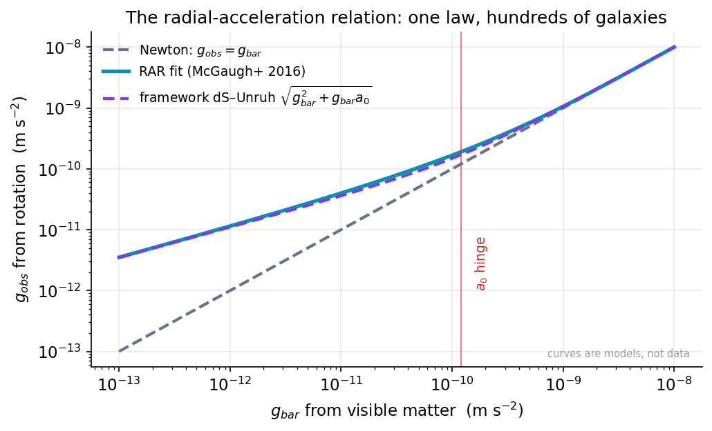
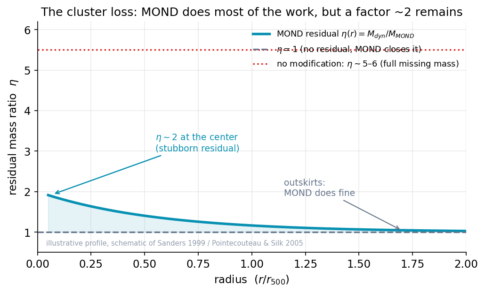
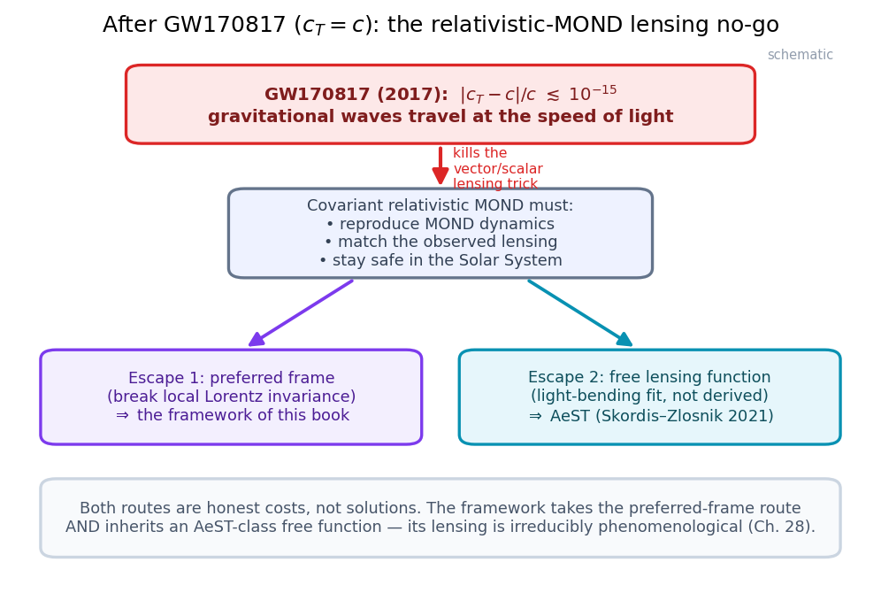

# Chapter 19: What MOND Gets Right — and Its Real Problems

> *A good scientist keeps two columns. One is headed "wins." The other is headed "losses." The honest ones do not let the first column hide the second.*

In the last two chapters we met Milgrom's idea — that below a tiny acceleration scale, $a_0 \approx 1.2 \times 10^{-10}\ \mathrm{m/s^2}$, the familiar rules of motion change — and we met the two great regularities it predicts: the radial-acceleration relation (RAR) and the baryonic Tully–Fisher relation (BTFR). Both are real, both are tight, and both fall out of MOND with almost no wiggle room. If that were the whole story, this would be a short and triumphant chapter.

It is not the whole story. MOND is one of the most successful *and* one of the most troubled ideas in modern astrophysics, and it manages to be both at the same time. It nails individual galaxies with a confidence that genuinely embarrasses the dark-matter picture. And it stumbles — sometimes badly — when you take it to galaxy clusters, when you ask it to bend light, and when you ask it to reproduce the infant universe seen in the cosmic microwave background.

This chapter is a scorecard. We are going to lay the wins and the losses side by side, in the same breath, without flinching at either column. We do this for two reasons. First, because it is simply the honest thing to do, and honesty is the whole spirit of this book. Second — and this matters for what comes later — because the framework at the heart of this book is *a member of the MOND family*. It inherits some of these wins. It inherits some of these losses. And in Part VI, when we put the framework on trial, I am going to hold it to exactly the standard we are about to set here for MOND. If I let MOND off easy now, I would have to let the framework off easy later, and that would make this book worthless to you. So let us be fair, and let us be tough, in equal measure.

## A reminder of the playing field

Before the scorecard, one quick orientation, because the rest of the chapter leans on it.

Every system we look at — a single galaxy, a cluster of galaxies, the whole cosmos — has a characteristic acceleration. For a star circling a galaxy, the acceleration is roughly $v^2/r$, the same centripetal pull you feel on a merry-go-round, where $v$ is the star's orbital speed and $r$ its distance from the center. The question MOND asks of every system is simple: **is the acceleration here above or below $a_0$?**

- **Above $a_0$** (the "high-acceleration" regime): the inner parts of galaxies, the Solar System, anywhere gravity is strong. Here MOND says gravity behaves exactly as Newton and Einstein described. Nothing changes. This is why MOND does not blow up the Solar System — a point we will return to, because it matters enormously for the framework.
- **Below $a_0$** (the "deep-MOND" or "low-acceleration" regime): the outskirts of galaxies, the faint dwarf galaxies, the tenuous gas far from any center. Here MOND says the effective gravity is *stronger* than Newton would predict from the visible matter alone. This extra pull is what, in the dark-matter picture, we would attribute to a halo of invisible particles.

The number $a_0$ is the hinge. Everything in MOND turns on which side of it you are standing. Keep that picture in your head — above and below a single threshold — and the scorecard will read cleanly.

## The wins: galaxies, almost for free

Let us start with the column that makes MOND impossible to dismiss.

### One law, hundreds of galaxies, no per-galaxy tuning

Here is the thing that should give any honest scientist pause. Take the SPARC database — a catalog of about 175 disk galaxies with carefully measured rotation curves and infrared photometry that traces their stellar mass. These galaxies span more than five orders of magnitude in mass, from tiny gas-rich dwarfs to giant spirals. They have wildly different shapes, sizes, gas fractions, and histories.

Now feed each galaxy's *visible* matter — stars and gas, nothing else — into the MOND formula. Out comes a prediction for the rotation curve: how fast things should orbit at every radius. For galaxy after galaxy, that prediction lands on the measured curve. Not approximately. Not on average. *Curve by curve*, including the little bumps and wiggles where a spiral arm or a ring of gas locally piles up matter — a phenomenon astronomers call **Renzo's rule**: every feature in the visible matter has a corresponding feature in the rotation curve.

And it does this with essentially **one free number per galaxy** — the stellar mass-to-light ratio, which tells you how much stellar mass corresponds to the light you see. That ratio is not even really free; it is pinned down within a narrow range by stellar-population models, and the value MOND prefers agrees with what those independent models say it should be. There is no per-galaxy dark-halo profile to tune, no concentration parameter, no halo mass to dial in.

Contrast that with the dark-matter picture. To fit the same galaxies, the standard approach gives each one its own dark halo, with (at least) a characteristic density and a characteristic radius — two or more free numbers per galaxy that you adjust until the fit works. The fits are good, but they are *fits*. MOND doesn't fit; it *predicts*. That distinction — predicting versus fitting — is the heart of why MOND refuses to die.

> **Deeper Dive: the algebraic MOND relation and the RAR**
>
> The cleanest statement of the galaxy-scale success is the radial-acceleration relation. Define two accelerations at each radius $r$ in a galaxy:
> $$g_{\mathrm{bar}}(r) = \frac{G\,M_{\mathrm{bar}}(<r)}{r^2}, \qquad g_{\mathrm{obs}}(r) = \frac{v_{\mathrm{obs}}^2(r)}{r},$$
> where $g_{\mathrm{bar}}$ is the Newtonian acceleration from the *baryons* (stars + gas) enclosed within $r$, and $g_{\mathrm{obs}}$ is the actual centripetal acceleration inferred from the measured circular speed $v_{\mathrm{obs}}$.
>
> Empirically (McGaugh, Lelli & Schombert 2016, on ∼2700 data points from SPARC), these two are locked together by a one-parameter relation,
> $$g_{\mathrm{obs}} = \frac{g_{\mathrm{bar}}}{1 - e^{-\sqrt{g_{\mathrm{bar}}/g_\dagger}}},$$
> with a single scale $g_\dagger \approx 1.2 \times 10^{-10}\ \mathrm{m/s^2}$ — numerically $a_0$ — and an *orthogonal* scatter of only about 0.13 dex, much of which is consistent with observational error. The two limits are the whole of MOND:
> $$g_{\mathrm{obs}} \to g_{\mathrm{bar}} \quad (g_{\mathrm{bar}} \gg a_0, \ \text{Newtonian}), \qquad g_{\mathrm{obs}} \to \sqrt{g_{\mathrm{bar}}\, a_0} \quad (g_{\mathrm{bar}} \ll a_0, \ \text{deep-MOND}).$$
>
> The algebraic ("modified-gravity-flavored") version of MOND writes this with an *interpolating function* $\mu(x)$:
> $$\mu\!\left(\frac{g}{a_0}\right) g = g_{\mathrm{bar}}, \qquad \mu(x) \to 1 \ (x \gg 1), \quad \mu(x) \to x \ (x \ll 1),$$
> where $g$ is the true acceleration. A common choice is the "simple" function $\mu(x) = x/(1+x)$. The framework of this book will use its *own* interpolation, motivated by the de Sitter–Unruh temperature rather than chosen by hand — $g_{\mathrm{obs}} = \sqrt{g_{\mathrm{bar}}^2 + g_{\mathrm{bar}}\, a_0}$ — and we will be scrupulous in Part V about judging the framework on *that* curve, not on someone else's, because the apparent best-fit value of $a_0$ depends on which interpolation you assume. A word of honest caution that will matter later: the RAR is a triumph *of the whole MOND family*, the framework included, but the precise numerical value of $a_0$ you extract from it is mildly degenerate with your choice of interpolating function and stellar mass-to-light ratio. We will not let anyone — friend or foe of the framework — over-read that number.

***Figure 19.1 — The radial-acceleration relation, MOND's central galaxy-scale win.*** Above the hinge $a_0\approx1.2\times10^{-10}\,\mathrm{m/s^2}$ both curves track Newton's one-to-one line; below it they bend upward to the deep-MOND $\sqrt{g_{bar}\,a_0}$ form. The teal curve is the published RAR fitting function plotted as a model; the purple curve is computed from the framework's own de Sitter–Unruh interpolation $g_{obs}=\sqrt{g_{bar}^2+g_{bar}a_0}$ — they nearly coincide, which is exactly the chapter's point that this win is *shared* across the MOND family. No observational data are plotted.

**Source:** Figure generated by [`book/figures/ch19_rar.py`](https://github.com/carlzimmerman/zimmerman-formula/blob/main/book/figures/ch19_rar.py). RAR fitting function: McGaugh, Lelli & Schombert 2016, PRL 117, 201101 (arXiv:1609.05917), on SPARC (Lelli, McGaugh & Schombert 2016, AJ 152, 157). Framework interpolation: the spine paper, https://doi.org/10.5281/zenodo.20721540.

> **Worked Example: predicting a flat rotation speed from baryons alone**
>
> Let me show you the single most famous MOND prediction, done slowly, on a made-up but realistic galaxy.
>
> Suppose a spiral galaxy has a total baryonic mass (stars plus gas) of $M_{\mathrm{bar}} = 5 \times 10^{10}\ M_\odot$. In SI units, with $M_\odot = 2.0 \times 10^{30}\ \mathrm{kg}$, that is
> $$M_{\mathrm{bar}} = 5 \times 10^{10} \times 2.0 \times 10^{30} = 1.0 \times 10^{41}\ \mathrm{kg}.$$
>
> Far out in the galaxy, beyond where most of the mass lives, the enclosed mass stops growing, and the Newtonian acceleration from the baryons falls off as $g_{\mathrm{bar}} = GM_{\mathrm{bar}}/r^2$. Out there $g_{\mathrm{bar}} \ll a_0$, so we are deep in the MOND regime, where
> $$g_{\mathrm{obs}} = \sqrt{g_{\mathrm{bar}}\, a_0} = \sqrt{\frac{G M_{\mathrm{bar}}}{r^2}\, a_0} = \frac{\sqrt{G M_{\mathrm{bar}}\, a_0}}{r}.$$
>
> Now set this equal to the centripetal acceleration of a circular orbit, $g_{\mathrm{obs}} = v^2 / r$:
> $$\frac{v^2}{r} = \frac{\sqrt{G M_{\mathrm{bar}}\, a_0}}{r}.$$
>
> Look what happens: the radius $r$ cancels on both sides. The orbital speed no longer depends on how far out you go —
> $$v^4 = G\, M_{\mathrm{bar}}\, a_0.$$
> **This is a flat rotation curve, predicted from scratch.** And it is exactly the baryonic Tully–Fisher relation from Chapter 18: $v^4 \propto M_{\mathrm{bar}}$.
>
> Let us put numbers in. Using $G = 6.67 \times 10^{-11}\ \mathrm{N\,m^2/kg^2}$ and $a_0 = 1.2 \times 10^{-10}\ \mathrm{m/s^2}$:
> $$v^4 = (6.67 \times 10^{-11})(1.0 \times 10^{41})(1.2 \times 10^{-10}) = 8.0 \times 10^{20}\ \mathrm{m^4/s^4}.$$
> Taking the fourth root,
> $$v = (8.0 \times 10^{20})^{1/4} \approx 1.7 \times 10^{5}\ \mathrm{m/s} = 170\ \mathrm{km/s}.$$
>
> A flat rotation speed of about 170 km/s for a $5 \times 10^{10}\,M_\odot$ galaxy — which is squarely what real galaxies of that mass actually show. We never mentioned dark matter. We never tuned a halo. We used the visible mass and one universal constant, and the right answer fell out. *That* is why people take MOND seriously, and you should feel the force of it before we start tearing into the losses.

### The successes are deep, not cosmetic

It is worth dwelling for a moment on *why* these wins are impressive, because it is easy to wave them away as "MOND was designed to fit rotation curves." It was not, quite. Milgrom wrote down his rule in 1983 to explain flat rotation curves — but the BTFR, Renzo's rule, the tightness of the RAR, and the success on low-surface-brightness and dwarf galaxies (systems Milgrom had no data on in 1983) were *predictions* that came true afterward. A good scientific idea is one that keeps being right about things it was not built to explain. By that test, MOND scores well at galaxy scales. Honestly, remarkably well.

### A distinctive fingerprint: the external field effect

There is one more galaxy-scale point in the "wins" column, and it is subtle and important, because it is the one prediction that is genuinely *unique* to a MOND-style theory — no dark-matter model makes it. It is called the **external field effect (EFE)**: the idea that the internal dynamics of a small system can be altered just by *sitting inside* the gravitational field of a bigger one, even when that bigger field is perfectly uniform across the small system.

In Newtonian gravity, a uniform external field does *nothing* to a system's internal motions. Stand in an elevator accelerating smoothly upward and play catch — the ball arcs exactly as it would on the ground, because you and the ball and the floor all share the same acceleration. This is the equivalence principle from Chapter 7, and it is sacred in Newton and Einstein. A constant external pull simply cannot be felt from inside.

MOND breaks this — and on purpose, in a particular way. Because the MOND rule depends *nonlinearly* on the total acceleration (remember that $\mu(x)$ function), a small galaxy that would be deep in the MOND regime *on its own* can be pushed back toward Newtonian behavior if it happens to be falling through the strong field of a large neighbor. The external field "switches off" the MOND boost. A dwarf galaxy orbiting near a giant should therefore behave more Newtonian — show less of a mass discrepancy — than an identical dwarf out in isolation.

This is a falsifiable, distinctive signature, and there are tantalizing observational hints of it in the velocity dispersions of dwarf galaxies and in the outskirts of wide stellar systems. I will be honest with you: the observational status of the EFE is still genuinely contested — some claimed detections have been challenged, sign conventions have tripped people up (including, I will admit, in my own working notes), and it is hard to measure cleanly. But the EFE matters for this book for a specific reason. It is a property of *modified dynamics*, and exactly *how* it shows up depends on whether you modify the **force** (modified-gravity MOND) or the **inertia** (modified-inertia MOND). The framework in this book is a modified-*inertia* theory, and that choice changes the EFE's character in ways we will examine in Part V and Part VI. File the EFE away; it will come back as one of the sharpest tools for telling theories apart.

> **Deeper Dive: the EFE and the breaking of the strong equivalence principle**
>
> In an algebraic modified-gravity MOND, the EFE enters because the equation for the potential,
> $$\nabla \cdot \left[ \mu\!\left(\frac{|\nabla\Phi|}{a_0}\right)\nabla\Phi \right] = 4\pi G\, \rho,$$
> is nonlinear in $\nabla\Phi$. For a subsystem with internal field $g_{\mathrm{in}}$ embedded in a uniform external field $g_{\mathrm{ext}}$, the relevant argument of $\mu$ is $|\,\mathbf{g}_{\mathrm{in}} + \mathbf{g}_{\mathrm{ext}}|/a_0$, so the internal dynamics inherit the external field's magnitude. Two regimes:
> - $g_{\mathrm{ext}} \ll g_{\mathrm{in}} \ll a_0$: the subsystem is isolated-deep-MOND; full boost.
> - $g_{\mathrm{in}} \ll g_{\mathrm{ext}} \ll a_0$: the subsystem is *dominated* by the external field; it behaves quasi-Newtonian with an effective gravitational constant $G_{\mathrm{eff}} \approx G/\mu(g_{\mathrm{ext}}/a_0)$, i.e. a *rescaled* but Newtonian-shaped dynamics.
>
> This is a violation of the **strong equivalence principle** — local internal physics depends on the external gravitational environment — and it is the cleanest qualitative discriminator between MOND-family theories and particle dark matter, which obeys the SEP and shows *no* such effect (a dark halo doesn't care about a uniform external field). In a *modified-inertia* formulation (Milgrom 1994, 2011, 2022), the EFE is real but its functional form differs: inertia depends on the *full trajectory's* acceleration history through a time-nonlocal kernel, so the EFE for a system on a *time-varying* external field is not simply read off from the instantaneous $g_{\mathrm{ext}}$. We will need this distinction in Part VI, because it is one of the few places the framework makes a prediction that differs, even slightly, from generic MOND.

So much for the wins. They are real, and they are large. Now the other column.

## The losses, part one: galaxy clusters

Here is the first place MOND hurts.

Galaxy clusters are the largest gravitationally bound things in the universe — collections of hundreds or thousands of galaxies, swimming in a vast cloud of hot X-ray-emitting gas, the whole thing held together by gravity. They were where the missing-mass problem was *born*, back in 1933, when Fritz Zwicky weighed the Coma cluster and found it far too heavy (Chapter 3). You would hope that a theory built to explain missing mass would handle the very system that revealed the problem.

MOND does not, fully. And this is well known, and MOND's own founders say so plainly.

When you apply MOND to a cluster — taking the visible matter, which in clusters is *mostly* the hot gas, not the stars, and computing the MOND-boosted gravity — you find it is *not enough*. The cluster is still moving too fast, its gas is still too hot, for the gravity MOND can supply from the visible matter. There is a leftover. The visible mass falls short of what is needed by a factor of roughly **two** in the central regions.

***Figure 19.2 — The cluster residual $\eta(r)$: MOND's clearest loss.*** A residual mass ratio $\eta\equiv M_{dyn}/M_{MOND}$ sits near $\sim2$ in the cluster center and relaxes toward $1$ in the outskirts — MOND removes most of the missing mass (the dotted line at $\sim5$–6 is what you'd need with *no* modification) but leaves a stubborn central factor of two. This is an illustrative, schematic profile of the characteristic shape, not real per-cluster data points.

**Source:** Figure generated by [`book/figures/ch19_cluster_eta.py`](https://github.com/carlzimmerman/zimmerman-formula/blob/main/book/figures/ch19_cluster_eta.py). Schematic of the residual reported by Sanders 1999, 2003 and Pointecouteau & Silk 2005; missing-mass baseline from Zwicky 1933, Helv. Phys. Acta 6, 110. MOND framework: Milgrom 1983, ApJ 270, 365; review Famaey & McGaugh 2012 (arXiv:1112.3960).

This is the **cluster mass discrepancy**: the residual, unexplained factor by which the dynamical mass of a cluster (what its motions and gas temperature demand) exceeds the mass MOND can account for from baryons. MOND removes most of the discrepancy that dark matter would otherwise explain — it does real work — but it leaves a stubborn residual right where you would most want it gone.

Let me put a number on it, carefully.

> **Deeper Dive: the residual cluster discrepancy, $\eta$**
>
> Define a *residual mass ratio*
> $$\eta(r) \equiv \frac{M_{\mathrm{dyn}}(<r)}{M_{\mathrm{MOND}}(<r)},$$
> where $M_{\mathrm{dyn}}$ is the mass required by the dynamics (typically from the X-ray gas via the hydrostatic equilibrium equation) and $M_{\mathrm{MOND}}$ is the mass MOND predicts is gravitating, i.e. the baryonic mass with the MOND boost already applied. For an isolated isothermal gas in hydrostatic equilibrium,
> $$M_{\mathrm{dyn}}(<r) = -\frac{k_B T\, r}{G\, \mu_{\mathrm{mol}} m_p}\left(\frac{d\ln \rho_{\mathrm{gas}}}{d\ln r} + \frac{d\ln T}{d\ln r}\right),$$
> with $k_B$ Boltzmann's constant, $T$ the gas temperature, $\mu_{\mathrm{mol}} m_p$ the mean molecular mass. Comparing this to the MOND prediction over a sample of clusters (Sanders 1999, 2003; Pointecouteau & Silk 2005; and many since) gives, characteristically,
> $$\eta \sim 2 \ \text{at the cluster center}, \qquad \eta \to 1 \ \text{at large radius}.$$
> So MOND *under*-predicts the central mass of a cluster by about a factor of two, while doing fine in the outskirts. A residual factor of two is much smaller than the factor of $\sim$5–6 of "missing mass" you would need *without* any modification, but it is not zero, and it is robustly present.
>
> Two honest caveats, both ways. (1) The X-ray-hydrostatic mass estimate has its own systematics — non-thermal pressure, gas clumping, departures from equilibrium — and recent high-resolution X-ray data (e.g. from the XRISM mission) have tightened these, in some analyses *reducing* the inferred central $\eta$ toward $\sim$1 and killing the high-$\eta$ branch that came from over-trusting simple hydrostatic models. So the size of the residual is partly a measurement question, not purely a theory question. (2) The residual is *right-signed* and roughly the right *magnitude* to be addressed by environmental physics — for instance, the local matter density entering the acceleration scale — but I want to be clear that "addressed to order of magnitude" is *not* "cured." The framework in this book lands the cluster residual to the right sign and roughly the right size with zero new parameters, and *still* does not fully close it. We will treat that, in Chapter 29, as an honest partial result, not a solution.

Historically, MOND's defenders proposed that the cluster residual is hiding some *ordinary* matter we haven't detected — cool gas, faint stars, or even ordinary-matter neutrinos with a small but nonzero mass, which would clump on cluster scales but not galaxy scales. This is not crazy; clusters are big, and there could be baryons we have missed. But it has the uncomfortable flavor of "MOND plus a little dark matter," which weakens the theory's great selling point of needing no dark stuff at all. The most honest statement, and the one MOND's own founders make, is this: **at galaxy scales MOND is a triumph; at cluster scales it leaves a real, unresolved residual.** Any theory in the MOND family — *including the framework in this book* — inherits a version of this problem and must answer for it.

## The losses, part two: the Bullet Cluster

There is one cluster that deserves its own paragraph, because it is the single image most often deployed against MOND, and you should understand exactly what it does and does not show.

The Bullet Cluster is a pair of galaxy clusters caught in the act of colliding. When two clusters smash together, three things happen at three different rates. The galaxies themselves — tiny targets in a vast volume — sail right through each other almost untouched, like two swarms of gnats passing through one another. The hot gas, which fills the space between galaxies and is the *dominant* visible mass, slams together, shocks, heats, and gets left behind in the middle, lagging the galaxies. And the *gravity* — measured independently by how the collision bends the light of background galaxies, an effect called gravitational lensing (Chapter 8) — follows the galaxies, *not* the gas.

In the dark-matter picture this is exactly expected: most of the mass is collisionless dark matter that, like the galaxies, passes straight through, so the lensing (tracking total mass) sits with the galaxies, *separated* from the gas. In plain MOND, where all the gravitating mass *is* the visible mass and the visible mass is mostly the gas, you would naively expect the gravity to sit with the gas. It does not. The lensing is offset from the gas. This is a real difficulty for MOND, and it is not honest to pretend otherwise.

But — and here is the both-ways part — the Bullet Cluster is not the clean kill it is often presented as. The lensing centroid sits with the galaxies, yes, but the *amount* of lensing mass there is, once again, a factor of roughly two more than even the galaxies' visible mass can supply in MOND. So the Bullet is really the *cluster residual problem again*, now made vivid by a collision, plus the awkward offset. It says MOND clusters need extra unseen mass; it does *not* by itself say that mass must be a new fundamental particle (cluster neutrinos or undetected baryons would do). The Bullet Cluster is a genuine wound for MOND, but it is the *same* wound as the residual $\eta \sim 2$, photographed dramatically. I tell you this not to excuse MOND but so that you can weigh the evidence at its true weight — neither more nor less.

## The losses, part three: bending light and the early universe

Now we come to the deepest problem, the one that occupied theorists for decades, and the one that bears most directly on the framework in this book.

Everything we have said so far — the rotation curves, the BTFR, the clusters — is about how things *move* in a gravitational field. But gravity does more than move massive things. It bends light, and it shaped the entire infant universe. To describe those, a plain *non-relativistic* rule like Milgrom's 1983 formula is simply not enough. You cannot bend light with a recipe that only knows about slow-moving stars. You need a *relativistic* theory — one built in the language of Einstein's spacetime (Chapters 7 and 8), one that reduces to MOND for slow motions in galaxies but also tells light how to travel and tells the early plasma how to ripple.

This is the problem of **relativistic MOND**: finding a complete, Einstein-compatible field theory whose weak, slow-motion limit *is* Milgrom's rule, and which also correctly bends light and grows cosmic structure. It turns out to be brutally hard, and the history of the attempts is essential background for understanding why the framework makes the choices it does.

### Why bending light is the crux

In Einstein's General Relativity, the amount a ray of light bends as it passes a mass is fixed by the *same* mass and the *same* spacetime geometry that governs how slow things move — there is one geometry, and both light and matter follow it. So if you have a galaxy whose rotation tells you "there's this much effective gravity here," GR forces the lensing of background light to match.

A naive MOND has no such guarantee. If you just declare a new rule for the *force* on slow-moving stars, you have said nothing about light. To get the lensing right, you must somehow make the *extra* MOND gravity also bend light by the right amount — and not just any amount, but the specific amount that keeps lensing masses and dynamical masses agreeing, the way they do in real systems. Forcing those two to agree, inside a consistent relativistic theory, with the Solar System still safe, turned out to be the central obstacle. It is, frankly, where most relativistic-MOND theories go to die.

### TeVeS, and the day the sky fell on it

The most celebrated attempt was Jacob Bekenstein's 2004 theory, **TeVeS** — short for **Te**nsor–**Ve**ctor–**S**calar. The name tells you its ingredients. Ordinary GR has one field, the spacetime metric (a "tensor"). TeVeS adds two more: a vector field and a scalar field, carefully arranged so that, in galaxies, the scalar field's pull reproduces the MOND boost, *and* — crucially — the vector field's presence makes light bend by the extra amount needed to match the dynamics. It was a genuine intellectual achievement: for the first time, MOND had a relativistic body, and it could compute gravitational lensing and even make a stab at cosmology.

TeVeS had troubles from the start — it strained to fit the detailed pattern of the cosmic microwave background (the early-universe snapshot of Chapter 10), and some versions developed instabilities. But it survived, more or less, until one day in 2017 the sky fell on it. Literally.

On 17 August 2017, the gravitational-wave observatories LIGO and Virgo detected **GW170817**: the merger of two neutron stars. And 1.7 seconds later, gamma-ray telescopes caught the flash of light from the same event, 130 million light-years away. Two messengers — gravitational waves and light — raced across 130 million years of cosmic distance and arrived within a couple of seconds of each other. That tiny gap puts an extraordinarily tight bound on the difference between the speed of gravitational waves, $c_T$, and the speed of light, $c$:
$$\left|\frac{c_T - c}{c}\right| \lesssim 10^{-15}.$$
In words: **gravitational waves travel at the speed of light**, to about one part in a thousand trillion. This result, written $c_T = c$, is one of the cleanest single measurements in modern physics.

It was also a wrecking ball for the relativistic-MOND theories of the day. The trick those theories used to bend light the right amount — the extra vector and scalar fields, woven into the geometry — generically *also* changed the speed of gravitational waves, pushing $c_T$ away from $c$. The very machinery that let TeVeS-type theories match lensing was the machinery that $c_T = c$ forbade. In a single night, a whole class of relativistic-MOND theories was ruled out, or forced into contortions to survive.

***Figure 19.3 — The lensing wall and its two escape routes.*** GW170817's measurement $|c_T-c|/c\lesssim10^{-15}$ switches off the disformal vector/scalar couplings that TeVeS-type theories used to bend light, leaving a no-go: a covariant, $c_T=c$, Solar-System-safe relativistic MOND must either adopt a preferred frame (breaking Lorentz invariance) or carry an irreducibly phenomenological lensing function. AeST takes the second route; the framework of this book takes the first *and* inherits an AeST-class free function. A conceptual schematic of the chapter's argument, not a calculation.

**Source:** Figure generated by [`book/figures/ch19_lensing_nogo.py`](https://github.com/carlzimmerman/zimmerman-formula/blob/main/book/figures/ch19_lensing_nogo.py). Speed-of-gravity bound: the LIGO/Virgo GW170817 multimessenger detection (2017). Surviving relativistic MOND: Skordis & Złośnik 2021, PRL 127, 161302 (arXiv:2007.00082). Framework's preferred-frame/phenomenological-lensing standing: the spine paper, https://doi.org/10.5281/zenodo.20721540.

> **Deeper Dive: why $c_T = c$ kills the lensing trick, and the no-go that follows**
>
> In a generic scalar–tensor or tensor–vector–scalar theory, the propagation speed of tensor gravitational waves is modified by the extra fields' coupling to curvature. Schematically, terms that couple a vector field $A^\mu$ or derivatives of a scalar to the Riemann/Weyl tensor produce a *disformal* contribution to the effective metric seen by gravitons,
> $$\tilde g_{\mu\nu} = g_{\mu\nu} + B(\phi, X)\, \partial_\mu\phi\,\partial_\nu\phi + (\text{vector terms}),$$
> and a nonzero disformal factor $B$ generically yields $c_T \neq c$. The lensing enhancement in TeVeS-type theories rode on *exactly* these disformal/vector couplings: they are what made the extra "phantom" gravity bend light. Enforcing $c_T = c$ to one part in $10^{15}$ switches those couplings off, and with them the lensing boost — leaving the theory unable to match galaxy-cluster lensing with baryons alone.
>
> One can sharpen this into a statement that matters for the framework. **No-go (informal):** *a covariant, ghost-free relativistic completion of MOND with $c_T = c$ cannot reproduce both the MOND dynamics and the observed gravitational lensing while remaining safe in the Solar System, unless it introduces a preferred frame (breaks local Lorentz invariance) or carries an irreducibly phenomenological lensing input (a free function chosen to fit, not derived).* This is not a folk theorem; it is the lived experience of the field after 2017, and it is the reason the surviving relativistic-MOND theory, **AeST** (Skordis & Złośnik 2021, "**Ae**ther-**S**calar-**T**ensor"), keeps a preferred-frame vector field *and* puts the lensing into a free function tuned to data rather than predicted. I want to flag, with full honesty and quarantine intact, that the framework in this book lives squarely inside this no-go: its lensing is **irreducibly phenomenological** — it does not derive the bending of light from first principles, it inherits an AeST-class free function — and it is **preferred-frame** (Lorentz-violating), which, as we will see in Chapter 30, is not only the price of the lensing no-go but also, surprisingly, an opening toward particle physics. We will give the lensing wall a whole chapter (Chapter 28) and we will *not* pretend it is solved. It is a real weakness, shared with the best relativistic-MOND theory going.

### AeST: the survivor, and what it costs

After GW170817, the relativistic-MOND program did not die, but it changed shape. The theory that survived, and that now carries the torch, is **AeST** — Aether-Scalar-Tensor — built by Constantinos Skordis and Tom Złośnik in 2021. AeST keeps a vector field (an "aether," a field that quietly picks out a preferred frame of rest at each point in space) and a scalar, arranged so that:

- in galaxies it reproduces MOND;
- it bends light correctly, *but* by carrying a free function — a piece of the theory's recipe that is *chosen to match the lensing data* rather than predicted from deeper principles;
- it keeps $c_T = c$, by construction, so it survives GW170817;
- and it can grow cosmic structure and even fit the cosmic microwave background acoustic peaks about as well as standard dark matter — a genuine and hard-won achievement, because matching the CMB was historically MOND's worst failure.

That last point deserves emphasis as a *win* for the relativistic-MOND program: AeST shows that a MOND-family theory *can*, in principle, reproduce the early-universe data that people long said only particle dark matter could. The cost is two things you must keep your eye on. First, the **preferred frame**: AeST is not fully Lorentz-invariant in the way GR is; there is a field defining "rest," which is exactly the kind of structure the lensing no-go says you cannot avoid. Second, the **free lensing function**: the light-bending is fit, not derived. These are not fatal — every theory has inputs — but they are honest costs, and a fair scorecard records them in the losses column even as the CMB success goes in the wins column.

## Setting up the framework: a modified-inertia member of this family

We have now drawn the full scorecard for MOND, and it is time to say, plainly, where the framework of this book sits on it. I will do this briefly here and at length in Parts V and VI; the point now is just to locate the framework on the map we have just drawn.

The framework is a **modified-inertia** member of the MOND family. Recall the fork from Chapter 17: you can get MOND-like behavior either by modifying the *gravitational force* (the algebraic $\mu(x)$ and AeST live on this branch) or by modifying *inertia itself* — the resistance of matter to being accelerated (Milgrom 1994, 1999, 2022). The framework takes the second road. Its physical story, which we will build carefully starting in Chapter 20, is that empty space in a universe with a cosmological constant $\Lambda$ has a tiny temperature floor — the **de Sitter–Unruh temperature** — and that matter in near-free-fall feels this floor as a small extra inertia. Extra inertia, dressed up, looks like extra gravity, and below the threshold acceleration it reproduces MOND. Because it modifies *inertia* and not the *force*, the modification switches off cleanly when accelerations are large — so the Solar System, where accelerations are far above $a_0$, is automatically safe (this is the same "high-acceleration $\to$ Newtonian" property that protects all of MOND, but the framework gets it for a clean physical reason). We will see in Part VI that this Solar-System safety, made precise, becomes one of the framework's sharpest *distinctive* features against modified-*gravity* MOND, testable by spacecraft like Cassini.

Now hold the framework to the scorecard we just built for the whole family, both ways:

- **The galaxy wins it inherits.** The RAR and BTFR successes are real and they belong to the framework too — but I want to be honest that they are *shared* with the entire MOND family, not unique to this framework. Getting rotation curves right is the price of admission to this club, not a victory over the other members. We will not claim the RAR or BTFR as the framework's personal triumph.
- **The cluster residual it inherits.** The $\eta \sim 2$ central discrepancy does not vanish for the framework. As I noted in the deeper-dive above, the framework's environmental version of $a_0$ lands the residual to the right sign and roughly the right size with no new knobs — an honest *partial* result that we will examine in Chapter 29 — but it does *not* fully cure clusters, any more than plain MOND does.
- **The lensing wall it inherits.** This is the big one. The framework's gravitational lensing is **irreducibly phenomenological**: it sits inside the post-2017 no-go, it is **preferred-frame** (Lorentz-violating), and it carries an AeST-class free function for light-bending. It does *not* derive lensing from first principles. Chapter 28 is devoted to this wall, and I will not paper over it.
- **What it can claim that's its own.** The framework's distinctive content is not at the galaxy scale, where everyone agrees, but in two places: (1) it ties $a_0$ to *dark energy* through a specific formula, $a_0 = c^2\sqrt{\Lambda/32\pi}$, which makes $a_0$ **track the dark-energy density through cosmic time** — a falsifiable signature-prediction we will spend Part VI testing; and (2) being modified-*inertia* and preferred-frame, it makes Solar-System and Lorentz-violation predictions that differ, in principle, from modified-gravity MOND. I want to be very careful here, and the rest of this book will hold the line: the *form* of that $a_0$ formula is forced by several independent arguments, but the *value* of $a_0$ is **not derived** — there is one geometric posit (a number $\kappa = 1/2$, which Chapter 23 will show *cannot* be derived from the theory's own principles) standing between the framework and a parameter-free prediction. And the Standard Model — particle masses, the proton-to-electron ratio, the gauge groups — is entirely **walled off**; the framework touches none of it. It is not a theory of everything yet, as frustrating as it may be.

That is the map. The framework is a specific, physically-motivated member of the MOND family that inherits the family's galaxy-scale strengths and cluster-and-lensing weaknesses, and adds one genuinely new, falsifiable idea — that the galactic acceleration scale is set by dark energy. Whether that new idea survives contact with the next decade's data is the subject of Part VI. Our job, having now seen how *unsparing* a fair scorecard for MOND looks, is to be exactly that unsparing with the framework when its turn comes.

## Summary

- **MOND's galaxy-scale wins are real and deep.** With essentially one (independently-constrained) free number per galaxy — the stellar mass-to-light ratio — MOND predicts the rotation curves of hundreds of galaxies across five orders of magnitude in mass, including feature-by-feature detail (Renzo's rule), and it predicted the BTFR and the tightness of the RAR *before* the data confirmed them. This is prediction, not fitting, and it is why MOND endures.
- **The hinge is a single acceleration $a_0$.** Above it, Newton; below it, an enhanced effective gravity. This automatic "Newtonian at high acceleration" behavior is what keeps the Solar System safe.
- **The external field effect (EFE)** is MOND's one *uniquely distinctive* galaxy-scale prediction — internal dynamics depend on a uniform external field, violating the strong equivalence principle, something no dark-matter halo can do. Its observational status is real but still contested, and its exact form depends on whether you modify force or inertia.
- **Galaxy clusters are MOND's clearest failure.** A residual central mass discrepancy of $\eta \sim 2$ remains after the MOND boost — smaller than the factor of $\sim$5–6 you'd need with no modification, but real and unresolved. The Bullet Cluster dramatizes this same residual (plus an offset between gas and lensing) but is not, by itself, proof of a *fundamental particle*.
- **Relativistic MOND is brutally hard.** A plain non-relativistic rule cannot bend light or describe the early universe. TeVeS gave MOND a relativistic body and could lens light — until **GW170817** showed $c_T = c$ to one part in $10^{15}$, killing the very couplings TeVeS used. The survivor, **AeST**, keeps a preferred frame and a *free lensing function*, but earns a genuine win by fitting the CMB about as well as dark matter.
- **A no-go now hangs over the whole program:** with $c_T = c$ and Solar-System safety, a covariant relativistic MOND cannot derive both dynamics *and* lensing without a preferred frame or an irreducibly phenomenological lensing input.
- **The framework of this book is a modified-*inertia*, preferred-frame member of this family.** It inherits the galaxy wins (shared, not unique), inherits the cluster residual (addressed to order-of-magnitude with no new knobs, but *not* cured), and inherits the lensing wall (its lensing is irreducibly phenomenological and Lorentz-violating). Its own distinctive claim is that $a_0$ is set by dark energy and *tracks it through cosmic time*. The form of that link is forced; the *value* of $a_0$ is **not derived** (one geometric posit, $\kappa=1/2$); the Standard Model is **walled off**. Not a theory of everything yet, as frustrating as it may be — and Part VI will hold it to exactly the standard this chapter held MOND.

## Questions

1. **(Easy.)** In one or two sentences, explain in your own words what the acceleration scale $a_0$ does in MOND — what happens to gravity *above* it and *below* it, and why this keeps the Solar System looking Newtonian.

2. **(Easy–medium.)** Why is it more impressive that MOND *predicts* a galaxy's rotation curve than that a dark-matter model *fits* it? In your answer, count the free parameters each approach uses per galaxy.

3. **(Medium.)** Redo the Worked Example for a galaxy ten times more massive, $M_{\mathrm{bar}} = 5\times10^{11}\,M_\odot$. Use $v^4 = G M_{\mathrm{bar}}\, a_0$. By what factor does the predicted flat rotation speed increase? (You should find it goes up by $10^{1/4} \approx 1.78$, *not* by 10 — explain why the fourth-root matters.)

4. **(Medium.)** Explain the external field effect to a friend who knows the equivalence principle from Chapter 7. Why does a *uniform* external field, which does nothing in Newtonian gravity, change a small galaxy's internal dynamics in MOND? Why can no dark-matter halo reproduce this?

5. **(Medium–hard.)** The Bullet Cluster is often called a "proof of dark matter." Using the cluster residual $\eta \sim 2$ from this chapter, explain precisely what the Bullet Cluster *does* show against plain MOND and what it does *not* by itself establish. What additional, non-particle hypotheses could in principle supply the offset lensing mass?

6. **(Research-level.)** GW170817 enforced $c_T = c$ to $\sim 10^{-15}$ and gutted TeVeS-type lensing. State, as carefully as you can, the informal no-go theorem this chapter gives for covariant relativistic MOND. Then identify the *two* escape routes it leaves open (a preferred frame; an irreducibly phenomenological lensing function), and explain which route AeST takes — and which the framework of this book takes. Why does taking the preferred-frame route, while a genuine cost, also open a door toward particle physics (a question Chapter 30 will pursue)?
