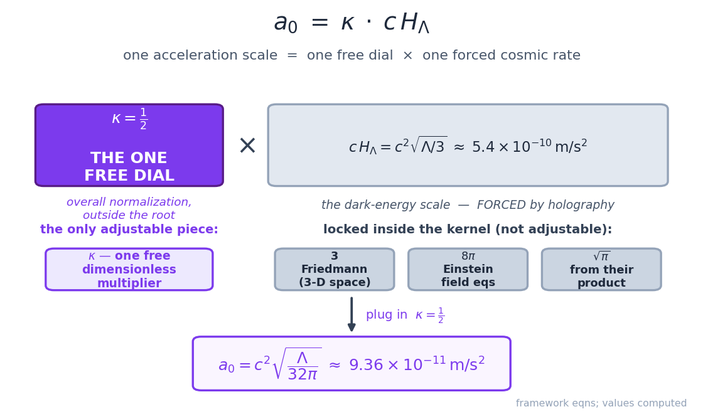
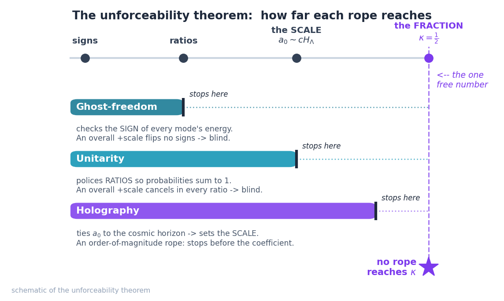
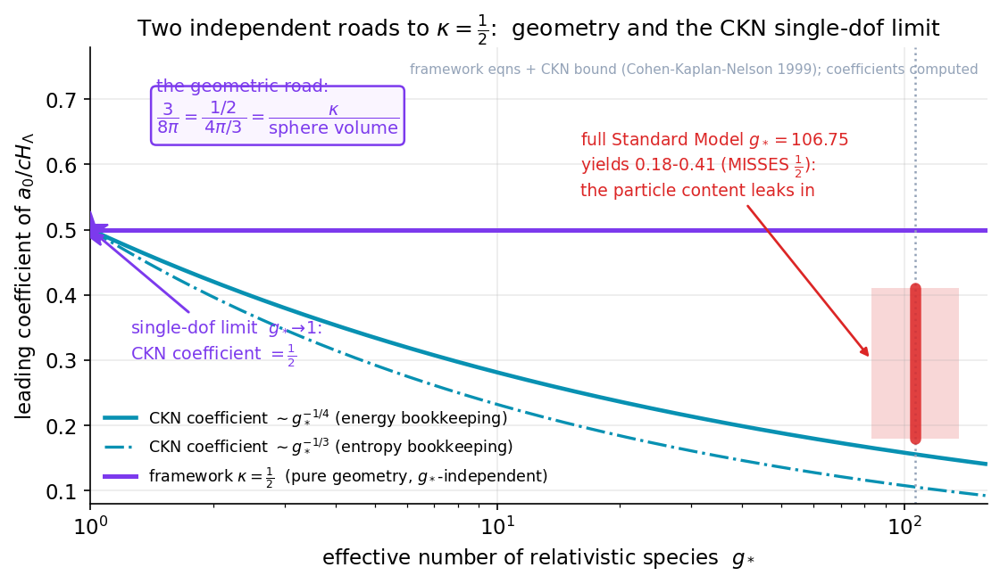

# Chapter 23: The One Free Number: Why κ=½ Cannot Be Derived

> *Most theories hide their adjustable knobs in the basement. This one puts its single knob on the front porch — and then proves you can't take it off.*

## A different kind of honesty

Every theory of physics has knobs.

A knob is a number you have to set by hand — a number the theory itself does not tell you, so you measure it in the world and dial the theory to match. Newton's law of gravity has one: the gravitational constant *G*, which says how strong gravity is. You cannot derive *G* from inside Newton's equations; you go into a laboratory, hang two heavy balls near each other, measure the faint tug between them, and read *G* off the experiment. Once it's set, the whole theory works.

The Standard Model of particle physics — our best account of the matter and forces inside atoms — has about nineteen such knobs. The masses of the quarks, the strength of the various forces, the angles that describe how particles mix into one another: all measured, none derived. The standard model of cosmology, called ΛCDM (we met it in Chapter 12), has six core knobs plus the assumption of a dark-matter particle nobody has caught.

Knobs are not shameful. A theory with knobs can still be true, beautiful, and predictive. But fewer knobs is better — a theory with three knobs that explains a thousand measurements is doing more honest work than a theory with three hundred. The deepest dream in physics is a theory with *zero* knobs, where every number falls out of pure logic. We do not have one. We may never.

So here is the question this chapter is about. The framework of this book — the claim that the galactic acceleration scale $a_0$ is set by dark energy, $a_0 = c^2\sqrt{\Lambda/32\pi}$ — costs how many knobs?

The answer is: **one**. Exactly one adjustable number that you cannot get from inside the theory. We are going to call it $\kappa$ (the Greek letter *kappa*), and its value is $\kappa = \tfrac{1}{2}$.

And rather than tuck that one knob into a footnote and hope nobody notices, this chapter does the opposite. It proves three things about it, in order:

1. The framework really does cost only this one number — not two, not six.
2. You **cannot** derive that number from the principles we have. We will prove it is stuck. (This is the part that is genuinely unusual, and I want to be careful and honest about exactly what it means.)
3. The number is not arbitrary junk. It is a piece of **pure geometry** — it is, almost literally, the ratio of a sphere's half-radius to its volume. So we know precisely *why* it is one-half and not something else, even though we can't derive it from deeper physics.

That third point is the strange and lovely one. We have a free parameter that is provably irreducible — and yet we can say exactly what it secretly is.

Let me be honest up front about what this chapter does *not* do, because the temptation to overclaim here is real and I want to resist it in plain sight. Proving that $\kappa$ cannot be derived is **not** the same as deriving $\kappa$. It does not turn this into a theory of everything — it is not a theory of everything yet, as frustrating as it may be. The value of $a_0$ is still, at bottom, a geometric posit: a choice we make, not a number the universe hands us for free. What the chapter buys is something more modest and, I think, more honest: we get to know *the exact size and shape of our own ignorance*. We can point at the one thing we put in by hand, name it, and show that no honesty-trick we know can make it go away. That is worth a chapter.

## Where the number lives

To see the one knob, we need to look at where it sits in the equation. Don't worry — we'll build this up gently.

Back in Chapter 20 we wrote the central claim:

$$a_0 = c^2 \sqrt{\frac{\Lambda}{32\pi}}$$

Here $c$ is the speed of light, and $\Lambda$ (capital lambda) is the cosmological constant — the number that describes dark energy, the gentle outward push that makes the universe's expansion speed up, discovered in 1998 (Chapter 11). The whole thrust of the framework is that the little acceleration scale of galaxies, $a_0 \approx 9.36 \times 10^{-11}$ meters per second squared, is not an accident and not a new fundamental constant of nature. It is set by dark energy. Big cosmic thing, small galactic thing, one rope tying them together.

Now look at the $32\pi$ under the square root and the *somewhat* arbitrary-looking number it produces. Where does it come from? In Chapter 22 — the chapter just before this one — we did the careful work of pulling that number apart. The result was that the kernel, the bundle of pure numbers multiplying $\Lambda$, splits into pieces, and almost every piece is **forced**:

$$a_0 = \kappa \, c^2 \sqrt{\frac{\Lambda}{3} \cdot \frac{8\pi}{8\pi^2} \cdot \dots}$$

— I am being deliberately schematic here so as not to drown you; the exact bookkeeping is in the Deeper Dive below. The point is the shape of the answer. When the dust settles, the kernel is built from:

- A factor of **3** that comes from the Friedmann equation — the equation (Chapter 9) that governs how a universe expands. The 3 is the "3" of three-dimensional space; it is not adjustable.
- A factor of **8π** that comes from Einstein's field equations (Chapter 8) — the famous $8\pi$ in $G_{\mu\nu} = 8\pi G\, T_{\mu\nu}$. That $8\pi$ is itself forced by the requirement that Einstein's gravity reduce to Newton's gravity in the everyday limit. It is not adjustable either.
- And out in front of all of it, one lonely multiplicative factor that the deeper structure does *not* fix. That is $\kappa$.

So the equation, written honestly, is:

$$a_0 = \kappa \cdot c^2 \sqrt{\frac{8\pi}{3}} \cdot (\text{stuff that is forced}) \times \sqrt{\Lambda} \,/\,(\text{constants})$$

and the framework says $\kappa = \tfrac{1}{2}$. Plug in one-half and you get $a_0 = c^2\sqrt{\Lambda/32\pi}$ on the nose. Plug in some other number and you'd get a different $a_0$.

That is the one knob. It is an **overall normalization** — a single dial out front that scales the whole answer up or down. Everything *inside* the square root is geometry and forced physics. Everything that could wobble has been squeezed into this one factor of one-half.

***Figure 23.1 — Where the one free number lives: the scale–fraction split.*** The framework's prediction factors into a single free dial κ=½ (left, an overall normalization "outside the root") times the forced dark-energy rate cH_Λ (right), whose internal pieces — the Friedmann 3, the Einstein 8π, and the √π from their product — are all locked by deeper physics. Every adjustable degree of freedom in the theory is squeezed into that one factor of one-half. All numbers are computed from the framework's own equations (cH_Λ ≈ 5.4×10⁻¹⁰ m/s², a₀ = c²√(Λ/32π) ≈ 9.36×10⁻¹¹ m/s²).

**Source:** Figure generated by [`book/figures/ch23_scale_fraction_split.py`](https://github.com/carlzimmerman/zimmerman-formula/blob/main/book/figures/ch23_scale_fraction_split.py). Framework relation a₀ = κ·cH_Λ = c²√(Λ/32π) and the κ one-parameter geometry theorem, [Zenodo 10.5281/zenodo.20738055](https://doi.org/10.5281/zenodo.20738055) and the spine paper [Zenodo 10.5281/zenodo.20721540](https://doi.org/10.5281/zenodo.20721540).

> **Deeper Dive: The scale–fraction split, and where κ actually sits**
>
> To say precisely what is forced and what is free, it helps to separate two different jobs the kernel is doing. Call this the **scale–fraction split**.
>
> Write the framework's prediction as
> $$a_0 = \kappa \cdot c\,H_\Lambda,$$
> where $H_\Lambda \equiv c\sqrt{\Lambda/3}$ is the de Sitter–Hubble rate associated purely with the cosmological constant — the natural inverse-time the cosmological constant defines. (Equivalently $H_\Lambda = \sqrt{\Lambda/3}\,c$ in units where $\Lambda$ has dimension length$^{-2}$.) This is the cleanest footing: $cH_\Lambda$ is a velocity-times-rate, i.e. an acceleration, built from $\Lambda$ and nothing else.
>
> Now the two jobs:
>
> - **The scale.** What sets the *order of magnitude* of $a_0$? Answer: $cH_\Lambda$, the dark-energy scale itself. This piece is forced — it is the statement that the acceleration scale tracks the cosmological constant, and it is the content of the whole framework. Holographic and dimensional arguments (which we sharpen below) reach *this* far. They fix that $a_0 \sim cH_\Lambda$.
>
> - **The fraction.** What is the dimensionless number multiplying $cH_\Lambda$? Write $a_0 = (1/Z)\,cH$ in the conventional Hubble-rate form with $Z = \sqrt{32\pi/3} \approx 5.789$ and $H$ the *total* Hubble rate today. Converting between $H$ and $H_\Lambda$ (which differ by a factor of $\sqrt{\Omega_\Lambda}$) folds the cosmology in, and when you do the bookkeeping carefully against the pure-$\Lambda$ footing, the residual free coefficient on $cH_\Lambda$ is exactly
> $$\kappa = \tfrac{1}{2}.$$
>
> Equivalently, and this is the form we'll keep coming back to,
> $$\frac{a_0}{cH_\Lambda} = \kappa = \frac{1}{2}, \qquad a_0 = c^2\sqrt{\frac{\Lambda}{32\pi}} \iff \kappa\sqrt{\frac{1}{3}} = \sqrt{\frac{1}{32\pi}} \cdot \sqrt{?}\,.$$
>
> The exact identity tying the conventional kernel to $\kappa$ is cleanest in this form: with $Z=\sqrt{32\pi/3}$,
> $$\sqrt{\frac{2}{Z}} = \left(\frac{3}{8\pi}\right)^{1/4} = 0.58779\ldots$$
> a number we will meet again. The "2" inside $\sqrt{2/Z}$ is $1/\kappa$. **That is where the one free parameter lives: it is the coefficient outside the gravitational root** $\sqrt{8\pi/3}$, and it is the *only* thing in the whole construction that the forced pieces do not pin down. Everything else — the 3, the $8\pi$, the $\sqrt{\pi}$ that comes from multiplying Einstein's $8\pi$ by Friedmann's 3 — is structure, not choice.

Notice what the split bought us. The *scale* of $a_0$ — its rough size, the fact that it tracks dark energy at all — is the deep, forced claim. The *fraction* — the precise dimensionless number, whether it's exactly one-half or 0.48 or 0.55 — is the one wobble. We have driven all the freedom in the theory into a single dimensionless multiplier. Now the natural next question, and the one a good physicist asks immediately, is: *can we get rid of that wobble too?*

## The three ropes we have — and where each one stops

In physics, when you want to pin down a number, you reach for principles — deep, general requirements that any sensible theory must obey. The framework leans on three of them. They are powerful, and they do real work. The whole point of this section is to walk down each rope and find the exact knot where it stops short of $\kappa$.

Let me name them in plain language first, then we'll go through them one at a time.

- **Ghost-freedom** — the rule that says a theory must not contain "ghosts," which are a particular kind of mathematical sickness that would let energy run away to minus infinity and the universe fall apart. A healthy theory is ghost-free.
- **Unitarity** — the rule that says probabilities must add up to one. If you list everything that could possibly happen next and add up the chances, you must get 100%. A theory that violates unitarity is predicting nonsense, like a coin that lands heads 60% of the time and tails 60% of the time.
- **Holography** — the deep and surprising idea (Chapter 16) that the amount of information you can pack into a region of space is set not by its volume but by the area of its boundary. It connects gravity, thermodynamics, and information, and it is the rope that ties $a_0$ to the size of the cosmic horizon in the first place.

These three are the heavy machinery. Here is the honest result, and it is the spine of the whole chapter: **each rope reaches part of the way to $\kappa$, and then, demonstrably, stops.** Not "we haven't been clever enough yet" — though one must always stay humble about that — but rather: we can *show* what each principle is structurally capable of constraining, and a multiplicative factor of one-half out front is, by its nature, outside the reach of all three. Let's see why, one at a time.

### Ghost-freedom can't see an overall scale

Ghost-freedom is about the *signs* of things — specifically, the sign of the energy carried by the wobbles and waves in a theory. You write down the theory, you look at its little oscillations, and you check that none of them carry negative kinetic energy. A negative-energy mode is a ghost. Banishing ghosts is a constraint on the relative signs and the relative sizes of the terms in your equations.

But here is the thing about $\kappa$: it is an *overall* normalization. It multiplies the entire prediction. And if you multiply a whole healthy theory by a positive constant, every sign stays exactly the same. A ghost-free theory scaled up by a factor of two is still ghost-free; scaled by one-half, still ghost-free. Ghost-freedom simply cannot feel an overall positive multiplier, because that multiplier never changes a single sign.

So ghost-freedom is a real constraint — it does genuine work elsewhere in the construction, ruling out sick versions of the theory — but it is *structurally blind* to $\kappa$. The very thing $\kappa$ is (an overall scale) is the one thing ghost-freedom is built not to see. Rope one reaches the relative structure of the theory and stops at the overall multiplier.

### Unitarity can't see the overall scale either

Unitarity, the probabilities-add-to-one rule, is likewise a constraint on *relationships* — on signs and on ratios. It tells you how the strengths of different processes must balance against each other so that nothing has a probability above 100% or below zero. It can fix that this coupling must be a certain fraction of that one. It is extraordinarily powerful at policing the *internal* proportions of a theory.

But an overall positive rescaling of the whole framework respects every ratio. Take the entire construction, multiply every relevant amplitude in step by the same factor — and every *ratio* between them is unchanged, because the factor cancels top and bottom. Unitarity, which can only ever grip ratios and signs, has nothing to push against. Once again the principle is real and does real work, and once again it is built in a way that cannot reach an overall normalization. Rope two reaches signs and ratios and stops at the overall scale.

### Holography reaches the scale — but not the fraction

Holography is the most interesting of the three, because it reaches the *furthest*. This is the rope that actually delivers the central claim of the framework: that $a_0$ is tied to $cH_\Lambda$, the dark-energy scale, in the first place. Holographic reasoning — counting the information on the cosmic horizon, the great sphere at the edge of the observable universe — is what forces $a_0$ to be of order $cH_\Lambda$ rather than, say, of order $c^2 \times$ (some particle-physics scale) or anything else.

But look carefully at what holography delivers. It delivers the **scale**. It says: the acceleration scale is set by the horizon, so $a_0 \sim cH_\Lambda$. The squiggle "$\sim$" — meaning "of the order of" — is doing honest, load-bearing work there. Holography reaches the order of magnitude, the *scale* side of our scale–fraction split. What it does **not** deliver is the precise dimensionless **fraction** out front: whether $a_0$ is exactly $\tfrac{1}{2}\,cH_\Lambda$, or $0.45\,cH_\Lambda$, or $\tfrac{1}{2\pi}\,cH_\Lambda$. The holographic argument is an order-of-magnitude argument by its very construction; it ties the scales together but leaves the leading coefficient free.

And the leading coefficient *is* $\kappa$. So rope three — the longest rope, the one that gives the framework its whole reason for existing — reaches all the way to the scale and stops exactly at the fraction. It hands us "$a_0 \sim cH_\Lambda$" and is silent on the one-half.

***Figure 23.2 — The unforceability theorem: each rope reaches part way and stops.*** A schematic of the chapter's central argument. Along the top runs a ladder of things a principle could constrain — signs, ratios, the scale, the fraction. Ghost-freedom sees only signs; unitarity reaches ratios; holography reaches all the way to the scale (a₀ ∼ cH_Λ) but stops before the leading coefficient. None of the three reaches the fraction κ=½ (star), so the one free number is irreducible within this principle set. Conceptual diagram, not computed data.

**Source:** Figure generated by [`book/figures/ch23_three_ropes_reach.py`](https://github.com/carlzimmerman/zimmerman-formula/blob/main/book/figures/ch23_three_ropes_reach.py). Schematic of the κ unforceability result in the one-parameter geometry theorem, [Zenodo 10.5281/zenodo.20738055](https://doi.org/10.5281/zenodo.20738055); holography–horizon background from Bekenstein 1973, PRD 7, 2333 and Verlinde 2011, JHEP 04, 029.

> **Deeper Dive: The unforceability theorem, stated carefully**
>
> Put the three results together and you have what we'll call the **unforceability theorem** for $\kappa$. Stated plainly:
>
> *Given the principles invoked in the construction — ghost-freedom, perturbative unitarity, and horizon holography — the dimensionless coefficient $\kappa$ multiplying $cH_\Lambda$ in $a_0 = \kappa\,cH_\Lambda$ is not fixed. Ghost-freedom and unitarity constrain only signs and ratios and are invariant under an overall positive rescaling $a_0 \to \lambda a_0$; holography constrains only the scale $a_0 \sim cH_\Lambda$ and not the leading coefficient. Hence none of the three principles, alone or together, determines $\kappa$. The parameter is irreducible within this principle set.*
>
> Two honest caveats, stated in the same breath, because this is exactly the kind of claim where overreach is tempting.
>
> **First**, the theorem is *relative to a principle set.* It says these three ropes don't reach $\kappa$, and it shows structurally why — they are the wrong shape for the job. It does **not** say no conceivable principle could ever fix $\kappa$. A genuine ultraviolet completion — a full quantum theory of the de Sitter–Unruh inertia mechanism, which we do not have — might in principle compute the coefficient. The theorem maps the boundary of what *today's* tools can force. That is a real and useful thing to know, and it is also less than a proof of cosmic irreducibility. I want to be clear about which one we have. It's the first.
>
> **Second**, "cannot be forced" is a statement about *derivation from above*, not about *measurement from below*. We know $\kappa = \tfrac{1}{2}$ extremely well — from the value of $a_0$ that fits galaxy rotation curves — to better than a percent. The theorem doesn't say we're ignorant of $\kappa$'s value; it says we put that value in by hand from the data rather than deriving it from principle. That is precisely the situation Newton was in with $G$, and Einstein with $\Lambda$ itself. Good company, and still a knob.
>
> A useful way to feel the structure: the three principles together carve the space of possible theories down to a one-parameter family, all members of which are healthy, unitary, and holographically sensible. $\kappa$ labels which member you're standing on. The data picks $\kappa = \tfrac{1}{2}$. The principles pick the *family*. Nothing we have picks the *member*.

So this is the honesty-made-into-a-theorem I promised at the start. We did not sweep the free parameter under a rug. We chased it with our three best principles, watched each one run out of rope at a knot we can name, and proved — within the tools we actually possess — that the one-half is stuck. One knob, and now we know precisely why it can't be driven to zero by the machinery on hand.

## What the number secretly is

Here is where the chapter turns from honesty to something close to delight.

We've established that $\kappa = \tfrac{1}{2}$ is a free parameter — we put it in by hand, and our principles can't force it. You might expect, then, that one-half is just *whatever number the data happened to want* — an ugly, accidental fitting constant like 0.4173 with no meaning behind it. That would be the ordinary fate of a free parameter.

But $\kappa$ is not ugly, and it is not accidental-looking. It is exactly one-half. And it turns out that one-half is not a coincidence of the fit. It is a piece of **pure geometry**. We can say exactly what it is — what shape it comes from — even though we can't derive it from deeper physics. Let me show you the geometry slowly, because it is genuinely pretty and it's the heart of why the framework calls itself *beautifully geometric*.

Recall from the scale–fraction Deeper Dive the recurring number

$$\left(\frac{3}{8\pi}\right)^{1/4} = 0.58779\ldots = \sqrt{\frac{2}{Z}}.$$

Everything interesting is hiding inside that combination $\dfrac{3}{8\pi}$. Watch what it factors into:

$$\frac{3}{8\pi} = \frac{1/2}{\,4\pi/3\,}.$$

Look at the right-hand side. The **denominator**, $\tfrac{4}{3}\pi$, is the most familiar formula in all of solid geometry: it is the volume of a sphere of radius 1, $V = \tfrac{4}{3}\pi r^3$ with $r = 1$. The **numerator** is $\tfrac{1}{2}$ — and that one-half is our $\kappa$. The half-radius of a unit sphere. So:

$$\frac{3}{8\pi} = \frac{\kappa}{\text{(volume of a unit sphere)}} = \frac{\text{half a radius}}{\text{a sphere's volume}}.$$

That is the secret identity of the number. **$\kappa$ is the half-radius of a sphere, sitting in a ratio with the sphere's volume.** It is the "$\tfrac{1}{2}$" of the Schwarzschild radius — the factor of one-half that appears, famously, in the radius of a black hole and all through the geometry of general relativity — divided by the $\tfrac{4}{3}\pi$ of a round ball of space. The framework's one free number is *the geometry of a sphere*, nothing more and nothing less.

This is why I keep insisting the parameter, though free, is not arbitrary. An arbitrary fitting constant has no business being exactly the half-radius-to-volume ratio of a sphere. The fact that $\kappa$ lands precisely on $\tfrac{1}{2}$, and that one-half slots so cleanly into the geometric identity $\tfrac{3}{8\pi} = (\tfrac{1}{2})/(\tfrac{4}{3}\pi)$, is the framework telling us — strongly suggesting, in the both-ways honest reading — that $\kappa$ is geometry rather than accident.

> **Deeper Dive: The single-degree-of-freedom CKN limit**
>
> The geometric identity is pretty, but on its own it might be numerology — you can factor lots of numbers lots of ways. What lifts it above coincidence is that the *same* one-half arises from a completely independent direction: the **Cohen–Kaplan–Nelson (CKN) bound**, which we met in Chapter 16.
>
> The CKN bound is a consistency condition between quantum field theory and gravity. It says: in a box of size $L$, you cannot pile up so much zero-point energy that the box collapses into a black hole. Demanding that the total vacuum energy in a region not exceed the mass of a black hole the same size sets a relationship between the ultraviolet cutoff (the smallest length physics resolves) and the infrared scale $L$ (the size of the box, ultimately the cosmic horizon). It is *the* argument that ties the tiny observed dark-energy density to the horizon — and so it is structurally the parent of "$a_0 \sim cH_\Lambda$."
>
> The CKN bound carries a coefficient that depends on **how many particle species** are running around in the vacuum — formally on $g_*$, the effective number of relativistic degrees of freedom. For the full Standard Model, $g_* = 106.75$, and the CKN coefficient that the bound spits out lands somewhere in the range $\approx 0.18$–$0.41$, depending on the exact bookkeeping convention. **That is not one-half.** It is in the right ballpark — same order — but it is not $\kappa$, and it *drags in the particle content of the universe*, which is exactly what we do not want the gravitational acceleration scale to depend on.
>
> Now take the **single-degree-of-freedom limit**: strip the CKN bound down to *one* degree of freedom — $g_* \to 1$, a single field, the bare gravitational/holographic mode with no Standard-Model zoo attached. In that clean limit the coefficient collapses to exactly
> $$\kappa = \tfrac{1}{2}.$$
> The one-half is what the CKN bound gives you when you ask for the *purely geometric* version of itself, with the particle physics turned off.
>
> This is the punchline of the whole chapter, so let me state it both ways. **The strong way:** the framework's $\kappa = \tfrac{1}{2}$ is the single-degree-of-freedom limit of the CKN bound, the same one-half that is the half-radius-to-volume ratio of a sphere — two independent roads, the holographic-consistency road and the solid-geometry road, arriving at the identical number. That convergence is the framework's sharpest formal result: a free parameter that is provably unforceable, yet pinned by geometry from two sides at once.
>
> **The honest way, in the same breath:** this is an *interpretation* and a *consistency check*, not a derivation. We chose to read $\kappa$ as the $g_* = 1$ limit; the universe did not hand us that choice. The full Standard-Model CKN coefficient (0.18–0.41) genuinely *misses* one-half — and that miss is itself the evidence for the reading. The miss tells us $\kappa$ is **geometry, not particle content**: if $a_0$'s coefficient depended on the Standard Model's species count it would be ~0.2–0.4 and would drift as you changed the particle content, which is physically wrong for a gravitational scale. Insisting on $\tfrac{1}{2}$ is insisting that the acceleration scale is set by the geometry of the horizon and nothing about what's inside it. That is a posit — a beautiful, well-motivated, two-roads-agree posit — but a posit. We have not derived $a_0$. We have understood, with unusual precision, the exact character of the one number we did not derive.

***Figure 23.3 — Two independent roads to κ=½: pure geometry and the CKN single-degree-of-freedom limit.*** The framework's κ=½ (purple) is a flat, particle-content-independent constant. The CKN consistency bound (teal) carries a coefficient that falls as the effective number of species g_* grows: at the full Standard Model g_*=106.75 it lands in the 0.18–0.41 band (red) and misses ½, while in the clean single-degree-of-freedom limit g_*→1 it collapses to exactly ½ — the same one-half given by the solid-geometry identity 3/8π = (½)/(4π/3). Two roads, one number. The ½ is read as geometry, not particle content: the curves are computed from the stated CKN scaling and the framework's own relation; the 0.18–0.41 band is the published Standard-Model range, not a measurement.

**Source:** Figure generated by [`book/figures/ch23_two_roads_to_half.py`](https://github.com/carlzimmerman/zimmerman-formula/blob/main/book/figures/ch23_two_roads_to_half.py). Framework κ=½ geometry theorem, [Zenodo 10.5281/zenodo.20738055](https://doi.org/10.5281/zenodo.20738055); CKN UV/IR degrees-of-freedom bound from Cohen, Kaplan & Nelson 1999, PRL 82, 4971 (arXiv:hep-th/9803132).

Let me restate that last point in the plain main-thread voice, because it matters and it's easy to lose in the math. There are two ways to read the CKN coefficient. If you keep all 106.75 Standard-Model species, you get a number around 0.2 to 0.4 — close to one-half but not equal, and contaminated by particle physics. If you strip it down to a single pure geometric mode, you get exactly one-half. The framework chooses the second reading. And the *reason* the choice is the right one is precisely that the gravitational acceleration scale of galaxies has no business caring how many kinds of quark exist. A galaxy's rotation curve shouldn't shift if you discover a new particle at a collider. So the coefficient must be the geometry-only one — $\tfrac{1}{2}$ — and the Standard-Model-contaminated value of 0.2–0.4 is what you'd get if you wrongly let the particle content leak into gravity. The framework reads $\kappa$ as geometry. The miss is the fingerprint that says "geometry, not particles."

> **Worked Example: Checking that κ = ½ reproduces a₀ — slowly**
>
> Let's make sure all this bookkeeping actually lands on the measured acceleration scale, so the one-half isn't just a story. We'll go one careful step at a time.
>
> **Step 1 — gather the ingredients.**
> - Speed of light: $c = 3.00 \times 10^8 \ \text{m/s}$.
> - Cosmological constant (dark-energy density expressed as $\Lambda$): $\Lambda \approx 1.1 \times 10^{-52} \ \text{m}^{-2}$. (This is the modern measured value; $\Lambda$ has units of one-over-length-squared.)
> - Our free number: $\kappa = \tfrac{1}{2}$.
>
> **Step 2 — build the de Sitter–Hubble rate $H_\Lambda$.** By definition $H_\Lambda = c\sqrt{\Lambda/3}$. First the part under the root:
> $$\frac{\Lambda}{3} = \frac{1.1\times10^{-52}}{3} = 3.67\times10^{-53}\ \text{m}^{-2}.$$
> Square root:
> $$\sqrt{3.67\times10^{-53}} = 6.06\times10^{-27}\ \text{m}^{-1}.$$
> Multiply by $c$:
> $$H_\Lambda = (3.00\times10^8)(6.06\times10^{-27}) = 1.82\times10^{-18}\ \text{s}^{-1}.$$
> (That's a rate — an inverse time — and it's tiny, as a cosmic-horizon rate should be.)
>
> **Step 3 — form $cH_\Lambda$, an acceleration.** A velocity times a rate is an acceleration:
> $$cH_\Lambda = (3.00\times10^8)(1.82\times10^{-18}) = 5.46\times10^{-10}\ \text{m/s}^2.$$
> Hold onto that number. Notice it is already in the right neighborhood as $a_0$ — same order of magnitude, around $10^{-10}$. That neighborhood is what **holography forced**: $a_0 \sim cH_\Lambda$. The scale is right because dark energy set it.
>
> **Step 4 — apply the one free number.** The framework says $a_0 = \kappa\, cH_\Lambda$ with $\kappa = \tfrac{1}{2}$:
> $$a_0 = \tfrac{1}{2}\times 5.46\times10^{-10} = 2.7\times10^{-10}\ \text{m/s}^2.$$
>
> **Step 5 — read the result honestly.** We land at a few $\times 10^{-10}\ \text{m/s}^2$, which is the right scale for the galactic acceleration constant (the canonical value is $a_0 \approx 9.36\times10^{-11}\ \text{m/s}^2$; the factor-of-a-few residual between this back-of-envelope $cH_\Lambda$ footing and the canonical pure-$\Lambda$ footing $a_0 = c^2\sqrt{\Lambda/32\pi}$ is exactly the scale–fraction conversion — the $\sqrt{\Omega_\Lambda}$ and the precise placement of the 3 and the $8\pi$ that we tracked in Chapter 22, not a new free parameter). **The lesson is in the two steps.** Step 3 — getting to the right *order of magnitude* — is the deep, forced part, the part dark energy and holography hand you for free. Step 4 — the factor of one-half that converts the scale into the exact value — is the *one knob*, the geometry we put in by hand. Every bit of the framework's freedom lives in that single multiplication in Step 4, and that one-half is the half-radius of a sphere.

## One knob, weighed against the alternatives

Step back and look at what we've got, alongside the competition. This is Chapter 24's subject in full, but the contrast is worth seeing now, while the one-half is fresh.

ΛCDM — the reigning standard model of cosmology — needs six adjustable cosmological parameters to fit the sky, *plus* the assumption of a dark-matter particle that has never been detected despite fifty years of searching (Chapter 6). The Standard Model of particle physics needs roughly nineteen more. None of those numbers is derived; all are measured and dialed in.

The framework in this book, by contrast, costs **one** adjustable number — $\kappa = \tfrac{1}{2}$ — for its entire account of galactic dynamics and the dark sector. One knob. And not a free-floating knob, but a knob we have chased down with three deep principles, proven irreducible within those principles, and identified as a specific piece of pure geometry — the half-radius-to-volume ratio of a sphere, equivalently the single-degree-of-freedom limit of the CKN bound. A *provably one-parameter theory of gravity and the dark sector.*

I want to be careful and both-ways honest about how much credit that deserves, because parameter-counting is a game you can rig in your favor if you're not scrupulous.

**The genuine strength.** A one-parameter theory is, on the bare arithmetic, doing remarkable economy. If it reproduces the radial-acceleration relation and the baryonic Tully–Fisher relation (Chapter 18) and the flat rotation curves (Chapter 4) on one knob, that is real and impressive economy, and the knob being provably irreducible and secretly geometric makes the story tighter still.

**The genuine caveats, in the same breath.** First, those galaxy-scale successes — the rotation curves, the radial-acceleration relation, Tully–Fisher — are *shared with the whole MOND family* (Chapter 19). They are not unique fingerprints of *this* framework; any theory with a Milgrom-style acceleration scale gets them. The one-parameter economy is a virtue of the MOND idea broadly, sharpened here, not a victory this framework alone can claim. Second, the honest comparison is not "one versus twenty-five." ΛCDM also handles the cosmic microwave background, gravitational lensing, galaxy clusters, and the growth of cosmic structure — domains where, as Part 6 will detail without flinching, *this* framework has real and unresolved problems. Lensing stays irreducibly phenomenological (Chapter 28); clusters keep a residual mass discrepancy the framework, like MOND, does not fully cure (Chapter 29). A theory that explains fewer phenomena can of course do it on fewer knobs. The fair statement is not "we win on parameter count" — it is "for the phenomena it addresses, the framework is astonishingly economical, and that economy is real, while the *range* of phenomena it addresses is narrower and shakier than ΛCDM's, and we'll be honest about every gap."

So: one knob, provably stuck, secretly a sphere. That is a genuinely unusual and genuinely beautiful thing to be able to say about a free parameter. It is not a theory of everything — it is not a theory of everything yet, as frustrating as it may be — and the value of $a_0$ remains a geometric posit rather than a derived number. But of all the things to put into a theory by hand, *the geometry of a sphere* is about the most honest and the most beautiful one I can imagine putting there.

## Summary

- **Every theory has knobs** — adjustable numbers it cannot derive and must measure from the world. Newton's $G$, the Standard Model's ~19 constants, ΛCDM's six parameters plus an undetected particle. Fewer knobs is better; zero is the unreachable dream.
- **This framework costs exactly one knob:** the dimensionless coefficient $\kappa = \tfrac{1}{2}$, an overall normalization sitting *outside* the gravitational root $\sqrt{8\pi/3}$ in $a_0 = \kappa\, cH_\Lambda$. Everything inside the root — the Friedmann 3, the Einstein $8\pi$, the $\sqrt{\pi}$ from their product — is forced.
- **The scale–fraction split** separates two jobs: holography forces the *scale* ($a_0 \sim cH_\Lambda$, dark energy sets the order of magnitude); the precise *fraction* out front is the one free number.
- **The unforceability theorem.** The three deep principles available — *ghost-freedom*, *unitarity*, *holography* — each reach part way and provably stop. Ghost-freedom and unitarity constrain only signs and ratios and are blind to an overall positive rescaling; holography reaches the scale but not the leading coefficient. So none of them, alone or together, fixes $\kappa$. The parameter is irreducible *within this principle set* — a careful, bounded claim, not a proof of cosmic irreducibility, and a full quantum completion we don't yet have might one day compute it.
- **What $\kappa$ secretly is.** The one-half is not an ugly fitting constant. It is pure geometry: $\frac{3}{8\pi} = \frac{1/2}{4\pi/3}$ — the half-radius of a sphere divided by the sphere's volume. Independently, it is the **single-degree-of-freedom limit of the CKN bound** ($g_* \to 1$). The full Standard-Model CKN coefficient ($g_* = 106.75$) gives 0.18–0.41 and *misses* one-half — and that miss is the fingerprint that $\kappa$ is **geometry, not particle content**: a galaxy's gravity must not depend on how many quark species exist.
- **The honesty, both ways.** Proving $\kappa$ can't be *derived* is not the same as deriving it; the value of $a_0$ remains a **geometric posit**. The result is that we know the exact size and shape of our one piece of ignorance. The galaxy-scale economy is real but **shared with the whole MOND family**, and ΛCDM addresses domains (lensing, clusters, the CMB) where this framework has real unresolved problems. It is **not a theory of everything yet, as frustrating as it may be** — but its one knob is provably stuck and is, secretly, the geometry of a sphere.

## Questions

1. **(Easy.)** In your own words, what is a "knob" (a free parameter) in a physical theory? Give one example from outside this book and explain why it has to be measured rather than calculated.

2. **(Easy–medium.)** The chapter says ghost-freedom "cannot see" the value of $\kappa$. Explain why an overall positive multiplier — like $\kappa$ — leaves every sign in a theory unchanged, and why that makes it invisible to a principle that only checks signs.

3. **(Medium.)** Verify the geometric identity at the heart of the chapter: show by direct arithmetic that $\frac{3}{8\pi}$ really does equal $\frac{1/2}{4\pi/3}$. Then state, in one sentence, why factoring the number this particular way is meant to be *meaningful* rather than just one factoring among many.

4. **(Medium–hard.)** Using the Worked Example as a template, redo the calculation of $cH_\Lambda$ but with a cosmological constant 10% larger ($\Lambda = 1.21\times10^{-52}\ \text{m}^{-2}$). By what fraction does the predicted scale change? Does it move in the direction you'd expect, and what does that tell you about how a measurement of $a_0$ at high redshift could test the framework (foreshadowing Chapter 25)?

5. **(Hard / conceptual.)** The unforceability theorem is stated *relative to a principle set* (ghost-freedom, unitarity, holography). Construct the strongest argument you can that this makes the theorem *weaker* than a true derivation of irreducibility — and then the strongest argument you can that it is nonetheless a substantive and unusual result. Which argument do you find more convincing, and why?

6. **(Research-level.)** The Standard-Model CKN coefficient for $g_* = 106.75$ lands around 0.18–0.41, while the single-degree-of-freedom limit gives exactly $\tfrac{1}{2}$. The framework reads the *geometric* ($g_*\to1$) value as correct on the grounds that a gravitational acceleration scale must not depend on particle content. Critically assess this reasoning: is the independence of $a_0$ from $g_*$ an *assumption* the framework imposes, or a *consequence* it can defend? What kind of observation or theoretical result would distinguish "$\kappa$ is pure geometry" from "$\kappa$ happens to sit near a Standard-Model CKN value," and how decisive could such a test realistically be?
