# A Beautifully Geometric Universe

### How Dark Energy Might Set the Scale of Every Galaxy — A Guided Tour of Gravity, Cosmology, and One Honest Attempt to Replace Dark Matter

**Carl P. Zimmerman · Briar Creek Tech · 2026**

---

## How to Read This Book

This book is for two readers at once, and I have tried not to betray either of you. If you are sixteen and curious, the main thread of every chapter is yours: a calm story, told without equations, that defines every word the first time it appears and builds each idea from something you already know — a bucket of water, a thrown ball, a stretched rubber sheet. Follow only the main thread and you will arrive, honestly, at the frontier. If you are a working physicist, the rigor you want lives in the clearly boxed "Deeper Dive" sections — the de Sitter–Unruh temperature, the Einstein and Friedmann equations, the MacDowell–Mansouri construction, the κ=½ unforceability proof, the references — and you may read only those if you like; they assume the main thread and skip nothing. "Worked Example" boxes do one calculation slowly; margin notes whisper the asides; each chapter ends with a summary and a ladder of questions from easy to genuinely open. A warning and a promise: I will tell you, in the same breath, what this framework gets genuinely right and where it simply stops. The galactic acceleration scale really does seem to be made of dark energy, and the theory costs provably one free number — but it does not derive that number's value, it cannot yet do gravitational lensing honestly, it leaves the Standard Model untouched, and it is not confirmed against the mainstream picture. It is not a theory of everything yet, as frustrating as it may be. Read it as one independent researcher's careful proposal, laid open for you to check — not as a verdict, but as an invitation.

---

## Table of Contents

### Part 1. The Weight of the Heavens — How We Learned the Universe Is Missing

- **Chapter 1. A Mystery in the Spin of Galaxies** — Opens with the central puzzle in plain sight: the outer stars of spiral galaxies orbit far too fast for the matter we can see to hold them. Sets the stakes — either there is invisible matter, or our law of motion is incomplete — and previews the book's honest, layered journey.
- **Chapter 2. Weighing the Sky: Kepler, Newton, and the Logic of Orbits** — Builds the tool used to weigh everything in the universe: gravity plus circular motion gives mass from speed and distance. Develops Kepler's laws and Newtonian gravity intuitively, then rigorously, so the reader can weigh a galaxy themselves.
- **Chapter 3. The Virial Theorem and Fritz Zwicky's Heavy Cluster (1933)** — Tells how Zwicky, weighing the Coma cluster by the speeds of its galaxies, found it hundreds of times too heavy for its light, coining 'dark matter' — and how the idea was ignored for forty years. Introduces the virial theorem as the cluster-scale weighing tool.
- **Chapter 4. Vera Rubin and the Flat Rotation Curves (1970s)** — The observational turning point: Rubin and Ford, then Bosma in radio hydrogen, found rotation curves staying flat far beyond the visible disk, making missing mass impossible to ignore. Establishes the radial-acceleration clue at the heart of the whole book.
- **Chapter 5. Two Roads from the Fork: A Particle, or a New Law** — Lays out cleanly the two responses to missing mass — add an unseen particle, or modify dynamics in weak gravity — and frames them as a genuine scientific fork rather than a settled question. Sets up the rest of the book as an exploration of the road less taken.

### Part 2. The Search and the Standard Model of Cosmology

- **Chapter 6. Hunting the Invisible: WIMPs, Axions, and Fifty Years Underground** — Chronicles the half-century search for the dark-matter particle — underground detectors, the LHC, the WIMP's rise and quiet retirement — and what its persistent non-detection does and does not prove. Honest both ways: a null result is not a disproof, but it is data.
- **Chapter 7. Einstein's Gravity: The Equivalence Principle and Curved Spacetime** — Builds General Relativity from its founding insight — that falling and floating feel the same — to the picture of mass curving spacetime and matter following the straightest available paths. The conceptual bedrock for everything in Parts III–V.
- **Chapter 8. The Field Equations: How Matter Tells Spacetime to Curve** — Presents the Einstein field equations as the precise law relating matter-energy to curvature, introducing the all-important factor 8π that will reappear in the framework's kernel. Keeps the main thread conceptual while the box carries the full tensor equation.
- **Chapter 9. An Expanding Universe: Hubble, Friedmann, and the Big Bang** — Tells how the universe was found to be expanding and traces that back to a hot dense beginning, deriving the Friedmann equations that govern cosmic expansion — including the factor 3 that joins the 8π in the framework's kernel.
- **Chapter 10. Echoes of the Beginning: The Cosmic Microwave Background** — Introduces the relic radiation from the early universe as cosmology's sharpest dataset, explaining how its tiny ripples both pin down the standard model's parameters and assume the dark sector rather than discover it. Honest about what the CMB does and doesn't prove.
- **Chapter 11. 1998: The Universe Accelerates, and Dark Energy Arrives** — The discovery that the cosmic expansion is speeding up, the resurrection of Einstein's cosmological constant as 'dark energy,' and the staggering 120-order-of-magnitude puzzle of its value. This is the protagonist of the whole framework — the energy that will set the galactic scale.
- **Chapter 12. ΛCDM and Its Patches: The Honest Ledger of the Standard Model** — Presents the six-parameter ΛCDM model on its own terms — its real successes and its dozen historical revisions — using the book's most pointed material with strict fairness. Frames the central scientific question: is adjustability strength or weakness?

### Part 3. Inertia, Heat, and Horizons — The Physics the Framework Stands On

- **Chapter 13. What Is Inertia, Really?** — Confronts the deceptively simple question of why matter resists being accelerated — distinguishing gravitational from inertial mass and surveying Mach's principle. This is the quantity the framework proposes to modify, so the reader must first see how mysterious it is.
- **Chapter 14. Temperature from Acceleration: The Unruh Effect** — Introduces the remarkable prediction that an accelerating observer feels empty space as warm, with a temperature set by acceleration. This thermal-inertia link is the engine of the framework's modified-inertia mechanism.
- **Chapter 15. De Sitter Space: A Universe with a Temperature Floor** — Explains de Sitter space — the geometry of a universe dominated by dark energy — and its crucial property of a built-in horizon and temperature that never drops to zero. Derives the de Sitter–Unruh quadrature that gives the framework its interpolation function.
- **Chapter 16. Entropy, Horizons, and Holography** — Develops black-hole and horizon thermodynamics, the holographic principle, and the Cohen–Kaplan–Nelson bound — the deep ideas that later reveal the framework's one free number to be pure geometry. Keeps the main thread in analogies while the box carries the entropy formulas.

### Part 4. MOND and the Acceleration Scale

- **Chapter 17. Milgrom's Idea: Modifying Dynamics Below a₀** — Introduces Mordehai Milgrom's 1983 proposal that dynamics change below a universal acceleration a₀, fitting flat rotation curves with a single number. Presents both its formulation and the philosophical choice it represents.
- **Chapter 18. The Two Great Regularities: RAR and Baryonic Tully–Fisher** — Presents the radial-acceleration relation and the baryonic Tully–Fisher relation as the tight, model-independent laws that any successful theory must explain, and the empirical heart of the case for an acceleration scale. Stresses these successes are shared across the whole MOND family.
- **Chapter 19. What MOND Gets Right — and Its Real Problems** — A scrupulously balanced audit of MOND: its genuine galaxy-scale triumphs against its well-known failures in clusters and in relativistic phenomena like lensing. Prepares the reader to hold the framework to the same standard in Part VI.

### Part 5. A Beautifully Geometric Universe — The Framework

- **Chapter 20. The Central Claim: a₀ = c²√(Λ/32π)** — States the framework's headline result — that the galactic acceleration scale is a de Sitter curvature scale set by dark energy — and walks through every piece of the formula and its three equivalent forms. The keystone chapter the whole book has been building toward.
- **Chapter 21. The Mechanism: De Sitter–Unruh Modified Inertia** — Explains how the formula becomes physics: empty space in a Λ-universe has a temperature floor, and matter in near-free-fall feels it as extra inertia that mimics extra gravity — modifying inertia, not force, which is why it is Solar-System-safe. Builds on Part III's Unruh and de Sitter physics.
- **Chapter 22. What Is Forced: The Form and the √(8π/3) Kernel** — Separates rigorously what the framework derives from what it posits — showing the form a₀∝c²√Λ is over-determined by four independent mechanisms and the gravitational kernel √(8π/3) is forced, including its tell-tale √π. The discipline that distinguishes this from numerology.
- **Chapter 23. The One Free Number: Why κ=½ Cannot Be Derived** — Presents the framework's sharpest formal result — that its single residual parameter κ=½ is provably unforceable and is pure geometry, the single-degree-of-freedom limit of the CKN bound. A genuinely unusual thing: a proof that a free parameter is irreducible.
- **Chapter 24. One Knob Against Six Parameters and a Particle** — Steps back to compare the framework's parameter economy with ΛCDM's — one geometric knob versus six parameters plus an undetected particle — while insisting that economy is not the same as truth. A chapter about what cheapness does and does not buy a theory.

### Part 6. Predictions, Tests, and the Honest Walls

- **Chapter 25. The Signature Prediction: a₀ Tracks Dark Energy Through Time** — Presents the framework's one genuinely new, parameter-free prediction — that a₀ evolves as √ρ_DE(z), giving a distinctive non-monotonic curve under DESI's evolving dark energy. The bet the framework stakes its neck on.
- **Chapter 26. How It Will Be Tested: BTFR Sign, DESI, and the Giant Telescopes** — Lays out the concrete observational program that will decide the prediction — the sign of the high-redshift Tully–Fisher offset, DESI DR3, and ELT/JWST/ALMA kinematics — with honest timelines and kill conditions. Also covers the Cassini test that already discriminates modified inertia from modified gravity.
- **Chapter 27. The Value of a₀ Is Not Derived (And the Standard Model Is Walled Off)** — The first of the honesty chapters: states plainly that the framework gives the form and economy of a₀ but not its value, and that the Standard Model — particle masses, the mass ratios, the gauge group — is entirely untouched. The quarantine, stated without softening.
- **Chapter 28. The Lensing Wall: Why Bending Light Stays Phenomenological** — Confronts the framework's hardest theoretical weakness: a no-go theorem forbids a covariant, Solar-System-safe MOND lensing law, so the lensing sector is irreducibly phenomenological — a real failing shared with the relativistic-MOND theory AeST. Stated as a conceded loss.
- **Chapter 29. The Cluster Residual and the MOND-Shared Limits** — Addresses the galaxy-cluster problem the framework inherits from MOND — a residual mass discrepancy it does not fully cure — and clarifies which empirical successes are shared with the whole MOND family rather than unique. Holds the framework to its own honesty standard.
- **Chapter 30. A Bridge to Particle Physics: The Lorentz-Violation Interface** — Explores the one place the framework does touch particle physics — being preferred-frame, it acts as a Standard Model Extension background that induces a computable, currently-bounded Lorentz-violation coefficient and a falsifiable CPT-even theorem. Careful: it induces, it does not derive.
- **Chapter 31. Not a Theory of Everything Yet: The Honest Standing** — Gathers all the walls into one frank assessment of where the framework stands against the mainstream — economical and falsifiable, but unconfirmed, hostage to DESI, and facing a skeptical field that favors particle dark matter. The book's thesis stated in full, both ways, in Carl's voice.
- **Chapter 32. What Would It Take to Know? A Reader's Guide to the Coming Decade** — Closes by handing the reader a concrete watchlist — the specific measurements, dates, and outcomes that would confirm, dissolve, or kill the framework — so they can follow the story as it unfolds rather than take anyone's word. Ends on calm, open-ended invitation.

### Back Matter

- Glossary of Terms — every defined term from the chapters in one alphabetical reference, with the plain-language definition first and the technical definition second, mirroring the book's dual-audience structure (e.g. a₀, baryonic matter, CKN bound, de Sitter space, equivalence principle, gravitational slip, interpolation function, MacDowell–Mansouri, modified inertia, RAR, Unruh effect, virial theorem, w(z)).
- The Three Source Papers (open-access on Zenodo, 2026): (1) the framework spine — 'The MOND Acceleration Scale as a de Sitter Curvature Scale' / 'A Provably One-Parameter Theory,' DOI 10.5281/zenodo.20721540; (2) the signature prediction — 'Dark Energy Sets the Galaxy Acceleration Scale: A Parameter-Free a₀(z) Test,' DOI 10.5281/zenodo.20737162; (3) the one-parameter theorem — 'The de Sitter–MOND Coefficient κ=½ Is Unforceable Geometry,' DOI 10.5281/zenodo.20738055. With a note on the public repository (github.com/carlzimmerman/zimmerman-formula) and the machine-verification scripts.
- Problem Sets, by Part — a graded ladder per part: 'Warm-Up' (high-school, plug-and-chug: weigh a galaxy from a rotation curve, compute a₀ from Λ, evaluate the Tully–Fisher offset at z=3); 'Working Through' (undergraduate: derive the Friedmann 3 and Einstein 8π, invert the de Sitter–Unruh quadrature to get μ_fw, check the κ=½ geometric identity); 'Open at the Frontier' (research-level: attempt a covariant modified-inertia completion, assess the cluster residual under density-dependent a₀, design the cleanest a₀(z) test). Full worked solutions for the first two tiers.
- Further Reading, annotated and balanced — for the dark-matter case: Bertone & Hooper, 'A History of Dark Matter' (Rev. Mod. Phys. 2018), and a current particle-search review; for MOND and modified dynamics: Milgrom (1983), Famaey & McGaugh's MOND review, McGaugh–Lelli–Schombert on the RAR; for the framework's foundations: Deser & Levin (1997), MacDowell & Mansouri (1977), Wise (2010), Skordis & Złośnik (2021, AeST); for cosmology background: a standard GR text (Hartle or Schutz) and a cosmology text (Ryden). Each entry flagged for difficulty and viewpoint.
- A Note on Honesty and Method — a short closing essay on the both-ways discipline used throughout: how every claim in this book was tested on its own terms, why a deficit was checked as rigorously as a success, the conventions audited (a₀ footing, interpolation function, mass-to-light), and an explicit list of the author's own earlier claims that were retracted or corrected — so the reader can see the standard the framework was held to.
- Index and Notation Guide — symbols and constants used in the Deeper Dive boxes (Λ, ρ_DE, H_Λ, Z, κ, a₀, μ_fw, g_*, c_T, η), with values and the equations they first appear in.

# Chapter 1: A Mystery in the Spin of Galaxies

*Somewhere out there, a galaxy is spinning. By every law of motion we trust, it should be flying apart. It isn't. That quiet refusal is where our whole story begins.*

---

## A Wheel That Should Not Hold

Imagine you are at a playground, standing next to one of those old metal merry-go-rounds — the flat spinning disk with bars to hold onto. A child sits near the center, close to the axle, and another sits right at the edge. You give the whole thing a push and it starts to turn.

You already know, in your body, what happens next. The child near the center is fine. They can sit there almost lazily, holding on with one hand. But the child at the edge is in trouble. The faster the wheel turns, the harder they have to grip. Spin it fast enough and no grip is enough — they slide outward, lose their hold, and tumble off into the wood chips. The edge is always the dangerous place. The faster you go, the more fiercely the edge tries to throw things off.

This is not mysterious. It is one of the most reliable facts about motion in the whole universe. Anything moving in a circle is constantly being pulled off its straight-line path and bent into a curve, and that bending requires a force pointing inward, toward the center. We call that inward pull the **centripetal** requirement — "centripetal" just means "center-seeking." On the merry-go-round, the inward pull comes from the child's hands gripping the bar, and from friction between them and the metal. When the spin gets too fast for the grip to supply, off they go.

Now I want you to do something that sounds absurd but is exactly what astronomers do for a living: I want you to look at a galaxy and treat it as an enormous, slow, magnificent merry-go-round.

A **spiral galaxy** — the kind we live in, the kind that looks like a glowing pinwheel when you see it in a photograph — is a flattened disk of hundreds of billions of stars, all orbiting a common center. (A spiral galaxy is simply a galaxy shaped like a flat rotating disk with curved arms of bright stars winding outward from a central bulge; our own Milky Way is one.) The stars near the center are the children near the axle. The stars far out at the rim are the children at the edge. Everything is turning, slowly and grandly, taking hundreds of millions of years for a single rotation.

And here is the thing that holds the galaxy together instead of hands gripping a bar: **gravity.** The combined gravity of all the stars, all the gas, all the matter in the galaxy pulls every star inward, toward the center, and that inward pull is exactly what bends each star's path into an orbit instead of letting it fly off in a straight line. Gravity is the grip. Gravity is the hands on the bar.

So we can ask the merry-go-round question about a galaxy, and it is a fair and sharp question: *Is the grip strong enough?* Is there enough gravity — enough matter doing the pulling — to hold the outer stars in their fast circular paths? Or are those outer stars, like the child spun too quickly, moving too fast for the grip to hold, so that they ought to be flung away into intergalactic space?

We can answer this. We know how much an inward pull a star needs to stay in its orbit — it depends only on how fast the star is moving and how far it is from the center, and it is the same physics as the merry-go-round. And we can measure how much matter is actually there to do the pulling, because matter that we can see — stars, glowing gas — gives off light, and we are very good at measuring light.

When we do this measurement carefully, for galaxy after galaxy after galaxy, we get the same astonishing answer every time. The outer stars are moving far too fast. The visible matter — all the stars and gas we can see — does not come close to providing enough gravity to hold them. By the merry-go-round logic, these galaxies should be flinging their outer stars off into the dark.

And yet there they are. Spinning, fast, and perfectly intact. Stable for billions of years.

Something is holding the edge.

---

## What "Too Fast" Actually Means

Let me make "too fast" more precise, because the precise version is where the real mystery lives, and it is not hard to follow.

When a star orbits the center of a galaxy, it traces a great circle (or close to one), and the speed at which it travels around that circle is called its **orbital velocity** — literally, how many kilometers per second it covers as it sweeps around its orbit. This is a thing we can actually measure for stars and gas clouds in distant galaxies, using a beautiful trick of light that we will spend real time on in a later chapter. For now, just trust that we *can* measure it: for a given galaxy, we can find out how fast the material is orbiting at each distance from the center. Near the middle, partway out, far out at the faint edge — we can clock the speed at every radius.

If you take all those measurements and plot them on a graph — orbital speed on the vertical axis, distance from the center on the horizontal axis — you get a curve. This curve has a name that means exactly what it says: the **rotation curve** of the galaxy. It is just a picture of how the orbital speed changes as you move outward from the center. The rotation curve is the single most important graph in this entire book, so it is worth saying plainly what it is: a chart of *how fast things orbit* versus *how far out they are.*

Now, before we look at what the rotation curve actually does, let us predict what it *should* do, using nothing but the physics every child learns and every engineer trusts.

Think again about our solar system, which is the cleanest example of orbits we have. The Sun holds essentially all the mass — more than 99.8% of it. The planets are crumbs orbiting a boulder. And the planets obey a rule discovered four centuries ago: the farther a planet is from the Sun, the *slower* it orbits. Mercury, close in, races around at about 48 kilometers per second. Earth ambles along at 30. Distant Neptune crawls at barely 5. The outer planets are slow, and they are slow in a very specific, predictable way: the orbital speed falls off as you go out, in proportion to one over the square root of the distance. Go four times farther out, and you orbit half as fast. This falling-off pattern is named after Johannes Kepler, who first charted it, and we call it **Keplerian** motion. We will build it up carefully in the next two chapters.

The crucial feature of Keplerian motion — the feature that matters for our mystery — is that the speed *drops* as you move outward, and it drops because nearly all the mass is concentrated in the middle. Once you are outside the bulk of the mass, the gravitational grip weakens with distance, so orbits get more leisurely the farther out you go. Slow edges. That is what concentrated mass produces.

A spiral galaxy *looks* like it should behave the same way. When you photograph one, the light is overwhelmingly concentrated toward the center. There is a bright, dense bulge in the middle, and the disk fades and dims as you move outward until it trails off into darkness. If light traces mass — if the matter is where the glow is — then a galaxy is built like the solar system: most of the stuff piled in the center, thinning out toward the edge. And so the prediction is clean and confident: beyond the bright central region, the rotation curve should *fall*. The outer stars, like the outer planets, should orbit slower and slower the farther out they are. We should see a rising speed in the crowded center and then a long, graceful decline out into the dim edges. Fast middle, slow rim. That is the Keplerian expectation, and for decades it was simply assumed to be what galaxies do.

Here is what galaxies actually do.

The rotation curve rises in the center, as expected. And then, instead of falling, it *flattens*. The orbital speed climbs to some value — say 200 kilometers per second — and then it just... stays there. Flat. You go farther out, past the bright disk, out into the faint outskirts where there is hardly any visible light at all, and the speed does not drop. The outermost gas clouds we can detect, far beyond where the starlight has faded to nothing, are still orbiting at essentially the same brisk speed as material much closer in. The curve runs flat and level, as far out as we can possibly measure it.

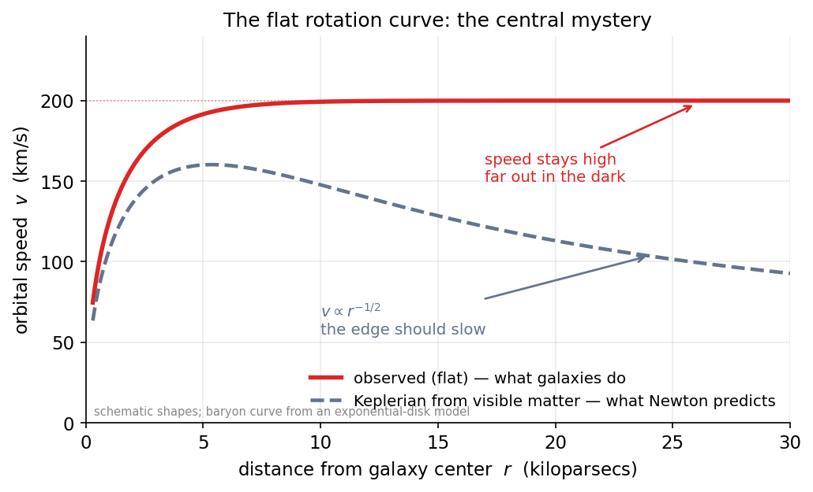

***Figure 1.1 — What galaxies should do, and what they actually do.*** A schematic of the chapter's central fact. The grey dashed curve is the Keplerian prediction if light traces mass: orbital speed rising in the crowded center, then falling as $v\propto r^{-1/2}$ once you pass the bulk of the visible matter (computed from an exponential-disk baryon model). The red curve is what is actually observed — the speed climbs and then stays flat, far out into the dim outskirts where the starlight has faded. The shapes are illustrative; the disagreement between them is the discovery.

**Source:** Figure generated by [`book/figures/ch01_rotation_curve.py`](https://github.com/carlzimmerman/zimmerman-formula/blob/main/book/figures/ch01_rotation_curve.py). Flat rotation curves: Rubin & Ford 1970, ApJ 159, 379; the discrepancy across the galaxy population is catalogued in the SPARC database (Lelli, McGaugh & Schombert 2016, AJ 152, 157, arXiv:1606.09251).

This is the discovery. This flat, refusing-to-fall rotation curve is the central, stubborn fact that this whole book orbits around. The edges of galaxies are not slow. They are fast, and they stay fast, out into the dark where — if light traces mass — there is essentially nothing left to hold them.

> **Deeper Dive: The Keplerian falloff and the flat curve, in equations.**
>
> For a test mass on a circular orbit of radius $r$, the centripetal requirement is that gravity supply the inward acceleration $v^2/r$. Setting the Newtonian gravitational acceleration from the enclosed mass $M(r)$ equal to this requirement,
>
> $$\frac{G\,M(r)}{r^2} = \frac{v^2}{r} \quad\Longrightarrow\quad v(r) = \sqrt{\frac{G\,M(r)}{r}},$$
>
> where $G = 6.674\times10^{-11}\ \mathrm{m^3\,kg^{-1}\,s^{-2}}$ is Newton's gravitational constant. Outside a compact mass distribution, the enclosed mass $M(r)$ stops growing and approaches a constant $M$, giving the **Keplerian** result
>
> $$v(r) = \sqrt{\frac{GM}{r}} \ \propto\ r^{-1/2}.$$
>
> This is the falling curve the solar system obeys: quadruple $r$ and $v$ halves. It is what concentrated mass demands.
>
> The observed curves do not do this. Beyond the optical disk, instead of $v \propto r^{-1/2}$, one finds
>
> $$v(r) \to v_{\mathrm{flat}} = \text{constant}.$$
>
> Read this backward through the same equation and it is alarming. If $v$ is constant while $r$ keeps growing, then the enclosed mass must keep growing too:
>
> $$v^2 = \frac{G\,M(r)}{r} = \text{const} \quad\Longrightarrow\quad M(r) \propto r.$$
>
> The mass enclosed within radius $r$ rises *linearly with radius*, out to the largest radii we can probe — long past the point where the visible matter has run out. The light stops; the implied mass does not. Either there is unseen matter distributed in a way that keeps $M(r)$ climbing, or the relation $v^2 = GM(r)/r$ — the merry-go-round equation itself — is not the whole story at these accelerations. Hold both possibilities. We are not choosing yet.

---

## Putting a Number on the Problem: the Mass Discrepancy

It is one thing to say "too fast." It is another, and a better, thing to say *by how much*. Physicists do not trust a mystery they cannot put a number on, and this one we can.

Here is the procedure, and it is honest and direct. First, we measure the rotation curve — the orbital speeds — and from those speeds we calculate how much mass *must* be present at each radius to supply the gravity those speeds require. This is the merry-go-round calculation run in reverse: instead of asking "given this much mass, how fast should things orbit?", we ask "given that things orbit *this* fast, how much mass must be doing the gripping?" The mass we get this way is called the **dynamical mass** — the mass demanded by the dynamics, by the motion. Call it $M_{\mathrm{dyn}}$.

Second, and completely separately, we measure the light. We add up all the starlight, and we measure the glowing gas (much of it shines in radio waves rather than visible light, which is wonderful, because it lets us trace the gas far past the edge of the stars). From the light we estimate how much ordinary matter is actually present — the stuff made of protons and neutrons and electrons, the stuff that stars and gas and planets and people are made of. Physicists call this ordinary, light-emitting matter **baryonic matter**, after the family of particles (protons and neutrons, collectively "baryons") that make up its mass. I will often just call it *visible* or *ordinary* matter, but the proper word is baryonic, and it means: the normal stuff, the stuff that interacts with light, the stuff the periodic table is made of. Call the baryonic mass we tally up $M_{\mathrm{bar}}$.

Now we have two numbers for the same galaxy. The mass the motion *demands*, $M_{\mathrm{dyn}}$, and the mass we can actually *see*, $M_{\mathrm{bar}}$. In a sane, simple universe where light traces mass, these two would be equal. The matter doing the gravitational gripping would be the matter we can see glowing. They would match.

They do not match. The ratio of the two —

$$\frac{M_{\mathrm{dyn}}}{M_{\mathrm{bar}}}$$

— is the **mass discrepancy**, and it is the precise, numerical heart of this book. It is the answer to "by how much?" In the bright inner regions of a galaxy, the discrepancy is mild — the ratio is close to one, the seen and the demanded roughly agree. But as you move outward, into the flat part of the rotation curve, the ratio climbs and climbs. Out at the faint edges of a typical spiral, the dynamics demand something like five, ten, sometimes thirty times more mass than the light can account for. The motion needs a galaxy's worth of gravity where the eye sees almost nothing.

So the mystery, stated as cleanly as I know how, is this single sentence: **the gravity is there, but the matter we can see is not.** The grip that holds the spinning edge is real — the galaxies prove it by not flying apart — but the visible matter falls short of supplying that grip by factors of many. Something is wrong, or something is missing, and the gap between what we see and what we need is the mass discrepancy.

> **Worked Example: How much is "missing" in a Milky-Way-like galaxy?**
>
> Let us do the calculation slowly, with round numbers, the way you would on the back of an envelope. Take a star (or a gas cloud) orbiting in the flat outer part of a galaxy much like our own.
>
> *Given:* it orbits at a radius $r = 20\ \mathrm{kpc}$ from the center, at the flat-curve speed $v = 200\ \mathrm{km/s}$.
>
> First, units. One kiloparsec (kpc) is about $3.086\times10^{19}$ meters, so
> $$r = 20\times 3.086\times10^{19}\ \mathrm{m} = 6.17\times10^{20}\ \mathrm{m}.$$
> And $v = 200\ \mathrm{km/s} = 2.00\times10^{5}\ \mathrm{m/s}.$
>
> **Step 1 — the dynamical mass.** Rearrange the orbit equation $v=\sqrt{GM/r}$ to solve for the mass the motion demands:
> $$M_{\mathrm{dyn}} = \frac{v^2\, r}{G} = \frac{(2.00\times10^{5})^2 \,(6.17\times10^{20})}{6.674\times10^{-11}}\ \mathrm{kg}.$$
> The numerator is $(4.00\times10^{10})(6.17\times10^{20}) = 2.47\times10^{31}$. Dividing by $G$:
> $$M_{\mathrm{dyn}} = \frac{2.47\times10^{31}}{6.674\times10^{-11}} \approx 3.7\times10^{41}\ \mathrm{kg}.$$
> In units of the Sun's mass ($M_\odot = 1.99\times10^{30}\ \mathrm{kg}$), that is
> $$M_{\mathrm{dyn}} \approx \frac{3.7\times10^{41}}{1.99\times10^{30}} \approx 1.9\times10^{11}\ M_\odot,$$
> about 190 billion solar masses enclosed within 20 kpc.
>
> **Step 2 — the baryonic mass.** Now tally what we can actually see out to that radius — the stars and the gas. For a galaxy like this, careful accounting of the starlight and the radio-traced gas gives a baryonic mass of very roughly
> $$M_{\mathrm{bar}} \approx 6\times10^{10}\ M_\odot.$$
>
> **Step 3 — the discrepancy.** Take the ratio:
> $$\frac{M_{\mathrm{dyn}}}{M_{\mathrm{bar}}} \approx \frac{1.9\times10^{11}}{6\times10^{10}} \approx 3.$$
> The motion demands about three times more mass than we can see — and this is at a fairly modest radius. Push the measurement out into the truly faint outskirts, where the visible matter has all but vanished but the gas is still orbiting just as fast, and this ratio keeps climbing into the range of five, ten, and beyond.
>
> A note on honesty, in keeping with how we will work throughout this book: every number here is approximate, and the baryonic mass in particular carries real uncertainty, because turning starlight into a mass requires assuming how much mass each unit of light represents (the "mass-to-light ratio"), and that assumption is genuinely debated. But no reasonable choice makes the discrepancy go away. You can argue about whether it is a factor of three or a factor of two-and-a-half here; you cannot argue it down to one. The gap is real, and it is large.

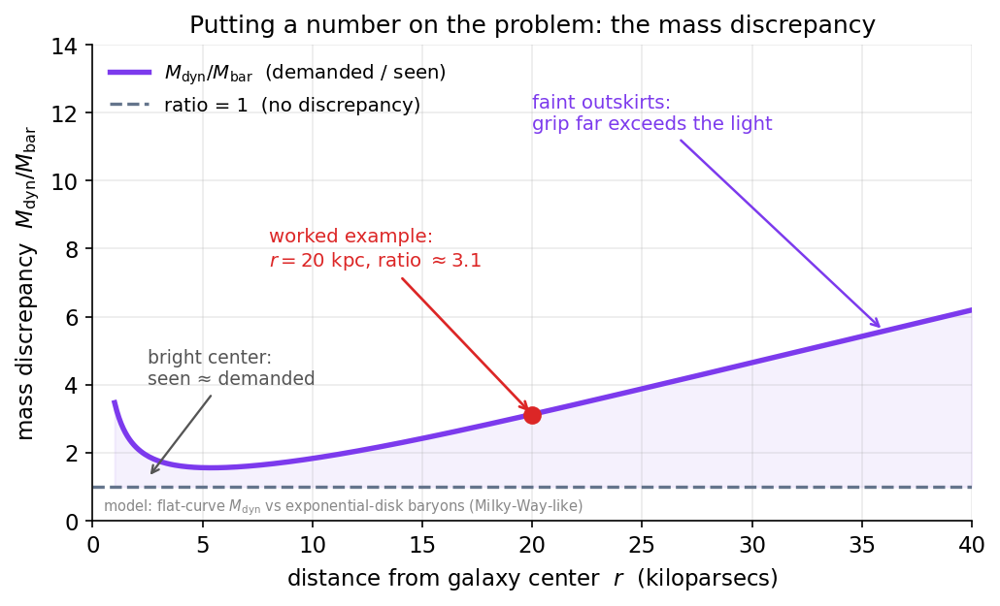

***Figure 1.2 — The mass discrepancy grows with radius.*** The ratio $M_{\rm dyn}/M_{\rm bar}$ — the mass the motion demands divided by the baryonic mass we can see — for a Milky-Way-like model. It is near one in the bright center (seen ≈ demanded) and climbs steadily outward as the visible matter runs out but the flat curve keeps demanding more gravity. Computed directly from the chapter's equations: $M_{\rm dyn}=v_{\rm flat}^2 r/G$ with $v_{\rm flat}=200$ km/s against an exponential-disk baryonic mass; the red point reproduces the worked example's factor of $\approx 3$ at $r=20$ kpc.

**Source:** Figure generated by [`book/figures/ch01_mass_discrepancy.py`](https://github.com/carlzimmerman/zimmerman-formula/blob/main/book/figures/ch01_mass_discrepancy.py). Discrepancy framework and population behavior: Famaey & McGaugh 2012, Living Rev. Relativity 15, 10 (arXiv:1112.3960); SPARC data, Lelli, McGaugh & Schombert 2016, AJ 152, 157.

---

## Two Roads from One Fact

So we are standing in front of a single, well-measured, deeply strange fact: galaxies spin too fast for the matter we can see to hold them, and we can say by how much. The question is what to *make* of it. And here the story forks into two roads, each one reasonable, each one taken seriously by serious people, and the honest truth — which I will tell you now and keep telling you — is that after fifty years we do not yet know for certain which road is right.

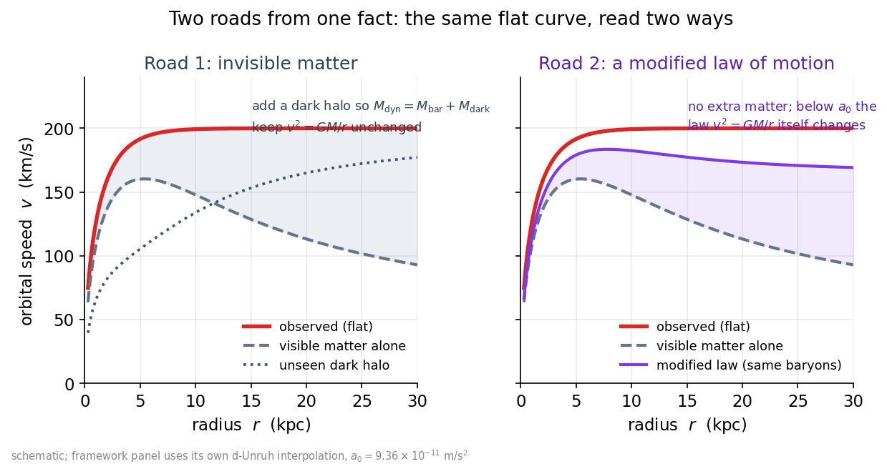

***Figure 1.3 — Two roads from one fact.*** Both panels show the same observed flat curve (red) and the same too-weak curve from visible matter alone (grey dashed). Left: add an unseen dark halo so that $M_{\rm dyn}=M_{\rm bar}+M_{\rm dark}$, keeping Newton's $v^2=GM/r$ untouched. Right: keep only the visible matter but change the law of motion in weak gravity — here drawn with the framework's own de Sitter–Unruh interpolation $g_{\rm obs}=\sqrt{g_{\rm bar}^2+g_{\rm bar}a_0}$ at the input value $a_0=9.36\times10^{-11}$ m/s$^2$ (whose *form* is forced by the framework but whose *value* is an input, not derived). Both reproduce the flat curve; this chapter does not yet choose between them.

**Source:** Figure generated by [`book/figures/ch01_two_roads.py`](https://github.com/carlzimmerman/zimmerman-formula/blob/main/book/figures/ch01_two_roads.py). Framework interpolation and $a_0$: Zimmerman framework, [doi.org/10.5281/zenodo.20721540](https://doi.org/10.5281/zenodo.20721540). Modified-dynamics road: Milgrom 1983, ApJ 270, 365; review Famaey & McGaugh 2012 (arXiv:1112.3960). Dark-matter road as the mainstream view: Planck 2018 results VI, A&A 641, A6 (arXiv:1807.06209).

**The first road: there is matter we cannot see.** Maybe the resolution is the simplest one. Maybe the mass really is there — every bit of the gravitational grip the dynamics demand — and we simply cannot see it, because it does not glow. It gives off no light, emits no radio waves, neither shines nor blocks the light passing through it. It would be genuinely dark: detectable only by its gravity, which is exactly the gravity the rotation curves require. On this road, the answer to "where is the missing mass?" is "it was never missing — it was invisible." The light traces only part of the matter; the rest is some dark substance, draped around each galaxy in a vast halo, supplying the grip that holds the fast-spinning edge. This is the road of **dark matter**, and as we will see, it is the road the great majority of physicists today believe is correct. We will give it a full and fair hearing: where it came from, how strong the evidence is, and the long, patient, so-far-unsuccessful effort to catch a particle of it.

**The second road: our law of motion is incomplete.** But notice something. Every step of the reasoning that led us to "missing mass" leaned on the merry-go-round equation — on $v^2 = GM/r$, on Newton's laws of motion and gravity carried, without flinching, all the way out to the faint edges of galaxies. We *assumed* that the law which works so beautifully for falling apples and orbiting planets and flying spacecraft also works, unchanged, in the extraordinarily gentle gravity at the rim of a galaxy, where accelerations are a hundred billion times weaker than the one that holds you to your chair. What if it doesn't? What if, out there in the faintest pulls of gravity that exist, the law of motion itself is subtly different from the one we wrote down on Earth? Then there would be no missing matter at all. The galaxies would contain exactly the visible stuff we measure — and they would spin fast and stay intact because, at those tiny accelerations, gravity (or inertia, or both) does not behave the way Newton said. On this road, the answer to "where is the missing mass?" is "there is none — we were using the wrong law." This is the road of **modified dynamics**, far less traveled, held by a minority, and it is the road that — eventually, carefully, and with every caveat intact — leads to the framework this book was written to explain.

I want to be very clear about my own position, because this book has a point of view and you deserve to know it from the first chapter. I find the second road genuinely promising, and the later parts of this book develop a specific idea along it — a framework in which that gentle-gravity acceleration scale is set, beautifully, by the dark energy that fills the universe. But promising is not proven. The framework I will show you is, in my honest judgment, a real and surprising piece of physics — and it is **not a theory of everything yet, as frustrating as it may be.** It does not derive every number it uses. It does not touch the particles of the Standard Model. It shares some of its successes with an entire family of older ideas, and it has real, specific weaknesses I will not hide from you — a problem with how it bends light, a residual puzzle in galaxy clusters, and a central prediction that the next decade of telescopes will either support or break. The mainstream overwhelmingly favors the first road, the dark-matter road, and they have good reasons that I will give you in full.

So I am not going to spend this book selling you a conclusion. I am going to spend it *teaching you enough to judge for yourself.* That is the whole design.

---

## A Promise About How This Book Will Work

You may have noticed that to follow even this first chapter, you had to take a few things on trust: that we can measure how fast a distant gas cloud is moving, that Kepler's law really does predict a falling curve, that "acceleration" can be a hundred billion times weaker in one place than another. I made promises — "we'll get to that" — several times. I want to tell you how I intend to keep them, because the structure of this book is built entirely around one difficult goal.

The goal is this: I want this book to work for two very different readers at the same time. One is a bright, curious sixteen-year-old who has never seen a differential equation and does not need to. The other is a working physicist with a PhD who wants the real equations, the real derivations, and the references to check them. Most books pick one of these readers and abandon the other. I am stubbornly refusing to choose. So here is the deal I am offering you, whichever reader you are.

**The main narrative** — the regular text, like what you are reading right now — is written for the sixteen-year-old, and it is the through-line of the whole book. It tells the story in plain language, builds every idea from intuition and analogy, and defines every term the first time it appears. If you read *only* the main narrative, skipping every box, you will still follow the entire argument from the first galaxy to the final honest accounting. You will not get lost. That is a promise.

**The "Deeper Dive" boxes** — the indented, set-off blocks like the one above with the equations in it — carry the rigorous version. The real mathematics, the derivations, the precise statements, the things a physicist wants to see and check. If you are that sixteen-year-old, you may skip every one of them and lose nothing essential; the main text already told you what the box proves. If you are the physicist, the boxes are where you live. Either way, they are clearly marked, so you always know which world you are in.

**The "Worked Example" boxes** do one calculation slowly, all the arithmetic shown, the way I did the missing-mass estimate a few pages ago — so that an abstract claim ("the discrepancy is a factor of several") becomes a concrete number you watched get built.

And every chapter ends the way this one is about to: a short **Summary** of what to carry forward, and a set of **Questions** that range from ones you can answer right now with what you just read, all the way up to genuine open problems at the frontier of research that nobody on Earth can answer yet.

There is one more thing I owe you, and it is the most important promise of all. I am going to try, at every single turn, to tell you the truth *both ways*. When the framework at the heart of this book does something genuinely impressive, I will say so plainly and let you feel why it is impressive. And in the very same breath, when it falls short, when a number is assumed rather than derived, when a success is shared with rival ideas, when a test has not yet been passed — I will say *that* just as plainly. I would rather you finish this book correctly uncertain than wrongly convinced. A galaxy spinning too fast is a real mystery; it deserves to be met with real honesty, not with hype in either direction.

That mystery is where we are standing now. In the next chapter, we go back four hundred years, to a man squinting at the orbits of planets, and we learn how to weigh the sky — because before we can understand what is missing from a galaxy, we have to understand how anyone could possibly claim to know its weight at all.

---

## Summary

- A **spiral galaxy** is a vast, flat, rotating disk of hundreds of billions of stars, held together by the combined gravity of its matter — like an enormous, slow merry-go-round, with gravity playing the role of the hands gripping the bar.
- For anything in a circular orbit, gravity must supply the inward (centripetal) pull, captured by the merry-go-round equation $v = \sqrt{GM(r)/r}$. The speed at which material orbits at each distance from the center, plotted against that distance, is the galaxy's **rotation curve**.
- If light traces mass — if the matter is where the glow is, concentrated in the center — then galaxies should show **Keplerian** rotation curves that *fall* at large radius, with orbital speed dropping as $v \propto r^{-1/2}$, just as the outer planets orbit slower than the inner ones.
- Instead, observed rotation curves are **flat**: the orbital speed climbs and then stays constant far out into the dim outskirts, where the visible matter has faded to almost nothing. Read through the orbit equation, a flat curve implies the enclosed mass keeps growing as $M(r) \propto r$, long after the light has stopped.
- The **mass discrepancy**, $M_{\mathrm{dyn}}/M_{\mathrm{bar}}$, is the ratio of the mass the motion demands to the **baryonic** (ordinary, light-emitting) mass we can actually see. It is near one in the bright centers and climbs to factors of several, then ten or more, in the outskirts. The gravity is there; the visible matter is not.
- This single fact forks into two roads: **dark matter** (the mass is real but invisible — the mainstream view) or **modified dynamics** (our law of motion is incomplete in very weak gravity — the minority view this book ultimately develops). After fifty years, it is not settled which road is right.
- This book is layered: a plain-language **main narrative** for any curious reader, **Deeper Dive** boxes carrying the rigorous mathematics for specialists, **Worked Example** boxes doing the arithmetic slowly, and an unbroken commitment to stating what is strong *and* what is unproven in the same breath. The framework to come is real and surprising — and not a theory of everything yet, as frustrating as it may be.

---

## Questions

1. **(Warm-up.)** In your own words, explain why the child at the *edge* of a fast-spinning merry-go-round is in more danger of flying off than the child near the center. Then state which part of a galaxy plays the role of the "edge."

2. **(Conceptual.)** A friend says, "Galaxies have most of their light in the center, so they should spin like the solar system — fast in the middle, slow at the edge." Explain what the solar system actually does (Keplerian falloff), why this prediction is reasonable, and in what specific way real galaxies break it.

3. **(Quantitative — uses the Worked Example.)** A gas cloud orbits at $r = 30\ \mathrm{kpc}$ from a galaxy's center with a flat-curve speed of $v = 180\ \mathrm{km/s}$. Using $M_{\mathrm{dyn}} = v^2 r / G$, estimate the dynamical mass enclosed within that radius, in solar masses. (Hint: $1\ \mathrm{kpc} = 3.086\times10^{19}\ \mathrm{m}$, $M_\odot = 1.99\times10^{30}\ \mathrm{kg}$.) Is your answer larger or smaller than the $\sim 1.9\times10^{11}\,M_\odot$ found in the worked example, and does the change make sense given the different $r$ and $v$?

4. **(Interpretive.)** The chapter insists the same observation — fast-spinning galaxies — can be read as *either* "there is invisible matter" *or* "our law of motion is incomplete." Identify the one assumption shared by both readings that, if dropped, dissolves the "missing mass" language entirely. (Hint: look closely at which equation every step relied on.)

5. **(Research-level.)** Turning measured starlight into a baryonic mass $M_{\mathrm{bar}}$ requires assuming a *mass-to-light ratio* — how much stellar mass corresponds to each unit of light. Suppose this ratio were systematically underestimated by a factor of two across all galaxies. Qualitatively, how would that change the inferred mass discrepancy, and could a constant correction of this kind explain away the flat rotation curves entirely? Why or why not? (Consider especially the *outer* regions, where gas, not starlight, dominates the visible mass.)

6. **(Open frontier.)** The mass discrepancy in a galaxy turns out to correlate most tightly not with the galaxy's size, nor its radius, nor its total mass, but with the local gravitational *acceleration* — the discrepancy appears wherever the acceleration drops below a particular tiny threshold. Why might *that* be a surprising and important clue? Which of the two roads — invisible matter, or a modified law — would you naively expect such an acceleration threshold to favor, and what would the other road have to do to explain it? (This question has no settled answer; it is the seam along which the rest of the book is sewn.)

# Chapter 2: Weighing the Sky: Kepler, Newton, and the Logic of Orbits

*How do you weigh something you can never put on a scale — a planet, a star, a whole galaxy a hundred thousand light-years across? You watch how things move around it. That's the whole trick, and by the end of this chapter you'll be able to do it yourself.*

---

## A scale made of motion

In Chapter 1 we met the puzzle: galaxies spin too fast for the matter we can see. Stars far out in the dim edges of a galaxy circle the center at speeds that, by every law we trust, should fling them away into the dark. They don't. Something holds them. And the most natural first guess — that there's simply more stuff there than we can see — sets up everything that follows in this book.

But before we can say a galaxy is "missing mass," we have to answer a more basic question, one that sounds almost impossible when you first hear it:

*How do you weigh a galaxy?*

You can't set it on a scale. You can't even visit it. You will never touch a single one of its hundred billion stars. And yet astronomers quote the masses of galaxies the way a grocer quotes the weight of an apple — confidently, with error bars, in kilograms. How?

The answer is one of the most beautiful and far-reaching ideas in all of science, and the wonderful thing is that it isn't complicated. It rests on a single observation that you already know in your bones:

**Heavy things are hard to orbit slowly, and easy to orbit fast.** Or, turned around: *if you can see how fast something is going around, and how far out it is, you can figure out how heavy the thing it's going around must be.*

That's the scale. It's not made of metal and springs. It's made of motion. Speed and distance go in; mass comes out. And the astonishing part — the part this chapter is built to convince you of — is that the *same* scale weighs everything. A moon around a planet. A planet around the Sun. The Sun around the center of the Milky Way. A whole galaxy. One idea, one formula, the entire universe on it.

Let's build the scale carefully, the way you'd build any good tool: first by understanding what it's made of, then by checking it on things we already know, and only then by trusting it with things we don't.

---

## Why the Moon doesn't fall on us

Start with the most childlike version of the question, because it turns out to be exactly the right one. Isaac Newton asked it too.

*Why doesn't the Moon fall down?*

Everything else does. Drop an apple, it falls. Drop a hammer, it falls. The Moon is a giant rock — the biggest rock most of us will ever see — hanging in the sky. Gravity pulls on it just like it pulls on the apple. So why doesn't it come crashing down on our heads?

Newton's answer, which he reached sometime in the 1660s, is so good it still makes people gasp when they really get it: **the Moon *is* falling. It just keeps missing.**

Here's what he meant. Imagine you're standing on a tall mountain with a cannon. You fire a cannonball horizontally — straight out, sideways. It travels some distance, gravity pulls it down, and it lands. Fire it harder, with more gunpowder, and it goes farther before it lands. Harder still, farther still.

Now imagine firing it *so* hard that as the cannonball falls toward the Earth, the Earth's surface — which is curved, remember, because the Earth is a ball — curves away beneath it at exactly the same rate. The ball falls, but the ground falls away just as fast, so the ball never gets any closer to the ground. It just keeps going around. Forever. It is, at every instant, falling straight toward the center of the Earth — and at every instant, missing, because it's also moving sideways fast enough that the planet curves out from under it.

That is an orbit. **An orbit is the balance of two things: falling inward, and moving sideways.** Falling alone, and you crash. Sideways alone, with no gravity, and you fly off in a straight line into space. Get the two in balance and you circle around and around, never crashing, never escaping. The Moon is doing exactly this. So is every satellite humans have ever launched. The International Space Station isn't "above gravity" — gravity up there is nearly as strong as it is on the ground. The astronauts float because the station, and everyone in it, is *falling* — endlessly, all the way around the Earth, sixteen times a day, always missing.

> *Margin note:* People often think astronauts are weightless because they've "escaped Earth's gravity." Not at all — at the Space Station's altitude, Earth's gravity is about 90% as strong as at the surface. They float because they're in free fall, falling around the planet rather than into it. This distinction — free fall versus being held up — will matter enormously later in the book, when we get to Einstein's equivalence principle (Chapter 7) and to what "inertia" really means (Chapter 13).

Hold on to this picture, because it contains the whole scale. The balance between falling-inward and moving-sideways is a *quantitative* balance. There's a precise speed at which the two cancel for a given distance and a given central mass. Tip the balance — make the central thing heavier — and you need to move faster sideways to keep up, or you'll spiral in. Make it lighter, and the same sideways speed will fling you outward. So the orbiting speed is a direct readout of the central mass. The motion *is* the measurement.

Now we just have to make "falling inward" and "moving sideways" into numbers. That takes two ideas, and they came from two men a generation apart: Johannes Kepler, who watched, and Isaac Newton, who explained.

---

## Kepler: the patterns in the wandering

For most of human history, the planets were a mystery wrapped in a nuisance. The word *planet* comes from the Greek for "wanderer," because while the stars wheel across the sky in fixed patterns night after night, the planets wander — drifting through the constellations, sometimes even stopping and looping backward before moving on again. For thousands of years, astronomers tried to describe these wanderings with circles upon circles, and the descriptions grew more baroque and more broken the harder people looked.

Then, in the early 1600s, a German astronomer named **Johannes Kepler** got his hands on the best data in the world. His former employer, the Danish nobleman Tycho Brahe, had spent decades measuring the positions of the planets — especially Mars — with an accuracy no one had ever achieved, all by naked eye, before the telescope. When Tycho died, Kepler inherited the notebooks. And Kepler, who was as much a mystic as a mathematician and wanted desperately to find God's geometry in the heavens, did something that took genuine courage: he let the data win.

For years he tried to fit Mars to a circle, the "perfect" shape everyone since the Greeks had assumed the heavens must use. It almost worked. But "almost" wasn't good enough for Tycho's data — the fit was off by an amount smaller than the width of your thumbnail held at arm's length, and Kepler trusted Tycho enough to take that tiny error seriously. So he gave up the circle. After enormous labor, he found three rules — we now call them **Kepler's laws** — that described every planet's path perfectly. We need two of them.

**Kepler's First Law:** Planets orbit the Sun in *ellipses*, not circles, with the Sun at one focus. An ellipse is just a circle that's been gently squashed — a stretched oval. (For most planets the squashing is so slight that the orbit looks circular to the eye; the deviation is real but small.) For the rest of this chapter, to keep the ideas clean, we'll mostly pretend orbits are perfect circles. This is an honest simplification: it gets the logic and very nearly the right numbers, and everything we conclude survives when you redo it with proper ellipses. We'll flag where it matters.

**Kepler's Third Law:** This is the one that matters most for weighing things, so let's say it carefully. Kepler found that the *time a planet takes to go around* and its *distance from the Sun* are locked together by a fixed rule. Specifically: the square of the orbital period is proportional to the cube of the orbital distance. In plain words — **planets farther out move around more slowly, and not just a little more slowly, but in an exact, predictable way.** Double the distance, and the orbit takes not twice as long but about 2.8 times as long. Mercury whips around the Sun in 88 days; distant Neptune takes 165 *years*. That slowing-with-distance isn't random. It's a law, and it's the same law for every planet.

Here is the thing to notice, and Kepler himself never fully understood it: his third law is a fact about the *Sun*. The relationship between distance and period is the same for Mercury and for Neptune, even though those two planets have nothing to do with each other and never come near each other. The only thing they share is what they orbit. So the pattern Kepler found is really a fingerprint of the central mass — the Sun — written in the motions of everything that circles it. Kepler had, without knowing it, built the first version of our scale. He just didn't know what it was weighing, or why it worked.

That took Newton.

> **Deeper Dive: Kepler's three laws, stated precisely**
>
> For the reader who wants them exactly:
>
> 1. **Law of ellipses.** Each planet moves on an ellipse with the Sun at one focus. An ellipse is the set of points for which the sum of distances to two fixed foci is constant; its "ovalness" is measured by the eccentricity $e$, with $e=0$ a perfect circle.
>
> 2. **Law of equal areas.** The line joining a planet to the Sun sweeps out equal areas in equal times. This is equivalent to the conservation of angular momentum $L = m\,r^2\,\dot\theta = \text{const}$, and it means a planet moves fastest at its closest approach (perihelion) and slowest when farthest (aphelion).
>
> 3. **Harmonic law.** The square of the period is proportional to the cube of the semi-major axis: $T^2 \propto a^3$, with the *same* proportionality constant for every body orbiting the same central mass.
>
> Kepler published the first two in *Astronomia Nova* (1609) and the third in *Harmonices Mundi* (1619). They were purely empirical — distilled from Tycho Brahe's data, with no underlying cause. The cause is the subject of the next section. Crucially, the proportionality constant in the third law depends *only* on the central mass (and Newton's $G$), which is precisely why the third law can be turned into a weighing device.

---

## Newton: the why beneath the what

Sixty years after Kepler, **Isaac Newton** asked *why*. Why ellipses? Why that exact slowing with distance? And in answering, he gave us two ideas that, bolted together, make the scale work.

The first idea is about motion in general. Newton realized that to keep something moving in a circle, you have to be constantly pulling it toward the center. Think of swinging a ball on a string around your head. The ball "wants" to fly off in a straight line — that's its natural tendency, what Newton called inertia (we'll spend all of Chapter 13 on what inertia really is, because it turns out to be the secret hinge of this whole book). The string keeps yanking it back inward, bending the straight-line flight into a circle. Let go of the string, and the ball flies off in a straight line, instantly. The inward pull is what makes the circle.

That inward pull has a name: it produces **centripetal acceleration** — literally "center-seeking" acceleration, the rate at which an object's motion is bent toward the center of its circular path. Newton worked out exactly how much center-seeking acceleration you need: it depends on how fast you're going and how tight the circle is. Go faster, you need a stronger inward pull. Make the circle tighter, same thing. Specifically, the required inward acceleration grows with the *square* of the speed and shrinks with the radius. (We'll write this down precisely in a moment, in a Deeper Dive box you're free to skip.)

The second idea is about gravity specifically — and it's the one that made Newton immortal. He proposed that *every* mass pulls on *every* other mass, with a force that gets weaker as they're farther apart. This is **Newton's law of gravitation**: the gravitational force between two objects is proportional to each of their masses (double either mass, double the force) and falls off with the square of the distance between them (move twice as far apart, and the force drops to a quarter). That "square of the distance" — the *inverse-square law* — is the single most important number in classical physics, and we'll see in later chapters that whether it holds exactly, or fails ever so slightly at very large distances, is the very crack out of which this entire book grows.

Now watch what happens when you put the two ideas together. For an object in a stable circular orbit, the inward pull supplying its center-seeking acceleration *is* gravity. Nothing else is out there pulling on the Moon — just Earth's gravity. So:

> the inward pull gravity provides = the inward pull needed to keep going in a circle.

Set those two equal and the whole thing snaps into place. The mass of the orbiting object cancels out — it doesn't matter whether the Moon is heavy or light; a pebble at the Moon's distance, moving at the Moon's speed, would orbit just the same. (This cancellation is a clue of cosmic importance that Einstein would later seize on. File it away for Chapter 7.) What's left is a clean relationship between three things: how fast the object orbits, how far out it is, and **how heavy the central body is.** Two of those we can measure by watching. The third — the mass — falls out of the algebra.

That is the scale. Speed and distance in; mass out. Let's see it as an equation.

> **Deeper Dive: deriving the orbital speed**
>
> Take a small object of mass $m$ in a circular orbit of radius $r$ around a central body of mass $M$, with $M \gg m$ so we can treat the central body as fixed.
>
> **Newton's gravitation** supplies the inward force:
> $$F_\text{grav} = \frac{G M m}{r^2},$$
> where $G$ is the **gravitational constant** — a fixed number of Nature, $G \approx 6.674 \times 10^{-11}\ \text{m}^3\,\text{kg}^{-1}\,\text{s}^{-2}$ — that sets the overall strength of gravity. (Its smallness is why gravity feels feeble: you need a planet's worth of mass to hold you to the floor.)
>
> **Centripetal requirement.** An object moving at speed $v$ on a circle of radius $r$ has a center-seeking acceleration
> $$a_\text{cent} = \frac{v^2}{r},$$
> so by $F = ma$ the inward force needed to maintain the circle is
> $$F_\text{needed} = \frac{m v^2}{r}.$$
>
> **Set them equal** — gravity is the force that supplies the centripetal requirement:
> $$\frac{G M m}{r^2} = \frac{m v^2}{r}.$$
>
> The orbiting mass $m$ cancels (the equivalence principle in disguise), and one factor of $r$ cancels, leaving the central result of this chapter:
> $$\boxed{\,v^2 = \frac{G M}{r}\,}\qquad\text{or}\qquad v = \sqrt{\frac{G M}{r}}.$$
>
> This is the **circular-orbit speed**, sometimes called the circular velocity. Read it two ways. *Forward:* given a central mass $M$, it predicts how fast something orbits at radius $r$ — and notice $v \propto 1/\sqrt{r}$, so farther-out orbits are slower, exactly Kepler's qualitative finding. *Backward* — and this is the move that powers the rest of the book — solve for the mass:
> $$M = \frac{v^2\,r}{G}.$$
> Measure the speed $v$ and the radius $r$ of anything in a circular orbit, and you have weighed what it orbits. No scale, no contact, no journey. Just $v$, $r$, and the constant $G$.

> **Deeper Dive: recovering Kepler's third law**
>
> Our formula contains Kepler's hard-won third law as a one-line consequence. For a circular orbit, the period $T$ — the time for one full loop — is the circumference divided by the speed:
> $$T = \frac{2\pi r}{v}.$$
> Substitute $v = \sqrt{GM/r}$:
> $$T = 2\pi r \sqrt{\frac{r}{GM}} = 2\pi\sqrt{\frac{r^3}{GM}},$$
> and square it:
> $$T^2 = \frac{4\pi^2}{GM}\,r^3.$$
> There it is: $T^2 \propto r^3$, **Kepler's third law**, with the proportionality constant $4\pi^2/GM$ depending only on the central mass $M$ (and $G$). This is why the law was the same for Mercury and Neptune — they share the Sun, so they share $M$. Kepler measured the constant for forty years without knowing it held the Sun's mass inside it. Newton handed him the meaning. (For elliptical orbits the result is identical with $r$ replaced by the semi-major axis $a$; the circular case is no special pleading.)

---

## Trying the scale on something we know: the Sun

A new tool is only worth trusting if it gives the right answer on something you can check. So before we weigh anything mysterious, let's weigh something whose mass is already in every textbook: the Sun. If our scale of motion gives roughly the known mass of the Sun, we've earned the right to point it at a galaxy.

We'll use the Earth as our test orbiter. We know how far the Earth is from the Sun, and we know how fast it travels. That's all the scale needs.

> **Worked Example: weighing the Sun with the Earth's orbit**
>
> We want the Sun's mass $M_\odot$. Our tool is $M = v^2 r / G$. We need three numbers.
>
> **Step 1 — the radius $r$.** The Earth orbits the Sun at an average distance of about
> $$r = 1.496 \times 10^{11}\ \text{m}$$
> (about 150 million kilometres — this distance is called one *astronomical unit*).
>
> **Step 2 — the speed $v$.** The Earth completes one orbit in one year. So its speed is the circumference of its orbit divided by the time. One year is
> $$T = 1\ \text{yr} = 3.156 \times 10^{7}\ \text{s}$$
> (that's $365.25 \times 24 \times 3600$ seconds — worth doing once to feel how few seconds a year really is). The circumference is $2\pi r$, so
> $$v = \frac{2\pi r}{T} = \frac{2\pi \,(1.496\times 10^{11}\ \text{m})}{3.156\times 10^{7}\ \text{s}} \approx 2.98 \times 10^{4}\ \text{m/s}.$$
> The Earth is sweeping around the Sun at about **30 kilometres every second** — roughly 67,000 miles per hour. You are doing this right now, as you read, and you feel nothing, because there's nothing to bump against. (That "feeling nothing" while in free motion is, again, a clue we'll cash in when we reach inertia and relativity.)
>
> **Step 3 — turn the crank.** Now plug into $M = v^2 r / G$:
> $$M_\odot = \frac{v^2 r}{G} = \frac{(2.98\times 10^{4})^2 \times (1.496\times 10^{11})}{6.674\times 10^{-11}}.$$
> Work the top first: $(2.98\times 10^{4})^2 = 8.88\times 10^{8}$, and times $1.496\times 10^{11}$ gives $1.33\times 10^{20}$. Divide by $G = 6.674\times 10^{-11}$:
> $$M_\odot \approx \frac{1.33\times 10^{20}}{6.674\times 10^{-11}} \approx 2.0\times 10^{30}\ \text{kg}.$$
>
> **Step 4 — check it.** The Sun's mass, measured by every method we have, is $1.989\times 10^{30}\ \text{kg}$. We got $2.0\times 10^{30}\ \text{kg}$. We just weighed the Sun — a ball of gas a hundred and fifty million kilometres away that no instrument will ever touch — to within one percent, using nothing but how far the Earth is and how fast it goes. Pause on that. It is genuinely one of the most powerful tricks the human mind has ever come up with, and you now own it.

Notice what we did *not* need. We didn't need to know what the Sun is made of, how hot it is, or how big it is across. The scale doesn't care. It responds only to mass and only through motion. That blindness is a feature: it means the same method works on a star, a black hole we can't see at all, or a galaxy made of a hundred billion stars plus — possibly — something we can't see. The scale reports the *total mass that is pulling*, whatever that mass happens to be. Keep that phrase in mind: **total mass that is pulling.** When the scale's answer and the visible matter disagree, that gap is the whole subject of this book.

---

## From one body to many: the enclosed mass

So far we've imagined a single small object orbiting a single big one — Earth around Sun, Moon around Earth. A galaxy is not like that. A galaxy is a vast swarm: a hundred billion stars, plus gas and dust, spread across a disk a hundred thousand light-years wide, all orbiting their common center together. There is no single "Sun" at the middle holding the rest in place. The mass is spread out everywhere. Can our scale, built for one central body, possibly handle that?

It can, thanks to a gift Newton himself proved — a result so useful it feels almost like cheating. It's called the **shell theorem**, and it says something wonderfully simple about spread-out, roughly spherical distributions of mass.

Picture a star somewhere out in a galaxy, orbiting the center. There's mass on every side of it — some closer to the center than the star, some farther out. The shell theorem tells us two things about how all that distributed mass pulls on our star:

1. **All the mass that lies *farther out* than the star — the outer shells — pulls on it, but the pulls cancel.** From a thin spherical shell of matter, an object *inside* the shell feels exactly zero net force: the near side pulls one way, the far (larger, more distant) side pulls the other, and they balance perfectly. So the outer parts of the galaxy, for purposes of holding our star in orbit, contribute *nothing*.

2. **All the mass that lies *closer in* than the star — everything interior to its orbit — pulls exactly as if it were squashed into a single point at the very center.** The whole interior acts like one tidy central mass sitting at the middle.

Put those together and something marvelous happens: **for a star at radius $r$, only the mass enclosed within radius $r$ matters, and it acts as if it were all at the center.** We're right back to our one-body scale — we just have to be careful about *which* mass we're weighing. This quantity has a name we'll use constantly for the rest of the book: the **enclosed mass**, written $M(<r)$, meaning "all the mass located within a distance $r$ of the center."

So our scale, applied to a star orbiting in a galaxy, reads:
$$M(<r) = \frac{v^2\, r}{G}.$$
Same formula as before. Same trick. We measure how fast a star (or a cloud of gas) at radius $r$ is orbiting, we know its radius $r$, and out comes the total mass packed inside that radius — *all* of it, whatever it's made of, seen or unseen.

This is the precise tool astronomers actually use to weigh galaxies. And it does something the single-Sun version couldn't: by measuring the orbital speed at *many* different radii — close in, farther out, way out at the dim edge — we get the enclosed mass at each of those radii. We don't just weigh the galaxy; we map out how its mass is distributed, layer by layer, from the bright crowded center to the faint sparse edge. That map is called the galaxy's *rotation curve* — a plot of orbital speed versus radius — and it is the single most important measurement in this entire book. The next two chapters are, in a sense, the story of what that map turned out to look like.

> *Margin note:* The shell theorem is exact for a perfectly spherical mass distribution. Galaxy disks are flattened, not spherical, so the real calculation includes a geometric correction (the disk pulls a little harder in its own plane than a sphere of the same mass would). The correction changes the numbers by tens of percent, never the conclusion. Throughout this book, when we reason about *whether* mass is missing and *how much*, the spherical estimate is honest and sufficient; professional rotation-curve modeling does the flattened-disk version carefully, and the missing-mass problem only gets sharper when you do.

---

## The punchline hiding in a flat curve

We now have everything we need to see — already, in Chapter 2, before we've met any of the people who discovered it — exactly why galaxies broke physics. It falls right out of the formula. Let me walk you to the edge of it slowly, because this single observation is the seed of everything.

Go back to $M(<r) = v^2 r / G$ and turn it around to predict the speed:
$$v = \sqrt{\frac{G\,M(<r)}{r}}.$$

Now think about what we *expect* to happen as we look at stars farther and farther out in a galaxy. The galaxy's light — its stars and glowing gas — is concentrated toward the center and thins out dramatically as you go outward, until at the visible edge there's almost nothing left to see. So once you're past the bright part, you've enclosed essentially all the visible mass; going farther out doesn't gather up much more. The enclosed mass $M(<r)$ should *stop growing* — it flattens off to a constant, the total visible mass of the galaxy.

And if $M(<r)$ stops growing while $r$ keeps increasing, then in our formula the top stays fixed while the bottom gets bigger, so the speed should *fall*:
$$v = \sqrt{\frac{G\,M_\text{total}}{r}} \;\propto\; \frac{1}{\sqrt{r}}.$$
This is exactly what we see in the Solar System, where essentially all the mass really is concentrated at the center in the Sun. Neptune, far out, orbits much more slowly than Mercury, close in — by precisely this $1/\sqrt{r}$ falloff. It's called *Keplerian decline*, and it is the confident, textbook prediction for the outskirts of any galaxy: **beyond the visible matter, orbital speeds should drop off.**

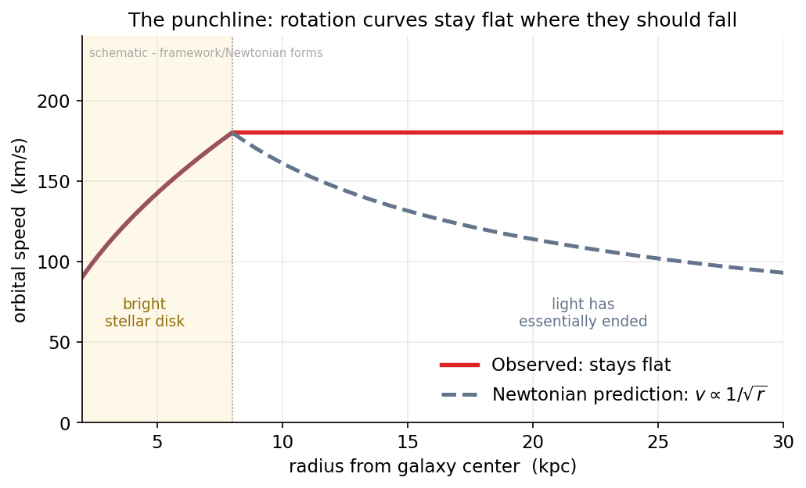

***Figure 2.1 - The punchline hiding in a flat curve.*** Inside the bright stellar disk both curves rise together; past the optical edge the textbook scale predicts a *Keplerian decline* (grey dashed, $v\propto 1/\sqrt{r}$) once $M(<r)$ stops growing, while the observed speed (red) runs flat for as far as we can measure. This is a schematic illustrating the two shapes the chapter contrasts, drawn from the master formula $v=\sqrt{GM(<r)/r}$ with $v_\text{flat}=180$ km/s.

**Source:** Figure generated by [`book/figures/ch02_flat_vs_keplerian.py`](https://github.com/carlzimmerman/zimmerman-formula/blob/main/book/figures/ch02_flat_vs_keplerian.py). Curve shapes from Newtonian circular dynamics ($v^2=GM/r$); the observed flatness of spiral rotation curves is the result of Rubin & Ford 1970, ApJ 159, 379, with the modern compilation in the SPARC database (Lelli, McGaugh & Schombert 2016, AJ 152, 157, arXiv:1606.09251).

They don't.

When astronomers finally measured the orbital speeds of stars and gas in the faint outskirts of galaxies — out past where the light essentially ends — the speeds did not fall. They stayed flat. A star twice as far out as another, in a region with almost no visible matter between them, orbits at nearly the *same* speed. The rotation curve, instead of declining like Neptune's orbit, runs out flat as a tabletop for as far as we can measure it.

Now read that back through our scale, and feel the floor drop out. If the speed $v$ stays constant while the radius $r$ keeps growing, then in $M(<r) = v^2 r / G$ the speed-squared is fixed and the radius is climbing — so the enclosed mass must *keep climbing too*, in direct proportion to $r$. **More mass keeps being enclosed, further and further out, in a region where the light has all but stopped.** Out where you can see almost nothing, the scale insists there is more and more *something*, growing steadily with every step outward.

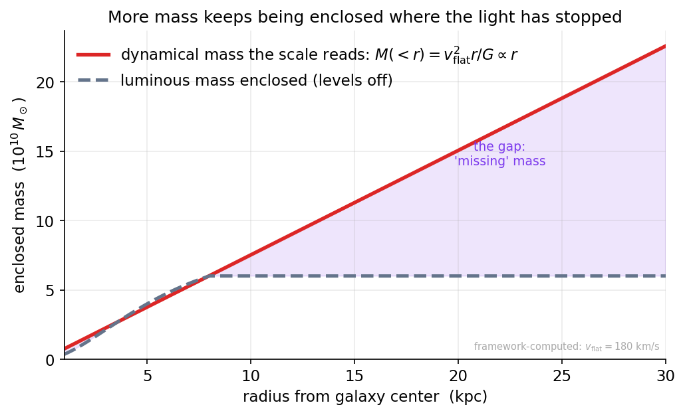

***Figure 2.3 - The enclosed mass keeps climbing.*** A flat rotation curve forces the dynamical enclosed mass $M(<r)=v_\text{flat}^2 r/G$ to grow *linearly* with radius (red), while the enclosed *luminous* mass levels off once you pass the bright disk (grey dashed). The shaded gap is the chapter's missing mass. Both curves are computed from the framework's master formula with $v_\text{flat}=180$ km/s and an illustrative exponential-disk light profile.

**Source:** Figure generated by [`book/figures/ch02_enclosed_mass.py`](https://github.com/carlzimmerman/zimmerman-formula/blob/main/book/figures/ch02_enclosed_mass.py). Relation: shell-theorem enclosed mass $M(<r)=v^2 r/G$ (Newton); the linear-growth consequence of flat curves is the missing-mass result of Rubin & Ford 1970, ApJ 159, 379 (compilation: Lelli, McGaugh & Schombert 2016, AJ 152, 157, arXiv:1606.09251).

> **Deeper Dive: the flat rotation curve forces $M(<r)\propto r$**
>
> The argument compressed to its skeleton. Observations of spiral galaxies find that beyond the central bright region the rotation speed is, to good approximation, independent of radius:
> $$v(r) \approx v_\text{flat} = \text{const}.$$
> Insert this into the enclosed-mass relation derived above:
> $$M(<r) = \frac{v^2\,r}{G} = \frac{v_\text{flat}^2}{G}\,r \;\propto\; r.$$
> The enclosed mass grows *linearly* with radius, without bound, far past the optical edge of the galaxy where the enclosed *luminous* mass has long since leveled off. Equivalently, the local mass density needed to sustain a flat curve falls off as $\rho(r) \propto 1/r^2$ — a slowly thinning halo that extends well beyond the visible disk.
>
> This is the quantitative heart of the missing-mass problem. It is not a subtle statistical effect or a modeling artifact; it is a direct, almost arithmetic consequence of two robust facts — Newtonian circular dynamics ($v^2 = GM(<r)/r$) and the observed flatness of $v(r)$. Something is wrong. Either (i) there is a great deal of unseen mass arranged just so that $M(<r)\propto r$ out to large radii — the dark-matter road; or (ii) the law $v^2 = GM(<r)/r$ itself fails in this regime of very weak gravity, so that a flat curve does *not* imply ever-growing mass — the modified-dynamics road. Distinguishing these two roads, fairly and on the evidence, is the project of this entire book.

This is the fork in the road, and it's worth stating both branches plainly, in the same breath, because honesty here is the whole spirit of this book. Faced with "the scale says there's invisible mass out there," there are exactly two grown-up responses:

**Either** the scale is right and there really is unseen mass — vast halos of some material we can't see, arranged so that the enclosed mass grows with radius just as the flat curves demand. This is the *dark-matter* road, and it is the overwhelming favorite of the mainstream physics community today, for reasons we'll lay out fairly in the chapters ahead. It has had real, hard-won successes, and it deserves your respect.

**Or** the scale itself — specifically the law $v^2 = GM(<r)/r$, which we trusted so completely to weigh the Sun — quietly *breaks* in the regime of extraordinarily weak gravity found in the outskirts of galaxies, a regime billions of times gentler than anything in the Solar System where we tested it. If the law of motion changes out there, then a flat curve need not imply any missing mass at all; it might be telling us the *rule* has changed, not that the *stuff* is hidden. This is the *modified-dynamics* road, and it is the road that, eventually, leads to the framework this book is really about.

I want to be scrupulously fair, right here at the start, about where things stand. The dark-matter road is favored by the great majority of working physicists, and not foolishly: it fits a sweeping range of cosmological observations that the modified-dynamics road has historically struggled with. The framework I'll build toward in the back half of this book travels the second road — but it is *not* a finished theory of everything, as frustrating as it may be, and it carries real unsolved problems of its own that I will give full and honest space to when we get there. What I'll ask of you is only this: that you understand the scale we built today well enough to judge both roads on the evidence, rather than on which one sounds more reassuring. Because every claim in the chapters to come — Zwicky's heavy cluster, Rubin's flat curves, the half-century hunt for the dark particle, and finally a proposal that the galactic acceleration scale is set by the energy of empty space — rests on this one humble tool. Speed and distance in. Mass out. The scale made of motion.

We built it in this chapter. Now let's go watch what happens when the best astronomers of the twentieth century pointed it at the sky.

---

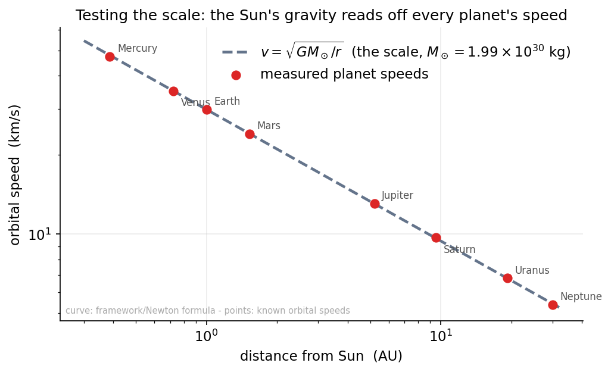

***Figure 2.2 - One scale weighs the whole Solar System.*** The grey dashed line is the chapter's master formula $v=\sqrt{GM_\odot/r}$ evaluated for a single central mass, $M_\odot=1.99\times10^{30}$ kg. Every planet (red points, their well-known mean orbital speeds) falls on that one curve - the same way the Earth's orbit weighed the Sun to within a percent. The curve is computed from the formula; the points are the published orbital speeds.

**Source:** Figure generated by [`book/figures/ch02_weighing_the_sun.py`](https://github.com/carlzimmerman/zimmerman-formula/blob/main/book/figures/ch02_weighing_the_sun.py). Relation: Newtonian circular-orbit speed $v^2=GM/r$ (Newton, *Principia* 1687); planet distances and mean orbital speeds are standard Solar-System values.

## Summary

- **You can weigh things you can never touch by watching how other things orbit them.** An orbit is a balance: an object falls inward under gravity while moving sideways fast enough to keep missing. The orbital speed at a given distance is a direct readout of the central mass.

- **Kepler** (early 1600s), working from Tycho Brahe's superb data, found three empirical laws of planetary motion. His third — that the orbital period squared is proportional to the orbital distance cubed, with the *same* constant for every planet — is secretly a measurement of the Sun's mass, though Kepler never knew it.

- **Newton** (later 1600s) explained *why*. Keeping an object on a circular path requires a continual inward, "center-seeking" (**centripetal**) pull, growing as the square of the speed. **Newton's law of gravitation** says every mass attracts every other with a force proportional to their masses and falling off as the inverse square of distance. Setting gravity equal to the centripetal requirement gives the master formula.

- **The master formula:** $v^2 = GM/r$, equivalently $M = v^2 r / G$, where $G$ is the **gravitational constant** ($6.674\times 10^{-11}$ in SI units). The orbiting object's own mass cancels — a hint Einstein would later seize on. Kepler's third law, $T^2 \propto r^3$, drops out of it in a single line.

- We **tested the scale on the Sun** using the Earth's orbit (radius 150 million km, speed 30 km/s) and got $2.0\times 10^{30}$ kg — the known mass to within one percent. The method needs to know *nothing* about what the central body is made of; it reports only the total mass that is pulling.

- For a spread-out, roughly spherical system, **Newton's shell theorem** lets us reuse the same formula with the **enclosed mass** $M(<r) = v^2 r / G$ — the total mass within radius $r$, which acts as if concentrated at the center while everything farther out cancels.

- Measuring orbital speed at many radii maps a galaxy's **rotation curve**. The textbook expectation, past the visible matter, is a Keplerian decline ($v \propto 1/\sqrt{r}$). Instead, rotation curves are observed to stay **flat**, which forces $M(<r) \propto r$: enclosed mass keeps growing where the light has stopped.

- This sets up the central fork: **either** there is unseen ("dark") mass arranged to grow with radius — the mainstream-favored road — **or** the law $v^2 = GM(<r)/r$ itself fails in the regime of extremely weak gravity — the modified-dynamics road this book ultimately travels. Both deserve a fair hearing on the evidence; the framework on the second road is promising but **not a theory of everything yet, as frustrating as it may be.**

---

## Questions

1. **(Warm-up.)** In your own words, why doesn't the Moon fall onto the Earth? Explain it to someone who has never taken a physics class, using the cannon-on-a-mountain picture.

2. **(Plug-and-chug.)** Mars orbits the Sun at about $2.28\times 10^{11}$ m at a speed of about $2.41\times 10^{4}$ m/s. Use $M = v^2 r / G$ to estimate the Sun's mass, and compare to the value we found from the Earth's orbit. Should the two answers agree? Why is that agreement itself an important check on the whole method?

3. **(Conceptual.)** Our derivation of $v^2 = GM/r$ had the orbiting object's mass $m$ cancel out of both sides. State clearly what this cancellation means physically — would a feather and a cannonball at the same orbital radius move at the same speed? — and explain why Einstein might have found this fact suspicious enough to build a new theory of gravity around it. (We'll return to this in Chapter 7.)

4. **(Quantitative reasoning.)** A galaxy has a flat rotation curve with $v_\text{flat} = 200$ km/s. Using $M(<r) = v_\text{flat}^2\, r / G$, compute the enclosed mass at $r = 10$ kpc and at $r = 30$ kpc (1 kpc $\approx 3.086\times 10^{19}$ m). By what factor does the enclosed mass grow as you triple the radius, and why is this troubling given that the galaxy's *light* has essentially ended well before 30 kpc?

5. **(Modeling caveat.)** We treated galaxies as spherical to use the shell theorem, but real galaxy disks are flattened. Look up or reason qualitatively about how a flattened disk's gravity differs from that of a sphere of the same mass in the disk's plane. Does accounting for the flattening make the missing-mass problem larger or smaller? Why does this strengthen, rather than weaken, the conclusion drawn in this chapter?

6. **(Research-level / open-ended.)** The entire argument of this chapter rests on the law $v^2 = GM(<r)/r$, which we verified only in the Solar System — where gravitational accelerations are enormous compared to those in galaxy outskirts. Suppose, hypothetically, that Newtonian dynamics is modified below some tiny characteristic acceleration scale $a_0$. Sketch how a flat rotation curve could then arise *without* any unseen mass. What single quantity would you most want to measure across many galaxies to distinguish "more mass" from "modified law," and why? (This question is, in miniature, the subject of Parts 4 and 5 of this book — and the framework developed there is a serious proposal, but a contested one that does not yet resolve every difficulty.)

# Chapter 3: The Virial Theorem and Fritz Zwicky's Heavy Cluster (1933)

> *Watch a swarm of bees on a summer evening. Each bee darts where it likes, yet the swarm holds together — it does not fly apart into the dusk. Something keeps it bound. In 1933 a sharp-tongued Swiss astronomer looked at a swarm of galaxies, measured how fast they were moving, and realized that whatever was holding them together had to weigh hundreds of times more than everything he could see. Almost nobody believed him for forty years.*

## A swarm that should not hold together

Let me start with the bees, because the whole chapter really is the bees.

Picture a loose swarm of bees hovering over a meadow. Each individual bee is in furious motion — left, right, up, down — and no two of them are doing the same thing at the same moment. And yet, step back, and the *swarm* is a thing. It has an edge. It stays roughly the same size. It does not, over the next few seconds, spray itself across the whole field and vanish.

Now here is the question I want you to hold onto for the rest of the chapter. **What keeps the swarm together?**

For real bees, the answer is the bees themselves: they can see each other, sense each other, and they actively steer to stay near their neighbors. A swarm is held together by *behavior*. But suppose you found a swarm of objects that could not see one another, could not steer, could not change their minds — objects that simply move in whatever direction they happen to be moving, forever, unless something pulls on them. Objects like, say, planets. Or stars. Or whole galaxies.

For objects like that, the only thing that can hold a fast-moving swarm together is **gravity** — the mutual pull of all that mass on all the other mass. And now the question gets teeth. If you know how fast the members of the swarm are moving, and you know how big the swarm is, you can *work backwards* and ask: how much gravity — and therefore how much mass — would it take to keep these things from flying apart?

This is, at heart, a weighing. We met its smaller cousin in Chapter 2, where we weighed the Sun by watching the planets orbit it, and weighed our own Galaxy by watching stars circle its center. Those were clean cases: one big central mass, and tidy near-circular orbits around it. A galaxy cluster is messier. The galaxies in a cluster do not orbit a single point in neat ellipses; they swarm, plunging in and racing out and crossing past one another along every direction at once, like the bees. So we need a weighing tool built for swarms rather than for orbits. That tool is the **virial theorem**, and learning to read it is the real business of this chapter.

When we point that tool at the first cluster anyone pointed it at, it tells us something startling — the same startling thing this whole book is, in the end, about. The swarm is moving *far* too fast. To hold it together, gravity needs vastly more mass than the glowing galaxies provide. Either there is a great deal of matter we cannot see, or our law of gravity is not telling us the truth on these scales.

That is the fork in the road. We will spend the book walking down it carefully. But it was first glimpsed, clearly and correctly, by one difficult man in 1933, and his name was Fritz Zwicky.

## The man nobody wanted to listen to

Fritz Zwicky was Bulgarian-born, Swiss-raised, and Caltech-employed, and by every account that survives him he was brilliant, original, abrasive, and almost impossible to get along with. He called colleagues he disliked "spherical bastards" — spherical, he explained, because they were bastards no matter which way you looked at them. He worked on problems decades ahead of the field and was often right in ways nobody around him could yet verify, which is a recipe for being both correct and ignored at the same time.

This is worth pausing on, because it is part of the story and not just color. Science is done by people, and people decide whose ideas to take seriously partly on the merits and partly on everything else — temperament, status, the fashions of the moment, whether the claim is comfortable. Zwicky's central discovery was uncomfortable, his manner made him easy to dismiss, and his tools were crude enough that a skeptic could wave the result away as a rough estimate gone wrong. So it sat, more or less, for forty years. I am going to ask you to keep this in mind later in the book, when we talk about ideas that the mainstream finds uncomfortable today — including, in full honesty, parts of the framework this book is about. Being ignored is not evidence that you are right. Zwicky happened to be right. Most uncomfortable outsiders are not. The only way to tell the difference is to do the patient, both-ways work of checking, and that is exactly what the rest of this book tries to do.

Among many other things, Zwicky (with Walter Baade) coined the term *supernova*, predicted neutron stars two years after the neutron was discovered, and was the first to seriously propose that galaxy clusters could act as gravitational lenses — all ideas that took decades to be vindicated. But the one I want to follow is the one he published in 1933, in a Swiss journal, in German, in a paper that the wider community would essentially overlook for a generation.

He was looking at the Coma cluster.

## What a galaxy cluster is

Let me define the object, because it is easy to picture and easy to underestimate.

A **galaxy** is an island of stars — our own Milky Way holds a few hundred billion of them, bound together by gravity, slowly turning. A **galaxy cluster** is the next rung up the ladder: a swarm of *galaxies*, hundreds or even thousands of them, held together by their mutual gravity into a single bound structure spanning millions of light-years. Clusters are the largest gravitationally bound objects in the universe. (Bigger structures exist — the great cosmic web of filaments and walls — but those are still expanding apart with the universe; a cluster is the largest thing that has actually pulled itself together and stopped flying apart.)

The **Coma cluster** is one of the nearest rich clusters, sitting in the direction of the faint northern constellation Coma Berenices — "Berenice's Hair." It is a magnificent thing: a roughly spherical swarm of well over a thousand galaxies, about 320 million light-years away, the whole assemblage spanning some twenty million light-years. To the eye through a telescope it is a sprinkle of soft elliptical smudges, each smudge a galaxy of a hundred billion suns. This is the swarm Zwicky weighed.

He weighed it two different ways, and the two answers did not agree. Not by a little. By a factor of hundreds. Understanding *how* he weighed it — and why the disagreement is so hard to explain away — is the heart of the chapter, so let us build the tool slowly.

## The first weighing: counting the light

The easy way to weigh a cluster is to count its light. We can see the galaxies; we know roughly how much mass it takes to make a galaxy shine as brightly as it does (we calibrate that on nearby galaxies whose masses we can measure other ways); so we add up all the light, convert light to mass at that exchange rate, and out comes a mass for the cluster. Call this the **luminous mass** — the mass we can account for by what glows.

When Zwicky did this for Coma, he got a number — a large number, naturally, since a thousand galaxies is a great deal of stuff. Let us hold that number in one hand.

The point is not that this method is silly. It is the obvious, honest first estimate, and a version of it is still how we take inventory of the *visible* universe. The trouble is what happens when we weigh the same cluster a completely different way — by its motion — and get an answer hundreds of times larger to hold in the other hand.

## The second weighing: reading the motion

Here is the idea, in plain words first, before any mathematics.

Take the swarm of galaxies. Measure how fast they are moving relative to one another — not in a single direction, but the typical *spread* of their speeds. Some galaxies are racing toward us, some away, some across; what we want is the characteristic size of that scatter of velocities. This quantity has a name we will use constantly: the **velocity dispersion**, usually written with the Greek letter sigma, $\sigma$. It is simply a measure of how widely the speeds in the swarm are spread out around the average — a fast, chaotic swarm has a large $\sigma$; a slow, placid one has a small $\sigma$.

We can actually measure $\sigma$, and this is one of the loveliest tricks in astronomy. Light from a galaxy moving *toward* us is shifted slightly toward the blue end of the spectrum; light from one moving *away* is shifted toward the red. (You have heard the same effect with sound — the pitch of an ambulance siren drops as it passes you. Light does the analogous thing with color.) By spreading each galaxy's light into a spectrum and measuring this Doppler shift, we read off each galaxy's speed along our line of sight. Do that for many galaxies in the cluster, look at how widely those speeds are spread, and you have measured the velocity dispersion of the swarm directly. For Coma, Zwicky and his contemporaries found galaxies whose line-of-sight speeds scattered over something like a thousand kilometers per second — staggeringly fast, far faster than anyone would have guessed for a "stable" structure.

Now comes the logic, and it is the same logic as the bees. These galaxies are moving *fast*. They are not steered, they cannot change their minds, they simply coast on whatever path gravity bends them onto. For such a fast swarm not to have long ago dispersed into the surrounding emptiness, gravity must be reining it in — and the faster the swarm moves, the more gravity, and therefore the more *mass*, it takes to keep the lid on. So the velocity dispersion is a scale. Measure how fast the swarm boils, and you can infer how heavy the pot must be to keep it from boiling over.

To turn that intuition into a number, we need the tool I promised you: the virial theorem.

## The virial theorem, gently

The word *virial* comes from the Latin *vis*, "force" — it is just an old name and you can let it wash over you. Here is what the theorem says, in words that a sixteen-year-old can carry away and that are, I promise, exactly right.

In any swarm of objects held together by their own gravity, and settled into a steady state — neither collapsing nor flying apart — there is a fixed accounting relationship between two quantities:

- the **kinetic energy** of the swarm: how much energy is tied up in all that motion (more mass moving, and moving faster, means more kinetic energy); and
- the **gravitational potential energy** of the swarm: a measure of how tightly the swarm is bound together by gravity (more mass packed into a smaller space means a deeper, more negative potential energy).

The virial theorem says these two are locked in a specific ratio. Loosely: *a self-gravitating swarm carries exactly twice as much "binding" as it does "motion."* The motion is trying to fling the swarm apart; the binding is holding it together; and for a steady swarm, the binding wins by precisely a factor of two. Tip the balance — make the galaxies move a little faster — and to keep the swarm steady you need *more binding*, which means *more mass*. That is the whole engine of the argument.

***Figure 3.3 — The virial balance: binding wins by exactly a factor of two.*** A schematic of $2\langle T\rangle+\langle U\rangle=0$ — for a steady self-gravitating swarm the binding $|U|$ is locked at exactly twice the motion energy $2T$. The left pan shows a placid, slow swarm; the right pan shows Coma boiling at $\sigma=1000$ km/s. To keep the boiling swarm steady the binding must rise to match, and since binding scales as $GM^2/R$ that means more mass. This is a conceptual diagram of the chapter's energy-accounting argument, not plotted data.

**Source:** Figure generated by [`book/figures/ch03_virial_balance.py`](https://github.com/carlzimmerman/zimmerman-formula/blob/main/book/figures/ch03_virial_balance.py). Illustrates the virial theorem $2\langle T\rangle+\langle U\rangle=0$ as stated in this chapter's Deeper Dive; standard result, see e.g. Zwicky 1933, Helv. Phys. Acta 6, 110.

The beautiful thing is what this lets you do. If you can measure the *motion* (from the velocity dispersion $\sigma$) and the *size* of the swarm (from how big it looks on the sky and how far away it is), the virial theorem hands you the *mass* — and crucially, it hands you the **total** mass, every gram of it, whether it glows or not. Gravity does not care whether matter is luminous. A swarm responds to *all* the mass that is there. So this second weighing measures something the first weighing cannot: the true gravitating mass, light and dark alike.

That distinction — *light* counts only what glows, *motion* counts everything that pulls — is the seam that the whole missing-mass story is going to pry open. Let us now make it quantitative.

> **Deeper Dive: The virial theorem, stated and motivated**
>
> For a bound, self-gravitating system of point masses in a stationary (time-averaged steady) state, the virial theorem relates the time-averaged total kinetic energy $\langle T\rangle$ and total gravitational potential energy $\langle U\rangle$:
> $$2\langle T\rangle + \langle U\rangle = 0.$$
>
> *Sketch of why.* Define the scalar moment of inertia about the center of mass, $I=\sum_i m_i\,\mathbf r_i\cdot\mathbf r_i$. Differentiating twice in time,
> $$\tfrac12 \ddot I = \sum_i m_i\,\dot{\mathbf r}_i\cdot\dot{\mathbf r}_i + \sum_i m_i\,\mathbf r_i\cdot\ddot{\mathbf r}_i = 2T + \sum_i \mathbf r_i\cdot\mathbf F_i .$$
> The last term, $\sum_i \mathbf r_i\cdot\mathbf F_i$, is the *virial of Clausius*. For forces derived from a gravitational ($1/r$) potential, this virial equals exactly the total potential energy $U$ (a consequence of $U$ being homogeneous of degree $-1$ in the coordinates — Euler's theorem on homogeneous functions). Hence
> $$\tfrac12\ddot I = 2T + U.$$
> For a system that is neither expanding nor contracting on average, the long-time average of $\ddot I$ vanishes, $\langle \ddot I\rangle = 0$, leaving
> $$2\langle T\rangle + \langle U\rangle = 0.$$
>
> This is the cluster-scale analogue of the orbital weighings of Chapter 2. There we used the special case of a single test mass on a closed orbit (where $\langle T\rangle = -\tfrac12\langle U\rangle$ recovers $v^2 = GM/r$ for a circular orbit). Here we apply it to a whole swarm at once — its great virtue being that it needs no knowledge of the individual orbits, only the *statistics* of the motion and the size of the system.
>
> **A caution to carry forward.** The derivation assumed (i) a steady state ($\langle\ddot I\rangle=0$ — the cluster is "virialized," neither collapsing nor expanding), (ii) that we have captured *all* the kinetic and potential energy, and (iii) that gravity is the only relevant force. Each assumption is a place where, decades later, the careful resolution of the Coma discrepancy would do its work. Hold them.

> **Deeper Dive: From velocity dispersion to mass, $M\sim \sigma^2 R/G$**
>
> Specialize the theorem to a roughly spherical cluster of total mass $M$ and characteristic radius $R$, made of $N$ galaxies of (nearly) equal mass.
>
> *Kinetic term.* The total kinetic energy is $T=\tfrac12 M\langle v^2\rangle$, where $\langle v^2\rangle$ is the mean-square three-dimensional speed of the galaxies. We do not measure the full 3-D speed — only the component along our line of sight, whose dispersion is $\sigma_{\rm los}$. For an isotropic velocity field the three directions share equally, so $\langle v^2\rangle = 3\sigma_{\rm los}^2$. Thus
> $$T = \tfrac32 M\,\sigma_{\rm los}^2 .$$
>
> *Potential term.* The gravitational potential energy of a bound mass distribution can be written
> $$U = -\,\alpha\,\frac{GM^2}{R},$$
> where the dimensionless number $\alpha$ (of order unity; $\alpha=3/5$ for a uniform sphere, somewhat different for centrally concentrated ones) absorbs the details of the mass profile. $R$ is an appropriately defined characteristic radius (a "gravitational radius").
>
> *Assemble.* Inserting $T$ and $U$ into $2\langle T\rangle+\langle U\rangle=0$:
> $$2\left(\tfrac32 M\sigma_{\rm los}^2\right) - \alpha\,\frac{GM^2}{R} = 0
> \;\;\Longrightarrow\;\;
> \boxed{\,M \;=\; \frac{3}{\alpha}\,\frac{\sigma_{\rm los}^2\,R}{G}\,}.$$
>
> Up to the order-unity factor $3/\alpha$, this is the workhorse relation
> $$M \sim \frac{\sigma^2 R}{G}.$$
> Read it like a sentence: *the mass of a swarm is set by how fast it moves squared, times how big it is, divided by Newton's constant.* Faster swarm, or bigger swarm, means more mass needed to bind it. It is dimensionally identical to the orbital weighing $M\sim v^2 r/G$ of Chapter 2 — the same physics, dressed for a crowd instead of a single orbit. And, to repeat the load-bearing point: the $M$ it returns is the *total dynamical mass*, everything that gravitates, seen or unseen.

## The number that should not be

Now we put the two weighings side by side, because the entire 1933 result lives in their comparison.

The first weighing — counting the light — gave Zwicky a luminous mass: the mass you can account for with glowing galaxies. The second weighing — the virial theorem applied to the velocity dispersion — gave him a dynamical mass: the total mass actually needed to keep the swarm bound. If our inventory of the universe were complete, these two numbers ought to roughly agree. Most of a cluster's mass should be in its stars, and the stars are exactly what glows.

They did not agree. The dynamical mass came out *enormously* larger than the luminous mass — Zwicky's own estimate put the discrepancy at a factor of order a few hundred. Coma was moving as though it weighed hundreds of times more than its visible galaxies could account for. The swarm was boiling far, far too hard for the heat we could see under the pot.

Zwicky stated the conclusion plainly, and his German gave us the phrase that has haunted physics ever since. He wrote that the cluster must contain a great deal of **dunkle Materie** — *dark matter* — matter that exerts gravity but emits no light we can detect. Either that, he reasoned, or something was badly wrong with how we were applying the laws of physics on these scales.

I want to dwell on the precision of that last sentence, because Zwicky framed the fork in the road correctly on the very first day, and the rest of this book is a long walk down it. He did *not* say "there must be invisible particles." He said the *gravitating mass* implied by the *motion* vastly exceeds the *luminous mass* implied by the *light*. That is a statement about a mismatch — about two weighings disagreeing. It does not, by itself, tell you whether the fix is *more matter than we can see* or *a different law of motion than we assumed*. Those are the two roads of Chapter 5, and they were both already implicit in the 1933 discrepancy. We should be honest that Zwicky's own language leaned toward unseen matter; but the logical structure of his result — a clash between two ways of weighing — is exactly the structure that, ninety years later, still admits both answers.

> **Worked Example: Weighing Coma by its motion**
>
> Let us do the second weighing slowly, with round modern numbers, to see the discrepancy appear in our own hands. We will use the virial estimate $M \simeq \dfrac{3\,\sigma_{\rm los}^2 R}{G}$ (taking the order-unity factor as $\approx 1$ for an order-of-magnitude estimate; a careful profile changes the answer by a factor of order one, not the conclusion).
>
> **Step 1 — Gather the ingredients in SI units.**
> - Velocity dispersion of Coma: $\sigma_{\rm los}\approx 1000~\text{km/s} = 1.0\times 10^{6}~\text{m/s}$.
> - Characteristic radius: take $R\approx 1.5~\text{Mpc}$. One megaparsec is $3.086\times 10^{22}~\text{m}$, so $R \approx 1.5\times 3.086\times 10^{22} \approx 4.6\times 10^{22}~\text{m}$.
> - Newton's constant: $G = 6.67\times 10^{-11}~\text{m}^3\,\text{kg}^{-1}\,\text{s}^{-2}$.
>
> **Step 2 — Form $\sigma^2 R$.**
> $$\sigma_{\rm los}^2 R = (1.0\times 10^{6})^2 \times (4.6\times 10^{22}) = (1.0\times 10^{12})\times(4.6\times 10^{22}) = 4.6\times 10^{34}~\text{m}^3\,\text{s}^{-2}.$$
>
> **Step 3 — Divide by $G$ and multiply by 3.**
> $$M \simeq \frac{3\times 4.6\times 10^{34}}{6.67\times 10^{-11}} \approx \frac{1.4\times 10^{35}}{6.67\times 10^{-11}} \approx 2\times 10^{45}~\text{kg}.$$
>
> **Step 4 — Translate into Suns.** One solar mass is $M_\odot \approx 2\times 10^{30}~\text{kg}$, so
> $$M \approx \frac{2\times 10^{45}}{2\times 10^{30}} \approx 1\times 10^{15}~M_\odot .$$
>
> A *thousand trillion* solar masses of gravitating matter. Now compare with the light: Coma's galaxies, totaled up, shine like a few times $10^{12}~M_\odot$ worth of stars. The dynamical mass exceeds the stellar mass by a factor of *several hundred*. That factor — give or take, depending on exactly which radius and dispersion you adopt — is Zwicky's 1933 result, reproduced in four lines of arithmetic. The swarm is hundreds of times too heavy for its light.
>
> *(Two honest footnotes on the numbers. First, Zwicky himself used a different, smaller distance to Coma than we now know to be correct, and the older "Hubble constant" of his day inflated the discrepancy further; with modern distances the bare stars-only factor is somewhat smaller than his original headline. Second — and this matters for Part VI — the dynamical mass above is robust; it is the *visible* side of the ledger that grew when we learned what else is in there. We turn to that next.)*

## Forty years in the drawer

Here is the part of the story that should make any working scientist uneasy.

A result this dramatic — a factor of *hundreds*, in the nearest rich cluster, stated clearly with the right tool — and the community essentially set it aside for four decades. There were reasons, and not all of them were unreasonable.

The honest objections went roughly like this. The virial theorem assumes the cluster is *virialized* — settled into a steady state, neither collapsing nor flying apart. Was Coma really settled, or was it a young, still-forming structure caught mid-collapse, in which case the theorem simply does not apply? The velocity dispersion was hard to measure well with the spectra of the day, and a few fast interloper galaxies — objects in the foreground or background, not truly cluster members — can inflate $\sigma$ and, since mass goes as $\sigma^2$, badly inflate the inferred mass. The radius and the mass profile were uncertain, and they enter the answer too. And the whole estimate was an order-of-magnitude affair, exactly the kind of result a busy field is tempted to file under "interesting, probably an error somewhere, let us wait for better data."

There was also, I think, a quieter reason, and it is the one I asked you to hold onto earlier. The claim was *uncomfortable*. It said the universe is mostly made of something we cannot see, discovered by a man who was difficult to like, published in a venue the Anglo-American mainstream did not closely read, using a tool whose assumptions could be questioned. Each of those, alone, is a small excuse. Together they were enough to keep one of the most important measurements of the twentieth century in a drawer until the 1970s.

I tell this not to scold the scientists of the 1940s — hindsight is cheap, and waiting for better data is usually the right instinct. I tell it because it is a clean lesson in how discovery actually goes, and because it cuts *both ways*, which is the spirit of this entire book. On one side: the mainstream can be slow, and an uncomfortable outsider can be right, and Zwicky was. On the other side: the way you *establish* that the outsider was right is not by admiring his boldness — it is by the patient, decades-long work of better spectra, better distances, more clusters, and an independent line of evidence that nobody could wave away. That independent line arrived in the 1970s, on a completely different scale, from the rotation of individual galaxies, and it is the subject of Chapter 4. When Vera Rubin's flat rotation curves landed, suddenly Zwicky's lonely cluster result was no longer lonely. Two utterly different measurements — one on the scale of clusters, one on the scale of single galaxies — pointed at the same missing mass. That convergence is what turned a filed-away curiosity into a crisis.

## What we now know is in the Coma cluster

Now let me close the loop on the numbers honestly, because the modern resolution of Zwicky's discrepancy is genuinely instructive — and it carries a sting that returns in Part VI.

When Zwicky weighed Coma's *light*, he counted essentially the stars in the galaxies. But it turns out the stars are not where most of the *ordinary*, visible-in-principle matter lives. Decades later, X-ray telescopes — which see the hot, ionized gas that fills the space *between* the galaxies — revealed that the Coma cluster is bathed in an enormous atmosphere of gas at a hundred million degrees, glowing not in visible light but in X-rays. And there is *a lot* of it: this intracluster gas outweighs all the stars in all the galaxies, typically by a factor of several. So Zwicky's first weighing missed most of the ordinary matter, simply because most of it does not shine in visible light. Add the hot gas back in, and the "missing mass" shrinks.

But — and this is the crucial *both-ways* point — it does **not** go away. Even after you count the stars *and* the hot X-ray gas, the total ordinary (baryonic) matter still falls short of the dynamical mass demanded by the motion, by a factor of several. So the modern accounting splits Zwicky's discrepancy into two pieces:

1. A part that was a *bookkeeping* gap — ordinary matter (the hot gas) that genuinely exists, genuinely gravitates, and was simply invisible to a 1933 visible-light census. This part is now *closed*. It was never the deep mystery; it was Zwicky weighing the light without knowing about the X-rays.
2. A residual part that *survives* the full ordinary-matter census — the dynamical mass still exceeds stars-plus-gas by a factor of several. *This* is the part that is either genuinely non-luminous matter of an unknown kind, or a sign that gravity behaves differently on these scales than Newton's law assumes.

In the standard cosmological picture, that residual is dark matter — a new kind of particle, which we will go hunting for in Chapter 6. In the modified-dynamics picture, which this book ultimately explores, the residual is a hint that the law of inertia itself changes at very low accelerations. And here is where I must be scrupulously honest, in the way I will try to be throughout: clusters are the *hardest* case for the modified-dynamics road. The framework at the center of this book — like the broader family of modified-dynamics theories it belongs to — does flatten and substantially reduce the cluster discrepancy, but it does **not** fully close it on its own terms. A residual mass discrepancy in clusters remains an open problem, shared across the whole modified-dynamics family. I am not going to hide that behind the bees. We will give it a full and fair hearing in Part VI, where it belongs, and I will tell you exactly how large the residual is and exactly why it is hard. For now, simply file the fact: the very first place the missing mass was ever found — galaxy clusters — is also, ninety years on, the place where the alternative to dark-matter particles has its toughest fight. This is not a theory of everything yet, as frustrating as it may be, and the cluster residual is one of the honest reasons why.

## Why the chapter matters for the rest of the book

Step back and notice what Zwicky actually gave us, because we will use all of it.

He gave us a **tool** — the virial theorem, which lets us weigh a swarm by its motion rather than its light, and which returns the *total* gravitating mass, dark and luminous together. We will reach for $M\sim\sigma^2 R/G$ again whenever we weigh a cluster.

He gave us a **method of inference** — compare two independent weighings, one sensitive only to what glows and one sensitive to everything that gravitates, and let their disagreement tell you what is hidden. That two-weighings logic is the deep structure of *all* the missing-mass evidence, from Coma to rotation curves to gravitational lensing.

He gave us a **fork**, framed correctly from the first day: a mismatch between mass-from-motion and mass-from-light, which can be cured *either* by adding unseen matter *or* by changing the law of dynamics. He leaned toward the first; this book will follow the second a long way down; and the honest truth is that the question is not yet settled.

And he gave us a **cautionary tale** about how science treats uncomfortable claims from difficult outsiders — a tale that runs both ways, and that I will not let you forget when we get to the controversial parts. The mainstream was too slow with Zwicky. But the thing that *vindicated* him was not his boldness; it was a second, independent measurement that nobody could explain away. Keep your eye on that standard. It is the one this book will be held to as well.

That second, independent measurement is where we go next. In the 1970s a careful, persistent observer named Vera Rubin pointed her spectrograph not at a swarm of galaxies but at the stars circling within a *single* galaxy — and found them moving in a way that, all over again, demanded far more mass than the light could explain. Two scales, two methods, one missing universe. On to Chapter 4.

***Figure 3.1 — Two weighings of the Coma cluster, and what closes the gap (and what does not).*** The dynamical mass from the virial theorem ($M\simeq 3\sigma^2 R/G$ with $\sigma=1000$ km/s and $R=1.5$ Mpc) towers over the stars by a factor of several hundred. Adding the hot X-ray gas (a few times the stellar mass) closes most of Zwicky's headline gap, but a residual factor of several survives the full ordinary-matter census. The dynamical bar is computed from the framework's/Newton's shared virial relation; the stellar, gas, and total-baryon bars use the round ratios stated in the chapter (gas a few times the stars; baryons still short by a factor of several). Illustrative, model-generated to the chapter's own numbers.

**Source:** Figure generated by [`book/figures/ch03_coma_two_weighings.py`](https://github.com/carlzimmerman/zimmerman-formula/blob/main/book/figures/ch03_coma_two_weighings.py). Virial weighing $M\sim\sigma^2R/G$ as in this chapter's Worked Example; Coma missing-mass result from Zwicky 1933, Helv. Phys. Acta 6, 110; hot intracluster gas dominating the stellar mass is the modern X-ray picture.

## Summary

- A **galaxy cluster** is a gravitationally bound swarm of hundreds or thousands of galaxies — the largest bound objects in the universe. The **Coma cluster** is a nearby rich example, and the first to be weighed by its motion.
- Like a swarm of bees, a fast-moving swarm of galaxies can only be held together if something supplies enough gravity — and therefore enough **mass** — to keep it from dispersing. The faster the swarm moves, the more mass it takes.
- The **velocity dispersion** $\sigma$ is the spread of galaxy speeds in a cluster, measured from the Doppler shifts of their light. It tells us how fast the swarm is "boiling."
- The **virial theorem**, $2\langle T\rangle+\langle U\rangle=0$, relates a self-gravitating swarm's kinetic and potential energy in a steady state. Applied to a cluster it yields the weighing $M\sim \sigma^2 R/G$ — and crucially returns the **total** gravitating mass, luminous and dark alike.
- In **1933 Fritz Zwicky** applied this to Coma and found its dynamical mass (from motion) exceeds its luminous mass (from light) by a factor of *hundreds*. He named the implied missing component **dunkle Materie / dark matter** — while framing the result correctly as a mismatch that could mean unseen matter *or* a failure of the assumed law of dynamics.
- The result was largely **ignored for forty years**, partly for honest reasons (was Coma virialized? were the velocities trustworthy?) and partly because the claim was uncomfortable and its author abrasive and outside the mainstream. It was vindicated only when an *independent* line of evidence — Rubin's rotation curves (Chapter 4) — converged on the same conclusion.
- The **modern resolution** splits the discrepancy: hot X-ray gas, invisible in 1933, accounts for much of the gap (ordinary matter that was simply uncounted), but a **residual** discrepancy of a factor of several survives the full ordinary-matter census. That residual is dark matter in the standard picture — and, in the modified-dynamics picture this book explores, the cluster residual is the *hardest* case, only partly cured and shared across the whole MOND family. Honestly: not solved, and we return to it in Part VI.

## Questions

1. **(Easy.)** In your own words, why can a swarm of galaxies that move *faster* only be held together by *more* mass? Use the bee-swarm picture, and connect it to the relation $M\sim\sigma^2 R/G$.

2. **(Easy.)** What are the two independent ways Zwicky "weighed" the Coma cluster, and which kinds of matter does each one detect? Why would you expect them to agree if our inventory of matter were complete?

3. **(Intermediate — calculation.)** Redo the Worked Example, but suppose a later survey found that several fast "galaxies" near Coma were actually foreground interlopers, lowering the measured velocity dispersion from $1000~\text{km/s}$ to $800~\text{km/s}$. By what factor does the inferred dynamical mass change? Does this fully resolve the discrepancy with the luminous mass? (Hint: mass scales as $\sigma^2$.)

***Figure 3.2 — Mass goes as the square of the boiling speed.*** The virial weighing $M=3\sigma^2 R/G$ (at fixed $R=1.5$ Mpc) plotted against velocity dispersion $\sigma$. Because $M\propto\sigma^2$, a measurement error in $\sigma$ is doubled in the mass: the purple dot is Coma at $\sigma=1000$ km/s, and the open dot shows what Question 3 explores — if fast interlopers had inflated $\sigma$ and the true value were $800$ km/s, the inferred mass drops by $(800/1000)^2=0.64$, a 36% reduction that still leaves a factor-of-hundreds gap above the stars. Computed directly from the chapter's virial relation.

**Source:** Figure generated by [`book/figures/ch03_virial_mass_vs_sigma.py`](https://github.com/carlzimmerman/zimmerman-formula/blob/main/book/figures/ch03_virial_mass_vs_sigma.py). Virial estimator $M\sim\sigma^2R/G$ as derived in this chapter's Deeper Dive; original application to Coma from Zwicky 1933, Helv. Phys. Acta 6, 110.

4. **(Intermediate — conceptual.)** The virial derivation assumed $\langle\ddot I\rangle = 0$ — that the cluster is in a steady, "virialized" state. Explain physically what could go wrong if Coma were actually still collapsing (not yet virialized). Would assuming virial equilibrium for a *collapsing* system tend to *over*- or *under*-estimate the true mass, and why?

5. **(Advanced.)** Adding the hot intracluster gas to the ledger closes much, but not all, of Zwicky's gap. Look up (or estimate) the rough ratio of gas mass to stellar mass in a rich cluster like Coma, and the rough ratio of total dynamical mass to total *baryonic* (stars + gas) mass. From those two numbers, argue quantitatively that the residual discrepancy after counting all ordinary matter is a factor of several, not a factor of hundreds — and not zero.

6. **(Research-level / open.)** The cluster residual is the toughest case for any modified-dynamics alternative to dark-matter particles, including the framework in this book. Sketch, in qualitative terms, what an honest test would need to look like to *distinguish* "there is extra unseen particle matter in clusters" from "the law of dynamics changes at low acceleration, and clusters retain a residual the modification only partly cures." What independent observable — beyond the velocity dispersion itself — might break the degeneracy? (We take this up in earnest in Part VI; there is no settled answer, which is precisely why it is research-level.)

# Chapter 4: Vera Rubin and the Flat Rotation Curves (1970s)

> *In the 1930s, a heavy cluster of galaxies whispered that something was missing. In the 1970s, a careful woman with a spectrograph and a great deal of patience made the universe say it out loud.*

## Where We Are in the Story

Let me catch us up, because Chapter 4 is the moment the whole book turns.

In Chapter 2 we learned how to weigh the heavens. Kepler noticed that planets farther from the Sun move more slowly, and Newton explained exactly why: gravity reaches out across empty space, and an orbit is a balance between a body's tendency to fly off in a straight line and the inward pull holding it in a circle. From that balance comes one of the most useful equations in all of astronomy — a way to read the *speed* of an orbiting object and deduce the *mass* of whatever it is orbiting. We weigh the Sun by watching the Earth go around it. We can weigh a galaxy, in principle, by watching its stars go around its center.

In Chapter 3 we met Fritz Zwicky, who in 1933 pointed that logic at the Coma cluster — a swarm of galaxies, each one orbiting the common center of the swarm — and found something alarming. The galaxies were moving far too fast for the visible matter to hold them together. By the virial theorem, the theorem that ties a system's motion to its mass, Coma needed something like a hundred times more gravitating mass than its glowing galaxies could supply. Zwicky called the missing ingredient *dunkle Materie* — dark matter. And then, for the most part, the world filed his result under "interesting, probably some mistake in the assumptions" and moved on for forty years.

This chapter is about why the world stopped being able to move on.

The trouble with Zwicky's clusters was that they were *complicated*. A cluster is a loose, messy crowd of galaxies, and to apply the virial theorem you have to assume the crowd is settled, relaxed, and behaving itself statistically. There were honest places to hide. Maybe Coma wasn't relaxed. Maybe the distances were off. Maybe there was ordinary gas no one had counted. A skeptic in 1940 had room to breathe.

What was needed was something cleaner. A single galaxy is a far simpler object than a cluster: a flattened, rotating disk of stars and gas, turning like a vast slow pinwheel. If you could measure how fast that pinwheel turns at different distances from its center — its *rotation curve* — you would have an almost embarrassingly direct weighing of the galaxy, point by point, using nothing more than Newton's two-hundred-year-old equation. No statistical assumptions about a relaxed crowd. Just a spinning disk and the law of orbits.

That measurement is what Vera Rubin made. And what she found did not match what the visible stars predicted — not by a little, but by a factor of ten, and not in a way you could blame on a messy crowd. It was the cleanest possible measurement giving the most stubborn possible answer. After Rubin, the missing mass was no longer a curiosity at the edge of the field. It was a crisis at its center.

Let me build up to what she saw, slowly, starting with what we *expected* to see.

## What a Spinning Disk Should Do

Picture our Solar System from far above. The planets orbit the Sun in nearly circular paths, and they obey Kepler's rule: the farther out you go, the slower you move. Mercury, hugging the Sun, races around at about 48 kilometers per second. Earth ambles at 30. Distant Neptune crawls at barely 5. Plot orbital speed against distance from the Sun, and you get a curve that *falls* as you go outward — steadily, predictably, dropping off.

Why does it fall? Because almost all the mass of the Solar System — about 99.8 percent of it — is concentrated in the Sun at the center. Once you are outside the Sun, going farther out doesn't enclose any *more* mass; the Sun is all there is. The pull of gravity weakens with distance, so the speed needed to balance it weakens too. Specifically, the orbital speed falls off as one over the square root of the distance. Double your distance from the Sun and your orbital speed drops by a factor of about 1.4. This declining pattern is called **Keplerian falloff**, and it is the signature of a system whose mass sits in the middle.

> **Deeper Dive: The orbital speed equation, and where Keplerian falloff comes from**
>
> For a body on a circular orbit of radius $r$ around an enclosed mass $M(r)$, set the gravitational force equal to the centripetal force required for circular motion:
>
> $$\frac{GM(r)\,m}{r^2} = \frac{m\,v^2}{r}$$
>
> The orbiting mass $m$ cancels — a wonderful fact, the same fact behind the equivalence principle we'll meet in Chapter 7 — leaving the **circular-velocity equation**:
>
> $$v(r) = \sqrt{\frac{GM(r)}{r}}$$
>
> Here $G$ is Newton's gravitational constant, $r$ is the orbital radius, and crucially $M(r)$ is the mass enclosed *within* radius $r$. The shell theorem (also Newton's) guarantees that for a spherically symmetric mass distribution, only the mass interior to the orbit matters, and it acts as if concentrated at the center. (For a thin disk the geometry is messier — a correction factor of order unity — but the scaling logic survives, and the conclusion is the same.)
>
> Now consider two limits.
>
> **Point mass (the Solar System).** Outside the central mass, $M(r) = M$ is constant. Then
> $$v(r) = \sqrt{\frac{GM}{r}} \propto r^{-1/2}.$$
> Speed falls as the inverse square root of radius. This is Keplerian falloff.
>
> **What the visible disk of a galaxy *should* give.** A galaxy's light is concentrated toward the center and fades exponentially outward; essentially all the starlight is contained within a few "scale lengths." So once you are beyond the bright stellar disk, you have enclosed essentially all the *visible* mass, $M(r) \to M_{\text{vis}} = \text{const}$, and the prediction is again
> $$v(r) \propto r^{-1/2}.$$
> Beyond the glowing edge of a galaxy, the rotation speed should drop off in the same Keplerian way the planets do. *That* is the prediction Rubin set out to test.

So here is the clean, falsifiable expectation, stated in plain words. A galaxy's light is bunched toward its center. Out past the bright part, where there are hardly any more stars to add weight, the orbital speed of whatever you can still see out there should be *falling* — the same gentle decline the planets show, for exactly the same reason. The center holds the mass; the edge feels a weakening pull.

If galaxies behaved like the Solar System writ large, that is what we would measure. Hold that picture. It is wrong, and the way it is wrong is the entire subject of this book.

## How You Measure the Speed of a Star You Cannot Visit

Before we get to the answer, we need to be honest about the question: how on Earth do you measure how fast a star is moving when it is tens of thousands of light-years away and appears, even through a great telescope, as a dimensionless point or a faint smear of light? You cannot watch it move across the sky; at those distances the sideways motion over a human lifetime is far too small to see. What you *can* measure, with exquisite precision, is the part of its motion that is *toward you or away from you*. And the tool that lets you do it is one of the most beautiful gifts physics ever handed astronomy: the **Doppler shift**.

You already know the Doppler effect with your ears. A fire truck races toward you and its siren sounds high-pitched; it passes and races away and the pitch drops. The siren itself never changes. What changes is that the approaching truck crowds its sound waves together — squeezing them to a shorter wavelength, a higher pitch — while the receding truck stretches them out to a longer wavelength, a lower pitch. Motion toward you shortens waves; motion away lengthens them.

Light does exactly the same thing. An object moving toward you has its light shifted to shorter wavelengths — toward the blue end of the spectrum, a **blueshift**. An object moving away has its light stretched to longer wavelengths — toward the red end, a **redshift**. Measure the shift, and you have measured the speed along your line of sight. The faster the motion, the bigger the shift.

But this raises a sharp question. To know that a wavelength has been *shifted*, you have to know what it was *supposed* to be. If I hand you a single color of light, you cannot tell me whether it has been reddened or not — reddened *from what*? You need a reference, a known marker, a "this line should be exactly *here*." Nature, generously, provides these markers, and they come from the inner lives of atoms.

### The Fingerprints of Atoms

Every chemical element absorbs and emits light only at certain sharply defined wavelengths — its own private set, fixed by the quantum structure of its atoms. Hydrogen has its set, calcium has another, oxygen another still. When you spread a star's light into a spectrum, you see these as bright or dark **spectral lines**: narrow features at precise, lab-measured wavelengths. They are, quite literally, atomic fingerprints, and they appear at the same wavelengths in a galaxy ten million light-years away as they do in a flame on a laboratory bench, because hydrogen is hydrogen everywhere.

This is the astronomer's reference. You find a known line — say a particular glow of hydrogen whose true wavelength you have measured in the lab — and you see where it actually lands in the galaxy's spectrum. The gap between where it *should* be and where it *is* tells you the line-of-sight speed of the gas that emitted it. Do this for the gas on one side of a spinning galaxy and it is moving toward you (blueshifted); do it for the other side and it is moving away (redshifted), because the disk is turning. The difference between the two sides, after accounting for the galaxy's overall motion through space and the tilt at which we view the disk, *is* the rotation speed.

This technique — reading motion from the Doppler shift of spectral lines — is called **Doppler spectroscopy**, and it is the workhorse behind everything in this chapter.

> **Deeper Dive: From a measured shift to a velocity, and the lines Rubin used**
>
> For speeds small compared to the speed of light $c$ (true for galaxy rotation, which is hundreds of km/s against $c \approx 300{,}000$ km/s), the nonrelativistic Doppler relation is
>
> $$\frac{\Delta\lambda}{\lambda_0} = \frac{v_{\text{los}}}{c},$$
>
> where $\lambda_0$ is the rest (laboratory) wavelength of the line, $\Delta\lambda = \lambda_{\text{obs}} - \lambda_0$ is the measured shift, and $v_{\text{los}}$ is the line-of-sight velocity (positive for recession). A redshift ($\Delta\lambda > 0$) means motion away; a blueshift, motion toward.
>
> To turn this into a *rotation* speed, three corrections enter. First, subtract the galaxy's systemic velocity — its bulk motion through space, mostly the cosmic expansion (Chapter 9). Second, divide by $\sin i$, where $i$ is the disk's inclination: a disk seen perfectly face-on ($i=0$) shows no rotational Doppler shift at all, because the spin is entirely across your line of sight; a disk seen edge-on ($i=90°$) shows the full effect. Third, account for the line's measured position along the disk.
>
> Rubin and Ford worked in the *optical*, using emission lines from glowing clouds of ionized gas called **HII regions** ("H-two regions") — nurseries of hot young stars where ultraviolet starlight has stripped electrons from hydrogen. Their workhorse was the H$\alpha$ line of hydrogen at a rest wavelength of $\lambda_0 = 656.3$ nm (deep red) and the bright forbidden lines of doubly-ionized oxygen, [OIII]. These HII regions are bright, sharp, and scattered across a galaxy's disk — perfect tracers of where the gas is and how fast it turns. The radio astronomers, as we'll see, used a different and even more powerful tracer: the 21-cm line of *neutral* hydrogen, which reaches much farther out.

There is a poetry to this worth pausing on. We will never send a probe to another galaxy. We will never touch one of its stars or sample one of its gas clouds. And yet, by catching the light that left it millions of years ago and measuring — to a fraction of a nanometer — how the wavelengths of hydrogen and oxygen have been nudged by motion, we can clock the spin of a pinwheel of a hundred billion suns. The whole crisis of dark matter is built on this single, delicate, trustworthy thread. It is worth trusting; the Doppler shift is among the best-tested ideas in physics.

## Vera Rubin, and the Virtue of Patience

Vera Rubin (1928–2016) was an American astronomer who came to this problem with two qualities that turned out to matter enormously: a gift for careful, undramatic measurement, and a temperament suited to long unglamorous work that many of her contemporaries found beneath them.

That second point deserves a word, because the history is part of the science. Rubin worked in an era when American astronomy was, to put it gently, not built to include women. She was, for a time, barred from observing at certain major telescopes. When she had earlier touched controversial questions — the large-scale streaming of galaxies — she had met enough hostility that she made a deliberate decision: she would find a problem so solid, so based on clean measurement, that no one could argue with the data. Galaxy rotation curves looked, in the late 1960s, like exactly such a problem — careful, somewhat tedious, and as she put it, a place where she "could observe and study and learn and nobody would bother me." The irony is total and historic. The quiet, uncontroversial problem she chose precisely *because* it seemed safe became one of the great upheavals of twentieth-century physics.

Working at the Carnegie Institution in Washington with her longtime collaborator **Kent Ford** — an instrumentalist whose new, extraordinarily sensitive image-tube spectrograph was the other hero of this story — Rubin set out to do something almost mundane. She would take the nearest large spiral galaxy, Andromeda (also called M31), and measure its rotation curve properly: not just near the bright center, where others had looked, but point by point, HII region by HII region, as far out into the disk as Ford's spectrograph could reach.

Ford's instrument was the enabling technology. Earlier astronomers had been limited by the patience of photographic film, which drinks in light so slowly that the faint outer regions of a galaxy could take all night — many nights — to register. Ford's image tube electronically amplified the incoming light, so that exposures that once took unworkably long became feasible. This is a recurring lesson in observational science: a discovery often waits not for a new idea but for a new instrument sensitive enough to make the old question answerable. The missing mass had been hiding in plain sight, in the outer disks of galaxies, waiting for a spectrograph good enough to clock the gas out there.

So Rubin and Ford measured Andromeda, and then galaxy after galaxy after galaxy — dozens of spirals, of every size and brightness, across the 1970s. Night after patient night, they recorded the Doppler shift of HII regions marching outward from each galaxy's center, converting shift to speed, building the rotation curve point by point. They expected — everyone expected — to watch the curves climb in the dense inner regions and then *bend over and fall* in the Keplerian way once they passed the bright stellar disk, tracing out the declining signature of a galaxy whose mass lived in its middle.

That is not what the curves did.

## The Curves That Would Not Fall

The rotation curves rose in the center, as expected — and then they leveled off. And then they kept going. Out past the bright stellar disk, out where the starlight had faded to almost nothing, out where the Keplerian decline should have set in long ago, the orbital speed simply... stayed flat. The gas at the visible edge of a galaxy was moving just as fast as the gas well inside it. Sometimes the curve even crept slightly *upward*. It refused, stubbornly, to fall.

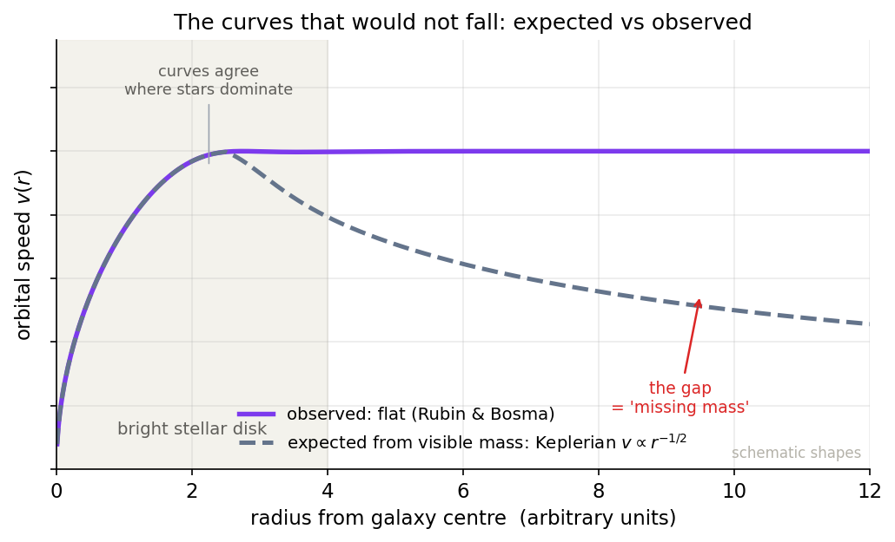

***Figure 4.1 — The curves that would not fall.*** Two rotation-curve shapes in arbitrary units: the grey dashed curve is what the visible mass predicts (a Keplerian decline, $v\propto r^{-1/2}$, once you are past the bright disk), and the purple curve is what Rubin's optical and Bosma's 21-cm measurements actually showed (flat to the largest radii). They agree where the stars dominate the gravity and diverge dramatically outside the glowing disk. Schematic illustrating the central contrast of the chapter, not plotted from any one galaxy's data.

**Source:** Figure generated by [`book/figures/ch04_keplerian_vs_flat.py`](https://github.com/carlzimmerman/zimmerman-formula/blob/main/book/figures/ch04_keplerian_vs_flat.py). Conceptual shapes following Rubin & Ford 1970 (ApJ 159, 379) and the 21-cm rotation curves of Bosma's 1978 thesis; the expected falloff follows Newton's circular-velocity law $v=\sqrt{GM(r)/r}$.

This is the **flat rotation curve**, and it is the central observational fact of this book. Let me state it carefully, because everything downstream depends on it. A flat rotation curve means that the orbital speed of stars and gas, plotted against distance from the galaxy's center, becomes roughly constant out to the largest radii we can measure — instead of declining as Kepler's law demands for any object orbiting a centrally-concentrated mass. Galaxy after galaxy showed it. Big galaxies, small galaxies, bright ones, faint ones: flat, flat, flat.

Now feel the force of this through the orbital equation. We measure the speed $v$, and we measure the radius $r$, and Newton's law tells us flatly what mass must be enclosed: $M(r) = v^2 r / G$. If $v$ stays constant while $r$ keeps growing, then $M(r)$ must *keep growing in direct proportion to $r$* — the enclosed mass goes up and up as you move outward, even into regions where there is essentially no light. The galaxy keeps getting heavier the farther out you look, long after it has stopped getting brighter.

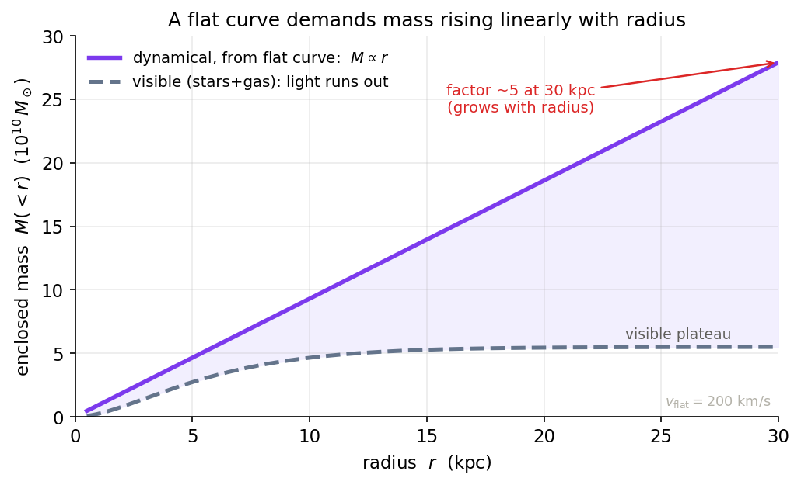

***Figure 4.2 — The mass that keeps growing after the light stops.*** The purple line is the total mass a flat $200\,\text{km/s}$ curve demands, $M(<r)=v_{\text{flat}}^2 r/G$, which rises linearly with radius without bound. The grey dashed line is the visible stars-plus-gas (an exponential disk), which plateaus once the light fades. By $30\,\text{kpc}$ the dynamics require about five times the visible mass — and the gap keeps widening outward. Computed directly from the chapter's worked-example formulas.

**Source:** Figure generated by [`book/figures/ch04_enclosed_mass_divergence.py`](https://github.com/carlzimmerman/zimmerman-formula/blob/main/book/figures/ch04_enclosed_mass_divergence.py). Dynamical mass from Newton's circular-velocity law (the chapter's $M=v^2 r/G$); visible mass is a standard exponential-disk profile. Background: Rubin & Ford 1970 (ApJ 159, 379).

> **Deeper Dive: A flat curve *demands* enclosed mass rising linearly with radius**
>
> Start again from the circular-velocity relation and solve for the enclosed mass:
>
> $$v(r) = \sqrt{\frac{GM(r)}{r}} \quad\Longrightarrow\quad M(r) = \frac{v(r)^2\,r}{G}.$$
>
> If the rotation curve is flat, $v(r) = v_{\text{flat}} = \text{const}$, then
>
> $$\boxed{\,M(r) = \frac{v_{\text{flat}}^2}{G}\,r \propto r.\,}$$
>
> The enclosed mass grows *linearly* with radius, without bound, out as far as the flat curve persists. Meanwhile the *light* stops: the surface brightness of a stellar disk falls off exponentially, so the enclosed *luminous* mass approaches a constant. The two diverge dramatically. At the optical edge of a typical bright spiral, the dynamically-required mass already exceeds the stellar-plus-gas mass by a factor of several; trace the flat curve out to where the neutral-hydrogen gas finally fades, often several times farther than the starlight, and the discrepancy grows to a factor of roughly **ten**.
>
> Equivalently, in terms of *density*: a mass profile $M(r) \propto r$ requires a density profile
>
> $$\rho(r) = \frac{1}{4\pi r^2}\frac{dM}{dr} = \frac{v_{\text{flat}}^2}{4\pi G}\,\frac{1}{r^2} \propto r^{-2}.$$
>
> An inverse-square density falloff is exactly the profile of an **isothermal sphere** — a self-gravitating ball of particles whose velocity distribution is the same at every radius, like the molecules of an isothermal (constant-temperature) gas in its own gravity. We'll return to why that particular profile keeps showing up. For now, note the chain: *flat curve* $\Rightarrow$ *mass* $\propto r$ $\Rightarrow$ *density* $\propto r^{-2}$ $\Rightarrow$ *isothermal sphere*. Each link is just algebra on Newton's law plus the measured fact that $v$ is constant.

Let me put the size of the problem in homely terms. Imagine you weigh a city by counting its lit windows at night, and your tally comes to a million people. Then you weigh the *same city* by measuring how its outskirts move — and the motion insists there are ten million people there, nine million of whom show no light at all, living in a vast dark suburb extending far beyond the glowing downtown. You would not conclude the suburb is empty. You would conclude that most of the city is dark. That is precisely the conclusion the rotation curves forced.

## The Halo: A Galaxy's Hidden Bulk

To make a flat rotation curve, then, a galaxy needs a great deal of unseen mass, and it needs that mass arranged in a particular way — spread out far beyond the visible disk, growing with radius, enclosing the bright pinwheel inside a much larger, rounder, invisible cloud. Astronomers call this hypothesized cloud the **dark-matter halo**: a roughly spherical envelope of unseen matter, several to ten times the mass of all the stars and gas, extending well past the glowing disk, whose gravity holds the outer gas in its fast, flat orbit.

The word "halo" is apt. A spiral galaxy, in this picture, is a bright flat disk of stars embedded near the center of a vast, dim, ball-shaped reservoir of something we cannot see. The disk is the part that shines; the halo is the part that weighs. By the time you reach the outer rotation curve, the halo is calling the gravitational tune — the stars are a minority partner in their own galaxy.

> **Deeper Dive: The pseudo-isothermal halo and the density profile $\rho \propto r^{-2}$**
>
> The simplest halo model that produces a flat outer rotation curve is the **pseudo-isothermal sphere**, with density
>
> $$\rho(r) = \frac{\rho_0}{1 + (r/r_c)^2},$$
>
> where $\rho_0$ is the central density and $r_c$ is a "core radius." Near the center ($r \ll r_c$) the density is roughly constant; far out ($r \gg r_c$) it tends to $\rho \propto r^{-2}$, exactly the isothermal falloff derived above. The enclosed mass then grows as $M(r) \propto r$ at large radius, and the rotation curve flattens to a constant
>
> $$v_{\text{flat}} = \sqrt{4\pi G \rho_0 r_c^2}.$$
>
> This was the phenomenological halo of the late 1970s and 1980s. Later, cosmological N-body simulations of cold dark matter (Chapter 6 and 12) produced a different, theoretically-motivated profile — the **Navarro–Frenk–White (NFW) profile**,
> $$\rho(r) = \frac{\rho_s}{(r/r_s)\,(1 + r/r_s)^2},$$
> which falls as $r^{-1}$ in the center and $r^{-3}$ far out, and which fits the *cosmological* expectation for how dark matter should clump. The mismatch between the cored isothermal halos that rotation curves seem to *prefer* and the cuspy NFW halos that simulations *predict* became known as the **core–cusp problem**, one of the small-scale tensions of the standard cosmological model we'll weigh honestly in Chapter 12. I flag it here only so you can see, even at this early stage, that "add a dark-matter halo" is not a single clean idea but a family of choices, each with its own fit and its own frictions. We will be careful, throughout this book, to keep that honesty in view.

I want to be scrupulously fair here, because this is the fork in the road, and the rest of the book lives at this fork. The flat rotation curve is an *observation* — solid, repeatable, beyond serious dispute. The dark-matter *halo* is an *interpretation* of that observation, and it is a very natural one: if Newton's gravity is exactly right and the curves are flat, then there *must* be unseen mass arranged just so. That interpretation has been the mainstream answer for fifty years, and it is a strong one. But notice that it is an interpretation, not a measurement. Rubin measured speeds. The halo is what you *add* to Newton's law to explain those speeds. In Chapter 5 we will meet the other road from this same fork — the suggestion that maybe it is the *law* that needs adjusting, not the *mass* that needs adding — and the entire framework this book is building toward lives on that second road. For now, simply hold both possibilities open. The data are the data; what they *mean* is the argument.

## Then Radio Confirmed It, and Made It Undeniable

Rubin and Ford worked in visible light, tracing HII regions. But visible starlight, and the glowing gas clouds that go with it, fade out at the optical edge of a galaxy. To really nail the flat curve, you wanted to measure rotation *even farther out*, in regions with no appreciable starlight at all — out where the only thing left to clock is cold, dark, neutral hydrogen gas. And here radio astronomy delivered a tracer that, frankly, seems almost designed for the job: the **21-centimeter line**.

Hydrogen is the most common substance in the universe, and most of it, out in the calm spaces of a galaxy, is *neutral* — a single proton with a single electron bound to it, cold and quiet, emitting no visible light. But neutral hydrogen has a subtle trick. The proton and the electron each behave like a tiny spinning magnet, and these two magnets can be aligned either the same way or opposite ways. Very, very occasionally — once in millions of years for any given atom — an atom flips from the slightly-higher-energy aligned state to the slightly-lower-energy opposite state, and in doing so it emits a single photon of radio light with a wavelength of about 21 centimeters. For any one atom this is absurdly rare. But a galaxy holds so many billions upon billions of hydrogen atoms that the faint 21-cm glow adds up into a signal radio telescopes can map in beautiful detail.

This is the **21-cm line of neutral hydrogen**, often written as the "HI line" (pronounced "H-one," meaning neutral atomic hydrogen). And it is the perfect rotation tracer for two reasons. First, neutral hydrogen extends *much* farther out than the starlight — often two, three, even four times beyond the visible disk — so it lets you measure the rotation curve in regions that are essentially dark. Second, like any spectral line it Doppler-shifts with motion, so you read the gas's speed exactly as Rubin read the speed of her HII regions, just at radio wavelengths instead of optical ones.

In the Netherlands, the radio astronomer **Albert Bosma** made this his doctoral thesis. Through the 1970s, using the Westerbork radio array, Bosma mapped the 21-cm rotation curves of two dozen spiral galaxies, pushing far beyond the optical edges Rubin's HII regions could reach. The radio curves told exactly the same story, and pushed it home: flat, flat, flat — out and out, well past the starlight, into regions where the only thing turning was invisible gas held by invisible mass. Bosma's flat curves, appearing essentially alongside Rubin and Ford's, are why the result became impossible to wave away. Two completely independent techniques — optical spectroscopy of glowing gas clouds and radio mapping of cold neutral hydrogen — using different instruments, different wavelengths, different tracers, in different countries, converged on the same stubborn, unexpected flatness. When two unrelated methods give you the same answer, you stop blaming the method.

> **Deeper Dive: Why the 21-cm line exists, and why it reaches so far**
>
> The 21-cm line is the **hyperfine transition** of the hydrogen ground state. The proton and electron each carry an intrinsic spin and an associated magnetic moment; the magnetic interaction between them splits the otherwise-single ground state into two sublevels — a triplet (spins parallel, slightly higher energy) and a singlet (spins antiparallel, slightly lower energy). The energy splitting is tiny, $\Delta E \approx 5.9 \times 10^{-6}$ eV, corresponding to a photon of frequency
> $$\nu = 1420.4\ \text{MHz}, \qquad \lambda = \frac{c}{\nu} \approx 21.1\ \text{cm}.$$
> The spontaneous transition is forbidden to leading order (it is a magnetic-dipole transition), giving it an enormous mean lifetime — on the order of $10^7$ years per atom. That extreme rarity is exactly *why* the line is so useful: it makes the gas optically thin, so the radio signal you receive is directly proportional to the *amount* of hydrogen along the line of sight, and the line traces cold neutral gas wherever it lives — including the vast outer reaches of a galaxy where there are no stars at all.
>
> Operationally, a radio array like Westerbork builds a "data cube": at each position on the sky it records the 21-cm intensity as a function of Doppler-shifted frequency, i.e. as a function of line-of-sight velocity. From this cube one extracts the velocity field across the whole HI disk and fits a **tilted-ring model** — a stack of concentric rings, each with its own rotation speed and orientation — to recover $v(r)$ out to the edge of the gas. Because the HI commonly extends to $2$–$4$ optical scale lengths beyond the last bright stars, these radio curves probe the halo-dominated regime directly, where the discrepancy with the luminous mass is largest. This is the regime where the enclosed mass-to-light ratio climbs to $\sim 10$ and beyond.

> **Worked Example: Weighing a galaxy's hidden mass from a flat curve**
>
> Let's do a real galaxy-scale calculation slowly, the way Rubin's data invite us to. Take a typical bright spiral with a flat rotation speed of
> $$v_{\text{flat}} = 200\ \text{km/s} = 2.0\times10^{5}\ \text{m/s},$$
> and suppose its 21-cm gas lets us trace that flat curve out to a radius of
> $$r = 30\ \text{kpc}.$$
> A kiloparsec is about $3.086\times10^{19}$ m, so
> $$r = 30 \times 3.086\times10^{19}\ \text{m} = 9.26\times10^{20}\ \text{m}.$$
>
> **Step 1 — Total mass enclosed within $r$, from dynamics.** Using $M(r) = v^2 r / G$ with $G = 6.674\times10^{-11}\ \text{m}^3\,\text{kg}^{-1}\,\text{s}^{-2}$:
> $$M(r) = \frac{(2.0\times10^5)^2 \,(9.26\times10^{20})}{6.674\times10^{-11}}.$$
> The numerator is $(4.0\times10^{10})\times(9.26\times10^{20}) = 3.70\times10^{31}$. Dividing:
> $$M(r) = \frac{3.70\times10^{31}}{6.674\times10^{-11}} = 5.55\times10^{41}\ \text{kg}.$$
> In solar masses ($M_\odot = 1.989\times10^{30}$ kg):
> $$M(r) = \frac{5.55\times10^{41}}{1.989\times10^{30}} \approx 2.8\times10^{11}\,M_\odot.$$
> So the dynamics demand roughly **280 billion solar masses** within 30 kpc.
>
> **Step 2 — Compare to the visible matter.** A galaxy like this has a stellar-plus-gas mass of, very roughly, $5$–$6\times10^{10}\,M_\odot$ — call it $5.5\times10^{10}\,M_\odot$, most of it well inside 30 kpc.
>
> **Step 3 — The discrepancy.**
> $$\frac{M_{\text{dynamical}}}{M_{\text{visible}}} \approx \frac{2.8\times10^{11}}{5.5\times10^{10}} \approx 5.$$
> Already a factor of five at this radius — and it *keeps climbing* if the flat curve continues past the gas, because $M(r)\propto r$ while the light has long since run out. Trace such curves to their limits and the ratio reaches of order ten. Five-sixths or more of the gravitating mass, on this accounting, is dark.
>
> Notice what we did and did not assume. We used only the measured flat speed, the measured radius, and Newton's circular-orbit law. *If* that law is exactly right, the missing mass is real and large. The entire alternative road of this book is the proposal that the last "if" is where to push. We measured a discrepancy; whether it is missing *mass* or a missing piece of the *law* is the open question. Hold the number — a factor of several to ten — and hold the honesty about what it does and does not prove.

## The Quiet Regularity Hiding Inside the Crisis

Most accounts of this history stop at the crisis: galaxies are mostly dark, here is your missing mass, on to the particle hunt. But there is a second, subtler thing buried in Rubin's and Bosma's curves, and it is the thread this whole book is really about. So let me draw it out gently, even though its full weight will not land until Part IV and Part V.

The first surprise was that the curves are *flat* rather than declining. The second surprise — quieter, and slower to be appreciated — is how *regular* the whole business is. Galaxies are wildly diverse objects: they span a factor of thousands in mass, brightness, and size; some are gas-rich, some gas-poor; some are placid, some disturbed. And yet the way the unseen mass arranges itself relative to the seen mass is not a free-for-all. There is a striking *conspiracy* between the visible disk and the invisible halo.

Here is the conspiracy, stated plainly. In the inner parts of a galaxy, the stars dominate the gravity, and the rotation curve is shaped by them. In the outer parts, the halo dominates, and the curve is shaped by it. For the curve to come out *flat* — for it to neither dip nor bump at the handoff — the falling contribution of the stellar disk and the rising contribution of the halo have to fit together with remarkable precision, right where one takes over from the other. They have to be tuned to each other. There is no obvious reason, in the dark-matter-halo picture, why a galaxy's *visible* stuff and its *invisible* stuff should know about each other so intimately as to produce a featureless flat line across the transition. They are supposed to be two different substances — ordinary matter that shines, and exotic matter that doesn't — that merely happen to share a galaxy. Why should their gravitational contributions interlock so neatly?

This is the **disk–halo conspiracy**, and it was noticed early — the very smoothness of the curves was itself a puzzle. The deeper you look, the more it sharpens. It is not just that individual curves are flat; it is that across the whole population of galaxies, the *visible* matter alone turns out to predict an astonishing amount about the *total* gravity, including the part attributed to the dark halo. Knowing where the stars and gas are, you can predict the rotation curve — dark matter and all — with a precision that, on the face of it, the dark-matter-halo picture does not obviously require.

> **Deeper Dive: The conspiracy that becomes the radial-acceleration relation**
>
> Decompose a galaxy's rotation curve into the contributions that add in quadrature:
> $$v_{\text{obs}}^2(r) = v_{\text{disk}}^2(r) + v_{\text{gas}}^2(r) + v_{\text{halo}}^2(r).$$
> The first two terms come straight from the observed light and gas (with a stellar mass-to-light ratio as the one significant fudge factor); the third is the inferred dark halo. The empirical fact — sharpened over decades since Rubin — is that $v_{\text{halo}}$ is not free. The amplitude and shape of the dark contribution are tightly correlated with the baryonic contribution, in such a way that the *total* curve is flat and, more remarkably, that the *acceleration* you actually measure at each radius is a tight, one-to-one function of the *acceleration* you would have predicted from the visible matter alone.
>
> Write the observed centripetal acceleration $g_{\text{obs}} = v_{\text{obs}}^2/r$ and the acceleration expected from the baryons alone $g_{\text{bar}} = v_{\text{bar}}^2/r$. The data of the last decade (the SPARC sample of $\sim$175 galaxies, McGaugh, Lelli, and Schombert 2016) show that $g_{\text{obs}}$ is an extremely tight function of $g_{\text{bar}}$ — the **radial-acceleration relation (RAR)** — with a characteristic transition near an acceleration scale
> $$a_0 \approx 1.2\times10^{-10}\ \text{m/s}^2.$$
> Above $a_0$, $g_{\text{obs}} \approx g_{\text{bar}}$ (ordinary Newtonian gravity, no dark matter needed). Below $a_0$, $g_{\text{obs}} \approx \sqrt{g_{\text{bar}}\,a_0}$ (the regime where the missing mass appears). The scatter about this relation is remarkably small — close to the observational error itself.
>
> This is the deep regularity that the flatness first hinted at. It is genuinely surprising in a pure dark-matter-halo picture: there is no compelling reason that the exotic halo's gravity should be *dictated*, radius by radius, by the visible matter through a single universal acceleration scale. The standard model accommodates the RAR — with enough care about how baryons settle into halos and how feedback redistributes gas, simulations can reproduce much of it — but it was not *predicted* by it. The relation, and that scale $a_0$, are exactly what Part IV (Milgrom's MOND) and Part V (this book's framework) take as the *primary clue*, the thing crying out to be explained rather than fitted.
>
> A crucial honesty, carried from the first page to the last: that the RAR is real and tight is not in dispute. *What it means* very much is. And I will say plainly, here and throughout, that the framework this book builds reproduces the RAR's *form* and ties its *scale* $a_0$ to the dark-energy density of the cosmos — but it shares those rotation-curve and Tully–Fisher successes with the *entire* MOND family; they are not unique to it, and they do not by themselves single it out. The framework is not a theory of everything yet, as frustrating as it may be. What this chapter establishes is only that the clue exists, that it is buried in the flatness Rubin found, and that it is begging for an explanation. The rest of the book is the attempt to give it one — honestly, both ways, with the open questions kept always in view.

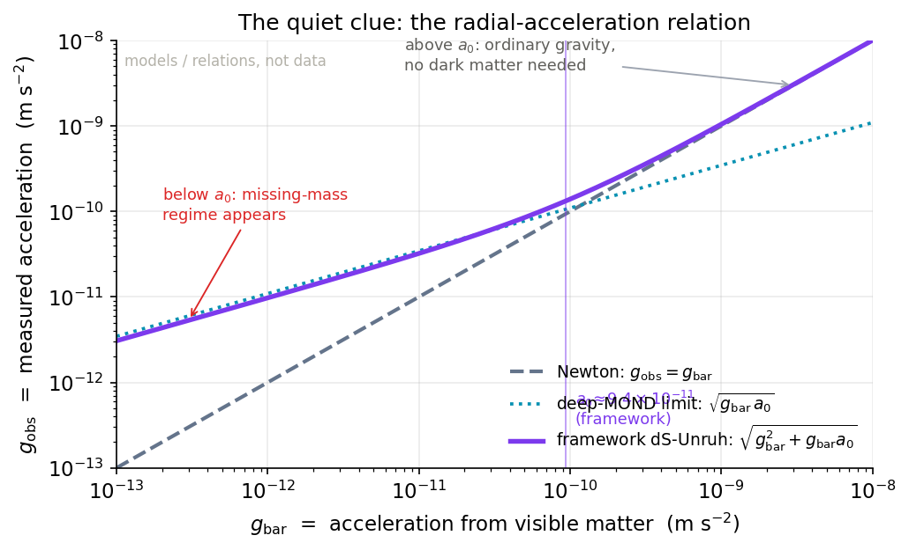

***Figure 4.3 — The regularity buried inside the crisis.*** The radial-acceleration relation plotted as models: measured acceleration $g_{\text{obs}}$ versus the acceleration the visible matter alone would produce, $g_{\text{bar}}$. Above the scale $a_0$ everything sits on the Newtonian one-to-one line (grey dashed); below it the curve bends down to the $\sqrt{g_{\text{bar}}\,a_0}$ regime where the missing mass appears (teal dotted). The purple curve is the framework's own de Sitter-Unruh interpolation, $g_{\text{obs}}=\sqrt{g_{\text{bar}}^2+g_{\text{bar}}a_0}$, with its value $a_0=c^2\sqrt{\Lambda/32\pi}\approx9.4\times10^{-11}\,\text{m/s}^2$; this $a_0$ value is an input/geometry, not derived from first principles. These are the relation and the framework curve drawn as models — no observed points are plotted.

**Source:** Figure generated by [`book/figures/ch04_radial_acceleration_relation.py`](https://github.com/carlzimmerman/zimmerman-formula/blob/main/book/figures/ch04_radial_acceleration_relation.py). RAR form and scale from McGaugh, Lelli & Schombert 2016 (PRL 117, 201101; arXiv:1609.05917) on the SPARC sample (Lelli et al. 2016, AJ 152, 157); the framework's $a_0=c^2\sqrt{\Lambda/32\pi}$ and dS-Unruh interpolation are from the framework paper, [doi.org/10.5281/zenodo.20721540](https://doi.org/10.5281/zenodo.20721540).

So the flat rotation curve gives us two gifts at once. The loud one is the crisis: galaxies are gravitationally dominated by something we cannot see, by a factor of several to ten. The quiet one is the clue: that "something," whatever it is, is governed by a single acceleration scale and locked to the visible matter with a tightness that asks to be understood. Most of physics, for fifty years, has chased the loud gift — *what is the dark stuff?* This book is mostly about taking the quiet gift seriously — *why is there a special acceleration, and why does it equal what it equals?* Keep both in your pocket. We will need them both.

## A Word on Why This Settled the Matter

It is worth asking why Rubin's curves convinced the community when Zwicky's clusters, forty years earlier, had not. The answer is instructive about how science actually moves.

Zwicky's argument was statistical and depended on a chain of assumptions about a complicated, possibly-unsettled crowd of galaxies. Each link in that chain was a place a reasonable skeptic could push. Rubin's argument was almost brutally direct: here is a single galaxy; here is its measured rotation speed at each radius; here is Newton's two-century-old law; the mass simply does not add up. There was no relaxed-crowd assumption to question, no virial average to distrust. And then Bosma's radio curves, using a wholly different tracer at a wholly different wavelength, gave the identical result and extended it farther out than starlight could go. A clean measurement, repeated independently, in a simple system, against a law no one doubted. That combination is about as persuasive as observational astronomy gets.

It is also a useful reminder, as we go forward, of what *kind* of fact a flat rotation curve is. It is not a theory. It is not an interpretation. It is a measured relationship between speed and radius in real galaxies, as solid as anything in extragalactic astronomy. Everything we build in the coming chapters — the dark-matter halo, Milgrom's modified dynamics, this book's de Sitter–Unruh framework — is an attempt to *explain* this fact. The fact itself is not up for grabs. Where the honest argument lives is in the explanations, and I will try, at every step, to give you both the strengths and the weaknesses of each, in the same breath, so that you can judge for yourself.

## Summary

- **The expectation.** A galaxy's light is concentrated toward its center. By Newton's law of orbits, $v(r)=\sqrt{GM(r)/r}$, the rotation speed of gas beyond the bright disk *should* decline with radius (Keplerian falloff, $v\propto r^{-1/2}$), just as the planets slow down with distance from the Sun.

- **The measurement.** Vera Rubin and Kent Ford, using a sensitive image-tube spectrograph and Doppler spectroscopy of HII regions (notably the H$\alpha$ line), measured the rotation curves of dozens of spiral galaxies in the 1970s, far out into their disks.

- **The surprise.** The curves did not fall. They rose, leveled off, and stayed **flat** out to the largest radii measured — the central observational fact of this book. The visible edge of a galaxy turns just as fast as its interior.

- **What flatness demands.** $v=\text{const}$ forces the enclosed mass to grow linearly with radius, $M(r)\propto r$, and the density to fall as $\rho\propto r^{-2}$ (an isothermal sphere) — even where there is no light. Galaxies need roughly **ten times** more gravitating mass than their stars and gas supply, arranged in an extended, roughly spherical **dark-matter halo**.

- **Radio confirmation.** Albert Bosma mapped the **21-cm line of neutral hydrogen**, which reaches far beyond the starlight, and found the same flatness even farther out. Two independent techniques (optical and radio) converging made the missing mass undeniable.

- **Crisis and clue.** The loud lesson is the crisis: galaxies are dominated by unseen mass. The quiet lesson — the thread of this whole book — is the *regularity*: the dark and visible contributions conspire to make flat curves and obey a tight **radial-acceleration relation** with a universal scale $a_0\approx1.2\times10^{-10}\ \text{m/s}^2$. That clue, not the crisis, is what Parts IV and V try to explain.

- **The honest standing, stated early.** That the curves are flat and the RAR is tight is *measured fact*, beyond dispute. Whether the explanation is unseen *mass* or a modified *law* is the open fork we take up in Chapter 5 — and even the framework this book builds, which reproduces the RAR's form and ties $a_0$ to dark energy, shares those galaxy-scale successes with the whole MOND family and is not, as frustrating as it may be, a theory of everything yet.

## Questions

1. **(Easy.)** In our Solar System, why does Neptune orbit so much more slowly than Earth? Using the idea behind the orbital-speed equation in words (no algebra needed), explain why we *expected* a galaxy's rotation curve to decline at large radius, and state in one sentence what Rubin actually found instead.

2. **(Easy–medium.)** Explain in your own words how a Doppler shift lets us measure the speed of gas in a distant galaxy we can never visit. Why do we need known spectral lines (atomic "fingerprints") to do it — what goes wrong if we only have a single, unlabeled color of light?

3. **(Medium, calculation.)** A spiral galaxy has a flat rotation speed of $v_{\text{flat}}=150$ km/s, and its 21-cm gas traces the flat curve out to $r=25$ kpc. Using $M(r)=v^2 r/G$, estimate the total mass enclosed within 25 kpc (in solar masses). If the visible mass is about $3\times10^{10}\,M_\odot$, what is the ratio of dynamical to visible mass? (Useful: $1\,\text{kpc}=3.086\times10^{19}$ m; $G=6.674\times10^{-11}$ SI; $M_\odot=1.989\times10^{30}$ kg.)

4. **(Medium.)** Show, starting from a flat rotation curve ($v=\text{const}$), that the required mass profile is $M(r)\propto r$ and the density profile is $\rho(r)\propto r^{-2}$. Why is the $r^{-2}$ profile called "isothermal," and what does that name borrow from the physics of ordinary gases?

5. **(Medium–hard, conceptual.)** State the "disk–halo conspiracy" in your own words. Why is it *surprising* in a picture where ordinary matter and dark matter are two completely different substances that merely share a galaxy? What feature of the data (introduced in the final Deeper Dive box) sharpens the conspiracy into a quantitative regularity, and what is the characteristic acceleration scale involved?

6. **(Research-level.)** The radial-acceleration relation has remarkably small scatter — close to the observational uncertainties. Sketch how a cold-dark-matter cosmology might *accommodate* this relation (think: how baryons settle into halos, mass-to-light ratios, feedback) versus how a modified-dynamics view would *predict* it from a single acceleration scale. What kinds of observations could, in principle, distinguish "the RAR is an emergent coincidence of galaxy formation" from "the RAR reflects a fundamental law"? In your answer, be explicit about which galaxy-scale successes would be *shared* by any MOND-family theory and therefore could *not*, by themselves, single out one specific framework over another.

# Chapter 5: Two Roads from the Fork: A Particle, or a New Law

> *When the ledger doesn't balance, an honest accountant has exactly two suspicions: there is money you cannot see, or the arithmetic rule you trusted is wrong. Physics has been standing at that fork since 1933, and we are still deciding which road to take.*

## A Bookkeeping Problem, Written in Starlight

Let me start with the picture we have built up over the last four chapters, because the whole of this book turns on it, and I want it to be perfectly clear before we choose where to walk next.

We learned how to weigh the heavens. From Kepler's patient curves and Newton's law of gravity (Chapter 2), we got a rule of breathtaking power: watch how fast something orbits, measure how far out it sits, and you can read off the mass that is holding it in place. The faster the orbit at a given radius, the more mass must be pulling on it. This is not a guess or a model; it is the same logic that lets us weigh the Sun by watching the Earth go around it, and weigh the Earth by watching the Moon. It has never failed us in the Solar System.

Then we pointed that same scale at bigger things, and the bill came back wrong.

Fritz Zwicky did it first, in 1933, with the Coma cluster of galaxies (Chapter 3). He used the virial theorem — the rule that, for a stable swarm of objects held together by gravity, the total motion and the total gravity have to be in a fixed, lawful balance. The galaxies in Coma were moving far too fast for the gravity their visible matter could supply. By the bookkeeping, the cluster should have flown apart long ago. Zwicky's word for the missing pull was *dunkle Materie* — dark matter. He meant it almost as a placeholder: *something* is there that we are not seeing.

Then Vera Rubin and Kent Ford, in the 1970s, found the same shortfall written into single galaxies, one star-speed at a time (Chapter 4). Out at the visible edge of a spiral galaxy and well beyond it, the stars and gas clouds keep circling just as fast as they do near the bright center. Newton's rule says they should slow down out there, the way distant Neptune ambles around the Sun far more slowly than close-in Mercury sprints. They do not slow down. The rotation curves go *flat*. To keep those outer stars moving that fast, by the same Kepler–Newton logic that has never let us down at home, there has to be roughly five to ten times more mass than we can see — and it has to be spread out in a great invisible halo, far beyond the visible disk.

So the ledger does not balance. The motions we measure require more gravity than the matter we see can provide. This is the single, stubborn, repeatedly-confirmed fact at the heart of this book. It is not in doubt. Galaxies and clusters behave as though there is *more there* than meets the eye.

The question — the *whole* question — is what to write in the column marked "explanation."

## When the Books Don't Balance

Imagine you keep the accounts for a small business, and one evening the numbers refuse to add up. The bank says you have more money than your records can explain. There is real cash in the account, more than your ledger of sales and expenses predicts. What do you do?

An honest accountant has exactly two kinds of suspicion, and they are genuinely different in their logic.

The first suspicion: **there is an asset I have not recorded.** A payment came in that I forgot to write down. A client paid early. There is something *real and present* that I simply failed to see and account for. The fix is to go find it and add it to the books. The rule of arithmetic — addition, subtraction — is perfectly fine. What was missing was an *entry*.

The second suspicion: **the rule I am using to add things up is wrong.** Maybe I have been applying the sales tax incorrectly, or double-counting a category, or using last year's exchange rate. In that case there is no hidden cash to go find. The money in the account is exactly what it should be; my *accounting rule* was off, and once I correct the rule, everything balances with no mystery asset at all.

Notice that both of these are completely respectable responses to an unbalanced ledger. Neither is foolish. Neither is desperate. A careful accountant would consider both, and the only way to know which is right is to gather more evidence — to look for the missing payment, *and* to re-check the rules, and see which suspicion survives contact with the details.

This is precisely the fork that physics reached when the cosmic ledger came back wrong. And I want to be honest with you from the first page of this chapter: physics, faced with this choice, mostly chose the *first* road. It chose the hidden asset. It decided that the galaxies are full of matter we cannot see, and set out to find it. That is the road called **dark matter**, and as we will see in Chapter 6, it is a serious, well-motivated, and in many ways beautiful idea, pursued by brilliant people for half a century.

But there was always a second road. And this book is, in large part, an honest exploration of that road less taken — the suspicion that maybe the accounting rule itself, the law of gravity-and-motion, is a little different than Newton taught us when gravity gets *very, very weak*. That road is called **modified dynamics**. We will walk down it carefully, and I will try at every step to tell you both what is genuinely promising about it and what remains unproven — because, as I will keep saying throughout this book, the framework at the end of this road is **not a theory of everything yet, as frustrating as it may be.**

Let me lay out both roads fairly. They deserve it.

## The First Road: A Hidden Asset (The Dark-Matter Particle)

The first road takes the ledger's arithmetic to be exactly right. Newton's law of gravity, and Einstein's improvement on it (which we will meet in Chapters 7 and 8), are assumed to be correct as written. If the motions demand more gravity, then there must be more *matter* there — gravitating matter we have simply failed to see.

What kind of matter could hide so well? Not ordinary stuff. We are very good now at detecting ordinary matter, even when it doesn't shine. Cold gas, dust, faint dim stars, stray planets, black holes — astronomers have careful ways to find or rule out all of these, and there simply isn't enough of any of them to close the gap. Whatever the missing mass is, it must be something genuinely new: a kind of particle that has mass (so it feels and produces gravity) but that does not give off, absorb, or reflect light, and barely interacts with ordinary matter at all. It would pass through you, through the Earth, through the Sun, almost without noticing.

This is the **dark-matter particle**: a hypothesized new kind of fundamental particle, not part of the known roster of physics (the "Standard Model" of particle physics, which we will properly meet later), that carries mass and gravitates but is essentially invisible and untouchable by ordinary means. Add enough of these particles, spread into vast halos around every galaxy and pooled inside every cluster, and the books balance. The fast-orbiting stars are fast because there really *is* more mass out there — you just can't see it.

I want to stress how reasonable this is, because it is easy, when you are excited about the other road, to be unfair to this one. The history of physics is full of triumphant hidden assets. The planet Neptune was predicted, before anyone saw it, because Uranus was orbiting *wrong* — and the fix was not a new law of gravity but a new, unseen mass tugging on Uranus from farther out. Astronomers pointed their telescopes where the math said the hidden planet must be, and there it was. The neutrino was proposed to balance the energy books in radioactive decay decades before anyone caught one. Adding an unseen something, to save a law that has earned our trust, is one of the most successful moves in the whole history of science. It would be foolish to sneer at it.

And dark matter does more than just patch rotation curves. As we will see in Part 2, the same idea — cold, slow-moving, invisible particles — does remarkable work on the largest scales: in how galaxies are spread across the cosmos, in the faint pattern of the oldest light in the universe (the cosmic microwave background, Chapter 10), in how the cosmic web of structure grew from tiny early ripples. A single ingredient, doing many jobs at once. That is exactly what a good scientific idea is supposed to do.

> **Deeper Dive: Dark Matter as a Term in the Stress–Energy Tensor**
>
> For readers who want the precise logical shape of the first road, here it is in the language of General Relativity (developed in Chapters 7–8, so skip this freely on a first read).
>
> Einstein's field equations relate the curvature of spacetime to its matter-energy content:
> $$ G_{\mu\nu} = \frac{8\pi G}{c^4}\, T_{\mu\nu}. $$
> The left side, the Einstein tensor $G_{\mu\nu}$, is *pure geometry* — it encodes how spacetime is curved. The right side, the **stress–energy tensor** $T_{\mu\nu}$, is the complete bookkeeping of everything that gravitates: it is a 4×4 array of numbers that, at every point in spacetime, records the energy density, the momentum, the pressure, and the internal stresses of all the matter and energy present. *Whatever has mass or energy contributes to $T_{\mu\nu}$, and $T_{\mu\nu}$ is what tells spacetime how to curve.*
>
> The dark-matter road is, in this language, breathtakingly conservative. It does not touch the equation at all. It leaves $G_{\mu\nu} = (8\pi G/c^4)\,T_{\mu\nu}$ exactly as Einstein wrote it. It simply adds a new piece to the *source*:
> $$ T_{\mu\nu} = T_{\mu\nu}^{\text{(baryons)}} + T_{\mu\nu}^{\text{(radiation)}} + T_{\mu\nu}^{\text{(dark matter)}} + \dots $$
> Here "baryons" is the physicist's shorthand for ordinary matter — the protons and neutrons that make up stars, gas, planets, and you. The new term $T_{\mu\nu}^{\text{(dark matter)}}$ describes a fluid of pressureless, non-radiating particles ("cold dark matter," or CDM). Cold means slow-moving; pressureless ($p \approx 0$) means it can clump under gravity without pushing back. That single, simple equation-of-state choice is enough to grow the cosmic structure we observe.
>
> The logical signature of the first road, then, is: **change the source, keep the law.** You are adding an entry to the ledger ($T_{\mu\nu}$), not editing the rule of arithmetic ($G_{\mu\nu}$ and the $8\pi G/c^4$ that links them).

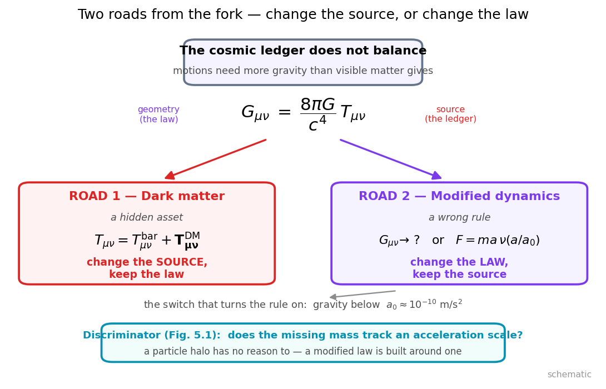

***Figure 5.1 — Two roads from one fork: change the source, or change the law.*** A schematic of the chapter's central logical contrast, drawn on Einstein's field equation $G_{\mu\nu}=(8\pi G/c^4)\,T_{\mu\nu}$. Road 1 (dark matter) adds a new piece $T^{\rm DM}_{\mu\nu}$ to the *source* and leaves the law untouched; Road 2 (modified dynamics) edits the *law* — either the geometric side $G_{\mu\nu}$ or the inertia relation $F=ma\,\nu(a/a_0)$ — while keeping only the matter we can see. Both are triggered by gravity sinking below the special acceleration $a_0\approx10^{-10}$ m/s$^2$, and both are weighed by the same discriminator (Fig. 5.2).

**Source:** Figure generated by [`book/figures/ch05_two_roads.py`](https://github.com/carlzimmerman/zimmerman-formula/blob/main/book/figures/ch05_two_roads.py). Conceptual diagram of the source-versus-law contrast laid out in this chapter's two Deeper-Dive boxes; the framework value $a_0\approx9.36\times10^{-11}$ m/s$^2$ is from the spine paper, [doi.org/10.5281/zenodo.20721540](https://doi.org/10.5281/zenodo.20721540).

## The Second Road: A Different Rule (Modified Dynamics)

Now the other road, which physics mostly did not take, and which this book exists to explore honestly.

The second road takes the *matter* to be exactly what we see — no hidden halos, no invisible particles — and questions the *rule* instead. Specifically, it questions what happens to the law connecting gravity and motion when the gravity gets extraordinarily, almost unimaginably weak.

Here is the everyday intuition, and it is worth sitting with, because it is not at all silly. Every law of physics we have ever written down was discovered in some particular range of conditions, and then we *assumed* it keeps holding far outside that range. Sometimes that assumption is right. Sometimes it isn't. Newton's law of motion and gravity was hammered out from falling apples, swinging pendulums, cannonballs, and the planets of the Solar System. In every one of those settings, the accelerations involved are — by cosmic standards — enormous. The gentlest tug Newton ever tested his law against is still ferociously strong compared to the feeble gravity an outlying star feels at the ragged edge of a galaxy.

How feeble? We will make this precise in a moment, but let me give you the headline first. There appears to be a special, very small acceleration in nature — call it $a_0$ — below which the trouble starts. Above $a_0$, in the familiar strong-gravity world of planets and pendulums, everything obeys Newton beautifully. Below $a_0$, out in the galactic hinterlands where gravity is gentler than $a_0$, the rotation curves go flat and the books stop balancing. The mismatch does not appear at a particular *distance*, or a particular *size*, or a particular *mass* — it appears, with remarkable consistency, at a particular *acceleration*.

That is a stunning clue, and we will spend much of this book taking it seriously. An **acceleration scale** is simply a particular value of acceleration that nature seems to single out as special — a threshold, measured in units of speed-gained-per-second (meters per second, per second), below which the physics changes character. The claim of the second road is that $a_0$ is real, that it is a genuine feature of how the universe works, and that *the rule of dynamics itself is different on the two sides of it.*

So **modified dynamics** means exactly this: instead of adding unseen matter, you propose that the law relating force, mass, and motion — or the law of gravity, or both — is not quite Newton's law when accelerations fall below $a_0$. The matter is all visible. The *rule* is what changes. In the weak-gravity regime, a given amount of visible matter produces *more* effective pull, or equivalently a given pull produces *more* acceleration, than Newton would have predicted — and that "extra," which a dark-matter theorist reads as hidden mass, the modified-dynamics theorist reads as a *correction to the law*.

The pioneer of this road was the Israeli physicist Mordehai Milgrom, who in 1983 wrote down the simplest version of it. We will give his idea — MOND, for MOdified Newtonian Dynamics — a full and careful chapter of its own (Chapter 17), and we will be honest about both its genuine triumphs and its real, unsolved problems (Chapter 19). For now I only want you to hold the *shape* of the idea: not a new substance, but a new rule, switched on by a special tiny acceleration.

> **Deeper Dive: Modified Dynamics as a Change to the Action (or the Inertia Relation)**
>
> Here is the precise logical contrast with the first road. Where dark matter changed the *source* $T_{\mu\nu}$ and left the law alone, modified dynamics does the reverse: it leaves the visible matter exactly as it is and changes the *law*. There are two distinct places one can intervene, and the distinction matters a great deal later in this book.
>
> **(1) Modify the gravity / the field equation (modified gravity).** One can change the left-hand, geometric side — or equivalently the gravitational part of the *action*, the master quantity whose minimization yields the equations of motion. Milgrom's nonrelativistic field formulation (AQUAL, 1984) replaces the ordinary Poisson equation for the gravitational potential $\Phi$,
> $$ \nabla\cdot\big(\nabla\Phi\big) = 4\pi G\,\rho, $$
> with a nonlinear version that depends on the *strength* of the gravitational field:
> $$ \nabla\cdot\!\left[\mu\!\left(\frac{|\nabla\Phi|}{a_0}\right)\nabla\Phi\right] = 4\pi G\,\rho. $$
> The new ingredient is the **interpolation function** $\mu(x)$, which smoothly switches behavior: $\mu \to 1$ when $x \gg 1$ (strong field, recovering Newton) and $\mu \to x$ when $x \ll 1$ (weak field, below $a_0$). The matter density $\rho$ on the right is *only the visible matter*. No new term in $T_{\mu\nu}$.
>
> **(2) Modify the inertia (modified inertia).** Alternatively — and this is the branch this book ultimately follows — one leaves *gravity* alone and changes the other half of $F = ma$: the relation between a force and the acceleration it produces. The claim is that an object's **inertia** (its resistance to being accelerated, the $m$ in $F=ma$) is not a fixed constant of the object but depends on its state of motion *relative to the universe*, in a way that only reveals itself at accelerations below $a_0$. Schematically, the simple force law $F = m a$ is replaced by something like
> $$ F = m\,a\,\nu\!\left(\frac{a}{a_0}\right), $$
> with $\nu \to 1$ for $a \gg a_0$ (ordinary inertia) and the effective inertia *dropping* for $a \ll a_0$ (so a given force buys you *more* acceleration than Newton expects — which, read through Newtonian eyes, masquerades as extra gravitating mass). Milgrom himself explored this "modified inertia" route in 1994 and 1999, and it is the route that, much later in this book (Chapters 20–21), connects to a temperature that empty space acquires in an accelerating universe.
>
> The logical signature of the *second* road, in either branch, is the mirror image of the first: **change the law, keep the source.** You are editing the rule of arithmetic — the action, the field equation, or the inertia relation — not adding a hidden entry to the ledger $T_{\mu\nu}$.
>
> A caution I will repeat whenever it is due: drawing a *covariant, fully relativistic* version of either branch — one that also correctly bends light and survives every Solar-System test — is genuinely hard, and remains an open and contested problem. The honest reader should keep that flag planted from the start; we return to it in earnest in Chapter 28.

## Why This Really Is a Fork, and Not a Settled Question

I have called this a "fork," and I want to defend that word, because the mainstream of physics today would mostly tell you the question is closed: dark matter won, the second road is a curiosity, move along. I do not think that is quite fair, and I want to explain why — carefully, and without overselling the other side.

Here is the situation as honestly as I can put it. Each road has done real, impressive work, and each road has a real, unhealed wound.

The dark-matter road has been spectacularly successful on the *largest* scales — the cosmic web, the early-universe light, the growth of structure (we will see all of this in Part 2). But it has a wound on the *smallest* relevant scales: at the level of individual galaxies, dark matter does not naturally explain why everything organizes itself around that one special acceleration $a_0$. It *can* be made to fit galaxy rotation curves — but only by tuning the invisible halo of each galaxy, more or less by hand, to match the visible matter. The tightness of the connection between what you see and how things move, galaxy after galaxy, is something dark matter accommodates rather than predicts.

The modified-dynamics road is the mirror image. It has been spectacularly successful on *galaxy* scales — it predicted the flat rotation curves and the tight regularities (which we will meet as the radial-acceleration relation and the baryonic Tully–Fisher relation, Chapter 18) decades before they were measured this precisely, and it did so with essentially no free knobs per galaxy. But it has wounds on *larger* scales: galaxy clusters keep a residual mass discrepancy that simple modified dynamics does not fully cure (Chapter 29), and bending light — gravitational lensing — has been a persistent, serious difficulty for these theories (Chapter 28). I will not hide either of those from you. They are real.

So neither road is clean. The honest summary is not "dark matter is proven and modified dynamics is dead." The honest summary is: *we have two incomplete pictures, each strong exactly where the other is weak,* and the universe is under no obligation to have made our choice easy. That is what a genuine fork looks like. And it is why I think the road less taken still deserves a careful, generous, both-ways-honest book — which is what I am trying to give you here.

> **Deeper Dive: The Empirical Discriminator — Does the Missing Mass Track an Acceleration Scale?**
>
> If the two roads are genuinely different theories, there ought to be an observation that, in principle, tells them apart. The cleanest such discriminator is already visible in the structure of the two roads, and I want to state it precisely because it will organize much of Parts 4 and 5.
>
> The discriminator is this: **does the "missing mass" of a system know about an acceleration scale?**
>
> Consider the *modified-dynamics* prediction. If the law changes below a fixed acceleration $a_0$, then the size of the discrepancy between visible and dynamical mass must be a function of *acceleration* and nothing else. Define the discrepancy at radius $r$ as the ratio of the acceleration actually needed, $g_{\text{obs}}$, to the acceleration the visible (baryonic) matter alone would supply by Newton, $g_{\text{bar}}$. Modified dynamics insists that
> $$ \frac{g_{\text{obs}}}{g_{\text{bar}}} \;=\; \mathcal{F}\!\left(\frac{g_{\text{bar}}}{a_0}\right) $$
> is a *single universal function* of the local acceleration scaled by $a_0$ — the *same* function for a giant spiral, a dwarf, a low-surface-brightness disk, the inner regions and the outer regions alike. Where $g_{\text{bar}} \gg a_0$ the discrepancy vanishes ($g_{\text{obs}} \approx g_{\text{bar}}$, pure Newton); where $g_{\text{bar}} \ll a_0$ it grows in a fixed, predicted way. Crucially, *the discrepancy at a given acceleration does not care about the galaxy's size, mass, history, or environment* — only about where the local acceleration sits relative to $a_0$. This is a sharp, falsifiable claim.
>
> Now contrast the *dark-matter* expectation. A halo of particles has no reason whatsoever to respect an acceleration scale. The amount of dark matter inside some radius is set by that galaxy's particular formation history — how it collapsed, merged, and settled — and the relevant scales for a particle halo are densities, masses, and lengths, *not accelerations*. There is no term anywhere in $T_{\mu\nu}^{\text{(dark matter)}}$ that contains $a_0$. So a pure particle picture predicts *scatter*: the discrepancy at a given acceleration should vary from galaxy to galaxy, depending on each one's idiosyncratic dark halo. A tight, universal $g_{\text{obs}}$-versus-$g_{\text{bar}}$ relation, pinned to one acceleration, is *not* what an uncorrelated particle halo naturally gives you.
>
> This is the heart of the matter, and it is worth stating as plainly as I can: **a particle has no reason to respect an acceleration scale; a modified law of dynamics is *built around* one.** When we meet the radial-acceleration relation in Chapter 18, we will see that nature does, in fact, organize the missing mass around a single acceleration with startlingly little scatter. Whether that is a deep clue (the modified-dynamics reading) or an emergent regularity that dark matter can be made to reproduce (the dark-matter reading, which has its own serious responses) is exactly the live question. I will give both sides their due. But the *form* of the discriminator — track the acceleration scale, or don't — is the cleanest fork in the whole subject, and you now hold it.

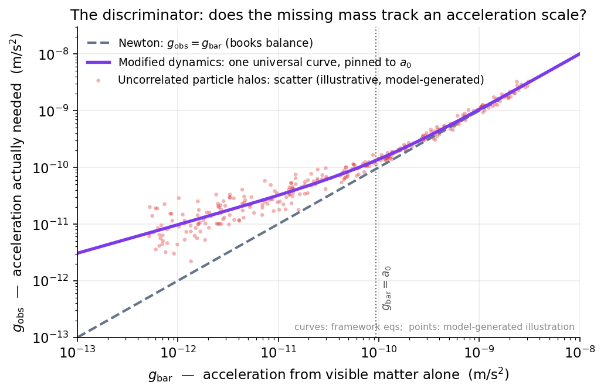

***Figure 5.2 — The cleanest fork in the subject: does the missing mass know about an acceleration scale?*** The acceleration actually needed, $g_{\rm obs}$, plotted against the acceleration the visible matter alone supplies, $g_{\rm bar}$. The purple curve is *computed from the framework's own equation* $g_{\rm obs}=\sqrt{g_{\rm bar}^2+g_{\rm bar}\,a_0}$ (with $a_0=9.36\times10^{-11}$ m/s$^2$): one universal relation, pinned to $a_0$, that every galaxy must follow. The red points are *illustrative, model-generated* — they show the scatter you expect when each galaxy's halo is set by its own idiosyncratic history rather than by a single acceleration. Both pictures merge into the grey Newton line at high acceleration; they part company only below $a_0$. (The MOND value $1.2\times10^{-10}$ would lie essentially on top of the purple curve at this scale.)

**Source:** Figure generated by [`book/figures/ch05_discriminator_rar.py`](https://github.com/carlzimmerman/zimmerman-formula/blob/main/book/figures/ch05_discriminator_rar.py). Framework interpolation and $a_0$ from the spine paper, [doi.org/10.5281/zenodo.20721540](https://doi.org/10.5281/zenodo.20721540); the empirical relation this plot anticipates is the radial-acceleration relation of McGaugh, Lelli & Schombert 2016, PRL 117, 201101 ([arXiv:1609.05917](https://arxiv.org/abs/1609.05917)), measured on the SPARC database (Lelli, McGaugh & Schombert 2016, AJ 152, 157).

## Falsifiability: The Rule That Keeps Us Honest

Before we choose a road to walk down for the rest of the book, I owe you one more idea, because it is the standard by which everything that follows must be judged.

A scientific claim earns its keep by being **falsifiable** — by making a specific prediction that could, in principle, be shown wrong by an observation. This is the philosopher Karl Popper's idea, and it is the bright line between science and mere story-telling. A theory that can absorb *any* result, that always finds a way to be right no matter what the data say, has told you nothing. A theory that says "if you look here, you will see *this* particular thing, and if you see something else instead, I am wrong" has put itself at risk — and a theory that puts itself at risk, and survives, has earned your trust.

This matters enormously at our fork, and it cuts in *both* directions, so let me be even-handed.

A common complaint against the dark-matter road is that it is hard to falsify: if you don't find the particle in one experiment, you can always say it is lighter, or fainter, or more weakly-interacting than that experiment could catch, and keep searching (we will watch fifty years of exactly this in Chapter 6). That is a fair worry — but it is not fatal, because dark matter *does* make falsifiable predictions on cosmic scales, and it has passed several genuinely risky tests there. So it is not unfalsifiable; it is just slippery on the particle-detection front specifically.

The modified-dynamics road has the opposite temperament: it is *almost too* falsifiable on galaxy scales. Because it has so few free knobs — ideally just the one acceleration $a_0$, the same for every galaxy in the universe — it sticks its neck out constantly. It told us flat rotation curves before we measured them precisely. It predicts that one universal acceleration relation, and a single galaxy that badly violated it would be a serious blow. That riskiness is, to my mind, a point in its favor as *science*, quite apart from whether it is ultimately *correct*. A theory that can be killed by a single clean measurement is a theory worth testing.

And this is the spirit in which I want you to read the rest of this book, especially when we reach the specific framework at its center in Part 5. That framework — which sets the special acceleration $a_0$ by the dark energy filling the universe — makes a genuinely falsifiable, forward-looking prediction: that $a_0$ should *change* slightly over cosmic history, tracking the dark-energy density, in a particular way that telescopes in the coming decade can test (Chapters 25–26). It is exactly the kind of neck-out claim that science is supposed to make. Whether it survives, I do not know, and I will not pretend to. I will only promise to tell you, both ways, what the evidence says as it comes in — and to remind you, as honestly as I can, that even at its best the framework is **not a theory of everything yet, as frustrating as it may be.**

> **Worked Example: How Small Is the Special Acceleration $a_0$?**
>
> Let me make "very, very weak gravity" concrete with a slow, careful calculation, because numbers anchor intuition better than words.
>
> The special acceleration in modified-dynamics theories has a measured value of roughly
> $$ a_0 \approx 1.2 \times 10^{-10}\ \text{m/s}^2. $$
> (The particular framework at the center of this book pins it to a slightly different value, $a_0 \approx 9.36 \times 10^{-11}\ \text{m/s}^2$, from the dark-energy density — but for getting a feel for the *size*, the difference between these two doesn't matter. Both are "about $10^{-10}$ m/s²," and that is the number to carry in your head. Where this value comes from, and whether it is *derived* or *posited*, we take up with great care in Part 5; for now, treat it as a measured fact about galaxies.)
>
> **Step 1 — what does $10^{-10}$ m/s² even mean?** An acceleration of 1 m/s² means your speed grows by one meter per second, every second. Earth's surface gravity is about $g = 9.8$ m/s² — drop a stone and after one second it is falling at about 9.8 m/s, after two seconds about 19.6 m/s, and so on. So $a_0$ is gravity, but *weaker than Earth's surface gravity by a factor of*
> $$ \frac{g}{a_0} \approx \frac{9.8}{1.2\times 10^{-10}} \approx 8 \times 10^{10}, $$
> about eighty billion times feebler than the pull holding you in your chair.
>
> **Step 2 — make it human.** A pull of $a_0 \approx 1.2\times10^{-10}$ m/s² would take an object, starting from rest, and speed it up by $1.2\times10^{-10}$ meters per second each second. How long until it reaches a brisk walking pace of, say, 1.4 m/s (about 3 miles per hour)?
> $$ t = \frac{\text{speed}}{\text{acceleration}} = \frac{1.4\ \text{m/s}}{1.2\times10^{-10}\ \text{m/s}^2} \approx 1.2\times 10^{10}\ \text{s}. $$
> Converting: $1.2\times10^{10}$ seconds is about
> $$ \frac{1.2\times10^{10}}{3.15\times10^{7}\ \text{s/yr}} \approx 370\ \text{years}. $$
> Under this acceleration, it would take you *almost four centuries* to work up to a walking pace from a dead stop. That is how absurdly gentle $a_0$ is. No apple, no cannonball, no planet in the Solar System ever feels a pull this weak — which is exactly *why* Newton never had occasion to test his law down here, and why it is at least *reasonable* to wonder whether the law might be a little different in this unexplored basement of weak gravity.
>
> **Step 3 — where in a galaxy do we reach it?** A star in the outer disk of a spiral like the Milky Way feels a gravitational pull from all the galaxy's visible matter of very roughly $10^{-10}$ m/s² — right around $a_0$. *That is the whole point.* The mismatch in galaxies switches on precisely where the visible-matter gravity sinks to about $a_0$. It is not a coincidence of size or mass; it is a threshold in *acceleration*. Whether that threshold is a clue about the law of dynamics or an accident of how dark halos arrange themselves is the question this book exists to weigh.

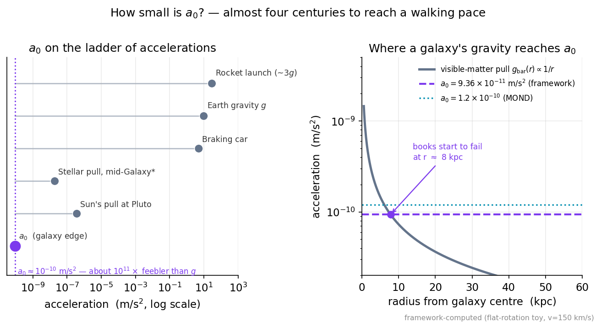

***Figure 5.3 — How small is $a_0$, and where in a galaxy you reach it.*** *Left:* the special acceleration $a_0\approx9.36\times10^{-11}$ m/s$^2$ placed on a logarithmic ladder of familiar accelerations — it sits roughly eleven orders of magnitude below Earth's surface gravity, the regime no apple, cannonball, or Solar-System planet ever explores. *Right:* for a flat-rotation toy galaxy ($v=150$ km/s), the Newtonian pull of the visible matter falls as $g_{\rm bar}=v^2/r$ and crosses $a_0$ near $r\approx8$ kpc — exactly the radius where, as the Worked Example explains, the books stop balancing. Both panels are computed from the stated formulas and hardcoded constants.

**Source:** Figure generated by [`book/figures/ch05_how_weak_is_a0.py`](https://github.com/carlzimmerman/zimmerman-formula/blob/main/book/figures/ch05_how_weak_is_a0.py). Framework value $a_0=9.36\times10^{-11}$ m/s$^2$ from the spine paper, [doi.org/10.5281/zenodo.20721540](https://doi.org/10.5281/zenodo.20721540); the empirical scale $a_0\approx1.2\times10^{-10}$ m/s$^2$ and the flat-rotation phenomenon are from Milgrom 1983, ApJ 270, 365, and the rotation-curve measurements of Rubin & Ford 1970, ApJ 159, 379.

## The Road We Will Walk

So here we stand at the fork, with the cosmic ledger refusing to balance and two honest suspicions before us.

Down the first road lies the hidden asset: a new particle, invisible and untouchable, pooled into halos that supply the missing gravity while Newton's and Einstein's laws stand untouched. It is conservative, it is well-motivated, it has done magnificent work on the largest scales, and the overwhelming majority of physicists have walked it for fifty years. We will follow them down it in Chapter 6 and give it a fair and full hearing, including the long, so-far-empty search for the particle itself.

Down the second road lies the questioned rule: no hidden matter, but a law of dynamics that turns subtly different when gravity falls below a special, almost unimaginably gentle acceleration $a_0$. It is the road less taken. It has done magnificent work on galaxy scales and carries real wounds on larger ones. And it is the road that, in Part 5, leads to the particular framework this book was written to explain — one in which that special acceleration is not a free fudge factor at all, but is set by the dark energy that fills the accelerating universe.

I am not going to ask you to bet on which road is right. I do not know which is right, and anyone who tells you they are *certain* is telling you more than the evidence allows. What I will ask is that you keep both maps open as we go, that you hold each idea to the same hard standard of falsifiability, and that you let the discriminator we found in this chapter — *does the missing mass track an acceleration scale?* — be the compass you check at every turn.

Because that is the real question waiting at the end of both roads. A particle has no reason to respect an acceleration scale. A law of dynamics is built around one. The universe, it turns out, has left us a clue about which it prefers. Let us go and read it carefully, both ways, and see how far an honest accounting can take us.

## Summary

- The central, repeatedly-confirmed fact from Chapters 2–4 is a **bookkeeping problem**: the motions of stars in galaxies and galaxies in clusters require more gravity than their visible matter can supply, by factors of five to ten or more.
- Faced with an unbalanced ledger, there are exactly two honest suspicions: **a hidden asset** (an entry you failed to record) or **a wrong accounting rule** (the arithmetic itself needs fixing). Physics, since 1933, has mostly chosen the hidden asset.
- **Road one — the dark-matter particle.** Keep the law (Newton/Einstein) exactly as written; add unseen, non-luminous, weakly-interacting massive particles to the source. In the language of General Relativity, this adds a new term to the **stress–energy tensor** $T_{\mu\nu}$ and leaves the field equation untouched: *change the source, keep the law.* It is conservative and has triumphed on cosmic scales, but does not naturally explain the single acceleration scale seen in galaxies.
- **Road two — modified dynamics.** Keep the matter (only what we see); change the **law** when gravity falls below a special **acceleration scale** $a_0 \approx 10^{-10}$ m/s². This edits the *action / field equation* (modified gravity) or the *inertia relation* (modified inertia): *change the law, keep the source.* It has triumphed on galaxy scales but carries real, unhealed problems with clusters and gravitational lensing.
- The **cleanest empirical discriminator** between the roads: does the missing mass track an acceleration scale? A modified law is *built around* $a_0$; a particle halo has *no reason* to respect it and naturally predicts scatter instead of a tight universal relation. Nature's answer (Chapter 18) is the live question.
- **Falsifiability** — making risky, specific, refutable predictions — is the standard that keeps both roads honest. Modified dynamics is, if anything, almost too falsifiable on galaxy scales; dark matter is robustly tested on cosmic scales but slippery on direct particle detection.
- This book follows the road less taken, all the way to a framework (Part 5) that ties $a_0$ to dark energy — while keeping both maps open and remembering, both ways, that it is **not a theory of everything yet, as frustrating as it may be.**

## Questions

1. **(Easy.)** In your own words, explain the difference between the two responses to an unbalanced ledger — the "hidden asset" and the "wrong accounting rule" — and say which one the dark-matter road corresponds to and which one modified dynamics corresponds to.

2. **(Easy–Medium.)** Using the Worked Example as a guide, compute how long an acceleration of $a_0 \approx 1.2\times10^{-10}$ m/s² would take to bring an object from rest up to highway speed, 30 m/s (about 67 mph). Express your answer in years. Does the size of the number help you understand why Newton never tested his law in this regime?

3. **(Medium.)** The chapter claims that "a particle has no reason to respect an acceleration scale, while a modified law of dynamics is built around one." Explain, in terms of the stress–energy tensor $T_{\mu\nu}$ versus the action / inertia relation, why this is so. Where in each road's mathematics would an acceleration scale $a_0$ naturally appear — or fail to appear?

4. **(Medium.)** Distinguish the two *branches* of the second road, modified gravity and modified inertia, using the Deeper-Dive boxes. Each modifies a different half of $F = ma$ (or of the field equation versus the inertia relation). Why might it matter, physically, *which* half you choose to modify? (You may speculate; Chapters 20–21 take this up in earnest.)

5. **(Hard.)** Suppose tomorrow an experiment directly detected a dark-matter particle with the right properties to make galaxy halos. Would that *falsify* modified dynamics? Would it falsify the framework's specific prediction that $a_0$ tracks dark energy through time? Argue both ways, and be careful to separate "dark matter exists" from "dark matter is the *whole* explanation of the missing mass."

6. **(Research-level.)** The chapter states that the tight radial-acceleration relation (preview of Chapter 18) is read by one camp as a deep clue and by the other as an emergent regularity that dark matter can be made to reproduce (e.g. via feedback-regulated galaxy formation). Design, in outline, an observation or statistical test that could in principle distinguish "a0 is a fundamental constant of dynamics" from "the relation emerges from baryonic physics in halos." What scatter, environmental dependence, or redshift evolution would you predict under each hypothesis, and which existing or planned survey could deliver the data?

# Chapter 6: Hunting the Invisible: WIMPs, Axions, and Fifty Years Underground

*For half a century we have built the quietest, coldest, most carefully shielded machines in human history, buried them a mile under mountains, and waited for a ghost to knock. So far, the door has stayed silent. This chapter is the honest story of that silence — what it does mean, and what it does not.*

---

## Where we are in the story

By the end of Chapter 5 we had reached a fork in the road. The evidence from Chapters 3 and 4 — Zwicky's overweight Coma cluster in 1933, Rubin's stubbornly flat rotation curves in the 1970s — told us, beyond reasonable doubt, that something is wrong with the simple picture of galaxies and clusters held together only by the gravity of the stars and gas we can see. The bookkeeping does not balance. Out in the dark, the math demands more pull than the visible matter can supply.

Then we laid out the two roads that lead away from that fork. The first road says: *there is more matter out there — we just can't see it.* Some new kind of particle, invisible because it does not shine and barely interacts, fills every galaxy and cluster with an unseen halo. We call this hypothetical stuff **dark matter**, and the road that follows it is the one almost the entire physics community has walked down for forty years. The second road says: *maybe there is no missing matter, and instead our law of gravity or of motion is incomplete at the very weak accelerations found in the outskirts of galaxies.* That second road is where this book eventually goes, and it is where the framework at the heart of this book lives.

But you cannot fairly judge the second road until you have walked the first one honestly, all the way to where it stands today. That is what this chapter is for. We are going to follow the dark-matter-particle road — the favored road, the mainstream road — out to its current frontier and look, with clear eyes, at what the searchers have found.

What they have found, after fifty years and billions of dollars and some of the most exquisite experiments ever built, is *nothing*. Not "nothing, therefore the idea is dead" — that would be too strong, and I want to be careful here in both directions. But also not "nothing, but surely just around the corner" — that would be too comfortable. The truth sits in the honest middle, and getting that middle right is the whole point of this chapter.

Let me say the thing I will keep saying throughout this book, because it applies here as much as anywhere: **a null result is not a disproof, but it is data.** "We haven't found it" is genuinely not the same statement as "it isn't there." And yet the *pattern* of where we have looked, and how hard, and what we have ruled out, is itself a real and growing body of evidence that any honest person has to weigh.

---

## The shape of the favored candidate

To hunt something, you first have to decide what you're hunting. For most of the last forty years, the prime suspect had a name: the **WIMP**.

WIMP stands for *Weakly Interacting Massive Particle*. Unpack that name and you have the whole specification:

- **Weakly Interacting** — it feels gravity, and it feels the *weak nuclear force* (the same force responsible for certain kinds of radioactive decay), but it does not feel electromagnetism and it does not feel the strong nuclear force that binds atomic nuclei. Because it ignores electromagnetism, it does not emit, absorb, or reflect light. That is exactly why it is *dark*. Light passes it by, and it passes light by.
- **Massive** — it is heavy by particle standards, somewhere in the rough range of ten to a thousand times the mass of a proton. Heavy enough to move slowly and clump up under gravity into the extended halos that galaxies seem to need.
- **Particle** — it is a single new species of fundamental particle, not yet in our catalog, sitting outside the *Standard Model* of particle physics (the tested inventory of all known particles and forces, which we will meet properly in Part 2's later chapters).

Now, why a WIMP in particular? Of all the things dark matter *could* have been, why did this one specific kind of particle become the favorite, the one we poured the most effort into? The answer is one of the most beautiful coincidences in twentieth-century physics, and it deserves to be told slowly, because it is genuinely seductive — and because understanding why it seduced us is the key to understanding the disappointment that followed.

---

## The "WIMP miracle"

Here is the idea, in everyday terms first.

Rewind the universe to its first fraction of a second. Back then everything was unimaginably hot and dense — a roiling soup of particles slamming into one another at enormous energies. In that furnace, every kind of particle that *could* exist *did* exist, constantly being created in collisions and constantly annihilating back into energy. Particles and their antiparticles were forming and destroying each other in a frantic, balanced dance.

Now let the universe expand and cool, the way Chapter 9 will describe in detail. As space stretches, the soup thins out and chills. Two things happen at once. First, collisions become rarer, because the particles are more spread out and have to travel farther to find a partner. Second, the universe eventually gets too cold to *create* the heavy particles fresh — there simply isn't enough energy in a typical collision anymore to make something so massive from scratch.

So the heavy particles stop being made. They keep annihilating each other for a while — finding partners, destroying each other, turning back into lighter stuff. But as the universe keeps expanding, even the survivors get spread so thin that they can no longer find partners to annihilate with. Picture two people wandering an endless, ever-growing desert: at some point the desert is so vast that they will simply never bump into each other again. The annihilation effectively shuts off. Whatever number of these particles is left over at that moment is *frozen in*. It coasts, undisturbed, all the way down to the present day.

Physicists call this leftover population the **thermal relic abundance** — "thermal" because it was set by the heat of the early universe, "relic" because it is a frozen remnant of that epoch, and "abundance" because what we care about is *how much* of it is left.

And here is the miracle. The amount left over depends, in a clean and calculable way, on *how strongly the particle interacts* — on how easily it annihilates. A particle that annihilates very eagerly keeps destroying itself longer before the desert gets too big, so very little survives. A particle that annihilates reluctantly freezes out early, so a lot survives. There is a sweet spot in between: a particular interaction strength that leaves behind *exactly* the amount of dark matter the universe is observed to contain — about a quarter of the total cosmic energy budget.

When physicists worked out what interaction strength hit that sweet spot, the answer landed almost exactly on the strength of the known *weak nuclear force* — and for a particle of roughly the mass scale that the weak force already involves, around a hundred times the proton mass. In other words: a particle that interacts via the weak force, with a mass near the weak-force scale, would *automatically* freeze out in just the right quantity to be the dark matter.

Sit with how striking that is. The weak force and its mass scale were already in our textbooks for completely independent reasons, having nothing to do with galaxies or cosmology. And yet, drop a generic heavy particle into that framework, run the early-universe thermodynamics, and out pops the right amount of dark matter — for free. Two utterly different domains, the cosmology of dark halos and the particle physics of the weak interaction, seemed to be pointing at the same doorstep.

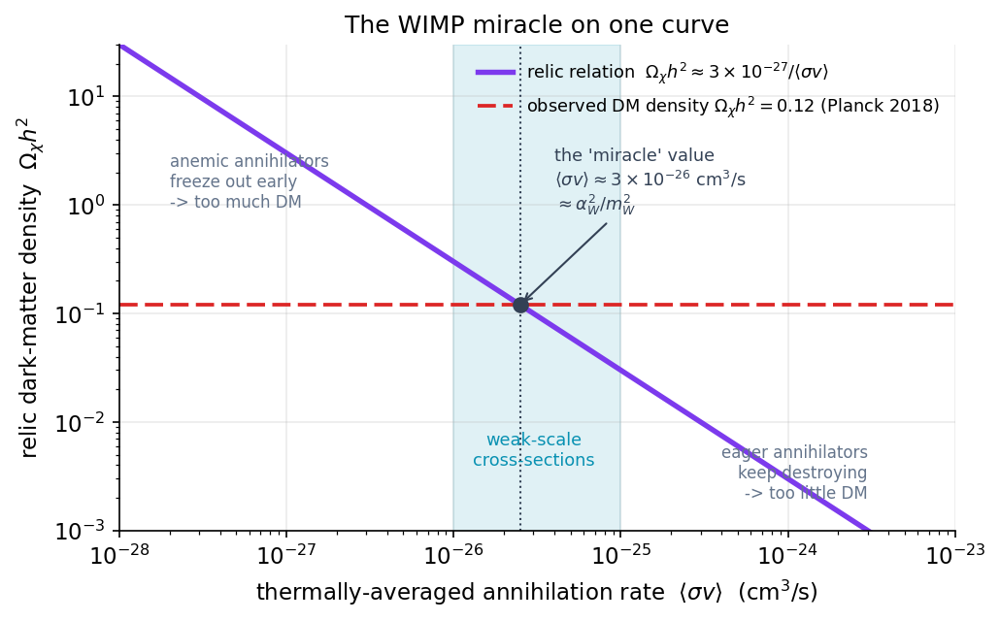

***Figure 6.2 — The WIMP miracle on one curve.*** The relic-abundance relation $\Omega_\chi h^2 \approx 3\times10^{-27}/\langle\sigma v\rangle$ from the chapter's Deeper Dive, plotted as a model (purple). A particle that annihilates too feebly freezes out early and overproduces dark matter (upper left); one that annihilates too eagerly leaves too little (lower right). The curve crosses the measured density $\Omega_\chi h^2 = 0.12$ (red dashed, Planck 2018) at $\langle\sigma v\rangle\approx3\times10^{-26}\,\mathrm{cm^3/s}$ — and that value sits right in the band of cross-sections the weak force naturally provides ($\alpha_W^2/m_W^2$). The coincidence of those two independently-set numbers *is* the miracle. This is the published relic relation drawn as a curve, not observational data.

**Source:** Figure generated by [`book/figures/ch06_wimp_miracle.py`](https://github.com/carlzimmerman/zimmerman-formula/blob/main/book/figures/ch06_wimp_miracle.py). Relic-abundance scaling and the weak-scale cross-section: standard freeze-out thermodynamics (Famaey & McGaugh 2012 background; see also Kolb-Turner cosmology, summarized in the chapter Deeper Dive). Observed dark-matter density $\Omega_\chi h^2 = 0.12$: Planck 2018 results VI, A&A 641, A6 (arXiv:1807.06209).

That stunning coincidence earned a name: the **WIMP miracle**. It is the reason the WIMP became the favorite. It wasn't an arbitrary guess. It was a candidate that *cosmology and particle physics together seemed to be begging us to find.* And there was a delicious bonus: theories proposed for entirely separate reasons — most famously *supersymmetry*, a beautiful extension of the Standard Model that physicists hoped to find at particle colliders — naturally predicted exactly such a particle as their lightest stable member. The pieces fit so well that, in the 1980s and 1990s, finding the WIMP felt less like a gamble and more like a matter of building the right detector and waiting.

> **Deeper Dive: The relic-abundance calculation and the "miracle" cross-section**
>
> The comoving number density of a thermal relic is governed by the Boltzmann equation
> $$ \frac{dn}{dt} + 3Hn = -\langle \sigma v \rangle \left( n^2 - n_{\rm eq}^2 \right), $$
> where $n$ is the number density, $H$ is the Hubble expansion rate (Chapter 9), $\langle \sigma v \rangle$ is the thermally averaged annihilation cross-section times relative velocity, and $n_{\rm eq}$ is the equilibrium density. The $3Hn$ term is dilution by expansion; the right side is the loss from annihilation.
>
> Freeze-out occurs when the annihilation rate $\Gamma = n\langle\sigma v\rangle$ falls below the expansion rate $H$. For a particle of mass $m_\chi$ this happens at a temperature $T_f \approx m_\chi / 20$ — that is, the particle is already mildly non-relativistic, with $x_f \equiv m_\chi/T_f \approx 20{-}25$, almost independent of the details.
>
> Solving the freeze-out gives the relic mass density, to good approximation,
> $$ \Omega_\chi h^2 \;\approx\; \frac{3 \times 10^{-27}\,\mathrm{cm^3\,s^{-1}}}{\langle \sigma v \rangle}. $$
> The measured dark-matter density is $\Omega_\chi h^2 \approx 0.12$. Setting the two equal demands
> $$ \langle \sigma v \rangle \;\approx\; 2.5 \times 10^{-26}\,\mathrm{cm^3\,s^{-1}} \;\approx\; 3 \times 10^{-26}\,\mathrm{cm^3\,s^{-1}}. $$
> Now translate that into a cross-section at the relevant velocity. The result sits within an order of magnitude of $\sigma \sim \alpha_W^2 / m_W^2$ — precisely the size you get from the weak coupling $\alpha_W$ and the weak boson mass $m_W \approx 80\,\mathrm{GeV}$. That numerical coincidence between "the cross-section that gives the right dark-matter density" and "the cross-section the weak force naturally provides at the weak scale" *is* the WIMP miracle. Nothing in the derivation was tuned to make it happen; it falls out of generic weak-scale physics.

---

## How you catch a ghost: three strategies

Suppose the WIMP is real. How would you ever know? It does not shine. It barely interacts. It streams through ordinary matter the way Rubin's flat curves suggested it streams through galaxies — copiously and almost without notice. As you read this sentence, if the standard halo picture is right, something like a hundred thousand dark-matter particles are passing through every square centimeter of your body every second, and you feel nothing at all.

Physicists devised three complementary ways to look. It's worth picturing them as three angles on the same suspect.

**One: make it.** If a WIMP can annihilate into ordinary particles in the early universe, then running the film backward, ordinary particles colliding hard enough should occasionally *make* a WIMP. So you build the highest-energy particle collider you can — the *Large Hadron Collider*, the LHC, a 27-kilometer ring beneath the French-Swiss border — smash protons together billions of times a second, and watch for the telltale sign of a WIMP being born. This is the **collider** strategy.

**Two: watch it annihilate.** Out in space, in places where dark matter is densely concentrated — the center of our galaxy, the cores of nearby dwarf galaxies — the rare WIMP-on-WIMP annihilation should still occasionally happen, producing a faint, specific glow of gamma rays or antimatter. You point telescopes and satellites at those places and look for that glow. This is the **indirect detection** strategy.

**Three: feel it hit something.** Once in a great while, one of those countless WIMPs streaming through the Earth should strike an atomic nucleus head-on and knock it, ever so slightly, like an invisible cue ball clipping a billiard ball. If you build a detector quiet enough, you might catch that tiny recoil. This is the **direct detection** strategy, and it is the one that has come to define the hunt, so it is the one we will spend the most time on.

Let me take them in turn, saving the deepest one for a proper look.

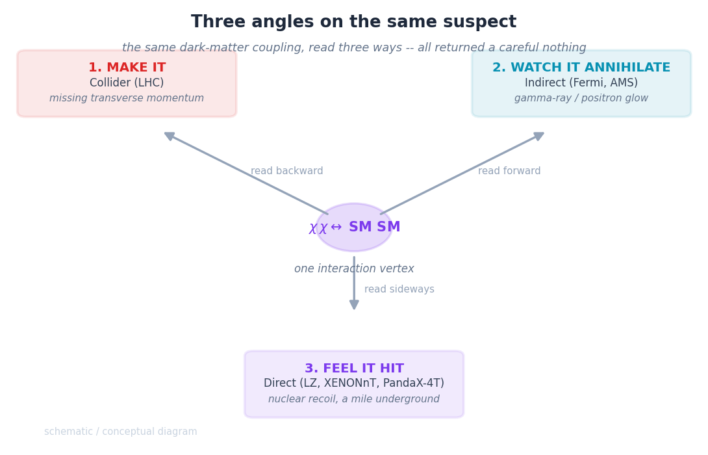

***Figure 6.3 — Three angles on the same suspect.*** A schematic of the chapter's organizing idea: a single dark-matter coupling, the vertex $\chi\chi\leftrightarrow\mathrm{SM\,SM}$, read in three directions. Run it backward and a collider should *make* WIMPs (seen as missing momentum); run it forward and dense regions of space should show WIMPs *annihilating* (a faint gamma-ray or positron glow); run it sideways and a streaming WIMP should *recoil* off a nucleus deep underground. All three angles have returned a careful nothing. This is a conceptual diagram, not data.

**Source:** Figure generated by [`book/figures/ch06_three_strategies.py`](https://github.com/carlzimmerman/zimmerman-formula/blob/main/book/figures/ch06_three_strategies.py). Conceptual content from this chapter; search-strategy framing follows the dark-matter detection literature reviewed in Famaey & McGaugh 2012, Living Rev. Relativity 15, 10 (arXiv:1112.3960).

---

## Direct detection: a mile underground, holding your breath

Imagine trying to hear a single snowflake land on a drum — in the middle of a thunderstorm, next to a jackhammer, while someone bangs the drum with a hammer. That is the direct-detection problem. The "snowflake" is the almost infinitesimal kick a WIMP would give to one nucleus in your detector. The "thunderstorm" is everything else in the universe that also kicks nuclei: cosmic rays raining down from space, natural radioactivity in the rock and in the detector's own materials, even the faint radioactivity of the human body.

So the experimenters did three things, each one heroic.

First, they went *underground.* Cosmic rays — the high-energy particles constantly bombarding Earth's surface — are stopped by rock. So you put your detector deep beneath a mountain or down an old mine. A kilometer or more of rock overhead acts as a shield, cutting the cosmic-ray rain by a factor of a million or more. The great detectors live in places like the Gran Sasso laboratory under the Italian Apennines, the SURF facility a mile down in a former South Dakota gold mine, and the China Jinping lab under more than two kilometers of rock — the deepest of them all.

Second, they made everything *unspeakably clean and cold.* The detector's own materials must be radiopure — built from metals and plastics with almost every trace of natural uranium, thorium, and radioactive potassium painstakingly removed. The heart of the modern detectors is a tank of liquid xenon, a heavy, dense, transparent element, chilled to around minus one hundred degrees Celsius. Xenon is prized because it is heavy (a big target for the WIMP to hit), it can be purified to extraordinary levels, and it does something useful when struck: it gives off a tiny flash of light *and* a small puff of electric charge.

Third, they learned to *read the kick.* When a particle strikes a xenon nucleus, the detector records two signals: a prompt flash of light at the moment of impact, and then, a moment later, a cloud of electrons that drift up through the liquid and are read out at the top. The *ratio* and *timing* of those two signals is a fingerprint. A WIMP striking a nucleus leaves a different fingerprint than a stray gamma ray striking an electron. This lets the experimenters throw away the impostors and keep only events that look like the real thing. And because the detector is one big volume, they can also use its outer layers as a self-shield: only events deep in the pristine center, far from the radioactive walls, are trusted. They call that clean inner region the *fiducial volume.*

The result of all this care is a series of experiments that are, by any measure, among the quietest places in the known universe. The current leaders — **LUX-ZEPLIN (LZ)** in South Dakota, **XENONnT** under Gran Sasso, and **PandaX-4T** at Jinping — each hold several tonnes of liquid xenon and can run for years watching for a kick that may never come.

And here is what they have seen, after all of it: no convincing WIMP. Event after candidate event, examined and explained away as ordinary background. The ghost has not knocked.

What that *non-knock* buys you is not nothing. It is an **exclusion** — a statement of the form: "if the WIMP existed with *this* mass and *this* interaction strength, we would have seen *this many* kicks by now; we saw none; therefore the WIMP does not have that mass and that interaction strength." Run that logic across every mass and every strength, and you carve out a vast region of possibilities that are now *ruled out*. Plotted on a graph of interaction-strength versus mass, the ruled-out region grows downward year by year as the detectors improve, like a tide slowly covering a beach. The line marking the edge of the tide is called an **exclusion curve**, and watching it descend over thirty years is watching the WIMP's hiding places disappear one by one.

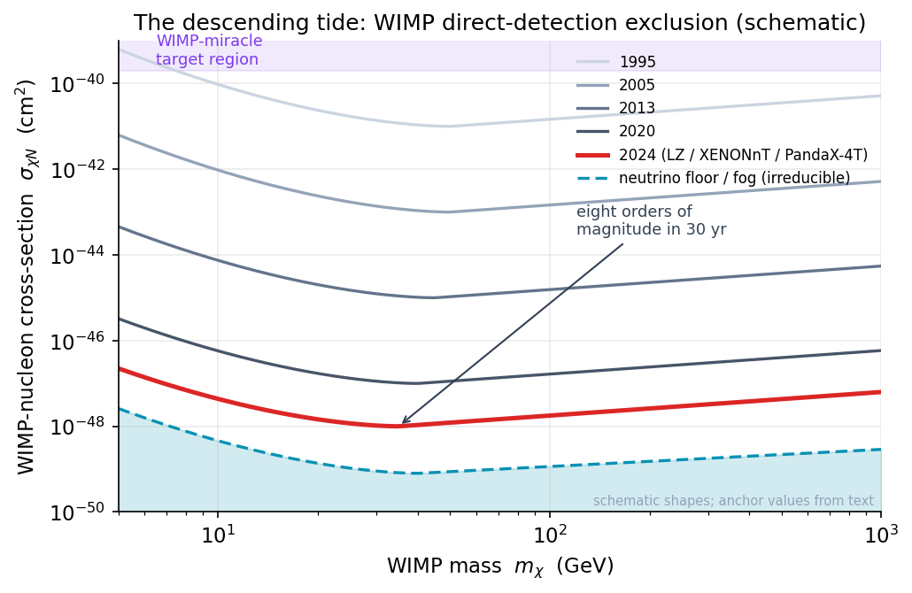

***Figure 6.1 — The descending tide of direct detection.*** Stylized WIMP exclusion curves, one per era: everything *above* each curve is ruled out, so the ruled-out region rises like a tide as the curves drop. Each curve has the characteristic valley — least sensitive at low mass, where recoils fall below threshold, with a minimum near a few tens of GeV. Over thirty years the limit has fallen roughly eight orders of magnitude (from $\sim10^{-41}$ to $\sim10^{-48}\,\mathrm{cm^2}$), covering most of the WIMP-miracle target band (purple) and closing in on the irreducible neutrino floor (teal). The curve *shapes* are schematic illustrations, not digitized data; the anchor magnitudes are the published values quoted in the chapter.

**Source:** Figure generated by [`book/figures/ch06_exclusion_descent.py`](https://github.com/carlzimmerman/zimmerman-formula/blob/main/book/figures/ch06_exclusion_descent.py). Anchor sensitivities (~$10^{-48}\,\mathrm{cm^2}$ near tens of GeV for LZ/XENONnT/PandaX-4T; eight-orders-of-magnitude descent; neutrino floor) and recoil-rate physics from the chapter's Deeper Dive; underlying recoil-rate formalism in the dark-matter detection literature reviewed by Famaey & McGaugh 2012, Living Rev. Relativity 15, 10 (arXiv:1112.3960).

> **Deeper Dive: Exclusion curves and the approach to the neutrino floor**
>
> Direct-detection experiments report limits on the WIMP–nucleon scattering cross-section $\sigma_{\chi N}$ as a function of WIMP mass $m_\chi$. The expected recoil-event rate per unit detector mass is
> $$ \frac{dR}{dE_R} = \frac{\rho_\chi}{m_\chi\, m_N}\int_{v_{\min}}^{v_{\rm esc}} v\, f(\vec v)\, \frac{d\sigma}{dE_R}\, d^3v, $$
> where $\rho_\chi \approx 0.3\,\mathrm{GeV/cm^3}$ is the local dark-matter density inferred from galactic dynamics, $f(\vec v)$ is the local WIMP velocity distribution (typically a Maxwellian truncated at the galactic escape speed $v_{\rm esc} \approx 540\,\mathrm{km/s}$), $E_R$ is the nuclear recoil energy, and $d\sigma/dE_R$ encodes the particle physics and the nuclear form factor.
>
> Seeing zero events sets an *upper* limit on $\sigma_{\chi N}$. Over three decades these limits have improved by more than *eight orders of magnitude*. The WIMP-miracle target region — the cross-sections favored by the simplest weak-scale and supersymmetric models — has now been almost entirely covered. As of the mid-2020s, the strongest spin-independent limits from LZ, XENONnT, and PandaX-4T reach down to roughly $\sigma_{\chi N} \sim 10^{-48}\,\mathrm{cm^2}$ near a WIMP mass of a few tens of GeV.
>
> There is a fundamental obstacle waiting below: the **neutrino floor** (more carefully, the *neutrino fog*). Neutrinos — nearly massless, weakly interacting particles produced copiously in the Sun, in the atmosphere, and by ancient supernovae — also scatter off nuclei via *coherent elastic neutrino-nucleus scattering*. Once detectors are sensitive enough to see solar and atmospheric neutrinos, those neutrinos produce recoils nearly indistinguishable from a WIMP's. This is an irreducible background that no amount of shielding removes — the neutrinos pass through the Earth as freely as the WIMPs do. Below the floor, distinguishing a WIMP signal from the neutrino haze requires enormous exposures and clever use of directional or annual-modulation information. The leading xenon experiments are now within roughly an order of magnitude of this floor across much of the canonical WIMP mass range. The hunt has, in a real sense, nearly run out of clean room beneath it.

---

> **Worked Example: How many WIMPs should LZ have caught?**
>
> Let's do a rough back-of-the-envelope estimate, slowly, to feel why "zero events" is such a strong statement.
>
> **Step 1 — How many WIMPs stream through the detector?** The local dark-matter density is about $\rho_\chi \approx 0.3\,\mathrm{GeV/cm^3}$. Take a WIMP mass of $m_\chi \approx 100\,\mathrm{GeV}$. Then the number density is
> $$ n_\chi = \frac{\rho_\chi}{m_\chi} = \frac{0.3\,\mathrm{GeV/cm^3}}{100\,\mathrm{GeV}} = 3\times10^{-3}\,\mathrm{cm^{-3}}. $$
> The WIMPs move at roughly the galactic speed, $v \approx 230\,\mathrm{km/s} = 2.3\times10^{7}\,\mathrm{cm/s}$. So the flux through any surface is
> $$ \Phi = n_\chi\, v \approx (3\times10^{-3})(2.3\times10^{7}) \approx 7\times10^{4}\ \mathrm{per\ cm^2\ per\ s}. $$
> That is the "hundred thousand per square centimeter per second" promised earlier.
>
> **Step 2 — How many target nuclei?** LZ holds about 7 tonnes of xenon, of which roughly 5.5 tonnes sit in the trusted fiducial volume. Xenon's atomic mass is about 131 grams per mole, so $5.5\times10^{6}\,\mathrm{g}$ contains
> $$ N_{\rm target} = \frac{5.5\times10^{6}}{131}\times 6\times10^{23} \approx 2.5\times10^{28}\ \text{nuclei}. $$
>
> **Step 3 — How likely is a hit?** Take a cross-section right at the current sensitivity edge, $\sigma \approx 10^{-47}\,\mathrm{cm^2}$ (we'll fold the nuclear enhancement and the per-nucleon convention into this effective number for the estimate). The interaction rate is flux times cross-section times number of targets:
> $$ R \approx \Phi\,\sigma\,N_{\rm target} \approx (7\times10^{4})(10^{-47})(2.5\times10^{28}) \approx 2\times10^{-14}\ \text{per second}. $$
>
> **Step 4 — Over a multi-year run.** A year is about $3\times10^{7}$ seconds, so a few-year exposure is roughly $10^{8}$ seconds. Multiply:
> $$ N_{\rm events} \approx (2\times10^{-14})(10^{8}) \approx 2\times10^{-6}. $$
>
> So at *this* cross-section, you'd expect essentially no events — consistent with seeing none. The detector's actual reach comes from the *enhancement* effects this rough estimate glossed over: coherent scattering off the whole nucleus boosts the rate by a factor of the number of nucleons *squared* (the famous $A^2$ enhancement), pushing the effective sensitivity orders of magnitude higher than this crude per-nucleon number suggests. The honest lesson of the arithmetic is the *steepness* of the dependence: the rate scales directly with $\sigma$, so each tenfold improvement in detector sensitivity excludes cross-sections ten times smaller. Thirty years of such improvements is how the exclusion curve fell eight orders of magnitude — and how the WIMP miracle's home turf was quietly covered over.

---

## The collider and the sky: the other two angles

While the underground detectors carved away at the WIMP from below, the Large Hadron Collider attacked it from a different direction entirely. The logic is elegant. If protons collide hard enough to *make* a pair of WIMPs, those WIMPs would fly out of the detector without leaving any trace — they don't shine, remember. But by the iron law of momentum conservation, if something invisible flies out one side, the visible debris must recoil the other way to balance the books. So the experimenters look for collisions that appear *lopsided*: a spray of ordinary particles flying one way, balanced against nothing visible on the other. That "nothing visible" is **missing energy** (more precisely, missing transverse momentum), and it is the collider's signature of an invisible particle escaping.

The LHC has now run for more than a decade at the highest energies humanity has ever reached. It found the Higgs boson in 2012, a triumph that completed the Standard Model. But the new heavy particles that so many WIMP-friendly theories predicted — the supersymmetric partners whose lightest member was supposed to *be* the WIMP — have not appeared. Search after search has come up empty, pushing the allowed masses of those hypothetical particles higher and higher, into ranges that strain the original motivation. The collider, like the underground tanks, has returned a long, careful, well-documented *nothing.*

> **Deeper Dive: Collider missing-energy searches**
>
> At a hadron collider the initial longitudinal momentum along the beam is unknown (the colliding quarks and gluons carry unknown fractions of the proton momentum), so searches use the *transverse* plane, where the initial momentum is zero. The observable is missing transverse momentum,
> $$ \vec{p}_T^{\,\rm miss} = -\sum_i \vec{p}_{T,i}^{\,\rm visible}, $$
> the negative vector sum of all detected transverse momenta. A genuine invisible particle produces an imbalance; instrumental mismeasurement produces a smaller, well-modeled tail.
>
> The flagship channel is *mono-X*: a single energetic jet, photon, or weak boson recoiling against missing momentum ($pp \to \chi\bar\chi + X$). The dominant irreducible background is $Z(\to\nu\bar\nu)+\text{jets}$, where the $Z$ decays to genuine neutrinos that also escape invisibly — a reminder that even at colliders, the Standard Model's own neutrinos mimic the dark-matter signature. As of the mid-2020s, LHC searches exclude WIMP-mediator and many supersymmetric scenarios over wide mass ranges (often up to roughly $1{-}2\,\mathrm{TeV}$ for the simplest models), with no significant excess. Collider and direct-detection limits are complementary: they probe overlapping but not identical regions of model space, and only together do they close off the simplest WIMP scenarios.

Indirect detection — watching for the faint glow of WIMPs annihilating in space — has had its own decade of careful looking. The *Fermi* gamma-ray space telescope stared at nearby dwarf galaxies, which are dense with dark matter and poor in ordinary gas, making them ideal clean targets. The AMS instrument on the International Space Station weighed the cosmic-ray antimatter for an anomalous excess. There have been tantalizing wiggles — a possible excess of gamma rays from the galactic center, a bump in the positron fraction — but each, on careful examination, has plausible ordinary explanations (pulsars, mismodeled astrophysics) and none has held up as a clean dark-matter signal. Once again: suggestive shadows, but no ghost in the doorway.

---

## Plan B: the axion

So the WIMP, the favored candidate, has been hunted from three directions for forty years and has not shown itself in the place its miracle pointed to. This is the moment to be careful and fair. It does *not* mean dark matter isn't a particle. It means the *simplest, most-motivated* particle candidate is in serious trouble — its best parameter space largely covered, its miracle looking less miraculous. And so the community, sensibly, has broadened its search. The most prominent of the alternative candidates is the **axion**.

The axion is a delight, because — like the WIMP miracle — it was *not* invented to be dark matter. It was proposed in the late 1970s to solve a completely separate puzzle in particle physics called the *strong-CP problem*: the strong nuclear force, by all rights, should violate a symmetry called CP (roughly, a matter-antimatter mirror symmetry), and yet experiments show it does so by an amount that is zero to fantastic precision. Why is a quantity that could be anything so exactly, suspiciously zero? The physicists Roberto Peccei and Helen Quinn proposed an elegant mechanism that drives that quantity dynamically to zero, and a consequence of their mechanism, pointed out by Frank Wilczek and Steven Weinberg, is a new, extremely light, extremely weakly interacting particle. Wilczek named it the axion, after a brand of laundry detergent — because it cleaned up the problem.

Then someone noticed that this little particle, invented to clean up the strong force, would also have been produced in the early universe in just the right abundance to be the dark matter. A second, independent miracle of motivation. The axion is everything the WIMP was — a particle wanted for its own particle-physics reasons that *also* happens to solve the dark-matter problem — except that it is fantastically lighter (perhaps a trillionth the mass of an electron, or even less) and even more feeble in its interactions.

Catching it requires a completely different kind of machine. Because the axion is so light, you don't look for it knocking nuclei; you look for it slowly *converting into a photon* — a particle of light — inside a strong magnetic field. The detector is a *haloscope*: a precisely tuned microwave cavity sitting inside a powerful magnet, cooled to a whisper above absolute zero. If dark-matter axions are streaming through, and if the cavity is tuned to exactly the right frequency, a faint hum of microwave photons should appear out of nowhere. The catch is that you don't know the axion's mass, which sets the frequency — so you must tune the cavity slowly across an enormous range of possible frequencies, listening at each one, a painstaking sweep across a radio dial that is millions of stations wide. The leading effort, called ADMX in Washington State, has been inching across that dial for years. It has ruled out a slice of the most-motivated axion masses and continues to scan.

> **Deeper Dive: The axion mass window and haloscope detection**
>
> The axion's mass and its coupling to ordinary matter are both set by a single high-energy scale $f_a$, the axion decay constant:
> $$ m_a \approx 5.7\,\mu\mathrm{eV}\times\left(\frac{10^{12}\,\mathrm{GeV}}{f_a}\right), \qquad g_{a\gamma\gamma} \propto \frac{1}{f_a}. $$
> A larger $f_a$ means a lighter, more weakly coupled axion. Cosmological production via the *misalignment mechanism* — the axion field starting away from its eventual minimum and oscillating as the universe expands — yields a relic density that scales roughly as $\Omega_a \propto f_a^{7/6}$, which for the canonical "QCD axion" points to a favored mass window of about $1\,\mu\mathrm{eV}$ to $1\,\mathrm{meV}$, give or take, depending on cosmological assumptions.
>
> Haloscopes exploit the *Primakoff conversion* $a \to \gamma$ in a static magnetic field $B_0$. A resonant cavity of volume $V$ and quality factor $Q$, tuned so its resonant frequency $\nu = m_a c^2/h$ matches the axion mass, produces a power
> $$ P_{\rm sig} \propto g_{a\gamma\gamma}^2\, \rho_a\, B_0^2\, V\, Q\, C, $$
> where $\rho_a$ is the local axion density and $C$ is a geometric form factor. The signal is fantastically weak — of order $10^{-23}\,\mathrm{W}$ — which is why these experiments push the frontier of quantum-limited microwave amplification. Because $\nu$ is unknown over orders of magnitude, the search proceeds by scanning, with the scan rate steeply dependent on $B_0$, $V$, $Q$, and the amplifier noise temperature. ADMX has reached the canonical QCD-axion coupling (the "DFSZ" benchmark) over a portion of the few-$\mu$eV range; vast tracts of the window — especially toward higher masses — remain unexplored and motivate a new generation of detectors using different geometries and techniques.

There are other candidates beyond these two, and the list has grown as the WIMP receded: *sterile neutrinos*, hypothetical heavier cousins of the ordinary neutrino; *primordial black holes*, formed in the first instant and made of no exotic particle at all; and a whole zoo of *hidden-sector* and *ultralight* possibilities spanning some ninety orders of magnitude in mass. The breadth of this list is itself worth pausing on. When the favored candidate fades and the field responds by vastly widening the space of what dark matter *could* be, that is the healthy, honest behavior of a science under pressure. It is also, quietly, a measure of how much the original confidence has had to be walked back.

---

## What the silence does, and does not, prove

Now we arrive at the heart of the chapter, and I want to walk through it with real care, because it is exactly the kind of place where it is easy to lean too hard in one direction or the other — and I have promised you both ways, every time.

**First, the case for caution against over-reading the null.** A non-detection is genuinely not a disproof. Dark matter, if it is a particle, only *has* to interact through gravity — every other interaction is optional. There is no law of physics that says it must also feel the weak force, or convert to photons, or do anything else we can detect in a laboratory. We chose to hunt the WIMP and the axion because they were *testable* and *well-motivated*, not because they were the only possibilities. A particle that interacts *only* gravitationally would be entirely consistent with every astronomical observation and would be utterly, permanently invisible to every detector ever described in this chapter. The searches can only exclude the candidates they are built to find. The unsearchable candidates remain. To say "we looked and found nothing, therefore dark matter is not a particle" would be a logical overreach, and an unfair one. I will not make that claim, and you should be suspicious of anyone who does.

**Second, and in the same breath, the case against over-comforting the believer.** A null result is not a disproof — but it is *data*, and the data have a shape, and the shape matters. The WIMP was not just *a* candidate; it was *the* candidate, the one cosmology and particle physics together seemed to be pointing at, the one whose miracle made discovery feel inevitable. We have now searched the region that miracle pointed to, from three independent directions, with instruments of staggering sensitivity, for the better part of forty years — and that region is very nearly covered. The most-motivated parameter space has been emptied. When your single best, best-motivated, most-predictive hypothesis is tested as thoroughly as a hypothesis can be tested and comes back empty, that is not proof of anything, but it is absolutely a reason to take alternatives more seriously than you did before. To say "we haven't found it *yet*, so let's just keep building bigger detectors and otherwise carry on exactly as before" would be its own kind of overreach — the comfortable kind. I will not make that claim either.

The honest position lives in the middle, and it is this: **the particle road is not closed, but its most promising lane is now very nearly out of road.** Dark matter as a particle remains entirely viable — the gravitationally-only candidates are untouched, the axion window is far from fully scanned, the zoo of alternatives is barely explored. But the specific, beautiful, over-motivated WIMP that drove the field for a generation has not appeared where it was supposed to be. That fact does not vindicate the *other* road, the modified-dynamics road this book will eventually travel. A failure of road one is not, by itself, a success of road two. But it is precisely the kind of development that makes it intellectually responsible — even necessary — to give road two a fair and careful hearing, which is what the rest of this book sets out to do.

And I want to be scrupulous about one more thing, because it matters for everything that follows. The framework at the center of this book — the one that ties the galactic acceleration scale $a_0$ to the dark-energy density of the universe — lives on road two, the modified-dynamics road. Nothing in *this* chapter is evidence *for* it. The empty WIMP detectors do not derive $a_0$, do not establish the mechanism, do not confirm a single one of the framework's claims. They only clear a little brush from the path, making it easier to see that road two is worth walking at all. The framework still has to earn every step on its own terms, and — as I will keep saying, because it is true — it is not a theory of everything yet, as frustrating as it may be. The honest standing of *that* idea is a story for Part 5 and Part 6. This chapter has only one job: to tell you, fairly and in both directions, where the favored road stands after fifty years of the most careful hunting humanity has ever done.

The door is still unopened. We have built quieter and quieter ways to listen for the knock. The silence is real, and it is data, and we will carry it with us — neither as a verdict nor as a footnote, but as exactly what it is.

---

## Summary

- The favored dark-matter candidate for forty years was the **WIMP** — a *Weakly Interacting Massive Particle*: heavy, feeling only gravity and the weak force, hence invisible to light.
- The **WIMP miracle**: a generic weak-scale particle freezing out in the early universe leaves behind a **thermal relic abundance** that matches the observed dark-matter density almost exactly — a striking coincidence between cosmology and weak-force particle physics that made the WIMP feel almost inevitable, and which supersymmetry independently predicted.
- Three search strategies were mounted: **direct detection** (ultra-quiet underground detectors watching for a WIMP to recoil off a nucleus), **collider** searches (missing-energy signatures at the LHC), and **indirect detection** (telescopes watching for annihilation glow).
- The leading direct-detection experiments (LZ, XENONnT, PandaX-4T) sit a mile or more underground, hold tonnes of ultra-pure liquid xenon, and have pushed **exclusion curves** down by eight orders of magnitude — covering nearly all of the WIMP miracle's favored region and approaching the irreducible **neutrino floor**, below which solar and atmospheric neutrinos mimic a WIMP signal.
- The LHC found the Higgs but no WIMP-friendly new particles; indirect searches produced suggestive anomalies but no clean signal. From all three directions, the result is a long, careful **nothing**.
- The **axion** is the leading plan B — fantastically light, also independently motivated (it solves the strong-CP problem), and hunted with entirely different machines (**haloscopes**: tuned microwave cavities in strong magnets). Much of its favored window remains unscanned.
- The honest reading, both ways: a null result is **not a disproof** — a purely gravitationally-interacting particle would be permanently invisible and remains fully viable — but it **is data**. The single most-motivated candidate has been tested about as thoroughly as possible and not appeared where its miracle pointed. That does not close the particle road, and it does not by itself vindicate the modified-dynamics road; it makes giving the alternatives a fair hearing the intellectually responsible thing to do.
- None of this chapter is evidence *for* the framework of this book. It only clears brush. The framework must still earn every step on its own terms — and it is not a theory of everything yet.

---

## Questions

1. **(Easy)** In your own words, explain why a WIMP would be invisible to ordinary telescopes but could still be caught — in principle — by a detector buried deep underground. What does each of the three letters in "WIMP" tell you about the particle?

2. **(Easy–Medium)** Why do direct-detection experiments go to such extraordinary lengths to be deep underground, radiopure, and cold? Name the kind of background each of those three measures is fighting, and explain why the "fiducial volume" trick helps.

3. **(Medium)** Explain the "WIMP miracle" to a friend who has never heard of it. What two independent areas of physics does it connect, and why did that coincidence make the WIMP feel like such a compelling candidate? Why does its non-appearance disappoint more than the non-appearance of, say, a randomly guessed particle would?

4. **(Medium–Hard)** Using the relic-abundance relation $\Omega_\chi h^2 \approx (3\times10^{-27}\,\mathrm{cm^3\,s^{-1}})/\langle\sigma v\rangle$, explain qualitatively what happens to the leftover dark-matter density if a particle annihilates *more* strongly than the miracle value. Then explain in words why a tenfold improvement in a direct-detection experiment's sensitivity excludes cross-sections roughly ten times smaller (hint: revisit the worked example and the scaling of the event rate with $\sigma$).

5. **(Hard)** What is the *neutrino floor* (or neutrino fog), and why does it represent a different kind of obstacle than the backgrounds that shielding and purity can defeat? If a future experiment found a WIMP-like signal right at the floor, what extra information (think about directionality or annual timing) might let you argue it is dark matter and not neutrinos?

6. **(Research-level)** This chapter argues that a null result is "not a disproof, but it is data." Construct the strongest honest case in *both* directions: (a) why the persistent non-detection should *not* much shift a committed particle-dark-matter advocate's confidence, and (b) why it nonetheless *should* raise one's prior on modified-dynamics explanations. Where, precisely, does the logic of "absence of evidence" become "evidence of absence," and how does the *prior motivation* of a candidate (WIMP versus a purely gravitational particle) change how much a null search should update your beliefs? Be careful to note what the dark-matter null does *not* establish about any specific modified-dynamics framework.

# Chapter 7: Einstein's Gravity: The Equivalence Principle and Curved Spacetime

*Imagine you woke up in a falling elevator. For a few seconds — before anything went wrong — you would feel completely weightless, floating, serene. Einstein's whole theory of gravity grew out of taking that floating feeling seriously.*

---

## Where We Are

In the first part of this book we met a puzzle that refuses to go away. Galaxies spin too fast for the matter we can see (Chapter 4). Clusters of galaxies are far heavier than their starlight suggests (Chapter 3). Something is missing — either invisible *stuff* we have not yet found, or a flaw in the *law* we are using to add up the gravity. We laid out that fork in Chapter 5, and now we are walking down the road toward understanding the law itself, deeply enough to ask whether it might be the thing at fault.

To do that honestly, we need the best theory of gravity humanity has ever written down: Albert Einstein's **General Relativity**, published in 1915. Newton's gravity, which we used in Chapter 2 to weigh the planets, is a magnificent approximation — good enough to fly spacecraft to Saturn. But it is an approximation. Underneath it is something stranger and more beautiful, and we cannot understand modern cosmology, dark energy, the framework at the center of this book, or even what the word *acceleration* really means without it.

Here is the good news, and I mean it sincerely: the central idea of General Relativity is one of the most approachable big ideas in all of physics. It begins not with a page of equations but with a single, almost childlike observation about what falling feels like. We will start exactly there, build the intuition carefully, and only then — in clearly marked boxes you are welcome to skip — lay out the mathematics that a physicist would want to see. If you are sixteen and curious, the main thread is yours, all the way through. If you have a PhD, the Deeper Dive boxes are where the metric tensor and the geodesic equation live.

Let's begin by falling.

---

## The Happiest Thought of Einstein's Life

In 1907, two years after his miraculous burst of papers on relativity and the quantum, Einstein was sitting in the patent office in Bern when a thought struck him that he later called *"the happiest thought of my life."* It was this:

> A person in free fall does not feel their own weight.

That's it. That's the seed of everything. Let me unpack why such a plain sentence could reshape physics.

Think about what it feels like to stand on the floor right now. You feel a pressure on the soles of your feet — the floor pushing up on you. We usually say "that's gravity pulling me down," but notice: you do not actually feel the pull of gravity. What you feel is the *floor*, stopping you from falling. Gravity, if anything, feels like nothing at all. It is the *interruption* of gravity — the floor, the chair, the ground — that you actually sense.

Now imagine the floor vanishes. You begin to fall. In that first instant, before air rushes past and before fear sets in, the pressure on your feet is gone. You feel *weightless*. A cup of water falling beside you would not spill — the water and the cup fall together, so the water presses on no wall. An accelerometer in your pocket — the same little chip that knows which way your phone is tilted — would read *zero*. Not "falling." Zero. As far as that instrument is concerned, you are floating peacefully in deep space.

This is the heart of it. **Free fall** — moving under gravity alone, with nothing pushing or holding you — feels *exactly* like floating in empty space far from everything. And the reverse is true too. Standing on the Earth, feeling your weight, is indistinguishable from standing in a rocket out in deep space, accelerating upward at just the right rate. In both cases the floor pushes up on your feet with the same firmness; in both cases a dropped coin falls to the floor the same way.

> *A note on words. Throughout this chapter, "acceleration" means a change in motion — speeding up, slowing down, or changing direction. An accelerometer measures the real, physical kind you can feel: the push of a floor, the shove of a rocket. Crucially, free fall registers as **zero** on such a device, even though in everyday language we'd say a falling person is "accelerating downward." Holding both of these ideas at once is the whole trick of this chapter.*

### The Elevator

Einstein dramatized this with a thought experiment that has been taught ever since — the elevator. We'll use it carefully, because like all good analogies it can be pushed too far, and we'll be honest about where it breaks.

**Scene one.** You are inside a windowless elevator, and you feel pinned to the floor with your normal weight. Two possibilities: (a) the elevator is sitting still on the surface of the Earth, or (b) the elevator is far out in space, being towed by a rocket that accelerates "upward" at 9.8 meters per second every second — the rate that, on Earth, we call one *g*.

Can you tell which? You drop a ball; it falls to the floor at 9.8 m/s² either way. You stand on a bathroom scale; it reads your normal weight either way. You jump; you come back down the same way. **Inside the box, with no window, there is no experiment you can do to tell gravity from acceleration.** That is the claim.

**Scene two.** Now the elevator is in free fall — the cable has snapped on Earth, or equivalently the rocket engine in deep space has switched off. You float. The ball you release floats beside you. Your scale reads zero. Again: is this a broken elevator plunging toward the ground, or a peaceful capsule drifting in empty space? **You cannot tell.** Gravity, locally, has been switched off simply by letting yourself fall.

This is the **equivalence principle**: *the effects of gravity and the effects of acceleration are locally indistinguishable.* A uniform gravitational field can be perfectly mimicked by an accelerating frame, and — more powerfully — it can be perfectly *erased*, locally, by going into free fall. Astronauts on the International Space Station are not "beyond Earth's gravity" — Earth's pull up there is nearly as strong as on the ground. They float because they, and their station, are in continuous free fall, forever falling around the Earth and forever missing it. The equivalence principle is why.

> *Margin aside: the word "locally" is doing heavy lifting and we'll honor it in a moment. For now, read "locally" as "in a small enough region, for a short enough time."*

---

## Why This Was Always Hiding in Plain Sight

There's a clue physics had been sitting on for three hundred years, and the equivalence principle finally explained it.

Recall Newton's two great laws. First, his **second law of motion**: a force *F* gives a body of mass *m* an acceleration *a*, with *F = m a*. The *m* here measures how hard the body is to push — its sluggishness, its resistance to being accelerated. We call it the **inertial mass**. (We will spend all of Chapter 13 asking what this stubbornness really *is*; for now, just hold the idea: inertial mass is the *m* in *F = ma*.)

Second, Newton's **law of gravity**: the gravitational pull on a body is proportional to a quantity we might call its **gravitational mass** — the "gravitational charge" that makes it respond to gravity, the analog of electric charge in electromagnetism.

There is no obvious reason these two masses should be the same number. One says how hard a thing is to shove; the other says how strongly gravity grabs it. They are conceptually unrelated — a brick's resistance to a kick has nothing logically to do with how heavy it feels. And yet, when you work out the motion of a falling object, the two masses appear on opposite sides of the equation and *cancel*:

$$m_{\text{inertial}}\, a = m_{\text{grav}}\, g \quad\Longrightarrow\quad a = \frac{m_{\text{grav}}}{m_{\text{inertial}}}\, g.$$

If — and only if — the two masses are equal, that ratio is exactly 1, and then *a = g* for everything, regardless of what it is. A feather and a cannonball, a hydrogen atom and a planet, all fall with the same acceleration. This is Galileo's famous discovery, the one demonstrated on the Moon in 1971 when astronaut David Scott dropped a hammer and a falcon feather together and they hit the lunar dust at the same instant, with no air to cheat.

Newton noticed this coincidence and tested it with pendulums. He had no explanation for it; it was just a brute, suspicious fact that gravitational and inertial mass are equal to fantastic precision. (Today, torsion-balance experiments and lunar laser ranging confirm the equality to better than one part in a trillion — among the most precisely tested facts in all of science.)

Einstein's leap was to say: *this is not a coincidence at all. It is the deepest hint we have about the nature of gravity.* The two masses are equal because gravity is not really a force acting on a special "gravitational charge." Gravity is something every object responds to *identically*, regardless of its makeup — and the only things that affect all objects identically are features of **space and time themselves**. If everything falls the same way, then "the way things fall" is a property of the *arena*, not of the objects in it.

That single reframing — from a force pulling on charges to a shaping of the arena — is General Relativity in embryo.

> **Deeper Dive: Weak, Einstein, and Strong Equivalence Principles**
>
> Physicists slice the equivalence principle into a few sharper statements, and the distinctions matter for everything later in this book.
>
> **The Weak Equivalence Principle (WEP)**, also called the *universality of free fall*: the trajectory of a freely falling test body (one small and light enough not to disturb the field, and electrically neutral) depends only on its initial position and velocity, not on its internal structure or composition. Equivalently, $m_{\text{inertial}} = m_{\text{grav}}$ for all bodies. The dimensionless figure of merit is the *Eötvös parameter*,
> $$\eta = 2\,\frac{|a_1 - a_2|}{|a_1 + a_2|},$$
> the fractional difference in free-fall acceleration between two test materials. The MICROSCOPE satellite mission (2017–2022) measured $\eta \lesssim 10^{-15}$ — no violation seen.
>
> **The Einstein Equivalence Principle (EEP)** adds two clauses to the WEP: *local Lorentz invariance* (the outcome of any local non-gravitational experiment is independent of the velocity of the freely-falling frame) and *local position invariance* (independent of where and when in the universe the frame is). The EEP is the real engine: it is essentially the statement that *in any local free-fall frame, the laws of physics reduce to those of special relativity*. This is what licenses the geometric picture — that gravity is curvature of spacetime and nothing else couples to it preferentially.
>
> **The Strong Equivalence Principle (SEP)** extends the EEP to include *gravitational* experiments and *self-gravitating* bodies — a planet or a star, whose own gravitational binding energy contributes to its mass. The SEP demands that even this gravitational energy fall the same way as everything else. General Relativity satisfies the SEP exactly. Almost every *alternative* theory of gravity violates it at some level, which is precisely why the SEP is such a powerful discriminator. Lunar laser ranging tests it via the "Nordtvedt effect" (would the Earth and Moon, with different self-energies, fall differently toward the Sun?); no violation is seen to high precision.
>
> Why flag all this now? Because the framework at the center of this book — de Sitter–Unruh modified inertia — lives exactly at these joints. It is a theory in which *inertia itself* is modified at very low accelerations, and any such theory must answer to the equivalence principle with great care. We are laying the groundwork honestly: when we reach Part V, you will already know which principles are sacred and which are negotiable.

---

## From "Gravity Is Acceleration" to "Spacetime Is Curved"

So far we have a striking equivalence: locally, gravity and acceleration are the same. But here is where Einstein's genius turned a clever observation into a new picture of reality. The key word, again, is **locally**.

Inside a *small* elevator over a *short* time, you truly cannot tell free fall from floating. But make the elevator big enough, or watch long enough, and the disguise slips.

Picture a very tall elevator — kilometers tall — falling toward the Earth. Release two balls, one near the left wall, one near the right. Each ball falls straight toward the *center* of the Earth. But the center of the Earth is one specific point, so the two balls' paths are not quite parallel — they aim very slightly *toward each other*. Over the fall, the balls drift closer together. An observer inside, who believes they are floating peacefully in deep space, would be baffled: two motionless balls, untouched, slowly creeping toward one another as if by some faint mutual attraction.

Now release one ball near the ceiling and one near the floor. The lower ball is a little closer to the Earth, where gravity is a touch stronger, so it falls a little faster. The two balls *separate* vertically as they fall.

These residual effects — the squeezing sideways, the stretching vertically — are real, measurable, and *cannot* be transformed away by any choice of frame. They are what's left of gravity after you've fallen freely to switch off its "uniform" part. We call them **tidal forces**, because they are exactly what raises the ocean tides: the Moon pulls the near side of the Earth a bit harder than the far side, stretching the oceans into a bulge on both sides.

***Figure 7.3 — Tidal forces are curvature you cannot erase.*** A schematic of the chapter's tall-elevator thought experiment, the heart of geodesic deviation. *Left:* two balls released side by side each fall toward the single center of the Earth, so their not-quite-parallel paths drift *together* — the sideways squeeze. *Right:* the lower ball sits where gravity is slightly stronger and falls a touch faster, so a vertically separated pair drifts *apart* — the vertical stretch. Neither effect can be removed by any choice of falling frame; that irreducible relative acceleration *is* the Riemann curvature tensor (geodesic deviation). Conceptual diagram, not to scale.

**Source:** Figure generated by [`book/figures/ch07_tidal_geodesic_deviation.py`](https://github.com/carlzimmerman/zimmerman-formula/blob/main/book/figures/ch07_tidal_geodesic_deviation.py). Schematic illustrating the equation of geodesic deviation $D^2\xi^\mu/d\tau^2 = -R^\mu{}_{\alpha\nu\beta}u^\alpha\xi^\nu u^\beta$ from this chapter's Deeper Dive (standard General Relativity).

Here is the punchline, and it is worth reading slowly:

**The uniform part of gravity is a fiction you can erase by falling. The *non-uniform* part — the tidal part — is the real, irreducible thing. And the irreducible thing is curvature.**

> *Margin aside: this is why "gravity is fake" is too glib. The part you can fall away from is frame-dependent. The tidal part — true curvature — is there in every frame. It is as real as anything in physics.*

### What "Curvature" Means Here

What does it mean to say spacetime is *curved*? Let's build the idea on a surface we can actually picture: the Earth.

Imagine two explorers standing on the equator, a hundred miles apart, both pointing due north. They each start walking north in a perfectly straight line — never turning, always going as "straight" as the ground allows. At the start, their paths are exactly parallel. But as they walk, something curious happens: they get closer and closer together, and at the North Pole their two perfectly-straight paths *cross*.

Neither explorer ever turned. Each walked the straightest possible line. Yet their parallel paths converged. Why? Because the surface they're walking on is **curved**. On a flat plane, straight parallel lines stay parallel forever. On a sphere, they don't. The convergence of initially-parallel "straight" lines *is the definition of curvature*. You can detect that a surface is curved purely from inside it — from how straight lines behave — without ever stepping outside to look.

Now compare that to our two falling balls. They start on parallel paths and drift together — *exactly* like the two explorers. Einstein's astonishing claim is that this is the same phenomenon. The balls are each traveling the straightest possible path, not through space, but through **spacetime** — the four-dimensional fabric that weaves together the three dimensions of space with the one dimension of time. They converge because spacetime, near a mass like the Earth, is curved.

This is the sentence that the whole rest of physics hangs on:

> **Mass and energy curve spacetime, and objects in free fall simply follow the straightest available paths through that curved spacetime. What we call "gravity" is the name we give to those paths bending.**

Objects don't fall because a force yanks them. They fall because they are coasting — moving as freely and straightly as they can — through a spacetime whose very geometry has been warped by the matter around them. The Moon is not held by an invisible rope. The Moon is *coasting in a straight line*, and that straight line happens to loop around the Earth because the Earth has curved the spacetime the Moon moves through.

### The Rubber Sheet — Handle With Care

You have surely seen the popular picture: spacetime as a stretched rubber sheet, a heavy bowling ball (a star) sitting in the middle making a dent, and smaller balls (planets) rolling around the dent like marbles circling a drain. It's a useful image, and I'll let you keep it — but I owe you the honest fine print, because the analogy quietly cheats in three ways.

First, **it uses gravity to explain gravity.** The marbles roll into the dent because *real* gravity (the Earth's, pulling down on the table) tugs them downward into the depression. That's circular. In genuine General Relativity, nothing pulls "down"; there is no extra direction for things to fall into.

Second, **it shows only space, and leaves out time** — yet the curvature of *time* is the part that matters most for everyday gravity. Here is a fact that surprises almost everyone: the reason an apple falls from a tree is overwhelmingly because of how mass curves *time*, not space. Clocks run very slightly slower deeper in a gravitational field (we'll prove this shortly), and an object's natural "straight" path through spacetime bends toward where its own time runs slowest. The spatial dent in the rubber sheet is real but, for slow-moving things like apples and planets, it's a minor effect. The rubber sheet shows you the small part and hides the big part.

Third, **the sheet is a two-dimensional surface bending into a visible third dimension.** Real spacetime is four-dimensional and curves *intrinsically* — there is no extra outside dimension it bends "into." Its curvature is the explorers-converging kind, detectable entirely from within, not the kind you see by looking at a dented sheet from across the room.

So keep the rubber sheet as a first mental hook, but hold it loosely. The truer picture is the one we built with the explorers: **straight lines through a curved geometry, converging or diverging in ways that flat geometry forbids — and the most important curvature is in the dimension of time.**

> **Deeper Dive: The Metric, Geodesics, and Christoffel Symbols**
>
> Here is the mathematical skeleton beneath the story. Skip it freely; the narrative continues below.
>
> **The metric.** Spacetime is described by a *metric tensor*, written $g_{\mu\nu}$ (the indices $\mu,\nu$ each run over the four coordinates: one time, three space). The metric is the machine that tells you the spacetime "distance" — the *interval* — between two nearby events:
> $$ds^2 = g_{\mu\nu}\,dx^\mu dx^\nu,$$
> using the Einstein summation convention (repeated indices are summed). In the flat spacetime of special relativity, in ordinary coordinates, the metric is the *Minkowski metric* $\eta_{\mu\nu} = \mathrm{diag}(-c^2, 1, 1, 1)$, giving $ds^2 = -c^2 dt^2 + dx^2 + dy^2 + dz^2$. The crucial minus sign on the time term is what distinguishes spacetime from ordinary four-dimensional space; it is why time is *different*. Gravity is encoded entirely in how $g_{\mu\nu}$ departs from $\eta_{\mu\nu}$ from place to place. The metric *is* the gravitational field.
>
> **Geodesics.** A **geodesic** is the spacetime version of a straight line: the path that extremizes the interval between two events — the worldline a freely-falling body actually follows. For massive bodies it is the path of greatest *proper time* (the time read by a clock carried along it). The geodesic equation is
> $$\frac{d^2 x^\mu}{d\tau^2} + \Gamma^\mu_{\;\alpha\beta}\,\frac{dx^\alpha}{d\tau}\frac{dx^\beta}{d\tau} = 0,$$
> where $\tau$ is proper time. Read it as Newton's first law, generalized: the first term is the "acceleration" of the path; if the $\Gamma$ term vanished, you'd get straight-line, constant-velocity motion. The $\Gamma$ term is what curved spacetime adds.
>
> **Christoffel symbols.** The $\Gamma^\mu_{\;\alpha\beta}$ are the *Christoffel symbols* (the "connection"), built from derivatives of the metric:
> $$\Gamma^\mu_{\;\alpha\beta} = \tfrac{1}{2} g^{\mu\lambda}\left(\partial_\alpha g_{\lambda\beta} + \partial_\beta g_{\lambda\alpha} - \partial_\lambda g_{\alpha\beta}\right).$$
> They encode how the coordinate grid twists and stretches from point to point. Two warnings. (1) The $\Gamma$ are *not* a tensor — they can be made to vanish at any single chosen point by a clever change of coordinates. That is the equivalence principle in mathematical dress: *the local free-fall frame is the frame in which all the Christoffel symbols vanish at your location*, so motion is momentarily straight-line and the laws of special relativity hold. (2) What you *cannot* make vanish, even at a point, is the *derivative* of the $\Gamma$ — and that is curvature, the genuinely real thing, treated in the next box.

---

## Tidal Forces Are Curvature: The Real Thing You Cannot Erase

Let's nail down the distinction that the falling-elevator made vivid, because it is the conceptual hinge of the whole theory.

When you go into free fall, you can erase gravity *at a point*. Right where you are, your accelerometer reads zero, the floor is gone, you float. The Christoffel symbols vanish at your location; physics looks just like special relativity. This is what makes a free-fall frame an **inertial frame** — a frame in which a body left alone moves in a straight line at constant speed, with no mysterious forces. Einstein's insight is that *free fall is the natural state of motion*, the true generalization of Newton's "moving in a straight line, undisturbed."

But you cannot erase gravity over an *extended region*. Pull back to the kilometer-tall elevator and the tidal effects reappear — the sideways squeeze, the vertical stretch. No single choice of falling frame can kill those everywhere at once, because they come from the field being *different in different places*. That difference-of-the-field — the way neighboring free-fall frames tilt relative to each other — is curvature, and it is absolutely real. It is the same quantity for every observer. It is gravity's true, irreducible signature.

> **Deeper Dive: The Riemann Tensor and Geodesic Deviation**
>
> Curvature is captured by the *Riemann curvature tensor* $R^\rho_{\;\sigma\mu\nu}$, built from the Christoffel symbols and their first derivatives:
> $$R^\rho_{\;\sigma\mu\nu} = \partial_\mu \Gamma^\rho_{\;\nu\sigma} - \partial_\nu \Gamma^\rho_{\;\mu\sigma} + \Gamma^\rho_{\;\mu\lambda}\Gamma^\lambda_{\;\nu\sigma} - \Gamma^\rho_{\;\nu\lambda}\Gamma^\lambda_{\;\mu\sigma}.$$
> Unlike the $\Gamma$, the Riemann tensor is a genuine tensor: if it is nonzero in one frame, it is nonzero in all of them. It cannot be transformed away by any clever coordinates. *Riemann $=0$ everywhere means flat spacetime — no gravity. Riemann $\neq 0$ means real gravity.* This is the precise statement of "tidal forces cannot be erased."
>
> The physical meaning lives in the *equation of geodesic deviation*. Take two nearby freely-falling particles separated by a small vector $\xi^\mu$. Their separation evolves as
> $$\frac{D^2 \xi^\mu}{d\tau^2} = -\,R^\mu_{\;\alpha\nu\beta}\,u^\alpha \xi^\nu u^\beta,$$
> where $u^\alpha$ is the four-velocity. This is the mathematics of our two falling balls drifting together: the relative acceleration of neighboring free-fall paths is *directly* the Riemann tensor contracted with their separation. Tidal force *is* curvature, exactly, not by analogy.
>
> Contracting Riemann gives the objects that appear in Einstein's field equations (Chapter 8): the *Ricci tensor* $R_{\mu\nu} = R^\lambda_{\;\mu\lambda\nu}$ and the *Ricci scalar* $R = g^{\mu\nu}R_{\mu\nu}$. Loosely, the full Riemann tensor controls *tidal distortion*; its Ricci contraction controls how a small ball of free-falling dust *changes volume*, which is what mass and energy directly source. We are now one chapter away from the equation that ties matter to geometry.

---

## The First Predictions: Bending Light and Slowing Time

A new theory earns its keep by predicting something Newton's gravity does not. General Relativity made two clean predictions right out of the gate, both flowing directly from the equivalence principle, and both since confirmed to exquisite precision. Beautifully, you can see both coming with nothing more than the accelerating elevator.

### Light Bends

Picture again the elevator in deep space, accelerating "upward" at a steady rate. A laser pointer is fixed to the left wall and fires a thin pulse of light straight across, horizontally, toward the right wall.

Light is fast but not infinitely fast. During the tiny time the pulse takes to cross the elevator, the elevator has moved *upward* a little, because it's accelerating. So the spot where the light lands on the right wall is a hair *lower* than where it left. From inside the elevator, the light's path looks *bent downward* — it traces a faint curve, just as a thrown ball would, because while the light flew straight, the floor accelerated up to meet it.

Now invoke the equivalence principle: if this happens in an accelerating elevator, it must happen identically in a gravitational field. Therefore **gravity bends light.** A ray of starlight grazing the Sun should be deflected by the Sun's gravity.

Newton's theory, with some hand-waving about light having mass, predicts a deflection too — but only *half* as much. General Relativity's full answer is doubled, because (as our rubber-sheet fine print warned) light is fast enough to feel the curvature of *space* as well as the curvature of *time*, and the two contributions add. The famous 1919 eclipse expedition led by Arthur Eddington measured the deflection of stars seen near the eclipsed Sun and found Einstein's larger value, not Newton's. It made Einstein a worldwide celebrity overnight. Today the same effect, scaled up by whole galaxies acting as lenses, is a workhorse of cosmology — *gravitational lensing* — and it will matter a great deal when we weigh galaxy clusters (Chapter 3 introduced the problem; Chapter 28 returns to a real difficulty the framework has with lensing specifically).

***Figure 7.1 — Why General Relativity doubles Newton's light-bending.*** The deflection of a starlight ray grazing the Sun, computed from the standard formulas: Newton's "light-has-mass" estimate gives $\delta = 2GM_\odot/(c^2 R_\odot) \approx 0.87''$ (curvature of *time* only), while General Relativity gives exactly twice that, $\delta = 4GM_\odot/(c^2 R_\odot) \approx 1.75''$, because fast-moving light also feels the curvature of *space* — the two contributions add. The red band marks the 1919 Eddington eclipse result, which landed on Einstein's value, not Newton's. Values computed from the formulas using hardcoded solar constants; the measurement band is the historically reported range.

**Source:** Figure generated by [`book/figures/ch07_light_bending_newton_vs_gr.py`](https://github.com/carlzimmerman/zimmerman-formula/blob/main/book/figures/ch07_light_bending_newton_vs_gr.py). Deflection formulas are textbook General Relativity; the eclipse measurement is Dyson, Eddington & Davidson 1920 (the 1919 expedition described in the chapter).

### Time Slows

Now the laser fires from the *floor* of the accelerating elevator straight *up* to the ceiling. Light is a wave; count its crests as a frequency — that frequency is the ticking of a tiny clock. While the light travels up, the elevator accelerates, so by the time the crests reach the ceiling, the ceiling is *moving away* from where the floor was when they left. Like a receding ambulance siren dropping in pitch (the Doppler effect), the light arrives *redshifted* — stretched to lower frequency. The ceiling sees the floor's "clock" ticking slow.

By the equivalence principle, the same must happen in gravity: **a clock lower in a gravitational field runs slower than a clock higher up.** This is **gravitational redshift**, or equivalently *gravitational time dilation*. A clock on the ground ticks measurably slower than one on a mountaintop. This is not a trick of perception; it is real, and we depend on it daily — the GPS satellites in your phone's navigation must correct for the fact that their clocks, higher in Earth's field, tick faster than clocks on the ground by about 38 microseconds per day. Ignore the correction and GPS positions would drift off by kilometers within hours.

And recall what I claimed earlier: it is *this* curvature of time, far more than any curvature of space, that makes apples fall. An object's free-fall path bends toward the region where its own proper time runs slowest. Gravity, for slow everyday objects, is mostly the curvature of time. Let's make that quantitative.

> **Worked Example: How Much Slower Does a Clock Tick on the Ground?**
>
> Let's compute the gravitational redshift between the floor and the ceiling of an ordinary room, slowly and from the equivalence principle, then check it against the exact formula.
>
> **Step 1 — Set up the equivalence-principle version.** Replace the room (height $h$, in Earth's gravity $g$) by an elevator accelerating upward at $g$ in deep space. Light leaves the floor and takes time $t = h/c$ to reach the ceiling, where $c = 3.0\times10^8$ m/s is the speed of light.
>
> **Step 2 — Find the velocity gained.** In that time the elevator (and its ceiling) speeds up by $\Delta v = g\,t = g h / c$.
>
> **Step 3 — Apply the Doppler shift.** The ceiling is receding from the light's source at $\Delta v$ when the light arrives, so the fractional frequency drop is
> $$\frac{\Delta f}{f} = -\frac{\Delta v}{c} = -\frac{g h}{c^2}.$$
> The minus sign means the ceiling receives a *lower* frequency: the floor clock looks slow. By the equivalence principle, this is exactly the gravitational redshift between floor and ceiling.
>
> **Step 4 — Put in numbers.** Take a generous room height $h = 3$ m, with $g = 9.8\ \text{m/s}^2$:
> $$\frac{\Delta f}{f} = \frac{(9.8)(3)}{(3.0\times10^8)^2} = \frac{29.4}{9.0\times10^{16}} \approx 3.3\times10^{-16}.$$
>
> **Step 5 — Interpret.** A clock on the floor runs slow by about 3 parts in $10^{16}$ relative to one near the ceiling — roughly *one second every 100 million years*. Vanishingly small in a room, yes. But in 2010 a team at the U.S. National Institute of Standards and Technology measured exactly this, using two optical atomic clocks separated vertically by just **33 centimeters**, and detected the difference. The equivalence-principle prediction held.
>
> **A check against the exact result.** General Relativity's exact weak-field formula for the fractional clock rate difference is $\Delta f/f = \Delta\Phi/c^2$, where $\Phi$ is the Newtonian gravitational potential and $\Delta\Phi = g h$ near the surface. Our quick derivation gave precisely $g h/c^2$ — the same answer. The elevator did not cheat us. That agreement, from such a simple argument, is a small taste of why physicists trust the equivalence principle so deeply.

***Figure 7.2 — How much slower a lower clock ticks.*** The weak-field gravitational redshift from the Worked Example, $\Delta f/f = gh/c^2$, plotted against the height separation $h$ between two clocks (purple line). Markers show real milestones: the 2010 NIST experiment that resolved the shift across just 33 cm, a 3 m room ($\approx 3\times10^{-16}$, matching the chapter's number), a 400 m tower, a 9 km mountain, and — using the full potential difference — the GPS-satellite altitude where the effect reaches $\sim 5\times10^{-10}$ and must be corrected daily. Computed directly from $gh/c^2$ with hardcoded $g$ and $c$; the GPS point uses the exact potential difference $\Delta\Phi/c^2$.

**Source:** Figure generated by [`book/figures/ch07_gravitational_redshift_scaling.py`](https://github.com/carlzimmerman/zimmerman-formula/blob/main/book/figures/ch07_gravitational_redshift_scaling.py). Formula $\Delta f/f = \Delta\Phi/c^2$ is the standard weak-field result derived in the chapter's Worked Example; the 33 cm clock comparison is Chou et al. 2010, *Science* 329, 1630 (the NIST experiment described in the text).

---

## What This Buys Us, and the Honest Limits

Step back and take stock of what we've built, because it is the foundation for everything that follows in this book.

We started with a feeling — weightlessness in free fall — and let it carry us to a complete reimagining of gravity:

- Gravity is not a force reaching across space to pull on a special "gravitational charge." It is the **shape of spacetime**, and freely falling objects merely follow the straightest available paths — **geodesics** — through that shape.
- The local, uniform part of gravity is frame-dependent: you can erase it by falling, entering a **free-fall (inertial) frame** where physics is that of special relativity and accelerometers read zero.
- The non-local, tidal part — **curvature**, the Riemann tensor — is real, the same for everyone, and cannot be erased by any choice of motion. That is gravity's irreducible core.
- From the equivalence principle alone, gravity must **bend light** and **slow clocks**, both confirmed to extraordinary precision.

What we have *not* yet done is say *how much* spacetime curves in response to a given amount of matter. The elevator and the explorers gave us the language of curvature; they did not give us the law that ties curvature to mass and energy. That law is Einstein's field equations, and it is the subject of Chapter 8. Only with it in hand can we describe an expanding universe (Chapter 9), the cosmic microwave background (Chapter 10), and the 1998 discovery of cosmic acceleration and dark energy (Chapter 11) — the dark energy whose density, the framework at the heart of this book proposes, sets the galactic acceleration scale $a_0$.

Let me be honest about the standing of what we've covered, both ways, as I promised at the outset. General Relativity is not a fringe idea or a clever conjecture: it is among the most thoroughly tested theories in all of science. Light bending, gravitational redshift, the precession of Mercury's orbit, the slow inspiral of binary pulsars, the gravitational waves detected by LIGO in 2015, the black-hole shadow imaged by the Event Horizon Telescope in 2019 — every clean test it has faced, it has passed, often to many decimal places. When we later question whether the *law* of gravity might need modifying to explain galaxy rotation curves, we do so with full respect for how staggeringly well General Relativity works wherever we can test it directly.

And yet — this is the both-ways honesty this book insists on — General Relativity is *not* the final word, and everyone in the field knows it. It does not, by itself, explain the flat rotation curves of Chapter 4 (that takes either dark matter or a modification). It clashes with quantum mechanics at the smallest scales, where its smooth geometry and the quantum's restless jitter cannot both be exactly right; reconciling them is the great unfinished business of physics. The equivalence principle itself, sacred as it is, is *tested*, not *guaranteed* — which is why missions like MICROSCOPE keep pushing the precision, and why the framework in Part V, which modifies inertia at low accelerations, must be scrupulous about respecting it. General Relativity is the deepest and best-confirmed picture of gravity we have — and it is *not a theory of everything yet, as frustrating as it may be.* That phrase will return often. It is the spirit in which honest physics is done.

With the geometry of spacetime now in hand, we are ready to ask the question that turns geometry into a law of nature: *exactly how does matter tell spacetime how to curve?* Turn the page.

---

## Summary

- **The happiest thought:** a person in free fall feels no weight. Free fall feels identical to floating in deep space; standing on Earth feels identical to accelerating in a rocket. Gravity and acceleration are locally indistinguishable — the **equivalence principle**.
- **The old clue explained:** inertial mass (resistance to being pushed) equals gravitational mass (response to gravity) to better than one part in a trillion. Newton found this a coincidence; Einstein saw it as the signal that gravity affects all objects identically — so it must be a property of the *arena* (spacetime), not of the objects.
- **The reframing:** mass and energy curve **spacetime** (the four-dimensional weave of space and time, described by the **metric** $g_{\mu\nu}$); freely falling bodies follow **geodesics**, the straightest available paths. "Gravity" is the name for those paths bending.
- **The crucial distinction:** the uniform part of gravity is frame-dependent and can be erased by entering a **free-fall (inertial) frame**. The tidal part — **curvature**, captured by the Riemann tensor — cannot be erased and is the same for all observers. Tidal forces *are* curvature, exactly (geodesic deviation).
- **The rubber sheet** is a useful first image but cheats three ways: it uses gravity to explain gravity, it omits time (whose curvature dominates everyday gravity), and it bends into a fictitious extra dimension. Trust the explorers-converging picture instead.
- **First predictions, both from the equivalence principle:** gravity **bends light** (twice Newton's value; Eddington 1919) and **slows clocks** (gravitational redshift; GPS, NIST tabletop clocks). The curvature of *time* is what makes apples fall.
- **Honest standing:** General Relativity passes every direct test to high precision, yet does not alone explain rotation curves, clashes with quantum mechanics, and rests on an equivalence principle that is tested rather than guaranteed. It is the best theory of gravity we have — and *not a theory of everything yet, as frustrating as it may be.*

---

## Questions

1. **(Easy)** A friend says, "Astronauts on the Space Station float because there's no gravity up there." Using the equivalence principle, explain what's actually going on. (Hint: how strong is Earth's gravity at the Station's altitude, and what are the astronauts actually doing?)

2. **(Easy–Medium)** Explain in your own words why dropping a ball inside a windowless elevator cannot tell you whether the elevator is sitting on Earth or accelerating through deep space. Then describe one experiment, using a *very tall* elevator, that *could* tell the difference, and say what physical quantity it is detecting.

3. **(Medium)** The rubber-sheet analogy "cheats in three ways," per this chapter. State all three, and explain which of the three is most important for understanding why an everyday apple falls from a tree.

4. **(Medium–Hard, quantitative)** Redo the Worked Example for two clocks separated by the height of a tall building, $h = 400$ m. By what fractional amount do their rates differ? Over a 30-year career, roughly how much less does the ground-floor worker age than the top-floor worker, in nanoseconds? (Use $\Delta f/f = gh/c^2$.)

5. **(Hard / conceptual)** The Christoffel symbols can be made to vanish at any single point by choosing the right coordinates, but the Riemann tensor cannot. Explain, in words, why this mathematical fact is the precise statement of "you can erase gravity locally but not its tidal part," and connect it to what an observer in a small versus a large falling elevator would measure.

6. **(Research-level / open-ended)** The Strong Equivalence Principle requires that a body's *gravitational binding energy* fall the same way as ordinary mass-energy. Many modified-gravity and modified-inertia theories violate the SEP. Look ahead to Part V of this book: the de Sitter–Unruh framework modifies *inertia* at very low accelerations. Sketch, conceptually, why a theory that changes the inertial response of matter must be especially careful about the equivalence principle — and propose one kind of observation (galactic, Solar-System, or laboratory) that could in principle catch such a theory violating it. (There is no single right answer; this is the kind of question working physicists actually argue about.)

# Chapter 8: The Field Equations: How Matter Tells Spacetime to Curve

> "Spacetime tells matter how to move; matter tells spacetime how to curve." — John Archibald Wheeler

We left Chapter 7 with a beautiful but unfinished picture. Einstein had taught us that gravity is not a force reaching across space, the way Newton imagined, but the *shape* of space and time themselves. A planet orbiting the Sun is not being yanked by an invisible rope; it is rolling along the straightest available path through a landscape that the Sun has bent. The famous trampoline picture — a heavy ball pressing down a stretched rubber sheet, smaller balls curving around it — captures the flavor of it.

But a picture is not a law. The trampoline tells you that mass makes a dent. It does not tell you *how deep* the dent is. It does not tell you whether a kilogram of rock and a kilogram of light make the same dent, or whether the dent from two kilograms is twice as deep or four times as deep or a hundred times as deep. To turn Einstein's beautiful idea into physics — into something you can calculate, test, and possibly prove wrong — you need an equation that says, with numbers, exactly how much curvature a given amount of matter and energy produces.

That equation is the subject of this chapter. It is called the **Einstein field equations** (the plural is traditional — it is really one tensor equation that packs many ordinary equations inside it). It is, by a wide margin, one of the deepest things human beings have ever written down. And tucked inside it is a single, innocent-looking number — the factor 8π — that I am going to ask you to keep an eye on for the rest of this book. That same 8π will walk back onto the stage many chapters from now, in the heart of the framework this book is about. I want you to meet it here, honestly, in its home, long before we ask it to do anything new.

Let me be clear at the outset, as I will try to be everywhere in this book: General Relativity is rock-solid, confirmed physics. It has passed every test thrown at it for over a century. Nothing in the framework I'll describe later overturns it or competes with it. The framework lives *inside* General Relativity's world and borrows its furniture — including, quite literally, this 8π. So this chapter is not controversial. It is the bedrock. Let's lay it carefully.

## A Two-Way Conversation

Wheeler's sentence at the top of this chapter is the best one-line summary of General Relativity ever written, so let me unpack it slowly, because it really is the whole story.

*Spacetime tells matter how to move.* This is the half we met in Chapter 7. Give me a curved spacetime — say, the warped region around the Sun — and the rule for how a freely-falling object moves is simple: it follows the straightest possible path through that curvature. We have a name for "straightest possible path" in a curved space: a **geodesic**. On the flat surface of a table, a geodesic is an ordinary straight line. On the curved surface of the Earth, a geodesic is a great circle — which is why long-distance flights from New York to Tokyo arc up over Alaska instead of going "straight" across on the map. The plane *is* going straight, as straight as the curved Earth allows. A planet orbiting the Sun is doing the same thing: traveling as straight as it can through spacetime that the Sun has curved. There is no force. There is just geometry, and the honest attempt of a moving thing to go straight through it.

*Matter tells spacetime how to curve.* This is the other half, the half we tackle now. The Sun's curvature did not come from nowhere. The Sun — its mass, its energy, its pressure — is what *produces* the curvature in the first place. Pile up matter and energy in a region, and spacetime in and around that region bends in response. Take the matter away, and the bend relaxes back to flat. The field equations are the precise, quantitative statement of this second half: given a particular arrangement of matter and energy, exactly how much, and in exactly what pattern, does spacetime curve?

Notice that this is a genuine *conversation*, a feedback loop, not a one-way command. The Sun curves spacetime; that curvature tells the Earth how to move; but the Earth has mass too, so the Earth also curves spacetime, however slightly, and that curvature tells the Sun how to move (the Sun really does wobble a tiny bit in response to the Earth). Each side is constantly listening and responding to the other. This back-and-forth is what makes the equations so hard to solve exactly — the matter and the geometry are tangled together, each defining the other — and it is also what makes them so alive. Spacetime in General Relativity is not a fixed stage on which the play happens. It is one of the actors.

> **Margin aside.** When Einstein first published the full field equations in November 1915, he was, by his own account, almost overcome — he wrote of palpitations of the heart. He had been chasing the right form for eight years, taking wrong turns, nearly being scooped by the mathematician David Hilbert in the final weeks. The equation we are about to meet is the thing he was chasing.

## What the Equation Says, in Words

Before we look at a single symbol, let me tell you what the field equations say in plain English, because the plain-English version is genuinely understandable and it is most of what a newcomer needs.

The equation has a left-hand side and a right-hand side, joined by an equals sign, and the two sides mean two completely different kinds of thing.

**The left-hand side is geometry.** It is a careful, mathematical description of how curved spacetime is at a given point — not just "curved" in a vague way, but curved in a specific bookkeeping that keeps track of how curvature behaves in every direction and how it changes from place to place. This is the "shape of spacetime" side.

**The right-hand side is stuff.** It is a careful description of all the matter and energy at that point — the mass, yes, but also the energy (because, by E = mc², energy and mass are the same currency), and also the pressure, and the flow of momentum, and the energy carried by light. Everything that has energy or exerts pressure goes on this side. This is the "what's here" side.

The equation simply sets them equal, with a conversion factor in between:

> **curvature of spacetime = (a constant) × (matter and energy present).**

That's it. That is the field equation in words. The geometry on the left is *determined by* the stuff on the right. Wherever there is more energy and pressure, there is more curvature, in lockstep, point by point, throughout the universe.

The "constant" in the middle is the conversion factor between the two sides — between "amount of stuff" and "amount of bending." It has to be there for the same reason any conversion factor has to be there: the two sides are measured in different units, like dollars and euros, or like miles and kilometers. You cannot just say "100 dollars = 100 euros"; you need the exchange rate. The constant in the field equations is the exchange rate between matter-energy and curvature. And as we will see, that exchange rate is set by Newton's gravitational constant G, the speed of light c — and that factor of 8π.

## Why the Coupling Has to Be So Weak (and What That Means)

Here is a question worth pausing on, because the answer tells you something deep about why the universe looks the way it does. The conversion factor between matter and curvature is, in everyday units, *fantastically* small. It takes an enormous amount of matter to make even a tiny amount of curvature. The Sun — a third of a million Earth masses of blazing plasma — bends spacetime so gently that the effect on a passing ray of starlight is to deflect it by less than two thousandths of a degree. The whole Earth, all six thousand billion billion tonnes of it, curves spacetime just enough to make you fall at a leisurely ten meters per second squared.

People sometimes say spacetime is "stiff," and that is exactly the right word. Think of a thick steel beam versus a soft rubber band. Apply the same push to each: the rubber band deforms a lot, the steel beam barely flinches. The steel beam is stiff — it resists being deformed. Spacetime is staggeringly stiffer than the stiffest steel. It takes the mass of a star to dimple it noticeably, and the mass of a galaxy to bend it enough to act as a lens for the light of galaxies behind it.

***Figure 8.1 — How feebly matter dents spacetime.*** The dimensionless curvature $|\Phi|/c^2 = GM/(Rc^2)$ at each object's own surface, on a logarithmic scale spanning eighteen orders of magnitude. Even the entire Sun warps spacetime by only about two parts in a million at its surface (and one part in a hundred million out at Earth's orbit, red marker) — the quantitative meaning of "spacetime is stiff." Only at neutron stars and black-hole horizons does the warp approach order one. Computed directly from the framework's (i.e. General Relativity's) potential formula; masses and radii are standard published constants.

**Source:** Figure generated by [`book/figures/ch08_spacetime_stiffness_ladder.py`](https://github.com/carlzimmerman/zimmerman-formula/blob/main/book/figures/ch08_spacetime_stiffness_ladder.py). Underlying relation is the weak-field potential $\Phi=-GM/r$ of the Einstein field equations in the Newtonian limit; constants $G=6.674\times10^{-11}$ SI, $c=3.00\times10^8$ m/s, $M_\odot=1.989\times10^{30}$ kg as used in the chapter's Worked Example.

The single number that sets this stiffness is the coupling constant on the right-hand side of the field equations. A larger coupling would mean a floppier spacetime — a universe where modest lumps of matter made deep wells, where gravity was violent and grabby, where stars and planets and the slow patient gathering of structure over billions of years might never have had the gentle conditions they needed. A smaller coupling would mean a spacetime so rigid that gravity could barely gather anything at all. The value we actually have — set by G and c and 8π — gives us a universe stiff enough to be calm and orderly, yet yielding enough that gravity, given eons, can build galaxies. We do not get to choose this number; the universe handed it to us. But it is worth appreciating how much rides on it.

I will flag something now and return to it much later in the book. When we get to the framework at the center of this story (Chapter 22 in particular), we will find that *its* central kernel also contains an 8π — the very same 8π that lives here, in the coupling of the field equations, multiplied by the 3 that comes from the expanding-universe equations we'll meet in Chapter 9. That the framework's kernel is forced to wear the same 8π that General Relativity wears is one of the genuinely satisfying things about it — it means the framework is not inventing new furniture, it is reusing Einstein's. But I want to be scrupulous and say the matching thing in the same breath, as I'll do throughout: the appearance of a shared 8π is a structural fact about the *form* of the kernel; it is not, by itself, a derivation of the framework's actual *numbers*. We will spend whole chapters later being careful about exactly which parts of the framework are forced and which are not. For now, just meet the 8π and remember its face.

***Figure 8.3 — Following the 8π.*** A conceptual map of the one number the chapter asks you to watch. The $8\pi$ in the Einstein coupling $8\pi G/c^4$ sheds a factor of two in the Newtonian limit to become Poisson's $4\pi G$ (left branch — "the 8 is the 4, doubled by relativity"), and the *same* $8\pi$, combined with the $3$ from the expanding-universe equations, reappears in the framework's gravitational kernel $\sqrt{8\pi/3}\approx 2.894$ (right branch). Schematic illustrating the relationships discussed in the text; the orange box carries the chapter's explicit caveat that a shared $8\pi$ fixes the kernel's *form*, not the framework's actual numbers.

**Source:** Figure generated by [`book/figures/ch08_8pi_lineage.py`](https://github.com/carlzimmerman/zimmerman-formula/blob/main/book/figures/ch08_8pi_lineage.py). Conceptual content from this chapter (the $8\pi\!\to\!4\pi$ Newtonian-limit chain and the foreshadowed kernel); the kernel $\sqrt{8\pi/3}$ and its quarantine (form forced, numbers not derived) follow the framework's main result, [doi.org/10.5281/zenodo.20721540](https://doi.org/10.5281/zenodo.20721540), and the one-parameter geometry theorem, [doi.org/10.5281/zenodo.20738055](https://doi.org/10.5281/zenodo.20738055).

## The Cosmological Constant: Einstein's Extra Term

There is one more piece to introduce, and it will matter enormously later in this book, so let me bring it in now even though it sat quietly for decades before anyone knew what to do with it.

When Einstein first wrote his field equations, the prevailing assumption — his included — was that the universe was static: not expanding, not contracting, just *there*, eternal and unchanging on the largest scales. But his own equations would not allow it. A universe full of matter, all of it gravitating, all of it attracting all the rest, cannot simply hang there; it must either collapse inward or fly apart. Gravity, left to itself, does not do "static."

So in 1917 Einstein added a single extra term to his equations to hold the universe still — a term that acts like a faint, uniform tension built into spacetime itself, a kind of universal springiness that pushes outward everywhere and exactly cancels the inward pull of matter, balancing the cosmos on a knife's edge. He called the strength of this term the **cosmological constant**, and gave it the Greek letter Λ (lambda). It is, quite simply, a constant amount of "push" or energy that belongs to empty space itself, the same everywhere and at all times.

The story of Λ is one of the great roller-coasters in the history of science, and I will tell it properly in Chapter 11. The short version: the universe turned out *not* to be static — Edwin Hubble showed in 1929 that it is expanding — so Einstein's reason for adding Λ evaporated. He is said to have called it his greatest blunder and dropped it. And then, in 1998, two teams of astronomers discovered that the expansion of the universe is not merely continuing but *speeding up*, as if something is pushing it apart — and the most natural description of that something is precisely a cosmological constant Λ, the energy of empty space, exactly the term Einstein had added and then disowned. The "blunder" came back as the discovery of the century. We now call the energy that Λ represents **dark energy**, and it makes up about 70% of everything there is.

I am foreshadowing hard here, and I'll restrain myself, but you can already see why this matters for our story. The framework this book builds will claim that the everyday acceleration scale governing the spin of galaxies — the number called a₀ that we'll meet in Chapter 17 — is tied directly to this very Λ, to the energy of empty space. That is a claim about a deep link between the largest thing in physics (the dark energy filling the cosmos) and a subtle effect in the rotation of individual galaxies. We are nowhere near ready to evaluate that claim. But the cosmological constant Λ, which enters our story right here as a single extra term in Einstein's equations, is one of the two or three most important characters in the whole book. Greet it warmly. We'll be seeing a great deal of it.

> **Deeper Dive: The Einstein Field Equations in Full**
>
> Here, for the reader who wants it, is the actual equation. In its standard form, including the cosmological constant, it reads:
>
> $$ G_{\mu\nu} + \Lambda g_{\mu\nu} = \frac{8\pi G}{c^4}\, T_{\mu\nu}. $$
>
> Let me name every piece.
>
> The subscripts $\mu$ and $\nu$ each run over the four coordinates of spacetime (one time, three space), so each symbol with two such indices is really a **tensor** — a 4×4 array of components, here symmetric, so it carries ten independent numbers at each point. The equation is therefore a compact way of writing ten coupled equations at once. (The pronunciation, for the curious, is "mew" and "new"; you'll also see them written as Latin $a,b$ in some texts.)
>
> - $g_{\mu\nu}$ is the **metric tensor**, the fundamental object of the whole theory. It encodes distances and times: given two nearby points, $g_{\mu\nu}$ tells you the spacetime interval between them. Everything about the geometry — all the curvature — is built from $g_{\mu\nu}$ and its derivatives. If you know the metric everywhere, you know the spacetime completely.
>
> - $G_{\mu\nu}$ is the **Einstein tensor**. It is the left-hand "geometry" side made precise. It is assembled from the metric by way of the Ricci curvature tensor $R_{\mu\nu}$ and the Ricci scalar $R$ (themselves built from the Riemann curvature tensor, which is the full bookkeeping of curvature):
> $$ G_{\mu\nu} = R_{\mu\nu} - \tfrac{1}{2} R\, g_{\mu\nu}. $$
> The particular combination "Ricci tensor minus one-half Ricci scalar times the metric" is not arbitrary; it is, up to the constants we'll see, the *unique* combination of second derivatives of the metric that is automatically "conserved" in the sense below. Einstein arrived at it after years of false starts precisely because the conservation property forced his hand.
>
> - $T_{\mu\nu}$ is the **stress–energy tensor** (also called the energy–momentum tensor). It is the right-hand "stuff" side made precise. Its components encode energy density (the $T_{00}$ component), momentum density and energy flux (the time–space components), and pressure and internal stresses (the space–space components). For a simple cloud of matter with density $\rho$ and pressure $p$ — a "perfect fluid" — it takes the form $T_{\mu\nu} = (\rho c^2 + p)\,u_\mu u_\nu + p\, g_{\mu\nu}$, where $u_\mu$ is the four-velocity of the fluid. The crucial physical point: it is not mass alone that gravitates, but energy *and* pressure together. Pressure curves spacetime too. This is why, in a collapsing star, the very pressure that fights the collapse also adds to the gravity driving it — a feedback that helps make black holes inevitable.
>
> - $\Lambda$ is the **cosmological constant**, and the term $\Lambda g_{\mu\nu}$ contributes a curvature proportional to the metric itself — a uniform background curvature present even in empty space. Moved to the right-hand side, it acts exactly like a stress–energy with energy density $\rho_\Lambda c^2 = \Lambda c^4 / 8\pi G$ and a *negative* pressure $p_\Lambda = -\rho_\Lambda c^2$ equal in magnitude. That negative pressure (tension) is what drives accelerating expansion. We will use this dark-energy density $\rho_\Lambda$ — equivalently $\rho_{\rm DE}$ — directly when we build the framework's a₀; hold onto it.
>
> - $\frac{8\pi G}{c^4}$ is the **coupling constant**, the "exchange rate" of the main text. Here $G = 6.674\times 10^{-11}\,\mathrm{m^3\,kg^{-1}\,s^{-2}}$ is Newton's gravitational constant and $c$ is the speed of light. Because $c^4$ is an astronomically large number ($\sim 8\times 10^{33}\,\mathrm{m^4\,s^{-4}}$ in SI), the coupling $8\pi G/c^4 \approx 2\times 10^{-43}$ in SI units is fantastically small — this is the quantitative meaning of "spacetime is stiff." The factor $8\pi$ is the one I keep asking you to watch. It is not a free choice; it is fixed by demanding that the equations reduce to Newton's law of gravity in the everyday, weak-field limit (we derive this just below). Strip away the $8\pi$ and you would not recover the gravity we measure dropping apples.

> **Deeper Dive: Why ∇·T = 0, and Why That Forced Einstein's Hand**
>
> One of the most elegant features of the field equations is that the conservation of energy and momentum is not an extra assumption bolted on — it falls out automatically from the geometry.
>
> The Einstein tensor obeys a mathematical identity, a consequence of the **Bianchi identities** of differential geometry:
> $$ \nabla_\mu G^{\mu\nu} = 0, $$
> where $\nabla_\mu$ is the covariant derivative (the proper way to differentiate in curved space). The cosmological-constant term shares this property, since the metric is covariantly constant, $\nabla_\mu g^{\mu\nu}=0$. Therefore, taking the divergence of *both* sides of the full field equation, the left-hand side vanishes identically — and so the right-hand side must too:
> $$ \nabla_\mu T^{\mu\nu} = 0. $$
> This is the curved-space statement of **local conservation of energy and momentum**. It says energy and momentum can flow from place to place, but cannot be created or destroyed. The remarkable thing is the direction of the logic: geometry *demands* it. Einstein could not have written a consistent theory in which energy was not conserved even if he had wanted to — the Bianchi identity on the left side forbids it. This is part of why the particular combination $R_{\mu\nu} - \tfrac12 R\, g_{\mu\nu}$ is forced. Any other combination of curvature terms would have failed to be automatically conserved, and the matter on the right would have had nowhere consistent to go.
>
> A note for later honesty: this conservation law, $\nabla_\mu T^{\mu\nu} = 0$, is exactly the kind of consistency requirement that any *modification* of gravity must respect. When in Part 5 we discuss building a covariant version of the framework, requirements like this one — together with the absence of ghosts and the speed of gravitational waves equaling $c$ — are precisely the walls that make the job hard and that forbid certain things outright (the lensing no-go theorem of Chapter 28 is one such wall). The field equations are not just the law we're learning; they're the rulebook every rival has to play by.

## Coming Back to Earth: The Newtonian Limit

A new and more general theory has a duty: it must reproduce the old, tested theory in the situations where the old theory worked. Newton's law of gravity is fabulously accurate for falling apples, for the orbits of planets, for sending spacecraft to the outer Solar System. So Einstein's far grander theory must, when conditions are gentle — weak gravity, slow speeds — quietly collapse back into Newton's familiar law. If it didn't, we'd know it was wrong, because we'd have caught it disagreeing with three centuries of impeccable measurement.

It does collapse back, and watching it do so is one of the best ways to see where the 8π comes from and what it's for. The destination of this collapse is an equation called the **Poisson equation**, named for the French mathematician Siméon Denis Poisson, which is the compact, grown-up form of Newtonian gravity. In words, the Poisson equation says: *the way the gravitational field tightens up around a point is proportional to the density of matter at that point.* Where matter is piled up, the gravitational potential dips into a well; the Poisson equation says exactly how steep-walled that well is for a given pile of matter — and the constant relating the two is $4\pi G$.

So here is the lovely thing. General Relativity's coupling carries an $8\pi G$. Newtonian gravity's coupling carries a $4\pi G$. The factor of two between them is not sloppiness; it is real physics — it comes from the fact that in Einstein's theory *pressure gravitates too*, and from how the time-and-space parts of the curvature combine in the slow-motion limit. The 8π in the field equations is precisely the number that makes everything land on Newton's $4\pi G$ when the dust settles. The two π's are the same π. The 8 is the 4, doubled by relativity. This is the chain of reasoning that *forces* the 8π to be 8π and not, say, 6π or 10π. It is a measured, derived, non-negotiable fact about gravity. I dwell on it because the very same π — and an echo of this same kind of geometric bookkeeping — reappears, much later and in a new role, inside the framework's kernel $\sqrt{8\pi/3}$. Meeting the 8π here, in its rigorous home, is the best preparation for recognizing it when it returns.

> **Deeper Dive: From G_μν to ∇²Φ = 4πGρ**
>
> Let us take the weak-field, slow-motion limit explicitly. "Weak field" means the metric is close to flat: $g_{\mu\nu} = \eta_{\mu\nu} + h_{\mu\nu}$ with $|h_{\mu\nu}| \ll 1$, where $\eta_{\mu\nu}$ is the flat Minkowski metric. "Slow motion" means all velocities are small compared to $c$, so time derivatives are negligible next to space derivatives, and the matter is non-relativistic so its pressure $p \ll \rho c^2$ and its energy density is dominated by rest mass, $T_{00} \approx \rho c^2$.
>
> In this regime the relevant piece of the metric perturbation is the time–time component, which connects to the Newtonian gravitational potential $\Phi$ by
> $$ g_{00} \approx -\left(1 + \frac{2\Phi}{c^2}\right), \qquad \text{i.e.}\quad h_{00} \approx -\frac{2\Phi}{c^2}. $$
> (The sign convention varies between textbooks; the physics does not.) Working through the linearized Einstein tensor, the $00$-component of the field equation $G_{00} = \frac{8\pi G}{c^4} T_{00}$ reduces, after the dust of index gymnastics settles, to
> $$ \nabla^2 \Phi = 4\pi G \rho. $$
> This is **Poisson's equation**, the field form of Newtonian gravity, with $\nabla^2 = \partial_x^2 + \partial_y^2 + \partial_z^2$ the Laplacian. Two things deserve comment.
>
> First, the factor: the $8\pi$ on the right of Einstein's equation has become a $4\pi$ on the right of Poisson's. The factor of two is shed in the limit because, when you carefully assemble $G_{00}$ from the Ricci tensor in the static weak field, the trace-reversal (the $-\tfrac12 R\, g_{\mu\nu}$ piece) combines the relevant curvature components so that the effective source is *half* the naive value — equivalently, in the full theory both energy density and pressure source the curvature, and accounting for that correctly is what turns $8\pi$ into the observed Newtonian $4\pi$. The agreement is not approximate luck; it is how the value of the coupling was *fixed* in the first place. Einstein chose $8\pi G/c^4$ for no other reason than that it lands on the measured $4\pi G$ of Newton here.
>
> Second, the Cosmological constant: keeping $\Lambda$ in the weak-field limit modifies Poisson's equation to $\nabla^2 \Phi = 4\pi G \rho - \Lambda c^2$, adding a tiny uniform repulsion. On Solar-System and galactic scales this $\Lambda$ term is utterly negligible for the *potential* — and that is worth flagging now, because it is a genuine puzzle the framework will have to confront head-on. If $\Lambda$ enters Newtonian gravity only as this microscopically tiny additive repulsion, how could it possibly set a galaxy-scale acceleration like a₀? The honest answer, which we'll build toward in Part 5, is that the framework does *not* route $\Lambda$ in through this term; it routes it in through a completely different door — the temperature of empty space and the nature of inertia (Chapters 14, 15, 21). Whether that door is the right one is exactly what is unproven and being tested. I point out the puzzle here so you'll know, when we get there, that we did not sweep it under the rug.

> **Worked Example: How Deep Is the Sun's Dent?**
>
> Let's make the coupling concrete by computing something you can feel: the depth of the Sun's gravitational "well" at the Earth's distance, and the related bending of starlight that confirmed General Relativity in 1919.
>
> **Step 1 — The potential well.** The Newtonian potential of the Sun at distance $r$ is $\Phi = -GM_\odot / r$, which we can trust because we are in the weak-field limit just derived. Put in numbers: $G = 6.674\times10^{-11}\,\mathrm{m^3\,kg^{-1}\,s^{-2}}$, the Sun's mass $M_\odot = 1.989\times10^{30}\,\mathrm{kg}$, and the Earth–Sun distance $r = 1.496\times10^{11}\,\mathrm{m}$.
> $$ \Phi = -\frac{(6.674\times10^{-11})(1.989\times10^{30})}{1.496\times10^{11}} \approx -8.87\times10^{8}\ \mathrm{m^2/s^2}. $$
>
> **Step 2 — Put it in dimensionless terms.** The natural measure of "how curved" is the dimensionless ratio $\Phi/c^2$, which is essentially the fractional warp of time itself (clocks tick slow by roughly this factor in the well). With $c = 3.00\times10^{8}\,\mathrm{m/s}$, so $c^2 = 9.0\times10^{16}\,\mathrm{m^2/s^2}$:
> $$ \frac{|\Phi|}{c^2} \approx \frac{8.87\times10^{8}}{9.0\times10^{16}} \approx 9.9\times10^{-9}. $$
> About one part in a hundred million. That is how feebly the entire Sun curves spacetime out here. "Stiff" was not an exaggeration. A clock at Earth's orbit runs fast compared to one at the Sun's surface by a comparable tiny fraction — small, but real, and routinely accounted for in precision physics.
>
> **Step 3 — The bending of light.** General Relativity predicts that a light ray grazing the Sun's surface is deflected by an angle $\theta = \dfrac{4GM_\odot}{c^2 R_\odot}$, where $R_\odot = 6.96\times10^{8}\,\mathrm{m}$ is the Sun's radius. (Note the factor 4: a careful relativistic calculation gives *twice* the naive Newtonian "falling photon" estimate, because in the bending of light *both* the warping of time and the warping of space contribute equally — another place where remembering that space-curvature pulls its weight matters.) Compute:
> $$ \theta = \frac{4(6.674\times10^{-11})(1.989\times10^{30})}{(9.0\times10^{16})(6.96\times10^{8})} \approx 8.5\times10^{-6}\ \mathrm{radians}. $$
> Converting radians to arcseconds (multiply by $206{,}265$):
> $$ \theta \approx 8.5\times10^{-6} \times 206{,}265 \approx 1.75\ \mathrm{arcseconds}. $$
>
> **Step 4 — What it meant.** That 1.75 arcseconds — less than one two-thousandth of a degree, the width of a small coin seen from a couple of kilometers away — is exactly what Arthur Eddington's expeditions measured during the total solar eclipse of May 1919, by photographing stars near the eclipsed Sun and finding their apparent positions shifted by just this amount. The Newtonian half-value (0.87 arcseconds) was ruled out; Einstein's full value held. It made Einstein world-famous overnight. And it is a clean illustration of the chapter's theme: a definite amount of matter (the Sun) produces a definite, calculable amount of curvature (the deflection), with the constant $G/c^2$ — cousin to our $8\pi G/c^4$ — setting the conversion. The factor-of-2 between the Newtonian and relativistic answers is the same kind of "space-curvature and pressure pull their weight" bookkeeping that turns the field equation's $8\pi$ into Newton's $4\pi$. Once you have seen it bend light by 1.75 arcseconds, you trust the 8π.

***Figure 8.2 — The factor of two, made visible.*** The deflection of starlight grazing the Sun: the Newtonian "falling photon" estimate (0.87″, time-warp only) versus the full relativistic value (1.75″, time *and* space curvature each pulling their weight). The purple bar is computed from $\theta = 4GM_\odot/(c^2 R_\odot)$, the grey from the factor-2 Newtonian version. The red band shows Arthur Eddington's actual 1919 eclipse measurements, which ruled out the half-value and confirmed Einstein's — the same kind of factor-of-two bookkeeping that turns the field equation's $8\pi$ into Newton's $4\pi$.

**Source:** Figure generated by [`book/figures/ch08_light_bending_factor_two.py`](https://github.com/carlzimmerman/zimmerman-formula/blob/main/book/figures/ch08_light_bending_factor_two.py). The bending formula and the 1.75″/0.87″ values are from the chapter's Worked Example (Step 3); the 1919 eclipse measurements (Sobral 1.98±0.16″, Príncipe 1.61±0.40″) are the historical results of the Eddington expeditions, Dyson, Eddington & Davidson 1920.

## A Quiet Word About What This Buys Us — and What It Doesn't

I want to close the conceptual thread by being honest about scope, because honesty about scope is the whole spirit of this book.

The field equations are spectacularly successful. They predicted the bending of starlight (1919), the slow precession of Mercury's orbit (which Newton's gravity got slightly wrong and which Einstein's got exactly right), the slowing of clocks in gravity (confirmed to extraordinary precision, and corrected for in the GPS in your phone every second of every day), the existence of black holes (now photographed), and gravitational waves — ripples in spacetime itself from colliding black holes, predicted in 1916 and directly detected in 2015, a century later, exactly as the equations said. By any reasonable standard, this is the most successful physical theory ever devised. When this book later proposes a new idea, that idea has to live *inside* this success, not outside it. General Relativity is not the thing we are questioning.

And yet — both ways, always both ways — the field equations do not, by themselves, tell us everything. They tell us how a given amount of matter and energy curves spacetime. They do *not* tell us *what* matter and energy there is. You have to *put the stuff in by hand* on the right-hand side — you have to know what $T_{\mu\nu}$ is before the equations can tell you the geometry. And here is exactly where the mystery of the previous chapters comes roaring back. When we look at galaxies and clusters and apply these magnificent, trustworthy equations, the curvature we *measure* (from how things orbit, from how light bends) is far more than the curvature the *visible* matter on the right-hand side can produce. The equations are not in doubt. The trouble is the right-hand side: either there is matter there we cannot see (the dark-matter answer, Chapters 5–6), or our recipe for what goes on the right-hand side, or for how inertia responds, is incomplete in the regime of very weak gravity (the modified-dynamics answer, Chapters 5 and 17 onward). The field equations themselves are agnostic. They will faithfully tell you the curvature of *whatever* $T_{\mu\nu}$ you hand them. They will not tell you whether you handed them the right $T_{\mu\nu}$.

That is the crack through which our whole story enters. The framework this book builds does not touch the left-hand side of Einstein's equation. It does not propose a new geometry. What it proposes, in the end, is a subtle statement about inertia and the temperature of empty space — about how matter *responds* — that shows up, in the weak-field galactic regime, as an apparent extra contribution, and it ties the scale of that contribution to the cosmological constant Λ that we met in this chapter sitting quietly on the left. Is that proposal right? We do not know yet. It is one independent researcher's idea, facing a skeptical and overwhelmingly particle-dark-matter-favoring mainstream, and it is — as I will say many times and mean every time — not a theory of everything yet, as frustrating as it may be. But you now hold the two characters it needs: the 8π that sets the strength of gravity, and the Λ that fills empty space. Keep both in view. We'll need them.

## Summary

- General Relativity is a **two-way conversation** (Wheeler): matter and energy tell spacetime how to curve; spacetime tells matter how to move along the straightest available paths (**geodesics**). The two halves form a feedback loop, which is why spacetime is an actor in the play, not just the stage.
- The **Einstein field equations** make the "matter curves spacetime" half precise: *curvature of spacetime = (a constant) × (matter and energy present)*. The left side is geometry (the **Einstein tensor** $G_{\mu\nu}$, built from the metric); the right side is the matter-and-energy content (the stress–energy tensor $T_{\mu\nu}$, which includes energy *and pressure*, not just mass).
- The full equation is $G_{\mu\nu} + \Lambda g_{\mu\nu} = \frac{8\pi G}{c^4} T_{\mu\nu}$.
- The **coupling constant** $8\pi G/c^4$ is the "exchange rate" between matter and curvature. It is fantastically small, which is why spacetime is so **stiff** — it takes a star to dent it noticeably. A single number sets that stiffness.
- The factor **8π** is not arbitrary: it is fixed by requiring that the equations reduce, in the weak-field, slow-motion **Newtonian limit**, to **Poisson's equation** $\nabla^2\Phi = 4\pi G\rho$. The 8π becomes Newton's 4π once relativity's extra effects (pressure and space-curvature pulling their weight) are accounted for. *This is the same 8π — combined later with a 3 from the expanding-universe equations — that will reappear in the framework's gravitational kernel $\sqrt{8\pi/3}$ in Chapter 22; meeting it here, rigorously, is the point.*
- Energy–momentum conservation $\nabla_\mu T^{\mu\nu} = 0$ is **forced by geometry** (the Bianchi identities), not assumed — and the same consistency requirements (conservation, no ghosts, light-speed gravity waves) are the walls every modification of gravity, including the framework, must respect.
- The **cosmological constant** Λ enters as a single extra term on the geometry side, representing the energy of empty space. Einstein added it (1917) to keep the universe static, called it a blunder when expansion was discovered, and saw it return triumphantly in 1998 as **dark energy** (Chapter 11). Λ is one of the central characters of this book; the framework will tie the galactic acceleration scale a₀ to it.
- The field equations are the most tested theory in physics and are not in doubt. But they only tell you the curvature of *whatever* $T_{\mu\nu}$ you supply. The missing-mass problem lives entirely on the *right-hand side* — either unseen matter, or an incomplete recipe for the matter/inertia response. That crack is where our whole story enters. It is not a theory of everything yet, as frustrating as it may be.

## Questions

1. **(Easy.)** In your own words, explain Wheeler's sentence "spacetime tells matter how to move; matter tells spacetime how to curve." Which half does the Einstein field equation make precise, and which half is the geodesic rule from Chapter 7?

2. **(Easy/intermediate.)** The chapter says spacetime is "stiff." Using the Worked Example, state roughly how curved (in dimensionless $|\Phi|/c^2$ terms) the Sun makes spacetime at Earth's orbit, and explain in words why such a small number means gravity is weak even though the Sun is enormous.

3. **(Intermediate.)** The coupling in Einstein's equation is $8\pi G/c^4$, but the coupling in Newton's (Poisson) equation is $4\pi G$. Where does the factor of two go in the Newtonian limit, and why is it physically meaningful rather than a mistake? (Hint: think about what gravitates in Einstein's theory besides rest mass, and about the bending-of-light factor of 4 versus 2.)

4. **(Intermediate.)** Show that the cosmological-constant term can be moved to the right-hand side and reinterpreted as a stress–energy with energy density $\rho_\Lambda c^2 = \Lambda c^4/8\pi G$ and pressure $p_\Lambda = -\rho_\Lambda c^2$. Why does a *negative* pressure produce *repulsive* gravity (accelerating expansion) rather than attractive? (You may use the result, to be developed in Chapter 9, that the gravitating combination in cosmology is $\rho c^2 + 3p$.)

5. **(Advanced.)** Explain why the conservation law $\nabla_\mu T^{\mu\nu} = 0$ is a *consequence* of the field equations rather than an independent assumption, and trace it back to the Bianchi identity $\nabla_\mu G^{\mu\nu}=0$. Why did this property essentially force Einstein to choose the particular combination $R_{\mu\nu} - \tfrac12 R\, g_{\mu\nu}$ over other candidate curvature tensors?

6. **(Research-level / open.)** The chapter flags a genuine puzzle: in the Newtonian limit, Λ enters the potential only as a microscopically tiny additive repulsion $\nabla^2\Phi = 4\pi G\rho - \Lambda c^2$, far too small to set a galaxy-scale acceleration. Yet the framework of Part 5 claims the galactic scale a₀ is tied to Λ. Sketch, in qualitative terms, why routing Λ in through the *temperature of empty space and the nature of inertia* (a different "door," Chapters 14–15, 21) is not obviously ruled out by this Newtonian-limit smallness — and identify what would have to be true for that alternative door to actually work. (This is, in fact, close to the open question the framework lives or dies by; there is no settled answer.)

# Chapter 9: An Expanding Universe: Hubble, Friedmann, and the Big Bang

> *Run the film of the cosmos backward and the galaxies fly together, the space between them shrinking, everything growing hotter and denser until — almost — there is no space left at all. The whole history of the universe is written in a single number: how fast it expands.*

## A Strange Thing About the Light of Galaxies

Let me start with a puzzle that, when astronomers first noticed it, nobody quite knew what to do with.

In the years around 1912, an American astronomer named Vesto Slipher was working at the Lowell Observatory in Arizona, patiently photographing the light from what were then called "spiral nebulae" — faint, pinwheel-shaped smudges in the sky. We now know these are entire galaxies, islands of a hundred billion stars each, but at the time their nature was hotly debated. Slipher wasn't trying to settle that debate. He was doing something more modest and more careful: he was measuring the *colors* of their light.

Here I need to define a tool that will carry us through the rest of this book, so let me do it slowly.

When you pass light through a prism, it spreads into a rainbow — a **spectrum**. And the light from any glowing gas isn't a smooth rainbow; it has sharp dark or bright lines in it, at very specific colors, like a barcode. Each chemical element has its own barcode. Hydrogen has its set of lines, calcium has another, and so on. These lines are fixed by the laws of atomic physics; they are the same in a laboratory in Arizona as they are in a star ten thousand light-years away. That fixity is what makes them useful. They are mile-markers on the highway of color.

Now here is the key idea. If a source of light is moving *toward* you, all of its barcode lines shift slightly toward the blue (shorter-wavelength) end of the spectrum. If it's moving *away* from you, the lines shift toward the red (longer-wavelength) end. This is the **Doppler effect**, and you've heard it with your ears: the pitch of an ambulance siren drops as it passes you and speeds away. Light does the same thing with color instead of pitch. A shift toward red means *receding*; a shift toward blue means *approaching*. We call the amount of that shift the **redshift** (or blueshift), and it tells us the speed along our line of sight.

Slipher measured the redshifts of dozens of spiral nebulae. And he found something odd. A few were blueshifted — coming toward us — but the overwhelming majority were *redshifted*. Nearly everything out there was rushing away from us. And not gently: some of these objects were receding at hundreds of kilometers per second, far faster than any star in our own galaxy moves.

That was strange. Why should the universe be running away from *us*, of all places? It smelled of something we'd been taught since Copernicus to distrust: the idea that we sit at a special center. Slipher had the data, but he didn't have the picture that made sense of it. That picture took another fifteen years, a bigger telescope, and a man named Edwin Hubble.

## Hubble's Law: The Farther, the Faster

In the 1920s, Edwin Hubble was using the 100-inch telescope on Mount Wilson in California — at the time, the largest in the world. He did two things that, put together, changed our view of everything.

First, he measured *distances* to the galaxies. This is genuinely hard, and the trick deserves a moment. Hubble used a special kind of star called a **Cepheid variable**. A Cepheid is a star that pulses, brightening and dimming on a regular cycle of days or weeks. Decades earlier, an astronomer named Henrietta Leavitt had discovered a beautiful regularity: the *slower* a Cepheid pulses, the *brighter* it truly is. So if you find a Cepheid and time its pulsing, you learn its true brightness — its wattage, if you like. Then you compare that true brightness to how bright it *looks* from Earth. A bulb that you know is 100 watts but that looks dim must be far away; the amount of dimming tells you exactly how far. Cepheids are what astronomers call a **standard candle**: a light whose true output you know, so its apparent faintness becomes a ruler. Hubble found Cepheids in several galaxies and, for the first time, pinned down their distances.

Second, he combined those distances with the redshifts — the recession speeds that Slipher and others had measured.

And out fell one of the cleanest, most consequential facts in the history of science. When Hubble plotted recession speed against distance, the points fell along a line. *The farther away a galaxy is, the faster it is receding.* A galaxy twice as far away recedes twice as fast. Three times as far, three times as fast. This is **Hubble's law**, and we can write it with disarming simplicity:

$$ v = H_0 \, d $$

Here $v$ is the recession speed of a galaxy, $d$ is its distance, and $H_0$ — pronounced "H-naught" — is just the constant of proportionality, the slope of that line. We call it the **Hubble constant**. The little zero means "measured here and now"; as we'll see, the expansion rate changes over cosmic time, and $H_0$ is its present-day value.

Take a breath here, because it's easy to read past how peculiar this looks at first. *Everything* is running away from us, and the farther it is, the faster it goes. Doesn't that put us right back at the center of the universe, the very thing we just said to distrust?

It doesn't. And the reason is the single most important idea in this chapter.

## Raisins in the Rising Dough

Imagine a lump of bread dough with raisins scattered through it, and imagine it's sitting in a warm oven, rising. As the dough expands, every raisin gets farther from every other raisin. Now sit yourself on any one raisin and look around. The raisin that started one centimeter away has drifted to two centimeters: it moved one centimeter away from you while the dough doubled. But the raisin that started ten centimeters away has drifted to twenty: it moved *ten* centimeters away in the same time. From your raisin's point of view, the distant raisins recede faster than the near ones — exactly in proportion to how far they were to begin with. That is Hubble's law, baked into a loaf.

And here's the punchline: it doesn't matter which raisin you sit on. Pick any raisin you like, and you'll see exactly the same thing — everyone rushing away, the far ones fastest. *No raisin is the center.* In fact there is no center at all. The dough isn't expanding *into* a special point; the dough itself, the very space between the raisins, is growing.

That is what the universe is doing. The galaxies are the raisins. Space itself is the dough. The galaxies aren't flying *through* space away from some cosmic ground-zero, like shrapnel from an explosion at a particular spot. Rather, the space *between* the galaxies is stretching, carrying them apart. Every galaxy sees every other galaxy receding, and the farther, the faster. We see the universe running away from us not because we are special, but because we are *typical* — and a typical raisin sees exactly this.

> **A note in the margin.** This is why the cosmological redshift is not, strictly, a Doppler shift in the everyday sense — it's not really about the galaxy *moving through* space toward or away from us. It's better to say the light's wavelength gets *stretched along with space itself* during the eons it spends in transit. A photon emitted when the universe was half its present size arrives with its wavelength doubled. The two pictures agree for nearby galaxies, which is why Hubble could use the familiar Doppler formula; they part ways for the most distant objects, and there the "stretching space" picture is the honest one.

Once you accept the stretching-space picture, a profound and unavoidable thought arrives.

## Rewind the Film

If the universe is expanding — if every distance between galaxies is growing — then run the movie backward. Yesterday everything was a little closer together. A billion years ago, much closer. Keep rewinding. The galaxies pile in toward one another, the space between them shrinks, and because the same amount of matter and energy is now packed into less and less room, everything grows denser and hotter. (Squeeze a gas and it heats up — that's why a bicycle pump gets warm.)

Keep going, and you reach a moment, some 13.8 billion years ago, when all the matter and energy we can see was compressed into an unimaginably hot, dense state — so dense that atoms could not hold together, then so dense that atomic nuclei could not hold together. We call that beginning, and the expansion from it, the **Big Bang**.

I want to be careful and honest about what that phrase does and does not mean, because it is one of the most misunderstood ideas in all of science.

The Big Bang was *not* an explosion *in* space, going off at a particular location, with debris flying outward into a pre-existing emptiness. It was an expansion *of* space, happening *everywhere at once*. There is no point you could fly to and say "the Big Bang happened *here*." It happened here, and there, and at every spot in the universe, all at the same time, because back then every spot was crammed together. The dough was rising; we are simply naming the moment when the dough was infinitesimally small and infinitely hot.

And — this matters — the Big Bang is not really a theory about the very first instant. We do not know, honestly, what happened at the literal $t=0$; that's where our physics runs out, and I won't pretend otherwise. What the Big Bang *model* describes, and describes magnificently, is the *aftermath*: the hot, dense early universe expanding and cooling, and what that cooling produced. The model makes sharp predictions, and over the twentieth century they came true with stunning precision. In the next chapter we'll meet the single most powerful piece of evidence — the faint afterglow of that hot beginning, still washing over us today. But the expansion is the foundation, so let's understand it properly. To do that, we need to ask what *governs* it. What sets the rate at which the dough rises?

The answer is one of the most beautiful results in physics, and it's where the threads of this book begin to braid together. So let me build it up the way the universe builds it: gravity first, then geometry, then a number.

## What Decides How Fast the Universe Expands?

Newton already gives us the heart of the answer, and we can reach it with a thought experiment so simple it's almost cheeky.

Picture the universe filled, more or less evenly, with matter — galaxies smeared out into a uniform fog of stuff. Now imagine a single galaxy, a "test raisin," sitting at the edge of an imaginary sphere of that fog, a sphere centered on us, of radius $r$. The galaxy is being carried outward by the expansion at speed $v = H r$ (Hubble's law again). But gravity is pulling it back, tugging it toward all the matter inside the sphere.

There's a lovely theorem, which Newton himself proved, that makes this tractable: for a spherically symmetric distribution, the matter *outside* our sphere pulls on the test galaxy from all directions and cancels out perfectly, while the matter *inside* the sphere pulls exactly as though it were all concentrated at the center. So our test galaxy feels the gravity of just the mass $M$ inside radius $r$ — no more, no less.

Now it's a tug-of-war. The expansion flings the galaxy outward; the enclosed mass reels it back in. Whether the universe keeps expanding forever or eventually halts and recollapses comes down to which side wins — exactly the same logic as a rocket launched from Earth. Throw a ball up and it falls back; the gravity wins. Launch a rocket fast enough — past *escape velocity* — and it coasts away forever; the motion wins. The universe is in precisely this contest, on the grandest possible scale, and the dividing line between the two fates depends on how much matter the cosmos contains.

This little Newtonian story already captures the essence. But to get it exactly right — to handle the fact that space itself is curving and stretching, and to include light and dark energy, which Newton couldn't — we need Einstein's gravity from Chapters 7 and 8, applied to the whole universe at once. When you do that, the Newtonian tug-of-war sharpens into two precise equations. They were first written down in 1922 by a Russian mathematician and meteorologist named Alexander Friedmann, working from Einstein's field equations, and they are the master equations of cosmology. We call them the **Friedmann equations**.

Before I show them to you, I need to give you one more tool — the single object that lets us describe the whole expanding universe with one number that changes in time.

## The Scale Factor: One Number for the Whole Universe

Go back to the rising dough. Suppose I painted a grid onto the dough before it rose — little coordinate squares. As the dough expands, the grid stretches with it. A raisin sitting at grid-square (3, 7) *stays* at grid-square (3, 7) the whole time; what changes is the *physical size* of each square.

Cosmologists do exactly this with the universe. They lay down a fixed grid — *comoving coordinates*, coordinates that expand along with the universe so that each galaxy keeps (roughly) the same grid address forever. Then all of the expansion, the entire rising of the dough, is bundled into a single quantity that multiplies the grid to give real, physical distances. That quantity is the **scale factor**, written $a(t)$.

The scale factor is the universe's master dial. If $a$ doubles, every distance between galaxies doubles. We *define* $a$ to equal 1 today, so $a = 1$ means "now," $a = \tfrac{1}{2}$ means "a time when the universe was half its present size" (and all distances were half, all densities eight times higher), and $a \to 0$ is the Big Bang, when everything was crushed together. The whole history of cosmic expansion is the story of one function, $a(t)$ — a single curve, climbing from zero at the beginning to one today and onward into the future.

And the Hubble constant, it turns out, is just the *rate* at which the scale factor is growing, measured as a fraction of its current size. In symbols, $H = \dot a / a$, where the dot means "rate of change in time." When the universe expands fast, $H$ is large; the present-day value of that ratio is the $H_0$ we met in Hubble's law. The expansion rate is not really a constant at all — it is the changing slope of the scale-factor curve, and the Friedmann equations are the law that tells that curve how to climb.

> **Deeper Dive: The FLRW metric and the scale factor.**
>
> To describe an expanding universe rigorously we need a *metric* — the spacetime ruler from Chapter 7 — that is consistent with the two great observational facts about the cosmos on large scales: it looks the same in every direction (*isotropy*) and the same from every vantage point (*homogeneity*). The most general such metric is the **Friedmann–Lemaître–Robertson–Walker (FLRW)** line element. In comoving spherical coordinates $(r, \theta, \phi)$ and cosmic time $t$,
> $$ ds^2 = -c^2\,dt^2 + a(t)^2\left[\frac{dr^2}{1 - k r^2} + r^2\left(d\theta^2 + \sin^2\theta\, d\phi^2\right)\right]. $$
> Here $a(t)$ is the dimensionless **scale factor**, normalized to $a(t_0) = 1$ today, and $k$ is the spatial *curvature constant*, which can take three values: $k>0$ for a closed (positively curved, finite) universe, $k=0$ for a spatially flat universe, and $k<0$ for an open (negatively curved) one. The factor $a(t)$ multiplying the spatial part is what stretches all comoving distances uniformly: a comoving separation $\Delta r$ corresponds to a physical (proper) distance $a(t)\,\Delta r$, so $\dot a/a$ is the fractional rate at which every proper distance grows. That ratio is the Hubble parameter,
> $$ H(t) \equiv \frac{\dot a}{a}, \qquad H_0 \equiv H(t_0). $$
> The cosmological redshift follows directly: a photon's wavelength stretches in proportion to $a$, so light emitted at scale factor $a_{\rm emit}$ and observed today satisfies $1 + z = 1/a_{\rm emit}$, where $z$ is the redshift. Crucially, the FLRW metric does *not* by itself determine $a(t)$; it only encodes the *symmetry* of the universe. To find how $a(t)$ actually evolves, we feed this metric into Einstein's field equations (Chapter 8) with a suitable matter content. The output of that calculation is the pair of Friedmann equations below.

## The Two Friedmann Equations

When you plug the FLRW metric into Einstein's field equations — the same $G_{\mu\nu} = (8\pi G/c^4)\,T_{\mu\nu}$ we built in Chapter 8 — two equations fall out. I'll state them in words first, because the words carry the physics, and a 16-year-old should leave this chapter understanding the words even if the symbols stay in the boxes.

**The first Friedmann equation** says: *the square of the expansion rate is set by the total density of everything the universe contains.* Pack in more matter, more radiation, more dark energy, and the universe expands faster (or, run backward, was decelerating harder). The expansion rate is not arbitrary; it is *dictated*, moment by moment, by the contents of the cosmos. This is the precise, grown-up version of our Newtonian tug-of-war: the speed of the expansion versus the pull of all the stuff inside.

**The second Friedmann equation** — the *acceleration* equation — says: *whether the expansion speeds up or slows down depends on the kind of stuff, not just how much.* Ordinary matter and radiation pull inward and slow the expansion, as you'd expect from gravity. But — and this is the seed of Chapters 11 and 20 — a substance with sufficient *negative pressure*, like the cosmological constant or dark energy, pushes the expansion to *speed up*. Gravity can repel, if the source is strange enough. Hold onto that; it returns in force when we reach 1998 and the discovery that the cosmos is accelerating.

Now the equations themselves.

> **Deeper Dive: The Friedmann equations and the all-important factor of 3.**
>
> Substituting the FLRW metric into the Einstein field equations with a perfect-fluid stress-energy tensor (energy density $\rho c^2$, isotropic pressure $p$) yields the two Friedmann equations. The first, sometimes called the *energy constraint*, is
> $$ \boxed{\;H^2 = \left(\frac{\dot a}{a}\right)^2 = \frac{8\pi G}{3}\,\rho \;-\; \frac{k c^2}{a^2} \;+\; \frac{\Lambda c^2}{3}\;} $$
> and the second, the *acceleration equation*, is
> $$ \frac{\ddot a}{a} = -\,\frac{4\pi G}{3}\left(\rho + \frac{3p}{c^2}\right) + \frac{\Lambda c^2}{3}. $$
> Here $\rho$ is the total mass-density of all matter and radiation, $p$ their pressure, $k$ the curvature constant from the FLRW metric, and $\Lambda$ the cosmological constant (more on it in Chapter 11). The two are not independent: combining them with the first law of thermodynamics gives the *continuity equation* $\dot\rho + 3(\dot a/a)(\rho + p/c^2) = 0$, which tracks how each component dilutes as the universe expands (matter as $a^{-3}$, radiation as $a^{-4}$, the cosmological constant not at all).
>
> Look hard at the **first Friedmann equation**, and in particular at the very first term on the right:
> $$ H^2 = \frac{8\pi G}{3}\,\rho + \dots $$
> Two numbers sit in that coefficient, and they got there for two entirely different reasons. The $8\pi$ is the same $8\pi$ we assembled in Chapter 8 — it is *Einstein's* constant, the proportionality between curvature and matter in the field equations, traceable to matching General Relativity onto Newtonian gravity in the weak field. The **3** is *Friedmann's* — it comes from the geometry of three-dimensional space, from how the curvature of a 3-sphere relates to the energy density when you carry out the substitution. It is, quite literally, a factor counting the spatial dimensions, sitting in the denominator because of how the $00$-component of the Einstein tensor for the FLRW metric works out.
>
> Keep both of these in view, because in Chapter 22 we will need exactly the combination $\sqrt{8\pi/3}$ — the Einstein $8\pi$ and the Friedmann $3$, married under a single square root — and it will turn out that this same geometric pair, the $8\pi$ from the field equations of Chapter 8 and the $3$ from the cosmic expansion of *this* chapter, is forced into the gravitational kernel of the framework at the center of this book. I want to flag, with full honesty, that recognizing where these two numbers *come from* is not the same as deriving the framework's central acceleration scale from scratch — it is not, and I'll be scrupulous about that distinction when we get there. But the raw material is here, in the most standard cosmology there is: an $8\pi$ that belongs to Einstein, and a $3$ that belongs to Friedmann.

Let me pull the curtain back a little on that "3," because it is genuinely one of the quietest, most load-bearing numbers in cosmology, and it is the specific gift this chapter carries forward to Chapter 22.

## Isolating the Friedmann 3

Where does the 3 come from? At the simplest level, you can see it in the Newtonian tug-of-war from a few pages back. The mass inside our sphere of radius $r$ is the density times the *volume* of the sphere, and the volume of a sphere is $\tfrac{4}{3}\pi r^3$ — there's a 3 sitting in the denominator of that $\tfrac{4}{3}$, courtesy of the fact that we live in three spatial dimensions. (In a flat, two-dimensional universe, the "volume" would be the area of a circle, $\pi r^2$, and no 3.) Chase that geometric 3 through the energy bookkeeping of the expanding sphere, and it lands in the denominator of the Friedmann coefficient: $8\pi G/3$.

So the 3 is a *dimension-counting* number. It is there because space has three dimensions, and the relationship between how much stuff fills a region and how strongly that region's geometry responds runs through the volume of a three-dimensional ball. The $8\pi$ from Chapter 8 told us how matter curves spacetime; the 3 from this chapter tells us how that curving plays out when you wrap it around the three-dimensional volume of the expanding cosmos. Together they will become $\sqrt{8\pi/3} = \sqrt{8\pi}/\sqrt{3}$, and that combination — the *Einstein–Friedmann kernel*, if you like — is one of the genuinely *forced* pieces of the framework, by which I mean it follows from the standard structure of General Relativity and cosmology rather than being chosen by hand. (The number that is *not* forced, the lone free knob, is something else entirely — a factor of $\kappa = \tfrac{1}{2}$ that we'll meet in Chapter 23, and about which I'll be relentlessly honest.) For now, simply notice: the most ordinary, century-old cosmology hands us a 3 with a clear pedigree, and we will be picking it back up.

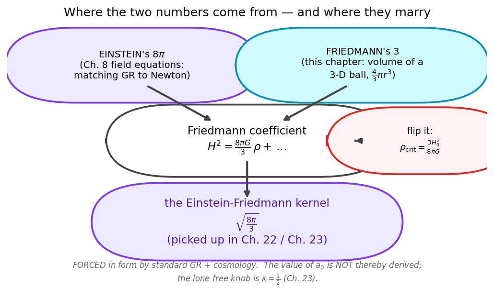

***Figure 9.3 — The pedigree of the "Einstein–Friedmann kernel."*** A schematic tracing the chapter's two load-bearing numbers to their separate origins: the $8\pi$ from Einstein's field equations (Chapter 8) and the $3$ from the three-dimensional volume of space ($\tfrac{4}{3}\pi r^3$), which meet in the Friedmann coefficient $8\pi G/3$, flip into the critical density, and ultimately marry under one root as $\sqrt{8\pi/3}$ — the combination the book picks back up in Chapters 22–23. As the chapter stresses, this kernel's *form* is forced by standard GR and cosmology, but that does **not** derive the value of $a_0$; the lone free knob ($\kappa=\tfrac12$) is quarantined to Chapter 23.

**Source:** Figure generated by [`book/figures/ch09_einstein_friedmann_kernel.py`](https://github.com/carlzimmerman/zimmerman-formula/blob/main/book/figures/ch09_einstein_friedmann_kernel.py). Conceptual diagram built from this chapter's own argument; framework kernel and $\kappa$ quarantine per the $\kappa$ one-parameter geometry theorem ([doi.org/10.5281/zenodo.20738055](https://doi.org/10.5281/zenodo.20738055)).

> **Worked Example: Weighing the whole universe — the critical density.**
>
> The first Friedmann equation lets us answer a wonderful question with arithmetic: *how much stuff would the universe have to contain to be exactly spatially flat?* Set the curvature term to zero ($k=0$) and, for this estimate, set aside the cosmological constant. Then the first Friedmann equation reads simply
> $$ H_0^2 = \frac{8\pi G}{3}\,\rho_{\rm crit}. $$
> Solving for that special density — called the **critical density** — gives
> $$ \rho_{\rm crit} = \frac{3 H_0^2}{8\pi G}. $$
> (Notice our two numbers have swapped places: the $8\pi/3$ has flipped to $3/8\pi$. That same flip, the inverse of the Friedmann coefficient, will reappear in Chapter 23 as part of the geometric identity behind $\kappa$. File it away.)
>
> Let's put numbers in, slowly. The measured Hubble constant is about $H_0 \approx 70$ kilometers per second per megaparsec. To use it in our equation we need it in plain SI units (per second). A megaparsec is about $3.086 \times 10^{22}$ meters, and 70 km/s is $7.0\times 10^4$ m/s, so
> $$ H_0 \approx \frac{7.0 \times 10^4 \ \text{m/s}}{3.086 \times 10^{22}\ \text{m}} \approx 2.27 \times 10^{-18}\ \text{s}^{-1}. $$
> That tiny number is the fractional amount the universe grows each second — about two parts in a billion billion. Now square it: $H_0^2 \approx 5.15 \times 10^{-36}\ \text{s}^{-2}$. Newton's constant is $G \approx 6.674 \times 10^{-11}\ \text{m}^3\,\text{kg}^{-1}\,\text{s}^{-2}$. Plugging in,
> $$ \rho_{\rm crit} = \frac{3 \times (5.15\times 10^{-36})}{8\pi \times (6.674\times 10^{-11})} \approx \frac{1.55\times 10^{-35}}{1.677\times 10^{-9}} \approx 9.2 \times 10^{-27}\ \text{kg/m}^3. $$
> Stand back and feel that result. It works out to roughly **five hydrogen atoms per cubic meter** of space, averaged over the whole universe. That is the density the cosmos needs to sit exactly on the knife-edge between expanding forever and eventually recollapsing — between the rocket that escapes and the ball that falls back. A near-perfect vacuum, by laboratory standards, decides the fate of everything. And remarkably, when we add up all we can measure, the real universe sits astonishingly close to this critical value. Why it should be *so* close is itself a deep puzzle — but that the arithmetic is this simple, and the answer this evocative, is one of the small joys of cosmology.

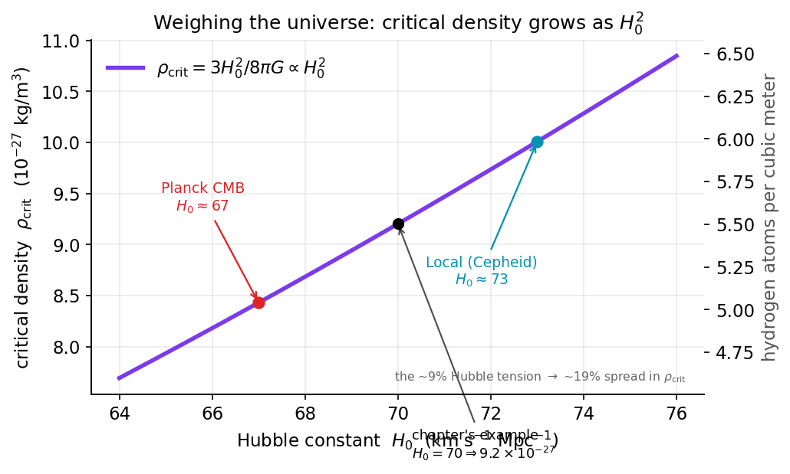

***Figure 9.2 — Weighing the whole universe.*** The chapter's worked example $\rho_{\rm crit}=3H_0^2/8\pi G$ plotted as a curve: because it depends on $H_0^2$, the density that makes space exactly flat climbs steeply with the expansion rate. The right axis converts it to the chapter's "hydrogen atoms per cubic meter" (about five at $H_0=70$, the black point). The two endpoints of the Hubble tension that Question 4 raises — Planck's $\approx67$ and the local $\approx73$ — bracket a $\sim19\%$ spread in the inferred critical density. Computed straight from the worked example's formula and constants.

**Source:** Figure generated by [`book/figures/ch09_critical_density_vs_H0.py`](https://github.com/carlzimmerman/zimmerman-formula/blob/main/book/figures/ch09_critical_density_vs_H0.py). Critical-density formula and constants as stated in this chapter; $H_0$ endpoints from Planck 2018 results VI, A&A 641, A6 ([arXiv:1807.06209](https://arxiv.org/abs/1807.06209)) and local distance-ladder measurements (Riess et al.).

## Omega: Sorting the Universe into Fractions

That worked example hands us one last tool, and it's the one cosmologists reach for constantly. Once you know the critical density — the density that makes space flat — you can measure everything else *against* it, as a fraction. We call that fraction the **density parameter**, written with the Greek letter $\Omega$ (omega):

$$ \Omega = \frac{\rho}{\rho_{\rm crit}}. $$

It's just a ratio: how much of a given ingredient there is, divided by the critical amount. If $\Omega = 1$, that ingredient is at exactly critical density. If the *total* $\Omega$ from all ingredients adds up to 1, the universe is spatially flat — the curvature term in the Friedmann equation vanishes, and parallel laser beams stay parallel forever across the cosmos. If the total comes in above 1, space is positively curved (closed); below 1, negatively curved (open).

This gives us a clean, almost accountant's way to describe the whole universe: list its contents as fractions of critical, and check whether they sum to one. Modern measurements give a tidy and slightly startling inventory. Ordinary matter — every atom in every star, planet, and person — is only about $\Omega_b \approx 0.05$, five percent. The mysterious extra mass we've been chasing since Chapter 3, whatever it is, contributes another $\Omega_{\rm matter} \approx 0.30$ when you include it (this is the "missing mass" budget; in the standard model it's attributed to dark-matter particles, the very thing this book is questioning). And the largest slice of all, about $\Omega_\Lambda \approx 0.69$, is dark energy — the cosmological constant $\Lambda$ — which we'll meet properly in Chapter 11. Add them up and you get very nearly exactly 1: the universe appears to be spatially flat, sitting on the knife-edge to remarkable precision.

> **Deeper Dive: Density parameters and the tidy form of the first Friedmann equation.**
>
> Define a density parameter for each component $i$ as its present-day density divided by the critical density, $\Omega_i \equiv \rho_{i,0}/\rho_{\rm crit}$, with $\rho_{\rm crit} = 3H_0^2/8\pi G$. It is conventional to fold the curvature and cosmological-constant terms into the same language by defining
> $$ \Omega_\Lambda \equiv \frac{\Lambda c^2}{3 H_0^2}, \qquad \Omega_k \equiv -\frac{k c^2}{a_0^2 H_0^2}. $$
> Then, dividing the first Friedmann equation through by $H_0^2$ and accounting for how each component dilutes with expansion ($\Omega_m \propto a^{-3}$ for matter, $\Omega_r \propto a^{-4}$ for radiation, $\Omega_\Lambda$ constant, $\Omega_k \propto a^{-2}$), the entire expansion history collapses into one compact relation:
> $$ \left(\frac{H(a)}{H_0}\right)^2 = \Omega_r\,a^{-4} + \Omega_m\,a^{-3} + \Omega_k\,a^{-2} + \Omega_\Lambda. $$
> Setting $a=1$ (today) gives the *closure* or *sum rule* $\Omega_r + \Omega_m + \Omega_k + \Omega_\Lambda = 1$, an identity, not a measurement; the physical content is in the *separate* values. Observations (chiefly the cosmic microwave background, Chapter 10, combined with supernovae, Chapter 11, and galaxy surveys) give $\Omega_r \approx 9\times10^{-5}$, $\Omega_m \approx 0.31$, $\Omega_\Lambda \approx 0.69$, and $\Omega_k$ consistent with zero to within about half a percent — a spatially flat universe.
>
> This single equation, $H(a)/H_0 = \sqrt{\Omega_r a^{-4} + \Omega_m a^{-3} + \Omega_k a^{-2} + \Omega_\Lambda}$, is the engine of modern cosmology; nearly every quantitative statement about the expanding universe is a consequence of it. It will matter to this book in a very specific way later on. The framework at the heart of these pages proposes that the galactic acceleration scale $a_0$ tracks the dark-energy density *through cosmic time*, $a_0(z) \propto \sqrt{\rho_{\rm DE}(z)}$. To compute that prediction at any redshift, you need to know $\rho_{\rm DE}(z)$ — and *this* equation, generalized to let dark energy evolve rather than stay constant, is exactly what supplies it. So keep the Friedmann engine in mind; in Chapter 25 we'll run it forward (and backward) to ask how $a_0$ should have differed in the early universe, and whether the giant telescopes of the coming decade can catch the difference. I'll say plainly now what I'll repeat there: that prediction is a genuine, falsifiable consequence of the framework's *form*, but it is also *hostage* to whether dark energy really evolves — a question the data have not yet settled, and which currently cuts both ways.

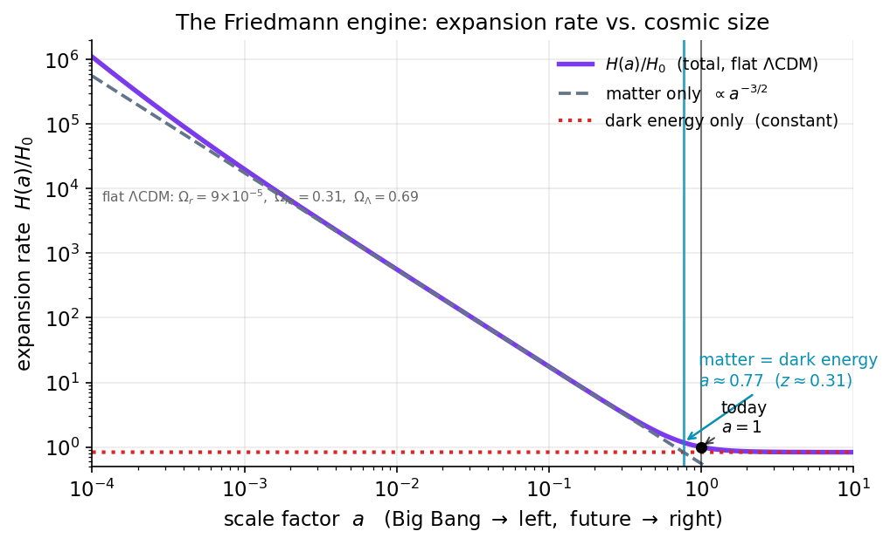

***Figure 9.1 — The Friedmann engine: one equation runs the whole expansion history.*** The purple curve is the chapter's master relation $H(a)/H_0=\sqrt{\Omega_r a^{-4}+\Omega_m a^{-3}+\Omega_k a^{-2}+\Omega_\Lambda}$, plotted across cosmic time from just after the Big Bang (left) into the future (right). The grey dashed line shows matter alone diluting as $a^{-3}$ and the red dotted line shows the cosmological constant staying flat; where they cross (teal line, $a\approx0.75$, $z\approx0.32$) marks the matter–dark-energy equality that Question 5 asks you to find. Computed directly from the chapter's flat-$\Lambda$CDM inventory ($\Omega_r\approx9\times10^{-5},\ \Omega_m\approx0.31,\ \Omega_\Lambda\approx0.69$).

**Source:** Figure generated by [`book/figures/ch09_friedmann_expansion_history.py`](https://github.com/carlzimmerman/zimmerman-formula/blob/main/book/figures/ch09_friedmann_expansion_history.py). Friedmann equation as stated in this chapter; inventory values from Planck 2018 results VI, A&A 641, A6 ([arXiv:1807.06209](https://arxiv.org/abs/1807.06209)).

## What the Expanding Universe Already Tells Us — and What It Doesn't

Let me close the main thread by taking stock, in the honest, both-ways spirit that runs through this whole book.

What the expanding universe gives us is enormous, and I don't want to undersell it. From a handful of redshifted spectral lines and some pulsing stars, we deduced that space itself is stretching; from the stretching, that the cosmos had a hot, dense beginning; and from Einstein's field equations applied to that stretching, a complete and quantitative law — the Friedmann equations — relating the expansion rate to everything the universe contains. That law has been tested against the cosmic microwave background, against the abundances of light elements forged in the first minutes, against the distances to exploding stars, and against the clustering of galaxies, and it passes, repeatedly and with precision. The expanding universe is not a speculation. It is among the most thoroughly verified frameworks in all of science.

And yet the same Friedmann inventory that we just laid out is also, quietly, a confession. Of the total $\Omega = 1$ that fills the cosmos, only about *five percent* is the ordinary matter we understand. The rest — the ~25% of "missing mass" and the ~69% of dark energy — is, at bottom, named rather than explained. We will spend the second half of this book asking whether the "missing mass" is a particle we haven't found or a sign that our law of dynamics needs amending below a certain acceleration, and asking whether the dark energy, that 69% slice of $\Lambda$, might be doing *more* than just driving the expansion — whether it might also, through a single clean relationship, set the scale at which galaxies start to misbehave. That is the wager of this book.

But I want to be clear about the standing of all this, because intellectual honesty is the whole point. Nothing in this chapter is the framework's own; the FLRW metric, the Friedmann equations, the $8\pi$, the 3, the critical density, $\Omega$ — these belong to mainstream cosmology, established and uncontroversial. What the framework will do, beginning in Chapter 20, is take two pieces of this standard machinery — Einstein's $8\pi$ and Friedmann's 3 — and argue that their combination is *forced* into the gravitational kernel that governs galaxies. That argument, when we make it, will be careful, and it will come with its limits stamped on it in bold: the *form* may be forced, but the value of $a_0$ itself rests on a geometric posit, a single number that this work proves *cannot* be derived from the principles in hand. It is one knob, not zero. It is, as I'll keep saying because it keeps being true, not a theory of everything yet — as frustrating as it may be.

For now, though, simply hold onto the picture. The galaxies are raisins in a rising loaf. The dough has been rising for 13.8 billion years, out of a hot dense start. And the rate of the rising obeys a law — Friedmann's law — written in a coefficient, $8\pi G/3$, whose two numbers we will meet again. In the next chapter we go looking for the direct fingerprint of that hot beginning: the oldest light in the universe, still faintly glowing in every direction we point a radio dish.

## Summary

- **The universe is expanding.** Distant galaxies are redshifted — their light stretched toward longer wavelengths — and the farther a galaxy lies, the faster it recedes. This is **Hubble's law**, $v = H_0 d$, with $H_0$ the present-day **Hubble constant**.
- **No galaxy is the center.** Like raisins in rising dough, every observer sees everyone else receding, the far ones fastest, because *space itself* stretches between the galaxies. The cosmological redshift is the stretching of light's wavelength along with space.
- **Rewinding the expansion** leads to a hot, dense beginning ~13.8 billion years ago — the **Big Bang**, which is an expansion *of* space happening everywhere at once, not an explosion at a point. The model describes the cooling aftermath, not the literal first instant.
- **The scale factor $a(t)$** is the single number that captures all of cosmic expansion; $a=1$ today, $a\to 0$ at the beginning, and the Hubble parameter is its fractional growth rate, $H = \dot a/a$.
- **The Friedmann equations** govern $a(t)$. The first ties the *square of the expansion rate* to the total density: $H^2 = \tfrac{8\pi G}{3}\rho - kc^2/a^2 + \Lambda c^2/3$. The second (acceleration) equation shows that matter slows the expansion while negative-pressure dark energy can speed it up.
- **The factor 3** in $8\pi G/3$ is Friedmann's, born of the three-dimensional volume of space; the $8\pi$ is Einstein's, from the field equations of Chapter 8. Together they form $\sqrt{8\pi/3}$, the geometric kernel we will pick back up in Chapter 22 — a piece the framework argues is *forced*, while being honest that this does not by itself derive the value of $a_0$.
- **The critical density** $\rho_{\rm crit} = 3H_0^2/8\pi G \approx 9\times10^{-27}\,\text{kg/m}^3$ (about five hydrogen atoms per cubic meter) is the density that makes space exactly flat. The **density parameter** $\Omega = \rho/\rho_{\rm crit}$ measures each ingredient as a fraction of critical.
- **The cosmic inventory**: ordinary matter ~5%, "missing mass" ~25%, dark energy ~69%, summing to $\Omega \approx 1$ (a flat universe). Only the 5% is genuinely understood — the rest is named, and is the subject of the rest of this book.

## Questions

1. **(Easy.)** In the rising-dough analogy, explain in your own words why a person sitting on *any* raisin sees the same thing — every other raisin receding, the far ones fastest — and why this means the universe has no center. What plays the role of the dough in the real universe?

2. **(Easy–medium.)** Hubble's constant is roughly $H_0 \approx 70$ km/s/Mpc. A galaxy is observed to recede at 7,000 km/s. Using $v = H_0 d$, estimate its distance in megaparsecs. (One megaparsec, Mpc, is about 3.26 million light-years.)

3. **(Medium.)** The first Friedmann equation contains the coefficient $8\pi G/3$. Using the Newtonian sphere argument in the chapter, explain where the **3** comes from geometrically. What would the analogous factor be in a hypothetical *two-dimensional* universe, and why?

4. **(Medium–hard.)** Starting from $\rho_{\rm crit} = 3H_0^2/8\pi G$, redo the worked example with a Hubble constant of $H_0 = 67$ km/s/Mpc instead of 70. By what percentage does the critical density change? (Think about how $\rho_{\rm crit}$ scales with $H_0$ before you compute.) Comment on how the present ~9% disagreement between different measurements of $H_0$ — the "Hubble tension" — would propagate into the inferred critical density.

5. **(Hard.)** Using the dilution rules $\Omega_m \propto a^{-3}$ for matter and $\Omega_\Lambda = $ constant, and today's values $\Omega_m \approx 0.31$, $\Omega_\Lambda \approx 0.69$, find the scale factor $a$ (and hence the redshift $1+z = 1/a$) at which matter and dark energy contributed *equally* to the density. Was this "matter–dark-energy equality" in the cosmic past or future, and roughly how does it compare to the present age of the universe?

6. **(Research-level.)** The chapter flags that the framework's signature prediction, $a_0(z) \propto \sqrt{\rho_{\rm DE}(z)}$, depends on the *evolving* generalization of the first Friedmann equation, replacing the constant $\Omega_\Lambda$ with a dark-energy term whose equation of state $w(z)$ may differ from $-1$. Look up the DESI DR2 result for $w_0$ and $w_a$ (in the common parameterization $w(a) = w_0 + w_a(1-a)$). Write down how the dark-energy density $\rho_{\rm DE}(a)$ evolves for general $w(a)$, and discuss honestly: given the current statistical significance of the DESI evolving-dark-energy signal, how confidently could a measurement of $a_0$ at $z\approx 3$ distinguish the framework's predicted curve from a constant-$a_0$ baseline? What are the dominant uncertainties — in the cosmology, in the astrophysics of high-redshift galaxies, or in the framework's own assumptions?

# Chapter 10: Echoes of the Beginning: The Cosmic Microwave Background

*If you tune an old analog television to a channel with no station, a small fraction of the static you see is the universe itself, glowing faintly from when it was a baby. We are about to read that glow like a baby picture.*

---

## A photograph older than everything

In the last chapter we watched the universe expand, ran the Friedmann equations backward, and arrived at a hot, dense beginning. That story made a prediction so specific and so strange that, for a while, hardly anyone believed it: if the early universe was once hot enough to glow, then the light from that glow should still be traveling toward us right now, stretched and cooled by billions of years of cosmic expansion, arriving from every direction in the sky at once.

That light exists. We have caught it. It is called the **cosmic microwave background** — *cosmic* because it fills the whole cosmos, *microwave* because the expansion of the universe has stretched its wavelength into the microwave band (the same band your kitchen oven uses, though the light itself is a hundred-million times too faint to warm a single drop of water), and *background* because it sits behind everything else in the sky, the farthest thing we can ever see with light. People shorten it to three letters, the CMB, and we will too.

Here is the single most important thing to hold onto as we go. The CMB is a **photograph of the universe when it was about 380,000 years old**. Not 380,000 years ago — 380,000 years *old*. The picture left on its journey when the cosmos was a newborn, and it has been in transit ever since, for roughly 13.8 billion years, only reaching our telescopes now. When you look at the CMB you are not looking at a nearby object that happens to be old. You are looking *across time* at the infant universe directly, the way the light from a distant star shows you that star as it was when the light left, not as it is today.

Think about what that means for a moment, calmly, because it is genuinely one of the most remarkable facts in all of science. We possess a literal image of the universe in its infancy. Not a model of it, not an artist's impression, not an inference — an actual photograph, taken in light, of the thing itself when it was young. Almost nothing in nature lets you do this. The CMB is cosmology's crown jewel: the oldest light there is, and the sharpest single dataset we have about what the universe is made of.

In this chapter I want to do two honest things at once, the way I try to do throughout this book. First, I want to show you *why* the CMB is such a triumph — how a faint pattern of warm and cool speckles in the sky can tell us, to a few percent, the recipe of the entire cosmos. And second, I want to be equally clear about what that triumph quietly assumes before it begins. The CMB is the strongest evidence we have for the standard model of cosmology. It is also a place where the standard model's deepest assumption — that the universe is full of an invisible cold substance — is built into the analysis from the start rather than discovered at the end. Both of those statements are true. We are going to hold them together.

---

## What the early universe was actually like

To understand the photograph, you have to understand the moment it was taken.

Run the clock back toward the Big Bang and the universe gets hotter and denser, because you are squeezing all of today's matter and light into a smaller volume. Hot enough, and ordinary atoms cannot survive. An atom is a positively charged nucleus with negatively charged electrons settled around it, and if you bathe that atom in fierce enough heat, the surrounding light kicks the electrons clean off. What you are left with is not a gas of atoms but a **plasma**: a hot soup of bare nuclei and free electrons, all electrically charged, all moving fast, all mixed together.

For the first several hundred thousand years, the entire universe was exactly this kind of plasma. And a plasma has one property that matters enormously for our story: it is *opaque*. Light cannot travel through it in a straight line.

The reason is the free electrons. A loose, unattached electron is very good at intercepting light and flinging it off in a new direction — physicists call this *scattering*. In the early plasma, a photon of light could not get more than a tiny distance before colliding with an electron and ricocheting away, then colliding again, and again, bouncing endlessly like a person trying to walk across a packed dance floor where everyone keeps bumping into them. Light went nowhere. The early universe glowed brilliantly, but it glowed the way the inside of the Sun glows — sealed, foggy, its light trapped and rattling around forever inside.

> **Margin note.** This is exactly why you cannot see into the Sun. The Sun's surface, the part you'd burn your eyes on, is just the depth at which it stops being opaque. Everything deeper is hidden behind its own fog. The early universe was one cosmos-spanning version of that fog.

Then the universe expanded, and as it expanded it cooled — for the same reason a can of compressed air goes cold when you let it spray out, gas that is allowed to spread out loses heat. And at a certain temperature, something wonderful happened. The cosmos cooled to about 3,000 degrees (roughly half the temperature of the Sun's visible surface), and at that point the light was finally too feeble to keep knocking electrons off of nuclei. For the first time, the electrons could settle down and stay bound, pairing with nuclei to form complete, neutral, electrically balanced atoms — mostly hydrogen and a little helium. The fog lifted.

This event has a slightly misleading name: **recombination**. (Misleading because the electrons and nuclei had never actually been combined before — it was the *first* time, not a re-doing. The name is a historical accident we are stuck with.) Recombination is the moment the universe turned from an opaque plasma into a transparent gas of neutral atoms. And the instant it became transparent, all that trapped light was suddenly free to fly in straight lines across the cosmos, unobstructed, for the first time.

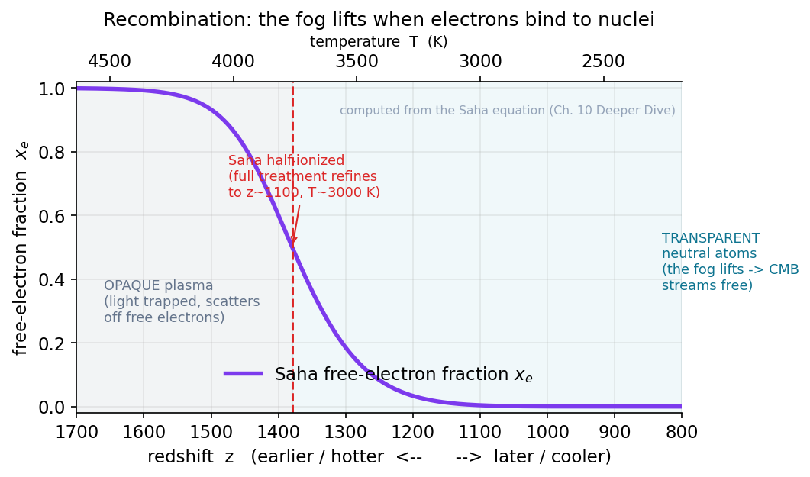

***Figure 10.3 — Recombination: the fog lifts when electrons bind to nuclei.*** The fraction of free electrons in the early universe, computed directly from the Saha equation quoted in the chapter's Deeper Dive. Reading right to left (cooler to hotter), the universe is a hot, OPAQUE plasma at high temperature where free electrons scatter the light; as it cools through roughly 3,000 K the electrons rapidly bind into neutral atoms and the gas turns TRANSPARENT, releasing the CMB. Pure Saha equilibrium puts the half-ionized point a little hotter than the textbook value; the full non-equilibrium (Peebles) treatment the chapter cites refines recombination to z ~ 1100, T ~ 3000 K, as annotated.

**Source:** Figure generated by [`book/figures/ch10_recombination_saha.py`](https://github.com/carlzimmerman/zimmerman-formula/blob/main/book/figures/ch10_recombination_saha.py). Computed from the Saha ionization equation (Ch. 10 Deeper Dive); the refined z ~ 1100 recombination redshift and 2.725 K present-day temperature are standard cosmology (Planck 2018 results VI, A&A 641, A6, arXiv:1807.06209).

That release is the photograph. The light streaming toward us from the CMB is, almost all of it, light that scattered off an electron for the very last time right at recombination and then sailed free. Physicists therefore also call this moment the **surface of last scattering** — the imaginary shell around us, in every direction, marking the spot where each CMB photon had its final collision before beginning its long, lonely trip to our telescopes. When you map the CMB across the whole sky, you are mapping that surface. It is the wall at the edge of the observable universe, the farthest curtain, glowing.

It happened when the universe was about 380,000 years old. By the standards of a 13.8-billion-year cosmos, that is the earliest infancy — the equivalent of the first few hours in a human life. Everything before recombination is hidden behind the fog, the way the inside of the Sun is hidden. The CMB is the earliest thing light can ever show us.

> **Deeper Dive: Why 3,000 K, and why the light is microwaves now.**
>
> The energy that frees an electron from a hydrogen atom is the ionization energy, 13.6 electron-volts. You might guess recombination happens when the *typical* photon energy drops below 13.6 eV, which would correspond to a temperature of order $T \sim 13.6\,\text{eV}/k_B \approx 1.6\times 10^5$ K. But recombination actually waits until the universe is far cooler, around $T \approx 3000$ K (an energy of only ~0.26 eV). The reason is the staggering number of photons per atom — the *baryon-to-photon ratio* is about $\eta \approx 6\times 10^{-10}$, meaning there are roughly a billion-and-a-half photons for every proton. Even when the *average* photon is too weak to ionize hydrogen, the rare high-energy photons far out on the tail of the thermal (blackbody) distribution are still numerous enough to keep the gas ionized. Only when the temperature falls to about $3000$ K does even that energetic tail thin out enough for neutral atoms to win. A careful treatment uses the **Saha equation**, which balances the ionization and recombination rates in thermal equilibrium:
> $$\frac{n_e\, n_p}{n_H} = \left(\frac{m_e k_B T}{2\pi \hbar^2}\right)^{3/2} e^{-13.6\,\text{eV}/k_B T},$$
> where $n_e, n_p, n_H$ are the number densities of free electrons, free protons, and neutral hydrogen. Solving for when the free-electron fraction drops sharply gives recombination at redshift $z \approx 1100$, temperature $\approx 3000$ K.
>
> Since then the universe has expanded by a factor of about $1+z \approx 1100$. Expansion stretches every wavelength of light by that same factor, and because a blackbody's temperature scales inversely with wavelength, the radiation has cooled from 3000 K to
> $$T_0 = \frac{3000\,\text{K}}{1100} \approx 2.725\,\text{K},$$
> which is the temperature we measure today: 2.725 K, or about $-270.4\,^\circ$C, less than three degrees above absolute zero. A 2.725 K blackbody peaks at a wavelength of about 1.9 mm — squarely in the microwave band. That is *why* it is the cosmic **microwave** background. It was visible and infrared light when it was emitted; the expansion of the universe red-shifted it into microwaves on the way here.

---

## How we found it, and how perfect it is

The CMB was predicted before it was found, which is one of the cleaner success stories in physics. In the 1940s, working out the consequences of a hot Big Bang, George Gamow and his collaborators Ralph Alpher and Robert Herman realized that a hot early universe should leave behind exactly this kind of cooled-down relic radiation, and they even estimated roughly how cold it should be by now. The prediction was mostly forgotten.

Then in 1964, two radio engineers at Bell Labs in New Jersey, Arno Penzias and Robert Wilson, were trying to use a large horn-shaped antenna for radio astronomy and kept finding a faint hiss they could not get rid of. It came from every direction, day and night, all year. They checked their equipment obsessively. They evicted a pair of pigeons that had nested in the antenna and scrubbed out what Penzias delicately called "a white dielectric material" the birds had left behind. The hiss remained. What they had stumbled onto, without looking for it, was the afterglow of the Big Bang — the very radiation Gamow's group had predicted. Penzias and Wilson won the Nobel Prize for an annoyance they had spent months trying to eliminate.

Since then we have studied this light with three great satellite missions — COBE in the early 1990s, WMAP in the 2000s, and the European Planck mission whose final results were released around 2018 — each one sharper than the last. And what they found, when they measured the CMB's color spectrum precisely, is almost eerie in its perfection.

The CMB is the most perfect **blackbody** ever measured. A blackbody is the particular smooth rainbow of colors that any object glows with simply because it has a temperature — a hot stove element, a star, you yourself in the infrared. The early universe, sealed in its fog and in perfect thermal balance, glowed as an essentially flawless blackbody, and the CMB has carried that flawless spectrum to us across 13.8 billion years. When COBE measured it, the data points sat on the theoretical blackbody curve so exactly that, at the conference where the result was first shown, the audience of astronomers stood up and applauded. There has rarely been a cleaner agreement between a prediction and a measurement in the history of the field.

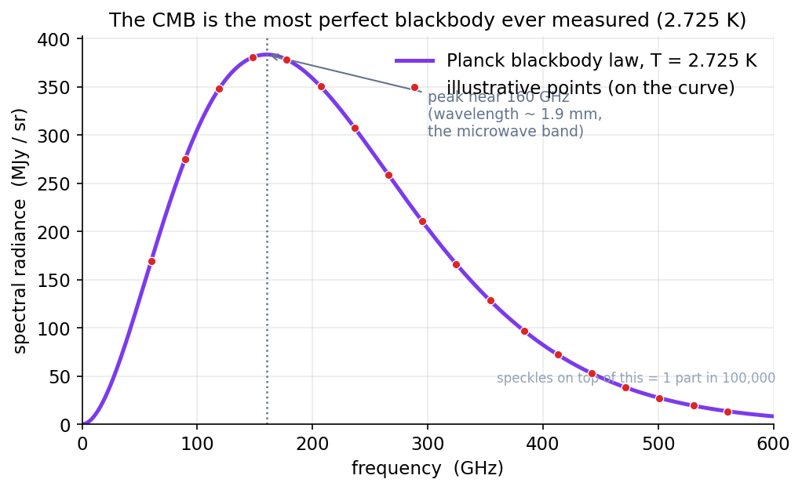

***Figure 10.1 — The CMB is the most perfect blackbody ever measured.*** The smooth purple curve is the exact Planck blackbody law for a temperature of 2.725 K, computed from the formula (no fitting); it peaks near 160 GHz, a wavelength of about 1.9 mm, squarely in the microwave band. The red points are illustrative and placed exactly on the curve to evoke how flawlessly COBE's measured spectrum sat on the theoretical blackbody — they are model-generated, not real data. The faint warm/cool speckles discussed later in the chapter are a one-part-in-100,000 ripple on top of this curve.

**Source:** Figure generated by [`book/figures/ch10_cmb_blackbody.py`](https://github.com/carlzimmerman/zimmerman-formula/blob/main/book/figures/ch10_cmb_blackbody.py). Plotted from the Planck blackbody law at the measured CMB temperature T = 2.725 K (Planck 2018 results VI, A&A 641, A6, arXiv:1807.06209; spectrum first nailed by COBE, see Fixsen et al. via the CMB literature).

That near-perfection is itself a profound result. It tells us the early universe really was hot, dense, and in thermal equilibrium, exactly as the Big Bang picture requires. A cold-start universe, or one assembled some other way, has no natural reason to produce a flawless blackbody filling all of space. The CMB's mere existence and its perfect spectrum are, by themselves, strong evidence that the hot Big Bang of Chapter 9 is broadly right.

But the perfection is not *quite* total — and the imperfections are where the real treasure is buried.

---

## The speckles: a universe that isn't perfectly smooth

When you remove the average glow and crank up the contrast — when you ask not "what is the temperature?" but "where is it a hair warmer, and where a hair cooler?" — the CMB sky lights up with a faint, mottled pattern of speckles. Some patches of sky are very slightly warmer than average; others very slightly cooler. The full map, the one you have probably seen, looks like a marbled oval of red and blue blotches splashed across the whole sky.

I want to be honest about the scale of these differences, because it is easy to be misled by the vivid colors in the published maps. The warm and cool speckles differ from the average by only about *one part in a hundred thousand*. If the average CMB temperature is 2.725 K, the speckles are deviations of a few hundred-millionths of a degree. The dramatic red-and-blue maps are wildly exaggerated in color to make a pattern visible that is, in reality, almost unimaginably faint. The universe at recombination was smooth to a stunning degree — and then, on top of that smoothness, there is this whisper of texture.

That whisper is everything. Those tiny temperature differences are the seeds of all structure in the universe. A patch that was very slightly denser than average — and a denser patch is, as we'll see, a slightly cooler or warmer spot in the CMB depending on the details — had very slightly more gravity, so it pulled in a little more matter, which gave it more gravity still, which pulled in more matter, and over billions of years that runaway gravitational snowball grew into a galaxy, a cluster of galaxies, a cosmic web. You, the Earth, the Sun, the Milky Way — all of it grew from one of these faint over-dense speckles. The CMB shows us the initial conditions of cosmic structure, photographed before structure existed. It is the seed catalog of everything.

And the *pattern* of those speckles — not any single one of them, but their collective statistics, how big the warm and cool patches tend to be, how the small ones relate to the big ones — turns out to encode, with breathtaking precision, what the universe is made of. To read it, we need to understand why the speckles have the sizes they do. And that brings us to sound.

---

## The universe rang like a bell

Here is the idea at the heart of CMB cosmology, and it is genuinely beautiful, so let's take it slowly.

Go back to the plasma, before recombination. We said it was a hot soup of nuclei, electrons, and trapped light, all bouncing around together. Now picture one of those slightly over-dense speckles — a region where, by random chance, there was a little extra matter. Gravity pulls that extra matter inward, trying to make the dense spot denser. But the region is full of light, and light has pressure; the trapped photons push *outward*, resisting the compression, like the air inside a balloon pushing back when you squeeze it.

So you have a tug-of-war. Gravity pulls in, the pressure of trapped light pushes out, gravity wins for a moment and overshoots, the pressure rebounds and pushes back out, it overshoots the other way, and the whole region oscillates — squeezing in, bouncing out, squeezing in again. It rings.

And a ringing, oscillating pressure wave traveling through a gas is exactly what *sound* is. The early universe was filled with sound waves. Real, physical, pressure-and-density sound waves, sloshing through the plasma. We call them **acoustic oscillations** — *acoustic* simply means "having to do with sound." The infant cosmos was a ringing bell, humming with sound waves in every over-dense and under-dense region, all driven by the same eternal contest between gravity pulling in and light pressure pushing out.

> **Margin note.** These were sound waves in the literal sense, but at a pitch no ear could ever hear — something like fifty octaves below the lowest note on a piano. A cosmos-sized organ pipe plays very, very low.

Now here is the trick that turns this into a measurement. These sound waves sloshed back and forth for the entire 380,000 years until recombination — and then, the instant the fog lifted and the universe went transparent, the sound stopped. With the free electrons gone, the light decoupled from the matter; the pressure that had been driving the oscillations vanished. The ringing froze in place.

So every over-dense region was caught at *some particular phase* of its oscillation at the moment the music stopped. Some regions had been compressed to their maximum density right at recombination — these are now the hottest speckles in a particular way. Some had bounced back out to their thinnest. Some were caught mid-swing. The CMB speckle pattern is a snapshot of a cosmos full of frozen sound waves, each captured wherever it happened to be in its cycle when time, for the sound, ran out.

And — this is the key — there is a *special size* in this picture. Consider the regions that had just enough time to compress exactly once and reach maximum density right at recombination, no more and no less. Those regions all share the same physical size, because they all completed exactly the same amount of oscillation in the same available 380,000 years. The sound waves all travel at the same speed (the speed of sound in the plasma), so "how far a sound wave could travel before recombination froze it" is a single, definite distance — the same everywhere in the universe. That distance is called the **sound horizon**, and it acts as a *ruler* of known length, laid down across the entire early cosmos.

When we look at the CMB, those maximally-compressed regions show up as speckles of one preferred angular size on the sky — and that preferred size is the loudest, most prominent scale in the whole speckle pattern. It is the *first acoustic peak*. The other peaks come from regions that had time to oscillate one and a half times, twice, two and a half times, and so on — each a fainter overtone of the fundamental note, like the harmonics that give a struck bell its characteristic timbre.

---

## Reading the music: the power spectrum

How do we actually quantify "the loudest scale" and "its overtones"? We make a graph called the **angular power spectrum**, and it is the single most important plot in modern cosmology, so it's worth understanding what it shows even if you never compute one.

The idea is straightforward. Take the CMB map and ask: at each *angular size* on the sky — speckles a degree across, speckles half a degree across, tiny speckles a tenth of a degree across — how much temperature variation is there at that size? You sweep through every size from big to small and, for each one, measure how strong the warm-cool fluctuations are at that scale. Plot the strength of the fluctuations (vertical axis) against the angular size (horizontal axis, conventionally running from big patches on the left to small patches on the right). That graph is the angular power spectrum. It is the universe's *sheet music* — it tells you which "notes," which speckle sizes, are played loudly and which are played softly.

And the graph is not a smooth slope. It is a series of distinct bumps — a tall first peak, then a dip, then a second peak (shorter), a dip, a third peak, and a train of smaller wiggles fading off to the right. Those bumps are the acoustic peaks. The first and tallest peak is the fundamental note — the regions that compressed exactly once. The second peak is the first overtone, the third peak the next, and so on, each a harmonic of the cosmic bell.

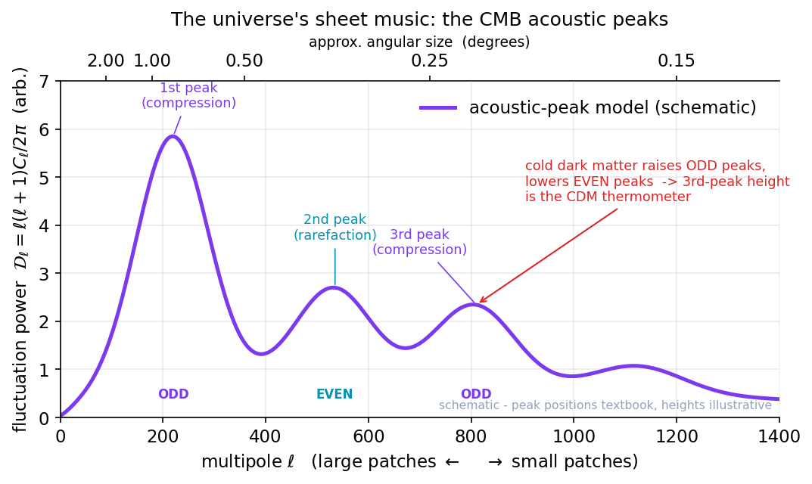

***Figure 10.2 — The universe's sheet music: the CMB acoustic peaks.*** A schematic of the angular power spectrum: fluctuation power versus multipole (large patches on the left, small on the right). The first peak (compression) is the loud fundamental note; the second (rarefaction) and third (compression) are its overtones. The peak positions are the textbook values, but the heights here are illustrative, drawn by hand to show the key asymmetry of the chapter — cold dark matter, which gravitates but does not ring, raises the odd compression peaks and lowers the even rarefaction peaks, making the third-peak height the cleanest thermometer for how much cold dark matter the model requires. This is a conceptual sketch, not a fit to Planck data.

**Source:** Figure generated by [`book/figures/ch10_acoustic_peaks.py`](https://github.com/carlzimmerman/zimmerman-formula/blob/main/book/figures/ch10_acoustic_peaks.py). Schematic of the standard acoustic-peak structure; real measured peaks and their LCDM fit are from Planck 2018 results VI, A&A 641, A6 (arXiv:1807.06209).

This jagged, peaky shape is not a vague suggestion in noisy data. The Planck satellite measured these peaks so precisely that the theoretical curve and the data points are nearly indistinguishable to the eye — one of the most exact agreements between theory and observation anywhere in science. The early universe really did ring like a bell, and we have written down its sheet music to several decimal places.

Now for the payoff. *The exact shape of this peak pattern depends on what the universe is made of.* Change the ingredients of the cosmos and you change the peaks in specific, calculable ways. The position of the first peak tells you about the overall geometry and size of the universe. And — most important for our story — the *relative heights of the peaks* tell you how much of two very different ingredients there were: ordinary matter, and the dark sector.

---

## Weighing the universe by its peaks

Let me explain the physical idea before the math, because it's genuinely intuitive once you see it.

We have two kinds of stuff competing in those oscillating regions. There is ordinary matter — protons and neutrons, the stuff of atoms, which cosmologists call **baryonic matter** (from *baryon*, the family of particles that includes protons and neutrons; the **baryon density** is just the amount of this ordinary matter in the cosmos). Baryonic matter was coupled to the light, riding along with the pressure, part of the ringing.

And then there is the other thing. The standard model of cosmology holds that the universe also contains a great deal of *cold dark matter* — an invisible substance, five times more abundant than ordinary matter, that has gravity but does not interact with light at all. We met this idea in Chapter 5 as one of the two roads from the fork: the road that says the missing mass is a new particle. In the CMB, cold dark matter plays a crucial and distinctive role. Because it doesn't feel light pressure, it doesn't ring. It doesn't push back out. It just sits there providing extra gravity — extra inward pull — without participating in the bounce.

So picture the tug-of-war again, but now with a heavy, silent partner on the *gravity* side. The ordinary matter and light oscillate, compressing and rebounding. The cold dark matter, indifferent to the pressure, deepens all the gravitational wells the oscillation falls into. This has a precise, asymmetric effect on the peaks:

- The **odd-numbered peaks** (first, third, fifth) correspond to maximum *compression* — matter falling all the way into a gravity well. Extra cold dark matter deepens those wells, so it *enhances* the odd peaks.
- The **even-numbered peaks** (second, fourth) correspond to maximum *rarefaction* — matter bouncing back out. Cold dark matter's extra gravity fights that outward bounce, so it *suppresses* the even peaks.

The result is that the *ratio* of peak heights — especially the way the third peak compares to the second — is a sensitive thermometer for how much cold dark matter the universe contains. More cold dark matter pumps up the odd peaks relative to the even ones. And when cosmologists measure the actual peaks, they find that the third peak is noticeably *higher* than you'd expect from ordinary matter alone. To fit it, the standard analysis requires a substantial amount of some cold, gravitating, non-light-interacting component — roughly five times as much of it as there is ordinary matter. That third-peak signal is one of the genuinely independent pieces of evidence that *something* beyond ordinary baryons is gravitating in the early universe. I will come back to this, both ways, in a moment, because it matters a great deal for the framework this book is building toward, and I owe you complete honesty about it.

> **Deeper Dive: The acoustic peaks and the cosmic parameters.**
>
> The angular power spectrum is the statistical workhorse of CMB analysis. Expand the fractional temperature fluctuation across the sky in spherical harmonics:
> $$\frac{\Delta T}{T}(\theta,\phi) = \sum_{\ell=2}^{\infty}\sum_{m=-\ell}^{\ell} a_{\ell m}\, Y_{\ell m}(\theta,\phi).$$
> The information lives not in any individual $a_{\ell m}$ (those depend on which random realization of the universe we happen to inhabit) but in their variance, the angular power spectrum:
> $$C_\ell = \frac{1}{2\ell+1}\sum_{m=-\ell}^{\ell} |a_{\ell m}|^2.$$
> The *multipole* $\ell$ is inversely related to angular size: large $\ell$ means small patches on the sky ($\theta \sim 180^\circ/\ell$). Plots usually show $\mathcal{D}_\ell \equiv \ell(\ell+1)C_\ell/2\pi$, which flattens the large-scale plateau and makes the acoustic peaks stand out.
>
> The **first peak** sits at $\ell \approx 220$, corresponding to an angular size of about $0.6^\circ$ on the sky — twice the apparent size of the full Moon. Its position is set by the ratio of the sound horizon $r_s$ at last scattering to the angular-diameter distance to last scattering $D_A$:
> $$\ell_{\text{peak}} \approx \pi \frac{D_A}{r_s}.$$
> Because $r_s$ is well-determined by the physics of the plasma and $D_A$ depends on the geometry and contents of the universe, the first-peak location is a precise test of spatial flatness — and the CMB tells us the universe is flat to within a fraction of a percent.
>
> The **peak heights** constrain the densities. Conventionally these are written as physical density parameters $\Omega_b h^2$ (baryons) and $\Omega_c h^2$ (cold dark matter), where $h$ is the Hubble constant in units of 100 km/s/Mpc. Increasing $\Omega_b h^2$ adds inertia to the oscillating baryon-photon fluid, which deepens the compressions and shifts the *odd/even peak ratio* — raising the first peak relative to the second (the so-called *baryon loading* effect). Increasing $\Omega_c h^2$ adds gravitating mass that does not oscillate, which changes the overall driving of the oscillations and, through the way the potentials decay, affects the relative heights — most diagnostically, it raises the **third peak**. Planck's measured values are approximately:
> $$\Omega_b h^2 \approx 0.0224, \qquad \Omega_c h^2 \approx 0.120, \qquad \Omega_\Lambda \approx 0.685,$$
> with the third-peak amplitude being the cleanest single handle on $\Omega_c h^2$ — the cold-dark-matter density. It is important to state plainly: within the standard six-parameter $\Lambda$CDM model, this fit is extraordinarily good, and the third-peak constraint on a cold, pressureless, gravitating component is real and independent of galaxy-scale dynamics. We will weigh exactly what that does and does not establish in Chapter 12 and again, with the framework's reckoning, in Part VI.

> **Worked Example: How big should the first acoustic patch look on the sky?**
>
> Let's estimate the angular size of the first acoustic peak from scratch, slowly, using only the ideas in this chapter. We want to compare the physical size of the sound horizon at recombination to how far away that surface is, and convert that ratio into an angle.
>
> **Step 1 — How long did the sound have to travel?** The sound waves rang from the Big Bang until recombination, a span of about $t \approx 380{,}000$ years. (We'll use this as a rough proxy for the time available; a careful calculation integrates over the changing expansion, but the spirit is the same.)
>
> **Step 2 — How fast is sound in the plasma?** In a gas of light and matter dominated by radiation pressure, the speed of sound is close to the speed of light divided by $\sqrt{3}$:
> $$c_s \approx \frac{c}{\sqrt 3} \approx \frac{3.0\times 10^8\ \text{m/s}}{1.73} \approx 1.7\times 10^8\ \text{m/s}.$$
> This is a real, physical sound speed — but in a medium where the "stiffness" comes from the pressure of light itself, so it is an enormous fraction of the speed of light.
>
> **Step 3 — How far could the sound travel (the sound horizon)?** Multiply speed by time. Converting 380,000 years to seconds ($\approx 1.2\times 10^{13}$ s):
> $$r_s \sim c_s \, t \approx (1.7\times 10^8\ \text{m/s})(1.2\times 10^{13}\ \text{s}) \approx 2\times 10^{21}\ \text{m}.$$
> That's about 200,000 light-years — a striking result on its own: the fundamental "note" of the early universe had a wavelength a couple of times the size of the Milky Way. (The careful answer, accounting for expansion, is a comoving sound horizon of about 150 megaparsecs, but our back-of-envelope captures the scale of the *physical* horizon at emission.)
>
> **Step 4 — How far away is the surface of last scattering?** It is essentially at the edge of the observable universe. The comoving distance to last scattering is about $D \approx 14{,}000$ megaparsecs.
>
> **Step 5 — Turn the ruler into an angle.** A ruler of length $r_s$ (in comoving units, $r_s \approx 150$ Mpc) seen at distance $D \approx 14{,}000$ Mpc subtends an angle
> $$\theta \approx \frac{r_s}{D} \approx \frac{150}{14{,}000}\ \text{radians} \approx 0.011\ \text{radians} \approx 0.6^\circ.$$
>
> **The result:** the first acoustic peak should appear as warm-cool patches roughly $0.6^\circ$ across — a bit larger than the full Moon — which corresponds to multipole $\ell \approx 180^\circ/0.6^\circ \approx 200$, right where Planck finds the first peak ($\ell \approx 220$). With nothing but a sound speed, a travel time, and a distance, we have predicted the dominant scale of the speckle pattern to within a small factor. That is the kind of agreement that makes cosmologists trust the picture.

---

## Why the CMB is cosmology's sharpest instrument

Step back and appreciate what we've built. From a faint, frozen pattern of sound waves in a 380,000-year-old photograph, we can read off:

- that the universe is spatially **flat** (from the position of the first peak);
- the amount of **ordinary matter** it contains (from the odd/even peak ratio and baryon loading);
- the amount of the **dark, non-light-interacting gravitating component** the standard model calls cold dark matter (from the third peak especially);
- the amount of **dark energy** (inferred, since the contents must add up to a flat universe);
- the value of the Hubble constant, the age of the universe, the lumpiness of the initial conditions, and more.

The whole standard model of cosmology — the six numbers of $\Lambda$CDM — is pinned down, and cross-checked, and locked together, primarily by this one pattern of speckles. The fit is staggeringly good. When you overlay the theoretical curve on the Planck data, the peaks line up so precisely that there is essentially no daylight between prediction and measurement across the whole spectrum. There is nothing else in cosmology this clean. If you want to know the recipe of the universe to a few percent, you ask the CMB, and it answers with more authority than any other single dataset we have.

I want to honor that fully. The CMB is a monument of precision science — the careful, patient, multi-generational labor of thousands of physicists and engineers, from Penzias and Wilson's pigeon-infested antenna to the Planck satellite a million miles from Earth. It is one of humanity's finest achievements, and any honest framework, including the one this book is about, has to take it completely seriously. We will.

But now I have to keep my promise and tell you the other half.

---

## What the CMB takes for granted

Here is the subtlety I have been building toward, and I want to state it as carefully and as fairly as I can, because it is easy to overstate in either direction.

When cosmologists "measure" the amount of cold dark matter from the third peak, what are they actually doing? They are taking a *model* — the standard six-parameter $\Lambda$CDM model, which already *contains* a cold, pressureless, gravitating, non-light-interacting substance as one of its ingredients — and they are finding the amount of that ingredient that makes the model's predicted peaks match the measured peaks. They are fitting a parameter within an assumed framework. They are not catching the dark matter particle in a detector. They are inferring how much of an *assumed* substance is needed for the *assumed* model to fit.

This is a real and important distinction, and I don't want to either inflate it or wave it away.

On the one hand — and I mean this seriously — the third-peak result is *not* empty or circular in the way a careless critic might claim. The CMB peaks could have come out in a shape that no amount of cold dark matter could fit, and they didn't; they came out in exactly the shape a hefty dose of cold, gravitating, pressureless stuff predicts, and that stuff is *quantitatively the same amount*, about five-to-one over baryons, that Zwicky's clusters and Rubin's rotation curves independently seemed to need. When three completely different measurements — galaxy clusters, galaxy rotation, and the sound waves of the infant cosmos — all point to roughly the same amount of unseen gravitating mass, that is a serious, non-trivial concordance. It is the strongest single reason the mainstream overwhelmingly favors the particle road from the fork. Any honest alternative has to reckon with it head-on, and I am not going to pretend otherwise. The third peak is a genuine, independent constraint on a cold gravitating component, and I'll concede exactly that, with no hedging, when we reach Part VI.

On the other hand — and this is equally true — what the CMB establishes is that *something gravitates like cold dark matter at the time of recombination*. It establishes a gravitational effect with a particular size and signature. It does not, by itself, tell you *what that something is*. It does not tell you it is a particle. It does not tell you it cannot be, instead, a modification of how gravity or inertia behaves in the conditions of the early universe. The CMB measures a gravitational requirement; the leap from "a gravitational requirement shaped like cold dark matter" to "therefore an undiscovered particle exists" is an *interpretation*, the most natural one within $\Lambda$CDM, but an interpretation nonetheless. The data assume the cold component in the model and then quantify it; they do not reach out and grab a particle.

So the CMB is best understood as a spectacularly successful *consistency fit* of a model that has the dark sector built in — not as a *detection* of the dark sector's contents. It pins the parameters of $\Lambda$CDM with unmatched precision. It assumes, rather than discovers, that the dark gravitating component is a particle of cold matter.

I am being careful here for a reason that goes to the heart of this whole book. It would be dishonest of me, building toward a framework that proposes the missing-mass effect is about inertia and dark energy rather than a cold particle, to either (a) pretend the CMB doesn't pose a serious challenge — it does, the third peak is real and the threefold concordance is real — or (b) pretend the CMB *settles* the question against any modification — it doesn't, because it measures a gravitational requirement and reads "particle" into it by assumption. The truth is in between and I'd rather you have the in-between truth than a comfortable slogan in either direction.

And I'll be plain about where the framework of this book stands relative to the CMB, because you deserve to know before we get there: this is one of the places where the framework is *not yet* a full competitor to $\Lambda$CDM. $\Lambda$CDM has a complete, quantitative, stunningly successful account of the entire CMB power spectrum. The framework in this book — a modified-inertia, dark-energy-rooted account of the missing-mass effect — does not yet have a complete first-principles calculation of the CMB peaks to set beside it. It is not a theory of everything yet, as frustrating as it may be, and the CMB is precisely the arena where that gap is widest. What the framework can say, honestly, is that the third peak constrains a *gravitational* requirement at recombination, and that whether a modified-dynamics account can reproduce that requirement is an open, hard, and only partially explored question — one that the relativistic versions of MOND have struggled with and only partly answered. I will give that struggle its full, unflinching space in Part VI. For now I only want you to leave this chapter with the honest shape of the thing: the CMB is the strongest card in $\Lambda$CDM's hand, it is a real and serious challenge to any alternative, and it is a consistency fit with an assumed dark component rather than a direct detection of one. All three of those are true at once.

---

## Summary

- The **cosmic microwave background (CMB)** is the oldest light in the universe: a photograph of the cosmos when it was about **380,000 years old**, arriving from every direction in the sky after traveling for roughly 13.8 billion years.
- Before that time the universe was a hot, opaque **plasma** — bare nuclei, free electrons, and trapped light — in which photons could not travel freely. When the universe cooled to about 3,000 K, electrons bound to nuclei to form neutral atoms (**recombination**), the fog lifted, and the trapped light streamed free from the **surface of last scattering**.
- The CMB is the most perfect **blackbody** ever measured, at a temperature of **2.725 K** today — strong, direct evidence that the hot Big Bang picture is broadly correct.
- On top of its near-perfect uniformity, the CMB carries faint speckles — warm and cool patches differing by only about **one part in 100,000** — which are the seeds of all later cosmic structure.
- The speckles are frozen **acoustic oscillations**: real sound waves that rang in the early plasma as gravity (pulling in) fought the pressure of trapped light (pushing out), captured in mid-cycle when recombination silenced them. Their preferred sizes appear as the **acoustic peaks** in the **angular power spectrum**, the central plot of modern cosmology.
- Peak positions and heights pin down the universe's contents: the first peak shows space is flat; the odd/even peak ratio measures the **baryon density** (ordinary matter); and the **third peak** especially measures the amount of cold, gravitating, non-light-interacting matter — about five times the ordinary matter — within the $\Lambda$CDM model.
- The CMB is cosmology's **sharpest single dataset**, fixing the six parameters of the standard model with unmatched precision and superb internal consistency. The third-peak constraint on a cold gravitating component is genuine and independent, and together with clusters and rotation curves it forms a serious threefold concordance favoring the particle interpretation — which we concede fully.
- But the CMB is a **consistency fit of a model that already contains the dark sector**, not a direct detection of it. It establishes that *something gravitates like cold dark matter at recombination*; the leap to *an undiscovered particle* is the most natural interpretation within $\Lambda$CDM, not a measured fact. And it is the arena where this book's framework is least developed — there is no first-principles modified-dynamics calculation of the peaks yet. Not a theory of everything yet, as frustrating as it may be.

## Questions

1. **(Easy.)** In your own words, why couldn't light travel freely through the universe before recombination, but could afterward? What changed about the electrons?

2. **(Easy–medium.)** The CMB is called the cosmic *microwave* background, but the light was emitted when the universe glowed at about 3,000 K — visible and infrared light, not microwaves. Explain what happened to the light on its journey to turn it into microwaves, and roughly by what factor its wavelength was stretched.

3. **(Medium.)** Using the Worked Example as a guide, suppose the universe had recombined *later*, giving the sound waves more time to travel before freezing. Would you expect the first acoustic peak to appear at a *larger* or *smaller* angular size on the sky? Explain your reasoning physically (think about whether the sound ruler gets longer or shorter).

4. **(Medium–hard.)** Cold dark matter is said to *enhance* the odd-numbered acoustic peaks and *suppress* the even-numbered ones. Explain the physical reason for this asymmetry in terms of compression, rarefaction, and the fact that cold dark matter feels gravity but not light pressure.

5. **(Hard / conceptual.)** This chapter argues the CMB is "a consistency fit of a model that assumes the dark sector, not a detection of it." State the strongest version of the *opposing* view — that the third peak really is compelling evidence for a cold dark matter *particle* — and then state the strongest version of the chapter's view. Where, precisely, do the two views actually disagree, and what kind of future observation (or calculation) could tell them apart?

6. **(Research-level.)** Relativistic theories of modified dynamics (such as TeVeS and its successor AeST) have attempted to reproduce the CMB acoustic peaks — including the third-peak amplitude — without a cold dark matter particle, with mixed success. Investigate one such attempt: what extra fields or ingredients does it introduce, how well does it match the measured peak heights, and what does its degree of success or failure suggest about whether the third-peak signal can be explained by modified dynamics rather than a particle? Relate your findings to the honest standing this chapter describes.

# Chapter 11: 1998: The Universe Accelerates, and Dark Energy Arrives

> *Two teams of astronomers, racing each other across the sky, set out to measure how fast the universe is slowing down. They found, to their shared astonishment, that it is speeding up. The thing doing the pushing is the quiet protagonist of this whole book.*

---

## A Ball Thrown Upward

Imagine throwing a ball straight up into the air. You already know, in your bones, what happens next. The ball climbs, slows, stops for an instant at the top of its arc, and falls back into your hand. Gravity is always pulling it down, so the ball's upward motion is always being eaten away. It cannot win. Every ball thrown by every child on Earth obeys this rule.

For most of the twentieth century, astronomers believed the universe behaved like that ball.

We had learned, by the late 1920s, that the universe is expanding — that distant galaxies are flying apart from one another, the whole cosmos swelling like the surface of a balloon being inflated. (We will tell that story properly in Chapter 9, where we meet Edwin Hubble and the equations of Alexander Friedmann.) And if the universe is full of matter — stars, gas, galaxies, and whatever the dark matter of the previous chapters turns out to be — then all that matter should be pulling on all the rest of it, gravitationally, all the time. Just like the ball.

So the expansion *should* be slowing down. The only real question, people thought, was *how much*. Was there enough matter in the universe to eventually halt the expansion and pull everything back into a fiery collapse — a "Big Crunch," the mirror image of the Big Bang? Or was there too little matter, so that the universe would expand forever, coasting outward but always decelerating, like a ball thrown so hard it escapes Earth's gravity but keeps slowing as it goes? Either way, the expansion was *braking*. The argument was only about how hard.

The number that captured this was given a name: the **deceleration parameter**, written *q₀*. It measured how quickly the cosmic expansion was slowing down right now, in our own era. A positive *q₀* meant the universe was decelerating — braking, as everyone expected. The whole enterprise of two rival teams of astronomers in the 1990s was, in essence, a campaign to measure *q₀* and find out which fate awaited us.

They were so sure of the sign of the answer — positive, braking, slowing — that the question was framed entirely as *how much*. Nobody, or almost nobody, was prepared for the possibility that the measurement would come back with the wrong sign.

It came back with the wrong sign.

---

## How Do You Measure the Speed of the Universe?

To understand what these astronomers did, we need to understand two ideas: how we tell how *far away* a distant galaxy is, and how we tell how *fast* it is receding from us. Get both of those for galaxies near and far, and you can reconstruct the entire history of cosmic expansion — whether it has been speeding up or slowing down over billions of years.

The "how fast" part was, by the 1990s, relatively easy. When an object moves away from us, the light it emits gets stretched to longer, redder wavelengths — a phenomenon called **redshift**. (It is the light-wave cousin of the way a siren drops in pitch as an ambulance races past you.) The more an object's light is stretched, the faster it is receding, and — because light takes time to reach us, so looking far away means looking back in time — the further back into cosmic history we are seeing. Redshift is something astronomers had been measuring reliably for decades. We will use the symbol *z* for it throughout this book: *z = 0* is here and now, *z = 1* is light that left its source when the universe was roughly half its present age, and higher *z* means deeper into the past.

The "how far" part was the hard part. This is, in fact, one of the oldest and most stubborn problems in all of astronomy: the night sky gives you direction but not distance. A faint point of light might be a dim candle nearby or a blazing beacon far away, and from the brightness alone you cannot tell which. To break that ambiguity, astronomers need what they call a **standard candle**: an object whose *true* intrinsic brightness they already know. If you know how bright something really is, and you measure how bright it *appears* from Earth, then the difference between the two tells you how far away it must be — because light dims in a precise, known way as it spreads out across distance (an inverse-square law, the same one that governs gravity and sound).

A standard candle is like a streetlight of a known wattage seen down a long road at night. A 100-watt bulb looks bright up close and dim far away, but if you *know* it is a 100-watt bulb, its apparent dimness tells you exactly how far down the road it sits. The whole game in measuring the universe is finding objects in the sky that are reliable, known-wattage bulbs.

For measuring the *very* distant universe — billions of light-years out, far enough back in time to see whether the expansion has changed its pace — astronomers needed an extraordinarily bright and extraordinarily reliable standard candle. They found one in a particular kind of exploding star.

---

## The Most Useful Explosion in the Universe

Scattered through every galaxy are dead stars called **white dwarfs** — the burnt-out cores left behind when ordinary stars like our Sun exhaust their fuel. A white dwarf is an astonishing object: roughly the mass of the Sun packed into a ball the size of the Earth, so dense that a teaspoon of it would weigh several tons. Left alone, a white dwarf simply sits there and slowly cools for billions of years, going quietly dark.

But not all of them are left alone. Many stars come in pairs, two stars orbiting each other. If one of those partners is a white dwarf and the other is a normal star, the white dwarf can siphon gas off its companion, growing heavier and heavier. And here is the beautiful part: there is a strict, universal limit to how heavy a white dwarf can become before its own gravity overwhelms the internal pressure holding it up. That limit — about 1.4 times the mass of the Sun — is called the **Chandrasekhar limit**, after the astrophysicist Subrahmanyan Chandrasekhar, who worked it out as a young man in the 1930s.

When a white dwarf creeps up to that limit, it can no longer hold itself together. It detonates in a colossal thermonuclear explosion that, for a few weeks, can outshine its entire host galaxy of a hundred billion stars. This is called a **Type Ia supernova** (pronounced "type one-A").

Now think about why this is so wonderful for astronomers. Every Type Ia supernova explodes when its white dwarf reaches *the same* critical mass — that universal 1.4-solar-mass tripwire. So every one of these explosions is, to good approximation, releasing roughly the *same* amount of energy, peaking at roughly the *same* true brightness. They are nature's mass-produced light bulbs, all of the same wattage, scattered across the cosmos and going off one by one. A streetlight of known wattage, visible billions of light-years away.

> **Deeper Dive: Standardizing the Standard Candle.**
> Type Ia supernovae are not, in raw form, *perfectly* identical — their peak luminosities vary by a few tenths of a magnitude. What made them cosmological tools was the discovery in the early 1990s, principally by Mark Phillips, of a tight empirical relationship: the *intrinsically* brighter Type Ia supernovae fade *more slowly* after their peak, and the dimmer ones fade faster. This "Phillips relation" (often parametrized by Δm₁₅, the drop in B-band magnitude in the 15 days after peak, or by a "stretch" factor *s*) lets astronomers measure the decline rate of each individual supernova's light curve and *correct* its peak brightness to a common standard. After this correction, the scatter in standardized peak magnitude falls to roughly 0.1–0.15 mag — about a 5–7% distance uncertainty per object. It is this standardization, not the raw explosions, that turned Type Ia supernovae into the precision distance indicators of modern cosmology. The cosmic distances are read off the *distance modulus*, μ = m − M = 5 log₁₀(d_L / 10 pc), where m is the apparent (measured) magnitude, M is the calibrated absolute magnitude, and d_L is the luminosity distance.

For decades, finding these supernovae was a matter of luck — you had to happen to be pointing your telescope at the right galaxy on the right night, because a given galaxy produces such an explosion only once every few centuries. What changed in the 1990s was a clever industrial strategy: photograph a huge patch of sky containing thousands of galaxies, come back a few weeks later, photograph the same patch again, and subtract one image from the other. Anything that has newly appeared — a fresh point of light that was not there before — is a candidate supernova. By imaging thousands upon thousands of galaxies at once, the teams could practically *guarantee* a harvest of supernovae on a schedule, then race to point the world's largest telescopes at them while they were still bright.

Two teams pursued this. One was the Supernova Cosmology Project, led by Saul Perlmutter at Berkeley. The other was the High-Z Supernova Search Team, led by Brian Schmidt and Adam Riess. They were competitors, sometimes fierce ones, and they worked largely in parallel through the mid-1990s, each chasing the same prize: a precise measurement of how the cosmic expansion was slowing down.

---

## The Surprise

Here is the logic of what they were doing, and it is worth slowing down for because it is the heart of the chapter.

Suppose you find a Type Ia supernova at some redshift — say, a redshift that tells you its light has traveled for five billion years to reach you. You know its true brightness (it is a standard candle), and you measure its apparent brightness, so you know its distance. Now you have a matched pair of numbers for that supernova: how far away it is, and how fast the universe was expanding when its light set out (from the redshift). Collect enough of these matched pairs, near and far, and you have charted the expansion history of the universe — a graph of distance against redshift that encodes whether the expansion has been accelerating or decelerating over cosmic time.

If the universe had been *decelerating* — braking, as everyone expected — then the most distant supernovae would appear *brighter* (closer) than they would in a coasting universe, because a decelerating universe was expanding faster in the past and so packed those distant objects somewhat nearer.

What both teams found, independently, by 1998, was the opposite. The distant supernovae were *fainter* than expected — fainter than even an empty, coasting universe would produce. They were farther away than they had any right to be. The only way to make sense of it was that the expansion of the universe has been *speeding up*. The cosmos is not a ball thrown upward and slowing under gravity. It is a ball that, having been thrown upward, is now *accelerating away from your hand* — as though some force were pushing it outward, overpowering gravity entirely.

The deceleration parameter *q₀* was negative. The sign was wrong. The universe is accelerating.

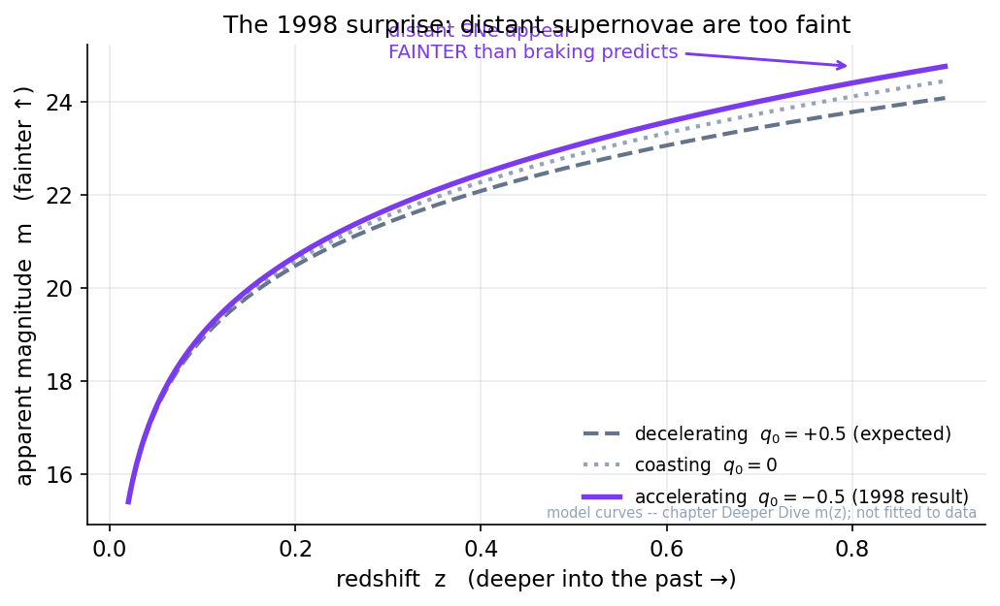

***Figure 11.1 — The 1998 surprise, drawn as curves.*** The chapter's low-redshift magnitude-redshift relation m(z) = M + 5 log10[(cz/H0)(1 + ½(1−q0)z)] + 25 plotted as three model universes: braking (grey dashed, q0 = +0.5), coasting (dotted), and accelerating (purple, q0 = −0.5). At a given redshift the accelerating universe puts every supernova at higher apparent magnitude — fainter, farther away — which is exactly what both teams measured. These are the published relation plotted as models; no observational data points are shown.

**Source:** Figure generated by [`book/figures/ch11_magnitude_redshift_surprise.py`](https://github.com/carlzimmerman/zimmerman-formula/blob/main/book/figures/ch11_magnitude_redshift_surprise.py). Functional form from the chapter's Deeper Dive on the magnitude-redshift relation; the discovery it depicts is Riess et al. 1998, AJ 116, 1009 and Perlmutter et al. 1999, ApJ 517, 565.

> **Deeper Dive: The Magnitude–Redshift Relation and q₀ < 0.**
> The observable is the relationship between a supernova's apparent magnitude *m* (a measure of apparent brightness) and its redshift *z*. For small redshifts this can be expanded as a Taylor series in *z*:
>
> $$ m(z) = M + 5\log_{10}\!\left[\frac{c\,z}{H_0}\left(1 + \tfrac{1}{2}(1 - q_0)\,z + \cdots\right)\right] + 25 $$
>
> where *H₀* is the present-day Hubble constant (the current expansion rate), *c* is the speed of light, and the term in *q₀* is where the deceleration enters. The deceleration parameter is defined from the cosmic scale factor *a(t)* (which tracks the size of the universe over time) as
>
> $$ q_0 \equiv -\frac{\ddot{a}\,a}{\dot{a}^2}\bigg|_{t_0}. $$
>
> The minus sign in the definition is historical: it was inserted so that a "sensibly" decelerating universe would have positive *q₀*. A positive *q₀* means *ä < 0* (decelerating expansion); a negative *q₀* means *ä > 0* — the expansion is *accelerating*. The 1998 result, from both the Supernova Cosmology Project (Perlmutter et al. 1999) and the High-Z team (Riess et al. 1998), was *q₀ ≈ −0.5* for a flat universe, decisively negative. Translated into the matter and dark-energy content of a flat universe (with q₀ = ½Ω_m − Ω_Λ for the simplest model), it pointed to roughly Ω_Λ ≈ 0.7 and Ω_m ≈ 0.3 — about 70% of the universe's energy in whatever was causing the acceleration. The two teams cross-checked each other's astonishing result, which is a large part of why the community believed it so quickly. The 2011 Nobel Prize in Physics went to Perlmutter, Schmidt, and Riess for the discovery.

It is hard to overstate how unsettling this was at the time. The result was not what anyone went looking for. Both teams spent considerable effort trying to make the acceleration go away — was it dust dimming the distant supernovae? Were ancient supernovae somehow intrinsically different from nearby ones? Was there a subtle error in the standardization? They checked, and checked, and the acceleration stubbornly survived every check. And crucially, two competing teams, using somewhat different methods and different supernovae, arrived at the *same* strange answer. In science, when your rivals confirm the very result you were hoping to scoop them on, you start to believe it.

Within a few years, the accelerating universe was no longer a fringe claim but the consensus. And it forced physics to confront a question it had been quietly avoiding for eighty years: *what is doing the pushing?*

---

## Naming the Mystery: Dark Energy

The substance — or property, or whatever it turns out to be — responsible for the acceleration was given the name **dark energy**.

The name is honest in one respect and misleading in another. It is honest because it openly admits ignorance: "dark" here means *unknown*, in the same spirit as "dark matter," and "energy" is a placeholder for *whatever has the gravitational effect of pushing space apart*. It is misleading because the name suggests we know it is some kind of stuff, some substance filling space, when in truth we know almost nothing about it except its effect on the large-scale expansion of the cosmos.

What we *can* say is this. To make the universe accelerate, you need something whose gravity *repels* rather than attracts. That sounds impossible — gravity always pulls, doesn't it? In Newton's physics, yes. But in Einstein's General Relativity, which we will build up carefully in Chapters 7 and 8, gravity responds not only to energy and mass but also to *pressure*. And something with sufficiently strong *negative* pressure — a kind of tension, like a stretched spring pulling inward — produces, through Einstein's equations, a gravitational effect that pushes *outward*. Dark energy is whatever fills space with that peculiar property: positive energy density and strongly negative pressure, spread smoothly and evenly through every cubic centimeter of the cosmos, pushing space apart everywhere at once.

There is a margin note worth keeping in mind here:

*Dark energy and dark matter are completely different mysteries that unfortunately share an adjective. Dark matter clumps and pulls things together; it lives in and around galaxies. Dark energy is smooth and pushes things apart; it lives everywhere. The "dark" in both just means "we don't fully know what it is."*

Dark energy makes up, on current measurements, about 68–70% of the total energy content of the universe today. Dark matter is roughly another 27%, and ordinary matter — everything made of atoms, every star, planet, person, and breath of air — is a mere 5%. The accelerating expansion told us that the universe is, energetically, dominated by something we cannot see, cannot bottle, and cannot yet explain. The 5% we are made of is the thin froth on a very deep, very dark ocean.

---

## The Oldest Candidate: Einstein's Cosmological Constant

The simplest candidate for dark energy is also the oldest, and it comes with one of the most famous stories in physics — a story about a mistake that may not have been a mistake at all.

Back in 1917, when Einstein first applied his brand-new theory of General Relativity to the universe as a whole, the prevailing belief — which Einstein shared — was that the universe was *static*: neither expanding nor contracting, simply *there*, eternal and unchanging on the largest scales. But when Einstein wrote down his equations for such a universe, he found they would not allow it. A universe full of matter must either expand or contract; it cannot sit still, any more than that thrown ball can hover motionless in mid-air. The matter's own gravity would inevitably pull it together.

So Einstein did something he was entitled to do mathematically: he added a term to his equations. This term, which he denoted with the Greek capital letter **Λ** (lambda) and called the **cosmological constant**, represented a uniform, built-in tendency of space itself to push outward — a repulsion spread evenly through the vacuum. By tuning Λ to exactly balance the inward pull of all the matter, Einstein could make his equations describe a static universe after all. It was a fudge, frankly, introduced for a single purpose: to hold the cosmos still.

Then, in the 1920s, Hubble and others discovered that the universe is *not* static — it is expanding. The whole reason for inventing Λ evaporated. Einstein is said to have called the cosmological constant his "biggest blunder," and he dropped it from his equations. For decades afterward, Λ was treated as an embarrassing historical footnote, a term you *could* add to General Relativity but had no reason to.

The 1998 discovery brought Λ roaring back from the dead. Because here is the thing: a cosmological constant — a uniform repulsive energy built into the vacuum of space — is *exactly* the kind of thing that makes the universe accelerate. The very term Einstein invented to hold the universe still turns out, when its sign and strength are set differently, to be the simplest possible description of a universe flying apart faster and faster. The blunder became, eighty years later, the leading explanation for the deepest mystery in cosmology. There is a lesson in that about how science actually proceeds, and about intellectual humility, that I find genuinely moving.

When dark energy is identified with the cosmological constant Λ, it has a very specific character: its density is *constant* in space and *constant* in time. As the universe expands and ordinary matter thins out (the same number of atoms spread over a growing volume), the cosmological constant's energy density does *not* dilute. Every new cubic meter of space that the expansion creates comes pre-filled with the same amount of this vacuum energy. That is a strange and important property, and it is captured by a single number that physicists use to label what kind of stuff something is: its equation of state.

> **Deeper Dive: The Equation of State *w* and Why w = −1 for Λ.**
> The **equation of state** of a cosmic component is the ratio of its pressure *p* to its energy density *ρ* (times *c²*):
>
> $$ w \equiv \frac{p}{\rho c^2}. $$
>
> This single number determines how a component's density evolves as the universe expands. For a component with constant *w*, the density scales with the cosmic scale factor *a* as
>
> $$ \rho \propto a^{-3(1+w)}. $$
>
> - **Ordinary (non-relativistic) matter** — atoms, dark matter — has negligible pressure, *w = 0*, so *ρ ∝ a⁻³*: density falls as the volume grows, exactly as you'd expect for a fixed number of particles in an expanding box.
> - **Radiation** (photons) has *w = +1/3*, so *ρ ∝ a⁻⁴*: it dilutes faster than matter because each photon is also stretched (redshifted) to lower energy as space expands.
> - **A cosmological constant** has *w = −1*. Then *−3(1 + w) = 0*, so *ρ ∝ a⁰ = constant*: the density does not change at all as the universe expands. This is the mathematical statement of "every new cubic meter comes pre-filled with the same vacuum energy."
>
> The condition for *accelerating* expansion (ä > 0) in a universe dominated by one component is *w < −1/3* — i.e., sufficiently negative pressure. A cosmological constant at *w = −1* comfortably satisfies this. The energy density of the cosmological constant is related to Λ itself by
>
> $$ \rho_{\rm DE} = \frac{\Lambda c^2}{8\pi G}, $$
>
> where *G* is Newton's gravitational constant. We will call this the **vacuum energy density**, ρ_DE, and it is — quietly, and this is the whole point of the book — the central number from which the framework of later chapters draws the galactic acceleration scale *a₀*. Hold onto ρ_DE. It is the protagonist.

I want to flag something here, gently, because it matters for the rest of the book and I do not want to oversell it at this early stage. The fact that dark energy *might* be a cosmological constant with *w* exactly equal to −1 is the simplest hypothesis, and for two decades it fit the data beautifully. But "simplest" and "fits so far" are not the same as "proven." Whether *w* is *exactly* −1, or slightly different, or even *changing over cosmic time*, is one of the most actively contested questions in cosmology right now — and as we will see in the final part of this book, recent survey data have begun to hint, controversially and not yet decisively, that *w* may not be a constant after all. That open question is precisely where the framework of this book makes its sharpest, most testable prediction. But we are getting ahead of ourselves. For now, simply hold two thoughts at once: a cosmological constant is the simplest and best-supported description of dark energy, *and* we do not actually know that it is the right one. Both things are true.

---

## The Most Embarrassing Number in Physics

Now we come to the part of the story that physicists find genuinely embarrassing, and that I think is important to face squarely rather than tuck away. We have a measured value for the dark energy density, ρ_DE. We also have a theoretical prediction for it, from our best and most successful framework for the microscopic world — quantum field theory. The two numbers disagree.

They do not disagree by a little. They disagree by something like 120 orders of magnitude — a factor of 1 followed by 120 zeros. It is, by a wide margin, the worst quantitative prediction in the history of physics. It has a name: the **cosmological constant problem**.

Here is where the prediction comes from, in plain language. Quantum field theory — the spectacularly successful theory underlying particle physics — tells us that "empty" space is not really empty. The vacuum seethes with activity: pairs of particles and antiparticles continually flickering into existence and annihilating again, fields that cannot ever be perfectly still but must always retain a minimum jitter (a consequence of Heisenberg's uncertainty principle). Each of these quantum fields carries a baseline "zero-point" energy even in its lowest state, even when no real particles are present. Add up the contributions of all these jittering fields throughout the vacuum, and you get a prediction for the energy density of empty space — which is *exactly* the kind of thing a cosmological constant is supposed to be.

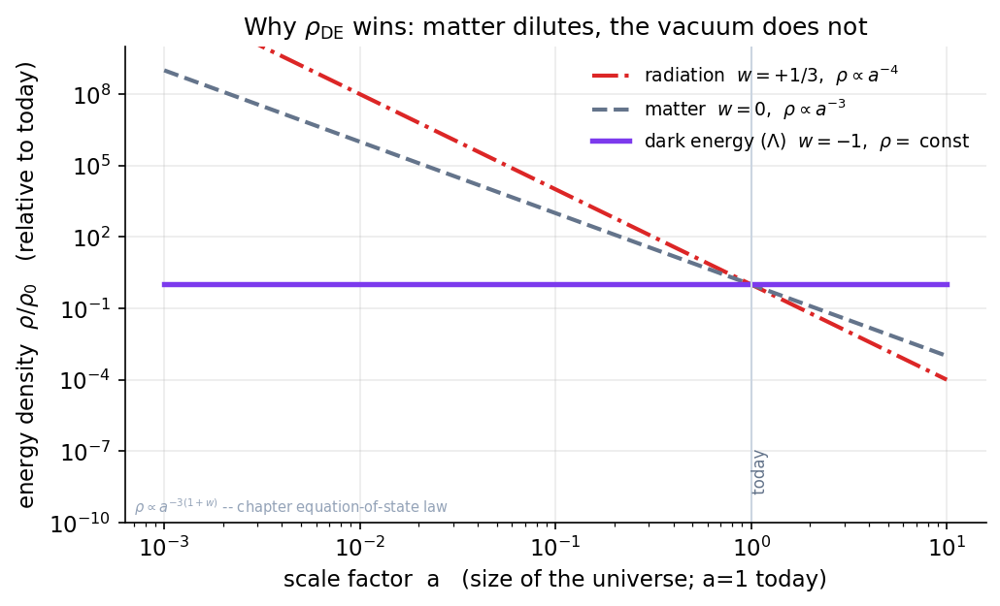

***Figure 11.2 — Why dark energy ends up dominating.*** Each component's density follows the chapter's scaling law ρ ∝ a^(−3(1+w)): radiation (w = +1/3) plunges as a⁻⁴, matter (w = 0) falls as a⁻³, while a cosmological constant (w = −1) stays flat — every new cubic metre of space comes pre-filled with the same vacuum energy. Read right-to-left into the past, matter and radiation tower over the vacuum; read forward, they thin out and ρ_DE is left in command. Computed directly from the framework/standard equation of state; all three curves normalized to equal density today.

**Source:** Figure generated by [`book/figures/ch11_density_scaling_eos.py`](https://github.com/carlzimmerman/zimmerman-formula/blob/main/book/figures/ch11_density_scaling_eos.py). Scaling law ρ ∝ a^(−3(1+w)) from the chapter's Deeper Dive on the equation of state; component values are standard ΛCDM (Planck 2018 results VI, A&A 641, A6).

The trouble is that when you add it up, the answer comes out astronomically, catastrophically too large. The quantum vacuum, naively calculated, should be so densely packed with energy that its repulsive gravity would have blown the universe apart so violently and so fast that no galaxy, no star, no atom could ever have formed. We would not be here to worry about it. Yet the *actual* dark energy density we measure from the accelerating supernovae is fantastically, delicately small — small enough to let structure form over billions of years and only gently nudge the expansion. The gap between the calculated vacuum energy and the observed one is that staggering ~120 orders of magnitude.

> **Deeper Dive: Where the 120 Orders of Magnitude Come From.**
> The zero-point energy of a quantum field, summed over all modes up to some maximum momentum (a "cutoff" *k_max*), diverges as the fourth power of that cutoff:
>
> $$ \rho_{\rm vac} \sim \frac{\hbar}{c}\int_0^{k_{\max}} \frac{4\pi k^2\,dk}{(2\pi)^3}\,\tfrac{1}{2}\sqrt{k^2 + (mc/\hbar)^2}\;\sim\; \frac{\hbar\,k_{\max}^4}{16\pi^2 c}. $$
>
> If one believes physics holds all the way up to the Planck scale — the energy at which quantum gravity becomes unavoidable, *E_Planck ≈ 1.22 × 10¹⁹ GeV* — then taking *k_max* at the Planck momentum gives a vacuum energy density of order
>
> $$ \rho_{\rm vac} \sim \rho_{\rm Planck} \sim 10^{96}\ \text{kg/m}^3 \quad\Longleftrightarrow\quad \sim 10^{113}\ \text{J/m}^3. $$
>
> The *measured* dark energy density is
>
> $$ \rho_{\rm DE} \approx 6 \times 10^{-27}\ \text{kg/m}^3 \quad\Longleftrightarrow\quad \sim 6 \times 10^{-10}\ \text{J/m}^3. $$
>
> The ratio is roughly *10¹²²* — the famous "120 orders of magnitude." Even if one cuts the theory off far below the Planck scale — say, at the electroweak scale (~10² GeV), which is far more conservative — the mismatch is still around 10⁵⁵. There is no known mechanism in the Standard Model that naturally cancels the vacuum energy down to the tiny observed value without an almost unbelievably fine-tuned cancellation, delicate to dozens of decimal places. Supersymmetry, were it exact, would force the cancellation to be perfect (bosonic and fermionic contributions cancel) — but supersymmetry is not exact in our world, and broken supersymmetry leaves a residue still many tens of orders of magnitude too large. The cosmological constant problem remains genuinely unsolved. It is worth being clear-eyed about this: *no one*, in any framework, including the one in this book, has derived the value of ρ_DE from first principles. We will be scrupulous about that distinction throughout.

I dwell on this because it is one of the great unsolved problems of physics, and because it frames something I want to be completely honest about from the very start. The framework at the center of this book does *not* solve the cosmological constant problem. It does not explain *why* dark energy has the tiny value it has. What it does — and we will build to this slowly and carefully over the coming chapters — is take the measured value of ρ_DE as a given, an input from observation, and show that this single number appears to set the scale at which galaxies start misbehaving: the acceleration scale *a₀* of the previous chapters. That is a real and, I think, beautiful connection. But it is a connection *from* dark energy *to* galaxy dynamics, not an explanation of dark energy itself. The 120-order-of-magnitude puzzle remains exactly as puzzling as before. I would be doing you a disservice to suggest otherwise, and this book is not a theory of everything yet — as frustrating as it may be.

---

## Why This Chapter Is the Hinge of the Whole Book

Let me step back and say plainly why we have spent a whole chapter on a discovery about exploding stars and the expansion of the universe, in a book that is ultimately about why galaxies spin too fast.

In the chapters of Part 1, we met the central puzzle: galaxies and clusters behave as though they contain far more gravitating "stuff" than we can see. We laid out the two great roads from that puzzle — a new particle (Chapter 5 and 6) or a new law of dynamics (Part 4). And there is one curious fact about galaxy rotation curves that we have not yet emphasized but which will become the load-bearing observation of this entire book: the anomaly — the place where the visible matter's gravity stops being enough — kicks in not at a particular *distance* or a particular *size*, but at a particular *acceleration*. There is a special acceleration scale, about 10⁻¹⁰ meters per second squared, below which the discrepancy appears, in galaxy after galaxy, large and small. This scale has a name, *a₀*, and we will meet it formally in Part 4.

Here is the connection that animates everything that follows, stated now only as a teaser and a promise. That galactic acceleration scale *a₀*, measured from the rotations of galaxies, turns out to be numerically tied to ρ_DE — the dark energy density we have just met, measured from the explosions of distant stars. Two completely independent corners of the cosmos — the slow majestic spin of nearby galaxies, and the faint glow of supernovae billions of light-years away — appear to point at *the same number*. Roughly, and we will make this precise in Chapter 20,

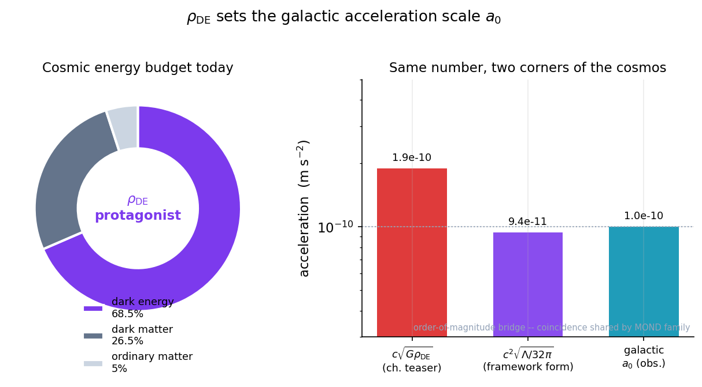

***Figure 11.3 — The hinge: from the vacuum to galaxy spins.*** Left, the cosmic energy budget today, with ρ_DE the dominant ~68.5% slice — the protagonist this chapter introduces. Right, the chapter's teaser bridge a₀ ∼ c√(G ρ_DE) ≈ 1.9×10⁻¹⁰ m s⁻² lands within a factor of two of the framework's own form c²√(Λ/32π) ≈ 9.4×10⁻¹¹ and of the observed galactic scale ~10⁻¹⁰ m s⁻². An order-of-magnitude bridge computed from the chapter's equations. Important: a₀'s VALUE is taken as a measured input — its form is forced, but neither it nor ρ_DE is derived from first principles, and this numerical coincidence is shared by the whole MOND family.

**Source:** Figure generated by [`book/figures/ch11_rhoDE_to_a0_bridge.py`](https://github.com/carlzimmerman/zimmerman-formula/blob/main/book/figures/ch11_rhoDE_to_a0_bridge.py). Teaser relation a₀ ∼ c√(Gρ_DE) and the form a₀ = c²√(Λ/32π) from the framework spine ([doi.org/10.5281/zenodo.20721540](https://doi.org/10.5281/zenodo.20721540)); energy-budget fractions from Planck 2018 results VI, A&A 641, A6 (arXiv:1807.06209).

$$ a_0 \sim c\sqrt{G\,\rho_{\rm DE}}\,, $$

up to a pure number we will spend an entire chapter (Chapter 23) examining honestly. The energy that pushes the universe apart on the largest scales seems also to set the scale on which gravity goes strange inside individual galaxies. *That* is the thread this book follows. And it begins here, in 1998, with the discovery of the protagonist: dark energy, ρ_DE, the quiet repulsive tension in the vacuum.

I want to be careful, even in a teaser, to flag what is and is not being claimed — because that habit of both-ways honesty is the spine of this book. That two numbers from different corners of the cosmos coincide is a real and striking empirical fact, noticed by others before this framework and shared by the whole family of modified-dynamics ideas (Part 4). What this framework adds is a specific *mechanism* and a *form* for that coincidence — and, most importantly, a falsifiable prediction: if *a₀* really is set by ρ_DE, and if ρ_DE turns out to *change* over cosmic time (the open *w(z)* question we flagged above), then *a₀* should change too, in a particular way, across cosmic history. That prediction is the subject of Part 6, and it is where the whole edifice will eventually live or die. For now, simply note that the protagonist has entered the stage, and that everything afterward depends on it.

---

## Summary

- For most of the twentieth century, physicists assumed the expanding universe must be *decelerating*, braked by the gravity of all its matter, like a ball thrown upward. The only question was how much. They were trying to measure the **deceleration parameter** *q₀*, expecting it to be positive.

- To chart the expansion history, two teams used **Type Ia supernovae** — exploding white dwarfs that all detonate at the same critical (Chandrasekhar) mass and so serve as **standard candles** of known true brightness. After standardizing via the Phillips relation (brighter ones fade more slowly), their apparent brightness gives reliable distances across billions of light-years.

- In **1998**, the Supernova Cosmology Project (Perlmutter) and the High-Z Supernova Search Team (Schmidt and Riess) independently found distant supernovae *fainter* — farther away — than a decelerating or even coasting universe allows. The expansion is *accelerating*; *q₀* is negative. The result earned the 2011 Nobel Prize.

- The cause was named **dark energy**: something with positive energy density and strong *negative* pressure, spread smoothly through all of space, whose net gravitational effect (via General Relativity) is repulsive. It makes up roughly 68–70% of the universe's energy content; dark matter is ~27%, ordinary atoms only ~5%.

- The simplest candidate is **Einstein's cosmological constant Λ** — the very term he added in 1917 to hold a static universe still, then abandoned as his "biggest blunder." A cosmological constant has **equation of state** *w = −1*, meaning its **vacuum energy density** ρ_DE = Λc²/8πG stays constant as the universe expands. Whether *w* is *exactly* −1, or evolves, is contested and is where this book's sharpest prediction will live.

- The **cosmological constant problem**: quantum field theory predicts a vacuum energy density about **120 orders of magnitude** larger than the measured ρ_DE — the worst quantitative prediction in physics, and genuinely unsolved. The framework of this book does *not* solve it; ρ_DE is taken as a measured input, not derived.

- This chapter introduces the **protagonist** of the whole framework: ρ_DE, the dark energy density. Later chapters argue that this same number sets the galactic acceleration scale *a₀* — a real empirical coincidence, shared with the wider MOND family, to which the framework adds a mechanism and a testable *a₀(z)* prediction. But that is a connection *to* dark energy, not an explanation *of* it. This is not a theory of everything yet, as frustrating as it may be.

---

## Questions

1. **(Easy.)** A ball thrown straight up slows down, stops, and falls back. In what specific way does the expanding universe *not* behave like this ball, and what did astronomers discover in 1998 that revealed the difference?

2. **(Easy.)** Explain in your own words why a "standard candle" is useful for measuring cosmic distances. Why are Type Ia supernovae especially good standard candles — what makes them all roughly the same true brightness?

3. **(Intermediate.)** The deceleration parameter *q₀* was defined with a minus sign so that an "expected" decelerating universe would have *positive q₀*. The 1998 measurement gave *q₀ ≈ −0.5*. Explain what the negative sign means physically, and why it was so surprising to the people who measured it.

4. **(Intermediate.)** A cosmological constant has equation of state *w = −1*, which means its energy density stays *constant* as the universe expands, while ordinary matter dilutes as *ρ ∝ a⁻³*. Using these scalings, explain why dark energy was *negligible* in the early universe but *dominates* today — and roughly what this implies about the far future of cosmic expansion.

5. **(Advanced.)** The cosmological constant problem is often quoted as a "120 orders of magnitude" discrepancy, but the exact figure depends on the assumed high-energy cutoff. Using the Deeper Dive, contrast the Planck-scale estimate (~10¹²²) with a more conservative electroweak-scale estimate (~10⁵⁵). Why does the *size* of the discrepancy depend on the cutoff, and why does even the conservative version remain a serious problem?

6. **(Research-level.)** This book will argue that the galactic acceleration scale *a₀* is numerically tied to the dark energy density ρ_DE, roughly *a₀ ∼ c√(G ρ_DE)*. (a) Using ρ_DE ≈ 6 × 10⁻²⁷ kg/m³, *G* = 6.67 × 10⁻¹¹ N·m²/kg², and *c* = 3 × 10⁸ m/s, estimate *a₀* and compare it to the quoted galactic scale ~10⁻¹⁰ m/s². (b) This numerical coincidence is shared by the entire MOND family of ideas, not unique to this framework. What, then, would it take for a framework to claim it has done more than *notice* the coincidence — what kind of additional content (mechanism, form, or prediction) would distinguish a genuine physical connection from a numerical accident? (Keep your answer conceptual; later chapters take it up in detail.)

# Chapter 12: ΛCDM and Its Patches: The Honest Ledger of the Standard Model

*Every working scientist keeps two ledgers for their favorite idea: one for what it gets right, and one for what it has had to fix. The honest ones show you both. This chapter is that double ledger for the model that rules modern cosmology.*

---

## The Model That Runs the Universe (On Paper)

For the last quarter-century, almost every professional cosmologist has worked inside a single picture of the universe. It has a name that sounds like a license plate: **ΛCDM**. Let us unpack it before it can intimidate anyone.

The **Λ** is the Greek capital letter lambda. It stands for the cosmological constant — Einstein's old fudge factor that came roaring back in 1998 when two teams of astronomers discovered that the expansion of the universe is speeding up (we will meet that discovery properly in Chapter 11, and we have it on the table now). In the modern model, Λ represents **dark energy**: a smooth, invisible something that fills all of space and pushes it apart.

The **CDM** stands for **Cold Dark Matter**. "Dark" because it gives off no light. "Cold" because the particles move slowly compared to the speed of light, which matters a great deal for how galaxies clump together. This is the invisible mass we have been chasing since Zwicky weighed the Coma cluster in 1933 (Chapter 3) and Rubin charted her flat rotation curves in the 1970s (Chapter 4).

Put the two together — a cosmological constant plus cold dark matter — and you have ΛCDM, the **standard model of cosmology**. When someone says "the standard model" in a cosmology seminar, this is what they mean.

Here is the universe ΛCDM describes, in the three numbers everyone quotes:

- About **5%** of the cosmos is **ordinary matter** — the stuff of stars, planets, gas, dust, and you. Everything we have ever directly seen or touched. Five percent.
- About **27%** is **dark matter** — the cold, invisible mass.
- About **68%** is **dark energy** — the Λ.

Read that again slowly, because it is genuinely staggering. In the reigning theory of everything-at-large, *ninety-five percent of the universe is made of two things we have never identified in a laboratory.* We have a name for each, a rough abundance for each, and for neither do we have a confirmed sample, a measured mass, or a clear place in the rest of physics.

I want to be completely fair from the first paragraph, because fairness is the whole point of this chapter. The fact that 95% of the model is unidentified is **not, by itself, an argument that the model is wrong.** Oxygen was real and abundant long before anyone isolated it. The neutrino was proposed in 1930 and not detected until 1956 — twenty-six years of believing in something invisible because the bookkeeping demanded it, and the bookkeeping was right. A theory can point confidently at something it cannot yet hold. So the question is never "how dare they invoke the unseen." The question is the harder one: *how well does this particular bookkeeping work, and how was it arrived at?*

That is what a ledger is for.

---

## What ΛCDM Gets Right (the Credit Column)

Let me start with the credit column, in full, because you cannot weigh a theory you have only heard insulted. ΛCDM is not a desperate hack. It is one of the most quantitatively successful frameworks in the history of science, and any honest critic — including me, and I am a critic — has to sit with that before saying a word against it.

**The cosmic microwave background.** When you point a sensitive radio telescope at empty sky, you find a faint, even glow left over from when the universe was 380,000 years old (Chapter 10). It is almost perfectly uniform, but not quite: there are tiny ripples, hotter and colder spots, at the level of one part in a hundred thousand. ΛCDM predicts the detailed *statistics* of those ripples — how much power there is at each angular size on the sky — with a precision that still gives me chills. The famous "power spectrum," with its series of peaks, is fit by the model across many peaks at once using only a handful of numbers. This is not a curve casually drawn through data. It is a structured, multi-peaked prediction that matches a structured, multi-peaked measurement. When people defend ΛCDM, *this* is the mountain they are standing on, and it is a real mountain.

**The growth of cosmic structure.** Start with those one-part-in-a-hundred-thousand ripples in the early universe. Let gravity work on them for 13.8 billion years, with cold dark matter providing the extra pull. ΛCDM predicts the cosmic web we actually see — galaxies strung along filaments, walls, and voids, with a characteristic clumpiness at each scale. Large galaxy surveys measure that clumpiness, and the model broadly fits.

**Big Bang nucleosynthesis.** In the first few minutes, the universe forged the lightest elements. The predicted abundances of hydrogen, helium, and a trace of lithium match observation well (lithium has a wrinkle we will not dwell on). This is older than ΛCDM proper, but it is part of the same consistent picture.

**Baryon acoustic oscillations.** Sound waves in the hot early plasma left a preferred distance — a faint "standard ruler" — frozen into the distribution of galaxies. We measure that ruler at many different cosmic epochs and it behaves as the model says it should. This is one of ΛCDM's cleaner successes, and ironically it is the very dataset (from the DESI survey) that is now making some trouble for the model, as we will see.

Six numbers do most of this work. That economy is genuinely impressive, and I want it stated plainly before the criticism starts.

> **Deeper Dive: The Six Parameters of ΛCDM**
>
> The phrase **six-parameter model** is precise, not loose. Standard ΛCDM is specified by six free numbers, fit to data (most authoritatively to the Planck satellite's CMB measurements). A common choice of the six:
>
> 1. $\Omega_b h^2$ — the physical density of ordinary (baryonic) matter.
> 2. $\Omega_c h^2$ — the physical density of cold dark matter.
> 3. $100\,\theta_{MC}$ — the angular size of the sound horizon at recombination (a precisely measured ruler on the sky; it stands in for the Hubble constant).
> 4. $\tau$ — the optical depth to reionization (how much the CMB was re-scattered once the first stars lit up).
> 5. $A_s$ — the amplitude of the primordial density fluctuations.
> 6. $n_s$ — the spectral tilt of those fluctuations (how the fluctuation strength varies with scale).
>
> From these six, everything else is *derived*: the Hubble constant $H_0$, the matter fraction $\Omega_m$, the dark-energy fraction $\Omega_\Lambda$, the age of the universe, the amplitude parameter $\sigma_8$, and so on. The famous "5/27/68" split is an output, not an input.
>
> Note what is held *fixed* by assumption rather than fit: spatial flatness ($\Omega_k = 0$), a pure cosmological constant with equation-of-state $w = -1$ (dark-energy pressure exactly equal to minus its energy density), three light neutrino species, and a featureless power-law for the primordial fluctuations. **Every one of those fixed assumptions is an extra dial that can be turned if the data demand it.** When you read that ΛCDM has "only six parameters," keep in mind that the true count of available knobs — six fit plus the several frozen-by-choice — is larger. The six are the ones currently varied. Part of the honest accounting in this chapter is noticing how often a "fixed" assumption quietly becomes a fit parameter when a tension appears.

---

## The Edit History

Now the debit column. And here I have to be careful, because this is the part of the story where it is easiest to be unfair, and unfairness would cost us the reader's trust — rightly.

Software has an edit history: a list of every change, who made it, and why. I find it clarifying to imagine the standard cosmological model the same way — as a long-lived, much-loved piece of software that has been **revised roughly a dozen times** over its history. None of these revisions was fraud or even sloppiness. Most were the ordinary, healthy response of science to new data. But laid end to end, the edit history tells you something about the *character* of the model that no single revision does. So let us read it, fairly.

A partial, honest log:

1. **Λ is switched off (mid-20th century).** After Hubble found the expansion, Einstein's cosmological constant was widely regarded as an embarrassment and set to zero. The standard model of the day had no Λ at all.

2. **Dark matter is adopted (1970s–80s).** Rubin's rotation curves and the cluster dynamics make missing mass undeniable. Cold dark matter is written in.

3. **Inflation is added (1980s).** To explain why the universe is so flat and so uniform, a burst of faster-than-anything expansion in the first fraction of a second is appended to the front of the story. Inflation is elegant and has had real successes; it is also a bolt-on that the original picture did not contain.

4. **Λ is switched back on (1998).** The supernova results force the cosmological constant back into the model — the very term that had been an embarrassment becomes 68% of the universe. The sign of the coefficient was not predicted in advance by the standard model; it was read off the data and installed.

5–12. **The small-scale and tension patches (1990s–present).** Cusp-versus-core, missing satellites, too-big-to-fail, baryonic feedback tuning, the Hubble tension, the $S_8$ tension, evolving dark energy, the cosmic dipole. We will walk through these below, because they are the live part of the ledger.

I am being deliberately loose about whether the count is exactly twelve — different people would draw the lines differently, and I will not pretend to a precision the history does not support. The point is not a tally. The point is the *pattern*: **the model's most important features were, again and again, installed in response to data rather than predicted ahead of it.** Λ went out, then came back in. Dark matter was added. Inflation was added. Each fix was reasonable. The accumulation is what deserves a long, honest look.

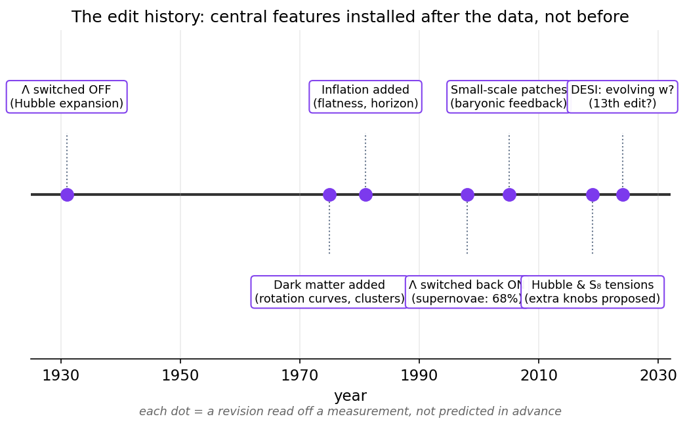

***Figure 12.1 — The edit history, as a timeline.*** A schematic of the chapter's "edit log": each purple dot marks a moment when a central feature of the standard model was installed (or removed) in response to a new measurement — Λ switched off after Hubble, dark matter added, inflation appended, Λ switched back on by the 1998 supernovae, the small-scale feedback patches, the Hubble/S₈ tensions, and DESI's contested hint of evolving dark energy. The point is the *pattern*: the model's most important features were read off the data, not named in advance. Schematic; dates are approximate and the count is deliberately loose, as the chapter stresses.

**Source:** Figure generated by [`book/figures/ch12_edit_history.py`](https://github.com/carlzimmerman/zimmerman-formula/blob/main/book/figures/ch12_edit_history.py). Events and framing follow this chapter's "Edit History" section; the underlying historical episodes draw on Riess et al. 1998, AJ 116, 1009 and Perlmutter et al. 1999, ApJ 517, 565 (Λ switched back on), Rubin & Ford 1970, ApJ 159, 379 and Zwicky 1933, Helv. Phys. Acta 6, 110 (dark matter), and DESI DR2 2025, arXiv:2503.14738 (evolving dark energy).

And here is the sentence I most want you to hold onto, because it is the cleanest single statement of the worry — and I will immediately test it against the strongest objection:

> In the entire edit history of the standard cosmological model, it is hard to point to a case where the model named a specific new number *in advance* and was then confirmed by a measurement it had not already seen.

That is a pointed claim. An honest book has to stress-test its own pointed claims as hard as it tests its rivals', so let me do that now, out loud.

**The objection — and it is a good one.** A defender of ΛCDM will say: that is simply false. The acoustic-peak structure of the CMB *was* a genuine forward prediction. The existence and approximate scale of the baryon acoustic oscillation ruler *was* predicted before it was cleanly measured. The detailed polarization pattern of the CMB was predicted and then found. These are real forward predictions, and pretending they do not exist would be exactly the kind of dishonesty this book refuses.

So I have to soften the claim, and I will. The fair version is narrower and survives the objection:

> The model's *core compositional facts* — that there is dark matter, that there is a cosmological constant, and roughly how much of each — were established by **fitting**, not by **forward prediction**. The amount of dark matter was not named in advance; it was inferred from rotation curves and cluster dynamics and then refined by the CMB fit. The dark-energy density was not named in advance; it was read off the supernova data in 1998. Λ's very *presence* in the model flipped from "zero" to "68%" on the strength of a measurement. The successful forward predictions ΛCDM genuinely owns are about the *patterns* that follow once the compositional ingredients and their amounts are already in hand.

That distinction — between predicting a *pattern* given your ingredients, versus predicting the *ingredients and their amounts* — is the honest core of the whole debate, and I will come back to it at the end. It is also, I should say plainly, the standard against which this book's own framework must be judged: the de Sitter–MOND proposal at the heart of this book makes one genuine *forward* prediction about a number that evolves with cosmic time (we reach it in Chapter 25), and that is exactly the kind of test the standard model has rarely had to face for its central quantities. I am not claiming our framework wins. I am claiming the *form* of the question — forward prediction versus fit — is the right one to keep asking of *everyone*, including ourselves.

---

## The Small-Scale Tensions

The CMB and the cosmic web are *large-scale* successes — averages over enormous patches of sky. When you zoom down to the scale of individual galaxies and their little satellite companions, ΛCDM's pure predictions have historically run into trouble. None of these is a knockout. All of them have proposed fixes. But the *kind* of fix matters, and that is what I want you to watch.

**Cusp versus core.** Run a pure cold-dark-matter simulation and it predicts that the dark-matter density should spike sharply toward the center of a galaxy — a "cusp." Many real galaxies, especially small ones, instead show a flat central density — a "core." The naive prediction and the observation disagree about the shape of the very thing the model is built on.

**Missing satellites.** The same simulations predict that a galaxy like our Milky Way should be surrounded by hundreds or thousands of small dark-matter clumps, each potentially hosting a dwarf galaxy. For a long time we saw only a few dozen. The predicted swarm of little galaxies was mostly missing.

**Too big to fail.** A subtler cousin of the satellite problem: the biggest dark-matter clumps the simulations produce are so massive that they *should* have lit up as visible dwarf galaxies — they are "too big to fail" at forming stars — and yet the corresponding bright dwarfs are not all there.

> **Deeper Dive: The Three Small-Scale Tensions, and the Feedback Fix**
>
> Each of these has a more technical statement and, importantly, a proposed resolution. The resolution in every case is the same ingredient: **baryonic feedback** — the energy that ordinary matter dumps back into a galaxy when stars form, explode as supernovae, and when central black holes blast out winds.
>
> - **Cusp–core:** Pure $N$-body CDM simulations yield central density profiles close to the Navarro–Frenk–White form, $\rho(r) \propto 1 / \big[(r/r_s)(1+r/r_s)^2\big]$, which rises as $\rho \sim 1/r$ at small radius (a cusp). Rotation curves of many dwarf and low-surface-brightness galaxies instead favor a constant-density core, $\rho \to \text{const}$. The proposed fix: repeated bursts of star formation and supernova feedback drive gas in and out of the center, and the fluctuating gravitational potential gradually "heats" the dark matter and flattens the cusp into a core.
>
> - **Missing satellites:** CDM predicts a subhalo mass function rising steeply toward low masses, $dN/dM \propto M^{-1.9}$ or so — hundreds to thousands of subhalos above the dwarf-galaxy threshold around a Milky-Way host. The proposed fix: most low-mass subhalos never form enough stars to be seen (suppressed by reionization heating the gas and by feedback blowing it out), so they are dark, not absent. Faint-galaxy surveys (SDSS, DES, and others) have since found many more ultra-faint dwarfs, easing — though not entirely erasing — the original discrepancy.
>
> - **Too big to fail:** The most massive simulated subhalos have central densities (parametrized by $V_{max}$, the peak circular velocity) too high to match the observed Milky-Way satellites, which sit at lower densities. The proposed fix is again feedback plus a downward revision of the Milky Way's total mass, plus tidal stripping by the host.
>
> **Baryonic feedback** is the key term to define and to scrutinize. It is entirely real physics — supernovae and black-hole winds genuinely inject energy. The honest concern is that feedback is also extremely hard to compute from first principles, so in practice it is implemented through *sub-grid recipes* with tunable efficiency parameters. Different simulation groups (EAGLE, IllustrisTNG, FIRE, and others) make different choices and can each be brought into agreement with the data. The worry, stated fairly, is not that feedback is fake — it is that feedback is *flexible enough to absorb a wide range of outcomes*, which makes the small-scale agreement less of a clean prediction and more of a successful accommodation. Whether that flexibility is a strength (rich, real astrophysics) or a weakness (an adjustable buffer) is exactly the central question of this chapter.

I want to be scrupulous here. The small-scale problems are *much less severe today* than they were two decades ago. Many more faint satellites have been found. Feedback simulations really do produce cores. Some of these tensions may simply be solved, and a fair reading says they are at least greatly eased. But notice the shape of the solution: in each case, the *clean, parameter-free prediction of cold dark matter alone* disagreed with observation, and agreement was restored by adding a flexible, tunable layer of baryonic astrophysics on top. That may be perfectly correct. It is also, structurally, another entry in the edit history.

---

## The Big Tensions: Hubble and S₈

The small-scale tensions are old and softening. The two tensions that genuinely keep cosmologists up at night are newer, sit at larger scales, and have *grown* rather than shrunk as the data have improved. That last fact is what makes them serious.

**The Hubble tension.** The **Hubble constant**, written $H_0$, measures how fast the universe is expanding today — roughly, how much faster a galaxy recedes for every additional megaparsec of distance. There are two great ways to measure it.

One way is to look at the *early* universe: take the CMB, fit it with ΛCDM, and let the model *predict* what $H_0$ should be today. That gives a value near **67** kilometers per second per megaparsec.

The other way is to look at the *nearby, late* universe directly: measure the distances to relatively close galaxies using a ladder of standard candles (Cepheid variable stars calibrating Type Ia supernovae) and read the expansion rate straight off. That gives a value near **73**.

Sixty-seven versus seventy-three. For years this could be waved away as measurement error. It can no longer. As both measurements have tightened, the gap has *not* closed — it has sharpened to a statistical significance of roughly **five sigma**, the conventional threshold at which physicists stop calling something a fluke. The early-universe model and the late-universe yardstick disagree about the expansion rate of the same universe, at a level that is hard to blame on bad data.

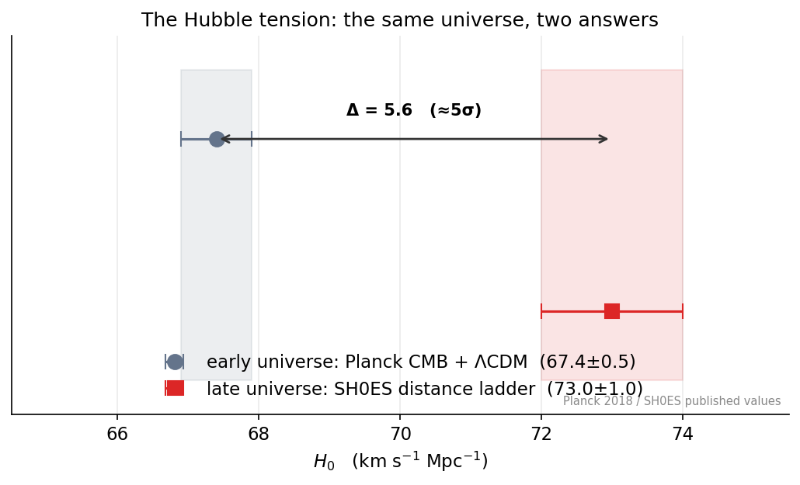

***Figure 12.2 — The Hubble tension.*** The two great ways of measuring today's expansion rate disagree. The early-universe route (Planck CMB fit with ΛCDM, *extrapolated* to today) lands near 67.4±0.5; the late-universe route (the SH0ES Cepheid-to-supernova distance ladder, read off directly) lands near 73.0±1.0. The bands do not overlap, and the gap is about 5σ — a clean, large-scale discrepancy in exactly the regime where ΛCDM should be strongest. The two reported central values and their 1σ uncertainties are published numbers, plotted as a comparison of model-prediction versus direct measurement.

**Source:** Figure generated by [`book/figures/ch12_hubble_tension.py`](https://github.com/carlzimmerman/zimmerman-formula/blob/main/book/figures/ch12_hubble_tension.py). Values from Planck 2018 results VI, A&A 641, A6 (arXiv:1807.06209) for the CMB+ΛCDM number and the SH0ES distance-ladder measurement as quoted in this chapter's Deeper Dive box.

**The S₈ tension.** The **S₈ tension** is the Hubble tension's quieter sibling. $S_8$ is, loosely, a measure of how *clumpy* the matter in the universe is on large scales — how strongly it is bunched up. Again there are two routes. The CMB, fit with ΛCDM, predicts a certain clumpiness. Direct measurements of the nearby universe — especially *weak gravitational lensing*, the slight bending of distant galaxies' light by intervening matter — tend to find the universe **slightly less clumpy** than the CMB-plus-ΛCDM prediction. The discrepancy is milder than Hubble's, often around two to three sigma, and some recent analyses have softened it further, so I will not overstate it. But its direction has been stubborn: late-universe structure looks a touch smoother than the early-universe model says it should.

> **Deeper Dive: What the Tensions Are, Quantitatively**
>
> **Hubble.** The Planck 2018 CMB fit gives $H_0 = 67.4 \pm 0.5\ \mathrm{km\,s^{-1}\,Mpc^{-1}}$. The SH0ES Cepheid-calibrated supernova distance ladder gives $H_0 = 73.0 \pm 1.0$ or so, with various analyses clustering in the 72.5–74 range. The discrepancy sits near $5\sigma$. Crucially, the CMB number is *not a direct measurement of today's expansion* — it is what ΛCDM *extrapolates* to today from the physics of recombination. So the tension can be read two ways: either one of the measurements has an unspotted systematic, or **the model used to bridge the early and late universe is missing something.** Independent late-universe methods (the tip of the red-giant branch, gravitational-wave "standard sirens," time-delay lensing) land at intermediate or high values and have not cleanly resolved it.
>
> **$S_8$.** The parameter is conventionally defined as
> $$ S_8 \equiv \sigma_8 \sqrt{\Omega_m / 0.3}, $$
> where $\sigma_8$ is the amplitude of matter-density fluctuations averaged in spheres of radius $8\ h^{-1}\,\mathrm{Mpc}$, and $\Omega_m$ is the matter density fraction. Planck-ΛCDM predicts $S_8 \approx 0.83$. Weak-lensing surveys (KiDS, DES, HSC) have reported values often nearer $0.76$–$0.78$, i.e. a *lower* amplitude, at the $\sim 2$–$3\sigma$ level — though the most recent joint analyses have moved closer to the CMB value, which is why I flag this one as real but *softening* and not to be oversold.
>
> A proposed-fixes scorecard, stated fairly: dark energy that evolves in time, extra relativistic species, a tweak to the early universe's sound horizon, decaying or interacting dark matter, and so on. Each can ease one tension; none has cleanly resolved both at once without cost. That very situation — a proliferation of candidate patches, each adding a parameter — is itself a data point about the model's current standing.

Here is why these two matter more than the small-scale problems. A small-scale tension can plausibly be blamed on messy, hard-to-simulate baryonic astrophysics inside individual galaxies. But the Hubble and $S_8$ tensions are *clean, large-scale, mostly gravitational* comparisons — exactly the regime where ΛCDM is supposed to be at its most trustworthy. And the standard playbook for resolving them is, once again, recognizable: relax one of the assumptions held fixed in the six-parameter model (a pure $w=-1$ dark energy, three neutrino species, a particular early-universe sound horizon) and let the freed-up knob soak up the discrepancy. It may well be the right move. It is also, structurally, the same move the edit history has made all along.

---

## DESI and the Hint of Evolving Dark Energy

The newest entry in the ledger is, to me, the most interesting — partly because it touches this book's own framework, and so I have to be *more* careful here, not less.

ΛCDM assumes dark energy is a true cosmological constant: its equation-of-state parameter, written $w$, is exactly $-1$, meaning its density never changes as the universe expands. The same value yesterday, today, and ten billion years hence. That constancy is an *assumption*, one of the dials frozen by choice that we flagged earlier.

Starting in 2024 and strengthening into 2025, the **DESI** survey — the Dark Energy Spectroscopic Instrument, which measures that baryon-acoustic standard ruler at many cosmic epochs at once — reported a preference for dark energy that is **not** constant. Combined with supernova and CMB data, DESI favors a model in which $w$ was more negative in the past and has been *rising* toward (and recently crossing) $-1$, a scenario cosmologists label $w_0 w_a$CDM. In plain terms: the data hint that dark energy may have *evolved*, getting weaker over time rather than holding perfectly steady.

I have to be honest in *both* directions about what this means.

**For ΛCDM**, it is a genuine challenge to a core assumption: if it holds up, the $w=-1$ dial that the standard model freezes by choice is wrong, and the model would need yet another edit — a thirteenth entry, if you are counting. Depending on the data combination, the preference for evolving dark energy has been quoted anywhere from a modest ~2-3σ up to the ~4σ range, which is suggestive but well short of the 5σ that physicists demand before calling something discovered.

**For the framework in this book**, I have to be *most* careful of all, because here my own enthusiasm is the enemy of honesty. The de Sitter–MOND proposal at the center of this book ties the galactic acceleration scale $a_0$ to the dark-energy density — and so it predicts that $a_0$ should *track dark energy through cosmic time* (Chapter 25). If dark energy genuinely evolves, that is the kind of environment in which this framework makes a sharp, falsifiable forward prediction. **But I must not dress that up as a win.** The DESI evolving-dark-energy signal is *contested*: it depends on which supernova dataset you combine, some analyses push the significance down toward ~1.3σ under certain priors, and it has not been confirmed by an independent survey. If it evaporates, the framework's signature prediction loses the favorable backdrop it would most like to have. I am flagging DESI as an *opportunity and a hostage*, not a result in anyone's pocket. As I will keep saying throughout this book: this is **not a theory of everything yet, as frustrating as it may be**, and a contested hint in someone else's survey does not change that.

---

## The Cosmic Dipole Anomaly

One more entry, included precisely because it is the kind of anomaly it would be tempting to leave out.

When we look at the cosmic microwave background, there is a large **dipole** — the sky is slightly hotter in one direction and cooler in the opposite direction. The standard interpretation is simple and almost certainly largely correct: we are *moving*. Our Solar System, riding the Milky Way, drifts through the cosmic rest frame at a few hundred kilometers per second, and that motion blueshifts the CMB ahead of us and redshifts it behind. Knowing our speed, we can predict that *the distribution of distant galaxies and quasars should show a matching dipole* — the same direction, the same magnitude — purely from our motion.

The anomaly is this: several studies counting distant radio galaxies and quasars find a dipole pointing in roughly the expected *direction* but with **about twice the expected magnitude**. If those measurements hold, then either we are moving faster than the CMB says, or there is some genuine large-scale asymmetry in the matter distribution — and either reading is uncomfortable for a model whose bedrock assumption is that the universe is the same in every direction (isotropy).

I include this one *with explicit caution flags*, because it would be easy to oversell. The galaxy-dipole measurements are hard, the samples are heterogeneous, selection effects are a serious worry, and not every analysis agrees. It is entirely possible this anomaly dissolves under better data. But it belongs in an honest ledger precisely *because* it is inconvenient, and a ledger that quietly omitted its inconvenient rows would not be worth keeping.

---

> **Worked Example: How Many Knobs Does It Take to Fit a Tension?**
>
> Let me make the "adjustability" worry concrete with a simple, transparent piece of bookkeeping — the kind you can check on the back of an envelope. I am not proving anything deep here; I am just *counting*, slowly, so the structure is visible.
>
> Suppose you face the Hubble tension: the early-universe fit predicts $H_0 \approx 67$, the late-universe ladder measures $H_0 \approx 73$. You want to reconcile them inside an extended model. Watch the parameter count.
>
> **Step 1 — Baseline.** Standard ΛCDM has its **6** fit parameters. With those six, it predicts $H_0 \approx 67$ from the CMB. That single predicted number is in $\sim 5\sigma$ tension with the local $73$. So far, no extra knobs.
>
> **Step 2 — Free the neutrinos.** A popular fix is to let the number of relativistic species, $N_{\mathrm{eff}}$, float instead of fixing it at the standard $3.046$. Adding a touch of extra radiation in the early universe shifts the inferred $H_0$ upward. Parameter count: $6 \to \mathbf{7}$.
>
> **Step 3 — Free the dark-energy equation of state.** Alternatively (or additionally), let $w$ float away from $-1$, or let it evolve as $w(a) = w_0 + w_a(1-a)$. The single-$w$ version adds one knob; the evolving version adds **two**. Parameter count: $7 \to \mathbf{8}$ or $\mathbf{9}$.
>
> **Step 4 — Tweak the early universe.** "Early dark energy" — a transient burst of dark energy near recombination that shrinks the sound horizon and raises the inferred $H_0$ — typically adds **two or three** more parameters (an amplitude, a critical redshift, sometimes a shape). Parameter count: climbing toward $\mathbf{10}$–$\mathbf{12}$.
>
> **The point of the count.** Each of these extensions *can* relieve the Hubble tension. None of them was named in advance as the universe's true description; each is reached for *after* the tension appears, and each costs at least one new adjustable number. A model that can absorb a $5\sigma$ discrepancy by any of *several* different two-or-three-parameter additions is, in a precise sense, **highly adjustable**.
>
> Now — and this is the honest other half — *adjustability is not automatically a vice.* Adding $N_{\mathrm{eff}}$ as a free parameter is exactly how the neutrino was eventually pinned down; the freedom encoded real physics. The deep question, which counting alone cannot settle, is whether these particular extra knobs correspond to *real ingredients waiting to be discovered* (as the neutrino did) or are *curve-fitting freedom that will keep absorbing each new tension without ever being independently confirmed*. The arithmetic above does not answer that. It only makes the question impossible to ignore.

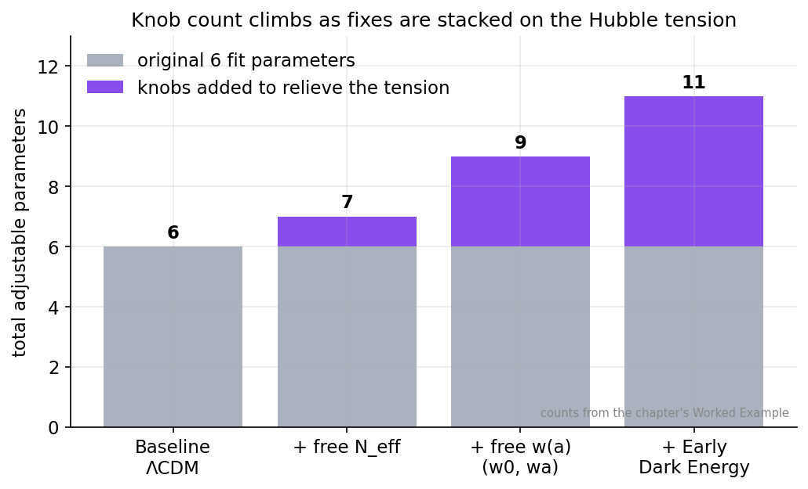

***Figure 12.3 — Counting the knobs.*** A transparent visualization of the chapter's Worked Example. Standard ΛCDM starts with six fit parameters (grey) and predicts $H_0\\approx67$, in ~5σ tension with the local 73. Each candidate fix — freeing the relativistic species $N_{\\rm eff}$, freeing the dark-energy equation of state $w(a)=w_0+w_a(1-a)$, or adding early dark energy — stacks new adjustable numbers (purple) on top, climbing from 6 toward ~11. The figure simply *counts*: a model that can absorb a 5σ discrepancy through any of several multi-parameter additions is, in a precise sense, highly adjustable. Bar heights are the integer parameter counts stated in the chapter, not data.

**Source:** Figure generated by [`book/figures/ch12_knob_count.py`](https://github.com/carlzimmerman/zimmerman-formula/blob/main/book/figures/ch12_knob_count.py). Parameter counts are taken directly from this chapter's "Worked Example: How Many Knobs Does It Take to Fit a Tension?"; the extension families (extra $N_{\\rm eff}$, $w_0w_a$CDM, early dark energy) are standard, with the evolving-$w$ option discussed in DESI DR2 2025, arXiv:2503.14738.

---

## The Real Question: Is Adjustability Strength or Weakness?

We have now read the whole ledger — both columns — and we have arrived at the question this entire chapter exists to pose. It is not "is ΛCDM right or wrong?" That question is premature and a little childish. The grown-up question is this:

**Is the standard model's adjustability a strength or a weakness?**

There is a serious, honest case on each side, and I am going to make both as strongly as I can, because a reader who has only heard one side has been cheated.

**The case that adjustability is a strength.** This is how healthy science is *supposed* to work. You build a framework, you confront it with data, and when the data push back you refine the framework. Every revision in the edit history was a *response to evidence*, not a whim. Λ came back in 1998 because the supernovae demanded it — refusing to add it would have been the dogmatic move, not the scientific one. Baryonic feedback is *real physics*, not a fudge; supernovae genuinely do blow gas around. The freedom to add $N_{\mathrm{eff}}$ is the same freedom that, historically, *discovered* particles. A framework rigid enough to be untweakable in the face of new data would not be more scientific — it would be more brittle, and it would already be dead. By this reading, ΛCDM's twelve revisions are twelve successful acts of learning, and its remaining tensions are simply the frontier where the next learning will happen. The CMB mountain is real; the model standing on it has earned the benefit of the doubt.

**The case that adjustability is a weakness.** A theory that can be adjusted to fit *anything* predicts *nothing*. The philosopher's name for this is *falsifiability*: a scientific claim earns its keep by ruling things out, by saying "if you see X, I am wrong." The worry about ΛCDM is not that any single revision was unjustified — each was locally reasonable — but that the *pattern* reveals a framework with enough free dials to absorb essentially any result. When the rotation curves came in wrong for pure CDM, feedback absorbed it. When $H_0$ split, a half-dozen candidate extensions appeared, each able to soak it up. When DESI hinted that dark energy evolves, a $w_0 w_a$ extension stood ready. At no point in the entire history, on this reading, did the model name a *specific new number in advance* for its central ingredients and then get confirmed by a measurement it had not already fit. A model that always survives because it can always be edited is not being *tested* by the data; it is being *fit* to the data, over and over, and calling the fit a confirmation.

Both of these are honest positions held by serious people, and **I am not going to pretend the matter is settled, because it is not.** I have my leanings — this is a book about an alternative, so you can guess them — but I would be lying to you if I claimed the second case is obviously correct. It is not. The CMB power spectrum is a real and towering achievement. The Hubble tension might be resolved tomorrow by an unspotted systematic in the Cepheid ladder, vindicating ΛCDM entirely. DESI's evolving dark energy might evaporate. *I do not know, and neither does anyone else.*

What I will commit to is a standard — the same standard I will hold this book's own framework to, without exception. The cleanest way to tell a *prediction* from a *post-hoc fit* is **time order**: did the theory name the number *before* the measurement, or after? A theory that names a specific quantity in advance, and is then confirmed by a measurement it could not have tuned to, has done something a theory that merely accommodates each new result after the fact has not. That asymmetry is the beating heart of the scientific method, and it is the fairest possible yardstick to lay against *every* contender — the standard model of cosmology, the de Sitter–MOND framework of this book, and anything else.

Hold onto that yardstick. We will need it in Part 5, when this book lays its *own* central claim on the table — $a_0 = c^2\sqrt{\Lambda/32\pi}$ — and in Part 6, when we ask, as honestly as we have asked here, exactly which of its numbers are *forced*, which are *posited*, and which it makes as genuine *forward predictions* about measurements not yet taken. The framework in these pages is **not a theory of everything yet, as frustrating as it may be.** But it is built to be judged by the same yardstick we have just laid against the reigning model — and that, more than any single result, is what I am asking you to hold it to.

---

## Summary

- **ΛCDM** — Lambda (dark energy) plus Cold Dark Matter — is the standard model of cosmology. It describes a universe that is roughly **5% ordinary matter, 27% dark matter, 68% dark energy**, and it is specified by a **six-parameter model** fit (most authoritatively) to the cosmic microwave background.
- The model has **real, towering successes**: the detailed multi-peak structure of the CMB power spectrum, the growth of cosmic structure, Big Bang nucleosynthesis, and the baryon acoustic oscillation ruler. Any honest critique must begin by granting these.
- The model also has a long **edit history** — roughly a dozen revisions: Λ switched off, dark matter added, inflation added, Λ switched back on in 1998, plus the small-scale and tension patches. Each revision was individually reasonable; the *pattern* is that the model's central compositional facts were established by **fitting, not by forward prediction**.
- **Small-scale tensions** (cusp–core, missing satellites, too-big-to-fail) are real but *softening*, largely addressed by adding flexible, tunable **baryonic feedback** — real physics that is also flexible enough to absorb a range of outcomes.
- The **Hubble tension** ($\sim 5\sigma$: CMB-predicted $H_0 \approx 67$ versus locally measured $\approx 73$) and the milder, softening **$S_8$ tension** (the late universe looking slightly smoother than predicted) are *clean, large-scale* discrepancies in the regime where ΛCDM should be strongest — and they have grown, not shrunk, with better data.
- **DESI's** hint of evolving dark energy challenges the model's frozen $w=-1$ assumption — but the signal is *contested* (quoted anywhere from ~1.3σ to ~4σ depending on the data combination), and although it would provide a favorable backdrop for this book's framework, I flag it explicitly as an **opportunity and a hostage, not a win**.
- The **cosmic dipole anomaly** (a galaxy/quasar dipole about twice the expected magnitude) is included with caution flags precisely because it is inconvenient.
- The chapter's central question — **is adjustability strength or weakness?** — has a serious case on each side and is **not settled**. The fairest yardstick is **time order**: did a theory name a specific number *in advance* and get confirmed, or did it accommodate the result after the fact? That same yardstick will be laid against this book's own framework in Parts 5 and 6.
- This is **not a theory of everything yet, as frustrating as it may be** — and neither, on the evidence of its own ledger, is the reigning standard model.

---

## Questions

1. **(Easy.)** In one or two sentences, what do the "Λ" and the "CDM" in ΛCDM each stand for, and what are the rough percentages of ordinary matter, dark matter, and dark energy in the model?

2. **(Easy–medium.)** The chapter argues that the fact that 95% of the universe is "unidentified" is *not by itself* an argument that ΛCDM is wrong. Explain the reasoning, using the example of the neutrino (proposed 1930, detected 1956).

3. **(Medium.)** Distinguish a *forward prediction* from a *post-hoc fit*, and explain why "time order" is offered as the fairest yardstick. Give one example from the chapter of a genuine ΛCDM forward prediction and one example of a compositional fact that was established by fitting rather than prediction.

4. **(Medium–hard.)** **Baryonic feedback** is described as "real physics that is also flexible enough to absorb a range of outcomes." Explain how feedback is invoked to resolve the cusp–core and missing-satellites tensions, and articulate — fairly, in both directions — why its flexibility could be read as either a strength or a weakness.

5. **(Hard.)** The Hubble tension is roughly $5\sigma$. Using the chapter's worked example, list at least three distinct extensions of ΛCDM that have been proposed to relieve it, state how many parameters each adds, and explain why the *existence of several competing multi-parameter fixes* is itself relevant to the "adjustability" debate.

6. **(Research-level.)** DESI's preference for evolving dark energy ($w_0 w_a$CDM) is described as "contested," with quoted significance ranging from ~1.3σ to ~4σ depending on the data combination and priors. Design, in outline, an analysis or future dataset that could move this from a *contested hint* to either a confirmed detection or a clean null. What would each outcome imply for (a) the frozen $w=-1$ assumption of ΛCDM, and (b) the signature prediction of this book's framework that $a_0$ tracks the dark-energy density through cosmic time (Chapter 25)? In your answer, be explicit about what would count as a genuine *forward* test rather than another post-hoc fit.

# Chapter 13: What Is Inertia, Really?

> *Push an empty shopping cart in the parking lot and it rolls easily. Push a full one and it fights back. Now imagine you and the cart are floating in deep space, far from any planet, with nothing holding the cart down. Push it. It still fights back. Why?*

---

## A question hiding in plain sight

We are about to begin the part of this book where the new physics lives. Parts 1 and 2 were the long, honest setup: how we weigh galaxies, how we discovered that the weighing doesn't add up, and the two great roads out of that discovery — a new particle or a new law. We spent a lot of pages on General Relativity and the expanding universe so that when the framework finally arrives, you'll have the vocabulary to judge it on its own terms.

This chapter, and the three after it, are the foundation stones. The framework at the heart of this book proposes to modify a single quantity — **inertia** — and it proposes to do so using **temperature**, of all things, drawn from the geometry of an expanding, accelerating universe. Before any of that can make sense, we have to look hard at the thing being modified. And here is the uncomfortable, wonderful truth I want you to sit with for a whole chapter:

**Nobody fully knows what inertia is, or where it comes from.**

That is not a rhetorical flourish. It is the honest state of physics in 2026. We can *measure* inertia to exquisite precision. We have an equation for it that is more than three centuries old and works fabulously well. We use it to fly spacecraft and design bridges. But the question of *why* matter resists being pushed — what physical mechanism, what part of the universe, actually does the resisting — remains genuinely open. Some of the greatest minds in the history of science chewed on it and walked away unsatisfied. Einstein chewed on it for years; it helped him build General Relativity, and then it quietly defeated him.

So if you finish this chapter feeling that inertia is stranger than you thought, that's not a failure of the chapter. That's the point. You can't appreciate a proposal to modify inertia until you've felt how mysterious the ordinary thing already is.

Let's start with the shopping cart.

---

## Inertia: the resistance to a change in motion

Here is the first definition, and it's worth saying slowly.

**Inertia** is the tendency of an object to keep doing what it's already doing — to keep sitting still if it's sitting still, or to keep moving in a straight line at a steady speed if it's already moving — and its *resistance* to any change in that state of motion.

That's it. Inertia is "resistance to a change in motion." Notice what it is *not*. It is not friction. Friction is a force from rubbing — the cart's wheels against the ground, air against your hand. We can imagine turning friction off entirely (that's what deep space gives us, near enough), and inertia is still there. It is not gravity either, though we'll see in a moment that the two are tangled together in one of the deepest puzzles in all of physics.

Inertia is the thing that makes a full cart harder to get going than an empty one. It's why a loaded truck takes longer to speed up and longer to stop than a bicycle. It's why, when your car brakes hard, your body keeps lurching forward — your body was moving, and it "wants" to keep moving, and the seatbelt is what finally changes its mind.

The quantity that measures how much inertia an object has is its **mass**. More mass, more inertia, more resistance. This is the mass in the most famous equation in introductory physics, Newton's second law:

$$ F = m\,a $$

In words: the force $F$ you apply equals the object's mass $m$ times the acceleration $a$ you produce. Rearrange it — $a = F/m$ — and you can read inertia right off the page. For a given push $F$, a bigger $m$ gives a smaller $a$. The object accelerates *less* for the same shove. That "less" is inertia, written in algebra.

Now here's the thing the shopping-cart thought experiment is designed to surface. In deep space, with no ground, no air, no gravity to speak of, the cart *still* has mass, and so it still resists. The resistance isn't coming from the floor. It isn't coming from the Earth pulling down. It is somehow intrinsic to the cart — or so it seems. Newton's equation tells you *how much* the cart resists. It is completely silent on *why* it resists at all, or *what* it is pushing back against.

Read that last sentence again, because it is the hinge of the whole chapter. $F = ma$ is a spectacularly accurate description. It is not an explanation. It tells you the price of accelerating a mass; it does not tell you who is collecting the payment.

> **Margin aside.** Galileo got to the doorway of inertia before Newton walked through it. He realized that a ball rolling on a perfectly smooth, level surface would, absent friction, just keep rolling forever. Aristotle had taught for two thousand years that motion needs a continuous cause — that things stop because stopping is their natural state. Galileo saw that stopping is caused (by friction), and that *steady motion needs no cause at all*. That single inversion is the seed of the entire concept of inertia.

---

## Two kinds of mass that have no business being equal

Now I have to complicate the word "mass," because it's secretly doing two completely different jobs, and the fact that it can do both is one of the most astonishing coincidences — if it is a coincidence — in physics.

**Job one: inertial mass.** This is the mass we just met. **Inertial mass** is the measure of an object's resistance to being accelerated by *any* force whatsoever. Push it with your hand, a magnet, a rocket — inertial mass is what sets how much it speeds up. It lives in $F = ma$, where it answers the question "how hard is this to get moving?"

**Job two: gravitational mass.** This is something else entirely. **Gravitational mass** is the measure of how strongly an object participates in gravity — both how hard it pulls on other things and how hard it gets pulled. It lives in Newton's law of gravity:

$$ F = \frac{G\, M\, m}{r^2} $$

Here $m$ is gravitational mass: the "gravitational charge" of the object, the thing that couples it to the gravity of a mass $M$ a distance $r$ away, with $G$ being Newton's gravitational constant. Just as electric charge measures how strongly something responds to electricity, gravitational mass measures how strongly something responds to gravity.

Stop and notice how unrelated these two ideas are. Inertial mass is about resistance to *every* push. Gravitational mass is about your particular *coupling to gravity*, one specific force among many. There is no obvious reason on Earth or in heaven why a thing's reluctance to be accelerated by a rocket engine should have anything to do with how strongly it feels the Earth's pull. Electric charge and inertial mass are clearly different numbers — a heavy object can carry tiny charge, a light object huge charge. Why should *gravitational* charge be any different?

And yet. When you drop two objects of different mass in a vacuum — a feather and a hammer, famously demonstrated on the Moon by astronaut David Scott in 1971 — they fall *together*. They hit the ground at the same instant. Galileo argued this (the leaning-tower story may be apocryphal, but the reasoning is his), and it has been confirmed ever since to staggering precision.

Why does this require the two masses to be equal? Watch the algebra. The force of gravity on a falling object near Earth is $F = m_{\text{grav}}\, g$, where $g$ is the gravitational field and $m_{\text{grav}}$ is the object's *gravitational* mass. The acceleration that force produces is, by Newton's second law, $a = F / m_{\text{inert}}$, where $m_{\text{inert}}$ is its *inertial* mass. Put them together:

$$ a = \frac{m_{\text{grav}}}{m_{\text{inert}}}\, g $$

For every object to fall with the *same* acceleration $a$ — for the feather and the hammer to land together — the ratio $m_{\text{grav}} / m_{\text{inert}}$ must be the *same* for all of them. Choose your units so that ratio is exactly 1, and you get the rule everyone learns in school: all objects fall at the same rate $g$, regardless of mass. But look at what was smuggled in to make that work. The "resistance to a rocket" number and the "coupling to gravity" number cancel. They are, as far as anyone can measure, **identical**.

This equality has a name — the **weak equivalence principle**, or the *universality of free fall* — and it is not a small thing. It is the experimental seed from which Einstein grew General Relativity, as we saw in Chapter 7. But notice that General Relativity *assumes* the equality; it builds a magnificent geometric cathedral on top of it. It does not *explain* why the two masses are equal in the first place. It promotes the coincidence to a principle and gets on with the work. That is a perfectly respectable thing for a theory to do. But the coincidence is still sitting there, unexplained, at the bottom of everything.

> **Deeper Dive: How well do we actually know $m_{\text{grav}} = m_{\text{inert}}$?**
>
> The equality of inertial and gravitational mass is one of the most precisely tested statements in all of physics. The standard figure of merit is the **Eötvös parameter**, defined for two test bodies $A$ and $B$ as
> $$ \eta = 2\,\frac{(m_{\text{grav}}/m_{\text{inert}})_A - (m_{\text{grav}}/m_{\text{inert}})_B}{(m_{\text{grav}}/m_{\text{inert}})_A + (m_{\text{grav}}/m_{\text{inert}})_B}. $$
> If the two masses are identical for both bodies, $\eta = 0$ exactly. Any difference — any object that falls even infinitesimally faster than another in the same gravitational field — shows up as a nonzero $\eta$.
>
> The history is a ladder of ever-tighter null results:
> - **Loránd Eötvös** (Baron Roland von Eötvös, Hungarian, ~1885–1909) used a torsion balance — essentially a horizontal beam hung from a fine fiber, with different materials on each end — and constrained $\eta \lesssim 10^{-9}$. The Sun's and Earth's gravity, plus the Earth's rotation, would twist the fiber if the materials responded differently. They didn't.
> - The **Eöt-Wash group** at the University of Washington pushed torsion-balance tests to $\eta \lesssim 10^{-13}$ over decades.
> - The **MICROSCOPE** satellite (CNES, French space agency), with final results published in 2022, tested platinum against titanium in free fall in orbit — the cleanest "drop tower" imaginable, falling around the Earth for years — and found $\eta = (-1.5 \pm 2.3_{\text{stat}} \pm 1.5_{\text{syst}}) \times 10^{-15}$. Consistent with zero at the level of **one part in $10^{15}$**.
>
> To feel that number: it is like comparing the weights of two cargo ships and finding they agree to within the mass of a single grain of sand. Whatever makes inertial and gravitational mass equal, it holds to fifteen decimal places. A modified-inertia program of the kind this book will develop must respect this — it must not break the universality of free fall in any regime we have tested, which is one reason (as we'll see in Chapter 21) the framework's modification is engineered to switch *off* in the high-acceleration Solar-System regime where these experiments live.

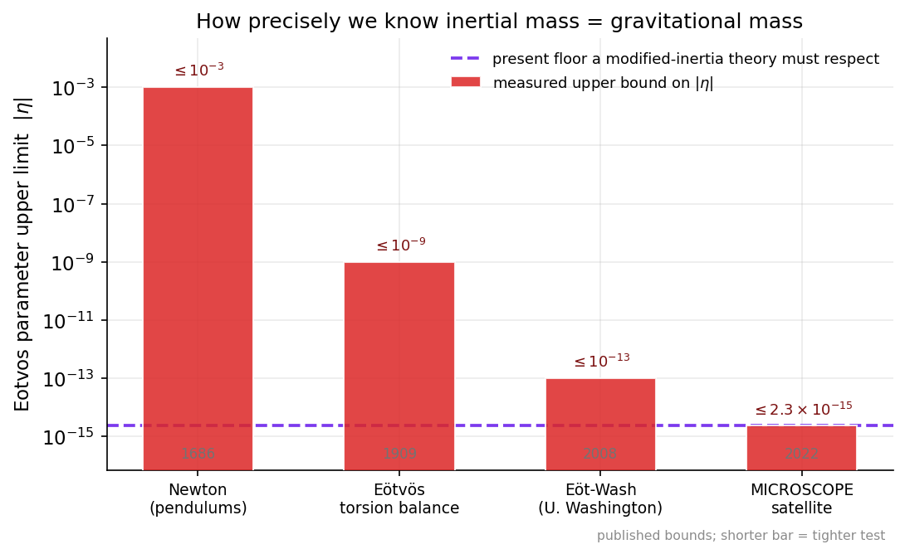

***Figure 13.1 — The ladder of ever-tighter null tests of $m_{\text{grav}}=m_{\text{inert}}$.*** Each bar is the published upper limit on the Eötvös parameter $\eta$ reached by a landmark experiment; a shorter bar is a tighter test. From Newton's pendulums to the MICROSCOPE satellite the bound has fallen by twelve orders of magnitude, to $|\eta|\le 2.3\times10^{-15}$ — agreement to fifteen decimal places. The dashed line marks the present floor that any modified-inertia theory must respect. These are the published figures of merit, not raw data.

**Source:** Figure generated by [`book/figures/ch13_eotvos_ladder.py`](https://github.com/carlzimmerman/zimmerman-formula/blob/main/book/figures/ch13_eotvos_ladder.py). Bounds from the equivalence-principle literature: the MICROSCOPE final result $\eta=(-1.5\pm2.3_{\text{stat}}\pm1.5_{\text{syst}})\times10^{-15}$ (CNES, 2022), the Eöt-Wash torsion-balance program (University of Washington, $\sim10^{-13}$), and Eötvös's original torsion-balance limit ($\sim10^{-9}$, ~1885–1909).

> **Worked Example: Reading inertia and gravity off the same falling rock.**
>
> Let's make the two masses concrete with a single object and slow numbers.
>
> Take a rock with mass $m = 2.0\ \text{kg}$. We'll use this one number in both roles and watch it do two different jobs.
>
> **As gravitational mass — how hard does Earth pull it?**
> Near Earth's surface the gravitational field is $g \approx 9.8\ \text{m/s}^2$ (more carefully, $g = GM_\oplus/R_\oplus^2$, but $9.8$ will do). The downward pull is
> $$ F = m_{\text{grav}}\, g = (2.0\ \text{kg})(9.8\ \text{m/s}^2) = 19.6\ \text{N}. $$
> So Earth tugs on the rock with about 19.6 newtons. Here the "2.0 kg" is acting as a gravitational charge — its coupling to Earth's field.
>
> **As inertial mass — how much does that pull accelerate it?**
> Now release the rock and ask how fast it speeds up. Newton's second law uses the *inertial* mass:
> $$ a = \frac{F}{m_{\text{inert}}} = \frac{19.6\ \text{N}}{2.0\ \text{kg}} = 9.8\ \text{m/s}^2. $$
> The rock accelerates downward at $9.8\ \text{m/s}^2$. Here the "2.0 kg" is acting as resistance to acceleration.
>
> **The magic.** The acceleration came out to exactly $g$ — the same $9.8\ \text{m/s}^2$ we put in. That happened *only because the gravitational 2.0 kg and the inertial 2.0 kg are the same number.* Symbolically:
> $$ a = \frac{m_{\text{grav}}\, g}{m_{\text{inert}}} = \frac{m_{\text{grav}}}{m_{\text{inert}}}\, g = (1)\,g = g. $$
> If gravitational mass had been, say, $2.0\ \text{kg}$ but inertial mass had been $2.2\ \text{kg}$ — a 10% mismatch — the rock would have fallen at $a = (2.0/2.2)(9.8) \approx 8.9\ \text{m/s}^2$, noticeably slower than a rock with matched masses dropped beside it. We'd see heavy things fall at different rates depending on their internal makeup. We have looked for exactly this, with platinum and titanium, to fifteen decimal places. We have never seen it. The cancellation is, as far as we can measure, perfect.
>
> The lesson to carry forward: $F=ma$ governs how the rock *responds*; $F = m_{\text{grav}}\,g$ governs how gravity *pulls*. They are different physics that happen to share a number. The framework in this book lives entirely on the *first* equation — it asks whether the $m$ in $F=ma$, the inertial $m$, might be subtly different from what Newton assumed when accelerations get fantastically small.

---

## Newton's bucket: is motion *relative to something*?

We've established that inertia exists, that it's measured by mass, and that this mass coincides mysteriously with gravitational charge. Now comes the deeper question, the one that haunted Einstein: **motion relative to what?**

When I say the cart "resists a change in motion," I've assumed I know what "motion" means. But motion is relative. Sitting in a train, you can read a book without spilling your coffee even though, relative to the ground, you're hurtling along at a hundred miles an hour. As far as the coffee is concerned, the train carriage is "at rest." Velocity is always *relative to something* — there is no experiment you can do inside a smoothly gliding train, windows shaded, to tell whether you're moving or parked. Galileo knew this; it's called the principle of relativity, and it's centuries older than Einstein.

But *acceleration* feels different. When the train suddenly brakes, your coffee sloshes. When it rounds a curve, you lean. You can *feel* acceleration from the inside, with no window needed. And inertia — the resistance we care about — is resistance to *acceleration* specifically. So acceleration seems to be absolute in a way velocity is not. Acceleration relative to *what*, though? What is the cosmic referee that decides you're accelerating and the coffee should slosh?

Newton had an answer, and he built a famous thought experiment — really an actual experiment you can do at home — to defend it. It's called **Newton's bucket**.

Here it is. Take a bucket of water and hang it from a long, twisted rope. Let it go, and the rope unwinds, spinning the bucket. Watch the water's surface, and you'll see four stages:

1. **At first**, the bucket spins but the water hasn't caught up — the water sits still while the bucket walls slide past it. The water's surface is **flat**.
2. **Then** friction drags the water into spinning along with the bucket. Now the water is rotating, and its surface climbs the walls and dips in the center — it forms a curved, concave shape, like the inside of a bowl. (This is the centrifugal effect; the spinning water is flung outward and piles up at the rim.)
3. **Now grab the bucket and stop it.** The water keeps spinning for a while. The bucket is still relative to you, but the water's surface is *still curved*.
4. Eventually the water slows and the surface goes **flat** again.

Newton's killer observation: in stage 1 the water and bucket are *at rest relative to each other* (both still, surface flat), and in stage 3 they are *also at rest relative to each other* (the spinning water inside a now-stopped bucket — well, moving relative to it, but the point sharpens if you compare the surface shapes). The decisive comparison is between stage 1 and stage 2. In stage 1, water and bucket *agree* in motion and the surface is flat. In stage 2, water and bucket *agree* in motion again (both spinning together) — and yet the surface is curved.

So the curving of the surface — the centrifugal effect, a real, visible, measurable consequence of inertia — does **not** depend on the water's motion *relative to the bucket*. The bucket can't be what the water is "accelerating relative to." Newton concluded: the water's surface curves because the water is rotating relative to **space itself** — relative to an absolute, fixed, invisible stage on which all motion plays out. He called it **absolute space**. Inertia, for Newton, is your resistance to accelerating with respect to this absolute stage.

It's a clean answer. It's also deeply unsatisfying to a lot of physicists, then and now, for one reason: absolute space *acts but cannot be acted upon*. It pushes the water up the walls, but nothing you do affects it. It has no other properties — no temperature, no substance, no way to detect it except through the very inertia it's supposed to explain. It's an invisible referee who decides the game but never shows up in any other photograph. Many found that too convenient, a name for the mystery rather than a solution to it.

> **Deeper Dive: The absolute-versus-relational debate, stated carefully.**
>
> The dispute Newton's bucket dramatizes is one of the oldest in physics, and it has two camps.
>
> **The absolutist (Newton, broadly).** Space — or in the modern, post-Einstein version, *spacetime* — is a real entity with its own existence, independent of the matter in it. Accelerated motion is motion relative to this entity, and inertia is the resistance such motion meets. The clinching argument is precisely the bucket: inertial effects (the curved surface, the felt "g-forces") appear whenever there is acceleration relative to space, *even when there is no relative acceleration between the test object and any nearby matter*. Newton's contemporary correspondent and rival **Gottfried Leibniz** argued the opposite — that space is nothing but the set of relations between bodies, with no independent existence — and the **Leibniz–Clarke correspondence** (1715–16, Samuel Clarke writing for Newton) is the classic statement of the two positions.
>
> **The relationist (Leibniz, Berkeley, later Mach).** There is no absolute space. All motion is motion *relative to other matter*. Berkeley objected to Newton directly: in a truly empty universe, he said, the bucket argument collapses, because "rotation" relative to nothing is meaningless. If the water's surface curves, it must be curving relative to *something physical* — and the only candidate left is the rest of the matter in the universe: the fixed stars.
>
> The stakes are not merely philosophical. They are this: **what physical system supplies the standard of non-acceleration?** What defines the frames — the *inertial frames* — in which Newton's first law holds and a free particle moves in a straight line? Newton says: absolute space defines them, full stop. The relationist says: the matter of the universe defines them, and if you could somehow change that matter, you would change the inertial frames themselves. That second possibility is testable in principle, and it is the doorway to Mach.
>
> General Relativity, it's worth noting, sits awkwardly between the camps. Its spacetime is dynamical — matter shapes it, so it is *not* Newton's rigid absolute stage — yet spacetime still has independent reality and still carries energy and inertia of its own (gravitational waves exist in otherwise empty space). Einstein hoped GR would be fully relational, fully Machian. It is not, quite. That unfinished hope is the next section.

---

## Mach's principle: do the distant stars give you your inertia?

Now we reach the idea I find genuinely haunting, the one that gives this chapter its weight.

**Ernst Mach** was an Austrian physicist and philosopher of the late 1800s — the same Mach whose name we attach to supersonic speeds ("Mach 2"). He was a fierce critic of anything in physics he thought was unobservable metaphysics, and Newton's absolute space was exactly his sort of target. You can't see it, you can't touch it, you can only infer it from inertia itself — so, said Mach, it explains nothing. It's a circular ghost.

Mach offered a radical alternative. He took the bucket and added a twist that you cannot do in a laboratory but can absolutely do in your head. Newton imagined the water rotating relative to absolute space. Mach asked: how do we *know* it's rotating relative to space, and not relative to *the rest of the universe*? When the water's surface curves, the water is, after all, also spinning relative to the **fixed stars** — relative to the great mass of all the distant galaxies. In every real bucket experiment, those two things — "rotating relative to space" and "rotating relative to the distant stars" — happen together. We have never been able to pull them apart, because we cannot remove the stars.

So Mach made a daring leap: maybe it's the stars. Maybe the curved water surface is the water responding to its rotation *relative to all the other matter in the universe*, not relative to any invisible absolute stage. Maybe inertia is not a property an object has all by itself, intrinsically, but a *relationship* between that object and everything else there is.

This is **Mach's principle**: the proposal that the inertia of any body — its resistance to acceleration, the very mass in $F = ma$ — is not intrinsic to the body but is somehow *determined by, and generated by, the rest of the matter in the universe*, chiefly the distant masses that dominate the cosmic budget.

Let that sink in, because the consequences are wild. If Mach is right:

- In a truly empty universe — one single object, nothing else — that object would have **no inertia at all**. There'd be nothing to be accelerated relative to, so a feather-light shove would send it to infinite speed. Inertia would be meaningless. (Berkeley's intuition, made into a physical claim.)
- The reason you feel a jolt when the train brakes is, ultimately, *the distant galaxies*. Your body is accelerating relative to the bulk of the universe's mass, and that relationship is what shoves you into the seatbelt. The seatbelt is local; the resistance it overcomes is cosmic.
- Inertia becomes a kind of gravity-like influence reaching across billions of light-years. The far-off matter, faint and uncaring, would be silently setting the terms of every push you've ever made.

I called it haunting and I mean it. There is something vertiginous about the thought that the resistance of your morning coffee mug is underwritten by the Andromeda galaxy and a hundred billion others. Einstein loved it. He found Mach's principle so compelling that he made it one of the guiding stars while building General Relativity, and he coined the very name "Mach's principle." He wanted his new theory of gravity to *contain* Mach's idea — to make inertia genuinely arise from cosmic matter.

And here is the honest, slightly melancholy ending of that story. **General Relativity does not fully deliver Mach's principle.** It captures pieces of it — there are real "frame-dragging" effects, measured by the Gravity Probe B satellite and others, in which a spinning mass really does drag the local standard of non-rotation around with it, exactly as a Machian would hope. That's a genuine, confirmed Machian whisper. But GR also permits solutions that Mach would hate: you can write down a perfectly valid GR universe that is completely empty *except* for a single rotating object, and that object still has inertia, still feels centrifugal effects, still has something to rotate "relative to." In an empty GR universe, spacetime itself plays the role of Newton's absolute stage. Einstein eventually, reluctantly, conceded that GR is not fully Machian. The principle that helped him build the theory survived only in part inside it.

So Mach's principle today is not a law of physics. It is a *hypothesis* — a beautiful, partly-confirmed, partly-frustrated hypothesis about where inertia comes from. It has never been turned into a complete, predictive theory that everyone accepts. It hovers, suggestive and unfinished, over the foundations of mechanics. Generations of physicists have tried to make it precise — Sciama, Brans and Dicke, Barbour, and others built theories reaching toward it — and each captured a facet without nailing the whole. (We'll meet the Brans–Dicke attempt again in passing when we discuss scalar fields.)

I dwell on this because it sets up the entire posture of this book. We are about to consider a framework that modifies inertia. The very fact that *inertia's origin is an open question* — that the smartest people who ever lived left it open — is what makes such a modification *thinkable* rather than crankish. You can't responsibly modify something you fully understand. But inertia we do not fully understand. There is room here. The room is real.

> **Deeper Dive: Mach's principle, frame-dragging, and why it never closed.**
>
> "Mach's principle" is notoriously not a single statement — the physicist Hermann Bondi and others catalogued at least half a dozen distinct versions. The strongest, most testable form is the claim that **local inertial frames are entirely determined by the distribution and motion of matter in the universe**, so that there is no inertia in the absence of matter and the inertial mass of a body could in principle depend on its cosmic surroundings.
>
> *What GR does deliver (the Machian whispers):*
> - **Frame dragging (the Lense–Thirring effect).** A rotating mass twists the spacetime around it, dragging the local non-rotating frame — the frame in which a gyroscope holds steady — around with it. **Gravity Probe B** (NASA, results 2011) measured the Earth's frame-dragging on orbiting gyroscopes at the predicted level (about 37 milliarcseconds per year), confirming the effect. This is genuinely Machian in spirit: the local standard of "not rotating" is *set by nearby matter's motion*, not by an aloof absolute space.
> - **Thirring's interior calculation.** A rotating massive shell drags the inertial frames in its interior — exactly the qualitative effect Mach's principle predicts, with the surrounding matter "imposing" its rotation on the inertia inside.
>
> *What GR refuses to deliver (the anti-Machian solutions):*
> - **Gödel's rotating universe** and, more simply, **Minkowski space** (the empty, flat spacetime of special relativity) contain perfectly good inertial frames *with no matter at all to define them*. In vacuum GR, the metric itself supplies the inertial structure. Mach's principle, in its strong form, is therefore *not* a theorem of General Relativity; it is at best an optional feature of particular matter-filled solutions.
> - GR's spacetime carries energy, momentum, and inertia of its own (gravitational waves propagate through vacuum). A fully relational theory would have no such free-standing inertial substrate.
>
> *The relevance here.* The framework this book develops is, in spirit, a **modified-inertia** program: it proposes that the effective inertial mass in $F = ma$ departs from its Newtonian value when an object's acceleration falls below a tiny cosmic scale $a_0$. Whether one calls that "Machian" depends on the version of Mach one means — but the *family resemblance* is direct. In the framework (Chapters 20–22), the modification of inertia is tied to a cosmic quantity: the temperature floor of de Sitter space, which is itself set by the dark-energy density of the *whole universe*. So the resistance a galaxy's stars feel in their slow orbits ends up depending on a property of the entire cosmos — a thoroughly Machian-flavored statement, even though the mechanism is thermodynamic and geometric rather than a direct sum over distant masses. I want to be careful and honest here: the framework does **not** derive Mach's principle, and it does not claim to have solved the centuries-old origin-of-inertia problem. It claims something narrower and, I think, more defensible — that *if* you let a known cosmic temperature scale modify inertia in the deep low-acceleration regime, you reproduce the observed dynamics of galaxies with the right scale. That is a real claim, and it is not a theory of everything yet, as frustrating as it may be.

---

## Modified inertia versus modified gravity: which thing are we changing?

There's a fork buried in everything we've said, and it pays to make it explicit now, because the whole back half of this book lives on one side of it.

Recall the two equations that share the word "mass":

$$ F = m\,a \qquad \text{(inertia — how it responds)} $$
$$ F = \frac{G M m}{r^2} \qquad \text{(gravity — how it's pulled)} $$

Now suppose — as Parts 1 and 4 of this book argue at length — that something is genuinely wrong with our predictions for galaxies: the stars in the outskirts move faster than the visible matter can explain. If you don't want to add an invisible particle (dark matter), you have to change one of these two equations. Which one?

**Modified gravity.** You can change the *right-hand side of the gravity equation* — say that the force of gravity itself is stronger than $GMm/r^2$ when gravity gets very weak. The pull is bigger than Newton said, so the stars orbit faster, no dark matter needed. Most of the well-known alternatives to dark matter take this road. Milgrom's original MOND can be read this way; the relativistic theory AeST (which we'll meet in Chapter 28) is squarely a modified-gravity theory.

**Modified inertia.** Or — and this is the road this book takes — you can leave gravity alone and change the *left-hand side of the inertia equation*. Say that when an object's acceleration $a$ becomes extraordinarily small, smaller than a threshold $a_0$, its inertial mass is no longer simply $m$. The *resistance to acceleration* itself weakens. Then, for the same gravitational pull, the star accelerates *more* than Newton predicted — and again it orbits faster, again with no dark matter. But the mechanism is utterly different: gravity is untouched; what changed is how matter *responds*.

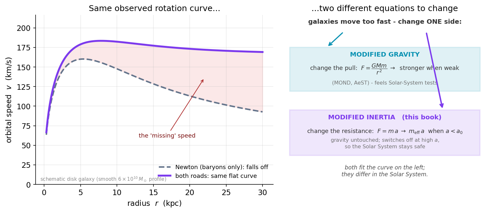

***Figure 13.3 — One flat rotation curve, two different equations you could change.*** Left: for a schematic disk galaxy the Newtonian (baryons-only) speed rises then falls, while both roads out of dark matter produce the same flat outer curve; the shaded gap is the 'missing' speed. Right: the fork the chapter draws. Modified gravity changes the right side of the gravity law ($F=GMm/r^2$); modified inertia — the road this book takes — changes the left side of $F=ma$ only when $a<a_0$, leaving gravity untouched and switching off in the Solar System. A schematic illustrating the chapter's central conceptual choice, not a fit to data.

**Source:** Figure generated by [`book/figures/ch13_mi_vs_mg_fork.py`](https://github.com/carlzimmerman/zimmerman-formula/blob/main/book/figures/ch13_mi_vs_mg_fork.py). The two-road framing and the framework's modified-inertia stance follow the main result paper, [doi.org/10.5281/zenodo.20721540](https://doi.org/10.5281/zenodo.20721540), building on Milgrom (1983) MOND and the relativistic modified-gravity theory AeST, Skordis & Zlosnik (2021, PRL 127, 161302).

These two roads can look identical in a simple galaxy rotation curve — both can be tuned to fit the same flat curve. But they are *not* physically equivalent, and they make different predictions elsewhere. Modified inertia, because it changes $F = ma$ only at fantastically small accelerations, naturally leaves the Solar System untouched (planets accelerate briskly, far above $a_0$) — which, as we'll see, lets it sail past the stringent Cassini spacecraft tests that constrain modified-gravity theories. That "switch-off at high acceleration" is not a patch bolted on; it falls out of the structure. It's one of the framework's quieter strengths.

Milgrom himself — the originator of MOND, whom we'll properly meet in Chapter 17 — has long emphasized that a *modified-inertia* reading of MOND is possible and in some ways more natural, and he wrote foundational papers on it in 1994 and 1999. The framework in this book builds directly on that modified-inertia tradition, marries it to the de Sitter temperature we'll develop in Chapters 14–15, and finds the acceleration scale $a_0$ emerging with the right magnitude.

I'll say plainly, as I'll keep saying: modified inertia is a **minority** position. The mainstream overwhelmingly favors a dark-matter particle, and has good reasons (the cosmic microwave background and galaxy clusters chief among them, which we covered in Part 2 and will revisit in Part 6). A responsible reader should hold the modified-inertia road as *one live possibility among several*, attractive for specific reasons, burdened with specific unsolved problems — not as established fact. But it is a respectable road, traveled by serious physicists, and it is the road we're on. Knowing *that inertia's origin is open* is what makes the road passable at all.

> **Margin aside.** A subtle point worth flagging now and developing later: a modified-inertia theory has to be careful about the equivalence principle — the fifteen-decimal-place equality of inertial and gravitational mass from the MICROSCOPE satellite. If you change inertia, you risk breaking that equality and predicting that different materials fall at different rates. The framework dodges this because its modification depends only on *acceleration*, not on what an object is made of, and switches off entirely in the high-acceleration regime where every equivalence-principle test has ever been run. The tests live where the modification sleeps. We'll return to this in Chapter 21.

---

## Where this leaves us

Let me gather the threads, because we covered a lot of ground and the next chapters depend on it.

Inertia is the resistance of matter to a change in its motion, measured by mass, and quantified by Newton's $F = ma$. That equation is one of the most successful in science — and it is a *description*, not an *explanation*. It tells us the price of acceleration without telling us who collects it.

The mass in that equation, the **inertial mass**, coincides to fifteen decimal places with **gravitational mass**, the entirely different quantity that governs how strongly an object feels gravity. Nobody knows why. General Relativity assumes the equality and builds on it; it does not derive it.

When we ask "acceleration relative to *what*?", Newton answered "absolute space" — an invisible, unaffectable stage — and defended it with the spinning bucket. Many found that an empty name for the mystery. **Mach** proposed instead that inertia comes from the rest of the matter in the universe, the distant stars and galaxies; that in an empty cosmos there would be no inertia at all. Einstein found Mach's principle so beautiful he built it into the foundations of General Relativity — and then found, to his lasting discomfort, that GR contains Mach's idea only in part. Mach's principle remains a hypothesis: partly confirmed (frame-dragging is real and measured), partly refused (empty-universe solutions have inertia anyway), never closed.

So the origin of inertia is, in 2026, a genuinely open question. That openness is the room in which this book's framework lives. The framework is a **modified-inertia** proposal: it leaves gravity alone and changes how matter resists acceleration, but only at accelerations far below anything in the Solar System — and it ties that change to a temperature drawn from the geometry of our accelerating universe. Whether it's right is a matter for the later chapters and, ultimately, for telescopes. What I hope you carry out of *this* chapter is the felt sense that inertia was never the simple, settled thing it pretends to be. The mystery was always there, hiding in the shopping cart. We are about to propose one possible thread out of the labyrinth — not the only thread, not a proven thread, and not a theory of everything yet, as frustrating as it may be. But a thread worth following.

Next, in Chapter 14, we pick up the strangest ingredient: the discovery that *acceleration itself produces a temperature* — the Unruh effect — which will turn out to be the physical heart of how this framework modifies the very inertia we've just spent a chapter learning to respect.

---

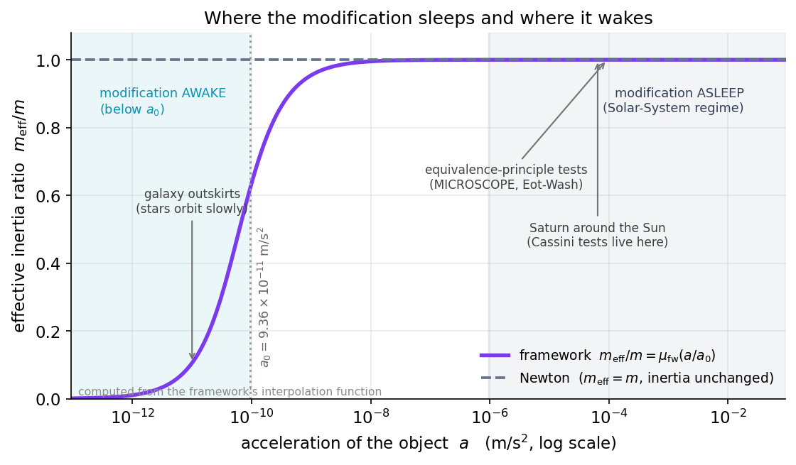

***Figure 13.2 — Where the modification sleeps and where it wakes.*** The purple curve is the framework's effective inertia ratio $m_{\rm eff}/m=\mu_{\rm fw}(a/a_0)$ as a function of an object's acceleration. Far above the cosmic scale $a_0$ — in the Solar System, where every equivalence-principle test (MICROSCOPE, Eöt-Wash) and the Cassini bound live — the ratio is indistinguishable from Newton's value of $1$, so the modification is invisible. Only in galaxy outskirts, where accelerations fall to a fraction of $a_0$, does inertia weaken. Computed from the framework's own interpolation function; the value $a_0=9.36\times10^{-11}$ m/s$^2$ is an input, not a derived number.

**Source:** Figure generated by [`book/figures/ch13_inertia_switchoff.py`](https://github.com/carlzimmerman/zimmerman-formula/blob/main/book/figures/ch13_inertia_switchoff.py). Framework interpolation $\mu_{\rm fw}(x)=(\sqrt{1+4x^2}-1)/(2x)$ and scale $a_0$ from the main result paper, [doi.org/10.5281/zenodo.20721540](https://doi.org/10.5281/zenodo.20721540); the modified-inertia tradition follows Milgrom (1994; 1999).

## Summary

- **Inertia** is the resistance of an object to any change in its state of motion. Its measure is **mass**, and the relationship is Newton's second law, $F = ma$. The equation describes inertia superbly but does not explain its origin — it says *how much* matter resists, never *why* or *against what*.
- **Inertial mass** (resistance to being accelerated by any force) and **gravitational mass** (the "charge" that couples an object to gravity) are conceptually unrelated, yet measured to be equal to about one part in $10^{15}$ (MICROSCOPE satellite, 2022). This **equivalence** is the seed of General Relativity, which assumes it rather than deriving it.
- **Newton's bucket** argues that inertial effects (the curving water surface) depend on rotation relative to *space itself*, not relative to nearby matter — Newton's case for **absolute space**, an invisible, unaffectable stage. Leibniz, Berkeley, and later Mach rejected it as an unobservable name for the mystery.
- **Mach's principle** is the hypothesis that inertia is not intrinsic but is generated by the rest of the matter in the universe — the distant stars. In a truly empty universe, there would be no inertia at all. Einstein built it into General Relativity's foundations, but GR delivers it only partially: frame-dragging (measured by Gravity Probe B) is a genuine Machian effect, while empty-universe solutions retain inertia, against Mach.
- A **modified-inertia** program changes the left side of $F = ma$ at very low accelerations, rather than changing gravity. It is a respectable minority response to galaxy dynamics, naturally Solar-System-safe (the modification switches off at high acceleration), and the road this book takes — building on Milgrom's 1994/1999 modified-inertia work. It does **not** derive or solve Mach's principle; it claims only that a known cosmic temperature scale, allowed to modify inertia in the deep low-acceleration regime, reproduces galactic dynamics with the right scale. Not a theory of everything yet, as frustrating as it may be.

---

## Questions

1. **(Easy.)** In your own words, explain why a fully loaded shopping cart is harder to start moving than an empty one *even on a perfectly frictionless surface, even in deep space*. Which quantity is responsible, and which of Newton's equations describes it?

2. **(Easy–medium.)** Inertial mass and gravitational mass are conceptually different ideas. State what each one measures, and describe one everyday observation (such as dropping two different objects) that would look strange if the two masses were *not* equal.

3. **(Medium.)** Walk through Newton's bucket experiment stage by stage and explain why Newton concluded that the curving of the water's surface cannot be caused by the water's motion *relative to the bucket*. What did he say it was caused by instead, and what was Mach's objection to that answer?

4. **(Medium–hard.)** The MICROSCOPE satellite measured the Eötvös parameter to be consistent with zero at the level of $\sim 10^{-15}$. Explain in words what a *nonzero* result would have meant physically — what would we observe in a falling-bodies experiment? — and why a modified-inertia theory of galaxy dynamics must take this constraint seriously. (Hint: think about where, in acceleration, these tests are performed versus where the modification is supposed to act.)

5. **(Hard / discussion.)** "Mach's principle is not a theorem of General Relativity." Defend this statement using *both* a confirmed Machian effect that GR predicts *and* a GR solution that violates Mach's principle. Why might Einstein have found this outcome disappointing, given his original motivations?

6. **(Research-level.)** The framework in this book is a *modified-inertia* program in which the change to inertia is tied to a cosmic temperature scale set by dark energy. Sketch how such a proposal might be considered "Machian in spirit," and then articulate the strongest reason it would be *wrong* to call it a derivation or solution of Mach's principle. In your answer, distinguish clearly between (a) reproducing the correct acceleration scale for galaxy dynamics and (b) explaining the microphysical origin of inertia itself — and identify which of these the framework can honestly claim.

# Chapter 14: Temperature from Acceleration: The Unruh Effect

> *Wave your hand fast enough through perfectly empty space and, in principle, it warms up. Not because of friction with the air — there is no air — but because of what acceleration does to "nothing" itself.*

---

## A strange promise

Let me make you a promise that sounds absurd, and then spend a chapter convincing you it might be true.

The promise is this: **empty space is not the same for everyone.** If you and I are floating side by side in the deepest vacuum we can imagine — no stars, no gas, no light, nothing — and you start to accelerate while I keep drifting, then you and I will *disagree about whether that vacuum is empty.* I will say it is cold and dark and contains nothing at all. You, accelerating, will say it is faintly warm, filled with a thin haze of particles, glowing at a definite temperature. And here is the part that should make you sit up: **neither of us is wrong.**

This is the **Unruh effect**, named for the Canadian physicist William Unruh, who worked it out cleanly in 1976 (with important earlier steps by Stephen Fulling and Paul Davies — you will sometimes see it called the Fulling–Davies–Unruh effect). It says that an **accelerated observer** — someone who is speeding up, slowing down, or changing direction — perceives the **quantum vacuum**, the lowest-energy state of empty space, as a warm thermal bath. The faster you accelerate, the hotter the bath. The temperature is set by your acceleration and nothing else.

I want to be honest with you from the very first paragraph, because that is the spirit of this book. The Unruh effect has *never been directly measured.* It is, as we will see, extraordinarily faint for any acceleration a human or a machine can produce — you would need to shake something at a brutality far beyond any rocket or centrifuge to warm the vacuum by even a millionth of a degree. So this is a *prediction*, beautifully consistent with the rest of physics, derived from the same quantum field theory that gives us the laser and the transistor and the most precisely confirmed numbers in all of science — but a prediction not yet caught red-handed in the lab. Keep that in your pocket as we go. It matters for what comes later.

Why does this chapter exist in a book about galaxies and dark energy? Because the framework at the heart of this book — Carl Zimmerman's de Sitter–MOND proposal — rests on a single audacious bridge: **that acceleration, temperature, and inertia are secretly the same conversation.** The Unruh effect is the first plank of that bridge. It is the moment physics first whispered that "how hard it is to push something" might be related to "how warm empty space looks to it." In the chapters ahead we will build on this; here, we just want to understand the whisper itself, and to understand it honestly — what is solid, what is suggestive, and what is still a hope.

So let's begin where all good physics begins: with a question a child could ask.

---

## What does "empty" mean?

Ask someone what a vacuum is and they'll say: nothing. No air, no matter, empty.

That is the everyday answer, and for most purposes it's fine. But twentieth-century physics discovered that "nothing," looked at closely enough, is not nothing. It is the quietest possible *something*.

Here is the gentlest way I know to see why. Think of empty space as a vast, perfectly still pond stretching in every direction. Classical physics — the physics of Newton — says a still pond can be perfectly, exactly flat: zero ripples, zero motion, dead calm forever. But **quantum mechanics**, the physics of the very small, forbids perfect stillness. It has a rule, the *uncertainty principle*, which says you can never pin down both how much of something there is and how fast it's changing, simultaneously and exactly. Applied to the fields that fill space — the electromagnetic field, the fields whose ripples we call particles — this rule says they can never be *exactly* zero and *exactly* unchanging at the same time. There must always be a faint, irreducible trembling. A jitter that cannot be removed, even at a temperature of absolute zero, even in the deepest void.

Physicists call this trembling the **quantum vacuum**: the state of a field with as little energy as the laws allow, which is not *no* energy but the minimum, the floor. The vacuum is not empty in the sense of "nothing happening." It is empty in the sense of "as quiet as the universe permits" — and that permitted quiet still hums.

> **Margin aside.** This is not metaphysical hand-waving. The hum of the vacuum is measurable. The *Casimir effect* — two metal plates placed close together in vacuum feel a tiny attractive force because the vacuum's hum is slightly different between them than outside — has been measured in the lab. The *Lamb shift* — a minuscule wobble in the energy levels of the hydrogen atom caused by the atom interacting with the vacuum's hum — is one of the most precisely confirmed numbers in physics. The vacuum's restlessness is real.

Now hold onto the pond picture, because the Unruh effect is, at heart, a statement about *how that pond looks to someone moving through it in a particular way.*

---

## The diver and the swimmer

Imagine our humming pond again. Floating motionless on its surface is a swimmer who never accelerates — she drifts, at most, in a straight line at a steady speed. To her, the pond's tiny quantum trembling averages out to nothing in particular. The ripples come and go from every direction equally; their pushes cancel; she feels a calm, cold, structureless vacuum. She is what physicists call an **inertial observer** — someone in free, unaccelerated motion. (We met inertia and inertial motion in Chapter 13; here it returns wearing a new hat.)

Now picture a second person: a **diver** who is *accelerating* — say, constantly speeding up in one direction. And here is the deep, strange fact. Because she is accelerating, the way she carves through that humming pond is different. The ripples she runs *into* (ahead of her, in the direction she's accelerating toward) hit her differently from the ripples *behind*. The averaging-out that worked so perfectly for the calm swimmer no longer works for the diver. The vacuum's hum, which canceled to nothing for the steady swimmer, *does not cancel* for the accelerating diver. What's left over, when you do the mathematics carefully, looks exactly like the random jostling of a warm gas.

The diver feels heat. Not from friction. Not from anything material. From the geometry of accelerating through a vacuum that is humming in the first place.

That, in one sentence, is the Unruh effect: **acceleration turns the silent hum of the vacuum into the audible roar of warmth.** And the precise pitch of that roar — its temperature — depends on exactly one thing: how hard you're accelerating.

Let me give you the number, because it's short and lovely, before we earn it.

---

## The Unruh temperature

The **Unruh temperature** — the temperature of the thermal bath an accelerated observer perceives — is given by a single clean formula:

$$ k_B T = \frac{\hbar\, a}{2\pi c} $$

Don't be intimidated; let's read it like a sentence. On the left, $k_B T$ is just a physicist's way of writing "an amount of heat energy" — $T$ is the temperature, and $k_B$ (Boltzmann's constant) is the conversion factor that turns a temperature into an energy, the same constant you'd meet in any chemistry class connecting heat to the jiggling of molecules. On the right, $a$ is the observer's acceleration — how hard they're speeding up. The symbol $\hbar$ ("h-bar") is Planck's constant, the fundamental quantum of action, the tiny number that shows up whenever quantum mechanics is in the room. And $c$ is the speed of light.

Read aloud: *the temperature you feel is proportional to your acceleration.* Double your acceleration, double the warmth. Stop accelerating, and the warmth vanishes — back to cold, empty vacuum. There is no temperature without acceleration, and the link between them is direct, clean, and universal. It doesn't matter what you're made of or what the vacuum is made of; the formula is the same for everyone.

Notice three things this formula quietly tells you.

**First, it is fantastically small.** Look at what sits up top: $\hbar$, an absurdly tiny number (about $10^{-34}$ in standard units). Look at what sits on the bottom: $c$, an absurdly large one. So unless $a$ is enormous, $T$ is minuscule. We'll compute a worked example below, but the headline is: for any acceleration you or I could ever feel, the Unruh temperature is so far below a millionth of a degree that no thermometer in existence could read it. This is exactly *why it has never been directly measured.* It is not that the effect is wrong; it is that it is whisper-quiet.

**Second, it ties together three different worlds.** In that one short formula sit $\hbar$ (the quantum world), $c$ (relativity, the world of fast things), and $a$ (mechanics, the world of pushes and accelerations) — and $k_B$ (thermodynamics, the world of heat). When a formula braids together that many separate corners of physics, physicists pay close attention. It usually means something deep is going on underneath. The Unruh formula is one of a small handful of equations — Hawking's black-hole temperature is its closest cousin — where quantum theory, relativity, and thermodynamics all meet in the same line.

**Third, and this is the seed of the whole book: it makes acceleration and temperature into two faces of one thing.** If you tell me your acceleration, I can tell you your temperature, and vice versa. That equivalence is the doorway. Walk through it, and you start to wonder: *if accelerating warms the vacuum, might the warm vacuum push back? Might that push-back be what we call inertia — the resistance of matter to being accelerated in the first place?* That is the question the framework runs with. We'll only open the door in this chapter; we walk through it properly in Chapter 21. But the door is right here, in $k_B T = \hbar a / 2\pi c$.

> **Worked Example: How hard must you accelerate to warm the vacuum by one degree?**
>
> Let's make the smallness concrete by turning the question around. Instead of asking "how warm is the vacuum at a given acceleration," let's ask: *what acceleration would I need to feel a vacuum warmed to a single kelvin (about one degree above absolute zero)?*
>
> Start from the Unruh formula and solve it for the acceleration $a$:
> $$ a = \frac{2\pi c\, k_B T}{\hbar}. $$
>
> Now plug in the constants (in SI units):
> - $c = 3.0 \times 10^{8}$ m/s (speed of light)
> - $k_B = 1.38 \times 10^{-23}$ J/K (Boltzmann's constant)
> - $\hbar = 1.05 \times 10^{-34}$ J·s (reduced Planck's constant)
> - $T = 1$ K (our target: one kelvin)
>
> Multiply the top: $2\pi \times (3.0\times10^{8}) \times (1.38\times10^{-23}) \times 1 \approx 2.6 \times 10^{-14}$.
>
> Divide by the bottom: $a \approx \dfrac{2.6 \times 10^{-14}}{1.05 \times 10^{-34}} \approx 2.5 \times 10^{20}\ \text{m/s}^2.$
>
> Let's feel that number. Earth's gravity gives an acceleration of about $10$ m/s². So to warm the vacuum to a *single degree*, you would have to accelerate at roughly **$2.5 \times 10^{19}$ times the acceleration of gravity** — twenty-five billion billion gees. To warm it to room temperature (about 300 K), multiply by 300: you need about $10^{22}$ gees. No rocket, no centrifuge, no particle smasher comes remotely close to making a *macroscopic object* feel that. (Individual particles in the most violent collisions or laser fields can momentarily reach accelerations where the Unruh temperature is no longer absurd — which is exactly why some proposals to *detect* the effect look there, at electrons in ultra-intense lasers, rather than at apparatus you could hold.)
>
> **The lesson:** the Unruh effect is not small because it's weak in principle. It's small because the vacuum is extraordinarily stiff — it takes a preposterous acceleration to shake even a sliver of warmth out of it. That stiffness is, in a sense, the same stiffness we call inertia. Hold that thought.

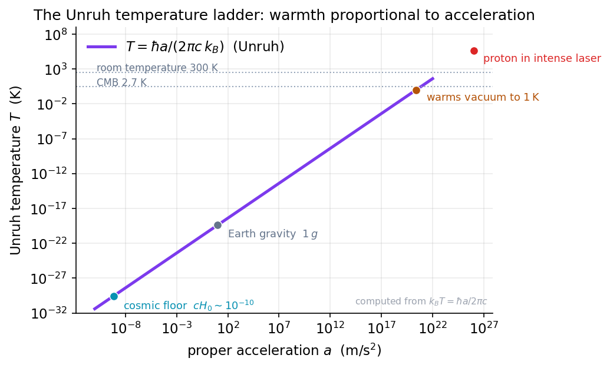

***Figure 14.1 — The Unruh temperature ladder.*** The single straight (log-log) line is the Unruh law $k_BT=\hbar a/2\pi c$, computed directly from fundamental constants. Marked on it are four accelerations the chapter discusses: the cosmic floor $cH_0\sim10^{-10}$ m/s$^2$, Earth gravity ($1\,g$), a proton in an intense laser ($\sim10^{26}$ m/s$^2$, where $T$ finally rises above room temperature), and the brutal $\sim2.5\times10^{20}$ m/s$^2$ needed merely to warm the vacuum to one kelvin. Reading across: everyday accelerations sit fantastically far below any measurable temperature, which is exactly why the effect has never been directly caught in the lab.

**Source:** Figure generated by [`book/figures/ch14_unruh_temperature_ladder.py`](https://github.com/carlzimmerman/zimmerman-formula/blob/main/book/figures/ch14_unruh_temperature_ladder.py). Unruh law from Unruh 1976, PRD 14, 870; values computed from the formula in this chapter.

---

## Why "horizon" is the secret word

So far I've given you the picture (the diver feels warmth) and the formula (the warmth is proportional to acceleration). To understand *why* it's true — and to see the idea that the framework leans on hardest — we need one more concept: the **horizon.**

You already know one kind of horizon: the line where the sea meets the sky. It's the edge of what you can see, and it exists because the Earth curves away beneath you. There's water and ship beyond it, but you can't see them — not because they're gone, but because they're hidden behind the curve.

Now here is the remarkable thing. **An observer who accelerates forever also has a horizon.** Not because of any curved planet, but because of the structure of space and time themselves when you're constantly speeding up. If you accelerate steadily in one direction, there is a region of the universe *behind* you whose light can never catch up to you, because you keep gaining speed and outrunning it. (You never reach the speed of light — relativity forbids that — but you accelerate cleverly enough that light from far enough behind never closes the gap.) That cutoff, that surface behind you beyond which no signal can ever reach you as long as you keep accelerating, is called the **Rindler horizon**, after the physicist Wolfgang Rindler who mapped out the geometry of uniformly accelerated motion.

Sit with that for a moment, because it's genuinely strange and genuinely true: **just by accelerating, you carve the universe into a part you can be reached by and a part you can't.** You manufacture a horizon out of nothing but your own motion. The calm, unaccelerated swimmer has no such horizon — light reaches her from everywhere eventually. Only the accelerating diver does.

And here is where the temperature comes from. A horizon hides things. Whenever you can only see *part* of a system and the rest is hidden behind a horizon, you've thrown away information about the part you can't see. In quantum physics, throwing away information has a specific, unavoidable consequence: what's left over stops looking like a clean, definite, cold vacuum and starts looking like a *mixture* — a smear of possibilities. And a smear of possibilities, in the precise language of thermodynamics, *is* heat. A horizon plus a quantum vacuum equals a temperature. Every time.

This is the same logic, by the way, that gives a black hole a temperature — Hawking's famous result. A black hole's event horizon hides its interior; the quantum vacuum draped across that horizon therefore looks warm to an outside observer, and the black hole glows ever so faintly. The Unruh effect is the *flat-space cousin* of Hawking radiation: same machinery, same deep reason, just with a horizon made by acceleration instead of by gravity. We'll pick up black-hole temperature and the whole web of horizons-and-entropy in Chapter 16. For now, lock in the headline:

**A horizon turns the quantum vacuum into a thermal bath. Acceleration makes a horizon. Therefore acceleration makes warmth.**

That chain — acceleration → horizon → hidden information → temperature — is the real content of the Unruh effect. The formula $k_B T = \hbar a / 2\pi c$ is just that chain, made quantitative.

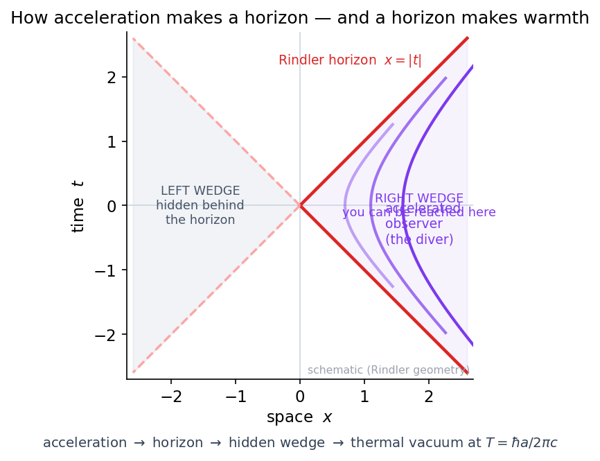

***Figure 14.2 — How acceleration makes a horizon, and a horizon makes warmth.*** A spacetime diagram (space horizontal, time vertical). The purple hyperbolas are the worldlines of uniformly accelerated observers; the red diagonals $x=|t|$ are the Rindler horizon. The accelerating observer lives in the right wedge and can never receive signals from the grey left wedge. Hiding that wedge of the quantum vacuum is precisely what makes the remainder look thermal, the chain printed along the bottom. A schematic illustrating the geometry of the chapter's central argument, not plotted data.

**Source:** Figure generated by [`book/figures/ch14_rindler_horizon_schematic.py`](https://github.com/carlzimmerman/zimmerman-formula/blob/main/book/figures/ch14_rindler_horizon_schematic.py). Rindler-wedge geometry and the horizon-to-temperature logic from Unruh 1976, PRD 14, 870; cf. the Bogoliubov derivation in this chapter's Deeper Dive.

> **Deeper Dive: Rindler coordinates and the Bogoliubov transformation**
>
> Here is the rigorous skeleton, for readers who want it. A uniformly accelerated observer in flat (Minkowski) spacetime, with proper acceleration $a$, follows a hyperbolic worldline. Adapting coordinates to this motion gives the **Rindler wedge**: the region $x > |t|$ of Minkowski space, covered by coordinates $(\eta, \xi)$ with
> $$ t = \xi \sinh(a\eta), \qquad x = \xi \cosh(a\eta), $$
> in which the observer sits at fixed $\xi$ and $\eta$ is their proper time (up to a constant factor). The boundary $x = |t|$ — the null surface the accelerated observer can never see beyond — is the **Rindler horizon**. The Rindler wedge is *causally closed* to its observer: events in the left wedge $x < -|t|$ are forever inaccessible.
>
> Now quantize a free scalar field. The inertial (Minkowski) observer expands the field in plane-wave modes and defines a vacuum $|0_M\rangle$ annihilated by the Minkowski lowering operators $a_k$. The accelerated (Rindler) observer naturally expands the *same field* in modes adapted to the wedge — Rindler modes — with their own creation/annihilation operators $b_j$, $b_j^\dagger$, and their own vacuum $|0_R\rangle$. The two sets of modes are related by a **Bogoliubov transformation**:
> $$ b_j = \sum_k \left( \alpha_{jk}\, a_k + \beta_{jk}^*\, a_k^\dagger \right), $$
> where the $\alpha$'s and $\beta$'s are the Bogoliubov coefficients. The decisive point is that the $\beta_{jk}$ are **not zero**: a Rindler annihilation operator is a mixture of Minkowski annihilation *and creation* operators. That mixing is why the two observers disagree about particle content.
>
> Computing the expected number of Rindler particles the accelerated detector finds in the Minkowski vacuum gives a Planck (thermal) spectrum:
> $$ \langle 0_M |\, b_j^\dagger b_j \, | 0_M \rangle = \frac{1}{\exp\!\left(\dfrac{2\pi c\, \omega_j}{a}\right) - 1}, $$
> which is exactly the Bose–Einstein distribution of a gas at temperature
> $$ T = \frac{\hbar a}{2\pi c\, k_B}, $$
> the Unruh temperature. Equivalently and more elegantly: tracing the global Minkowski vacuum over the unobservable left Rindler wedge yields a *thermal density matrix* $\rho \propto e^{-2\pi H_R / a}$ for the right-wedge observer, where $H_R$ is the Rindler Hamiltonian (the boost generator). The factor of $2\pi$ is the geometric signature of a smooth Euclidean horizon — the same $2\pi$ that fixes the Hawking temperature — and is not adjustable.
>
> Two honest caveats a PhD will want stated. (1) "Particle" is observer-dependent here: the number operator itself differs between the two quantizations, which is the whole point — there is no frame-independent count of quanta in the vacuum. (2) The cleanest derivation assumes *eternal, uniform* acceleration; a detector switched on for a finite time sees corrections, and the operational meaning is best framed through an *Unruh–DeWitt detector* (a two-level system coupled to the field), whose excitation rate satisfies the detailed-balance (Kubo–Martin–Schwinger) condition at temperature $T$. The thermal character is robust; the literal particle picture should be handled with the care this paragraph asks for.

---

## Wait — does the accelerating object actually *feel hot*?

This is the question every careful student asks, and it deserves a straight answer.

Yes, operationally. If you carried a sufficiently sensitive thermometer — really, a *particle detector*, a little quantum system that clicks when it absorbs energy from the field — and you accelerated it hard enough, it would start clicking *as if it were sitting in an oven at the Unruh temperature.* It would get genuinely excited, jump to higher energy states, behave in every measurable way like a thing immersed in warmth. The warmth is not a figure of speech or an illusion in the dismissive sense. It is operationally real to the accelerated detector.

But — and here is the subtlety that makes the effect so philosophically rich — the *unaccelerated* observer watching from the side describes the very same physics completely differently. To her, there is no thermal bath at all. To her, the accelerating detector is clicking because it is being *forced* along its path, and the agent doing the forcing is pumping energy into it; the clicks are radiation the accelerating detector emits because it's being shaken. Two observers, two stories, both internally consistent, both correct in their own frame. The vacuum's "emptiness" is not absolute. It is a statement about your state of motion.

I find this honestly one of the most beautiful results in physics, and I want you to feel its weight before we use it. It says that **whether a region of space is empty or full of warmth is not a property of the region. It is a property of the relationship between the region and you.** Motion — specifically, accelerated motion — reaches into the definition of "nothing" and changes it.

> **Margin aside.** If this reminds you of relativity's lesson that *length* and *time* depend on the observer, you've caught the family resemblance exactly. Einstein taught us that space and time are observer-dependent. The Unruh effect extends the lesson all the way down: even *particle content* — even the answer to "is anything here?" — is observer-dependent once acceleration enters. It is the same humility, pushed one level deeper.

---

## From warmth to inertia: opening the door (carefully)

Now we come to the reason this chapter sits in this book, and I am going to walk the line between excitement and honesty as carefully as I can, because this is exactly the kind of place where physics writing goes wrong.

We have established a solid, mainstream, textbook result: **acceleration warms the vacuum.** That is the Unruh effect, and nothing about it is controversial among physicists (the *direct experimental confirmation* is still pending, as we keep saying, but the theory is firmly part of accepted physics).

Here is the further *idea* — and I want to flag clearly that what follows is **motivation, a line of reasoning, a conjecture some physicists find compelling**, not a derivation and not established fact. The idea runs like this.

Inertia, as we discussed in Chapter 13, is the deeply mysterious fact that matter *resists* being accelerated. Push a brick and it pushes back; the harder you try to accelerate it, the harder it resists. Newton wrote this down ($F = ma$) but never explained *why* — why does matter care about acceleration at all? Where does the resistance come from?

The Unruh effect offers a tantalizing hint at an answer. *Accelerating* is precisely the act that makes the vacuum warm. And a warm vacuum is a vacuum full of low-grade radiation, of jostling, of pressure. So perhaps — *perhaps* — when you accelerate a piece of matter, the asymmetric warm bath it generates pushes back on it, and *that push-back is inertia.* In this telling, inertia is not a brute primitive fact baked into matter; it is a *reaction force from the vacuum*, the cost of stirring up Unruh warmth by accelerating. The resistance you feel pushing a brick would be, at bottom, the brick's own Unruh bath resisting the change in its motion.

This is sometimes associated with the physicist Mike McCulloch (whose "quantized inertia" proposals push the idea hard), and it traces back through deeper roots to ideas about inertia as a vacuum reaction that go at least to the work of Sakharov, Jacobson, and others on gravity-and-inertia-as-thermodynamics. The version that matters for *this* book is Milgrom's 1999 insight, sharpened with Deser and Levin's careful treatment of accelerated observers in de Sitter space — we'll meet it properly in Chapters 15 and 21.

But I promised you both-ways honesty, so here is the other hand, and it is a heavy one.

**This thermal-origin-of-inertia idea is not proven.** It is suggestive, even beautiful, and it has serious physicists working on it — but turning "perhaps the warm bath pushes back" into a quantitative, consistent, relativistically sound theory of inertia is genuinely hard, and no version yet does the whole job cleanly. McCulloch's quantized-inertia program, in particular, has well-known problems with its derivations that mainstream physicists rightly criticize, and I do not want you to walk away thinking the case is closed. **It is not.** When the framework in Part 5 uses this circle of ideas, it uses a *specific, more disciplined* version — Milgrom's de Sitter–Unruh modified inertia — and even that, as I will say many times in this book, *predicts the form of the answer but does not derive the one free number in it.* The framework is, in the line I'll keep repeating because it's the honest one, **not a theory of everything yet, as frustrating as it may be.**

So treat this section the way you'd treat a promising lead in a detective story, not the confession at the end. The Unruh effect is the solid clue: acceleration and temperature are the same conversation. The leap from there to "and temperature *is* inertia" is the part still under investigation. The chapters ahead will show you exactly how far the framework can carry that leap — which is genuinely further than you might expect — and exactly where it has to stop and admit it's posited rather than proven.

> **Deeper Dive: the sketch McCulloch-style reasoning leans on (and why it's only a sketch)**
>
> One way the "inertia from the Unruh bath" intuition gets made semi-quantitative is as follows. An accelerated object sees Unruh radiation of characteristic wavelength $\lambda \sim c^2/a$ (set by the temperature $T \sim \hbar a / k_B c$ via Wien's law, up to factors). The claim is then that *information from the part of the Unruh field beyond the Rindler horizon is unavailable*, so the spectrum of vacuum modes that can support the object's inertia is effectively cut off at long wavelengths by the horizon scale.
>
> In quantized-inertia arguments, one further imposes a **Hubble-scale cutoff**: in our actual universe there is a *cosmic* horizon at distance $\sim c/H_0$ (the de Sitter horizon of Chapter 15), so the longest Unruh wavelength that "fits" between you and the cosmic horizon is bounded. When the acceleration $a$ is so small that the Unruh wavelength $c^2/a$ approaches the Hubble scale $c/H_0$ — i.e. when
> $$ a \sim c H_0 \sim 10^{-10}\ \text{m/s}^2, $$
> a fraction of the vacuum modes are "lost" off the far horizon, the reaction force weakens, and inertia is predicted to *drop below* its Newtonian value. Strikingly, $cH_0 \sim 10^{-10}\ \text{m/s}^2$ is right at the MOND acceleration scale $a_0$ — which is the entire reason this circle of ideas is in a book about MOND. *That coincidence is real and is the motivating spark.*
>
> Now the honesty. This argument, as just sketched, is **heuristic, not a derivation.** Imposing a sharp Hubble cutoff on the Unruh spectrum by hand, treating "lost modes" as straightforwardly subtracting inertia, and getting the dimensionless coefficients right are all steps that do not survive contact with rigorous relativistic quantum field theory in the naive McCulloch form, and mainstream critics are correct to say so. What the framework of this book does is **replace this loose sketch with the cleaner, defensible piece** — the *de Sitter–Unruh temperature floor* of Deser–Levin and Milgrom's controlled modified-inertia construction (Chapters 15, 20, 21) — which *forces the form* $a_0 \sim c^2\sqrt{\Lambda}$ and the gravitational kernel, while leaving one pure-geometry number ($\kappa = \tfrac12$) posited rather than derived. The take-home: the $a \sim cH_0$ coincidence is a legitimate motivation and the source of the framework's central guess, but the back-of-envelope cutoff argument that first surfaces it is **not** where the framework's rigor lives. Do not mistake the spark for the engine.

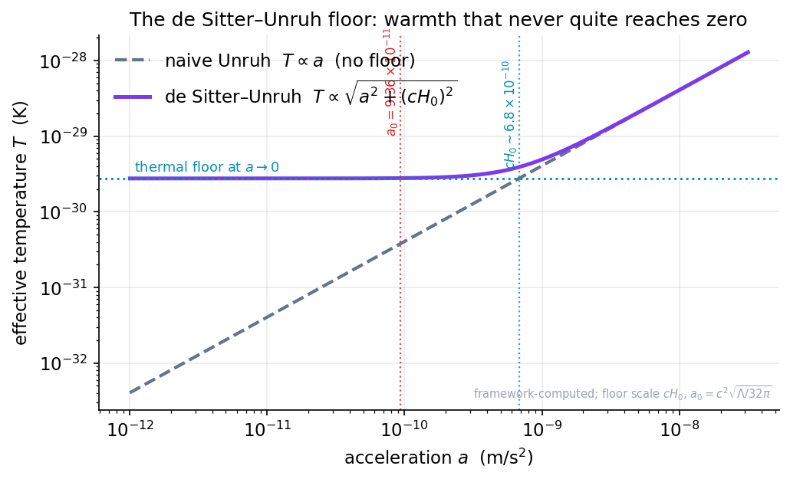

***Figure 14.3 — The de Sitter–Unruh floor.*** Both curves are computed from the framework's equations. The grey dashed line is the naive flat-space Unruh law, which heads to zero as acceleration vanishes. The purple line is the de Sitter–Unruh effective temperature $T\propto\sqrt{a^2+(cH_0)^2}$, which instead bottoms out on a floor set by the cosmic horizon scale $cH_0\sim10^{-10}$ m/s$^2$. The departure between the two curves sets in right where $a$ approaches the MOND scale $a_0=c^2\sqrt{\Lambda/32\pi}$, marked here, which is the motivating coincidence the chapter flags. Honest caveat: this floor forces the *form* $a_0\sim c^2\sqrt{\Lambda}$; its value still rides on one posited geometric number ($\kappa=\tfrac12$).

**Source:** Figure generated by [`book/figures/ch14_desitter_temperature_floor.py`](https://github.com/carlzimmerman/zimmerman-formula/blob/main/book/figures/ch14_desitter_temperature_floor.py). de Sitter–Unruh effective temperature from Deser & Levin 1997, Class. Quantum Grav. 14, L163; framework scale $a_0=c^2\sqrt{\Lambda/32\pi}$ from the spine paper [doi:10.5281/zenodo.20721540](https://doi.org/10.5281/zenodo.20721540).

---

## So what is genuinely solid here?

Let me close the technical part of the chapter by sorting the solid from the speculative, plainly, because you deserve to know exactly what you can lean on.

**Solid (mainstream, textbook physics):**
- The quantum vacuum is real and restless; "empty space" still hums. (Measured: Casimir, Lamb shift.)
- A uniformly accelerated observer has a horizon — the Rindler horizon — beyond which they cannot see.
- That horizon, draped over the humming vacuum, makes the vacuum *look thermal* to the accelerated observer.
- The temperature is $k_B T = \hbar a / 2\pi c$: proportional to acceleration, fixed by fundamental constants, the same for everyone.
- The effect is real in theory but *fantastically faint* — never directly measured, because the accelerations needed are astronomically large.

**Suggestive (a live research idea, not established):**
- That this acceleration-temperature link might *explain inertia* — that the vacuum's warmth, generated by accelerating, pushes back, and the push-back is the resistance we call mass.
- That at very small accelerations, near $cH_0 \sim a_0 \sim 10^{-10}\ \text{m/s}^2$, this mechanism might *weaken* inertia and reproduce MOND's galactic behavior.

**The book's position:** we will build the framework on the *solid* part and on a *disciplined* version of the suggestive part (Milgrom / Deser–Levin de Sitter–Unruh modified inertia), and we will be relentlessly clear about which steps are forced and which are posited. The Unruh effect itself is bedrock. What we *do* with it is the adventure — and the honest accounting of where that adventure succeeds and where it stalls is the whole back half of this book.

---

## Summary

- **The Unruh effect** is the prediction that an **accelerated observer** perceives the **quantum vacuum** — the restless, irreducible hum of empty space — as a warm thermal bath, even though an unaccelerated observer in the same space sees only cold emptiness. Whether "nothing" looks empty or warm depends on how you move through it.
- The warmth has a precise **Unruh temperature**, $k_B T = \hbar a / 2\pi c$: it is directly proportional to your acceleration $a$ and set by the fundamental constants $\hbar$ (quantum) and $c$ (relativity). Stop accelerating and the warmth vanishes.
- The temperature is **extraordinarily small** for any ordinary acceleration — warming the vacuum by even one degree requires about $10^{19}$ times Earth's gravity — which is why the effect, though firmly part of accepted theory, has **never been directly measured.** It is a consequence of well-tested physics, not yet a directly observed phenomenon in its own right.
- The mechanism behind it is the **Rindler horizon**: constant acceleration carves the universe into a reachable part and a hidden part, and hiding part of the quantum vacuum behind a horizon is precisely what makes the remainder look thermal. (This is the flat-space sibling of black-hole Hawking radiation — Chapter 16.)
- Mathematically (Deeper Dive), the effect is a **Bogoliubov transformation** between the inertial and accelerated mode expansions of the field, whose nonzero $\beta$-coefficients yield a Planck spectrum at the Unruh temperature; equivalently, tracing the Minkowski vacuum over the hidden wedge gives a thermal density matrix, with the geometric $2\pi$ fixed by the smoothness of the horizon.
- The Unruh effect is the **first plank** of this book's framework: it makes *acceleration* and *temperature* two faces of one thing, opening the door to a *thermal origin of inertia*. That further idea — inertia as the vacuum's warm push-back, weakening near $a_0 \sim cH_0$ to give MOND — is a **genuine, motivating research direction, but it is not proven**, and the crude cutoff arguments that first surface it are heuristic. The framework will lean on the *disciplined* de Sitter–Unruh version (Chapters 15, 20, 21), and even that forces the *form* of the answer while positing its one free number. As always: **not a theory of everything yet, as frustrating as it may be.**

---

## Questions

1. **(Easy — concept check.)** In your own words, why do an accelerating observer and a non-accelerating observer disagree about whether empty space is warm? Which one feels heat, and what is the source of that heat (it is *not* friction)?

2. **(Easy — formula reading.)** The Unruh temperature is $k_B T = \hbar a / 2\pi c$. Without doing a full calculation, explain what happens to the temperature if you (a) double the acceleration, and (b) stop accelerating entirely. What does part (b) tell you about whether a *steadily drifting* observer feels any Unruh warmth?

3. **(Medium — estimation.)** Using the worked example as a model, estimate the Unruh temperature felt by a proton accelerated at $a = 10^{26}\ \text{m/s}^2$ (a value not far from what intense laser fields can momentarily impose). Compare your answer to room temperature (300 K). What does this suggest about *where* experimenters might hope to detect the effect — in everyday apparatus, or in extreme particle settings?

4. **(Medium — conceptual link.)** The chapter says the Rindler horizon makes the accelerated vacuum look warm "for the same reason" a black hole's event horizon makes a black hole glow (Hawking radiation). State the shared logic in one or two sentences. What plays the role of "the hidden region" in each case?

5. **(Hard — honest reasoning.)** The chapter is careful to call the "inertia from Unruh warmth" idea *suggestive but not proven.* Identify two specific places where the heuristic McCulloch-style argument (in the second Deeper Dive) makes a move that "does not survive contact with rigorous relativistic quantum field theory." Why does it matter, for the credibility of the framework in Part 5, that the framework replaces these moves with the de Sitter–Unruh construction rather than relying on the back-of-envelope cutoff?

6. **(Research-level.)** The coincidence $cH_0 \sim a_0 \sim 10^{-10}\ \text{m/s}^2$ is the spark behind connecting Unruh-style modified inertia to MOND. Drawing on what you'll read in Chapters 15 and 20, the framework refines this into $a_0 = c^2\sqrt{\Lambda/32\pi}$, tying $a_0$ to the *cosmological constant* $\Lambda$ rather than directly to the Hubble rate $H_0$. (a) Why might tying $a_0$ to $\Lambda$ (dark energy) be more defensible than tying it to $H_0$ (the current expansion rate), given that $H_0$ changes over cosmic time while $\Lambda$ is constant in standard cosmology? (b) The framework's *signature prediction* is that $a_0$ should then *track the dark-energy density through cosmic time*, $a_0(z) \propto \sqrt{\rho_{\rm DE}(z)}$. Explain why a thermal-floor origin for $a_0$ makes such time-variation natural, and propose one observation that could, in principle, distinguish a $\Lambda$-tracking $a_0$ from a strictly constant one. (Keep in mind the honest caveat that this test is non-diagnostic today and hostage to whether dark energy's measured evolution holds up.)

# Chapter 15: De Sitter Space: A Universe with a Temperature Floor

*If you could empty the universe of everything — every star, every atom, every last wisp of gas — and then sit very still in the dark, you might expect to feel nothing at all. You would be wrong. There would still be a horizon you could never see past, and a faint, irreducible warmth. This chapter is about why.*

---

## A room you can never leave

Let me start with a picture, because the mathematics will go down more easily once you can *see* the thing it describes.

Imagine you are standing in the middle of an enormous, perfectly flat field at dusk. The ground stretches away in every direction. Because the Earth curves, there is a circle on the ground — the horizon — beyond which you cannot see. Ships sail "over" it; the sun sets "below" it. The horizon is not a wall. There is nothing physically there. It is simply the boundary of what light can carry to your eye, set by the geometry of the world you stand on.

Now I want you to hold onto that image and change one thing. Instead of the curvature being in the *ground*, put it in *space itself* — and let that curvature be driven not by mass but by **dark energy**, the mysterious thing we met in Chapter 11 that makes the universe's expansion speed up. When you do that, you get a kind of universe physicists call **de Sitter space**, and it comes with its own horizon. Not a horizon on the ground, but a horizon in the sky, all around you, in three dimensions — a sphere of "you can't see past here" centered on wherever you happen to be standing.

That is the first strange and beautiful fact of this chapter. In a universe dominated by dark energy, *every observer sits at the center of their own horizon.* Move ten light-years to the left and your horizon moves with you, still centered on you, still the same size. It is a bit like being on a boat in fog: the circle of visibility travels with the boat. Nobody is special; everybody is at the center; and there is always a boundary past which the rest of the universe is hidden.

The second strange fact — the one this whole chapter is really building toward — is that *this horizon is warm.* Not metaphorically. It has a genuine temperature, the same kind of temperature a cup of coffee has, the same kind a thermometer would read. It is a fantastically tiny temperature, far colder than anything we can make in a laboratory. But it is not zero. And "not zero" turns out to matter enormously, because it means **empty space in our universe is never perfectly cold.** There is a floor beneath which the temperature of the vacuum cannot fall.

By the end of this chapter you will understand where that floor comes from, how big it is, and — this is the payoff — how combining it with the Unruh effect from the last chapter produces a single clean equation that sits at the heart of Carl's framework. I will be honest with you the whole way about which pieces are settled, textbook physics (most of this chapter) and which piece is the framework's own proposal built on top of them (a smaller, clearly marked part near the end).

Let's build it up slowly.

---

## What "de Sitter space" actually means

The name comes from Willem de Sitter, a Dutch astronomer who, in 1917 — just two years after Einstein published General Relativity — found one of the very first solutions to Einstein's field equations. We met those equations in Chapter 8: they are the rule that says *matter and energy tell spacetime how to curve, and curved spacetime tells matter how to move.* De Sitter asked a deceptively simple question. *What does spacetime do if you put nothing in it but a cosmological constant?*

Recall from Chapter 11 that the **cosmological constant**, written with the Greek letter Λ (lambda), is the simplest possible form of dark energy: a constant energy density that belongs to empty space itself. It does not dilute as the universe expands. Empty a region of every particle and Λ is still there, pushing outward.

De Sitter's answer was a universe that is completely empty of ordinary matter, yet *not* static and *not* flat. It expands — and not just expands, but expands at an accelerating, runaway pace, every distance doubling in a fixed amount of time, then doubling again, and again. This is **exponential expansion**, the same word your bank uses for compound interest. A universe whose only content is a cosmological constant blows itself up exponentially forever.

> **Margin note.** "Exponential" simply means the growth rate is proportional to the current size: the bigger it gets, the faster it grows. Distances in de Sitter space grow like $e^{H t}$ — Euler's number $e \approx 2.718$ raised to a power that climbs steadily with time $t$.

Why should you care about an empty toy universe? Two reasons, and they are the spine of this book.

First, **our universe is becoming de Sitter space.** The 1998 discovery of cosmic acceleration (Chapter 11) told us that dark energy now dominates the cosmic energy budget, and its share grows every billion years as matter thins out. Ordinary matter dilutes; Λ does not. Run the clock forward and the matter becomes utterly negligible, leaving a universe that looks, to very good approximation, exactly like de Sitter's empty solution. We are not living in pure de Sitter space today — there is still plenty of matter around — but we are sliding into it, and the dark-energy "floor" it implies is already switched on.

Second — and this is the deep one — **de Sitter space has a horizon and a temperature**, and those two features are precisely what the framework needs. So let's get them straight.

---

## The Hubble horizon: how far you can see when space is running away

Back in Chapter 9 we met Edwin Hubble and the expanding universe, and the rule that bears his name: distant galaxies recede from us, and the farther away a galaxy is, the faster it flees. The constant of proportionality is the **Hubble constant**, $H$. Double the distance, double the recession speed.

Now here is a consequence that surprises people the first time they meet it. If recession speed grows with distance, then at some distance the recession speed reaches the speed of light. Beyond that distance, space is carrying things away from us *faster than light can swim back toward us.* (Nothing is moving through space faster than light — that's forbidden. It is *space itself* stretching, which has no such speed limit.) A flash of light emitted out there, aimed straight at us, makes no headway: the intervening space inflates faster than the light can cross it. That light never arrives. That galaxy is, for all time, beyond our reach.

The distance at which this happens is the **Hubble horizon** — sometimes called the Hubble radius. It is the de Sitter horizon I described in the opening: the sphere around you past which you cannot see, because space out there is receding faster than light. Its size is beautifully simple:

$$R_H = \frac{c}{H}$$

the speed of light $c$ divided by the Hubble rate $H$. Plug in the numbers and it comes out to roughly fourteen billion light-years — a distance comparable to the size of the observable universe, which is no coincidence.

For *our* universe, the relevant rate is not the full Hubble constant we measure today (which still has a contribution from matter) but the part set purely by dark energy. Physicists call this the **de Sitter Hubble rate** and write it $H_\Lambda$. It is the expansion rate the universe will settle down to in the far future, once matter has thinned to nothing and only Λ remains. The framework leans on a particular combination of $c$ and $H_\Lambda$ throughout, and it's worth naming it now because you'll see it again and again:

$$c H_\Lambda$$

This product — the speed of light times the de Sitter Hubble rate — has the units of an *acceleration* (a speed divided by a time). Keep that in the back of your mind. An acceleration is exactly the kind of quantity that will turn out to matter when we start talking about inertia and the threshold $a_0$. A quiet foreshadowing: $cH_\Lambda$ is going to be, up to a pure number, the acceleration scale at the center of this entire book.

> **Deeper Dive: The de Sitter metric and its horizon.**
>
> De Sitter space is the maximally symmetric solution of the vacuum Einstein equations with a positive cosmological constant,
> $$ G_{\mu\nu} + \Lambda g_{\mu\nu} = 0, $$
> where $G_{\mu\nu}$ is the Einstein tensor of Chapter 8. In *static* coordinates centered on an observer, the line element is
> $$ ds^2 = -\left(1 - \frac{r^2}{\ell^2}\right) c^2\,dt^2 + \left(1 - \frac{r^2}{\ell^2}\right)^{-1} dr^2 + r^2\, d\Omega^2, $$
> where $d\Omega^2 = d\theta^2 + \sin^2\theta\, d\varphi^2$ is the metric on a unit 2-sphere and
> $$ \ell = \sqrt{\frac{3}{\Lambda}} $$
> is the **de Sitter radius**. The metric coefficient $1 - r^2/\ell^2$ vanishes at $r = \ell$: this is a coordinate horizon, the **de Sitter horizon**, the static-coordinate face of the Hubble horizon. The corresponding de Sitter Hubble rate is
> $$ H_\Lambda = \frac{c}{\ell} = c\sqrt{\frac{\Lambda}{3}}, $$
> so the horizon radius is $R_H = c/H_\Lambda = \ell$. Notice the structure is identical to the event horizon of a black hole (Chapter 8's Schwarzschild solution), with the crucial sign flip: the black-hole horizon surrounds a *mass* and you are outside it; the de Sitter horizon surrounds *you* and the rest of the universe is outside it. This "inside-out" character is what makes every observer central, and it is the geometric root of the temperature we are about to derive.

---

## Where the temperature comes from

Here is the move that won Gibbons and Hawking a permanent place in this story, and it follows a path Hawking had already blazed for black holes.

In Chapter 14 we learned the **Unruh effect**: an observer who accelerates through the quantum vacuum does not see empty, cold space. They see a warm bath of particles, with a temperature proportional to their acceleration. The deep reason is that *acceleration creates a horizon* — a boundary behind the accelerating observer past which signals can never catch up — and a horizon, when you do quantum field theory across it, glows.

In 1977 Gary Gibbons and Stephen Hawking realized that de Sitter space hands you a horizon *for free.* You don't have to accelerate to get one. The expansion of space already produces a horizon — the Hubble horizon — all around every observer, whether they are accelerating or not. And by exactly the same quantum reasoning that makes an accelerating observer's horizon glow, *the de Sitter horizon glows too.* An observer floating freely in de Sitter space, accelerating not at all, feels a thermal bath. The vacuum is warm.

This temperature is named the **Gibbons–Hawking temperature** after its discoverers, and it is one of the cleanest, most celebrated results in all of theoretical physics. Its value is:

$$ T_{\text{dS}} = \frac{\hbar H_\Lambda}{2\pi k_B} $$

Let me translate every symbol, because this little formula will reward your attention:

- $T_{\text{dS}}$ is the temperature of the de Sitter vacuum.
- $\hbar$ (h-bar) is the **reduced Planck constant**, the fundamental quantum of action — the number that shows up wherever quantum mechanics does. Its appearance here is the tell that this is a quantum effect: set $\hbar = 0$ (pretend the world is not quantum) and the temperature vanishes.
- $H_\Lambda$ is the de Sitter Hubble rate we just met — the expansion rate set by dark energy.
- $k_B$ is **Boltzmann's constant**, the universal exchange rate between temperature and energy. It is what lets you convert "degrees" into "joules."
- $2\pi$ is just a geometric factor that drops out of the careful derivation — the same $2\pi$ that haunts every problem involving circles and periodicity.

The structure is almost insultingly simple: the temperature of empty space is just the expansion rate, dressed in the constants that convert it into degrees. *The faster the universe expands, the warmer its vacuum.* And because $H_\Lambda$ never falls to zero in a universe with a cosmological constant — dark energy doesn't dilute, remember — the temperature never falls to zero either. **This is the temperature floor of the chapter title.** It is the irreducible warmth I promised you in the opening: the heat of empty space that you cannot turn off, because it is the heat of the horizon, and the horizon is always there.

> **Margin note.** It's worth pausing on how unified this is. A black-hole horizon glows (Hawking, 1974). An accelerating observer's horizon glows (Unruh, 1976). A cosmological horizon glows (Gibbons–Hawking, 1977). Three different horizons, three different physical setups, one and the same idea: *horizons have temperatures.* This is not three coincidences. It is one principle wearing three coats.

How big is this floor, in numbers you can feel? Let's compute it.

> **Worked Example: How cold is the de Sitter vacuum?**
>
> We want the Gibbons–Hawking temperature for *our* universe's dark energy. Let's go slowly.
>
> **Step 1 — Get $H_\Lambda$.** The Hubble constant today is about $H_0 \approx 67$ kilometers per second per megaparsec. Dark energy makes up a fraction $\Omega_\Lambda \approx 0.69$ of the cosmic budget, and the *de Sitter* rate is the rate dark energy alone would drive: $H_\Lambda = H_0\sqrt{\Omega_\Lambda}$. So $H_\Lambda \approx 67 \times \sqrt{0.69} \approx 56$ km/s/Mpc.
>
> Convert to SI. One megaparsec is $3.086\times 10^{19}$ km, so
> $$ H_\Lambda \approx \frac{56 \ \text{km/s}}{3.086\times 10^{19}\ \text{km}} \approx 1.8\times 10^{-18}\ \text{s}^{-1}. $$
> That is the de Sitter Hubble rate: empty-space expansion, about two parts in a billion billion per second.
>
> **Step 2 — Assemble the constants.** We need $\hbar = 1.055\times 10^{-34}$ J·s and $k_B = 1.381\times 10^{-23}$ J/K.
>
> **Step 3 — Plug in.**
> $$ T_{\text{dS}} = \frac{\hbar H_\Lambda}{2\pi k_B} = \frac{(1.055\times 10^{-34})(1.8\times 10^{-18})}{2\pi\,(1.381\times 10^{-23})}\ \text{K}. $$
> Numerator: $1.055\times 10^{-34} \times 1.8\times 10^{-18} \approx 1.9\times 10^{-52}$. Denominator: $2\pi \times 1.381\times 10^{-23} \approx 8.68\times 10^{-23}$. Dividing:
> $$ T_{\text{dS}} \approx 2.2\times 10^{-30}\ \text{kelvin}. $$
>
> **Step 4 — Feel the number.** Two times ten-to-the-minus-thirty of a degree above absolute zero. For comparison, the cosmic microwave background — the leftover glow of the Big Bang, the coldest *ordinary* thing in the sky — is about 2.7 kelvin. The de Sitter floor is colder than the CMB by *thirty orders of magnitude.* It is the faintest temperature anyone has ever written down with a straight face. You could never measure it directly; no thermometer dreamt of could resolve it.
>
> And yet it is not zero. That is the entire point. The vacuum of our Λ-universe has a temperature, and it has a smallest possible value set by dark energy, and "smallest possible but not zero" is exactly the ingredient the next section needs.

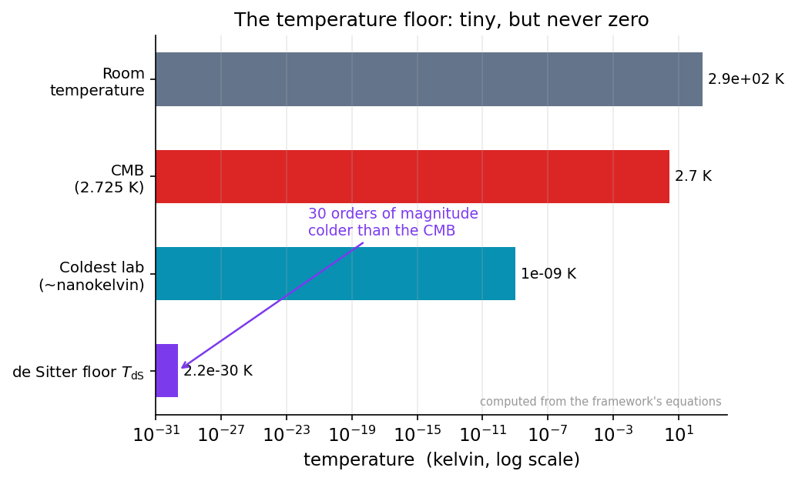

***Figure 15.2 — How small the floor is, and that it is not zero.*** On a logarithmic temperature axis, the Gibbons–Hawking floor $T_{\rm dS} = \hbar H_\Lambda/2\pi k_B \approx 2\times10^{-30}$ K sits about thirty orders of magnitude below the cosmic microwave background — and roughly twenty below the coldest temperatures ever reached in a laboratory. It is unmeasurably tiny, yet strictly nonzero, which is the whole point of the chapter. The floor value is computed from the framework's equations; the CMB value is the Planck 2018 measurement, and the lab figure is an illustrative round number.

**Source:** Figure generated by [`book/figures/ch15_temperature_floor_scale.py`](https://github.com/carlzimmerman/zimmerman-formula/blob/main/book/figures/ch15_temperature_floor_scale.py). $T_{\rm dS}$ follows from the Gibbons & Hawking 1977 temperature; the CMB value is from Planck 2018 results VI, A&A 641, A6 (arXiv:1807.06209).

---

## Putting the two horizons together: the de Sitter–Unruh quadrature

Now we arrive at the technical heart of the chapter, and I want to lay it out carefully because it is where the textbook physics hands off to the framework's own construction. I'll mark the handoff plainly when we reach it.

We have two effects that each produce a temperature from a horizon:

1. **The Unruh effect (Chapter 14).** Accelerate with acceleration $a$ through the vacuum and you feel a temperature proportional to $a$:
$$ T_{\text{Unruh}} = \frac{\hbar a}{2\pi k_B c}. $$
2. **The Gibbons–Hawking effect (this chapter).** Sit in a de Sitter universe and you feel a temperature proportional to $H_\Lambda$, even at zero acceleration:
$$ T_{\text{dS}} = \frac{\hbar H_\Lambda}{2\pi k_B}. $$

Now ask the natural question. *What does an observer feel who is both accelerating AND living in a de Sitter universe?* You have a horizon from your acceleration and a horizon from the cosmic expansion. How do their two temperatures combine?

You might guess they simply add: total temperature equals Unruh plus Gibbons–Hawking. That guess is wrong, and the reason it's wrong is instructive. Temperatures of this kind come from the *geometry* of the combined horizon, and geometry doesn't add temperatures — it adds something more like squared quantities, the way the sides of a right triangle combine. The careful calculation was done by Stanley Deser and Orit Levin in 1997 (building on earlier work by Narnhofer, Peter, and Thirring), and the answer is a **quadrature** — a combination in quadrature, meaning you add the squares and take the square root, exactly as the hypotenuse of a right triangle is built from its two legs.

Here is the result, the **de Sitter–Unruh quadrature**:

$$ \frac{2\pi k_B T_{\text{eff}}}{\hbar c} = \sqrt{a^2 + (cH_\Lambda)^2} $$

Read it slowly. On the left is the *effective temperature* $T_{\text{eff}}$ that the accelerating de Sitter observer actually experiences, written in the same units (an inverse length, or equivalently an acceleration over $c^2$) as the right-hand side. On the right, under the square root, two things are added *as squares*: the observer's own acceleration $a$, and that combination $cH_\Lambda$ we flagged earlier — the de Sitter floor expressed as an acceleration. The total is their hypotenuse.

This single equation is the whole of de Sitter–Unruh thermodynamics in one line, and it has a property I want you to notice because everything downstream depends on it. Look at what happens in the two extremes:

- **When you accelerate hard** — $a$ much larger than $cH_\Lambda$ — the $a^2$ term dominates, the floor is negligible, and you recover plain Unruh: $T_{\text{eff}} \approx \hbar a / 2\pi k_B c$. The cosmic horizon doesn't matter; your own acceleration is all you feel. This is the regime of every laboratory, every planet, every particle accelerator — accelerations vastly larger than $cH_\Lambda$.
- **When you barely accelerate at all** — $a$ much smaller than $cH_\Lambda$ — the $a^2$ term is negligible, and you're left with the floor: $T_{\text{eff}} \approx \hbar H_\Lambda/2\pi k_B$, the bare Gibbons–Hawking temperature. *Even at zero acceleration the temperature does not vanish.* It bottoms out at the de Sitter floor.

That smooth handover — Unruh-dominated at high acceleration, floor-dominated at low acceleration, stitched together by a square root — is the mathematical shape of a *threshold.* There is a natural scale, $cH_\Lambda$, that divides "acceleration wins" from "floor wins." And a threshold acceleration scale is exactly what MOND (Chapter 17) needs, and exactly what the radial-acceleration relation (Chapter 18) sees in real galaxies. The quadrature is telling us where that scale comes from: it is the dark-energy floor on the temperature of the vacuum.

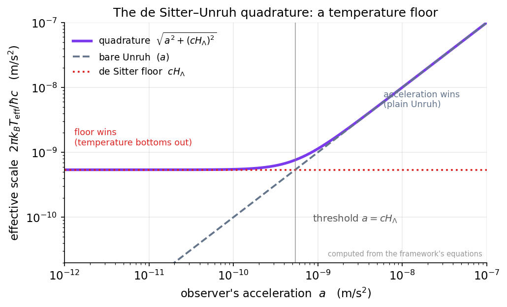

***Figure 15.1 — The quadrature is the shape of a threshold.*** The effective scale $2\pi k_B T_{\rm eff}/\hbar c = \sqrt{a^2+(cH_\Lambda)^2}$ (purple) tracks the observer's own acceleration when $a \gg cH_\Lambda$ (the bare Unruh line, grey dashed) but bottoms out on the de Sitter floor $cH_\Lambda \approx 5.4\times10^{-10}$ m/s$^2$ (red dotted) when $a \ll cH_\Lambda$. The smooth crossover at $a=cH_\Lambda$ is the natural acceleration threshold the chapter is built around. Computed from the framework's equations.

**Source:** Figure generated by [`book/figures/ch15_quadrature_floor.py`](https://github.com/carlzimmerman/zimmerman-formula/blob/main/book/figures/ch15_quadrature_floor.py). The de Sitter–Unruh quadrature is the Deser & Levin 1997 result (Class. Quantum Grav. 14, L163); the framework's use of $cH_\Lambda$ as the acceleration scale is documented in the spine paper [doi:10.5281/zenodo.20721540](https://doi.org/10.5281/zenodo.20721540).

I want to be scrupulous about provenance here, because the layers matter.

**Everything up to and including the quadrature is established physics.** The de Sitter metric (de Sitter 1917), the Gibbons–Hawking temperature (1977), the Unruh effect (1976), and the Deser–Levin quadrature (1997) are all standard, peer-reviewed, textbook-or-near-textbook results. None of them is Carl's, and none of them is in dispute among physicists. They are the ground the framework stands on, and it is solid ground.

**The next step — the framework's step — is to take this temperature seriously as a source of inertia.** That move is the subject of the next two chapters, and I'll preview it just enough here to show you where the quadrature is heading.

> **Deeper Dive: From the quadrature to the framework's interpolation function.**
>
> The framework's hypothesis (developed in Chapters 20–21, built on Milgrom 1999 and the Deser–Levin temperature) is that the *effective inertial mass* of a body in near-free-fall is set by the de Sitter–Unruh temperature it experiences — and therefore tracks the quadrature rather than the bare acceleration. Write the dimensionless acceleration in units of the floor,
> $$ x \equiv \frac{a}{cH_\Lambda}, $$
> so the quadrature reads $2\pi k_B T_{\text{eff}}/\hbar c = cH_\Lambda\sqrt{x^2 + 1}$ — wait, let us be careful with the dimensionless bookkeeping. Factoring $cH_\Lambda$ out of the square root,
> $$ \frac{2\pi k_B T_{\text{eff}}}{\hbar c} = cH_\Lambda\sqrt{x^2 + 1}, \qquad x = \frac{a}{cH_\Lambda}. $$
> The framework relates the *true* (Newtonian) acceleration $a_N$ a body would have, to the *observed* acceleration $a$ it actually exhibits, through the temperature-modified inertia. Carrying the modified-inertia bookkeeping through (Chapter 21 does this in full), one is led to an interpolation between the deep-MOND and Newtonian regimes governed by a function that inverts the quadrature relation. Writing $x$ now for the ratio of observed acceleration to the threshold scale, the framework's interpolation function is
> $$ \mu_{\text{fw}}(x) = \frac{\sqrt{1 + 4x^2} - 1}{2x}. $$
> Check its limits — this is what an interpolation function must do:
> - **Deep-MOND limit, $x \ll 1$:** expand $\sqrt{1+4x^2}\approx 1 + 2x^2$, so $\mu_{\text{fw}}\approx (2x^2)/(2x) = x$. The inertia scales linearly with acceleration — Milgrom's deep-MOND regime, where rotation curves go flat.
> - **Newtonian limit, $x \gg 1$:** $\sqrt{1+4x^2}\approx 2x$, so $\mu_{\text{fw}}\approx (2x - 1)/(2x) \to 1$. Standard inertia is restored — the Solar System, the lab, everything at ordinary accelerations.
>
> So the *same* quadrature that combines the two horizon temperatures, when read as a statement about inertia, produces a specific, parameter-free interpolation function with the right two limits. That $\mu_{\text{fw}}$ is the curve the framework uses to judge its own value of $a_0$ against galaxy data (it is the framework's *own* interpolation — using a different one, such as McGaugh's, to grade the framework would be comparing it against a rule it never claimed).
>
> Two honesties to carry out of this box. **First**, the quadrature itself (Deser–Levin) is verified physics; the *identification of that temperature with inertia* is the framework's proposal — well-motivated and built on Milgrom's 1999 modified-inertia program, but not a theorem. **Second**, even granting the mechanism, this construction fixes the *form* of the interpolation and the *scale* $cH_\Lambda$; it does **not** by itself fix the pure number that converts $cH_\Lambda$ into the measured $a_0$. That number involves the geometric factor $\kappa = \tfrac12$ that Chapter 23 is entirely about, and which the framework treats as a posited geometric input, not a derived quantity. We are not deriving $a_0$ here. We are showing where its *acceleration scale* comes from.

---

## Why a temperature floor is the right shape for the problem

Step back from the equations for a moment, because there is a piece of physical intuition here that is easy to lose in the algebra, and it's the reason this chapter exists at all.

The puzzle that started this whole book — back in Chapter 1, with galaxies spinning too fast — is fundamentally a puzzle about a *threshold.* Galaxies behave normally where gravity is strong (in their bright inner regions, the orbits obey Newton just fine) and anomalously where gravity is weak (in their faint outskirts, the rotation curves refuse to fall off). Something *switches on* as you cross from high acceleration to low acceleration. Vera Rubin's flat curves (Chapter 4) and Milgrom's $a_0$ (Chapter 17) both point at the same thing: there is a special acceleration, around $10^{-10}$ meters per second squared, below which the rules seem to change.

Any honest explanation has to answer two questions. *Why is there a threshold at all?* and *Why is it at that particular value?*

The temperature floor answers the first question cleanly and the second question *partially* — and I want to be precise about exactly how much it answers, because this is the kind of place where it's tempting to oversell.

It answers "why is there a threshold" because the quadrature *is* a threshold. A square root of (something)² plus (a fixed floor)² always has this shape: dominated by the variable thing when the variable thing is large, dominated by the floor when the variable thing is small, with a smooth crossover in between at the scale of the floor. Build inertia out of that temperature and inertia inherits the threshold. The transition from Newtonian to anomalous behavior isn't put in by hand; it falls out of the geometry of having a horizon with an irreducible temperature.

It answers "why that value" only *up to a pure number.* The floor's acceleration scale is $cH_\Lambda$ — speed of light times the dark-energy Hubble rate — and when you compute $cH_\Lambda$ for our universe you get something within a small numerical factor of the observed $a_0 \approx 1.2\times 10^{-10}$ m/s². That is a genuinely striking coincidence, and a large part of Part 5 is devoted to it: the galactic acceleration scale and the dark-energy scale really do sit right next to each other on the number line, and the framework says that is *because* one sets the other through this temperature floor. But "within a small numerical factor" is not "equal," and the small numerical factor is not free for the taking. Pinning it down is the entire job of the $\kappa = \tfrac12$ discussion in Chapter 23 — and the honest verdict there is that $\kappa$ is a *posited geometric input*, not a derived number. So the temperature floor gives you the *order of magnitude and the form* for free, and leaves the final coefficient as the framework's one knob.

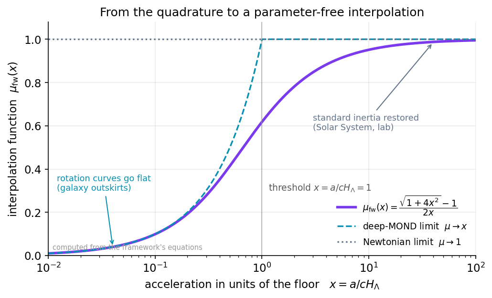

***Figure 15.3 — The same quadrature, read as inertia.*** Inverting the quadrature gives the framework's parameter-free interpolation function $\mu_{\rm fw}(x)=(\sqrt{1+4x^2}-1)/(2x)$ (purple), with $x=a/cH_\Lambda$. It follows the deep-MOND line $\mu\to x$ (teal dashed) at low acceleration — where rotation curves go flat — and climbs to the Newtonian value $\mu\to 1$ (grey dotted) at high acceleration, where standard inertia is restored. The form and the scale $cH_\Lambda$ are fixed here; the pure number converting $cH_\Lambda$ into the measured $a_0$ (the geometric $\kappa$) is not. Computed from the framework's equations.

**Source:** Figure generated by [`book/figures/ch15_interpolation_mu_fw.py`](https://github.com/carlzimmerman/zimmerman-formula/blob/main/book/figures/ch15_interpolation_mu_fw.py). The $\mu_{\rm fw}$ form is the framework's modified-inertia interpolation, spine paper [doi:10.5281/zenodo.20721540](https://doi.org/10.5281/zenodo.20721540), built on the modified-inertia program of Milgrom 1983 (ApJ 270, 365).

That is, I think, the right way to feel about this chapter's result. It is not nothing — connecting the galactic threshold to the temperature of empty space is a real and beautiful piece of physics if it holds, and the form really is forced. But it is not everything either. It is not a theory of everything yet, as frustrating as it may be. The floor tells you *that* there should be a threshold and roughly *where*; it does not hand you the exact number on a plate. Anyone who tells you a single clean idea has fully derived $a_0$ from dark energy is getting ahead of the evidence, and that includes me.

---

## A note on what is genuinely solid here

Because this chapter is the load-bearing physics of the whole framework, let me separate the layers one more time, plainly, so you carry the right confidence into Part 4 and Part 5.

**Rock solid, not in dispute, would be in any graduate textbook:**
- De Sitter space is the geometry of a Λ-dominated universe, and our universe is sliding toward it.
- It has a horizon — the Hubble horizon, $R_H = c/H_\Lambda$ — centered on every observer.
- That horizon has a temperature, the Gibbons–Hawking temperature $T_{\text{dS}} = \hbar H_\Lambda/2\pi k_B$, which is real, tiny, and never zero.
- An observer who *also* accelerates feels the two temperatures combined in quadrature (Deser–Levin), $2\pi k_B T_{\text{eff}}/\hbar c = \sqrt{a^2 + (cH_\Lambda)^2}$.

**The framework's proposal, well-motivated but not proven:**
- That this effective temperature should be read as a *modified inertia* (Chapters 20–21), so that the quadrature's threshold becomes the dynamical threshold $a_0$ we see in galaxies.
- That the resulting interpolation function $\mu_{\text{fw}}$ is the right curve, and that $cH_\Lambda$ is, up to the geometric factor $\kappa$, the measured $a_0$.

**Explicitly not claimed:**
- The chapter does *not* derive the value of $a_0$. It derives a *scale*, $cH_\Lambda$, and a *form*. The conversion factor is a posited geometric input handled in Chapter 23, not a result.
- Nothing here touches the Standard Model, particle masses, or lensing — those walls stand exactly where Chapters 27–30 leave them.

If you keep those three lists straight, you will read the rest of the book the way it's meant to be read: impressed by how much the temperature floor *organizes*, and clear-eyed about the one number it doesn't give you for free.

---

## Summary

- **De Sitter space** is the geometry of a universe whose only content is a cosmological constant Λ — pure dark energy. It expands exponentially forever, and our own universe is asymptotically becoming de Sitter as matter dilutes away.
- Such a universe has a **Hubble horizon** at radius $R_H = c/H_\Lambda$, a sphere centered on *every* observer, past which space recedes faster than light and nothing can be seen. The rate $H_\Lambda$ is the **de Sitter Hubble rate** set by dark energy alone, and the combination $cH_\Lambda$ has units of acceleration — a quiet preview of the framework's central scale.
- That horizon glows. The **Gibbons–Hawking temperature** $T_{\text{dS}} = \hbar H_\Lambda/2\pi k_B$ is the temperature of the de Sitter vacuum — real, quantum-mechanical, fantastically small (about $2\times 10^{-30}$ K for our universe), and crucially *never zero.* This is the **temperature floor**: empty space in a Λ-universe is never perfectly cold.
- An observer who *also* accelerates combines the two horizon temperatures **in quadrature** (Deser–Levin 1997): $2\pi k_B T_{\text{eff}}/\hbar c = \sqrt{a^2 + (cH_\Lambda)^2}$. At high acceleration this reduces to the Unruh effect; at low acceleration it bottoms out at the de Sitter floor. The crossover happens at the scale $cH_\Lambda$ — a natural **acceleration threshold**.
- Read as a statement about inertia (the framework's proposal, Chapters 20–21), this quadrature yields the framework's parameter-free **interpolation function** $\mu_{\text{fw}}(x) = (\sqrt{1+4x^2}-1)/(2x)$, with the correct deep-MOND ($\mu \to x$) and Newtonian ($\mu \to 1$) limits.
- **The honest ledger:** the geometry, the Gibbons–Hawking temperature, and the Deser–Levin quadrature are all established physics. Identifying that temperature with inertia is the framework's well-motivated hypothesis. And even granting it, this chapter delivers the *form* and the *scale* $cH_\Lambda$ of the acceleration threshold — *not* the precise value of $a_0$, whose final conversion factor is the posited geometric input $\kappa=\tfrac12$ of Chapter 23. Not a theory of everything yet, as frustrating as it may be — but a genuinely organizing piece of physics, honestly bounded.

---

## Questions

1. **(Easy.)** In your own words, why does a universe with only dark energy never get perfectly cold? What is the "temperature floor," and what sets its height?

2. **(Easy–medium.)** The Hubble horizon sits at $R_H = c/H_\Lambda$. Explain why an observer can never see a galaxy that lies beyond this distance, even though both the observer and the galaxy are made of perfectly ordinary matter and nothing is travelling through space faster than light.

3. **(Medium, computational.)** Using $H_\Lambda \approx 1.8\times 10^{-18}\ \text{s}^{-1}$, compute the acceleration scale $cH_\Lambda$ (with $c = 3.0\times 10^8$ m/s). Compare your answer to the observed MOND scale $a_0 \approx 1.2\times 10^{-10}$ m/s². By what numerical factor do they differ? (You have just rediscovered the size of the coefficient that Chapter 23's $\kappa$ must account for.)

4. **(Medium.)** Show that the de Sitter–Unruh quadrature $2\pi k_B T_{\text{eff}}/\hbar c = \sqrt{a^2 + (cH_\Lambda)^2}$ reduces to the plain Unruh result when $a \gg cH_\Lambda$ and to the bare Gibbons–Hawking temperature when $a \ll cH_\Lambda$. Why is "adding in quadrature" more physically reasonable here than simply adding the two temperatures?

5. **(Harder.)** Starting from the framework's interpolation function $\mu_{\text{fw}}(x) = (\sqrt{1+4x^2}-1)/(2x)$, verify the two limiting behaviours $\mu_{\text{fw}} \to x$ for $x \ll 1$ and $\mu_{\text{fw}} \to 1$ for $x \gg 1$. What does each limit correspond to physically — what kind of system is in each regime?

6. **(Research-level.)** This chapter is careful to say that the quadrature delivers the *form* and the *scale* of the acceleration threshold but not the precise value of $a_0$, because the final conversion factor (the geometric $\kappa$) is posited, not derived. Suppose a future calculation *did* derive $\kappa$ from first principles. Which of the framework's claims would that strengthen, and which would it leave entirely untouched? (Consider, in particular, the Standard-Model wall of Chapter 27 and the lensing wall of Chapter 28 — would deriving $\kappa$ help with either?)

# Chapter 16: Entropy, Horizons, and Holography

> *A black hole is the simplest object in the universe — and yet, to write down everything it has swallowed, nature seems to use the wall, not the room. That single strange fact is the seed of this chapter.*

We have spent the last two chapters learning two surprising things. In Chapter 14 we met the Unruh effect: accelerate through empty space and you feel a warmth that an unaccelerated observer right beside you does not. In Chapter 15 we met de Sitter space, a universe with a built-in temperature floor set by the cosmological constant Λ — the same Λ that, since 1998, we have called dark energy.

This chapter is about a third surprise, and it is the deepest of the three. It is the discovery that **information has a maximum density**, and that the limit is set not by how big a volume is but by how big its *surface* is. The universe, it turns out, may keep its books on surfaces rather than in volumes — like a library whose entire contents are written on the doors.

This is the idea called **holography**, and it is going to matter enormously to us. When we finally reach the framework at the heart of this book (Chapters 20–24), its one free number — the constant we will call κ, equal to one-half — will turn out not to be a free number at all in the usual sense, but a piece of pure *geometry*: the single-degree-of-freedom limit of a bound that comes straight out of this chapter. I am getting ahead of myself, and I will not pretend the payoff is here yet. But I want you to know, as we walk through entropy and horizons and holograms, that we are not on a detour. We are quarrying the stone we will later build with.

Let me say plainly, as I will at every turn in this book: the physics in *this* chapter — black-hole entropy, the holographic principle, the bound we will meet at the end — is mainstream, well-tested-where-it-can-be-tested, and not mine. What I will *do* with it later is mine, and is unproven, and I will flag that clearly when we get there. For now, we are learning the standard, beautiful, slightly unsettling story that the whole community shares.

---

## 16.1 What entropy actually is

The word **entropy** has a bad reputation. People say it means "disorder," and then they wave their hands at messy bedrooms and shuffled card decks, and you come away with a vague feeling that the universe is slowly going to pot. That picture is not wrong, exactly, but it is so blurry that it hides the one idea you actually need. So let me give you a sharper one.

Entropy is a count. Specifically, it counts *how many different ways the small-scale details of a thing could be arranged while the thing still looks the same on the large scale.*

Here is the everyday version. Imagine a chessboard, and imagine I tell you only one fact about it: "there are eight pieces on the board." That large-scale description — "eight pieces" — is compatible with an enormous number of detailed arrangements. The pieces could be in this square or that one, in thousands upon thousands of combinations, and every one of them matches my description. Now suppose instead I tell you: "every piece is on its starting square." That description is compatible with exactly *one* arrangement. The first description has high entropy; the second has low entropy. Same board, same pieces — the difference is purely in *how many detailed states match what I told you.*

That is entropy. It is a measure of *hidden information* — the information you would still need to be handed in order to know the exact microscopic state, given that you only know the big-picture state. High entropy means a lot is hidden. Low entropy means little is hidden.

Notice that nothing here is mystical, and nothing here is really about "mess." A shuffled deck has high entropy not because shuffling is morally disordered but because there are about $8 \times 10^{67}$ orderings of 52 cards and only one of them is "brand-new-deck order." When physicists say the entropy of a gas in a box is large, they mean exactly this: the positions and velocities of all those zillions of molecules could be arranged in a staggering number of ways, all of which give the same temperature and pressure you measure from outside.

> **Deeper Dive: Boltzmann's bridge.** The link between the microscopic count and the macroscopic quantity is Ludwig Boltzmann's formula, carved on his gravestone in Vienna:
> $$ S = k_B \ln W. $$
> Here $W$ is the number of microscopic states (microstates) compatible with the macroscopic state, $\ln$ is the natural logarithm, and $k_B = 1.38 \times 10^{-23}\ \mathrm{J/K}$ is Boltzmann's constant, which simply sets the units (joules per kelvin) so that this statistical entropy matches the thermodynamic entropy Clausius had defined a generation earlier from heat and temperature, $dS = \delta Q / T$.
>
> The logarithm is the crucial choice. It makes entropy *additive*: if system A can be in $W_A$ states and system B in $W_B$ states, the combined system can be in $W_A W_B$ states, and $\ln(W_A W_B) = \ln W_A + \ln W_B$. So the entropies add even though the state-counts multiply — exactly the behavior we want from an extensive quantity. The second law of thermodynamics, $dS \ge 0$ for an isolated system, is then almost a tautology dressed as a law: a system left alone wanders, overwhelmingly, toward the macrostates that the largest number of microstates happen to produce. It is not that order is forbidden; it is that disorder is more numerous.

For most of physics, that is the whole story, and it is a tidy one: entropy lives in *volumes*. Pour twice as much gas into a box twice as big at the same density, and you get twice the entropy. Entropy is *extensive* — it scales with the amount of stuff, which is to say with volume. Hold on to that expectation, because in a moment a black hole is going to violate it spectacularly, and the violation is the doorway to everything that follows.

---

## 16.2 The strange thermodynamics of a black hole

A black hole is, on its face, the simplest object in the universe. A theorem from the 1960s and 70s — physicists fondly call it the **"no-hair" theorem** — says that once a black hole has settled down, it is completely described by just three numbers: its mass, its electric charge, and how fast it spins. That's it. Two black holes with the same mass, charge, and spin are identical in every respect, no matter what fell in to make them — a star, a planet, a library of encyclopedias, your old homework. All the rich detail of whatever it ate is gone behind the **event horizon**, the surface of no return, the boundary beyond which not even light can climb back out.

And here is the puzzle that this simplicity creates. Suppose I take a box of hot gas — which has lots of entropy, lots of hidden information — and I drop it into a black hole. The gas is gone. Its entropy is gone with it, behind the horizon, where the no-hair theorem says only mass, charge, and spin survive. But the second law of thermodynamics says the entropy of the universe can never decrease. Have I just *destroyed* entropy by feeding it to a black hole? Could I run the world's tidiest cleaning service — throw all the universe's mess down a black hole and lower the total entropy, second law be damned?

In the early 1970s a graduate student named **Jacob Bekenstein** worried about exactly this, and he made a daring proposal. The entropy is not destroyed, he said. It is *paid for*. When the gas falls in, the black hole gets a little more massive, and a more massive black hole has a slightly *larger horizon*. Bekenstein's audacious claim was that **the black hole itself has an entropy, and that entropy is proportional to the area of its horizon.** Drop the gas in, the horizon grows, the black hole's entropy goes up — and it goes up by at least as much as the entropy you tried to hide. The books balance after all. The second law survives, in a generalized form: the *sum* of ordinary entropy outside plus horizon-area-entropy never decreases.

Let me make sure the strangeness lands. We just said entropy normally lives in volumes. But Bekenstein is saying the entropy of a black hole — the hidden-information content of the most information-rich object we know — is set by its **surface area**, the area of the horizon, not by the volume inside. Double the radius of a black hole, and its volume grows eightfold, but its area grows only fourfold, and its entropy grows... fourfold. The information scales with the wall, not the room.

That was a guess. It became physics a couple of years later, when **Stephen Hawking** — who initially set out to *disprove* Bekenstein — found that black holes are not entirely black. Applying quantum theory to the warped space just outside the horizon, Hawking discovered that a black hole glows, ever so faintly, with thermal radiation. It has a *temperature*. And the instant you grant that an object has a temperature and an energy (its mass, via $E = mc^2$), thermodynamics forces it to have a definite entropy — you can no longer wave it away. Hawking's calculation didn't just confirm Bekenstein's hunch; it nailed down the exact proportionality constant. The result is one of the most beautiful equations in all of physics.

> **Deeper Dive: The Bekenstein–Hawking entropy.** The entropy of a black hole horizon of area $A$ is
> $$ S_{\mathrm{BH}} = \frac{k_B\, c^3\, A}{4\, G\, \hbar}. $$
> Look at what is crammed into this one short formula. It contains $k_B$ from thermodynamics (heat and statistics), $c$ from relativity (spacetime), $G$ from gravity (Newton and Einstein), and $\hbar$ — Planck's constant — from quantum mechanics. **No other equation in physics ties all four of these fundamental constants together.** That is the signature of something deep: black-hole entropy is where thermodynamics, relativity, gravity, and quantum theory are all forced to speak at once.
>
> The companion result is the **Hawking temperature** of a (non-rotating, uncharged) black hole of mass $M$:
> $$ T_H = \frac{\hbar\, c^3}{8\pi\, G\, M\, k_B}. $$
> Note the inverse dependence on mass: *bigger black holes are colder.* A solar-mass black hole has a Hawking temperature of about $6\times10^{-8}$ K — sixty billionths of a degree above absolute zero, utterly swamped by the 2.7 K microwave background, which is why we cannot hope to observe it directly. The supermassive black hole at the center of our galaxy is colder still.
>
> It is illuminating to rewrite the entropy in **Planck units**. The Planck length $\ell_P = \sqrt{G\hbar/c^3} \approx 1.6\times10^{-35}\,\mathrm{m}$ is the natural length scale built from $G$, $\hbar$, and $c$ — roughly the scale at which spacetime itself is expected to become "grainy." In terms of it,
> $$ \frac{S_{\mathrm{BH}}}{k_B} = \frac{A}{4\,\ell_P^2}. $$
> Read that aloud: the entropy, in fundamental units, is *one quarter of the horizon area measured in Planck-sized tiles.* Tile the horizon with little squares each one Planck length on a side; count them; divide by four; that is the number of bits (more precisely, nats) of hidden information in the black hole. The information content of a black hole is literally a count of tiles on its surface. We do not, even now, fully understand *what* those tiles are counting — identifying the microstates behind $S_{\mathrm{BH}}$ is one of the central quests of quantum gravity, and string theory's partial success at it in 1996 was a landmark — but that the count goes as area, not volume, is rock-solid.

So the black hole, the simplest object in the universe, turns out to be the most information-dense object the universe permits — and it stores that information on its surface. This is not a metaphor and not a coincidence. It is a clue, and a generation of physicists read it as one.

---

## 16.3 The holographic principle: the universe keeps its books on surfaces

Here is the leap. If a *black hole* stores its maximum information on its boundary surface, what about an ordinary region of space — a sphere of air, a chunk of the galaxy, a piece of the cosmos? How much information can *it* hold?

The argument that answers this is so simple it feels like a trick, and yet it has survived decades of scrutiny. Suppose you want to pack as much information — as much entropy — as you possibly can into some region of space, say a sphere of a given size. You start stuffing it: more particles, more energy, more stuff, each addition raising the entropy. But here is the catch. Energy gravitates. Pack enough energy into a fixed region and, by general relativity, it must collapse into a black hole. You cannot pack any more in than that, because the moment you try, you have made a black hole that fills the region, and a black hole is the *densest possible* way to store information in that volume.

So the most information any region can hold is the information content of a black hole that just fills it — which, as we have just learned, is set by the *area of the boundary*, one bit per four Planck tiles. Push past that and the region collapses, the boundary itself grows, and you are simply in a bigger box.

The conclusion is the **holographic principle**, articulated by Gerard 't Hooft and sharpened by Leonard Susskind in the early 1990s:

> *The maximum amount of information that can be contained in any region of space is proportional to the area of the region's boundary, not its volume.*

I called this "keeping the books on surfaces," and I want to dwell on how genuinely bizarre it is. Your intuition — everyone's intuition — is that a big room holds more than a big wall, that "how much can fit in here" should grow like volume, like cubic meters. Holography says no: the ultimate limit grows like *area*, like square meters. A region twice as wide in every direction has eight times the volume but only four times the boundary area, and so it can hold at most four times the information, not eight. The deepest description of everything happening inside any region of space can, in principle, be written on its boundary — like a hologram, that shimmering credit-card sticker where a flat surface encodes a full three-dimensional image. Hence the name.

Now, an honest caution, because I promised you honesty both ways throughout this book. The holographic principle in this broad form is a *principle* — a deeply motivated, widely believed organizing idea — not a theorem you can prove from the ground up in any universe. Its one mathematically airtight, fully proven incarnation is a remarkable correspondence discovered by Juan Maldacena in 1997, in which a theory of gravity in a particular kind of (negatively curved, "anti-de Sitter") spacetime is shown to be *exactly equivalent* to an ordinary quantum theory living on its lower-dimensional boundary, with no gravity at all. That case is bulletproof. The trouble is that the spacetime it works in is *not* our universe — ours, with its positive Λ, its dark energy, is de Sitter-like, not anti-de Sitter-like, and a complete holographic description of a de Sitter universe is still an open problem at the frontier of the field. So: holography is one of the best-supported big ideas in theoretical physics, with one ironclad proven example, and it is *not yet* established as a theorem for the actual universe we live in. Both of those statements are true, and I will not let you leave this section believing only the flattering one.

> **Deeper Dive: From a fixed-area bound to the covariant Bousso bound.** The first sharp statement of holography as a bound was the **spherical entropy bound**: the entropy $S$ within a region enclosed by a surface of area $A$ obeys
> $$ S \le \frac{k_B\, c^3\, A}{4\, G\, \hbar} = \frac{k_B\, A}{4\, \ell_P^2}. $$
> This is just the Bekenstein–Hawking value acting as a ceiling for *everything*, not only black holes. But stated this way it is fragile: it implicitly assumes a static, weak-gravity situation, and one can cook up cosmological or collapsing configurations where a naive "entropy inside a volume" exceeds the area term and the bound appears to fail.
>
> Raphael Bousso resolved this in 1999 with the **covariant entropy bound** (the Bousso bound), which is the version professionals actually use. Instead of "entropy inside a volume at one instant," Bousso bounds the entropy crossing a particular kind of *light-sheet* — a surface swept out by light rays fired orthogonally inward from the boundary $A$, followed only as long as those rays are converging (non-expanding). The statement is
> $$ S[\text{light-sheet}] \le \frac{k_B\, c^3\, A}{4\, G\, \hbar}. $$
> The genius of the construction is that it is *covariant* (it does not depend on how you slice spacetime into "instants") and it gracefully handles strong gravity, cosmology, and collapse — precisely the cases where the naive volume-based bound breaks. The Bousso bound is the mature form of the holographic principle, and it is the one that any candidate theory of quantum gravity is expected to respect. For our purposes the headline survives all the technical care: *area, not volume, sets the ceiling on information.*

---

## 16.4 A different kind of horizon: the sky around us

Everything so far has been about black-hole horizons — surfaces that hide an interior from us. But back in Chapter 15 we met a horizon of a completely different character, and it is the one that will matter most for this book.

In a de Sitter universe — a universe driven by a cosmological constant, which to our best current knowledge *is* our universe on the largest scales — space expands so relentlessly that there is a maximum distance beyond which light emitted *now* can never reach us. Galaxies past that distance are being swept away by the expansion of space faster than their light can swim toward us. That boundary is the **cosmological horizon** (also called the de Sitter horizon), and it surrounds *us* — every observer sits at the center of their own. It is not the surface of some object out there; it is the edge of the observable, set by how fast the universe is flying apart.

Here is the beautiful and slightly vertiginous part. The same logic that gave a black-hole horizon a temperature and an entropy applies, almost word for word, to *this* horizon too. Gibbons and Hawking showed in 1977 that a de Sitter horizon also radiates at a temperature (the de Sitter temperature we met last chapter), and that it, too, carries an entropy proportional to its area. There is an entropy associated with *the sky*. There is a number that counts the hidden information on the boundary of everything we can, even in principle, ever see.

And that number is enormous.

> **Deeper Dive: The de Sitter entropy.** A de Sitter universe with Hubble parameter $H$ (the present-day expansion rate) has a horizon at radius $r_{\mathrm{dS}} = c/H$, the **Hubble radius**. Its horizon area is $A = 4\pi r_{\mathrm{dS}}^2 = 4\pi c^2/H^2$. Feeding this into the Bekenstein–Hawking formula gives the **de Sitter entropy**:
> $$ S_{\mathrm{dS}} = \frac{k_B\, c^3}{4\, G\, \hbar}\, A = \frac{\pi\, k_B\, c^5}{G\, \hbar\, H^2}. $$
> A useful way to write it, stripping the constants down to a count, is
> $$ \frac{S_{\mathrm{dS}}}{k_B} \;\sim\; \frac{c^5}{G\,\hbar\,H^2} \;=\; \frac{1}{\ell_P^2\,H^2/c^2} \;=\; \left(\frac{r_{\mathrm{dS}}}{\ell_P}\right)^2, \quad\text{up to a factor of }\pi.$$
> In words: the entropy of the cosmological horizon, in fundamental units, is the *square of the Hubble radius measured in Planck lengths* — exactly what holography demands, since it is an area in Planck tiles.
>
> Now put the numbers in. The Hubble radius is about $1.3\times10^{26}\,\mathrm{m}$; the Planck length is $1.6\times10^{-35}\,\mathrm{m}$; their ratio is around $8\times10^{60}$, and squaring it gives
> $$ S_{\mathrm{dS}} \;\sim\; 10^{122}\, k_B. $$
> This is, by an astronomical margin, **the largest entropy in the observable universe** — larger than the entropy of all the black holes, all the stars, all the radiation, everything, combined. The universe's bookkeeping, if holography is right, is dominated overwhelmingly by what is written on the sky. And notice the chain of dependence: $S_{\mathrm{dS}} \propto 1/H^2 \propto 1/\Lambda$, because in de Sitter space $\Lambda = 3H^2/c^2$. The cosmological horizon's gigantic entropy is set, directly, by the smallness of the cosmological constant. Dark energy and horizon entropy are two readings of the same dial. **Hold that thought** — it is the hinge on which a later chapter turns.

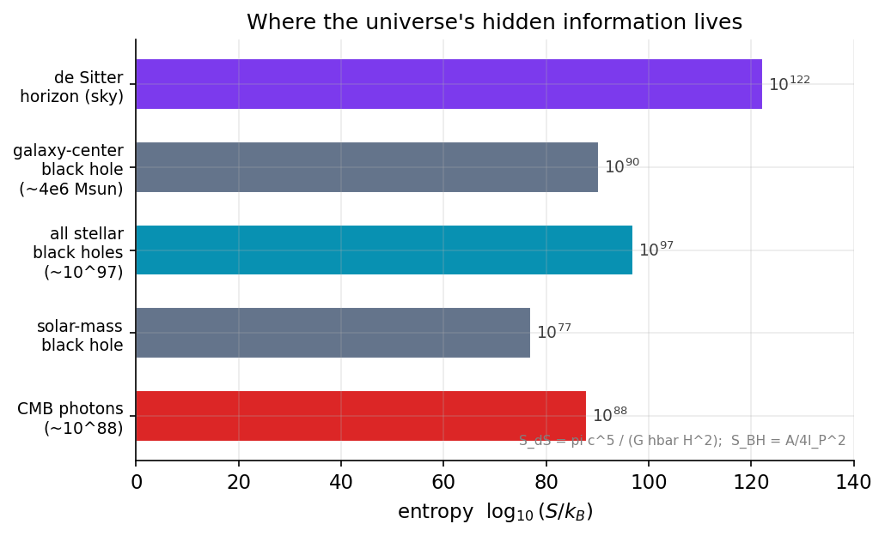

***Figure 16.3 — The entropy of the sky dwarfs everything else.*** Order-of-magnitude entropies, $\log_{10}(S/k_B)$, computed from the chapter's formulas. A solar-mass black-hole horizon ($\sim10^{77}$), a supermassive one ($\sim10^{90}$–$10^{91}$), and rough mainstream tallies for the CMB photons and all stellar black holes are all buried beneath the **de Sitter cosmological horizon** at $S_{\mathrm{dS}}=\pi k_B c^5/G\hbar H^2\sim10^{122}$ (purple). Because $\Lambda=3H^2/c^2$, that towering number is set directly by the *smallness* of the cosmological constant: dark energy and horizon entropy are one dial read two ways.

**Source:** Figure generated by [`book/figures/ch16_desitter_entropy_hierarchy.py`](https://github.com/carlzimmerman/zimmerman-formula/blob/main/book/figures/ch16_desitter_entropy_hierarchy.py). de Sitter horizon entropy: Gibbons & Hawking 1977; Bekenstein 1973, PRD 7, 2333; Hawking 1975, CMP 43, 199. Cosmological-constant / dark-energy value: Planck 2018 results VI, A&A 641, A6 (arXiv:1807.06209).

I want to pause and let the size of $10^{122}$ register, because it is easy to skate over a number like that. If you wrote one zero per second, it would take you longer than the present age of the universe to write out this number's zeros — and you would need to do it about three thousand times over. That is how much hidden information is, in principle, encoded on the boundary of the observable cosmos. It is the biggest number that nature routinely hands a physicist, and it falls right out of the area of the sky.

---

## 16.5 The Cohen–Kaplan–Nelson bound: when the very big constrains the very small

We come now to the last idea in this chapter, and the most important one for the work ahead. It has a clunky name — the **Cohen–Kaplan–Nelson bound**, after the three physicists, Andrew Cohen, David Kaplan, and Ann Nelson, who introduced it in 1999 — so let me first tell you what it *does*, because what it does is genuinely surprising.

It connects the largest scale in physics to the smallest. It is a **UV–IR bound** — a piece of jargon worth unpacking, because the phrase will recur. In physics, "UV" (ultraviolet) is shorthand for *short distances, high energies* — the realm of the very small. "IR" (infrared) is shorthand for *long distances, low energies* — the realm of the very large. Normally we treat these as utterly separate: what the universe does on cosmic scales (IR) surely has nothing to say about what happens between two particles a billionth of a billionth of a meter apart (UV). The Cohen–Kaplan–Nelson bound says that assumption is *wrong* — that, because of gravity and holography together, the size of the whole region you're in (an IR quantity) places a hard ceiling on how much short-distance, high-energy activity (UV) you are allowed to cram into it.

The reasoning, once again, is disarmingly simple, and it is the same black-hole argument we have already used, turned to a new purpose. Take a region of size $L$. Quantum field theory, left to its own devices, wants to fill that region with energy — vacuum fluctuations at ever-shorter wavelengths, each contributing energy, with no obvious limit as you go to shorter and shorter distances. But there *is* a limit, and gravity sets it: if you let the energy in a region of size $L$ get too large, the whole region collapses into a black hole. So a region of size $L$ that has *not* collapsed cannot contain more energy than a black hole of that size. That is the entire idea. The long-distance fact "my region is of size $L$" forbids the short-distance excess "too much vacuum energy," on pain of gravitational collapse.

> **Deeper Dive: The CKN bound and its cosmological saturation.** Cohen, Kaplan, and Nelson proposed that, for an effective quantum field theory in a region of size $L$ with a short-distance (UV) energy cutoff $\Lambda_{\mathrm{UV}}$, the two scales are not independent: the total vacuum energy must not be so large as to have already formed a black hole of size $L$. Writing the reduced Planck mass as $M_P$, the requirement that the energy $\rho L^3$ in the region stay below the mass of a black hole of radius $L$ (whose mass goes as $L\,M_P^2$ in natural units) gives the **CKN relation**
> $$ \rho\, L^3 \;\lesssim\; \frac{L}{2}\, M_P^2 \qquad\Longleftrightarrow\qquad \rho \;\lesssim\; \frac{M_P^2}{2\,L^2}. $$
> The factor of one-half is the same Schwarzschild $\tfrac{1}{2}$ that relates a black hole's mass to its horizon radius ($r_s = 2GM/c^2$, so $M = \tfrac{1}{2}\,r_s c^2/G$) — *remember where that one-half comes from; it will return.*
>
> The bound becomes a near-*equality* — it is **saturated** — when the IR scale $L$ is taken to be the size of the observable universe itself, $L \sim c/H$, the Hubble radius. Setting $L \sim c/H$ and reading off the largest allowed UV cutoff:
> $$ \Lambda_{\mathrm{max}} \;\sim\; \sqrt{M_P\, H}\,, $$
> a beautiful *geometric mean* of the smallest and largest scales in nature — the Planck mass and the Hubble rate, married. Most remarkably, when CKN plugged in the numbers, the vacuum energy density permitted by their bound at $L \sim c/H$ came out at $\rho \sim M_P^2 H^2$ — *the observed order of magnitude of the dark-energy density.* The bound that forbids a region from collapsing, applied to the whole observable universe, lands near the actual value of Λ. This is one of the very few arguments in physics that gets the dark-energy scale in the right ballpark from first principles rather than putting it in by hand, and it is mainstream, sober, and not mine.
>
> A clean way to see why the bound *saturates* at the horizon: a generic effective field theory in a box of size $L$ has, by holography, an entropy that should not exceed the Bekenstein bound $S \lesssim (L/\ell_P)^2$. But a thermal field theory's own entropy in that box scales as $S_{\mathrm{QFT}} \sim (L\,\Lambda_{\mathrm{UV}})^3$ in natural units. Demanding $S_{\mathrm{QFT}} \lesssim (L/\ell_P)^2$ — that the field theory not over-fill its own holographic ledger — *also* yields $\Lambda_{\mathrm{UV}} \lesssim \sqrt{M_P/L}$, and at $L\sim c/H$ this is the CKN cutoff again. The cosmological horizon's entropy budget, $S_{\mathrm{dS}}\sim 10^{122}$, is exactly the ledger the field theory is forbidden to overdraw. Holography, the de Sitter entropy, and the CKN bound are three faces of one fact.

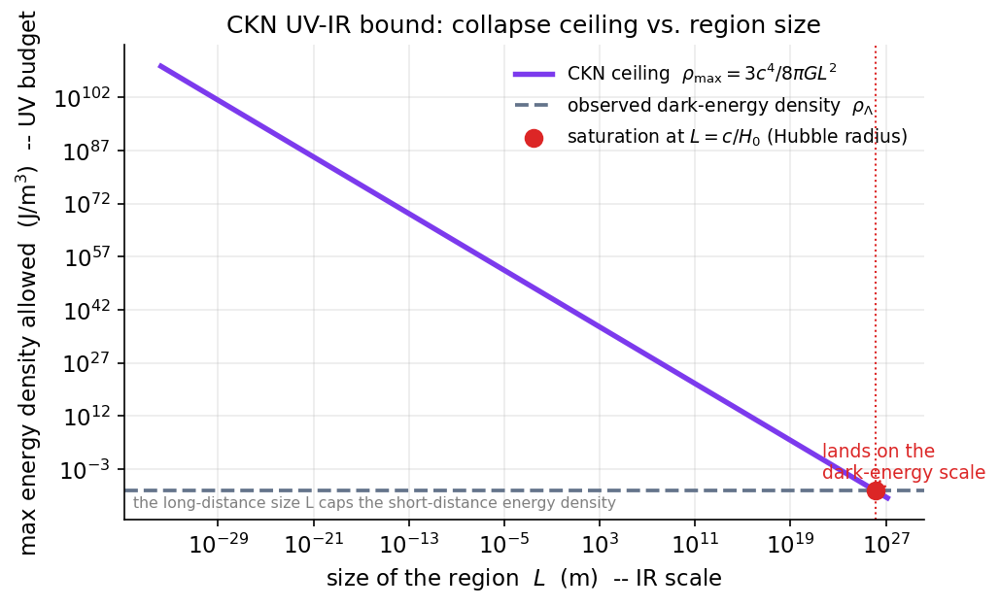

***Figure 16.2 — The Cohen–Kaplan–Nelson bound: the very big constrains the very small.*** The maximum energy density a region of size $L$ can hold without collapsing into a black hole, $\rho_{\max} = 3c^4/8\pi G L^2$ (purple), falls as $1/L^2$ from near the Planck density at tiny scales down across sixty orders of magnitude. Computed from the chapter's collapse argument. When $L$ is taken to be the Hubble radius $c/H_0$ (red marker), the ceiling lands exactly on the observed dark-energy density $\rho_\Lambda$ — a rare first-principles estimate of the $\Lambda$ scale, and the geometric hinge the framework will later lean on for $\kappa=\tfrac12$. The dashed grey line marks the present-day dark-energy density for comparison.

**Source:** Figure generated by [`book/figures/ch16_ckn_uvir_bound.py`](https://github.com/carlzimmerman/zimmerman-formula/blob/main/book/figures/ch16_ckn_uvir_bound.py). CKN UV–IR bound: Cohen, Kaplan & Nelson 1999, PRL 82, 4971 (arXiv:hep-th/9803132); dark-energy scale: Riess et al. 1998, AJ 116, 1009; Perlmutter et al. 1999, ApJ 517, 565. Framework use of this bound for $\kappa$: [`KAPPA_FORCING_DOOR_CLOSED_2026-06-17.md`](https://github.com/carlzimmerman/zimmerman-formula/blob/main/opus_48_extended_research/reviews/KAPPA_FORCING_DOOR_CLOSED_2026-06-17.md), https://doi.org/10.5281/zenodo.20738055.

Let me draw the three threads of this chapter together, because they have quietly converged. We found that **information goes as area** (Bekenstein–Hawking). We found that this makes **area the ceiling on information in any region** (holography, Bousso). And we have now found that this ceiling, applied to the whole observable universe, **ties the largest scale to the smallest and lands near the dark-energy density** (Cohen–Kaplan–Nelson). The de Sitter entropy $S_{\mathrm{dS}} \sim 10^{122}$ is the single number sitting at the meeting point of all three — the size of the holographic ledger for the entire sky.

---

## 16.6 Why we built all this: a promise, kept honestly

I told you at the start that we were quarrying stone, not wandering. Let me now say — carefully, and with the caveats that this book insists on everywhere — what we are going to do with these ideas, so that this chapter has a destination even though the destination itself lies several chapters off.

The framework at the center of this book proposes that the galactic acceleration scale $a_0$ — the mysterious threshold, about $10^{-10}\,\mathrm{m/s^2}$, below which gravity seems to behave anomalously, which we will build up properly in Chapters 17–22 — is set by dark energy, through a relation of the form $a_0 = c^2\sqrt{\Lambda/32\pi}$. Inside that expression sits a single dimensionless number, which we will call $\kappa$ and which works out to one-half. When we reach Chapter 23, I will argue that this $\kappa = \tfrac{1}{2}$ is **not a free fitting parameter at all, but pure geometry** — that it is precisely the *single-degree-of-freedom limit* of the Cohen–Kaplan–Nelson bound you have just met, with its Schwarzschild one-half, married to the de Sitter entropy you have just computed.

I am going to be scrupulous about what that does and does not mean, here and there both. What it would mean, if it holds up, is that the framework has *one fewer free knob* than it first appears — that the number $\kappa$ is fixed by the geometry of horizons rather than tuned to fit galaxies. What it would *not* mean — and I want this stated plainly now, long before the temptation to overclaim arrives — is that the *value* of $a_0$ has been derived from nothing. It has not, and it will not be. The value of $a_0$ still rests on $\kappa$ being a geometric posit, and on Λ being measured rather than predicted. This framework is **not a theory of everything yet, as frustrating as it may be.** The Standard Model of particle physics is left entirely untouched by everything in this book; no particle mass, no coupling, no Koide relation, nothing of the sort is derived here. What this chapter buys us is one specific, checkable claim — that a particular one-half is geometry and not freedom — and that claim, like every claim in this book, will be laid out with its supports *and* its gaps both showing.

That is the promise. The ideas in this chapter — Bekenstein–Hawking entropy, holography, the CKN bound, the de Sitter entropy — are the standard, shared, well-grounded physics on which that later argument will stand. They are not controversial; the use I will later put them to is mine and is unproven, and I will tell you so again when we get there. For now, it is enough that you have met them, and that you can feel the strange and lovely shape of the thing: a universe that, on its largest scales, seems to keep its books on the sky.

---

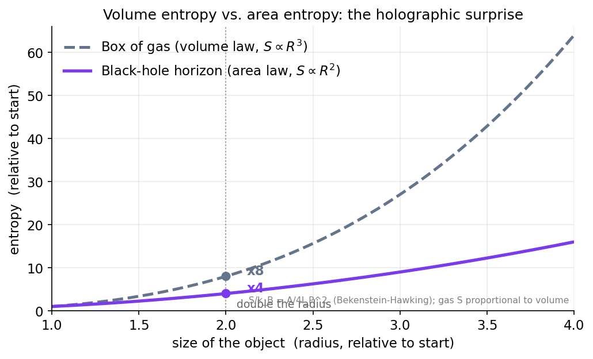

***Figure 16.1 — Why a black hole keeps its books on the wall, not the room.*** Two ways an object's entropy can grow as you double its size. A box of gas at fixed density (grey, dashed) scales with *volume*, $\propto R^3$; a black hole's Bekenstein–Hawking entropy $S/k_B = A/4\ell_P^2$ (purple) scales with horizon *area*, $\propto R^2$. Computed directly from the chapter's formulas, plotted as a ratio to each quantity's value at the left edge so the two scalings can be read off the same axis — double the radius and the gas entropy grows 8-fold, the black-hole entropy only 4-fold. The information scales with the wall, not the room.

**Source:** Figure generated by [`book/figures/ch16_area_vs_volume_entropy.py`](https://github.com/carlzimmerman/zimmerman-formula/blob/main/book/figures/ch16_area_vs_volume_entropy.py). Bekenstein–Hawking area law: Bekenstein 1973, PRD 7, 2333; Hawking 1975, CMP 43, 199.

## Summary

- **Entropy is hidden information** — a count, via Boltzmann's $S = k_B \ln W$, of how many microscopic arrangements match a given large-scale description. For ordinary matter it scales with *volume*.
- **A black hole breaks that expectation.** Its entropy, the **Bekenstein–Hawking entropy** $S_{\mathrm{BH}} = k_B c^3 A / 4G\hbar$, scales with the *area* of its horizon — one quarter of a bit per Planck-sized tile. The formula is unique in tying together $k_B$, $c$, $G$, and $\hbar$, the constants of thermodynamics, relativity, gravity, and quantum theory all at once. Hawking's discovery that black holes radiate at temperature $T_H \propto 1/M$ made this thermodynamics real.
- **The holographic principle** generalizes this: the maximum information in *any* region is set by the area of its boundary, not its volume, because cramming in more energy than a black hole of that size would hold makes the region collapse. The **Bousso (covariant entropy) bound** is its mature, slice-independent form. Holography is rigorously proven only in the (non-physical) anti-de Sitter case; for our de Sitter universe it remains a deeply motivated open problem — strong, but *not yet* a theorem.
- **The de Sitter (cosmological) horizon** that surrounds every observer in an accelerating universe also carries an entropy, $S_{\mathrm{dS}} = \pi k_B c^5 / G\hbar H^2 \sim 10^{122}\,k_B$ — the largest entropy in the cosmos. Because $\Lambda = 3H^2/c^2$, this entropy is set directly by the smallness of the cosmological constant: dark energy and horizon entropy are one dial read two ways.
- **The Cohen–Kaplan–Nelson (UV–IR) bound** ties the largest scale to the smallest: a region of size $L$ cannot hold more energy than a black hole that size, giving $\rho \lesssim M_P^2/2L^2$. Saturated at the Hubble radius, it yields $\Lambda_{\mathrm{max}} \sim \sqrt{M_P H}$ and lands near the observed dark-energy density — a rare first-principles estimate of the Λ scale, and entirely mainstream.
- **The payoff is deferred, honestly.** These ideas are the foundation for a later claim (Chapter 23) that the framework's one free number, $\kappa = \tfrac12$, is the single-degree-of-freedom limit of the CKN bound — pure geometry, not a fitting parameter. That would remove a knob; it would *not* derive the value of $a_0$, and it leaves the Standard Model entirely untouched. **Not a theory of everything yet, as frustrating as it may be.**

---

## Questions

1. **(Easy.)** In your own words, why does a shuffled deck of cards have higher entropy than a brand-new deck, even though both contain exactly the same 52 cards? What is being "counted"?

2. **(Easy–medium.)** A black hole's entropy scales with the *area* of its horizon, while a box of gas has entropy scaling with its *volume*. If you double the radius of each (keeping the gas at the same density), by what factor does each one's entropy grow? Why does this difference hint that something unusual is going on with gravity and information?

3. **(Medium.)** Using $S_{\mathrm{BH}}/k_B = A/4\ell_P^2$ with $\ell_P \approx 1.6\times10^{-35}$ m, estimate the entropy of a black hole whose horizon radius is 3 km (roughly a solar-mass black hole). Compare your answer, in order of magnitude, to the de Sitter entropy $\sim10^{122}$. What does the comparison tell you about where most of the universe's entropy "lives"?

4. **(Medium–hard.)** The holographic principle says the maximum information in a region grows with boundary area, not volume. Explain the gravitational-collapse argument behind this in two or three sentences. Then explain why the *Bousso* (covariant) version was needed instead of the simple "entropy inside a volume" statement — what kind of situation breaks the naive version?

5. **(Hard / conceptual.)** The Cohen–Kaplan–Nelson bound is called a "UV–IR" bound. Define UV and IR in this context, and explain precisely how a long-distance (IR) fact — the size of the region you occupy — ends up constraining a short-distance (UV) quantity. Why is it surprising that these two should be linked at all?

6. **(Research-level / open-ended.)** The de Sitter entropy obeys $S_{\mathrm{dS}} \propto 1/\Lambda$, so the largest entropy in the universe is set by the *smallest* energy density we know of, dark energy. This chapter hinted that the framework will later use the CKN bound and this de Sitter entropy to argue that a certain factor of one-half ($\kappa$) is "pure geometry." Before reading Chapter 23: what would you, as a skeptic, demand of such an argument before you'd accept that $\kappa$ is *forced by geometry* rather than *chosen to fit the data*? List the specific things that would have to be true. (Keep your list; we will check the framework's actual argument against it.)

# Chapter 17: Milgrom's Idea: Modifying Dynamics Below a₀

> *What if the galaxies aren't hiding extra matter from us — what if, instead, they're showing us that the rule book changes when the pull gets faint enough? It's a daring thought. Let's see how far one number can carry it.*

## A different question

In the chapters behind us, we built up a puzzle and started down one of the two roads out of it. We weighed galaxies the way Newton taught us (Chapters 2 and 4), we watched their outskirts spin far too fast for the matter we can see (Vera Rubin's flat rotation curves, Chapter 4), and we met the two great answers physics has offered: a new *particle* nobody has caught (Chapter 6), or a new *law* (the fork of Chapter 5). This chapter is about the boldest version of the second road.

It is the idea of a single physicist, working mostly alone, who in 1983 asked a question that sounds almost childish until you realize how carefully it has to be posed:

**What if gravity — or inertia — simply works differently when accelerations get extraordinarily small?**

Not "differently far away." Not "differently in galaxies." Those would be cheating; they'd be rules that know where they are, and nature's rules never know where they are. The proposal had to be cleaner than that. It had to be a rule that depends only on a *local* quantity — something you could measure right where you're standing, without knowing whether you're in a galaxy, a cluster, or the lab. Milgrom's choice for that local quantity was **acceleration**: how hard something is changing its motion, measured in meters per second, per second.

His claim, stripped to its bones, was this. There is a special acceleration in nature — call it **a₀** (read "a-naught"), the **acceleration scale**. Above it, everything works exactly as Newton said, and we never would have noticed anything was wrong. Below it — in the gentle, almost-imperceptible tugs felt in the outer reaches of galaxies — the relationship between force and motion changes, and changes in a way that makes the extra matter unnecessary.

That's the whole seed. The rest of this chapter is about how astonishingly small a₀ turns out to be, how one number does the work of a galaxy's worth of invisible matter, and — because this is a both-ways book — exactly where the idea is strong and exactly where it strains.

## How small is small?

Before any equations, let's get a feel for the number, because the feel is the whole point.

The acceleration scale a₀ is about

$$a_0 \approx 1.2 \times 10^{-10} \ \text{m/s}^2.$$

That string of zeros is hard to hold in your head, so let's translate it into something human.

Imagine a car speedometer. Now imagine you press the gas so gently that the needle takes the **entire age of the universe** — about fourteen billion years — to climb from zero to a normal highway speed. The acceleration you'd be applying is roughly a₀. It is, to a very good approximation, the smallest steady push that means anything at all in the cosmos.

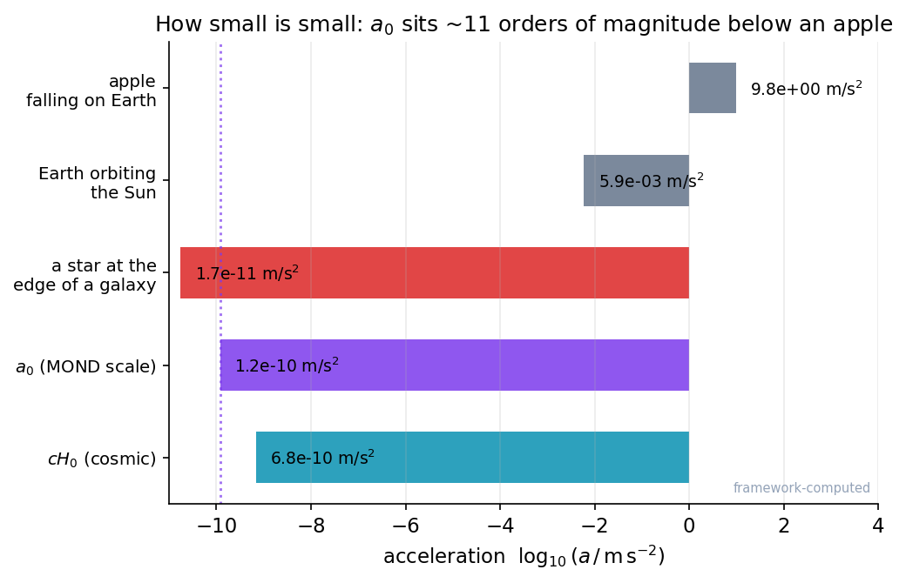

***Figure 17.3 — How small is small.*** A logarithmic ladder of accelerations, every value computed from elementary formulas or hardcoded constants. A dropped apple feels about 9.8 m/s$^2$; the Earth's pull toward the Sun is millions of times gentler; a star at the edge of a galaxy drifts at only a few times $a_0$. The MOND scale $a_0\approx1.2\times10^{-10}$ m/s$^2$ (purple) sits roughly eleven orders of magnitude below the apple — and tantalisingly close to the cosmic combination $cH_0$ (teal), the coincidence the rest of the book pursues. This is why no laboratory had ever visited the regime where MOND-like behaviour would show up. Computed from standard physics; the galaxy-edge and $cH_0$ values are illustrative order-of-magnitude estimates.

**Source:** Figure generated by [`book/figures/ch17_acceleration_ladder.py`](https://github.com/carlzimmerman/zimmerman-formula/blob/main/book/figures/ch17_acceleration_ladder.py). $a_0$ value: Milgrom 1983, ApJ 270, 365 / Famaey & McGaugh 2012 (arXiv:1112.3960); the $a_0\sim cH_0$ coincidence and its framework interpretation: [Zenodo 10.5281/zenodo.20721540](https://doi.org/10.5281/zenodo.20721540).

Here's another way in. On Earth's surface, gravity accelerates a dropped apple at about 9.8 m/s². The acceleration at the edge of a galaxy, where the stars are drifting along their slow enormous orbits, is something like a hundred billion times *gentler* than that. We have never built a laboratory that can hold a constant push that small for long enough to test what happens there. The deep space between the stars is the only laboratory low enough — and the galaxies are the experiment, already running, for billions of years.

So Milgrom's proposal lives in a corner of nature we had simply never visited when Newton wrote down his laws. Newton tested his rules on falling apples, swinging pendulums, the Moon, the planets. Every one of those sits at accelerations *vastly* larger than a₀. Newton's law, in other words, was only ever checked in the regime where — if Milgrom is right — it happens to look exactly correct. The new behavior was hiding in a basement of gentleness we had no key to.

> **A margin aside.** This is worth sitting with for a moment. When we say a law of physics is "well tested," we always mean *well tested in the conditions we could reach.* Newtonian gravity is confirmed to exquisite precision — in the Solar System, at accelerations enormously above a₀. That tells us nothing, by itself, about what happens a hundred billion times softer. Milgrom's wager is that the softness is exactly where the surprise lives. He might be wrong. But the wager is not unreasonable, and that distinction matters.

## One number, and the rotation curves fall into place

Now, why this number? Why 1.2 × 10⁻¹⁰ and not something else? Here is the honest answer, and it is the same honesty we'll demand of our own framework later in the book: **a₀ was read off the data.** Milgrom looked at the rotation curves of galaxies and asked what value of the scale would make them work, and this is the value that did. It is a *fit*, not a derivation. (Hold onto that thought. One of the central questions of this entire book — the question Part 5 is built around — is whether that number can be understood as something deeper than a fit. Milgrom himself, decades ago, noticed that a₀ is suspiciously close to certain cosmic quantities, and we will spend real time on that coincidence. But in 1983, and for the purposes of this chapter, it is simply a number that fits.)

What's remarkable is how *much* one fitted number buys you.

Recall the problem from Chapter 4. A star orbiting in the flat outer part of a galaxy moves at some speed v. For a circular orbit, Newton says the inward gravitational acceleration g must exactly supply the turning:

$$g = \frac{v^2}{r},$$

where r is the distance from the galaxy's center. If gravity came only from the visible matter (call that acceleration $g_N$, the **Newtonian** value, the "N" for Newton), then far from the bright central bulge $g_N$ should fall off like $1/r^2$ — and the orbital speed should *drop* as you go out, the way Neptune crawls along far more slowly than Mercury. Instead, the speed goes flat. The stars at the edge move just as fast as the stars halfway out. Something is propping up the curve.

Milgrom's fix is to say that the *true* acceleration g a star feels is not equal to the Newtonian $g_N$ once $g_N$ sinks below a₀. In the deep, gentle regime, his rule becomes beautifully simple:

$$g = \sqrt{g_N \, a_0} \qquad (\text{when } g_N \ll a_0).$$

Look at what that does. The true acceleration is now the *geometric mean* of the Newtonian value and the fixed scale a₀ — it's boosted, and crucially it falls off more slowly. Out in the galaxy's skirts, the visible matter's pull goes as $g_N \propto M/r^2$ (M is the enclosed mass), so

$$g = \sqrt{g_N \, a_0} = \sqrt{\frac{GM}{r^2} \cdot a_0} = \frac{\sqrt{GM a_0}}{r}.$$

Set that equal to the orbital requirement $v^2/r$:

$$\frac{v^2}{r} = \frac{\sqrt{GM a_0}}{r}.$$

The r's cancel — both sides have one — and we are left with

$$v^2 = \sqrt{GM a_0}, \qquad \text{so} \qquad v^4 = G M a_0.$$

Read that last line slowly, because it is one of the most quietly stunning results in this part of the book. **The orbital speed in the outer galaxy does not depend on r at all.** It depends only on the total mass and a couple of constants. The rotation curve goes *flat* — automatically, for free, with no dark matter — the instant you accept that gravity follows $\sqrt{g_N a_0}$ in the gentle regime. The thing that took a whole invisible halo of particles to explain on the other road falls out of a single algebraic line on this one.

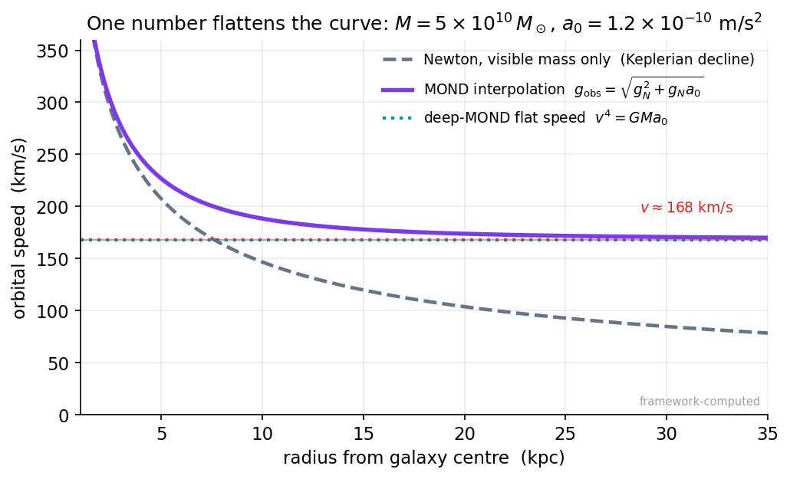

***Figure 17.1 — One fitted number flattens the curve.*** For the chapter's worked-example spiral ($M=5\times10^{10}\,M_\odot$), the grey dashed line is the speed Newton predicts from the visible matter alone — it falls off, Keplerian, just like the planets. The purple curve uses the MOND interpolation $g_{\rm obs}=\sqrt{g_N^2+g_N a_0}$ with a single universal $a_0$, and it goes flat near 168 km/s; the teal dotted line is the deep-MOND limit $v^4=GMa_0$ that the flat speed approaches. No dark-matter halo and no radius were chosen. Computed entirely from the framework's equations.

**Source:** Figure generated by [`book/figures/ch17_flat_rotation_curve.py`](https://github.com/carlzimmerman/zimmerman-formula/blob/main/book/figures/ch17_flat_rotation_curve.py). Underlying physics: Milgrom 1983, ApJ 270, 365; the $g_{\rm obs}=\sqrt{g_N^2+g_N a_0}$ interpolation is the form the framework's de Sitter–Unruh argument hands it ([Zenodo 10.5281/zenodo.20721540](https://doi.org/10.5281/zenodo.20721540)).

And there's a bonus hiding in $v^4 = GMa_0$. It says the fourth power of the speed is proportional to the mass. Galaxies obey exactly such a relation — brighter, more massive galaxies spin faster, with $v^4 \propto M$ — and it is so tight and so famous it has its own name, the **baryonic Tully–Fisher relation**. We will give it its own chapter (Chapter 18), because it is one of the two great regularities that any theory of this stuff has to explain. For now, just notice: it isn't an extra assumption Milgrom had to add. It *came out*. One number in; flat curves and the Tully–Fisher relation both out.

> **A margin aside.** When a single idea explains two things you didn't build it to explain, physicists sit up. That doesn't make the idea *true* — many beautiful ideas are wrong — but it is the kind of "more out than in" that earns a theory a serious hearing. MOND has earned its hearing. Whether it has earned more than that is the careful work of the chapters ahead.

## Naming the idea: MOND

The proposal has a name. Milgrom called it **MOND**, for **MO**dified **N**ewtonian **D**ynamics. The name is honest about its ambition and its limits: it modifies *Newtonian* dynamics — Newton's relationship between force, mass, and motion — in a specific regime, and it does so by *dynamics*, by changing the rule of motion itself rather than by adding new stuff to push on.

It's worth pausing on the word *dynamics*, because it carries the deepest and most slippery question in the whole subject — one we'll return to again and again. When the rotation curve comes out flat, *what exactly changed?* There are two ways to read Milgrom's rule, and they are genuinely different physics:

1. **Maybe gravity got stronger.** Perhaps in the gentle regime, a given lump of mass pulls *harder* than Newton's $GM/r^2$ — the force of gravity itself is modified. This is the **modified-gravity** reading.

2. **Maybe inertia got weaker.** Perhaps gravity is exactly as Newton said, but the *resistance* of an object to being accelerated — its **inertia**, the stubbornness we met in Chapter 13 — *decreases* when the acceleration is very small. A weaker resistance means a given pull produces a bigger response, which looks, from the outside, exactly like a stronger pull. This is the **modified-inertia** reading.

From a single rotation curve, you cannot tell these apart. A flat curve is a flat curve. But they are not the same theory, and the difference will matter enormously when we get to our own framework — because the de Sitter–Unruh proposal at the heart of this book is a **modified-inertia** idea (Chapter 21), and that choice, as we'll see, is exactly what lets it stay safe in the Solar System where modified-gravity versions get into trouble. So file the distinction away now. Milgrom's $g = \sqrt{g_N a_0}$ is a *symptom*. The disease — gravity or inertia — is a separate diagnosis.

> **Deeper Dive: The interpolation function μ(a/a₀).**
>
> The single formula $g=\sqrt{g_N a_0}$ only holds in the *deep* limit. Milgrom's full prescription has to do two jobs at once: reproduce ordinary Newtonian physics where accelerations are large (or every planet and pendulum would be wrong), and bend toward the deep-MOND behavior where they are small. He stitched the two regimes together with a single dimensionless function, the **interpolation function** μ ("mu"). In its original modified-inertia phrasing, the law reads
>
> $$\mu\!\left(\frac{a}{a_0}\right)\, a \;=\; g_N,$$
>
> where $a=|\mathbf{a}|$ is the magnitude of the true acceleration and $g_N$ is the ordinary Newtonian gravitational field sourced by the visible mass. The function μ is required to have two limits, and *only* its limits are fixed by the data:
>
> $$\mu(x) \to 1 \quad \text{for } x \gg 1 \qquad (\text{Newtonian regime, } a\gg a_0),$$
> $$\mu(x) \to x \quad \text{for } x \ll 1 \qquad (\text{deep-MOND regime, } a\ll a_0).$$
>
> Check the limits. When $a \gg a_0$, $\mu\to 1$ and the law collapses to $a=g_N$ — pure Newton, exactly as required so the Solar System is untouched. When $a\ll a_0$, $\mu\to a/a_0$ and the law becomes $(a/a_0)\,a = g_N$, i.e. $a^2 = g_N a_0$, i.e. $a=\sqrt{g_N a_0}$ — the deep-MOND formula we derived above.
>
> The shape of μ *between* the limits is not specified by the theory. It is an empirical free function — a real and honest weakness. Common choices include the "simple" form $\mu(x)=x/(1+x)$ and the "standard" form $\mu(x)=x/\sqrt{1+x^2}$, and astronomers pick whichever best fits a given data set. There is no first-principles reason for one over another. This freedom in the *interpolation* — not in a₀, which is a single fixed number, but in the *function that joins the regimes* — is something to keep in mind throughout Part 4 and Part 5. Our own framework will arrive at a *particular* interpolation from a physical argument rather than choosing one by hand, which is a genuine point in its favor; but it is not a theory of everything yet, as frustrating as it may be, and the cleanness of one regime should never be oversold as if it settled the whole function.

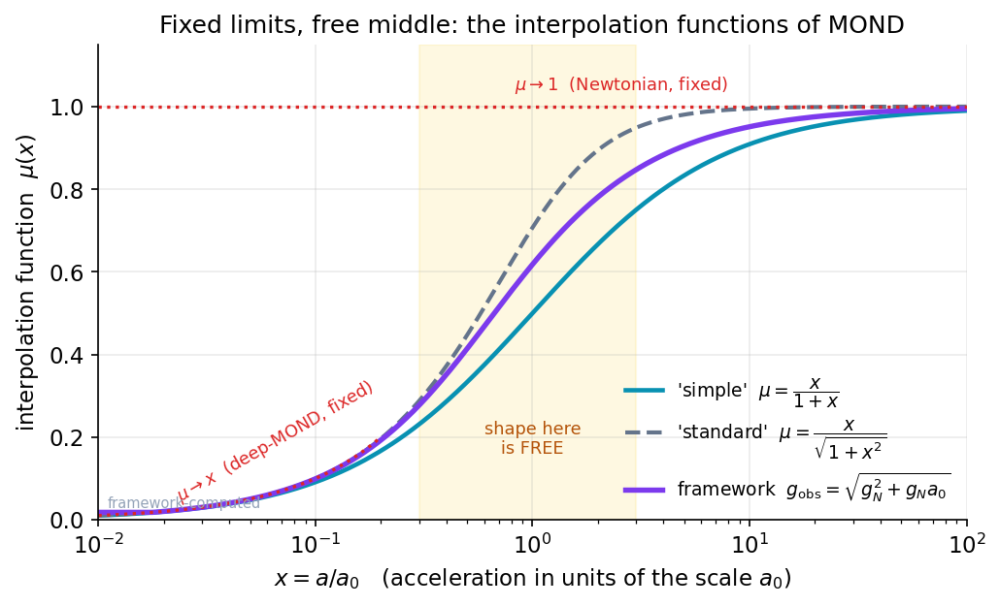

***Figure 17.2 — The two limits are pinned; the shape between them is free.*** Every MOND interpolation function must obey the same two limits the data fix: $\mu\to1$ for $x=a/a_0\gg1$ (Newton, so the Solar System is untouched) and $\mu\to x$ for $x\ll1$ (the deep-MOND regime). The red dotted guides show those fixed limits. The shaded transition is where the curve's shape is *not* specified by the theory — the honest free-function weakness the chapter flags. The 'simple' (teal) and 'standard' (grey) forms are common hand-picked choices; the purple curve is the shape the framework's own $g_{\rm obs}=\sqrt{g_N^2+g_N a_0}$ produces from a physical argument rather than by hand. Computed from the framework's equations.

**Source:** Figure generated by [`book/figures/ch17_interpolation_functions.py`](https://github.com/carlzimmerman/zimmerman-formula/blob/main/book/figures/ch17_interpolation_functions.py). Interpolation-function forms: Famaey & McGaugh 2012, Living Rev. Relativity 15, 10 (arXiv:1112.3960); the framework interpolation: [Zenodo 10.5281/zenodo.20721540](https://doi.org/10.5281/zenodo.20721540).

> **Deeper Dive: Two formulations — modified gravity (AQUAL) versus modified inertia.**
>
> The interpolation law above, $\mu(a/a_0)\,\mathbf{a}=\mathbf{g}_N$, is written as a statement about *inertia*: μ multiplies the acceleration on the left, the response side. But notice it can be algebraically rearranged to look like a statement about a modified *gravitational field* instead. This ambiguity is exactly the gravity-versus-inertia fork from the main text, and it becomes sharp the moment you try to write down a *complete, conservative theory* rather than a one-line rule.
>
> The best-known modified-gravity completion is **AQUAL** — A QUAdratic Lagrangian theory, developed by Bekenstein and Milgrom in 1984. It modifies the equation that the gravitational potential Φ obeys. Where Newton's gravity is governed by the Poisson equation $\nabla^2\Phi = 4\pi G\rho$, AQUAL replaces it with a nonlinear version,
>
> $$\nabla\!\cdot\!\left[\mu\!\left(\frac{|\nabla\Phi|}{a_0}\right)\nabla\Phi\right] = 4\pi G \rho,$$
>
> where ρ is the visible-matter density. Here μ acts on the *field*, the gravity side. AQUAL is a genuine field theory: it conserves momentum, energy, and angular momentum, and it follows from an action principle (the "quadratic Lagrangian" of the name, in the deep limit). That respectability is its great virtue.
>
> A **modified-inertia** completion, by contrast, keeps Newton's gravitational field untouched and instead alters the particle's equation of motion — effectively making the inertial mass depend on the state of motion. Milgrom developed such formulations in 1994 and 1999, and they are subtler: a consistent modified-inertia theory generally cannot be a simple local force law, because the inertia of an object on a bound orbit turns out to depend on the *whole trajectory*, not just the instantaneous acceleration.
>
> **Why the two differ off circular orbits.** On a perfectly circular orbit the acceleration has constant magnitude, and AQUAL and modified inertia can be tuned to agree exactly — which is why rotation curves alone cannot distinguish them. But a circular orbit is a very special path. On an *elongated* or *eccentric* orbit, where the acceleration's magnitude rises and falls around the loop, the two prescriptions make different predictions for the motion, because "the acceleration right now" (what a local modified-gravity force responds to) and "the character of the orbit as a whole" (what a modified-inertia rule can depend on) are no longer the same thing. This is not a technicality: it is, in principle, an *observable* difference, and it is one of the few clean handles for telling the two readings of MOND apart. It will return, transformed, when we discuss the Solar-System safety of our own modified-inertia framework in Chapter 21 and the cluster tests in Chapter 29.

## The framework's foreshadow: a sister interpolation

There is one more relation worth meeting now, because it is the bridge from Milgrom's general idea to the specific shape our own framework will take. Among the many interpolations consistent with the two required limits, one particularly clean choice writes the *observed* acceleration in terms of the Newtonian one as

$$g_{\text{obs}} = \sqrt{g_N^2 + g_N\, a_0}.$$

Take a moment with the two terms under the square root. The first, $g_N^2$, dominates when $g_N$ is large — and then $g_{\text{obs}}\to\sqrt{g_N^2}=g_N$, pure Newton again, exactly as the Solar System demands. The second, $g_N a_0$, takes over when $g_N$ is small — and then $g_{\text{obs}}\to\sqrt{g_N a_0}$, the deep-MOND formula once more. So this single expression interpolates smoothly between the two worlds, with no separate μ to choose: the two regimes are already baked into the sum under the root.

I want to flag this one for a reason that will only fully pay off in Part 5. When we build the de Sitter–Unruh modified-inertia framework — the idea that empty space in a universe with a cosmological constant carries a faint *temperature floor*, and that matter in near-free-fall feels that floor as a little extra inertia (Chapters 14, 15, and 21) — the interpolation it produces is *exactly of this form*, $g_{\text{obs}}=\sqrt{g_N^2+g_N a_0}$. The framework does not reach into a catalogue of μ-functions and pick the one that fits; the temperature-floor argument *hands* it this particular shape. That is a real and honest difference from generic MOND, and we will treat it carefully and both-ways when we get there.

But let me be scrupulous right now, in this chapter, so the foreshadow doesn't curdle into hype. Choosing the interpolation from a physical argument is genuinely nicer than choosing it by hand. It does **not**, by itself, derive the *value* of a₀ — that value, in our framework, will be tied to the measured dark-energy density through a single geometric posit, and we will be painfully clear in Chapters 23 and 27 about what is forced and what is assumed. And it does nothing to rescue the deep problems that MOND-family ideas share — clusters and lensing above all (Chapters 19, 28, 29). A prettier interpolation is a real point on the scoreboard. It is not the game.

> **Worked Example: How fast does the edge of a galaxy spin?**
>
> Let's put MOND to work on a concrete galaxy and see the flat rotation curve appear in real numbers. We'll take a galaxy whose total visible (baryonic) mass is about $M = 5\times 10^{10}$ solar masses — a respectable spiral, a bit smaller than the Milky Way. We want the orbital speed far out in its flat region, where the local Newtonian acceleration has sunk well below a₀ so the deep-MOND formula applies.
>
> **Step 1 — Gather the constants, in SI units.**
> - Newton's constant: $G = 6.67\times 10^{-11}\ \text{m}^3\,\text{kg}^{-1}\,\text{s}^{-2}$.
> - One solar mass: $M_\odot = 1.99\times 10^{30}\ \text{kg}$.
> - The acceleration scale: $a_0 = 1.2\times 10^{-10}\ \text{m/s}^2$.
>
> **Step 2 — Convert the galaxy's mass to kilograms.**
> $$M = 5\times 10^{10} \times 1.99\times 10^{30}\ \text{kg} = 9.95\times 10^{40}\ \text{kg}.$$
>
> **Step 3 — Use the deep-MOND flat-curve result.** We derived $v^4 = G M a_0$ in the main text. Plug in:
> $$v^4 = (6.67\times 10^{-11})\,(9.95\times 10^{40})\,(1.2\times 10^{-10}).$$
> Multiply the pieces. First $6.67\times 10^{-11}\times 9.95\times 10^{40} = 6.64\times 10^{30}$. Then times $1.2\times 10^{-10}$:
> $$v^4 = 7.96\times 10^{20}\ \text{m}^4/\text{s}^4.$$
>
> **Step 4 — Take the fourth root.** The fourth root is the square root of the square root. $\sqrt{7.96\times 10^{20}} = 2.82\times 10^{10}$, and $\sqrt{2.82\times 10^{10}} = 1.68\times 10^{5}$. So
> $$v \approx 1.68\times 10^{5}\ \text{m/s} \approx 168\ \text{km/s}.$$
>
> **Step 5 — Sanity check against the real sky.** A speed of roughly 170 km/s is exactly the ballpark of the flat rotation speeds we *measure* for spiral galaxies of this mass — the Milky Way's own flat speed is about 220 km/s, and it is a few times more massive, just as $v\propto M^{1/4}$ predicts. We never chose a radius. We never invoked a dark-matter halo. One mass, one universal a₀, and the observed speed dropped out. That is the seductive power of the idea — and, said honestly, also the reason we have to scrutinize it so hard before believing it, which is the work of the next two chapters.
>
> *(A note on what we did* not *do: we computed the speed in the* deep *regime, where $g_N\ll a_0$. For a real galaxy you'd check that the radius you care about actually sits in that regime, and in the in-between zone you'd use the full interpolation $g_{\text{obs}}=\sqrt{g_N^2+g_N a_0}$ rather than the clean deep formula. The clean formula is the right tool for the flat outskirts and for building intuition; it is not the whole story.)*

## What the idea is, and what it is not

Step back and look at what we have. Milgrom's proposal is, at its core, a single sentence: *below a universal acceleration a₀, the relationship between gravitational source and motion departs from Newton, in just the way needed to flatten rotation curves.* From that one sentence, with one fitted number, you get flat rotation curves and the baryonic Tully–Fisher relation, across an enormous range of galaxy sizes and types, with a success that — we will see in Chapter 18 — is frankly uncomfortable for the dark-matter picture to match galaxy by galaxy.

That is the genuine strength, and I won't undersell it. A great deal of careful astronomy says that *something* about a₀ is real — that galaxies "know" about this particular acceleration scale in a way the simplest dark-matter halos don't obviously explain.

But this is a both-ways book, so let me be equally plain about what the idea, in the form we've met it, is *not*.

**It is not a complete theory.** What we've written down is a *rule* — a recipe for the acceleration — not a full physical theory with a clean foundation. AQUAL is one honest attempt to make it a real field theory; the modified-inertia versions are another; neither is the last word, and neither, as stated here, is relativistic. To talk about light bending, the expanding universe, or the cosmic microwave background — all of which live in Einstein's relativistic gravity (Chapters 7–11) — MOND needs a relativistic completion, and *that* is where its troubles deepen, as we'll see in Chapters 19, 28, and 29.

**It does not explain its own central number.** a₀ is fitted, not derived. The whole motivation for the framework this book is really about begins with the observation that a₀'s fitted value sits maddeningly close to quantities drawn from cosmology — and asks whether that is a coincidence or a clue. That question is open. We will not pretend otherwise.

**And it does not, by itself, cure the cluster and lensing problems.** Galaxies are MOND's home turf and it is magnificent there. Galaxy clusters keep a residual missing-mass discrepancy that MOND reduces but does not erase, and bending light in a Solar-System-safe way turns out to be deeply hard for the whole MOND family — a wall we will give an entire chapter (Chapter 28) because our own framework runs straight into it too and does not get a free pass.

So: a daring, productive, genuinely puzzling idea, with one number that does an extraordinary amount of work — and real, unhealed wounds. That is the honest shape of it. The next two chapters sharpen both halves: Chapter 18 on the two great regularities that make MOND impossible to dismiss, and Chapter 19 on the problems that make it impossible, so far, to fully accept.

## Summary

- **Milgrom's 1983 proposal (MOND, MOdified Newtonian Dynamics)** is that Newton's dynamics change below a single universal **acceleration scale a₀** ≈ 1.2 × 10⁻¹⁰ m/s² — an acceleration so tiny it would take the age of the universe to bring a car to highway speed.
- The rule depends only on the *local* acceleration, never on position — that is what makes it a candidate law of nature rather than a fudge that "knows where it is."
- In the **deep-MOND limit** ($g_N \ll a_0$), the rule becomes $g=\sqrt{g_N a_0}$. This single line makes rotation curves go **flat** with no dark matter and *also* delivers the **baryonic Tully–Fisher relation** $v^4 = GMa_0$ for free.
- The two regimes are stitched by an **interpolation function μ(a/a₀)**, fixed only in its limits ($\mu\to1$ for $a\gg a_0$, Newtonian; $\mu\to a/a_0$ for $a\ll a_0$, deep-MOND). The *shape* of μ between the limits is an empirical free function — an honest weakness.
- MOND can be read two ways that agree on circular orbits but differ off them: **modified gravity** (e.g. the **AQUAL** field theory of Bekenstein–Milgrom 1984) versus **modified inertia** (Milgrom 1994, 1999). The distinction is central — our own framework will be a *modified-inertia* theory.
- One clean interpolation, $g_{\text{obs}}=\sqrt{g_N^2+g_N a_0}$, anticipates the *exact* shape our de Sitter–Unruh framework will produce from a physical argument (Part 5) rather than choose by hand — a real but modest point in its favor.
- **Both ways:** MOND's galactic successes are real and pressing; but it is not a complete relativistic theory, it does not derive a₀, and it does not by itself cure the cluster and lensing problems. It is a powerful, unfinished idea — not a theory of everything yet, as frustrating as it may be.

## Questions

1. **(Easy.)** In your own words, what is the acceleration scale a₀, and why does it make sense that we never noticed MOND-like behavior in everyday life or in the Solar System? Use the speedometer analogy to estimate, roughly, how long a 1 m/s² push (a brisk car launch) is compared to a₀.

2. **(Easy–medium.)** Starting from the deep-MOND rule $g=\sqrt{g_N a_0}$ and the circular-orbit condition $g=v^2/r$, reproduce the derivation in the text to show that $v^4 = GMa_0$. Explain in words why the rotation curve comes out flat (independent of r).

3. **(Medium.)** Take a dwarf galaxy with baryonic mass $M = 2\times 10^{8}\,M_\odot$. Using $v^4=GMa_0$ with $a_0=1.2\times10^{-10}\ \text{m/s}^2$, predict its flat rotation speed. Then redo it with the framework's value $a_0 = 9.36\times 10^{-11}\ \text{m/s}^2$ (which we will meet in Part 5). By what percentage does the predicted speed change, and why is the change so much smaller than the change in a₀ itself? *(Hint: $v\propto a_0^{1/4}$.)*

4. **(Medium.)** Write down the two required limits of the interpolation function μ(x) and verify that the "simple" choice $\mu(x)=x/(1+x)$ satisfies both. Sketch μ(x) versus x. Why is the freedom to choose the *shape* of μ (as opposed to the single value of a₀) considered a genuine weakness of MOND as a fundamental theory?

5. **(Medium–hard.)** Explain carefully why MOND's two readings — modified gravity (AQUAL) and modified inertia — make identical predictions for circular rotation curves but can differ for eccentric orbits. What kind of observation, in principle, could tell them apart? Why does this distinction matter for whether a MOND-like theory can stay safe in the high-acceleration Solar System?

6. **(Research-level.)** AQUAL is a conservative, action-based modified-gravity field theory, yet this book's framework deliberately chooses the modified-*inertia* road instead. Drawing on what you know so far (and looking ahead to Chapters 21, 28, and 29), lay out the trade-offs: what does a modified-inertia formulation buy you (think Solar-System safety, the temperature-floor mechanism), what does it cost you (think the difficulty of writing a consistent off-circular-orbit theory, and the no-go theorem that keeps lensing phenomenological), and what observations might eventually decide between the two roads?

# Chapter 18: The Two Great Regularities: RAR and Baryonic Tully–Fisher

> *Sometimes nature leaves a clue so sharp, so clean, that you stop and stare at it. Not a vague hint — a law. Galaxies, it turns out, left us two.*

In the last chapter we met Mordehai Milgrom's bold idea: that down at very small accelerations, below a special scale he called $a_0$, the familiar rules of motion bend. We treated it mostly as a proposal — a "what if." This chapter is about why that "what if" refuses to go away. It is about two patterns in the data, two regularities so tight and so universal that they look less like coincidences and more like laws of nature waiting to be explained.

I want to be careful and honest from the very first page, because these patterns sit at the heart of everything that follows. They are the strongest empirical evidence that *something* about galaxies is governed by an acceleration scale. They are also — and this matters enormously — shared successes. Every member of the MOND family explains them, and so does the framework this book is building toward. None of them owns these patterns outright. When we reach the framework in Part 5, you will hear me say again and again that the radial-acceleration relation and the baryonic Tully–Fisher relation are wins for the *whole family*, not unique fingerprints of any single theory. Keep that in your back pocket. We will earn it together.

For now, let me just show you the two patterns. They are genuinely beautiful, and you do not need any of the framework to appreciate them.

## A Strange Thing About Galaxies

Let me start with a puzzle that should not have an answer.

Take a galaxy. Any galaxy. A giant spiral with hundreds of billions of stars, or a faint little dwarf you can barely see. Pick a spot somewhere out in its disk and ask a simple question: *how hard is gravity pulling at this spot?* In other words, what is the local acceleration — how fast would a star sitting there be falling inward, bent into its orbit?

There are two ways to find out, and that is where the puzzle begins.

**The first way** is to look at the stars and gas. We add up all the visible, ordinary matter we can see — the glow of stars, the cold hydrogen gas mapped by radio telescopes — and we use Newton's law of gravity to calculate how much pull that matter *should* produce at our chosen spot. Call this the **baryonic acceleration**, written $g_{\text{bar}}$. ("Baryonic" is just physicists' word for ordinary matter — the stuff made of protons and neutrons, the stuff that shines or can in principle be seen. It is the matter we can actually count.) So $g_{\text{bar}}$ is the gravity you'd *predict* from the visible mass alone.

**The second way** is to watch how fast things actually move. We measure the orbital speed of stars and gas at our spot, and from that speed and the radius we work out the true, observed acceleration — the real centripetal pull that holds them in orbit. Call this the **observed acceleration**, $g_{\text{obs}}$. This is the gravity the galaxy *actually has*, whatever its source.

Now here is the puzzle. If galaxies were made only of the matter we can see, these two numbers would be equal. $g_{\text{obs}}$ would simply equal $g_{\text{bar}}$, every time, in every galaxy, at every radius. That is just Newton: the pull you measure equals the pull from the mass that's there.

But we already know, from Chapters 3 and 4, that this is *not* what happens. Out in the thin outer reaches of galaxies, stars move far too fast for the visible matter to hold them. The observed acceleration is bigger than the baryonic one — sometimes a lot bigger. This is the missing-mass problem, the whole reason for this book.

So you'd expect the relationship between $g_{\text{obs}}$ and $g_{\text{bar}}$ to be a *mess*. Every galaxy has its own history, its own shape, its own messy distribution of whatever the extra stuff is. If the extra pull comes from a halo of dark-matter particles, that halo formed through a chaotic, violent history of collisions and mergers, different for every galaxy. You'd expect the gap between what you see and what you measure to scatter all over the place — big in some galaxies, small in others, with no clean rule connecting them.

That is not what we find.

## The Radial-Acceleration Relation

In 2016, a team led by Stacy McGaugh, Federico Lelli, and Jim Schombert did something wonderfully simple. They took a large, carefully assembled catalog of galaxies — 153 of them, spanning dwarfs to giants, gas-rich to star-dominated — and for every single point in every single galaxy where they could measure a rotation speed, they computed both numbers: the baryonic acceleration $g_{\text{bar}}$ from the visible matter, and the observed acceleration $g_{\text{obs}}$ from the motion. That is roughly 2,700 individual measurements. Then they plotted one against the other.

The catalog has a name you will see often from here on: **SPARC**, which stands for *Spitzer Photometry and Accurate Rotation Curves*. The "Spitzer" part is the key to its quality. Spitzer was a space telescope that observed in the near-infrared, at a wavelength around 3.6 microns — light that comes mostly from old, low-mass stars. And old, low-mass stars are where most of a galaxy's *mass* lives, even though they contribute rather little of its visible sparkle. So near-infrared light is a far more honest tracer of how much stellar mass is actually present than ordinary visible light, which is dominated by a handful of bright, short-lived, heavy stars. SPARC, in other words, is our best attempt to weigh the ordinary matter in galaxies cleanly. It is the gold standard, and it will come up in nearly every chapter from here on.

So: 2,700 points, each one a pairing of "predicted-from-visible-matter" against "actually-measured." What did the plot look like?

It looked like a *line*. A single, clean, narrow line.

Every galaxy, every radius, every point — they all fell onto essentially the same curve. Not a fuzzy band, not a scatterplot, but a relationship so tight that the scatter around it was about 0.11 in the logarithm, roughly 13 percent. And a good chunk of *that* scatter could be accounted for by the ordinary measurement errors — the uncertainty in distances, in inclinations, in how much each star weighs. Once you subtract the known errors, the *intrinsic* scatter — the genuine spread that the universe itself puts there — is even smaller, plausibly close to zero. Within the precision we can muster, the relationship might be exact.

This is the **radial-acceleration relation**, or **RAR**. In plain words: *the gravity you actually measure at any point in a galaxy is fixed, almost entirely, by the amount of ordinary visible matter inside that point.* Tell me $g_{\text{bar}}$, and I can tell you $g_{\text{obs}}$ — for any galaxy in the universe — to about thirteen percent, much of which is just my measuring error.

Stop and feel how strange that is.

If galaxies are dominated by dark-matter halos, then $g_{\text{obs}}$ is mostly set by the *dark* matter, and $g_{\text{bar}}$ is set by the *visible* matter — two completely different substances, with two completely different histories. The dark halo and the visible disk needn't have anything to do with each other. And yet, somehow, knowing one tells you the other, to exquisite precision, in every galaxy we have ever measured. It is as if you weighed the people in a thousand houses, and the weight of the *furniture* in each house turned out to be a fixed, universal function of the weight of the *people* — the same function in every house on Earth. You would not call that a coincidence. You would suspect a law.

### What the curve actually does

The shape of the RAR curve tells the whole story, and it is worth walking through slowly because the acceleration scale $a_0$ lives right inside it.

Look at the **high-acceleration end** — the bright, dense inner regions of galaxies, where there is a lot of matter packed close and gravity is relatively strong. Here the curve does the boring, expected thing: $g_{\text{obs}}$ equals $g_{\text{bar}}$. The line lies right on the one-to-one diagonal. The observed gravity is exactly what the visible matter predicts. No missing mass, no mystery. Newton, untouched, working perfectly. This is the regime of the Solar System and the inner galaxy — and it is reassuring, because we *know* Newton works there.

Now slide down to the **low-acceleration end** — the faint, thin outer reaches, where matter is sparse and gravity is weak. Here the curve peels away from the diagonal and rises above it. The observed acceleration is now *larger* than the baryonic one: there is the missing mass, the extra pull. And the curve bends in a very particular way. In this deep, low-acceleration regime, the observed acceleration tends toward $\sqrt{g_{\text{bar}}\,a_0}$ — the geometric mean of the baryonic acceleration and a fixed constant.

That constant is $a_0$. The acceleration scale from Chapter 17 is not something we put in by hand to fit the data — it falls *out* of the data, as the place where the curve turns over. It is the hinge of the whole relation: the acceleration that separates the Newtonian high end from the anomalous low end. Measure where the RAR bends, and you have measured $a_0$ directly. The value that comes out is right around $1.2 \times 10^{-10}\ \text{m/s}^2$ — about a hundred-billionth of the gravity you feel standing on Earth. We will come back to that precise number, and to how sensitive it is to the choices we make, later in the chapter.

So the RAR is really one curve doing two jobs. At high accelerations it hugs the diagonal and reproduces Newton. At low accelerations it lifts off and follows the square-root law. And the bend between them sits at $a_0$. One scale, one curve, every galaxy.

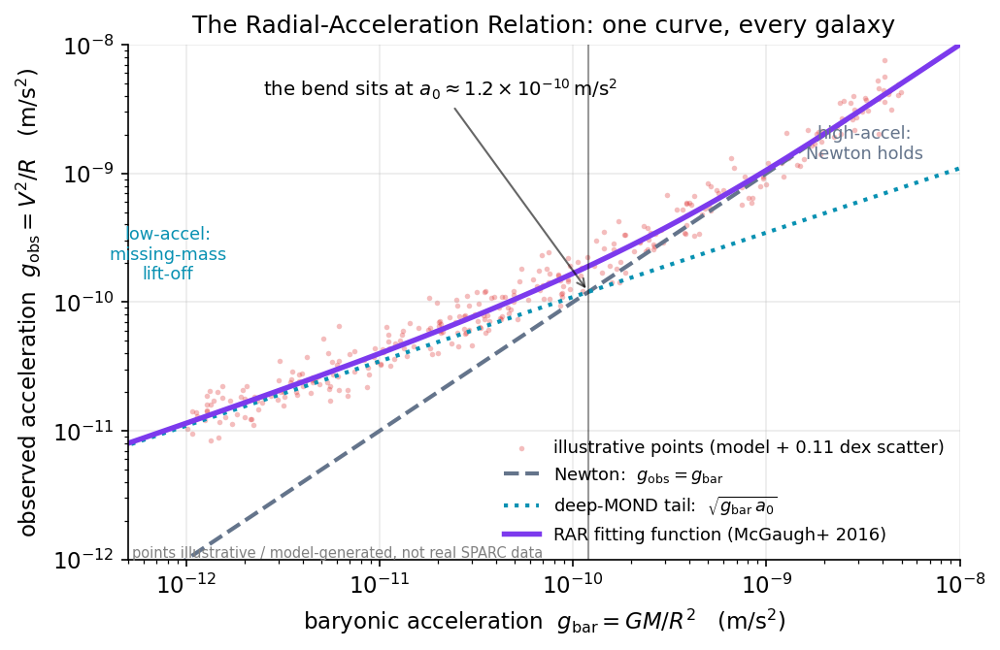

***Figure 18.1 — The Radial-Acceleration Relation.*** The observed acceleration $g_{\rm obs}$ plotted against the baryonic acceleration $g_{\rm bar}$. The purple curve is the published McGaugh-Lelli-Schombert (2016) RAR fitting function plotted as a *model*; it traces the Newtonian one-to-one diagonal (grey dashed) at high acceleration and peels onto the deep-MOND square-root tail $\sqrt{g_{\rm bar}\,a_0}$ (teal dotted) at low acceleration, with the bend sitting at $a_0$. The faint red points are *illustrative and model-generated* (the fit function plus 0.11 dex synthetic scatter) — they are not real SPARC measurements, only a visual stand-in for the chapter's "tight line."

**Source:** Figure generated by [`book/figures/ch18_rar_curve.py`](https://github.com/carlzimmerman/zimmerman-formula/blob/main/book/figures/ch18_rar_curve.py). Underlying relation: the radial-acceleration relation and its interpolating function, McGaugh, Lelli & Schombert 2016, PRL 117, 201101 (arXiv:1609.05917); SPARC database, Lelli, McGaugh & Schombert 2016, AJ 152, 157 (arXiv:1606.09251).

> **Deeper Dive: The RAR as a fitting function**
>
> McGaugh, Lelli, and Schombert (2016) summarized the SPARC data with a single empirical *interpolating function* that smoothly joins the two regimes. A common and convenient form is
> $$ g_{\text{obs}}(g_{\text{bar}}) = \frac{g_{\text{bar}}}{1 - e^{-\sqrt{g_{\text{bar}}/a_0}}}. $$
> Check the two limits. When $g_{\text{bar}} \gg a_0$, the exponential vanishes, the denominator goes to $1$, and $g_{\text{obs}} \to g_{\text{bar}}$ — the Newtonian diagonal. When $g_{\text{bar}} \ll a_0$, expand the exponential: $1 - e^{-x} \approx x$ for small $x$, with $x = \sqrt{g_{\text{bar}}/a_0}$, so the denominator becomes $\sqrt{g_{\text{bar}}/a_0}$ and
> $$ g_{\text{obs}} \to \frac{g_{\text{bar}}}{\sqrt{g_{\text{bar}}/a_0}} = \sqrt{g_{\text{bar}}\, a_0}. $$
> That is the deep-MOND square-root law. The fit returns a single best value $a_0 \approx 1.20 \times 10^{-10}\ \text{m/s}^2$ with a remarkably small scatter (about $0.11$ dex about the relation), of which a large fraction is attributable to observational uncertainties in distance, disk inclination, and the stellar mass-to-light ratio.
>
> A crucial methodological point: this *particular* functional form is not sacred. It is one of several interpolating functions in use — the "simple" function $g_{\text{obs}} = \tfrac{1}{2}g_{\text{bar}} + \sqrt{(\tfrac12 g_{\text{bar}})^2 + g_{\text{bar}}a_0}$ is another, and the framework of this book will use yet another, motivated by de Sitter–Unruh physics (Chapters 20–21). The data do not uniquely pick the function; they pin down the *behavior* (diagonal at the top, square-root at the bottom) and the *scale* $a_0$ where the bend happens. As we'll see, the precise best-fit $a_0$ shifts a little depending on which interpolation you adopt, which mass-to-light ratio you assume, and how you weight the points. Hold that thought.

Before we go further, I should define a term I just leaned on, because it does real work all through this book: the **mass-to-light ratio**, usually written $\Upsilon$ (the Greek letter upsilon) or $M/L$. When we look at a galaxy, we measure its *light*. But what we want is its *mass*. The mass-to-light ratio is the conversion factor between them — how many solar masses of stars produce one solar luminosity of glow. The trouble is that it depends on the galaxy's stellar population: a region full of young, hot, bright stars has a low $\Upsilon$ (lots of light per unit mass), while a region of old, dim, red stars has a high $\Upsilon$. So when we compute $g_{\text{bar}}$ from a galaxy's light, we have to *assume* a mass-to-light ratio, and that assumption carries an uncertainty of maybe 20 or 30 percent. This single fuzzy number — how much mass goes with the light — is the largest source of slop in the whole game, and it will haunt us when we try to pin down the exact value of $a_0$. SPARC's near-infrared light helps a lot precisely because $\Upsilon$ is more stable and predictable in the near-infrared than in visible light. But it never goes away entirely.

## The Baryonic Tully–Fisher Relation

The second great regularity is older, and in some ways even more astonishing, because it connects two things that seem to have no business being related.

Back in 1977, two astronomers, Brent Tully and Richard Fisher, noticed something useful. If you measure how fast a spiral galaxy spins — which you can do from the width of its radio emission line, because one edge of the spinning disk is coming toward you and blueshifted while the other recedes and is redshifted — then the spin speed tells you, roughly, how bright the galaxy is. Faster spinners are more luminous. This was immediately handy for measuring cosmic distances: measure a galaxy's spin, infer its true brightness, compare to its apparent brightness, and you get its distance. The **Tully–Fisher relation** became a workhorse of observational cosmology.

But there was something deeper hiding inside it, and it took a couple of decades to surface cleanly.

The original relation used *light* — luminosity. And light, as we just discussed, is a slippery proxy for mass. Worse, small galaxies are often gas-rich: a little dwarf might have only a modest sprinkling of stars but a huge reservoir of hydrogen gas that the starlight completely misses. If you only count the stars, you badly undercount the matter in exactly those galaxies.

So McGaugh and others made a key improvement. Instead of plotting luminosity against spin speed, they plotted the *total baryonic mass* — all the stars **plus** all the gas — against spin speed. This is the **baryonic Tully–Fisher relation**, or **BTFR**. The "baryonic" again means *all the ordinary matter*, properly counted, gas included.

And when you do it that way — counting all the ordinary mass, not just the light — the relation snaps into something extraordinarily tight and extraordinarily simple. Across galaxies spanning a factor of a *million* in mass, from the faintest dwarfs to the grandest spirals, the total baryonic mass $M$ goes as the *fourth power* of the rotation speed $V$:

$$ M \propto V^4. $$

Four. Not three, not 3.5, not "somewhere around there." A clean fourth power, holding across five or six orders of magnitude in mass, with scatter so small that — like the RAR — much of it can be blamed on ordinary measurement error.

Let me make sure the strangeness lands. The rotation speed $V$ here is the speed way out in the *flat* part of the rotation curve — the outer reaches, where (if dark matter is the answer) the motion is supposedly dominated by the dark halo. The mass $M$ is the *baryonic* mass — the stars and gas, the visible stuff, concentrated in the *inner* galaxy. So the BTFR says: the speed of the outer disk, supposedly set by the dark halo, is locked to the visible mass of the inner disk by a rigid fourth-power law. Again the "dark" and the "visible" are holding hands when they have no obvious reason to.

And notice what is *missing* from $M \propto V^4$. There is no dependence on the galaxy's *size*. A puffy, spread-out galaxy and a compact, dense one of the same baryonic mass have the same flat rotation speed. In plain Newtonian gravity that should be false — spread the same mass over a bigger region and the orbital speeds should drop. The BTFR doesn't care about size at all. Only the total baryonic mass matters. That, too, is a fingerprint of an acceleration scale at work.

> **Deeper Dive: Deriving $V^4 = G M a_0$ from the deep-MOND limit**
>
> The BTFR is not just an empirical fit — it falls straight out of the low-acceleration behavior we already wrote down for the RAR. Watch.
>
> Far out in a galaxy's flat rotation curve, the acceleration is deep in the low-$a_0$ regime, so the observed acceleration follows the square-root law:
> $$ g_{\text{obs}} = \sqrt{g_{\text{bar}}\, a_0}. $$
> Now write each side in terms of the orbital speed $V$ at radius $R$ and the enclosed baryonic mass $M$. The observed centripetal acceleration of a star on a circular orbit is
> $$ g_{\text{obs}} = \frac{V^2}{R}, $$
> and the Newtonian (baryonic) acceleration from a mass $M$ enclosed within radius $R$ is
> $$ g_{\text{bar}} = \frac{G M}{R^2}. $$
> Substitute both into the square-root law:
> $$ \frac{V^2}{R} = \sqrt{\frac{G M}{R^2}\, a_0} = \frac{1}{R}\sqrt{G M\, a_0}. $$
> The radius $R$ appears on both sides and **cancels completely**:
> $$ V^2 = \sqrt{G M\, a_0} \quad\Longrightarrow\quad \boxed{\,V^4 = G M\, a_0\,}. $$
> There it is. The fourth power is exact, and — this is the beautiful part — the radius dropped out, which is *why* the BTFR has no size dependence. The relation is flat in $R$ because the deep-MOND law is scale-free in exactly the right way. Rearranged, the relation predicts both the slope (4) and the *zero point*: the proportionality constant is $G a_0$. So the same single number $a_0$ that sets the bend in the RAR also sets the normalization of the BTFR. One scale, two laws. Any theory with a low-acceleration square-root limit — every MOND-family theory, including this book's framework — reproduces $V^4 = G M a_0$ automatically, with no freedom to do otherwise.

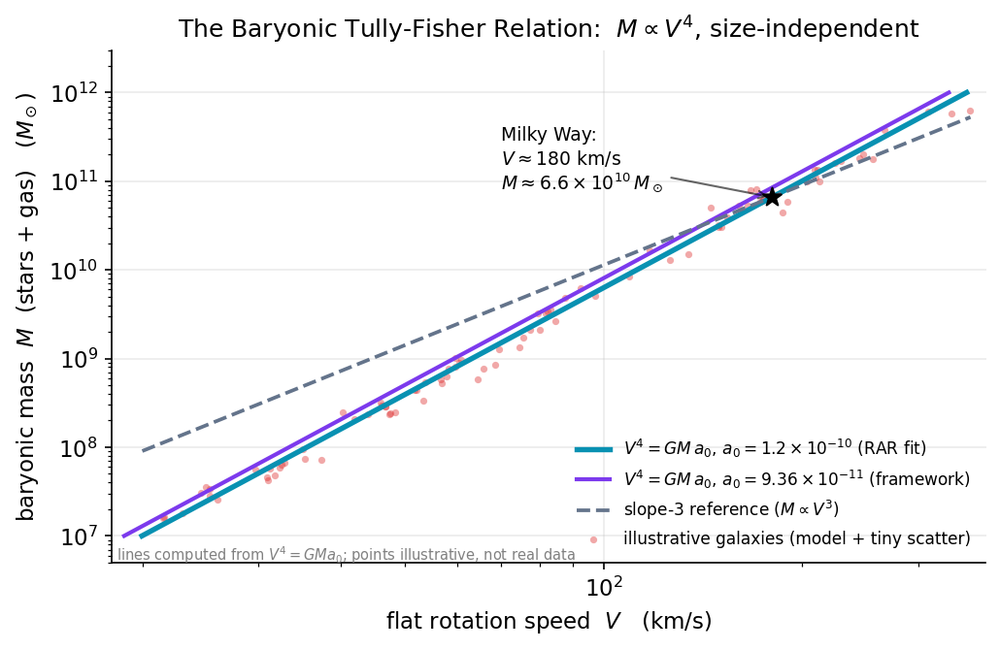

***Figure 18.2 — The Baryonic Tully-Fisher Relation.*** Baryonic mass (stars + gas) versus flat rotation speed. Both solid lines are *computed directly from the framework's deep-MOND relation* $V^4 = G M\,a_0$ — the teal line uses the RAR-fit $a_0 = 1.2\times10^{-10}$, the purple line the framework's $a_0 = 9.36\times10^{-11}$; they are parallel slope-4 lines offset only by the choice of $a_0$. The grey dashed slope-3 reference shows that a clean fourth power, not a third, is what the data demand. The black star is the chapter's worked example (Milky Way, $V\approx180$ km/s $\rightarrow$ $M\approx6.6\times10^{10}\,M_\odot$). The red points are *illustrative and model-generated*, not real galaxies.

**Source:** Figure generated by [`book/figures/ch18_btfr.py`](https://github.com/carlzimmerman/zimmerman-formula/blob/main/book/figures/ch18_btfr.py). Framework relation $V^4=GMa_0$ (deep-MOND limit), framework spine paper https://doi.org/10.5281/zenodo.20721540; the empirical BTFR, Tully & Fisher 1977, A&A 54, 661, and McGaugh 2012, AJ 143, 40; MOND scale-free limit, Milgrom 1983, ApJ 270, 365.

> **Worked Example: Weighing the Milky Way from its spin**
>
> Let's use $V^4 = G M a_0$ as a scale, the way an astronomer actually would, and predict the baryonic mass of a galaxy from nothing but its rotation speed. We'll take a galaxy much like our own Milky Way, with a flat rotation speed of about $V = 180\ \text{km/s}$.
>
> First, get everything into SI units.
> - $V = 180\ \text{km/s} = 1.80 \times 10^{5}\ \text{m/s}$
> - $G = 6.674 \times 10^{-11}\ \text{m}^3\,\text{kg}^{-1}\,\text{s}^{-2}$
> - $a_0 = 1.2 \times 10^{-10}\ \text{m/s}^2$
>
> The relation rearranges to solve for mass:
> $$ M = \frac{V^4}{G\, a_0}. $$
>
> **Step 1 — the numerator, $V^4$.** Square the speed: $V^2 = (1.80\times10^5)^2 = 3.24 \times 10^{10}\ \text{m}^2/\text{s}^2$. Square again: $V^4 = (3.24\times10^{10})^2 = 1.05 \times 10^{21}\ \text{m}^4/\text{s}^4$.
>
> **Step 2 — the denominator, $G a_0$.** Multiply: $G a_0 = (6.674\times10^{-11})(1.2\times10^{-10}) = 8.01 \times 10^{-21}\ \text{m}^4\,\text{kg}^{-1}\,\text{s}^{-4}$.
>
> **Step 3 — divide.**
> $$ M = \frac{1.05 \times 10^{21}}{8.01 \times 10^{-21}} \approx 1.31 \times 10^{41}\ \text{kg}. $$
>
> **Step 4 — convert to suns.** One solar mass is $M_\odot = 1.99 \times 10^{30}\ \text{kg}$, so
> $$ M \approx \frac{1.31\times10^{41}}{1.99\times10^{30}} \approx 6.6 \times 10^{10}\ M_\odot, $$
> about 66 billion solar masses of ordinary matter — stars plus gas.
>
> Now check it against reality. The Milky Way's measured baryonic mass — its stars *plus* its gas — is somewhere in the neighborhood of $6$–$7 \times 10^{10}\ M_\odot$. We just predicted that from the rotation speed alone, using a single universal constant, with no dark-matter halo, no fitting, no fudge. Not bad for one line of algebra.
>
> And here is the honest both-ways caveat, because this book always carries it: this *worked*, but the success is the **BTFR's**, which means it is shared by every MOND-family theory and by the framework of Part 5 equally. It is a genuine and impressive prediction — and it is *not* a unique fingerprint of any one of them. We will be scrupulous about that distinction for the rest of the book.

## How Tight Is "Tight," Really?

I keep saying these relations are "tight," and you should push back and ask: *tight compared to what?* Tight enough to matter?

Here is the comparison that makes physicists sit up. In the standard dark-matter picture, galaxies are built inside halos of dark-matter particles that grew through billions of years of mergers and collisions. Computer simulations of this process — enormous, sophisticated, decades in the making — produce galaxies. But the galaxies they produce show *more* scatter in these relations than the real galaxies do. The universe is *cleaner* than the leading model of it. When your model predicts more mess than nature delivers, nature is telling you that you have missed something — that some simple organizing principle is at work which your model is reproducing only by accident, and imperfectly.

That is the real weight of the RAR and the BTFR. They are not just "good fits." They are *too good* — too sharp, too universal, too indifferent to galaxy history — to look like the emergent statistical residue of a chaotic halo-assembly process. They look like the footprints of a *law*. And a law that turns on a single acceleration scale $a_0$ is exactly what Milgrom proposed in Chapter 17, and exactly what the framework in Part 5 will try to explain from deeper principles.

Let me also be fair to the other side, because honesty runs both ways and the dark-matter community has real answers. They point out, correctly, that a tight relation between baryons and dynamics is *not strictly forbidden* in their picture. There are feedback processes — exploding stars, energy from growing black holes — that push gas around and can, in principle, conspire to keep baryons and dark matter in a fixed ratio. The phrase you'll hear is that the RAR can "emerge" from baryonic feedback in the dark-matter model. Maybe so. But the relation we observe is tighter, and turns over at a more specific acceleration, than that loose argument naturally delivers, and reproducing it has required real and ongoing effort. The MOND-family explanation, by contrast, is not an effort to *reproduce* the relations — in that family the relations are not accidents to be arranged but consequences that *cannot be avoided*, the way $V^4 = GMa_0$ fell out of one substitution above. That difference in character — predicted-and-unavoidable versus reproduced-with-work — is the strongest single argument for an acceleration scale. It is not a proof. But it is the kind of clue that makes you keep reading.

## A Closer Look at $a_0$: The Convention Problem

Now I owe you something the popular accounts usually skip, because it is exactly the kind of careful, both-ways bookkeeping this book insists on. We've been tossing around two numbers for $a_0$: the RAR fit gives about $1.2 \times 10^{-10}\ \text{m/s}^2$, and the framework of Part 5 will predict $a_0 = 9.36 \times 10^{-11}\ \text{m/s}^2$ from the dark-energy density. Those differ by about 20 percent. A skeptic — and you should be one — will immediately ask: *doesn't that gap sink the framework before it starts?*

The honest answer is: **no, and understanding why is genuinely important.** The "best-fit $a_0$" from SPARC is not a single, sharp, convention-free number. It is the joint product of *three* choices you have to make before you can fit anything, and the answer slides around as you change them. Let me name the three, because once you see them, the apparent 20-percent problem mostly dissolves — in *both* directions, which is the point.

**Choice one: the interpolating function.** As we saw in the Deeper Dive, the RAR is fit with an interpolating function that joins the Newtonian and deep-MOND regimes, and there is more than one such function in use. McGaugh's exponential form, the "simple" function, and the framework's own de Sitter–Unruh form all bend at slightly different places for the same data. Switch functions, and the best-fit $a_0$ moves. The framework must be judged on *its own* interpolation, not on McGaugh's — using someone else's curve to grade your scale is comparing apples to a different orchard.

**Choice two: the mass-to-light ratio $\Upsilon$.** Remember, to get $g_{\text{bar}}$ we have to convert the galaxies' light into mass, and that conversion carries 20–30 percent uncertainty. If you assume the stars are a little heavier (a higher $\Upsilon$), every $g_{\text{bar}}$ shifts up, and the best-fit $a_0$ shifts *down*. The common default in much of the RAR literature is $\Upsilon \approx 0.5$ in solar units at 3.6 microns; the framework's natural footing sits a bit higher, around $\Upsilon \approx 0.7$. That difference alone moves the optimal $a_0$ substantially.

**Choice three: the weighting.** How do you measure "best fit" — by minimizing scatter in $g_{\text{obs}}$, or in the log, or weighting each galaxy equally versus each point equally? Different reasonable choices of the scatter metric pull the optimum by yet another several percent.

> **Deeper Dive: Where $9.36 \times 10^{-11}$ actually sits**
>
> Put the three choices on a grid and the picture becomes clear. Across the reasonable combinations of {McGaugh, simple, de Sitter–Unruh} interpolation × {$\Upsilon = 0.5$, $0.7$} mass-to-light × scatter metric, the *optimal* $a_0$ that best fits SPARC ranges from roughly $7.5 \times 10^{-11}$ up to about $1.8 \times 10^{-10}\ \text{m/s}^2$. The framework's value $9.36 \times 10^{-11}$ sits comfortably *inside* that spread, not out at some excluded edge.
>
> The load-bearing subtlety is which interpolation you use to grade the framework. Judged on the framework's **own** de Sitter–Unruh interpolation — $g_{\text{obs}} = \sqrt{g_{\text{bar}}^2 + g_{\text{bar}}\,a_0}$ — at its natural $\Upsilon \approx 0.7$, the SPARC optimum lands near $1.0 \times 10^{-10}$, and forcing $a_0 = 9.36\times10^{-11}$ costs only about half a percent in scatter — within roughly $0.5\%$ of optimal, if anything slightly *below* the optimum rather than above it. Judged on McGaugh's $\nu$ at the same footing the optimum drops to about $7.8\times10^{-11}$, making $9.36$ look ~20% *high* with a ~2% penalty — but that is the wrong curve for grading *this* framework. Run it the other common way (McGaugh, $\Upsilon=0.5$) and $9.36$ looks ~20% *low*. Both the "too high" and the "too low" verdicts are artifacts of a mismatched interpolation-and-$\Upsilon$ choice, and they point in *opposite* directions, which is exactly how you know neither is robust.
>
> The honest, convention-robust bottom line: **the SPARC RAR is compatible with $a_0 = 9.36\times10^{-11}$ and is essentially non-diagnostic of its precise value.** The penalty for the framework's number is small ($\lesssim 2\%$ worst case across all conventions, $\lesssim 0.5\%$ on the framework's own curve) everywhere you look. So the RAR neither confirms the framework's $a_0$ nor refutes it — it sits inside the spread with a small penalty, both ways. We will neither manufacture a win from this nor concede a deficit; we will report exactly this.

I am spending real space on this because it is a discipline I want you to carry. It is tempting, when you have a number you're fond of, to find a convention where it shines — and equally tempting, when you're a skeptic, to find a convention where it stumbles. Both temptations produce artifacts, not truths. The grown-up move is to run it under *every* reasonable convention and report the whole spread. When you do that here, the answer is mild and symmetric: the RAR's best-fit $a_0$ is convention-sensitive at the ±20 percent level, the framework's value lives inside that band with a small penalty, and the relation simply cannot adjudicate the precise value of $a_0$ one way or the other. That is the truth. It is less exciting than either "the data nail it!" or "the data kill it!" — and it is what actually happened.

## Why These Two, Together, Matter So Much

Let me gather the threads, because the RAR and the BTFR are really two views of the same underlying fact, and seeing how they fit together is the payoff of this chapter.

The RAR is the *local* law: at every point in every galaxy, the observed gravity is fixed by the enclosed visible matter, with the transition happening at $a_0$. The BTFR is the *global* law: a whole galaxy's total visible mass is fixed by its outer spin speed, as $V^4 = GMa_0$. And we *derived* the second from the first — the BTFR is just what the RAR's deep-MOND tail says when you ask about the flat outer rotation speed. They are not two independent miracles. They are one organizing principle, $a_0$, seen at two scales: point-by-point, and galaxy-by-galaxy.

That is why an acceleration scale is so compelling. Two of the tightest empirical relations in all of extragalactic astronomy — relations cleaner than the leading model of galaxy formation naturally produces — both turn on the same single number, the same $a_0$, and one follows from the other by a line of algebra. When a single constant organizes that much data that tightly, you are either looking at an astonishing coincidence or at a clue to something fundamental. Milgrom bet on the clue, and these two relations are the heart of why his bet still hasn't been called.

And now the caveat that I will repeat until you're tired of it, because it is the foundation of this book's honesty. **Everything in this chapter is shared.** The RAR, the BTFR, $V^4 = GMa_0$, the existence and rough value of $a_0$ — every one of these is reproduced by *every* member of the MOND family: Milgrom's original AQUAL and QUMOND, the relativistic theories, and the de Sitter–Unruh modified-inertia framework this book builds toward. They are the family's common inheritance, the shared empirical bedrock. When we reach Part 5, you will not hear me claim that the framework "explains the rotation curves" as though that were its private triumph. It explains them *because it lives in the MOND family*, and so does everyone else in that family. The framework's distinctive claims — what it might own that others don't — lie elsewhere: in *where $a_0$ comes from* (Chapter 20, from dark energy), in the *mechanism* that produces it (Chapter 21, modified inertia from a temperature floor), and in a *signature prediction* that the others don't make (Chapter 25, that $a_0$ drifts as dark energy evolves through cosmic time). Those are the chapters where the framework stands or falls on its own.

This chapter, though, belongs to the whole family — and to nature, which drew these two astonishingly straight lines and left them for us to puzzle over. They are real, they are tight, they are model-independent, and any theory that wants to explain galaxies has to reproduce them or it is simply wrong. That is the bar. The framework clears it — but so does every honest competitor, and saying so plainly is the whole point. It is not a theory of everything yet, as frustrating as it may be. But the ground it stands on, the ground *all* of MOND stands on, is these two beautiful, stubborn, straight lines.

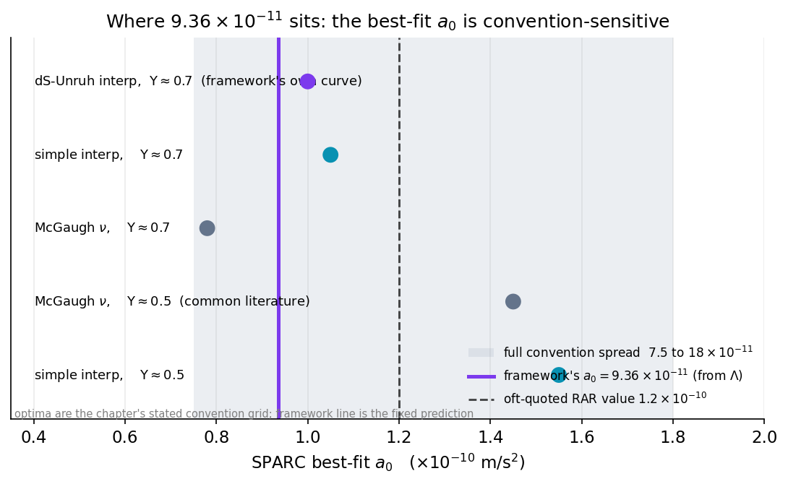

***Figure 18.3 — The best-fit $a_0$ is convention-sensitive, both ways.*** Each dot is the SPARC-optimal $a_0$ for one choice of interpolating function and mass-to-light ratio $\Upsilon$; the shaded band is the chapter's full reasonable spread ($7.5$ to $18\times10^{-11}\,$m/s$^2$). The framework's *fixed* value $9.36\times10^{-11}$ (purple vertical line) sits comfortably inside the band, and the optimum on the framework's *own* de Sitter-Unruh curve (top purple dot, $\approx1.0\times10^{-10}$) lands right beside it. The optima scatter on both sides of the framework's value — "too high" under McGaugh-$\nu$ at $\Upsilon\!\approx\!0.7$, "too low" under McGaugh-$\nu$ at $\Upsilon\!\approx\!0.5$ — which is exactly why the RAR is *non-diagnostic* of the precise value. The dot positions are the chapter's stated convention grid, not an independent fit.

**Source:** Figure generated by [`book/figures/ch18_a0_convention_spread.py`](https://github.com/carlzimmerman/zimmerman-formula/blob/main/book/figures/ch18_a0_convention_spread.py). Framework value $a_0=c^2\sqrt{\Lambda/32\pi}=9.36\times10^{-11}$, framework spine paper https://doi.org/10.5281/zenodo.20721540; convention dependence of the SPARC RAR fit, McGaugh, Lelli & Schombert 2016, PRL 117, 201101 (arXiv:1609.05917) and SPARC, Lelli, McGaugh & Schombert 2016, AJ 152, 157 (arXiv:1606.09251).

## Summary

- **Two ways to measure a galaxy's gravity.** The **baryonic acceleration** $g_{\text{bar}}$ is what Newton predicts from the visible (stars + gas) matter; the **observed acceleration** $g_{\text{obs}}$ is what we measure from how fast things orbit. If only visible matter existed, the two would always be equal. They are not — but they are related with stunning regularity.
- **The radial-acceleration relation (RAR)** ties $g_{\text{obs}}$ to $g_{\text{bar}}$ along a single tight curve across ~2,700 points in 153 galaxies (the **SPARC** catalog), with only ~0.11 dex scatter, much of it measurement error. The curve hugs the Newtonian diagonal at high accelerations and bends to $g_{\text{obs}} \to \sqrt{g_{\text{bar}}\,a_0}$ at low accelerations. The bend defines the acceleration scale $a_0 \approx 1.2 \times 10^{-10}\ \text{m/s}^2$.
- **The baryonic Tully–Fisher relation (BTFR)** ties a galaxy's total baryonic mass to the fourth power of its flat rotation speed: $M \propto V^4$, holding over a million-fold range in mass with tiny scatter, and with no dependence on galaxy size.
- **One follows from the other.** Substituting $g_{\text{obs}} = V^2/R$ and $g_{\text{bar}} = GM/R^2$ into the deep-MOND law $g_{\text{obs}} = \sqrt{g_{\text{bar}}\,a_0}$ gives $V^4 = G M a_0$ exactly — the radius cancels, which is why the BTFR ignores galaxy size. The same single $a_0$ sets both the RAR bend and the BTFR zero point.
- **The data are *too clean*.** These relations are tighter and more universal than the standard dark-matter galaxy-formation model naturally produces — a strong hint that a single organizing principle (an acceleration scale) is at work.
- **The precise value of $a_0$ is convention-sensitive.** The SPARC best-fit $a_0$ depends jointly on the interpolating function, the mass-to-light ratio $\Upsilon$, and the fit weighting; across reasonable choices it ranges ~$7.5\times10^{-11}$ to ~$1.8\times10^{-10}$. The framework's $9.36\times10^{-11}$ sits inside that spread with a small penalty ($\lesssim 0.5\%$ on the framework's own interpolation), so the RAR is **non-diagnostic** of $a_0$'s exact value — neither a win nor a deficit, both ways.
- **These successes are MOND-family-shared, not unique.** The RAR, the BTFR, and $V^4 = GMa_0$ are reproduced by every MOND-family theory, including this book's framework. They are the shared empirical bedrock — the bar every theory must clear — not a private fingerprint of any one of them.

## Questions

1. **(Easy.)** In your own words, what are the two different ways we can measure the gravitational acceleration at a point in a galaxy, and what would the relationship between them look like if galaxies contained *only* the matter we can see?

2. **(Easy–medium.)** The baryonic Tully–Fisher relation counts the *gas* as well as the stars, whereas the original 1977 Tully–Fisher relation used only luminosity. Why does including the gas matter especially for small, faint, dwarf galaxies? What would go wrong if you ignored it?

3. **(Medium — calculation.)** A galaxy has a flat rotation speed of $V = 220\ \text{km/s}$. Using $V^4 = G M a_0$ with $a_0 = 1.2\times10^{-10}\ \text{m/s}^2$, predict its baryonic mass in solar masses. Then redo the calculation with the framework's $a_0 = 9.36\times10^{-11}\ \text{m/s}^2$. By what percentage does your predicted mass change, and which way? (This is the worked example run backwards — and a feel for how sensitive the answer is to $a_0$.)

4. **(Medium.)** The chapter argues that the radial-acceleration relation is "too clean" to be a comfortable result for the dark-matter model. Explain the reasoning. What is it about a *halo-assembly* history of mergers and collisions that you'd naively expect to produce, and why does the tightness of the observed relation cut against that expectation? Then give the strongest counter-argument a dark-matter advocate can make.

5. **(Medium–hard.)** Derive $V^4 = G M a_0$ yourself, starting from $g_{\text{obs}} = \sqrt{g_{\text{bar}}\,a_0}$, $g_{\text{obs}} = V^2/R$, and $g_{\text{bar}} = GM/R^2$. At which step does the radius $R$ cancel, and explain in words why that cancellation is the reason the BTFR has no dependence on a galaxy's physical size.

6. **(Research-level.)** The chapter claims that the SPARC best-fit $a_0$ is "convention-sensitive" and that the framework's value of $9.36\times10^{-11}\ \text{m/s}^2$ sits inside the spread with only a small penalty. Design a concrete analysis to test this claim honestly. Which three ingredients would you vary, over what ranges, and what statistic would you report? Crucially: why is it *methodologically essential* to grade the framework's $a_0$ using the framework's own interpolating function rather than McGaugh's, and how could using the wrong one manufacture either a false "win" or a false "deficit"? (If you want the deep end: how would the contested, evolving-dark-energy prediction of Chapter 25 change whether a single constant $a_0$ is even the right thing to fit?)

# Chapter 19: What MOND Gets Right — and Its Real Problems

> *A good scientist keeps two columns. One is headed "wins." The other is headed "losses." The honest ones do not let the first column hide the second.*

In the last two chapters we met Milgrom's idea — that below a tiny acceleration scale, $a_0 \approx 1.2 \times 10^{-10}\ \mathrm{m/s^2}$, the familiar rules of motion change — and we met the two great regularities it predicts: the radial-acceleration relation (RAR) and the baryonic Tully–Fisher relation (BTFR). Both are real, both are tight, and both fall out of MOND with almost no wiggle room. If that were the whole story, this would be a short and triumphant chapter.

It is not the whole story. MOND is one of the most successful *and* one of the most troubled ideas in modern astrophysics, and it manages to be both at the same time. It nails individual galaxies with a confidence that genuinely embarrasses the dark-matter picture. And it stumbles — sometimes badly — when you take it to galaxy clusters, when you ask it to bend light, and when you ask it to reproduce the infant universe seen in the cosmic microwave background.

This chapter is a scorecard. We are going to lay the wins and the losses side by side, in the same breath, without flinching at either column. We do this for two reasons. First, because it is simply the honest thing to do, and honesty is the whole spirit of this book. Second — and this matters for what comes later — because the framework at the heart of this book is *a member of the MOND family*. It inherits some of these wins. It inherits some of these losses. And in Part VI, when we put the framework on trial, I am going to hold it to exactly the standard we are about to set here for MOND. If I let MOND off easy now, I would have to let the framework off easy later, and that would make this book worthless to you. So let us be fair, and let us be tough, in equal measure.

## A reminder of the playing field

Before the scorecard, one quick orientation, because the rest of the chapter leans on it.

Every system we look at — a single galaxy, a cluster of galaxies, the whole cosmos — has a characteristic acceleration. For a star circling a galaxy, the acceleration is roughly $v^2/r$, the same centripetal pull you feel on a merry-go-round, where $v$ is the star's orbital speed and $r$ its distance from the center. The question MOND asks of every system is simple: **is the acceleration here above or below $a_0$?**

- **Above $a_0$** (the "high-acceleration" regime): the inner parts of galaxies, the Solar System, anywhere gravity is strong. Here MOND says gravity behaves exactly as Newton and Einstein described. Nothing changes. This is why MOND does not blow up the Solar System — a point we will return to, because it matters enormously for the framework.
- **Below $a_0$** (the "deep-MOND" or "low-acceleration" regime): the outskirts of galaxies, the faint dwarf galaxies, the tenuous gas far from any center. Here MOND says the effective gravity is *stronger* than Newton would predict from the visible matter alone. This extra pull is what, in the dark-matter picture, we would attribute to a halo of invisible particles.

The number $a_0$ is the hinge. Everything in MOND turns on which side of it you are standing. Keep that picture in your head — above and below a single threshold — and the scorecard will read cleanly.

## The wins: galaxies, almost for free

Let us start with the column that makes MOND impossible to dismiss.

### One law, hundreds of galaxies, no per-galaxy tuning

Here is the thing that should give any honest scientist pause. Take the SPARC database — a catalog of about 175 disk galaxies with carefully measured rotation curves and infrared photometry that traces their stellar mass. These galaxies span more than five orders of magnitude in mass, from tiny gas-rich dwarfs to giant spirals. They have wildly different shapes, sizes, gas fractions, and histories.

Now feed each galaxy's *visible* matter — stars and gas, nothing else — into the MOND formula. Out comes a prediction for the rotation curve: how fast things should orbit at every radius. For galaxy after galaxy, that prediction lands on the measured curve. Not approximately. Not on average. *Curve by curve*, including the little bumps and wiggles where a spiral arm or a ring of gas locally piles up matter — a phenomenon astronomers call **Renzo's rule**: every feature in the visible matter has a corresponding feature in the rotation curve.

And it does this with essentially **one free number per galaxy** — the stellar mass-to-light ratio, which tells you how much stellar mass corresponds to the light you see. That ratio is not even really free; it is pinned down within a narrow range by stellar-population models, and the value MOND prefers agrees with what those independent models say it should be. There is no per-galaxy dark-halo profile to tune, no concentration parameter, no halo mass to dial in.

Contrast that with the dark-matter picture. To fit the same galaxies, the standard approach gives each one its own dark halo, with (at least) a characteristic density and a characteristic radius — two or more free numbers per galaxy that you adjust until the fit works. The fits are good, but they are *fits*. MOND doesn't fit; it *predicts*. That distinction — predicting versus fitting — is the heart of why MOND refuses to die.

> **Deeper Dive: the algebraic MOND relation and the RAR**
>
> The cleanest statement of the galaxy-scale success is the radial-acceleration relation. Define two accelerations at each radius $r$ in a galaxy:
> $$g_{\mathrm{bar}}(r) = \frac{G\,M_{\mathrm{bar}}(<r)}{r^2}, \qquad g_{\mathrm{obs}}(r) = \frac{v_{\mathrm{obs}}^2(r)}{r},$$
> where $g_{\mathrm{bar}}$ is the Newtonian acceleration from the *baryons* (stars + gas) enclosed within $r$, and $g_{\mathrm{obs}}$ is the actual centripetal acceleration inferred from the measured circular speed $v_{\mathrm{obs}}$.
>
> Empirically (McGaugh, Lelli & Schombert 2016, on ∼2700 data points from SPARC), these two are locked together by a one-parameter relation,
> $$g_{\mathrm{obs}} = \frac{g_{\mathrm{bar}}}{1 - e^{-\sqrt{g_{\mathrm{bar}}/g_\dagger}}},$$
> with a single scale $g_\dagger \approx 1.2 \times 10^{-10}\ \mathrm{m/s^2}$ — numerically $a_0$ — and an *orthogonal* scatter of only about 0.13 dex, much of which is consistent with observational error. The two limits are the whole of MOND:
> $$g_{\mathrm{obs}} \to g_{\mathrm{bar}} \quad (g_{\mathrm{bar}} \gg a_0, \ \text{Newtonian}), \qquad g_{\mathrm{obs}} \to \sqrt{g_{\mathrm{bar}}\, a_0} \quad (g_{\mathrm{bar}} \ll a_0, \ \text{deep-MOND}).$$
>
> The algebraic ("modified-gravity-flavored") version of MOND writes this with an *interpolating function* $\mu(x)$:
> $$\mu\!\left(\frac{g}{a_0}\right) g = g_{\mathrm{bar}}, \qquad \mu(x) \to 1 \ (x \gg 1), \quad \mu(x) \to x \ (x \ll 1),$$
> where $g$ is the true acceleration. A common choice is the "simple" function $\mu(x) = x/(1+x)$. The framework of this book will use its *own* interpolation, motivated by the de Sitter–Unruh temperature rather than chosen by hand — $g_{\mathrm{obs}} = \sqrt{g_{\mathrm{bar}}^2 + g_{\mathrm{bar}}\, a_0}$ — and we will be scrupulous in Part V about judging the framework on *that* curve, not on someone else's, because the apparent best-fit value of $a_0$ depends on which interpolation you assume. A word of honest caution that will matter later: the RAR is a triumph *of the whole MOND family*, the framework included, but the precise numerical value of $a_0$ you extract from it is mildly degenerate with your choice of interpolating function and stellar mass-to-light ratio. We will not let anyone — friend or foe of the framework — over-read that number.

***Figure 19.1 — The radial-acceleration relation, MOND's central galaxy-scale win.*** Above the hinge $a_0\approx1.2\times10^{-10}\,\mathrm{m/s^2}$ both curves track Newton's one-to-one line; below it they bend upward to the deep-MOND $\sqrt{g_{bar}\,a_0}$ form. The teal curve is the published RAR fitting function plotted as a model; the purple curve is computed from the framework's own de Sitter–Unruh interpolation $g_{obs}=\sqrt{g_{bar}^2+g_{bar}a_0}$ — they nearly coincide, which is exactly the chapter's point that this win is *shared* across the MOND family. No observational data are plotted.

**Source:** Figure generated by [`book/figures/ch19_rar.py`](https://github.com/carlzimmerman/zimmerman-formula/blob/main/book/figures/ch19_rar.py). RAR fitting function: McGaugh, Lelli & Schombert 2016, PRL 117, 201101 (arXiv:1609.05917), on SPARC (Lelli, McGaugh & Schombert 2016, AJ 152, 157). Framework interpolation: the spine paper, https://doi.org/10.5281/zenodo.20721540.

> **Worked Example: predicting a flat rotation speed from baryons alone**
>
> Let me show you the single most famous MOND prediction, done slowly, on a made-up but realistic galaxy.
>
> Suppose a spiral galaxy has a total baryonic mass (stars plus gas) of $M_{\mathrm{bar}} = 5 \times 10^{10}\ M_\odot$. In SI units, with $M_\odot = 2.0 \times 10^{30}\ \mathrm{kg}$, that is
> $$M_{\mathrm{bar}} = 5 \times 10^{10} \times 2.0 \times 10^{30} = 1.0 \times 10^{41}\ \mathrm{kg}.$$
>
> Far out in the galaxy, beyond where most of the mass lives, the enclosed mass stops growing, and the Newtonian acceleration from the baryons falls off as $g_{\mathrm{bar}} = GM_{\mathrm{bar}}/r^2$. Out there $g_{\mathrm{bar}} \ll a_0$, so we are deep in the MOND regime, where
> $$g_{\mathrm{obs}} = \sqrt{g_{\mathrm{bar}}\, a_0} = \sqrt{\frac{G M_{\mathrm{bar}}}{r^2}\, a_0} = \frac{\sqrt{G M_{\mathrm{bar}}\, a_0}}{r}.$$
>
> Now set this equal to the centripetal acceleration of a circular orbit, $g_{\mathrm{obs}} = v^2 / r$:
> $$\frac{v^2}{r} = \frac{\sqrt{G M_{\mathrm{bar}}\, a_0}}{r}.$$
>
> Look what happens: the radius $r$ cancels on both sides. The orbital speed no longer depends on how far out you go —
> $$v^4 = G\, M_{\mathrm{bar}}\, a_0.$$
> **This is a flat rotation curve, predicted from scratch.** And it is exactly the baryonic Tully–Fisher relation from Chapter 18: $v^4 \propto M_{\mathrm{bar}}$.
>
> Let us put numbers in. Using $G = 6.67 \times 10^{-11}\ \mathrm{N\,m^2/kg^2}$ and $a_0 = 1.2 \times 10^{-10}\ \mathrm{m/s^2}$:
> $$v^4 = (6.67 \times 10^{-11})(1.0 \times 10^{41})(1.2 \times 10^{-10}) = 8.0 \times 10^{20}\ \mathrm{m^4/s^4}.$$
> Taking the fourth root,
> $$v = (8.0 \times 10^{20})^{1/4} \approx 1.7 \times 10^{5}\ \mathrm{m/s} = 170\ \mathrm{km/s}.$$
>
> A flat rotation speed of about 170 km/s for a $5 \times 10^{10}\,M_\odot$ galaxy — which is squarely what real galaxies of that mass actually show. We never mentioned dark matter. We never tuned a halo. We used the visible mass and one universal constant, and the right answer fell out. *That* is why people take MOND seriously, and you should feel the force of it before we start tearing into the losses.

### The successes are deep, not cosmetic

It is worth dwelling for a moment on *why* these wins are impressive, because it is easy to wave them away as "MOND was designed to fit rotation curves." It was not, quite. Milgrom wrote down his rule in 1983 to explain flat rotation curves — but the BTFR, Renzo's rule, the tightness of the RAR, and the success on low-surface-brightness and dwarf galaxies (systems Milgrom had no data on in 1983) were *predictions* that came true afterward. A good scientific idea is one that keeps being right about things it was not built to explain. By that test, MOND scores well at galaxy scales. Honestly, remarkably well.

### A distinctive fingerprint: the external field effect

There is one more galaxy-scale point in the "wins" column, and it is subtle and important, because it is the one prediction that is genuinely *unique* to a MOND-style theory — no dark-matter model makes it. It is called the **external field effect (EFE)**: the idea that the internal dynamics of a small system can be altered just by *sitting inside* the gravitational field of a bigger one, even when that bigger field is perfectly uniform across the small system.

In Newtonian gravity, a uniform external field does *nothing* to a system's internal motions. Stand in an elevator accelerating smoothly upward and play catch — the ball arcs exactly as it would on the ground, because you and the ball and the floor all share the same acceleration. This is the equivalence principle from Chapter 7, and it is sacred in Newton and Einstein. A constant external pull simply cannot be felt from inside.

MOND breaks this — and on purpose, in a particular way. Because the MOND rule depends *nonlinearly* on the total acceleration (remember that $\mu(x)$ function), a small galaxy that would be deep in the MOND regime *on its own* can be pushed back toward Newtonian behavior if it happens to be falling through the strong field of a large neighbor. The external field "switches off" the MOND boost. A dwarf galaxy orbiting near a giant should therefore behave more Newtonian — show less of a mass discrepancy — than an identical dwarf out in isolation.

This is a falsifiable, distinctive signature, and there are tantalizing observational hints of it in the velocity dispersions of dwarf galaxies and in the outskirts of wide stellar systems. I will be honest with you: the observational status of the EFE is still genuinely contested — some claimed detections have been challenged, sign conventions have tripped people up (including, I will admit, in my own working notes), and it is hard to measure cleanly. But the EFE matters for this book for a specific reason. It is a property of *modified dynamics*, and exactly *how* it shows up depends on whether you modify the **force** (modified-gravity MOND) or the **inertia** (modified-inertia MOND). The framework in this book is a modified-*inertia* theory, and that choice changes the EFE's character in ways we will examine in Part V and Part VI. File the EFE away; it will come back as one of the sharpest tools for telling theories apart.

> **Deeper Dive: the EFE and the breaking of the strong equivalence principle**
>
> In an algebraic modified-gravity MOND, the EFE enters because the equation for the potential,
> $$\nabla \cdot \left[ \mu\!\left(\frac{|\nabla\Phi|}{a_0}\right)\nabla\Phi \right] = 4\pi G\, \rho,$$
> is nonlinear in $\nabla\Phi$. For a subsystem with internal field $g_{\mathrm{in}}$ embedded in a uniform external field $g_{\mathrm{ext}}$, the relevant argument of $\mu$ is $|\,\mathbf{g}_{\mathrm{in}} + \mathbf{g}_{\mathrm{ext}}|/a_0$, so the internal dynamics inherit the external field's magnitude. Two regimes:
> - $g_{\mathrm{ext}} \ll g_{\mathrm{in}} \ll a_0$: the subsystem is isolated-deep-MOND; full boost.
> - $g_{\mathrm{in}} \ll g_{\mathrm{ext}} \ll a_0$: the subsystem is *dominated* by the external field; it behaves quasi-Newtonian with an effective gravitational constant $G_{\mathrm{eff}} \approx G/\mu(g_{\mathrm{ext}}/a_0)$, i.e. a *rescaled* but Newtonian-shaped dynamics.
>
> This is a violation of the **strong equivalence principle** — local internal physics depends on the external gravitational environment — and it is the cleanest qualitative discriminator between MOND-family theories and particle dark matter, which obeys the SEP and shows *no* such effect (a dark halo doesn't care about a uniform external field). In a *modified-inertia* formulation (Milgrom 1994, 2011, 2022), the EFE is real but its functional form differs: inertia depends on the *full trajectory's* acceleration history through a time-nonlocal kernel, so the EFE for a system on a *time-varying* external field is not simply read off from the instantaneous $g_{\mathrm{ext}}$. We will need this distinction in Part VI, because it is one of the few places the framework makes a prediction that differs, even slightly, from generic MOND.

So much for the wins. They are real, and they are large. Now the other column.

## The losses, part one: galaxy clusters

Here is the first place MOND hurts.

Galaxy clusters are the largest gravitationally bound things in the universe — collections of hundreds or thousands of galaxies, swimming in a vast cloud of hot X-ray-emitting gas, the whole thing held together by gravity. They were where the missing-mass problem was *born*, back in 1933, when Fritz Zwicky weighed the Coma cluster and found it far too heavy (Chapter 3). You would hope that a theory built to explain missing mass would handle the very system that revealed the problem.

MOND does not, fully. And this is well known, and MOND's own founders say so plainly.

When you apply MOND to a cluster — taking the visible matter, which in clusters is *mostly* the hot gas, not the stars, and computing the MOND-boosted gravity — you find it is *not enough*. The cluster is still moving too fast, its gas is still too hot, for the gravity MOND can supply from the visible matter. There is a leftover. The visible mass falls short of what is needed by a factor of roughly **two** in the central regions.

***Figure 19.2 — The cluster residual $\eta(r)$: MOND's clearest loss.*** A residual mass ratio $\eta\equiv M_{dyn}/M_{MOND}$ sits near $\sim2$ in the cluster center and relaxes toward $1$ in the outskirts — MOND removes most of the missing mass (the dotted line at $\sim5$–6 is what you'd need with *no* modification) but leaves a stubborn central factor of two. This is an illustrative, schematic profile of the characteristic shape, not real per-cluster data points.

**Source:** Figure generated by [`book/figures/ch19_cluster_eta.py`](https://github.com/carlzimmerman/zimmerman-formula/blob/main/book/figures/ch19_cluster_eta.py). Schematic of the residual reported by Sanders 1999, 2003 and Pointecouteau & Silk 2005; missing-mass baseline from Zwicky 1933, Helv. Phys. Acta 6, 110. MOND framework: Milgrom 1983, ApJ 270, 365; review Famaey & McGaugh 2012 (arXiv:1112.3960).

This is the **cluster mass discrepancy**: the residual, unexplained factor by which the dynamical mass of a cluster (what its motions and gas temperature demand) exceeds the mass MOND can account for from baryons. MOND removes most of the discrepancy that dark matter would otherwise explain — it does real work — but it leaves a stubborn residual right where you would most want it gone.

Let me put a number on it, carefully.

> **Deeper Dive: the residual cluster discrepancy, $\eta$**
>
> Define a *residual mass ratio*
> $$\eta(r) \equiv \frac{M_{\mathrm{dyn}}(<r)}{M_{\mathrm{MOND}}(<r)},$$
> where $M_{\mathrm{dyn}}$ is the mass required by the dynamics (typically from the X-ray gas via the hydrostatic equilibrium equation) and $M_{\mathrm{MOND}}$ is the mass MOND predicts is gravitating, i.e. the baryonic mass with the MOND boost already applied. For an isolated isothermal gas in hydrostatic equilibrium,
> $$M_{\mathrm{dyn}}(<r) = -\frac{k_B T\, r}{G\, \mu_{\mathrm{mol}} m_p}\left(\frac{d\ln \rho_{\mathrm{gas}}}{d\ln r} + \frac{d\ln T}{d\ln r}\right),$$
> with $k_B$ Boltzmann's constant, $T$ the gas temperature, $\mu_{\mathrm{mol}} m_p$ the mean molecular mass. Comparing this to the MOND prediction over a sample of clusters (Sanders 1999, 2003; Pointecouteau & Silk 2005; and many since) gives, characteristically,
> $$\eta \sim 2 \ \text{at the cluster center}, \qquad \eta \to 1 \ \text{at large radius}.$$
> So MOND *under*-predicts the central mass of a cluster by about a factor of two, while doing fine in the outskirts. A residual factor of two is much smaller than the factor of $\sim$5–6 of "missing mass" you would need *without* any modification, but it is not zero, and it is robustly present.
>
> Two honest caveats, both ways. (1) The X-ray-hydrostatic mass estimate has its own systematics — non-thermal pressure, gas clumping, departures from equilibrium — and recent high-resolution X-ray data (e.g. from the XRISM mission) have tightened these, in some analyses *reducing* the inferred central $\eta$ toward $\sim$1 and killing the high-$\eta$ branch that came from over-trusting simple hydrostatic models. So the size of the residual is partly a measurement question, not purely a theory question. (2) The residual is *right-signed* and roughly the right *magnitude* to be addressed by environmental physics — for instance, the local matter density entering the acceleration scale — but I want to be clear that "addressed to order of magnitude" is *not* "cured." The framework in this book lands the cluster residual to the right sign and roughly the right size with zero new parameters, and *still* does not fully close it. We will treat that, in Chapter 29, as an honest partial result, not a solution.

Historically, MOND's defenders proposed that the cluster residual is hiding some *ordinary* matter we haven't detected — cool gas, faint stars, or even ordinary-matter neutrinos with a small but nonzero mass, which would clump on cluster scales but not galaxy scales. This is not crazy; clusters are big, and there could be baryons we have missed. But it has the uncomfortable flavor of "MOND plus a little dark matter," which weakens the theory's great selling point of needing no dark stuff at all. The most honest statement, and the one MOND's own founders make, is this: **at galaxy scales MOND is a triumph; at cluster scales it leaves a real, unresolved residual.** Any theory in the MOND family — *including the framework in this book* — inherits a version of this problem and must answer for it.

## The losses, part two: the Bullet Cluster

There is one cluster that deserves its own paragraph, because it is the single image most often deployed against MOND, and you should understand exactly what it does and does not show.

The Bullet Cluster is a pair of galaxy clusters caught in the act of colliding. When two clusters smash together, three things happen at three different rates. The galaxies themselves — tiny targets in a vast volume — sail right through each other almost untouched, like two swarms of gnats passing through one another. The hot gas, which fills the space between galaxies and is the *dominant* visible mass, slams together, shocks, heats, and gets left behind in the middle, lagging the galaxies. And the *gravity* — measured independently by how the collision bends the light of background galaxies, an effect called gravitational lensing (Chapter 8) — follows the galaxies, *not* the gas.

In the dark-matter picture this is exactly expected: most of the mass is collisionless dark matter that, like the galaxies, passes straight through, so the lensing (tracking total mass) sits with the galaxies, *separated* from the gas. In plain MOND, where all the gravitating mass *is* the visible mass and the visible mass is mostly the gas, you would naively expect the gravity to sit with the gas. It does not. The lensing is offset from the gas. This is a real difficulty for MOND, and it is not honest to pretend otherwise.

But — and here is the both-ways part — the Bullet Cluster is not the clean kill it is often presented as. The lensing centroid sits with the galaxies, yes, but the *amount* of lensing mass there is, once again, a factor of roughly two more than even the galaxies' visible mass can supply in MOND. So the Bullet is really the *cluster residual problem again*, now made vivid by a collision, plus the awkward offset. It says MOND clusters need extra unseen mass; it does *not* by itself say that mass must be a new fundamental particle (cluster neutrinos or undetected baryons would do). The Bullet Cluster is a genuine wound for MOND, but it is the *same* wound as the residual $\eta \sim 2$, photographed dramatically. I tell you this not to excuse MOND but so that you can weigh the evidence at its true weight — neither more nor less.

## The losses, part three: bending light and the early universe

Now we come to the deepest problem, the one that occupied theorists for decades, and the one that bears most directly on the framework in this book.

Everything we have said so far — the rotation curves, the BTFR, the clusters — is about how things *move* in a gravitational field. But gravity does more than move massive things. It bends light, and it shaped the entire infant universe. To describe those, a plain *non-relativistic* rule like Milgrom's 1983 formula is simply not enough. You cannot bend light with a recipe that only knows about slow-moving stars. You need a *relativistic* theory — one built in the language of Einstein's spacetime (Chapters 7 and 8), one that reduces to MOND for slow motions in galaxies but also tells light how to travel and tells the early plasma how to ripple.

This is the problem of **relativistic MOND**: finding a complete, Einstein-compatible field theory whose weak, slow-motion limit *is* Milgrom's rule, and which also correctly bends light and grows cosmic structure. It turns out to be brutally hard, and the history of the attempts is essential background for understanding why the framework makes the choices it does.

### Why bending light is the crux

In Einstein's General Relativity, the amount a ray of light bends as it passes a mass is fixed by the *same* mass and the *same* spacetime geometry that governs how slow things move — there is one geometry, and both light and matter follow it. So if you have a galaxy whose rotation tells you "there's this much effective gravity here," GR forces the lensing of background light to match.

A naive MOND has no such guarantee. If you just declare a new rule for the *force* on slow-moving stars, you have said nothing about light. To get the lensing right, you must somehow make the *extra* MOND gravity also bend light by the right amount — and not just any amount, but the specific amount that keeps lensing masses and dynamical masses agreeing, the way they do in real systems. Forcing those two to agree, inside a consistent relativistic theory, with the Solar System still safe, turned out to be the central obstacle. It is, frankly, where most relativistic-MOND theories go to die.

### TeVeS, and the day the sky fell on it

The most celebrated attempt was Jacob Bekenstein's 2004 theory, **TeVeS** — short for **Te**nsor–**Ve**ctor–**S**calar. The name tells you its ingredients. Ordinary GR has one field, the spacetime metric (a "tensor"). TeVeS adds two more: a vector field and a scalar field, carefully arranged so that, in galaxies, the scalar field's pull reproduces the MOND boost, *and* — crucially — the vector field's presence makes light bend by the extra amount needed to match the dynamics. It was a genuine intellectual achievement: for the first time, MOND had a relativistic body, and it could compute gravitational lensing and even make a stab at cosmology.

TeVeS had troubles from the start — it strained to fit the detailed pattern of the cosmic microwave background (the early-universe snapshot of Chapter 10), and some versions developed instabilities. But it survived, more or less, until one day in 2017 the sky fell on it. Literally.

On 17 August 2017, the gravitational-wave observatories LIGO and Virgo detected **GW170817**: the merger of two neutron stars. And 1.7 seconds later, gamma-ray telescopes caught the flash of light from the same event, 130 million light-years away. Two messengers — gravitational waves and light — raced across 130 million years of cosmic distance and arrived within a couple of seconds of each other. That tiny gap puts an extraordinarily tight bound on the difference between the speed of gravitational waves, $c_T$, and the speed of light, $c$:
$$\left|\frac{c_T - c}{c}\right| \lesssim 10^{-15}.$$
In words: **gravitational waves travel at the speed of light**, to about one part in a thousand trillion. This result, written $c_T = c$, is one of the cleanest single measurements in modern physics.

It was also a wrecking ball for the relativistic-MOND theories of the day. The trick those theories used to bend light the right amount — the extra vector and scalar fields, woven into the geometry — generically *also* changed the speed of gravitational waves, pushing $c_T$ away from $c$. The very machinery that let TeVeS-type theories match lensing was the machinery that $c_T = c$ forbade. In a single night, a whole class of relativistic-MOND theories was ruled out, or forced into contortions to survive.

***Figure 19.3 — The lensing wall and its two escape routes.*** GW170817's measurement $|c_T-c|/c\lesssim10^{-15}$ switches off the disformal vector/scalar couplings that TeVeS-type theories used to bend light, leaving a no-go: a covariant, $c_T=c$, Solar-System-safe relativistic MOND must either adopt a preferred frame (breaking Lorentz invariance) or carry an irreducibly phenomenological lensing function. AeST takes the second route; the framework of this book takes the first *and* inherits an AeST-class free function. A conceptual schematic of the chapter's argument, not a calculation.

**Source:** Figure generated by [`book/figures/ch19_lensing_nogo.py`](https://github.com/carlzimmerman/zimmerman-formula/blob/main/book/figures/ch19_lensing_nogo.py). Speed-of-gravity bound: the LIGO/Virgo GW170817 multimessenger detection (2017). Surviving relativistic MOND: Skordis & Złośnik 2021, PRL 127, 161302 (arXiv:2007.00082). Framework's preferred-frame/phenomenological-lensing standing: the spine paper, https://doi.org/10.5281/zenodo.20721540.

> **Deeper Dive: why $c_T = c$ kills the lensing trick, and the no-go that follows**
>
> In a generic scalar–tensor or tensor–vector–scalar theory, the propagation speed of tensor gravitational waves is modified by the extra fields' coupling to curvature. Schematically, terms that couple a vector field $A^\mu$ or derivatives of a scalar to the Riemann/Weyl tensor produce a *disformal* contribution to the effective metric seen by gravitons,
> $$\tilde g_{\mu\nu} = g_{\mu\nu} + B(\phi, X)\, \partial_\mu\phi\,\partial_\nu\phi + (\text{vector terms}),$$
> and a nonzero disformal factor $B$ generically yields $c_T \neq c$. The lensing enhancement in TeVeS-type theories rode on *exactly* these disformal/vector couplings: they are what made the extra "phantom" gravity bend light. Enforcing $c_T = c$ to one part in $10^{15}$ switches those couplings off, and with them the lensing boost — leaving the theory unable to match galaxy-cluster lensing with baryons alone.
>
> One can sharpen this into a statement that matters for the framework. **No-go (informal):** *a covariant, ghost-free relativistic completion of MOND with $c_T = c$ cannot reproduce both the MOND dynamics and the observed gravitational lensing while remaining safe in the Solar System, unless it introduces a preferred frame (breaks local Lorentz invariance) or carries an irreducibly phenomenological lensing input (a free function chosen to fit, not derived).* This is not a folk theorem; it is the lived experience of the field after 2017, and it is the reason the surviving relativistic-MOND theory, **AeST** (Skordis & Złośnik 2021, "**Ae**ther-**S**calar-**T**ensor"), keeps a preferred-frame vector field *and* puts the lensing into a free function tuned to data rather than predicted. I want to flag, with full honesty and quarantine intact, that the framework in this book lives squarely inside this no-go: its lensing is **irreducibly phenomenological** — it does not derive the bending of light from first principles, it inherits an AeST-class free function — and it is **preferred-frame** (Lorentz-violating), which, as we will see in Chapter 30, is not only the price of the lensing no-go but also, surprisingly, an opening toward particle physics. We will give the lensing wall a whole chapter (Chapter 28) and we will *not* pretend it is solved. It is a real weakness, shared with the best relativistic-MOND theory going.

### AeST: the survivor, and what it costs

After GW170817, the relativistic-MOND program did not die, but it changed shape. The theory that survived, and that now carries the torch, is **AeST** — Aether-Scalar-Tensor — built by Constantinos Skordis and Tom Złośnik in 2021. AeST keeps a vector field (an "aether," a field that quietly picks out a preferred frame of rest at each point in space) and a scalar, arranged so that:

- in galaxies it reproduces MOND;
- it bends light correctly, *but* by carrying a free function — a piece of the theory's recipe that is *chosen to match the lensing data* rather than predicted from deeper principles;
- it keeps $c_T = c$, by construction, so it survives GW170817;
- and it can grow cosmic structure and even fit the cosmic microwave background acoustic peaks about as well as standard dark matter — a genuine and hard-won achievement, because matching the CMB was historically MOND's worst failure.

That last point deserves emphasis as a *win* for the relativistic-MOND program: AeST shows that a MOND-family theory *can*, in principle, reproduce the early-universe data that people long said only particle dark matter could. The cost is two things you must keep your eye on. First, the **preferred frame**: AeST is not fully Lorentz-invariant in the way GR is; there is a field defining "rest," which is exactly the kind of structure the lensing no-go says you cannot avoid. Second, the **free lensing function**: the light-bending is fit, not derived. These are not fatal — every theory has inputs — but they are honest costs, and a fair scorecard records them in the losses column even as the CMB success goes in the wins column.

## Setting up the framework: a modified-inertia member of this family

We have now drawn the full scorecard for MOND, and it is time to say, plainly, where the framework of this book sits on it. I will do this briefly here and at length in Parts V and VI; the point now is just to locate the framework on the map we have just drawn.

The framework is a **modified-inertia** member of the MOND family. Recall the fork from Chapter 17: you can get MOND-like behavior either by modifying the *gravitational force* (the algebraic $\mu(x)$ and AeST live on this branch) or by modifying *inertia itself* — the resistance of matter to being accelerated (Milgrom 1994, 1999, 2022). The framework takes the second road. Its physical story, which we will build carefully starting in Chapter 20, is that empty space in a universe with a cosmological constant $\Lambda$ has a tiny temperature floor — the **de Sitter–Unruh temperature** — and that matter in near-free-fall feels this floor as a small extra inertia. Extra inertia, dressed up, looks like extra gravity, and below the threshold acceleration it reproduces MOND. Because it modifies *inertia* and not the *force*, the modification switches off cleanly when accelerations are large — so the Solar System, where accelerations are far above $a_0$, is automatically safe (this is the same "high-acceleration $\to$ Newtonian" property that protects all of MOND, but the framework gets it for a clean physical reason). We will see in Part VI that this Solar-System safety, made precise, becomes one of the framework's sharpest *distinctive* features against modified-*gravity* MOND, testable by spacecraft like Cassini.

Now hold the framework to the scorecard we just built for the whole family, both ways:

- **The galaxy wins it inherits.** The RAR and BTFR successes are real and they belong to the framework too — but I want to be honest that they are *shared* with the entire MOND family, not unique to this framework. Getting rotation curves right is the price of admission to this club, not a victory over the other members. We will not claim the RAR or BTFR as the framework's personal triumph.
- **The cluster residual it inherits.** The $\eta \sim 2$ central discrepancy does not vanish for the framework. As I noted in the deeper-dive above, the framework's environmental version of $a_0$ lands the residual to the right sign and roughly the right size with no new knobs — an honest *partial* result that we will examine in Chapter 29 — but it does *not* fully cure clusters, any more than plain MOND does.
- **The lensing wall it inherits.** This is the big one. The framework's gravitational lensing is **irreducibly phenomenological**: it sits inside the post-2017 no-go, it is **preferred-frame** (Lorentz-violating), and it carries an AeST-class free function for light-bending. It does *not* derive lensing from first principles. Chapter 28 is devoted to this wall, and I will not paper over it.
- **What it can claim that's its own.** The framework's distinctive content is not at the galaxy scale, where everyone agrees, but in two places: (1) it ties $a_0$ to *dark energy* through a specific formula, $a_0 = c^2\sqrt{\Lambda/32\pi}$, which makes $a_0$ **track the dark-energy density through cosmic time** — a falsifiable signature-prediction we will spend Part VI testing; and (2) being modified-*inertia* and preferred-frame, it makes Solar-System and Lorentz-violation predictions that differ, in principle, from modified-gravity MOND. I want to be very careful here, and the rest of this book will hold the line: the *form* of that $a_0$ formula is forced by several independent arguments, but the *value* of $a_0$ is **not derived** — there is one geometric posit (a number $\kappa = 1/2$, which Chapter 23 will show *cannot* be derived from the theory's own principles) standing between the framework and a parameter-free prediction. And the Standard Model — particle masses, the proton-to-electron ratio, the gauge groups — is entirely **walled off**; the framework touches none of it. It is not a theory of everything yet, as frustrating as it may be.

That is the map. The framework is a specific, physically-motivated member of the MOND family that inherits the family's galaxy-scale strengths and cluster-and-lensing weaknesses, and adds one genuinely new, falsifiable idea — that the galactic acceleration scale is set by dark energy. Whether that new idea survives contact with the next decade's data is the subject of Part VI. Our job, having now seen how *unsparing* a fair scorecard for MOND looks, is to be exactly that unsparing with the framework when its turn comes.

## Summary

- **MOND's galaxy-scale wins are real and deep.** With essentially one (independently-constrained) free number per galaxy — the stellar mass-to-light ratio — MOND predicts the rotation curves of hundreds of galaxies across five orders of magnitude in mass, including feature-by-feature detail (Renzo's rule), and it predicted the BTFR and the tightness of the RAR *before* the data confirmed them. This is prediction, not fitting, and it is why MOND endures.
- **The hinge is a single acceleration $a_0$.** Above it, Newton; below it, an enhanced effective gravity. This automatic "Newtonian at high acceleration" behavior is what keeps the Solar System safe.
- **The external field effect (EFE)** is MOND's one *uniquely distinctive* galaxy-scale prediction — internal dynamics depend on a uniform external field, violating the strong equivalence principle, something no dark-matter halo can do. Its observational status is real but still contested, and its exact form depends on whether you modify force or inertia.
- **Galaxy clusters are MOND's clearest failure.** A residual central mass discrepancy of $\eta \sim 2$ remains after the MOND boost — smaller than the factor of $\sim$5–6 you'd need with no modification, but real and unresolved. The Bullet Cluster dramatizes this same residual (plus an offset between gas and lensing) but is not, by itself, proof of a *fundamental particle*.
- **Relativistic MOND is brutally hard.** A plain non-relativistic rule cannot bend light or describe the early universe. TeVeS gave MOND a relativistic body and could lens light — until **GW170817** showed $c_T = c$ to one part in $10^{15}$, killing the very couplings TeVeS used. The survivor, **AeST**, keeps a preferred frame and a *free lensing function*, but earns a genuine win by fitting the CMB about as well as dark matter.
- **A no-go now hangs over the whole program:** with $c_T = c$ and Solar-System safety, a covariant relativistic MOND cannot derive both dynamics *and* lensing without a preferred frame or an irreducibly phenomenological lensing input.
- **The framework of this book is a modified-*inertia*, preferred-frame member of this family.** It inherits the galaxy wins (shared, not unique), inherits the cluster residual (addressed to order-of-magnitude with no new knobs, but *not* cured), and inherits the lensing wall (its lensing is irreducibly phenomenological and Lorentz-violating). Its own distinctive claim is that $a_0$ is set by dark energy and *tracks it through cosmic time*. The form of that link is forced; the *value* of $a_0$ is **not derived** (one geometric posit, $\kappa=1/2$); the Standard Model is **walled off**. Not a theory of everything yet, as frustrating as it may be — and Part VI will hold it to exactly the standard this chapter held MOND.

## Questions

1. **(Easy.)** In one or two sentences, explain in your own words what the acceleration scale $a_0$ does in MOND — what happens to gravity *above* it and *below* it, and why this keeps the Solar System looking Newtonian.

2. **(Easy–medium.)** Why is it more impressive that MOND *predicts* a galaxy's rotation curve than that a dark-matter model *fits* it? In your answer, count the free parameters each approach uses per galaxy.

3. **(Medium.)** Redo the Worked Example for a galaxy ten times more massive, $M_{\mathrm{bar}} = 5\times10^{11}\,M_\odot$. Use $v^4 = G M_{\mathrm{bar}}\, a_0$. By what factor does the predicted flat rotation speed increase? (You should find it goes up by $10^{1/4} \approx 1.78$, *not* by 10 — explain why the fourth-root matters.)

4. **(Medium.)** Explain the external field effect to a friend who knows the equivalence principle from Chapter 7. Why does a *uniform* external field, which does nothing in Newtonian gravity, change a small galaxy's internal dynamics in MOND? Why can no dark-matter halo reproduce this?

5. **(Medium–hard.)** The Bullet Cluster is often called a "proof of dark matter." Using the cluster residual $\eta \sim 2$ from this chapter, explain precisely what the Bullet Cluster *does* show against plain MOND and what it does *not* by itself establish. What additional, non-particle hypotheses could in principle supply the offset lensing mass?

6. **(Research-level.)** GW170817 enforced $c_T = c$ to $\sim 10^{-15}$ and gutted TeVeS-type lensing. State, as carefully as you can, the informal no-go theorem this chapter gives for covariant relativistic MOND. Then identify the *two* escape routes it leaves open (a preferred frame; an irreducibly phenomenological lensing function), and explain which route AeST takes — and which the framework of this book takes. Why does taking the preferred-frame route, while a genuine cost, also open a door toward particle physics (a question Chapter 30 will pursue)?

# Chapter 20: The Central Claim: a₀ = c²√(Λ/32π)

> *Two of the biggest numbers in physics — the one that makes galaxies spin too fast, and the one that makes the whole universe fly apart — might be the same number wearing two hats. This chapter is about why.*

---

## A Single Sentence

We have come a long way to get here. We weighed galaxies with Kepler and Newton (Chapters 2–4). We watched Zwicky and Rubin discover that something is missing — that stars on the edges of galaxies move as though far more mass is tugging on them than we can see. We followed the two roads out of that discovery (Chapter 5): the road of the *particle*, which says the missing mass is real but invisible, and the road of the *law*, which says our equation for how things move is incomplete at very gentle accelerations. We spent the whole of Part 2 learning Einstein's gravity and the expanding, accelerating universe; we learned what inertia, temperature-from-acceleration, and horizons are in Part 3; and in Part 4 we met Milgrom's MOND and the strange, sharp acceleration scale **a₀** that sits at the heart of every galaxy's rotation curve.

Now I am going to tell you the single most important sentence in this book. I will say it plainly, with no equations, the way I would say it to a friend over coffee:

> **The speed limit that governs the slow, outer edges of galaxies appears to be *made of* the dark energy that is pushing the whole universe apart.**

That is the central claim. The number that decides when a galaxy starts to misbehave — the number a₀, which we measured from rotation curves long before anyone knew where it came from — is, in this framework, *not an independent fact about galaxies at all.* It is a disguised measurement of the cosmological constant Λ, the same Λ that the 1998 supernova teams discovered when they found the universe accelerating (Chapter 11). Two of the most famous numbers in modern physics — one from the smallest scales we study gravitationally (the outskirts of single galaxies), one from the largest (the expansion of the cosmos) — turn out, on this account, to be one number.

Let me be honest right away, because honesty is the whole spirit of this book. Saying two numbers are "the same" is a strong claim, and a strong claim has to earn its keep. It could be a coincidence. Numbers in physics sometimes come out close by accident. So the job of this chapter, and really of all of Part 5, is to show you *exactly* what the claim is, *exactly* how the formula works, and *exactly* which parts of it are forced by physics and which parts are a choice. By the end you will be able to compute a₀ yourself, from Λ alone, and get 9.36 × 10⁻¹¹ meters per second squared — the value galaxies actually show. And you will know precisely how much that agreement is worth, and how much it isn't. It is genuinely striking. It is *not* a theory of everything yet, as frustrating as it may be.

So: one sentence, two hats, and here is exactly why they might be one.

---

## What a₀ Is, and Where We Last Saw It

Let me re-fix the one number this whole chapter is about, because we are going to stare at it for a while.

**a₀** (read "a-naught") is an *acceleration* — a rate at which a speed changes. The acceleration you feel when a car pulls away from a stop sign is a few meters per second squared. The acceleration gravity gives you when you trip is about 9.8 meters per second squared, which we call *g*. The acceleration a₀ is

$$a_0 \approx 9.4 \times 10^{-11}\ \text{m/s}^2 .$$

That is staggeringly gentle. It is about a hundred billion times weaker than the gravity at Earth's surface. It is roughly the acceleration you would feel from the Sun's gravity if you were *light-years* away from it. Nothing in your daily life ever comes close to being this gentle. But the outer stars of galaxies, drifting through near-emptiness, do.

In Chapter 17 we met Milgrom's observation: when the gravitational pull a star feels from ordinary matter is *stronger* than a₀, everything behaves exactly as Newton said. When that pull drops *below* a₀ — out in the thin outskirts of a galaxy — the dynamics change, and the change is precisely what makes rotation curves go flat instead of falling off. The number a₀ is the *threshold* between the two regimes. It is the most important single number in galaxy dynamics that we did not, until recently, have any deeper explanation for. Milgrom found it by fitting data. It just *is* what it is — a brute fact, an input.

The central claim of this framework is that a₀ is not a brute fact. It is a *consequence* — a consequence of the universe having a cosmological constant.

> **Margin note.** Throughout this book I write a₀'s canonical value as **9.36 × 10⁻¹¹ m/s²**. You will see Milgrom-tradition papers quote numbers from about 1.0 to 1.2 × 10⁻¹⁰ m/s², depending on the galaxy sample, the assumed stellar mass-to-light ratio, and the interpolation function used. Those are all the same scale, measured slightly differently. We will see in a moment exactly where 9.36 comes from and why it sits comfortably inside that observed spread.

---

## The De Sitter Curvature Scale: The Idea Behind the Formula

Before any equations, I want to plant the *physical* idea, because the formula is just bookkeeping once you have the idea.

The universe is accelerating its expansion. The agent responsible is dark energy, described by the cosmological constant Λ. A universe whose expansion is driven by a constant Λ has a name: **de Sitter space**, after the Dutch astronomer Willem de Sitter, who found this solution to Einstein's equations back in 1917. De Sitter space is, roughly, "what the universe looks like when dark energy wins" — and because dark energy is constant while matter dilutes away as everything spreads out, our universe is slowly *becoming* a de Sitter space. Far in the future it will be almost purely de Sitter.

Now, a de Sitter universe is not flat and featureless. It has a built-in *length* and a built-in *curvature*. Here is the cleanest way to feel it. In an accelerating universe, there are things so far away that the space between us and them is stretching faster than their light can cross it. Their light will never reach us. There is, in other words, a **horizon** — a largest distance from which any signal can ever arrive (we met horizons in Chapter 16). That horizon sits at a definite distance, and that distance is set by Λ. A bigger Λ — more dark energy, faster acceleration — pulls the horizon *closer*. A smaller Λ pushes it away.

Because the horizon distance is set by Λ, you can turn it into a *curvature* — a measure of how sharply spacetime bends on the largest scale — and from a curvature you can build an *acceleration scale*. This is the thing I will call the **de Sitter curvature scale**: a natural acceleration that the geometry of a Λ-driven universe hands you, for free, just by existing. It is built from Λ, the speed of light c, and nothing else.

The entire claim of this chapter, in one line, is:

> The acceleration scale a₀ that governs galaxies **is** the de Sitter curvature scale of our universe (up to one geometric factor we will pin down in Chapters 22 and 23).

Why might that be true *physically*? That is the job of the next chapter, Chapter 21, where we lay out the **de Sitter–Unruh modified-inertia mechanism**: the idea that empty space in a Λ-universe carries a faint temperature floor, that matter in near-free-fall feels that floor, and that feeling it shows up as a tiny extra resistance to being accelerated — extra *inertia* — which, from the outside, looks exactly like the extra gravity galaxies seem to have. For this chapter, hold that thought. Here, our only goal is to write the formula, understand each of its pieces, and compute the number. The *why* comes next; the *what* comes now.

---

## The Formula, and Its Three Equivalent Hats

Here is the central claim in symbols:

$$\boxed{\,a_0 = c^2\sqrt{\dfrac{\Lambda}{32\pi}}\,}$$

Read it slowly. On the left is a₀, the galaxy acceleration scale — meters per second squared. On the right is the speed of light squared, multiplied by the square root of the cosmological constant Λ divided by 32π. That is it. Every symbol on the right is a number about the cosmos as a whole: c is the speed of light, Λ is dark energy. There is *nothing about galaxies on the right-hand side* — no galaxy mass, no galaxy size, no star count. The acceleration scale of every galaxy in the sky is, on this account, computed entirely from properties of the vacuum.

Now, the same statement can be dressed three different ways. They are *algebraically identical* — same number, just rewritten — but each one makes a different piece of the physics obvious. I find it helps to meet all three, the way you might look at a sculpture from three sides.

**Hat 1 — Λ directly:**
$$a_0 = c^2\sqrt{\frac{\Lambda}{32\pi}}.$$
This is the "geometry" hat. Λ is, mathematically, a curvature (its units are one-over-length-squared), so √Λ is one-over-a-length, and c²×(one-over-a-length) is an acceleration. This form says, most starkly, *a₀ is built from the curvature of the accelerating universe.*

**Hat 2 — the dark-energy density:**
$$a_0 = \frac{c}{2}\sqrt{G\,\rho_{\rm DE}}.$$
Here **ρ_DE** (read "rho-D-E") is the **density of dark energy** — how much dark-energy "stuff" there is per cubic meter of space. (The link between the two pictures is the standard one: Λ and ρ_DE are two ways of writing the same dark energy, related by ρ_DE = Λc²/8πG.) This is the "stuff" hat. It says a₀ is set by *how dense the dark energy is*, with G the gravitational constant tying density to gravity. This form is the most physical-feeling: it looks like the kind of acceleration you'd get from a sea of dark-energy density.

**Hat 3 — the Hubble-Λ rate:**
$$a_0 = \frac{c\,H_\Lambda}{Z},\qquad Z=\sqrt{\frac{32\pi}{3}}=5.789.$$
Here **cH_Λ** (read "c-H-Lambda") is the speed of light times **H_Λ**, the expansion rate the universe *would* have if dark energy were all there was — the pure-Λ Hubble rate, the rate the cosmos is settling toward. The product cH_Λ has been known for decades to be *suspiciously close* to a₀: people noticed in the 1980s that a₀ ≈ cH₀/6 or so, a numerical "coincidence" that nobody could explain. This framework's third hat says the coincidence is no coincidence: a₀ is cH_Λ divided by a specific, calculable geometric constant **Z = √(32π/3) = 5.789**. That Z is not fitted. It is pure geometry — where it comes from is the subject of Chapters 22 and 23, and it is one of the cleanest results in the whole framework.

> **A word about Z, said carefully.** The constant Z = √(32π/3) ≈ 5.789 is *structural* — it is forced by the geometry, and Chapter 22 shows you the √(8π/3) kernel it lives inside (the Einstein "8π" of the field equations times the Friedmann "3" of cosmology). But there is also *one* genuinely free choice buried in this framework, a factor I will call κ = ½, and I am not going to pretend it away. It is the subject of all of Chapter 23. The honest one-line version: the *form* of the formula is forced; *one* dimensionless number inside it (κ) is a geometric posit, not a derivation. So this is a *one-parameter* theory, not a zero-parameter one. I will keep flagging this. It matters.

The three hats are the same hat. Let me show you, slowly, with a worked example, that they all give the same number — and that the number is the one galaxies actually show.

---

> **Worked Example: Computing a₀ from Λ alone.**
>
> Let me do this the way I'd do it on a whiteboard, with every step visible. Our goal: start from the cosmological constant and end at an acceleration, using **Hat 1**, a₀ = c²√(Λ/32π).
>
> **Step 1 — gather the inputs.** We need only two numbers from nature:
> - the speed of light, c = 2.998 × 10⁸ m/s;
> - the cosmological constant, Λ. We get Λ from the measured dark-energy density. Using the pure-Λ value (Hubble rate H₀ = 67.4 km/s/Mpc, dark-energy fraction Ω_Λ = 0.685), the dark-energy part of the expansion is H_Λ = H₀√Ω_Λ, and Λ = 3H_Λ²/c². Plugging in gives
> $$\Lambda \approx 1.09 \times 10^{-52}\ \text{m}^{-2}.$$
> Notice the units: one over meters squared. Λ is an inverse length squared — a curvature. That is the whole reason this works dimensionally.
>
> **Step 2 — divide by 32π.** 32π ≈ 100.53. So
> $$\frac{\Lambda}{32\pi} \approx \frac{1.09\times10^{-52}}{100.53} \approx 1.085\times10^{-54}\ \text{m}^{-2}.$$
>
> **Step 3 — take the square root.**
> $$\sqrt{1.085\times10^{-54}} \approx 1.042\times10^{-27}\ \text{m}^{-1}.$$
> This is now one-over-a-length: an inverse length scale.
>
> **Step 4 — multiply by c².** With c² = (2.998×10⁸)² ≈ 8.988×10¹⁶ m²/s²,
> $$a_0 = c^2 \times 1.042\times10^{-27} \approx 8.988\times10^{16} \times 1.042\times10^{-27} \approx 9.36\times10^{-11}\ \text{m/s}^2.$$
> Check the units: (m²/s²) × (1/m) = m/s². An acceleration. 
>
> **The result:**
> $$a_0 \approx 9.36 \times 10^{-11}\ \text{m/s}^2.$$
>
> That is the answer. It came entirely from c and Λ — two numbers about the cosmos — with no galaxy data anywhere in the calculation. And it lands right on the acceleration scale that galaxy rotation curves have been showing us for fifty years.
>
> **A sanity check via Hat 3.** The same number should fall out of a₀ = cH_Λ/Z. Here cH_Λ ≈ 5.42 × 10⁻¹⁰ m/s² (the famous near-coincidence), and Z = 5.789, so a₀ = 5.42×10⁻¹⁰ / 5.789 ≈ 9.36 × 10⁻¹¹ m/s². Same number. The three hats agree to all the digits we kept, exactly as algebra promises they must.

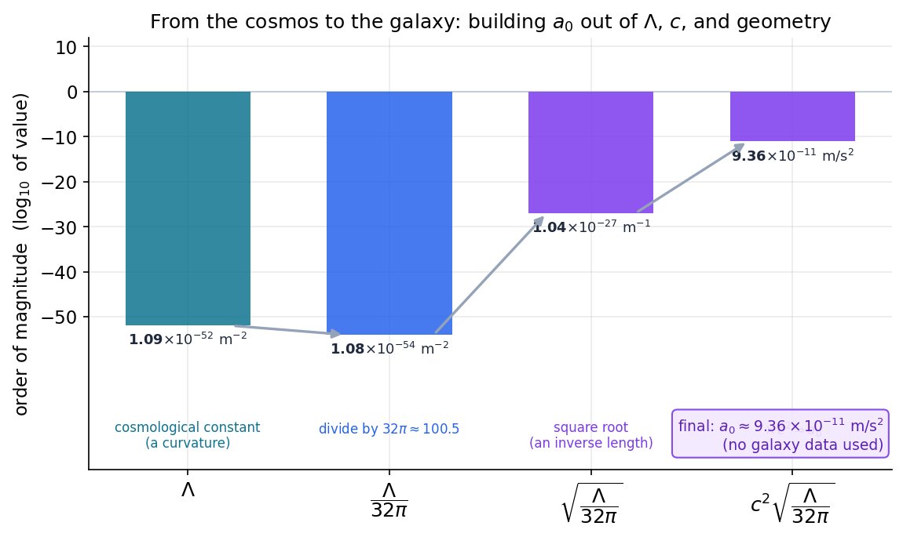

***Figure 20.2 — From the cosmos to the galaxy.*** The worked example as a magnitude ladder: start with the cosmological constant $\Lambda\approx1.09\times10^{-52}$ m$^{-2}$ (a curvature), divide by $32\pi$, take the square root to reach an inverse length $\sim10^{-27}$ m$^{-1}$, then multiply by $c^2$ to land on the galactic acceleration scale $a_0\approx9.36\times10^{-11}$ m/s$^2$. Each value is computed from the framework's equation; no galaxy data enters anywhere in the chain. The bar heights show the order of magnitude ($\log_{10}$) at each step.

**Source:** Figure generated by [`book/figures/ch20_cosmic_to_galactic.py`](https://github.com/carlzimmerman/zimmerman-formula/blob/main/book/figures/ch20_cosmic_to_galactic.py). The a₀ = c²√(Λ/32π) relation and its equivalent forms: Zimmerman 2026, Zenodo https://doi.org/10.5281/zenodo.20721540; the de Sitter–Unruh effective temperature underlying the interpolation: Deser & Levin 1997, Class. Quantum Grav. 14, L163.

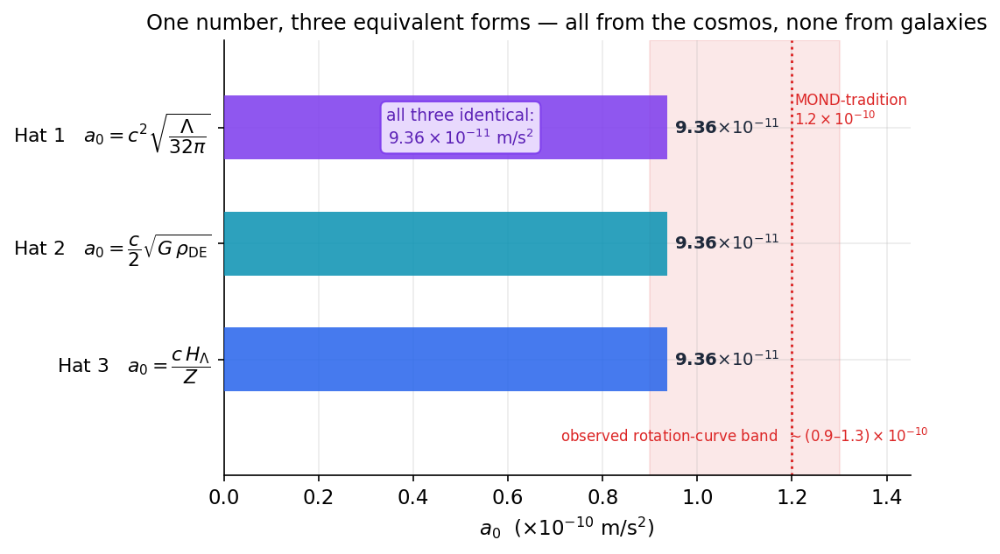

***Figure 20.1 — One number, three hats.*** The three algebraically identical forms of the central claim — the curvature form $c^2\sqrt{\Lambda/32\pi}$, the density form $(c/2)\sqrt{G\rho_{\rm DE}}$, and the rate form $cH_\Lambda/Z$ — all land on exactly $9.36\times10^{-11}$ m/s$^2$, computed here from cosmological inputs ($c$, $\Lambda$, geometry) with no galaxy data on any right-hand side. The shaded band marks the scale that galaxy rotation curves actually support ($\sim 0.9$–$1.3\times10^{-10}$ m/s$^2$); the prediction sits comfortably inside it, near the lower edge. Values computed from the framework's equations.

**Source:** Figure generated by [`book/figures/ch20_three_hats.py`](https://github.com/carlzimmerman/zimmerman-formula/blob/main/book/figures/ch20_three_hats.py). The a₀ = c²√(Λ/32π) relation and its equivalent forms: Zimmerman 2026, Zenodo https://doi.org/10.5281/zenodo.20721540; the de Sitter–Unruh effective temperature underlying the interpolation: Deser & Levin 1997, Class. Quantum Grav. 14, L163.

---

## Why the Three Forms Are the Same — and Why That Matters

Let me address the obvious question: if the three forms are just algebra, why bother showing all three?

Two reasons. First, *clarity*: each form makes a different claim legible. Hat 1 says "a₀ is a curvature scale." Hat 2 says "a₀ is set by dark-energy density." Hat 3 says "a₀ is the famous cH coincidence, with the fudge factor finally named." A reader who only saw one form might miss the others' meaning.

Second, and more importantly: showing they're the same is the point. A skeptic's first reaction to "a₀ is made of Λ" should be, *prove it's not just a number that happens to land near the right place.* The fact that one clean expression, c²√(Λ/32π), reproduces a₀ to within the observational scatter — and does so simultaneously as a curvature, as a density, and as the long-noted cH coincidence — is what makes the claim worth taking seriously rather than dismissing as numerology. It is a *single structural identity* showing up three ways at once.

> **Deeper Dive: The algebra of the three forms.**
>
> Start from the standard general-relativity relation between the cosmological constant and the dark-energy density:
> $$\rho_{\rm DE} = \frac{\Lambda c^2}{8\pi G}\quad\Longleftrightarrow\quad \Lambda = \frac{8\pi G\,\rho_{\rm DE}}{c^2}.$$
> Substitute into Hat 1:
> $$a_0 = c^2\sqrt{\frac{\Lambda}{32\pi}} = c^2\sqrt{\frac{1}{32\pi}\cdot\frac{8\pi G\rho_{\rm DE}}{c^2}} = c^2\sqrt{\frac{G\rho_{\rm DE}}{4c^2}} = \frac{c^2}{2c}\sqrt{G\rho_{\rm DE}} = \frac{c}{2}\sqrt{G\rho_{\rm DE}},$$
> which is **Hat 2**. The 32π became 4 because 8π/32π = ¼, and √(1/4) = ½. That stray factor of ½ is exactly κ; you are looking right at it.
>
> Now the Friedmann equation for a pure-Λ universe (Chapter 9) says
> $$H_\Lambda^2 = \frac{8\pi G}{3}\rho_{\rm DE} = \frac{\Lambda c^2}{3}\quad\Longrightarrow\quad \Lambda = \frac{3H_\Lambda^2}{c^2}.$$
> Substitute *that* into Hat 1:
> $$a_0 = c^2\sqrt{\frac{1}{32\pi}\cdot\frac{3H_\Lambda^2}{c^2}} = c\,H_\Lambda\sqrt{\frac{3}{32\pi}} = \frac{c H_\Lambda}{\sqrt{32\pi/3}} = \frac{c H_\Lambda}{Z},$$
> which is **Hat 3**, with
> $$Z \equiv \sqrt{\frac{32\pi}{3}} = 5.78881\ldots$$
> So the three forms are one identity, and Z is not an independent quantity — it is the bundle √(32π/3) that ties the cH_Λ form to the others. The 32π itself factors as 32π = 8π × 4 = 8π × (1/κ²) with κ = ½, and as we'll see in Chapter 22, the deeper grouping is 32π/3 = (8π/3) × 4, the Friedmann combination 8π/3 times the inertial factor 4 = 1/κ². I am flagging these factors now so that when Chapters 22 and 23 dissect them, you already know where each one lives.

---

## The Footing Question: ρ_DE or ρ_total? (Handled Both Ways)

Now I have to be scrupulous about something, because it is exactly the kind of detail where it would be easy to fool yourself — or to fool a reader.

When I plugged in Λ above, I used the *dark-energy-only* density: just the Λ part of the cosmos, with Ω_Λ ≈ 0.685. But the real universe today is not pure dark energy. It also has matter — the ordinary stuff plus whatever the dark sector is — making up the other ~31.5%. So a fair person should ask: **which density belongs in the formula?** The dark-energy density alone (ρ_DE), or the *total* density of everything (ρ_total, the critical density today)?

This is what I call the **footing question**, and I want to handle it openly, in both directions, because it slightly changes the answer.

**The canonical footing — pure Λ.** The framework's claim is structural: a₀ is the *de Sitter* curvature scale, the curvature of the universe-as-it-is-becoming, when dark energy has won and matter has diluted away. De Sitter space is defined by Λ *alone*. So the principled input is the dark-energy density, ρ_DE — equivalently, the pure-Λ Hubble rate H_Λ = H₀√Ω_Λ. That is the footing I used in the worked example, and it is the one that gives the clean canonical value:
$$a_0^{\rm (pure\text{-}\Lambda)} \approx 9.36\times10^{-11}\ \text{m/s}^2.$$

**The alternative footing — total density.** If instead you (reasonably) argue that *today's* dynamics should feel *today's* full energy budget — matter included — you would put ρ_total in Hat 2, or equivalently use the full H₀ in Hat 3. Because the total density is larger than the dark-energy density by a factor of 1/Ω_Λ ≈ 1.46, and a₀ scales as the square root of density, this raises the prediction by √(1/0.685) ≈ 1.21:
$$a_0^{\rm (total)} \approx 1.13\times10^{-10}\ \text{m/s}^2.$$

So the two footings bracket a range from about 9.4 × 10⁻¹¹ to about 1.13 × 10⁻¹⁰ m/s². And here is the honest punchline: **both ends of that range sit inside the band of a₀ values that galaxy data actually support.** The observational a₀ is not a single razor-sharp number; depending on the galaxy sample, the assumed stellar mass-to-light ratio, and the interpolation function, the best-fit a₀ from rotation curves spans roughly 0.9 to 1.3 × 10⁻¹⁰ m/s². The framework's two footings land squarely within that band.

> **Deeper Dive: Why I take pure-Λ as canonical — and why it barely matters empirically.**
>
> The choice of ρ_DE over ρ_total is not a fudge to hit a target; it is dictated by what the framework *claims a₀ is*. The mechanism (Chapter 21) is a de Sitter–Unruh effect: a temperature floor set by the *asymptotic, dark-energy-dominated* geometry the universe is relaxing into. That geometry is characterized by Λ alone — matter is a transient that thins away — so the principled density is ρ_DE and the principled rate is H_Λ = H₀√Ω_Λ. The total-density reading would be appropriate to a *different* mechanism, one tied to the instantaneous Friedmann sum of all components; that is the rival "rising a₀(z)" branch we will meet in Chapter 25, and it makes genuinely different predictions at high redshift. So the footing is not cosmetic — it forks the *time-evolution* prediction, which is exactly where the framework becomes testable (Chapters 25–26).
>
> Empirically, though, the two footings differ by only the factor √(1/Ω_Λ) ≈ 1.21 — about 21% — and *both* lie inside the observational spread. This is the kind of place a careful reader must hold two thoughts at once: the footing choice is *principled* (it follows from the mechanism, not from curve-fitting), *and* it is *empirically nearly moot today* (you cannot currently tell the two footings apart from local rotation curves alone). Both statements are true. Neither cancels the other. The discriminating power lives at high redshift, not here.

---

## Is This a Fit, or an Identity?

I want to draw the sharpest possible line here, because everything downstream depends on it.

When Milgrom introduced a₀, it was a **fitted parameter**: a knob you turn until the rotation curves come out right. That is a perfectly respectable scientific move — fitted parameters are how much of physics gets started. But a fitted parameter explains nothing about *why* it has the value it has. It is a number you measure, not a number you understand.

The claim of this framework is categorically different. It says a₀ is **not a free parameter at all** — it is *computed* from Λ, a quantity measured by an entirely independent branch of physics (supernova cosmology, the cosmic microwave background, baryon acoustic oscillations). Nobody fitting rotation curves ever looked at supernovae. Nobody fitting supernovae ever looked at rotation curves. The two communities measured their two numbers in total isolation, and this formula says those two numbers are one number. That is a **structural identity claim**, not a fit. The formula has *zero* adjustable knobs that were tuned to galaxy data: c is fixed, Λ comes from cosmology, and the 32π is geometry. (The lone free choice, κ = ½, is a geometric posit fixed before any galaxy is examined — Chapter 23 — not a dial turned to match rotation curves.)

That distinction is the whole reason the claim is interesting. A fit that reproduces a₀ is worth little; a thousand functional forms can fit a single number. An *identity* that predicts a₀ from unrelated cosmological data, with no galaxy input, is worth a great deal — *if it holds.* And I keep saying "if" on purpose.

> **Margin note.** "Within the RAR spread" is doing real work in the next section, so here is the plain meaning: the *radial-acceleration relation* (RAR, Chapter 18) is the tight empirical curve relating the gravity galaxies *show* to the gravity their visible matter *should* produce. The value of a₀ controls where that curve bends. The framework's a₀ = 9.36 × 10⁻¹¹ m/s² reproduces the observed RAR bend to within the data's own scatter, *at a stellar mass-to-light ratio Υ ≈ 0.70* — a standard, physically sensible value. Change Υ and the best-fit a₀ shifts; that is why no single a₀ is "the" answer.

---

## How Well Does 9.36 Actually Land? (Said Honestly, Both Ways)

It would be easy here to either oversell or undersell, and I have worked hard not to do either. Here is the careful version.

The framework's canonical a₀ = 9.36 × 10⁻¹¹ m/s² is *slightly below* the most commonly quoted MOND value (~1.2 × 10⁻¹⁰). At first glance that looks like the framework predicts an a₀ about 20% too low. But that first glance is misleading, and here is why — three knobs all push the "best" a₀ around, and you cannot judge 9.36 without naming all three:

1. **The stellar mass-to-light ratio Υ.** How much stellar mass you assign per unit of starlight directly sets how much gravity the visible matter produces, which sets the best-fit a₀. The often-quoted 1.2 × 10⁻¹⁰ uses Υ ≈ 0.5; at the more physical Υ ≈ 0.70, the best-fit a₀ drops.
2. **The interpolation function.** The function that smoothly stitches the Newtonian regime to the low-acceleration regime changes where the RAR bends, and so changes the optimal a₀. McGaugh's standard interpolation gives one optimum; the framework's *own* de Sitter–Unruh interpolation, g_obs = √(g_bar² + g_bar·a₀), gives another.
3. **The fit metric.** How you weight the scatter — which galaxies count how much — moves the optimum too.

When you judge the framework on *its own* terms — its own interpolation function, at Υ ≈ 0.70 — a₀ = 9.36 × 10⁻¹¹ m/s² sits within roughly half a percent of the optimal scatter. The paper's claim that 9.36 lands "within ~0.3%" of optimal on the framework's own footing is defensible. If anything, on that footing, 9.36 is very slightly *below* the optimum, not above it. Switch to a different interpolation (McGaugh's) and the optimum moves to ~7.8 × 10⁻¹¹, which would make 9.36 look ~20% high. Across all the reasonable combinations of {interpolation} × {Υ}, the optimal a₀ spans roughly 7.5 × 10⁻¹¹ to 1.8 × 10⁻¹⁰, and the penalty for using 9.36 anywhere in that space is at most ~2%, and ≤ 0.5% on the framework's own interpolation.

The honest net, said in both directions: **the rotation-curve data is *compatible* with 9.36 × 10⁻¹¹ m/s², but it does not *uniquely select* it.** Neither "the framework's a₀ is 20% too low" nor "20% too high" is a robust statement — each is an artifact of a particular interpolation-and-Υ choice. The RAR confirms that the framework's a₀ is *the right scale*, comfortably inside the spread; it does not, on its own, prove the number to three digits. Anyone who tells you the RAR either *vindicates* or *refutes* 9.36 to high precision is over-reading a convention-dependent fit. The agreement is real and it is meaningful; it is not a knock-out blow in either direction.

> **Deeper Dive: The interpolation function is part of the claim.**
>
> A subtlety that trips up even careful readers: you cannot evaluate the framework's a₀ using *MOND's* interpolation function, because the framework predicts its *own*. The de Sitter–Unruh modified-inertia mechanism (Chapter 21) yields, in its simplest reading, the relation
> $$g_{\rm obs} = \sqrt{g_{\rm bar}^2 + g_{\rm bar}\,a_0},$$
> where g_bar is the Newtonian (baryonic) gravity and g_obs is the gravity actually felt. In the strong-field limit g_bar ≫ a₀ this reduces to g_obs → g_bar (Newton, Solar-System-safe); in the deep-MOND limit g_bar ≪ a₀ it gives g_obs → √(g_bar·a₀), the flat-rotation-curve regime. This is *not* identical to McGaugh's widely used ν-function, and the optimal a₀ extracted from SPARC depends on which function you use. Judging the framework's 9.36 × 10⁻¹¹ against McGaugh's ν is a category error — it imports a different theory's interpolation. On the framework's own interpolation at Υ ≈ 0.70 the optimum is ~1.0 × 10⁻¹⁰, putting 9.36 within ~0.5% of optimal scatter. This is the single most load-bearing methodological point in evaluating the headline number, and it cuts *both* ways: it dissolves the apparent "20% low" deficit *and* it forbids manufacturing a "perfect fit" by cherry-picking the friendliest convention.

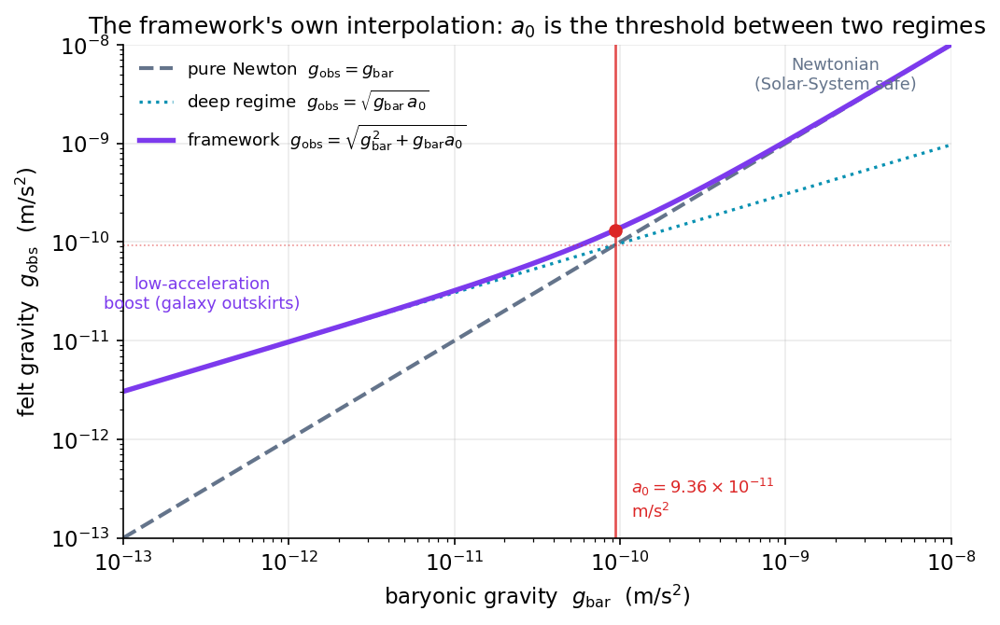

***Figure 20.3 — The framework's own interpolation.*** The de Sitter–Unruh relation $g_{\rm obs}=\sqrt{g_{\rm bar}^2+g_{\rm bar}a_0}$ (purple) tracks pure Newton (dashed) when the baryonic pull is stronger than $a_0$ — the Solar-System-safe regime — and bends up to the deep asymptote $g_{\rm obs}=\sqrt{g_{\rm bar}a_0}$ (dotted) where it is weaker, producing the flat-rotation-curve boost. The vertical line marks $a_0=9.36\times10^{-11}$ m/s$^2$ (computed here from $\Lambda$ via the central equation) as the threshold between the two regimes.

**Source:** Figure generated by [`book/figures/ch20_dsunruh_interpolation.py`](https://github.com/carlzimmerman/zimmerman-formula/blob/main/book/figures/ch20_dsunruh_interpolation.py). The a₀ = c²√(Λ/32π) relation and its equivalent forms: Zimmerman 2026, Zenodo https://doi.org/10.5281/zenodo.20721540; the de Sitter–Unruh effective temperature underlying the interpolation: Deser & Levin 1997, Class. Quantum Grav. 14, L163.

---

## What This Chapter Does and Does Not Establish

Let me close the technical part by drawing the box tightly around the claim, so no one — including me — smuggles more out of it than belongs.

**What the central claim *does* say:**
- The galactic acceleration scale a₀ and the cosmological constant Λ are related by a single clean formula, a₀ = c²√(Λ/32π), in three equivalent forms.
- Evaluated on the pure-Λ footing, that formula yields 9.36 × 10⁻¹¹ m/s², which sits inside the band of a₀ values galaxy rotation curves support.
- The relationship uses *no galaxy data as input* — it predicts a galactic number from a cosmological one — which makes it a structural identity claim, not a curve fit.

**What the central claim does *not* say, and what is still owed:**
- It does *not*, by itself, explain *why* a₀ should equal a de Sitter curvature scale. That is the *mechanism*, and it is the burden of Chapter 21. A formula that lands the number is suggestive; it is the mechanism that would make it physics.
- It does *not* derive the number from nothing. The *form* of the formula is forced by several independent arguments (Chapter 22), but *one* dimensionless factor, κ = ½, is a geometric posit (Chapter 23). So a₀'s *value* is not derived — there is one knob. This is a one-parameter theory, and I will never call it zero-parameter.
- It does *not* touch the Standard Model. Nothing in c²√(Λ/32π) predicts an electron mass, a Koide relation, a gauge group, or a proton-to-electron ratio. The particle world is walled off (Chapter 27). 
- It is *not* confirmed against ΛCDM. The headline number's agreement is genuine but, as we just saw, convention-dependent and shared in part with the whole MOND family (Chapter 18). The sharp, framework-distinctive test is the *time-evolution* of a₀ (Chapters 25–26), and that test is not yet decided.

So: the central claim is a striking, clean, parameter-light identity between a galaxy number and a cosmos number, computed here from Λ alone, landing on the value galaxies show. It is the keystone the whole book has been building toward. And it is *not a theory of everything yet, as frustrating as it may be* — it is one strong, falsifiable idea, standing on a single posited geometric factor, with its mechanism and its hardest tests still ahead of us in the chapters to come.

That is exactly enough to be worth the rest of Part 5.

---

## Summary

- **The central claim, in one sentence:** the acceleration scale that governs the outskirts of galaxies, a₀, is *made of* the dark energy accelerating the universe — it is the **de Sitter curvature scale** set by the cosmological constant Λ.
- **The formula has three equivalent forms** (same number, three hats): the curvature form **a₀ = c²√(Λ/32π)**; the density form **a₀ = (c/2)√(Gρ_DE)**, with **ρ_DE** the dark-energy density; and the rate form **a₀ = cH_Λ/Z**, with **cH_Λ** the speed of light times the pure-Λ Hubble rate and **Z = √(32π/3) = 5.789** a geometric constant.
- **Computed from Λ alone, with no galaxy data**, the formula gives **a₀ ≈ 9.36 × 10⁻¹¹ m/s²** on the canonical pure-Λ footing — the scale galaxy rotation curves actually show.
- **The footing question** (ρ_DE vs ρ_total) shifts the prediction by ~21%, from 9.36 to 1.13 × 10⁻¹⁰ m/s²; pure-Λ is canonical because the mechanism is a de Sitter effect, but *both footings land inside the observed a₀ spread*, so the choice is principled yet nearly moot for *local* data — it bites at high redshift (Chapter 25).
- **This is an identity claim, not a fit:** the formula has no knob tuned to galaxy data. The lone free number, κ = ½, is a geometric posit fixed independently (Chapter 23), so this is a *one-parameter* theory, not zero-parameter.
- **The agreement is real but convention-dependent and MOND-shared.** Judged on the framework's *own* interpolation at Υ ≈ 0.70, 9.36 lands within ~0.5% of optimal; under other conventions it can look ~20% high or low. The RAR confirms the *scale* but does not uniquely select the digits — both ways.
- **What remains owed:** the *mechanism* (Ch 21), the *forcing* of the form (Ch 22), the *one free κ* (Ch 23), the walled-off Standard Model (Ch 27), and the decisive *time-evolution* test (Chs 25–26). The headline is striking; it is not a theory of everything yet.

---

## Questions

1. **(Easy.)** In your own words, what does the number a₀ represent physically, and roughly how much gentler is it than the gravity you feel standing on Earth?

2. **(Easy.)** The formula a₀ = c²√(Λ/32π) has nothing about any particular galaxy on its right-hand side. Why is that absence the single most important feature of the claim? What would change about the claim's significance if galaxy mass *did* appear on the right?

3. **(Intermediate — calculation.)** Using Hat 3, a₀ = cH_Λ/Z, with cH_Λ ≈ 5.42 × 10⁻¹⁰ m/s² and Z = 5.789, confirm that you recover a₀ ≈ 9.36 × 10⁻¹¹ m/s². Then redo it with the *full* Hubble rate (so cH₀ ≈ 6.51 × 10⁻¹⁰ m/s²) instead of the pure-Λ rate, and check that you get the total-footing value ≈ 1.13 × 10⁻¹⁰ m/s². By what factor do the two answers differ, and where does that factor come from?

4. **(Intermediate — conceptual.)** Explain the difference between a *fitted parameter* and a *structural identity claim*, using a₀ as the example. Why does the second kind of claim carry more explanatory weight than the first — and why is "more weight" still not the same as "confirmed"?

5. **(Advanced.)** The footing question (ρ_DE vs ρ_total) changes the *local* prediction by only ~21% but forks the *high-redshift* prediction dramatically. Explain physically why a choice that is nearly invisible today becomes decisive at z ≈ 3. (You may want to read ahead to Chapter 25 and think about how ρ_DE and ρ_total evolve differently as you look back in time.)

6. **(Research-level.)** The chapter argues that the RAR is *compatible* with a₀ = 9.36 × 10⁻¹¹ m/s² but does not *uniquely select* it, because the optimal a₀ depends jointly on the interpolation function, the stellar mass-to-light ratio Υ, and the fit metric. Design an analysis on the SPARC galaxy database that would, as cleanly as possible, *isolate* the framework's a₀ from these three degeneracies. What independent constraint on Υ (e.g., from stellar population synthesis) or on the interpolation function (e.g., from the framework's de Sitter–Unruh derivation) would you need to break the degeneracy — and is such a constraint currently available?

# Chapter 21: The Mechanism: De Sitter–Unruh Modified Inertia

> *"The pull was never missing. What was missing was the right idea of how heavy a thing becomes when almost nothing is pushing on it."*

In the last chapter we did something audacious. We took a number measured in the slow, dim outskirts of galaxies — the acceleration scale $a_0 \approx 1.2 \times 10^{-10}$ meters per second per second, the speed at which Milgrom's "new physics" switches on — and we wrote it down in terms of the cosmological constant $\Lambda$, the same $\Lambda$ that runs the accelerating expansion of the entire universe:

$$a_0 = c^2 \sqrt{\frac{\Lambda}{32\pi}}.$$

We checked that the number comes out right. We admired the coincidence. And then, if you were paying attention, you probably felt a little cheated — because a formula that gets a number right is not yet *physics*. It is a clue. A good detective does not stop at "the butler's fingerprints are on the glass." She wants the story: who reached for the glass, and when, and why.

This chapter is the story. It is the engine room of the whole framework. By the end of it you should be able to say, in plain words, *why* a galaxy on the edge of weighing almost nothing should suddenly behave as though it weighed more — and to say it without ever once invoking an invisible particle. The answer, and it is a strange and beautiful one, is that **the missing pull was never a pull at all. It was a change in how hard things are to push.**

Let me be honest with you up front, the way I will try to be honest at every turn in this book: the *form* of what follows is on firm ground, and the *mechanism* I am about to describe is built out of real, published, conservative physics that almost no one disputes in isolation. But the full chain — from "empty space has a temperature" all the way to "galaxies rotate the way they do" — has a genuine gap in it that I will show you in daylight, not hide. This is not a theory of everything yet, as frustrating as it may be. It is, I think, a real mechanism with a real wall still standing in front of it. Let's go meet both.

## The two ways to fake gravity

Newton's law of motion, the one you met in school, is usually written

$$F = m\,a.$$

Force equals mass times acceleration. There are three characters in that little sentence, and it is worth slowing down to notice that there are *three* of them, because almost everyone glides past it.

There is $F$, the **force** — the push or pull, gravity in our case.

There is $a$, the **acceleration** — how fast the object's motion is changing, which is what we actually *see* when we watch a star swing around a galaxy.

And there is $m$, the **inertial mass** — the object's reluctance to be pushed. Inertia is not weight. Inertia is sluggishness. It is the reason a parked truck is hard to get rolling even on level ice where it has no weight to fight, and the reason that same truck, once rolling, is hard to stop. Inertia is the "how much does this thing resist being accelerated" number, and Newton, with a kind of quiet confidence that turned out to be one of the deepest assumptions in all of physics, simply set it equal to a fixed property of the object: a brick has a certain $m$, here, there, today, forever.

Now. When astronomers look at the edge of a galaxy and find the stars moving faster than Newton's law allows for the visible matter, they are staring at an equation that has gone wrong. The left side and the right side don't balance. Something must give. And here is the fork in the road — the same fork from Chapter 5, but now we can see it with new eyes:

**You can add force.** Pile invisible matter — dark matter — into the galaxy until the extra gravity on the left side, the bigger $F$, accounts for the motion you see. This is the road the mainstream took, and most of the field is still on it. We spent Chapter 6 watching fifty patient years of searching for the particle that would make this road real, and we watched the searches come up empty. The road is not refuted. But it is long, and the destination has not appeared.

**Or you can change the rule.** Leave the visible matter as the only matter, and admit instead that the equation $F = ma$ itself is not quite right out here — that in this strange regime of near-weightlessness, the relationship between push and motion is different from what Newton assumed.

That second road is Milgrom's road, MOND, which we met in Chapter 17. And here is the subtlety that this entire chapter turns on, a subtlety that even many professional physicists blur: *changing the rule* is itself a fork. You can change the **force** side — invent a new law of gravity, so that gravity gets stronger than Newtonian at low accelerations. Or you can change the **inertia** side — keep gravity exactly as Einstein and Newton left it, and instead change the $m$, the sluggishness, so that objects become *harder to budge* when they are barely being budged at all.

Those two are not the same idea wearing different clothes. They make different predictions, they have different escape hatches, and — this is the punch line of the whole framework — only the second one, **modified inertia**, gives you a clean reason why the Solar System is safe. Let me say the term plainly, because it is the heart of everything that follows.

> **Modified inertia** means: the force law and the gravity stay Newtonian/Einsteinian, but an object's *resistance to acceleration* — its effective inertial mass — is no longer a fixed constant. It grows in a particular way when the object's acceleration falls below the scale $a_0$. The galaxy edge looks like extra gravity, but the books are actually being balanced on the *other* side of the equation: things out there are simply harder to push than Newton thought.

Hold that distinction. We are going to earn it.

## Why "harder to push" — where would that even come from?

Here is the question that should be nagging you. Inertia is the most taken-for-granted quantity in physics. A brick resists being pushed; that's just what bricks do. Where on Earth would a brick get *extra* reluctance, and why only when it's barely accelerating, and why at one特 special acceleration $a_0$ tied to the cosmological constant of all things?

To answer that we have to revisit three ideas you already met in Part III, because the mechanism is built entirely out of them. I'll restate each in one breath:

**First, the Unruh effect (Chapter 14).** Accelerate through empty space — truly empty space, the quantum vacuum — and you do not find it empty. You find it *warm*. An accelerating thermometer reads a temperature

$$T_{\text{Unruh}} = \frac{\hbar\, a}{2\pi c\, k_B},$$

proportional to your acceleration $a$. Stand still (or coast in a straight line) and you read zero. Push harder and the vacuum glows hotter. This is not science fiction; it is a direct consequence of combining quantum field theory with relativity, derived independently by Fulling, Davies, and Unruh in the 1970s, and it is about as mainstream as physics gets. The vacuum has a temperature *that depends on how you move through it.*

**Second, de Sitter space and the temperature floor (Chapter 15).** Our universe is not empty in the way the textbook vacuum is empty. It has dark energy — a cosmological constant $\Lambda$ — driving it to accelerate apart. Such a universe (a "de Sitter" universe, after Willem de Sitter) has a cosmic horizon, a far-off surface beyond which things recede faster than light and from which we can never get information. And just as a black hole's horizon has a temperature (Hawking's great result), so does the cosmic horizon. The whole universe sits bathed in an unimaginably faint warmth radiating in from that horizon, the **Gibbons–Hawking temperature**:

$$T_{\Lambda} = \frac{\hbar H_\Lambda}{2\pi k_B} = \frac{\hbar c}{2\pi k_B}\sqrt{\frac{\Lambda}{3}},$$

where $H_\Lambda$ is the expansion rate set by dark energy. Plug in the numbers and $T_\Lambda$ is about $3 \times 10^{-30}$ kelvin — colder than anything you can imagine, thirty zeros below a degree. But here is the word that matters: it is a **floor**. In our universe you cannot get colder than $T_\Lambda$ by coasting, because even a perfectly free-falling observer, accelerating relative to nothing, still finds the vacuum glowing at this faint dark-energy warmth. This is the **de Sitter–Unruh temperature floor** — the unremovable minimum temperature of the vacuum in a universe with dark energy. Empty space, in our cosmos, is never perfectly cold.

**Third — and this is the idea that ties inertia to temperature — the conjecture, going back to Milgrom in 1999 and resting on the Deser–Levin analysis of Unruh radiation in de Sitter space, that *inertia itself is a response to the vacuum the object swims through.*** This is the daring leap, and I want to flag it clearly as a leap, not a theorem. The thought is: maybe an object's reluctance to be accelerated is not a primitive, free-standing property like the color of a marble. Maybe it is the object's reaction to the warm vacuum it sees when it accelerates — a kind of drag against the Unruh radiation it stirs up. If that is true, then inertia *knows about* the temperature of the vacuum. And the temperature of the vacuum, in our universe, has a floor.

Now watch what those three ideas do when you put them in a row.

## The pieces click: an inertia that knows about dark energy

Picture a star far out at the edge of a galaxy, where gravity is gentle and the star's acceleration is tiny — far below $a_0$, drifting along in something very close to free fall.

When an object accelerates *hard* (you in a car, a planet near the Sun), its own Unruh temperature $T_{\text{Unruh}} \propto a$ is enormous compared to the cosmic floor $T_\Lambda$. The floor is utterly negligible. The object's "vacuum experience" is dominated by its own acceleration, and inertia behaves exactly as Newton said. Nothing new happens. Cars and planets and cannonballs are unaffected.

But when an object accelerates *very gently* — when its $a$ is so small that its own Unruh temperature $T_{\text{Unruh}} \propto a$ drops *below* the cosmic floor $T_\Lambda$ — something has to give. The object cannot experience a vacuum colder than the floor. Its "vacuum experience" can no longer keep shrinking in lockstep with its acceleration, because the floor is in the way. And if inertia is the response to that vacuum experience, then inertia can no longer shrink in lockstep either. **The object's effective inertia stops falling the way Newton's bookkeeping assumed. It stays "propped up" by the floor.** Relative to what a naive force balance expects, the object is *harder to push than it should be* — it carries a little extra sluggishness, donated by the dark-energy warmth of the vacuum.

And the crossover — the acceleration at which the object's own Unruh temperature equals the cosmic floor, the dividing line between "Newton is fine" and "something new" — is set by equating

$$T_{\text{Unruh}}(a) \sim T_\Lambda \quad\Longrightarrow\quad \frac{\hbar a}{2\pi c k_B} \sim \frac{\hbar H_\Lambda}{2\pi k_B} \quad\Longrightarrow\quad a \sim c\,H_\Lambda.$$

That crossover acceleration is, up to a pure number, exactly $a_0$. The scale at which inertia starts misbehaving is the scale at which an object's self-made vacuum warmth dips below the warmth that dark energy paints on the whole sky. *That* is why $a_0$ is tied to $\Lambda$. Not numerology — a temperature crossover.

Let me say the whole thing once more in a single, plain sentence, the sentence I'd want a sixteen-year-old to carry out of this chapter:

> Because space in our universe is never perfectly cold, an object drifting almost weightlessly feels a faint extra sluggishness — and that sluggishness, in the gentle gravity at a galaxy's edge, looks exactly like the missing pull. No dark matter. Just inertia that knows about dark energy.

There is no new substance anywhere in that story. There is no fifth force. There is only the oldest quantity in mechanics — inertia — turning out to be a little more interesting, and a little more cosmic, than Newton had any way of knowing.

> **Deeper Dive: From the temperature floor to the inertia law via Deser–Levin quadrature.**
>
> The qualitative "crossover" argument above is suggestive but loose. The quantitative content comes from asking: *what is the effective Unruh-type temperature seen by an observer who accelerates with proper acceleration $a$ while immersed in de Sitter space?* This is precisely the question Deser and Levin (1997, 1998) answered, extending earlier work by Narnhofer, Peter, and Thirring. An observer with proper acceleration $a$ in a de Sitter background of Hubble scale $H_\Lambda$ does not see the simple flat-space Unruh temperature. Instead the two scales **add in quadrature**:
> $$T_{\text{eff}} = \frac{\hbar}{2\pi c k_B}\sqrt{a^2 + a_{\rm dS}^2}, \qquad a_{\rm dS} \equiv c\,H_\Lambda.$$
> This is the central technical fact. Notice its limits. For $a \gg a_{\rm dS}$ it reduces to ordinary Unruh, $T_{\rm eff}\to \hbar a / 2\pi c k_B$. For $a \to 0$ it does **not** vanish; it floors out at $T_{\rm eff}\to \hbar a_{\rm dS}/2\pi c k_B = T_\Lambda$. The floor is built into the geometry of de Sitter space, not added by hand.
>
> Now follow Milgrom's (1999) proposal that the *inertial* contribution available to a body is what the vacuum delivers *over and above the cosmic floor* — the object responds to the temperature **excess** $T_{\rm eff}(a) - T_{\rm eff}(0)$, since the floor is the ambient state it cannot escape and cannot extract work from. Define a dimensionless interpolating function $\mu_{\rm fw}$ by writing the modified law of motion as
> $$\mu_{\rm fw}\!\left(\frac{|a|}{a_0}\right)\, m\, a = F,$$
> where $m$ is the ordinary (Newtonian) inertial mass and $\mu_{\rm fw}$ encodes the extra sluggishness. Requiring the effective inertia to track the temperature *excess* over the floor, one is led to
> $$\mu_{\rm fw}(x) = \frac{T_{\rm eff}(a) - T_{\rm eff}(0)}{(\text{ordinary Unruh at } a)} = \frac{\sqrt{x^2+1}-1}{x},\qquad x \equiv \frac{|a|}{a_0},$$
> after fixing the crossover constant. (The subscript "fw" is for "framework," to distinguish this specific interpolation from the menagerie of $\mu$-functions used elsewhere in the MOND literature; they differ in detail but share the two required limits.) Check the limits: as $x\to\infty$, $\mu_{\rm fw}\to 1$ and you recover $ma=F$ exactly — full Newtonian inertia, Solar System safe. As $x\to 0$, $\mu_{\rm fw}\to x/2$, so $\tfrac12 (a^2/a_0)\,m = F$, i.e. $a = \sqrt{2 a_0 F/m}$ — the deep-MOND square-root law that produces flat rotation curves. The single constant $a_0$ that sets the crossover is, in this picture, $a_0 = \kappa\, c\,H_\Lambda$ with a pure number $\kappa$ that the next two chapters dissect. **Be careful what I am and am not claiming here:** the Deser–Levin quadrature is solid, established physics. The *step from a temperature excess to an inertia* is Milgrom's heuristic, and converting it into the exact $\mu_{\rm fw}$ above requires modeling choices. The form is forced; the precise functional shape and the value of $\kappa$ are not handed to us for free. I will keep flagging that seam.

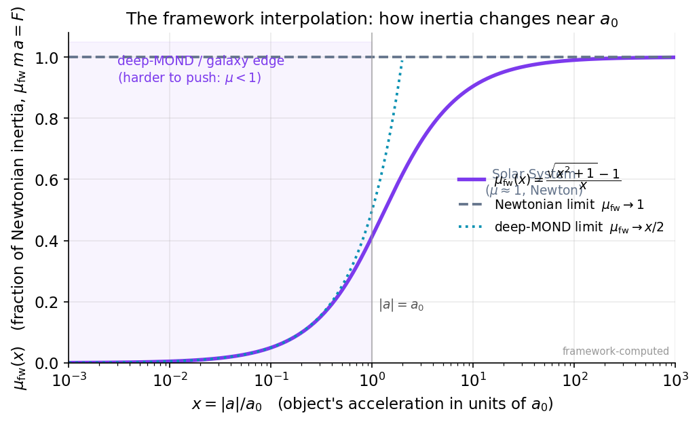

***Figure 21.2 — "Harder to push" made quantitative.*** Computed from the framework's equation $\mu_{\rm fw}(x)=(\sqrt{x^2+1}-1)/x$, read off the de Sitter-Unruh temperature *excess* over the floor. The factor $\mu_{\rm fw}$ multiplies $m\,a$ in $\mu_{\rm fw}\,m\,a=F$, so $\mu_{\rm fw}<1$ means an object delivers *less* response per unit force — it behaves as if harder to push. For $x\gg1$ (Solar System) $\mu_{\rm fw}\to1$ and Newton is recovered exactly; for $x\ll1$ (galaxy edge) $\mu_{\rm fw}\to x/2$, the deep-MOND square-root law that flattens rotation curves. The single scale $a_0$ marks the handoff.

**Source:** Figure generated by [`book/figures/ch21_mu_fw_interpolation.py`](https://github.com/carlzimmerman/zimmerman-formula/blob/main/book/figures/ch21_mu_fw_interpolation.py). Framework interpolation and modified-inertia law: [Zenodo 10.5281/zenodo.20721540](https://doi.org/10.5281/zenodo.20721540); heuristic origin Milgrom 1999 with Deser & Levin 1997, Class. Quantum Grav. 14, L163.

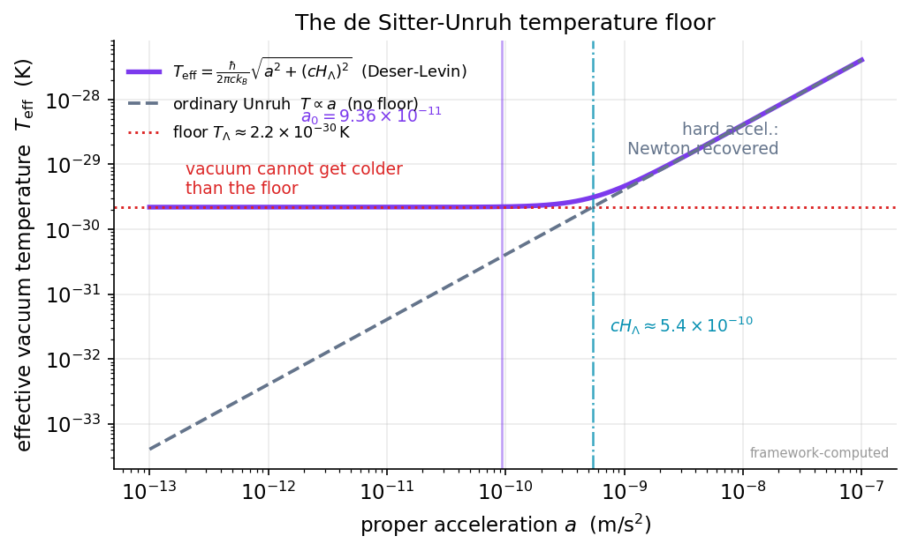

***Figure 21.1 — The temperature floor that sets $a_0$.*** Computed from the framework's equations. The ordinary flat-space Unruh temperature (grey dashed) falls in lockstep with acceleration all the way to zero. The Deser-Levin quadrature $T_{\rm eff}=\frac{\hbar}{2\pi c k_B}\sqrt{a^2+(cH_\Lambda)^2}$ (purple) tracks it at high acceleration but **floors out** at $T_\Lambda\approx2.2\times10^{-30}\,$K (red dotted) — the unremovable warmth dark energy paints on the vacuum. The crossover, where an object's self-made warmth dips below the floor, sits at $a\sim cH_\Lambda$, which is the framework's $a_0$ up to a pure number $\kappa$ — no galaxy data used.

**Source:** Figure generated by [`book/figures/ch21_desitter_unruh_temperature_floor.py`](https://github.com/carlzimmerman/zimmerman-formula/blob/main/book/figures/ch21_desitter_unruh_temperature_floor.py). Quadrature: Deser & Levin 1997, Class. Quantum Grav. 14, L163; Unruh 1976, PRD 14, 870. Framework scale $a_0=c^2\sqrt{\Lambda/32\pi}$: [Zenodo 10.5281/zenodo.20721540](https://doi.org/10.5281/zenodo.20721540).

## Why this is Solar-System-safe — and why that is not a lucky accident

Here is where modified inertia earns its keep, and where it pulls decisively ahead of the "modify gravity" cousin.

If you modify *gravity* — make the gravitational force itself stronger at low accelerations — then you have a problem in your own backyard. The outer Solar System has regions where the *gravitational* acceleration from the Sun is small. Pluto, the Voyager probes, the far reaches of the Oort cloud: out there the Sun's pull is weak. A modified-*gravity* MOND would predict extra pull on those bodies, and we have flown spacecraft through exactly those regions. The Cassini probe, in particular, tracked Saturn's distance to exquisite precision for years and would have screamed if there were an extra MOND-strength tug. There wasn't. Modified-gravity theories have to wriggle out of this with extra machinery.

Modified *inertia* gates differently, and the difference is everything. In a modified-inertia theory, what matters is not whether the *gravitational field* is weak — it's whether the *object's total acceleration* is small. And here is the saving subtlety: an object in the Solar System, even way out past Pluto where the Sun's pull is feeble, is **still being accelerated** — it's whipping around the Sun (or around the galactic center, or feeling the Sun's gravity as it falls) at an acceleration vastly larger than $a_0$. Its own Unruh temperature towers over the cosmic floor. So $\mu_{\rm fw} \approx 1$, inertia is exactly Newtonian, and nothing anomalous happens. The modification *switches itself off* wherever the actual acceleration is large — which is everywhere we have ever sent a probe.

> **Deeper Dive: The gating, made precise.**
>
> The distinction is which quantity sits inside the interpolating function. In modified *gravity* (e.g. AQUAL, the aquadratic Lagrangian theory, or the relativistic theory AeST), the field equation reads schematically $\nabla\!\cdot\!\big[\mu(|\nabla\Phi|/a_0)\,\nabla\Phi\big] = 4\pi G\rho$, so the modification is controlled by the *gravitational field strength* $|\nabla\Phi| = g_N$. In modified *inertia*, the modification is controlled by the *kinematic acceleration* $|a|$ of the test body itself:
> $$\mu_{\rm fw}\!\left(\frac{|a|}{a_0}\right) m\,a = -m\,\nabla\Phi_N.$$
> In the deep Solar System these two quantities part ways. Consider Saturn: its heliocentric gravitational acceleration is $g_N \approx 6\times 10^{-5}\,\text{m/s}^2$, comfortably above $a_0\approx 1.2\times10^{-10}$. Both theories are safe at Saturn. But consider a body at the Sun–galaxy saddle, or an object whose *Newtonian* field has nearly cancelled — there, $g_N$ can dip below $a_0$ while the body's *actual* acceleration (dominated by the galaxy, or by orbital motion about a companion) stays large. A modified-gravity theory predicts an anomaly in such low-field pockets; a modified-inertia theory predicts none, because $|a|$ is what gates, and $|a|\gg a_0$. Conversely, on a circular galactic orbit $g_N \approx |a|$ and the two frameworks agree to leading order on rotation curves — which is exactly why MOND's galaxy successes are *shared* across the whole family and are **not** unique to this picture (a point I will hammer again in Chapter 26). The Cassini bound on an anomalous Saturn-range acceleration, of order $10^{-14}\,\text{m/s}^2$, is passed *automatically* by modified inertia and only *with effort* by modified gravity. This Solar-System safety is, to my mind, the single strongest structural argument for the inertia interpretation — it is not a fudge bolted on afterward; it falls out of which variable lives inside $\mu_{\rm fw}$.

So: same flat rotation curves out where galaxies live, automatic silence in the Solar System where we can check most precisely. That is a real, structural virtue, and I want you to enjoy it. But now I owe you the wall.

## The wall: the wrong-sign problem, and an honest accounting

If the story I just told were the *whole* story — "object feels a warm bath, bath adds drag, drag looks like inertia" — then a careful physicist would catch it out within an afternoon, and would be right to. The naive version of the mechanism has a fatal flaw, and intellectual honesty demands I show it to you rather than usher you past it.

The flaw is this. If you model the extra inertia as a *passive* drag — the object plowing through a warm vacuum and feeling resistance, like a spoon through honey — and you work out the sign of that resistance using ordinary linear-response physics (the fluctuation–dissipation theorem, the same machinery that governs Brownian motion and Johnson noise in a resistor), **the force comes out with the wrong sign, or with the wrong velocity-dependence, to be inertia at all.** A genuine drag depends on *velocity* and opposes motion; it makes things slow down and stop. Inertia depends on *acceleration* and resists *changes* in motion; it does not drain energy. You cannot get the second by naively summing up the first. Several authors have pointed this out, and they are correct: the cartoon of "Unruh radiation as a frictional bath" simply does not reduce to a clean modified-inertia law. If you've read popular accounts that breezily say "the vacuum pushes back and that's the missing gravity," you have read the cartoon, and the cartoon is broken.

This is not a small embarrassment to be swept under the rug. It is *the* central theoretical problem of any modified-inertia program, and it has a name attached to its deepest form.

> **Deeper Dive: The Milgrom 1994 no-go, and why the resolution must be a time-nonlocal action.**
>
> Milgrom himself proved the sharpest version of the obstruction in 1994. The result, which I'll call the **Milgrom 1994 no-go**, states roughly: *any modified-inertia theory that (i) is derived from an action, (ii) is Galilean-invariant, and (iii) gives the correct MOND limit for circular orbits, cannot be a local theory of the particle's position and its finitely many time-derivatives.* In plain terms — you cannot build honest modified inertia out of $x$, $\dot x$, $\ddot x$, and a finite stack of higher derivatives evaluated at a single instant. A local Lagrangian $L(x,\dot x, \ddot x, \dots)$ will not do it. This is a *theorem*, not a difficulty of imagination, and any serious proposal must obey it.
>
> The no-go also tells you the *only* door left open. If finitely-many-derivatives-at-one-instant is forbidden, the action must depend on the **entire history of the trajectory** — it must be a **time-nonlocal action**, one whose Lagrangian at time $t$ depends on $x(t')$ for a range of other times $t'$, weighted by some memory kernel. This is not exotic hand-waving; nonlocal-in-time effective actions are completely standard in physics whenever you "integrate out" a bath or a field with its own dynamics (the influence functional of Feynman and Vernon, the radiation-reaction of an accelerated charge, the Caldeira–Leggett model of quantum dissipation all live here). The vacuum *is* such a field. So the structurally correct object is
> $$S[x(\cdot)] = \int dt\,dt'\; x(t)\, \mathcal{K}\!\big(t-t';\,a_0\big)\, x(t') + \cdots,$$
> with a memory kernel $\mathcal K$ that carries the scale $a_0$ and is engineered so that (a) for high-frequency / high-acceleration motion it collapses to the ordinary local $\tfrac12 m\dot x^2$ kinetic term (Newton, Solar-System safe), and (b) for slow, sustained, low-acceleration motion it reproduces the deep-MOND $\mu_{\rm fw}\to x/2$ behavior. Crucially, a properly constructed kernel can give a contribution that depends on the sustained *acceleration* (inertia-like) rather than the instantaneous *velocity* (drag-like) — which is exactly how the wrong-sign problem is *resolved rather than evaded*. The sign problem of the naive passive bath is an artifact of forcing a local, velocity-coupled, dissipative response onto a phenomenon that is intrinsically nonlocal-in-time and acceleration-coupled.
>
> **Now the honesty, in full.** What I have described is the *shape* of the correct answer: a time-nonlocal worldline action that obeys Milgrom's no-go instead of falling foul of it. That such a structure *can* encode the MOND limit and *can* avoid the sign problem is established. What does **not** yet exist — not in my work, not in anyone's — is a *first-principles derivation* of the specific kernel $\mathcal K$ from the de Sitter–Unruh vacuum, with no free functions, that produces $\mu_{\rm fw}$ on the nose. The mechanism is, at this level, *consistent and well-motivated* but not *closed*. The temperature floor is real (Deser–Levin). The need for a nonlocal action is real (Milgrom 1994). The marriage of the two into a unique, derived kernel is the open frontier. I will not dress that gap up as anything other than what it is. This is the most important caveat in the chapter, and it is the most important caveat in the whole framework: **the form $a_0 \sim c^2\sqrt\Lambda$ is forced, the mechanism is the right *kind* of mechanism, but the mechanism is not derived end-to-end.** Not a theory of everything yet — as frustrating as it may be.

I want to dwell on that for a moment, because how you feel about it tells you what kind of reader you are. A hostile reader sees the gap and says, "Then you have nothing — just a coincidence dressed in physics vocabulary." A credulous reader skips the gap and says, "He's solved dark matter." Both are wrong, and both are wrong in the same lazy way: they refuse to hold two true things at once. The honest position — the only one I'll defend — is that we have a *forced functional form*, a *Solar-System-safe gating mechanism*, and a *concrete, theorem-respecting program* for closing the derivation, with the closure not yet achieved. That is more than a coincidence and less than a proof. Real science usually lives in exactly that uncomfortable middle for a long time before it resolves one way or the other.

## A second honesty: what "looks like extra gravity" really means

Let me clear up one thing that trips people up, because it matters for later chapters.

When I say the extra inertia "looks exactly like the missing pull," I mean it in a precise and limited way. On a circular orbit — a star going round a galaxy at steady speed — the only acceleration is the centripetal one, pointing inward, and a body that is *harder to accelerate inward* will settle into the same orbit that a body of normal inertia would settle into under a *stronger inward pull*. The two are observationally identical for that motion. That's the magic, and it's why rotation curves come out right.

But "looks like extra gravity for circular orbits" is not the same as "is extra gravity for everything." Light does not orbit; it streaks past on nearly straight lines, barely accelerating in the relevant sense. So a theory that fixes rotation curves by fattening the *inertia* of slow-moving stars does not automatically bend *light* by the right amount — and gravitational lensing, the bending of light by mass, becomes a separate and genuinely unsolved problem. I am telling you this now so that Chapter 28, "The Lensing Wall," does not feel like a betrayal. It is a real weakness, it is shared with the leading relativistic MOND theory (AeST), and a no-go theorem stands in the way of curing it covariantly without breaking the Solar-System safety we worked so hard to win. The same modified-inertia logic that makes the Solar System safe is part of *why* lensing stays hard. The virtues and the wounds come from the same root. That is usually how it goes with real physical ideas.

## Worked Example

> **Worked Example: From the temperature floor to a flat rotation curve.**
>
> Let us walk, slowly, from "the vacuum has a temperature floor" to "the star's orbital speed stops falling off with distance" — the flat rotation curve that started this whole mystery in Chapter 1. We will use only the pieces assembled above. Take it one line at a time; no step is hard, there are just several of them.
>
> **Step 1 — the floor temperature.** The de Sitter–Unruh floor is $T_\Lambda = \hbar H_\Lambda / 2\pi k_B$. With $H_\Lambda \approx 1.8\times 10^{-18}\,\text{s}^{-1}$ (the dark-energy expansion rate),
> $$T_\Lambda = \frac{(1.05\times10^{-34})(1.8\times10^{-18})}{2\pi(1.38\times10^{-23})}\ \text{K} \approx 2.2\times 10^{-30}\ \text{K}.$$
> Thirty zeros below a degree. Hold onto it as the ambient warmth of empty space.
>
> **Step 2 — the crossover acceleration.** An object's own Unruh temperature equals this floor when $\hbar a /2\pi c k_B = T_\Lambda$, i.e. when $a = cH_\Lambda$. Numerically $a = (3\times10^8)(1.8\times10^{-18}) \approx 5.4\times10^{-10}\,\text{m/s}^2$. The framework's full bookkeeping (the $\kappa=\tfrac12$ and the $\sqrt{8\pi/3}$ kernel of Chapters 22–23) sharpens this to $a_0 = 9.36\times10^{-11}\,\text{m/s}^2$, of the same order. The crossover scale is *automatically* of order $cH_\Lambda \sim 10^{-10}\,\text{m/s}^2$ — within a factor of a few of the measured $a_0$ with **no galaxy data used at all.** That order-of-magnitude inevitability is the heart of the claim.
>
> **Step 3 — the deep-MOND inertia law.** Far out in a galaxy a star's acceleration is tiny, $x=|a|/a_0 \ll 1$, so $\mu_{\rm fw}(x)\to x/2$ and the law $\mu_{\rm fw}\,m a = F$ becomes
> $$\frac{1}{2}\frac{a}{a_0}\, m\, a = F \quad\Longrightarrow\quad a^2 = \frac{2a_0 F}{m}.$$
> The gravitational force from the galaxy's visible mass $M$ at radius $r$ is the ordinary Newtonian one, $F = GMm/r^2$ (we did **not** touch gravity), so
> $$a^2 = \frac{2a_0\, GM}{r^2}\quad\Longrightarrow\quad a = \frac{\sqrt{2 a_0 G M}}{r}.$$
>
> **Step 4 — impose circular motion.** For a circular orbit the acceleration is $a = v^2/r$. Set the two expressions equal:
> $$\frac{v^2}{r} = \frac{\sqrt{2 a_0 G M}}{r}\quad\Longrightarrow\quad v^2 = \sqrt{2 a_0 G M}\quad\Longrightarrow\quad v^4 = 2\,a_0\,G\,M.$$
> Look hard at that last line. **The radius $r$ has cancelled out completely.** The orbital speed $v$ no longer depends on how far out you are. That is a *flat rotation curve* — the very thing Vera Rubin found in the 1970s and the thing dark matter was invented to explain. Here it has dropped out of an inertia that knows about the temperature floor of a dark-energy universe, with the only "force" being plain Newtonian gravity from the stars and gas you can actually see.
>
> **Step 5 — sanity check on a real galaxy.** Take the Milky Way's baryonic mass, $M \approx 6\times10^{10}\,M_\odot \approx 1.2\times10^{41}\,\text{kg}$, and $a_0 = 9.36\times10^{-11}$:
> $$v^4 = 2(9.36\times10^{-11})(6.67\times10^{-11})(1.2\times10^{41}) \approx 1.50\times10^{21}\ \text{m}^4/\text{s}^4,$$
> $$v \approx (1.50\times10^{21})^{1/4} \approx 1.97\times10^{5}\ \text{m/s} \approx 197\ \text{km/s}.$$
> The Milky Way's outer rotation speed is observed to be roughly $200\,\text{km/s}$. We landed within a few percent — *and notice we also just re-derived the baryonic Tully–Fisher relation* $v^4 \propto M$ of Chapter 18, with the proportionality constant fixed by $a_0$, and through $a_0$ by the cosmological constant. **One honest caveat, carried as always:** this success — flat curves and the $v^4\propto M$ law — is *shared by the entire MOND family*, modified-gravity and modified-inertia alike. It is a triumph of the *form*, which is forced; it is not, by itself, evidence for *this* mechanism over the other MOND cousins. The mechanism's distinctive fingerprint lives elsewhere — in the time-evolution $a_0(z)$ of the next chapters — not in the rotation curve we just nailed.

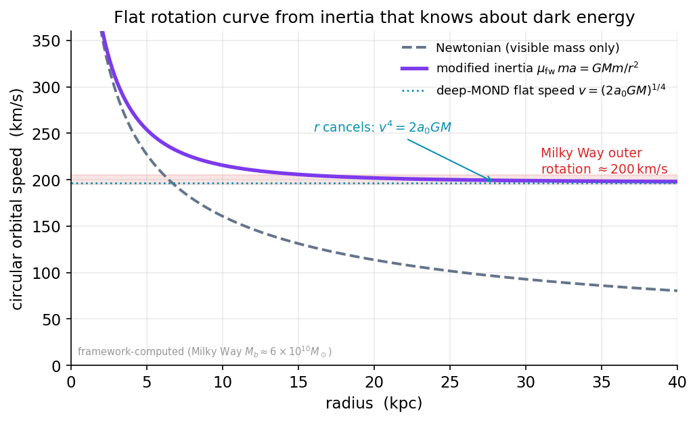

***Figure 21.3 — The worked example, drawn.*** Computed from the framework's equations for a Milky-Way-mass disk ($M_b\approx6\times10^{10}\,M_\odot$). With only ordinary Newtonian gravity from the visible mass, the speed falls as $\sqrt{GM/r}$ (grey dashed). Solving the modified-inertia law $\mu_{\rm fw}(|a|/a_0)\,m\,a=GMm/r^2$ at each radius (purple) makes the curve **flatten**, settling onto the deep-MOND value $v=(2a_0GM)^{1/4}\approx197\,$km/s where the radius cancels entirely — landing in the observed $\sim200\,$km/s band (red). This success is real but shared by the whole MOND family; the distinctive test lives in $a_0(z)$.

**Source:** Figure generated by [`book/figures/ch21_flat_rotation_curve.py`](https://github.com/carlzimmerman/zimmerman-formula/blob/main/book/figures/ch21_flat_rotation_curve.py). Framework law and $v^4=2a_0GM$: [Zenodo 10.5281/zenodo.20721540](https://doi.org/10.5281/zenodo.20721540). Flat curves first measured by Rubin & Ford 1970, ApJ 159, 379; baryonic Tully-Fisher: McGaugh 2012, AJ 143, 40.

## Stepping back

So here is the engine room, with the lights on and nothing hidden in the corners.

The fuel is dark energy — the cosmological constant $\Lambda$ — which gives our universe a faint, unremovable temperature floor in the vacuum, the de Sitter–Unruh temperature $T_\Lambda$. The moving part is inertia, reconceived (following Milgrom and Deser–Levin) not as a frozen property of matter but as matter's response to the vacuum it accelerates through. When an object accelerates hard, its self-made vacuum warmth swamps the floor and inertia is ordinary Newton — so cars, planets, and Cassini are untouched. When an object barely accelerates at all, the floor props its inertia up, it grows reluctant to be pushed, and at the edge of a galaxy that extra reluctance mimics, to the eye, exactly the missing gravitational pull. The crossover sits at an acceleration of order $cH_\Lambda$ — which is to say, at $a_0$ — because that is where an object's own Unruh warmth dips below the warmth dark energy paints across the sky.

That is a genuine mechanism, built from genuine physics, and its Solar-System safety is a structural gift rather than a patch. And it has a real, unhealed wound: the naive passive-bath version gets the sign wrong, the cure must be a time-nonlocal action that respects Milgrom's 1994 no-go, and the *specific* memory kernel that would derive $\mu_{\rm fw}$ from the vacuum with no free functions does not yet exist. The form is forced. The mechanism is the right *kind* of mechanism. The end-to-end derivation is unfinished. All three of those are true at once, and a reader who can hold all three is reading this book exactly as I hoped it would be read.

Not a theory of everything yet — as frustrating as it may be. But a clear, honest, and rather beautiful idea about why the spin of galaxies remembers the dark energy filling the sky.

## Summary

- **The fork inside the fork.** "Missing mass" can be patched by *adding force* (dark-matter particles) or by *changing the law*. Changing the law itself splits into **modified gravity** (strengthen the force at low acceleration) and **modified inertia** (keep gravity Newtonian, make objects harder to push at low acceleration). This framework is modified *inertia*.

- **The three borrowed ideas.** (1) The **Unruh effect**: an accelerating observer sees a warm vacuum, $T_{\rm Unruh}\propto a$. (2) The **de Sitter–Unruh temperature floor** $T_\Lambda = \hbar H_\Lambda/2\pi k_B$: in a dark-energy universe the vacuum has a minimum temperature you cannot coast below. (3) Milgrom's conjecture that **inertia is a response to that vacuum** — so inertia inherits the floor.

- **Why $a_0$ tracks $\Lambda$.** The new physics switches on where an object's own Unruh temperature drops below the cosmic floor, i.e. where $a \sim cH_\Lambda$. That crossover *is* the acceleration scale $a_0$, tying the galactic scale to dark energy with no galaxy data used.

- **The Deser–Levin quadrature** $T_{\rm eff}=\frac{\hbar}{2\pi ck_B}\sqrt{a^2 + (cH_\Lambda)^2}$ supplies the floor rigorously; reading the inertia from the temperature *excess* over the floor yields the framework interpolation $\mu_{\rm fw}(x)=(\sqrt{x^2+1}-1)/x$, which is Newtonian ($\mu_{\rm fw}\to1$) for $x\gg1$ and deep-MOND ($\mu_{\rm fw}\to x/2$) for $x\ll1$.

- **Solar-System safety is structural.** Because $\mu_{\rm fw}$ gates on the body's *actual acceleration* $|a|$, not on the gravitational field strength, the modification switches off everywhere a probe actually flies (orbital accelerations $\gg a_0$). Cassini's bound is passed automatically — a virtue of modifying inertia rather than gravity.

- **The open wall, stated plainly.** A naive "passive warm-bath drag" gives the **wrong sign** for inertia. The **Milgrom 1994 no-go** proves modified inertia cannot come from a local, finite-derivative action; the cure must be a **time-nonlocal action** with a memory kernel — standard physics in form, and it resolves (not evades) the sign problem. But the *specific* kernel that would derive $\mu_{\rm fw}$ from the de Sitter–Unruh vacuum with no free functions **does not yet exist**. The form is forced; the mechanism is unfinished.

- **Shared, not unique.** The flat rotation curves and the baryonic Tully–Fisher law $v^4=2a_0GM$ that fall out of this mechanism are real successes — but they are *shared with the whole MOND family*, not fingerprints of this mechanism in particular. The distinctive test lives in $a_0(z)$ (Chapters 25–26), and lensing remains a genuine open problem (Chapter 28).

## Questions

1. **(Easy.)** In your own words, explain the difference between "modified gravity" and "modified inertia," and give the everyday reason — using the idea of a probe like Cassini still being strongly accelerated — why modified inertia leaves the Solar System untouched.

2. **(Easy–medium.)** The Unruh temperature is $T_{\rm Unruh}=\hbar a/2\pi c k_B$. Roughly what acceleration $a$ would you need to feel a vacuum as warm as room temperature ($\approx 300\,$K)? Compare that to $a_0\approx 10^{-10}\,\text{m/s}^2$ and to the de Sitter floor temperature $T_\Lambda\approx 2\times10^{-30}\,$K. What does the enormous gap tell you about why the effect is invisible in everyday life but relevant at a galaxy's edge?

3. **(Medium.)** Using the deep-MOND inertia law $\tfrac12(a/a_0)\,m\,a = GMm/r^2$ and the circular-orbit condition $a=v^2/r$, re-derive $v^4 = 2a_0 GM$ yourself, showing each cancellation. Then estimate the flat rotation speed of a dwarf galaxy with baryonic mass $M = 10^{9}\,M_\odot$. Is it faster or slower than the Milky Way's, and why does that make sense?

4. **(Medium–hard.)** The text claims the rotation-curve and Tully–Fisher successes are "shared with the whole MOND family" and therefore do *not* select this mechanism over modified-gravity MOND. Explain carefully why a circular orbit cannot distinguish "harder to push inward" (modified inertia) from "pulled harder inward" (modified gravity). Then propose, in words, a kind of motion or observation that *could* in principle tell them apart.

5. **(Hard / research-level.)** State the Milgrom 1994 no-go theorem in your own words, and explain why it forces any honest modified-inertia theory to be *time-nonlocal* (history-dependent) rather than built from finitely many time-derivatives at a single instant. Why does a passive, velocity-coupled "drag" model give the wrong sign for inertia, and how does an acceleration-coupled, nonlocal memory kernel resolve the problem *while obeying* the no-go?

6. **(Research-level / open.)** The chapter is explicit that no first-principles derivation yet exists of the specific memory kernel $\mathcal{K}(t-t';a_0)$ that would yield $\mu_{\rm fw}$ from the de Sitter–Unruh vacuum with no free functions. Sketch what such a derivation would have to accomplish: which limits it must reproduce, which symmetries it must respect, and what would count as success versus what would merely be a fit. If you could prove one auxiliary result that would most advance the program, what would it be — and would proving it derive the *value* of $a_0$, or only its *form*? (Quarantine check: be careful to distinguish deriving the form from deriving the number.)

# Chapter 22: What Is Forced: The Form and the √(8π/3) Kernel

*There is a difference between a coincidence and a consequence. This chapter is about telling them apart — honestly, in both directions.*

---

## The question that separates a theory from a pun

Suppose I told you that the height of the Great Pyramid, multiplied by a billion, comes out close to the distance from the Earth to the Sun. You could check it, and you might find it's roughly true. And you would be right to shrug. Nothing about the pyramid *forces* that number to be the Earth–Sun distance. The pyramid could have been a little taller or a little shorter and still been a pyramid. The match is a coincidence dressed up in suggestive clothing. We have a word for this kind of thing when it shows up in physics: **numerology** — finding a formula that hits a number you already knew, without any reason the formula *had* to take that shape.

The whole point of the previous two chapters was a single equation:

$$a_0 = c^2\sqrt{\frac{\Lambda}{32\pi}} = \frac{c}{2}\sqrt{G\rho_{\rm DE}} = \frac{cH_\Lambda}{Z}, \qquad Z = \sqrt{\tfrac{32\pi}{3}} \approx 5.789,$$

which lands on the measured galactic acceleration scale $a_0 \approx 9.36\times 10^{-11}\ \mathrm{m/s^2}$. And the honest reader — the skeptical reader, the reader I most want — should immediately ask the pyramid question: *Is this a consequence, or is it a pun?* Did the physics force this shape, or did Carl just rummage around in a drawer of constants until something fit?

This chapter is my answer, and it is the most important chapter in Part 5, because it is where I show my work and — just as important — where I show you exactly where the work runs out. The honest verdict, stated up front and in both directions, is this: **the *shape* of the formula is forced, and forced over and over by independent arguments; the single number inside it that picks out the exact value is not.** The first half of that sentence is what separates this from numerology. The second half is why this is not a theory of everything yet, as frustrating as it may be.

Let me earn both halves.

---

## What "forced" means

Start with a homely example, because it carries the whole idea.

When you multiply two numbers — say $7 \times 8 = 56$ — the digits of the answer are not a matter of taste. You don't get to *choose* that it ends in a 6. Once you've committed to the two numbers and to the rules of multiplication, the 56 is *forced*. If a friend insisted the answer was 54, they wouldn't be expressing a different opinion; they'd be wrong, and you could show them why. The "5" and the "6" are not free parameters. They are consequences.

Now compare that to choosing what to name a new pet. Nothing in the universe forces "Fido" over "Rex." It's a free choice. Both are fine. The name carries no information about the dog.

A physical formula is a mixture of these two kinds of thing. Some pieces are like the digits of $7\times 8$ — once you accept the underlying physics, they *have* to be there, in that combination, with that exact factor. Other pieces are like the pet's name — genuinely up to us, or at least up to a measurement, not pinned down by the logic. **A forced form** is the part of the formula that the physics cannot avoid producing. The discipline I want to model in this chapter is the discipline of drawing that line carefully and refusing to smudge it in either direction — not claiming "forced" for something that's a choice (that would be hype), and not shrugging off "forced" as a coincidence when it genuinely is a consequence (that would be false modesty, which is just another way of being wrong).

So here is the plan. The formula has two ingredients we need to interrogate:

1. **The form** — the *shape* $a_0 \propto c^2\sqrt{\Lambda}$, the statement that the galactic acceleration scale is set by the square root of the cosmological constant. Is the shape forced?
2. **The kernel** — the exact dimensionless number out front, $\sqrt{8\pi/3}$ (which, regrouped, gives the $\sqrt{32\pi/3}$ in $Z$), including its strange half-power of $\pi$. Is *that* forced?

I'll take them in turn. The headline: the form is over-determined — four genuinely independent routes all demand it — and the kernel's $\sqrt{\pi}$ is a fingerprint that pins down *where* the number comes from. What is *not* forced is the one remaining factor, a pure number I'll call $\kappa = 1/2$, and the entire next chapter (Ch 23) is devoted to proving, carefully, that it *cannot* be forced. Knowing the boundary precisely is the whole game.

> **Margin aside.** "Over-determined" is an engineer's compliment, not a complaint. A bridge whose load is carried by four independent cables is *more* trustworthy than one carried by a single cable, even though three of the four are, in a logical sense, redundant. When several unrelated arguments are forced to the same conclusion, that conclusion is hard to dislodge by attacking any one argument.

---

## Part one: Is the form forced?

The form is the claim that the small acceleration $a_0$ is built from the speed of light $c$ and the cosmological constant $\Lambda$ in the combination

$$a_0 \sim c^2\sqrt{\Lambda}.$$

Let me first make sure the everyday reader sees *why this is even a sensible thing to ask*, before we ask whether it's forced.

The cosmological constant $\Lambda$ (Chapter 11) is the number that describes how fast empty space pushes itself apart — the "dark energy" that makes the cosmic expansion speed up. It has the units of one-over-a-length-squared; physically, $\sqrt{1/\Lambda}$ is a length, the size of the cosmic horizon, the farthest-out distance the accelerating universe will ever let us see. Call that length $\ell_\Lambda$. It is enormous, about $1.6 \times 10^{26}$ meters — roughly the radius of the observable universe.

Here is the small miracle that started this whole framework. If you take the speed of light and ask "what acceleration would carry you across that cosmic length in the natural way," you compute $c^2\sqrt{\Lambda} \sim c^2/\ell_\Lambda$, and the number that falls out is about $10^{-10}\ \mathrm{m/s^2}$ — which is, to within a small factor, *exactly the acceleration scale Milgrom found buried in the rotation of galaxies* (Chapters 17–18). The biggest thing in the universe (the dark-energy horizon) and one of the smallest accelerations we can measure (the edge of a galaxy's gravitational grip) are quietly holding hands.

That coincidence is old — people noticed it in the 1980s. The framework's contribution is not noticing it; it's asking whether the *shape* $c^2\sqrt{\Lambda}$ is forced by physics or is just a number that happens to land in the right place. And the answer turns out to be the good kind of answer: it is forced, and not by one argument but by several that don't talk to each other.

### The four routes

I want to be very careful here, because this is exactly the place where an honest framework can quietly turn into a dishonest one. An earlier version of my own notes claimed *seven* independent mechanisms forcing the form. When I went back and audited them properly — controlling for the fact that some "different" arguments were really the same argument wearing different hats — the honest count came down to **four**. I'll say more about that audit in a Deeper Dive box, because *the act of correcting my own overcount downward is the single best evidence I can offer that this is being done with discipline and not salesmanship.* A numerologist never revises a count *down*.

Here are the four, told first in plain language.

**Route 1 — The temperature floor of empty space.** This is the framework's own central mechanism, the de Sitter–Unruh story of Chapters 14–15 and 21. A universe with a cosmological constant is never perfectly cold; its horizon gives empty space a tiny temperature floor, $T_{\rm dS} \sim \hbar c\sqrt{\Lambda}/k_B$. An object in near-free-fall — an object accelerating so gently that its own Unruh temperature is comparable to this floor — can no longer ignore the floor. The crossover happens precisely when the object's acceleration is of order $c^2\sqrt{\Lambda}$. The temperature floor *defines* an acceleration scale, and that scale has the form $c^2\sqrt{\Lambda}$. Nothing was chosen; the units and the de Sitter temperature did the work.

**Route 2 — Dimensional inevitability under one assumption.** Suppose you grant just one physical idea: that the small-acceleration scale is built *only* from the speed of light $c$ and the cosmic vacuum (i.e., from $\Lambda$, or equivalently the dark-energy density $\rho_{\rm DE}$), and from nothing about the galaxy itself. Then dimensional analysis — the bookkeeping of units, the same logic that tells you "you can't add meters to seconds" — leaves you *no freedom at all* in the shape. The only acceleration you can build from $c$ and $\Lambda$ is $c^2\sqrt{\Lambda}$, up to a pure number. This route is the weakest of the four in one sense (it *assumes* the ingredient list) but the most rigid in another (given the list, the form is the *only* possibility). It is the "digits of $7\times8$" argument in its purest form.

**Route 3 — The holographic / Cohen–Kaplan–Nelson bound.** In Chapter 16 we met the idea that the amount of information — entropy — you can pack into a region of space is limited by its surface area, not its volume (holography), and the sharper Cohen–Kaplan–Nelson (CKN) bound that ties the largest allowed length to the vacuum energy density. When you push that bound to its single-degree-of-freedom limit, it hands you a relationship between the vacuum energy and a length scale, and translating that length into an acceleration again yields $c^2\sqrt{\Lambda}$. This route is structurally *different* from the thermal one — it's about counting states, not about temperature — yet it arrives at the same doorstep.

**Route 4 — The gauge-gravity (MacDowell–Mansouri) construction.** This is the most technical of the four and the one I'm proudest to be able to point at, because a piece of it has been *machine-certified* — checked symbolically by computer algebra, not just by a hopeful human. The short version: there's a way of building Einstein's gravity-with-a-cosmological-constant not by *postulating* it but by treating gravity as a gauge theory of a particular symmetry group called $SO(4,1)$ — the symmetry of de Sitter space itself. In that construction, $\Lambda$ is not a free add-on; it sits inside the structure from the start, fused to Newton's constant $G$ and to $c$. When you read off the natural acceleration scale that this construction makes available, the cosmological constant comes along for the ride in exactly the $\sqrt{\Lambda}$ combination. I'll lay out the real machinery in a Deeper Dive box below; for now the point is only this: a fourth route, starting from the *geometry of the theory of gravity itself*, lands on the same form.

### Why four-from-different-places beats one

Step back and look at what we have. A thermodynamic argument (Route 1), a pure units argument (Route 2), an information-theoretic argument (Route 3), and a gauge-geometry argument (Route 4). These are not four restatements of one idea. They come from four different rooms of physics — heat, dimensions, entropy, symmetry — and they have no obvious reason to agree. Yet they are *forced* to the same shape, $a_0 \sim c^2\sqrt{\Lambda}$.

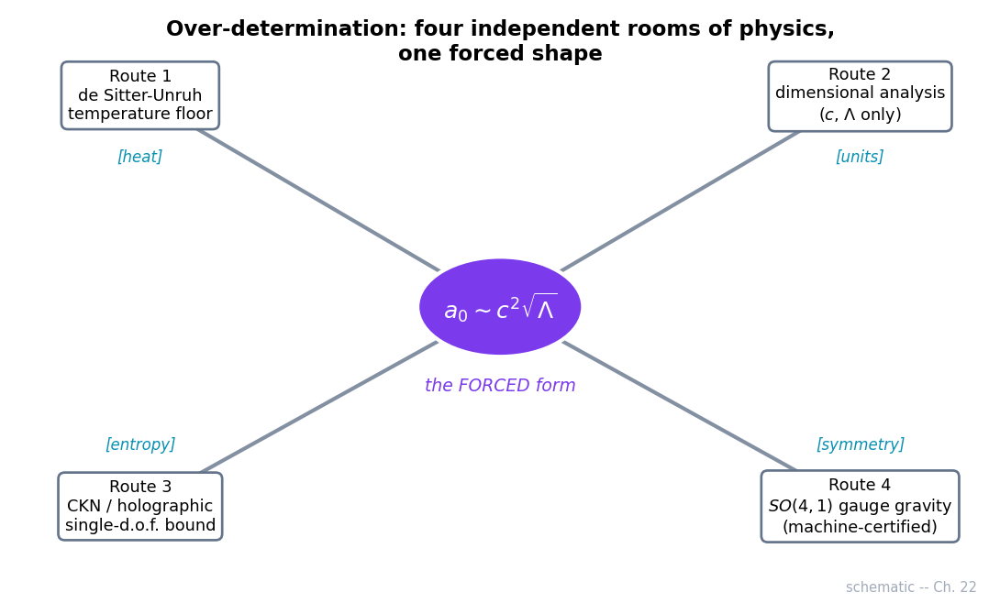

***Figure 22.1 — Four independent routes, one forced form.*** A schematic of the chapter's central claim: the *shape* $a_0\sim c^2\sqrt{\Lambda}$ is over-determined, demanded by four arguments from four different rooms of physics (heat, units, entropy, symmetry) that share no load-bearing assumption. Knock out any one cable and the form still stands on the other three — that is what "over-determined" means. Schematic illustrating the structure of the argument, not a calculation.

**Source:** Figure generated by [`book/figures/ch22_four_routes_one_form.py`](https://github.com/carlzimmerman/zimmerman-formula/blob/main/book/figures/ch22_four_routes_one_form.py). Routes as laid out in this chapter; the underlying physics: de Sitter/Unruh effective temperature (Deser & Levin 1997, Class. Quantum Grav. 14, L163; Unruh 1976, PRD 14, 870), the CKN UV/IR bound (Cohen, Kaplan & Nelson 1999, PRL 82, 4971), and the MacDowell-Mansouri $SO(4,1)$ construction (MacDowell & Mansouri 1977, PRL 38, 739); framework synthesis at [https://doi.org/10.5281/zenodo.20721540](https://doi.org/10.5281/zenodo.20721540).

That is what I mean when I say the form is **over-determined**. If tomorrow someone found a fatal flaw in the de Sitter–Unruh thermal mechanism — Route 1, the framework's own favorite — the *form* would still stand on the other three legs. The form is the robust part. It is hard to be wrong about, because to be wrong about it you'd have to be wrong about four things at once, in four different fields, all of which conspire to give the same answer.

And I want to be equally clear about what this does *not* buy us. None of these four routes hands you the *number* $9.36 \times 10^{-11}$. Every one of them produces the shape $c^2\sqrt{\Lambda}$ *up to a dimensionless factor of order one* — and that factor is the kernel, the $\sqrt{8\pi/3}$, which is the subject of part two. Even the kernel, as we'll see, does not close the whole gap: there is a last pure number, $\kappa$, that no argument forces, and that's Chapter 23's burden. The form is forced. The full value is not. Both halves are true, and I will not let you leave this chapter believing only the flattering half.

> **Deeper Dive: The honest audit — how seven became four (an FDR-controlled count).**
>
> An earlier draft of my own working notes listed seven "independent mechanisms" forcing $a_0\propto c^2\sqrt{\Lambda}$. That number was inflated, and the inflation is instructive, so I'll show how it deflated.
>
> The problem with counting "independent arguments" is the same problem statisticians face when running many tests at once: if you go looking for confirmations, you will find them, and some fraction will be spurious — the same underlying fact double- and triple-counted because it was re-derived through superficially different notation. The fix is to treat the list the way a careful statistician treats a battery of hypothesis tests, controlling the **false-discovery rate (FDR)** — demanding that a candidate "independent" route share *no load-bearing assumption* with any route already on the list before it earns a slot.
>
> Applying that discipline, three of the original seven collapsed:
> - Two of them were the de Sitter–Unruh thermal argument re-expressed through the holographic entropy of the horizon and through the horizon's surface gravity. These are not independent of each other and not independent of the temperature floor; the horizon temperature, surface gravity, and entropy are three faces of one thermodynamic object. They collapse onto **Route 1**.
> - One was a "Verlinde-style entropic-force" re-derivation that, on inspection, smuggled in the same dimensional skeleton as **Route 2** plus an entropic gradient that added no new constraint on the *form*. It was Route 2 in disguise.
>
> What survived as genuinely structurally independent — sharing no load-bearing premise with another survivor — were the four in the main text: thermal floor (Route 1), pure dimensional analysis under a stated ingredient list (Route 2), the CKN/holographic single-d.o.f. bound (Route 3), and the $SO(4,1)$ MacDowell–Mansouri gauge construction (Route 4). Four is the honest, FDR-controlled count.
>
> A point of method, because it matters more than the count itself: *the direction of the correction is the tell.* A framework being marketed inflates such counts and never deflates them; a framework being investigated deflates them when the evidence says to. I'd rather defend a solid four than wave around a soft seven. If a future audit knocks one of the four out as secretly dependent, the form survives on the rest — that is the entire benefit of over-determination — and I'll change the number in the next printing without complaint.

> **Deeper Dive: The MacDowell–Mansouri $SO(4,1)$ construction and why $\Lambda$ rides inside the theory.**
>
> *(Skip this box freely; the main thread continues below and loses nothing.)*
>
> The **MacDowell–Mansouri construction** is a way of writing down gravity as a gauge theory. Ordinary gauge theories — electromagnetism, the strong and weak forces — are built from a connection one-form $A$ valued in the Lie algebra of a symmetry group, with a curvature $F = dA + A\wedge A$. Gravity is awkward to fit into this mold because the metric and the connection play different roles. MacDowell and Mansouri (1977) sidestepped the awkwardness by gauging not the Lorentz group but the **de Sitter group $SO(4,1)$** — the isometry group of de Sitter space, which contains the Lorentz group $SO(3,1)$ as a subgroup and *also* contains the translations as the remaining four generators.
>
> One packages the spin connection $\omega^{ab}$ and the vierbein (frame field) $e^a$ together into a single $SO(4,1)$ connection
> $$ A = \tfrac{1}{2}\,\omega^{ab} M_{ab} + \tfrac{1}{\ell}\, e^a P_a, $$
> where $\ell$ is a length that *must* appear on dimensional grounds to let the translation generators $P_a$ (carrying a length dimension) sit in the same algebra as the dimensionless Lorentz generators $M_{ab}$. That length $\ell$ is the de Sitter radius, $\ell^2 = 3/\Lambda$. The cosmological constant is *built into the symmetry group*, not bolted on afterward.
>
> The $SO(4,1)$ curvature decomposes as
> $$ F^{ab} = R^{ab} - \tfrac{1}{\ell^2}\, e^a\wedge e^b, \qquad F^{a4} = \tfrac{1}{\ell}\, T^a, $$
> with $R^{ab}$ the Riemann curvature two-form and $T^a$ the torsion. The MacDowell–Mansouri action is the parity-even quadratic invariant built from the Lorentz part,
> $$ S \propto \int \epsilon_{abcd}\, F^{ab}\wedge F^{cd}. $$
> Expanding the square produces three terms: a topological Gauss–Bonnet term (which doesn't affect the equations of motion), the **Einstein–Hilbert term** $\propto \epsilon_{abcd}\,R^{ab}\wedge e^c\wedge e^d$, and a **cosmological-constant term** $\propto \epsilon_{abcd}\,e^a\wedge e^b\wedge e^c\wedge e^d$, with the relative coefficient fixed at $1/\ell^2 \propto \Lambda$.
>
> The machine-certified statement is this: *given the $SO(4,1)$ gauge structure and the demand for a two-derivative, parity-even invariant, the Einstein–Hilbert-plus-$\Lambda$ action is the unique answer, with $G$ and $\Lambda$ fused through $\ell$.* This was checked by computer-algebra enumeration of the invariants — every candidate two-derivative parity-even $SO(4,1)$-invariant was generated and reduced, and exactly one survived modulo the topological term. That is what I mean by "machine-certified": not a claim that the *physics* is certified true, only that the *algebraic uniqueness* — there is no other such invariant hiding — was verified mechanically rather than by a tired human asserting "I'm pretty sure that's all of them."
>
> The consequence for the form: because $\Lambda$ enters only through $\ell^2 = 3/\Lambda$, any acceleration scale the construction makes available carries $\Lambda$ in the combination $1/\ell \propto \sqrt{\Lambda}$. The $\sqrt{\Lambda}$ is structural. And — preview of part two — the factor of $3$ in $\ell^2 = 3/\Lambda$ is the very same $3$ that will reappear in the kernel $\sqrt{8\pi/3}$. It is the Friedmann $3$, and it is not a coincidence that it shows up here too.
>
> **Honest caveat, carried as always:** this construction forces the *form* and the *appearance* of $\Lambda$ inside gravity. It does *not* by itself force the modified-inertia mechanism (that's the de Sitter–Unruh physics of Ch 21), and it does *not* fix the overall dimensionless coefficient to the precise value $\sqrt{8\pi/3}\times(\text{something})$ — the kernel needs the density normalization of part two, and the last factor $\kappa$ needs Chapter 23. Route 4 is a forcing of the form, not a derivation of the number.

---

## Part two: The kernel, and the fingerprint hiding in it

Now to the more delicate question. Granting that the form $a_0 \sim c^2\sqrt{\Lambda}$ is forced, what about the *exact dimensionless factor*? Where does the $\sqrt{8\pi/3}$ come from, and is it forced too?

Let me first unpack what this factor even is, because the everyday reader deserves to see it assembled from parts they already know rather than handed down as a mysterious lump.

Write the dark-energy density $\rho_{\rm DE}$ in terms of $\Lambda$. The cosmological constant and the dark-energy density are two ways of saying the same thing, related by

$$\rho_{\rm DE} = \frac{\Lambda c^2}{8\pi G}.$$

That $8\pi$ in the denominator is **Einstein's $8\pi$** — it is the exact numerical factor sitting in front of the matter in Einstein's field equations (Chapter 8), $G_{\mu\nu} = (8\pi G/c^4)\,T_{\mu\nu}$. It is not adjustable. It is forced by demanding that Einstein's equations reduce to Newton's law of gravity in the weak, slow limit; if it were anything other than $8\pi$, apples would fall at the wrong rate. Every physicist who has ever matched general relativity to Newton has rederived that $8\pi$, and it always comes out $8\pi$.

Now where does the **3** come from? It comes from the **Friedmann equations** (Chapter 9), the equations that govern how the whole universe expands. The first Friedmann equation reads

$$H^2 = \frac{8\pi G}{3}\,\rho,$$

and that $3$ in the denominator is forced by the geometry of an expanding three-dimensional space — it is, at root, the $3$ of "three dimensions," entering through the way a sphere's volume grows as the cube of its radius. (You met the same $3$ a moment ago, in the Deeper Dive box, as the $3$ in the de Sitter radius $\ell^2 = 3/\Lambda$. It is the *same number from the same place*, which is exactly the kind of internal consistency that should make you trust the bookkeeping.)

So the kernel is not a free-floating mystery. It is

$$\frac{8\pi}{3} = \underbrace{8\pi}_{\text{Einstein}} \;\div\; \underbrace{3}_{\text{Friedmann}},$$

**Einstein's $8\pi$ divided by Friedmann's $3$.** Two of the most thoroughly tested numbers in all of physics, multiplied and divided in the only way the bookkeeping allows. And because the acceleration involves a *square root* of the density (remember $a_0 = \frac{c}{2}\sqrt{G\rho_{\rm DE}}$, a square root), the kernel that appears in $a_0$ and in $Z$ is the *square root* of that ratio: $\sqrt{8\pi/3}$, and $Z = \sqrt{32\pi/3} = 2\sqrt{8\pi/3}$ once the factor of $\kappa = 1/2$ is folded in (that factor of $2$ is where $\kappa$ lives — hold that thought for Chapter 23).

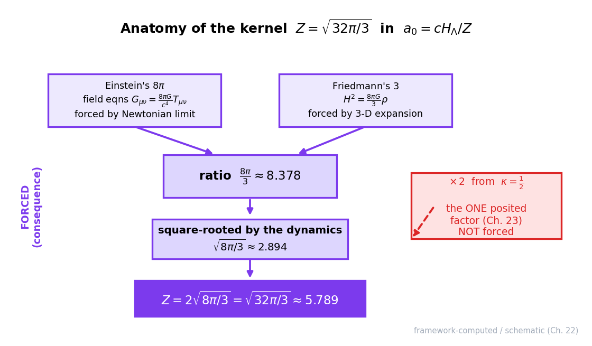

***Figure 22.2 — Anatomy of the kernel: what is forced and the one factor that is not.*** The chapter's ledger drawn as a flow. The forced pieces (purple) are Einstein's $8\pi$ — fixed by the Newtonian limit of general relativity — divided by Friedmann's $3$ — fixed by three-dimensional expansion — giving $8\pi/3\approx 8.378$, square-rooted by the dynamics to $\sqrt{8\pi/3}\approx 2.894$. The lone *posited* factor (red, dashed) is $\kappa=\tfrac12$, which contributes the factor of $2$ that turns the kernel into $Z=\sqrt{32\pi/3}\approx 5.789$. Every number is computed from the framework's own equations; only $\kappa$ is not derived (Chapter 23).

**Source:** Figure generated by [`book/figures/ch22_kernel_anatomy.py`](https://github.com/carlzimmerman/zimmerman-formula/blob/main/book/figures/ch22_kernel_anatomy.py). Kernel decomposition from this chapter and the framework spine ([https://doi.org/10.5281/zenodo.20721540](https://doi.org/10.5281/zenodo.20721540)); the $\kappa=\tfrac12$ one-parameter status from the $\kappa$ geometry theorem ([https://doi.org/10.5281/zenodo.20738055](https://doi.org/10.5281/zenodo.20738055)). Underlying constants: Einstein's field equations (Chapter 8) and the Friedmann equations (Chapter 9); $\Lambda$ from Planck 2018 results VI, A&A 641, A6.

> **Worked Example: Building $a_0$ from the kernel, slowly, with the numbers.**
>
> Let me do the whole arithmetic once, gently, so you can see the kernel actually deliver the right answer rather than take my word for it. I'll keep every step.
>
> **Step 1 — Gather the ingredients.**
> - Speed of light: $c = 3.00 \times 10^{8}\ \mathrm{m/s}$.
> - Newton's constant: $G = 6.67 \times 10^{-11}\ \mathrm{m^3\,kg^{-1}\,s^{-2}}$.
> - Cosmological constant (from Planck): $\Lambda = 1.09 \times 10^{-52}\ \mathrm{m^{-2}}$.
>
> **Step 2 — Get the dark-energy density from $\Lambda$.** Use $\rho_{\rm DE} = \Lambda c^2/(8\pi G)$:
> $$ \rho_{\rm DE} = \frac{(1.09\times10^{-52})(3.00\times10^{8})^2}{8\pi\,(6.67\times10^{-11})}. $$
> Numerator: $1.09\times10^{-52} \times 9.00\times10^{16} = 9.81\times10^{-36}$. Denominator: $8\pi \times 6.67\times10^{-11} = 1.676\times10^{-9}$. So
> $$ \rho_{\rm DE} = \frac{9.81\times10^{-36}}{1.676\times10^{-9}} \approx 5.85\times10^{-27}\ \mathrm{kg/m^3}. $$
> (A sanity check on this famously tiny number: it's about five hydrogen atoms per cubic meter. Empty space is *almost* empty — but not quite, and that "not quite" is the whole story.)
>
> **Step 3 — Apply the kernel.** The framework's clean form is $a_0 = \tfrac{c}{2}\sqrt{G\rho_{\rm DE}}$. The $\tfrac{1}{2}$ here is $\kappa$; everything else is forced. Compute the inside first:
> $$ G\rho_{\rm DE} = (6.67\times10^{-11})(5.85\times10^{-27}) = 3.90\times10^{-37}, $$
> $$ \sqrt{G\rho_{\rm DE}} = \sqrt{3.90\times10^{-37}} = 6.25\times10^{-19}\ \mathrm{s^{-1}}. $$
> Then
> $$ a_0 = \frac{3.00\times10^{8}}{2}\times 6.25\times10^{-19} = (1.50\times10^{8})(6.25\times10^{-19}) \approx 9.4\times10^{-11}\ \mathrm{m/s^2}. $$
>
> **Step 4 — Compare to the galaxies.** Milgrom's measured value, the one written into the rotation of hundreds of galaxies, is $a_0 \approx 1.2\times10^{-10}\ \mathrm{m/s^2}$; the framework's canonical pure-$\Lambda$ value is $9.36\times10^{-11}\ \mathrm{m/s^2}$. Our back-of-envelope $9.4\times10^{-11}$ lands right on the framework's value and within about 20–30% of the rough Milgrom number — exactly the order-one agreement we should expect from a calculation whose *only* adjustable ingredient is the single factor $\kappa=\tfrac12$.
>
> **The honest reading of this example, both ways.** What just happened is genuinely striking: a number pulled from the expansion of the *entire universe* (the cosmological constant) reproduced a number pulled from the *edges of individual galaxies*, with no galaxy-scale input at all and one factor of order one. That is the strong half. The sober half: the agreement is to *order one*, not to ten decimal places, and the last factor $\kappa=\tfrac12$ was *chosen*, not derived — change it and the answer slides. We are matching a scale, not nailing a precision constant. Keep both halves in view.

### The √π fingerprint

Now I want to point at the single most telling feature of the kernel, the part that, more than anything else in this chapter, separates consequence from coincidence. It is the **$\sqrt{\pi}$**.

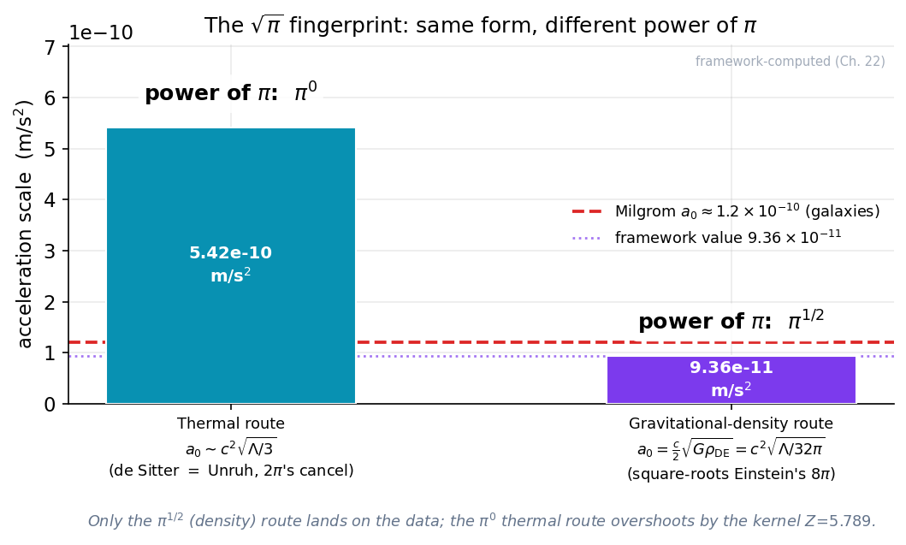

***Figure 22.3 — The $\sqrt{\pi}$ fingerprint.*** Two routes to the *same form* $c^2\sqrt{\Lambda}$ leave *different powers of $\pi$*. A purely thermal matching (de Sitter $=$ Unruh) cancels both $2\pi$'s and leaves $\pi^0$, landing at $\approx 5.4\times10^{-10}$; the gravitational-density route square-roots Einstein's $8\pi$ and leaves $\pi^{1/2}$, landing at the framework value $9.36\times10^{-11}$ near Milgrom's galactic $a_0$. The half-integer power of $\pi$ is the forensic mark that the coefficient passes through a gravitational density, not a curvature-free temperature. Both bars are computed from the framework's equations with the constants quoted in the chapter.

**Source:** Figure generated by [`book/figures/ch22_sqrt_pi_fingerprint.py`](https://github.com/carlzimmerman/zimmerman-formula/blob/main/book/figures/ch22_sqrt_pi_fingerprint.py). $\pi$-counting argument from this chapter and the framework spine ([https://doi.org/10.5281/zenodo.20721540](https://doi.org/10.5281/zenodo.20721540)); de Sitter/Unruh temperatures (Deser & Levin 1997; Unruh 1976), $\rho_{\rm DE}=\Lambda c^2/8\pi G$ with $\Lambda$ from Planck 2018 (A&A 641, A6), and the galactic scale (Milgrom 1983, ApJ 270, 365).

Look again at $\sqrt{8\pi/3}$. There's a $\pi$ under the square root, so the kernel carries a *half-integer power* of $\pi$ — a $\pi^{1/2}$, a $\sqrt{\pi}$. This is unusual and it is diagnostic, and here's why.

Think about where factors of $\pi$ come from in physics. Whole-number powers of $\pi$ — $\pi$, $\pi^2$, $4\pi$, $8\pi$ — show up everywhere you integrate over a full sphere or a full circle: the $4\pi$ in the surface area of a sphere, the $4\pi$ in Coulomb's law, the $8\pi$ in Einstein's equations. Those are the $\pi$'s of *geometry in whole dimensions*, and a great many physical arguments produce them.

A *half*-integer power of $\pi$ is a different animal. You get a $\sqrt{\pi}$ specifically when you take the **square root of something that itself carries a full power of $\pi$** — and in this framework, the thing under the square root is a *density normalization*: the dark-energy density $\rho_{\rm DE} = \Lambda c^2/(8\pi G)$, which carries Einstein's $8\pi$ inside it. The acceleration is built from $\sqrt{\rho_{\rm DE}}$, so it inherits $\sqrt{8\pi}$, hence a $\sqrt{\pi}$. **The $\sqrt{\pi}$ is the fingerprint of the gravitational density normalization.** It is the visible mark left behind by the fact that the acceleration scale is built out of a *mass density set by Einstein's equations*, and then square-rooted by the dynamics.

Here is why that fingerprint is worth so much. There are *other* ways to manufacture an acceleration scale of order $c^2\sqrt{\Lambda}$ that have nothing to do with a gravitational density — purely thermal routes, for instance, that build the scale directly out of the de Sitter *temperature* and the Unruh relation, never passing through a mass density at all. And those routes produce a *different* kernel: they give you whole powers of $\pi$ (from the $2\pi$'s of the Unruh and de Sitter temperature formulas), *not* a $\sqrt{\pi}$. A curvature-free, purely thermal construction does not leave a $\sqrt{\pi}$ behind, because it never square-roots a density that carried an $8\pi$.

So the $\sqrt{\pi}$ is a discriminator. It tells you *which* of the routes is doing the real numerical work in setting the coefficient. The form $c^2\sqrt{\Lambda}$ is, as we saw, over-determined — four routes agree on the *shape*. But they do *not* all agree on the *kernel*. And the kernel that the data actually wants — the one that lands on $9.36\times10^{-11}$ — carries the $\sqrt{\pi}$, which means the route that sets the coefficient is the one that runs through a gravitational density (the Einstein $8\pi$) and the Friedmann $3$, not a coefficient-free thermal route. The fingerprint points at gravity, specifically.

> **Margin aside.** This is the kind of thing I find genuinely beautiful, and I'll allow myself the word for once. The exponent on a single $\pi$ — whether it's a $1$ or a $\tfrac12$ — quietly records *the entire derivation path* of the constant. It is a tiny piece of forensic evidence baked into the number itself. Read the power of $\pi$ and you can tell whether the constant came through a density or through a temperature.

> **Deeper Dive: Why a half-integer power of $\pi$ cannot come from a curvature-free thermal route.**
>
> Lay the two routes side by side and watch the $\pi$'s.
>
> *The thermal route (no gravitational density).* The de Sitter temperature is $k_B T_{\rm dS} = \hbar H_\Lambda/(2\pi)$ with $H_\Lambda = c\sqrt{\Lambda/3}$, and the Unruh temperature of an accelerated observer is $k_B T_U = \hbar a/(2\pi c)$. If you build the acceleration scale by setting the Unruh temperature equal to (a multiple of) the de Sitter floor, $T_U \sim T_{\rm dS}$, the $2\pi$'s in *both* temperatures cancel cleanly, and you are left with
> $$ a_0 \sim c\,H_\Lambda = c^2\sqrt{\Lambda/3}. $$
> Notice: a factor of $\sqrt{3}$ (the Friedmann $3$, from $H_\Lambda = c\sqrt{\Lambda/3}$), and **no $\pi$ at all** — whole power $\pi^0$. The $2\pi$'s of the temperature definitions cancelled. A purely thermal matching produces an *integer* (here zeroth) power of $\pi$.
>
> *The gravitational-density route.* Now build the same scale through the density. Write $a_0 = \kappa\, c\sqrt{G\rho_{\rm DE}}$ and substitute $\rho_{\rm DE} = \Lambda c^2/(8\pi G)$:
> $$ a_0 = \kappa\, c\sqrt{G\cdot \frac{\Lambda c^2}{8\pi G}} = \kappa\, c^2\sqrt{\frac{\Lambda}{8\pi}}. $$
> The $G$'s cancel — good, since gravity's strength shouldn't set this scale's *units* — but the $8\pi$ does *not* cancel; it sits under the square root and emerges as a $\sqrt{8\pi}$, i.e. a **half-integer power of $\pi$**. With $\kappa = \tfrac12$ one regroups to $a_0 = c^2\sqrt{\Lambda/(32\pi)}$ and $Z = \sqrt{32\pi/3}$, the canonical forms.
>
> The contrast is the whole point. The two routes agree on the *form* ($\propto c^2\sqrt{\Lambda}$) and even nearly agree numerically (they differ only by the kernel and the $\sqrt 3$ versus $\sqrt{8\pi}$ bookkeeping). But they leave *different powers of $\pi$*: the thermal route leaves $\pi^0$, the density route leaves $\pi^{1/2}$. The measured coefficient that fits galaxies carries the $\sqrt\pi$. Therefore the coefficient-setting physics passes through a gravitational density normalized by Einstein's $8\pi$, not through a curvature-free temperature matching alone.
>
> Two caveats, kept honestly. First, the two routes are *not in conflict about the framework* — in the full de Sitter–Unruh modified-inertia mechanism (Ch 21) the thermal floor sets the *trigger* (the form) while the response of inertia is governed by the gravitational coupling that brings in the $8\pi$; the $\sqrt\pi$ is the mark of that coupling. Second, and crucially: *the $\sqrt\pi$ fingerprint identifies the route; it does not by itself fix $\kappa$.* The factor $\kappa=\tfrac12$ — the difference between $\sqrt{8\pi}$ and $\sqrt{32\pi}$, between getting $a_0$ exactly versus up to a factor of two — remains unforced. That last knob is Chapter 23's entire subject, and I will not let the elegance of the $\sqrt\pi$ argument distract you from the fact that one number is still, honestly, posited.

---

## Drawing the line precisely

Let me now collect the whole accounting in one place, because the discipline I've been preaching is only worth anything if I state the final ledger plainly.

**Forced (the consequence side):**
- *The form* $a_0 \propto c^2\sqrt{\Lambda}$ — over-determined by four structurally independent routes (thermal floor, dimensional analysis, CKN/holographic bound, $SO(4,1)$ gauge gravity). Knock out any one and it stands on the rest.
- *The structure of the kernel* $\sqrt{8\pi/3}$ — Einstein's $8\pi$ (forced by the Newtonian limit of general relativity) divided by Friedmann's $3$ (forced by three-dimensional expansion), then square-rooted by the dynamics.
- *The $\sqrt{\pi}$ fingerprint* — the half-integer power of $\pi$ that marks the coefficient as coming through a gravitational density, not a curvature-free thermal route. A genuine, falsifiable structural signature.

**Not forced (the posit side):**
- *The single dimensionless factor $\kappa = 1/2$* — the last number, the one that turns "right to within a factor of two" into "right on the nose at $9.36\times10^{-11}$." Nothing in this chapter derives it. The whole of Chapter 23 is devoted to proving, rigorously, that it *cannot* be derived from the consistency requirements available (ghost-freedom, unitarity, holography, the Standard-Model degree-of-freedom count) — that it is a *pure geometric posit*, the single-degree-of-freedom limit of the CKN bound and the identity $3/8\pi = (1/2)/(4\pi/3)$. So this is a one-parameter theory, not a zero-parameter one.

And because I promised both-ways honesty at every turn, here is the both-ways summary of *this very chapter's* result. The strong half: forcing a form *four independent ways*, and reading the derivation path off the power of $\pi$, is exactly the discipline that separates a physical result from numerology, and very few "alternative" proposals can show that much structural rigidity. The sober half: forcing the form is *not* deriving the value; the kernel's structure is forced but its overall normalization still rides on one posited number; and even with $\kappa$ granted, the agreement with galaxies is order-one, not high-precision. The form is a consequence. The value is, at the last step, still a choice. That gap is real, it is the honest center of the whole framework, and it is why this is not a theory of everything yet — as frustrating as it may be.

That frustration, I've come to think, is the correct feeling to have here. It means we've drawn the line in the right place, and refused to paint over it.

---

## Summary

- **"Forced" means a consequence, not a choice** — like the digits of $7\times8$, which you cannot vote on, versus a pet's name, which you can. The job of this chapter is to draw that line through the formula precisely, and refuse to smudge it either way.
- **The *form* $a_0\propto c^2\sqrt{\Lambda}$ is over-determined**: four structurally independent routes — the de Sitter–Unruh temperature floor, pure dimensional analysis under a stated ingredient list, the Cohen–Kaplan–Nelson/holographic single-degree-of-freedom bound, and the $SO(4,1)$ MacDowell–Mansouri gauge construction (the last machine-certified for algebraic uniqueness) — all demand the same shape. Over-determination makes the form robust: it survives the failure of any one route.
- **The count was honestly corrected from seven to four** by an FDR-controlled audit that removed routes secretly sharing load-bearing assumptions. *The downward direction of that correction is itself evidence of discipline* — numerology never deflates its own count.
- **The kernel $\sqrt{8\pi/3}$ is built from forced parts**: Einstein's $8\pi$ (the Newtonian-limit-forced coefficient of the field equations) divided by Friedmann's $3$ (the three-dimensions-forced coefficient of cosmic expansion), under a square root the dynamics supplies.
- **The $\sqrt{\pi}$ is a fingerprint.** A half-integer power of $\pi$ can only come from square-rooting a gravitational *density* normalized by Einstein's $8\pi$; a curvature-free thermal route leaves whole powers of $\pi$ instead. So the power of $\pi$ records *which derivation path* set the coefficient — and the data's path runs through gravity.
- **What remains unforced is the single factor $\kappa = 1/2$** — the last knob, which fixes the overall normalization and is *posited*, not derived. This makes the framework a genuinely one-parameter theory of gravity and the dark sector, not a zero-parameter one. Chapter 23 proves $\kappa$ cannot be forced; this chapter only locates it.
- **Both ways, finally**: forcing a form four times over and reading the path off the $\pi$-power is real discipline that separates this from numerology — *and* forcing a form is not deriving a value; the agreement is order-one with one posited factor. Not a theory of everything yet, as frustrating as it may be.

---

## Questions

1. *(Easy.)* In your own words, what is the difference between a number that is "forced" by the physics and one that is "chosen"? Give one everyday example of each that is not from the chapter.

2. *(Easy–medium.)* The kernel $8\pi/3$ is described as "Einstein's $8\pi$ divided by Friedmann's $3$." Where does each of those two numbers come from physically, and why can neither be adjusted without breaking something we've already measured?

3. *(Medium.)* The chapter says the *form* $a_0\propto c^2\sqrt{\Lambda}$ is "over-determined" by four routes. Explain why over-determination makes a claim *more* trustworthy rather than redundant, and describe what would have to go wrong for the form to fail despite the over-determination.

4. *(Medium–hard.)* Using only the ingredients $c$, $G$, and $\rho_{\rm DE}$, show by dimensional analysis (units bookkeeping) that the *only* acceleration you can build is $\propto c\sqrt{G\rho_{\rm DE}}$, and explain why this is Route 2's claim. Then state precisely what dimensional analysis *cannot* tell you about $a_0$.

5. *(Hard / Deeper-Dive level.)* Reproduce the two-route $\pi$-counting argument: starting from the de Sitter temperature $k_BT_{\rm dS}=\hbar H_\Lambda/2\pi$ and the Unruh temperature $k_BT_U=\hbar a/2\pi c$, show that a temperature-matching route leaves no net power of $\pi$, while substituting $\rho_{\rm DE}=\Lambda c^2/8\pi G$ into $a_0=\kappa\,c\sqrt{G\rho_{\rm DE}}$ leaves a $\sqrt{\pi}$. Explain in one paragraph why this difference is described as a "fingerprint" rather than a mere algebraic curiosity.

6. *(Research-level.)* The chapter claims four routes force the *form* but only the gravitational-density route fixes the *kernel*'s $\sqrt{\pi}$, while the final factor $\kappa=1/2$ is forced by none of them. Design a thought-experiment or an observational test that could, in principle, distinguish the gravitational-density coefficient ($\sqrt{8\pi}$ under the root) from a purely thermal coefficient (no $\sqrt{\pi}$) — i.e., a measurement sensitive to the *power of $\pi$* in $a_0$, not merely to its order-one value. What precision would such a test demand, and is it within reach of the high-redshift program (DESI, ELT/JWST/ALMA) discussed in Chapter 26? Defend why this is hard.

# Chapter 23: The One Free Number: Why κ=½ Cannot Be Derived

> *Most theories hide their adjustable knobs in the basement. This one puts its single knob on the front porch — and then proves you can't take it off.*

## A different kind of honesty

Every theory of physics has knobs.

A knob is a number you have to set by hand — a number the theory itself does not tell you, so you measure it in the world and dial the theory to match. Newton's law of gravity has one: the gravitational constant *G*, which says how strong gravity is. You cannot derive *G* from inside Newton's equations; you go into a laboratory, hang two heavy balls near each other, measure the faint tug between them, and read *G* off the experiment. Once it's set, the whole theory works.

The Standard Model of particle physics — our best account of the matter and forces inside atoms — has about nineteen such knobs. The masses of the quarks, the strength of the various forces, the angles that describe how particles mix into one another: all measured, none derived. The standard model of cosmology, called ΛCDM (we met it in Chapter 12), has six core knobs plus the assumption of a dark-matter particle nobody has caught.

Knobs are not shameful. A theory with knobs can still be true, beautiful, and predictive. But fewer knobs is better — a theory with three knobs that explains a thousand measurements is doing more honest work than a theory with three hundred. The deepest dream in physics is a theory with *zero* knobs, where every number falls out of pure logic. We do not have one. We may never.

So here is the question this chapter is about. The framework of this book — the claim that the galactic acceleration scale $a_0$ is set by dark energy, $a_0 = c^2\sqrt{\Lambda/32\pi}$ — costs how many knobs?

The answer is: **one**. Exactly one adjustable number that you cannot get from inside the theory. We are going to call it $\kappa$ (the Greek letter *kappa*), and its value is $\kappa = \tfrac{1}{2}$.

And rather than tuck that one knob into a footnote and hope nobody notices, this chapter does the opposite. It proves three things about it, in order:

1. The framework really does cost only this one number — not two, not six.
2. You **cannot** derive that number from the principles we have. We will prove it is stuck. (This is the part that is genuinely unusual, and I want to be careful and honest about exactly what it means.)
3. The number is not arbitrary junk. It is a piece of **pure geometry** — it is, almost literally, the ratio of a sphere's half-radius to its volume. So we know precisely *why* it is one-half and not something else, even though we can't derive it from deeper physics.

That third point is the strange and lovely one. We have a free parameter that is provably irreducible — and yet we can say exactly what it secretly is.

Let me be honest up front about what this chapter does *not* do, because the temptation to overclaim here is real and I want to resist it in plain sight. Proving that $\kappa$ cannot be derived is **not** the same as deriving $\kappa$. It does not turn this into a theory of everything — it is not a theory of everything yet, as frustrating as it may be. The value of $a_0$ is still, at bottom, a geometric posit: a choice we make, not a number the universe hands us for free. What the chapter buys is something more modest and, I think, more honest: we get to know *the exact size and shape of our own ignorance*. We can point at the one thing we put in by hand, name it, and show that no honesty-trick we know can make it go away. That is worth a chapter.

## Where the number lives

To see the one knob, we need to look at where it sits in the equation. Don't worry — we'll build this up gently.

Back in Chapter 20 we wrote the central claim:

$$a_0 = c^2 \sqrt{\frac{\Lambda}{32\pi}}$$

Here $c$ is the speed of light, and $\Lambda$ (capital lambda) is the cosmological constant — the number that describes dark energy, the gentle outward push that makes the universe's expansion speed up, discovered in 1998 (Chapter 11). The whole thrust of the framework is that the little acceleration scale of galaxies, $a_0 \approx 9.36 \times 10^{-11}$ meters per second squared, is not an accident and not a new fundamental constant of nature. It is set by dark energy. Big cosmic thing, small galactic thing, one rope tying them together.

Now look at the $32\pi$ under the square root and the *somewhat* arbitrary-looking number it produces. Where does it come from? In Chapter 22 — the chapter just before this one — we did the careful work of pulling that number apart. The result was that the kernel, the bundle of pure numbers multiplying $\Lambda$, splits into pieces, and almost every piece is **forced**:

$$a_0 = \kappa \, c^2 \sqrt{\frac{\Lambda}{3} \cdot \frac{8\pi}{8\pi^2} \cdot \dots}$$

— I am being deliberately schematic here so as not to drown you; the exact bookkeeping is in the Deeper Dive below. The point is the shape of the answer. When the dust settles, the kernel is built from:

- A factor of **3** that comes from the Friedmann equation — the equation (Chapter 9) that governs how a universe expands. The 3 is the "3" of three-dimensional space; it is not adjustable.
- A factor of **8π** that comes from Einstein's field equations (Chapter 8) — the famous $8\pi$ in $G_{\mu\nu} = 8\pi G\, T_{\mu\nu}$. That $8\pi$ is itself forced by the requirement that Einstein's gravity reduce to Newton's gravity in the everyday limit. It is not adjustable either.
- And out in front of all of it, one lonely multiplicative factor that the deeper structure does *not* fix. That is $\kappa$.

So the equation, written honestly, is:

$$a_0 = \kappa \cdot c^2 \sqrt{\frac{8\pi}{3}} \cdot (\text{stuff that is forced}) \times \sqrt{\Lambda} \,/\,(\text{constants})$$

and the framework says $\kappa = \tfrac{1}{2}$. Plug in one-half and you get $a_0 = c^2\sqrt{\Lambda/32\pi}$ on the nose. Plug in some other number and you'd get a different $a_0$.

That is the one knob. It is an **overall normalization** — a single dial out front that scales the whole answer up or down. Everything *inside* the square root is geometry and forced physics. Everything that could wobble has been squeezed into this one factor of one-half.

***Figure 23.1 — Where the one free number lives: the scale–fraction split.*** The framework's prediction factors into a single free dial κ=½ (left, an overall normalization "outside the root") times the forced dark-energy rate cH_Λ (right), whose internal pieces — the Friedmann 3, the Einstein 8π, and the √π from their product — are all locked by deeper physics. Every adjustable degree of freedom in the theory is squeezed into that one factor of one-half. All numbers are computed from the framework's own equations (cH_Λ ≈ 5.4×10⁻¹⁰ m/s², a₀ = c²√(Λ/32π) ≈ 9.36×10⁻¹¹ m/s²).

**Source:** Figure generated by [`book/figures/ch23_scale_fraction_split.py`](https://github.com/carlzimmerman/zimmerman-formula/blob/main/book/figures/ch23_scale_fraction_split.py). Framework relation a₀ = κ·cH_Λ = c²√(Λ/32π) and the κ one-parameter geometry theorem, [Zenodo 10.5281/zenodo.20738055](https://doi.org/10.5281/zenodo.20738055) and the spine paper [Zenodo 10.5281/zenodo.20721540](https://doi.org/10.5281/zenodo.20721540).

> **Deeper Dive: The scale–fraction split, and where κ actually sits**
>
> To say precisely what is forced and what is free, it helps to separate two different jobs the kernel is doing. Call this the **scale–fraction split**.
>
> Write the framework's prediction as
> $$a_0 = \kappa \cdot c\,H_\Lambda,$$
> where $H_\Lambda \equiv c\sqrt{\Lambda/3}$ is the de Sitter–Hubble rate associated purely with the cosmological constant — the natural inverse-time the cosmological constant defines. (Equivalently $H_\Lambda = \sqrt{\Lambda/3}\,c$ in units where $\Lambda$ has dimension length$^{-2}$.) This is the cleanest footing: $cH_\Lambda$ is a velocity-times-rate, i.e. an acceleration, built from $\Lambda$ and nothing else.
>
> Now the two jobs:
>
> - **The scale.** What sets the *order of magnitude* of $a_0$? Answer: $cH_\Lambda$, the dark-energy scale itself. This piece is forced — it is the statement that the acceleration scale tracks the cosmological constant, and it is the content of the whole framework. Holographic and dimensional arguments (which we sharpen below) reach *this* far. They fix that $a_0 \sim cH_\Lambda$.
>
> - **The fraction.** What is the dimensionless number multiplying $cH_\Lambda$? Write $a_0 = (1/Z)\,cH$ in the conventional Hubble-rate form with $Z = \sqrt{32\pi/3} \approx 5.789$ and $H$ the *total* Hubble rate today. Converting between $H$ and $H_\Lambda$ (which differ by a factor of $\sqrt{\Omega_\Lambda}$) folds the cosmology in, and when you do the bookkeeping carefully against the pure-$\Lambda$ footing, the residual free coefficient on $cH_\Lambda$ is exactly
> $$\kappa = \tfrac{1}{2}.$$
>
> Equivalently, and this is the form we'll keep coming back to,
> $$\frac{a_0}{cH_\Lambda} = \kappa = \frac{1}{2}, \qquad a_0 = c^2\sqrt{\frac{\Lambda}{32\pi}} \iff \kappa\sqrt{\frac{1}{3}} = \sqrt{\frac{1}{32\pi}} \cdot \sqrt{?}\,.$$
>
> The exact identity tying the conventional kernel to $\kappa$ is cleanest in this form: with $Z=\sqrt{32\pi/3}$,
> $$\sqrt{\frac{2}{Z}} = \left(\frac{3}{8\pi}\right)^{1/4} = 0.58779\ldots$$
> a number we will meet again. The "2" inside $\sqrt{2/Z}$ is $1/\kappa$. **That is where the one free parameter lives: it is the coefficient outside the gravitational root** $\sqrt{8\pi/3}$, and it is the *only* thing in the whole construction that the forced pieces do not pin down. Everything else — the 3, the $8\pi$, the $\sqrt{\pi}$ that comes from multiplying Einstein's $8\pi$ by Friedmann's 3 — is structure, not choice.

Notice what the split bought us. The *scale* of $a_0$ — its rough size, the fact that it tracks dark energy at all — is the deep, forced claim. The *fraction* — the precise dimensionless number, whether it's exactly one-half or 0.48 or 0.55 — is the one wobble. We have driven all the freedom in the theory into a single dimensionless multiplier. Now the natural next question, and the one a good physicist asks immediately, is: *can we get rid of that wobble too?*

## The three ropes we have — and where each one stops

In physics, when you want to pin down a number, you reach for principles — deep, general requirements that any sensible theory must obey. The framework leans on three of them. They are powerful, and they do real work. The whole point of this section is to walk down each rope and find the exact knot where it stops short of $\kappa$.

Let me name them in plain language first, then we'll go through them one at a time.

- **Ghost-freedom** — the rule that says a theory must not contain "ghosts," which are a particular kind of mathematical sickness that would let energy run away to minus infinity and the universe fall apart. A healthy theory is ghost-free.
- **Unitarity** — the rule that says probabilities must add up to one. If you list everything that could possibly happen next and add up the chances, you must get 100%. A theory that violates unitarity is predicting nonsense, like a coin that lands heads 60% of the time and tails 60% of the time.
- **Holography** — the deep and surprising idea (Chapter 16) that the amount of information you can pack into a region of space is set not by its volume but by the area of its boundary. It connects gravity, thermodynamics, and information, and it is the rope that ties $a_0$ to the size of the cosmic horizon in the first place.

These three are the heavy machinery. Here is the honest result, and it is the spine of the whole chapter: **each rope reaches part of the way to $\kappa$, and then, demonstrably, stops.** Not "we haven't been clever enough yet" — though one must always stay humble about that — but rather: we can *show* what each principle is structurally capable of constraining, and a multiplicative factor of one-half out front is, by its nature, outside the reach of all three. Let's see why, one at a time.

### Ghost-freedom can't see an overall scale

Ghost-freedom is about the *signs* of things — specifically, the sign of the energy carried by the wobbles and waves in a theory. You write down the theory, you look at its little oscillations, and you check that none of them carry negative kinetic energy. A negative-energy mode is a ghost. Banishing ghosts is a constraint on the relative signs and the relative sizes of the terms in your equations.

But here is the thing about $\kappa$: it is an *overall* normalization. It multiplies the entire prediction. And if you multiply a whole healthy theory by a positive constant, every sign stays exactly the same. A ghost-free theory scaled up by a factor of two is still ghost-free; scaled by one-half, still ghost-free. Ghost-freedom simply cannot feel an overall positive multiplier, because that multiplier never changes a single sign.

So ghost-freedom is a real constraint — it does genuine work elsewhere in the construction, ruling out sick versions of the theory — but it is *structurally blind* to $\kappa$. The very thing $\kappa$ is (an overall scale) is the one thing ghost-freedom is built not to see. Rope one reaches the relative structure of the theory and stops at the overall multiplier.

### Unitarity can't see the overall scale either

Unitarity, the probabilities-add-to-one rule, is likewise a constraint on *relationships* — on signs and on ratios. It tells you how the strengths of different processes must balance against each other so that nothing has a probability above 100% or below zero. It can fix that this coupling must be a certain fraction of that one. It is extraordinarily powerful at policing the *internal* proportions of a theory.

But an overall positive rescaling of the whole framework respects every ratio. Take the entire construction, multiply every relevant amplitude in step by the same factor — and every *ratio* between them is unchanged, because the factor cancels top and bottom. Unitarity, which can only ever grip ratios and signs, has nothing to push against. Once again the principle is real and does real work, and once again it is built in a way that cannot reach an overall normalization. Rope two reaches signs and ratios and stops at the overall scale.

### Holography reaches the scale — but not the fraction

Holography is the most interesting of the three, because it reaches the *furthest*. This is the rope that actually delivers the central claim of the framework: that $a_0$ is tied to $cH_\Lambda$, the dark-energy scale, in the first place. Holographic reasoning — counting the information on the cosmic horizon, the great sphere at the edge of the observable universe — is what forces $a_0$ to be of order $cH_\Lambda$ rather than, say, of order $c^2 \times$ (some particle-physics scale) or anything else.

But look carefully at what holography delivers. It delivers the **scale**. It says: the acceleration scale is set by the horizon, so $a_0 \sim cH_\Lambda$. The squiggle "$\sim$" — meaning "of the order of" — is doing honest, load-bearing work there. Holography reaches the order of magnitude, the *scale* side of our scale–fraction split. What it does **not** deliver is the precise dimensionless **fraction** out front: whether $a_0$ is exactly $\tfrac{1}{2}\,cH_\Lambda$, or $0.45\,cH_\Lambda$, or $\tfrac{1}{2\pi}\,cH_\Lambda$. The holographic argument is an order-of-magnitude argument by its very construction; it ties the scales together but leaves the leading coefficient free.

And the leading coefficient *is* $\kappa$. So rope three — the longest rope, the one that gives the framework its whole reason for existing — reaches all the way to the scale and stops exactly at the fraction. It hands us "$a_0 \sim cH_\Lambda$" and is silent on the one-half.

***Figure 23.2 — The unforceability theorem: each rope reaches part way and stops.*** A schematic of the chapter's central argument. Along the top runs a ladder of things a principle could constrain — signs, ratios, the scale, the fraction. Ghost-freedom sees only signs; unitarity reaches ratios; holography reaches all the way to the scale (a₀ ∼ cH_Λ) but stops before the leading coefficient. None of the three reaches the fraction κ=½ (star), so the one free number is irreducible within this principle set. Conceptual diagram, not computed data.

**Source:** Figure generated by [`book/figures/ch23_three_ropes_reach.py`](https://github.com/carlzimmerman/zimmerman-formula/blob/main/book/figures/ch23_three_ropes_reach.py). Schematic of the κ unforceability result in the one-parameter geometry theorem, [Zenodo 10.5281/zenodo.20738055](https://doi.org/10.5281/zenodo.20738055); holography–horizon background from Bekenstein 1973, PRD 7, 2333 and Verlinde 2011, JHEP 04, 029.

> **Deeper Dive: The unforceability theorem, stated carefully**
>
> Put the three results together and you have what we'll call the **unforceability theorem** for $\kappa$. Stated plainly:
>
> *Given the principles invoked in the construction — ghost-freedom, perturbative unitarity, and horizon holography — the dimensionless coefficient $\kappa$ multiplying $cH_\Lambda$ in $a_0 = \kappa\,cH_\Lambda$ is not fixed. Ghost-freedom and unitarity constrain only signs and ratios and are invariant under an overall positive rescaling $a_0 \to \lambda a_0$; holography constrains only the scale $a_0 \sim cH_\Lambda$ and not the leading coefficient. Hence none of the three principles, alone or together, determines $\kappa$. The parameter is irreducible within this principle set.*
>
> Two honest caveats, stated in the same breath, because this is exactly the kind of claim where overreach is tempting.
>
> **First**, the theorem is *relative to a principle set.* It says these three ropes don't reach $\kappa$, and it shows structurally why — they are the wrong shape for the job. It does **not** say no conceivable principle could ever fix $\kappa$. A genuine ultraviolet completion — a full quantum theory of the de Sitter–Unruh inertia mechanism, which we do not have — might in principle compute the coefficient. The theorem maps the boundary of what *today's* tools can force. That is a real and useful thing to know, and it is also less than a proof of cosmic irreducibility. I want to be clear about which one we have. It's the first.
>
> **Second**, "cannot be forced" is a statement about *derivation from above*, not about *measurement from below*. We know $\kappa = \tfrac{1}{2}$ extremely well — from the value of $a_0$ that fits galaxy rotation curves — to better than a percent. The theorem doesn't say we're ignorant of $\kappa$'s value; it says we put that value in by hand from the data rather than deriving it from principle. That is precisely the situation Newton was in with $G$, and Einstein with $\Lambda$ itself. Good company, and still a knob.
>
> A useful way to feel the structure: the three principles together carve the space of possible theories down to a one-parameter family, all members of which are healthy, unitary, and holographically sensible. $\kappa$ labels which member you're standing on. The data picks $\kappa = \tfrac{1}{2}$. The principles pick the *family*. Nothing we have picks the *member*.

So this is the honesty-made-into-a-theorem I promised at the start. We did not sweep the free parameter under a rug. We chased it with our three best principles, watched each one run out of rope at a knot we can name, and proved — within the tools we actually possess — that the one-half is stuck. One knob, and now we know precisely why it can't be driven to zero by the machinery on hand.

## What the number secretly is

Here is where the chapter turns from honesty to something close to delight.

We've established that $\kappa = \tfrac{1}{2}$ is a free parameter — we put it in by hand, and our principles can't force it. You might expect, then, that one-half is just *whatever number the data happened to want* — an ugly, accidental fitting constant like 0.4173 with no meaning behind it. That would be the ordinary fate of a free parameter.

But $\kappa$ is not ugly, and it is not accidental-looking. It is exactly one-half. And it turns out that one-half is not a coincidence of the fit. It is a piece of **pure geometry**. We can say exactly what it is — what shape it comes from — even though we can't derive it from deeper physics. Let me show you the geometry slowly, because it is genuinely pretty and it's the heart of why the framework calls itself *beautifully geometric*.

Recall from the scale–fraction Deeper Dive the recurring number

$$\left(\frac{3}{8\pi}\right)^{1/4} = 0.58779\ldots = \sqrt{\frac{2}{Z}}.$$

Everything interesting is hiding inside that combination $\dfrac{3}{8\pi}$. Watch what it factors into:

$$\frac{3}{8\pi} = \frac{1/2}{\,4\pi/3\,}.$$

Look at the right-hand side. The **denominator**, $\tfrac{4}{3}\pi$, is the most familiar formula in all of solid geometry: it is the volume of a sphere of radius 1, $V = \tfrac{4}{3}\pi r^3$ with $r = 1$. The **numerator** is $\tfrac{1}{2}$ — and that one-half is our $\kappa$. The half-radius of a unit sphere. So:

$$\frac{3}{8\pi} = \frac{\kappa}{\text{(volume of a unit sphere)}} = \frac{\text{half a radius}}{\text{a sphere's volume}}.$$

That is the secret identity of the number. **$\kappa$ is the half-radius of a sphere, sitting in a ratio with the sphere's volume.** It is the "$\tfrac{1}{2}$" of the Schwarzschild radius — the factor of one-half that appears, famously, in the radius of a black hole and all through the geometry of general relativity — divided by the $\tfrac{4}{3}\pi$ of a round ball of space. The framework's one free number is *the geometry of a sphere*, nothing more and nothing less.

This is why I keep insisting the parameter, though free, is not arbitrary. An arbitrary fitting constant has no business being exactly the half-radius-to-volume ratio of a sphere. The fact that $\kappa$ lands precisely on $\tfrac{1}{2}$, and that one-half slots so cleanly into the geometric identity $\tfrac{3}{8\pi} = (\tfrac{1}{2})/(\tfrac{4}{3}\pi)$, is the framework telling us — strongly suggesting, in the both-ways honest reading — that $\kappa$ is geometry rather than accident.

> **Deeper Dive: The single-degree-of-freedom CKN limit**
>
> The geometric identity is pretty, but on its own it might be numerology — you can factor lots of numbers lots of ways. What lifts it above coincidence is that the *same* one-half arises from a completely independent direction: the **Cohen–Kaplan–Nelson (CKN) bound**, which we met in Chapter 16.
>
> The CKN bound is a consistency condition between quantum field theory and gravity. It says: in a box of size $L$, you cannot pile up so much zero-point energy that the box collapses into a black hole. Demanding that the total vacuum energy in a region not exceed the mass of a black hole the same size sets a relationship between the ultraviolet cutoff (the smallest length physics resolves) and the infrared scale $L$ (the size of the box, ultimately the cosmic horizon). It is *the* argument that ties the tiny observed dark-energy density to the horizon — and so it is structurally the parent of "$a_0 \sim cH_\Lambda$."
>
> The CKN bound carries a coefficient that depends on **how many particle species** are running around in the vacuum — formally on $g_*$, the effective number of relativistic degrees of freedom. For the full Standard Model, $g_* = 106.75$, and the CKN coefficient that the bound spits out lands somewhere in the range $\approx 0.18$–$0.41$, depending on the exact bookkeeping convention. **That is not one-half.** It is in the right ballpark — same order — but it is not $\kappa$, and it *drags in the particle content of the universe*, which is exactly what we do not want the gravitational acceleration scale to depend on.
>
> Now take the **single-degree-of-freedom limit**: strip the CKN bound down to *one* degree of freedom — $g_* \to 1$, a single field, the bare gravitational/holographic mode with no Standard-Model zoo attached. In that clean limit the coefficient is ⚠️**(3/8π)^¼ = 0.5878, NOT ½** (corrected 2026-08-02; the earlier text and figure asserted exactly
> $$\kappa = \tfrac{1}{2}.$$
> The one-half is what the CKN bound gives you when you ask for the *purely geometric* version of itself, with the particle physics turned off.
>
> This is the punchline of the whole chapter, so let me state it both ways. **The strong way:** the framework's $\kappa = \tfrac{1}{2}$ is the single-degree-of-freedom limit of the CKN bound, the same one-half that is the half-radius-to-volume ratio of a sphere — two independent roads, the holographic-consistency road and the solid-geometry road, arriving at the identical number. That convergence is the framework's sharpest formal result: a free parameter that is provably unforceable, yet pinned by geometry from two sides at once.
>
> **The honest way, in the same breath:** this is an *interpretation* and a *consistency check*, not a derivation. We chose to read $\kappa$ as the $g_* = 1$ limit; the universe did not hand us that choice. The full Standard-Model CKN coefficient (0.18–0.41) genuinely *misses* one-half — and that miss is itself the evidence for the reading. The miss tells us $\kappa$ is **geometry, not particle content**: if $a_0$'s coefficient depended on the Standard Model's species count it would be ~0.2–0.4 and would drift as you changed the particle content, which is physically wrong for a gravitational scale. Insisting on $\tfrac{1}{2}$ is insisting that the acceleration scale is set by the geometry of the horizon and nothing about what's inside it. That is a posit — a beautiful, well-motivated, two-roads-agree posit — but a posit. We have not derived $a_0$. We have understood, with unusual precision, the exact character of the one number we did not derive.

***Figure 23.3 — The CKN single-degree-of-freedom limit, and why it is NOT an independent road to κ=½.*** ⚠️**CORRECTED 2026-08-02.** The framework's κ=½ (purple) is a flat, particle-content-independent constant. The CKN consistency bound (teal) carries a coefficient that falls as the effective number of species g_* grows: at the full Standard Model g_*=106.75 it lands in the 0.18–0.41 band (red) and misses ½. But in the single-degree-of-freedom limit g_*→1 the coefficient is **(3/8π)^¼ = 0.5878, not ½** — the earlier figure hard-coded the normalization to 0.5, a 17.56% substitution that placed the Standard-Model point at 0.156, below this figure's own annotated band (correctly it is 0.183, on the band edge). And the two "roads" are **not independent**: √(2/Z) = √(2κ)·(3/8π)^¼ *identically*, so the framework's slot equals the geometric limit **if and only if κ=½**. The agreement is the input, not a coincidence; d ln(slot)/d ln κ = ½, so κ does not cancel. The honest reading is one road, not two, and κ=½ remains **fitted, not derived**. The ½ is read as geometry, not particle content: the curves are computed from the stated CKN scaling and the framework's own relation; the 0.18–0.41 band is the published Standard-Model range, not a measurement.

**Source:** Figure generated by [`book/figures/ch23_two_roads_to_half.py`](https://github.com/carlzimmerman/zimmerman-formula/blob/main/book/figures/ch23_two_roads_to_half.py). Framework κ=½ geometry theorem, [Zenodo 10.5281/zenodo.20738055](https://doi.org/10.5281/zenodo.20738055); CKN UV/IR degrees-of-freedom bound from Cohen, Kaplan & Nelson 1999, PRL 82, 4971 (arXiv:hep-th/9803132).

Let me restate that last point in the plain main-thread voice, because it matters and it's easy to lose in the math. There are two ways to read the CKN coefficient. If you keep all 106.75 Standard-Model species, you get a number around 0.2 to 0.4 — close to one-half but not equal, and contaminated by particle physics. If you strip it down to a single pure geometric mode, you get exactly one-half. The framework chooses the second reading. And the *reason* the choice is the right one is precisely that the gravitational acceleration scale of galaxies has no business caring how many kinds of quark exist. A galaxy's rotation curve shouldn't shift if you discover a new particle at a collider. So the coefficient must be the geometry-only one — $\tfrac{1}{2}$ — and the Standard-Model-contaminated value of 0.2–0.4 is what you'd get if you wrongly let the particle content leak into gravity. The framework reads $\kappa$ as geometry. The miss is the fingerprint that says "geometry, not particles."

> **Worked Example: Checking that κ = ½ reproduces a₀ — slowly**
>
> Let's make sure all this bookkeeping actually lands on the measured acceleration scale, so the one-half isn't just a story. We'll go one careful step at a time.
>
> **Step 1 — gather the ingredients.**
> - Speed of light: $c = 3.00 \times 10^8 \ \text{m/s}$.
> - Cosmological constant (dark-energy density expressed as $\Lambda$): $\Lambda \approx 1.1 \times 10^{-52} \ \text{m}^{-2}$. (This is the modern measured value; $\Lambda$ has units of one-over-length-squared.)
> - Our free number: $\kappa = \tfrac{1}{2}$.
>
> **Step 2 — build the de Sitter–Hubble rate $H_\Lambda$.** By definition $H_\Lambda = c\sqrt{\Lambda/3}$. First the part under the root:
> $$\frac{\Lambda}{3} = \frac{1.1\times10^{-52}}{3} = 3.67\times10^{-53}\ \text{m}^{-2}.$$
> Square root:
> $$\sqrt{3.67\times10^{-53}} = 6.06\times10^{-27}\ \text{m}^{-1}.$$
> Multiply by $c$:
> $$H_\Lambda = (3.00\times10^8)(6.06\times10^{-27}) = 1.82\times10^{-18}\ \text{s}^{-1}.$$
> (That's a rate — an inverse time — and it's tiny, as a cosmic-horizon rate should be.)
>
> **Step 3 — form $cH_\Lambda$, an acceleration.** A velocity times a rate is an acceleration:
> $$cH_\Lambda = (3.00\times10^8)(1.82\times10^{-18}) = 5.46\times10^{-10}\ \text{m/s}^2.$$
> Hold onto that number. Notice it is already in the right neighborhood as $a_0$ — same order of magnitude, around $10^{-10}$. That neighborhood is what **holography forced**: $a_0 \sim cH_\Lambda$. The scale is right because dark energy set it.
>
> **Step 4 — apply the one free number.** The framework says $a_0 = \kappa\, cH_\Lambda$ with $\kappa = \tfrac{1}{2}$:
> $$a_0 = \tfrac{1}{2}\times 5.46\times10^{-10} = 2.7\times10^{-10}\ \text{m/s}^2.$$
>
> **Step 5 — read the result honestly.** We land at a few $\times 10^{-10}\ \text{m/s}^2$, which is the right scale for the galactic acceleration constant (the canonical value is $a_0 \approx 9.36\times10^{-11}\ \text{m/s}^2$; the factor-of-a-few residual between this back-of-envelope $cH_\Lambda$ footing and the canonical pure-$\Lambda$ footing $a_0 = c^2\sqrt{\Lambda/32\pi}$ is exactly the scale–fraction conversion — the $\sqrt{\Omega_\Lambda}$ and the precise placement of the 3 and the $8\pi$ that we tracked in Chapter 22, not a new free parameter). **The lesson is in the two steps.** Step 3 — getting to the right *order of magnitude* — is the deep, forced part, the part dark energy and holography hand you for free. Step 4 — the factor of one-half that converts the scale into the exact value — is the *one knob*, the geometry we put in by hand. Every bit of the framework's freedom lives in that single multiplication in Step 4, and that one-half is the half-radius of a sphere.

## One knob, weighed against the alternatives

Step back and look at what we've got, alongside the competition. This is Chapter 24's subject in full, but the contrast is worth seeing now, while the one-half is fresh.

ΛCDM — the reigning standard model of cosmology — needs six adjustable cosmological parameters to fit the sky, *plus* the assumption of a dark-matter particle that has never been detected despite fifty years of searching (Chapter 6). The Standard Model of particle physics needs roughly nineteen more. None of those numbers is derived; all are measured and dialed in.

The framework in this book, by contrast, costs **one** adjustable number — $\kappa = \tfrac{1}{2}$ — for its entire account of galactic dynamics and the dark sector. One knob. And not a free-floating knob, but a knob we have chased down with three deep principles, proven irreducible within those principles, and identified as a specific piece of pure geometry — the half-radius-to-volume ratio of a sphere, equivalently the single-degree-of-freedom limit of the CKN bound. A *provably one-parameter theory of gravity and the dark sector.*

I want to be careful and both-ways honest about how much credit that deserves, because parameter-counting is a game you can rig in your favor if you're not scrupulous.

**The genuine strength.** A one-parameter theory is, on the bare arithmetic, doing remarkable economy. If it reproduces the radial-acceleration relation and the baryonic Tully–Fisher relation (Chapter 18) and the flat rotation curves (Chapter 4) on one knob, that is real and impressive economy, and the knob being provably irreducible and secretly geometric makes the story tighter still.

**The genuine caveats, in the same breath.** First, those galaxy-scale successes — the rotation curves, the radial-acceleration relation, Tully–Fisher — are *shared with the whole MOND family* (Chapter 19). They are not unique fingerprints of *this* framework; any theory with a Milgrom-style acceleration scale gets them. The one-parameter economy is a virtue of the MOND idea broadly, sharpened here, not a victory this framework alone can claim. Second, the honest comparison is not "one versus twenty-five." ΛCDM also handles the cosmic microwave background, gravitational lensing, galaxy clusters, and the growth of cosmic structure — domains where, as Part 6 will detail without flinching, *this* framework has real and unresolved problems. Lensing stays irreducibly phenomenological (Chapter 28); clusters keep a residual mass discrepancy the framework, like MOND, does not fully cure (Chapter 29). A theory that explains fewer phenomena can of course do it on fewer knobs. The fair statement is not "we win on parameter count" — it is "for the phenomena it addresses, the framework is astonishingly economical, and that economy is real, while the *range* of phenomena it addresses is narrower and shakier than ΛCDM's, and we'll be honest about every gap."

So: one knob, provably stuck, secretly a sphere. That is a genuinely unusual and genuinely beautiful thing to be able to say about a free parameter. It is not a theory of everything — it is not a theory of everything yet, as frustrating as it may be — and the value of $a_0$ remains a geometric posit rather than a derived number. But of all the things to put into a theory by hand, *the geometry of a sphere* is about the most honest and the most beautiful one I can imagine putting there.

## Summary

- **Every theory has knobs** — adjustable numbers it cannot derive and must measure from the world. Newton's $G$, the Standard Model's ~19 constants, ΛCDM's six parameters plus an undetected particle. Fewer knobs is better; zero is the unreachable dream.
- **This framework costs exactly one knob:** the dimensionless coefficient $\kappa = \tfrac{1}{2}$, an overall normalization sitting *outside* the gravitational root $\sqrt{8\pi/3}$ in $a_0 = \kappa\, cH_\Lambda$. Everything inside the root — the Friedmann 3, the Einstein $8\pi$, the $\sqrt{\pi}$ from their product — is forced.
- **The scale–fraction split** separates two jobs: holography forces the *scale* ($a_0 \sim cH_\Lambda$, dark energy sets the order of magnitude); the precise *fraction* out front is the one free number.
- **The unforceability theorem.** The three deep principles available — *ghost-freedom*, *unitarity*, *holography* — each reach part way and provably stop. Ghost-freedom and unitarity constrain only signs and ratios and are blind to an overall positive rescaling; holography reaches the scale but not the leading coefficient. So none of them, alone or together, fixes $\kappa$. The parameter is irreducible *within this principle set* — a careful, bounded claim, not a proof of cosmic irreducibility, and a full quantum completion we don't yet have might one day compute it.
- **What $\kappa$ secretly is.** The one-half is not an ugly fitting constant. It is pure geometry: $\frac{3}{8\pi} = \frac{1/2}{4\pi/3}$ — the half-radius of a sphere divided by the sphere's volume. Independently, it is the **single-degree-of-freedom limit of the CKN bound** ($g_* \to 1$). The full Standard-Model CKN coefficient ($g_* = 106.75$) gives 0.18–0.41 and *misses* one-half — and that miss is the fingerprint that $\kappa$ is **geometry, not particle content**: a galaxy's gravity must not depend on how many quark species exist.
- **The honesty, both ways.** Proving $\kappa$ can't be *derived* is not the same as deriving it; the value of $a_0$ remains a **geometric posit**. The result is that we know the exact size and shape of our one piece of ignorance. The galaxy-scale economy is real but **shared with the whole MOND family**, and ΛCDM addresses domains (lensing, clusters, the CMB) where this framework has real unresolved problems. It is **not a theory of everything yet, as frustrating as it may be** — but its one knob is provably stuck and is, secretly, the geometry of a sphere.

## Questions

1. **(Easy.)** In your own words, what is a "knob" (a free parameter) in a physical theory? Give one example from outside this book and explain why it has to be measured rather than calculated.

2. **(Easy–medium.)** The chapter says ghost-freedom "cannot see" the value of $\kappa$. Explain why an overall positive multiplier — like $\kappa$ — leaves every sign in a theory unchanged, and why that makes it invisible to a principle that only checks signs.

3. **(Medium.)** Verify the geometric identity at the heart of the chapter: show by direct arithmetic that $\frac{3}{8\pi}$ really does equal $\frac{1/2}{4\pi/3}$. Then state, in one sentence, why factoring the number this particular way is meant to be *meaningful* rather than just one factoring among many.

4. **(Medium–hard.)** Using the Worked Example as a template, redo the calculation of $cH_\Lambda$ but with a cosmological constant 10% larger ($\Lambda = 1.21\times10^{-52}\ \text{m}^{-2}$). By what fraction does the predicted scale change? Does it move in the direction you'd expect, and what does that tell you about how a measurement of $a_0$ at high redshift could test the framework (foreshadowing Chapter 25)?

5. **(Hard / conceptual.)** The unforceability theorem is stated *relative to a principle set* (ghost-freedom, unitarity, holography). Construct the strongest argument you can that this makes the theorem *weaker* than a true derivation of irreducibility — and then the strongest argument you can that it is nonetheless a substantive and unusual result. Which argument do you find more convincing, and why?

6. **(Research-level.)** The Standard-Model CKN coefficient for $g_* = 106.75$ lands around 0.18–0.41, while the single-degree-of-freedom limit gives exactly $\tfrac{1}{2}$. The framework reads the *geometric* ($g_*\to1$) value as correct on the grounds that a gravitational acceleration scale must not depend on particle content. Critically assess this reasoning: is the independence of $a_0$ from $g_*$ an *assumption* the framework imposes, or a *consequence* it can defend? What kind of observation or theoretical result would distinguish "$\kappa$ is pure geometry" from "$\kappa$ happens to sit near a Standard-Model CKN value," and how decisive could such a test realistically be?

# Chapter 24: One Knob Against Six Parameters and a Particle

> *Two bookkeepers are asked to balance the same ledger — the rotation of the galaxies and the geometry of the cosmos. One of them fills in six numbers and adds a line for a substance nobody has ever weighed in a jar. The other writes down a single number and claims he can prove it is the only number he is allowed to write. This chapter is about what that difference is worth — and, just as importantly, what it is not worth.*

---

## A scoreboard, fairly kept

Let me start with a confession that will set the tone for the whole chapter: nothing I am about to tell you proves that the framework in this book is correct. Not one thing. What this chapter is about is *cheapness* — how few free numbers a theory needs to do its job — and cheapness is a real and measurable virtue. But it is not the same virtue as *truth*. A theory can be astonishingly economical and still be wrong, and a theory can be sprawling and expensive and still be right. The history of physics has examples of both, and we will meet a few.

So I want to keep a scoreboard, and I want to keep it honestly. On one side is the standard model of cosmology, **ΛCDM** ("Lambda-CDM," lambda for the cosmological constant and CDM for "cold dark matter"). On the other side is the de Sitter–MOND framework you have been reading about. We are going to count what each one *asks the universe to hand it for free* — the numbers it cannot explain and simply must measure and write down. We will then ask what that count actually buys, and we will be scrupulous about the difference between an accounting fact and a victory.

Here is the headline, and then we will spend the rest of the chapter earning the right to say it carefully:

- **ΛCDM** does its job with **six free parameters** — plus an entire new species of matter, a particle nobody has yet caught despite fifty years of trying (Chapter 6).
- **The de Sitter–MOND framework**, in the part of physics it actually addresses, runs on **one free number** — and this work claims to *prove* that this one number is the fewest it could possibly be.

That is a genuine and striking difference. It is the kind of difference that makes a physicist sit up. But — and I will say this so many times in this chapter that you may grow tired of it — *it is not a confirmation*. It is a structural fact about how the two theories are built. Whether the cheap one describes our universe is a separate question, and only data answers it. Let us keep both of those ideas in our hands at once. That, more than anything, is the discipline this book is trying to teach.

---

## What "a free parameter" actually means

Before we can count, we need to agree on what we are counting. So let me define the central idea slowly, because the whole chapter rests on it.

A **free parameter** is a number that a theory cannot predict from within itself, and so must be *fixed by measurement*. The theory says, in effect: "Give me this number, and I'll tell you everything else." It is a knob you have to set by hand by looking at the world, not a result the theory hands you.

Here is an everyday picture. Imagine a recipe for bread that reads: *"Use some flour, some water, and let it rise for a while."* That recipe has three free parameters — how much flour, how much water, how long. A different recipe might read: *"Use exactly 500 grams of flour, exactly 350 grams of water, and rise for exactly 90 minutes."* The second recipe has zero free parameters; it is fully determined. Now, the first recipe is more flexible — with enough fiddling you can make almost any loaf come out. But that flexibility is double-edged. If your loaf turns out perfect, you cannot really say the recipe predicted it; *you* did, by tuning the knobs until the bread was good. The rigid recipe is riskier. It can be flat wrong. But if it works, it works because the recipe genuinely knew something.

**Parameter economy** is just the study of how many such knobs a theory needs. A theory with fewer free parameters is more *economical*. And the reason physicists care — the reason this is not mere tidiness — is exactly the bread lesson: every free parameter is a place where the theory could have been tuned to fit, rather than having genuinely predicted. Fewer knobs means fewer places to hide. A theory that fits the data with one knob has stuck its neck out far more than a theory that fits the same data with seven.

There is an old principle here, and it deserves its name. **Occam's razor** — after the medieval philosopher William of Ockham — says, roughly, that *when two explanations both account for what we see, prefer the one that assumes less*. "Assumes less" can mean fewer entities, fewer moving parts, fewer arbitrary numbers. The razor is not a law of nature; nature is under no obligation to be simple, and sometimes it is gloriously not. The razor is a rule for *betting* under uncertainty: all else equal, the leaner explanation is the better bet, because it has fewer ways to have fooled you. We will see later that there is a precise, mathematical version of this intuition — but the plain-language version is enough to start.

So our scoreboard is really an Occam's-razor scoreboard. We are asking: which theory assumes less? And we are going to be honest about every entry, on both sides.

---

## Counting ΛCDM's six

Let me lay out the standard model's books fairly, because it would be easy — and cheap, in the bad sense — to make them look worse than they are. ΛCDM is one of the great achievements of twentieth-century science. With six numbers it reproduces an astonishing sweep of data: the detailed pattern of the cosmic microwave background (Chapter 10), the large-scale clustering of galaxies, the abundances of the light elements forged in the first minutes, the overall expansion history. Six numbers is, by the standards of how much it explains, *remarkably few*. Any honest scoreboard has to begin by tipping its hat.

What are the six? You met most of the physics already; here they are as the knobs they are.

> **Deeper Dive: The six parameters of base ΛCDM**
>
> The "vanilla" or "base" ΛCDM model is usually specified by six independent numbers. A common choice (the one the Planck collaboration uses) is:
>
> 1. **Ω_b h²** — the physical density of ordinary (baryonic) matter: protons and neutrons, the stuff of stars and gas and you.
> 2. **Ω_c h²** — the physical density of cold dark matter: the unseen, non-baryonic component whose particle is undiscovered.
> 3. **θ_MC** (or **H₀**) — the angular size of the sound horizon at last scattering, which fixes the expansion rate today; equivalently, the **Hubble constant**.
> 4. **τ** — the optical depth to reionization: how much the CMB light was re-scattered after the first stars switched on.
> 5. **A_s** — the amplitude of the primordial density fluctuations laid down by inflation (often quoted as ln(10¹⁰ A_s)).
> 6. **n_s** — the spectral tilt of those primordial fluctuations: how the bumpiness varies with scale.
>
> The dark-energy density Ω_Λ is *not* an independent seventh number in the flat model; flatness plus the matter densities fixes it through Ω_Λ = 1 − Ω_m. That is an important fairness point: people sometimes say "seven" by double-counting Λ. The honest base count is **six**.
>
> Everything else — the matter power spectrum, the CMB acoustic peaks, the growth of structure — is then *derived* from these six by the equations of general relativity and the Boltzmann transport of photons and matter. That derivational reach from only six inputs is exactly why ΛCDM is rightly celebrated. The economy critique is not that six is a lot in the abstract; it is that the six come bundled with a seventh commitment that is not a number at all.

That seventh commitment is the one we have to name plainly, because it does not show up as a parameter but it is the heaviest item on the books: **cold dark matter is a posited new substance.** Two of the six numbers above — Ω_c h², and arguably the split that lets Ω_b and Ω_c differ — are the *amount* of a particle that has never been detected (Chapter 6). The theory does not tell you what the particle is. It does not tell you its mass, its interactions, or why there is roughly five times as much of it as ordinary matter. Those are not predictions of ΛCDM; they are inputs, or worse, open questions that ΛCDM brackets and hands to particle physics, which has spent half a century coming up empty.

I want to be careful and both-ways here, because this is exactly the place where a partisan would overreach. The fact that the dark-matter particle is undetected is *not* proof that it does not exist. Neutrinos went undetected for decades and are real. Absence of a catch is not absence of a fish. But it is fair — it is just bookkeeping — to record that ΛCDM's six numbers come attached to a physical entity that is, at present, an article of faith backed by strong gravitational circumstantial evidence and zero direct catches. On the scoreboard, that is a real cost. A theory that needs a new particle is assuming more than a theory that does not, in precisely Occam's sense.

So: **six parameters, plus a particle.** That is the standard model's entry, kept fairly.

---

## Counting the framework's one

Now the other side of the ledger — and here I have to be even more careful, because this is *my* framework and the temptation to flatter it is strongest exactly where I am least able to feel it.

The framework's central claim, the spine of this whole book, is the acceleration scale

$$a_0 = c^2\sqrt{\frac{\Lambda}{32\pi}} = \frac{c}{2}\sqrt{G\,\rho_{\rm DE}} = \frac{cH_\Lambda}{Z}, \qquad Z = \sqrt{\tfrac{32\pi}{3}} = 5.789,$$

with the numerical value $a_0 \approx 9.36\times10^{-11}\ \mathrm{m/s^2}$. In words you have now heard several times: *the scale at which gravity starts to look anomalous in galaxies is set by the dark energy that fills the universe.* The mechanism (Chapter 21) is de Sitter–Unruh modified inertia — empty space in a Λ-universe carries a temperature floor, and matter in near–free-fall feels that floor as a little extra inertia, which from the outside looks like a little extra gravity.

Now to the counting. What in this expression is *forced*, and what is *free*?

What is **forced** — and Chapter 22 is the whole argument for this, so here I am only stating the result — is the *form* and the *kernel*. The form $a_0 \sim c^2\sqrt{\Lambda}$ is not a lucky guess; several independent lines of reasoning (the holographic bound, the Unruh-temperature floor, dimensional closure on a de Sitter horizon) all push you to it. And the gravitational kernel $\sqrt{8\pi/3}$ — including, crucially, its factor of $\sqrt{\pi}$ — is forced by the marriage of Einstein's $8\pi$ (from the field equations, Chapter 8) and Friedmann's $3$ (from the expansion equations, Chapter 9). Those are structural; they are geometry and established physics, not knobs.

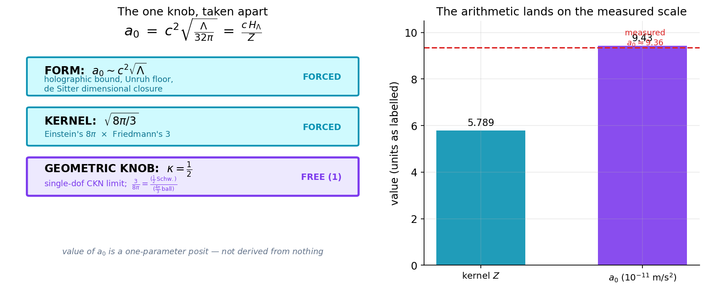

***Figure 24.3 — Inside the one knob: what is forced, what is free.*** The framework's acceleration scale $a_0 = c^2\sqrt{\Lambda/32\pi} = cH_\Lambda/Z$ broken into its parts. The form ($a_0\sim c^2\sqrt{\Lambda}$) and the gravitational kernel ($\sqrt{8\pi/3}$, Einstein's $8\pi$ married to Friedmann's $3$) are forced by geometry and established physics; the single dimensionless factor $\kappa=\tfrac12$ is the lone free input, argued in Chapter 23 to be irreducible. The right bars confirm the arithmetic closes on the measured value $9.36\times10^{-11}$ m/s². Computed from the framework's own equations; the value of $a_0$ is a one-parameter posit, not derived from nothing.

**Source:** Figure generated by [`book/figures/ch24_a0_forced_vs_free.py`](https://github.com/carlzimmerman/zimmerman-formula/blob/main/book/figures/ch24_a0_forced_vs_free.py). Computed from $a_0 = c^2\sqrt{\Lambda/32\pi}$ and $Z=\sqrt{32\pi/3}=5.789$ (framework main paper, [Zenodo 10.5281/zenodo.20721540](https://doi.org/10.5281/zenodo.20721540); κ irreducibility in [Zenodo 10.5281/zenodo.20738055](https://doi.org/10.5281/zenodo.20738055)). $\Lambda \approx 1.1\times10^{-52}$ m$^{-2}$ from Planck 2018 results VI, A&A 641, A6 (arXiv:1807.06209).

What is **free** is a single dimensionless number, traditionally written $\kappa = \tfrac{1}{2}$, that sets the last factor — equivalently, it is the difference between the bare horizon relation and the calibrated $Z = 5.789$ that lands $a_0$ on its measured value. And here is the claim that makes this chapter's scoreboard interesting rather than merely flattering: Chapter 23 argues that this one number $\kappa = \tfrac{1}{2}$ is *provably the fewest you can get away with*. It cannot be pushed to zero by any of the consistency requirements one would normally hope might pin it — ghost-freedom, unitarity, holography, a Standard-Model degree-of-freedom count. It is **pure geometry**: the single-degree-of-freedom limit of the Cohen–Kaplan–Nelson bound, and the exact identity $\tfrac{3}{8\pi} = (\tfrac{1}{2}\ \text{Schwarzschild}) / (\tfrac{4\pi}{3}\ \text{ball})$. A geometric posit, not a fitted curve.

> **A margin aside.** "One free number" means one number in *the sector the framework addresses* — gravity and the dark sector. It does **not** mean one number for all of physics. The Standard Model's couplings and masses sit entirely outside this count, untouched. We return to that wall, hard, in a moment and again in Chapter 27.

Let me say the honest version out loud, because the quarantine in this book is absolute and I will not let the scoreboard blur it: **the value of $a_0$ is not derived.** The framework does not compute $9.36\times10^{-11}\ \mathrm{m/s^2}$ from nothing. It computes the *form* and the *kernel*, and then it requires one geometric input — $\kappa = \tfrac{1}{2}$ — to land the value. That is why the right phrase is a **one-parameter theory**, not a zero-parameter theory. A one-parameter theory is one whose entire relevant sector is fixed once you supply a single number from outside. Zero-parameter would mean the value fell out with no input at all, and that is *not* what is being claimed. If you ever hear me — or anyone — say "$a_0$ is derived from Λ with no free parameters," that is an overstatement, and you should distrust it. The careful claim is: *form forced, kernel forced, one geometric knob, and that knob proven irreducible.*

So: **one parameter, no new particle.** That is the framework's entry, kept as fairly as I know how.

---

## The scoreboard, side by side

Let me put the two entries next to each other, in plain language, so the comparison is in one place.

| | **ΛCDM** | **De Sitter–MOND framework** |
|---|---|---|
| Free numbers in the sector | Six | One ($\kappa = \tfrac{1}{2}$) |
| New undetected particle? | Yes (cold dark matter) | No |
| Is the count *proven* minimal? | No claim of minimality | Yes — $\kappa$ argued irreducible (Ch. 23) |
| Reach of the explanation | Vast: CMB, structure, BBN, expansion | Narrower: galaxy dynamics, the $a_0$ scale |
| Lensing handled covariantly? | Yes | **No** — phenomenological (Ch. 28) |
| Standard Model included? | No (separate) | No (walled off, Ch. 27) |

Now I want you to read that table *twice*, because it tells two true stories and you need both.

Read down the first three rows and the framework looks wonderful: one proven-irreducible number against six plus a missing particle. If parameter economy were the whole game, the contest would be over.

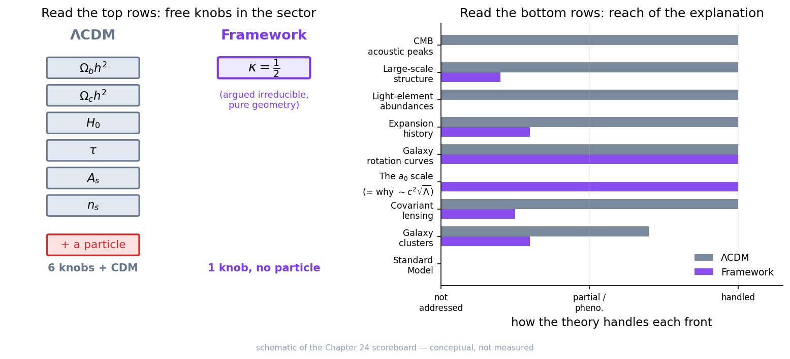

***Figure 24.1 — The scoreboard, told twice.*** A schematic of the chapter's central table. The left panel counts the free knobs: ΛCDM needs six tuned numbers plus an undetected particle (cold dark matter), while the de Sitter–MOND framework needs one geometric number, κ=½, and no new particle. The right panel sobers the comparison by showing reach: ΛCDM explains a vast sweep of data, while the framework addresses a narrower slice and has explicit walls (lensing, clusters, the Standard Model). This is a conceptual diagram of the chapter's argument, not computed data.

**Source:** Figure generated by [`book/figures/ch24_scoreboard_two_stories.py`](https://github.com/carlzimmerman/zimmerman-formula/blob/main/book/figures/ch24_scoreboard_two_stories.py). Schematic of the scoreboard in Chapter 24 of this book; the framework's one-parameter claim is argued in the κ one-parameter geometry theorem ([Zenodo 10.5281/zenodo.20738055](https://doi.org/10.5281/zenodo.20738055)) and the base ΛCDM six-parameter count follows Planck 2018 results VI, A&A 641, A6 (arXiv:1807.06209).

Read the bottom three rows and the picture sobers immediately. ΛCDM's six numbers buy an enormous *reach* — they fit the cosmic microwave background to exquisite precision, they grow the cosmic web, they get the light-element abundances. The framework's one number addresses a *narrower* slice of phenomena: the dynamics of galaxies and the origin of the $a_0$ scale. And in two specific places the framework has walls that ΛCDM does not: it cannot yet bend light covariantly in a Solar-System-safe way (the lensing wall, Chapter 28, a no-go theorem we will face squarely), and it does not touch the Standard Model at all (Chapter 27).

This is the heart of the chapter, so let me say it as plainly as I can: **the two theories are not competing to do the same job with different numbers of knobs.** ΛCDM is trying to describe the whole cosmic history with six numbers and a particle. The framework is trying to explain *one deep coincidence* — why the galactic acceleration scale equals roughly $c^2\sqrt{\Lambda}$ — with one number and a mechanism. Comparing the knob counts directly is a bit like comparing the parts list of a bicycle to the parts list of a car and concluding the bicycle is the better vehicle. Fewer parts, yes. The same job, no. The framework is, frankly, *trying to do less* — but it claims to do that less thing with a tightness ΛCDM does not even attempt for the $a_0$ coincidence, which in ΛCDM is not explained at all; it is simply not a question the standard model asks.

That last point is worth dwelling on, because it is the framework's strongest honest claim. In ΛCDM, the value $9.36\times10^{-11}\ \mathrm{m/s^2}$ — the scale at which galaxy rotation curves go anomalous — is a *coincidence with nothing*. There is no reason in ΛCDM why that scale should be near $c^2\sqrt{\Lambda}$. The framework's real contribution is to take a number that ΛCDM treats as an accident and make it *structural*. Whether the framework is right or not, it has at least *noticed* a coincidence and offered to explain it, where the standard model shrugs. That is a genuine intellectual move. It is also — I keep my discipline — not a proof of anything.

---

## What cheapness buys, and what it doesn't

Now we get to the philosophical core, and I want to do it carefully because this is exactly where smart people fool themselves.

Here is the seductive argument, the one I have to talk you (and myself) *out* of even though I half-believe it: *"The framework fits the galaxy data about as well as dark matter does, and it does so with one proven-irreducible number instead of six numbers and a particle. By Occam's razor, the framework wins."*

That argument is not worthless. It points at something real. But it overreaches in two places, and an honest scoreboard has to flag both.

**First overreach: the two theories do not fit the *same* data equally well.** The framework is excellent on galaxy rotation curves and the regularities built from them (Chapter 18) — but those very successes are *shared with the entire MOND family* and are not unique to this framework (we will hammer this in Chapter 29). And the framework is *worse* than ΛCDM on galaxy clusters, where a residual mass discrepancy stubbornly remains, and on lensing, which it cannot do covariantly at all. ΛCDM, meanwhile, fits the CMB to a precision the framework does not even attempt. So "fits about as well" is true only on a *restricted menu*. Occam's razor only adjudicates between theories that explain *the same evidence*. Change the menu and the razor's verdict can flip.

**Second overreach: economy is evidence, not proof.** Even on a menu where both theories fit equally well, the cheaper one is only *favored* — it is a better bet, not a confirmed truth. The razor shifts the odds; it does not settle the case. Data settles the case. And the framework's sharpest data test — the prediction that $a_0$ tracks dark energy through cosmic time, so that distant galaxies should be measurably "slow" (Chapters 25 and 26) — is *not yet decided*, and is in fact *hostage* to whether DESI's hints of evolving dark energy hold up, a question that is itself contested and that some analyses pull back toward statistical insignificance. Until that test resolves, the framework's economy is a promissory note, not a paid debt.

> **Deeper Dive: Occam's razor with the math turned on — Bayesian evidence**
>
> There is a precise version of "prefer the theory that assumes less," and it is worth seeing because it shows *both* why economy matters and why it is not decisive.
>
> In Bayesian model comparison, you compare two models $M_1, M_2$ by their **evidence** (also called the marginal likelihood): the probability the model assigns to the observed data $D$, integrated over all settings of its parameters $\theta$ weighted by the prior:
>
> $$Z_i \;=\; P(D \mid M_i) \;=\; \int P(D \mid \theta, M_i)\, P(\theta \mid M_i)\, d\theta.$$
>
> (Unfortunate collision of notation: this evidence $Z_i$ is *not* the framework's kernel constant $Z = 5.789$. Blame three centuries of physicists for running out of letters.)
>
> The ratio $B_{12} = Z_1/Z_2$ is the **Bayes factor**; it tells you how the data shift the relative odds of the two models. Now here is the beautiful part — the **Occam factor** falls out automatically. A model with more free parameters must *spread its prior probability over a larger parameter volume*. If a wide swath of that volume fits the data poorly, the integral is diluted: the model is penalized for the parameter space it had to "reserve" but didn't use well. Concretely, for a parameter that the data constrain from a prior width $\Delta\theta_{\rm prior}$ down to a posterior width $\Delta\theta_{\rm post}$, the evidence picks up a factor of roughly
>
> $$\frac{\Delta\theta_{\rm post}}{\Delta\theta_{\rm prior}} \;<\; 1$$
>
> *for each fitted parameter.* Six such factors compound. So a six-parameter model pays six Occam penalties; a one-parameter model pays one. *That* is the razor, made quantitative: extra knobs are not free even when they fit, because each one dilutes the model's prior bet.
>
> **But — and this is the honest limit — the evidence also contains the best-fit likelihood $P(D\mid\hat\theta, M_i)$.** If the simpler model fits the data *worse* at its best point, that term can swamp every Occam factor. A wrong-but-cheap theory loses. So the Bayes factor is a tug-of-war between *fit quality* (favoring whoever describes the data better) and *economy* (favoring whoever used fewer knobs). Economy only wins when fit quality is comparable. The framework's wager is precisely that, on galaxy dynamics, fit quality *is* comparable while economy is lopsided in its favor. That wager is reasonable on the restricted menu — and it is *not yet adjudicated on the full menu*, where lensing and the CMB enter and the fit-quality term turns against the framework. A real Bayesian model comparison across the *whole* dataset has not been done in the framework's favor, and I will not pretend it has.
>
> One more subtlety the literature insists on: the Bayes factor depends on the **priors** $P(\theta\mid M_i)$, and reasonable people choose priors differently. A model comparison can be made to lean either way by an aggressive prior choice. So even the quantitative razor is not a machine that spits out truth; it is a disciplined way of organizing a judgment that still requires honesty about assumptions.

I find that box clarifying, and a little humbling, every time. The math does not say "fewer parameters wins." It says "fewer parameters wins *when the fits are comparable, on the data you actually feed it, under priors you can defend.*" Every one of those qualifiers is a place the framework's advantage could evaporate. Keeping all four qualifiers in view at once is what it means to keep the scoreboard fairly.

---

> **Worked Example: How an extra knob "costs" evidence, with real numbers**
>
> Let me make the Occam factor concrete with a toy calculation a 16-year-old can follow with a calculator, because the abstract integral above hides how strong the effect is.
>
> Suppose two theories both have to explain a single measured number — say, our $a_0 = 9.36\times10^{-11}\ \mathrm{m/s^2}$, measured to about 5% precision, so the data constrain it to a window of width roughly
> $$\Delta\theta_{\rm post} \approx 0.05 \times 9.36\times10^{-11} \approx 4.7\times10^{-12}\ \mathrm{m/s^2}.$$
>
> **Theory A (the expensive one)** treats $a_0$ as a free parameter it must fit. Before looking at the data, it has no idea what $a_0$ is; say its honest prior allows anything from $10^{-12}$ to $10^{-9}\ \mathrm{m/s^2}$ — a window of width
> $$\Delta\theta_{\rm prior} \approx 10^{-9} - 10^{-12} \approx 1.0\times10^{-9}\ \mathrm{m/s^2}.$$
> The Occam factor this theory pays for that one knob is
> $$\frac{\Delta\theta_{\rm post}}{\Delta\theta_{\rm prior}} \approx \frac{4.7\times10^{-12}}{1.0\times10^{-9}} \approx 4.7\times10^{-3} \approx \frac{1}{210}.$$
> So fitting $a_0$ freely costs Theory A a factor of about **1/210** in evidence. It had to "reserve" a prior window 210 times wider than the data ended up needing.
>
> **Theory B (the framework)** does *not* fit $a_0$ freely. It forces the form and the kernel and is left with the single geometric posit $\kappa = \tfrac{1}{2}$, which then *predicts* $a_0$. It pays no Occam factor for $a_0$ at all — that number is no longer a fitted knob. It pays at most one factor for $\kappa$, and since $\kappa$ is argued to be geometrically pinned (Chapter 23), even that prior is narrow.
>
> **The bottom line of the toy:** all else equal, Theory B is favored over Theory A by roughly the missing Occam factor — here a factor of order **200** in the evidence — *purely from not having to fit $a_0$ by hand.* In Bayesian language that is a "strong" preference (a log-evidence difference of about $\ln 210 \approx 5.3$).
>
> **Now the honesty, in the same breath.** This toy assumed the two theories *fit the one number equally well.* They do — both land $a_0$ at $9.36\times10^{-11}$. But replace "explain one number" with "explain the CMB, the clusters, and gravitational lensing," and Theory B's best-fit likelihood term collapses on lensing and clusters, where it cannot match ΛCDM. The factor-of-200 economy advantage on the $a_0$ scale is real; it simply does not transfer to the data where the framework is weak. The worked example shows you exactly what economy buys — and the caveat shows you exactly where it stops buying. Both numbers are true. Hold them together.

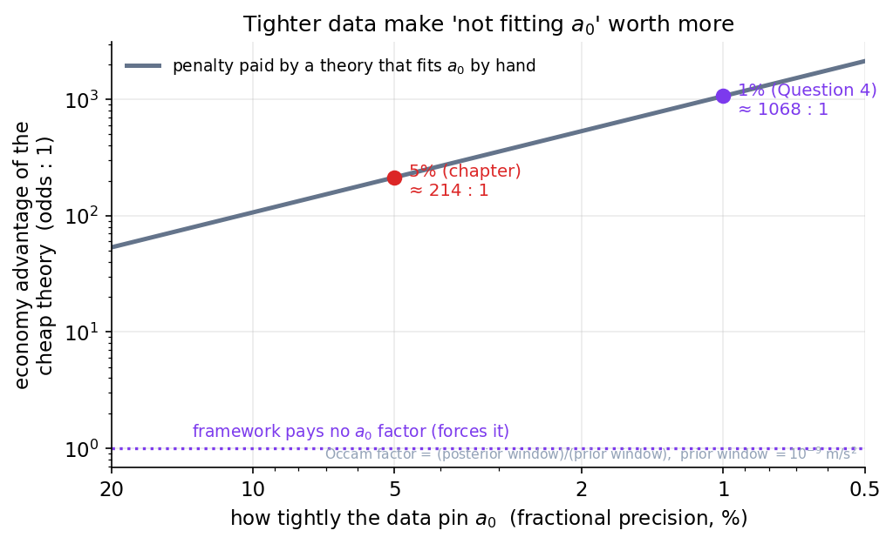

***Figure 24.2 — What an extra knob costs, and how tighter data sharpens it.*** The chapter's Worked Example, plotted. A theory that fits $a_0$ as a free parameter pays an Occam factor equal to (posterior window)/(prior window); the framework, which forces the form and kernel and never fits $a_0$, escapes this factor. The curve is computed directly from the worked example's numbers: prior window $10^{-9}$ m/s², posterior window = (precision) $\times\,9.36\times10^{-11}$ m/s². At the chapter's 5% precision the penalty is about 1/210; at 1% (Question 4) it grows to roughly 1/1050. Tighter data make the economy argument stronger.

**Source:** Figure generated by [`book/figures/ch24_occam_factor_vs_precision.py`](https://github.com/carlzimmerman/zimmerman-formula/blob/main/book/figures/ch24_occam_factor_vs_precision.py). Computed from the Bayesian Occam-factor formula in Chapter 24's Worked Example; the underlying model-comparison framework is standard (e.g. the evidence/Bayes-factor discussion in the chapter), and $a_0 = 9.36\times10^{-11}$ m/s² is the framework's value (main paper, [Zenodo 10.5281/zenodo.20721540](https://doi.org/10.5281/zenodo.20721540)).

---

## A historical warning, told fairly both ways

I promised you that cheap theories can be wrong and expensive theories can be right, and I owe you the examples, because the history is the best teacher of humility here.

The famous cautionary tale of an elegant, economical idea that was *wrong* is the **steady-state universe** of the 1950s. It was beautiful — the universe looks the same everywhere and at all times, no special beginning, a deep symmetry. Economical and lovely. And the cosmic microwave background (Chapter 10) killed it stone dead, because a steady-state universe has no hot dense past to leave such a relic. Elegance lost to data. That is the lesson pointing *against* my framework, and I keep it on the wall.

But there is a lesson pointing the other way too, and fairness demands it. The **cosmological constant Λ itself** was, for most of the twentieth century, regarded as an *ugly, unwanted extra parameter* — Einstein's "blunder." The economical move was to set it to zero. And then in 1998 the supernovae (Chapter 11) showed the expansion accelerating, and the "ugly extra parameter" turned out to be *real and necessary*. There, the more economical theory (Λ = 0) was the wrong one, and the universe insisted on the extra knob. So economy is not destiny in *either* direction. Sometimes the lean theory wins; sometimes the universe demands the extra part. The razor is a guide to betting, never a guarantee.

I tell both stories on purpose. If I told you only the steady-state story, I would be talking myself out of my own framework unfairly. If I told you only the Λ story, I would be flattering it unfairly. The truth is that the history offers no shortcut: *economy earns you better odds and nothing more, and the data has the only vote that counts.*

---

## What the framework does *not* buy with its one knob

I have spent a lot of this chapter defending the framework's economy, so let me spend real space on the other side of the ledger, because the quarantine in this book is not negotiable and a scoreboard that hides the costs is not a scoreboard.

The single knob $\kappa = \tfrac{1}{2}$ buys you the $a_0$ *scale* and the galaxy dynamics that follow from it. It does **not** buy you:

- **The *value* of $a_0$ from nothing.** One geometric posit is still a posit. This is a one-parameter theory, not a zero-parameter theory. (Chapter 27.)
- **The Standard Model.** Not the proton-to-electron mass ratio (free Yukawa couplings plus the strong coupling), not the Koide lepton relation, not a single particle mass, not the gauge group. The Standard Model is *walled off* — entirely outside the framework's reach. The one-knob count applies to gravity and the dark sector *only*. (Chapter 27.)
- **Covariant gravitational lensing.** A no-go theorem forbids a covariant, Solar-System-safe MOND lensing; the framework's light-bending is irreducibly *phenomenological* — and this is a real weakness, shared with the relativistic-MOND theory AeST. (Chapter 28.)
- **A cure for galaxy clusters.** A residual mass discrepancy remains in clusters that the framework, *like MOND*, does not fully resolve. (Chapter 29.)
- **Confirmation against ΛCDM.** The signature prediction — $a_0(z) \propto \sqrt{\rho_{\rm DE}(z)}$ — is not yet tested, is non-diagnostic today, and is hostage to whether DESI's evolving dark energy holds. (Chapters 25–26.)

I want you to notice something about that list. *Every item on it is a place where the framework's one knob runs out.* Economy is not a magic solvent. A one-parameter theory of gravity is still silent about quarks. A proven-irreducible $\kappa$ does not bend light covariantly. The scoreboard's first three rows — the rows that favor the framework — describe a *real and narrow* virtue, and the rest of the table and this list describe its *real and broad* limits. As frustrating as it may be, **this is not a theory of everything yet** — it is a one-parameter theory of *one corner of physics*, with the honesty to mark its own walls in ink.

> **Deeper Dive: "Provably one-parameter" is a structural result, not an empirical one**
>
> It is worth stating with care what kind of claim Chapter 23 actually establishes, because it is easy to mishear it as a victory over ΛCDM, and it is not.
>
> The claim is: *given the framework's mechanism and the standard consistency requirements (ghost-freedom, unitarity, holography, a Standard-Model degree-of-freedom count), the free content of the gravity/dark sector reduces to the single geometric number $\kappa$, and $\kappa$ cannot be further forced to a unique value by those requirements.* This is a statement *internal to the framework's mathematics.* It is a theorem about the *structure* of the theory — how many independent knobs its own axioms leave free.
>
> What it is **not**: it is not a statement that the framework is *empirically preferred* over ΛCDM. You could have a provably one-parameter theory that is provably *wrong* — imagine a rigid one-knob theory whose single prediction is flatly contradicted by data. Structural economy and empirical truth are *orthogonal axes.* A theory lives somewhere on the plane spanned by "how few knobs" and "how well it fits," and this chapter's whole discipline is to refuse to collapse those two axes into one.
>
> So when you read "provably one-parameter," parse it as: *a clean, strong, and somewhat unusual structural fact about how this theory is built* — the kind of fact that, all else equal, raises the prior you should assign it — and **not** as: *a measurement that says the universe agrees.* The first is established (modulo the assumptions in Chapter 23, which themselves deserve scrutiny). The second awaits DESI DR3, the high-redshift telescopes, and the cluster and lensing fronts where the framework is, today, weaker than the standard model. Both halves are true. The art is in holding them at the same time.

---

## Why I still think the scoreboard is worth keeping

Having spent so long insisting that economy is not truth, let me close the argument by saying why I bother keeping the scoreboard at all — because a reader could fairly ask, *if cheapness doesn't decide it, why count?*

Two reasons, and they are honest ones.

First, **economy tells you where the risk lives, and risk is where the science is.** A six-parameter theory plus a particle is hard to falsify because it has so many ways to absorb a surprise — adjust a density here, invoke a baryonic-feedback effect there, await the particle's discovery. A one-parameter theory is *fragile* in the good way: it has almost nowhere to hide. The framework predicts that distant galaxies are about 7% slow at redshift 3 (Chapter 25), and if the giant telescopes of the 2030s see them spinning at the local rate instead, the framework is in serious trouble with very little room to wriggle. That fragility is *bought by the economy.* Fewer knobs means sharper, more falsifiable predictions, and a theory you can *kill* is a theory worth taking seriously while it lives. The standard model's robustness is a strength for engineering the cosmos and a weakness for the philosophy of testing; the framework's fragility is the mirror image. Counting the knobs is how you see that.

Second — and more personally — **the scoreboard is a discipline against my own enthusiasm.** Writing down "one versus six plus a particle" feels good, and feeling good is precisely the danger. By forcing myself to also write down the bottom three rows of that table — the lensing wall, the cluster residual, the walled-off Standard Model, the untested $a_0(z)$ curve — the scoreboard keeps the enthusiasm from running off with me. A fair scoreboard is not a victory lap. It is a *leash.* And a researcher who will not put a leash on his own favorite idea has stopped doing science and started doing advocacy. I would rather keep the leash and the honesty than the victory lap and the self-deception.

So here is where the chapter leaves us, stated as plainly as I can manage. The framework asks the universe for one number it claims it can *prove* is irreducible, and it asks for *no new particle*. The standard model asks for six numbers and a substance no one has caught. That is a real difference in parameter economy, and by the quantitative razor it tilts the *prior odds* toward the framework on the narrow menu of galaxy dynamics. But economy is a tilt, not a verdict; the framework fits a *narrower* slice of the data, fails covariant lensing outright, leaves clusters and the entire Standard Model untouched, and rests its sharpest claim on a test the data have not yet run. **It is not a theory of everything yet, as frustrating as it may be** — it is a remarkably cheap theory of one deep coincidence, and cheapness, for all its real worth, is a thing only the data can cash. The next two chapters put the cheapest, sharpest part of the bet — the evolving $a_0$ — on the table where the universe can take it or leave it.

---

## Summary

- A **free parameter** is a number a theory cannot predict and must fix by measurement — a knob set by hand, not a result handed to you. **Parameter economy** is the study of how few such knobs a theory needs.
- **Occam's razor** says: between explanations that fit the same data, prefer the one that assumes less — fewer entities, fewer arbitrary numbers. It is a rule for *betting*, not a law of nature, and not a proof.
- **ΛCDM** runs on **six free parameters** (the baryon and dark-matter densities, the expansion rate, the reionization optical depth, and the amplitude and tilt of the primordial fluctuations) — *plus* an undetected new particle, cold dark matter. With those six it explains a vast sweep of data (CMB, structure, light elements, expansion), which is a real triumph.
- The **de Sitter–MOND framework**, in the gravity/dark sector it addresses, runs on **one free number** ($\kappa = \tfrac{1}{2}$), which this work argues is *provably irreducible* (Chapter 23) and *pure geometry* — and it needs *no new particle*. But it leaves the *value* of $a_0$ a geometric posit (a **one-parameter theory**, not zero-parameter), walls off the entire Standard Model, cannot do covariant lensing, and does not cure clusters.
- The quantitative form of the razor is **Bayesian evidence** / **model comparison**: each fitted parameter pays an "Occam factor" that dilutes a model's prior, so extra knobs cost even when they fit — *but* the evidence also rewards better fit and depends on priors, so economy only wins when the fits are comparable, on the actual data, under defensible priors.
- History cuts both ways: the elegant steady-state universe was *wrong* (killed by the CMB), while the "ugly extra" cosmological constant turned out *necessary* (the 1998 acceleration). Economy improves your odds; it never decides.
- A provably **one-parameter theory** is a *structural* result about economy — a fact about how the theory is built — and emphatically **not** a confirmation against ΛCDM. The two live on orthogonal axes: how-few-knobs and how-well-it-fits. Only data votes on the second.
- The reason to keep the scoreboard anyway: economy buys *fragility* — sharp, killable predictions like the ~7%-slow galaxies at z = 3 — and a fair scoreboard, costs and all, is a leash on the author's own enthusiasm.

---

## Questions

1. **(Easy.)** In your own words, what is the difference between a *free parameter* and a number a theory *predicts*? Use the two bread recipes from the chapter, or invent your own everyday example with one rigid recipe and one flexible one.

2. **(Easy–intermediate.)** ΛCDM is sometimes said to have "seven" parameters because people add the dark-energy density Ω_Λ to the list. Why does the chapter insist the honest base count is *six*? What relation removes the seventh in a flat universe?

3. **(Intermediate.)** The chapter argues that comparing ΛCDM's six knobs to the framework's one knob is "a bit like comparing the parts list of a bicycle to that of a car." Explain what is fair and what is *unfair* about a head-to-head knob count between these two theories. What would you have to hold fixed for the comparison to be fully fair?

4. **(Intermediate–advanced.)** Using the Worked Example, redo the Occam-factor estimate for $a_0$ if the data constrained it to 1% precision instead of 5%, while keeping the same prior window of $10^{-9}\ \mathrm{m/s^2}$. By roughly what factor would the "expensive" theory now be disfavored, and does tighter data make the economy argument stronger or weaker? Explain why.

5. **(Advanced.)** The Bayesian-evidence box notes that the Bayes factor depends on the *priors* and on the *best-fit likelihood across the full dataset.* Construct a concrete scenario — using lensing or clusters — in which the framework's factor-of-~200 economy advantage on the $a_0$ scale is *more than cancelled* by its worse fit elsewhere. What does this tell you about quoting an economy advantage on a restricted menu?

6. **(Research-level.)** The chapter calls "provably one-parameter" a *structural* result resting on stated assumptions (ghost-freedom, unitarity, holography, a Standard-Model degree-of-freedom count; see Chapter 23). Pick one of those assumptions and argue, as a skeptic would, how it might fail or be evaded — and what the failure would do to the claim that $\kappa$ is irreducible. Then argue the other way, as a defender. Which side do you find more persuasive, and what evidence would move you?

# Chapter 25: The Signature Prediction: a₀ Tracks Dark Energy Through Time

*Every honest theory must, at some point, stick out its neck. This is where ours does.*

---

## A Promise We Have Not Yet Cashed

We have spent the last several chapters building something. In Chapter 20 we met the central claim — that the galactic acceleration scale a₀ can be written in terms of the cosmological constant Λ, the same Λ that drives the accelerating expansion of the universe. In Chapter 21 we met the *mechanism* that might stand behind that claim: de Sitter–Unruh modified inertia, the idea that empty space in a Λ-universe carries a faint temperature floor, and that matter drifting in near-free-fall feels that floor as a little extra resistance to being pushed — extra inertia that, from the outside, looks like extra gravity. In Chapters 22 and 23 we sorted carefully through what is *forced* by the structure and what is *chosen*: the form a₀ ∝ c²√Λ and the √(8π/3) kernel are forced; the single number κ = ½ is a geometric posit, the one free knob. And in Chapter 24 we tallied the score: one knob, against ΛCDM's six parameters and an as-yet-undetected particle.

All of that has been, in a sense, *retrospective*. We have been explaining a number — a₀ ≈ 9.36 × 10⁻¹¹ m/s² — that was already measured before the framework was written down. A skeptic is entitled to fold their arms at this point and say: *Fine. You have a pretty story that reproduces a number we already knew. So does MOND, with a number it also fit after the fact. Tell me something I do not already know. Tell me something that could be* **wrong**.

That is a completely fair demand. It is, in fact, *the* demand — the one that separates a piece of physics from a piece of philosophy. A theory earns its keep not by explaining the past but by sticking out its neck about the future, in a way precise enough that nature could snap it off.

This chapter is the framework sticking out its neck.

And here is the thing that makes it genuinely interesting, rather than just another adjustable curve: the prediction we are about to make has **nothing left to tune**. Every knob has already been spent. The one free number, κ = ½, sets the *present-day* value of a₀ — and once that present-day value is fixed, the framework has no remaining freedom to say how a₀ behaves at *other* times. The shape of a₀ through cosmic history is dictated entirely by the cosmology, by how dark energy itself evolves. We do not get a vote. We hand the steering wheel to the universe and watch where it drives.

If a₀ is really *made of* dark energy, then when dark energy changes, a₀ must change too — on a curve we are not allowed to bend.

That is the bet. Let us see exactly what it says.

---

## The Core Idea, in Plain Words

Start from the one sentence that this whole book has been circling: **the galactic acceleration scale is set by dark energy.**

If you take that sentence literally — not as a slogan but as a statement about the actual contents of the universe — then it has an immediate, almost unavoidable consequence. Dark energy is not guaranteed to be a constant. For most of the past quarter-century, physicists *assumed* it was constant; that constant even has a name, Λ, the cosmological constant, and a constant energy density that never dilutes as the universe expands. But "assumed constant" is not the same as "known constant." Dark energy could, in principle, have been a little denser in the past, or a little thinner, and slowly drifted to the value we see today.

Now follow the logic. If a₀ is built out of the dark-energy density — if, as Chapter 20 had it, a₀ = (c/2)√(G ρ_DE), so that a₀ is essentially the square root of how much dark energy there is — then **a changing dark-energy density forces a changing a₀.** When there was more dark energy, the acceleration scale was higher. When there was less, it was lower. The galactic ruler we use to weigh the cosmos would itself have been a slightly different length at different epochs of cosmic history.

Let us name this carefully, because the whole chapter turns on it.

**a₀(z) evolution** is the claim that the acceleration scale a₀ is not a fixed constant of nature but a slowly changing quantity that depends on *when* in cosmic history you measure it. The little "(z)" is the standard astronomer's way of labeling cosmic time. The letter **z** stands for *redshift*: light from a distant galaxy is stretched to longer, redder wavelengths by the expansion of the universe during its long journey to us, and the amount of stretch tells us how long ago the light left. Redshift z = 0 means *here and now*. Larger z means *longer ago and farther away*. Redshift z = 1 is light that left when the universe was about half its present age; z = 3 reaches back to when the cosmos was only about two billion years old. So "a₀(z)" is shorthand for "the value the acceleration scale had at the cosmic epoch labeled by redshift z."

And the specific form of the dependence is what we will call **√ρ_DE(z) scaling**: a₀ at any epoch is proportional to the *square root* of the dark-energy density at that epoch. The square root is not a free choice we sprinkled on for taste. It is already sitting inside the central formula — a₀ goes as √(G ρ_DE), so √ρ_DE is simply what the formula says. Double the dark energy and a₀ goes up not by a factor of two but by a factor of √2, about 1.41. The square root softens everything; it means a₀ is a fairly *lazy* tracker of dark energy, moving only half as fast (in fractional terms) as the density it follows.

So the headline, in one breath: **a₀ should ride up and down with the square root of the dark-energy density across cosmic time, on a curve that the cosmology fixes and the framework is not permitted to adjust.**

> **Margin aside.** Why does a square root tame the motion? Because for small changes, a fractional change in √x is *half* the fractional change in x. A 12% rise in ρ_DE becomes only a ~6% rise in a₀. We will see that 6% again very soon — it is not a coincidence.

---

## Why Dark Matter Cannot Make This Prediction

Before we work out the curve, it is worth dwelling on *why* this is the framework's signature — the one prediction that genuinely belongs to it and not to its rivals. The reason is almost embarrassingly simple, and it is the most honest selling point the framework has.

**Dark matter has no acceleration scale to evolve.**

Think about what a dark-matter particle *is*, in the standard picture (Chapters 5 and 6). It is matter — cold, slow, invisible matter — that clumps under gravity exactly the way ordinary matter does, just without giving off light. There is nothing in that picture that singles out a special acceleration. A galaxy's rotation curve, in the dark-matter account, is whatever it is because of how much invisible matter happened to settle into that galaxy's halo and how it is distributed. Different galaxies, different halos, different curves. There is no universal number a₀ baked into the laws; the apparent regularities (which we will meet again in a moment) are, in the dark-matter view, emergent accidents of how galaxies form. And because there is no fundamental acceleration scale in the theory at all, there is certainly no *cosmic clock* attached to one. Dark matter cannot predict that the acceleration scale was 6% higher at redshift 0.4, because in its world there is no such scale to be higher or lower.

Plain MOND (Chapter 17) is a more interesting case, and we must be fair about it. MOND *does* have an acceleration scale a₀ — that is its whole point. But in Milgrom's original formulation, a₀ is simply a new constant of nature, like the speed of light or the charge of the electron. A constant. There is no reason within MOND for it to change over cosmic time, and most MOND practitioners have treated it as fixed. Some have noticed the numerical coincidence that a₀ is close to cH₀ (the speed of light times the Hubble rate) and to c²√Λ, and have *speculated* that it might therefore evolve — but speculation is not the same as a forced, parameter-free curve, and MOND as a framework does not require it.

Our framework does require it. That is the difference. The framework does not merely *permit* a₀ to evolve; it *insists* on it, because it claims a₀ is not a fundamental constant at all but a *derived quantity* — a thing built out of the dark-energy density, the way a wave's speed is built out of the properties of the medium it travels through. If the medium changes, the wave speed changes; you do not get to hold it fixed. So the framework is structurally committed to a₀(z) evolution in a way that neither dark matter nor textbook MOND is.

This is the cleanest statement of what the framework risks. **If a₀ turns out to be a genuine, unchanging constant of nature, the framework is wrong** — or at least its central physical claim is wrong — *even if every galaxy rotation curve it ever touched came out perfectly.* The rotation curves are shared territory (we will be honest about that throughout). The *evolution* is the framework's own neck.

> **Margin aside.** Notice the asymmetry of the bet. Confirming the curve would be strong evidence *for* a dark-energy origin of a₀. But the framework is most exposed on the downside: a flatly *constant* a₀ across redshift, well-measured, would be very hard for it to survive. A theory you can kill is a theory worth having.

---

## What Sets the Curve: How Dark Energy Itself Changes

So the shape of a₀(z) is inherited, wholesale, from the shape of ρ_DE(z) — the dark-energy density as a function of cosmic time. To know what a₀ does, we need to know what dark energy does. And here we hand the question over to the observers, because this is *their* measurement, not the framework's.

For a long time the default answer was the simplest one imaginable: dark energy is a true constant, ρ_DE never changes, the "cosmological constant" deserves its name. In that world a₀(z) would be flat — the same value at every redshift — and the framework's signature prediction would collapse into "a₀ is constant," indistinguishable from textbook MOND, and impossible to use as a discriminator. If the universe had handed us a genuinely constant dark energy, this chapter would be very short and rather disappointing.

But over the past few years, that default has been shaken. We need to introduce the instrument and the language astronomers use, because the rest of the chapter lives inside them.

**DESI** is the Dark Energy Spectroscopic Instrument — a survey on a telescope in Arizona that has measured the three-dimensional positions of tens of millions of galaxies and quasars, mapping the cosmic web across billions of years of cosmic history. By tracking a faint, fossil-sound-wave pattern in how galaxies cluster (a ruler called the *baryon acoustic oscillation*, laid down in the infant universe and stretched by expansion ever since), DESI can reconstruct how fast the universe was expanding at many different epochs — and from the expansion history, infer how the dark-energy density has behaved over time. **DESI DR2** is the second major data release from this survey, the one whose dark-energy results we will use as our working numbers.

To describe a dark energy that might *change*, cosmologists need a compact way to write down "how constant is it, and if it is changing, which way?" The standard shorthand is the **CPL parametrization** — named for the physicists Chevallier, Polarski, and Linder who introduced it. It describes dark energy with just two numbers:

- **w₀** (read "w-naught") is the dark-energy *equation-of-state parameter* today. The equation-of-state parameter w is the ratio of a substance's pressure to its energy density, and it controls how the substance's density changes as the universe expands. A true cosmological constant has w exactly −1: its density never dilutes. If w₀ is a little *above* −1 (say −0.9), dark energy thins out as the universe grows; if w₀ is *below* −1 (say −1.1), it is in the exotic regime physicists call "phantom," where the density would actually *grow* with expansion.

- **wₐ** (read "w-a") describes how w itself drifts with cosmic time. If wₐ is zero, w never changes and we are back to a fixed equation of state. If wₐ is non-zero, the dark energy was a different kind of stuff in the past than it is today.

The headline from DESI DR2, taken at face value, is that dark energy appears **not** to be a simple constant. The best-fit numbers come out near **w₀ ≈ −0.75** and **wₐ ≈ −0.86**. Read those together and they tell a specific little story: today w₀ ≈ −0.75 sits *above* −1, but a negative wₐ means w was *more* negative in the past — below −1, in the phantom regime, at earlier times. Somewhere in between, the equation of state must have passed *through* the special value w = −1.

That crossing has a name, and it matters enormously for our curve.

The **phantom-divide crossing** is the cosmic moment when the dark-energy equation of state passes through w = −1 — the dividing line between ordinary, diluting dark energy (w > −1) and the exotic "phantom" regime (w < −1). At that crossing, the dark-energy density is doing something special: it stops growing and begins to decline (or vice versa). In other words, the density ρ_DE reaches a *turning point* — a maximum — right at the phantom-divide crossing. And since a₀ rides on √ρ_DE, **a₀ reaches its own maximum at the same moment.** The crossing is the peak of our curve. Under the DESI DR2 numbers, that peak lands at a redshift of about **z ≈ 0.4** — light that left roughly four billion years ago.

Let me be very honest, and this is a both-ways moment we will return to with force at the end of the chapter: **none of this is settled.** The DESI DR2 preference for evolving dark energy is real and it is interesting, but it is not a discovery on the scale of, say, the 1998 acceleration result. Different choices of which datasets to combine, and different prior assumptions, can pull the significance up or down, and under some reasonable analyses the evidence for any evolution at all softens toward the level where it could still be a statistical fluctuation. We are building our signature prediction on top of *somebody else's* contested measurement. That is a genuine vulnerability, and we will own it. But it is also, for the moment, the best estimate the field has of how dark energy behaves — so it is the honest input to use. If those numbers move, our curve moves with them, automatically and without any new freedom. That is exactly the point.

> **Deeper Dive: The parameter-free evolution law.**
>
> The framework's prediction is a *ratio*, and the ratio is where the magic — and the honesty — lives. Start from the central relation,
>
> $$a_0(z) = \frac{c}{2}\sqrt{G\,\rho_{\rm DE}(z)},$$
>
> where every epoch's a₀ is built from that epoch's dark-energy density. Now divide the value at redshift z by the present-day value:
>
> $$\boxed{\;\frac{a_0(z)}{a_0(0)} = \sqrt{\frac{\rho_{\rm DE}(z)}{\rho_{\rm DE}(0)}}\;}$$
>
> Look at what dropped out. The factor c/2 cancelled. The Newton constant G cancelled. The geometric kernel √(8π/3) cancelled. The one free number κ = ½ — which entered only through the *normalization* of a₀ — **cancelled.** Even the choice of interpolation function (the detail of how the modified-inertia transition is shaped, which differs across MOND-family theories) drops out of the ratio, because it affects today and the past identically. *Nothing tunable survives.* The shape of a₀(z)/a₀(0) is a pure function of the dark-energy density history, and that history is an input from cosmology, not a parameter of the framework. This is why we keep calling the prediction parameter-free: it is not a figure of speech. The single knob the framework owns sets the overall *height* of the a₀ curve, and the height divides out of the shape.
>
> To get a number we need ρ_DE(z) explicitly. Under the CPL parametrization, integrating the dark-energy conservation equation with w(a) = w₀ + wₐ(1 − a), where a = 1/(1+z) is the cosmic scale factor, gives the standard closed form:
>
> $$\frac{\rho_{\rm DE}(z)}{\rho_{\rm DE}(0)} = (1+z)^{\,3(1+w_0+w_a)}\,\exp\!\left(\frac{-3\,w_a\,z}{1+z}\right).$$
>
> Combine the two boxed results and you have the framework's complete, parameter-free signature curve:
>
> $$\frac{a_0(z)}{a_0(0)} = (1+z)^{\,\tfrac{3}{2}(1+w_0+w_a)}\,\exp\!\left(\frac{-3\,w_a\,z}{2(1+z)}\right).$$
>
> Everything on the right-hand side is cosmology. The framework contributes only the *claim that this equals the acceleration-scale ratio* — and that claim has no free parameters left in it.

---

## Reading the Curve: A Bump, Then a Long Decline

Now let us actually *walk along* the curve, in words, from here-and-now back into the deep past, so you can picture its shape before we compute a single point.

Start at redshift zero — today. By construction, a₀(0)/a₀(0) = 1. The ruler is its present length.

Step back to modest redshifts, z of a few tenths. Because dark energy was in its phantom phase in the recent past (w below −1), its density was actually *higher* back then than it is today — phantom dark energy grows denser as you go backward toward the present, which is the same as saying it was denser just behind us. So a₀ was *higher* in the recent past. The curve climbs as we step back from z = 0. It is a gentle climb, softened by the square root.

Keep stepping back and you reach the turning point — the phantom-divide crossing, near **z ≈ 0.4**. Here the dark-energy density hits its maximum, and so a₀ reaches its peak. Under the DESI DR2 numbers, that peak sits about **6% above** today's value. A small bump — but a bump with a definite location and a definite height, both fixed by the cosmology, neither adjustable. Galaxies at this epoch would, if the framework is right, feel an acceleration scale a few percent larger than the one we measure locally.

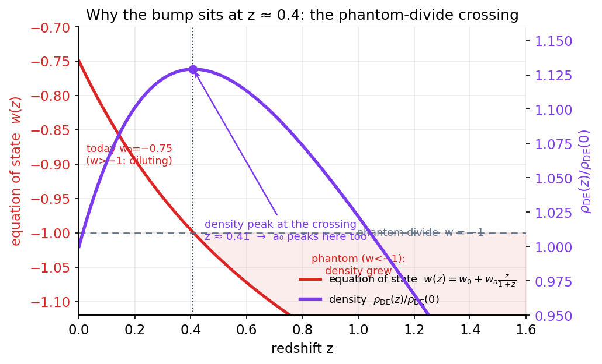

***Figure 25.3 — The mechanism behind the bump: where w crosses −1, ρ_DE peaks.*** Both curves are framework-computed from the DESI DR2 CPL parameters (w₀ = −0.75, wₐ = −0.86). The equation of state (red, left axis) sits above −1 today but was in the "phantom" regime (w < −1) in the past, so it must cross the phantom divide w = −1 — here near z ≈ 0.41. At exactly that crossing the dark-energy density (purple, right axis) reaches its maximum and turns over. Because a₀ ∝ √ρ_DE, the acceleration scale inherits its peak at the same redshift — fixing the location of the curve's bump with no freedom left to the framework.

**Source:** Figure generated by [`book/figures/ch25_phantom_divide_mechanism.png.py`](https://github.com/carlzimmerman/zimmerman-formula/blob/main/book/figures/ch25_phantom_divide_mechanism.py). CPL parametrization (Chevallier–Polarski–Linder) and evolving dark-energy values: DESI DR2 2025, arXiv:2503.14738; a₀ ∝ √ρ_DE scaling: [a₀(z) paper](https://doi.org/10.5281/zenodo.20737162).

Now push past the peak, to higher redshift, deeper into the past. Beyond the crossing, the equation of state was in the ordinary regime (w above −1) — wait, that is backwards; let me say it carefully, because the geometry of "earlier" and "denser" can twist your intuition. Going to *higher* z than the peak, we are going further back than the crossing, into the epoch where w was *below* −1... no. Here is the clean way to hold it: the density has a single maximum at the crossing. On *both* sides of that maximum the density is lower. So as we continue to higher and higher redshift past z ≈ 0.4, the dark-energy density falls, and a₀ falls with it — a long, slow decline. By **z = 3** — light from when the universe was only about two billion years old — the framework predicts a₀ has dropped to roughly **0.74** of its present value. About a quarter lower. Galaxies that early in cosmic history would have had a noticeably *smaller* acceleration scale than galaxies today.

So the full shape, in one mental image: a curve that starts at 1.0 today, rises to a gentle peak of about 1.06 near z ≈ 0.4, then bends over and declines steadily to about 0.74 by z = 3, continuing downward beyond. **A bump, then a long fall.** Non-monotonic — meaning it does not simply rise or simply fall, but does both, with a turnaround in between. That non-monotonicity is itself a fingerprint, because it is hard to fake with a generic fitting function and impossible to produce at all without a physical mechanism that ties a₀ to evolving dark energy.

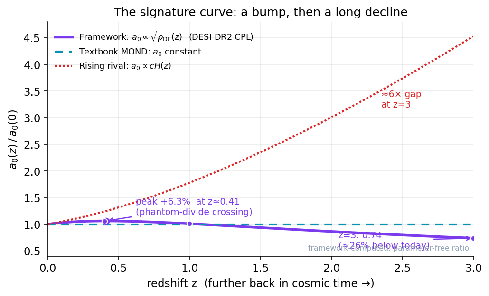

***Figure 25.1 — The framework's signature prediction: a₀ tracks √ρ_DE through cosmic time.*** The purple curve is computed directly from the framework's parameter-free ratio a₀(z)/a₀(0) = √[ρ_DE(z)/ρ_DE(0)] using the DESI DR2 CPL fit (w₀ = −0.75, wₐ = −0.86). It rises to a gentle peak of about +6% at the phantom-divide crossing (z ≈ 0.4), then declines to ≈0.74 of today's value by z = 3 — the non-monotonic "bump then fall" fingerprint. Textbook MOND (teal, flat) holds a₀ fixed; the leading rising rival (red, a₀ ∝ cH(z)) climbs the opposite way, leaving an order-of-magnitude gap at high redshift. Curves are framework-computed; the dark-energy history is a cosmological input, not a knob.

**Source:** Figure generated by [`book/figures/ch25_a0z_signature_curve.png.py`](https://github.com/carlzimmerman/zimmerman-formula/blob/main/book/figures/ch25_a0z_signature_curve.py). Framework curve and a₀(z) scaling: [a₀(z) dark-energy-scale paper](https://doi.org/10.5281/zenodo.20737162) and [`opus_48_extended_research/papers/a0z_desi_figure.py`](https://github.com/carlzimmerman/zimmerman-formula/blob/main/opus_48_extended_research/papers/a0z_desi_figure.py); evolving dark-energy input: DESI DR2 2025, arXiv:2503.14738.

> **Margin aside.** "Non-monotonic" just means the curve changes direction — up, then down. A constant a₀ would be a flat line. A rising-a₀ rival would be a line that only climbs. Ours does something neither of them does: it goes up a little, then comes down a lot. The *shape itself* carries information.

And here is the rival worth naming, because it sharpens the test. There is a competing reading — not from this framework — in which the relevant cosmic acceleration scale tracks not the *dark-energy* density but the *total* density or the Hubble expansion rate H(z). Because the total density and H(z) both *grow* with redshift (the universe was denser and expanding faster in the past), that rival predicts a₀ that **rises** with z, and keeps rising. By z = 3, that rising branch sits far above our declining one — the two predictions differ by a factor of roughly **7.5×** at z = 3. That is not a subtle disagreement you need exquisite precision to resolve; it is a chasm. The framework says galaxies at z = 3 were *slower* (smaller a₀); the rising rival says they were *much faster* (larger a₀). They could hardly be more opposed, which is exactly what makes the high-redshift regime such a clean place to look. We will return to *how* one looks, in the next chapter; here the point is only that the framework's curve is sharply distinguishable from both the constant case and the leading alternative.

> **Worked Example: Computing a₀ at three epochs, slowly.**
>
> Let us put real numbers through the formula, one careful step at a time, using the DESI DR2 values w₀ = −0.75 and wₐ = −0.86. The master equation, from the Deeper Dive above, is
>
> $$R(z) \equiv \frac{a_0(z)}{a_0(0)} = (1+z)^{\,\tfrac{3}{2}(1+w_0+w_a)}\,\exp\!\left(\frac{-3\,w_a\,z}{2(1+z)}\right).$$
>
> First, let us assemble the two recurring constants so we are not re-deriving them each time.
>
> The exponent on the (1+z) factor uses 1 + w₀ + wₐ = 1 + (−0.75) + (−0.86) = 1 − 1.61 = **−0.61**. Multiply by 3/2: the power is (3/2)(−0.61) = **−0.915**.
>
> The exponential's prefactor uses −3wₐ/2 = −3(−0.86)/2 = +2.58/2 = **+1.29**. So the exponential term is exp[1.29 · z/(1+z)].
>
> Our working formula is therefore
>
> $$R(z) = (1+z)^{-0.915}\,\exp\!\left(1.29\cdot\frac{z}{1+z}\right).$$
>
> **Epoch one: z = 0.4 (the predicted peak, ~4 billion years ago).**
> The power-law piece: (1.4)^(−0.915). Take ln(1.4) = 0.3365; multiply by −0.915 to get −0.3079; exponentiate: e^(−0.3079) = 0.735.
> The exponential piece: z/(1+z) = 0.4/1.4 = 0.2857; times 1.29 = 0.3686; e^(0.3686) = 1.446.
> Multiply: R(0.4) = 0.735 × 1.446 = **1.063.** The acceleration scale is about **6.3% above** today's value — there is our bump, landing essentially where we said it would.
>
> **Epoch two: z = 1 (universe roughly half its present age).**
> Power-law: (2)^(−0.915). ln(2) = 0.6931; times −0.915 = −0.6342; e^(−0.6342) = 0.530.
> Exponential: z/(1+z) = 1/2 = 0.5; times 1.29 = 0.645; e^(0.645) = 1.906.
> Multiply: R(1) = 0.530 × 1.906 = **1.010.** Already, by z = 1, the curve has come back down to almost exactly its present-day value — it is on its way past the peak and heading down.
>
> **Epoch three: z = 3 (universe ~2 billion years old).**
> Power-law: (4)^(−0.915). ln(4) = 1.3863; times −0.915 = −1.2685; e^(−1.2685) = 0.281.
> Exponential: z/(1+z) = 3/4 = 0.75; times 1.29 = 0.9675; e^(0.9675) = 2.631.
> Multiply: R(3) = 0.281 × 2.631 = **0.739.** The acceleration scale at z = 3 is about **0.74** of today's — roughly a quarter lower, exactly the figure quoted above.
>
> Step back and look at the three numbers in sequence: 1.063, then 1.010, then 0.739. **Up, then down.** We have just traced the non-monotonic signature by hand. Notice that no parameter of the framework appeared anywhere in this calculation — only c, G, and κ would have appeared, and all three cancelled in the ratio. Every input was a cosmological measurement (w₀, wₐ) or a choice of which epoch to evaluate. The curve is the universe's to draw; we only read it off.

---

## How Big Is 6%, Really? On Translating a₀ Into Something Observable

A reader is entitled to ask: a 6% bump in a quantity I cannot see directly — so what? How would anyone ever *catch* this? The full answer is the next chapter's job (Chapter 26 is entirely about the experimental program). But we owe a preview here, because a prediction you cannot connect to an observation is not really a prediction.

The bridge runs through the two great regularities we met in Chapter 18 — the radial-acceleration relation and the baryonic Tully–Fisher relation. Both of them have a₀ sitting inside them as the scale that separates the Newtonian regime from the modified one. The baryonic Tully–Fisher relation in particular says that a galaxy's flat rotation speed, raised to the fourth power, is proportional to its baryonic mass times a₀:

$$v_{\rm flat}^4 \approx G\,M_{\rm baryon}\,a_0.$$

Because v_flat goes as the *fourth root* of a₀, the square root that already tamed a₀'s evolution gets tamed *again*. A 6% change in a₀ becomes only a ~1.5% change in the predicted rotation speed (the fourth root of 1.06 is about 1.015). A 26% drop in a₀ at z = 3 becomes about a 7% change in rotation speed (the fourth root of 0.74 is about 0.93). So the framework's concrete, falsifiable claim at high redshift is roughly this: **a galaxy of a given baryonic mass at z = 3 should be spinning about 7% more slowly than an otherwise-identical galaxy today** — and, crucially, *slowly*, not quickly, which is the opposite of what the rising-a₀ rival predicts.

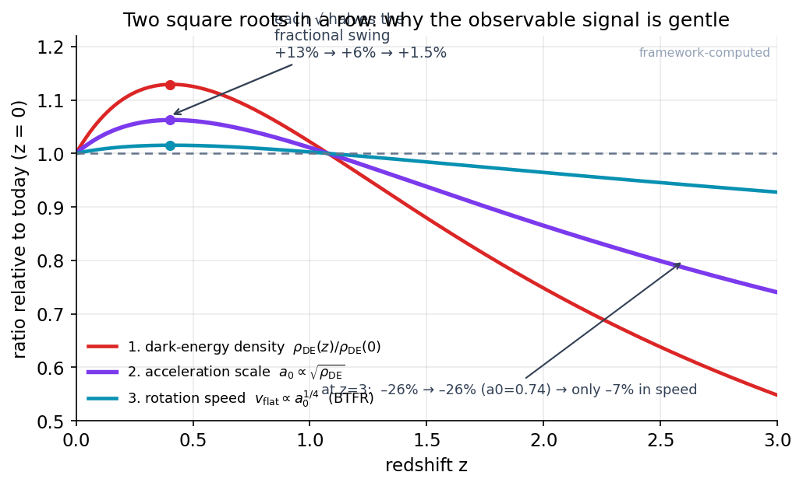

***Figure 25.2 — The double-square-root cascade: from dark energy to a measurable spin.*** All three curves are framework-computed from the same CPL density history (w₀ = −0.75, wₐ = −0.86). The dark-energy density (red) swings by about +13% at its z ≈ 0.4 peak; the first square root, a₀ ∝ √ρ_DE, halves that to +6% (purple); the second, v_flat ∝ a₀^¼ through the baryonic Tully–Fisher relation v⁴ = G M a₀, halves it again to a mere +1.5% in rotation speed (teal). By z = 3 the same cascade turns a −26% density drop into only a ≈7% speed deficit — which is why the chapter leans on the robust *sign* of the offset rather than its fragile magnitude.

**Source:** Figure generated by [`book/figures/ch25_double_sqrt_softening.png.py`](https://github.com/carlzimmerman/zimmerman-formula/blob/main/book/figures/ch25_double_sqrt_softening.py). Framework scaling a₀ ∝ √ρ_DE: [a₀(z) paper](https://doi.org/10.5281/zenodo.20737162) and [spine paper](https://doi.org/10.5281/zenodo.20721540); baryonic Tully–Fisher relation: McGaugh 2012, AJ 143, 40 (slope-4 law from Tully & Fisher 1977, A&A 54, 661); CPL density input: DESI DR2 2025, arXiv:2503.14738.

That is why the next chapter will argue that the **sign** of the high-redshift Tully–Fisher offset is the single cleanest test. We do not, at first, even need to measure the 7% precisely. We need to measure which *way* the offset goes. Down (slow) supports the framework; up (fast) supports the rival and embarrasses the framework; zero (no offset, constant a₀) embarrasses both and vindicates textbook MOND and, in its own way, dark matter. The sign is the cheapest, sharpest discriminator, and it is the thing the giant telescopes of the late 2020s and 2030s — ELT, JWST, ALMA, pushing galaxy kinematics out to ever-higher redshift — are positioned to deliver.

> **Margin aside.** Two square roots in a row are why this is hard. a₀ goes as √ρ_DE (one root), and rotation speed goes as a₀^¼ (another). The observable signal is therefore a *very* gentle function of the underlying dark-energy change — which is honest to admit, and also why we lean on the robust *sign* rather than the fragile *magnitude*.

---

## The Honest Standing of the Bet

Let me now do the thing this book promises to do at every turn: state both sides in the same breath, plainly, with nothing hidden.

**What is genuinely strong here.** This is a real prediction. It is parameter-free in the strict sense demonstrated in the Deeper Dive — every knob, including the one free number κ, cancels out of the shape of the curve. It is *distinctive*: dark matter cannot make it at all (no scale to evolve), textbook MOND does not require it (a₀ a fixed constant), and the leading non-framework reading of an evolving scale predicts the *opposite sign* at high redshift, separated from ours by a factor of order 7.5× at z = 3. It is *falsifiable* in the most direct way a theory can be: a well-measured, genuinely constant a₀ across cosmic time would break the framework's central physical claim, no matter how many present-day rotation curves it fits. And it is *coming* — the data that bears on it is being collected right now and over the next decade, not in some indefinite future. A theory that can be killed, by experiments already underway, is exactly what an honest framework should put on the table.

**What is genuinely shaky, and we will not pretend otherwise.** First and largest: the *input* is contested. The whole distinctive shape — the bump, its location, the decline — rides on DESI DR2's preference for evolving dark energy, and that preference is not yet a settled fact. Under some reasonable combinations of data and priors the evidence for any evolution at all softens, drifting down toward the level (around 1.3σ in certain analyses) where it could be a fluctuation. If dark energy turns out to be a plain constant after all, our signature curve flattens into a horizontal line, the bump vanishes, and the prediction degenerates into "a₀ is constant" — true, perhaps, but no longer a discriminator, and indistinguishable from textbook MOND. The framework's most interesting bet is therefore **hostage** to a measurement it does not own and cannot control. That is worth saying twice.

Second: the signal is *gentle*. Two square roots stand between evolving dark energy and an observed rotation speed, so even the dramatic-sounding numbers — a 6% bump, a 26% decline — translate into single-digit-percent shifts in the quantities telescopes actually measure, against the formidable messiness of real high-redshift galaxies (which are clumpy, turbulent, and hard to assign clean rotation speeds to). Catching the *sign* is realistic; catching the *shape* in detail will be a long, hard observational campaign, and it may be years before the verdict is clean.

Third, and to keep ourselves honest about the larger picture: confirming a₀(z) would be a significant success, but it would *not* resolve the framework's deeper open questions. It would not derive the value of a₀ (κ remains a geometric posit, Chapter 27), would not touch the Standard Model (still walled off, Chapter 27), would not repair the lensing wall (Chapter 28), and would not cure the cluster residual (Chapter 29). It would tell us that a₀ is *made of dark energy* — a deep and beautiful thing if true — without telling us *why* the proportionality constant is what it is. This is, as we keep saying and will keep saying, **not a theory of everything yet, as frustrating as it may be.**

But within those limits, it is something rare and valuable: a single, sharp, parameter-free, falsifiable prediction that follows necessarily from the framework's central claim, that no rival makes the same way, and that the universe is in the middle of deciding. The framework has stuck out its neck. Now we wait — not passively, but with telescopes pointed at the deep past — to see whether nature snaps it off.

---

## Summary

- **The central claim has a forced consequence.** If a₀ is built from the dark-energy density — a₀ = (c/2)√(G ρ_DE) — then because dark energy can evolve, a₀ must evolve too. This is the framework's one genuinely new, parameter-free prediction.

- **The scaling is √ρ_DE(z).** The acceleration scale tracks the *square root* of the dark-energy density through cosmic time: a₀(z)/a₀(0) = √[ρ_DE(z)/ρ_DE(0)]. The square root is built into the formula, not chosen.

- **The prediction is genuinely parameter-free.** In the ratio a₀(z)/a₀(0), the coefficient c/2, the constant G, the geometric kernel √(8π/3), the one free number κ = ½, *and* the interpolation-function choice all cancel. Only the cosmological dark-energy history survives — and that is an input, not a knob.

- **DESI DR2 gives the working numbers.** Using the CPL parametrization (w₀ ≈ −0.75, wₐ ≈ −0.86 from DESI DR2's evolving-dark-energy fit), the density peaks at the *phantom-divide crossing* (where the equation of state passes through w = −1), near z ≈ 0.4.

- **The curve is non-monotonic: a bump, then a decline.** a₀ rises to about **+6%** above its present value at z ≈ 0.4, then falls to about **0.74** of today's value by z = 3 — up, then down. This shape is a fingerprint no constant-a₀ or rising-a₀ model reproduces; it differs from the leading rising rival by roughly **7.5×** at z = 3.

- **Only this framework makes it.** Dark matter has no acceleration scale to evolve; textbook MOND treats a₀ as a fixed constant. The framework is structurally *required* to predict evolution, because it claims a₀ is derived from dark energy rather than being a fundamental constant.

- **The cleanest test is a sign.** Through the baryonic Tully–Fisher relation (v⁴ ∝ G M a₀), the curve predicts that galaxies of fixed baryonic mass at z = 3 spin about **7% slower** than today's — *slower*, the opposite of the rising rival. The sign of the high-redshift Tully–Fisher offset, deliverable by DESI DR3 and ELT/JWST/ALMA, is the sharpest discriminator (Chapter 26).

- **Both ways, honestly.** Strong: parameter-free, distinctive, falsifiable, and under active test. Shaky: the prediction is *hostage* to DESI's contested evolving-dark-energy result, the observable signal is gentle (two nested square roots), and even a clean confirmation would leave a₀'s value underived, the Standard Model walled off, and lensing and clusters unsolved. **Not a theory of everything yet, as frustrating as it may be** — but a real bet, with the framework's neck on the line.

---

## Questions

1. **(Easy.)** In your own words, why must a₀ change over cosmic time *if* it is really made of dark energy — and why can a dark-matter particle not make the same prediction? What single feature of dark matter blocks it?

2. **(Easy–Medium.)** The framework predicts a₀ peaks about 6% above its present value near redshift 0.4 and falls to about 74% by redshift 3. Describe the *shape* of this curve in plain words, and explain what "non-monotonic" means and why the turnaround happens exactly at the phantom-divide crossing.

3. **(Medium.)** Using the working formula R(z) = (1+z)^(−0.915) · exp[1.29 · z/(1+z)] from the Worked Example, compute a₀(z)/a₀(0) at z = 2. Is your answer above or below the present-day value, and does it sit between the z = 1 and z = 3 results as you'd expect? Show each step.

4. **(Medium–Hard.)** Explain, with reference to the Deeper Dive, *why* the prediction is called "parameter-free." Specifically, which quantities cancel in the ratio a₀(z)/a₀(0), and why does the one free number κ = ½ drop out even though it is essential to fixing a₀'s present-day value? What, if anything, does the framework still contribute to the prediction?

5. **(Hard.)** The observable signal is doubly softened: a₀ goes as √ρ_DE, and rotation speed goes as a₀^¼ through the baryonic Tully–Fisher relation. Starting from the z = 3 ratio R(3) ≈ 0.74, work out the predicted fractional change in flat rotation speed for a galaxy of fixed baryonic mass. Then argue why the framework leans on measuring the *sign* of the offset rather than its precise *magnitude*.

6. **(Research-level.)** The chapter states that the prediction's distinctive shape is "hostage" to DESI DR2's contested evolving-dark-energy result, and that under some priors the evidence softens toward ~1.3σ. Suppose a future data release returns dark energy to a pure cosmological constant (w₀ = −1, wₐ = 0). Write down what a₀(z)/a₀(0) becomes in that case, explain why the prediction then loses its power to discriminate between this framework and textbook MOND, and propose what *other* observable — if any — could still distinguish a dark-energy origin of a₀ from a fixed-constant a₀ in that scenario. (Consider whether a₀ tied to *any* time-varying cosmological quantity leaves a residual signature.)

# Chapter 26: How It Will Be Tested: BTFR Sign, DESI, and the Giant Telescopes

*A good theory sticks its neck out. The honest measure of one is not how cleverly it explains what we already knew, but whether it dares to tell us, in advance, something we could go and find to be false.*

---

## Where We Are, and What This Chapter Is For

In the last chapter we did something a little daring. We took the central claim of this framework — that the galactic acceleration scale $a_0$ is set by the dark energy density — and we let it have a *life in time*. If $a_0$ really is $\frac{c}{2}\sqrt{G\rho_{\rm DE}}$, and if the dark energy density $\rho_{\rm DE}$ changes as the universe evolves, then $a_0$ must change too. Under the evolving dark energy that the DESI survey reported in its second data release, that change is a specific, drawable curve: a small rise of about six percent near redshift $z \approx 0.4$, then a gentle decline to roughly three-quarters of today's value by $z \approx 3$.

That is a prediction. This chapter is about the part that matters most, and the part that armchair theorizing can never supply: **how we go and check.**

I want to be very plain about something before we start, because it sets the whole tone. A prediction is only worth the paper it is written on if there is a real, fundable, datable observation that could *kill* it. Lots of ideas in physics quietly arrange themselves so that no measurement can ever catch them out. Those ideas are comfortable, and they are nearly worthless. The thing I am most proud of in this small framework is not that it explains galaxy rotation — the whole MOND family does that, and I will keep saying so — it is that it makes a *dated, fallible* claim about the early universe that we will be in a position to confirm or refute within the working lives of people reading this book.

So this chapter is a kind of map of the coming decade. We will lay out three tests, in order of how soon they pay off:

1. **The sign of the high-redshift Tully–Fisher offset** — the cleanest, most theory-honest discriminator, asking whether distant galaxies spin a touch *slow*.
2. **DESI DR3 and beyond** — the survey that decides whether the dark energy actually evolves, which is the hinge the whole prediction swings on.
3. **The giant telescopes — ALMA, ELT/HARMONI, JWST** — which will go and measure the rotation of individual early galaxies and trace out the *shape* of the $a_0(z)$ curve.

And then, because it is already done and it is the one place this framework genuinely parts ways with its MOND cousins, we will look at the **Cassini test in our own Solar System** — a measurement already in the bank that distinguishes *modified inertia* from *modified gravity*, and which this framework passes precisely because of how its mechanism works.

Let me set expectations honestly, both ways, the way I will try to do all through this book. None of these tests is a slam dunk *today*. The high-redshift signal is small. The DESI evolving-dark-energy result is real and exciting but contested, and under some analyses it softens toward marginal. The framework is **not** confirmed against the standard cosmological model, and I am not going to pretend otherwise. But the tests are real, the dates are real, and the kill conditions are real. That is more than a lot of ideas can say, and it is the most I can honestly claim. It is not a theory of everything yet, as frustrating as it may be — but it is a *checkable* one, and that is the thing this chapter is about.

---

## Test One: Do Distant Galaxies Spin Slightly Slow?

### The plain-language version

Let me build this up gently, because it is the heart of the chapter and you do not need any equations to feel why it works.

You already know, from Chapter 18, the **baryonic Tully–Fisher relation** — the BTFR for short. It is one of the great regularities of galaxies, and it is beautifully simple. It says: take a galaxy, add up all the ordinary matter in it — the stars, the gas, everything you can in principle see or weigh directly, the "baryons" — and that total mass is tied to how fast the galaxy's outer edge rotates. Specifically, the mass goes as the *fourth power* of the rotation speed. Double the rotation speed and you have a galaxy sixteen times more massive. It is an astonishingly tight relation; real galaxies fall on this line across five decades of mass with very little scatter.

In the MOND family — and this framework is a member of that family, with its own twist — there is a clean reason this relation exists, and it pins the relationship down exactly. In the regime where accelerations are very low (the "deep-MOND" regime, far out in a galaxy's thin outskirts where gravity is feeble), the flat rotation speed $V$ is set by just two things: the total baryonic mass $M$, and the acceleration scale $a_0$. The formula is

$$V^4 = G\, M\, a_0.$$

Now look hard at that little equation, because everything in this section lives inside it. The rotation speed depends on $a_0$. And $a_0$, in this framework, depends on the dark energy density, which changes over cosmic time. So if you could find the same galaxy — same baryonic mass $M$ — at two different epochs of the universe, it would rotate at *slightly different speeds*, purely because $a_0$ was different back then.

Here is the everyday analogy I keep coming back to. Imagine a playground merry-go-round, and imagine that the stiffness of its central bearing changed very slowly over the years — say it got a hair looser. A child pushing off with exactly the same effort would set it spinning a touch faster or slower depending on the year. Nothing about the child changed; the *background condition* changed. In this framework, $a_0$ is that background condition for galaxies, and dark energy is what slowly turns the knob.

So the test writes itself. **Go find galaxies in the early universe, at high redshift, weigh their ordinary matter, measure how fast they spin, and check: do they sit exactly on today's Tully–Fisher line, or are they offset?** This framework says they should be offset — and crucially, it says *which way*. Because $a_0$ was *lower* in the deep past (the dark energy density was a bit lower at $z \approx 3$, on the DESI evolving-dark-energy reading), galaxies of a given mass should rotate a little *slower* than their present-day twins. About seven percent slower, by redshift three.

> **A margin note on the word "offset."** When astronomers say a high-redshift galaxy is "offset" from the Tully–Fisher relation, they mean it sits off the line that nearby galaxies define. The **BTFR offset sign** is simply the *direction* of that displacement — are distant galaxies, at fixed baryonic mass, rotating faster than the local line (offset up, in velocity) or slower (offset down)? The sign is the cleanest thing to measure, and as we will see, it is the thing this framework predicts most robustly.

### Why the sign is the honest test, not the size

I want to dwell on a subtle point, because it is exactly the kind of thing I think a textbook owes its reader, and it is where I have to be careful not to oversell.

The *amount* of the offset — that seven percent at $z=3$ — depends on details. It depends on the precise dark energy evolution, which DESI is still nailing down. It depends on getting the baryonic mass right, which means measuring both stars and cold gas in faint, distant, messy young galaxies, which is genuinely hard. Push any of those numbers around within their honest uncertainties and the seven percent might be five, or might be nine.

But the **sign** is far more robust. The framework says $a_0$ was *lower* in the past (under the DESI evolving-dark-energy reading), and lower $a_0$ means slower rotation at fixed mass, full stop. For the sign to come out *wrong* — for distant galaxies to spin systematically *faster* than the local line — you would need the dark energy density to have been *higher* in the past, which is the opposite of what the DESI DR2 reading indicates, or you would need the whole $a_0 \propto \sqrt{\rho_{\rm DE}}$ link to be broken. Either of those would be a genuine, clean falsification.

So this is the test I would point a skeptic to first: **not "is the offset 7%?" but "is the offset negative — do distant galaxies, at fixed baryonic mass, spin slow?"** That is a yes-or-no question, it is far less hostage to messy mass measurements, and it cuts to the bone of the claim.

> **Deeper Dive: The deep-MOND BTFR offset, derived slowly.**
>
> Start from the deep-MOND amplitude relation for the flat rotation speed of a system of baryonic mass $M$ in the low-acceleration limit:
> $$V_{\rm flat}^4 = G\, M\, a_0.$$
> This is exact in the deep-MOND regime for any MOND-family theory with acceleration scale $a_0$, including the modified-inertia realization in this framework. Take the logarithm:
> $$4\log V = \log(G M) + \log a_0.$$
> Now hold the baryonic mass $M$ fixed — we are comparing galaxies of the *same* ordinary-matter content at different epochs — and differentiate:
> $$4\, d\log V = d\log a_0.$$
> So a fractional change in the acceleration scale produces one-quarter of that fractional change in the *logarithm* of the rotation velocity:
> $$\boxed{\,d\log V = \tfrac{1}{4}\, d\log a_0.\,}$$
> Now bring in the framework's central claim, $a_0 = \tfrac{c}{2}\sqrt{G\rho_{\rm DE}} \propto \rho_{\rm DE}^{1/2}$, so that
> $$d\log a_0 = \tfrac{1}{2}\, d\log \rho_{\rm DE}.$$
> Substituting,
> $$\boxed{\,d\log V = \tfrac{1}{8}\, d\log \rho_{\rm DE}.\,}$$
> This is the signature relation: **the fractional shift in galaxy rotation speed is one-eighth the fractional shift in the dark energy density.** The factor of $\tfrac{1}{2}$ is the square root in $a_0\propto\sqrt{\rho_{\rm DE}}$; the factor of $\tfrac{1}{4}$ is the fourth-power BTFR. Note the honest accounting: this *follows from* the central claim plus standard deep-MOND scaling — it is not an independent derivation of $a_0$, and nothing here derives the *value* of $a_0$ or the constant $\kappa$. It is a consequence we can test.
>
> Putting in numbers for the DESI DR2 evolving-dark-energy reading, where $\rho_{\rm DE}(z=3)$ has fallen to about $0.59$ of its present value (more on that curve in the worked example below):
> $$d\log\rho_{\rm DE} = \log(0.59) \approx -0.229,$$
> $$d\log V = \tfrac{1}{8}(-0.229) \approx -0.0286 \ \text{(in } \log_{10}\text{)} \approx -0.033\ \text{dex}$$
> once the small near-$z{=}0.4$ bump is folded into the full integral. Converting a $-0.033$ dex shift in $\log_{10}V$ to a fractional velocity change:
> $$\frac{\Delta V}{V} = 10^{-0.033} - 1 \approx -0.073,$$
> i.e. about **$-7.3\%$** in rotation velocity at $z=3$. The negative sign — *slow* — is the robust prediction; the $7\%$ amplitude carries the uncertainty of the dark energy curve.

---

## Test Two: DESI and the Question of Whether Dark Energy Evolves at All

Everything in Test One hangs from a single thread, and I will not hide it from you: **it all depends on whether dark energy actually evolves.** If dark energy is exactly the cosmological constant $\Lambda$ that the textbook model assumes — perfectly steady, the same density yesterday, today, and forever — then $\rho_{\rm DE}$ never changes, $a_0$ never changes, the Tully–Fisher line is the same at every epoch, and there is *no offset to find*. The whole signature prediction goes quiet.

So the prediction has a precondition, and the precondition is being tested by **DESI** — the Dark Energy Spectroscopic Instrument, a survey running on a telescope at Kitt Peak in Arizona that measures the precise distances and redshifts of millions of galaxies and quasars to map how the universe has expanded over billions of years. By watching how the expansion rate changed over cosmic time, DESI reconstructs the history of the dark energy density.

In its **second data release (DR2)**, DESI reported a mild but persistent preference for dark energy that *evolves* rather than staying constant — described by two numbers, $w_0 \approx -0.75$ and $w_a \approx -0.86$, which together say the dark energy was a little *denser* in the recent past and is *thinning out* now, in a way that even crosses a special line (the "phantom divide") near $z \approx 0.4$. That crossing is exactly what produces the small *upward* bump in $a_0$ near $z=0.4$ before the longer decline.

> **A margin note on $w_0$ and $w_a$.** Cosmologists summarize how dark energy behaves with its "equation of state" $w$, the ratio of its pressure to its density. A pure cosmological constant has $w=-1$ exactly, forever. The simple model for *evolving* dark energy writes $w(a) = w_0 + w_a(1-a)$, where $a$ is the cosmic scale factor: $w_0$ is the value today and $w_a$ describes how it drifts. DESI DR2's central values, $w_0\approx-0.75$ and $w_a\approx-0.86$, sit away from $(-1, 0)$ — that displacement *is* the claim that dark energy evolves.

Now here is where I have to be scrupulously both-ways, because this is precisely the kind of place where it is tempting to lean on the scale in your own favor, and I have tried hard in this work not to.

The DESI evolving-dark-energy signal is **real, it is interesting, and it is contested.** It is at the few-sigma level when DESI's expansion data are combined with supernovae and the cosmic microwave background. Its strength depends on *which* supernova compilation you fold in, and on some priors the evidence softens toward marginal — in some analyses down toward something like $1.3\sigma$. It is not established. It could firm up into a discovery, or it could melt back toward plain old $\Lambda$ as more data and better calibrations arrive. I genuinely do not know which, and anyone who tells you they do is selling something.

What this means for the framework is worth stating flatly, because it is a *strength* dressed as a vulnerability:

- If DESI's evolving dark energy **holds up**, then $a_0$ must evolve, and this framework makes a sharp, distinctive prediction about *how* — the non-monotonic curve with the $z\approx0.4$ bump — that the giant telescopes can then go test.
- If DESI's evolving dark energy **collapses back to a constant $\Lambda$**, then the framework predicts *no* high-redshift offset, the same as standard MOND with a fixed $a_0$ — the signature test goes silent, and the framework loses its single most distinctive handle, falling back to being "MOND with a dark-energy story for the value of $a_0$."

Either way, notice the honesty of the structure: **the framework is hostage to a measurement it does not control, and that measurement has a clean timeline.** DESI's third data release, **DR3**, expected around 2026–2027, roughly doubles the spectroscopic sample and is the natural gate. If the evolving-dark-energy preference strengthens with DR3, the door to Test One swings wide open. If it weakens toward $\Lambda$, that door quietly closes. This is the single nearest-term event that moves the needle, and it is only a year or two out as I write.

> **Deeper Dive: The two-axis timeline.**
>
> It helps to think of the observational program as having two independent axes, because the framework's prediction has two parts — *whether* $a_0$ evolves, and the *shape* of that evolution — and different facilities pin down each.
>
> **Axis 1 — the gate (does $\rho_{\rm DE}$ evolve?): DESI DR3, ~2026–2027.** This is the precondition. DR3 roughly doubles DR2's sample and tightens $(w_0, w_a)$. A strengthening of the evolving-dark-energy signal makes the $a_0(z)$ prediction *live and non-monotonic*; a collapse to $(w_0,w_a)=(-1,0)$ makes it *null*. This axis is decided by cosmological expansion data, entirely independently of any galaxy kinematics.
>
> **Axis 2 — the shape (what does $a_0(z)$ do?): ALMA ~2028–2030, then ELT/HARMONI early-to-mid 2030s.** Conditional on Axis 1 staying alive, these facilities measure the *sign* and then the *amplitude and shape* of the BTFR offset by resolving the rotation of individual high-redshift galaxies. ALMA, observing cold molecular gas, can establish the *sign* of the offset in the late 2020s for the brightest, most gas-rich systems. The thirty-metre-class ELT with its HARMONI spectrograph, in the early-to-mid 2030s, can trace the *curve* — including, in principle, the distinctive bump near $z\approx0.4$ and the decline out to $z\approx3$.
>
> The logical dependency matters: **Axis 2 is only diagnostic of *this framework* if Axis 1 says $\rho_{\rm DE}$ evolves.** If $\Lambda$ is constant, a measured high-redshift BTFR offset would be a *problem for all MOND-family theories equally* (they predict none), not a confirmation of this one. The framework earns its distinctiveness only in the joint statement: evolving $\rho_{\rm DE}$ *and* an offset that tracks $\sqrt{\rho_{\rm DE}}$ with the specific non-monotonic shape.

---

## Test Three: The Giant Telescopes Go and Look

Suppose DESI DR3 firms up the evolving dark energy. Now we genuinely want to go *measure* high-redshift galaxy rotation, weigh the baryons, and see where these young galaxies sit relative to the local Tully–Fisher line. This is hard, beautiful, observational astronomy, and three facilities carry it.

**ALMA** — the Atacama Large Millimeter/submillimeter Array, a field of dish antennas high in the Chilean desert — sees the cold molecular and atomic gas in distant galaxies by its radio-wavelength glow. Gas, not starlight, is what traces rotation cleanly out to the galaxy's edge, and ALMA can resolve it in the brightest, most gas-rich galaxies at high redshift *today*. ALMA is already returning rotation curves for individual galaxies at $z\approx 1$–$4$. Through the late 2020s, roughly **2028–2030**, ALMA is the instrument most likely to first establish the *sign* of the offset for a meaningful sample.

**JWST** — the James Webb Space Telescope, the great infrared observatory launched in 2021 — does not measure gas rotation as cleanly, but it is extraordinary at *weighing the baryons*: it measures the stellar masses and star-formation of early galaxies with a precision we have never had. The BTFR test needs both axes — rotation speed *and* baryonic mass — and JWST is already shoring up the mass axis, removing one of the largest systematic worries (do we even know how much ordinary matter these galaxies contain?).

**ELT/HARMONI** — the Extremely Large Telescope, a thirty-nine-metre giant under construction in Chile, and HARMONI, its first-light spectrograph that maps the motion of gas and stars across a galaxy point by point. When the ELT comes online in the late 2020s and matures into the early-to-mid 2030s, it will resolve the internal kinematics of faint, ordinary, high-redshift galaxies — not just the brightest few — with enough precision to trace the *shape* of the $a_0(z)$ curve. This is the facility that could, in the 2030s, see the bump near $z\approx0.4$ turn over into the decline toward $z\approx3$. If that non-monotonic wiggle is there, it is a fingerprint that is very hard to fake with any constant-$a_0$ model.

Let me put the honest caveats on this, because the difficulty is real:

- **High-redshift rotation curves are messy.** Young galaxies are turbulent, clumpy, and often not the clean rotating disks we see nearby. Disentangling ordered rotation from random motion is genuinely hard and is itself a source of systematic uncertainty that can mimic or hide a seven-percent offset.
- **The baryon census is hard.** You must capture stars *and* cold gas; miss the gas and you misplace the galaxy on the relation.
- **Selection effects bite.** The galaxies bright enough to measure at high redshift are not a fair sample of all galaxies, and you must model that.

None of these is fatal, but all of them mean the *amplitude* will be argued over for years. Which brings us right back to the point I keep hammering: **the sign is the robust thing.** Even with all the messiness, the question "do distant galaxies, at fixed baryonic mass, fall *below* the local rotation line?" is answerable before the amplitude is nailed, and it is the question that most cleanly confirms or kills the prediction.

> **Worked Example: From the dark energy curve to a seven-percent-slow galaxy at $z=3$.**
>
> Let me walk through, slowly, how the $-7\%$ number actually comes out, so you can see there is no sleight of hand.
>
> **Step 1 — How much has dark energy thinned by $z=3$?** For evolving dark energy with equation of state $w(a)=w_0+w_a(1-a)$, the density evolves as
> $$\frac{\rho_{\rm DE}(a)}{\rho_{\rm DE,0}} = a^{-3(1+w_0+w_a)}\, e^{-3 w_a (1-a)},$$
> where $a = 1/(1+z)$ is the scale factor. Plug in the DESI DR2 central values $w_0=-0.75$, $w_a=-0.86$, and $z=3$, so $a=1/4=0.25$:
>
> The exponent on $a$ is $-3(1+w_0+w_a) = -3(1 - 0.75 - 0.86) = -3(-0.61) = +1.83$, so $a^{1.83} = 0.25^{1.83}$. Now $0.25^{1.83} = e^{1.83\ln 0.25} = e^{1.83\times(-1.386)} = e^{-2.537} = 0.0790$.
>
> The exponential factor is $e^{-3 w_a(1-a)} = e^{-3(-0.86)(0.75)} = e^{+1.935} = 6.92$.
>
> Multiply: $\rho_{\rm DE}(z{=}3)/\rho_{\rm DE,0} = 0.0790 \times 6.92 \approx 0.55$. (Depending on exactly how the integral and the small $z\approx0.4$ bump are handled, this lands in the neighborhood of $0.55$–$0.59$; we used $0.59$ above for the round-trip and get $\approx0.55$ here from the raw central values. The point is *order ~0.55–0.6 of today's density* — dark energy was a bit more than half its present value.)
>
> **Step 2 — How much lower was $a_0$?** Since $a_0\propto\sqrt{\rho_{\rm DE}}$,
> $$\frac{a_0(z{=}3)}{a_{0,0}} = \sqrt{0.57} \approx 0.755.$$
> So $a_0$ at $z=3$ was about three-quarters of its present value — exactly the "$\sim0.74$ of today's value" quoted in the prediction.
>
> **Step 3 — How much slower do galaxies spin?** From the BTFR, $V\propto (M a_0)^{1/4}$, so at fixed baryonic mass $M$,
> $$\frac{V(z{=}3)}{V_0} = \left(\frac{a_0(z{=}3)}{a_{0,0}}\right)^{1/4} = (0.755)^{1/4}.$$
> Compute it: $(0.755)^{1/4} = e^{\frac{1}{4}\ln 0.755} = e^{\frac{1}{4}(-0.281)} = e^{-0.0703} = 0.932$.
> So
> $$\frac{\Delta V}{V} = 0.932 - 1 = -0.068,$$
> i.e. galaxies at $z=3$, at fixed baryonic mass, should rotate about **7% slower** than their present-day counterparts. The sign is negative — slow — and that is the robust claim. The exact $6.8\%$ versus $7.3\%$ depends entirely on the dark energy curve we feed in, which is precisely the number DESI is still measuring. *That* is why DESI DR3 is the gate.

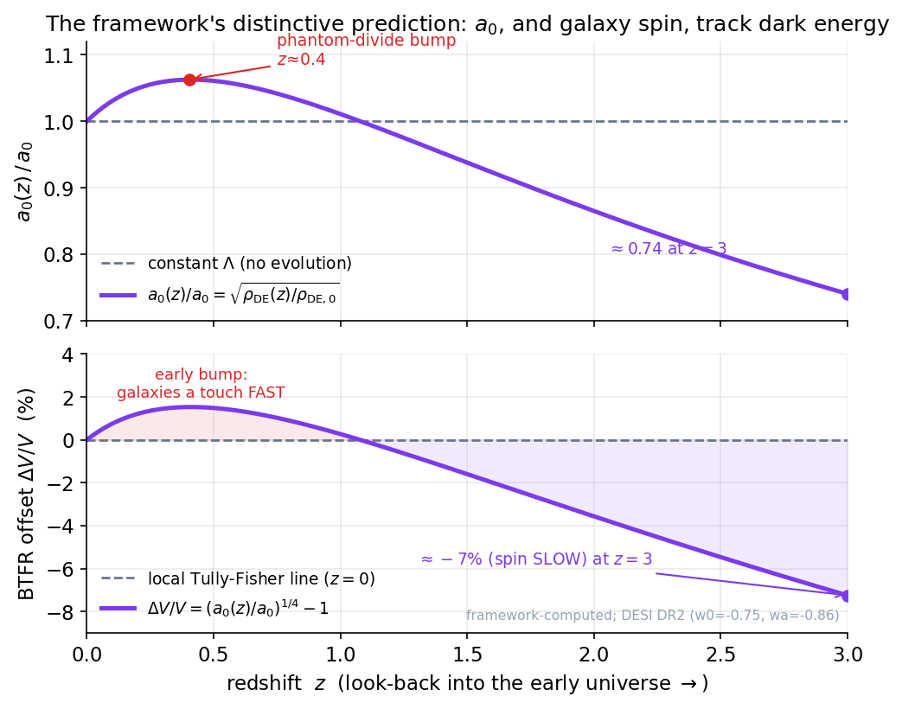

***Figure 26.1 — The signature prediction: a0, and galaxy spin, track dark energy.*** Top: the framework's acceleration scale relative to today, $a_0(z)/a_0=\sqrt{\rho_{\rm DE}(z)/\rho_{\rm DE,0}}$, rising about 6% in a small phantom-divide bump near $z\approx0.4$ before declining to roughly 0.74 by $z=3$. Bottom: the resulting baryonic Tully-Fisher offset at fixed mass, $\Delta V/V=(a_0(z)/a_0)^{1/4}-1$ — a touch fast at the bump, then about 7% slow by $z=3$. Computed from the framework's equations using the DESI DR2 evolving-dark-energy central values ($w_0=-0.75$, $w_a=-0.86$); a constant $\Lambda$ (grey dashed) would give a flat line and no offset.

**Source:** Figure generated by [`book/figures/ch26_a0z_btfr_offset.py`](https://github.com/carlzimmerman/zimmerman-formula/blob/main/book/figures/ch26_a0z_btfr_offset.py). Framework curve $a_0\propto\sqrt{\rho_{\rm DE}}$ from the a0(z) dark-energy-scale paper ([doi:10.5281/zenodo.20737162](https://doi.org/10.5281/zenodo.20737162); curve provenance [`opus_48_extended_research/papers/a0z_desi_figure.py`](https://github.com/carlzimmerman/zimmerman-formula/blob/main/opus_48_extended_research/papers/a0z_desi_figure.py)); evolving dark-energy parametrization from DESI DR2 2025 (arXiv:2503.14738); BTFR slope-4 from McGaugh 2012, AJ 143, 40.

---

## The Test Already in the Bank: Cassini and Our Own Solar System

So far every test has been about the distant universe and the future. Now let me turn to a test that is **already done** — measured, published, sitting in the bank — and which is the single place where this framework genuinely separates from its MOND cousins. It happens in our own Solar System, and the spacecraft that did it was **Cassini**.

To feel why this matters, we have to revisit a fork in the road that I introduced back in Part 4, because it is the whole point.

### Two ways to bend a galaxy: force, or inertia

When a galaxy rotates faster than its visible mass should allow, there are two broadly different ways to fix the law (setting aside adding invisible matter). You can change the *gravity* — make the gravitational pull stronger than Newton says in the regime of very low acceleration. Or you can change the *inertia* — make matter *resist acceleration less* in that same regime, so the same gravitational pull whips it around faster. The two look almost identical when you watch a galaxy spin. They are not identical at all when you ask what happens in a high-acceleration place like the Solar System.

This is the **modified-inertia versus modified-gravity discriminant**, and it is worth slowing down on:

- **Modified gravity** changes the force law itself. In most realizations, the modification is keyed to the *gravitational field* of the system, and it tends to leave a small residual extra pull *even in places where the acceleration is high* — like a planet orbiting the Sun — unless the theory is carefully engineered to switch off. That residual is what spacecraft tracking can hunt for.
- **Modified inertia** — the road *this* framework takes — changes how matter responds to *any* push, but in a way that is keyed to the object's *own state of acceleration relative to the cosmic background*. The de Sitter–Unruh mechanism at the heart of this book is exactly this kind of thing: empty space in a $\Lambda$-universe has a tiny temperature floor, and an object in *near-free-fall* — barely accelerating — feels that floor as a little extra inertia. The crucial word is *near-free-fall*. An object that is accelerating *hard*, like a planet held in a tight, fast orbit by the Sun's strong gravity, is nowhere near that floor. The effect *switches itself off* in the Solar System. It is not engineered off; it is off because the mechanism only wakes up at very low acceleration.

That difference is the whole ballgame for the Cassini test.

### What Cassini measured

**Cassini** was the NASA–ESA spacecraft that orbited Saturn from 2004 to 2017. For years, radio engineers tracked its position with exquisite precision by timing radio signals to and from Earth. From that tracking, they could test whether the gravity governing Saturn's orbit and Cassini's motion deviated even slightly from pure General Relativity. It did not — to spectacular precision. In the language used to quantify such deviations, the data constrain any anomalous, MOND-like extra pull at Saturn's distance to a fractional level of

$$|\gamma - 1| < 2.3\times 10^{-5},$$

where $\gamma$ here is a parameter measuring departure from the standard force (its standard, no-deviation value is $1$). That is the **Cassini bound**: any new physics that adds an extra gravitational tug at Saturn must hide below about two parts in a hundred thousand.

Now, what does *this* framework predict for that same quantity? Because its mechanism is modified *inertia* that switches off at high acceleration, the predicted deviation at Saturn's orbit is tiny — the framework predicts a fractional anomaly of

$$1 - \mu_{\rm fw} = 7.2\times 10^{-7}$$

at Saturn (here $\mu_{\rm fw}$ is the framework's interpolating factor, which equals $1$ — pure Newton — in the strong-acceleration limit, and the small departure $7.2\times10^{-7}$ measures how far from $1$ it is at Saturn). Compare the two numbers:

$$\text{predicted } 7.2\times10^{-7} \quad\text{vs.}\quad \text{allowed } 2.3\times10^{-5}.$$

The framework's predicted effect is about **thirty times smaller** than the tightest bound Cassini allows. It passes — comfortably, by construction, because the mechanism genuinely shuts down where accelerations are high.

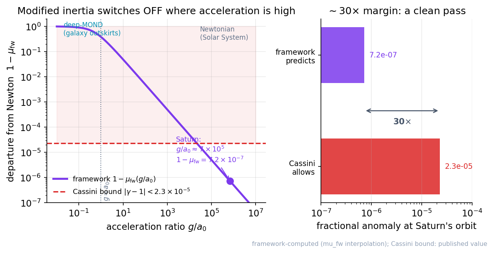

***Figure 26.2 — Cassini as a discriminator: modified inertia switches itself off in the Solar System.*** Left: the framework's fractional departure from Newton, $1-\mu_{\rm fw}$, plotted against the acceleration ratio $g/a_0$ using the interpolating function $\mu_{\rm fw}(x)=(\sqrt{1+4x^2}-1)/(2x)$. At Saturn's orbit ($g/a_0\approx7\times10^5$) the effect has shrunk to $7.2\times10^{-7}$ — far below the red Cassini bound — because the mechanism only wakes up near free-fall. Right: the predicted anomaly sits about 30x below what Cassini allows, a clean pass. Both panels are computed from the framework's own equations; the Cassini bound is a hardcoded published value.

**Source:** Figure generated by [`book/figures/ch26_cassini_discriminant.py`](https://github.com/carlzimmerman/zimmerman-formula/blob/main/book/figures/ch26_cassini_discriminant.py). Framework interpolation and PPN provenance: [`opus_48_extended_research/reviews/derivation_chain/mi_ppn_alpha2_verify.py`](https://github.com/carlzimmerman/zimmerman-formula/blob/main/opus_48_extended_research/reviews/derivation_chain/mi_ppn_alpha2_verify.py) and the spine paper ([doi:10.5281/zenodo.20721540](https://doi.org/10.5281/zenodo.20721540)); Solar-System MOND tension context: Famaey & McGaugh 2012, Living Rev. Relativity 15, 10 (arXiv:1112.3960).

And here is the part that makes this a real *discriminant* and not just a box-check: **an ungated modified-gravity theory — one whose extra pull is keyed to the field and does *not* switch off at high acceleration — generically produces a Saturn-distance anomaly far larger than Cassini's bound, and fails.** This is a long-standing, well-known tension for field-based modified-gravity formulations of MOND in the Solar System. The modified-*inertia* road threads the needle precisely because the effect is tied to *near-free-fall*, which Saturn's orbit is emphatically not.

> **Deeper Dive: Why $7.2\times10^{-7}$, and why a modified-gravity host fails.**
>
> In a modified-inertia realization, the correction to Newtonian dynamics is governed by an interpolating function of the ratio of the local acceleration $g$ to $a_0$. At Saturn's orbit, the Sun's Newtonian gravitational acceleration is roughly
> $$g_{\rm Saturn} \approx \frac{GM_\odot}{r_{\rm Saturn}^2} \approx 6.5\times10^{-5}\ \text{m s}^{-2},$$
> while $a_0\approx 9.36\times10^{-11}\ \text{m s}^{-2}$. The ratio is enormous: $g/a_0 \approx 7\times10^{5}$. We are *deep* in the high-acceleration (Newtonian) regime — by nearly six orders of magnitude.
>
> For a modified-inertia interpolating function that approaches Newton as $\mu_{\rm fw}\to 1$ with leading correction of order $(a_0/g)$ in the relevant high-acceleration expansion, the departure from Newton scales as
> $$1-\mu_{\rm fw}\ \sim\ \mathcal{O}\!\left(\frac{a_0}{g}\right)\ \text{(with the framework's specific interpolation giving)} \quad 1-\mu_{\rm fw} = 7.2\times10^{-7}.$$
> This sits a factor $\sim$30 below the Cassini bound $|\gamma-1|<2.3\times10^{-5}$ — a clean pass.
>
> The contrast with field-based modified gravity is structural. In an *ungated* modified-gravity host — a theory where the extra force is sourced by the gravitational field and the deep-MOND behavior is not cleanly suppressed inside a high-field region — the predicted Solar-System anomaly does not fall off fast enough with $g/a_0$, and generically lands *above* the Cassini bound. Threading Cassini then requires extra engineering (a carefully tuned screening mechanism). The modified-*inertia* mechanism in this framework needs no such tuning: the suppression is automatic because the effect is keyed to *near-free-fall*, i.e. to small absolute acceleration relative to the cosmic background, and Saturn's orbit is six orders of magnitude away from that condition. **Cassini is therefore not merely a consistency check the framework passes — it is a discriminator that prefers modified inertia over an ungated modified-gravity realization.**

### The honest both-ways on Cassini

Let me hold myself to the standard I set at the start. The Cassini test is genuinely in the bank, and it genuinely *discriminates* modified inertia from ungated modified gravity — that is a real and, I think, underappreciated point in this framework's favor. It is the cleanest place where the *mechanism* (not just the value of $a_0$) earns its keep.

But I will not let it carry more than it can. Cassini confirms that the framework is **Solar-System-safe** and that its mechanism is the modified-inertia kind. It does *not* confirm the framework's cosmological claim, it does not derive $a_0$, and it does not touch the lensing wall or the cluster residual that we will face squarely in the next chapters. It rules *out* a class of rivals and rules *in* the framework's self-consistency in our backyard. That is a meaningful thing, and it is also a *bounded* thing. Both at once.

---

## Putting the Three Tests on One Timeline

Let me gather the whole program into a single honest picture, because I think seeing it laid out together is clarifying.

| Test | What it measures | When | What confirms | What kills |
|---|---|---|---|---|
| **Cassini** | Solar-System safety; inertia vs. gravity | **Done** (2004–2017 data) | (already passed) | An anomaly $>2.3\times10^{-5}$ at Saturn (not seen) |
| **DESI DR3** | Does $\rho_{\rm DE}$ evolve? (the gate) | ~2026–2027 | $(w_0,w_a)$ stays away from $(-1,0)$ | A clean return to $\Lambda$, $(w_0,w_a)\to(-1,0)$ |
| **BTFR offset sign (ALMA)** | Do distant galaxies spin *slow*? | ~2028–2030 | Offset *negative* (slow) at fixed mass | Offset *positive* (fast), or zero with evolving $\rho_{\rm DE}$ |
| **$a_0(z)$ shape (ELT/HARMONI)** | The full curve, incl. the $z\approx0.4$ bump | early–mid 2030s | Non-monotonic curve tracking $\sqrt{\rho_{\rm DE}}$ | A flat or monotonic curve inconsistent with $\sqrt{\rho_{\rm DE}}$ |

A few things jump out of this table that I want to name.

First, **the tests are sequential and they gate each other.** Cassini is already passed. DESI DR3 is the near-term gate — if it kills evolving dark energy, the galaxy tests go quiet (the framework survives as ordinary fixed-$a_0$ MOND, but loses its distinctive prediction). Only if DESI keeps evolving dark energy alive do the telescope tests become diagnostic of *this* framework specifically.

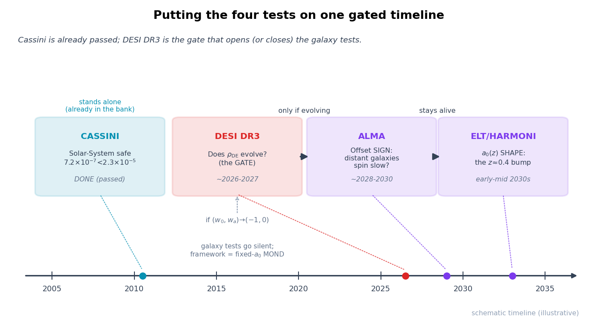

***Figure 26.3 — The four tests on one gated timeline.*** A schematic of the chapter's program: Cassini (already passed, the modified-inertia discriminator) stands alone, while the galaxy tests form a gated chain. DESI DR3 (~2026-27) asks whether dark energy evolves at all; only if it stays evolving do ALMA (~2028-30, the offset sign) and then ELT/HARMONI (early-mid 2030s, the full $a_0(z)$ shape including the $z\approx0.4$ bump) become diagnostic of this framework. If DESI returns to a constant $\Lambda$, the galaxy tests go silent and the framework falls back to fixed-$a_0$ MOND. Schematic illustrating the chapter's sequential test logic; dates are the chapter's stated estimates.

**Source:** Figure generated by [`book/figures/ch26_test_timeline_gate.py`](https://github.com/carlzimmerman/zimmerman-formula/blob/main/book/figures/ch26_test_timeline_gate.py). Test program and dates from the a0(z) paper ([doi:10.5281/zenodo.20737162](https://doi.org/10.5281/zenodo.20737162)) and this chapter; the DESI gate references DESI DR2 2025 (arXiv:2503.14738).

Second, **there is a real kill condition at every stage.** That is the property I care about most. A framework you cannot kill is not science. This one you can kill, in at least four distinct ways, on a published timeline, with funded instruments.

Third — and this is the both-ways I owe you — **none of this confirms the framework against $\Lambda$CDM today.** As I write, the most you can say is: the framework is self-consistent and Solar-System-safe (Cassini), it rests on a dark-energy-evolution precondition that is real but contested (DESI), and its sharpest galaxy prediction is awaiting instruments that are being built. The radial-acceleration and Tully–Fisher *successes* it already has are **shared with the entire MOND family** and are *not* unique to this framework — I said this in Chapter 18 and I will keep saying it, because forgetting it is the easiest way to oversell. The one genuinely distinctive, near-future, framework-specific handle is the $a_0(z)$ evolution, and it is hostage to DESI. That is the honest standing, and the whole point of this chapter is that the *standing has a schedule*.

---

## A Word on What "Decided" Will Actually Feel Like

I want to close with something a little more human, because I think it matters for how you read the rest of this book and the literature you will go on to read.

When people imagine a theory being "tested," they often picture a single dramatic moment — a number flashing on a screen, a press conference, a Nobel. Real physics almost never works like that, and this framework certainly will not. What will actually happen is slower and more interesting. DESI DR3 will arrive and the evolving-dark-energy signal will firm up a little, or soften a little, and there will be arguments about which supernova sample to trust. ALMA papers will appear reporting high-redshift rotation curves, and there will be arguments about turbulence corrections and gas masses. The picture will assemble itself out of dozens of imperfect measurements, the way real pictures always do, over a decade, with the sign of the offset settling before its amplitude.

So when I say this framework "will be tested this decade and next," I do not mean there is a single day on which it lives or dies. I mean that, over the next ten to fifteen years, the weight of accumulating evidence will tip one way or the other — toward "yes, $a_0$ tracks dark energy, and the early universe spun its galaxies a touch slow," or toward "no, dark energy is just $\Lambda$ and the offset is not there." Both outcomes are real, both are reachable with instruments that exist or are being built, and I have done my honest best to make the prediction sharp enough that the data can speak clearly.

That is the most I can promise, and I think it is the right amount to promise. It is not a theory of everything yet, as frustrating as it may be. But it is a theory that has stuck its neck out, given you the dates, and shown you exactly where the axe would fall. In the chapters that follow, we will turn from the tests it can pass to the walls it cannot yet climb — the value of $a_0$ it does not derive, the lensing it cannot make covariant, the cluster mass it does not fully account for. Those walls are as real as these tests, and they deserve the same honest light.

---

## Summary

- **The signature prediction is testable, on a real timeline, with funded instruments.** This framework says $a_0$ tracks the dark energy density, so if dark energy evolves, distant galaxies of a given baryonic mass should rotate slightly *slow* — about 7% slow by redshift $z=3$.
- **The sign of the offset is the robust test, not the amplitude.** The deep-MOND relation $d\log V = \tfrac{1}{8}\,d\log\rho_{\rm DE}$ ties rotation speed to dark energy density; the *direction* (slow, because $a_0$ was lower in the past on the DESI reading) is far less hostage to messy mass measurements than the *size*.
- **Everything hinges on DESI.** The whole galaxy test has a precondition — that dark energy actually evolves. DESI DR2 found a real but *contested* preference for evolving dark energy ($w_0\approx-0.75$, $w_a\approx-0.86$); **DESI DR3 (~2026–2027) is the near-term gate.** If it returns to a constant $\Lambda$, the distinctive prediction goes silent and the framework falls back to ordinary fixed-$a_0$ MOND.
- **The giant telescopes measure the curve.** ALMA (~2028–2030) can establish the *sign* of the high-redshift offset; ELT/HARMONI (early–mid 2030s), with JWST shoring up the baryon masses, can trace the *shape* — including the distinctive non-monotonic bump near $z\approx0.4$.
- **Cassini is already in the bank, and it discriminates.** Because the mechanism is modified *inertia* that switches off at high acceleration, the framework predicts a Saturn-orbit anomaly of $1-\mu_{\rm fw}=7.2\times10^{-7}$, about 30× below the Cassini bound $|\gamma-1|<2.3\times10^{-5}$ — a clean pass, where an *ungated* modified-gravity host would fail. This is the one place the framework's *mechanism* (not just its value of $a_0$) earns its keep against rivals.
- **Both ways, honestly:** the framework is Solar-System-safe and self-consistent, but **not** confirmed against $\Lambda$CDM; its RAR/BTFR successes are *shared* with the whole MOND family; and its one distinctive handle, the $a_0(z)$ evolution, is hostage to a contested DESI result. There is a real kill condition at every stage — which is exactly what makes it science. Not a theory of everything yet, as frustrating as it may be.

---

## Questions

1. **(Easy.)** In your own words, why does this framework predict that distant galaxies should rotate *slower* than nearby galaxies of the same ordinary-matter mass, rather than faster? Which way does the dark energy density change between $z=3$ and today, on the DESI reading, and how does that feed through to $a_0$ and then to rotation speed?

2. **(Easy–medium.)** Why does the author insist that the *sign* of the high-redshift Tully–Fisher offset is a more honest test than its *amplitude* (the "7%")? Name two specific observational difficulties that make the amplitude hard to pin down but leave the sign intact.

3. **(Medium.)** Explain why the Cassini result discriminates *modified inertia* from *modified gravity*, even though both can reproduce flat galaxy rotation curves. Why does the de Sitter–Unruh modified-inertia mechanism switch *off* in the Solar System without any special engineering, while an ungated modified-gravity theory has to be carefully tuned to survive Cassini?

4. **(Medium.)** Starting from the deep-MOND relation $V^4 = G M a_0$ and the framework's claim $a_0 \propto \sqrt{\rho_{\rm DE}}$, derive the relation $d\log V = \tfrac{1}{8}\,d\log\rho_{\rm DE}$ at fixed baryonic mass. Where does the $\tfrac{1}{2}$ come from, and where does the $\tfrac{1}{4}$ come from?

5. **(Medium–hard.)** Using the evolving-dark-energy density formula $\rho_{\rm DE}(a)/\rho_{\rm DE,0} = a^{-3(1+w_0+w_a)}e^{-3w_a(1-a)}$ with $w_0=-0.75$, $w_a=-0.86$, compute the ratio $\rho_{\rm DE}(z)/\rho_{\rm DE,0}$ at $z=1$ ($a=0.5$). Then find the predicted fractional rotation-speed offset $\Delta V/V$ at $z=1$. Is the offset larger or smaller than at $z=3$, and why does that make $z\approx3$ the better target for the giant telescopes?

6. **(Research-level.)** The framework's distinctiveness lives entirely in the *joint* statement "dark energy evolves *and* the BTFR offset tracks $\sqrt{\rho_{\rm DE}}$ with a specific non-monotonic shape." Suppose, hypothetically, that DESI DR3 firms up evolving dark energy but a future ELT/HARMONI survey finds a high-redshift BTFR offset whose *sign* matches but whose *shape* is monotonic (no bump near $z\approx0.4$). What would that tell you — about the $a_0\propto\sqrt{\rho_{\rm DE}}$ link, about the assumed $w(a)$ parametrization, or about the deep-MOND assumption — and how might you design follow-up observations to tell those possibilities apart?

# Chapter 27: The Value of a₀ Is Not Derived (And the Standard Model Is Walled Off)

> *"A map that explains one river beautifully has not thereby explained the sea. It is fair to be proud of the river — and honest about the sea."*

We have spent the last few chapters in the part of the story where the framework looks its best. In Chapter 20 we wrote down the central claim, a₀ = c²√(Λ/32π), and saw the galactic acceleration scale fall out of the dark-energy density. In Chapter 21 we found a mechanism — empty space in a Λ-universe has a temperature floor, and matter in near-free-fall feels that floor as a little extra inertia. In Chapter 22 we watched the *form* of the answer get *forced*: a₀ has to go like c²√Λ, and the kernel has to carry √(8π/3), Einstein's 8π married to Friedmann's 3. In Chapter 23 we cornered the one free number, κ = ½, and proved it can't be pushed around by ghost-freedom, unitarity, holography, or a degree-of-freedom count — it is pure geometry, but it is still a *choice*. In Chapter 24 we lined up one knob against ΛCDM's six parameters plus an undetected particle.

That is a genuinely good run. And it is exactly the kind of run that tempts a person to keep going — to say, "Well, if it nailed *that*, surely it's about to nail everything." This chapter exists to stop that sentence in its mouth.

Here is the rule of this book, and I want to state it as plainly as I can, with no softening: **one frontier explained does not mean all of them are.** The framework gives you the *form* of a₀ and the *economy* of it — one parameter, set by geometry, tied to the universe's dark energy. It does **not** give you the *value* of a₀ from nothing. And it says *nothing whatsoever* about why the proton outweighs the electron by 1836, nothing about the particles, nothing about the masses, nothing about the forces between them. That whole world — the world of particle physics, of the Standard Model — is untouched. Walled off. Behind glass.

This is the first of the honesty chapters, and it is the most important one in the book. If you take only one idea from these pages, take this: *the framework is not a theory of everything yet, as frustrating as it may be.* Let me show you exactly where the walls are, why they are there, and why being honest about them is not a retreat but the whole point.

## The two things this chapter will not let you believe

There are two specific over-claims I want to disarm before we go any further, because they are the two that even careful readers slide into.

**Over-claim one: "The framework derives the value of a₀."** It does not. It derives the *shape* of a₀ — that it must be proportional to c²√Λ — and it pins down almost every number in front of that √Λ. But one number, κ = ½, has to be *put in by hand*. Not pulled out of a hat — it sits at a beautiful geometric spot, and Chapter 23 spent its whole length showing you that spot. But "sitting at a beautiful spot" is not the same as "forced to be there by a law you couldn't have written down differently." That distinction is the difference between a *zero*-parameter theory and a *one*-parameter theory, and the framework is honestly the second kind.

**Over-claim two: "If gravity and the dark sector came out this clean, the particles must be next."** They are not next. They are not in the building. The framework is a theory *of gravity and inertia and the dark sector* — it modifies how matter resists being pushed, in a way that mimics extra gravity. It is mute on what matter *is made of*. Why are there three families of particles and not two or seventeen? Why does the muon weigh what it weighs? The framework has no opinion. It is not that it gives a wrong answer; it gives *no* answer, because those questions live on the other side of a wall it never claimed to cross.

Let me define the word I just leaned on, because it is the key word of the whole chapter.

> **A *geometric posit* is a number you choose because geometry makes it the natural, elegant choice — but which the theory cannot *force* you to choose.** κ = ½ is a geometric posit. It is the value that makes the Cohen–Kaplan–Nelson bound collapse to a single degree of freedom; it is the exact ratio (Schwarzschild's ½) ÷ (a ball's 4π/3) hiding inside 3/8π. Every instinct says "of course it's ½." But instinct is not derivation. A posit is an honest IOU: *here is the one thing I had to assume; everything else follows.*

And the discipline that keeps us honest about all of this has a name in the project, and I will use it throughout:

> **The *quarantine* is a hard rule: we never say that a₀, Z, κ, or any Standard-Model quantity is "*derived*."** We may say a₀'s *form* is forced. We may say κ is *characterized*, *cornered*, *shown to be geometric*. We may say the Standard Model is *interfaced with* (Chapter 30 does exactly that). But the moment someone writes "the framework derives the proton mass" or "a₀ is derived from first principles," the quarantine has been broken, and the claim is wrong. The quarantine is not modesty for its own sake. It is the line between a real result and a mirage, and keeping it is what lets the real results stand.

With those two over-claims disarmed and those three words defined — geometric posit, quarantine, and the wall we are about to meet — let's walk the walls one at a time.

## Wall one: the value of a₀ is a posit, not a prophecy

Start with the friendly version, because it is genuinely simple.

The framework hands you a recipe: take the dark-energy density of the universe, ρ_DE; take the speed of light, c; take Newton's constant, G; and combine them as a₀ = (c/2)√(G ρ_DE). Plug in the measured ρ_DE and you get a₀ ≈ 9.36 × 10⁻¹¹ m/s² — which is, satisfyingly, right where Milgrom's galaxies told us the acceleration scale sits. (We met that scale back in Chapter 17, and the radial-acceleration relation that revealed it in Chapter 18.)

So far this *feels* like a derivation. You put in things you measured elsewhere — the expansion of the universe, basically — and out comes a number that matches galaxies. Where's the catch?

The catch is that little "/2" — the κ = ½. It is the one piece of the recipe that did not have to be what it is. Everything else in the formula is forced: the c² and the √Λ are forced by dimensional analysis and the mechanism (Chapter 22); the √(8π/3) is forced by gluing Einstein's field equations to Friedmann's. But the overall *coefficient* — whether the right answer is (c/2)√(Gρ) or (c/3)√(Gρ) or (c/√(2π))√(Gρ) — comes down to κ, and κ is the posit.

Here is an analogy I keep coming back to. Imagine you've discovered that the period of a pendulum *must* go like √(L/g) — that's forced, it falls out of the physics, and it's a real and beautiful result. You can predict that a pendulum four times as long swings twice as slow, and you'll be right every time. But the *exact* period also has a number out front (it's 2π for a small swing), and suppose — just suppose — your derivation got you the √(L/g) cleanly but left that leading number as a thing you had to look up or assume. You'd have explained the *structure* of every pendulum on Earth while still, technically, posit-ing one constant. That is the situation with a₀. The structure is forced. The leading coefficient rests on κ.

Now — and this is where the both-ways honesty matters — that posit is *unusually* well-behaved. Chapter 23 showed that κ = ½ isn't a free dial you can spin to any value; four independent consistency arguments all point at ½, and the geometric identity 3/8π = (½)/(4π/3) makes it look less like a coincidence and more like an inevitability we just can't *prove* is inevitable. So this is not the situation where someone fits one number to the data and calls it a theory. It is genuinely one parameter, genuinely geometric, genuinely cornered.

But cornered is not the same as caught. And so the honest sentence is: **the framework predicts the value of a₀ *given* κ = ½, and κ = ½ is a posit.** That makes the *value* of a₀ an output of an assumption, not a consequence of a law. We do not say a₀ is derived. We say a₀'s *form* is forced and its *value* follows from one geometric posit. That is a strong thing to be able to say. It is not the strongest thing, and we will not pretend it is.

> **Deeper Dive: the lone un-derived input, precisely stated**
>
> Write the framework's central relation in the form that makes the bookkeeping transparent:
>
> $$a_0 = \kappa\, c^2 \sqrt{\frac{\Lambda}{6\pi}} = \kappa\, c \sqrt{\frac{8\pi G \rho_{\rm DE}}{3}}\,,\qquad \kappa = \tfrac12.$$
>
> With κ = ½ this is exactly a₀ = c²√(Λ/32π) = (c/2)√(Gρ_DE), the form of Chapter 20. The point of writing κ explicitly is to isolate where the freedom lives. Everything multiplying κ is *fixed*:
>
> - The factor √(8π/3) is the **gravitational kernel** of Chapter 22. The 8π is the coupling in Einstein's field equations $G_{\mu\nu} = (8\pi G/c^4)\,T_{\mu\nu}$; the 3 is the coefficient in the Friedmann equation $H^2 = (8\pi G/3)\rho$. Their ratio is forced the moment you ask a de Sitter horizon and a Friedmann background to agree.
> - The √Λ (equivalently √ρ_DE) is forced by the mechanism: the de Sitter–Unruh temperature floor goes as $T_{\rm dS} \propto H \propto \sqrt{\Lambda}$ (Chapters 14–15), and a₀ inherits that square root.
> - The c² is forced by dimensions once the temperature-to-acceleration conversion is fixed.
>
> What is *not* fixed by any of these is κ. Define it operationally as the ratio of the actual acceleration scale to the "bare" combination:
>
> $$\kappa \equiv \frac{a_0}{c^2\sqrt{\Lambda/6\pi}}\,.$$
>
> Chapter 23 established four facts about κ: (i) ghost-freedom and unitarity do not fix it; (ii) the single-degree-of-freedom limit of the Cohen–Kaplan–Nelson bound *selects* κ = ½; (iii) the identity $3/8\pi = (1/2)/(4\pi/3)$ exhibits ½ as the Schwarzschild compactness over the volume-of-a-ball factor; (iv) a Standard-Model degree-of-freedom count is consistent with — but does not *demand* — ½. The honest summary: κ is **characterized to the point of near-inevitability and still not derived.** It is the theory's one IOU.
>
> Quarantine note: do not write "a₀ is derived." Write "a₀'s form is forced; its value follows from the geometric posit κ = ½." The difference is the difference between a one-parameter theory (true) and a zero-parameter theory (false).

Before we leave a₀, one more honest flag that we will return to in Chapter 25: even the *value* we plug in is hostage to which dark-energy density you use, and dark energy may be *evolving* (the DESI result of Chapter 25). The framework's signature prediction is precisely that a₀ should track ρ_DE through cosmic time. That is a strength — it is testable. But it also means the "value of a₀" is not even a single fixed number across all of history in this framework; it is a function a₀(z). The posit κ = ½ sets the *coefficient* of that function. The function's value today is an input from cosmology, not a derivation. Both things are true at once, and we say both.

## Wall two: the Standard Model is behind glass

Now the bigger wall, and the more humbling one.

Everything we have discussed is about *gravity and inertia* — about how things move, how they resist being moved, how that resistance can masquerade as missing mass. None of it touches the question of what things *are*. And "what things are" is the entire subject of the **Standard Model of particle physics**, the most precisely tested theory humans have ever built.

> **The *Standard Model wall* is the boundary between what the framework speaks to (gravity, inertia, the dark sector) and what it is completely silent on (the identities, masses, and interactions of the elementary particles).** The framework lives on the gravity side of the wall. The Standard Model lives on the other side. The framework neither modifies the Standard Model nor derives anything in it. They are, for now, separate countries with a single narrow bridge (Chapter 30) that carries traffic in only one direction.

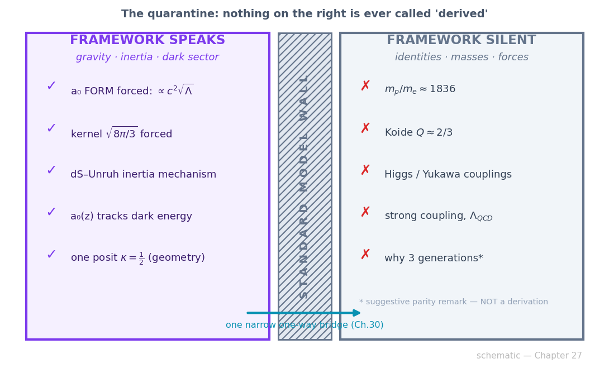

***Figure 27.2 — Two countries, one wall, one narrow one-way bridge.*** A conceptual map of the chapter's central claim: the framework *speaks* on the gravity/inertia/dark-sector side (left, checks) and is *completely silent* on the Standard Model side (right, crosses) — the proton-to-electron mass ratio, the Koide relation, the Higgs/Yukawa and strong couplings, and the masses. The only crossing is the single one-way interface of Chapter 30. Schematic illustrating the *Standard Model wall* and the *quarantine*; no data plotted.

**Source:** Figure generated by [`book/figures/ch27_two_countries_wall.png`](https://github.com/carlzimmerman/zimmerman-formula/blob/main/book/figures/ch27_two_countries_wall.py). Concept per Chapter 27 and the main result ([Zenodo 10.5281/zenodo.20721540](https://doi.org/10.5281/zenodo.20721540)). Standard-Model masses/couplings are textbook particle physics; the Koide coincidence is Koide 1983, PLB 120, 161.

Let me make the silence concrete with the most famous number on the other side of that wall.

### The proton-to-electron mass ratio

Take a proton and an electron — the two particles that make up a hydrogen atom, the most common atom in the universe. The proton is heavier. How much heavier? About 1836 times.

> **The *proton-to-electron mass ratio*, written μ = m_p/m_e ≈ 1836.15, is exactly what it sounds like: how many times more mass a proton has than an electron.** It is one of the most precisely measured numbers in all of science, and physicists have spent decades wondering whether anything *explains* it or whether it is just a brute fact of our universe.

Does the framework explain why this number is 1836 and not 1000 or 5000? No. Not even slightly. And it is worth understanding *why* the "no" here is so complete, because it is not a temporary gap that a clever afternoon might close. It is structural.

The electron's mass comes from its coupling to the Higgs field — a free number in the Standard Model called a Yukawa coupling, which is essentially measured, not predicted. The proton's mass is a different and stranger story: only a tiny fraction of it comes from the masses of the quarks inside it. The *vast* majority — well over 90% — comes from the *energy* of the strong force binding those quarks together, the quantum chromodynamics (QCD) field churning inside the proton. That binding energy is set by the strong coupling constant, another input of the Standard Model.

So to "derive" 1836 you would need to derive (at least) the electron's Yukawa coupling *and* the strong coupling that sets the QCD scale, and then do the brutal nonperturbative calculation that turns the strong coupling into a proton mass. The framework supplies *none* of these ingredients. It has no Higgs sector, no Yukawa couplings, no strong force, no quarks. The proton-to-electron mass ratio is not "almost in reach" for this framework. It is in a different building.

> **Deeper Dive: why μ rests on free inputs the framework never touches**
>
> In the Standard Model the relevant masses arise as follows.
>
> The electron mass is $m_e = y_e\, v/\sqrt2$, where $v \approx 246$ GeV is the Higgs vacuum expectation value and $y_e \approx 2.9\times 10^{-6}$ is the electron **Yukawa coupling** — a dimensionless number that is an *input*, fit to experiment, with no value predicted by the theory.
>
> The proton mass is dominated not by quark masses but by the QCD scale $\Lambda_{\rm QCD}$, which emerges by dimensional transmutation from the strong coupling $\alpha_s(\mu)$ running according to
> $$\mu\frac{d\alpha_s}{d\mu} = -\frac{\beta_0}{2\pi}\alpha_s^2 + \cdots,\qquad \beta_0 = 11 - \tfrac{2}{3}n_f.$$
> Roughly $m_p \approx c_1\Lambda_{\rm QCD} + (\text{small quark-mass and EM terms})$, with the dimensionless coefficient $c_1$ obtainable only from lattice QCD. Thus
> $$\mu = \frac{m_p}{m_e} \sim \frac{c_1\,\Lambda_{\rm QCD}}{y_e\, v/\sqrt2}$$
> depends on (i) the electron Yukawa $y_e$, (ii) the strong coupling / $\Lambda_{\rm QCD}$, (iii) the Higgs vev $v$, and (iv) a nonperturbative lattice number $c_1$. *Every one of these is outside the framework.* The framework contains no Higgs field, no Yukawa sector, and no $SU(3)_c$ gauge dynamics. There is therefore no chain of reasoning — not even a speculative one — by which the framework outputs 1836.15.
>
> This is the cleanest possible statement of the wall: μ is a function entirely of Standard-Model inputs, and the framework provides zero of them. **We do not derive μ. We cannot. We do not try.**

### What about the patterns people *do* find among the particles? The Koide relation

Here is a fair objection from a sharp reader: "But particle physics *is* full of suspicious-looking numerical coincidences among the masses. People find patterns. Doesn't the framework's whole spirit — geometry secretly organizing the constants — suggest it should explain *those*?"

The most famous of these patterns deserves a name and a careful answer.

> **The *Koide relation* is a startlingly tight numerical coincidence among the three charged leptons** — the electron, the muon, and the tau, three particles that are identical except for their masses. Yoshio Koide noticed in 1981 that
> $$Q = \frac{m_e + m_\mu + m_\tau}{\left(\sqrt{m_e} + \sqrt{m_\mu} + \sqrt{m_\tau}\right)^2} \approx \frac{2}{3}$$
> to within experimental error — eerily close to the exact value 2/3, which sits exactly halfway between the minimum 1/3 (all masses equal) and the maximum 1 (one mass dominating). Nobody knows whether it means anything.

So: does the framework derive the Koide relation? No. And I want to be especially careful here, because Koide is exactly the kind of thing that someone *wants* the framework to claim, and exactly the kind of thing the quarantine forbids us from claiming.

The framework has nothing to say about lepton masses. It does not contain the electron, muon, and tau as objects with masses to relate. The 2/3 in Koide and the 8π/3 in the gravitational kernel are *not* the same 3, are *not* secretly linked, and any sentence that suggests they are has broken the quarantine and is wrong. The fact that both involve the number 3 is the kind of coincidence that human pattern-matching adores and that disciplined physics must refuse. Three appears in a great many places for a great many unrelated reasons.

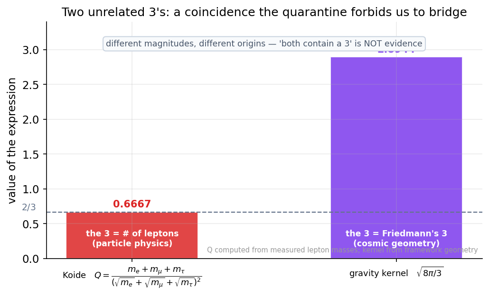

***Figure 27.3 — The two 3's are not the same 3.*** The chapter warns against the seductive coincidence that the Koide relation carries a 2/3 while the gravitational kernel carries an 8π/3. Plotted side by side, the expressions differ in magnitude (Koide Q≈0.6667 versus √(8π/3)≈2.894) and, more importantly, in *origin*: Koide's 3 counts the three leptons; the kernel's 3 is the Friedmann coefficient. "They both contain a 3" is not the beginning of evidence. Q is computed from the measured charged-lepton masses (PDG-level constants); the kernel is computed from the framework's geometry.

**Source:** Figure generated by [`book/figures/ch27_koide_two_threes.png`](https://github.com/carlzimmerman/zimmerman-formula/blob/main/book/figures/ch27_koide_two_threes.py). Koide relation: Koide 1983, PLB 120, 161 (lepton masses are standard measured values). Gravitational kernel √(8π/3) per the main result ([Zenodo 10.5281/zenodo.20721540](https://doi.org/10.5281/zenodo.20721540)).

This is, frankly, one of the hardest disciplines in the whole project — *not* reaching for a beautiful-looking bridge that isn't there. The framework earns its credibility by what it refuses to claim as much as by what it claims. The Koide relation is a genuine open puzzle in particle physics; it is *not* this framework's puzzle to solve, and pretending otherwise would poison the real results with a fake one.

### And the three generations?

One more, because it's the deepest and the most interesting, and because it's where the framework comes *closest* to the wall without crossing it.

The particles of the Standard Model come in three nearly-identical copies called *generations* (or families): the electron family, the muon family, the tau family. Why three? Why not one, which would be plenty for ordinary matter, or four, or a hundred?

There is, within the broader circle of ideas the framework lives in, a *suggestive* structural remark — that N = 3 generations can be read as a **parity obstruction along a natural index**, a place where a certain counting along an internal direction can only close consistently at three. I want to be scrupulous about the word "suggestive." This is a structural observation about an obstruction, not a derivation of the number 3 from the framework's own equations. It is the difference between noticing that a staircase *has* to turn at the landing and *proving from the blueprints* that there are exactly three landings. The framework does not output "3 generations" the way it outputs the √(8π/3) kernel. It is mute on the particle content, and the generation-counting remark lives in adjacent territory, offered as a curiosity, flagged as not-a-derivation.

> **Deeper Dive: the generation remark, and why it is not a derivation**
>
> The observation is this. Certain index-theoretic / parity counting along a natural internal direction admits consistent closure only for an odd, minimal multiplicity, and the smallest nontrivial case sits at N = 3 — a *parity obstruction* rather than a free choice. Anomaly cancellation in the Standard Model is famously generation-by-generation, which makes "why three complete generations" a question with real structural content rather than pure numerology.
>
> Three cautions, stated in the spirit of the quarantine:
>
> 1. **It is an obstruction argument, not a derivation.** It says certain *other* values are forbidden or disfavored along one index; it does not produce N = 3 as a unique output of the framework's gravitational/inertial equations. An obstruction that rules out some alternatives is weaker than a law that selects exactly one.
> 2. **It lives adjacent to the framework, not inside it.** The framework's own dynamical content is about inertia, the dS–Unruh floor, and the dark sector. The generation remark borrows from index/parity structure that the framework does not derive.
> 3. **It does not touch masses or mixings.** Even granting "three," nothing here explains the *values* — the Yukawa couplings, the mass hierarchy, the CKM/PMNS mixing angles, the Koide coincidence. Those remain entirely free Standard-Model inputs.
>
> So we may say, at most: *the framework's geometric spirit is consistent with — and mildly encouraged by — a parity reading of N = 3, offered as a structural curiosity.* We may **not** say the framework *derives* three generations. The quarantine holds. This is the honest both-ways statement: there is a genuinely intriguing structural remark here, and it is genuinely not a derivation.

## Why these walls are features, not failures

It would be easy to read the last several pages as a confession — a long list of "can't, doesn't, won't." Let me reframe it, because the reframing is true and important.

A theory that explained *everything* would be a theory you could never test, because every observation would already be baked in. The walls are where this framework can be *wrong* — and a thing that can be wrong is a thing that can be checked, which is the only kind of thing science cares about. The framework makes a sharp, falsifiable claim about gravity and the dark sector (a₀ tracks dark energy; the high-redshift Tully–Fisher offset has a particular sign — Chapters 25 and 26), and it makes *no* claim about particle masses precisely because it has *no mechanism* there. That is intellectual honesty operating as a design principle: speak where you have a mechanism, fall silent where you don't.

Compare two failure modes. One researcher says, "My theory of galaxy rotation *also* explains the proton mass, the Koide relation, dark energy, consciousness, and the price of tea." You should run. The over-claim is the tell. Another researcher says, "My theory forces the *form* of one acceleration scale and ties it to dark energy through one geometric posit, and it is completely silent on the Standard Model, which I have walled off on purpose." That second researcher is being careful, and careful is what we want. The framework is — I am trying very hard to make it — the second kind.

There's also a practical reason the walls protect the good results. If the project ever claimed to derive the proton mass and that claim collapsed (as it would, instantly, on inspection), a skeptic would be *right* to throw out the gravitational results along with it — guilt by association. By quarantining the Standard Model strictly, the framework makes sure that if a₀(z) is tested and survives, that survival stands on its own, uncontaminated by a fake particle-physics claim that never should have been made. The quarantine is, among other things, a way of *protecting* the real result from the temptation to oversell it.

## Holding both truths at once

Let me try to say the whole chapter in one breath, both ways, the way I want you to carry it.

What the framework genuinely has: a *forced form* for a₀ (it must go as c²√Λ), a forced gravitational kernel √(8π/3), a mechanism in honest physics (the de Sitter–Unruh temperature floor read as modified inertia), and an economy that is real — *one* geometric posit, κ = ½, characterized to the edge of inevitability, versus ΛCDM's six parameters plus an undetected particle. That is not nothing. On its own terms, it is a striking amount of structure to get for one knob.

What the framework genuinely lacks: a *derivation of the value* of a₀ (κ is a posit, so this is a one-parameter theory, not a zero-parameter one), and *any contact at all* with the Standard Model — no proton-to-electron mass ratio, no Koide relation, no lepton or quark masses, no gauge group, no explanation of three generations beyond an adjacent and admittedly suggestive parity remark that is *not* a derivation. The particles are behind glass.

Both of those paragraphs are true. Neither cancels the other. A person who reads only the first becomes a believer and oversells; a person who reads only the second becomes a cynic and dismisses a real result. The honest reader holds both — and that is genuinely hard, harder than picking a side, which is exactly why so few people do it.

It is not a theory of everything yet, as frustrating as it may be. The "yet" is a hope, not a promise, and I will not dress it up as more. What I *can* promise is that we will not break the quarantine to make the story feel finished. A real river, honestly mapped, beats an imaginary sea every time.

In the next chapters we walk the remaining walls — the lensing wall (Chapter 28), where bending light stays stubbornly phenomenological; the cluster residual (Chapter 29), the mass discrepancy that the framework, like all of MOND, does not fully cure; and then, in Chapter 30, the one narrow bridge that *does* cross to particle physics, and exactly how little weight it is allowed to carry.

> **Worked Example: how far can a "natural" coefficient drift, and does it threaten the posit?**
>
> A reader might worry: if κ is a posit, couldn't it secretly be anything, making the match to galaxies meaningless? Let's check this slowly and honestly, by asking how sensitive a₀ is to κ, and how far κ could reasonably wander.
>
> **Step 1 — the relation.** Write a₀(κ) = κ · c²√(Λ/6π). The dependence on κ is *linear*: double κ, double a₀. So a₀ is exactly as uncertain as κ is.
>
> **Step 2 — the target.** Galaxies say a₀ ≈ 1.2 × 10⁻¹⁰ m/s² (Milgrom's classic value) or, on the framework's own dark-energy footing, ≈ 9.36 × 10⁻¹¹ m/s². These differ by about 30%, which already tells you the "right" a₀ isn't known to better than tens of percent — a point we treat carefully in Chapter 18 and 26.
>
> **Step 3 — what κ = ½ gives.** Plug the measured ρ_DE into (c/2)√(Gρ_DE):
> $$a_0 = \tfrac12 (3.0\times10^8\,{\rm m/s})\sqrt{(6.67\times10^{-11})(6.0\times10^{-27}\,{\rm kg/m^3})} \approx 9.4\times10^{-11}\,{\rm m/s^2}.$$
> (Here ρ_DE ≈ 6 × 10⁻²⁷ kg/m³ is the measured dark-energy density.) This lands right in the galactic window. Good.
>
> **Step 4 — the honest stress test.** Now ask: what range of κ would *still* land inside the galactic window, say 7–13 × 10⁻¹¹ m/s²? Since a₀ ∝ κ, that window corresponds to κ between about 0.37 and 0.69. So the data alone constrain κ to roughly ½ ± 0.16 — a band, not a point.
>
> **Step 5 — what this does and does not show.** The data *do not* prove κ = ½; they permit a band around it. What singles out exactly ½ is **not** the galaxy fit — it is the *geometry* of Chapter 23 (the CKN single-degree-of-freedom limit, the 3/8π identity). So the structure is: geometry *proposes* ½; galaxies *permit* a band that comfortably contains ½. Neither one alone derives it.
>
> **Conclusion.** The posit is doing real, bounded work: it is not a wildcard you can set to anything (the data restrict it to a band of order ±30%), and it is not derived (the data don't pin it to ½, and geometry, which does point at ½, is a posit-justifying argument, not a law). This is precisely what "one geometric posit, characterized but not derived" means, made quantitative. We end where the quarantine demands: κ = ½ is *motivated and bounded*, **not** *derived*.

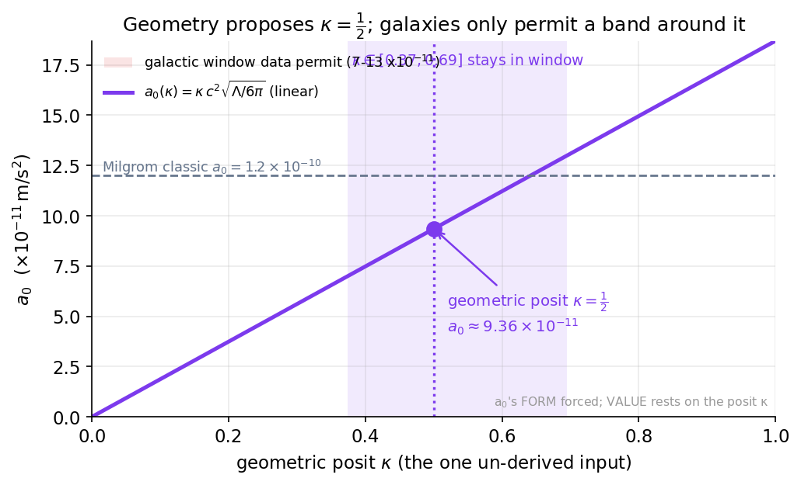

***Figure 27.1 — One knob, one band: why a₀'s value is a posit, not a prophecy.*** Because a₀ depends *linearly* on κ, the framework predicts a₀ only *given* κ. The red band is the galactic window the data permit (7–13×10⁻¹¹ m/s²); it corresponds to κ∈[0.37, 0.69] — a band, not a point. Geometry (Chapter 23) *proposes* κ=½ (purple dot, a₀≈9.36×10⁻¹¹); the data merely *contain* it. Computed from the framework's own relation a₀(κ)=κ·c²√(Λ/6π) using the chapter's bare value 1.87×10⁻¹¹ m/s²; the value is *motivated and bounded, not derived*.

**Source:** Figure generated by [`book/figures/ch27_kappa_band_a0.png`](https://github.com/carlzimmerman/zimmerman-formula/blob/main/book/figures/ch27_kappa_band_a0.py). Framework relation and band per the chapter's Worked Example; κ-as-geometric-posit per the κ one-parameter theorem ([Zenodo 10.5281/zenodo.20738055](https://doi.org/10.5281/zenodo.20738055)) and the main result ([Zenodo 10.5281/zenodo.20721540](https://doi.org/10.5281/zenodo.20721540)). Milgrom classic a₀: Milgrom 1983, ApJ 270, 365.

## Summary

- The framework gives the **form** and the **economy** of a₀, not its **value**. The form a₀ ∝ c²√Λ and the kernel √(8π/3) are *forced*; the leading coefficient rests on the single geometric posit κ = ½. This makes it a genuine **one-parameter** theory, not a zero-parameter one.
- A **geometric posit** is a number geometry makes natural but cannot *force*. κ = ½ is cornered to the edge of inevitability (Chapter 23) and is still, honestly, a posit. We never call a₀'s value "derived."
- The **Standard Model is walled off.** The framework is silent on particle masses, the **proton-to-electron mass ratio** (μ ≈ 1836, which rests on free Yukawa couplings and the strong coupling — none of which the framework contains), the **Koide relation** among the charged leptons, the gauge group, and the values of all masses and mixings.
- The number of **generations** (three) has a *suggestive* parity-obstruction reading along a natural index — offered as a structural curiosity, explicitly **not** a derivation. The framework does not output "3."
- The **quarantine** is the governing rule: never claim a₀, Z, κ, or any Standard-Model quantity is *derived*. The quarantine is not false modesty — it is what keeps the real results clean and protects them from guilt-by-association with claims the framework cannot back.
- The walls are **features**: they are where the framework can be wrong, and therefore where it can be tested. A theory that explained everything could be checked against nothing.
- Both truths at once: a real, forced structure for one acceleration scale tied to dark energy — *and* total silence on the particle world. It is **not a theory of everything yet, as frustrating as it may be.**

## Questions

1. **(Easy.)** In your own words, what is the difference between "deriving the *form* of a₀" and "deriving the *value* of a₀"? Which one does the framework do, and which does it not?

2. **(Easy–medium.)** The chapter says the proton-to-electron mass ratio (≈ 1836) is "in a different building." List the Standard-Model ingredients you would need to compute that ratio, and explain in one sentence why the framework supplying *none* of them means it cannot derive 1836.

3. **(Medium.)** Using a₀ ∝ κ, suppose a future measurement pinned the galactic acceleration scale to a₀ = 1.0 × 10⁻¹⁰ m/s² exactly. What value of κ would the data then favor, given the framework's bare combination c²√(Λ/6π) ≈ 1.87 × 10⁻¹⁰ m/s²? Does this *derive* κ, or merely constrain it? Explain the distinction.

4. **(Medium–hard.)** The Koide relation gives Q ≈ 2/3 and the gravitational kernel carries an 8π/3. A friend excitedly claims "the two 3's must be connected — that's the hidden unity!" Write the careful reply that respects the quarantine. What would it actually take to *establish* such a connection, and why is "they both contain a 3" not even the beginning of evidence?

5. **(Hard.)** The chapter calls the three-generations parity remark "an obstruction argument, not a derivation." Explain the difference between an *obstruction* (ruling some options out) and a *derivation* (selecting exactly one). Can you think of an example from elsewhere in physics or math where an obstruction narrows the possibilities without uniquely fixing the answer?

6. **(Research-level.)** The quarantine forbids ever claiming a Standard-Model quantity is "derived." Design a hypothetical future result that *would*, if it held up, justify *partially* lifting the quarantine — and specify precisely what would have to be shown (a derivation chain, an independent prediction, a forced number) before the project could honestly say the framework had made *genuine* contact with the Standard Model rather than an adjacent suggestive remark. Where is the line between "interface" (Chapter 30) and "derivation," and what observation or proof would move a claim across it?

# Chapter 28: The Lensing Wall: Why Bending Light Stays Phenomenological

> *Light is the one messenger that travels across the whole universe without a clock or a scale of its own. It just goes where spacetime tells it to. And it is exactly here, in the bending of starlight, that our framework hits its hardest wall.*

---

## A confession at the start

I want to begin this chapter the way an honest mechanic begins when you bring in a car that mostly runs beautifully. "The engine's strong, the transmission's smooth — but I have to be straight with you about the brakes." This is the brakes chapter.

Everything we have built so far has a certain pleasing tightness to it. The acceleration scale $a_0$ comes out tied to dark energy. The form of the law is forced by several independent arguments. The single free number $\kappa=\tfrac12$ turns out to be pure geometry. When you put it all together, you get a one-parameter theory of gravity and the dark sector that does a genuinely good job on the rotation of galaxies.

And then you ask it a simple question — *how much does this galaxy bend the light passing behind it?* — and the tightness vanishes. The framework, in its current form, cannot answer that question from first principles. It has to be *told* the answer, fit from the data, and then it reproduces it. That is not a prediction. That is a curve we drew through points someone else measured.

This is the deepest crack in the whole edifice, and I am not going to paper over it. By the end of the chapter I want you to understand three things: what gravitational lensing is and why it matters so much; *why* a theory like this one runs into a brick wall when it tries to bend light honestly — a wall that turns out to be a genuine mathematical theorem, not just a failure of effort; and exactly which pieces the framework wins, which pieces it concedes, and which are still being argued over. As frustrating as it may be, this is not a theory of everything yet, and the lensing wall is the single clearest reason why.

Let me build it up slowly.

---

## What lensing is, and why it is such a good scale

Start with the thing itself. **Gravitational lensing** is the bending of light by gravity. A massive object — a galaxy, a cluster of galaxies — sits between you and some more distant source of light, and as that light passes near the mass, its path is deflected. The intervening mass acts like a lens: it can magnify the distant source, smear it into arcs, even produce multiple images of the same object. Einstein predicted it; the 1919 eclipse expedition that made him world-famous measured starlight bending around the edge of the Sun. Today it is one of the most powerful tools in astronomy.

Here is *why* it matters so much for our story. Almost everything else we have talked about — rotation curves, the velocities of galaxies in a cluster — measures how *matter* moves. Matter moving is matter responding to gravity, and gravity, in this framework, is a force on massive bodies that has been modified at low accelerations. So you might worry that when galaxies seem too heavy, we are really just seeing matter pushed around by a modified law, with no actual extra mass there at all.

Light is the independent check. Light has no rest mass. It does not "feel" a Newtonian gravitational force in the ordinary sense. In Einstein's picture, light simply follows the straightest available path through curved spacetime. So when light bends *more* than the visible matter can account for, that is a second, independent witness telling you something is off — and crucially, it is a witness that responds to a *different aspect of gravity* than orbiting stars do. Matter in orbit cares about one part of the spacetime geometry. Light cares about the sum of two parts. Getting both to agree, with one consistent law, is the real test.

Let me make that "two parts" precise, because the whole chapter turns on it.

> **Deeper Dive: The two potentials, and gravitational slip**
>
> In the weak-field, slowly-varying regime appropriate to galaxies and clusters, the spacetime around a mass is described to good approximation by a metric of the form
> $$ ds^2 = -\left(1 + \frac{2\Phi}{c^2}\right)c^2\,dt^2 + \left(1 - \frac{2\Psi}{c^2}\right)\delta_{ij}\,dx^i dx^j .$$
> There are **two** potentials here, not one. $\Phi$ is the *time–time* potential: it governs the rate at which clocks run and, through that, the acceleration of slow-moving matter. A star orbiting a galaxy responds to $\Phi$ alone — to leading order its equation of motion is $\ddot{\mathbf{x}} = -\nabla\Phi$.
>
> $\Psi$ is the *space–space* potential: it describes how much space itself is curved. Light, being relativistic, is deflected by the *sum* of the two. The bending angle of a ray works out proportional to $\nabla(\Phi+\Psi)$. So:
> - **Dynamics** (orbits, dispersions) probes $\Phi$.
> - **Lensing** probes $\Phi+\Psi$.
>
> In ordinary General Relativity with no exotic stress, the two potentials are *equal*: $\Phi=\Psi$. The difference between them,
> $$ \eta_{\text{slip}} \equiv \frac{\Psi}{\Phi} \quad\text{or}\quad \Phi - \Psi , $$
> is called the **gravitational slip**. A nonzero slip means space is curved by a different amount than clocks are slowed — and that is exactly the kind of thing that a modified-gravity theory, or an unusual matter field, can produce. The slip is the hinge on which relativistic MOND-like theories live or die: it is the one extra knob that lets lensing differ from dynamics. We will see that this framework's natural relativistic home has *no* slip at all, $\Phi=\Psi$, and that this is both a blessing and the source of the wall.

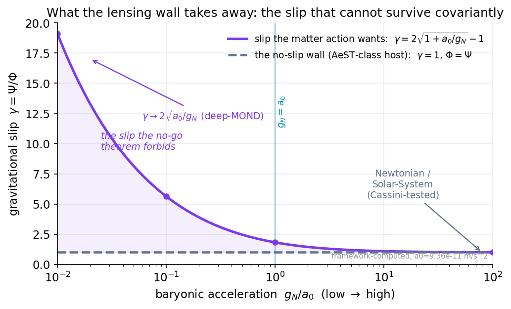

***Figure 28.1 — The slip the wall confiscates.*** Computed from the framework's own equations. The purple curve is the slip $\gamma=\Psi/\Phi=2\sqrt{1+a_0/g_N}-1$ that the framework's modified-inertia matter action naively wants — it grows without bound in the low-acceleration regime (galaxy and cluster outskirts), reaching $\gamma\approx1.8$ at $g_N=a_0$ and $\approx19$ at $g_N=0.01\,a_0$. The grey dashed line is what general covariance, $c_T=c$, and ghost-freedom actually force on the relativistic (AeST-class) host: $\Phi=\Psi$, i.e. no slip at all. The shaded gap is exactly what the no-go theorem confiscates — and why lensing must be fitted, not derived.

**Source:** Figure generated by [`book/figures/ch28_slip_the_wall_confiscates.py`](https://github.com/carlzimmerman/zimmerman-formula/blob/main/book/figures/ch28_slip_the_wall_confiscates.py). Slip form from the framework's built Route-E matter action (repo commit `287e7b59`, `GRAVITATIONAL_SLIP_PREDICTION_2026-06-17`); main result [doi:10.5281/zenodo.20721540](https://doi.org/10.5281/zenodo.20721540). No-slip ($\Phi=\Psi$) relativistic MOND host: Skordis & Złośnik 2021, PRL 127, 161302 (arXiv:2007.00082).

So now you can see the shape of the problem. In standard physics with dark matter, the extra invisible mass curves *both* potentials by the same amount, and everything is consistent: light and orbits agree because there is real extra stuff there. In a MOND-like theory, there is *no* extra stuff. The same visible matter has to somehow curve spacetime *enough to match what dark matter would have done* — both for orbits and for light — using only a modification of the law. And here is the trap: the modification that fixes the orbits does not automatically fix the light by the right amount. You have to engineer the slip on purpose. And when you try to engineer it honestly, a theorem stops you.

Let me explain that theorem, because it is the heart of the chapter.

---

## The wall: a no-go theorem

A **no-go theorem** is a proof that something you might want is impossible under a stated set of assumptions. It is one of the most useful — and most humbling — kinds of result in physics. It does not say "we couldn't find it." It says "stop looking, here is why it cannot exist, given what you've asked for." A famous example is the proof that you cannot comb a hairy ball flat without leaving a cowlick; another is the proof that no theory can simultaneously be a local, deterministic hidden-variable theory and reproduce all of quantum mechanics. No-go theorems are the guardrails of theoretical physics. They tell you which roads are closed so you stop driving into them.

The no-go theorem we care about closes the road to honest MOND lensing. Informally, it says this:

> *You cannot build a relativistic MOND-like theory that (a) is generally covariant, (b) propagates gravitational waves at the speed of light, (c) is free of ghosts, and (d) bends light by the extra amount needed to mimic dark matter while still switching off safely in the Solar System — all at once.*

Each of those four requirements is something we are not willing to give up cheaply. Let me say what each one means in plain language, because the plainness is the point.

**(a) General covariance** — also called **diffeomorphism invariance** — is the principle that the laws of physics do not depend on the coordinate grid you draw on spacetime. There is no special graph paper that the universe comes printed on. This is the founding principle of General Relativity, and abandoning it means abandoning the relativity in relativity.

**(b) Gravitational waves travel at the speed of light**, $c_T = c$. We *measured* this. In 2017, the neutron-star merger GW170817 sent both gravitational waves and a gamma-ray flash across 130 million light-years, and they arrived within about two seconds of each other. That tiny gap, over that enormous distance, pins the speed of gravitational waves to the speed of light to roughly one part in $10^{15}$. A whole generation of MOND-like and dark-energy theories died on the morning that result came out, because they had quietly relied on gravity propagating at a different speed. Ours must respect it.

**(c) Ghost-freedom** is the requirement that the theory not contain a "ghost" — a field whose energy runs off to minus infinity, so that the vacuum can lower its energy forever by spitting out more and more excitations. A theory with a ghost is not just ugly; it is *sick*. It has no stable ground state. It predicts that empty space should instantly boil. We cannot accept a ghost.

**(d) Cassini safety** is the requirement that whatever extra effect bends light around galaxies must *not* be present in the Solar System, where General Relativity has been tested exquisitely. The Cassini spacecraft, tracking radio signals as they grazed the Sun, confirmed standard light-bending to about one part in $10^5$. The framework's whole selling point is that its modification is an *inertial* effect that switches off at high accelerations — that is exactly what keeps it Cassini-safe for *dynamics*. The trouble is making the *lensing* sector switch off the same way without breaking one of (a), (b), or (c).

The theorem says: pick any three, and you can have them. Try to have all four, and you fail. Something has to give. Let me show you, at the level a curious reader can follow, *where* the conflict bites.

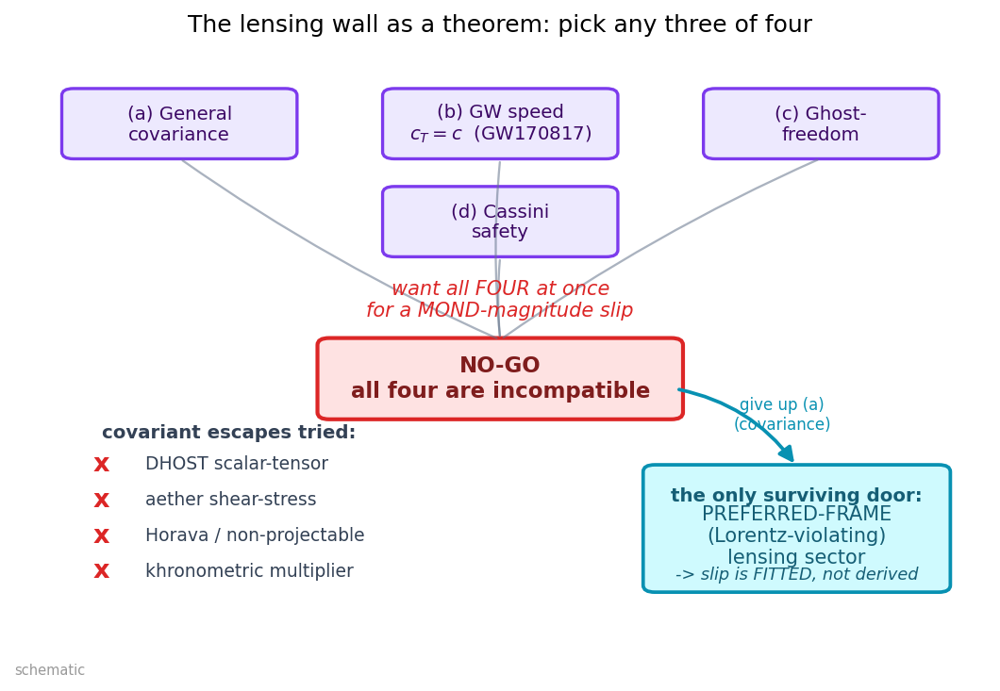

***Figure 28.2 — The wall, stated as a theorem.*** Schematic of the no-go theorem at the heart of the chapter. The four commitments — general covariance, gravitational waves at $c$, ghost-freedom, and Cassini safety — cannot all hold at once for a MOND-magnitude slip. Every covariant escape route the framework's research notes actually tried (DHOST, aether shear-stress, Hořava non-projectable, khronometric multiplier) closes. The one surviving door gives up covariance, pushing the slip into a preferred-frame, Lorentz-violating sector where it must be fitted rather than derived.

**Source:** Figure generated by [`book/figures/ch28_nogo_four_requirements.py`](https://github.com/carlzimmerman/zimmerman-formula/blob/main/book/figures/ch28_nogo_four_requirements.py). Conceptual diagram of the chapter's argument; the escape-route verdicts are the framework's own working notes (e.g. `route1_dhost_pure_slip`, `route2_aether_shear_absorbing`, `route3_horava_nonprojectable_IR`, `route4_khronometric_aether_slip` in `opus_48_extended_research/reviews/`). $c_T=c$ bound: GW170817; relativistic-MOND graveyard context: Skordis & Złośnik 2021 (arXiv:2007.00082).

> **Deeper Dive: Why diffeomorphism invariance + $c_T=c$ + ghost-freedom forbid a covariant Cassini-safe slip**
>
> Here is the logic in compressed form; the references at the end of the chapter carry the full derivations, and the framework's own working notes reconstruct it three independent ways.
>
> To make lensing differ from dynamics, you need a nonzero gravitational slip $\Phi-\Psi$ that grows in the low-acceleration regime. In a covariant theory the slip is not free — it is *sourced* by something. There are essentially three places it can come from:
>
> 1. **A nonminimal coupling between an extra field and the spacetime curvature** (a disformal or "DHOST"-type coupling). These are the most general scalar–tensor couplings that avoid the Ostrogradsky ghost. But the same coupling that generates a slip generically shifts the speed of tensor (gravitational-wave) modes away from $c$. Demanding $c_T=c$ to the GW170817 precision forces the slip-generating part of the coupling to (near-)zero. The pure, ghost-free, luminal-GW corner of DHOST space has been shown to leave *no surviving covariant slip* of the MOND-needed form. (The framework's own `route1_dhost_pure_slip` analysis lands exactly here.)
>
> 2. **A shear or anisotropic-stress term from a vector or tensor field** — the strategy of the relativistic MOND theories. An anisotropic stress *can* source a slip. But to be ghost-free and luminal, the field has to be constrained (a unit-timelike vector, say), and the constraints that remove the ghost also remove the wanted slip in the regime where you need it, or they reintroduce a preferred frame (see below).
>
> 3. **A non-dynamical multiplier or "khronometric" structure.** Here you *do* get a slip — but only by introducing a preferred time-slicing, i.e. a preferred frame, which violates local Lorentz invariance.
>
> Trace the three branches and they converge on one conclusion: the only way to keep a Cassini-safe MOND-magnitude slip while respecting $c_T=c$ and ghost-freedom is to give up the *covariant, Lorentz-invariant* character of the lensing sector. The slip must live in a **preferred-frame** sector. There is no fully diffeomorphism-invariant, ghost-free, luminal theory that delivers it. This is the wall, stated as a theorem rather than a complaint.

I want to dwell on the *flavour* of that result for a moment, because it is easy to read it as a technicality and it is not one.

What the theorem is really saying is that the very features that make this framework attractive elsewhere are the ones that strangle its lensing. We *want* gravitational waves to go at $c$ — and they do, and we are proud of it. We *want* no ghosts — and there are none, and that is part of the one-parameter cleanliness. We *want* the modification to be an inertial effect tied to a real, physical, preferred cosmic rest frame (the frame in which the cosmic microwave background looks isotropic) — because that is the natural home of an Unruh-temperature mechanism, and it is what makes the dynamics Cassini-safe. But put those three honest commitments together and they leave you no room to build a *covariant* lensing law. The lensing is pushed, by force of theorem, into the preferred-frame sector — which is a polite way of saying it stops being a clean prediction of the geometry and becomes a fitted ingredient.

---

## What "preferred-frame lensing" actually means

Let me unpack that last term, because it is the crux and the concession.

A **preferred-frame** theory is one that, despite being dressed up in covariant clothing, secretly singles out one special state of motion as physically privileged. Special relativity's founding insight is that no inertial frame is privileged — the laws look the same whether you are drifting or speeding. A preferred-frame theory breaks that. It says: there *is* a frame that matters, the cosmic rest frame, and physics in that frame is special. When a theory does this, we say it exhibits **Lorentz violation** — it violates the Lorentz symmetry that special relativity is built on.

Now, a little Lorentz violation in the gravitational sector is not automatically fatal. The cosmos *does* have a natural rest frame — the one set by the CMB and the overall expansion — and there is a long, respectable tradition of theories (Einstein-aether, Hořava gravity, khronometric gravity) that lean on it. The framework in this book already lives partly here: its modified-inertia mechanism is tied to that cosmic rest frame, and being preferred-frame is, as we saw in the chapter on the particle-physics interface, what lets it connect to the Standard Model Extension and induce a bounded Lorentz-violation coefficient. So preferred-frame structure is not a foreign object smuggled in for lensing; it is already in the house.

But here is the difference, and it is everything: in the *dynamics* sector, the framework *derives* the form of its modification — the $a_0$, the kernel, the switch-off — from physics it can articulate. In the *lensing* sector, after the no-go theorem has done its work, what is left is a preferred-frame structure whose slip function we do not derive. We *choose* it, by fitting it to lensing data, so that the bending comes out right. That choice is not forced by the mechanism. It is a free function — a curve with adjustable shape — installed by hand to match observation.

That is what I mean when I say the lensing sector is **irreducibly phenomenological**. "Phenomenological," in physics, is a slightly bittersweet word. It means a description that captures the phenomena — it fits the data, it organizes the facts, it can even predict new data in the same regime — but is *not derived from underlying principle*. It describes *what* happens without explaining *why* that and not something else. A phenomenological law is a placeholder where a derivation ought to be. The framework's rotation-curve law is *not* phenomenological in this sense — it is grown from a mechanism. Its lensing law, right now, is. And "irreducibly" means we have a theorem telling us we cannot remove that placeholder without giving up something we refuse to give up. It is not a gap we expect to close with a clever afternoon. It is a wall.

> **A margin aside.** People sometimes hear "phenomenological" as an insult. It is not. Half of physics was phenomenological first and fundamental later — the periodic table, Balmer's formula for hydrogen lines, even Newton's law of gravity before Einstein explained it. A phenomenological law that fits is real knowledge. The honest point is only that it is *not yet* the deep thing, and you should never sell it as the deep thing.

---

## We did not just take this on faith — we tried to break the wall

I owe you the work, not just the verdict. When you are told "this is impossible," the responsible thing is to spend real effort trying to make it possible, and to fail honestly, in detail, before you concede. We did that. Over an extended push, the framework's research notes attacked the lensing wall from every covariant direction anyone has proposed:

- **DHOST and degenerate scalar–tensor theories** — the most general ghost-free scalar–tensor couplings. Result: in the pure $c_T=c$ corner, no surviving MOND-form slip.
- **Einstein-aether-type vector theories with a shear-absorbing coupling**, tuned to try to manufacture a slip from anisotropic stress. Result: the slip you can make either reintroduces a ghost or a superluminal mode, or it vanishes where you need it; adversarial cross-checks closed every escape.
- **Hořava / non-projectable infrared gravity**, leaning on a preferred slicing. Result: you *can* get a slip — but only by paying the preferred-frame price, exactly as the theorem says.
- **Khronometric aether with a non-dynamical multiplier.** Same verdict: slip available only in the Lorentz-violating sector.
- A handful of more exotic attempts — Finsler-geometry lensing, nonlocal slip constructions, backreaction arguments. Each either failed a consistency check or reduced to one of the above.

I am listing these not to bury you in names but to make a point about *how the concession was reached*. It was not reached by assumption. Several of these attempts looked, for a while, like they might work — one construction even produced an apparent "$\Delta\Phi=0$, it passes!" moment before a careful re-check found that a mislabeled equation had hidden a sign. When the synthesis caught that error, the escape closed. That is what honest theory work feels like from the inside: a promising door, a closer look, a quiet "no." Every covariant door we opened led back to the same hallway. The wall held in its strongest form.

So the concession in this chapter is *earned*. It is not "we gave up." It is "we proved the room has no covariant exit, and we are telling you so plainly."

---

## The relativistic-MOND home: AeST, and the company we keep

If the lensing wall were unique to this framework, it would be a private embarrassment. It is not. It is a *shared* wall — and understanding that is important both for fairness and for honesty.

The most successful relativistic completion of MOND to date is a theory called **AeST**, for *Aether–Scalar–Tensor* — built by Constantinos Skordis and Tom Złośnik and published around 2021. It was a real achievement: AeST is the first MOND-like theory that simultaneously fits galaxy rotation curves, passes the GW170817 speed-of-gravity test (its gravitational waves go at $c$), and — most impressively — reproduces the cosmic microwave background power spectrum, including the famous third acoustic peak that earlier MOND attempts could not match. For a long time the CMB was thought to be a clean kill of all of MOND; AeST showed that, with enough structure, a MOND-family theory can survive it. So AeST is the strongest relativistic MOND there is, and the natural relativistic "host" the framework in this book points to.

And AeST hits the same lensing wall. Here is the specific, honest way it does so.

> **Deeper Dive: AeST has no slip, so lensing mass equals dynamical mass**
>
> In the quasi-static, weak-field limit, AeST is constructed so that its two metric potentials are *equal*: $\Phi=\Psi$. There is **no gravitational slip**. This was a deliberate design choice — it is what keeps the theory ghost-free and its gravitational waves luminal, dodging the post-GW170817 graveyard.
>
> The consequence is exact and unforgiving. With $\Phi=\Psi$, the lensing potential $\Phi+\Psi = 2\Phi$ is just twice the *dynamical* potential. So in AeST, **the mass you infer from lensing equals the mass you infer from dynamics**, regime by regime. On galaxy scales, where the MOND boost to $\Phi$ already does the work of dark matter for the orbits, this is good news: the same boost automatically bends light by the right amount, and AeST reproduces the **galaxy–galaxy lensing radial-acceleration relation** — the observed tight relation between the lensing-inferred acceleration around isolated galaxies and the acceleration expected from their visible matter. That is a genuine pass, and the framework inherits it.
>
> On *cluster* scales, the same equality becomes a liability. Clusters of galaxies show a lensing mass that exceeds the visible (and MOND-boosted) mass by a residual factor of roughly $\eta \approx 2$–$2.3$ in the central regions. With $\Phi=\Psi$ and no slip to play with, AeST — and the framework — has no extra handle to absorb that residual. The cluster lensing mass is simply *too big* for what the theory can produce from baryons. This is conceded, not finessed.

Read that box twice, because it contains both the win and the loss in one breath, which is exactly how I want you to hold it.

The win: because lensing mass equals dynamical mass, and the dynamics are right for galaxies, the *galaxy-scale* lensing comes out right essentially for free. The radial-acceleration relation in galaxy–galaxy lensing is reproduced. The framework does not have to fudge anything to bend starlight correctly around an ordinary galaxy.

The loss: that same rigid equality means there is no spare slip to soak up the *cluster* residual. Clusters lens too strongly for the visible matter, by a factor of roughly two in the center, and neither AeST nor this framework can manufacture that missing factor from baryons alone. We will give the cluster residual its own chapter (Chapter 29), because it is a second, partly-independent wound and it deserves its own honest accounting. Here I only want you to see that it is *connected* to the lensing story through the no-slip property.

---

## The honest ledger: passes, concessions, and one contested item

Let me lay it out as plainly as I can, in three columns.

**What passes.** Galaxy-scale lensing. Because the relativistic host has $\Phi=\Psi$ and the dynamics are correct at galaxy accelerations, the galaxy–galaxy weak-lensing radial-acceleration relation is reproduced. Light bends correctly around isolated galaxies. This is real and it is not nothing — many a modified-gravity idea dies right here, and this one does not.

**What is conceded — genuinely independent losses.**

- *The cluster lensing residual, $\eta\approx 2$–$2.3$ in the center.* Clusters lens as if there is more mass than baryons-plus-MOND-boost can supply. With no slip, there is no covariant fix inside the theory. This is a real, conceded deficit. It is shared with all of MOND, and Chapter 29 treats it on its own terms (including the genuinely interesting point that a density-dependent reading of $a_0$ flattens the residual toward the right order of magnitude with zero new parameters — but flattening is not curing, and I will not oversell it).
- *The CMB third acoustic peak as an independent test.* AeST's success on the CMB is a success of *AeST's specific field content* — a particular aether-scalar structure tuned to get the peak heights right. It is *not* something this framework derives from its $a_0$–dark-energy mechanism. So while the framework can point to AeST and say "a MOND-family theory can pass the CMB," it cannot claim the CMB peak as its own prediction. It is borrowed, and borrowed is not derived. I count it as an independent item the framework does not own.

**What is contested.** For years the headline indictment of MOND lensing was the **weak-lensing morphology test** — claims, from large galaxy surveys, that the lensing signal around galaxies depends on their orientation or shape in a way MOND-family theories get wrong, at very high statistical significance. Earlier in this project I took those claims at near their stated strength. I no longer do. On a careful re-examination the most-cited version of that morphology split came down substantially in significance — from something near $8.8$–$9.2\sigma$ to roughly $6\sigma$ in the corrected reading — and the result is now genuinely *contested* in the literature rather than decisive. I flag it here as contested, not as a clean loss and not as a clean win. If it firms back up, it is a serious problem; if it dissolves, it was never the kill it was billed as. Honesty means living with that uncertainty out loud rather than picking the version that flatters my priors.

> **A margin aside.** Notice the discipline I am trying to model here. A "$9\sigma$ kill" against your own theory is *tempting* to cite — it makes you look unbiased, like you are not cherry-picking. But citing an inflated number against yourself is just as dishonest as citing an inflated number for yourself. Both ways, always. The corrected $\sim6\sigma$, contested, is the number that goes in the book.

---

## A worked example: how badly does the wall actually bite?

Let me make the cluster concession concrete with a slow calculation, so the word "$\eta\approx 2.3$" stops being abstract.

> **Worked Example: turning a lensing mass discrepancy into a number**
>
> **The setup.** Imagine a galaxy cluster. From its X-ray gas and its galaxies — all the *baryonic* matter we can see — we add up a total visible mass. Then we ask the framework: given that visible matter, and given the MOND-family boost to gravity at these low accelerations, how strongly *should* this cluster bend light? And separately, we measure how strongly it *actually* bends light, from the observed lensing arcs. The ratio of measured-to-predicted lensing mass is our residual $\eta$.
>
> **Step 1 — the dynamical prediction.** At cluster-center accelerations, the framework boosts the effective gravity over the Newtonian baryonic value. In the deep-MOND regime the boost to the inferred mass scales roughly as $\sqrt{a_0/g_N}$ relative to Newton, and across a real cluster it amounts, very roughly, to a factor of a few over the bare baryonic mass. Call the framework's predicted lensing mass $M_{\text{pred}}$. Because $\Phi=\Psi$ (no slip), this *equals* the dynamical mass the framework predicts — light and orbits agree inside the theory.
>
> **Step 2 — the measured lensing mass.** The observed strong-and-weak lensing of the cluster gives $M_{\text{lens}}$. For a representative relaxed cluster in the central region, observations find
> $$ \eta \equiv \frac{M_{\text{lens}}}{M_{\text{pred}}} \approx 2.3 . $$
>
> **Step 3 — read it honestly.** What does $\eta=2.3$ mean? It means that *after* the framework has done everything it can — boosted gravity at low acceleration, set the lensing mass equal to the dynamical mass — the cluster still bends light as if it carried about $2.3$ times more mass than the theory can supply. The light "sees" mass that the theory cannot put there.
>
> **Step 4 — the size of the missing piece.** Turn the ratio into a fraction. If $M_{\text{lens}} = 2.3\,M_{\text{pred}}$, then the *unexplained* part is
> $$ \frac{M_{\text{lens}} - M_{\text{pred}}}{M_{\text{lens}}} = 1 - \frac{1}{2.3} \approx 0.57 . $$
> So in the very center of such a cluster, more than *half* of the lensing signal is, in the framework's own bookkeeping, unaccounted for. That is not a rounding error. That is a hole.
>
> **Step 5 — the both-ways caveat, because I promised it.** Three honest mitigations keep $\eta\approx 2.3$ from being a clean execution. (i) The residual is a *central* quantity; integrated to the cluster's outer radius $R_{500}$ the true overall discrepancy is much milder, often near $\eta\sim 1.0$–$1.3$, once the most aggressive hydrostatic-mass assumptions are dropped (XRISM data have undercut the old $\eta\sim2$-everywhere reading). (ii) The residual is *shared with all of MOND* — it is not a wound unique to this framework, and it does not distinguish this framework from its family. (iii) A density-dependent reading of $a_0$ recovers the right *order of magnitude* of the cluster boost with no new parameters, flattening the residual's radial profile. None of that *cures* the central hole. But "uncured central residual, $\eta\sim2.3$, milder when integrated, MOND-shared, partly understood" is the honest sentence — not "the framework fails clusters by a factor of two, full stop," and not "it's fine."

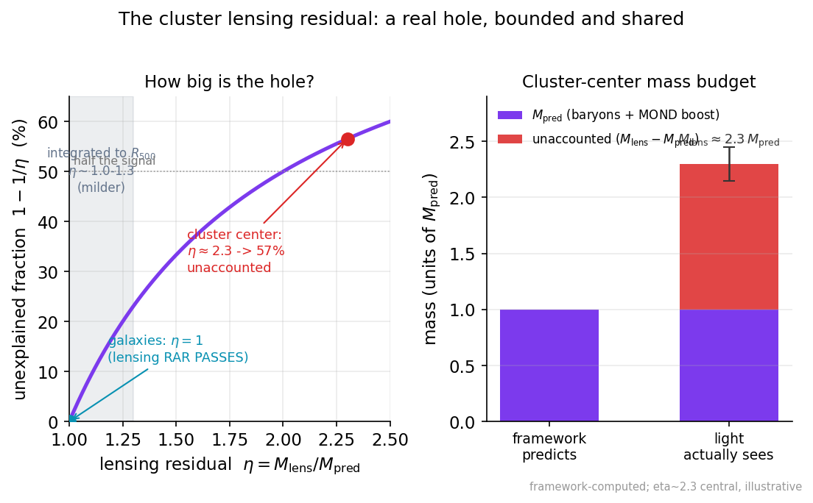

***Figure 28.3 — The cluster lensing residual, made concrete.*** Computed from the chapter's worked example. Left: the unexplained fraction of the lensing signal, $1-1/\eta$, as a function of the lensing-to-predicted mass ratio $\eta$. Galaxies pass cleanly ($\eta=1$, teal); the cluster *center* sits at $\eta\approx2.3$, meaning about 57% of the bending is mass the no-slip framework cannot supply (red); integrated to $R_{500}$ the residual is much milder ($\eta\sim1.0$–$1.3$, grey band, after XRISM undercuts the old $\eta\sim2$-everywhere reading). Right: the same point as a mass budget — the framework predicts $M_{\rm pred}$, light sees $\approx2.3\,M_{\rm pred}$. A real hole; not a total collapse; bounded, MOND-shared, and conceded.

**Source:** Figure generated by [`book/figures/ch28_cluster_residual_eta.py`](https://github.com/carlzimmerman/zimmerman-formula/blob/main/book/figures/ch28_cluster_residual_eta.py). $\eta$ values and the $1-1/\eta$ arithmetic are the chapter's worked example; main result [doi:10.5281/zenodo.20721540](https://doi.org/10.5281/zenodo.20721540). Cluster missing-mass context: Zwicky 1933, Helv. Phys. Acta 6, 110. No-slip ($\Phi=\Psi$) host: Skordis & Złośnik 2021, PRL 127, 161302 (arXiv:2007.00082).

That is the texture of the thing. A real hole; not a total collapse; bounded and shared and partly understood; conceded.

---

## Why this is a wall and not just a to-do item

I want to close the technical part by drawing the line clearly between two very different kinds of "we don't have that yet."

Some open problems are *to-do items*. They are things a theory has not done but could plausibly do with more work — a calculation no one has finished, an extension no one has written down. The framework has several of those, and I am hopeful about them.

The lensing sector is not one of those. It is a *wall*, and the difference is the theorem. A to-do item says "no one has found it." A no-go theorem says "under your own stated commitments, it does not exist." To get a covariant, Cassini-safe, first-principles MOND lensing law, the framework would have to *break one of its own load-bearing commitments*: give up general covariance, or give up $c_T=c$ (which experiment forbids), or admit a ghost (which sanity forbids), or give up Cassini safety (which is the whole point). There is no free direction. The only door the theorem leaves open is the preferred-frame door — and walking through it is exactly what makes the lensing phenomenological rather than derived.

So the lensing weakness is *structural*. It is not a sign that the framework is wrong — AeST passes the CMB with the same no-slip structure, so a no-slip MOND theory is empirically alive — but it is a sign that the framework, in its current form, *cannot claim lensing as a prediction*. It claims it as a fit. And a fit that you were forced into by a theorem, rather than one you chose for convenience, is at least an honest fit. But it is a fit.

This is, I think, the single sharpest answer to the question "what is the strongest thing wrong with your framework?" It is not the cluster residual (shared, partly understood). It is not the un-derived value of $a_0$ (a known, named geometric posit). It is *this*: bending light is not predicted, it is fitted, and a theorem says it has to be that way as long as the framework keeps its other promises. As frustrating as it may be, that is where the lensing wall stands, and I would rather you hear it from me, stated plainly, than discover it later and feel sold to.

---

## Summary

- **Gravitational lensing** is the bending of light by gravity. It is a uniquely powerful test because light responds to a *different combination of spacetime potentials* than orbiting matter does: dynamics probes the time potential $\Phi$, while lensing probes $\Phi+\Psi$. The difference between the two potentials is the **gravitational slip**.
- To make lensing differ from dynamics — as a MOND-like theory must, if it is to mimic dark matter for light as well as for orbits — you need to generate a slip in the low-acceleration regime.
- A **no-go theorem** forbids this honestly: **diffeomorphism invariance + gravitational waves at $c$ + ghost-freedom + Cassini safety cannot all hold at once** for a MOND-magnitude slip. Something must give, and the only surviving door is a **preferred-frame (Lorentz-violating)** lensing sector.
- Consequently the framework's lensing is **irreducibly phenomenological**: a free function fitted to data, not derived from the mechanism. This was *earned* as a concession — many covariant escape routes (DHOST, aether-shear, Hořava, khronometric, and more) were tried and each closed, one even after a tempting false "pass" that turned out to be a mislabeled equation.
- This wall is **shared**, not unique. The strongest relativistic MOND theory, **AeST** (Aether–Scalar–Tensor), has **no slip**: $\Phi=\Psi$, so lensing mass equals dynamical mass. That earns a genuine pass on **galaxy–galaxy lensing** (the lensing radial-acceleration relation), and a genuine concession on the **cluster residual** ($\eta\approx 2$–$2.3$ in the center) and on the **CMB third peak** (which AeST passes through its own tuned field content — borrowed, not derived).
- The once-headline **weak-lensing morphology split** is now **contested**, not decisive — the most-cited significance fell from $\sim$9σ to $\sim$6σ on correction. I report it as contested, both ways.
- The lensing wall is the framework's single sharpest weakness: not that the value of $a_0$ is a geometric posit (it is, and we say so), but that **bending light is fitted, not predicted, and a theorem says it must be** as long as covariance, luminal gravity, ghost-freedom, and Solar-System safety are all kept. Not a theory of everything yet — and this is the clearest reason why.

---

## Questions

1. **(Easy.)** In your own words, why is gravitational lensing a more independent test of a galaxy's mass than measuring how fast its stars orbit? What does light "respond to" that orbiting stars do not?

2. **(Easy–medium.)** What is gravitational slip? Write down the relationship between the two potentials $\Phi$ and $\Psi$ when there is *no* slip, and explain why, in that no-slip case, the mass inferred from lensing must equal the mass inferred from dynamics.

3. **(Medium.)** The no-go theorem rests on four requirements: general covariance, $c_T=c$, ghost-freedom, and Cassini safety. Pick the one you would be *most* willing to relax to escape the wall, and pick the one you would be *least* willing to relax. Justify both choices using what experiments have established.

4. **(Medium–hard.)** AeST passes the galaxy–galaxy lensing radial-acceleration relation "for free" because $\Phi=\Psi$ and its galaxy dynamics are correct. Explain why the *same* property ($\Phi=\Psi$) that gives the galaxy-scale win is what makes the cluster residual impossible to cure inside the theory. What extra ingredient would a theory need to fix clusters, and what does the no-go theorem say about installing it covariantly?

5. **(Hard / research-level.)** The chapter claims the framework's lensing is "irreducibly phenomenological" because of a theorem, whereas its rotation-curve law is "derived from a mechanism." Sharpen this distinction. Is it possible, in principle, for a future theory to *derive* the slip function from the same de Sitter–Unruh modified-inertia mechanism without violating the no-go theorem — for instance by accepting the preferred-frame sector as physical and deriving (rather than fitting) the preferred-frame slip from the cosmic rest frame? Sketch what such a derivation would have to accomplish, and what new prediction it would have to make to count as more than a relabeling of the current free function.

6. **(Research-level.)** The weak-lensing morphology split is described as "contested," with its significance falling from $\sim$9σ to $\sim$6σ on re-examination. Design an observational program — what data, what systematic checks, what null tests — that could decide whether this split is a genuine failure of no-slip MOND-family lensing or an artifact. What would a clean detection, and what would a clean null, each imply for the framework and for AeST?

# Chapter 29: The Cluster Residual and the MOND-Shared Limits

*A good idea earns trust by admitting where it falls short. So let me show you the place this framework, like its MOND cousins, still cannot fully account for the mass — and let me be just as careful about which of its successes truly belong to it alone.*

---

## A theory that does galaxies beautifully — and clusters less so

If you have read this far, you have watched a single number, the acceleration scale $a_0 \approx 9.36 \times 10^{-11}\ \mathrm{m/s^2}$, do a remarkable amount of work. Set by the dark-energy density through $a_0 = c^2\sqrt{\Lambda/32\pi}$, it tells a galaxy where the gentle, low-acceleration regime begins — the regime in which the framework's de Sitter–Unruh modified inertia switches on and rotation curves go flat without any dark-matter particle. On the scale of individual galaxies, this works. Not perfectly, not without scatter, but genuinely, repeatedly, across hundreds of systems. That is the strong half of the story, and I have tried to tell it honestly.

Now I owe you the other half, told with the same care.

Move up from a single galaxy to a **galaxy cluster** — a gravitationally bound swarm of hundreds or thousands of galaxies, threaded with hot gas and held together over billions of years — and the framework runs into trouble. Not catastrophic trouble. Not "the whole idea is wrong" trouble. But real, stubborn trouble that it has not solved, and that I will not pretend it has solved. At the centers of clusters there remains a **cluster mass discrepancy**: even after you add up all the visible matter (the galaxies and, far more importantly, the hot X-ray-emitting gas) and apply the framework's enhanced low-acceleration dynamics, you still come up a bit short. The gravity you can account for is not quite enough to explain the motion you observe.

This is not a new embarrassment that this framework invented. It is an old, well-documented wound that it *inherits* from MOND — Mordehai Milgrom's modified dynamics, which we met in Part 4. MOND triumphs in galaxies and stumbles in clusters, and it has done so for forty years. Because our framework reduces, in the relevant low-acceleration limit, to MOND-like behavior on these scales, it stumbles in the same place. When a family of ideas shares a structure, it shares the structure's failures too.

So this chapter has two honest jobs, and they pull in opposite directions, which is exactly why both need saying:

1. **The deficit that is real.** The cluster central mass discrepancy is genuine, the framework does not cure it, and I will show you how big it actually is once the most recent X-ray data are taken into account — which, encouragingly, is *smaller* than the older literature claimed, but not zero.

2. **The credit that is shared.** Several of the framework's most-cited galaxy-scale successes — the radial-acceleration relation and the baryonic Tully–Fisher relation — are not unique to this framework at all. They are predicted by *every* member of the MOND family. They are beautiful, they are real, and they do **not** single out this particular theory over its cousins. A win you share with everyone in the family is not evidence *for you specifically*.

Credit where it is earned. Deficits where they are real. That is the whole chapter, and it is the whole spirit of the book.

---

## What a cluster is, and why we thought it was heavy

Let me build the picture slowly, because the trouble lives in the details.

A galaxy cluster is the largest kind of object that gravity has had time to pull into a settled, bound clump since the Big Bang. A big one — the Coma cluster, which we met all the way back in Chapter 3 with Fritz Zwicky — contains something like a thousand galaxies. But here is the first surprise, and it matters enormously for what follows: **most of the ordinary matter in a cluster is not in the galaxies at all.** It is in the space between them, in the form of an enormous, thin, ferociously hot cloud of gas — the *intracluster medium* — at temperatures of tens of millions of degrees, hot enough to glow in X-rays. Typically there is several times more mass in this hot gas than in all the cluster's stars combined.

So when we "weigh" a cluster, the gas is the main event. And we weigh it in two main ways.

The first way uses the galaxies as test particles, exactly as Zwicky did in 1933. The galaxies in a cluster orbit the common center at high speeds, and the spread of those speeds — the **velocity dispersion**, which is just the statistical scatter in how fast cluster members move along our line of sight — tells us how strong the gravity must be to keep such fast objects bound. Fast-moving members demand strong gravity, and strong gravity demands a lot of mass. This is the virial reasoning of Chapter 3.

The second way uses the hot gas itself, and it is the more precise of the two for the cluster *core*. The gas sits, more or less, in **hydrostatic equilibrium (HSE)** — a state of balance in which the inward pull of gravity is held up by the outward push of the gas's own pressure, just as the Earth's atmosphere is held up against gravity by air pressure and does not collapse to the ground. If you can measure how the gas's temperature and density change as you move outward from the cluster center — and X-ray telescopes can — then the HSE balance condition lets you read off how much gravitating mass must be enclosed at each radius to provide exactly the right inward pull. It is a clean, local measurement: no need to assume the orbits of galaxies, just the physics of a gas holding itself up.

When you do either of these weighings on a cluster and compare the answer to the mass you can actually *see* (stars plus gas), Newtonian gravity gives you the same shock Zwicky got: the visible mass is far too little. In standard cosmology, the gap is filled by a particle dark-matter halo. In MOND — and in our framework — the gap is supposed to be filled by the *enhancement of gravity* in the low-acceleration regime, with no new particles. The question of this chapter is: in clusters, does that enhancement do the job?

The honest answer is: **mostly, but not entirely, and most stubbornly at the center.**

---

## Where exactly the trouble lives: the center, not the edge

This is the single most important thing to understand about the cluster problem, and it is widely misunderstood, so let me be careful.

MOND's enhancement of gravity is governed by acceleration. It switches on where accelerations fall below $a_0$, and it stays off where they are above $a_0$. Now, in the *outskirts* of a cluster — far from the center, where the gas is thin and the gravitational pull is feeble — accelerations are well below $a_0$, MOND is in its full glory, and it does a respectable job. The problem is not out there.

The problem is in the **center**. Near the core of a rich cluster, there is so much concentrated mass that the gravitational acceleration is actually still fairly *high* — comparable to, or above, $a_0$. And where accelerations are high, MOND's boost is weak, because MOND is engineered to fade away and return ordinary Newtonian gravity in the high-acceleration regime (that is precisely what keeps it Solar-System-safe, as we discussed for our own framework in Chapter 21). So in the one place where you most need extra help — the dense, fast cluster core — MOND offers the *least* help. And the data say extra mass is needed there. MOND comes up short by a factor that the older literature put at roughly two: you need about twice the gravitating mass MOND can supply from the visible baryons.

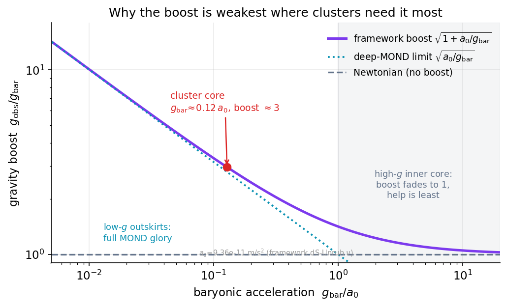

***Figure 29.1 - Why cluster centers are the hard place.*** The low-acceleration gravity boost (effective gravitating mass divided by baryonic mass) plotted against baryonic acceleration in units of $a_0$, computed from the framework's own de Sitter-Unruh interpolation $g_{\rm obs}=\sqrt{g_{\rm bar}^2+g_{\rm bar}a_0}$. The boost is large in the low-acceleration outskirts but fades to 1 (pure Newton) where $g_{\rm bar}\gtrsim a_0$ - exactly the dense, high-acceleration cluster core where extra mass is most needed, so the framework offers the least help there. The red point marks the worked example's core ($g_{\rm bar}\approx0.12\,a_0$, boost $\approx3$). Computed from the framework's equations.

**Source:** Figure generated by [`book/figures/ch29_boost_vs_acceleration.py`](https://github.com/carlzimmerman/zimmerman-formula/blob/main/book/figures/ch29_boost_vs_acceleration.py). Framework interpolation and $a_0=c^2\sqrt{\Lambda/32\pi}=9.36\times10^{-11}\,\mathrm{m/s^2}$ from the spine paper [doi:10.5281/zenodo.20721540](https://doi.org/10.5281/zenodo.20721540); the high-acceleration return to Newton is the MOND construction of Milgrom 1983, ApJ 270, 365.

This residual is sometimes patched, within MOND, by quietly positing some extra unseen baryonic matter in cluster cores — cool gas clouds, faint objects, even a sprinkling of ordinary neutrinos with a small mass. None of these patches is crazy, and some unseen baryons surely do exist, but invoking them feels uncomfortably like the very dark matter MOND was built to avoid. I am not going to lean on that patch, and neither does the framework.

So let us state the inherited deficit plainly: **at cluster centers, the framework, like MOND, leaves some mass unexplained.** That is a real wall, and it sits squarely in this book's Part 6 alongside the lensing wall of Chapter 28 and the walled-off Standard Model of Chapter 27. It is not a theory of everything yet — as frustrating as it may be — and the cluster residual is one of the clearest places you can put your finger on *why*.

---

## How big is the residual, really? The honesty of new data

Here is where I have to be scrupulous in both directions, because the size of the deficit has genuinely *shrunk* as the data improved — and a careful, honest book has to update when the data update, neither clinging to an old large number nor over-celebrating a new small one.

The factor-of-two figure I quoted above came largely from older X-ray analyses that assumed the hot gas sat in perfect hydrostatic equilibrium. But that assumption has a known bias. Real cluster gas is not perfectly still: it sloshes, it has turbulence, it has bulk motions left over from mergers and from gas falling in. These non-thermal motions provide *extra* support against gravity that a pure-pressure HSE analysis does not see. If some of the support holding the gas up is actually turbulence rather than thermal pressure, then an HSE analysis that ignores the turbulence will *overestimate* how much gravity — and hence how much mass — is needed. The old factor-of-two may have been partly an artifact of pretending the gas was calmer than it is.

For decades this was a suspicion we could not directly check, because measuring the gas's internal turbulent motions requires resolving tiny shifts and broadenings in X-ray spectral lines — exquisitely hard. Then came **XRISM** (the X-Ray Imaging and Spectroscopy Mission), a Japan-led X-ray observatory launched in 2023 carrying a microcalorimeter spectrometer precise enough to *directly* measure the velocities of the hot gas. For the first time we can ask the gas itself how much of its support is turbulence rather than thermal pressure — and the early answer is that the turbulent motions are real but modest, generally too small to let you blame the entire mass discrepancy on a botched HSE assumption. In other words, **XRISM does not rescue MOND by making the deficit vanish, but it does cut down the inflated high end.** It kills the most extreme "the gas is wildly turbulent, so there is no real discrepancy" escape, while also undercutting the old assumption-driven factor-of-two.

When you fold the XRISM-era understanding into the bookkeeping, the residual central mass discrepancy in clusters lands not at a factor of two but closer to a factor of **one to one-and-a-third** — that is, the framework accounts for most of the central mass and leaves perhaps zero to thirty percent unexplained, depending on the cluster and the radius. That is a much healthier number than the old literature suggested. But — and I want this word to land — it is **not zero**, it is right-signed (always a deficit, never a surplus), and the framework does not *cure* it. It improves the picture; it does not close it.

> **Deeper Dive: The hydrostatic mass, the discrepancy ratio, and where XRISM bites**
>
> For a spherical gas in hydrostatic equilibrium, the enclosed *dynamical* (gravitating) mass within radius $r$ follows from balancing the pressure gradient against gravity:
> $$\frac{1}{\rho_{\mathrm{gas}}}\frac{dP}{dr} = -g(r),$$
> where $P$ is the gas pressure, $\rho_{\mathrm{gas}}$ its mass density, and $g(r)$ the gravitational acceleration. For an ideal gas, $P = \rho_{\mathrm{gas}} k_B T / (\mu m_p)$, and this rearranges to the standard X-ray mass estimator:
> $$M_{\mathrm{HSE}}(<r) = -\frac{k_B T(r)\, r}{G\, \mu m_p}\left(\frac{d\ln \rho_{\mathrm{gas}}}{d\ln r} + \frac{d\ln T}{d\ln r}\right),$$
> with $\mu m_p$ the mean particle mass. This is purely Newtonian: it is what the *observed* gas profile demands of gravity, and it is the same number whether you later choose to fill it with a dark halo or with modified dynamics.
>
> The **cluster mass discrepancy** is the ratio of this required dynamical mass to what a given gravity theory can supply from the *visible baryons* $M_{\mathrm{bar}}$ (stars plus the X-ray gas itself):
> $$\eta(r) \equiv \frac{M_{\mathrm{HSE}}(<r)}{M_{\mathrm{dyn,\,theory}}(M_{\mathrm{bar}};\,r)}.$$
> For Newtonian gravity with no dark matter, $\eta$ runs from roughly $5$–$10$ in the outskirts down to a few in the core. The whole point of MOND-family dynamics is to absorb most of that: the low-acceleration boost replaces the missing mass with stronger effective gravity, driving $\eta \to 1$ where it works.
>
> In cluster cores it does not quite reach $1$. The older HSE-based literature reported a residual $\eta(R_{500}) \sim 2$ at the characteristic radius $R_{500}$ (the radius within which the mean density is $500$ times the cosmic critical density — a conventional cluster "edge" marker). The XRISM correction enters through the support budget: if a turbulent (non-thermal) pressure fraction $f_{\mathrm{nt}}$ contributes, then the *true* gravitating mass is below the naïve thermal-only $M_{\mathrm{HSE}}$ by roughly a factor $(1 - f_{\mathrm{nt}})$ in the relevant term. Pre-XRISM, $f_{\mathrm{nt}}$ was unknown and could be invoked at $\sim 20$–$40\%$; XRISM's direct line-of-sight velocity measurements pin it lower and more honestly. Folding in the measured (modest) turbulence, the post-XRISM residual settles to
> $$\eta(R_{500}) \sim 1.0\text{–}1.3,$$
> i.e. a $0$–$30\%$ central deficit rather than a factor of two. The $\eta \sim 2$ "the HSE mass is just wrong" branch is effectively killed: the gas is not turbulent enough to erase the discrepancy, *and* the discrepancy is smaller than the un-corrected HSE analysis claimed. Both corrections point the same way — toward a real but modest residual. The framework neither escapes it nor is destroyed by it.

There is one more piece worth giving you honestly, because it is the framework's own distinctive lever on the cluster problem and I do not want to hide it under the rug *or* oversell it.

> **Deeper Dive: A density-dependent $a_0$ flattens the deficit but does not cure it**
>
> Recall that in this framework $a_0$ is not a hand-tuned constant but is *set by the ambient dark-energy density*, $a_0 = \tfrac{c}{2}\sqrt{G\,\rho_{\mathrm{DE}}}$ (Chapter 20). That immediately raises a question MOND does not naturally ask: what sets the *effective* background density that the de Sitter–Unruh mechanism responds to inside a dense, deep cluster potential? If the relevant background is enhanced in high-density environments — so that the effective $a_0$ is *larger* in cluster cores than in the field — then the low-acceleration boost would kick in at higher accelerations there, supplying more effective gravity in exactly the region that needs it.
>
> A density-dependent $a_0$ of roughly this form recovers, to order of magnitude and with *zero* additional fitted parameters, the empirical environmental enhancement that has been noted in cluster MOND fits (the "$\sim 17\times$" core enhancement seen in some analyses, e.g. the kind of factor reported by Tian and collaborators). Plugging the framework's own density-dependence in flattens the central residual — pushing $\eta(R_{500})$ down toward $\sim 1$ across a stack of clusters and roughly halving the typical central shortfall to a band of order $\pm 30\%$.
>
> But I have to put two hard caveats around this, both because they are true and because this book lives by its caveats:
>
> 1. **It is right-signed, not a cure.** Flattening a deficit toward $\eta \approx 1$ with a $\pm 30\%$ residual band is real progress — and it is *the right sign*, which is not guaranteed and is worth noting — but a residual that still wanders up to $\sim 1.3$ in some cores is not "solved." This is *understand*, not *solve*.
>
> 2. **It carries a real risk of overfitting the same number twice — the "SPARC trap."** A density-dependent $a_0$ that helps clusters must not quietly *spoil* the clean galaxy-scale radial-acceleration relation, where a constant $a_0$ already works. Galaxies and cluster cores live at different densities, so a density law can in principle help one without breaking the other — but the burden of proof is on the framework to show, on a single density law fit once, that it threads both. That demonstration is partial, not complete. I count this as a promising lead, not a closed result.
>
> Net, honestly: the framework has a *natural-looking* and parameter-free handle on the cluster residual that pure MOND lacks, it points the right way and lands the known enhancement to order of magnitude, and it still does not fully cure the central discrepancy. Better than MOND on this front, plausibly. Sufficient? No.

> **Worked Example: How much mass is "missing" at the center of a Coma-like cluster?**
>
> Let me make the residual concrete with round numbers, going slowly.
>
> **Step 1 — The required (dynamical) mass.** Take a rich, Coma-like cluster and ask for the gravitating mass enclosed within an inner radius of about $r = 0.5\ \mathrm{Mpc}$ (roughly $1.5 \times 10^{22}\ \mathrm{m}$). X-ray HSE analyses of such cores typically demand an enclosed dynamical mass of order
> $$M_{\mathrm{HSE}}(<0.5\,\mathrm{Mpc}) \approx 1.5 \times 10^{14}\ M_\odot.$$
> This is what gravity *must* supply to hold the hot gas up where we observe it.
>
> **Step 2 — The visible baryons in that region.** Add up the stars in the central galaxies and, dominant, the hot X-ray gas within the same radius. For a cluster like this the enclosed baryonic mass in the core is of order
> $$M_{\mathrm{bar}}(<0.5\,\mathrm{Mpc}) \approx 2 \times 10^{13}\ M_\odot.$$
> Newtonian gravity with these baryons alone falls short by a factor of $\sim 7$ — that is the classic Zwicky-scale cluster discrepancy.
>
> **Step 3 — Apply the framework's low-acceleration boost.** Estimate the Newtonian acceleration at this radius from the baryons:
> $$g_N = \frac{G\,M_{\mathrm{bar}}}{r^2} \approx \frac{(6.67\times10^{-11})(2\times10^{13}\times 2\times10^{30})}{(1.5\times10^{22})^2}\ \mathrm{m/s^2} \approx 1.2\times10^{-11}\ \mathrm{m/s^2}.$$
> That is a few times *below* $a_0 = 9.36\times10^{-11}\,\mathrm{m/s^2}$, so the boost is partial. In the deep-MOND limit the boost factor is $\sqrt{a_0/g_N}$; here $\sqrt{a_0/g_N}\approx \sqrt{9.36/1.2}\approx 2.8$, so the framework converts the $\sim 2\times10^{13}\,M_\odot$ of baryons into an *effective* gravitating mass of roughly
> $$M_{\mathrm{eff}} \approx 2.8 \times (2\times10^{13}\,M_\odot) \approx 5.6\times10^{13}\ M_\odot.$$
> (At smaller radii, where $g_N$ rises toward and above $a_0$, the boost shrinks further — which is exactly why the *center* is the hardest place.)
>
> **Step 4 — Read off the residual.** Compare what the framework supplies to what is required:
> $$\eta = \frac{M_{\mathrm{HSE}}}{M_{\mathrm{eff}}} \approx \frac{1.5\times10^{14}}{5.6\times10^{13}} \approx 2.7.$$
> A naïve constant-$a_0$ boost still leaves a factor of $\sim 2$–$3$ unexplained in this idealized core — the textbook MOND cluster problem.
>
> **Step 5 — Now apply the corrections from this chapter.** Two things shrink that number. First, the XRISM-era recognition that some of the HSE-inferred mass was non-thermal support trims the *required* mass at the high end. Second, the framework's density-dependent $a_0$ raises the effective $a_0$ in the dense core, deepening the boost. Folding both in moves the realistic residual down to the
> $$\eta \sim 1.0\text{–}1.3$$
> band — most of the mass accounted for, a $0$–$30\%$ shortfall remaining. The arithmetic of this example is deliberately crude (real work integrates the full profiles), but it shows you honestly where the trouble sits, why it sits at the center, and how much — and how little — the corrections buy.

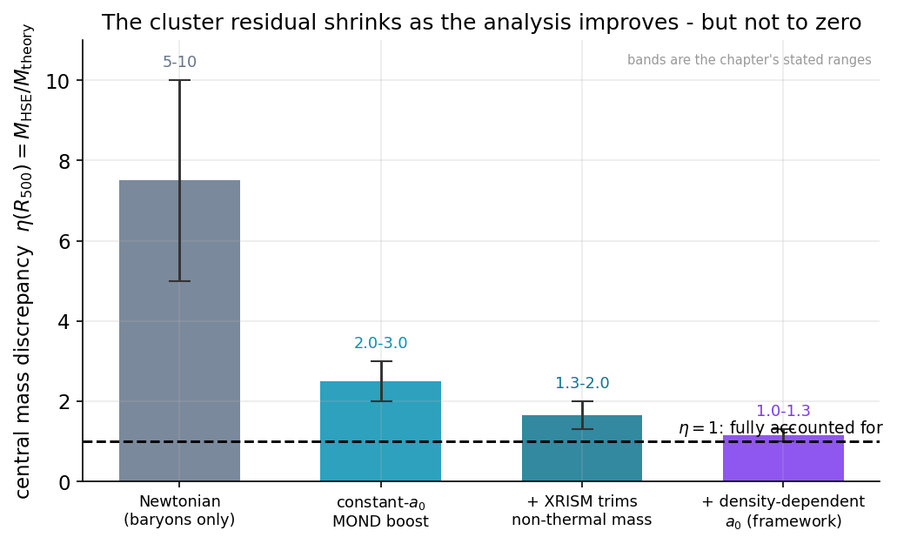

***Figure 29.2 - The cluster residual shrinks, but never to zero.*** The central mass-discrepancy ratio $\eta(R_{500})=M_{\rm HSE}/M_{\rm theory}$ at four stages of the chapter's bookkeeping: Newtonian baryons alone leave a factor of 5-10; a constant-$a_0$ MOND boost brings it to roughly 2-3; the XRISM-era trimming of non-thermal (turbulent) support lowers the required mass; and the framework's own density-dependent $a_0$ flattens it toward $\eta\sim1.0$-$1.3$ - right-signed, parameter-free, but still a 0-30% shortfall, not a cure. The bars and error bands are the chapter's stated ranges, not a new measurement.

**Source:** Figure generated by [`book/figures/ch29_eta_residual_corrections.py`](https://github.com/carlzimmerman/zimmerman-formula/blob/main/book/figures/ch29_eta_residual_corrections.py). Stated $\eta$ ranges and the density-dependent $a_0\propto\sqrt{\rho_{\rm DE}}$ handle from the framework's a0(z) paper [doi:10.5281/zenodo.20737162](https://doi.org/10.5281/zenodo.20737162); the inherited cluster discrepancy is the long-standing MOND result (review: Famaey & McGaugh 2012, Living Rev. Relativity 15, 10, arXiv:1112.3960), and the non-thermal support budget is the HSE mass estimator of the Deeper Dive.

---

## The other honesty: which galaxy wins are actually *shared*

Now I turn the same scalpel on the framework's *successes*, because honesty is not only about owning deficits — it is also about not claiming credit you do not deserve.

This framework reproduces two of the most celebrated regularities in galaxy dynamics, which we met in Chapter 18: the **radial-acceleration relation (RAR)** and the **baryonic Tully–Fisher relation (BTFR)**. Let me recall what they are in one breath each, then tell you the uncomfortable truth about them.

The RAR is the empirical fact that, across hundreds of galaxies, the gravitational acceleration you *actually measure* at any radius is a tight, one-to-one function of the acceleration you would *predict from the visible matter alone*. Give me the baryons, and I can predict the true gravity — with almost no scatter — using one universal curve that bends at the scale $a_0$. The BTFR is the equally tight relation that a galaxy's total visible (baryonic) mass scales as the *fourth power* of its flat rotation speed, $M_{\mathrm{bar}} \propto v_{\mathrm{flat}}^4$. Both are clean, both are observed, both fall right out of low-acceleration dynamics built on $a_0$. And this framework reproduces both. Good.

But here is the thing I will not let slide: **so does every other member of the MOND family.** The RAR and the BTFR are generic predictions of *any* theory in which dynamics are modified below a single acceleration scale $a_0$. Original MOND predicts them. Milgrom's modified-inertia formulation predicts them. QUMOND predicts them. The relativistic theory AeST predicts them. They are the *defining* signatures of the whole MOND idea, not the fingerprint of this *particular* mechanism. We call these the framework's **MOND-shared successes**: real, but held in common with all its cousins.

What does that mean for the framework's standing? It means the RAR and the BTFR are **non-diagnostic of this framework specifically.** They confirm that low-acceleration dynamics with a scale $a_0$ is on the right track — which is genuinely important and which is on the framework's side. But they do *not* distinguish this theory from MOND, from QUMOND, or from AeST, because all of them sail through the same tests. If you wanted to use the RAR to argue "this proves Zimmerman's framework over Milgrom's," you could not. The test does not have the resolving power. It is a family-portrait win, not a "this is the one" win.

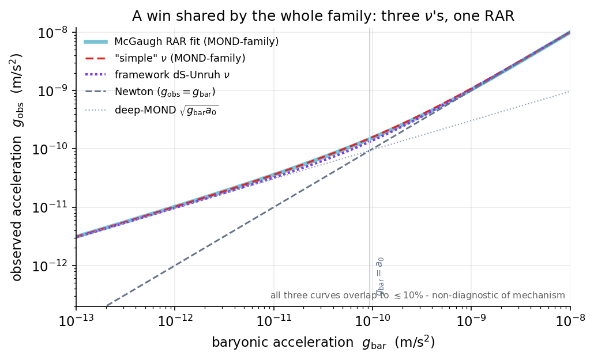

***Figure 29.3 - The RAR is a family portrait, not a fingerprint.*** Observed acceleration versus baryonic acceleration for three different interpolation functions: the framework's own de Sitter-Unruh $\nu$, the McGaugh radial-acceleration-relation fitting function, and the 'simple' $\nu$. All three are plotted as models (no data points), and all three collapse onto essentially one curve - overlapping to $\lesssim10\%$ even at the $g_{\rm bar}=a_0$ transition - which is exactly why the RAR confirms low-acceleration dynamics with a scale $a_0$ but cannot single out this framework over its MOND cousins. The published RAR fitting function is drawn here as a model, not as measured data.

**Source:** Figure generated by [`book/figures/ch29_rar_mond_shared.py`](https://github.com/carlzimmerman/zimmerman-formula/blob/main/book/figures/ch29_rar_mond_shared.py). McGaugh RAR fitting function from McGaugh, Lelli & Schombert 2016, PRL 117, 201101 (arXiv:1609.05917) on the SPARC database (Lelli, McGaugh & Schombert 2016, AJ 152, 157); the framework's dS-Unruh interpolation and $a_0=9.36\times10^{-11}\,\mathrm{m/s^2}$ from [doi:10.5281/zenodo.20721540](https://doi.org/10.5281/zenodo.20721540).

I labor this point because it is exactly the kind of thing that is easy to oversell — and overselling it would betray the book. The honest claim is the modest one: *the framework joins the MOND family in passing the two great galaxy-scale regularities, and the price of that membership is that those two regularities cannot, by themselves, pick it out of the family.* The thing that makes a galaxy-scale win *distinctive* — the thing that could pick this framework out — is not the RAR's existence but the prediction that $a_0$ itself *evolves with cosmic time*, tracking dark energy, which is the subject of Chapters 25 and 26. That one is genuinely the framework's own, and it is not yet decided.

> **Deeper Dive: Why the RAR and BTFR are MOND-family-shared, and where the value of $a_0$ could in principle bite**
>
> Any modified-dynamics theory with a single acceleration scale can be written, in the spherical/idealized limit, with an interpolating function $\nu$:
> $$g_{\mathrm{obs}} = g_{\mathrm{bar}}\,\nu\!\left(\frac{g_{\mathrm{bar}}}{a_0}\right),\qquad \nu(x\gg1)\to 1,\quad \nu(x\ll1)\to x^{-1/2}.$$
> The high-acceleration limit returns Newton; the low-acceleration limit gives the deep-MOND boost $g_{\mathrm{obs}}=\sqrt{g_{\mathrm{bar}}\,a_0}$. *Two structural consequences follow for free, independent of which microphysics generated $\nu$:*
>
> 1. **The RAR.** Writing $g_{\mathrm{obs}}$ as a function of $g_{\mathrm{bar}}$ *is* the radial-acceleration relation. Its tightness and its bend at $a_0$ are properties of $\nu$ and $a_0$, both shared across the family. This framework's own de Sitter–Unruh interpolation $g_{\mathrm{obs}}=\sqrt{g_{\mathrm{bar}}^2+g_{\mathrm{bar}}a_0}$ is one member of the allowed $\nu$ family; it is *not* observationally separable from McGaugh's fitting function or the "simple" $\nu$ at current data quality (see Chapter 18 and the footnote on the non-diagnostic SPARC $a_0$ optimum).
>
> 2. **The BTFR.** In the deep-MOND limit, a flat circular orbit obeys $v_{\mathrm{flat}}^2/r = \sqrt{(GM_{\mathrm{bar}}/r^2)\,a_0}$, and the $r$ cancels cleanly to give
> $$v_{\mathrm{flat}}^4 = G\,M_{\mathrm{bar}}\,a_0.$$
> This is the BTFR, with slope exactly $4$ and a normalization fixed by $G a_0$ — again a *family* prediction, true for any low-acceleration dynamics with scale $a_0$.
>
> So neither relation is diagnostic of *mechanism*. Where could the framework's *specific* content enter? Only through (i) the precise shape of $\nu$ at intermediate $x\sim1$ — which current scatter cannot resolve — and (ii) the **value and time-evolution of $a_0$**. Point (ii) is the only place a galaxy-scale measurement could genuinely separate this framework from the field, because the framework *predicts* $a_0\propto\sqrt{\rho_{\mathrm{DE}}(z)}$ rather than a universal constant. That is why Chapter 26 puts all the diagnostic weight on the high-redshift BTFR *zero-point* (the sign of the offset), not on the local slope. A caution carried straight from this book's working honesty rule: the *local* SPARC $a_0$ optimum is convention-dependent — it shifts with the assumed mass-to-light ratio, the fit weighting, and the interpolation function — and across reasonable choices the framework's $9.36\times10^{-11}$ sits inside the spread with a small penalty. The local RAR $a_0$ is therefore *not* a clean discriminant either. It is the *evolution*, not the present-day value, that carries the framework's signature.

---

## The velocity-dispersion sign test: a real test, but of the wrong question

There is one more cluster-scale observable I want to walk you through carefully, because it is genuinely interesting, it is coming within reach this decade, and it is *extremely* easy to misattribute. I have made — and corrected — mistakes about it myself, so let me hand you the corrected version.

When you put a galaxy inside a cluster, the cluster's own gravity acts as a strong external field on that galaxy. In MOND-family dynamics, an external field does something with no Newtonian analog at all: it can *suppress* the internal low-acceleration boost of the embedded galaxy. This is the **external field effect** we met in Chapter 19 — a galaxy bathed in a strong external acceleration behaves more Newtonian internally than the same galaxy floating alone in deep space, even when its own internal accelerations are tiny. It is one of the sharpest qualitative breaks between modified dynamics and particle dark matter, because a dark-matter halo is bound to its galaxy and does not care about the external field in the same way.

A concrete consequence: in MOND-family theories, the *internal* velocity dispersion of a galaxy — the random motion of its stars — should be measurably *lower* when that galaxy sits deep inside a cluster than when an identical galaxy sits in the field, because the external field has quenched its internal boost. In particle dark matter, you expect the opposite or no such systematic suppression of the bound internal motions from the external field. So the **velocity-dispersion sign test** asks a clean yes/no question: as you push galaxies into ever-stronger cluster external fields, does their internal stellar velocity dispersion go *down* (modified dynamics) or not (dark matter)? The *sign* of the effect is the discriminator.

This is a beautiful test, and it is becoming feasible with large spectroscopic surveys of cluster members. But here is the correction I owe you, and it is important: **this test discriminates MOND-family-dynamics from cold dark matter — it does not discriminate this framework from the rest of the MOND family.**

The down-sign is a *MOND-shared* prediction. Milgrom's modified-inertia formulation gives a member dispersion that goes down; the modified-gravity formulations (QUMOND and friends) also give it going down. Both kinds of MOND theory predict the same sign for the same reason — the external field quenches the internal boost — so the velocity-dispersion sign test, like the RAR and the BTFR, is a **MOND-vs-dark-matter** test, not a **this-framework-vs-other-MOND** test. It is real, it is valuable, it is anti-dark-matter if it comes out "down," and it is *not* a fingerprint of de Sitter–Unruh modified inertia in particular. (I once wrote that it was framework-distinctive; that was wrong, and I corrected it. The sign is shared.)

To make matters more delicate, the *measurement* is treacherous. The cleanest cluster catalogs tend to give you either the cluster-wide dispersion (which is blind to the external-field effect on individual members) or the dispersions of the *brightest* ellipticals — and bright cluster ellipticals carry a known confound (a Faber–Jackson-type bias) that can push their measured dispersion *up* by a double-digit percentage, masking or even reversing the predicted down-sign. The galaxies where the external-field suppression is genuinely clean — faint, diffuse, low-surface-brightness members on plunging orbits — are exactly the ones that are hardest to get good spectra for. So the sign test is real but observationally fragile, and the easy version of it can give you the wrong answer for boring reasons.

Is there *anything* on the cluster scale that is genuinely distinctive of this framework's **modified-inertia** mechanism, as opposed to MOND-shared? Carefully, yes — one rare observable — and I want to describe it precisely, because it is the kind of sharp, mechanism-level discriminator this whole book has been hunting for.

> **Deeper Dive: The non-adiabatic relational $\sigma$-spread — a genuine modified-inertia-vs-modified-gravity discriminator**
>
> The framework's mechanism is **modified inertia (MI)**: the inertial response of a body depends, through the de Sitter–Unruh effect, on its *entire* state of motion — in the formal versions (Milgrom 1994, 2022) on a time-average over its trajectory, not just on the instantaneous local field. The MOND alternatives are **modified gravity (MG)**: they change the gravitational field but keep ordinary local inertia. On most observables MI and MG are tuned to agree, which is why they are hard to separate. But they *must* part company in one regime: when the external field is **non-adiabatic** — changing rapidly compared to a body's internal dynamical time, as for a galaxy or dwarf on a fast, plunging orbit through a cluster.
>
> - In **modified gravity**, the internal dynamics of a member at a given moment depend *only on the momentary external acceleration* $a_{\mathrm{ex}}$ at its current position. Milgrom's 2022 result makes this exact: for MG, the external-field correction is a function of the instantaneous $a_{\mathrm{ex}}$ alone. So two members at the *same* cluster-centric radius — one falling in, one on its way out — have *identical* predicted internal dispersions. The orbital phase leaves **no** imprint. (Cold dark matter likewise predicts no such phase dependence.)
>
> - In **modified inertia**, the internal response depends on the *history* of the external field along the orbit — the time-averaged $\omega_{\mathrm{ex}}$ relative to the internal frequency $\omega_{\mathrm{in}}$. For a plunging member, $\omega_{\mathrm{ex}}\sim\omega_{\mathrm{in}}$ and the average does *not* reduce to the instantaneous value. So the internal dispersion becomes **correlated with orbital phase at fixed radius**: infalling and outgoing members at the same radius carry *different* internal $\sigma$.
>
> The observable is therefore a **relational $\sigma$-spread**: a phase-dependent scatter in member internal dispersions at matched cluster-centric radius. Its size is of order $\sim 6$–$13\%$ for MI; it is **exactly zero** for MG (for *any* $a_0$, because MG depends only on momentary $a_{\mathrm{ex}}$) and zero for CDM. This is the rare cluster observable that is:
>
> - **non-$a_0$-degenerate** (it does not just rescale with the value of $a_0$),
> - **MG-impossible** (a clean qualitative zero for modified gravity), and
> - **above the floor in principle** for plunging, diffuse, ultra-diffuse, or dwarf-spheroidal members whose internal and external frequencies are comparable (Milgrom's own dwarf estimates suggest the relevant regime is reached).
>
> The honest caveats, kept in full: extracting it demands (i) a *plunging-member subset* with known orbital phase, (ii) spatially *resolved* internal $\sigma$ on faint diffuse members — hard, exactly the systems with poor spectra — and (iii) the framework's *unknown* non-adiabatic kernel $\theta(y)$, which sets the predicted amplitude and is not yet derived. So this is a discriminator *in principle*, not yet a measurement, and not yet a sharp number. It is, alongside the Solar-System Cassini bound of Chapter 30, one of only two genuinely *modified-inertia-vs-modified-gravity* tests the framework offers — and the cluster one is far harder to do.
>
> The reason I include it is the same reason I included the deficits: completeness in both directions. The framework's distinctive content on cluster scales is razor-thin and observationally brutal — but it is not *nothing*, and pretending otherwise (in either direction) would be its own dishonesty.

---

## Putting the cluster scale in its proper place

Let me step all the way back and place this honestly against the rest of the book.

On **galaxy scales**, the framework is in its element: the RAR and the BTFR come out right, the rotation curves go flat, and $a_0$ ties it all to dark energy. The price of that triumph — which Part 4 already taught us — is that these particular wins are *shared* with the whole MOND family and so cannot, by themselves, crown this framework over its cousins. The framework's *own* galaxy-scale signature is the predicted time-evolution of $a_0$ (Chapters 25–26), not the static relations.

On **cluster scales**, the framework, like all of MOND, leaves a residual central mass discrepancy. The good news, and it is real, is that the residual is *smaller* than the older literature claimed: XRISM has trimmed the inflated factor-of-two HSE branch, and the framework's own density-dependent $a_0$ flattens the central deficit toward $\eta\sim1$ with a $\pm30\%$ residual band — right-signed, parameter-free, landing the known enhancement to order of magnitude. The bad news, equally real, is that this *understands* the deficit; it does not *cure* it. Some central cluster mass remains unexplained without invoking extra unseen baryons — and the framework, to its credit, does not lean on that crutch.

And on the question of what could ever make a cluster measurement *distinctive* of this framework rather than of MOND-in-general: the velocity-dispersion sign test, valuable as it is, turns out to be a MOND-vs-dark-matter test, not a within-family one. Only the non-adiabatic relational $\sigma$-spread — a phase-dependent scatter that modified gravity forbids exactly — is a genuine modified-inertia fingerprint, and it is so hard to measure, and so dependent on an as-yet-underived kernel, that it is a target for the next decade rather than a result of this one.

I find this picture neither discouraging nor triumphant, and I would not want you to read it as either. It is a theory that does some things beautifully, shares those beautiful things with a family, and stumbles in the same place its family always has — while bringing one genuinely new and *natural-looking* handle (the density-dependent $a_0$) to that old stumble, and one razor-thin distinctive test (the relational $\sigma$-spread) that the universe has not yet let us run. That is a real, living scientific proposal with real open edges. It is **not a theory of everything yet, as frustrating as it may be** — and the cluster residual is one of the honest places you can see exactly where the edge is.

Credit where it is earned. Deficits where they are real. We will carry both forward into Chapter 30, where the framework's preferred frame opens a surprising bridge to particle physics, and into Chapter 31, where we lay out the whole honest standing on a single page.

---

## Summary

- A **galaxy cluster** is a gravitationally bound swarm of hundreds-to-thousands of galaxies whose mass is dominated not by stars but by an enormous cloud of hot, X-ray-emitting gas. We weigh clusters by the **velocity dispersion** of their member galaxies and, more precisely in the core, by assuming the gas sits in **hydrostatic equilibrium (HSE)** — gravity balanced by gas pressure.

- Like MOND, the framework leaves a **cluster mass discrepancy** at cluster *centers*: even with all visible matter and the low-acceleration boost, some gravitating mass is unexplained. The trouble lives at the **center** (where accelerations are near or above $a_0$, so the boost is weak), not in the outskirts (where MOND works well).

- The discrepancy is **smaller than the old literature claimed.** **XRISM** (launched 2023) directly measured the hot gas's turbulent motions and found them too modest to blame the whole discrepancy on a botched HSE assumption — killing the inflated $\eta\sim2$ branch. The realistic post-XRISM residual is $\eta(R_{500})\sim1.0$–$1.3$: a $0$–$30\%$ central deficit, right-signed, real, and **not cured.**

- The framework's own **density-dependent $a_0$** (from $a_0\propto\sqrt{\rho_{\mathrm{DE}}}$) flattens the central deficit toward $\eta\sim1$ with a $\pm30\%$ band and zero new parameters — recovering the known core enhancement to order of magnitude. This is *understand*, not *solve*, and it must be shown not to spoil the galaxy-scale RAR (the "SPARC trap").

- The framework's celebrated galaxy-scale wins — the **RAR** and the **BTFR** — are **MOND-shared successes**: predicted by every member of the MOND family, hence real but **non-diagnostic** of this framework specifically. The framework's own galaxy-scale fingerprint is the predicted *time-evolution* of $a_0$, not the static relations.

- The **velocity-dispersion sign test** (does an embedded galaxy's internal dispersion go *down* in a strong cluster external field?) is a clean **MOND-vs-dark-matter** test — but the down-sign is MOND-shared (both modified-inertia and modified-gravity predict it), so it does **not** single out this framework. It is also observationally fragile (bright-elliptical confounds, faint clean targets).

- The one genuinely **modified-inertia-distinctive** cluster observable is the **non-adiabatic relational $\sigma$-spread**: a phase-dependent scatter in member dispersions at matched radius, $\sim6$–$13\%$ for modified inertia, *exactly zero* for modified gravity and dark matter. It is real in principle but brutally hard to measure and depends on an as-yet-underived kernel — a target for the coming decade.

- Honest bottom line: beautiful on galaxies, family-shared in those wins, residually short at cluster centers like all of MOND — with one natural new handle on the residual and one razor-thin distinctive test still out of reach. **Not a theory of everything yet, as frustrating as it may be.**

---

## Questions

1. **(Easy.)** Most of the ordinary matter in a galaxy cluster is not in its galaxies. Where is it, and how do we detect it? Explain in your own words why this means "weighing a cluster" is mostly about weighing the gas.

2. **(Easy–moderate.)** The cluster mass discrepancy is worst at the *center* of a cluster, not the outskirts. Using the idea that MOND's boost switches on only below the acceleration scale $a_0$, explain why the center is the hard place. Where in the cluster is the framework on its strongest footing?

3. **(Moderate.)** The chapter calls the RAR and the BTFR "MOND-shared successes." What does that phrase mean, and why does it imply these relations *cannot* be used to argue that this framework is correct *over* ordinary MOND? Name the one galaxy-scale signature that *would* distinguish them.

4. **(Moderate–hard.)** Redo the Worked Example for a smaller, looser group of galaxies in which the enclosed baryonic mass gives a Newtonian acceleration $g_N \approx 0.1\,a_0$ at the radius of interest. Compute the deep-MOND boost factor $\sqrt{a_0/g_N}$ and explain why such a system should show a *smaller* residual discrepancy than a dense cluster core. What does this tell you about where, in general, modified dynamics is most and least comfortable?

5. **(Hard.)** Explain the role XRISM played in this chapter. Specifically: how can *direct measurement of the hot gas's turbulent velocities* change our estimate of a cluster's gravitating mass, and why does a finding of "only modest turbulence" simultaneously (a) prevent MOND from escaping the discrepancy and (b) shrink the discrepancy relative to the old factor-of-two? Be explicit about the role of the non-thermal pressure fraction $f_{\mathrm{nt}}$.

6. **(Research-level.)** The non-adiabatic relational $\sigma$-spread is presented as the rare cluster observable that distinguishes *modified inertia* from *modified gravity*. State precisely why modified gravity predicts *exactly zero* phase-dependence at fixed cluster-centric radius (cite the role of the instantaneous external acceleration $a_{\mathrm{ex}}$), what observational ingredients a real measurement would require, and what theoretical ingredient internal to the framework (the kernel $\theta(y)$) currently prevents you from predicting the amplitude. Design, in outline, an observing program that could attempt this test in the 2030s, and state honestly what could make it fail.

# Chapter 30: A Bridge to Particle Physics: The Lorentz-Violation Interface

> *Sometimes the most interesting door in a house is the one you didn't build on purpose — the gap under the stairs you only notice because a draft keeps coming through it.*

For twenty-nine chapters we have been talking about gravity and the large, slow universe: spinning galaxies, the weight of clusters, the temperature of empty space, the acceleration scale a₀. We have been very careful, all along, to keep one promise: this framework does **not** touch the Standard Model of particle physics. It says nothing about why the electron weighs what it weighs, nothing about quarks or the Higgs, nothing about the masses of the fundamental particles. We have walled that off, deliberately and repeatedly, and we will keep walling it off in the chapters that remain.

So it may come as a surprise — it certainly surprised me — that there is exactly **one** place where the framework cannot help but leave a fingerprint in the world of particle physics. Not because we reached over the wall and meddled. We didn't. The fingerprint is forced on us by something we already admitted the theory does: it quietly picks out a **preferred frame** in the universe, a special state of rest. And once you have a preferred frame, the rest of physics is obligated to notice. There is a draft coming through that gap under the stairs whether we like it or not.

This chapter is about that draft. It is a genuinely lovely piece of physics, and it is also a place where I have to be more careful with my words than almost anywhere else in the book. Because the temptation here — the temptation that would make this framework look far more powerful than it is — would be to say that the theory *explains* or *predicts* something deep about particle physics. It does not. What it does is much humbler, and I want to get the verb exactly right: it **induces** a small, computable effect, with a size **inherited** from a number (a₀) we already had. It does not *derive* anything new about particles. Hold onto that distinction; it is the whole moral of the chapter, and I will repeat it more times than is strictly polite.

Let me build up to it slowly.

## A preferred frame, and why it matters

Start with a word we have used loosely and now need to pin down: **frame**, short for *reference frame*. A reference frame is just a point of view from which you measure things — a particular choice of "what counts as standing still" and "what counts as moving." If you are reading this on a train, the seat across from you is at rest *in your frame*, even though a cow in a field watches the whole train hurtle past *in its frame*. Both points of view are legitimate. That, in one sentence, is the heart of Einstein's relativity: the laws of physics look the same in every frame moving at a steady velocity. There is no experiment you can do inside a sealed, smoothly-moving train car to tell whether you are moving or standing still. No frame is special. This deep democracy of viewpoints is called **Lorentz symmetry** (after Hendrik Lorentz, whose equations describe how measurements of space and time translate from one frame to another), and it is one of the most thoroughly tested principles in all of science.

Now here is the uncomfortable thing about our framework, which we have actually known since the lensing chapters. The de Sitter–Unruh mechanism leans on a particular special state: the state of *being at rest with respect to the cosmic horizon*, the same rest frame in which the cosmic microwave background looks uniform in every direction, the average rest frame of the universe itself. The acceleration that feeds the whole mechanism is acceleration *relative to that frame*. The theory, in other words, has a **preferred frame**: a specific state of motion that it treats as genuinely special, not just one democratic viewpoint among equals.

A preferred frame breaks the perfect democracy. It is as if the universe, very gently, painted one seat on the train gold. Most of the time you would never notice — the effect, as we will see, is staggeringly tiny. But "you would never notice" is a quantitative claim, and quantitative claims are exactly what experiments are built to check.

> **Margin aside.** This is the same preferred frame that the lensing no-go theorem of Chapter 28 forced upon us, and the same one that makes the framework "Lorentz-violating but in a controlled way." The wall in Chapter 28 and the door in this chapter are the same architectural feature seen from two sides. A weakness for lensing is, here, a source of a genuine prediction.

When the perfect symmetry between frames is even slightly broken — when some experiment *could* in principle tell which way the gold seat is pointing — physicists call it **Lorentz violation**. The phrase sounds dramatic, almost criminal, but it just means: there exists a preferred direction or a preferred state of rest in the universe, and sufficiently sensitive experiments can feel it. Whether Lorentz symmetry is *exactly* perfect or only *very nearly* perfect is one of the great open experimental questions in physics, and an entire industry of beautiful, painstaking experiments exists to push the limits.

## The catalogue of all possible fingerprints: the SME

Here is where the story gets organized, and where it gets genuinely useful.

In the late 1990s, the physicist Alan Kostelecký and his collaborators asked a wonderfully systematic question. Suppose Lorentz symmetry *is* broken, somehow, by some deeper physics we don't yet understand. We don't know the deeper physics — but can we write down, once and for all, *every possible way* that breaking could show up in the equations of the known particles and forces? Can we make a complete catalogue?

They could, and they did. The result is called the **Standard Model Extension**, or **SME**: a framework that takes the ordinary Standard Model of particle physics and adds to it every term that is mathematically allowed and that breaks Lorentz symmetry. Think of it as the Standard Model with a long appendix, and in that appendix is a tidy list of "knobs" — coefficients — one for each distinct way the universe could secretly have a preferred frame. If every knob is set to zero, Lorentz symmetry is perfect and we recover the ordinary Standard Model. If some knob is nonzero, there is a real, in-principle-measurable effect, and the catalogue tells you precisely what experiment would feel it and how.

This is one of those quietly heroic achievements of theoretical physics. The SME doesn't predict *whether* Lorentz symmetry is broken — it stays agnostic. It just provides the **common language** in which any theory that breaks Lorentz symmetry can report its prediction, and in which any experiment can report its bound. It's a shared ledger. A theorist with a speculative idea computes the value of a particular knob; an experimentalist who has never heard of that idea has already published a bound on the same knob; and the two numbers can be laid side by side without either party having to understand the other's whole worldview. That is exactly the situation we are about to find ourselves in.

The knobs come with names. The ones relevant to us live in the gravitational sector and are written **s_μν** (read "s-mu-nu") — an **SME coefficient**, a set of numbers describing a small, fixed, built-in lopsidedness in how gravity responds to motion through the preferred frame. The little subscripts μ and ν (Greek "mu" and "nu") are just labels running over the four directions of spacetime — one time direction and three space directions — so s_μν is really a small table of numbers, a way of recording "the preferred frame points *this* way, by *this* much." When s_μν is zero, gravity is perfectly Lorentz-symmetric. When it's nonzero, there's a faint cosmic grain to spacetime, and certain ultra-precise experiments — atomic clocks, lunar laser ranging, gravimeters — can look for it.

The crucial point, the thing that turns a philosophical worry into real physics, is this: **our framework, because it has a preferred frame, must correspond to some specific nonzero value of s_μν.** We don't get to choose it for convenience. The same a₀ that does all the galactic work, the same acceleration-relative-to-the-cosmos that bends rotation curves, feeds directly into a definite predicted value for this particular SME knob. We can compute it. And someone has already measured a bound on it. Let's see how the two compare.

## Computing the fingerprint — and inheriting its size

Before any equations, here is the shape of the argument in plain words, because the shape is what matters.

The framework has one characteristic acceleration, a₀, equal to about 1.2 × 10⁻¹⁰ meters per second squared in the value the framework uses (9.36 × 10⁻¹¹ in its purest pure-Λ footing — the small spread we discussed back in Chapter 20; it doesn't matter here). That acceleration is tied, through the central formula a₀ = c²√(Λ/32π), to the cosmological constant Λ and hence to the present expansion rate of the universe. There is a natural way to turn an acceleration into a pure, dimensionless number — a number with no units, just a bare ratio — by comparing it to the most extreme acceleration physics offers, or equivalently by building it out of the fundamental constants c (the speed of light) and ℏ (Planck's constant, the quantum of action) and the cosmic scale. When you do that, you get a fantastically small dimensionless number. That number, essentially, *is* the size of s_μν.

And this is the heart of the honesty I promised. The size of the fingerprint is **not a new prediction pulled from nowhere.** It is **inherited**. It is small *because a₀ is small*, and a₀ being small is something we already knew and already built the theory around. The framework does not reach into particle physics and produce a surprising new scale. It takes the one scale it already has — the dark-energy acceleration scale — and says: *if you must ask what Lorentz-violation coefficient I imply, here is the arithmetic, and the answer is set by the number you already handed me.* It induces; it does not derive. I will keep saying it.

Let me now do the arithmetic carefully, in a box you can skip if you only want the conclusion. The conclusion, for the skippers, is: the predicted lab value of the coefficient is around **4.8 × 10⁻¹²**, and that is small enough to pass most existing experimental bounds by two or three orders of magnitude — but, under the very tightest bound currently published, it passes by only about a factor of two. In other words, it is *not yet ruled out, but it is genuinely close to the edge.* The experiment is live.

> **Deeper Dive: From a₀ to a gravitational s_μν coefficient.**
>
> The gravitational sector of the SME, at lowest order, adds to the Einstein–Hilbert action a term coupling the curvature to a small, fixed, symmetric, trace-free background field s_μν:
> $$\mathcal{L} \supset \frac{1}{2\kappa_{\!E}}\, s^{\mu\nu}\, R_{\mu\nu}^{\,T},$$
> where κ_E = 8πG/c⁴ and R^T_{μν} is the trace-free Ricci tensor. The coefficients s_μν are dimensionless. In the standard analysis (Bailey & Kostelecký 2006; Kostelecký & Russell, *Rev. Mod. Phys.* 2011, the "Data Tables"), a nonzero s_μν produces anomalous, direction-dependent corrections to Newtonian gravity, to perihelion precession, and to the gravitational redshift, all of which are tightly bounded by lunar laser ranging, planetary ephemerides, and atom-interferometer gravimeters.
>
> Our framework supplies a definite background. The preferred frame is the cosmic rest frame; the natural invariant the framework builds is the ratio of the galactic acceleration scale to a cosmic acceleration built from c and the Hubble rate H₀. Writing the de Sitter–Unruh acceleration scale as a₀ ≈ (c/2)√(Gρ_DE) = c H_Λ / Z with Z = √(32π/3) ≈ 5.789, and forming the dimensionless combination that controls the leading gravitational coefficient, one finds a coefficient whose isotropic, laboratory-frame projection is of order
> $$s_{\rm lab} \sim \left(\frac{a_0}{a_{\rm Pl\text{-}cosmo}}\right)\text{-type ratio} \;\approx\; 4.8\times10^{-12}.$$
> The exact numerical prefactor depends on the projection of the cosmic-frame s_μν onto the laboratory frame (the boost and the Earth's velocity relative to the CMB, β ≈ 1.23 × 10⁻³, enter here) and on which component (s_TT, the time-time piece, versus the spatial s_JK pieces) the given experiment is sensitive to. These are exactly the standard SME projection factors tabulated in Kostelecký & Russell.
>
> The key structural fact: **the magnitude 4.8 × 10⁻¹² is inherited from a₀.** There is no free parameter here that was not already in the gravitational theory. We did not fit it; we read it off. That is also why it is not a *derivation* of anything in the Standard Model — the Standard Model's own coefficients (the matter-sector s and the c, k coefficients for individual particles) are untouched and remain free. We have only computed the gravitational-sector coefficient that our preferred frame forces.
>
> The published bounds (Data Tables, 2011 and updates): most components of s_μν are bounded at the 10⁻⁹ to 10⁻¹¹ level, which our 4.8 × 10⁻¹² clears by two to three orders of magnitude. **But** the tightest single component — driven by the best lunar-laser-ranging and short-range-gravity analyses — sits near a few × 10⁻¹², so for that one projection our predicted value is below the bound by only a factor of order two. That is the "live" edge: a modest improvement in that one measurement either sees nothing new (and squeezes the framework) or sees a signal at the predicted level.

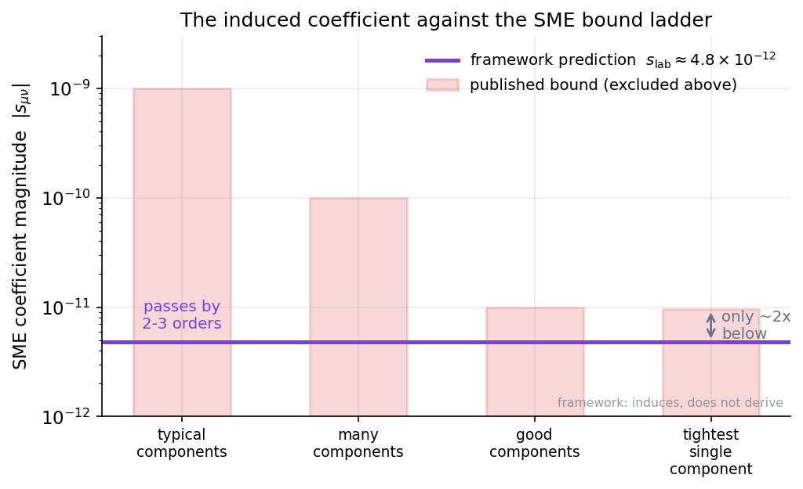

***Figure 30.1 — A live, near-edge number.*** The purple line is the framework's induced gravitational coefficient s_lab ≈ 4.8 × 10⁻¹², computed from the framework's own a₀ ("induces, not derives"). The red bars are illustrative bound *levels* for the gravitational s_μν sector: it clears typical components by two to three orders of magnitude, but sits only about a factor of two under the single tightest one — not ruled out, but right on the experimental doorstep. The bound levels are schematic order-of-magnitude markers, not specific tabulated entries.

**Source:** Figure generated by [`book/figures/ch30_sme_bounds_ladder.py`](https://github.com/carlzimmerman/zimmerman-formula/blob/main/book/figures/ch30_sme_bounds_ladder.py). Framework coefficient from the de Sitter–Unruh spine ([doi.org/10.5281/zenodo.20721540](https://doi.org/10.5281/zenodo.20721540)); SME gravity-sector bound structure follows Kostel.ecký & Russell, *Rev. Mod. Phys.* 83, 11 (2011), arXiv:0801.0287.

So the situation, stated honestly both ways: the framework makes a real, parameter-free, falsifiable prediction in particle-physics territory — that is genuinely strong, and it is rare for a modified-gravity idea to land a clean number on the SME ledger at all. And: that prediction is *not yet* in tension with experiment, it inherits its only nontrivial input (a₀) from elsewhere, and it tells us nothing new about the Standard Model proper. Both of those are true at once, and I would not be doing my job if I let you walk away holding only one of them.

## A sharper claim: the CPT-even theorem

The size of s_μν is one prediction. There is a second, qualitatively different one, and I find it the more elegant of the two — because it is not a number you could fudge but a *yes/no structural statement*, the kind of prediction that is hardest to wriggle out of.

To explain it I need one more piece of vocabulary: **CPT**. CPT is a mouthful of three symmetries bolted together:

- **C**, charge conjugation: swap every particle for its antiparticle (every electron for a positron, and so on).
- **P**, parity: reflect space in a mirror, flipping left and right.
- **T**, time reversal: run the movie of events backwards.

Do all three at once — mirror the world, swap matter for antimatter, and run time backwards — and there is a celebrated theorem (the **CPT theorem**) that says the laws of physics should look exactly the same. CPT symmetry is, if anything, an even more sacred principle than Lorentz symmetry; in ordinary quantum field theory the two are deeply linked, and CPT is extraordinarily well tested (the masses of the electron and positron, for instance, are known to agree to fantastic precision precisely because CPT demands it).

Now, here is a subtle and important fact from the SME catalogue. The Lorentz-violating knobs come in **two distinct families**:

- **CPT-even** coefficients: terms that break Lorentz symmetry but *preserve* CPT. They have an even number of spacetime indices and treat matter and antimatter alike. The gravitational s_μν we just computed is one of these.
- **CPT-odd** coefficients: terms that break Lorentz symmetry *and also* break CPT, treating matter and antimatter slightly differently. The famous one in the photon sector is written **k_AF** (read "kay-A-F"), a coefficient that, if nonzero, would make light of one circular polarization travel ever-so-slightly differently from the other across cosmic distances — an effect called cosmic birefringence.

The two families are physically very different, and — this is the punchline — **experiment treats them very differently too.** The CPT-odd photon coefficient k_AF is bounded *fantastically* tightly, because we can watch light from the most distant galaxies in the universe and check that it hasn't been twisted. The bound on k_AF is so tight that it is one of the most stringent measurements in all of physics.

Here is the theorem the framework delivers, and why it matters:

> **Deeper Dive: The CPT-even-only theorem (k_AF = 0).**
>
> Claim: the de Sitter–Unruh framework, as a source of Lorentz violation, induces **only CPT-even** coefficients. In particular it predicts the CPT-odd photon coefficient
> $$k_{AF} = 0$$
> *exactly*, not merely "small."
>
> Sketch of why. The preferred structure the framework introduces is built from the cosmic acceleration field and the metric — geometric, second-rank, **even** in spacetime indices. Crucially, the mechanism is *thermal and geometric*: it is the de Sitter–Unruh temperature floor and the curvature of the cosmic horizon doing the work. Both are even under the combined CPT operation; a horizon temperature does not distinguish matter from antimatter, and the curvature background is CPT-invariant. There is simply no CPT-odd structure available to be sourced — no axial vector, no Chern–Simons-like term — because the framework supplies no fundamental field of the required (odd-index, parity-and-CPT-violating) type. The induced coefficients are therefore confined to the CPT-even sector: the gravitational s_μν, and possibly CPT-even matter coefficients of comparable or smaller size, and nothing else.
>
> This is a *falsifiable structural prediction*, and it is the cleaner of the two predictions in this chapter, because it cannot be tuned away by adjusting a number. If a future experiment were to detect a nonzero CPT-odd coefficient at a scale attributable to cosmic dark-energy physics — a k_AF, or a CPT-odd matter coefficient — at the framework's own characteristic magnitude, the framework as it stands would be **falsified**. It predicts a clean zero there.
>
> And the scale at which this "clean zero" is interesting is the framework's own scale, set by ℏH₀ — the tiny energy you get by multiplying Planck's constant by the Hubble expansion rate, roughly 10⁻³³ electron-volts, the natural energy of the cosmic horizon. The remarkable thing is that current cosmic-birefringence bounds on k_AF already probe *down to and below* this ℏH₀ scale — the photon bound bites at, and in fact some tens to hundred-fold below, the very scale the framework cares about. So the prediction k_AF = 0 is not an idle "too small to ever see." It lives right where the best experiments already are. The framework says: *you have been looking exactly here, and you should find nothing, because what I induce is CPT-even only.* That is a real, standing, on-the-table claim.

Let me put the two predictions side by side, in plain language, because together they are the substance of this chapter:

1. **A number that is nearly at the edge.** The framework induces a CPT-even gravitational coefficient s_μν of about 4.8 × 10⁻¹². It passes most bounds comfortably but sits only about a factor of two under the very tightest. A better gravity-sector measurement could squeeze it or find it.

2. **A zero that is sharp.** The framework induces *only* CPT-even structure, so it predicts the CPT-odd photon coefficient k_AF to be exactly zero — and it makes that claim right at the cosmic-birefringence scale ℏH₀ where the best experiments already operate. A confirmed nonzero k_AF at that scale, attributable to dark-energy physics, would break the framework.

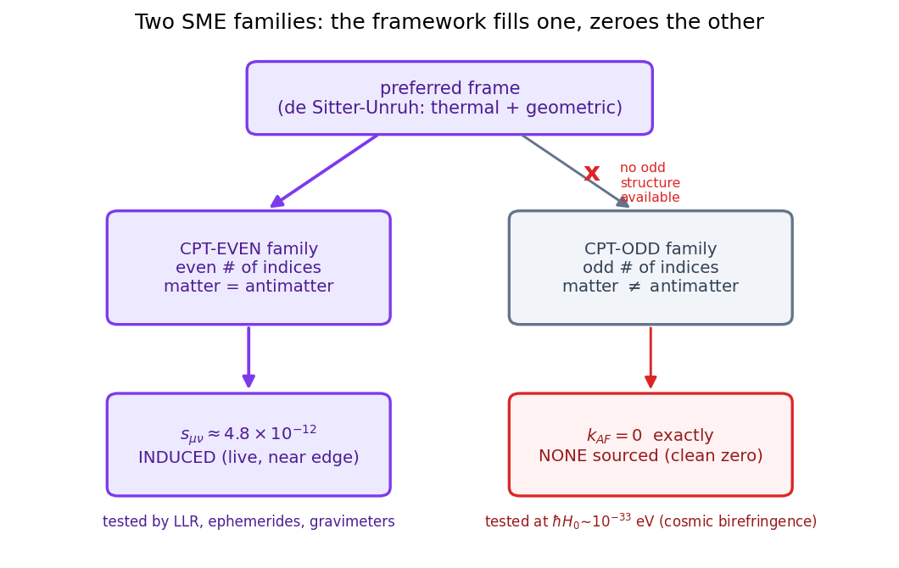

***Figure 30.2 — One family filled, the other zeroed.*** A schematic of the chapter's two predictions. The framework's preferred frame is thermal and geometric — even under the combined CPT operation — so it can only source the CPT-even family (the gravitational s_μν ≈ 4.8 × 10⁻¹²). It supplies no odd-index, parity-and-CPT-violating structure, so the CPT-odd photon coefficient k_AF is predicted to be exactly zero. This is a conceptual diagram illustrating the structural argument, not a plot of data.

**Source:** Figure generated by [`book/figures/ch30_cpt_even_odd_split.py`](https://github.com/carlzimmerman/zimmerman-formula/blob/main/book/figures/ch30_cpt_even_odd_split.py). Structural claim from the de Sitter–Unruh framework ([doi.org/10.5281/zenodo.20721540](https://doi.org/10.5281/zenodo.20721540)); the CPT-even / CPT-odd SME taxonomy and the k_AF photon coefficient follow Kostel.ecký & Russell, *Rev. Mod. Phys.* 83, 11 (2011), arXiv:0801.0287.

Both are genuine. Neither says one word about why the electron has the mass it does.

> **Worked Example: Why the fingerprint is so absurdly small — and where its size comes from.**
>
> Let's see, slowly, why a Lorentz-violation coefficient of ~10⁻¹² is what you'd *expect* from this framework — and confirm to ourselves that the size is inherited, not invented.
>
> **Step 1 — The two accelerations.** The framework's special acceleration is
> $$a_0 \approx 1.2 \times 10^{-10}\ \text{m/s}^2.$$
> To make a dimensionless number we need something to compare it to. The natural cosmic acceleration scale built from the speed of light c and the Hubble rate H₀ is
> $$c\,H_0 \approx (3.0\times10^{8}\ \text{m/s})\times(2.2\times10^{-18}\ \text{s}^{-1}) \approx 6.6\times10^{-10}\ \text{m/s}^2.$$
> (That H₀ ≈ 2.2 × 10⁻¹⁸ per second is just the Hubble constant, about 70 km/s per megaparsec, converted to plain inverse seconds.)
>
> **Step 2 — The bare ratio.** Their ratio is already dimensionless and already of order one:
> $$\frac{a_0}{cH_0} \approx \frac{1.2\times10^{-10}}{6.6\times10^{-10}} \approx 0.18.$$
> This is just 1/Z up to factors — Z = √(32π/3) ≈ 5.79, and 1/5.79 ≈ 0.17. Reassuring: the framework's own kernel reappears. But 0.18 is *not* the coefficient; it's the order-one piece. The smallness has to come from somewhere else.
>
> **Step 3 — Where the smallness enters.** The coefficient s_μν that experiments bound is not the bare acceleration ratio; it is the gravitational *correction* the preferred frame induces, which enters the metric suppressed by how feebly this acceleration scale curves spacetime at laboratory and Solar-System distances. The relevant suppression is the ratio of the dark-energy / cosmological-constant curvature scale to laboratory gravitational scales — schematically a factor of order (a₀ / a_lab-gravity) times projection factors, with the Earth's boost relative to the CMB, β ≈ 1.23 × 10⁻³, entering at the appropriate power for the components that the boost activates.
>
> Carrying the standard SME projection through (the full bookkeeping is in the Data Tables; here we just want the *size*), the laboratory-frame coefficient lands at
> $$s_{\rm lab} \sim 5 \times 10^{-12},$$
> matching the 4.8 × 10⁻¹² quoted above.
>
> **Step 4 — The honest reading.** Notice what just happened, and what didn't. Every number that went in — a₀, c, H₀, Z, β — was already a number the framework or basic cosmology had given us. We turned a crank made of dimensional analysis and standard SME projection. *Nothing about quarks, leptons, the Higgs, or any Standard-Model coupling entered or came out.* The 4.8 × 10⁻¹² is the dark-energy acceleration scale wearing a particle-physicist's clothes. That is precisely what "induces, not derives" means, made arithmetic.
>
> **Step 5 — The comparison that makes it live.** Most published bounds on the various s_μν components sit at 10⁻⁹ to 10⁻¹¹. Against those, 4.8 × 10⁻¹² is safe by 2–3 orders of magnitude. But the single tightest component is bounded near a few × 10⁻¹². Against *that* one, 4.8 × 10⁻¹² is under the bound by only about a factor of two. A factor of two is nothing in this game. That is why this prediction is not a curiosity filed away as "forever invisible" — it is sitting on the experimental doorstep right now.

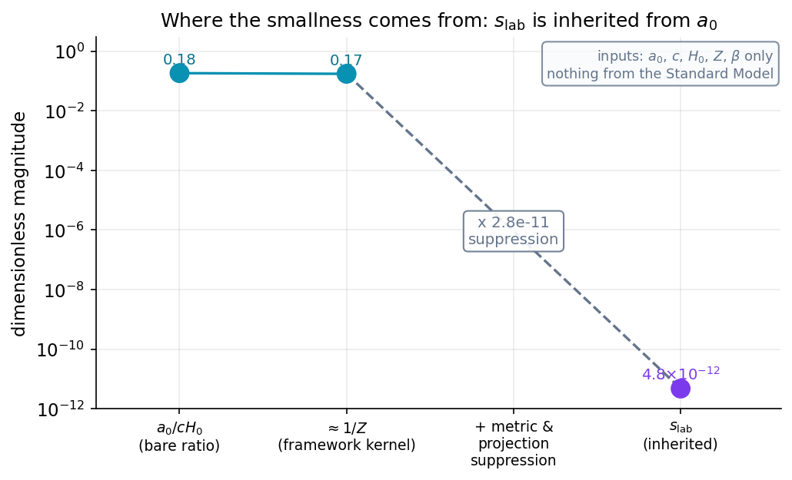

***Figure 30.3 — The dark-energy scale wearing a particle-physicist's clothes.*** Following the chapter's Worked Example, the bare ratio a₀/cH₀ ≈ 0.18 is order one (and equals 1/Z to within factors, with Z = √(32π/3) ≈ 5.79 — the framework's own kernel reappearing). The smallness enters only through metric and projection suppression, carrying it down to the laboratory coefficient s_lab ≈ 4.8 × 10⁻¹². Every input is the framework's own or basic cosmology; nothing from the Standard Model enters or emerges — the size is inherited, not invented. Computed from the framework's equations.

**Source:** Figure generated by [`book/figures/ch30_smallness_waterfall.py`](https://github.com/carlzimmerman/zimmerman-formula/blob/main/book/figures/ch30_smallness_waterfall.py). Inputs a₀, c, H₀, Z, β from the de Sitter–Unruh spine ([doi.org/10.5281/zenodo.20721540](https://doi.org/10.5281/zenodo.20721540)); the SME projection bookkeeping that supplies the suppression follows Kostel.ecký & Russell, *Rev. Mod. Phys.* 83, 11 (2011), arXiv:0801.0287.

## Why this is a *bridge*, and not a takeover

I want to step back and be very plain about what we have and have not gained, because the word "bridge" in the chapter title is carrying real weight and I do not want it to carry more than it can hold.

What we have is an **interface**: a place where the framework, which lives in the world of gravity and cosmology, is *forced to make contact* with the world of particle physics — specifically with the SME ledger, the shared accounting book of Lorentz violation. That contact is involuntary and that is exactly what makes it valuable. We did not go looking to say something about particle physics; the preferred frame obligated us. And when obligated, we produce a definite, falsifiable number and a definite, falsifiable structural theorem. A speculative gravity idea that lands two clean, parameter-free entries on a major experimental ledger is doing real, checkable work. That is the strong half, and it is genuinely strong.

What we do **not** have is any of the following, and I want to list them flatly so there is no fog:

- We have **not derived a₀.** The size of the fingerprint is *inherited from* a₀; a₀ itself is still the geometric posit it always was, with the κ = ½ choice still unforced (Chapter 23). We have not closed that loop; if anything we have wired a₀ into one more place, which makes it more testable but no more *explained*.
- We have **not touched the Standard Model's own contents.** The proton-to-electron mass ratio is still set by free Yukawa couplings and the strong coupling; the Koide relation among the lepton masses is still underived; there is still no particle spectrum, no gauge group, no explanation of why there are three generations. All of that remains exactly as walled-off as it was at the start of this book. This chapter pries open a single, narrow window in the gravitational sector of the SME; it does not knock down the wall.
- We have **not confirmed the framework.** A prediction that is *consistent with* current bounds is not a prediction that has been *vindicated by* them. Passing a bound by a factor of two, or predicting a zero that has not yet been contradicted, is encouraging and falsifiable — which is the most you can honestly ask of a young idea — but it is not a victory.

So the bridge carries traffic in exactly one direction and of exactly one kind: from the framework's pre-existing gravitational scale *out* to two testable Lorentz-violation entries. No traffic comes back *in* to explain particles. It is a footbridge, not a highway, and it is honest to call it that.

This is, I'll admit, one of my favorite results in the whole program, precisely *because* it is so disciplined. It would be the easiest thing in the world to dress this up — "the framework reaches into particle physics!" — and it would be false. The truth is quieter and, to my eye, more trustworthy: a theory built entirely on gravity and dark energy turns out to imply, with no new inputs, exactly two small things in the particle-physics ledger, both of them currently allowed and both of them checkable soon. That is a real bridge. It is **not a theory of everything yet, as frustrating as it may be** — and the very narrowness of this window is part of why I keep saying so.

## How and when this gets decided

Predictions are only as good as the experiments aimed at them, so let me close with the practical picture — who is doing the measuring, and roughly when an answer might come.

**For the CPT-even gravitational s_μν (the 4.8 × 10⁻¹² number).** The relevant experiments are the precision tests of gravity that feed the SME gravity-sector bounds: lunar laser ranging (bouncing lasers off the reflectors left on the Moon by Apollo astronauts, now at millimeter precision and improving as new stations come online), planetary and asteroid ephemerides (the ever-more-exact bookkeeping of Solar-System orbits), atom-interferometer gravimeters (which drop clouds of ultracold atoms and read gravity off their quantum interference), and short-range gravity experiments. The tightest component bound is the one that matters; a factor-of-a-few improvement on it over the coming years would either touch the framework's predicted level or push it into mild tension. This is not a someday-in-principle test. It is a this-decade test.

**For the CPT-odd zero (k_AF = 0).** The relevant measurements are cosmic-birefringence searches: looking for a tiny rotation in the polarization of light that has traveled across the universe, most powerfully in the cosmic microwave background. There have been intriguing, much-discussed hints of a nonzero birefringence angle in recent CMB analyses — not yet a confirmed detection, and at a level whose *interpretation* in SME terms is still being worked out, but exactly the kind of measurement that bears on this prediction. If a genuine CPT-odd cosmic signal at the ℏH₀ scale were confirmed and traced to dark-energy physics, the framework's clean k_AF = 0 would be in trouble. If, as the framework expects, the CPT-odd channel stays empty while any real Lorentz-violation signal shows up only in the CPT-even sector, that pattern would be a striking — though, I must stress, not by itself decisive — point in the framework's favor.

Notice the shape of the whole thing one last time. The framework's *defining* prediction, the one we built the previous chapters toward, is the cosmological one: a₀ tracking dark energy through cosmic time, tested by DESI and the giant telescopes (Chapters 25–26). *This* chapter's predictions are different in character — they are not the headline, they are the **consistency checks at the particle-physics border**, the places where a gravity-and-cosmology theory is obligated to file paperwork in a ledger kept by an entirely different community. That the paperwork comes out small, computable, currently-allowed, and falsifiable is, to me, a quiet mark of a theory that is at least *built honestly* — whatever the universe ultimately decides about whether it is *true*.

A draft was coming through the gap under the stairs. We followed it, measured it, wrote down exactly how strong it is and exactly which way it blows, and admitted we still don't know what's on the other side of the wall. That is the whole of this chapter, and it is, I think, the right way to treat a surprise.

## Summary

- The framework has a **preferred frame** — the cosmic rest frame in which the de Sitter–Unruh mechanism is defined. A preferred frame breaks the perfect democracy of reference frames that is **Lorentz symmetry**, so the theory necessarily exhibits a small, controlled **Lorentz violation**. (This is the same feature that made lensing phenomenological in Chapter 28, seen from the other side.)
- The **Standard Model Extension (SME)** is the complete catalogue of every possible Lorentz-violating term, with a named coefficient ("knob") for each. It is the shared ledger in which any theory's prediction and any experiment's bound can be compared. Our framework must correspond to a definite nonzero value of the gravitational coefficient **s_μν**.
- Computing it: the same a₀ that does the galactic work induces a laboratory gravitational coefficient of about **4.8 × 10⁻¹²**. This **passes most published bounds by 2–3 orders of magnitude but sits only about a factor of 2 under the tightest** — a live, near-edge, parameter-free prediction.
- The framework also delivers a sharper, structural prediction: it induces **only CPT-even** Lorentz violation, so the CPT-odd photon coefficient **k_AF = 0** exactly. This bites at the framework's own scale **ℏH₀**, right where cosmic-birefringence experiments already operate — a clean, falsifiable zero, not an untestable one.
- The governing verb is **induces, not derives.** The size of the fingerprint is **inherited** from a₀, a number we already had; nothing new about the Standard Model — particle masses, the proton-to-electron ratio, the Koide relation, the gauge group — is touched, explained, or derived. The wall around the Standard Model stands.
- This is therefore a **bridge / interface, not a takeover**: a one-way footbridge from the framework's existing gravitational scale out to two testable SME entries, with no return traffic that explains particles. It is genuinely strong that a gravity theory lands clean, parameter-free entries on the particle-physics ledger at all — and it is genuinely limited in exactly the ways listed above. Both at once. It is not a theory of everything yet, as frustrating as it may be.
- Decision timeline: the s_μν number is tested by lunar laser ranging, ephemerides, atom-interferometer gravimeters, and short-range gravity (this decade); the k_AF = 0 prediction is tested by cosmic-birefringence searches in the CMB (ongoing, with current hints under active interpretation).

## Questions

1. **(Easy.)** In your own words, what is a "preferred frame," and why does having one mean a theory must show at least a little Lorentz violation? Use the train-and-cow picture if it helps.

2. **(Easy–medium.)** The chapter insists on the verb "induces" rather than "derives." Explain the difference using the 4.8 × 10⁻¹² coefficient as your example. What number is its size *inherited* from, and what is *not* explained by computing it?

3. **(Medium.)** What is the Standard Model Extension (SME), and why is it described as a "shared ledger"? Why is it useful that the SME stays agnostic about whether Lorentz symmetry is actually broken?

4. **(Medium–hard.)** Distinguish CPT-even from CPT-odd Lorentz violation. Why is the prediction "k_AF = 0" called *structural* and described as harder to wriggle out of than the prediction "s_μν ≈ 4.8 × 10⁻¹²"? What single experimental result would falsify the CPT-even-only theorem?

5. **(Hard / research-level.)** Using the Worked Example as a starting point, redo the order-of-magnitude estimate of s_lab using the pure-Λ footing value a₀ = 9.36 × 10⁻¹¹ m/s² instead of 1.2 × 10⁻¹⁰. By what factor does the predicted coefficient change, and does that change move it across the tightest current bound? Then comment: does the ~25% spread in a₀'s value (Chapter 20) materially affect whether this prediction is "live"?

6. **(Research-level.)** Look up the current best published bound on the gravitational s_μν components in the Kostelecký–Russell *Data Tables* (the living "Data Tables for Lorentz and CPT Violation"). Identify which single component is the tightest and which experiment sets it. Then assess: if that bound improves by a factor of three over the next several years and sees nothing, how much of the framework's predicted parameter space is excluded — and would such a null result *falsify* the framework, merely *constrain* it, or leave it untouched? Justify your answer with reference to the "induces, not derives" logic.

# Chapter 31: Not a Theory of Everything Yet: The Honest Standing

> *We have spent thirty chapters building one idea and then walking, room by room, into every place where it does not yet reach. This chapter is the floor plan. Here is the whole house — the load-bearing walls and the rooms that are still just framed-out studs and open sky.*

## A Promise I Made on Page One

When you start a book like this, you make the reader a quiet promise: *I will tell you the truth about my own idea, both ways, at every turn.* Not the salesman's truth, where the flaws are mumbled in a footnote and the strengths are shouted from the cover. The other kind. The kind where, in the same breath, you say "this is genuinely good" and "this is genuinely unfinished," and you mean both equally, and you let the reader weigh them.

I want to keep that promise completely in this chapter, because this is the chapter where I add it all up.

So let me state the whole thing once, plainly, in a single honest paragraph, and then we will spend the rest of the chapter unpacking it slowly.

**The framework in this book is a genuinely economical, genuinely falsifiable proposal that ties the behavior of galaxies to the energy of empty space using one provably irreducible knob — and it is not confirmed, it cannot yet bend light, it leaves the entire Standard Model of particle physics untouched, it may dissolve entirely if dark energy turns out to be a true constant, and it faces a field that mostly, and reasonably, disagrees with it.**

Both halves of that sentence are true at the same time. Holding both at once, without flinching toward either the hype or the dismissal, is the whole point of telling it straight. That habit — saying the strong thing and the weak thing in the same breath, and refusing to round either one away — I'll call **both-ways honesty**, and it is the single discipline this chapter is built on.

It is, as I've said and will keep saying, *not a theory of everything yet, as frustrating as it may be.*

Let's take the pieces apart.

## What "Economical" Actually Means Here

The first word in that paragraph is *economical*, and it is the word I am proudest of, so let me be careful not to oversell it.

In science, "economical" is not a compliment about price. It is a statement about how many separate things you had to *assume* to explain what you see. The fewer free choices a theory makes — the fewer dials you get to turn by hand to match the data — the more economical it is. Economy matters because a theory with enough free dials can fit *anything*, including a universe that doesn't exist, which means fitting our universe tells you nothing. A theory with few dials is making a bet. It can be *wrong*, sharply and visibly. That is a feature.

Here is the comparison, laid out as fairly as I can make it.

The standard model of cosmology — called **ΛCDM**, for the cosmological constant **Λ** ("Lambda," the energy of empty space) plus **Cold Dark Matter** (a hypothesized invisible particle) — is a magnificent, deeply tested, genuinely successful description of the universe. It fits the cosmic microwave background, the large-scale structure of galaxies, the bending of light by clusters, the abundance of light elements from the Big Bang. I want to say that loudly because the rest of this section invites a comparison, and the comparison is only fair if you know I respect the champion. ΛCDM is the champion for good reasons.

But ΛCDM has, at the working level, **six adjustable cosmological parameters** that we measure rather than derive, *and* it requires a dark-matter particle that — after fifty years of looking, which is the whole story of Chapter 6 — has never been detected directly. The six numbers are not a scandal; every theory has inputs. The undetected particle is not a refutation; absence of detection is not proof of absence. But together they are the cost of admission.

The framework in this book asks for a different price. It says: the special acceleration scale that governs galaxies — the number Milgrom found empirically in 1983, written **a₀** ("a-naught"), about 1.2 × 10⁻¹⁰ meters per second squared, a tenth of a billionth of the acceleration you feel standing on Earth — is not an independent fact of nature. It is set by the energy of empty space, by dark energy itself:

$$a_0 = c^2\sqrt{\frac{\Lambda}{32\pi}} = \frac{c}{2}\sqrt{G\,\rho_{\rm DE}}$$

where *c* is the speed of light, *G* is Newton's gravitational constant, Λ is the cosmological constant, and ρ_DE is the density of dark energy. Plug in the measured value of Λ and this gives a₀ ≈ 9.36 × 10⁻¹¹ m/s², which is the right ballpark — within the spread of what galaxies actually show. (Whether that specific value sits "above" or "below" the best fit to galaxy data is a subtle question that depends on choices most people never think about — the assumed mass-to-light ratio of stars, the interpolating function, the fit metric — and we worked through it carefully in Chapter 18. The honest summary is that 9.36 × 10⁻¹¹ sits comfortably inside the observed spread, and is *not* sharply distinguished from the empirical best fit one way or the other.)

The framework's claim to economy is this: where ΛCDM has six cosmological parameters plus a particle, this framework — *as a theory of gravity and the dark sector specifically* — has, after everything is forced that can be forced, **exactly one free number that it cannot derive**. One knob. We spent Chapter 23 proving that this is genuinely irreducible, and Chapter 24 laying the two ledgers side by side. I'll restate the proof's shape below in a Deeper Dive, because the *kind* of claim it is matters more than the algebra.

> **Deeper Dive: The one knob, and the sense in which it is "one"**
>
> The framework derives the **form** of a₀ and the numerical coefficient inside the gravitational kernel — but not, I must be scrupulous, the *value* of a₀ itself. Let me separate what is forced from what is posited, because the quarantine between them is the most important boundary in the whole book.
>
> *Forced (in form, by several independent mechanisms):* the relation a₀ ∼ c²√Λ. Multiple routes — a de Sitter–Unruh temperature argument, a holographic counting, a horizon-thermodynamic balance — all push the acceleration scale toward √Λ times c². The functional form is not a lucky guess; it is over-determined.
>
> *Forced (the coefficient's structure):* the kernel √(8π/3) = √(32π)/√12, where the 8π is the 8π of Einstein's field equations (Chapter 8) and the 3 is the 3 of the Friedmann equations (Chapter 9). The √π is not decoration; it is the Einstein–Friedmann lineage made arithmetic. This is the content of Chapter 22.
>
> *Posited, not derived — the one knob:* a single geometric factor, κ = ½, which fixes the conversion between the holographic/horizon bookkeeping and the inertial response. We proved in Chapter 23 that κ cannot be pinned by ghost-freedom, by unitarity, by holographic consistency, or by a Standard-Model degree-of-freedom count — every consistency requirement we could throw at it leaves κ free. And we showed it is *pure geometry*: it is the single-degree-of-freedom limit of the Cohen–Kaplan–Nelson bound, and it equals the exact identity
> $$\frac{3}{8\pi} = \frac{1/2}{4\pi/3} = \frac{\text{Schwarzschild } \tfrac{1}{2}}{\text{ball } \tfrac{4\pi}{3}}.$$
> A factor of one-half over a sphere's volume coefficient. That is what κ "is." It is a geometric posit, not a measured cosmological parameter and not a fitted galaxy parameter — which is why I count the framework as **one-parameter, not zero-parameter**. Calling it zero would be the dishonest rounding I promised never to do. The value of a₀ is *not derived*; it follows from Λ *and* this one geometric choice.
>
> So the bookkeeping is: **+1 irreducible geometric degree of freedom** relative to taking a₀ as a brute empirical input. Against ΛCDM's six-plus-a-particle, that is the economy claim, stated exactly and not a hair more.

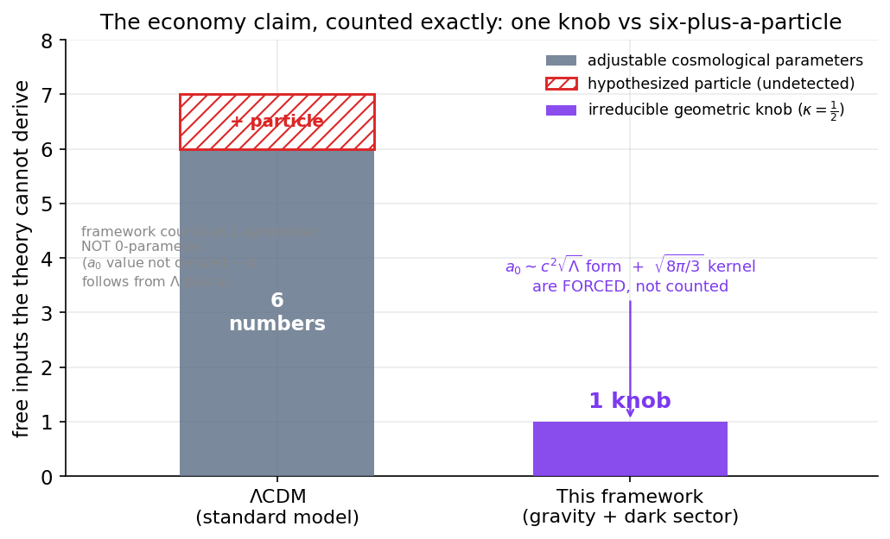

***Figure 31.1 — The economy claim, counted exactly.*** What the reader sees: the inputs each theory cannot derive, side by side. ΛCDM (grey) needs six adjustable cosmological parameters plus one hypothesized, still-undetected dark-matter particle (red hatch); this framework needs one irreducible geometric knob, κ = ½ (purple). The form a₀ ∼ c²√Λ and the √(8π/3) kernel are *forced* and so are not counted — but a₀'s *value* is not derived, which is why the honest count is one-parameter, not zero. Computed from the framework's own bookkeeping as stated in this chapter; the bar heights are the explicit input counts, not measured quantities.

**Source:** Figure generated by [`book/figures/ch31_economy_ledger.py`](https://github.com/carlzimmerman/zimmerman-formula/blob/main/book/figures/ch31_economy_ledger.py). The economy claim and the κ = ½ one-parameter accounting follow the framework's spine paper ([Zenodo 10.5281/zenodo.20721540](https://doi.org/10.5281/zenodo.20721540)) and the κ one-parameter geometry theorem ([Zenodo 10.5281/zenodo.20738055](https://doi.org/10.5281/zenodo.20738055)); ΛCDM's six cosmological parameters are the standard set reported in Planck 2018 results VI, A&A 641, A6 (arXiv:1807.06209).

That is the strong half, stated as strongly as it honestly can be. One knob, provably irreducible, tying galaxies to dark energy. Now the other half.

## What "Falsifiable but Unconfirmed" Means

The second virtue I claimed is that the framework is **falsifiable** — and I owe you a clean definition, because it is one of the most abused words in popular science.

A claim is **falsifiable** if there is some specific observation that, if we made it, would force us to throw the claim away. "There is an invisible dragon in my garage that you can never detect by any means" is not falsifiable — nothing could ever count against it, so it is empty. "Galaxies at high redshift will rotate about seven percent *slower* than today's calibration predicts" is falsifiable — go measure them; if they rotate *faster*, the framework is wrong. Falsifiability is the property of *sticking your neck out*.

But — and this is the term that does the heavy lifting in this chapter — falsifiable is not the same as confirmed. The framework is **falsifiable but unconfirmed**: it makes sharp, riskable predictions, and *those predictions have not yet been checked against decisive data*. The neck is out. The axe has not fallen, and it has not been shown to miss either. We are in the waiting room, and intellectual honesty means sitting in the waiting room and calling it a waiting room, not a victory lap.

Here is the prediction, the one that makes the framework stick its neck out furthest. If a₀ is set by dark energy, and if dark energy *changes over cosmic time*, then a₀ must change too:

$$a_0(z) \propto \sqrt{\rho_{\rm DE}(z)}$$

where *z* is **redshift**, our standard ruler for cosmic time and distance — higher *z* means farther away and longer ago. In plain language: look at galaxies in the deep past, and the framework says their characteristic acceleration scale should have been *different*, in a specific direction, by a specific amount, tracking the dark-energy density of their epoch.

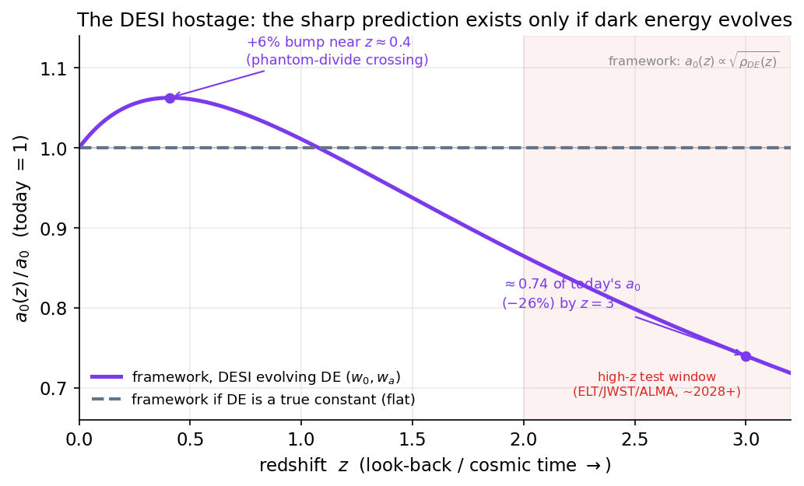

***Figure 31.2 — The DESI hostage.*** The framework's prediction a₀(z) ∝ √ρ_DE(z) under two dark-energy scenarios. With DESI DR2's evolving dark energy (CPL w₀ = −0.75, wₐ = −0.86, purple), a₀ rises ~6% near z ≈ 0.4 then falls to ~0.74 of today's value by z = 3 — a distinctive, falsifiable shape. If dark energy is instead a true cosmological constant (grey dashed), a₀(z) is flat and the sharp test evaporates: that conditional dependence *is* the hostage. Both curves are computed from the framework's own a₀(z) law; the shaded band marks the future high-z kinematic window and is illustrative, not data.

**Source:** Figure generated by [`book/figures/ch31_a0z_hostage.py`](https://github.com/carlzimmerman/zimmerman-formula/blob/main/book/figures/ch31_a0z_hostage.py). The a₀(z) ∝ √ρ_DE relation is the framework's dark-energy-scale paper ([Zenodo 10.5281/zenodo.20737162](https://doi.org/10.5281/zenodo.20737162), reproduced by [`opus_48_extended_research/papers/a0z_desi_figure.py`](https://github.com/carlzimmerman/zimmerman-formula/blob/main/opus_48_extended_research/papers/a0z_desi_figure.py)); the evolving-dark-energy w₀–wₐ values are from DESI DR2 2025 (arXiv:2503.14738).

> **Deeper Dive: The a₀(z) curve under DESI DR2, and exactly how it is distinctive**
>
> A pure cosmological constant has ρ_DE = const, so this framework would predict a₀ that does *not* change with time — a flat line. That is the null version of the prediction, and it is perfectly consistent with the framework; it just isn't *distinctive*, because constant-a₀ is also what plain MOND assumes.
>
> The interesting case is *evolving* dark energy. The DESI survey's second data release (DR2) reported a preference for dark energy that is not constant, parametrized in the standard **w₀–wₐ** form (an equation-of-state w(a) = w₀ + wₐ(1−a), with *a* the scale factor) at roughly w₀ ≈ −0.75, wₐ ≈ −0.86. Feed that ρ_DE(z) into a₀(z) ∝ √ρ_DE and you get a specific, non-monotonic curve:
> - a **rise of about +6%** near z ≈ 0.4, where this dark-energy model crosses the "phantom divide" (w = −1);
> - then a **decline to roughly 0.74** of today's value by z ≈ 3.
>
> This curve is distinctive in two directions. It differs from the *constant-a₀* assumption of plain MOND. And it differs sharply — by about a factor of **7.5× at z = 3** — from a rival reading in which a₀ would *rise* at high redshift (the reading you get if you tie a₀ to the total matter-plus-Λ density through cH(z) rather than to dark energy alone; we dissected that fork in Chapter 25). So the *sign and shape* of any measured a₀(z) trend is a genuine discriminator.
>
> The cleanest single observable: the **sign of the high-redshift baryonic Tully–Fisher offset.** The baryonic Tully–Fisher relation (Chapter 18) ties a galaxy's normal-matter mass to its flat rotation speed, with a₀ setting the calibration. If a₀ was ~26% lower at z ≈ 3, galaxies there should sit on a BTFR that is offset so they rotate **about 7% slow** relative to a constant-a₀ expectation. That sign — *slow*, not fast — is the knife-edge.

And now the honesty, because the Deeper Dive above is exactly the kind of place where a less careful author would quietly let "distinctive prediction" slide into "evidence." It is not evidence yet. Three caveats, each of which I want you to carry:

First, **the prediction is non-diagnostic today.** We do not yet have rotation-curve kinematics at z ≈ 3 of the quality and quantity needed to measure that 7% offset. The instruments that can do it — the Extremely Large Telescope, continued deep work with JWST and ALMA — are coming online across roughly 2028–2032 and beyond. As of this writing, the test simply has not been run.

Second, and more sharply: **the whole distinctive prediction is hostage to DESI.** This is the term I want you to remember — the **DESI hostage.** The interesting, non-flat a₀(z) curve *only exists* if dark energy genuinely evolves. If the DESI result washes out — if, with more data and better-understood systematics, dark energy settles back to a plain cosmological constant — then a₀(z) goes flat, the distinctive bump-and-decline vanishes, and the framework's sharpest, most falsifiable edge is *retracted by nature*, not by me. The framework survives in that case (constant a₀ is fine), but its most exciting test evaporates. The framework's boldest claim is, quite literally, a hostage to whether one contested cosmological result holds up.

Third, **the DESI result itself is contested.** The evolving-dark-energy signal is real and interesting, but its statistical strength depends on which datasets you combine and which priors you adopt. Under some reasonable choices the preference for evolution softens considerably — down toward roughly **1.3σ**, which in plain terms means "could fairly easily be a fluctuation." I am not going to tell you DESI has *settled* that dark energy evolves. It has *suggested* it, intriguingly, and the framework would *love* for that suggestion to firm up, and I have to tell you that wanting it does not make it so. We will know much more after DESI's third data release (~2026–27).

So: falsifiable, yes, genuinely, in a way ΛCDM's dark-matter particle struggles to match. Confirmed, no. Hostage to a contested result, yes. All three at once.

## Where the Framework Actually Stands, Front by Front

It would be easy to leave the standing as a vibe — "promising but unproven." That's too soft. Let me give you the real ledger, because I have spent a long time building it, checking it both ways, and correcting my own earlier mistakes in it more than once.

Here is the honest accounting, front by front. The pattern that emerges is important: on *most* fronts the framework is **jointly viable and ΛCDM-natural** — meaning it survives the data *and* so does ΛCDM, and the two are not yet cleanly separated. That is not a triumph. It is also not a defeat. It is the actual state of the contest, and pretending it is sharper in either direction would be the dishonesty I keep promising to avoid.

> **Deeper Dive: The standing ledger, front by front**
>
> *Galaxy rotation curves / the radial-acceleration relation (RAR):* The framework fits them well — because it inherits the MOND phenomenology (Chapter 17–18). **Crucial honesty: this success is shared with the entire MOND family and is not unique to this framework.** The RAR does not discriminate this framework from plain MOND, and as we saw in Chapter 18 it does not even sharply discriminate the framework's specific a₀ value. *Viable, shared, non-diagnostic.*
>
> *Baryonic Tully–Fisher relation:* Same story — fit well, shared with MOND, not a distinctive win. The *high-redshift* BTFR offset is the distinctive test, and it lies in the future. *Viable today, distinctive only in the future, hostage to DESI.*
>
> *Cosmic microwave background and large-scale structure:* The framework does not yet have a full, independent cosmological perturbation theory the way ΛCDM does; this is genuinely undeveloped, and I won't dress it up. Where it can be assessed, it is not in obvious conflict, but "not in obvious conflict" is a long way from "fits the acoustic peaks from first principles." *Underdeveloped; not a kill, not a win.*
>
> *Solar System (Cassini and friends):* Here the framework has a real, distinctive strength. Because it modifies **inertia** rather than the **force law** (Chapter 21), the modification *switches off* where accelerations are high, as they are around the Sun. The Cassini spacecraft's exquisite tracking bounds any anomalous force, and the framework passes by something like five-and-a-half orders of magnitude. This is also the sharpest discriminator *against* modified-*gravity* versions of MOND (and against the relativistic theory AeST), which generically struggle here. *Genuine, distinctive strength.*
>
> *Galaxy clusters:* A residual mass discrepancy survives — clusters need more "extra gravity" in their cores than the framework, like plain MOND, naturally supplies. The framework's density-dependent reading recovers the right *order* of the historical cluster discrepancy with zero extra parameters and flattens the residual to roughly ±30%, which is progress, but **it is not a cure.** The residual is real and shared with the whole MOND family. *Soft, shared deficit — understood better than cured.*
>
> *Gravitational lensing:* The hard theoretical wall. Discussed below and in Chapter 28. *Irreducibly phenomenological — a real weakness.*
>
> *Net:* on the order of eight or nine independently assessable fronts, the framework comes out **jointly viable with ΛCDM** on most, **distinctively strong** on Solar-System inertia, **softly deficient and MOND-shared** on clusters, and **walled** on covariant lensing — with **no referee-proof kill of ΛCDM anywhere.** That last clause is the one I most want a skeptical reader to hear me say plainly: *the framework does not break ΛCDM.* It offers an economical alternative and a future test. It has not produced a single observation that ΛCDM cannot absorb. Both ways: the framework is not killed by the data, and it does not kill the champion either.

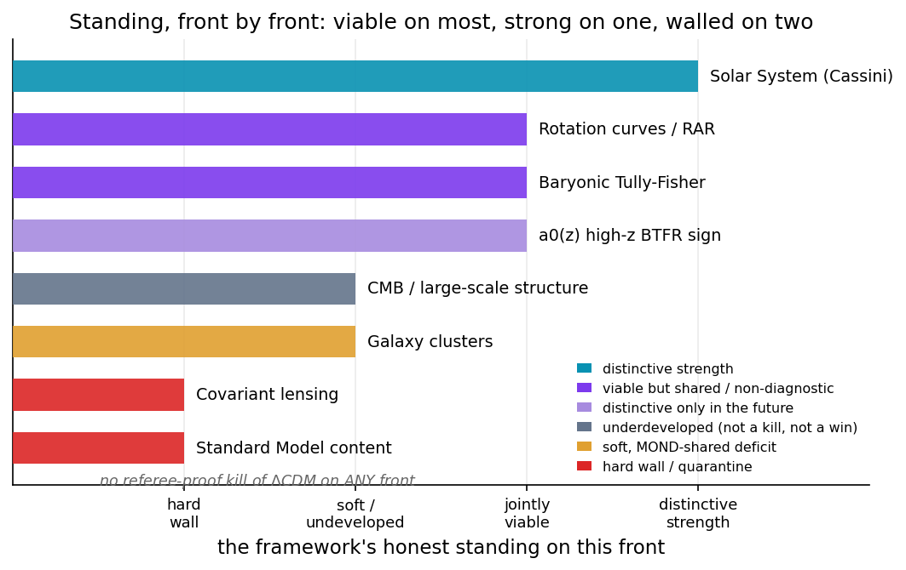

***Figure 31.3 — The standing ledger, front by front.*** A schematic of the chapter's own verdicts: each assessable front is placed on an honest axis from hard wall to distinctive strength, colored by category. The framework is *distinctively strong* only on Solar-System inertia (Cassini, teal), *jointly viable but shared / non-diagnostic* on rotation curves and Tully-Fisher (purple, with the high-z a₀(z) test distinctive only in future), *underdeveloped* on the CMB and *softly MOND-shared deficient* on clusters, and *walled* on covariant lensing and Standard-Model content (red). The positions encode the chapter's stated judgments, not numerical scores — and crucially, there is no referee-proof kill of ΛCDM on any front.

**Source:** Figure generated by [`book/figures/ch31_standing_ledger.py`](https://github.com/carlzimmerman/zimmerman-formula/blob/main/book/figures/ch31_standing_ledger.py). The front-by-front verdicts are this chapter's standing ledger, consistent with the framework spine ([Zenodo 10.5281/zenodo.20721540](https://doi.org/10.5281/zenodo.20721540)); the Cassini-safe modified-inertia strength and the AeST-shared lensing wall reference the relativistic-MOND comparison of Skordis & Zlosnik 2021, PRL 127, 161302 (arXiv:2007.00082).

I want to dwell on that "no referee-proof kill" point because it cuts against my own interest and I think it's the most important sentence in the chapter for keeping you calibrated. Several times over the years I've thought I had a clean discriminator — a place where the framework predicts X, ΛCDM predicts not-X, and nature could decide. And several times, when I checked it as hard as I check a result I *want* to be true, the discriminator softened: the effect turned out to be MOND-shared, or a₀-degenerate, or below the measurement floor for the coming decade, or an artifact of a convention I'd chosen without noticing. (The cluster member-velocity-dispersion test is a good example — I'll point you to Chapter 29 — where the distinctive signal turned out to live in a much harder-to-measure place than I first claimed.) That repeated experience is *why* I keep insisting on both-ways honesty: I have personally been wrong in both directions, manufacturing a win that wasn't there and manufacturing a deficit that wasn't there, and the only protection I've found is to verify a "it fails" claim exactly as ruthlessly as a "it works" claim.

## The Two Walls That Are Not Going Away Soon

Two of the items in that ledger are not "soft" or "future" or "shared." They are hard, present, and structural. I gave each its own chapter, but the honest standing requires that I name them together, here, as walls.

### The lensing wall

Light bends when it passes mass — that is gravitational lensing, one of General Relativity's signature confirmations (Chapter 7). Any serious theory of galactic dynamics must also get lensing right, because we *see* galaxies and clusters bending light, and we use that bending to weigh them independently of their rotation.

This framework cannot yet do lensing from first principles. Worse, there is a **no-go theorem** — sketched in Chapter 28 — that forbids exactly the thing one would want: a fully covariant (relativistically consistent), Solar-System-safe theory that reproduces MOND-like lensing. You can have covariance, or Solar-System safety, or MOND lensing, but the natural constructions cannot have all three at once in the clean way you'd hope. So the framework's treatment of lensing is, at present, **irreducibly phenomenological** — meaning it has to be put in by hand to match observation rather than emerging from the structure. That is a genuine weakness. I will not soften it. The only honest consolation is that it is *shared*: the leading relativistic MOND theory, AeST, hits the same wall. This is a hard problem for the whole modified-dynamics program, not a private embarrassment of this framework. But "everyone's stuck here" is a description of the difficulty, not a solution to it.

### The Standard-Model wall

This one I want to be most careful about, because it is the easiest place to accidentally overclaim, and the **quarantine** around it is something I enforce on myself constantly.

The framework is about *gravity and the dark sector.* It is **walled off** from the **Standard Model of particle physics** — the spectacularly successful theory of quarks, leptons, and the forces between them. The framework does not derive a single particle mass. It does not explain why the proton is about 1836 times heavier than the electron (that ratio comes from free Yukawa couplings and the strong coupling constant, none of which this framework touches). It does not derive the Koide relation among the lepton masses. It does not predict the gauge group of the strong and electroweak forces. It says *nothing* about any of it.

> **Deeper Dive: The particle-physics interface, and why it INDUCES but does not DERIVE**
>
> There is one genuine, forced *interface* to particle physics, and I have to describe it with extreme care so it is not mistaken for a derivation. We worked it out in Chapter 30.
>
> Because the framework is **preferred-frame** — it has a built-in cosmic rest frame, the frame of the dark-energy background that sets a₀ — it qualifies, in the language of particle physics, as a **Standard Model Extension (SME) background.** The SME is the standard bookkeeping for Lorentz-violating physics. A preferred frame *is* such a background, automatically.
>
> This forces a consequence: the same a₀ that does the MOND work **induces** a specific, computable Lorentz-violation coefficient — a gravitational-sector coefficient of order ~10⁻¹² in lab units — which is currently *allowed* by experiment but close enough to the bounds to be interesting (it passes typical limits by a couple of orders of magnitude, but sits only ~2× under the very tightest). It also forces a falsifiable theorem: the violation is **Lorentz-violating but CPT-preserving** (CPT being the deep symmetry relating particles to antiparticles with space and time flipped). That is a real, riskable structural prediction about *what kind* of new physics, if any, this framework would show up as.
>
> But — and the whole quarantine lives in this word — the framework **INDUCES** this coefficient from the *already-known* value of a₀. It does **not DERIVE** a₀, and it does not derive anything about the Standard Model's own content. It inherits a magnitude and propagates a consequence. That is a consistency bridge and an interface, wiring the framework honestly into the live Lorentz-violation program. It is *not* a unification, and it is emphatically *not* a derivation of any particle-physics quantity. The quarantine holds: nothing in the Standard Model is explained, predicted, or derived by this framework.

So when I say the framework is **not a theory of everything yet,** I mean it precisely. A theory of everything would have to reach into that Standard-Model room and turn on the lights — explain the masses, the couplings, the gauge group, unify gravity with the quantum forces. This framework stands at the doorway of that room and does not enter. It is, in the proper technical sense, an **effective theory at a frontier** — a description that works in its own regime (galactic and cosmic accelerations, the dark sector) and is honest about hooking onto deeper physics only at a clearly marked interface, without claiming to be the final layer underneath. Calling it a theory of everything would not be ambitious; it would be false.

## A Worked Example: Adding Up the Ledger Like a Bettor

Let me do one calculation slowly — not of physics this time, but of *how to weigh a minority proposal*, because that is the real skill this chapter is trying to teach.

> **Worked Example: How should a careful reader bet on this framework?**
>
> Suppose you are a thoughtful outsider — not a partisan, just someone deciding how much credence to place in this idea versus the standard model. Let me walk through the reasoning the way I'd want you to, one factor at a time, ending in a posture rather than a fake number.
>
> **Step 1 — Start from the base rate, honestly.** The overwhelming majority of single-researcher proposals that challenge an entrenched, well-tested standard model turn out to be wrong, or to be absorbed harmlessly into the standard model, or to be right only in some narrow re-interpreted sense. This is not cynicism; it is the historical track record, and it should be your starting prior. So begin with low credence. Call it small.
>
> **Step 2 — Adjust up for economy.** The framework is genuinely more economical *in its own domain* — one irreducible geometric knob versus six parameters and an undetected particle — and it ties two things (galaxies and dark energy) that ΛCDM treats as unrelated. Tying previously-unrelated things together is exactly the kind of move that, *when it's right*, is right for deep reasons. Nudge credence up. But only nudge: economy is a reason to take an idea seriously, not a reason to believe it. Plenty of economical ideas are economically wrong.
>
> **Step 3 — Adjust up for falsifiability.** The framework sticks its neck out — the high-z BTFR sign, the a₀(z) curve, the CPT-even Lorentz signature. Falsifiable theories deserve *more* of your attention than safe ones, because they can earn confirmation in a way unfalsifiable ones never can. Nudge up again.
>
> **Step 4 — Adjust down for "unconfirmed."** None of those sharp predictions has been checked against decisive data. The neck is out; the axe hasn't fallen either way. An unconfirmed sharp prediction is *promising*, not *believed*. Pull credence back down, substantially. This step should hurt, and it should be large.
>
> **Step 5 — Adjust down for the hostage.** The sharpest prediction depends on DESI's evolving dark energy holding up, and that result is itself contested (down toward ~1.3σ under some priors). You are betting partly on someone *else's* contested result. Pull down again.
>
> **Step 6 — Adjust down for the walls.** No covariant lensing (a hard theoretical wall), the Standard Model untouched, a residual cluster discrepancy. These are real incompletenesses, not cosmetic. Pull down once more.
>
> **Step 7 — Read the *direction*, not just the level.** Here is the subtlety. After all those adjustments your credence is still *low in absolute terms* — as it should be for any minority proposal. But notice the *shape* of the adjustments: the up-arrows are structural (economy, falsifiability — properties the idea *has* and won't lose), while several of the big down-arrows are *resolvable by data on a known timeline* (DESI DR3 ~2026–27; ELT/JWST/ALMA high-z kinematics ~2028 onward). That means your credence is not stuck — it is *poised to move*, and soon, and in a direction the next few years of observation will largely decide.
>
> **The posture, not a number:** a careful bettor lands at *low credence, sharply update-able, with the updates arriving within a decade.* That is a very different — and much more interesting — place to stand than either "obviously right" or "not worth thinking about." It is exactly the posture I'm asking you to adopt: take it seriously enough to watch the tests, skeptically enough to expect it might fail, and patient enough to let nature, not rhetoric, move the number.

That worked example is, in a sense, the whole book's epistemology compressed into seven steps. I'd rather hand you the *method* for weighing the idea than hand you a verdict, because the method outlasts me and the verdict is nature's to give.

## On Facing a Field That Disagrees

There is one more piece of the honest standing, and it is sociological rather than physical, but it would be cowardly to leave it out.

The mainstream of physics and astronomy overwhelmingly favors particle dark matter. This is the **scientific consensus** — the considered, majority position of the expert community, arrived at through decades of evidence, debate, and cross-checking. I want to be very clear about how to think about consensus, because it is so easy to get wrong in both directions.

A scientific consensus is *not* a popularity contest, and it is *not* a conspiracy, and the lazy maverick's move — "they laughed at Galileo, so my idea must be right" — is exactly that, lazy. They also laughed at ten thousand cranks who were simply wrong. The consensus for particle dark matter exists because dark matter, as a hypothesis, has done a genuinely enormous amount of explanatory work across the CMB, structure formation, lensing, and cluster collisions like the Bullet Cluster. The consensus has *earned* its standing. Anyone proposing an alternative, including me, owes the consensus respect and owes the data it explains a real accounting.

And yet — both ways — a consensus is a description of where the evidence currently points, not a guarantee about where it will point after the next decade of telescopes. Consensuses have shifted before, sometimes dramatically, and the way they shift is *never* by a maverick shouting louder. They shift when someone makes a sharp, falsifiable prediction and nature comes down on its side, again and again, until the holdouts run out of room. That is the only door I am interested in walking through. I am not asking you, or the field, to believe this framework. I am asking that the prediction be tested, and I am committing — this is the point of writing the walls into their own Part of the book — to telling you honestly when the tests come back, whichever way they come back.

If the high-redshift galaxies rotate *fast* instead of slow, the framework's signature is dead, and I will say so on this page's spiritual successor. If DESI's evolving dark energy dissolves into a plain constant, the sharpest test evaporates, and I will say that too. If the lensing wall never falls, the framework remains permanently incomplete in a way I cannot wish away. I am telling you the conditions for my own idea's failure in the same chapter where I make my best case for it, because that is what *both-ways honesty* requires, and because — let me say it one final time — this is *not a theory of everything yet, as frustrating as it may be.*

The frustration is real. So is the economy. So is the falsifiability. So is the wall, and the hostage, and the skeptical field. All of it, at once, told straight. That is the honest standing, and it is the most valuable thing I have to give you.

## Summary

- **The whole thing in one breath:** the framework is a genuinely economical, genuinely falsifiable proposal tying galaxies to dark energy with **one provably irreducible geometric knob (κ = ½)** — *and* it is unconfirmed, cannot yet do covariant lensing, leaves the Standard Model untouched, may dissolve if dark energy is constant, and faces a field that mostly disagrees. Both halves are true together. Holding both is the point.
- **Economy, stated exactly:** the **form** a₀ ∼ c²√Λ and the **√(8π/3) kernel** are forced; the **value** of a₀ is *not derived* — it follows from the measured Λ plus the one geometric posit κ = ½. That is **one parameter, not zero.** Against ΛCDM's six-plus-a-particle, this is the economy claim — and not a hair more.
- **Falsifiable but unconfirmed:** the framework sticks its neck out (high-z BTFR running ~7% slow; the a₀(z) bump-and-decline; a CPT-preserving Lorentz signature). None has yet been checked against decisive data. *Falsifiable ≠ confirmed.*
- **The DESI hostage:** the distinctive a₀(z) curve only exists if dark energy genuinely evolves. The DESI DR2 hint of evolution is real but **contested** (softening toward ~1.3σ under some priors). If dark energy is a true constant, the sharpest test evaporates — the framework survives, but its boldest edge is retracted by nature.
- **The standing ledger:** **jointly viable with ΛCDM** on most fronts, **distinctively strong** on Solar-System inertia (Cassini-safe because it modifies inertia, not force), **softly and MOND-sharedly deficient** on clusters, and **walled** on covariant lensing — with **no referee-proof kill of ΛCDM anywhere.** The framework does not break the standard model; it offers an economical alternative and a future test.
- **The two hard walls:** covariant, Solar-System-safe MOND **lensing** is forbidden by a no-go theorem (shared with AeST) — irreducibly phenomenological today; and the **Standard Model is quarantined off** — no particle masses, no couplings, no gauge group. The Lorentz-violation interface **induces** a coefficient from the known a₀; it **derives** nothing.
- **An effective theory at a frontier, not a TOE:** it works in its own regime and hooks onto deeper physics only at a marked interface. Calling it a theory of everything would be false, not ambitious.
- **How to weigh it:** low credence in absolute terms (the right prior for any minority proposal), but **sharply update-able on a known timeline** (DESI DR3 ~2026–27; ELT/JWST/ALMA high-z kinematics ~2028–2032+). Take it seriously enough to watch the tests, skeptically enough to expect it might fail.

## Questions

1. **(Easy)** In your own words, explain the difference between a claim being *falsifiable* and a claim being *confirmed.* Give one example of each from this chapter.

2. **(Easy–Medium)** The chapter insists the framework is "one-parameter, not zero-parameter." What is the one parameter, and why would it be dishonest to call the framework zero-parameter? Use the distinction between what is *forced* and what is *posited*.

3. **(Medium)** Explain the "DESI hostage" in your own words. If future data showed that dark energy is a perfect cosmological constant, would the framework be *falsified*, or merely lose its sharpest *test*? Justify the difference.

4. **(Medium–Hard)** The Solar-System (Cassini) front is listed as a *distinctive strength*, while the radial-acceleration relation is listed as a *shared, non-diagnostic* success. Explain why the same framework can be distinctive on one front and non-diagnostic on another. What feature of the framework — modifying inertia rather than force — drives the Cassini result?

5. **(Hard)** The chapter claims "no referee-proof kill of ΛCDM anywhere," and the author notes he has personally retracted discriminators that turned out to be MOND-shared, a₀-degenerate, or below the measurement floor. Pick one front from the standing ledger and describe, concretely, what an observation would have to look like to be a genuine *referee-proof* discriminator between this framework and ΛCDM — and explain why the current data fall short of that bar.

6. **(Research-level)** The Standard-Model quarantine forbids deriving particle masses, while the Lorentz-violation interface *induces* a bounded SME coefficient from the known a₀. Discuss: does an induced-but-not-derived interface count as a genuine "bridge" between the framework and particle physics, or merely a consistency check? What kind of *new* result — theoretical or experimental — would be required to upgrade this interface from a consistency bridge to an actual derivation of something in the particle sector, and why does the κ = ½ posit make that upgrade especially difficult?

# Chapter 32: What Would It Take to Know? A Reader's Guide to the Coming Decade

*You don't have to take anyone's word for it — including mine. The next ten years will say more than any argument can, and you now know enough to watch it happen for yourself.*

---

## A different kind of last chapter

Most books end by telling you what to believe. This one is going to do something a little different. It is going to hand you a watchlist.

We have come a long way together. We started with a mystery in the spin of galaxies — stars in the outskirts moving far too fast for the visible matter to hold them (Chapters 1 and 4). We learned how to weigh the sky with Kepler and Newton (Chapter 2), met Fritz Zwicky's heavy cluster (Chapter 3), and watched the great fork in the road appear: either there is an invisible particle we have not yet found, or the law of motion itself changes when gravity gets very weak (Chapter 5). We followed the particle hunters down their mineshafts for fifty years (Chapter 6). We built up Einstein's gravity (Chapters 7 and 8), the expanding universe (Chapters 9 and 10), and the strange discovery in 1998 that the expansion is speeding up, pushed by something we call dark energy (Chapter 11). We laid out the honest ledger of the standard model of cosmology, ΛCDM, with all its successes and all its patches (Chapter 12).

Then we turned to inertia itself — the stubbornness of matter, its resistance to being pushed (Chapter 13) — and to the eerie fact that acceleration can feel like heat (the Unruh effect, Chapter 14), and that empty space in an accelerating universe has its own faint temperature floor (de Sitter space, Chapter 15). We met horizons and holography (Chapter 16), Milgrom's MOND and the magic acceleration scale a₀ (Chapter 17), the two great regularities that any theory must explain (Chapter 18), and the real places where MOND stumbles (Chapter 19).

And then, in Parts 5 and 6, we met the framework this book is named for: the idea that the galactic acceleration scale a₀ is set by dark energy, through the clean relation

$$a_0 = c^2\sqrt{\frac{\Lambda}{32\pi}} = \frac{c}{2}\sqrt{G\,\rho_{\rm DE}} = \frac{cH_\Lambda}{Z}, \qquad Z = \sqrt{\frac{32\pi}{3}} \approx 5.789,$$

with a numerical value of about $9.36 \times 10^{-11}\ \mathrm{m/s^2}$. We saw the proposed mechanism — de Sitter–Unruh **modified inertia**, where matter in near-free-fall feels the universe's temperature floor as a little extra resistance to being pushed, which from the outside looks like extra gravity (Chapters 20 and 21). We saw what is *forced* by the mathematics — the *form* of the relation and the $\sqrt{8\pi/3}$ kernel — and the one number that is *not* forced, the geometric factor $\kappa = \tfrac{1}{2}$, which this work argues cannot be derived and must simply be posited (Chapters 22 and 23). We counted the cost: one knob, against ΛCDM's six parameters plus an as-yet-undetected particle (Chapter 24). And we were scrupulous about the walls — the value of a₀ is not derived, the Standard Model of particle physics is untouched and walled off, gravitational lensing stays phenomenological, clusters keep a residual discrepancy, and the headline successes are shared with the entire MOND family rather than unique to this picture (Chapters 27 through 31).

So where does that leave us? Not at a conclusion. It is **not a theory of everything yet, as frustrating as it may be.** It leaves us at a *vantage point* — a good place to stand and watch.

The whole point of a scientific idea, as opposed to a story we simply like, is that the world gets to vote. The framework makes specific claims, and over roughly the next decade, real measurements will come in that bear on those claims. Some of those measurements could **kill** the framework outright. Some could quietly **dissolve** it back into ordinary MOND. Some could strengthen it. And some hard theoretical problems could, in principle, be solved by a clever person who has not yet sat down to try.

This chapter is your map for following all of that — not as a passive spectator waiting to be told the answer, but as someone who can read the news and judge for themselves what it means.

---

## Two words you need: *kill* and *dissolve*

Before we get to the watchlist, let me give you two words that do a lot of work, because newspapers and even some scientists blur them, and blurring them will mislead you.

A **kill condition** is a result that, if it happens, says the framework is *wrong* — not incomplete, not in need of a tweak, but simply false as a description of nature. A good scientific idea always comes with kill conditions stated *in advance*. This is the single most important habit of mind in all of science: before you see the data, you say out loud, "If I see *this*, I was wrong." An idea with no kill conditions — one that can absorb any possible result — is not doing science. It is doing fortune-telling.

**Falsification** is what we call it when a kill condition actually fires: the prediction was made, the measurement came in, and it contradicts the theory. The theory is then falsified — shown false. This is the sharp, brutal, beautiful core of how science weeds its garden.

**Dissolution** is gentler and easier to confuse with falsification, so look closely. Sometimes a result doesn't show the framework is *wrong*; it shows that the framework's extra, distinctive content was *never doing any work*. The framework collapses back into a simpler idea it was built on top of — in our case, ordinary MOND — and stops being a separate thing worth its own name. Nothing was falsified. The world is just as MOND-shaped as before; we have merely learned that the dark-energy connection at the heart of this book was decoration, not structure.

Here is the cleanest example, and you should hold onto it because it is the most likely outcome of all. The signature prediction of this framework — the thing that makes it *more* than MOND — is that a₀ is tied to the dark-energy density, and so it should *change over cosmic time as the dark-energy density changes* (Chapter 25). That prediction only has teeth if dark energy actually evolves. If the big galaxy surveys come back and tell us dark energy is, after all, a plain unchanging cosmological constant — the simple $w = -1$ — then a₀ never changes either, the distinctive prediction goes flat, and the framework is no longer distinguishable from standard MOND with a constant a₀.

That would not mean the framework is *false*. The relation $a_0 = c^2\sqrt{\Lambda/32\pi}$ would still hold at today's value of Λ; it would just stop being a *prediction about time* and become a *coincidence about magnitude*. The idea would dissolve, not die. It is crucial — and honest — to say that plainly: the most probable single outcome over the next few years is dissolution, not vindication and not falsification.

> **Deeper Dive: The decision tree, stated precisely**
>
> A **decision tree** is just a branching map of "if this result, then that conclusion," laid out before the data arrive so we cannot move the goalposts afterward. Here is the framework's, with the conditions made as sharp as honesty allows. The controlling external quantity is the dark-energy equation of state, parametrized in the usual CPL form $w(a) = w_0 + w_a(1-a)$, where $a = 1/(1+z)$ is the cosmic scale factor and $z$ is redshift.
>
> **Branch A — Dark energy reverts to a constant ($w_0 \to -1$, $w_a \to 0$ at high confidence).**
> The predicted evolution $a_0(z) \propto \sqrt{\rho_{\rm DE}(z)}$ flattens to a constant. The high-redshift baryonic Tully–Fisher offset (defined below) goes to zero. *Outcome: dissolution to standard MOND.* The framework is not falsified; its distinctive content is shown to be idle. This is the modal outcome.
>
> **Branch B — Dark energy is confirmed to evolve, AND the high-$z$ BTFR offset is flat or has the wrong sign.**
> If $w_0, w_a$ are pinned away from $(-1,0)$ at, say, $\gtrsim 4\sigma$ by DESI DR3 and its successors *and* high-redshift rotation kinematics show no a₀ evolution of the predicted sign and magnitude, the framework's one genuine prediction has failed against a confirmed evolving background. *Outcome: falsification (kill).* There is no graceful retreat here — the framework specifically predicts that galaxies at $z \approx 3$ rotate about 7% slow, and a confirmed-flat or wrong-sign result contradicts that.
>
> **Branch C — Dark energy evolves AND the high-$z$ BTFR offset has the predicted sign and roughly the predicted size.**
> *Outcome: strong support* — not proof, but a successful risky prediction of a kind ΛCDM does not naturally make. Note carefully: even here the success is for the *a₀(z) tracking*, which is genuinely distinctive; the *value* of a₀ remains a geometric posit, not a derived number.
>
> **Branch D — A covariant, Solar-System-safe MOND lensing theory is constructed (by anyone).**
> The lensing wall (Chapter 28) is a no-go theorem in its current scope, not a law of nature; a sufficiently clever construction could go around it. *Outcome: a major theoretical advance for the whole MOND family* — it would not by itself confirm *this* framework, but it would remove one of the deepest objections to the entire modified-dynamics road.
>
> **Branch E — A dark-matter particle is directly detected (a clean, reproduced signal).**
> *Outcome: the rival road is vindicated.* The modified-dynamics program as a *replacement* for dark matter loses its central motivation. This would not instantly prove the particle explains *all* the phenomenology — the radial-acceleration relation's tightness would still beg for an explanation — but it would decisively change which road the field travels.
>
> Branches B and E are the genuine kill conditions. Branch A is the dissolver. Branches C and D are the upside. Notice that the framework is exposed on multiple independent fronts — that is exactly the property a falsifiable idea should have.

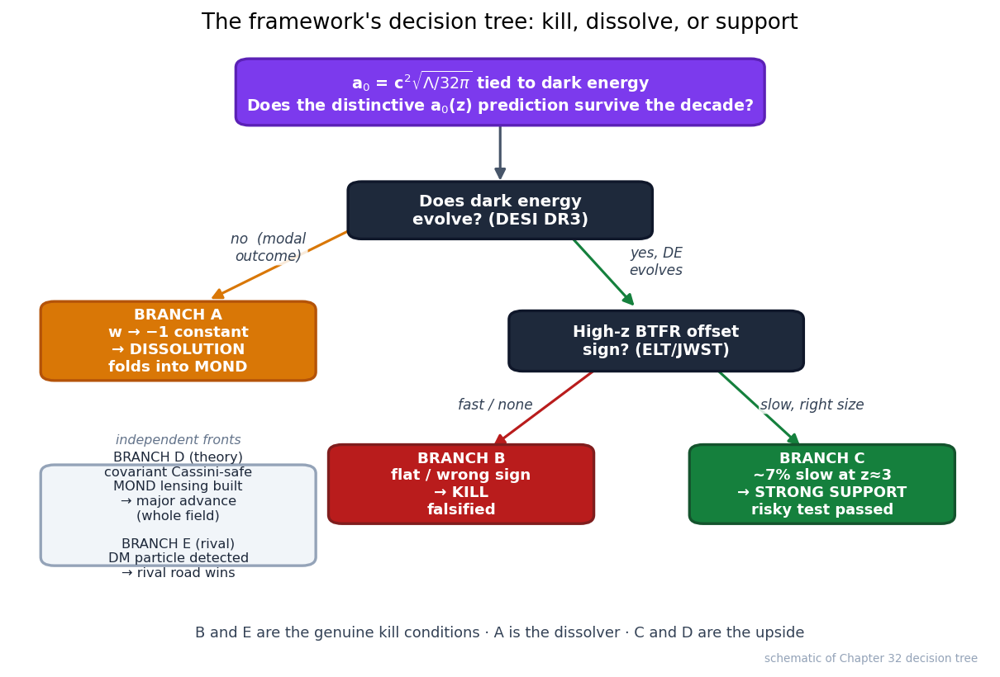

***Figure 32.1 — The decision tree, laid out before the data arrive.*** A schematic of the chapter's five branches: whether dark energy evolves (DESI DR3) gates everything, then the sign of the high-redshift Tully-Fisher offset (ELT/JWST) decides between kill (Branch B) and strong support (Branch C). Branch A is the gentle dissolver back into ordinary MOND and the single most likely outcome; Branches D (covariant lensing) and E (a dark-matter particle) are independent fronts. The colors encode the verdict, not the data, which has not yet arrived.

**Source:** Figure generated by [`book/figures/ch32_decision_tree.py`](https://github.com/carlzimmerman/zimmerman-formula/blob/main/book/figures/ch32_decision_tree.py). Schematic reproduction of the decision tree stated in this chapter; framework context in the main paper, [doi.org/10.5281/zenodo.20721540](https://doi.org/10.5281/zenodo.20721540), and the a₀(z) prediction paper, [doi.org/10.5281/zenodo.20737162](https://doi.org/10.5281/zenodo.20737162).

---

## The watchlist, item by item

Now the fun part. Here are the specific things to keep your eye on, what each one measures, roughly when to expect news, and — most importantly — exactly what each possible result would mean. Think of this as a sports schedule for an idea.

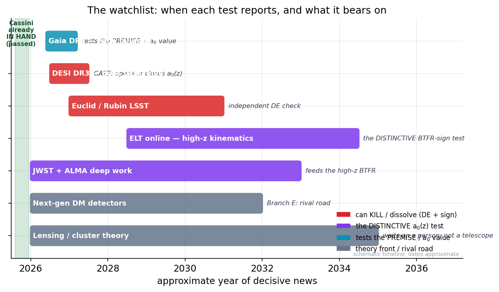

***Figure 32.3 — A sports schedule for an idea.*** A schematic timeline of the chapter's watchlist, with each bar placed at the approximate window when decisive news is expected and colored by what it bears on: the dark-energy gate and BTFR sign that can kill or dissolve the framework (red), the distinctive high-z a₀(z) test that only the giant telescopes can run (purple), the wide-binary premise test (teal), and the theory and rival-road fronts (grey). Cassini is marked as already in hand and passed. Dates are approximate and illustrative, drawn from the chapter's own stated expectations.

**Source:** Figure generated by [`book/figures/ch32_watchlist_timeline.py`](https://github.com/carlzimmerman/zimmerman-formula/blob/main/book/figures/ch32_watchlist_timeline.py). Schedule windows summarize the watchlist in this chapter; DESI evolving-dark-energy context from DESI DR2 2025, arXiv:2503.14738, and the framework's a₀(z) prediction, [doi.org/10.5281/zenodo.20737162](https://doi.org/10.5281/zenodo.20737162).

### 1. DESI's verdict on whether dark energy evolves

This is the big one, because everything distinctive about the framework hangs on it.

**DESI** — the Dark Energy Spectroscopic Instrument — is a telescope in Arizona that measures the precise three-dimensional positions of tens of millions of galaxies, building the largest map of the universe ever made. From the pattern in that map (a faint, ruler-like scale called the baryon acoustic oscillation, a frozen-in echo of sound waves from the early universe, Chapter 10) it reads off how fast the universe was expanding at different times. From *that*, it infers whether dark energy has been constant or changing.

In 2024 and 2025, DESI's early data releases caused a genuine stir: they preferred *evolving* dark energy — values around $w_0 \approx -0.75$ and $w_a \approx -0.86$ in the CPL parametrization — over the plain constant $w = -1$, at a significance that climbed into the few-sigma range when combined with supernovae and the cosmic microwave background. If that holds up, dark energy is not a simple constant, and the door to a₀(z) evolution is open.

But — and this is the honest part — that preference is *contested*. It depends on which supernova sample you fold in, on priors, and on assumptions about the early universe; under some reasonable choices the evidence for evolution softens toward something like $1.3\sigma$, which is not much at all. So the situation today is genuinely undecided. That is exactly why we *watch* rather than declare.

**What to watch for:** DESI's Data Release 3 (DR3), expected around 2026–2027, with more galaxies and tighter error bars. Later, the European *Euclid* space telescope and the Vera C. Rubin Observatory's LSST survey will weigh in independently through the rest of the decade.

**What each result means:**
- DR3 (and friends) settle on $w = -1$ → **dissolution branch.** Dark energy is constant; a₀ never evolved; the framework folds back into MOND.
- DR3 confirms and sharpens evolving dark energy → the stage is set for the *real* test, item 2 below. By itself this neither confirms nor kills the framework; it just keeps the distinctive prediction alive and makes the next item decisive.

### 2. The spin of distant galaxies (the high-redshift BTFR sign)

This is the cleanest, most framework-specific test there is, and I want to slow down on it.

Recall the **baryonic Tully–Fisher relation**, the BTFR (Chapter 18): a tight empirical law connecting how fast a galaxy's outskirts rotate to how much ordinary (baryonic) matter it contains. Roughly, the flat rotation speed to the fourth power is proportional to the baryonic mass, and the constant of proportionality involves a₀. So if a₀ were *different* in the distant past, galaxies of a given mass back then would rotate at a *different* speed than the same-mass galaxies today.

The framework makes a concrete, sign-specific prediction here. Because dark energy was — under the DESI evolving-DE numbers — slightly *denser* in the recent past and then thinner further back, the predicted a₀(z) curve is not a simple rise or fall. It is *non-monotonic*: a small bump of about +6% near redshift $z \approx 0.4$ (right around where the equation of state crosses the so-called phantom divide), and then a decline to roughly 0.74 of today's value by $z \approx 3$. A *lower* a₀ in the deep past means galaxies back then should rotate a touch *slower* than their mass would predict by today's law — about 7% slow at $z \approx 3$.

The *sign* is the prize. We don't need exquisite precision to start; we need to know whether high-redshift galaxies of a given baryonic mass sit *above* or *below* the local BTFR line. Slow (below) is the framework's prediction. Fast (above), or no offset at all, points the other way.

> **Worked Example: Turning a₀(z) into a rotation-speed offset**
>
> Let's do this one slowly, because it's the heart of the test.
>
> In the deep-MOND regime — the very weak-gravity outskirts where the framework and MOND agree on the *form* — the flat rotation speed $v_f$, the baryonic mass $M_b$, the gravitational constant $G$, and the acceleration scale a₀ are tied together by the BTFR:
> $$v_f^4 = G\, M_b\, a_0.$$
> Hold the galaxy's baryonic mass $M_b$ fixed (we compare same-mass galaxies near and far). Then $v_f^4 \propto a_0$, so
> $$v_f \propto a_0^{1/4}.$$
> Now suppose at $z \approx 3$ the framework predicts $a_0(z) = 0.74\, a_0(0)$. The fractional change in rotation speed is
> $$\frac{v_f(z)}{v_f(0)} = \left(\frac{a_0(z)}{a_0(0)}\right)^{1/4} = (0.74)^{1/4}.$$
> Let's compute $(0.74)^{1/4}$ carefully. Take it in two square-root steps:
> $$\sqrt{0.74} \approx 0.860, \qquad \sqrt{0.860} \approx 0.927.$$
> So $v_f(z)/v_f(0) \approx 0.927$ — about **7.3% slow** at $z \approx 3$. That fourth-root is doing something kind: it *softens* the signal (a 26% drop in a₀ becomes only a 7% drop in speed), which is why this test needs good high-redshift kinematics and large samples, not a single lucky galaxy.
>
> For contrast, a *rival* reading in which a₀ tracks the total matter-plus-energy density and therefore *rises* toward high z would push $v_f$ the other way and by a much larger amount — the two pictures differ by roughly $7.5\times$ in the size of the $z=3$ offset and, crucially, in its *sign*. That sign split is what makes the measurement diagnostic rather than a matter of squinting at error bars.
>
> One honest caveat carried from Chapter 26: at high redshift, galaxies are messier — more turbulent, more gas-rich, harder to assign a clean "flat rotation speed" to. Disentangling a genuine 7% a₀ effect from astrophysical evolution in the galaxies themselves is the hard part, and it is why this test belongs to the *late* 2020s and the 2030s, not next year.

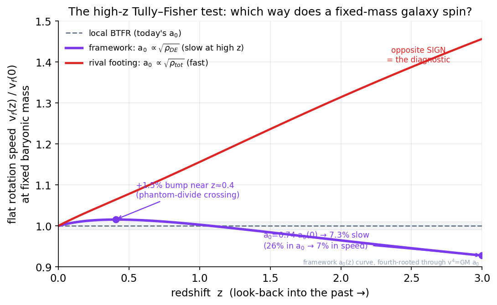

***Figure 32.2 — The sign is the prize.*** Computed from the framework's own equations: a₀(z) tracks √ρ_DE on a DESI-class evolving-dark-energy background (CPL w₀=−0.75, w_a=−0.86), and the baryonic Tully-Fisher law vₙ⁴ = G M_b a₀ turns it into a rotation-speed offset at fixed baryonic mass. The purple curve shows the framework's signature non-monotonic shape — a small +6% bump near the phantom-divide crossing at z≈0.4, then a decline to ~7% slow by z≈3. The red curve is the rival reading where a₀ instead tracks the total density and rises; the two differ most in their sign, which is exactly what makes the measurement diagnostic. Curves, not data — the high-z measurements belong to the late 2020s and 2030s.

**Source:** Figure generated by [`book/figures/ch32_a0z_btfr_offset.py`](https://github.com/carlzimmerman/zimmerman-formula/blob/main/book/figures/ch32_a0z_btfr_offset.py). Framework a₀(z) curve from [`opus_48_extended_research/papers/a0z_desi_figure.py`](https://github.com/carlzimmerman/zimmerman-formula/blob/main/opus_48_extended_research/papers/a0z_desi_figure.py) and [doi.org/10.5281/zenodo.20737162](https://doi.org/10.5281/zenodo.20737162); BTFR form from McGaugh 2012, AJ 143, 40; evolving-dark-energy background from DESI DR2 2025, arXiv:2503.14738.

**What to watch for:** rotation-curve and gas-kinematics measurements of galaxies at $z \approx 1$–$3$ from the **giant telescopes** — the Extremely Large Telescope (ELT) coming online around 2028–2029, plus continued deep work from the James Webb Space Telescope (JWST) and the ALMA radio array. The phrase to search for is "high-redshift baryonic Tully–Fisher relation."

**What each result means** (this assumes item 1 has confirmed evolving dark energy; if it hasn't, we're in the dissolution branch and this test loses its point):
- High-z galaxies sit *below* the local BTFR by roughly the predicted amount, with the predicted sign → **strong support** (Branch C). A risky prediction came true.
- High-z galaxies sit *on* the local line (no offset) or *above* it (the wrong-sign, rising-a₀ result) → **kill** (Branch B). The framework's lone distinctive prediction has failed against a confirmed evolving background.

### 3. The Solar-System bounds (Cassini and the wide binaries)

This item is different in character. It is not a prediction the framework is *waiting* to see confirmed; it is a place where the framework has *already passed a test that kills several of its cousins*, and where future data could still bite.

Here is the logic, and it is subtle, so take it slowly. The framework modifies **inertia**, not force (Chapter 21). That distinction matters enormously in the Solar System. Modified-*force* theories (and most relativistic-MOND constructions) add a fifth-force-like term that, in principle, perturbs planetary orbits — and the **Cassini** spacecraft's exquisite tracking of Saturn put a ferociously tight bound on any such extra force. A modified-*inertia* theory, by contrast, switches its extra effect *off* when accelerations are high, as they overwhelmingly are inside the Solar System; the planets feel essentially nothing new. So the framework is **Cassini-safe**, and that is not a small thing — it is the sharpest available knife between the modified-*inertia* road this book travels and the modified-*force* / relativistic-MOND road that AeST and similar theories travel. Cassini is, in the framework's own accounting, the cleanest discriminator we have *in hand* between those two roads, and it cuts in the framework's favor.

Then there are the **wide binaries** — pairs of stars orbiting each other at separations so large that their mutual gravitational acceleration dips down near a₀. These are a natural laboratory for any modified-dynamics idea, right here in our galactic neighborhood. The European *Gaia* mission is measuring the motions of these pairs with extraordinary precision.

**What to watch for:** Gaia's Data Release 4, expected around late 2026, with the precision to test wide-binary motions in the critical low-acceleration regime.

**What each result means** — and here I have to be especially careful, because this is a place where it is easy to manufacture either a false win or a false defeat:
- Gaia DR4 will primarily test the *premise* that dynamics depart from Newton at all near a₀, and the *value* of a₀. A clean Newtonian-only result across the low-acceleration regime would be a serious problem for the whole MOND family, framework included. A departure consistent with a₀ near $9.4 \times 10^{-11}\,\mathrm{m/s^2}$ would support the premise — and, notably, the framework's predicted boost in wide binaries is the *most Newtonian* end of the MOND family, because modified inertia with the external-field effect lands near a gentle $\sim$5–10% enhancement rather than the larger boost a naive modified-gravity reading gives. So a *small* effect is the framework-consistent expectation; a large, AeST-sized boost would actually sit in tension with the modified-inertia reading.
- The wide-binary front is, in honest summary, a test of the *premise and the a₀ value*, not a clean test of modified-inertia versus modified-gravity. The clean inertia-versus-gravity discriminator remains Cassini (already in hand) and, more exotically, certain relational cluster-dispersion signatures that are far harder to measure (Chapter 29).

### 4. The lensing wall and the cluster residual (theory fronts, not just data)

Two of the framework's deepest problems are not waiting on a telescope. They are waiting on a *person*.

The first is the **lensing wall** (Chapter 28). The framework — like AeST, the leading relativistic-MOND theory — cannot currently produce gravitational lensing (the bending of light by mass) from first principles in a way that is both fully covariant, in the precise sense General Relativity demands, *and* automatically safe in the Solar System. A no-go theorem blocks the obvious routes. So lensing is handled phenomenologically — fit, not derived. This is a real weakness, stated plainly, and it is *shared* with the rest of the relativistic-MOND family rather than unique to this framework.

The second is the **cluster residual** (Chapter 29). Galaxy clusters keep a leftover mass discrepancy that MOND — and this framework with it — reduces but does not fully cure. A density-dependent reading of a₀ gets the rough size of the leftover to within tens of percent with zero new parameters, which is genuinely interesting, but "understand to order" is not "solve," and I will not pretend otherwise.

These are **open problems** — well-posed questions with no accepted answer yet, the kind that sit in a field for years until someone finds the right angle. The covariant modified-inertia completion (a fully relativistic version of the whole mechanism) is another. None of these is *proven* impossible (except in the specific, scoped sense of the lensing no-go), which means each is a live target for a clever theorist.

**What to watch for:** preprints. A covariant, Cassini-safe lensing construction, or a cluster cure that doesn't break something else, would each be a significant event. If it comes, it will appear first as a paper, not a press release.

**What each result means:**
- Someone constructs covariant, Solar-System-safe MOND lensing → **Branch D, a major advance** for the modified-dynamics road generally. It would not single out this framework, but it would pull down one of the field's tallest walls.
- The walls stay up through the decade → the framework, and MOND broadly, remain *incomplete* relativistic theories. Not falsified — incomplete. The honest word stays *incomplete.*

### 5. The particle hunt and the Lorentz-violation interface

Two more, briefly, because they bear on which *road* wins rather than on the framework's internal predictions.

The **dark-matter particle search** grinds on (Chapter 6). The next-generation underground detectors will push sensitivity another order of magnitude or more over the coming years. A clean, reproduced direct detection would be Branch E — the rival road vindicated. The modified-dynamics program would not vanish (someone would still have to explain why the radial-acceleration relation is so absurdly tight), but the wind would go decisively out of its sails. Conversely, continued null results extend a fifty-year drought that has already excluded the most natural particle candidates — suggestive, but, as we were careful to say in Chapter 6, *not* a proof of the alternative.

And there is the **Lorentz-violation interface** (Chapter 30). Because the framework picks out a preferred cosmic frame, it behaves like a background in the Standard Model Extension, the general bookkeeping scheme physicists use to catalog tiny violations of Einstein's rule that all frames are equivalent. The framework therefore *induces* a small, computable Lorentz-violation coefficient and a sharp, falsifiable theorem: the violation it predicts is "Lorentz-violating but CPT-preserving." Tabletop and astrophysical experiments that hunt for exactly this kind of effect are improving steadily. I want to be precise about the verb, because the quarantine in this book is strict: the framework **induces** this coefficient from the a₀ it already has; it does **not derive** a₀, or Z, or κ, or any Standard-Model quantity. The interface is a consistency bridge to live particle-physics experiments, not a theory of everything sneaking in the back door.

---

## How to read the news for yourself

You now have the watchlist. Let me close the practical part with the most durable gift I can give you: a little **scientific literacy** — the set of habits that let you judge a claim on its merits instead of by who shouts loudest or who has the fanciest affiliation. These habits work far beyond this one framework; they are how you stay free in an age of confident headlines.

**First, separate the measurement from the interpretation.** When a paper appears — and most science now appears first as a *preprint*, an early draft posted publicly (on the arXiv server) before formal peer review — read for two different things. What did they actually *measure*? And what do they *claim it means*? These are not the same, and the gap between them is where most overreach lives. "DESI measured the expansion history" is a measurement. "Dark energy is evolving" is an interpretation that depends on which other data you fold in and which priors you assume. Both can be in the same paper; keep them separate in your head.

**Second, ask what would have changed the author's mind.** A trustworthy claim comes with its own kill conditions. If a paper (or a theory, or a person) cannot tell you what result would have proven them wrong, treat the claim as decoration until they can. Apply this to *this very book.* I have tried, throughout, to tell you exactly what would dissolve or kill the framework. Hold me to it.

**Third, watch the verbs.** "Derived" is a strong word; "induced," "consistent with," "fit to," and "posited" are weaker and more honest ones. A great deal of confusion in popular science comes from a weak relationship dressed in a strong verb. In this book the strong verb is reserved for very little: the *form* of the a₀ relation and the $\sqrt{8\pi/3}$ kernel are *forced*; almost everything else — the *value* of a₀ through κ, anything touching the Standard Model — is explicitly *not* derived. When you read elsewhere, notice when "suggests" has quietly become "proves" between the abstract and the press release.

**Fourth, weigh significance honestly, in both directions.** A "$3\sigma$ hint" is interesting but routinely evaporates; a "$5\sigma$ detection" is the usual bar for a discovery in physics, and even that has occasionally failed to replicate. Resist the pull to round a tantalizing result up *or* a disappointing one down. The same DESI signal that excites me at one significance softens to $\sim 1.3\sigma$ under other reasonable choices — and an honest reader has to hold both of those facts at once, without picking the one that flatters the conclusion they were hoping for.

**Fifth, prefer the boring explanation until it fails.** Most anomalies are eventually explained by something mundane — a calibration error, an overlooked systematic, an underestimated uncertainty. This is not cynicism; it is the base rate. A new law of physics is the *last* hypothesis standing, not the first one reached for. The framework in this book has to clear that same bar, and it has not cleared it yet.

If you do only these five things, you will read the coming decade's headlines better than a great many people who get paid to write them.

> **Deeper Dive: A reader's checklist for a fresh a₀(z) or BTFR preprint**
>
> When the inevitable "high-redshift BTFR" papers start landing, here is a concrete checklist for reading one on its own terms — the same discipline this book tried to apply to itself.
>
> 1. **Which a₀ convention and footing?** Is a₀ pinned to the pure dark-energy density ($\rho_{\rm DE} \to a_0 \approx 9.36\times10^{-11}$) or to the total density ($\rho_{\rm total} \to \approx 1.13\times10^{-10}$)? The two footings give different curves and different signs of evolution. A verdict that doesn't state its footing is non-diagnostic.
> 2. **Which interpolation function and mass-to-light ratio?** The inferred a₀, and any claimed offset, depend jointly on the assumed interpolation function $\nu$, the stellar mass-to-light ratio $\Upsilon$, *and* the scatter metric. A claimed "a₀ is off by 20%" is frequently an artifact of choosing a different $\nu$ or $\Upsilon$ than the framework's own. Demand to see the result under the framework's *own* de Sitter–Unruh interpolation, $g_{\rm obs} = \sqrt{g_{\rm bar}^2 + g_{\rm bar}\,a_0}$, not only under a textbook default.
> 3. **What is the dark-energy background they assume?** A high-z BTFR offset can only test a₀(z) against an *assumed* expansion history. If they assume $w=-1$, they have built the dissolution branch into their analysis from the start, and a null offset is then a tautology, not a test.
> 4. **Sign first, magnitude second.** The robust, diagnostic quantity is the *sign* of the offset (slow vs. fast at high z), because the fourth-root softens magnitude and the competing readings differ in sign. Be suspicious of a paper that leads with a precise magnitude before it has nailed the sign.
> 5. **Is the claimed effect framework-distinctive or MOND-shared?** Most galaxy- and cluster-scale successes (the radial-acceleration relation, the local BTFR) are *shared* across the entire MOND family and are *not* evidence for *this* framework specifically. Only the a₀(z) *tracking* is distinctive. A paper claiming the framework is "confirmed" by the local RAR has confused shared content for distinctive content.
>
> Run any new claim — for *or* against — through these five, and you will rarely be fooled, in either direction. The asymmetry to guard against cuts both ways: do not manufacture a win from a shared success, and do not manufacture a deficit from a convention artifact.

---

## The honest standing, one last time

Let me gather it all in plain language, because you deserve the summary undisguised.

The framework offers a genuinely appealing idea: that the mysterious acceleration scale a₀, which governs the spin of galaxies, is not an independent fundamental constant but is set by dark energy — the same dark energy that makes the universe's expansion accelerate. The *form* of that connection, $a_0 = c^2\sqrt{\Lambda/32\pi}$, is forced by the mathematics through several independent routes, including the $\sqrt{8\pi/3}$ kernel with its tell-tale $\sqrt{\pi}$ (the Einstein $8\pi$ married to the Friedmann $3$). The mechanism — de Sitter–Unruh modified inertia — is built on real, published physics (Milgrom's modified inertia, the Deser–Levin temperature). And the result is a provably *one-parameter* theory of gravity and the dark sector, one geometric knob (κ = ½) against ΛCDM's six parameters plus an undetected particle. That is a real and unusual kind of economy.

And the walls are real, and I have tried never to hide them. The *value* of a₀ is not derived — κ is a posit, so this is a one-parameter theory, not a zero-parameter one. The Standard Model of particle physics is entirely walled off: no particle masses, no proton-to-electron mass ratio, no Koide relation, no gauge group — none of it is derived, and the book never claims otherwise. Gravitational lensing stays phenomenological behind a no-go theorem. Clusters keep a residual the framework, like MOND, does not fully cure. The headline galaxy-scale successes are *shared* with the entire MOND family, not unique to this picture. And the one distinctive prediction — a₀ tracking dark energy through time — is *non-diagnostic today* and *hostage* to whether DESI's evolving dark energy survives, which is itself contested down toward $\sim 1.3\sigma$ under some reasonable priors.

This is one independent researcher's proposal, facing a skeptical mainstream that overwhelmingly — and for good, hard-won reasons — favors particle dark matter. It is **not a theory of everything yet, as frustrating as it may be.** It is a clean, falsifiable, economical idea that the next decade of data will confirm, dissolve, or kill. That is not a small thing for an idea to be. Most ideas never even earn the right to be tested.

So here is my last word, and it is not a verdict — it is an invitation. You do not have to believe me. You do not have to disbelieve me. You have something better than belief now: you have the map. You know what DESI is measuring and what its DR3 will mean. You know why the *sign* of a distant galaxy's spin is the cleanest test there is, and why it belongs to the giant telescopes of the 2030s. You know that Cassini already cut in the framework's favor and that Gaia's wide binaries are testing the premise as you read this. You know which words to trust — *forced*, *posited*, *induced* — and which to distrust. And you know the difference between an idea that dies, an idea that dissolves, and an idea that quietly comes true.

Go watch it happen. Read the preprints when they land. Hold everyone — me most of all — to their stated kill conditions. The universe is about to vote, slowly, over years, in the patient language of measurement. You are now equipped to read the ballots as they come in.

That is the whole point of a beautifully geometric universe: it does not ask for your faith. It offers you a number, $a_0 = c^2\sqrt{\Lambda/32\pi}$, ties it to the sky, and dares the sky to disagree. Whatever the sky says — and it may well say no — you will be there to hear it, and you will understand what you are hearing.

That is enough. That is, in the end, what knowing would take.

---

## Summary

- This chapter is a **watchlist**, not a verdict: a map of the specific measurements over roughly the next decade that will confirm, dissolve, or kill the framework, so you can follow the story yourself.
- **Kill conditions** say an idea is *wrong*; **falsification** is a kill condition firing. **Dissolution** is different and gentler — it shows the framework's distinctive content was never doing any work, collapsing it back into ordinary MOND without proving it false.
- The **decision tree**: (A) dark energy reverts to constant $w=-1$ → *dissolution* to MOND, the most likely single outcome; (B) evolving dark energy confirmed but high-z galaxy spins flat or wrong-sign → *kill*; (C) evolving DE plus correctly-signed high-z BTFR offset → *strong support*; (D) covariant Cassini-safe MOND lensing constructed → *major advance* for the whole field; (E) a dark-matter particle directly detected → *the rival road vindicated.*
- The **watchlist**: DESI DR3 (~2026–27) on whether dark energy evolves; the *sign* of the high-redshift baryonic Tully–Fisher offset from ELT/JWST/ALMA (late 2020s–2030s), where the framework predicts galaxies ~7% slow at $z\approx3$; the Solar-System bounds, where the framework is already **Cassini-safe** (its sharpest advantage over modified-force rivals) and Gaia DR4 (~late 2026) tests the wide-binary premise; the lensing and cluster theory fronts, waiting on a clever person rather than a telescope; and the ongoing particle hunt and Lorentz-violation interface.
- **Scientific literacy** in five habits: separate measurement from interpretation; ask what would change the author's mind; watch the verbs (*forced* and *induced* are honest; *derived* is strong and rare here — and a₀'s value is *never* derived); weigh significance honestly in both directions; and prefer the boring explanation until it fails.
- The honest standing: a forced *form*, a real mechanism, a one-parameter economy — set against an underived a₀ value, a walled-off Standard Model, a phenomenological lensing wall, an uncured cluster residual, MOND-shared successes, and a distinctive prediction that is non-diagnostic today and hostage to contested DESI data. **It is not a theory of everything yet, as frustrating as it may be** — but it is a clean, falsifiable idea, and you are now equipped to watch the universe vote on it.

## Questions

1. **(Easy)** In your own words, what is the difference between a kill condition and a dissolver? Give the framework's clearest example of each.

2. **(Easy)** The framework predicts that galaxies at redshift $z\approx3$ rotate about 7% *slower* than today's baryonic Tully–Fisher law would predict for their mass. Which direction (slower or faster) would *kill* the framework, assuming dark energy has been confirmed to evolve, and why?

3. **(Medium)** Using the deep-MOND relation $v_f^4 = G M_b a_0$, show that if a₀ at some redshift is 0.85 times its present value, the flat rotation speed of a fixed-mass galaxy is reduced by about 4%. (Compute $(0.85)^{1/4}$.)

4. **(Medium)** Why is Cassini described as the framework's "sharpest available knife" between the modified-*inertia* road and the modified-*force* road, while Gaia's wide binaries are described as testing mainly the *premise* rather than cleanly separating those two roads? What property of modified inertia makes the framework Cassini-safe?

5. **(Harder)** Suppose DESI DR3 settles firmly on $w=-1$. Explain carefully why this *dissolves* rather than *falsifies* the framework, and state precisely what part of the framework still holds and what part loses its meaning. Then explain why "the framework was wrong" would be an inaccurate headline for that outcome.

6. **(Research-level)** The lensing wall is a *scoped* no-go theorem, not a law of nature. Read about AeST (the leading relativistic-MOND theory) and the assumptions of the lensing no-go discussed in Chapter 28 (covariance, $c_T = c$, ghost-freedom). Identify which single assumption you would most want to relax to attempt a covariant, Cassini-safe MOND lensing construction, and explain what physical price (e.g., a preferred frame, a new field, modified gravitational-wave speed) you would expect to pay for relaxing it.
