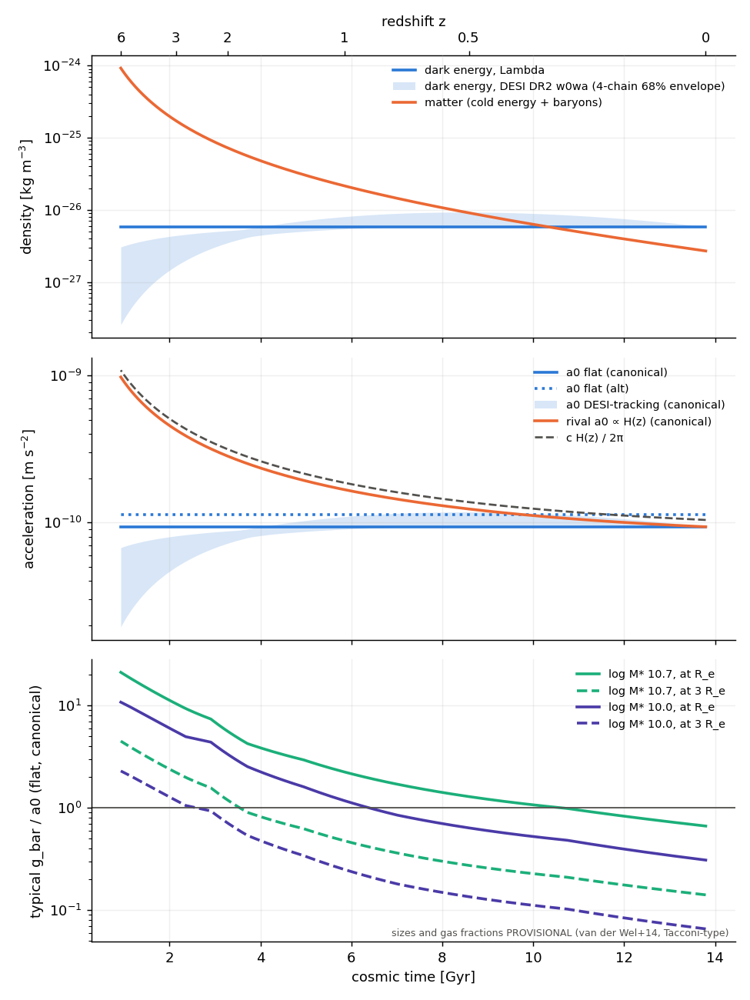

# CFG547 timeline map, z = 0–6 (DESCRIPTIVE)

Every number below comes from `cfg547_results.json` (`timeline`, `desi_envelope`, `test_c`). This map is descriptive and carries no verdict. κ = ½ is FITTED. The cold energy's mass is required. Footings: canonical 9.36e-11, alt 1.13e-10 m s⁻², never pooled. The background is flat ΛCDM with Ω_m 0.315 and H0 67.4, radiation neglected. The DESI columns use the DR2 w0wa chains (CPL). Beyond z ≈ 2.5 they are a CPL extrapolation.

**Typical galaxies.** These are main-sequence discs at fixed log M★ 10.7 and 10.0. Sizes follow van der Wel+14 late types and gas follows the record's Tacconi-type μ_gas (CFG217). Both are recalled values and **PROVISIONAL**. Stars and gas sit in one thin exponential disc. a0 is flat and on the canonical footing unless a column says otherwise.

## Cosmic columns

| z | age (Gyr) | ρ_DE Λ (kg m⁻³) | ρ_DE DESI / ρ_DE(0): median [4-chain 68% envelope] | ρ_m (kg m⁻³) | H (km/s/Mpc) | cH (m s⁻²) | a0 DESI / a0(0) | a0 rival / a0(0) = E(z) | a0/cH canonical / alt |
|---|---|---|---|---|---|---|---|---|---|
| 0 | 13.80 | 5.85e-27 | 1 | 2.69e-27 | 67.4 | 6.55e-10 | 1 | 1 | 0.143 / 0.173 |
| 0.5 | 8.59 | 5.85e-27 | 1.15 [1.03, 1.59] | 9.07e-27 | 89.1 | 8.66e-10 | 1.074 [1.015, 1.261] | 1.32 | 0.108 / 0.131 |
| 1 | 5.85 | 5.85e-27 | 1.04 [0.93, 1.37] | 2.15e-26 | 120.7 | 1.17e-9 | 1.021 [0.964, 1.172] | 1.79 | 0.080 / 0.096 |
| 2 | 3.27 | 5.85e-27 | 0.74 [0.60, 0.88] | 7.26e-26 | 204.3 | 1.99e-9 | 0.862 [0.771, 0.936] | 3.03 | 0.047 / 0.057 |
| 3 | 2.14 | 5.85e-27 | 0.53 [0.28, 0.75] | 1.72e-25 | 307.7 | 2.99e-9 | 0.727 [0.533, 0.866] | 4.57 | 0.031 / 0.038 |
| 4 | 1.54 | 5.85e-27 | 0.39 [0.14, 0.65] | 3.36e-25 | 426.6 | 4.14e-9 | 0.624 [0.377, 0.809] | 6.33 | 0.023 / 0.027 |
| 6 | 0.93 | 5.85e-27 | 0.23 [0.04, 0.52] | 9.22e-25 | 702.8 | 6.83e-9 | 0.483 [0.209, 0.722] | 10.43 | 0.014 / 0.017 |

Dark-energy epochs:
- **ρ_DE = ρ_m:** z_eq = 0.296 (Λ); 0.33–0.36 (DESI chain-median points).
- **Acceleration begins (q = 0):** z_acc = 0.632 (Λ); 0.74–0.78 (DESI + SN chains). The CMB-only chain's median point does not accelerate today.

**a0 against cH: TAUTOLOGICAL.** a0/(cH) = κ √(3 Ω_DE(z)/8π) is the definition of a0 rewritten. At z = 0 it gives 0.1430. The canonical footing gives 0.1429.
- The record's "a0 ≈ cH0/2π" (cH0/2π = 1.042e-10) would need Ω_DE = 2/(3πκ²) = 0.849.
- a0 falls below cH by a further factor of 10 by z = 6. The coincidence belongs to the present epoch only. It is the cosmic coincidence (Ω_DE ~ Ω_m) seen through the definition.

## Typical log M★ 10.7 disc (flat a0, canonical)

| z | R_e (kpc) | μ_gas | log M_b | g_bar/a0 at R_e | at 3 R_e | disc mass in the law's regime | f_DM(<R_e) predicted | t_ff(R_e) (Myr) | census edge f_ret 0.1 (kpc) | r_ta of the catchment (kpc) | r_200c (kpc) | edge f_ret 1 (kpc) | t_ff(edge) (Gyr) |
|---|---|---|---|---|---|---|---|---|---|---|---|---|---|
| 0 | 8.57 | 0.05 | 10.72 | 0.66 | 0.14 | 1.00 | 0.44 | 54 | 478 | 1535 | 316 | 52 | 3.24 |
| 0.5 | 6.61 | 0.21 | 10.78 | 1.29 | 0.27 | 0.34 | 0.32 | 38 | 514 | 1074 | 275 | 56 | 3.36 |
| 1 | 5.50 | 0.46 | 10.86 | 2.25 | 0.48 | 0.15 | 0.22 | 28 | 564 | 857 | 239 | 61 | 3.52 |
| 2 | 3.98 | 0.91 | 10.98 | 5.63 | 1.20 | 0.03 | 0.09 | 16 | 647 | 626 | 185 | 70 | 3.77 |
| 3 | 3.08 | 1.13 | 11.03 | 10.44 | 2.22 | 0.01 | 0.04 | 11 | 682 | 486 | 146 | 74 | 3.87 |
| 4 | 2.61 | 1.13 | 11.03 | 14.58 | 3.10 | 0.00 | 0.02 | 8.5 | 682 | 389 | 117 | 74 | 3.87 |
| 6 | 2.03 | 0.86 | 10.97 | 21.11 | 4.49 | 0.00 | 0.01 | 6.2 | 638 | 266 | 80 | 69 | 3.74 |

**Typical log M★ 10.0 disc (flat a0, canonical).**

| z | g_bar/a0 at R_e | g_bar/a0 at 3 R_e | disc mass in the law's regime | f_DM(<R_e) |
|---|---|---|---|---|
| 0 | 0.31 | 0.07 | 1.00 | 0.57 |
| 1 | 1.18 | 0.25 | 0.39 | 0.34 |
| 2 | 3.36 | 0.71 | 0.07 | 0.16 |
| 3 | 5.57 | 1.18 | 0.03 | 0.09 |
| 6 | 10.78 | 2.29 | 0.01 | 0.04 |

On the alt footing at z = 0 (log M★ 10.7), g_bar/a0 at R_e is 0.55 and f_DM is 0.48.

## What the map shows

1. **Galaxy baryons move out of the law's regime toward high z.** Under flat a0, g_bar(R_e)/a0 grows as (1+z)^2.06 (log M★ 10.7) or (1+z)^2.20 (log M★ 10.0), fitted over z ≤ 3. About 1.5 of that power comes from the shrinking sizes; the rest comes from the rising gas fraction.
   - The share of a typical disc's baryons in the law's regime falls from all of them at z = 0 to 15% (log M★ 10.7) or 39% (10.0) at z = 1, and to 1–3% at z = 3.
   - High-z discs are near-Newtonian inside R_e because their baryons are compact and gas-rich, with nothing changing in a0. This matches the record's high-z finding (CFG566/567/535) as a description.
2. **The rival does the opposite.** With a0 ∝ H(z), a0 grows ×3 by z = 2 and ×10 by z = 6. That roughly cancels the compaction, so the rival keeps the outskirts of typical discs in the law's regime at every z (test b).
3. **Settling inside galaxies is fast. Settling to the census edge is not.**
   - t_ff(R_e) is 6–54 Myr, under 1% of the age at every z.
   - t_ff at the census edge is about 3.2–3.9 Gyr at every z. This follows from the edge's definition: g_N(edge) = a0 s², so t_ff(edge) ∝ (G M_b)^{1/4} a0^{−3/4}, which does not depend on the epoch under flat a0.
   - That time exceeds the age of the universe above z ≈ 1.75 (log M★ 10.7) to z ≈ 2.3 (log M★ 10.0), both on the canonical footing (C3).
   - In the same window the census edge overtakes the catchment's turnaround radius: edge/r_ta = 1 at z ≈ 1.9–2.8 (C2). This is expected: turnaround is defined by t_ff ~ age, so C2 and C3 are the same statement twice.
   - Both are conditional on the free-fall settling rate. CFG541 found the rate coefficient FREE, and at α = 0.5 drift-only settling takes 16–20 Gyr.
4. **The cold energy clumps before dark energy matters.** ρ_m/ρ_DE is 12 at z = 2 and 160 at z = 6. Dark energy only enters galaxies through a0, and a0 changes by at most about ±0.04 dex (DESI, z ≲ 2.5).
