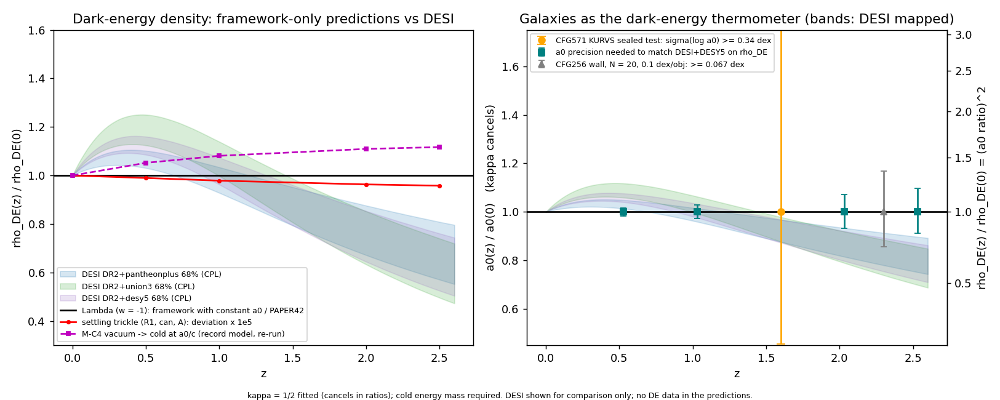

# CFG549: can the framework predict how the dark-energy density evolves?

**One-line answer: no, apart from a trickle too small ever to observe.**
- Built from its own ingredients only (κ fitted to galaxies, the cosmic cold amount, f_b, CMB-only cosmology, the settling physics), the
  framework predicts ρ_DE(z) = constant (Λ), plus a settling trickle of a few × 10⁻⁷.
- Any real evolution, such as the one DESI hints at, is FREE in the framework. It can only be MEASURED, either by DESI or by galaxies
  through a₀(z)/a₀(0) = √(ρ_DE(z)/ρ_DE(0)).

κ = ½ is FITTED. The cold energy's mass is required. No DESI, DES or SN number went into any prediction: the prediction JSON was hashed
(`PREDICTIONS_HASH.txt`) before the chains were opened. This is not "theory closed", and nothing here says the data favour the framework.

*Left:* ρ_DE(z)/ρ_DE(0) for:
- Λ;
- the DESI DR2 68% bands, for comparison only;
- the settling trickle, with its deviation magnified 10⁵ times;
- the record's M-C4 model.

*Right:* the galaxy channel. a₀(z)/a₀(0) on the left axis and ρ_DE ratio = (a₀ ratio)² on the right; κ cancels. Error bars mark three
precisions:
- what matching DESI+DESY5 would take;
- the CFG256 calibration wall;
- CFG571's sealed KURVS test.

## What the framework PREDICTS

| prediction | number (from `cfg549_predictions.json`) |
|---|---|
| **Settling trickle (R1).** The energy released as cold energy settles, fed into a w = −1 sink (the maximal case) | Δρ_DE/ρ_DE today = **2.0e-7 to 8.5e-7** (branch B to A, canonical and alt footings). It would be ≤ 2.6e-6 if the sink took the whole binding energy, as CFG542's Q does |
| its equation of state | w = −1 − (1.5 to 6.3)e-8 today; max \|1 + w\| = **3.8e-8 to 1.6e-7** at z ≤ 2.5. It sits on the phantom side (ρ_DE grows), the opposite sign to DESI's w₀ > −1 |
| its a₀(z) | a₀(2.5)/a₀(0) = 0.99999979 |
| is it observable? | **No, never.** It is 10⁴ times below a generous 1e-3 floor for any future background survey. MUTATE MU1: with Q multiplied by 10⁶, DESI excludes it (d² − d²_Λ = +65 to +98), so the test has the power to see a source that size |
| **The bulk (R3).** Every closure route | none forces ρ_DE(z). The level ρ_Λ is an integration constant, and any w(z) ≠ −1 is an unconstrained function |

**Frozen DESI DR2 test of the derived prediction.** The prediction (Λ plus the trickle) is indistinguishable from Λ: d² − d²_Λ = 0.00 in
every chain. So it inherits ΛCDM's standing against DESI:
- d² = 9.22 / 14.44 / 18.79 (+Pantheon+ / +Union3 / +DESY5);
- the verdict is **TENSION**: at least 2σ in every SN chain, but not 3σ in all three, because Pantheon+ is at 9.22 < 11.83.

If DESI's evolving dark energy firms up, the framework has no derived mechanism that produces it. The trickle even pushes the wrong way.

## What it can only MEASURE: galaxies as the dark-energy thermometer (R2)

a₀(z)/a₀(0) = √(ρ_DE(z)/ρ_DE(0)), and κ cancels exactly (MUTATE MU2: deviation 3e-16). This is the framework's own channel for measuring
dark-energy evolution with galaxies alone, independently of DESI.

| z | DESI+DESY5 68% half-width on log ρ_DE ratio | a₀-ratio precision to match it | discs per z-bin needed (CFG256 wall, 0.1 / 0.2 dex per disc) |
|---|---|---|---|
| 0.5 | 0.014 dex | 0.007 dex | 1730 / 6900 |
| 1.0 | 0.024 | 0.012 | 640 / 2600 |
| 2.0 | 0.061 | 0.030 | 97 / 390 |
| 2.5 | 0.081 | 0.040 | 56 / 220 |

- The galaxy channel competes best at **z ≈ 2–2.5**, where DESI is weakest. There, 60–100 deep-regime discs per bin at 0.1 dex each,
  with a fully self-calibrated design, would match DESI on ρ_DE.
- **CFG571's sealed tests** translate into ρ_DE constraints as follows:
  - the gas-mass response to a₀ is 0.33–0.72 dex per dex;
  - with the frozen 0.15 dex systematic floor, the KURVS sample gives σ(log a₀ ratio) ≥ 0.21–0.46 dex;
  - that is σ(log ρ_DE ratio) ≥ **0.42–0.92 dex at z ≈ 1.6**, about 10–30 times weaker than DESI.
  - They test flat a₀ against a₀ ∝ H(z), not ρ_DE evolution: F-DESI and F-flat differ by ≤ 0.02 dex in gas mass.
- **The CFG511 fork** (a₀ ∝ √ρ_DE against a₀ ∝ √(−p_DE)).
  - Under the framework's own prediction the two readings are identical, because w = −1 to 1e-7.
  - Under DESI they would separate by +0.09 / +0.17 / +0.13 dex at z = 2.5 (Pantheon+ / Union3 / DESY5).
  - Separating them needs a galaxy a₀(z) together with an independent H(z). Galaxies alone measure only one of the two combinations.

## What it leaves FREE

- **ρ_Λ itself.** κ is fitted, so a₀ does not fix it independently; the Ω_Λ-from-a₀ rung is circular, as the record already says.
- **Any w(z) ≠ −1.** Neither the settling physics, the caps, the switch nor CFG542's partner field supplies an equation for it.
  - CFG542 derives the source Q, but takes the partner's w(z) as an input.
  - A canonical partner is singular at w = −1.

## Record models of dark-energy dynamics, tested independently

| model | provenance | DESI DR2 frozen test |
|---|---|---|
| Λ: a₀ a constant of the Lagrangian; PAPER42 with a fixed kernel ⇒ w = −1 | DERIVED | TENSION (9.22 / 14.44 / 18.79) |
| Λ plus the settling trickle (R1) | DERIVED | TENSION, identical to Λ |
| M-C4: vacuum → cold at Γ = a₀(t)/c (CFG360 C4, zero new constants, rate posited rather than derived from an action), re-run | DERIVED (posited rate) | (w₀, w_a) = (−0.961, −0.038) canonical, (−0.954, −0.044) alt. TENSION (8.10 / 12.76 / 14.32) |
| PAPER42's zero-field energy evaluated with ν_mono | DERIVED | fixes Λc⁴/a₀² = 2π⁴/15 = 12.99 exactly, i.e. κ = √(60/π³) = 1.39 against the fitted 0.417 ± 0.095 (+10.3σ). Its coefficient FAILS |
| CFG507 M1, running vacuum ν 3H²/8πG | RESTATEMENT | ν is free |
| CFG511 O1, elastic vacuum | USES DE DATA | w(z) is an input |
| CFG368 F1–F4, cold ↔ vacuum flows | USES DE DATA | Γ fitted to DESI |
| DE1–DE13 gate lanes | NO DE DYNAMICS | Λ assumed |

On M-C4:
- It is the only derived model that moves away from Λ. It moves in DESI's w₀ direction, but its w_a ≈ 0.
- It sits closer to DESI than Λ in three of the four chains (Δd² −1.1 / −1.7 / −4.5) and is still in TENSION.
- Its rate is a posit, and it puts 10% more cold energy in place today than the CMB extrapolation. θ* was not refit. CFG541's sink also
  runs the other way (cold → DE).

## Consistency (R4)

If ρ_DE(z) follows DESI, the a₀(z) it implies stays within the record's high-z constraints:
- the maximum |Δlog a₀| at z ≤ 2.5 is 0.08–0.11 dex at the chain medians, inside the ±0.15 dex calibration band;
- KiDS z-split: Z = +1.5 for both footings and every chain.

The frozen rule nevertheless reads **TENSION**. The trigger is CFG547's native route O2 (|Z| = 2.08–2.09), and FLAT a₀ fails that route
too (Z −2.3). It is the calibration wall, not a DESI-specific tension. **NOT DIAGNOSTIC.**

One derived consequence, the ratchet (R3d):
- Class-A settling is one-sided, so a falling ρ_DE would leave local galaxies reading the past maximum of a₀.
- Under DESI that is +0.016 to +0.038 dex, which would bias κ_fit high by 4–9%. That is inside κ's ±23%.
