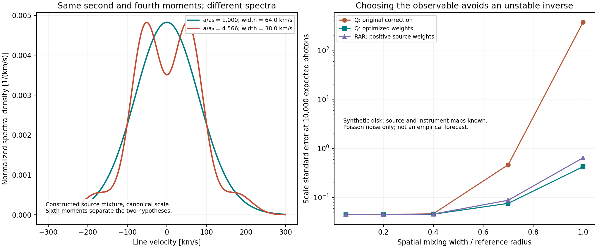

# Fresh campaign, second checkpoint: AFG-004–008

**Result:** the proposed spectral test now has an explicit geometry/PSF/line
response calculation for both the algebraic core and the exponential RAR
branch. It also has an exact counterexample showing when gravity-scale
inference is ambiguous. All new observations here are synthetic; the full
gravity objective remains open.

## What advanced

1. **Removed the common-radius/common-projection restriction.** Weight the
   fourth moment by the known source geometry rather than dividing each
   velocity by its projection. Near-minor-axis points need no singular division.
2. **Derived the exact condition for correcting heterogeneous broadening after
   spatial blurring.** It becomes a linear equation in observation weights.
   Gaussian and symmetric non-Gaussian synthetic lines both pass.
3. **Constructed an exact scale–broadening ambiguity.** The vacuum scale and
   a scale larger by E(3)=4.5656 can produce identical second AND fourth moments
   for the same specified source mixture. Their sixth moments differ. The full
   spectra are therefore not identical; this is a limitation of two-moment
   inference.
4. **Derived weights that reduce noise without reconstructing every source
   velocity.** In one strong-blur synthetic case, the algebraic scale's standard
   error drops from 373.8 to 0.422 at 10000 expected photons. This large gain
   diagnoses how poor the initial inverse was; it is not empirical precision.
5. **Extended the calculation to RAR independently.** Nonnegative effective
   source weights give a strictly monotone RAR scale inversion. Treating those
   RAR moments as the algebraic branch instead would create about a 14% false
   scale shift in the well-resolved synthetic example.

## A concrete ambiguity, on both registered normalizations

For the two-component synthetic source in the derivation, at a reference
radius of 5 kpc:

| Hypothesis | Canonical broadening width | Alternative-normalization width |
|---|---:|---:|
| Vacuum scale a/a_today=1 | 64.0 km/s | 70.3 km/s |
| H-scaling at z=3, a/a_today=4.5656 | 38.0 km/s | 41.7 km/s |

Both give exactly the same observed second and fourth moments. The sixth
Gaussian-invariant even-moment combination differs by 0.06610 in the specified
dimensionless units. This is a testable way to distinguish these two fixed
models, not a claim that real objects have those widths or source populations.



## What can still defeat the measurement

* **Lost spatial information:** coarsening 64 source cells to 16 measured pixels
  eliminates the exact linear invariant for the tested varying-width map.
  Constant-width broadening on the same coarsened grid still permits it.
  This concerns this nuisance-cancelling estimator class, not all model fits.
* **Calibration uncertainty:** a 10% error in the broadening width shifts the
  inferred algebraic scale by roughly 22–31% in these tests. An exact scoped
  proof shows that no fixed two/fourth-moment linear estimator can be immune
  to an unknown common width calibration while cancelling every latent velocity
  configuration, when all source widths are positive.
* **Kernel mismatch:** Q and RAR require separate inference, even with perfectly
  known apparatus. The monotone-phantom completion and its spatial filtering
  are not newly solved by this stage.

## Evidence

* [Full derivations and mathematical conditions](DERIVATIONS.md)
* [Initial geometry, noise and degeneracy results](run_001/results.json)
* [Optimized weights and coarsening test](run_optimization_001/results.json)
* [RAR inversion results](run_rar_001/results.json)
* [Separate quadrature, optimality and rank audit](run_audit_001/results.json)
* [Scoped audit and next research obligations](AUDIT_AND_NEXT.md)

All four completed runs have validated v2 manifests and pinned code/input
hashes. The Poisson check uses 400 repetitions at 5000 expected photons and
finds variance 1.014 times the analytic prediction. An independent eight-node
Gauss–Hermite integration checks the relevant moment polynomials; constrained
optimization is checked through finite stationarity and feasibility residuals.
Self-review is not an independent-agent audit.

## Reproduce

```bash
python3 -B campaign_fresh_gravity_astra/stage_02/run.py run_reproduction
```

The other scripts accept `--out` pointing to an existing empty output directory.
Their exact bounded commands are saved in their manifests. No empirical data
or shared theory-status files were changed. The parent checkpoint's cached
cluster discrepancy remains unresolved.
