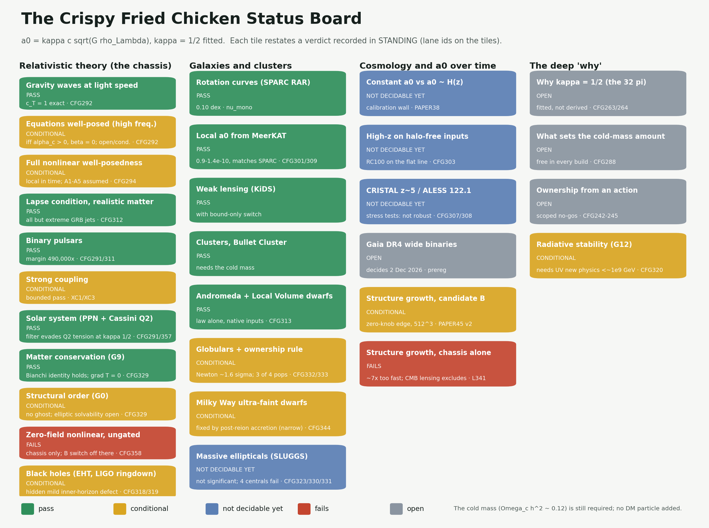
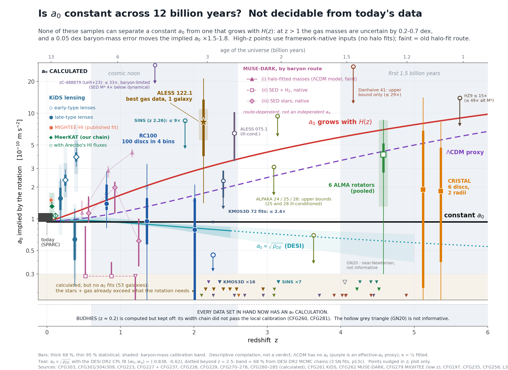

# The Crispy Fried Chicken Status Board

*Where the theory stands, as of 8 October 2026, in one picture.*

The theory makes one claim: the acceleration scale where galaxies stop obeying Newton, a₀, is set by the density of dark energy.

```
a₀ = κ · c · √(G ρ_Λ),   κ = ½   →   a₀ = 9.36 × 10⁻¹¹ m/s²
```

The ½ is **fitted** to galaxy rotation curves, not derived. A cold component with the amount of mass usually attributed to dark matter (Ω_c h² ≈ 0.12) is still required; no dark-matter particle is added.



## How to read it

Each tile is one test. The colour restates a verdict recorded in [`campaign_fresh_gravity/STANDING_2026-09-29.md`](../campaign_fresh_gravity/STANDING_2026-09-29.md), and the lane IDs on each tile point to the scripts that produced it. Every verdict comes from a committed script with pass/fail rules frozen *before* the data were read, plus a control that is deliberately broken and must fail.

| colour | meaning |
|---|---|
| 🟩 **pass** | the theory meets the test within the stated errors |
| 🟨 **conditional** | passes, but only under a stated assumption that is not yet proved |
| 🟦 **not decidable yet** | today's data cannot tell the theory from its rival |
| 🟥 **fails** | the theory misses the test, and audits from the raw data confirm the miss |
| ⬜ **open** | not yet answered, or waiting on data |

## Column 1 · The relativistic theory (the "chassis")

This is the full field theory underneath the law: general relativity plus a preferred time direction (a "khronon"). It has to behave like Einstein's gravity wherever Einstein's gravity has been tested.

- **Passes:**
  - gravitational waves travel at exactly light speed;
  - realistic matter keeps the equations well behaved;
  - binary pulsars, with a 490,000× margin;
  - solar-system tests;
  - matter is exactly conserved (G9).
- **Conditional:**
  - well-posedness, in two forms (high-frequency and full nonlinear);
  - strong coupling;
  - structural order (G0): no runaway "ghost" mode, but solvability in the strongly nonlinear regime is unproved;
  - **black holes.** EHT shadows and LIGO ringdowns are matched to better than one part in 10⁹. A *moving* black hole keeps a hidden, Planck-scale defect on its innermost horizon. A 2019 paper's standard would count that as fatal; the owner's reading of it is still pending.

- **Fails, for the ungated chassis only: zero-field nonlinear dependence (G5/G10).** This 1-D test runs the bare relativistic chassis with the law switched on everywhere, including the smooth, expanding cosmic background, where the field is near zero. In that setting the sensitivity to tiny perturbations does not level off at the larger perturbation on the finest grid (N = 2047, CFG358, a knife-edge call). **It does not test candidate B, your live model:** there the law is switched off outside bound halos, so it never acts on that background. Candidate B's full action does not exist yet, so for B this is untested, not passed. This sits alongside the ungated chassis's growth failure in Column 3.

## Column 2 · Galaxies and clusters

- **Passes:**
  - rotation curves (SPARC, 0.10 dex scatter);
  - a₀ measured locally with MeerKAT, 0.9–1.3 × 10⁻¹⁰ (PAPER40);
  - weak lensing (KiDS);
  - clusters, including the Bullet Cluster, which needs the cold mass;
  - Andromeda's and the Local Volume's dwarfs.
- **Conditional: the Milky Way's ultra-faint dwarfs.** They move about 2× faster than the law predicts (3.8σ at the generous end), and every data-side explanation fails. Post-reionisation cold accretion onto these fossils (CFG344) removes the offset, but only in a narrow window and with ΛCDM-calibrated assembly assumed.
- **Not decidable yet: the massive ellipticals.** They are about 20% too fast, but once measured tracers are used the gap is not significant. The four galaxies at the centres of groups and clusters still disagree.

## Column 3 · Cosmology, and does a₀ change over cosmic time?

The theory's sharpest prediction is that **a₀ stays constant**. Its main rival has a₀ growing with the expansion rate, H(z).



- **Not decidable yet: a₀ over time.** The two lines separate at redshift 2–5. At those redshifts, though, the uncertainty in how much gas each galaxy holds is larger than the gap between the lines (the "calibration wall", PAPER38). No public data set can settle this today.
- **Open: Gaia DR4 wide binaries** (data release 2 December 2026). This test is pre-registered and frozen: PAPER35 predicts exactly Newtonian behaviour.
- **Conditional: structure growth, candidate B.** Simulated in a universe-in-a-box (CFG361 onward), switching the law on everywhere makes small-scale structure 15–17% too clumpy. The fix has no hand-set numbers. The phantom is cold fluid, so the law stops where each halo's own cold fluid runs out. That cold fluid is drawn from the halo's own turnaround sphere, so mass is conserved halo by halo. With this rule, growth passes at 512³ resolution on both a₀ values and with a₀ tracking dark energy (3–4% against an allowed 10%; CFG424–439; published as PAPER45 v2.0, DOI 10.5281/zenodo.23237726). The condition: in these runs the cold fluid is bookkeeping, not simulated particles, and the settling mechanism is not yet derived from an action.
- **Fails: structure growth, chassis alone.** Without B's switch, all matter feels the MOND boost and structure grows about 7× too fast, which CMB lensing rules out. This variant is dead; candidate B is the live one.

## Column 4 · The deep "why"

- **Open:**
  - why κ = ½ (twelve derivation attempts, none successful);
  - what sets the amount of cold mass;
  - how "ownership" (which system carries the extra pull) arises from an action.
- **Conditional: quantum stability (G12).** It needs new physics below about 10⁹ GeV, as every theory of this family does.

## The bottom line

The law wins where it is cleanest: rotation curves, MeerKAT, lensing, and every local test of gravity. Structure growth, the biggest cosmology failure, now has a fix with no hand-set numbers, conditional on the cold fluid settling as assumed. The hard failures are the Milky Way's ultra-faint dwarfs (now conditional) and a knife-edge 1-D nonlinear test. Three things stay open: why κ = ½, what sets the cold fluid's amount, and ρ_Λ. The two tests that could change the picture are **Gaia DR4** (2 December 2026) and **a₀ at redshift ~2.5**.

---

κ = ½ is fitted, not derived. The cold mass is still required; no dark-matter particle is added. The board is generated by [`campaign_fresh_gravity/closure_map/status_picture_2026_10_03.py`](../campaign_fresh_gravity/closure_map/status_picture_2026_10_03.py), and the a₀ chart by [`chart_a0z_one.py`](../campaign_fresh_gravity/CHART_a0z_rar_z0_5_2026-10-01/chart_a0z_one.py).
