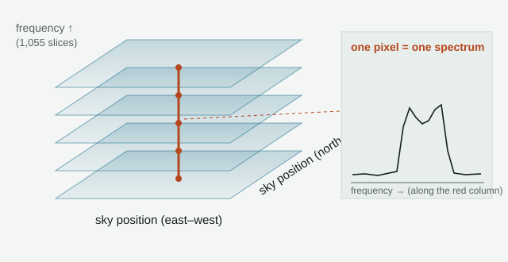
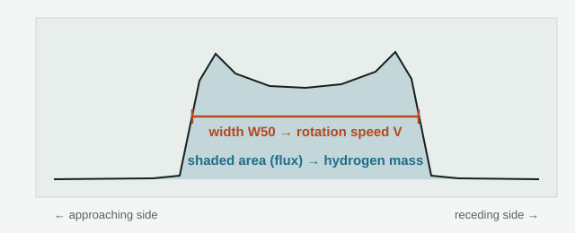

# wtf are these cubes?

*MeerKAT · MIGHTEE-HI · COSMOS field*

Four files, 24 GB, that let us weigh galaxies and time their spin with nothing but the glow of cold hydrogen. Here is what they are and what they told us about a₀.

## A cube is a stack of radio pictures

MeerKAT, a radio telescope array in South Africa, stared at one patch of sky (the COSMOS field) and recorded it at 1,055 slightly different frequencies. Each frequency gives one image of the sky. Stack the images and you get a block of numbers with three axes: two for position on the sky and one for frequency. That block is the cube.



*Ours: 1,200 × 1,200 sky pixels × 1,055 frequency channels per file, four files in a row along the frequency axis.*

## Why frequency? Cold hydrogen sings one note

Neutral hydrogen gas emits at one exact radio frequency, 1420.406 MHz (a wavelength of 21 cm). A galaxy moving away from us has that note pulled lower, so the frequency where a galaxy's hydrogen shows up in the cube is its redshift.

Our four cubes run from 1290 to 1396 MHz. That is hydrogen at z ≈ 0.018–0.10: galaxies roughly 250 million to 1.4 billion light-years away. Each channel is about 6 km/s wide in velocity.

## Each galaxy's line is a fingerprint of its spin

A galaxy's hydrogen line isn't a sharp spike. The disc rotates, so one side comes toward us (pushed to higher frequency) and the other goes away (pushed lower). That spreads the line into a two-horned shape, and two numbers come straight off it.



*Correct the width for the disc's tilt to get the rotation speed V. The total flux, together with the distance, gives the hydrogen mass.*

## Why your theory cares

For a gas-rich galaxy deep in the MOND regime, the law ties the spin to the weight with no dark-matter halo in between:

```
a₀ ≈ V⁴ / (G · M_baryon),    M_baryon ≈ 1.33 M_HI + M_stars
```

The width gives V and the flux gives the gas mass. Nothing in that chain comes from ΛCDM or a halo fit. Galaxies where gas outweighs stars are the cleanest, because then the uncertain stellar mass barely matters.

## What we found

| | |
|---|---|
| **CFG301** | The survey team's catalogue, built from these cubes: 47 clean galaxies, all deep in the MOND regime, 37 of them gas-dominated. Our chain passes all four calibration checks and gives **a₀ = 1.05 × 10⁻¹⁰ m/s²**. That sits between the framework's two footings (0.94 and 1.13 × 10⁻¹⁰) and within 0.06 dex of SPARC. |
| **CFG302** | We re-measured the widths ourselves from the raw cubes. They match the catalogue to about 5%, so the speed side is solid. |
| **flux** | The raw cubes hold only about half the catalogue's hydrogen flux. The noise in these cubes looks filtered in a way that eats line flux. |
| **CFG304** | The tie-breaker: 23 of these galaxies were also measured by Arecibo's ALFALFA survey, a single dish that can't lose flux that way. Arecibo sees **more** hydrogen than both: the catalogue holds 0.64 of Arecibo's flux and the raw cubes 0.49, with identical line widths. So the cube scale is ruled out. If Arecibo's scale applies to all 47 galaxies, the gas is heavier and a₀ comes out **lower**, about 0.7 × 10⁻¹⁰. The honest range is 0.6–1.05 × 10⁻¹⁰: below or at your canonical value, never above the alt one. |

## What the cubes can't do

- **They can't give rotation curves for most galaxies.** These are the blurred version of the cubes, with a 75-arcsecond beam, and most galaxies are only a few beams across. So we get one width per galaxy. Only the nearest, biggest disc gave a real rotation curve, and that came from the sharper cutouts.
- **They can't test whether a₀ changes over cosmic time.** At z ≤ 0.1, a constant a₀ and one that grows with H(z) differ by only about 2%. The cubes test the value of a₀.

## The files

| | |
|---|---|
| Survey | MIGHTEE-HI DR1, COSMOS, MeerKAT (DOI 10.48479/jkc0-g916, CC BY-NC 4.0) |
| Files | 4 sub-cubes, L2 r1p0 clean_conv_contsub: 0001–1055, 1001–2055, 2001–3055, 3001–4055 |
| Size | 6,076,831,680 bytes each · 24.31 GB total · sha256 checked |
| Shape | 1,200 × 1,200 pixels × 1,055 channels · 8″ pixels |
| Frequency | 1290.12–1396.03 MHz · 26.12 kHz channels (≈ 6 km/s) |
| Redshift | HI at z 0.0175–0.1010 |
| Beam | ≈ 75″ circular (tapered r1p0 weighting) |
| Catalogue | 293 HI sources (arXiv:2605.28731, MNRAS supplementary) · 47 used in CFG301 |

---

κ = ½ is fitted, not derived. The cold mass is still required. Lanes: [CFG300–CFG304](../campaign_fresh_gravity/) in this repository; the record is [`campaign_fresh_gravity/STANDING_2026-09-29.md`](../campaign_fresh_gravity/STANDING_2026-09-29.md).
