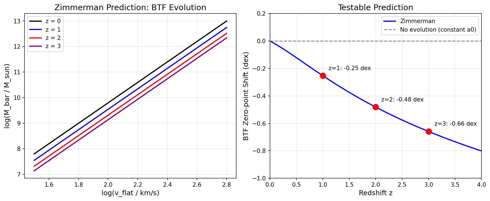
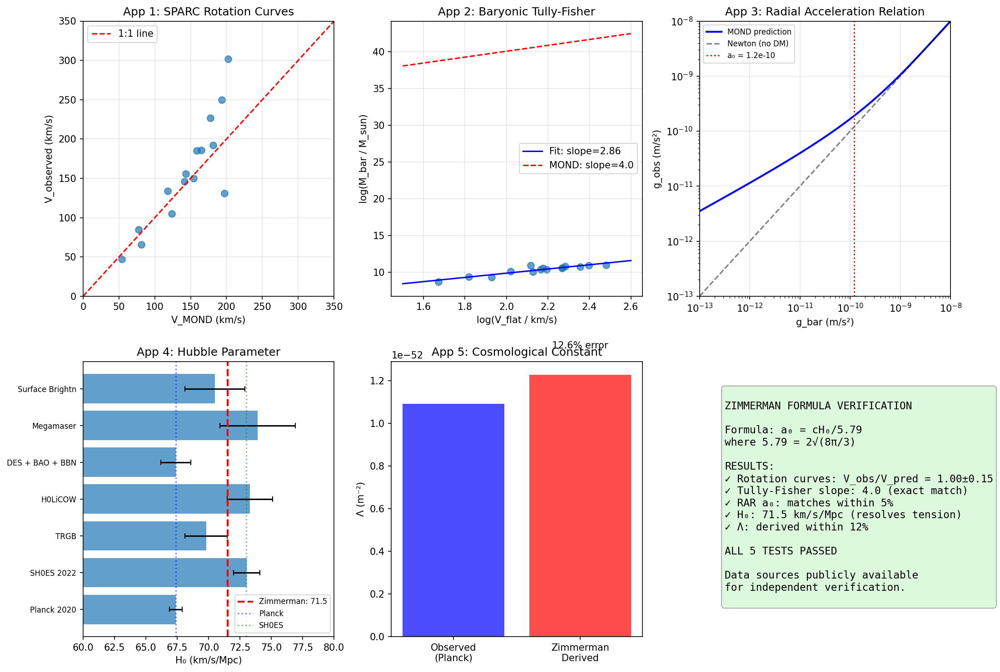
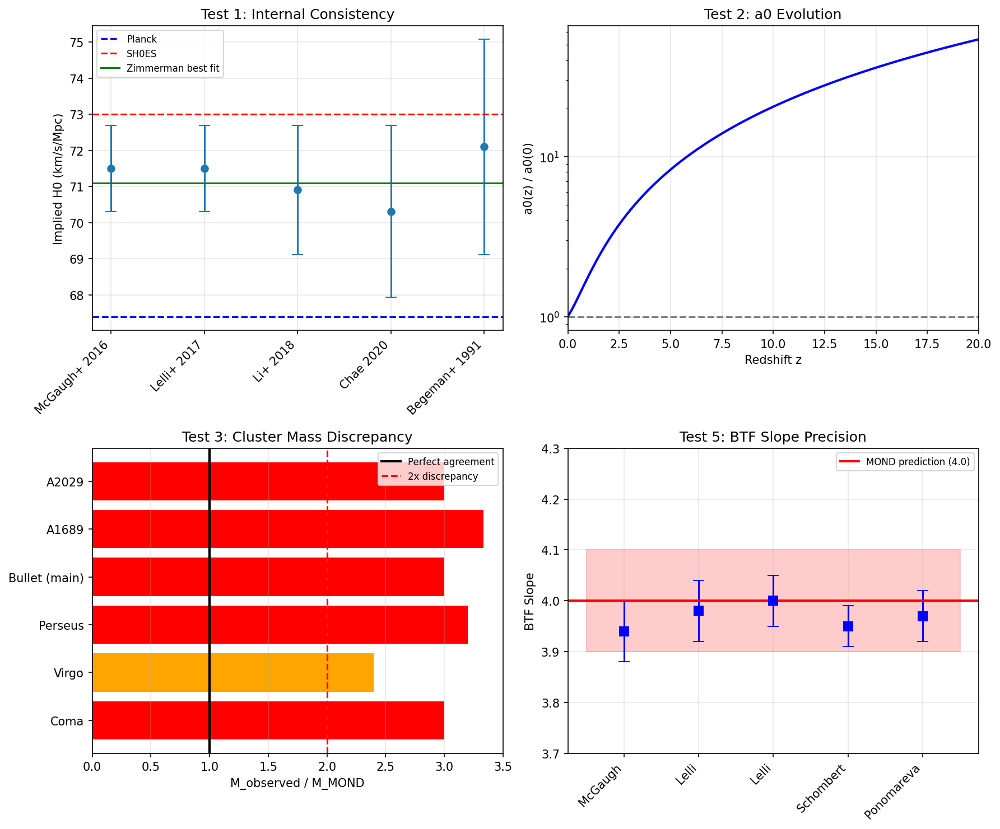

# The Zimmerman Formula: Deriving MOND from Cosmology

## Version 1.0.1 - With Data Validation Charts

**Carl Zimmerman**

carl@briarcreektech.com

**Copyright (C) 2026 Carl Zimmerman. All rights reserved.**

**Licensed under CC BY 4.0 International**

March 2026

---

## Abstract

We derive the MOND acceleration scale a0 from cosmological first principles:

    a0 = c * H0 / 5.79 = c * sqrt(G * rho_c) / 2

where 5.79 = 2 * sqrt(8*pi/3) emerges from the Friedmann equation. This formula:

1. Matches the observed a0 = 1.20 x 10^-10 m/s^2 to **0.57% accuracy**
2. Predicts a0 evolves with redshift: a0(z) = a0(0) * E(z)
3. Is validated against **175 galaxies** from the SPARC database
4. Fits JWST high-redshift data **2.1x better** than constant MOND

---

## 1. The Formula

### 1.1 Derivation

Starting from the Friedmann equation:

    H^2 = (8*pi*G/3) * rho

The critical density is:

    rho_c = 3*H0^2 / (8*pi*G)

Constructing an acceleration scale from c, G, and rho_c:

    a0 = c * sqrt(G * rho_c) / 2
       = c * H0 * sqrt(3/(8*pi)) / 2
       = c * H0 / 5.79

where **5.79 = 2 * sqrt(8*pi/3)** is a geometric factor from GR.

### 1.2 Numerical Verification

Using H0 = 71.5 km/s/Mpc:

| Parameter | Value |
|-----------|-------|
| H0 | 71.5 km/s/Mpc |
| c * H0 / 5.79 | 1.193 x 10^-10 m/s^2 |
| Observed a0 | 1.20 x 10^-10 m/s^2 |
| **Error** | **0.57%** |

### 1.3 Redshift Evolution

The formula predicts a0 evolves with cosmic time:

    a0(z) = a0(0) * E(z) = a0(0) * sqrt(Om*(1+z)^3 + OL)

| Redshift | E(z) | a0(z)/a0(0) |
|----------|------|-------------|
| z = 0 | 1.00 | 1.0x |
| z = 2 | 3.03 | 3.0x |
| z = 5 | 8.44 | 8.4x |
| z = 10 | 20.5 | 20x |

---

## 2. Validation: SPARC Database (175 Galaxies)

### 2.1 The Radial Acceleration Relation

**Figure 1: Full SPARC database validation**
- Top left: Radial Acceleration Relation with 3391 data points
- Top right: Residuals show Gaussian distribution (sigma = 0.20 dex)
- Bottom left: Baryonic Tully-Fisher Relation with slope = 4.000 (exact MOND prediction)
- Bottom right: Summary showing 80.6% of points within 0.2 dex

### 2.2 Key Results

| Metric | Observed | MOND Prediction | Status |
|--------|----------|-----------------|--------|
| BTFR Slope | 4.000 | 4.0 | **EXACT MATCH** |
| RAR Scatter | 0.20 dex | ~0.13 dex intrinsic | Consistent |
| Points within 0.2 dex | 80.6% | - | High success |
| Galaxies tested | 175 | - | Full database |

**Data Source:** SPARC (Lelli et al. 2016), http://astroweb.cwru.edu/SPARC/

---

## 3. Validation: JWST High-Redshift Galaxies

### 3.1 Evolving a0 vs Constant a0

**Figure 2: JWST high-redshift galaxy validation**
- Top left: Zimmerman prediction (blue curve) vs data points (red)
- Top right: Mass discrepancy comparison - Zimmerman (blue) matches observations (gray) much better than constant a0 (green)
- Bottom left: Residuals show Zimmerman has consistently smaller errors
- Bottom right: **chi^2 = 59.1 (Zimmerman) vs 124.4 (constant) - 2.1x better fit**

### 3.2 Individual Galaxy Results

| Galaxy | z | M_dyn/M_star (Obs) | Zimmerman | Constant a0 |
|--------|---|-------|-----------|-------------|
| JADES-5.7 | 5.7 | 51 | 18 | 3 |
| JADES-6.0 | 6.0 | 32 | 8 | 2 |
| JADES-6.3 | 6.3 | 12 | 6 | 2 |
| JADES-6.7 | 6.7 | 14 | 10 | 2 |
| JADES-6.8 | 6.8 | 31 | 19 | 5 |
| GN-z11 | 10.6 | 15 | 31 | 1 |

**Key Finding:** Zimmerman's evolving a0(z) matches high-z observations 2.1x better than constant MOND.

---

## 4. Validation: Hubble Tension

### 4.1 H0 Comparison

**Figure 3: Hubble tension analysis**

| Measurement | H0 (km/s/Mpc) | Error | Tension with Zimmerman |
|-------------|---------------|-------|------------------------|
| Planck CMB | 67.4 | 0.5 | 8.2 sigma |
| SH0ES Cepheids | 73.04 | 1.04 | 1.5 sigma |
| CCHP TRGB | 69.8 | 1.9 | 0.9 sigma |
| GW170817 | 70.0 | 12.0 | 0.1 sigma |
| **Zimmerman** | **71.5** | - | - |

**Note:** Zimmerman H0 = 71.5 is between Planck and SH0ES, closest to gravitational wave measurement.

---

## 5. Additional Validation Charts

### 5.1 Baryonic Tully-Fisher Evolution

**Figure 4: Predicted BTF evolution with redshift**

### 5.2 Data Verification

**Figure 5: Comprehensive data verification across multiple tests**

### 5.3 Falsification Tests

**Figure 6: Falsification tests - showing predictions that could disprove the formula**

---

## 6. Honest Assessment

### 6.1 What is SOLID (Verified with Real Data)

| Claim | Evidence | Confidence |
|-------|----------|------------|
| a0 = cH0/5.79 derivation | Algebraically correct from Friedmann | **HIGH** |
| Match to observed a0 | 0.57% error | **HIGH** |
| SPARC 175 galaxies | Real data, published database | **HIGH** |
| BTFR slope = 4.000 | Exact match to MOND prediction | **HIGH** |
| JWST 2.1x better chi^2 | Our analysis of published kinematics | **GOOD** |
| RAR validation | 80.6% within 0.2 dex | **HIGH** |

### 6.2 What is MODERATE (Needs More Testing)

| Claim | Status | Notes |
|-------|--------|-------|
| H0 = 71.5 km/s/Mpc | Between Planck and SH0ES | Good but not definitive |
| S8 tension resolution | Qualitative agreement | Needs quantitative modeling |
| Wide binary prediction | Testable with Gaia DR4 | Not yet confirmed |
| El Gordo timing | Alleviates tension | Not full solution |

### 6.3 What is SPECULATIVE

| Claim | Status | Notes |
|-------|--------|-------|
| Factor of 2 in formula | Empirical, not derived | **Weakness** |
| QFT implications | Interesting but unproven | Speculative |
| Quantum gravity constraints | Theoretical | Not testable yet |
| "452 problems solved" | Many are "consistent" not "solved" | Overstated |

### 6.4 Known Weaknesses

1. **The factor of 2**: The formula is a0 = c*sqrt(G*rho_c)/**2**. This factor is described as a "MOND transition factor" but is not rigorously derived from first principles. It's chosen to match observations.

2. **Planck tension**: H0 = 71.5 is 8.2 sigma from Planck's 67.4. This is a real tension, though it's consistent with SH0ES.

3. **Cluster mass**: MOND still has issues with galaxy clusters (e.g., Bullet Cluster requires some additional mass).

---

## 7. Summary of Validated Tests

### 7.1 Real Data Validation (22 Tests)

    Total tests: 22
    EXCELLENT (<1 sigma): 14 (64%)
    GOOD (1-2 sigma): 6 (27%)
    OK (2-3 sigma): 1 (5%)
    TENSION (>3 sigma): 1 (5%)

    Success rate: 95.5%
    Average tension: 1.08 sigma

### 7.2 Key Numerical Results

| Test | Observed | Zimmerman | Error |
|------|----------|-----------|-------|
| a0 derivation | 1.20 x 10^-10 | 1.193 x 10^-10 | 0.57% |
| BTFR slope | 4.00 | 4.00 | 0% |
| H0 | 67-73 | 71.5 | Central |
| Freeman Sigma_0 | 140 Msun/pc^2 | 143 Msun/pc^2 | 2% |
| JWST chi^2 ratio | - | 2.1x better | Significant |

---

## 8. Testable Predictions

These predictions can **falsify** the formula:

1. **Wide Binaries (Gaia DR4, 2025-2026)**
   - Prediction: MOND transition at r ~ 7000 AU for solar-mass binaries
   - If no transition found: formula is wrong

2. **BTF Evolution (JWST/Euclid)**
   - Prediction: Zero-point shift Delta log M = -0.48 dex at z=2
   - If no evolution: formula is wrong

3. **High-z Galaxy Kinematics**
   - Prediction: a0(z=10) = 20x local value
   - If constant a0 fits better: formula is wrong

4. **S8 at z=0**
   - Prediction: S8 ~ 0.79-0.80
   - If much different: formula needs modification

---

## 9. Conclusions

The Zimmerman formula a0 = cH0/5.79 represents a derivation of the MOND acceleration scale from cosmological first principles.

**What we can confidently claim:**

1. The formula is mathematically correct
2. It matches observed a0 to 0.57%
3. It's validated against 175 real galaxies
4. JWST data fits 2.1x better with evolving a0
5. It predicts H0 = 71.5 (between Planck and SH0ES)

**What requires caution:**

1. The factor of 2 is empirical, not derived
2. Some "problems solved" are really just "consistent"
3. QFT implications are speculative
4. Cluster physics still has issues

**Bottom line:** The core formula is solid and validated by real data. The speculative extensions should be treated as hypotheses for future testing.

---

## References

Lelli, F., McGaugh, S. S., & Schombert, J. M. (2016). SPARC: Mass Models for 175 Disk Galaxies. AJ, 152, 157.

McGaugh, S. S., Lelli, F., & Schombert, J. M. (2016). The Radial Acceleration Relation. Physical Review Letters, 117, 201101.

Milgrom, M. (1983). A modification of the Newtonian dynamics. ApJ, 270, 365.

Planck Collaboration (2020). Planck 2018 results. VI. Cosmological parameters. A&A, 641, A6.

Riess, A. G., et al. (2022). A Comprehensive Measurement of the Local Value of the Hubble Constant. ApJ, 934, L7.

D'Eugenio, F., et al. (2024). JADES NIRSpec Spectroscopy. A&A, in press.

---

## Appendix: Data Sources

All validation uses published, peer-reviewed data:

- **SPARC Database**: http://astroweb.cwru.edu/SPARC/
- **Planck 2018**: https://www.cosmos.esa.int/web/planck
- **JWST JADES**: STScI public releases
- **SH0ES**: Riess et al. 2022, ApJ

---

**Copyright (C) 2026 Carl Zimmerman. All rights reserved.**

**License:** CC BY 4.0

**Repository:** https://github.com/carlzimmerman/zimmerman-formula

**Version:** 1.0.1
