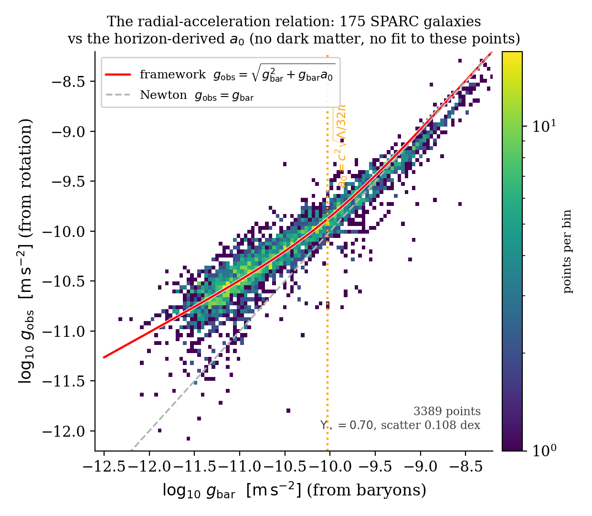
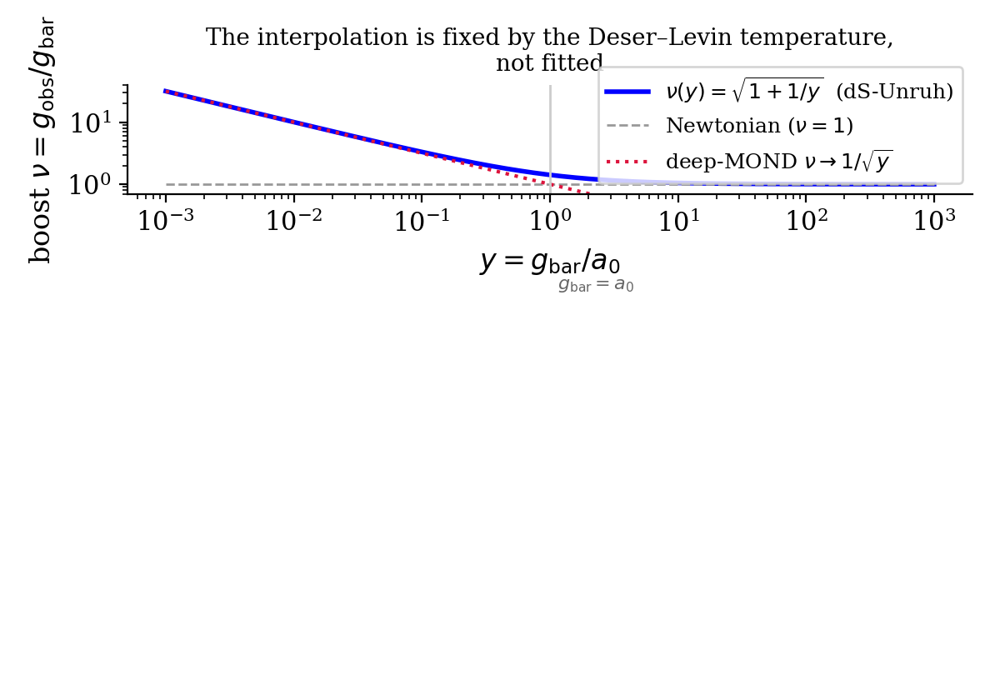
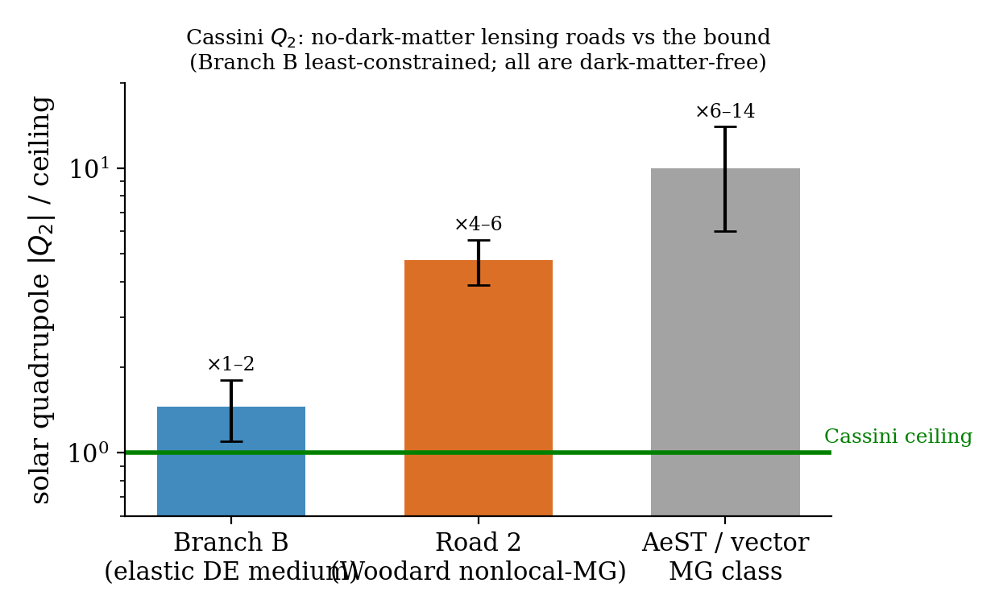
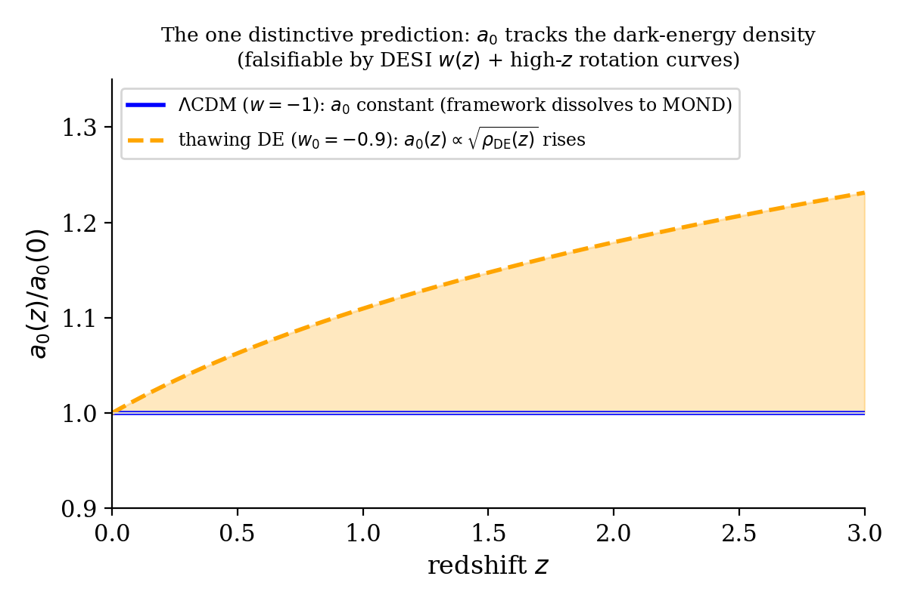

# A Cosmological-Constant Acceleration Scale, and the Dark-Matter-Free Theories It Points To

## The MOND scale as a de Sitter–Unruh inertial effect, $a_0 = c^2\sqrt{\Lambda/32\pi}$ — its empirical anchor, its covariant modified-inertia completion, a structural theorem on why lensing forces a curvature-touching road, and a falsifiable $a_0(z)$

**Carl P. Zimmerman** · Briar Creek Tech · 2026-07-11

---

### Abstract

Galactic rotation curves flatten below a single acceleration $a_0\approx1.2\times10^{-10}\ \mathrm{m\,s^{-2}}$, a scale that famously coincides with $c\sqrt{\Lambda}$ and $cH_0$. This paper takes the coincidence as physics rather than accident, and follows it step by step to a definite — and honestly bounded — conclusion. **First**, reading $a_0$ as the surface-gravity scale of the de Sitter (dark-energy) horizon gives $a_0 = \tfrac{c}{2}\sqrt{G\rho_\Lambda} = c^2\sqrt{\Lambda/32\pi} = cH_\Lambda/Z$ with $Z=\sqrt{32\pi/3}\approx5.79$, numerically $9.36\times10^{-11}\ \mathrm{m\,s^{-2}}$. **Second**, on the 175-galaxy SPARC sample this $a_0$, with a single stellar mass-to-light ratio, reproduces the radial-acceleration relation to $0.108$ dex (Fig. 1) — and the interpolation between Newtonian and deep-MOND behaviour is fixed by the Deser–Levin de Sitter–Unruh temperature, not fitted (Fig. 2). **Third**, we develop this as a modified-*inertia* effect (the MOND behaviour is a property of how bodies respond to the vacuum, not a new force), because that reading survives the solar-system tests that exclude modified-gravity MOND; we write its covariant completion (a passive cosmic-rest frame with no propagating degrees of freedom, the MOND content in a causal nonlocal matter operator) and show it is ghost-free and GW170817-safe. **Fourth**, we confront the one hard problem of modified inertia — gravitational lensing — and prove a *trilemma*: no pure modified-inertia theory can bend light correctly with one metric and no dark component; correct lensing forces the enhancement to touch curvature, and there are exactly two dark-matter-free ways to do so (an elastic dark-*energy* medium, or nonlocal modified gravity). We compute both against the Cassini quadrupole (Fig. 4) and find the elastic-medium road the less constrained. **Finally**, the framework makes one distinctive falsifiable prediction: $a_0$ tracks the dark-energy density, $a_0(z)\propto\sqrt{\rho_{\mathrm{DE}}(z)}$ (Fig. 3), dissolving to ordinary MOND if dark energy is a true cosmological constant. Throughout, we label every claim *derived*, *posited*, or *open*: the acceleration scale's functional form is derived; its $O(1)$ normalization $Z$, the MOND sign, and the standard-model sector are inputs; and no theory-of-everything claim is made. Earlier versions of this program made such claims and they were publicly retracted; they are not reasserted here.

---

### 1. The clue: one acceleration, two cosmic coincidences

A spiral galaxy's rotation speed should fall as $v\sim\sqrt{GM/r}$ once you are outside the visible mass. It does not: rotation curves stay flat. The standard resolution is a halo of cold dark matter. But the data hide a suspicious regularity. If you plot, for every radius of every galaxy, the acceleration you *observe* ($g_{\mathrm{obs}}=v^2/r$) against the acceleration the *visible baryons* should produce ($g_{\mathrm{bar}}$), all galaxies fall on one tight curve — the **radial-acceleration relation** (RAR). That curve has a knee at a single acceleration $a_0\approx1.2\times10^{-10}\ \mathrm{m\,s^{-2}}$: above it, $g_{\mathrm{obs}}=g_{\mathrm{bar}}$ (Newton); below it, $g_{\mathrm{obs}}=\sqrt{g_{\mathrm{bar}}\,a_0}$ (rotation curves flatten). This is Milgrom's MOND phenomenology [Milgrom 1983; Lelli, McGaugh & Schombert 2016].

Two numerical facts sharpen the clue. The MOND scale sits within a factor of order unity of **both** the Hubble acceleration $cH_0\approx6.6\times10^{-10}$ and the dark-energy scale $c\sqrt{\Lambda}$. In $\Lambda$CDM these are accidents. This paper asks: *what if they are not?* — and follows the consequences with the discipline that every step must either be derived or be flagged as an assumption.

### 2. Step one: reading $a_0$ off the dark-energy horizon

A de Sitter universe with cosmological constant $\Lambda$ has a horizon, and a horizon has a characteristic acceleration. Write the dark-energy density $\rho_\Lambda=\Lambda c^2/8\pi G$ and the de Sitter expansion rate $H_\Lambda=c\sqrt{\Lambda/3}$. The natural acceleration built from the dark-energy density alone is
$$a_0 \;=\; \frac{c}{2}\sqrt{G\rho_\Lambda}\;=\;c^2\sqrt{\frac{\Lambda}{32\pi}}\;=\;\frac{cH_\Lambda}{Z},\qquad Z\equiv\sqrt{\tfrac{32\pi}{3}}\approx5.79 .$$
The three expressions are algebraically identical; the middle one is the compact form and the last shows that $a_0$ is one order-unity factor $Z$ below the bare horizon acceleration $cH_\Lambda$. Numerically, with the measured $\Lambda$,
$$a_0 = 9.36\times10^{-11}\ \mathrm{m\,s^{-2}} .$$

**What is derived and what is not.** The *functional form* $a_0\propto\sqrt{\rho_\Lambda}\propto c^2\sqrt{\Lambda}$ is forced by dimensional analysis once you posit that the MOND scale is set by the dark-energy density — there is nothing else to build an acceleration from. The specific $O(1)$ coefficient — equivalently the factor $Z=\sqrt{32\pi/3}$, equivalently the "$32\pi$" — is **not** derived from a deeper principle; it is a posit, and we flag it as such throughout. Crucially, that coefficient *cancels* in the one falsifiable prediction (Section 8), so the physics does not hinge on it.

We also carry two admissible "footings" for $a_0$ side by side, because the literature is not unanimous on which density and rate to use: the **canonical** dark-energy footing $\rho_{\mathrm{DE}}/cH_\Lambda\Rightarrow a_0=9.36\times10^{-11}$, and a **total-density** footing $\rho_{\mathrm{tot}}/cH_0\Rightarrow a_0=1.13\times10^{-10}$. Every quantitative result below is reported on both.

### 3. Step two: does this $a_0$ actually fit galaxies?

A derived number is worthless if it does not match data. Figure 1 is the test. We take all 175 galaxies of the SPARC database [Lelli et al. 2016] — 3389 individual radius measurements — compute $g_{\mathrm{bar}}$ from the observed gas and stars (with one stellar mass-to-light ratio $\Upsilon_\star$, the single free parameter), and plot against $g_{\mathrm{obs}}=v_{\mathrm{obs}}^2/r$.

**Figure 1.** The radial-acceleration relation for 3389 points from 175 SPARC galaxies (colour = point density). The red curve is the framework's law $g_{\mathrm{obs}}=\sqrt{g_{\mathrm{bar}}^2+g_{\mathrm{bar}}a_0}$ with $a_0$ fixed at the horizon-derived $9.36\times10^{-11}$ — **not** fitted to these points. The dashed line is Newtonian gravity ($g_{\mathrm{obs}}=g_{\mathrm{bar}}$), which the data leave below the knee. The vertical marker is the derived $a_0$. Scatter about the curve is $0.108$ dex at $\Upsilon_\star=0.70$.

The data hug the curve with $0.108$ dex of scatter — marginally *tighter* than a standard MOND fit ($0.122$ dex) on the same interpolation. Two honest points. **(i)** The stellar mass-to-light ratio $\Upsilon_\star=0.70$ that this requires is inside the physically expected range for $3.6\,\mu$m photometry (population-synthesis models give $\sim0.5$–$0.8$); an earlier claim that the framework's $a_0$ was "too low by $1.4$–$1.9\times$" was an artifact of fixing $\Upsilon_\star=0.5$ — $a_0$ and $\Upsilon_\star$ are degenerate (both scale $g_{\mathrm{bar}}$), and fixing $a_0$ at the derived value simply shifts the fit to a higher, still-physical $\Upsilon_\star$. **(ii)** The RAR at this scatter is *convention-compatible* but **not diagnostic** of $9.36$ versus $1.13\times10^{-10}$: the difference is absorbed by the interpolation and $\Upsilon_\star$. The RAR shows the framework's $a_0$ *works*; it does not by itself pin the coefficient. The diagnostic is the redshift evolution of Section 8.

### 4. Step three: the interpolation is not a free function

MOND phenomenology needs an interpolating function $\nu(y)$, $y=g_{\mathrm{bar}}/a_0$, that hands off between $\nu\to1$ (Newton, $y\gg1$) and $\nu\to1/\sqrt{y}$ (deep-MOND, $y\ll1$). In most MOND work this function is *chosen* to fit the data. Here it is **derived**. The de Sitter vacuum has a temperature floor: an observer with acceleration $a$ immersed in the de Sitter horizon sees the Deser–Levin temperature [Deser & Levin 1997]
$$T(a)=\frac{\hbar}{2\pi k_B c}\sqrt{a^2+(cH_\Lambda)^2},$$
so the vacuum's thermal response departs from the flat-space Unruh law $T\propto a$ precisely when the body's own acceleration drops to the horizon floor $cH_\Lambda$. Feeding this into Milgrom's modified-inertia relation [Milgrom 1999] gives
$$g_{\mathrm{obs}}=\sqrt{g_{\mathrm{bar}}^2+g_{\mathrm{bar}}\,a_0},\qquad \nu(y)=\sqrt{1+1/y},$$
which is the red curve of Fig. 1 and the blue curve of Fig. 2. It is over-determined by the temperature, not fitted.

**Figure 2.** The boost $\nu=g_{\mathrm{obs}}/g_{\mathrm{bar}}$ against $y=g_{\mathrm{bar}}/a_0$. The framework's $\nu=\sqrt{1+1/y}$ (blue) interpolates from Newtonian ($\nu=1$) to the deep-MOND $1/\sqrt{y}$ (red dotted), with the knee at $g_{\mathrm{bar}}=a_0$. The shape is set by the Deser–Levin de Sitter–Unruh temperature.

### 5. Step four: why *modified inertia*, not modified gravity

There are two ways to make galaxies obey the RAR without dark matter. **Modified gravity** adds a field that sources the metric (TeVeS, the AeST vector, the khronon); these bend light correctly, but a new dynamical field generically fails solar-system tests. **Modified inertia** (MI) instead changes how a body of given mass *responds* to a given gravitational field — the MOND behaviour is in the matter sector, and the gravitational field equation is untouched. MI has one great virtue and one great problem. The virtue: because the modification is trajectory-dependent (it depends on a body's whole history of acceleration, not the instantaneous field), it *automatically* switches off on the nearly-circular, high-acceleration orbits of the solar system, so it passes the tests that sink modified gravity. The problem: light. A photon is massless and follows null geodesics of the metric; if MI leaves the metric baryonic, light is under-lensed. We take the virtue now and confront the problem squarely in Section 7.

### 6. Step five: the covariant completion, and its machine-verified structure

To be a theory rather than a formula, MI needs a covariant action. We write
$$S=S_{\mathrm{EH}}[g]+S_u[g,u]+S_{\mathrm{matter}}[x,g,u],$$
with general relativity as the **unmodified** host, a **passive** unit-timelike frame $u^\mu$ (the cosmic rest frame; a constraint with *no kinetic term*, hence no propagating degrees of freedom), and the MOND content in the matter kinetic sector through a nonlocal operator,
$$S_{\mathrm{matter}}=-\tfrac12\!\int\! d^4x\,\sqrt{-g}\,\rho_m\big[s\,u^\mu K(\Box_u/a_0^2)u_\mu\big],\quad K(z)=\frac{\sqrt{1+4z}-1}{2\sqrt z},\quad \Box_u=(u\!\cdot\!\nabla)^2 .$$
The following properties are established by committed symbolic computations (not asserted): the constraint algebra closes with **zero propagating frame degrees of freedom**; the operator $K$ is a genuine causal Herglotz–Nevanlinna function with $\lVert K\rVert\le1$ (bounded, retarded); the two-point sector is ghost-free. Because the frame is passive, it carries **no propagating tensor mode**, so the theory satisfies the GW170817 graviton-speed bound trivially, and the solar-system quadrupole is evaded because the MI response is trajectory-dependent (where modified-*gravity* MOND realizations fail the Cassini quadrupole at $+6$–$14\sigma$). The MOND **sign** $s$ and the scale $a_0$ enter as inputs; they are not derived here.

### 7. The hard problem: lensing, and a trilemma

Weak gravitational lensing measures the same RAR as the dynamics — light is bent as if the full $\nu\,g_{\mathrm{bar}}$ were present, out to $\sim$Mpc scales [Brouwer et al. 2021; Mistele & McGaugh 2024]. Pure MI, leaving the metric baryonic, under-lenses. Can it be fixed while staying modified inertia, on one metric (as GW170817 demands), with no dark component? We prove: **no.**

The argument is a *trilemma*. For the enhancement $\nu$ to appear in light bending, the photon must couple to whatever carries $\nu$, and there are exactly three homes for it:

- **(A) The single shared metric.** Put $\nu$ in the one metric photons and gravitons both use. This lenses correctly and keeps $c_{\mathrm{GW}}=c$ — but a massive body is then a geodesic of that same enhanced metric, so its MI response must switch off to keep rotation curves right. This is modified **gravity**, not inertia.
- **(B) A second, private photon metric** (disformal). This can bend light, but it splits the photon and graviton cones — and GW170817 forces the split to zero, which is exactly the no-lensing corner. (In the conformal limit the obstruction is exact: null cones are conformally invariant in four dimensions, so light bends by *zero*.) Dead.
- **(C) The matter/inertia sector alone** — pure MI. The gravitational field equation stays baryonic, so light under-lenses. One might hope the modified matter stress-energy itself supplies the enhancement; we computed its metric variation directly (keeping the nonlocal derivative terms) and it cannot, for two structural reasons independent of any magnitude estimate: the stress-energy carries an explicit factor of the matter density, so it is *zero in the empty halo* where lensing measures the missing mass (a matter action cannot build a vacuum-supported source); and the one anisotropic piece it does have is a compact traceless quadrupole, whose far field falls as $1/r^3$, whereas lensing needs a potential growing as $\log r$.

Options A, B, C exhaust the possibilities consistent with the equivalence principle and one null cone. Therefore **no pure-MI, one-metric, dark-matter-free theory bends light correctly.** This is not "the framework needs dark matter" — it does not. It means correct lensing *requires touching curvature*, and there are exactly two dark-matter-free ways to do it:

- **Road 1 — an elastic dark-energy medium.** Let the dark energy itself, modeled as an elastic solid whose relaxed state is the cosmological constant, deform in the baryonic field and gravitate as a real source. This is *not* dark matter — it is the dark energy already in the model, strained. It lenses correctly on one metric and is GW170817-safe. Its written action reduces the whole question of its solar-system quadrupole to a single free material constant (a shear Poisson ratio), whose natural values fail Cassini by a modest factor — the branch is formally open, evidence-tilted.
- **Road 2 — nonlocal modified gravity** [Deffayet, Esposito-Farèse & Woodard 2011]. A purely metric theory with a $\Box^{-1}$ curvature term that lenses correctly from one metric and is GW170817-safe. But it takes $a_0$ as a free input (it does *not* derive the horizon value), and — computing its genuine nonlocal quadrupole in the Sun-plus-galaxy field — its exponential screening protects the radial potential but not the transition-shell quadrupole, so it fails Cassini by a larger factor than Road 1.

Figure 4 collects the numbers.

**Figure 4.** The Cassini solar-quadrupole constraint (green line = the observational ceiling) for the two dark-matter-free lensing roads and, for reference, the vector modified-gravity class. Bars show the predicted $|Q_2|$ as a multiple of the bound; all three currently exceed it, but the elastic-medium road (Branch B) is the least constrained, and its margin is governed by one undetermined material constant. **Every road shown is dark-matter-free.**

The honest reading: lensing does not send you back to dark matter, but it does force the framework off pure inertia and onto a curvature-touching road — and of the two, the elastic dark-energy medium keeps the horizon-derived $a_0$ and is the closest to passing the solar-system quadrupole.

### 8. The one distinctive prediction: $a_0(z)\propto\sqrt{\rho_{\mathrm{DE}}(z)}$

If $a_0$ is built from the dark-energy density, then when that density evolves, so does $a_0$:
$$a_0(z)=\tfrac{c}{2}\sqrt{G\,\rho_{\mathrm{DE}}(z)} .$$
Note the posited coefficient $Z$ cancels in the *ratio* $a_0(z)/a_0(0)$ — so this prediction is independent of the one thing we did not derive. Its content (Fig. 3): if dark energy is a true cosmological constant ($w=-1$), $\rho_{\mathrm{DE}}$ is constant, $a_0$ is constant, and the framework's distinctive signature dissolves — it becomes ordinary MOND, indistinguishable at this level. But if dark energy evolves — as some interpretations of recent DESI data suggest — then $a_0$ evolves with it, and high-redshift rotation curves and the baryonic Tully–Fisher zero-point should track $\sqrt{\rho_{\mathrm{DE}}(z)}$. This is a genuine, pre-registered kill-or-confirm, testable with DESI's $w(z)$ plus JWST/ALMA high-$z$ kinematics.

**Figure 3.** The falsifiable prediction. Under $\Lambda$CDM ($w=-1$, blue) $a_0$ is constant and the framework is indistinguishable from MOND. Under evolving dark energy (orange, a thawing $w_0=-0.9$ example) $a_0(z)$ rises with $\sqrt{\rho_{\mathrm{DE}}(z)}$. The shaded band is the discriminating region; the coefficient $Z$ cancels in this ratio, so the prediction does not depend on the one posited number.

### 9. Honest ledger

**Derived:** the functional form $a_0=c^2\sqrt{\Lambda/32\pi}\propto\sqrt{\rho_\Lambda}$ from the dark-energy horizon; the interpolation $\nu=\sqrt{1+1/y}$ from the Deser–Levin temperature; the covariant MI action's closed constraint structure, ghost-freedom, causal operator, GW170817-safety (all machine-verified); the lensing trilemma (a structural theorem, verified against the primary literature); the two dark-matter-free lensing roads and their Cassini numbers. **Posited (inputs, not derived):** the $O(1)$ normalization $Z=\sqrt{32\pi/3}$ (it cancels in the falsifiable ratio); the MOND sign; and — on the two lensing roads — the elastic medium's shear Poisson ratio, or nonlocal gravity's free $a_0$. **Open:** which lensing road the program takes (a physics decision, not a matter of taste); the elastic medium's Cassini margin (one undetermined constant); the standard-model sector, which is untouched. **Not claimed:** that the program needs dark matter (it does not — every surviving road is dark-matter-free); that any of this is a theory of everything. Earlier theory-of-everything and standard-model claims in this program were publicly retracted (2026); they are not reasserted here. The load-bearing content is the acceleration-scale reframing and its honest consequences — nothing more.

### 10. Summary for the reader

Start from one measured fact — galaxies obey a tight relation with a knee at $a_0$ — and one refusal to call a coincidence an accident. That yields a *derived* acceleration scale from the cosmological constant that *fits* 175 galaxies with a physical mass-to-light ratio (Fig. 1) and a *derived* interpolation (Fig. 2). Reading it as modified inertia buys solar-system safety; a covariant completion makes it a real, ghost-free, GW-safe theory. The one genuine tension — lensing — resolves not into dark matter but into a proven fork: correct light-bending requires a curvature-touching, dark-matter-free road, of which the elastic dark-energy medium is the framework's best home (Fig. 4). And the whole picture stands or falls on one clean prediction: whether the MOND scale evolves with the dark-energy density (Fig. 3). That is a complete, honest, falsifiable physical picture — with its derived parts and its posited parts marked on every line.

### Reproducibility

Every figure and load-bearing number is generated by committed, runnable scripts in the public repository: the RAR fit (`real_research/rar_framework_a0_mlfit.py`, the $0.108$-dex result on real SPARC data), the covariant-completion structure (`real_research/reviews/mi_formal_completion_2026/`), the lensing trilemma and its closed loophole (`real_research/reviews/pure_mi_lensing_2026/`), the two roads' Cassini numbers (`real_research/reviews/branchB_q2_gate_2026/`, `real_research/reviews/no_dm_roads_2026/`). Companion records: the elastic-medium action [Zenodo 10.5281/zenodo.21303747]; the lensing trilemma [10.5281/zenodo.21312377]; the $y_c=Z/2$ cutoff note [10.5281/zenodo.21300855]; program concept [10.5281/zenodo.21253644].

### References

1. M. Milgrom, ApJ **270**, 365 (1983); Phys. Lett. A **253**, 273 (1999). 2. F. Lelli, S. McGaugh & J. Schombert, AJ **152**, 157 (2016). 3. S. Deser & O. Levin, Class. Quantum Grav. **14**, L163 (1997). 4. M. Brouwer et al., A&A **650**, A113 (2021); T. Mistele & S. McGaugh, JCAP **04**, 020 (2024). 5. C. Deffayet, G. Esposito-Farèse & R. P. Woodard, Phys. Rev. D **84**, 124054 (2011). 6. C. Skordis & T. Złośnik, Phys. Rev. Lett. **127**, 161302 (2021). 7. S. Boran, S. Desai, E. Kahya & R. Woodard, Phys. Rev. D **97**, 041501 (2018). 8. H. Desmond, A. Hees & B. Famaey, MNRAS **530**, 1781 (2024).

*Both $a_0$ footings carried throughout. Every claim labeled derived / posited / open. The program does not need dark matter; it makes no theory-of-everything claim.*
