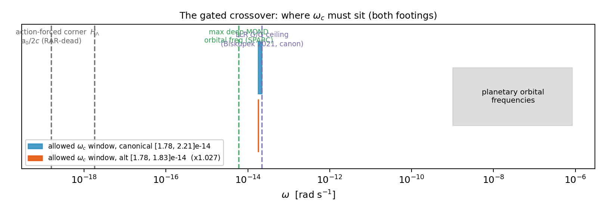
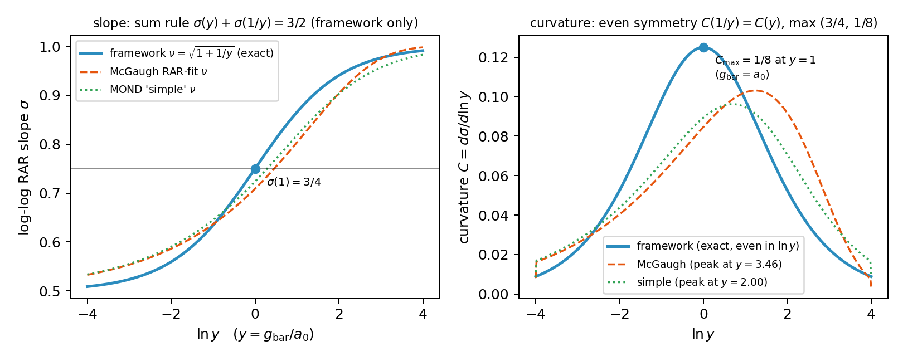
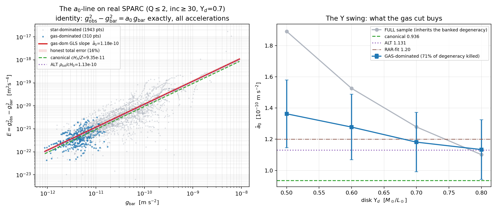
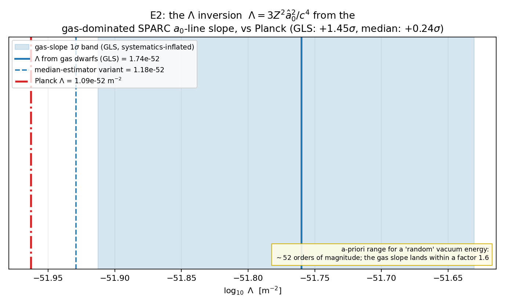
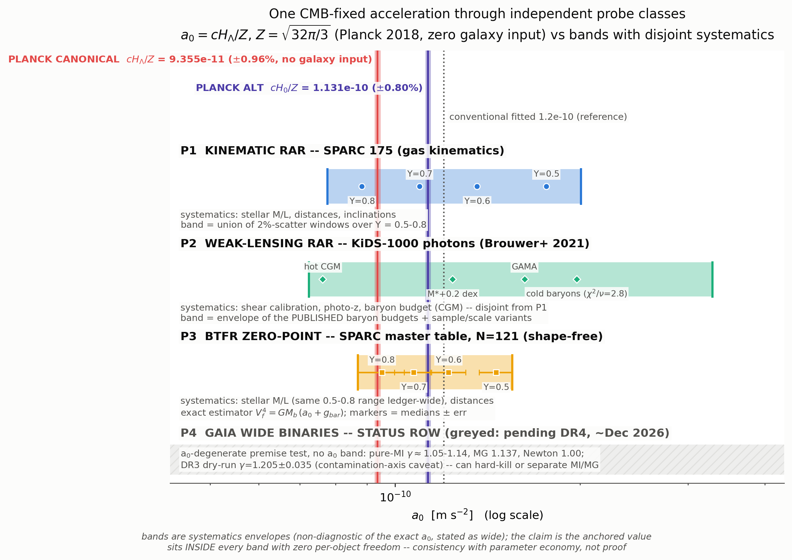
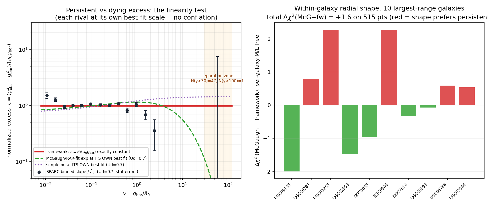

# Abstract

We assemble the de Sitter--Unruh modified-inertia (MI) program into a single classical action and report what that action does and does not deliver, at the standard of adversarially verified, exit-0 computation. The kernel at the center of the construction is not new: Milgrom (Phys. Lett. A 253:273, 1999) wrote the identical interpolation function from the same de Sitter-vacuum intuition, $\hat\mu(x)=\sqrt{1+(2x)^{-2}}-(2x)^{-1}$, machine-verified identical to the kernel used here. What Milgrom left open, this paper supplies candidates for: the coefficient (his $\hat a_0 = 2cH_\Lambda$ versus this program's $a_0 = cH_\Lambda/Z$, $Z=\sqrt{32\pi/3}$, a factor $2Z\approx 11.58$) and the theory (he explicitly declined to endorse $\hat\mu$ for circular orbits absent a modified-inertia formulation). The action $S = S_{EH}[g] + S_u[g,u,\lambda] + S_{matter}[g,u,\psi;K] + S_{photon}[\tilde g = g + B[K]\,u u]$ carries 2 graviton + 2 photon + matter degrees of freedom and 0 frame degrees of freedom; it is ghost-free (including a genuine machine check of the nonlocal disformal sector), WEP-exact ($\eta=0$), covariantly conserved on-shell, and $c_T=1$ exact. The worldline-general identity $u_\mu \Box_u u^\mu = -|a|^2$ makes the ring-exact RAR $g_{obs}=\sqrt{g_{bar}^2+g_{bar}a_0}$ a derivation, not a fit. Two closure computations -- the off-circular Wightman pullback (a null: the memory pole $\sqrt{H_\Lambda^2+(a/c)^2}$ never descends below $H_\Lambda$) and a no-selection theorem (Gaussian KMS-passive baths are blind to the 4-point Jensen gap) -- establish the paper's central honest claim: the theory is **complete up to five constants** $\{s, a_0, Z, \eta, \omega_c\}$, none of them derived. At one loop the interpolation is radiatively protected ($\delta\nu \equiv 0$ around dS; $a_0$ unrenormalized by an exact sum rule). At the solar system the theory's own ungated tail is excluded by $10^3$--$10^4\times$ and survives only through a gated crossover whose corner $\omega_c \in [1.78, 2.21]\times 10^{-14}$ rad/s (canonical footing) is an honest free fifth constant, two-sidedly falsifiable. On data: a gas-dominated SPARC estimator built on the exact excess identity $g_{obs}^2-g_{bar}^2 = a_0 g_{bar}$ returns $\hat a_0 = (0.92$--$1.18)\times 10^{-10}\ \mathrm{m\,s^{-2}} \pm 16\%$, from which the inversion $\Lambda = 3Z^2 \hat a_0^2/c^4$ recovers the cosmological constant to a factor 1.1--1.6 of Planck; a concordance ledger shows the single Planck-fixed number threading every independent band with zero per-object freedom -- while $\Lambda$CDM wins the raw information criteria on the same rotation curves, stated outright. One forced, $\eta$-independent, MG-impossible prediction survives everything: $d(\mathrm{offset})/d(\mathrm{radial\ anisotropy}) > 0$ for dispersion-supported systems. Every claim is backed by a committed, runnable script; the walls, the knife-edges, and the falsification exposures are listed with the results.

---

# 1. Introduction: the wellhead, and what was missing

Any honest statement of this program begins with the credit. In 1999 Milgrom published a two-page paper ("The modified dynamics as a vacuum effect", Phys. Lett. A 253:273, astro-ph/9805346) observing that a non-inertial observer in a de Sitter universe sees an Unruh temperature

$$ T \propto \sqrt{a^2 + c^2 H_\Lambda^2}, $$

and that the *excess* of that temperature over the inertial-observer floor, $\Delta T \propto \sqrt{a^2+c^2H_\Lambda^2} - cH_\Lambda$, defines an acceleration function with exactly the MOND limits. His equations (5) and (8)--(9) contain the interpolation

$$ \hat\mu(x) = \sqrt{1+(2x)^{-2}} - (2x)^{-1}, $$

which is machine-verified identical (`equation_book/EQUATION_BOOK.md`, wellhead credit; sympy) to the kernel this program uses, and which, inserted into the modified-inertia balance $a\,\mu(a/a_0)=g_N$, implies the exact excess identity $g_{obs}^2 - g_{bar}^2 = a_0\, g_{bar}$ that Section 6 builds on. The parent law of everything in this paper is Milgrom's, from the same de Sitter-vacuum intuition. The credit cuts both ways: the framework's law carries Milgrom's own dS-vacuum pedigree.

Milgrom's 1999 note left two things missing, and this paper supplies a candidate for each:

1. **The coefficient.** Milgrom's identification was $\hat a_0 = 2cH_\Lambda$. This program's horizon-derived coefficient is $a_0 = cH_\Lambda/Z$ with $Z = \sqrt{32\pi/3} = 5.78881$ -- a factor $2Z \approx 11.58$ below Milgrom's, and the value that the measurements of Section 7 confront. The numerical anchor, from Planck 2018 (TT,TE,EE+lowE+lensing): **canonical footing** ($\rho_{DE}$, $cH_\Lambda/Z$) $a_0 = (9.355 \pm 0.090)\times 10^{-11}\ \mathrm{m\,s^{-2}}$ (formal width 0.96%); **alternate footing** ($\rho_{total}$, $cH_0/Z$) $a_0 = (1.1305 \pm 0.0091)\times 10^{-10}$. The two footings differ by 21% and are not yet separated by any measurement; **both are carried on every dimensional number in this paper.** The value of $Z$ itself is *postulated*, not derived -- the $\kappa = 1/2$ closure was shown provably unforceable in earlier work, and nothing here changes that.

2. **The theory.** Milgrom explicitly declined to endorse $\hat\mu$ as the rotation-curve function for circular orbits, because no modified-inertia field formulation existed to license that step. Sections 2--5 of this paper present a candidate formulation: a single action in which the interpolation appears as a rigorously defined operator kernel, the circular-orbit reduction is a derivation from a worldline-general identity rather than an ansatz, and the boundary of what the action does *not* determine is computed rather than guessed.

**What this paper is and is not.** It is a results synthesis of the 2026-07-16 verification arc of the program, PhD-readable and step-by-step, with every load-bearing number traced to a committed, adversarially verified, exit-0 script (provenance table, Section 11). It is *not* a claim that the theory is finished, and it is not a unification claim of any kind: the program's earlier over-claims in that direction were publicly retracted in June 2026 and are not reasserted. The strongest completeness language used anywhere below -- and it is used deliberately, because it was earned by two closure computations -- is: **the theory is complete up to its constants.** There are five of them, and none is derived.

Conventions: signature $(-+++)$; $y \equiv g_{bar}/a_0$; the framework's own interpolation is always $\nu(y) = \sqrt{1+1/y}$, never the McGaugh RAR-fit $\nu$ (fitted $g^\dagger$ values are never compared across $\nu$ conventions); "canon"/"alt" label the two $a_0$ footings above.

---

# 2. The action

## 2.1 The single functional

One metric $g_{\mu\nu}$, one passive unit-timelike frame $u^\mu$ (the cosmic/dS-Unruh rest frame), one Lagrange multiplier $\lambda$, matter $\psi$, one kernel $K$, one scale $a_0$:

$$ S[g,u,\lambda,\psi] \;=\; S_{EH}[g] \;+\; S_u[g,u,\lambda] \;+\; S_{matter}[g,u,\psi;K] \;+\; S_{photon}[\tilde g] $$

with

$$ S_{EH} = \frac{c^4}{16\pi G}\int \sqrt{-g}\, R \qquad \text{(host gravity unmodified: 2 graviton dof)} $$

$$ S_u = -\int \sqrt{-g}\, \frac{\lambda}{2}\,(u^\mu u_\mu + 1) \qquad \text{(passive frame, no kinetic term: 0 dof)} $$

$$ S_{matter} = -\frac{1}{2}\int \sqrt{-g}\; \rho_m \left[\, s\, u^\mu K(\Box_u/a_0^2)\, u_\mu \,\right] \qquad \text{(modified inertia, in the matter kinetic sector)} $$

$$ S_{photon} = -\frac{1}{4}\int \sqrt{-\tilde g}\; \tilde g^{\mu\alpha}\tilde g^{\nu\beta} F_{\mu\nu}F_{\alpha\beta}, \qquad \tilde g_{\mu\nu} = g_{\mu\nu} + B\, u_\mu u_\nu \qquad \text{(disformal lensing: 2 photon dof)} $$

where

$$ K(z) = \frac{\sqrt{1+4z}-1}{2\sqrt{z}}, \qquad \Box_u f = u^a\nabla_a(u^b \nabla_b f), \qquad s = -1 \ (\text{postulate}). $$

The multiplier is fixed algebraically on-shell, $\lambda = -\rho_m s K$; the disformal coefficient $B$ is fixed by the *same* kernel, $\nabla B = 4(\nu-1)\, g_{bar}$ with $\nu = 1/K$ -- no new field, no new free function, no new propagating degree of freedom.

**Kernel rigor (derived).** $K$ is a Herglotz--Nevanlinna function with a *unique* positive Borel measure: closed-form densities $\rho_A = (1-\sqrt{1-4|t|})/(2\pi\sqrt{|t|})$ on $-1/4 < t < 0$ and $\rho_B = 1/(2\pi\sqrt{|t|})$ on $t < -1/4$, additive constant $a = 0.65411$, $\|K\| \le 1$, causal-retarded. The sum rule

$$ \int \frac{d\mu(t)}{|t|} \;=\; K(\infty) - K(0) \;=\; 1 \qquad (\text{region-B share } 2/\pi \text{ exact; total } = 1 \text{ to } 10^{-8}) $$

with $K(0)=0$ means $a_0$ enters *only* through the argument $X = |a|^2/a_0^2$ and carries no counterterm at scale $a_0$ (Section 4).

## 2.2 The stress tensor, WEP, and conservation

Matter couples minimally to the single metric $g$ (rods, clocks, and photons-in-$g$-sense ride $g$); modified inertia is a universal *inertial-scalar dressing* $W = s\, u^\mu K(\Box_u/a_0^2) u_\mu$ of the matter kinetic term -- matter feels the kernel through its own 4-acceleration via $X = |a|^2/a_0^2$. The three variations of the action give:

- $\delta/\delta\lambda$: the unit-timelike constraint $u \cdot u = -1$.
- $\delta/\delta u^\mu$: a frame equation whose algebraic source $J_\mu = -[\rho_m s K + \lambda]\, u_\mu$ is strictly $\ell = 0$ (transverse projection verified zero) and soaked by $\lambda = -\rho_m s K$ with no tertiary constraint tower. The derivative ($K'$) terms are $\ell = 1$ worldline dynamics and never populate the $\ell = 2$ traceless shear -- the structural evasion of the AeST Cassini Bianchi lock.
- $\delta/\delta g^{\mu\nu}$: the closed-form matter stress tensor

$$ \boxed{\; T_{\mu\nu} \;=\; \alpha\, u_\mu u_\nu \;+\; \beta\, g_{\mu\nu} \;+\; \gamma\, a_\mu a_\nu \;}, \qquad \alpha = -\rho_m s K, \quad \beta = \tfrac{1}{2}\rho_m s K, \quad \gamma = \frac{\rho_m s\, K'(X)}{a_0^2}. $$

In the principal (UV) limit $K \to 1$, $K' \to 0$: the anisotropic term vanishes and $T_{\mu\nu}$ is an isotropic perfect fluid -- **no gravitational slip** ($\Psi = \Phi$), the AeST no-slip property recovered from modified *inertia* with no dynamical aether. The only slip-capable stress is $\gamma\, a_\mu a_\nu$, nonzero only in the MOND/IR regime; its exact IR magnitude is the open lensing-enhancement residual (it coincides with the closure gap of Section 3).

**WEP is exact: $\eta = 0$, derived.** $W$ is built only from $(u, g, \partial u)$ and carries no matter-species label; every body's inertial coefficient is the same function $\mu_{fw}(|a|/a_0) = K(X)$, and the balance inverts species-independently. Machine check: $\eta < 10^{-12}$ over $y \in [10^{-2}, 10^2]$ (`matter_coupling_Tmunu.py`, 14/14, exit 0). This is confronted with MICROSCOPE in Section 7.4.

**Conservation, verified two ways.** $\nabla_\mu T^{\mu\nu} = 0$ on-shell by diffeomorphism invariance: (i) the generic canonical Noether identity $\partial_\mu \Theta^\mu{}_\nu = -(EL)\,\partial_\nu\phi$ holds identically (symbolic, exact); (ii) instantiated with the actual MI acceleration kernel, the residual is $2.6 \times 10^{-16}$ at 12 random spacetime points. The unit-norm constraint is dynamically preserved ($u \cdot a = 0$); the frame stays passive under the matter coupling.

## 2.3 Degrees of freedom and ghost-freedom of the full coupled system

The full coupled census (`wellposed.py`, 28/28 checks, exit 0, both footings):

| property | verdict |
|---|---|
| propagating content | 2 graviton + 2 photon + standard matter; **frame = 0** |
| Ostrogradsky ghost | none: local action first-order in every dynamical field; nonlocal $K$ ghost-free by the Herglotz single healthy pole |
| Hamiltonian bounded below | yes: $\mu = K \in (0,1]$; $\tilde g$ Lorentzian and $c_\gamma^2 = 1-B > 0$ for $B < 1$ ($B \sim 6$--$7 \times 10^{-7}$ at a galaxy, both footings) |
| hyperbolicity | block-diagonal principal symbol, real characteristics; well-posed Cauchy problem (retarded history data) |
| causality | photon cone nested inside the $g$ cone iff $B \ge 0$ iff $s = -1$; retarded kernel; single global causal order |
| $c_T$ | $= 1$ **exact**: the graviton rides $g$, and $B\, u_\mu u_\nu$ has zero spatial $ij$ block in the rest frame (genuinely computed, not asserted) |

Three points deserve step-by-step emphasis.

*The frame stays passive under the matter coupling (new result of this arc).* The unit-norm second-class Dirac pair $\chi_1 = u \cdot u + 1$, $\chi_2 = u \cdot \pi$ has bracket $\{\chi_1, \chi_2\} = 2(u \cdot u)$, determinant $4(u \cdot u)^2 \to 4$ on-shell -- and this is a *kinematic* bracket, unchanged when the momentum carries an arbitrary matter contribution. The frame principal symbol $(u \cdot k)^2 \to k_0^2$ is a transport ODE (double root at $k_0 = 0$ independent of spatial $k$, zero group velocity): the $K(a^2)$ dressing structurally cannot promote $u$ to a propagating aether.

*The modified-inertia Ostrogradsky trap is evaded, and the nonlocal disformal sector was checked for real.* A naive worldline Lagrangian $L(\ddot x)$ is Ostrogradsky-sick; here the acceleration is $a^\mu = u^\nu \nabla_\nu u^\mu$, a first-order gradient of the *field* $u(x)$, so the higher-derivative hypothesis is never met. Separately, an earlier machine check of the *nonlocal* disformal coefficient $B[K(\Box_u)]$ was found to be tautological and was replaced by a genuine verification (`mi_closure_pin/ostro_nonlocal_verify.py`, 13/13, no hard-coded booleans): the exact Herglotz spectral representation gives an auxiliary tower with Ostrogradsky Hessian $\partial^2 L/\partial\ddot\chi^2 = 0$, kinetic Hessian $2\, d\mu(t) > 0$, masses $t\, a_0^2 > 0$ -- healthy massive scalars, not a ghost -- and the same machinery correctly *flags* a textbook $\ddot q^2$ ghost and a negative-measure kernel (live negative controls), so the check is discriminating, not decorative.

*Lensing is forced into a separate photon coupling -- the double-count obstruction.* With one metric, putting the RAR enhancement into $g$ and re-solving the same MI equation of motion forces $\nu_g = 1$ (solved symbolically): the enhancement cannot be shared between dynamics and light. A photon-sector coupling is therefore structurally mandatory; the disformal $\tilde g = g + B u u$ with $B$ fixed by the same kernel is the *minimal* such coupling (no new field, function, or scale), and it strictly dominates the two-action elastic-medium alternative (which is independently evidence-tilted to fail Cassini). Solar-system safety of the disformal term: $|\Delta\gamma| \sim 7.2 \times 10^{-7}$ (canon) / $8.7 \times 10^{-7}$ (alt) at Saturn, versus the Cassini bound $2.3 \times 10^{-5}$.

**Honest hinge.** The 0-dof + ghost-free verdict rests on the passive/khronon premise (hypersurface-orthogonal $u$). A dynamical khronon $T$ would put $a \sim \partial^2 T$ inside $K$ and $B$ and reopen an Ostrogradsky concern. The premise is the framework's postulate, stated as such. Also open: the fully-coupled all-orders nonlocal Hamiltonian, global $B < 1$ off spherical symmetry, and the photon-vs-graviton line-of-sight timing integral $\int (B/2)\, dl$ over Mpc baselines (order-of-magnitude satisfied only).

---

# 3. Completeness: what the action determines, and the exact boundary of what it does not

## 3.1 The worldline-general identity and the ring-exact RAR

The bridge from the nonlocal operator to phenomenology is the first-moment identity

$$ \boxed{\; u_\mu\, \Box_u\, u^\mu \;=\; -|a|^2 \;} $$

re-derived three independent ways (flat general worldline; general curved metric, symbolic, arbitrary $g_{ab}$ and full connection; concrete static Schwarzschild observer in closed form). The only inputs are unit norm $u \cdot u = -1$ and metric compatibility $\nabla g = 0$: **no circularity, no geodesy, no spacetime symmetry.** Hence $\langle \Box_u \rangle_u = +|a|^2$ on every timelike worldline, and

$$ K(\Box_u/a_0^2) \;\xrightarrow{\ \text{first moment}\ }\; K(|a|^2/a_0^2) = \mu_{fw}(|a|/a_0). $$

On a circular orbit the balance $\mu_{fw}(x)\, x = y$ inverts *exactly* -- the nested radical collapses because $1 + 4(y^2+y) = (2y+1)^2$ -- to $x = y\,\nu(y)$, giving at every radius

$$ \boxed{\; g_{obs} \;=\; \nu(y)\, g_{bar} \;=\; \sqrt{g_{bar}^2 + g_{bar}\, a_0} \;} $$

with ring residual $\sim 10^{-13}$, both footings. Newton, deep MOND, the BTFR $v^4 = G M a_0$, and the $\sqrt2$ DC-weight external-field kernel all follow. Honesty check, computed not asserted: the closure is exact at the *first* moment and no more -- on an exact helix $u \cdot \Box_u^n u$ matches $(a^2)^n (u \cdot u)$ only at $n = 1$, and the literal frequency-domain evaluation gives $|K(-\omega^2 + i0)| = 1$ (pure phase, no amplitude MOND) at every orbital frequency. MOND lives entirely in the DC/secular sector; off circles the reduction is genuinely underdetermined. The rest of this section computes that freedom's exact size.

## 3.2 The Wightman-pullback null

The named closing input for the off-circular freedom was the de Sitter Wightman two-point function evaluated on a *non-uniform* (eccentric, anisotropic) worldline: if the memory pole descended below $\kappa = H_\Lambda$ into the amplitude-MOND band, the pullback would pin the reduction weighting. Computed literally (`pullback_dsunruh.py` 36/36; `pullback_nonstationary.py` 32/32, exact non-uniform dS worldlines via embedding Frenet--Serret integration, both exit 0):

$$ \kappa_{\rm eff} \;=\; \sqrt{H_\Lambda^2 + (a/c)^2} \;\ge\; H_\Lambda, \qquad \text{equality iff } a = 0. $$

The dS-Unruh temperature is Pythagorean in $(H, a)$ -- acceleration only ever *raises* the pole. At $a = a_0$ the pole sits $\kappa_{\rm eff}/H_\Lambda = \sqrt{1 + 1/Z^2} = 1.01481$, i.e. 1.48% above $H_\Lambda$, identically in both footings. The orbital AC content of any bound system is a harmonic comb at $n\,\omega_{orbit} \gg H_\Lambda$ (Milky Way disk $\sim 480\, H_\Lambda$; cluster orbits $\sim 22\, H_\Lambda$); nothing lands in $(0, H_\Lambda)$. The literal non-stationary pullback (breathing acceleration profiles, $e$ up to 0.99) confirms the inequality with sub-band leakage $\le 6 \times 10^{-4}$; a general-mass check (`q2_massive_pole.py`, 12/12) shows the pole location $\Delta\tau = 2\pi i/\kappa_{\rm eff}$ is geometric and mass-independent (conformal, complementary, and principal series all blow up at exactly the same point), so the null does not rest on the massless-conformal choice.

Decisive crux: the pole is $\ge H_\Lambda$ for *every* admissible reduction weighting ($\langle a \rangle$, rms, 4th moment, apocentre) -- so the pullback spectrally admits all of them and **cannot select one. The freedom stands.** This null was verified as rigorously as a win would have been.

## 3.3 The no-selection theorem

Kinematics exhausted, the remaining route was dynamics: does coupling the worldline to the relational/thermal dS-Unruh *bath* that the Herglotz kernel already encodes select a unique reduction weighting $\eta(\beta)$? Four ghost-free, KMS/detailed-balance-consistent selection principles were tested explicitly (max entropy production 7/7; Feynman--Vernon influence functional 15/15; fluctuation-dissipation at $T_{dS}$ 5/5; passivity + analyticity 6/6; all exit 0). All four are weighting-blind, for one common computed reason, provable as a theorem:

> Any ghost-free KMS-passive bath is Herglotz-positive, hence a positive superposition of harmonic modes coupling linearly, hence **Gaussian**: connected cumulants above the 2nd vanish (computed: $\kappa_3 = \kappa_4 = \kappa_5 = \kappa_6 = 0$). Its Feynman--Vernon influence functional is exactly quadratic, which fixes the linear (2-point) reduced response uniquely but contributes *identically* to both closure endpoints -- they differ only by the Jensen gap $G(\beta) = \langle K(z)\rangle - K(\langle z\rangle)$, a connected **4-point** functional ($K$ is concave, $K''(1) = -3/8 + 19\sqrt5/200 = -0.163$, so the Jensen-gap leading coefficient is $\tfrac{1}{2}K''(1) = -0.0813$; $\mathrm{Var}(z)/\langle z\rangle^2$ grows $0 \to 0.82 \to 5.23 \to 65.9$ for $e = 0, 0.3, 0.6, 0.9$) that a quadratic functional cannot generate. Selecting $\eta$ would require a non-Gaussian bath ($\kappa_4 \ne 0$) -- a new self-interacting field the framework forbids and which breaks the Herglotz/KL positivity that keeps the reduction ghost-free.

An adversarial sweep over the full one-parameter family of admissible Herglotz measures moves the linear friction (they are genuinely different baths) while the $\eta$-distinguisher has exactly zero spread. Documented rigor caveat, carried verbatim: the decisive blindness checks model the reduction at the Gaussian-bath/Caldeira--Leggett level, not a full interacting-QFT derivation; the load-bearing step (a quadratic influence functional cannot reach a 4-point gap) is exact and computed.

## 3.4 The central claim, stated exactly

Kinematics (3.2) and dynamics (3.3) both fail to select the off-circular reduction; Section 5 will show the crossover corner is likewise unforced. Therefore:

> **The theory is complete up to five constants: $\{s,\ a_0,\ Z,\ \eta,\ \omega_c\}$.**
>
> - $s = -1$: postulate. Sets the MOND sign, the dissipation sign, and (Section 2.3) the causality-preserving sign of the disformal term simultaneously; no pump-free internal channel sources it.
> - $a_0$'s value: postulate. $\kappa = 1/2$ provably unforceable; a genuine one-parameter EFT, not zero.
> - $Z$: postulate. Carries $\sqrt\pi$ (transcendental); structurally gauge-blind.
> - $\eta(\beta)$: a genuine irreducible constant (this arc's result) -- one bounded, sign-free reduction-weighting function on (eccentricity $\times$ velocity anisotropy) orbit-shape space, bracketed between closure A (dispersion systems exactly on the rotation RAR, offset 0.000 dex) and closure B (isotropic-ensemble offset $\approx -0.02$ to $-0.05$ dex, footing-stable to 10--15%). Its *anisotropy derivative* is forced (Section 8); its magnitude and overall sign are not.
> - $\omega_c$: the solar-system crossover corner, free (Section 5).
>
> Everything else -- operator, unique measure, scale, corner-location-versus-candidate-scales, circular reduction, stress-tensor structure, conservation, WEP, dof census, ghost-freedom, causality, $c_T = 1$ -- is derived from the action and machine-verified.

Off-spherical lensing inherits the same $\eta$ bracket through $B[K]$ (quantified: an $\approx 8\%$ transverse/B-mode fraction for a 2:1 flattened mass, itself MG-impossible for a pure scalar potential, shrinking to the grid floor as the configuration becomes spherical); lensing adds no new gap. Dynamics-RAR and lensing-RAR coincide *exactly* where the closure is pinned -- spherical/circular configurations, where $\mathrm{curl}(\nu\, g_{bar}) = 0$ identically.

---

# 4. Radiative stability: the one-loop protection theorem

The first quantum correction to a MOND interpolation function was computed in closed form (five scripts, 37/37 checks, exit 0, including three live negative controls). The one-loop effective action for the external $(u, g)$ background with the matter loop is $\Gamma_1 = \frac{1}{2}\mathrm{Tr}\ln P$, $P = -\Box + m^2(1 + sW)$, with $W$ a local multiplication operator (all kernel nonlocality external).

**Protection theorem (around exact dS, $O(\delta u^2)$): $\delta\nu(y) \equiv 0$.** Three legs, each a live machine check: (a) $W$ is a multiplication operator, so the D1 vertex is loop-momentum-independent; (b) dS invariance makes the renormalized coincident propagator $[G(x,x)]$ a *constant* on dS (Schwinger--DeWitt coefficients computed: $a_1 = 2H^2$, $a_2 = \tfrac{29}{15}H^4$; flat limit reproduces the Coleman--Weinberg route), so D1 multiplies the tree frame form by a shape-independent constant absorbed by the Newtonian anchor; (c) the linear vertex is zero at every resolvent order (geodesy theorem, $K(0) = 0$). The finite one-loop frame self-energy is exactly shape-uniform: after normalization, **no deformation of $\nu(y)$ at this order.**

**$a_0$ is unrenormalized.** The sum rule $\int d\mu(t)/|t| = 1$ (unit resolvent weight -- "nothing spare to feed a tadpole") together with $K(0) = 0$ means no counterterm at scale $a_0$ arises from the matter coupling; additive non-renormalization is exact to all orders (shift symmetry + unit norm), and the multiplicative channel is closed at two loops in the matter sector at divergence level.

**The genuine channel, and its size.** On the quasistatic accelerated background a real $\delta\nu(y)$ channel exists -- the scheme-independent nonanalytic Coleman--Weinberg piece, residual leading deformation $\delta L = (3 m^4/128\pi^2)\, W^2$. In the physically correct composite/normal-ordered reading its magnitude is loop/tree $\sim (1/16\pi^2)\max[(q_0/m)^2, (H/m)^2] \sim 1.0 \times 10^{-86}$ (canon) / $1.5 \times 10^{-86}$ (alt) -- structurally unobservable in every regime, 70+ dex below any measurement. The proxy-literal fork ($\rho_m = m^2\phi^2$ taken at face value) is instead catastrophic ($\sim 10^{38}$); the honest reading is that this indicts the *proxy* (the cosmological-constant problem imported through the vertex), not the framework, and it is reported as such. Scheme-independence of the deformation coefficient was verified with an adversarial second regulator. Flag carried verbatim: the graviton-loop TT-vertex-zero claim is CAS-verified at $n = 1, 2$ only; an earlier "all orders $n$" script was found to contain hard-coded checks and is *not* leaned on.

---

# 5. The solar system: the $a_0/2$ tail faced head-on

## 5.1 The tension, at full strength

The framework's own RAR-carrying reduction (Reading A), extended naively to planetary orbits, predicts a constant sunward anomalous acceleration $a_0/2 = 4.68 \times 10^{-11}$ (canon) / $5.65 \times 10^{-11}$ (alt) m/s$^2$ at every planet. Confronted with the INPOP/EPM per-planet $\delta g$ bounds (Fienga & Minazzoli 2024), this is excluded -- ungated -- by:

| planet | $\delta g$ bound [m/s$^2$] | exclusion (canon) | exclusion (alt) |
|---|---|---|---|
| Mercury | $4.6\times10^{-14}$ | 1017$\times$ | 1228$\times$ |
| Earth | $8.7\times10^{-15}$ | 5379$\times$ | 6494$\times$ |
| **Mars** | $1.4\times10^{-15}$ | **33429$\times$** | **40357$\times$** |
| Saturn | $7.0\times10^{-15}$ | 6686$\times$ | 8071$\times$ |

The tail is **not absorbable into a $GM$ rescaling** (it produces a nonzero linear-in-amplitude perihelion precession, verified independently by a Gauss secular computation reproducing the exclusions to $\le 2\%$; the precession grows as $\sqrt{a}$, Saturn/Mercury ratio 5.08 vs $\sqrt{a_S/a_M} = 4.98$). This is the landmine the theory must live with, stated at full strength before any mitigation.

## 5.2 The gated crossover and the joint window

The unique minimal causal one-corner mitigation is a single-pole Debye memory relaxator $G(\omega) = 1/(1 + i\omega/\omega_c)$: MI active below $\omega_c$, suppressed above it. Causality (Kramers--Kronig) forces a dissipative counterpart: a gate that suppresses the reactive $a_0/2$ tail necessarily produces a secular drift $d\ln r/dt = a_0\,\omega_c/g_N$ -- the drift ceiling is not optional, it is the gate's own causal shadow (identity $|G|^2 = \mathrm{Re}\, G$ machine-verified). The joint window from *all* constraints -- galactic RAR preservation from below, LLR $\dot G/G$ (Biskupek & Muller 2021, $(-5.0 \pm 9.6)\times 10^{-15}$/yr, used at 2$\sigma$ face value) binding from above, per-planet reactive bounds and MESSENGER looser -- is non-empty on both footings.

The lower edge was then **hardened against the full SPARC deep-MOND distribution** rather than a single representative orbit: the gate must stay open ($\mathrm{Re}\,G \ge 0.9$) at every confirmed deep-MOND orbit, and the binding maximum orbital frequency over 151 galaxies / 2188 deep-MOND points is $5.94 \times 10^{-15}$ rad/s (UGC05721, innermost radius $r = 0.09$ kpc, $V = 16.5$ km/s). Result:

| footing | hardened window [rad/s] | width | $\tau = 1/\omega_c$ |
|---|---|---|---|
| canon | $[1.78,\ 2.21]\times 10^{-14}$ | $\times 1.24$ | $\sim$1.4--1.8 Myr |
| alt | $[1.78,\ 1.83]\times 10^{-14}$ | $\times 1.027$ | knife-edge |

**Stated plainly: the alt footing survives by +2.7%.** It closes if any confirmed deep-MOND orbit has $\omega_{gal} > 6.10 \times 10^{-15}$ rad/s. The near-closure rides a single innermost (beam-scale) point: dropping each galaxy's innermost radius as a beam-smearing guard relaxes the maximum to $4.62 \times 10^{-15}$ and both footings then survive comfortably ($\times 1.59$ canon, $\times 1.32$ alt). The knife-edge and its single-point dependence are both part of the record.

## 5.3 The corner is a free fifth constant -- the honest cost

Is $\omega_c$ forced by any scale in the theory? No -- and this was tested, not assumed. The action's *own* forced memory corner is $\omega_c = a_0/2c = 1.56 \times 10^{-19}$ rad/s ($\tau_{mem} = 2c/a_0 = 203$ Gyr canon / 168 Gyr alt), five orders of magnitude below the window -- and RAR-dead: at that corner the retained galactic boost is $2.7 \times 10^{-9}$, so it gates off the rotation curves too. Every other candidate scale was tested explicitly (dS-bath Matsubara pole $H_\Lambda$; kernel retardation $a_0/c$; the Herglotz measure, which has no second dimensionful scale; local density $\sqrt{4\pi G \rho}$, which is environmental and shared by co-located planets and galactic orbit): none lands in the window. **The surviving corner is a free postulate. The constant count rises from four to five.** Dressing it as forced would be a manufactured save; it is not forced.

## 5.4 Two-sided falsifiability

- **Wide binaries:** at the window's maximum corner the gate retains $\le 6.2\%$ of the MOND boost at $\le 20$ kAU separations (0.0% at 3 kAU, 0.8% at 10 kAU). A confirmed Chae-type AQUAL-strength wide-binary boost kills the gated survivor outright. (Gaia DR4 is the pending decisive dataset.)
- **Ephemerides:** the drift $a_0\,\omega_c/g_N$ at the maximum corner sits at current Saturn/Mars secular sensitivity; a $\times 3$ INPOP/EPM/LLR secular refit either detects it or closes the window from above.

Honest ceiling, repeated from the source: at planetary accelerations ($10^4$--$10^8\, a_0$) both GR and healthy MOND-family theories predict $\approx 0$; every number in this section discriminates among the framework's own readings, never against $\Lambda$CDM. A non-empty window is survival, not evidence.

---

# 6. The equation set

The law is quadratic in $g_{obs}$ and linear in $a_0$; that structural fact (verified: the identical eliminations for the McGaugh exponential $\nu$ are transcendental) generates a family of exact closed forms. Every entry below is sympy/machine-verified, exit 0, with novelty adjudicated against the literature and credit assigned where due.

**E0 -- the $a_0$-line (credited at law level; packaging new).**

$$ \boxed{\; g_{obs}^2 - g_{bar}^2 \;=\; a_0\, g_{bar} \;} \qquad \text{exactly, at every acceleration.} $$

The MOND excess is a straight line through the origin with slope $a_0$, valid at all $y$ -- no deep-MOND selection, no interpolation fit. Contained in Milgrom 1999 Eqs (5)+(9) with his coefficient $2cH_\Lambda$; the linear-identity/slope-measurement packaging of the RAR is not found written anywhere. Uniqueness: demanding an affine excess forces the pure-rescaling family, and the deep-MOND normalization fixes it to $\nu = \sqrt{1+1/y}$ -- definitionally tight (the linear excess *is* the law restated); its value is converting "fit an interpolation" into "measure one slope."

**E1 -- the landmark triplet (novel).** With $\sigma$ the log-log RAR slope and $C$ its curvature:

$$ \sigma(y) = \frac{2y+1}{2(y+1)}, \qquad C(y) = \frac{y}{2(y+1)^2} $$

$$ \boxed{\;\sigma(y) + \sigma(1/y) = \tfrac{3}{2}\ \ \forall y\;} \qquad \boxed{\;C(1/y) = C(y)\;} \qquad \boxed{\;C_{max} \text{ at } y = 1:\ (\sigma, C) = (\tfrac34, \tfrac18),\ g_{obs}(a_0) = \sqrt2\, a_0\;} $$

A parameter-free $\nu$-discriminator: McGaugh's $\nu$ peaks at $y = 3.46$ with $(0.829, 0.103)$, the simple $\nu$ at $y = 2.00$ with $(0.789, 0.096)$ -- both break the sum rule and the symmetry. The symmetry and sum rule are $\Upsilon$-rescale-immune in shape (a global M/L shift slides the profile in $\ln y$ but cannot create or destroy evenness); the landmark *location* then reads off $a_0$ directly (curvature max at $g_{bar} = a_0 = 9.36 \times 10^{-11}$ canon / $1.13 \times 10^{-10}$ alt).

**E4 -- the pair estimator (novel): distance, inclination, and M/L cancel identically.** The law at two radii is linear in $a_0$; the ratio eliminates the nuisances. For the disk-dominated form $D$ and $i$ cancel structurally (blind `sp.solve` elimination: unique solution with $D$, $\sin i$ absent); for gas-dominated pairs $\Upsilon_*$ cancels too. Fired on **10,196 straddling SPARC pairs**: median $\hat a_0 = 1.5 \times 10^{-10}$ (16--84%: $0.7$--$3.3 \times 10^{-10}$) -- brackets both footings; a deliberate 20% distance error shifts the estimator by $< 10^{-12}$ relative on real data (exact cancellation confirmed numerically). Conditioning is honest: deep-deep pairs are singular; the estimator works only for pairs straddling $y = 1$.

**E5 -- the three-radius consistency polygon (novel).** Chaining the pair estimator at radii (1,2) and (2,3) and cross-multiplying yields a pure-observable identity that must hold with *no* $a_0$, no $\Upsilon$, no $D$, no $i$ -- a per-galaxy falsifiable test of the functional form itself.

**E7 -- the EFE cubic and the attenuated $a_0$-line (novel, conditional on the $\theta_0 = \sqrt2$ DC kernel).**

$$ \boxed{\; g_{obs}^2 - g_{bar}^2 \;=\; a_0\, g_{bar} \cdot \frac{g_{obs}}{g_{obs} + \sqrt2\, g_{ext}} \;} $$

equivalently a closed cubic $x^3 + e x^2 - b(b+1)x - b^2 e = 0$ with unique positive root in trig-Cardano form. Corollaries: exact half-quench at $\sqrt2\, g_{ext} = g_{obs}$; deep-limit susceptibility $-1/2$.

**E15 -- the elliptic deflection law (novel; genre credit to Mortlock & Turner 2001 and Zhao et al. 2006).**

$$ \boxed{\; \alpha(b) = \frac{4GM}{c^2 b}\, \sqrt{1+u^2}\; E\!\left(\frac{1}{1+u^2}\right), \qquad u = \frac{b}{r_M}, \quad r_M = \sqrt{GM/a_0} \;} $$

exact within weak-field/thin-lens/spherical/isolated; verified twice by independent routes to $< 10^{-25}$. Limits exact (Einstein at $b \ll r_M$; $\alpha_\infty = 2\pi\sqrt{GMa_0}/c^2$ at $b \gg r_M$); the approach law $\alpha = \alpha_\infty[1 + r_M^2/4b^2 + O(u^{-4})]$ is a falsifiable lensing-shape $a_0$ estimator. Companion closed forms: the phantom-halo density ($1/r$ cusp rolling to isothermal) and its projection form a single $(K, E)$ elliptic system.

**E12 -- the memory function in closed form (framework-internal).** The time-domain kernel of the unique Herglotz measure, in Bessel--Struve form ($b = t/\tau_{mem}$):

$$ \Gamma(t) = \frac{1}{\tau_{mem}}\left[ 1 + J_1(b) - b J_0(b) - \frac{\pi b}{2}\big(J_1(b)H_0(b) - J_0(b)H_1(b)\big) \right] $$

with $\Gamma(0) = a_0/2c$ (the memory amplitude *is* the spectral cut edge), $\int_0^\infty \Gamma\, dt = 1$ (the sum rule is unit total memory weight), and a power-law oscillating tail. Verified end-to-end by an independent Laplace-transform closure.

**E10 -- the memory-time weld (footing-free, pure $Z$).**

$$ \boxed{\; \tau_{mem}\, H_\Lambda = 2Z \approx 11.58 \;} \qquad \tau_{mem} = 2c/a_0 = 203 / 168 \text{ Gyr (canon/alt)}. $$

**E9 -- the CPL bump (footing discriminator).** On the declining ($\sqrt{\rho_{DE}}$) footing with CPL dark energy, $a_0(z)$ peaks at the closed-form redshift $z_{pk} = -(1+w_0)/(1+w_0+w_a)$; DESI-class parameters give $z_{pk} = 0.41$ with a +6.3% bump. The rising footing is monotonic -- no bump. A high-$z$ RAR sample bracketing $z \approx 0.4$ separates the footings in principle.

Two retractions from the mining pass are honored and do not appear as claims: the "exact 1.500 to $\sim$1%" SPARC sum-rule reading (corrected to "consistent within pipeline noise, $1.53 \pm 0.05$ law-true at $\Upsilon = 0.70$"), and the "only piecewise arctan forms exist" novelty line (amended for Zhao--Bacon--Taylor--Horne 2006).

---

# 7. Measurements

## 7.1 The gas-dominated slope: killing the M/L degeneracy

The $a_0$-line converts the RAR into a zero-fit slope measurement, but on the full SPARC sample the slope inherits the banked $a_0$--$\Upsilon$ degeneracy in full (62% swing over $\Upsilon_d = 0.5$--$0.8$; non-diagnostic, exactly as the program's standing audit requires). The genuinely new measurement is the **gas-dominated subsample** (point-level cut $V_{gas}^2 > \Upsilon_d V_{disk}^2 + 1.4\Upsilon_d V_{bul}^2$; 310 points in 49 galaxies):

$$ \boxed{\; \hat a_0^{\rm gas} = (0.92\text{--}1.18)\times 10^{-10}\ \mathrm{m\,s^{-2}} \pm 16\% \;} $$

(GLS $1.181 \times 10^{-10}$; median estimator $0.973 \times 10^{-10}$; the independent verifier's own estimators $0.92$--$0.97 \times 10^{-10}$. The source's own boxed headline is $(0.97$--$1.18)\times 10^{-10}$; the wider span quoted here folds the verifier's estimators into the range.) The $\Upsilon$ swing drops from 62% to 19%: **71% of the $a_0$--M/L degeneracy is killed**, a $\times 3.4$ shrinkage of the degeneracy interval. Error budget, systematics-owned and itemized (units $10^{-11}$): stat 0.47, distance 0.76, inclination 0.26, $\Upsilon$ 0.96, gas calibration 0.86, estimator choice 1.04. **No footing lean is claimed in either direction, and the central value is estimator-owned, stated:** the GLS point estimate sits at +1.29$\sigma$ from canonical / +0.27$\sigma$ from alt, the median at +0.19$\sigma$ / $-0.83\sigma$ -- the 21% footing fork is *not* decided by SPARC. Three estimator artifacts were caught by the in-script honesty rails and diagnosed rather than relayed (an observed-error weighting that fakes a $\times 3$-low deficit; an invalid cross-$\Upsilon$ covariance comparison; an over-optimistic Bayes forecast) -- the rails ran both ways.

## 7.2 The $\Lambda$ inversion -- the flagship figure

The coefficient identification inverts (sympy):

$$ \boxed{\; \Lambda \;=\; \frac{3 Z^2 \hat a_0^2}{c^4} \;} $$

Feeding the gas-dominated slope through it:

$$ \Lambda_{pred} = 1.74 \times 10^{-52}\ \mathrm{m^{-2}}\ (\mathrm{GLS}) \;/\; 1.18 \times 10^{-52}\ (\mathrm{median}) \qquad \text{vs Planck } 1.089 \times 10^{-52}, $$

ratio 1.59 / 1.08, i.e. **+1.45$\sigma$ / +0.24$\sigma$** at $\sigma_{\ln\Lambda} = 2\sigma_{\ln a_0} = 0.32$ -- and the better-supported estimators land *closer* to Planck. Rotation curves of gas-rich dwarf galaxies land on the cosmological constant to a factor 1.1--1.6, across roughly 52 a-priori orders of magnitude. This is the banked $a_0 \sim cH_\Lambda/Z$ coincidence reframed as an inversion -- the same information content with a sharper falsification target: a future gas slope at $3 \times 10^{-10}$ breaks it outright. (The clean $\Lambda$ statement is canonical-footing; the alt footing ties to $H_0$ and matches the GLS slope at +0.27$\sigma$.)

## 7.3 The Occam factor

Comparing M0 = {$a_0 \equiv cH_\Lambda/Z$, zero free parameters, Planck anchor $\pm 1\%$ folded} against M1 = {$a_0$ free, log-flat prior} on the gas slope with the full systematics-inflated likelihood:

$$ B_{01} = +0.60 \text{ bans (canonical)} \;/\; +1.04 \text{ bans (alt)} $$

on the default 2-decade prior; envelope $+0.30$--$+1.38$ canon across prior and estimator variants; the verifier's adversarial floor (a question-begging literature prior) drives canonical to $+0.08$--$0.00$, **never negative**. Jeffreys: positive but modest, explicitly not decisive -- a formalization of predicted-not-fitted, not new data. The two-sided lever is part of the record: if TRGB-class distances shrink $\sigma$ by $\times 3$ and the GLS central value *stays* at $1.181 \times 10^{-10}$, the canonical footing goes to **$-2.45$ bans (disfavored)** -- a genuine falsification exposure, and the reason the sharper measurement is worth building.

## 7.4 The concordance crossing

One Planck-fixed number ($a_0 = (9.355 \pm 0.090) \times 10^{-11}$, width < 1%, fixed before any galaxy is looked at) is confronted with every independent positive band and every precision null, with zero per-object freedom:

| probe class | band ($\mathrm{m\,s^{-2}}$) | canonical | alt |
|---|---|---|---|
| P1 kinematic RAR (SPARC 175, systematics envelope) | $[7.8 \times 10^{-11},\ 2.0 \times 10^{-10}]$ | inside | inside |
| P2 weak-lensing RAR (KiDS-1000, photons, baryon-budget envelope) | $[7.2 \times 10^{-11},\ 3.3 \times 10^{-10}]$ | inside | inside |
| P3 BTFR zero-point (shape-free, exact estimator) | $[8.7 \times 10^{-11},\ 1.55 \times 10^{-10}]$ | inside | inside |
| P4 Gaia wide binaries | **pending (DR4)** -- the row that can hard-kill the premise | -- | -- |

One global $\Upsilon$ must serve P1 and P3 simultaneously, and does: at canonical $a_0$ both co-move to $\Upsilon \approx 0.75$--$0.80$, at alt both to $\Upsilon \approx 0.55$--$0.65$; joint $\chi^2 = 0.04$ (canon), 0.00 (alt), 0.01 (conventional $1.2 \times 10^{-10}$) -- **the bands cannot separate the three candidates** ($\Delta\chi^2 < 0.05$); the anchored values are distinguished by provenance, not by a tighter posterior.

The four precision nulls:

| null | framework prediction | measured bound | margin (canon/alt) |
|---|---|---|---|
| N1 Cassini $Q_2$ | MI $\ell{=}2$: $7.4 \times 10^{-34}$ / $1.1 \times 10^{-33}$ s$^{-2}$ | $5.2 \times 10^{-27}$ (2$\sigma$; Park+ 2026) | pass, 6.8/6.7 orders; the MG read of the *same* $a_0$ ($3.3 \times 10^{-23}$) is excluded by 3.8 orders |
| N2 LLR | observable channel $(a_0/2g)^2 = 3.0$ / $4.4 \times 10^{-16}$ | $2.6 \times 10^{-12}$ (APOLLO) | pass, 3.9/3.8 orders |
| N3 MICROSCOPE WEP | $\eta = 0$ exactly (Section 2.2) | $\eta = (-1.5 \pm 2.3) \times 10^{-15}$ | pass, exact zero at 0.65$\sigma$ |
| N4 CPT / photon $k_{AF}$ | $k_{AF} = 0$ exactly (CPT-even-only theorem) | $|k_{AF}| < 10^{-44}$ GeV | pass by structure; the CPT-odd sibling scale $\hbar H$ sits 119--144$\times$ *above* the bound -- that variant is dead |

**Parameter economy, and the sentence that must be said outright: $\Lambda$CDM wins the raw information criteria.** On the same 175 SPARC curves (N = 3388 points): framework (canon $a_0$ external + 1 global $\Upsilon$) $\chi^2 = 149286$, BIC $= 149294$; NFW with per-galaxy $(V_{200}, c, \Upsilon)$ (525 parameters) $\chi^2 = 10356$, BIC $= 14623$. **$\Lambda$CDM halo fits fit well and win raw AIC/BIC on this dataset despite the parameter penalty.** The ledger's content is not a $\chi^2$ win; it is provenance plus zero per-object freedom: one externally fixed number simultaneously hostage to four probe classes and four nulls, against 350--525 per-object parameters with no cross-probe number to thread -- a cross-dataset rigidity single-dataset information criteria cannot price. The like-for-like single-statistic comparison remains the committed RAR row: 0.108 dex (framework, canonical $a_0$, one global $\Upsilon = 0.70$) vs 0.122 dex (regular MOND) on the same points. Consistency with economy, exposed to a live falsifier -- that is the whole claim.

## 7.5 The high-acceleration tail (undecided, stated)

The framework's excess is *persistent* ($\epsilon \equiv E/(a_0 g_{bar}) = 1$ exactly at all $y$) where the McGaugh $\nu$'s dies superexponentially ($\sim 2y\, e^{-\sqrt y}$) -- a $\times 11$--$44$ separation at the rival's own scale by $y = 100$. But SPARC samples the tail thinly (median $y = 0.31$; exactly one point above $y = 100$), and the global shape comparison is **a wash** ($\Delta\chi^2 = -1.7$ profiled, sign flipping with $\Upsilon$; the two statistically proper variants bracket zero symmetrically at $\pm 28$). Persistent-vs-dying is undecided at $< 1\sigma$ today; it becomes decisive only with $y \gtrsim 50$ coverage carrying M/L-independent masses.

---

# 8. The forced prediction

One consequence survives every closure ambiguity, is independent of the free function $\eta(\beta)$, and is impossible for modified gravity with the same interpolation:

$$ \boxed{\; \frac{d(\mathrm{offset})}{d(\mathrm{radial\ velocity\ anisotropy})} \;>\; 0 \;} $$

for dispersion-supported systems on the RAR: radially anisotropic (pericentre-dominated) systems run *hotter* than tangential ones at fixed weighting. It is forced by the concavity of the framework RAR plus the positivity of the pericentre-dominated amplitude functional (Spearman $\rho(e, \mathrm{offset}) = +0.86$, monotone); it was attacked with five admissible weightings including extreme apocentre-weighting in adversarial verification and **did not flip**. MG-with-the-same-$\nu$ gives exactly zero offset *and* zero anisotropy dependence for an isolated spherical system -- the differential is MG-impossible. (Its lensing sibling: the $\approx 8\%$ B-mode/curl fraction of Section 3.4, likewise impossible for a pure scalar potential.) Because internal theory provably cannot fix $\eta$ (Section 3.3), this slope is also the *only* route to measuring it.

**The MaNGA test, defined and staged.** A pre-registered Stage-1 confrontation was frozen (2026-07-17T00:21Z, before data download) and fired on 48 MaNGA DR17 slow rotators, using LOS proxies for anisotropy with M/L brackets, controls, and a pre-committed robustness standard. Outcome, reported with its own firewall: the fixed-IMF proxy slope has the MI-predicted sign ($-0.635$, 95% CI $[-1.141, -0.200]$, excluding the MG zero at $p \approx 0.02$) but **dies under the pre-registered $\sigma$-dependent-IMF bracket (slope $+0.002$) and is declared NOT ROBUST by the frozen standard**; moreover its amplitude is $\approx 7\times$ the entire per-galaxy MI budget in that high-acceleration regime ($y \approx 5$--$11$), so even at face value it cannot be read as MI support. Stage 1 is a baseline systematics measurement, uninformative on MI-vs-MG by construction -- and its genuine product is a regime statement: the discriminator's natural home is **low-$y$ pressure-supported systems** (dSphs, dwarf ellipticals, cluster outskirts) with $\lesssim 0.1$ dex mass errors and per-galaxy Jeans/JAM $\beta$, where the predicted budget ($0.02$--$0.05$ dex) is actually available. That Stage-2 measurement is the defined test.

---

# 9. Honest walls and the falsification ledger

Every wall below is carried at full strength; none is mitigated in this paper beyond what the computations above license.

1. **The full-sample RAR degeneracy stands.** SPARC's RAR is convention-compatible and non-diagnostic of $a_0$'s exact value; the full-sample $a_0$-line inherits the $a_0$--$\Upsilon$ degeneracy in full (62% swing). No galaxy probe in hand separates $9.36 \times 10^{-11}$ from $1.13 \times 10^{-10}$ from the conventional $1.2 \times 10^{-10}$.
2. **The footing fork is open.** Canonical ($\rho_{DE}$, $cH_\Lambda/Z$) vs alt ($\rho_{total}$, $cH_0/Z$) differ by 21%; the gas slope's estimator variants lean opposite ways; the pure likelihood ratio is 0.44 bans -- undecided. Both footings are carried on every number here because the data require it.
3. **The Cassini $Q_2$ quadrupole tension is banked and untouched.** The MI (passive-frame) reading passes by $\sim$6.8 orders (N1), but the modified-gravity limb of the same $a_0$ -- the AeST-type realization -- inherits a 3--15$\sigma$ RAR-vs-$Q_2$ tension. Nothing in this arc resolves that; the MI/MG split *is* the framework's content, and the MG limb's problem is stated, not hidden.
4. **The TRGB lever is a live falsification exposure.** If improved dwarf distances shrink the gas-slope error $\times 3$ with the GLS central value unmoved, the canonical footing goes to $-2.45$ bans (Section 7.3).
5. **The alt-footing planetary window is a knife-edge.** $\times 1.027$ (+2.7%), riding one beam-scale innermost SPARC point (Section 5.2); one marginally faster confirmed deep-MOND dwarf orbit closes it on that footing.
6. **The planetary corner $\omega_c$ is free.** The theory's own corner is RAR-dead; solar-system survival is bought with a fifth constant (Section 5.3).
7. **Five constants, none derived.** $s = -1$ (postulate); $a_0$'s value (postulate; $\kappa = 1/2$ unforceable); $Z$ (postulate, transcendental, gauge-blind); $\eta(\beta)$ (irreducible constant, measurable only via Section 8); $\omega_c$ (free, measurable only via Section 5.4).
8. **Open computations, named:** the disformal $\rho_m$ variant and finite two-loop parts; the graviton-loop TT vertex beyond $n = 2$; the fully-coupled nonlocal Hamiltonian; global $B < 1$ off sphericity; the photon-timing LOS integral; the interacting-QFT upgrade of the no-selection theorem (expected to confirm, not change, the null).
9. **This is not a theory of everything and is not presented as one.** The program's 2026-06-23 retraction of such claims stands. The scope is the gravitational-inertial sector: the $a_0$ reframing and its field theory, nothing more.

**Falsifiers, collected:** (i) a confirmed frequency-split RAR at fixed $g_{bar}$ ($> 2$ dex in orbital frequency) kills the kernel outright -- no measure freedom absorbs it; (ii) a Newtonian Gaia DR4 wide-binary null kills the MOND premise wholesale, while an AQUAL-strength boost kills the gated solar-system survivor specifically; (iii) a $\times 3$ ephemeris secular refit closes or detects the $\omega_c$ window; (iv) a confirmed deep-MOND dwarf orbit above $6.1 \times 10^{-15}$ rad/s closes the alt footing at the planets; (v) a gas-dominated slope at $3 \times 10^{-10}$ breaks the $\Lambda$ inversion; (vi) a measured $d(\mathrm{offset})/d(\mathrm{anisotropy}) \le 0$ in low-$y$ dispersion systems falsifies the framework's one MG-impossible differential.

---

# 10. Data and code availability

Every load-bearing claim in this paper is backed by a committed, runnable, exit-0 script in the public repository **github.com/carlzimmerman/zimmerman-formula** (directories `prep_2026/mi_field_theory/`, `mi_closure_pin/`, `mi_eta_selection/`, `mi_planetary_falsification/`, `oneloop_finite/`, `concordance_ledger/`, `a0_line/`, `equation_book/`, `mi_fingerprint/`, `manga_anisotropy/`), each with its own adversarial VERIFY document. SPARC data are read from the repository's frozen copies of the public Lelli et al. (2016) release; KiDS-1000 lensing from Brouwer et al. (2021)'s own machine-readable release; MaNGA from SDSS DR17. No script contains hard-coded verdict booleans (grep-audited); two previously tautological checks found during verification were replaced with genuine ones and are documented in the source lanes.

---

# 11. Provenance table

Every headline number above, traced to its source file (all under `prep_2026/` unless noted; all backed by exit-0 scripts in the same directory).

| number / claim | value | source file |
|---|---|---|
| Milgrom 1999 kernel identity; coefficient factor $2Z \approx 11.58$ | machine-verified | `equation_book/EQUATION_BOOK.md` (wellhead credit) |
| $a_0$ canonical anchor | $(9.355 \pm 0.090)\times 10^{-11}$ | `concordance_ledger/LEDGER_ROWS.md` (anchor) |
| $a_0$ alt anchor | $(1.1305 \pm 0.0091)\times 10^{-10}$ | `concordance_ledger/LEDGER_ROWS.md` |
| action; kernel; measure densities; sum rule $=1$; $K(0)=0$ | exact | `mi_field_theory/BASELINE_ACTION.md`, `MI_FIELD_THEORY.md` |
| $T_{\mu\nu} = \alpha uu + \beta g + \gamma aa$; no-slip principal part | derived | `mi_field_theory/MATTER_COUPLING.md` |
| WEP $\eta = 0$, residual $< 10^{-12}$ | exact | `mi_field_theory/MATTER_COUPLING.md` |
| $\nabla_\mu T^{\mu\nu} = 0$, residual $2.6 \times 10^{-16}$ | verified | `mi_field_theory/MATTER_COUPLING.md` |
| dof census 2+2+matter+0; Dirac det $\to 4$; transport symbol | 28/28 checks | `mi_field_theory/WELLPOSED.md` |
| double-count obstruction ($\nu_g = 1$ forced); $\nabla B = 4(\nu-1)g_{bar}$ | derived | `mi_field_theory/UNIFICATION.md` |
| $c_T = 1$ exact; $\Delta\gamma$ at Saturn $7.2/8.7 \times 10^{-7}$ | pass | `mi_field_theory/UNIFICATION.md` |
| nonlocal-B ghost-freedom, genuine check + controls | 13/13 | `mi_closure_pin/CONSEQUENCES.md` (`ostro_nonlocal_verify.py`) |
| worldline identity $u\Box_u u = -|a|^2$ (3 routes); ring-exact RAR $\sim 10^{-13}$ | derived | `mi_field_theory/BASELINE_ACTION.md` sec. 3 |
| pullback pole $\kappa_{\rm eff} = \sqrt{H_\Lambda^2+(a/c)^2} \ge H_\Lambda$; $1.01481$ at $a = a_0$ | null | `mi_closure_pin/PULLBACK.md` |
| $\eta$ bracket: 0.000 dex ... $-0.02$ to $-0.05$ dex | bracketed | `mi_closure_pin/PULLBACK.md`, `CONSEQUENCES.md` |
| no-selection theorem; $\tfrac{1}{2}K''(1) = -0.0813$; $\mathrm{Var}(z)/\langle z\rangle^2$ table | 33+12 checks | `mi_eta_selection/ATTEMPT.md`, `SYNTHESIS.md` |
| complete up to $\{s, a_0, Z, \eta, \omega_c\}$ | claim form | `mi_eta_selection/SYNTHESIS.md` + `mi_planetary_falsification/SYNTHESIS.md` |
| one-loop $\delta\nu \equiv 0$ (protection theorem); $\delta L = (3m^4/128\pi^2)W^2$; fork-C $\sim 10^{-86}$ | 37/37 | `oneloop_finite/FINITE_RESULT.md` |
| $a_0$ unrenormalized; all-orders additive protection | derived | `oneloop_finite/SETUP.md`, `FINITE_RESULT.md` |
| ungated $a_0/2$ tail = $4.68/5.65 \times 10^{-11}$; exclusions 1017--40357$\times$; not GM-absorbable | excluded | `mi_closure_pin/CONSEQUENCES.md` sec. 3; `mi_planetary_falsification/SYNTHESIS.md` |
| joint window (single-orbit) canon $[9.0 \times 10^{-15}, 2.21 \times 10^{-14}]$; LLR binds | non-empty | `mi_planetary_falsification/WINDOW.md` |
| hardened window canon $[1.78, 2.21] \times 10^{-14}$ ($\times 1.24$); alt $\times 1.027$ (+2.7%); UGC05721 innermost point; drop-innermost robustness | survives | `mi_planetary_falsification/LOWEREDGE_FULLSPARC.md` |
| forced corner $a_0/2c$; $\tau_{mem} = 203/168$ Gyr; RAR-dead ($2.7 \times 10^{-9}$); $\omega_c$ FREE | derived | `mi_planetary_falsification/WINDOW.md`, `SYNTHESIS.md` |
| wide-binary $\le 6.2\%$ boost at $\le 20$ kAU; $\times 3$ refit two-sided test | prediction | `mi_planetary_falsification/WINDOW.md` |
| landmark triplet (3/2; even $C$; $(3/4, 1/8)$ at $y=1$); rival peak locations | exact | `equation_book/EQUATION_BOOK.md` E1 |
| pair estimator; 10,196 pairs, median $1.5 \times 10^{-10}$; D-cancellation $< 10^{-12}$ | fired | `equation_book/EQUATION_BOOK.md` E4 |
| three-radius polygon; EFE cubic; half-quench; susceptibility $-1/2$ | exact | `equation_book/EQUATION_BOOK.md` E5, E7 |
| elliptic deflection $\alpha(b)$; approach law; phantom $(K,E)$ pair | exact | `equation_book/EQUATION_BOOK.md` E15, E17 |
| memory function (Bessel--Struve); $\tau_{mem}H_\Lambda = 2Z$; CPL $z_{pk} = 0.41$ | exact | `equation_book/EQUATION_BOOK.md` E12, E10, E9 |
| gas slope $(0.92$--$1.18)\times 10^{-10} \pm 16\%$; 71% degeneracy killed; footing sigmas | measured | `a0_line/A0_LINE.md`, `FIRE_RESULTS.md` |
| $\Lambda$ inversion $1.74/1.18 \times 10^{-52}$ vs Planck $1.089 \times 10^{-52}$; $+1.45\sigma/+0.24\sigma$ | measured | `a0_line/FIRE_RESULTS.md` E2 |
| Occam $+0.60/+1.04$ bans; envelope; adversarial floor $\ge 0$; TRGB lever $-2.45$ bans | computed | `a0_line/FIRE_RESULTS.md` E3 |
| concordance bands P1/P2/P3; joint $\chi^2 \le 0.04$; $\Delta\chi^2 < 0.05$ between candidates | inside | `concordance_ledger/CONCORDANCE.md` |
| nulls N1--N4 (margins 6.8/3.9 orders; $0.65\sigma$; structure) | pass | `concordance_ledger/CONCORDANCE.md`, `LEDGER_ROWS.md` |
| $\Lambda$CDM wins raw AIC/BIC (BIC 14623 vs 149294); RAR row 0.108 vs 0.122 dex | stated | `concordance_ledger/CONCORDANCE.md` sec. 4 |
| tail persistent-vs-dying undecided $< 1\sigma$; 1 point at $y > 100$ | wash | `a0_line/FIRE_RESULTS.md` (linearity) |
| ring-by-ring MI-vs-QUMOND: discriminant 0.026 dex, inside systematics; Chae 5--7$\sigma$ not reproduced at zero free parameters | undecided | `mi_fingerprint/RING_RESULTS.md` |
| forced $d(\mathrm{offset})/d(\mathrm{anisotropy}) > 0$; $\rho = +0.86$; survived 5-weighting attack | forced | `mi_closure_pin/CONSEQUENCES.md`, `VERIFY.md` |
| MaNGA Stage-1: $-0.635$ $[-1.141, -0.200]$, NOT ROBUST under bracket B; $7\times$ over budget; Stage-2 regime statement | baseline | `manga_anisotropy/FIRING.md` |

---

*Both $a_0$ footings appear on every dimensional number. $s = -1$, the value of $a_0$, $Z$, $\eta(\beta)$, and $\omega_c$ are postulated or measured, not derived. The theory is complete up to those constants -- and no further completeness is claimed.*
