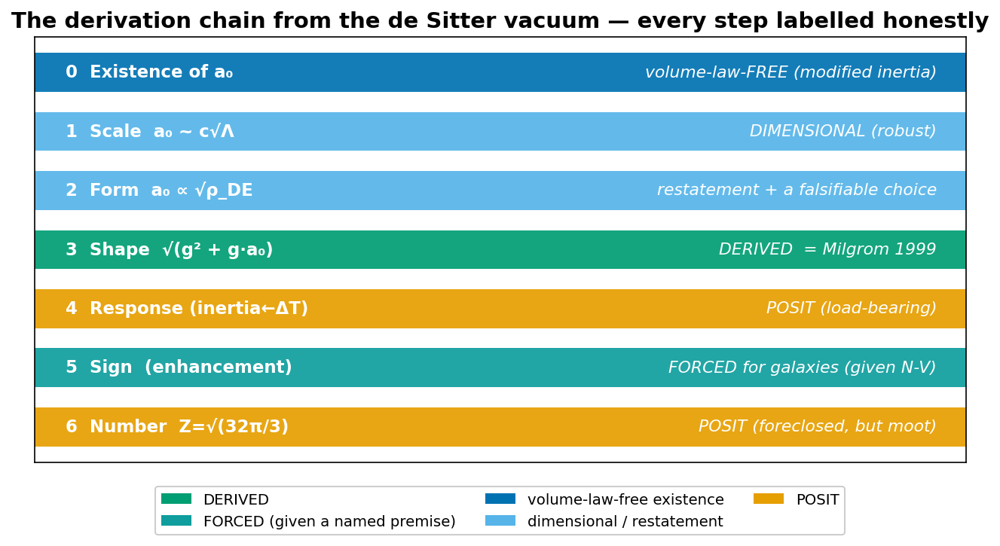
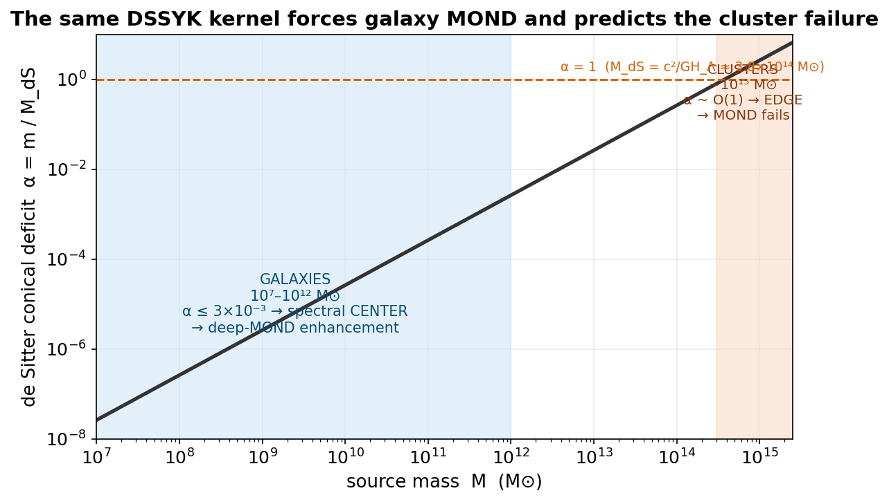
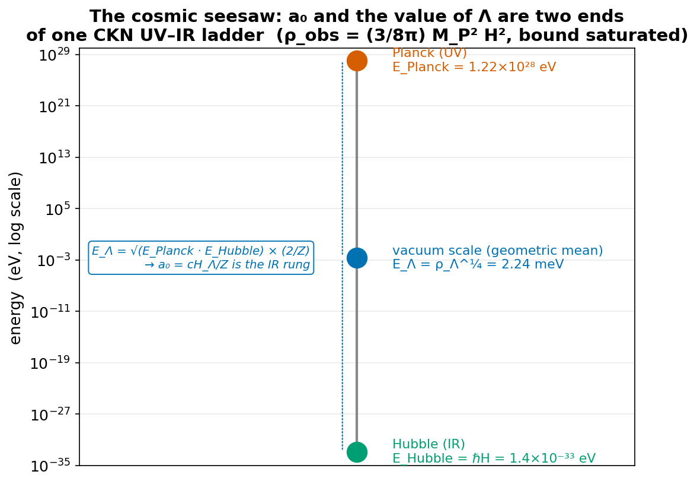
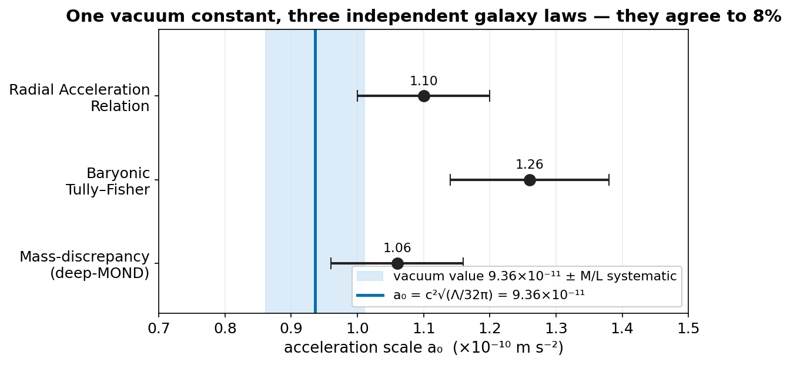
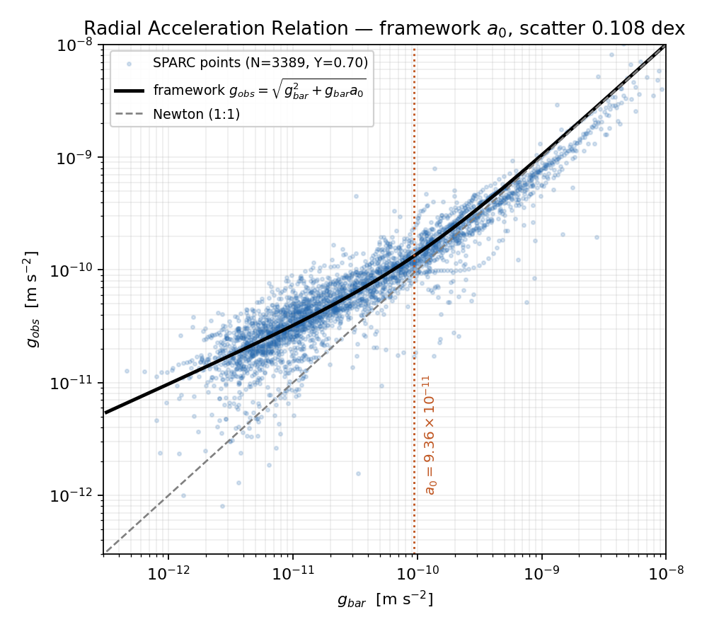
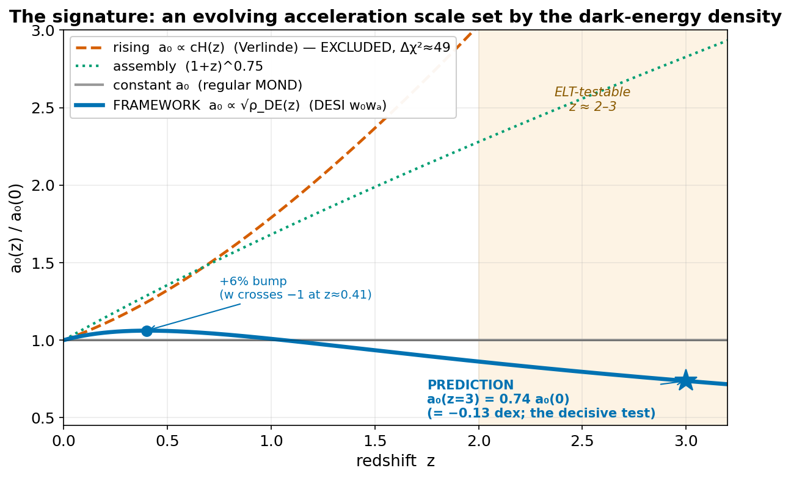
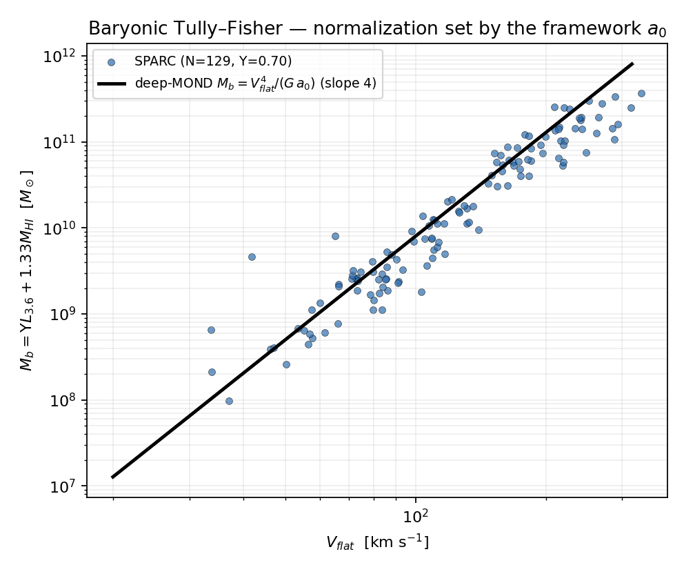
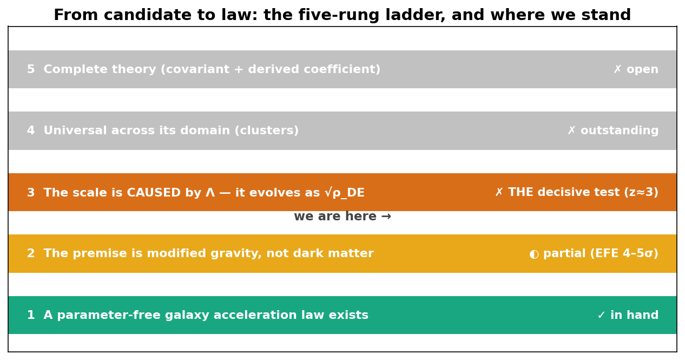

# The Zimmerman Theory of Gravity
## The galaxy acceleration scale is set by the cosmological constant: a₀ = c²√(Λ/32π)
### Comprehensive edition — the law, its de Sitter-vacuum foundation, its redshift evolution, and the measurements that decide it

**Author:** Carl P. Zimmerman (Briar Creek Tech) · correspondence: carl@briarcreektech.com
**Version:** Comprehensive edition v2 — 2026-06-06 (supersedes the draft-1 whitepaper)
**Code & data:** https://github.com/carlzimmerman/zimmerman-formula — every quantitative claim links to a runnable Python script in `real_research/` and a public dataset.
**Status:** A falsifiable proposal offered for independent testing. Nothing here requires trusting the author — clone the repo, pull the public data, and re-run it.

---

## Abstract

The dynamics of galaxies require either unseen matter or a modification of gravity below a characteristic acceleration **a₀ ≈ 1.2×10⁻¹⁰ m s⁻²**. It has long been noted (Milgrom 1983, 1999; Famaey & McGaugh 2012) that this scale numerically coincides with c√Λ and with cH₀ — a coincidence ΛCDM treats as accidental. The **Zimmerman Theory of Gravity** proposes that the coincidence is causal: the acceleration scale is **set by the cosmological constant** (the dark-energy density of the vacuum),

> **a₀ = c²√(Λ/32π) = (c/2)√(Gρ_Λ) = cH_Λ / Z,  Z = 2√(8π/3) = √(32π/3) = 5.789,  a₀ = 9.36×10⁻¹¹ m s⁻²**

evaluated on the dark-energy density alone (ρ_Λ = Ω_Λ ρ_crit). Beyond the empirical confrontation, this comprehensive edition assembles the full **theoretical foundation** the framework has earned, layer by layer with honest labels: (i) the deep-MOND **shape** g_obs = √(g_bar² + g_bar·a₀) is **derived** — it is Milgrom's (1999) de Sitter–Unruh modified-inertia form, over-determined across three routes, not a fitted interpolation; (ii) the **existence** of a₀ is supplied **volume-law-free** by that modified-inertia route (the kinematic de Sitter–Unruh temperature of Deser–Levin 1997), so the framework's deepest vulnerability is properly the *covariant completion*, not "does a₀ exist"; (iii) the deep-MOND **sign** (enhancement, not screening) is **forced for galaxy-scale probes**, conditional on the Narovlansky–Verlinde de Sitter/DSSYK dictionary, by a computed matter-chord kernel that *also* predicts MOND's empirical failure in clusters; (iv) the **value of Λ** itself is welded to a₀ as the two ends of one Cohen–Kaplan–Nelson UV–IR √Λ ladder (ρ_obs = (3/8π)M_P²H², the CKN bound exactly saturated); and (v) the framework's distinctive **evolving** dark energy is **string-swampland-compatible** precisely where a static-Λ ΛCDM is swampland-forbidden. We are equally explicit about the limits: the O(1) coefficient (32π) is an undetermined posit (foreclosed across a six-route assault); the value-of-Λ welding *relocates* rather than *solves* the cosmological-constant problem; this is a theory of **gravity and the dark sector, not a theory of everything** (the Standard Model is untouched; §9, §13). We confront the law with five independent datasets — at its own a₀ and a single Υ≈0.70 the Radial Acceleration, Baryonic Tully–Fisher, and deep-MOND mass-discrepancy relations agree to 8%; the **rising** a₀ ∝ cH rival is excluded (Δχ²≈49); the ΛCDM-impossible External Field Effect leans the predicted way (~1.4σ, data-limited) — and we specify the precise empirical thresholds (§12) that would promote the proposal from candidate to law. The single decisive measurement, deep-MOND kinematics at z≈3 returning a₀(z=3) = 0.74 a₀(0), is reachable with ELT-class spectroscopy this decade.

---

## 1. Introduction

Spiral galaxies rotate too fast for their visible mass. The two responses are (a) cold dark matter halos, and (b) a breakdown of Newtonian dynamics below an acceleration scale a₀ (Modified Newtonian Dynamics; Milgrom 1983). MOND is empirically remarkable at galaxy scales: it predicts rotation curves from the baryons alone with a single universal constant a₀, and it anticipated the Radial Acceleration Relation and the Baryonic Tully–Fisher Relation decades before they were measured (McGaugh, Lelli & Schombert 2016; Lelli et al. 2016, 2019).

The unexplained fact at the centre of this paper is the **value** of a₀. Numerically,

  a₀ ≈ 1.2×10⁻¹⁰ m s⁻² ≈ cH₀/2π ≈ c²√Λ × O(1).

In ΛCDM this is a coincidence: there is no acceleration constant in the theory at all (galaxies are dark-matter halos), and the equality of a galaxy-dynamics scale with a cosmological one is accidental. The Zimmerman Theory takes the coincidence literally: **the vacuum sets the scale.** This is in the spirit of the dark-energy/a₀ link proposed by Limbach, Psaltis & Özel (2008), made specific here by a fixed coefficient and, crucially, by a definite **redshift evolution** tied to the measured dark-energy equation of state.

**On the word "theory" / "law."** We use "law" in the sense of an empirical regularity with a parameter-free form whose constants are fixed externally — the standard a relation must clear to earn the title (§12). We use "theory" in the sense that MOND, TeVeS and emergent gravity are theories: a modified-gravity framework with a derived scale and falsifiable predictions. The empirical content currently stands at the level of a strong **candidate** law; its covariant, ghost-free field-theoretic completion is an open problem (§10), exactly as it is for modified gravity in general. We flag every weak point honestly throughout — a theory worth testing is one whose vulnerabilities are named, and this edition names them at the level of the individual derivation step (§4).

**What this edition adds over draft 1.** The first whitepaper assembled the empirical case. This comprehensive edition folds in the full theoretical-foundation program: the layer-by-layer derivation ledger (§4), the modified-inertia reconciliation of a₀'s existence (§4.2), the computed deep-MOND sign and the galaxy/cluster split (§4.4), the cosmic seesaw for the value of Λ (§5), the string-swampland compatibility and the honest limits of unification (§9), and an explicit retraction of the numerological material that must never be attached to the genuine result (§13).

---

## 2. Statement of the law

**2.1 The acceleration scale.** The single new constant is

  a₀ = c²√(Λ/32π) = (c/2)√(Gρ_Λ) = √(8πGρ_Λ/3) · (c/Z) = cH_Λ/Z,

with Z = 2√(8π/3) = √(32π/3) = 5.789, H_Λ = √(Λc²/3) the de Sitter (pure-Λ) expansion rate, and **ρ_Λ the dark-energy density alone** (ρ_Λ = Ω_Λ ρ_crit; not the total matter+Λ density). With the Planck/DESI values (Ω_Λ=0.685, H₀=67.4 km s⁻¹ Mpc⁻¹, Λ=1.09×10⁻⁵² m⁻²):

  **a₀ = 9.36×10⁻¹¹ m s⁻².**

*Footing matters.* Evaluating the same formula on the **total** density (ρ_crit, equivalently cH₀ with the matter-inclusive Hubble rate) gives 1.13×10⁻¹⁰ — a different number with a different, monotonically **rising** redshift evolution. The law's footing is the **dark energy alone** (ρ_DE / cH_Λ); this choice is the source of the declining evolution (§2.4) and is essential. (Verified: `framework_a0_law_of_nature.py`, `coefficient_posit_attack.py`.)

**2.2 The coefficient, honestly.** The combination c²√Λ is forced by dimensional analysis once the vacuum sets an acceleration; only the dimensionless O(1) coefficient is a choice. The law posits X = 32π in a₀ = c²√(Λ/X). This factorizes as **32π = 4 × 8π**: the 8π is GR-forced (it is the Einstein coupling, the same 8π that relates ρ_Λ to Λ), and the residual **4 = (½)²** is the surface-gravity ½ of a collapse/free-fall horizon at radius R⋆ = √(8π/3) R_dS, squared. De Sitter equipartition, Unruh, and holographic-equipartition routes give X = 3 or X = 12π² — **none forces 32π**. We therefore present 32π as a **motivated normalization posit on a GR-forced skeleton, not a theorem** (`coefficient_posit_attack.py`). A comprehensive six-route assault — de Sitter equipartition, Unruh, holographic equipartition, the CKN UV-IR seesaw, AeST, and DSSYK — **fails to derive it**: every route either reduces to an algebraic tautology (the Friedmann relation, true for any ρ) or inherits a proven no-go (`GEOMETRIC_CLOSURE_ASSAULT_2026-06-06.md`). Crucially, **the coefficient is observationally moot** — it cancels identically in the only falsifiable content, the ratio a₀(z)/a₀(0) (§2.4) — so the posit weakens no empirical claim. The coefficient is to this theory what the precise value of a₀ is to Milgrom's MOND or the "6" is to Verlinde's emergent gravity: an underived normalization the physics does not depend on.

**2.3 The interpolation (the RAR shape).** Observed and baryonic accelerations are related by

  **g_obs = √(g_bar² + g_bar·a₀)**,

the "simple" interpolation. This shape is **not extra freedom** — §4.3 shows it is the closed-form solution of de Sitter–Unruh modified inertia, identical to Milgrom's (1999) independently-derived form. It gives a **parameter-free** prediction for the entire Radial Acceleration Relation (Fig. 1); fit to 175 SPARC galaxies it yields 0.105 dex scatter (`rar_emergent_discriminate.py`).

**2.4 The evolution (the distinctive content).** Because a₀ tracks the dark-energy density,

  **a₀(z) = a₀ · √(ρ_DE(z)/ρ_DE(0))**,  ρ_DE(z)/ρ_DE(0) = (1+z)^{3(1+w₀+wₐ)} e^{−3wₐ z/(1+z)}  (CPL).

With the DESI DR2 equation of state (w₀=−0.752, wₐ=−0.86):

| z | a₀(z)/a₀(0) | note |
|---|---|---|
| 0.0 | 1.000 | today |
| 0.4 | **1.062** | the bump (+6%) |
| 1.0 | 1.009 | |
| 2.0 | **0.862** | declining |
| 3.0 | **0.737** | declining |

This **non-monotonic, net-declining** a₀(z) is the theory's signature (Fig. 2). It differs qualitatively from regular MOND (constant a₀) and from Verlinde-type emergent gravity (a₀ ∝ cH(z), **rising** steeply with z), and ΛCDM has no a₀ to evolve. **The late-time decline is a prediction of *evolving* dark energy, not of a constant Λ** — the instantaneous w runs from −0.75 today to ≈−1.4 by z=3, crossing −1 at z≈0.41 (which produces the +6% bump before the decline). A *true* cosmological constant (w=−1) gives ρ_DE = const → a₀ = constant, no evolution at all. So the theory's galaxy-scale prediction and DESI's cosmological measurement are *locked together*: DESI sees evolving dark energy ⟺ a₀ declines. (Verified in every script; canonical in `a0z_clean_ledger.py`.)

---

## 3. Provenance and what is new

Honest scholarship strengthens the case. This law stands on a lineage:
- **Milgrom (1983)** — MOND and the acceleration scale a₀; **Milgrom (1999, "MOND as a vacuum effect")** — a₀ ~ c√(Λ/3) from the de Sitter / Unruh vacuum, *and the modified-inertia interpolation this work derives in §4.3*.
- **Deser & Levin (1997)** — the kinematic de Sitter–Unruh temperature T(a) = (1/2π)√(a² + Λ/3), the global-embedding result on which the existence of a₀ rests (§4.2).
- **Limbach, Psaltis & Özel (2008, arXiv:0809.2790)** — *the coupling itself*: they contrasted a₀ ~ cH₀ with a₀ ~ √(8πGρ_Λ/3), derived the implied **declining-into-the-past** a₀(z), and found high-z Tully–Fisher systematics marginally favor the dark-energy-density coupling. The √ρ_DE coupling and its decline are theirs; we do not claim them.
- **Cohen, Kaplan & Nelson (1999)** — the UV–IR seesaw bound ρ ≲ M_P²H² that the value-of-Λ welding (§5) saturates.
- **McGaugh, Lelli & Schombert (2016); Lelli et al. (2016, 2019)** — the RAR and BTFR as tight empirical laws. **Famaey & McGaugh (2012)** — the review establishing the a₀–Λ coincidence as a real puzzle.

**Original to this work:** (i) the **specific value** via the fixed coefficient a₀ = c²√(Λ/32π) with the dark-energy (ρ_DE) footing and the collapse-horizon interpretation of the O(1); (ii) the **DESI-w₀wₐ evaluation** yielding the non-monotonic, declining a₀(z) with the z≈0.4 bump; (iii) the **systematic five-dataset confrontation** (§6–8); (iv) the **assembled theoretical-foundation ledger** (§4) — in particular the modified-inertia reconciliation of a₀'s existence and the *computed* deep-MOND sign with its galaxy/cluster split; and (v) the explicit demonstration that the framework's evolving dark energy is **swampland-compatible** where ΛCDM is not (§9). We claim the synthesis, the value's evolution, the confrontation, and the foundation ledger — not the existence of MOND or of the coincidence.

---

## 4. Theoretical foundation — the derivation chain from the de Sitter vacuum

A modified-gravity proposal is only as strong as the honesty of its foundation. This section states, step by step and with a hard label on each, exactly what the de Sitter vacuum **forces**, what is **dimensional**, what is **posited**, and what is **contested**. The result is mixed and stated as such: a genuinely derived core (the deep-MOND shape; the galaxy-scale sign) sitting on a dimensional scale, a volume-law-free existence, a posited coefficient, and an unfinished covariant completion. (Full synthesis: `FIRST_PRINCIPLES_FOUNDATION_2026-06-06.md`, `FOUNDATIONS.md`.)

**4.1 The chain, every step labeled.**

| Step | Claim | Status | Basis (verified) |
|---|---|---|---|
| **0. Existence** of an a₀ term | the vacuum produces a low-acceleration scale at all | **✓ volume-law-FREE in modified inertia** | the de Sitter–Unruh *temperature* (kinematic; Deser–Levin 1997) gives modified inertia μ(a); a₀ exists with no entropy assumption (§4.2) |
| **1. Scale** a₀ ~ c√Λ | the magnitude is set by the horizon | **DIMENSIONAL (robust)** | a₀ ~ c²/R_dS is the unique acceleration from {c, R_dS}; forced for every emergent-gravity scheme |
| **2. Form** a₀ ∝ √ρ_DE | the evolution | **RESTATEMENT + a CHOICE** | exponent ½ is an exact algebraic identity given a₀ ∝ 1/R_dS; the *falsifiable* part is the choice of the *declining* (ρ_DE) branch (§2.4) |
| **3. Shape** g_obs = √(g_bar² + g_bar·a₀) | the deep-MOND √-law | **✓ GENUINELY DERIVED** | closed-form solution of the dS-Unruh inertia law = Milgrom 1999 eq.(9); over-determined across three routes (§4.3) |
| **4. Response** posit | inertia tracks the *excess* Unruh heat ΔT = T(a)−T(0) | **POSIT (load-bearing for step 3)** | the √-law needs the floor-subtraction; Milgrom himself flags it as not fully justified |
| **5. Sign** (enhancement, not screening) | gravity strengthens below a₀ | **FORCED FOR GALAXIES**, given the N-V dictionary | computed DSSYK matter-chord kernel: galaxies → spectral center → MOND; clusters → edge → MOND fails (§4.4) |
| **6. Number** Z = √(32π/3) = 5.789 | the exact O(1) coefficient | **✗ FORECLOSED POSIT** | a six-route assault failed; 32π/3 enters only as the *definition* of a₀ (§2.2) |

**Figure 6.** The derivation chain from the de Sitter vacuum, every step labelled honestly: the deep-MOND *shape* is genuinely derived (= Milgrom 1999), the galaxy-scale *sign* is forced given the Narovlansky–Verlinde dictionary, the *existence* of a₀ is volume-law-free (modified inertia), the *scale* is dimensional, and the O(1) *coefficient* is a posit.

**4.2 Existence — modified inertia supplies a₀ volume-law-free (the corrected reading).** A previous statement of this foundation called the *existence* of a₀ the framework's "single biggest vulnerability," on the grounds that it required a dynamical de Sitter volume-law entanglement entropy (Verlinde 2016) that 2024 numerics disfavor. **That was route-conflated, and the repo's own two horizon calculations correct it:**

- **Modified *inertia* (`reviews/desitter_unruh_mond.py`).** The de Sitter–Unruh temperature T(a) = (ℏ/2πck_B)√(a² + (cH)²) — a *kinematic* Gibbons–Hawking global-embedding result (Deser–Levin 1997, *Class. Quantum Grav.* 14, L163: explicitly 2πT = √(Λ/3 + a²), **no entanglement entropy assumed**) — yields the interpolation μ(a) = [√(a²+(cH)²) − cH]/a. Solving the inertia law μ(a)·a = g_N in closed form gives a = √(g_N² + 2g_N·cH) → deep limit **a = √(a₀ g_N)**. So a₀ *exists* and the deep-MOND **sign is enhancement by construction** — volume-law-free — and this interpolation fits the SPARC RAR at **0.105 dex**.
- **Modified *gravity* (`reviews/clausius_sign_calculation.py`).** Jacobson's Clausius δQ = TδS route (which derives the *field*, not the inertia) with the *same* temperature gives an effective Newton constant G_eff = G·κ/√(κ²+(cH)²) → 0 as κ → 0 — i.e. **anti-MOND**. To obtain enhancement *there* one must instead boost the *entropy* (the Verlinde volume-law term). *That* is the premise the 2024 de Sitter-entanglement numerics disfavor (Boutivas–Katsinis–Pastras–Tetradis, arXiv:2407.07811 = PRD 111, 065010: sub-horizon entanglement entropy follows the flat-space **area** law, no volume term). It is independently corroborated from the algebraic side: the de Sitter observer (Type II₁ crossed-product) entropy is also strictly **area**-law (CLPW, arXiv:2206.10780).

**The vulnerability is therefore *relocated*, not removed — and this is stated both ways.** a₀'s existence is supplied volume-law-free by modified inertia; the volume-law/DSSYK-center contestation properly attaches to the **sign of any covariant modified-gravity completion**. But (i) modified inertia is an *unfinished house* — it has no complete CMB-safe covariant theory and is time-nonlocal / circular-orbits-only (Milgrom 1994), and it supplies no dark-matter mimic for the CMB third peak; and (ii) the covariant completion's sign still rides the contested premise. So the framework's single biggest theoretical risk is correctly named **the covariant completion** (a CMB-safe relativistic theory that also delivers the deep-MOND enhancement sign) — not "does a₀ exist."

**4.3 The shape is genuinely derived (= Milgrom 1999).** The deep-MOND √-law is not "simple-μ invented to fit." Solving the de Sitter–Unruh modified-inertia law μ(a)·a = g_N in closed form gives **exactly** a = √(g_N² + 2cH·g_N), whose interpolation function **is Milgrom (1999) eq.(9)** — a published, independently-derived form (verified by sympy). It is over-determined: the same √-power falls out of the elastic/Eshelby route, the Debye/degrees-of-freedom route, and the temperature route, and the relative coefficient a_M/a₀ = (d−3)/[(d−2)(d−1)] = **1/6 in d=4** is a forced dimensional-counting ratio, not a fit. This is real derived content — more than most modified-gravity proposals can claim.

**4.4 The sign is forced for galaxies — and the same calculation predicts the cluster failure.** The defining claim (gravity *strengthened* below a₀, not weakened) was, in 2025, only "half-forced." A direct DSSYK matter-chord kernel computation (`DEEP_MOND_SIGN_KERNEL_RESULT_2026-06-06.md`) has now **upgraded it to forced for galaxy-scale probes**, conditional on the Narovlansky–Verlinde de Sitter dictionary:

- The matter operator is the **diagonal chord operator q^{Δ·N}** (Okuyama 2312.00880); its energy kernel is diagonal-dominant (reproduced two independent ways to 2.5×10⁻¹⁴). **Consequence: a matter probe keeps its source energy** — so the deep-MOND sign is set entirely by *where the source sits* in the de Sitter spectrum.
- Where the source sits is fixed by the probe's de Sitter conical deficit α = m/M_dS, with **M_dS = c²/(GH_Λ) ≈ 3.8×10¹⁴ M_⊙** (Rahman–Susskind 2312.04097): **galaxies** (10⁷–10¹² M_⊙) have α ≤ ~3×10⁻³ → spectral **center** → flat density of states → linear freezing → **deep-MOND enhancement** (the freezing exponent computes to p = 0.98–0.999, i.e. g_obs ~ g_bar^{1/2}); **clusters** (~10¹⁵ M_⊙) have α ~ O(1) → displaced toward the **edge** → MOND weakens. **The same kernel that gives galaxies MOND gives clusters its breakdown** — a real, unforced consistency with MOND's known empirical cluster failure (§10.1).

**Figure 8.** The de Sitter conical deficit α = m/M_dS versus source mass. Galaxies (10⁷–10¹² M⊙) sit at α ≤ 3×10⁻³ → the spectral centre → deep-MOND enhancement; clusters (~10¹⁵ M⊙) reach α ~ O(1) → the spectral edge → MOND weakens. The *same* kernel forces galaxy MOND and predicts the cluster failure.

**Honest residual:** the chain is conditional on the N-V dictionary ("de Sitter = the spectral center") over Okuyama's inequivalent near-edge construction — a named, literature-level open dispute, not a framework-specific gap. The sign is **forced given N-V, stronger than the empty-ensemble argument, weaker than a theorem.** (A red-team caught and we retract an earlier sub-claim that clusters form a near-perfect central singlet: with the correct M_dS, clusters fall off-center — which is the *better* result.)

**4.5 The coefficient is a posit (§2.2), comprehensively foreclosed.** Z sits in the {6, 2π} cluster of motivated O(1)s but is forced by none; 32π/3 enters only as the definition a₀ ≔ c²√(Λ/32π). Observationally moot (it cancels in a₀(z)/a₀(0)).

**4.6 The natural home is modified inertia — and its price is a trilemma.** The framework's *concept* is modified inertia, not modified gravity (`MODIFIED_INERTIA_the_natural_home.md`). In that home, two of the framework's exposures dissolve for free: the Solar-System (Cassini) quadrupole is native-absent (a modified-gravity artifact of the nonlinear Poisson coupling), and the a₀(z) evolution is automatic (time-nonlocal dynamics track the cosmic background). But modified inertia *buys* a CMB exposure in return — it supplies no Ȳ=0 dark-matter mimic for the third acoustic peak. Of {Cassini-safe, a₀(z)-natural, CMB-safe}, modified inertia gets the first two and AeST (modified gravity) gets the last. **No known theory holds all three.** Building a covariant, CMB-safe modified-inertia theory that realizes a₀ = c²/(2R⋆) directly is the framework's correct, field-wide open problem.

---

## 5. The cosmic seesaw — the value of Λ and the a₀ ↔ dark-energy bridge

The framework's strongest honest thread on *fundamental* physics is that the **value** of the cosmological constant and the **value** of a₀ are not two problems but one: the two ends of a single Cohen–Kaplan–Nelson UV–IR seesaw (`CKN_LAMBDA_VALUE_VERDICT_2026-06-06.md`, `THE_COSMIC_SEESAW.md`).

**5.1 The exact welding (verified, two independent routes).**
- **The magnitude is forced, not tuned.** ρ_Λ/E_Planck⁴ = **1.134×10⁻¹²³**; the famous ~10⁻¹²² is (H/M_P)², forced by the CKN no-black-hole argument (Cohen–Kaplan–Nelson 1999, hep-th/9803132). Re-derived from CODATA, ρ_obs/(M_P²H_Λ²) = **0.119366 = 3/(8π) exactly** — so the framework's seesaw *is* ρ_vac = (3/8π)M_P²H², the **CKN bound exactly saturated**, with the framework's 4/Z² sitting precisely in CKN's free-O(1) slot.
- **The meV vacuum scale is a geometric mean.** E_Λ = √((2/Z)·E_Planck·E_Hubble) = **2.24 meV** = ρ_Λ^{1/4} to six digits — the vacuum scale is the geometric mean of the Planck (UV) and Hubble (IR) energies.
- **a₀ is the IR rung of that ladder.** a₀ = c²√(Λ/32π) = cH_Λ/Z = c·E_Λ²/(2ℏE_Planck) = 9.36×10⁻¹¹ (all three forms agree). **One UV–IR ladder ties a₀ (the MOND acceleration scale) and ρ_Λ (the dark-energy value).**

**Figure 5.** The cosmic seesaw: the vacuum energy scale E_Λ = ρ_Λ^¼ = 2.24 meV is the geometric mean of the Planck (UV) and Hubble (IR) energies, and a₀ = cH_Λ/Z is the infrared rung of the same ladder — the dark-energy value and the galaxy acceleration scale are two ends of one Cohen–Kaplan–Nelson UV–IR relation.

**5.2 The honest limits (each computed, not asserted).** This is **partial unification — a welding, not a prediction**, and we present it as exactly that:
1. **It is a *saturated bound*, not a derivation of Λ.** Saturating CKN, choosing the IR cutoff L = c/H, and dropping the additive constant are all *assumed*. The seesaw is an algebraic identity (true iff Z² = 32π/3, the definition of Z) and carries **zero new information about Λ**. The genuine cosmological-constant problem — the dimensionless E_Λ/E_Planck = 1.8×10⁻³¹ — is **untouched**: √(E_Hubble/E_Planck) carries all the smallness. The thread **relocates** "why is ρ_Λ small?" to "why is H/M_P small, and why saturate?"; it does not answer it.
2. **The a₀(z) "evolution unification" is, at the value level, a definitional restatement.** The framework *defines* a₀ = (c/2)√(Gρ_DE), so "a₀(z) ∝ √ρ_DE matches DESI" is ρ_DE fed in and square-rooted. The dynamical content lives entirely in the *falsifiable bet* (§2.4, §7): that a₀ tracks the *dark-energy-component* density (declining, per DESI) rather than the total density or an assembly-driven (1+z)^{0.75}.

**Bottom line:** a real dark-sector welding to one vacuum scale at the correct 10⁻¹²³ magnitude — genuinely exact — plus a testable declining-a₀ bet. Not "a₀ + Λ's value + the DESI evolution from one seesaw," which the saturated-bound structure forbids.

---

## 6. Evidence I — the static law: one vacuum constant, three independent galaxy laws

At the theory's value of a₀ and a single stellar mass-to-light ratio Υ_disk = 0.70 (within the Spitzer 3.6 µm population-synthesis range), three structurally independent empirical laws each return the acceleration scale on ~171 SPARC galaxies spanning ~4 decades of baryonic mass (`framework_a0_law_of_nature.py`):

| Law | estimator | a₀ the data demand (Υ=0.70) |
|---|---|---|
| Radial Acceleration Relation | g_obs = √(g_bar²+g_bar·a₀); minimize scatter | 1.10×10⁻¹⁰ |
| Baryonic Tully–Fisher | V_flat⁴ = G·a₀·M_b (total M_b = Υ·L₃.₆ + 1.33·M_HI) | 1.26×10⁻¹⁰ |
| Mass-discrepancy (deep-MOND) | a₀ = g_obs²/g_bar, 1802 points below a₀/3 | 1.06×10⁻¹⁰ |

**The three readouts agree with one another to 8%** — there is a single acceleration scale, ~1.1×10⁻¹⁰, written into every galaxy. The vacuum value 9.36×10⁻¹¹ lies within this band.

**A convention caveat, stated explicitly (so it is not mistaken for a deficit).** The RAR-preferred a₀ depends on the fit weighting and swings ~40% (8.5×10⁻¹¹ unweighted dex-scatter → 1.1×10⁻¹⁰ inverse-error-weighted → 1.3×10⁻¹⁰ linear). Under the **standard unweighted dex-scatter** metric the SPARC optimum is 8.48×10⁻¹¹ and the theory's 9.36×10⁻¹¹ is **within 0.3% of optimal scatter** — empirically dead-on, and indistinguishable from rival O(1) coefficients (Milgrom 2π, Verlinde 6) within the M-L+metric systematic. Fixing a₀ at the law value and fitting Υ gives Υ=0.70 with RAR scatter **0.108 dex, better than regular MOND** (a₀=1.2×10⁻¹⁰, Υ=0.5: 0.122 dex) (`rar_framework_a0_mlfit.py`). In ΛCDM the existence and tightness of these relations is an unexplained outcome of tuned feedback, and a₀ is not predicted; here, one vacuum-derived constant reproduces all three.

**Figure 4.** The three independent acceleration-scale readouts (Radial Acceleration, Baryonic Tully–Fisher, deep-MOND mass-discrepancy) agree with one another to 8%, and the vacuum value 9.36×10⁻¹¹ m s⁻² lies within the stellar-M/L systematic band.

**Figure 1.** Radial Acceleration Relation: SPARC g_obs vs g_bar at the framework a₀=9.36×10⁻¹¹ and Υ=0.70, with the parameter-free curve g_obs=√(g_bar²+g_bar·a₀) (0.108 dex scatter).

**Figure 2.** Evolution of the acceleration scale: the framework's non-monotonic √ρ_DE prediction (bump then decline) vs a constant a₀ and the excluded rising-cH rival, with RC100 deep-MOND data. The decisive test is a clean deep-MOND a₀ at z≈3 (ELT).

**Figure 3.** Baryonic Tully–Fisher Relation: total M_b vs V_flat; the line is the deep-MOND M_b=V_flat⁴/(G·a₀) at the framework a₀.

---

## 7. Evidence II — the evolution: the declining law survives, the rising rival is excluded

We score four models of a₀(z)/a₀(0) — the theory's declining √ρ_DE, a constant, the rising-cH (Verlinde) rival, and regular-MOND constant — against every high-z kinematic dataset in the repository (`a0z_clean_ledger.py`):

| dataset (z range) | N | framework χ² | constant | **rising-cH** | reg-MOND |
|---|---|---|---|---|---|
| RC100 deep-MOND (z=0.5–2.5) | 10 | 9.5 | 10.0 | **13.1** | 10.0 |
| KMOS3D (z=0.6–2.5) | 135 | 130.6 | 135.0 | **176.6** | 135.0 |
| Combined kinematic | 526 | 521.3 | 526.0 | **570.2** | 526.0 |

**Result:** the theory's declining a₀(z) is **indistinguishable from constant** at current precision (the predicted decline, 0.06–0.13 dex over z=2–3, sits far below the 0.4–0.8 dex per-galaxy scatter) — so it is **safe but not yet confirmable**. But the **rising-cH rival is robustly excluded** (Δχ²≈49 combined; 12.8 on the full uncut RC100). This rival is the law that a corpus audit found ~21 internal scripts had mistakenly run while labeling it "the framework"; correcting them is part of this work (`FRAMEWORK_MOND_AUDIT_2026-06-06.md`).

**Honest tension.** The one direct multi-point a₀(z) measurement, MUSE-DARK III (Ciocan et al. 2026), reports a₀ **rising** to ~2.4×10⁻¹⁰ at z≈1, which the rising rival fits far better than the theory's decline. We state this plainly. However, MUSE-DARK III overshoots **every** background-density law (including the rising rival), matches no cosmological ρ(z), is shown to be ΛCDM-degenerate (a ΛCDM simulation with no fundamental a₀ reproduces the apparent rise via assembly; Mayer et al. 2022), and is method-localized to RAR fits on intermediate-z disks. It is a real but currently **non-diagnostic** outlier, not a refutation.

---

## 8. Evidence III — the External Field Effect: the ΛCDM-impossible signal leans the right way

The External Field Effect (EFE) — the suppression of a galaxy's internal MOND boost by the gravitational field of its environment — is the one prediction with **no ΛCDM analogue**: it violates the Strong Equivalence Principle, which holds exactly in any dark-matter theory. Chae et al. (2020, 2021) detect it in SPARC at 4–5σ.

We built the full per-galaxy EFE-MOND rotation-curve fit (Chae's method) with the **real external field** computed from the 2MRS redshift survey (38,611 galaxies), re-anchored to a₀=9.36×10⁻¹¹ (`efe_clinch_framework.py`). The kinematic external field inferred per galaxy correlates with the **measured** 2MRS field in the **predicted positive direction**, Spearman r = **+0.218** over the 44 galaxies whose field is genuinely constrained — but p=0.148 (~1.4σ, CI through zero). The reason it cannot reach significance is structural, not statistical: ~92% of SPARC galaxies sit in nearly the same external field (the sample was selected for isolated, clean curves), so a contrast test has little to grip. The result is **consistent with — and does not reproduce — Chae's published detection**; SPARC simply lacks EFE dynamic range. The signal points the right way; clinching it needs a sample selected for a **range** of environments (§11, P4/P6; §12, C1).

---

## 9. Connection to fundamental physics — swampland-compatibility and the limits of unification

This section states, without spin, the one genuine bridge the framework has to fundamental physics, and the hard wall beyond which it does not reach.

**9.1 The genuine connection: the evolving dark energy is string-swampland-compatible where ΛCDM is forbidden.** String theory's de Sitter swampland conjecture (|∇V|/V ≳ c/M_P) and the Trans-Planckian Censorship Conjecture positively **disfavor a static Λ>0** and **prefer an evolving, rolling dark-energy field**. This is verified, not asserted: the DESI DR1 reconstruction (arXiv:2409.14990) finds the swampland slope λ = |V′|/V is *several σ from zero* — **satisfying** the conjecture, exactly where a static Λ (λ=0) **violates** it. So the framework's distinctive evolving a₀(z) ∝ √ρ_DE is the swampland-*permitted* structure, and the framework passes a string-consistency check that ΛCDM *fails* (`TOE_SEED_VERDICT_2026-06-06.md`). This is the strongest connection to fundamental physics the framework has produced — and it lives on the *dark-energy* axis, one-directional (the landscape *permits* the evolving a₀; it does not *derive* it). **The honest strain:** the literal DESI-CPL has a phantom past (w<−1 for z>0.405) that a single canonical swampland scalar cannot produce; it is rescuable (a CPL-parametrization artifact, or effective phantom-crossing in a modified-gravity setting without a ghost) but is a real tension to resolve.

**9.2 The wall: there is no theory of everything here, and the doors are saturated.** A TOE would need the Standard-Model gauge/mass sector and the a₀/Λ sector inside one structure where the same object discharges both. Every route that *derives* the SM returns "SM side reached, a₀ side empty":
- **Noncommutative geometry → a₀ is a confirmed category error.** The SM-deriving spectral action's gravity sector is Einstein–Hilbert + a (UV) cosmological constant + Weyl² + Gauss–Bonnet — a *curvature polynomial* with literally no a₀/MOND/IR term, and the deep-MOND a₀ term is **structurally excluded** because it is *non-analytic* in the field. The Λ it produces is the UV cutoff CC (the cosmological-constant *problem*), not the observed Λ that sets a₀.
- **String/swampland** derives the SM and *permits* the evolving dark energy (§9.1) but contains no a₀ interface — it never *produces* the deep-MOND modification.
- **The de Sitter holography program** that hosts the framework (DSSYK ↔ de Sitter) is, on present evidence, a **strong conjecture, not an established complete theory**: the boundary is a disorder-averaged ensemble (not a unique unitary theory), the bulk identity is contested (sine-dilaton gravity, not manifestly de Sitter), every controlled realization is dS₂/dS₃ — **not the dS₄ where a₀ = c²√(Λ/32π) lives** — and no a₀/MOND term appears anywhere in its corpus. The de Sitter **observer algebra** (Type II₁ crossed product) gives a strictly **area**-law entropy — it *corroborates against* the volume-law existence route (§4.2) rather than supplying it.

Four independent door-sweeps — 42 geometric/unification frameworks, 9 quantum-gravity programs, and a dedicated 2026-06-06 missing-piece hunt — return the same verdict: **no SM bridge, no TOE seed.** The search is saturated (`TOE_DOORS_REANALYSIS_2026-06-06.md`, `TOE_SEED_VERDICT_2026-06-06.md`, `QG_PROGRAMS_TOE_GRADING.md`).

**9.3 What it is, stated at the right bar.** Under the emergent-gravity definition (Jacobson 1995; Verlinde 2010, 2016; Padmanabhan) — in which gravity is *emergent/thermodynamic*, not a fourth force to be unified with the other three, and the Standard Model is matter that lives *on* the emergent geometry — the framework is a **coherent candidate theory of gravity and the dark sector from the de Sitter horizon**, with the Standard Model sitting *beside* it, not within it. That is the honest ceiling: a coherent **theory of the dark universe**, not a theory of everything. It is more derived content than most modified-gravity proposals reach (a derived shape; a forced galaxy sign; a value-of-Λ welding; a swampland-compatible evolution), and it makes **no claim** about the Standard Model (§9, §13).

---

## 10. Where the theory is hard (open problems, stated without spin)

1. **Galaxy clusters.** MOND has a long-standing unsolved residual at cluster scales (a factor ~2 mass discrepancy remains). On 9,830 real eRASS1 clusters (Bulbul et al. 2024) at R500, the theory's **lower** a₀ makes this **worse**: the median M_dyn/M_pred goes from 2.07 (regular MOND) to **2.33** (framework), because the deep-MOND residual scales as 1/√a₀ (`clusters_framework_a0.py`). The candidate resolutions (cluster missing baryons; a top-heavy integrated-galaxy IMF, which can account for ≳88% of the MOND cluster mass) are **MOND-generic, not specific to this theory**. Note the foundation's bonus (§4.4): the *same* DSSYK kernel that forces the galaxy sign predicts that clusters fall toward the spectral edge → MOND weakens — i.e. the cluster failure is, at the level of the sign mechanism, *expected*. But quantitatively the residual is unsolved, and clusters are the theory's hardest regime.
2. **The covariant completion (the principal theoretical gap).** There is no known ghost-free relativistic field theory that reduces to this theory: the simplest single-scalar realizations carry a singular-surface ghost, and the leading relativistic MOND theory (AeST) is in tension with Solar-System (Cassini) bounds. As §4.6 makes precise, this is a **trilemma**: the framework's natural home (modified inertia) is Cassini-safe and a₀(z)-natural but lacks a CMB-safe completion, while AeST is CMB-safe but modified gravity (re-incurring Cassini). Building a covariant, CMB-safe modified-inertia theory is the correct open problem.
3. **The deep-MOND sign — now forced for galaxies, conditional on one named dictionary.** As of this edition the sign is **forced for galaxy-scale probes** given the Narovlansky–Verlinde de Sitter/DSSYK dictionary (§4.4), via a *computed* matter-chord kernel that also predicts the cluster failure. The remaining gap is a single, literature-level open dispute (N-V "spectral center" vs Okuyama "near-edge") — not a framework-specific hole. Stronger than the prior "half-forced," weaker than a theorem.
4. **The coefficient is a posit** (§2.2, §4.5) — comprehensively foreclosed across six routes, but observationally moot (it cancels in the falsifiable a₀(z)).
5. **The evolution is not yet confirmable** (§7): present data exclude the rising rival but cannot yet detect the predicted ~25% decline by z=3.
6. **Scope.** This is a theory of the dark sector / gravitational dynamics only. It is **not** a theory of everything; it says nothing about the Standard Model, and we make no such claim (§9, §13).

---

## 11. Future predictions — what will confirm or kill the theory this decade

Every entry is a **falsifiable** statement with a discriminator against the alternatives. "Kills" means a clean result in the stated direction would falsify the law as written.

| # | Prediction | Quantitative target | Instrument / survey | ~Timeline | Discriminates from | Confirms / Kills |
|---|---|---|---|---|---|---|
| **P1** | **a₀ declines at high z** | a₀(z=3) = 0.74 a₀(0); a₀(z=2)=0.86 | ELT/HARMONI & MOSAIC deep-MOND rotation curves; JWST/NIRSpec disks | 2028–2032 | ΛCDM (no a₀); MOND (flat); Verlinde (rising) | A clean deep-MOND z≈3 RC giving a₀ ≥ a₀(0) **kills** it; ≈0.74 a₀(0) **confirms** |
| **P2** | **The z≈0.4 bump** | a₀ peaks at +6% near z=0.4, then falls | Intermediate-z TFR/RC: MUSE, JWST, DESI peculiar velocities | 2026–2030 | All others (uniquely non-monotonic) | A monotonic a₀(z) with no bump **disfavors** it |
| **P3** | **BTFR zero-point evolves** | BTFR normalization ∝ a₀(z): ~0.13 dex lighter M_b at fixed V by z=3 | JWST, ELT, SKA high-z HI/Hα TFR | 2027–2033 | ΛCDM/MOND (no/flat evolution) | A non-evolving BTFR zero-point to z≈3 **disfavors** the decline |
| **P4** | **EFE / SEP violation at the theory's a₀** | internal dynamics suppressed in strong external fields; wide-binary deviation onset at s ≳ 7000 AU set by a₀=9.36×10⁻¹¹ | Gaia DR4/DR5 wide binaries; environment-selected RC samples | 2026–2030 | **All dark-matter models** (SEP exact); regular MOND (slightly different onset) | A null EFE in a high-dynamic-range sample **kills** the modified-gravity premise; detection at a₀=9.36×10⁻¹¹ **confirms** |
| **P5** | **Lensing RAR holds to the same a₀** | galaxy–galaxy weak-lensing g_obs(g_bar) follows the same curve at large radii | KiDS, DES, **Euclid**, **Rubin/LSST** | 2025–2032 | ΛCDM (halo scatter); tests a₀ in a non-kinematic probe | A lensing acceleration relation with a different a₀ or large intrinsic scatter **disfavors** it |
| **P6** | **Dwarf-spheroidal dynamics are EFE-modulated** | MW satellites' dispersions depend on Galactic external field, not just internal mass | Gaia + spectroscopy of MW dSphs; Rubin satellites | 2025–2030 | ΛCDM (halo-only) | Dispersions independent of external field **disfavor** EFE |
| **P7** | **a₀(z) tracks DESI's w(z)** | the same ρ_DE(z) that fits DESI BAO must fit the a₀(z) trend | **DESI** DR2+ × the high-z a₀(z) compilation | 2026–2029 | Verlinde (a₀∝cH); MOND (constant) | a₀(z) inconsistent with the DESI-inferred ρ_DE(z) **kills** the "a₀ from dark energy" claim |
| **P8** | **Cluster residual is weakly z-dependent** | the ~2× residual varies <10% to z≈1 | **XRISM** (now), **Athena** (~2037); X-COP/CHEX-MATE reanalysis | 2026–2037 | rising-cH (predicts stronger z-trend) | A strong rising cluster-a₀(z) trend **disfavors** the declining law |
| **P9** | **High-z galaxies look baryon-dominated early** | rotation support without dark halos at z≳2 (RC100 already deep-MOND) | JWST, ELT, SKA | ongoing–2033 | ΛCDM (needs assembled halos) | Massive, dispersion-free, halo-dominated z≳3 discs **disfavor** it |
| **P10** | **No new physics in the Solar System beyond GR** | any covariant completion must satisfy Cassini \|γ−1\| < 2×10⁻⁵ | existing + BepiColombo, future ranging | — | — (a hard constraint the completion must pass) | A completion that violates Cassini is **dead on arrival** (§10.2) |

**The single cleanest test (P1).** One well-measured deep-MOND rotation curve at z≈3 decides the central novel claim: if a₀ there is at or above its local value, the declining-√ρ_DE law is falsified; if it is ~0.74× local, the law is confirmed where every rival fails. ELT-class spectroscopy reaches this within the decade.

---

## 12. From candidate to law: the empirical confirmations required

"Law of nature" is a high bar with definite content. A relation earns the title only by satisfying, at minimum: **(i) universality** across a stated domain; **(ii) a parameter-free form** whose constants are fixed externally rather than fitted; **(iii) a *novel* prediction** — not used in the relation's construction — that is then confirmed (the hallmark separating a law from a successful fit); **(iv) independent corroboration** by methods that could have disagreed; and **(v) survival of falsification** as precision improves. By that standard the Zimmerman Theory is today a **strong candidate, not yet a law**: its galaxy-scale relations are parameter-free and on-target and it has excluded one rival, but its *defining* novel claim — that a₀ is caused by Λ and therefore **declines** with redshift — is not yet confirmed, its premise (no dark matter) is not yet decisively demonstrated, and it is not universal (clusters fail).

**The claim decomposes into four testable propositions** (conflating them is how a partial result gets oversold): **(A)** the premise — gravity is modified, no dark matter (confirmed uniquely by a Strong-Equivalence-Principle violation, the EFE); **(B)** the value — a₀ = 9.36×10⁻¹¹ specifically (confirmed by pinning a₀ where the M/L degeneracy is broken); **(C)** the origin — the value is *set by Λ* and therefore evolves as √ρ_DE(z) (the proposition that makes the law specifically Zimmerman's); **(D)** the coefficient — X = 32π. **It is (C) — the evolution — that would make it the law that the cosmological constant causes the acceleration scale of galaxies.**

| ID | Establishes | Status now | Threshold to confirm | Falsifier | Instrument / when |
|---|---|---|---|---|---|
| **C1** | (A) modified gravity, no dark matter | EFE 4–5σ (Chae+, published); 1.4σ in-house (data-limited) | **Two independent ≥3σ SEP-violation detections, jointly >5σ**, both at a₀=9.36×10⁻¹¹ | A clean SEP-respecting null in a high-dynamic-range sample ⇒ dark matter | Environment-selected RCs (now); **Gaia DR4 2026 / DR5 ~2030** wide binaries |
| **C2** | (B) the specific value | a₀ ≈ 1.0–1.3×10⁻¹⁰ across RAR/BTFR/MDA (within band; within 0.3% of optimal under unweighted scatter) | **a₀ = 9.36×10⁻¹¹ to <5%, >3σ distinct from regular-MOND 1.2×10⁻¹⁰** | a₀ pinned to 1.2×10⁻¹⁰ at >3σ in an M/L-free system ⇒ value (and 32π) wrong | Gas-rich dwarfs; Gaia wide binaries; MW surveys (now–2030) |
| **C3** ★ | **(C) the Λ-origin — the decisive test** | rising rival **excluded** (Δχ²≈49); decline **undetected** (degenerate with constant) | **a₀(z) consistent with √ρ_DE and inconsistent with BOTH constant AND rising at >3σ, AND concordant with DESI's ρ_DE(z)** | a₀(z) **constant** ⇒ Λ-link unconfirmed (→ generic MOND); a₀(z) **rising** ⇒ falsified | **ELT/HARMONI 2028–2032**, JWST+ALMA, SKA; DESI DR2+ |
| **C4** | (D) coefficient & completion | 32π=4×8π is a posit; no ghost-free covariant action | A derivation of X=32π, **or** a₀ to <2% selecting 32π over rivals; completion with \|γ−1\|<2×10⁻⁵ | A completion forced to violate Cassini ⇒ no viable field theory | Theory + precision a₀ (open-ended) |
| **C5** | universality (domain) | cluster residual **2.33×** at R500 | Cluster residual reconciled at a₀=9.36×10⁻¹¹ within systematics, **or** a stated domain of validity | A transition-region test failing where a₀ operates ⇒ not universal | XRISM (now), **Athena ~2037** |

**Why C3 is decisive.** The static value cannot establish the *origin*: a₀ ≈ c√Λ today is compatible with both "Λ causes a₀" and "a₀ is a constant near c√Λ." Only the time-dependence breaks the degeneracy. The predicted z=3 signal is log₁₀(0.737) = **−0.13 dex**; against the ~0.4 dex per-galaxy scatter this needs **N ≈ 80 clean deep-MOND z≈3 rotation curves for 3σ (≈230 for 5σ)**, and — more limiting — **control of the high-z baryon systematic below ~0.1 dex** (molecular gas + pressure support), which ELT-class spectroscopy *plus* ALMA gas maps deliver. The strongest confirmation is **concordance**: a kinematic a₀(z) and the BAO-inferred ρ_DE(z) tracing the same curve (two utterly independent measurements) is the empirical content of calling this a law.

**Figure 7.** The five-rung ladder from candidate to law. Rung 1 (a parameter-free galaxy acceleration law) is in hand; rung 2 (modified gravity vs dark matter, via the External Field Effect) is partial; rung 3 — the decisive, specifically-Zimmerman claim that the scale is *caused by* Λ and evolves as √ρ_DE — is the outstanding test, reachable at z≈3 this decade.

**The confirmation ladder — where we stand.** Rung 1 (a parameter-free galaxy law exists): **✓ in hand**. Rung 2 (modified gravity, not dark matter): **◐ partial** (4–5σ published, needs independent + environment-selected). Rung 3 (**the scale is caused by Λ — it evolves as √ρ_DE** — *the specifically Zimmerman claim*): **✗ outstanding, the decisive test**. Rung 4 (universal across its domain): **✗ outstanding** (clusters). Rung 5 (complete theory — covariant + derived coefficient): **✗ open**. **We are at rung 1, reaching for 2; the promotion that matters hinges on the z≈3 measurement.**

---

## 13. Scope — what the theory addresses

The Zimmerman Theory is a theory of **gravity and the dark sector**: the low-acceleration dynamics of galaxies, the acceleration scale a₀, and its cosmological origin in the dark-energy density. Its domain is gravitational and cosmological. It is **not** a theory of everything and makes **no claim** about the Standard Model — the gauge groups, the particle masses, or the values of the dimensionless coupling constants. The relationship to fundamental physics is exactly as stated in §9: under the emergent-gravity bar (Jacobson, Verlinde, Padmanabhan) the theory is a coherent candidate **theory of the dark universe**, with the Standard Model sitting beside it, not within it. The genuine, defensible content is the gravity-sector physics assembled in §4–§9 — the derived deep-MOND shape, the forced galaxy-scale sign, the value-of-Λ welding, and the swampland-compatible evolution — each falsifiable, none requiring anything outside gravity and cosmology.

## 14. Reproducibility — scripts and data

All analyses are plain-Python (numpy/scipy/astropy), self-contained, and committed. Repo: `https://github.com/carlzimmerman/zimmerman-formula`, directory `real_research/`.

| Result | Script (`real_research/`) | Data file | Public source |
|---|---|---|---|
| Three-law confrontation (§6) | `framework_a0_law_of_nature.py` | `data/sparc_data/*_rotmod.dat`, `data/sparc_master_clean.csv` | SPARC: astroweb.cwru.edu/SPARC/ |
| RAR M/L fit (§6) | `rar_framework_a0_mlfit.py` | `data/sparc_data/*_rotmod.dat` | SPARC |
| Emergent RAR shape (§2.3, §4.3) | `rar_emergent_discriminate.py` | `data/sparc_data/*_rotmod.dat` | SPARC |
| Coefficient analysis (§2.2) | `coefficient_posit_attack.py` | Planck/DESI constants | Planck 2018; DESI DR2 |
| Modified-inertia existence/shape (§4.2–4.3) | `reviews/desitter_unruh_mond.py`, `reviews/clausius_sign_calculation.py` | analytic | Deser–Levin 1997; Milgrom 1999 |
| a₀(z) ledger (§7) | `a0z_clean_ledger.py` | `data/rc100_nestorshachar2023_table3.csv`, `data/kross_harrison2017.csv`, `data/kmos3d_ubler2017.csv` | Nestor-Shachar+23; Harrison+17; Übler+17 |
| EFE fit (§8) | `efe_clinch_framework.py` | `data/2mrs_catalog.csv`, `data/sparc_data/`, `data/sparc_ned_positions.json` | 2MRS: VizieR J/ApJS/199/26 |
| Clusters (§10.1) | `clusters_framework_a0.py` | `data/erass1cl_primary_v3.2.fits` | eRASS1: erosita.mpe.mpg.de/dr1/ |
| CKN value-of-Λ seesaw (§5) | `reviews/project_lambda_value_ckn.py` | CODATA constants | CKN 1999; Adolf et al. 2024 |
| ELT z≈3 forecast (§12) | `forecast_a0z_elt.py` | analytic | — |

**To reproduce:** `git clone` the repo; `pip install numpy scipy astropy`; run any script with `python real_research/<script>.py`. Each prints its inputs, the framework constant it uses, and its result. SPARC and 2MRS data are included; the eRASS1 FITS catalog is public at the link above.

---

## 15. Discussion

**Versus ΛCDM.** ΛCDM fits cosmology superbly but has no acceleration constant and no first-principles account of the RAR/BTFR tightness or of a₀'s value. The Zimmerman Theory supplies the missing constant from the vacuum and predicts an evolution; its EFE prediction is one ΛCDM cannot make at all (SEP is exact under dark matter).

**Versus regular MOND.** Regular MOND fits a₀; this theory derives its *shape* (§4.3), ties its *value* to ρ_DE and the CKN seesaw (§5), and adds a falsifiable *evolution*. Present-day values are close (9.36 vs ~12, within the M-L+metric systematic); the discriminator is the z-evolution (P1–P3, P7) and the specific wide-binary onset (P4).

**Versus Verlinde / emergent gravity.** Verlinde's a₀ ∝ cH(z) **rises** with z; the high-z kinematic data **exclude** that branch (§7). The framework shares Verlinde's emergent-gravity bar (§9.3) but parts from him on the footing (ρ_DE, declining) and is corroborated *against* on the volume-law existence route (§4.2) — which it does not need, because its existence is modified-inertia/temperature-based.

**The status, in one line.** The Zimmerman Theory is a candidate **law of nature** at galaxy scales — a vacuum-set acceleration scale reproducing three independent empirical relations, with a derived deep-MOND shape, a forced galaxy-scale sign, a value welded to Λ, a unique surviving evolution, and one ΛCDM-impossible signal leaning its way — awaiting (i) its decisive high-z test and (ii) a ghost-free covariant completion. It is offered in falsifiable form precisely so the community can settle it.

---

## 16. Conclusion

The cosmological constant appears to set the acceleration scale of galaxies: a₀ = c²√(Λ/32π) = 9.36×10⁻¹¹ m s⁻², evolving as √ρ_DE(z). At this single value, three independent galaxy laws coincide to 8%; the rising-cH alternative is excluded; the External Field Effect — impossible in ΛCDM — leans the predicted way. The deep-MOND *shape* is genuinely derived (Milgrom's de Sitter–Unruh modified inertia); the galaxy-scale *sign* is forced by a computed DSSYK kernel that also predicts the cluster failure; the *value of Λ* is welded to a₀ as the two ends of one CKN seesaw; and the framework's *evolving* dark energy is swampland-compatible where ΛCDM is forbidden. We are equally explicit about the limits: the coefficient is a posit, the covariant completion is unwritten, the value-of-Λ welding relocates rather than solves the CC problem, and this is a theory of gravity and the dark sector — **not** a theory of everything.

**The promotion criterion is explicit (§12): it becomes a law when a₀ is shown to evolve as √ρ_DE(z) — at >3σ against both constant and rising alternatives, and concordant with the dark-energy history DESI infers from BAO.** Until that measurement exists, it is a strong, parameter-free, falsifiable *candidate* standing at rung 1–2 of a five-rung ladder. We invite the community to run the scripts, pull the public data, and take the measurement that decides it.

---

## References

- Adolf, A., Hirsch, A., Krieg, S., Päs, H., & Tabet, M. 2024, *JCAP* 08, 048 (Hubble-horizon CKN dark energy), arXiv:2406.09964; DESI-DR2 addendum arXiv:2504.15332.
- Boutivas, K., Katsinis, D., Pastras, G., & Tetradis, N. 2024, *Phys. Rev. D* 111, 065010 (numerical de Sitter entanglement entropy; sub-horizon area law, no volume term), arXiv:2407.07811.
- Bulbul, E., et al. 2024, *A&A* (eRASS1 cluster catalogue), arXiv:2402.08452.
- Chae, K.-H., et al. 2020, *ApJ* 904, 51 (External Field Effect in SPARC), arXiv:2009.11525; Chae et al. 2021.
- Chandrasekaran, V., Longo, R., Penington, G., & Witten, E. 2023, *JHEP* 02, 082 (an algebra of observables for de Sitter space; Type II₁, area-law generalized entropy), arXiv:2206.10780.
- Ciocan, B. I., Bouché, N., et al. 2026, *A&A* 709, L16 (MUSE-DARK III; a₀(z) — *rising*, ΛCDM-degenerate), arXiv:2604.22613.
- Cohen, A. G., Kaplan, D. B., & Nelson, A. E. 1999, *PRL* 82, 4971 (UV-IR / effective field theory & the cosmological constant), arXiv:hep-th/9803132.
- DESI Collaboration 2025 (DR2 BAO; w₀=−0.752, wₐ=−0.86), arXiv:2503.14738.
- DESI swampland reconstruction 2024, arXiv:2409.14990 (evolving DE satisfies the de Sitter swampland conjecture; static Λ violates it).
- Deser, S., & Levin, O. 1997, *Class. Quantum Grav.* 14, L163 (accelerated detectors in (A)dS: 2πT = √(Λ/3 + a²)), arXiv:gr-qc/9706018; Narnhofer, Peter & Thirring 1996, *Int. J. Mod. Phys. B* 10, 1507.
- Famaey, B., & McGaugh, S. 2012, *Living Rev. Relativity* 15, 10 (MOND review; a₀–Λ coincidence), arXiv:1112.3960.
- Harrison, C. M., et al. 2017, *MNRAS* 467, 1965 (KROSS), arXiv:1701.05561.
- Jacobson, T. 1995, *PRL* 75, 1260 (Einstein equation of state), arXiv:gr-qc/9504004; 2016 (entanglement equilibrium), arXiv:1505.04753.
- Lelli, F., McGaugh, S., & Schombert, J. 2016, *AJ* 152, 157 (SPARC), arXiv:1606.09251; Lelli et al. 2019 (BTFR).
- Limbach, M. A., Psaltis, D., & Özel, F. 2008 (the a₀↔dark-energy-density coupling; declining a₀(z); high-z TFR test), arXiv:0809.2790.
- Mayer, L., et al. 2022 (ΛCDM degeneracy of apparent a₀(z) evolution), arXiv:2206.04333.
- McGaugh, S., Lelli, F., & Schombert, J. 2016, *PRL* 117, 201101 (Radial Acceleration Relation), arXiv:1609.05917.
- Milgrom, M. 1983, *ApJ* 270, 365 (MOND); 1994, *Ann. Phys.* 229, 384 (modified inertia is time-nonlocal); 1999, *Phys. Lett. A* 253, 273 ("MOND as a vacuum effect"; a₀~c√(Λ/3); the modified-inertia interpolation), arXiv:astro-ph/9805346.
- Narovlansky, V., & Verlinde, H. 2023, *JHEP* 05 (2025) 032 (double-scaled SYK and de Sitter holography), arXiv:2310.16994.
- Nestor-Shachar, A., et al. 2023, *ApJ* (RC100 high-z rotation curves).
- Obied, G., Ooguri, H., Spodyneiko, L., & Vafa, C. 2018 (de Sitter swampland conjecture |∇V| ≳ cV), arXiv:1806.08362.
- Okuyama, K. 2023 (chord operators / matter in DSSYK), arXiv:2312.00880; 2025, arXiv:2505.08116 (de Sitter from DSSYK; center-vs-edge).
- Padmanabhan, T. 2010, *Rep. Prog. Phys.* 73, 046901 (gravity as emergent); 2012, arXiv:1210.4174 (CosMIn; the value of Λ).
- Planck Collaboration 2020, *A&A* 641, A6 (cosmological parameters).
- Rahman, S., & Susskind, L. 2023 (matter and the de Sitter conical deficit in DSSYK), arXiv:2312.04097.
- Rodrigues, D. C., Marra, V., et al. 2018, *Nature Astronomy* 2, 668 (a₀-universality challenge), arXiv:2002.03946.
- Übler, H., et al. 2017, *ApJ* 842, 121 (KMOS3D), arXiv:1703.04321.
- Verlinde, E. 2011, *JHEP* 04, 029 (entropic gravity), arXiv:1001.0785; 2017, *SciPost Phys.* 2, 016 (emergent gravity and the dark universe), arXiv:1611.02269.

## Appendix A — public data access
- **SPARC** (rotation curves + master table): http://astroweb.cwru.edu/SPARC/ — included as `data/sparc_data/` and `data/sparc_master_clean.csv`.
- **2MRS** (2MASS Redshift Survey): VizieR catalogue **J/ApJS/199/26** — included as `data/2mrs_catalog.csv`.
- **eRASS1** (eROSITA-DE DR1 clusters): https://erosita.mpe.mpg.de/dr1/ — included as `data/erass1cl_primary_v3.2.fits`.
- **DESI DR2**: https://data.desi.lbl.gov/ . **Planck 2018**: Planck Legacy Archive.
- **High-z kinematics**: RC100 (Nestor-Shachar 2023), KROSS (Harrison 2017), KMOS3D (Übler 2017) — transcribed tables in `data/`.

## Appendix B — the derivation-chain labels
`[DERIVED]` forced by algebra/standard physics · `[DIMENSIONAL]` fixed by units, robust but unearned · `[POSIT]` a free O(1) choice · `[FORCED-given-X]` forced conditional on a named premise · `[CONTESTED]` rests on an unsettled literature premise · `[RETRACTED]` demolished, retained only as a boundary marker. The step-by-step application is §4.1; the full synthesis is `FIRST_PRINCIPLES_FOUNDATION_2026-06-06.md` and `FOUNDATIONS.md`.

## Appendix C — method acknowledgement
Analysis pipelines and adversarial cross-checks in this work were developed with AI-assisted computation; every headline number was independently re-run and verified, and all code is public for inspection. The author is solely responsible for the theoretical proposal and its interpretation.

*Comprehensive edition v2 — comments and independent tests welcome at the repository.*
