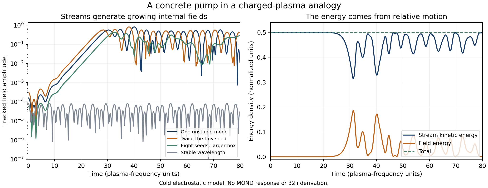

# Continued investigation: a pump exists, but gravity-active mode selection is still missing

**The common theory and 32pi coefficient remain OPEN.** The substantive progress is a concrete free-energy pump, a longitudinal extension connecting it to the dipole equations, and a sharper identification of the required mode conversion. A stream can drive internal oscillations. That alone does not select the observed gravitational law or its coefficient.

Base and assumptions: `SELECTION_CONTRACT.md`. Authoritative executions: `runs/selection/`, `runs/passage/`, `runs/instability/`, `runs/pic/`, `runs/modes/`, `runs/bridge/`. These contain validated input/output hashes, versions, commands and exit statuses. There are 121 scoped symbolic/numerical checks in total, not 121 confirmations of a physical theory. No pre-existing campaign files or papers were revised.

## 1. Passive local organization does not create the desired state

For the equal-charge normalized dipole ODE previously examined, with fixed local g along x, define

    V(z) = sum_a |z_a-e_x|²/2 + c z_1 dot (z_2 cross z_3),
    c = sqrt(3) g/2,
    H = sum_a |dot(z_a)|²/(2 omega_a²) + V.

The three cyclic gradients reproduce the forces exactly. The Hessian at z_a=e_x has eigenvalues 1 (five times), 1+3g/2 (twice), and 1-3g/2 (twice). Thus the aligned state is a strict local minimum for 0<=g<2/3 in these dimensionless units. It does not spontaneously develop the needed transverse coherence in the weak-field local model. The critical number is not a MOND acceleration or the coefficient puzzle.

Adding passive damping -gamma dot(z_a), as a diagnostic rather than a derived bath, gives

    dH/dt = -gamma sum_a |dot(z_a)|²/omega_a².

Four initially coherent or oppositely oriented cases at g=0.0002 or 0.002, gamma=0.04, decay toward the aligned zero-response state. An integrated sink closes the local energy ledger to relative error below 5e-9. The undamped control retains its initial excitation energy. A closed Hamiltonian conserves phase-space volume and does not supply a dissipative attractor selecting one oscillator energy.

These damped cases also have an analytic local-basin certificate. At displacement norm one,

    V >= (1-sqrt(3)|c|)/2 - |c|/(3sqrt(3)).

The initial energies near 0.25 lie below this barrier, which exceeds 0.498 in the tested cases. The Hessian throughout that ball has lower bound 1-4|c|>0. Energy decreases, the trajectory cannot cross the barrier, and the sole stationary point in that ball is aligned. This is a scoped local result. The truncated cubic potential is globally unbounded; no global nonlinear or covariant health is established.

One first-run symbolic comparison failed because Sympy's characteristic-polynomial generator discarded the real-symbol assumption, producing two unequal symbols both printed as `lambda`. The minimal reproduction confirmed the cause. The comparison now uses the actual polynomial generator. Original failed JSON/log files are preserved as `initial_selection_*`; they lack the stronger provenance of the corrected bounded run. The mathematics of the spectrum did not change.

## 2. A real-shaped passage can supply amplitudes, but its quadratic term is transverse

Instead of inserting coherent oscillations, initialize the dipoles at zero upstream and force them by

    g(t) = A (1,0,t)/(1+t²)^(3/2),

the Newtonian force shape along a fast straight passage past a point mass, in units b/V=1. This is a prescribed Born trajectory, with no particle-orbit reaction or Poisson feedback. First three perturbative orders and the full local quadratic ODE are propagated separately.

First-order oscillation amplitude is proportional to A **as a result of the driven equation**, not an assigned initial phase. This partially repairs the earlier amplitude-input problem. However all first-order vectors remain in the orbital plane. Their cross products point out of that plane. The longitudinal second-order response is exactly zero. The first radial nonlinear term is third order: doubling A gives ratios 7.999999995 and 7.999999999, rather than the factor four required for a quadratic response.

The full local ODE agrees with the retained expansion in the stated weak-forcing range. Internal energy gain matches integrated external work, with relative residual below 2e-9. This accounts for the prescribed force's work, not its missing orbital reaction. At the tested initial frequency scale, the remaining linear radial lag is about 0.667 of the peak forcing; increasing frequencies by ten reduces it to 0.225, not to zero in that finite case. Moving the finite upstream start from -20 to -40 changes the cubic peak by about 1.02%. None of these cases derives a stationary MOND constitutive law.

## 3. Streaming instability supplies an actual source of internal energy

Now change the missing premise: use two equal cold **charged** populations moving at +/-v with a fixed neutralizing background. This is a physical plasma analogy, not an assumed realization of the full dark action. Define Omega_p using the total beam density. Continuity, momentum and Poisson equations give

    1 - (Omega_p²/2)[1/(omega-kv)² + 1/(omega+kv)²] = 0,
    omega_-² = (kv)² + Omega_p²/2 - (Omega_p/2)sqrt(Omega_p²+8(kv)²).

The branch is unstable for 0<|kv|<Omega_p. Its maximum has

    |kv| = sqrt(3/8) Omega_p,
    gamma_max = Omega_p/(2sqrt(2)).

An independently built four-dimensional cold-fluid matrix and time-domain integrations verify these rates. Zero streaming and stable wavelengths provide controls. These are standard plasma mechanisms, not a claim of a new discovery. The derivation and convention are explicit here; no literature formula is being silently transferred to dark matter.

The nonlinear electrostatic particle-in-cell calculation then follows the energy transfer. It uses a spectral Poisson solve, CIC deposition/interpolation, and kick-drift-kick evolution. At the fastest growing mode, the fine run's first field-amplitude peak is 0.5649233. Doubling the small seed changes that peak by 0.0265%; the coarse/fine difference is 0.00647%. The stable-wavelength control stays below 8.34e-5. Across the declared runs, maximum relative kinetic-plus-field energy drift is below 4.14e-5, and deposited number density is conserved to roundoff. The growing field takes its energy from relative stream motion.

The finite-window growth fit is about 0.34220, versus the asymptotic pure-mode rate 0.35355. This difference is understood rather than hidden: the quiet displacement seeds both branches. At the optimum its exact linear density response is proportional to

    (1/4) cosh(t/sqrt(8)) + (3/4) cos(sqrt(15/8)t).

Fitting that mixed response over the same [8,18] window gives 0.3422028555. The PIC finite-window fits pass the corresponding benchmark, as well as the looser asymptotic comparison.

The first peak is not a universal stationary amplitude. A box four times longer, seeded with eight different deterministic phases, gives 0.4279650 in the same physical fastest-growing mode, about 24.2% lower. No uniform bath temperature, astrophysical density distribution or three-dimensional saturation is inferred from these cases.

The frequently used estimate omega_bounce²=k a_wave gives the small-oscillation frequency at the bottom of a single sinusoidal trapping potential. Applying it to the measured **fundamental harmonic** gives omega_bounce_estimate/gamma_max=1.66359 in the fine run. This is not a measured trapped-particle orbit frequency: finite-amplitude orbits have different periods, and the nonlinear field contains harmonics. It also does not justify imposing omega_bounce=gamma as an exact saturation law.

## 4. The instability survives a longitudinal dipole/field feedback extension

For this step, retain the linear dipole equation, longitudinal gauge Gauss relation and gravitational Poisson feedback from [Blanchet and Seraille, arXiv:2502.14686v2, Eqs. (3.15), (3.18)-(3.21)](https://arxiv.org/pdf/2502.14686), instead of keeping g external. Add two uniform nonrelativistic streams per color as a **declared extension**. Finite background velocities go beyond the paper's near-rest solution; a full covariant kinetic derivation is not claimed.

Let each of the six populations have density rho_d/6 and eta_a=sqrt(3). At longitudinal linear order, for no baryon perturbation,

    (d_t+v_s d_x)² xi_as = Omega²[(sum_bt xi_bt)/6 - (sum_t xi_at)/2],
    Omega²=8piG rho_d.

The first term follows from gravitational feedback; the second from the color electric field. Decompose color space into the uniform vector (1,1,1) and its two orthogonal directions. The uniform branch's restoring force cancels and has only marginal advective double roots. Each orthogonal branch has the two-stream quartic above. A separate twelve-dimensional spectral calculation verifies its two growing modes and their rates.

Those growing modes have zero sum over colors, hence zero total gravitational polarization at first order. Their normalized gravitational projections are below 2e-15 in the unstable numerical cases. This supplies a concrete internal pump within the scoped longitudinal extension, but does not yet make a galaxy's gravitational response. The marginal gravity branch is not a stability or coefficient certificate.

## 5. The next transfer step is constrained, but not impossible

For smooth scalar fields,

    div(grad(phi) cross grad(psi)) = 0.

Equivalently (k_1+k_2) dot (k_1 cross k_2)=0. Thus even two noncollinear **longitudinal** waves produce a quadratic cross source transverse to their combined wavevector. With constant densities, frequencies and stream velocities, the transport operators commute with divergence. Zero initial quadratic gravitational density remains zero under this purely longitudinal quadratic forcing. The constant-coefficient purely electrostatic cubic `grad(third) dot (grad(phi) cross grad(psi))` is also a boundary divergence; by itself it does not choose a bulk electrostatic state.

These statements are restricted to the specified perturbative homogeneous sector. Nonlinear saturation can generate transverse fields; inhomogeneous coefficients, gauge vector potentials and magnetic interactions change the premises. The full non-Abelian field equations are not excluded.

A smooth constructive witness shows why a global no-go would be wrong. Put S=sqrt(r²+ell²), ell>0, and choose

    phi=x/S,  psi=y/S,  A=1+epsilon z/S,
    P=A grad(phi) cross grad(psi),  |epsilon|<1.

The weight is positive. The spherical flux and averaged divergence are

    Q(r) = (4pi epsilon/3) r³/(r²+ell²)^(3/2),
    average div(P) = epsilon ell²/(r²+ell²)^(5/2).

The average is Plummer shaped and positive for epsilon>0, without a singular core in the scalar fields. The full angular source need not be positive everywhere. A radial weight alone gives zero monopole flux; the correlation with angular structure matters.

This is an existence witness for a vector field, **not an action solution**. The functions and epsilon were chosen, and no galaxy normalization follows. In particular curl(A grad(phi)) at the origin is epsilon e_y/ell². Interpreting such a weighted gradient as physical polarization therefore leaves the purely electrostatic sector and requires a compatible time-dependent/magnetic field dictionary. A finite-energy outer cutoff and its compensating structure would also need physical justification. The witness identifies what must be generated rather than pretending it is already generated.

## 6. Conditional connection to amplitude scaling and 32pi

A more favorable density/velocity dictionary can make the pump amplitude scale with g. Assume a flat-curve regime, carrier density rho_carrier=zeta g/(4piGr), equal color densities, and v²=B r g. These are **extra premises**; carrier density need not equal the gravitating phantom density. The common plasma frequency then obeys Omega²=2zeta g/r.

If chi parametrizes the single-harmonic saturation estimate omega_bounce²=chi gamma_max², then

    a_wave = chi Omega v/(2sqrt(6)) = chi sqrt(zeta B/12) g.

Thus a virial/density relation could explain field-proportional excitation rather than inserting it. It does not derive a flat curve, its BTFR normalization, or the density and speed premises themselves.

For illustration only, also identify omega_a² X_a/2 with a_wave. The paper's amplitude k_a would be chi sqrt(zeta B/3). For equal amplitudes, symmetric charges and maximal oriented correlation, the earlier coefficient formula becomes

    c⁴ Lambda/a0² = q chi⁴ zeta² B²/1728,
    q=Lambda alpha².

Reaching 32pi requires zeta B=3sqrt(6144pi/q)/chi². Using the fine PIC estimate chi=2.76755 and q=1 requires zeta B=54.4166. The larger-box estimate chi=2.09659 instead requires 94.8187. With the other dictionary values held fixed, the inferred a0 would change by a factor 1.74246. These are conditional diagnostics, not predicted galaxy values, and their force dictionary has not been derived from the dark action.

There is also an exact classical similarity: at fixed density, x->s x, v->s v and E->s E, with time unchanged, preserve particle and electrostatic Poisson equations. Therefore density alone cannot select an absolute acceleration in this classical streaming family. A cosmological or relativistic mechanism must select velocity, density and the internal state, not merely invoke the plasma frequency. This phase still has no principle selecting q, which is an independent vacuum parameter in the source theory.

## Current research decision

Continue with **an interacting kinetic medium and gravity-active mode conversion**, rather than passive focusing, passive damping or an exact-number search based on a trapping estimate. The pump obligation has a substantive candidate. The new first uncertain arrow is production and maintenance of the required spatial correlation from the growing internal modes.

The next discriminating package should retain the gauge vector/magnetic sector and reciprocal center-stream energy exchange, then test whether transverse/inhomogeneous mode conversion produces a stationary attractive spherical response under varying stream directions and baryon mass. Its background, particle distribution, boundary energy flux and expansion range must be specified before a coefficient is read out. A one-dimensional electrostatic saturation rerun would not address the demonstrated conversion obstruction. The smooth weighted-field witness is a target dictionary for that package, not a replacement for it. No full three-dimensional covariant transport model or that package has been executed here.

All surviving constructions remain separate from Candidate B's exact full galaxy law and ownership prescription. Even successful mode conversion must still predict those behaviors, the vacuum scale, cosmology and health from one common action. This checkpoint is meaningful progress on one missing mechanism, not a completed theory or a claimed breakthrough.
