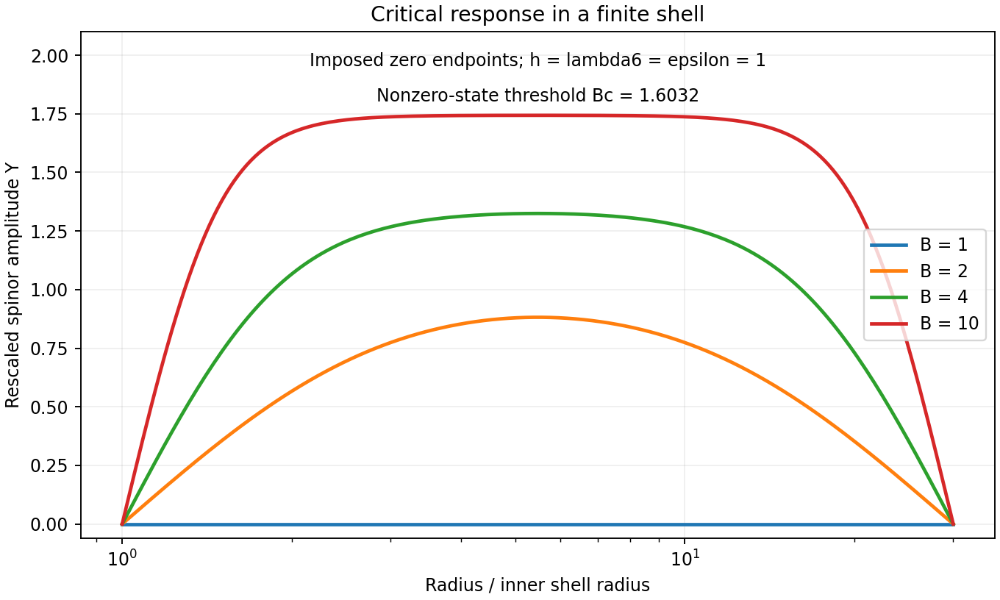

# Critical spinor source response: constructive checkpoint

This continuation supplies an explicit, analytic, preferred-frame parent action whose critical static response is deep MOND. It also exposes a spatial correction and a finite-shell existence threshold. It does **not** select the vacuum normalization, derive the full P2 interpolation, or establish a viable relativistic theory.

Research lineage: the previous checkpoint was commit e1a99edce6fd4ac8519f960fc864b90e0f82e970. The shared checkout advanced independently to 32b3f9a35cd6f85693de14dbe5517ffe42e9b38e before the retained experiments; their manifests record that revision and the exact input hashes. This work modifies only this continuation and its parent index.

## 1. The missing source-work sign can be supplied

Let \(\Psi\) be a complex two-component field,
\[
q=\Psi^\dagger\Psi,\qquad p_i=\Psi^\dagger\sigma_i\Psi.
\]
The Pauli identity gives \(|\mathbf p|^2=q^2\). Introduce a gravitational flux \(\mathbf D\), potential \(\Phi\), and auxiliary U(1) connection \(A_\mu\), with \(\mathcal D_\mu=\partial_\mu-iA_\mu\). For positive \(Z,\epsilon,h,\lambda_6\), propose
\[
\mathcal L={1\over4\pi G}\left[
 Z|\mathcal D_t\Psi|^2-\epsilon|\mathcal D_i\Psi|^2
 -{\lambda_6\over3}q^3+h\mathbf D\cdot\mathbf p
 -\mathbf D\cdot\nabla\Phi\right]-\rho\Phi .
\]
This is a chosen parent action, not a derivation from the existing vacuum theory. The connection has no Maxwell term. The source \(\rho\) is prescribed ordinary baryonic mass density. The vector \(\nabla\Phi\) points outward for a positive point mass; the physical acceleration is its negative.

Variation gives
\[
\nabla\cdot\mathbf D=4\pi G\rho,\qquad
h\mathbf p=\nabla\Phi.
\]
In the static ultralocal limit \(\epsilon=0\), minimizing the auxiliary energy
\[
E_\Psi={\lambda_6q^3\over3}-h\mathbf D\cdot\mathbf p
\]
aligns \(\mathbf p\) with \(\mathbf D\) and sets \(q=\sqrt{hD/\lambda_6}\), where \(D=|\mathbf D|\). Its minimum is negative. The flux action uses its **negative**, the convex dual energy
\[
H(D)=-\min_\Psi E_\Psi
 ={2\over3}\sqrt{a_0}\,D^{3/2},
\qquad \boxed{a_0={h^3\over\lambda_6}}.
\]
Varying \(\mathbf D\) after this elimination yields
\[
g=H'(D)=\sqrt{a_0D}.
\]
The Legendre transform is \(W(g)=Dg-H(D)=g^3/(3a_0)\); the effective static Lagrangian is \(-W/(4\pi G)-\rho\Phi\). Thus the source equation has the required positive sign:
\[
\nabla\cdot\left({|\nabla\Phi|\over a_0}\nabla\Phi\right)=4\pi G\rho.
\]
This resolves the sign/ensemble gap for this proposed parent. It does not turn the negative minimized sextic energy itself into a positive field energy.

At \(\Psi=(A,0)\) and \(hD=\lambda_6A^4\), the real-coordinate Hessian of \(E_\Psi\) is
\[
\operatorname{diag}(8\lambda_6A^4,0,4\lambda_6A^4,4\lambda_6A^4).
\]
The zero direction is the gauged phase. All three physical auxiliary directions are positive for \(D>0\). At zero field the quadratic gap vanishes; this criticality is precisely why regular, invertible linear-response arguments do not apply.

## 2. Exact spherical geometry changes the mass law

For an exterior point-source flux \(\mathbf D=B\hat{\mathbf r}/r^2\), \(B=GM\), use local sections
\[
z_N=(\cos(\theta/2),e^{i\phi}\sin(\theta/2)),\qquad
z_S=e^{-i\phi}z_N .
\]
They satisfy \(z^\dagger\boldsymbol\sigma z=\hat{\mathbf r}\). Eliminating the auxiliary phase connection gives
\[
(A_N)_\phi={1-\cos\theta\over2},\quad A_S=A_N-d\phi,
\quad F_{\theta\phi}={\sin\theta\over2},\quad\int_{S^2}F=2\pi .
\]
A nonzero global ordinary spinor on the trivial bundle cannot realize this lift: its globally defined Berry connection would have exact curvature with zero integrated flux. Gauge patches or zeros are necessary. Here the patched bundle is part of the proposed construction, not an independently established physical sector.

The covariant angular gradient has squared norm \(1/2\) and the covariant angular Laplacian gives \(-z/2\). Consequently
\[
\Psi=A r^{-1/2}z,\qquad
\Delta_A\Psi=-{3\over4r^2}\Psi.
\]
The coefficient \(3/4\) includes a radial \(1/4\) and angular \(1/2\). Omitting the angular term gives an incorrect mass correction.

The static spinor equation is
\[
\epsilon\Delta_A\Psi+
(h\mathbf D\cdot\boldsymbol\sigma-\lambda_6q^2)\Psi=0.
\]
It gives the exact nonzero scale-invariant branch
\[
\lambda_6A^4=hB-{3\epsilon\over4},\qquad
\boxed{g^2={a_0G(M-M_{\rm crit})\over r^2}},
\qquad
\boxed{M_{\rm crit}={3\epsilon\over4hG}}.
\]
Existence requires \(M>M_{\rm crit}\). This is a theorem about the aligned, rotationally symmetric, scale-invariant branch, not a prohibition of every other state below that mass. It is defined outside the source and is not a finite-energy global halo extending from zero to infinity.

This correction survives at arbitrarily large radius: both relevant terms scale alike. On this branch the squared circular speed is \(v_c^2=gr\), hence \(v_c^4=a_0G(M-M_{\rm crit})\). A universal exact unshifted baryonic mass law therefore requires \(\epsilon=0\), negligible \(M_{\rm crit}/M\) in the tested range, or a different spatial completion. Quantized Berry flux does not quantize \(\epsilon/h\).

## 3. A finite-shell threshold is provable

Write \(x=\log(r/r_{\rm in})\) and \(\Psi=r^{-1/2}Y(x)z\). Apart from the fixed endpoint term \(-\epsilon[Y^2]/2\), the radial auxiliary energy is proportional to
\[
\int_0^L\left[\epsilon Y'^2+
\left({3\epsilon\over4}-hB\right)Y^2+
{\lambda_6\over3}Y^6\right]dx .
\]
For the mathematical Dirichlet problem \(Y(0)=Y(L)=0\), Poincaré's inequality shows the unique minimum is zero when
\[
hB-{3\epsilon\over4}\le {\epsilon\pi^2\over L^2}.
\]
When the inequality is reversed, a sufficiently small sine trial has negative energy. The positive sextic term bounds the functional below and controls minimizing sequences; in one dimension the compact embedding on a finite interval yields a minimizer. Replacing it by its absolute value does not raise energy. The ODE and uniqueness of its initial-value problem make a nonzero nonnegative minimizer strictly positive in the interior. Therefore
\[
\boxed{B_c={\epsilon\over h}
\left({3\over4}+{\pi^2\over L^2}\right)}
\]
is the exact threshold for a nonzero minimum in this specified radial problem. The Euler equation is
\[
\epsilon Y''+(hB-3\epsilon/4)Y-\lambda_6Y^5=0.
\]
These imposed shell endpoints have not been derived as physical halo boundaries.

For \(h=\lambda_6=\epsilon=1\), \(L=\log30\), the threshold is approximately 1.603. Two independent initial meshes gave converged solutions for \(B=1,2,4,10\). The \(B=1\) state vanishes; the other states have negative energy and positive sampled radial Hessian eigenvalues. The first integral and mesh agreement provide additional checks. Finite-difference eigenvalues are bounded numerical evidence, not a continuum stability proof or a nonspherical test.

## 4. Local dynamics passes a limited sign test

After eliminating the U(1) phase, the spinor metric is
\[
|\mathcal D_\mu\Psi|^2=
{(\partial_\mu q)^2\over4q}
 +{q\over4}|\partial_\mu\mathbf n|^2,\qquad
\mathbf n=\mathbf p/q.
\]
Using the exact multiplier constraint \(\mathbf g=\nabla\Phi=hq\mathbf n\), this becomes \(|\partial_\mu\mathbf g|^2/(4hg)\). Around a uniform nonzero background \(g_0\mathbf n\), a scalar Fourier perturbation \(\delta\Phi\), with \(k\ne0\), has positive kinetic coefficient \(Zk^2/(4hg_0)\) and
\[
\boxed{\omega^2={\epsilon\over Z}k^2+
{2hg_0^2\over Za_0}
\left(1+{k_\parallel^2\over k^2}\right)}.
\]
This follows by expanding \(W=g^3/(3a_0)\): its Hessian is \(g_0(I+\mathbf n\mathbf n^T)/a_0\). There are no higher time derivatives in this constrained quadratic calculation.

This checks the sign of one physical scalar sector in a preferred frame around a uniform nonzero field. It does not establish causality of a relativistic completion, arbitrary-background stability, or health at the singular zero-field chart. The fixed-flux radial Hessian in the shell calculation is a different test and cannot substitute for those missing analyses.

## 5. What prevents a solution of the original puzzle

The symmetry allows lower operators \(m^2q+u q^2/2\). If added, they give
\[
D={m^2\over h}+{u\over h^2}g+
{\lambda_6\over h^3}g^2.
\]
Exact critical response requires both coefficients to vanish. No protecting symmetry, renormalization argument, or dynamical tuning has been supplied.

The pure sextic parent gives only the deep law. Adding \(D^2/2\) to its dual energy gives \(g=D+\sqrt{a_0D}\), not the desired \(g=\sqrt{D^2+a_0D}\). The extra cross term is explicit. An interpolation can be reverse-engineered through a new potential, but that would not select it.

There is nevertheless an exact characterization within this parent. Replace \(\lambda_6q^3/3\) by \(U(q)\), retain the same source and multiplier couplings, and set \(\epsilon=0\). The constraints require \(g=hq\) and \(U'(q)=hD\). Thus full P2 and \(U(0)=0\) uniquely require
\[
\boxed{U(q)=
{hq\sqrt{a_0^2+4h^2q^2}\over4}
 +{a_0^2\over8}\operatorname{arsinh}{2hq\over a_0}
 -{a_0hq\over2}.}
\]
Indeed \(U'(q)=h[\sqrt{a_0^2+4h^2q^2}-a_0]/2\), so \(g^2=D^2+a_0D\) exactly. The potential is analytic near \(q=0\), with
\[
U(q)={h^3q^3\over3a_0}-{h^5q^5\over5a_0^3}+O(q^7),
\qquad
U''(q)={2h^3q\over\sqrt{a_0^2+4h^2q^2}}>0
\]
for \(q>0\), and \(U(q)/q^2\to h^2/2\) at high field. This gives a stable static auxiliary minimum and the exact interpolation in the stipulated ultralocal parent. It is an inverse reconstruction from the desired formula, not an independent reason for nature to choose it. It does not extend the pure-sextic finite-gradient spherical result to full P2. Earlier project work already reconstructed P2 potentials in other variables; this is the matching potential for the present spinor/flux parent, not a claim that variational representations of P2 are new.

Finally \(a_0=h^3/\lambda_6\) is free. A constant vacuum term does not alter any field equation used here. Neither the bundle flux \(2\pi\), the radial factor \(3/4\), nor the shell eigenvalue \(\pi^2/L^2\) links that constant to \(h^3/\lambda_6\). Thus no value of \(a_0/(c\sqrt{G\rho_\Lambda})\), and specifically no \(32\pi^2\) area-vacuum product, has been derived.

## 6. Relaxing the old fluctuation state does not automatically rescue it

A separate exact trial tests a source-dependent version of the previous Coulomb optimizer. In dimensionless units let
\[
H_0=-\Delta-2/R,\quad
\psi_0=e^{-R}/\sqrt{\pi},\quad E_0=-1,\qquad
H_g=H_0+\eta(|\boldsymbol\xi+g\mathbf e_z|-R).
\]
Here \(g\ge0\) and \(z=\xi_z\). Use the normalized admissible trial
\[
\psi_{\rm tr}={ (1-agz)\psi_0\over\sqrt{1+a^2g^2}},
\]
since \(\langle z^2\rangle_0=1\). Integration by parts using \(H_0\psi_0=-\psi_0\) gives the exact unnormalized kinetic/Coulomb increment \(a^2g^2\). Writing
\[
B_j(g)=\langle z^j(|\boldsymbol\xi+g\mathbf e_z|-R)\rangle_0,
\]
explicit angular and radial integration gives
\[
B_0={g^2\over3}-{g^4\over15}+O(g^5),\quad
B_1={g\over2}-{g^3\over15}+O(g^5),\quad
B_2={g^2\over10}+{2g^4\over105}+O(g^5).
\]
Consequently its Rayleigh increment is
\[
\Delta E_{\rm tr}
={a^2g^2+\eta(B_0-2agB_1+a^2g^2B_2)\over1+a^2g^2}.
\]
At the candidate cancellation \(\eta=4/3,\ a=\eta/2=2/3\),
\[
\boxed{E_{\min}(g)-E_0\ \le\
\Delta E_{\rm tr}={4\over45}g^4+O(g^5).}
\]
A positive leading \(Cg^3\), \(C>0\), for that minimum is impossible because it eventually exceeds this upper bound. This statement needs no claim that the trial is the exact ground state. It excludes the specified direct-minimum-energy cubic response at the stated tuning. It does not exclude negative cubic response, different potentials, different source couplings, or a flux dual such as the critical spinor action.

## Evidence and continuation

The retained checks cover exact Pauli, duality, Hessian, bundle, spherical and logarithmic identities, local dispersion, relevant-operator effects, and the bounded shell experiment. Version 1's main run failed only because the generic trigonometric simplifier left a zero half-angle residual unreduced. Version 2 expands the double-angle expressions before simplification; the original script and all failed runs remain intact. Deliberate controls remove angular geometry or reverse the kinetic sign.

Version 2's main run passes **49/49** checks. Each deliberate control passes **47/49**, failing exactly its two intended checks. The independent relaxed-state script passes **7/7**; its mistuned trial control passes **5/7** and fails quadratic cancellation and the quartic coefficient. The exact-P2 reconstruction passes **7/7** checks; its added lower-operator control passes **5/7**, failing the constitutive derivative and absence of lower operators. All ten manifests, including the three original failed runs, validate against their retained artifacts. These counts verify the listed identities and bounded experiments, not the unsolved physical obligations. Mathematical self-review covered source signs, variations, bundle patches, radial boundary terms, the threshold proof, perturbation scope, and the direction of the Rayleigh inequality.

The current route remains open. Its new result is a concrete source-coupled critical parent with an exactly computable spatial consequence. The nearest substantive gaps are protection of criticality, an acceptable spatial completion preserving the desired mass law, and a vacuum sector that fixes the free normalization. The relaxed-state route now has the scoped upper-bound obstruction above; other source-dependent models remain open. No literature-wide novelty claim or independent-agent audit is made; this is a derivation and adversarial self-review.
