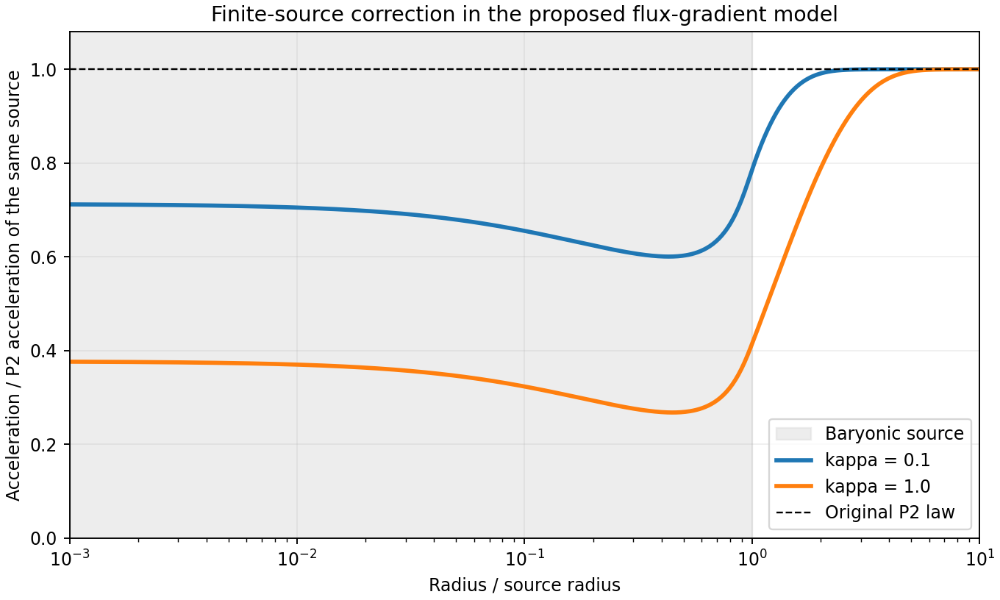

# A spatial completion preserving the exact quadrature exterior branch

Research checkpoint, 2026-10-08, based on shared repository revision 32b3f9a35cd6f85693de14dbe5517ffe42e9b38e and the separately retained critical-spinor continuation. The original objective is still unresolved: no selection of the vacuum coefficient or proof of a complete physical theory is claimed.

The new constructive result is a positive spatial derivative term that retains the exact P2 spherical vacuum branch without the previous constant mass subtraction. Boundary matching can excite other branches. Their radial uniqueness, sign, and deep linear decay can be characterized. This changes the gradient completion; it does not repair the old canonical gradient term while keeping that term.

## 1. Change which field carries the spatial stiffness

Use outward \(\mathbf g=\nabla\Phi\), \(g=|\mathbf g|>0\), and define the constitutive flux
\[
\mathbf F(\mathbf g)=f(g){\mathbf g\over g},\qquad
f(g)={\sqrt{a_0^2+4g^2}-a_0\over2}.
\]
Here \(\mathbf F\) is a nonlinear function of the acceleration, not the independently varied multiplier \(\mathbf D\) in the previous parent action. Let \(W'(g)=f(g)\), \(W(0)=0\), with the exact P2 potential already reconstructed there.

Propose the static field functional
\[
\mathcal E[\Phi]={1\over4\pi G}\int\left[
 W(g)+{\kappa\over2}\partial_iF_j\partial_iF_j
\right]d^3x+\int\rho\Phi\,d^3x,\qquad \kappa>0.
\]
The parameter \(\kappa\) has dimensions of length squared. The sign of the source term here agrees with the negative of the static action in the preceding report. Positivity refers to the added field term; the full sourced gravitational functional is not asserted to be positive.

Let
\[
J_{ij}={\partial F_i\over\partial g_j}
=\mu(\delta_{ij}-n_i n_j)+\nu n_i n_j,\qquad
\mu={f(g)\over g}>0,\quad
\nu=f'(g)={2g\over\sqrt{a_0^2+4g^2}}>0.
\]
For compactly supported variations, integrate the gradient term by parts before varying \(\mathbf g\):
\[
\delta\int{1\over2}|\nabla\mathbf F|^2
=-\int(\Delta F_i)J_{ij}\,\delta g_j .
\]
Consequently the exact static equation is
\[
\boxed{\nabla\cdot\mathbf J_{\rm src}=4\pi G\rho,\qquad
\mathbf J_{\rm src}=\mathbf F-\kappa J\,\Delta\mathbf F.}
\]
The matrix \(J\) and the source current \(\mathbf J_{\rm src}\) are different objects. Derivatives of \(J\) remain inside the final divergence; they have not been dropped.

This can be implemented in the previous analytic spinor parent by replacing its canonical spatial term \(\epsilon|\mathcal D_i\Psi|^2\) with \(\kappa|\partial_i\mathbf F(h\mathbf p)|^2/2\). Retain the multiplier constraint \(h\mathbf p=\nabla\Phi\), the potential \(U(q)=W(hq)\), and the time term \(Z|\mathcal D_t\Psi|^2\).

In spinor variables, \(q=\Psi^\dagger\Psi\), \(\mathbf p=\Psi^\dagger\boldsymbol\sigma\Psi\), and
\[
\mathbf F(h\mathbf p)=
{2h^2q\over \sqrt{a_0^2+4h^2q^2}+a_0}\,\mathbf p
={h^2\over a_0}q\mathbf p+O(q^3\mathbf p).
\]
Thus the proposed spatial term is analytic near \(\Psi=0\) and gauge invariant. Its leading stiffness is higher order in the spinor amplitude and vanishes in the vacuum. It does not supply a nondegenerate vacuum kinetic/spatial theory. No symmetry has been found that forbids the old canonical spatial term: setting that coefficient to zero is an additional unprotected choice.

## 2. Exact exterior branch, with no mass offset

For \(r>R_{\rm source}\), take
\[
\mathbf F_0={B\over r^2}\hat{\mathbf r}.
\]
Its vector Laplacian vanishes:
\[
\Delta(F_0\hat{\mathbf r})=
\left(F_0''+{2F_0'\over r}-{2F_0\over r^2}\right)\hat{\mathbf r}=0.
\]
Hence \(\mathbf J_{\rm src}=\mathbf F_0\) exactly, at every radius in the exterior domain. Gauss normalization gives \(B=GM\), and inversion of \(f\) yields
\[
\boxed{g^2=\left({GM\over r^2}\right)^2+
a_0{GM\over r^2}.}
\]
The full interpolation, not just its deep limit, is an exact vacuum branch for every \(\kappa>0\). The earlier \(M-3\epsilon/(4hG)\) shift arose from the different canonical spinor gradient; it is not forced by every positive spatial derivative term.

The gradient energy on this branch is not zero. Its first variation vanishes locally because the flux is harmonic. The point-source singularity is excluded from the claim. Matching to a regular source and the extra boundary data of the fourth-order potential equation have not been solved here. The existence of this branch must not be confused with its universal selection.

## 3. Positive radial solutions are unique for fixed boundary fluxes

In a spherical vacuum annulus \([r_1,r_2]\), write \(F=f(g)>0\) for the radial flux magnitude. The source equation integrates to
\[
\boxed{F-\kappa\nu(F)
\left(F''+{2F'\over r}-{2F\over r^2}\right)={B\over r^2}},
\qquad
\nu(F)={2\sqrt{F^2+a_0F}\over2F+a_0}.
\]
The ordinary differential equation is second order in \(F\), with \(B\) fixed by the enclosed mass. It contains additional solutions besides \(F_0=B/r^2\).

Set \(S=B/r^2>0\). The right side of
\[
F''+{2F'\over r}-{2F\over r^2}
=R(F,r),\qquad R={F-S\over\kappa\nu(F)}
\]
is strictly increasing in \(F>0\), because
\[
{F\nu'\over\nu}
={a_0^2\over2(F+a_0)(2F+a_0)}<{1\over2},
\]
and \(R_F=[\nu-(F-S)\nu']/(\kappa\nu^2)>0\).

If two positive classical solutions share the same endpoint values, their difference \(w\) obeys
\[
w''+{2w'\over r}-\left({2\over r^2}+c(r)\right)w=0,
\qquad c(r)>0,\qquad w(r_1)=w(r_2)=0.
\]
A positive interior maximum or negative interior minimum contradicts this equation. Therefore \(w=0\). This proves **at most one positive solution for the stated Dirichlet data**; it is not a universal existence or dynamical stability theorem.

There are useful exact bounds. Let \(v=r^2F/B\). Then
\[
v''-{2v'\over r}={v-1\over\kappa\nu(Bv/r^2)}.
\]
The same maximum argument shows
\[
\min(1,v(r_1),v(r_2))\le v(r)\le
\max(1,v(r_1),v(r_2)).
\]
If one endpoint lies above 1 and the other equals 1, the solution stays above 1 in the interior; the reversed statement holds below 1. To see the strict sign directly, \(u=F-F_0\) satisfies the exact linear equation with solution-dependent positive coefficient
\[
u''+{2u'\over r}-
\left({2\over r^2}+{1\over\kappa\nu(F)}\right)u=0.
\]
No oscillatory crossing is permitted with those boundary signs.

## 4. Boundary memory has a computable deep-field decay length

Linearize about \(F_0=B/r^2\) in the pure deep constitutive law. Then
\[
\nu_0={C\over r},\qquad C=2\sqrt{B/a_0},
\qquad
u''+{2u'\over r}-{2u\over r^2}-{r\over\kappa C}u=0 .
\]
The decaying solution is exactly
\[
\boxed{u(r)=A r^{-1/2}K_1\left[
{2r^{3/2}\over3\sqrt{\kappa C}}\right].}
\]
The growing \(I_1\) solution is excluded by the assumed decaying asymptotic condition. Direct substitution checks the modified Bessel identity.

The large-argument expansion of \(K_1\) gives
\[
u(r)\ \sim\ {\rm const}\,r^{-5/4}
\exp\left[-{2\over3}\left({r\over L}\right)^{3/2}\right],
\qquad
\boxed{L=(2\kappa\sqrt{GM/a_0})^{1/3}}.
\]
For fixed \(\kappa,a_0,G\), this length scales as \(M^{1/6}\). This is a prediction of the chosen spatial completion, not a parameter-free prediction of the original formula. The Bessel solution is exact for the linearized pure-deep equation, not the full nonlinear interpolation or arbitrary boundary amplitudes. The asymptotic special-function formula is [DLMF 10.40.2](https://dlmf.nist.gov/10.40#E2).

Thus, on a decaying branch, the extra boundary mode has no persistent constant mass subtraction. Establishing that a specified regular source excites precisely such a branch remains a separate matching problem.

## 5. Local perturbations retain positive spatial stiffness

Keep the time term from the previous spinor parent. Around a uniform nonzero field \(g\mathbf n\), the scalar perturbation has kinetic coefficient \(T=Zk^2/(4hg)>0\). Its dispersion relation becomes
\[
\boxed{\omega^2={2hg\over Z}\left[
{\mu k_\perp^2+\nu k_\parallel^2\over k^2}
+\kappa(\mu^2 k_\perp^2+\nu^2 k_\parallel^2)
\right].}
\]
Both parallel and transverse high-wave-number stiffnesses are positive for \(g>0\). Therefore preserving the spherical exterior branch did not require deleting every spatial restoring term. This tests only the constrained scalar around a uniform nonzero background in a preferred frame. It does not prove arbitrary-background stability, zero-field regularity, a relativistic causal bound, or ultraviolet completeness.

## 6. Numerical and literature checks

Four dimensionless annulus problems used \(B=a_0=1\), \(r\in[1,10]\), \(\kappa=0.1,1\), inner flux \(F(1)=0.8,1.2\), and outer flux \(F(10)=0.01\). Independent initial meshes of 180 and 360 nodes converged at tolerance \(10^{-8}\). Accepted solutions stayed strictly positive; a floor used only to protect intermediate solver iterates was inactive on them. Mesh comparison, independently evaluated Gauss-current residuals, comparison bounds and signs passed.

Examples of \(F/F_0\):

| \(\kappa\) | inner ratio | at \(r=2\) | at \(r=3\) | at \(r=5\) |
|---|---:|---:|---:|---:|
| 0.1 | 0.8 | 0.989436 | 0.999715 | 0.99999996 |
| 0.1 | 1.2 | 1.010837 | 1.000293 | 1.00000004 |
| 1 | 0.8 | 0.903640 | 0.964471 | 0.997409 |
| 1 | 1.2 | 1.098606 | 1.037016 | 1.002728 |

The imposed outer endpoint already equals the exact branch. These finite computations do not demonstrate infinite-domain decay; the analytic linearized solution supplies that separate statement.

The main experiment passes **43/43** checks. Reversing the spatial stiffness sign causes exactly three failures: the dispersion formula and the two directional high-wave-number signs. This mutation passes **40/43**, as intended. Commands, hashes, dependencies and outputs are retained in the two run directories.

Novelty is unverified. The bounded search found direct prior art for the Newtonian limit: Markus Lazar, *Gradient modification of Newtonian gravity*, arXiv:2009.09846v3, 1 December 2020, Physical Review D 102, 096002. Its first-gradient limit uses the same quadratic derivative term when \(F=g\). Its equations (48)–(54) give the screened point-source solution
\[
F={GM\over r^2}\left[1-(1+r/\sqrt\kappa)e^{-r/\sqrt\kappa}\right],
\]
which illustrates why an exact inverse-square vacuum branch need not be the source-matched solution. This limit is **known after notation translation**, not a new result. [Primary source](https://arxiv.org/pdf/2009.09846v3).

Justin Khoury's *Another Path for the Emergence of Modified Galactic Dynamics from Dark Matter Superfluidity*, arXiv:1602.05961, also uses higher-gradient operators to obtain a MOND action, through a different symmetry-breaking mechanism; equations (18)–(23) were inspected as adjacent work. It does not establish this report's P2 flux-gradient completion. [Primary source](https://arxiv.org/pdf/1602.05961).

Searches on 2026-10-08 used web/arXiv discovery for “MOND higher derivative action gradient gravitational flux AQUAL spherical symmetry”, “gradient Newtonian gravity Yukawa Bopp Podolsky gravity regularization”, and constitutive-flux/Bessel variants. The strongest primary Newtonian candidate was checked in full Section V and its action. This was not an exhaustive citation-graph search or a specialist novelty review; no “first” claim is justified. Source PDFs were read remotely, not added to a local cache.

## 7. Finite-source continuation: a conditional suppression theorem

The next source-matching step was executed after the exterior checkpoint above. It gives a stronger restriction than branch existence alone.

Let a nonnegative spherical density \(\rho(r)\) be continuously differentiable, compactly supported, nonincreasing, and nonconstant. Define
\[
S(r)={GM(r)\over r^2},\qquad
\mathscr L S=S''+{2S'\over r}-{2S\over r^2}=4\pi G\rho'(r)\le0.
\]
Assume a positive classical solution \(F(r)\) of the sourced radial equation exists for \(r>0\), extends regularly with \(F(0)=0\), and vanishes at infinity. Put \(u=F-S\). Its exact equation is
\[
\mathscr L u-{u\over\kappa\nu(F)}=-4\pi G\rho'(r)\ge0.
\]
Both endpoint limits of \(u\) are zero. A positive interior maximum contradicts the displayed equation, so \(u\le0\). The strong maximum principle on interior subintervals, with nonzero forcing somewhere, makes the inequality strict throughout the connected interval:
\[
\boxed{0<F(r)<S(r)\quad (r>0).}
\]
Since \(g(F)=\sqrt{F^2+a_0F}\) is strictly increasing,
\[
\boxed{g(r)<\sqrt{S(r)^2+a_0S(r)}.}
\]
The previous radial uniqueness proof also extends to at most one such positive regular solution: the difference of two solutions vanishes at both endpoint limits and obeys the homogeneous equation with positive zeroth-order coefficient.

These are conditional statements about solutions satisfying the specified regularity and asymptotic conditions. They do not themselves prove existence. They show that a regular monotone source, if it has such a solution at \(\kappa>0\), cannot generate the exact exterior P2 branch at every finite radius. The added mode is forced to have the suppression sign. The exact vacuum branch and the source-generated field must be distinguished.

For a concrete numerical source, set \(G M_{\rm total}=a_0=R_{\rm source}=1\), and use
\[
M(r)=\begin{cases}
(35r^3-42r^5+15r^7)/8,&0\le r\le1,\\
1,&r\ge1.
\end{cases}
\]
Its density is proportional to \((1-r^2)^2\) inside and zero outside, so the joined density is \(C^1\) and nonincreasing. Here \(\mathscr L S=-(105/2)r(1-r^2)\) inside. For \(\kappa=0.1,1\), the solver used the approximate regular inner condition \(F'=F/r\) and the outer condition \(F=1/r^2\).

The boundaries were moved jointly from \((r_{\min},r_{\max})=(10^{-4},10)\) to \((10^{-5},15)\). Both calculations converged; their maximum absolute flux differences on \(r\in[0.01,8]\) were approximately \(5.1\times10^{-11}\) and \(1.45\times10^{-10}\). This is a truncation-sensitivity check, not a certified infinite-domain error bound. The central approximation is justified at leading order by
\[
F(r)=cr+
{2(c-35/8)\over27\kappa\sqrt{c/a_0}}r^{5/2}+o(r^{5/2}),
\]
with \(c>0\) selected by matching, not independently fixed.

The resulting acceleration ratios relative to the unmodified P2 response of the same source are:

| \(\kappa\) | source edge \(r=1\) | \(r=2\) | \(r=3\) | \(r=5\) |
|---|---:|---:|---:|---:|
| 0.1 | 0.786052 | 0.991128 | 0.999781 | 0.999999973 |
| 1 | 0.414720 | 0.788676 | 0.932522 | 0.995512 |

These values describe the specified dimensionless model, not observed galaxy fits. All accepted fluxes were positive and below the original source flux.

The original source-check script compared differently factored but equivalent density polynomials using structural equality and failed that check. Version 2 checks their expanded difference; the original two failed runs are preserved. The corrected main run passes **24/24** checks. Its reversed density-gradient sign control passes **23/24**, with the intended forcing-sign failure.

## 8. A coercive second variation for all angular modes

This extends the uniform-background sign check to perturbations of a matched, nonuniform spherical solution. The source remains fixed. The rigorous domain here is a bounded annular region away from zero-field points, with compactly supported perturbations or boundary conditions eliminating all boundary work.

Let \(\mathbf S=\nabla\Phi_N\) be the outward Newtonian source field, so \(\nabla\cdot\mathbf S=4\pi G\rho\). Integration by parts gives \(\int\rho\Phi=-(4\pi G)^{-1}\int\mathbf S\cdot\mathbf g\), up to fixed boundary terms. Invert the constitutive map:
\[
\mathbf g=\mathcal G(\mathbf F)=\gamma(F)\hat{\mathbf F},
\qquad \gamma(F)=\sqrt{F^2+a_0F}.
\]
The energy, expressed in the flux, has local part
\[
V(\mathbf F,\mathbf x)=W(\gamma(F))-
\mathbf S(\mathbf x)\cdot\mathcal G(\mathbf F).
\]
Physical fluxes additionally satisfy \(\nabla\times\mathcal G(\mathbf F)=0\). One must not ignore this nonlinear constraint when varying a general background.

There is a useful simplification for the matched spherical background: it satisfies the stronger vector equation
\[
\mathbf F-\kappa J\Delta\mathbf F=\mathbf S .
\]
Therefore it is stationary even in the larger space of unconstrained vector fluxes:
\[
\partial_{\mathbf F}V-\kappa\Delta\mathbf F
=J^{-1}(\mathbf F-\mathbf S)-\kappa\Delta\mathbf F=0.
\]
Because this full first variation vanishes, the curvature of the physical constraint does not add an extra term to the second variation. Positivity in the larger vector space implies positivity on the allowed scalar-potential perturbations.

At an aligned background \(\mathbf F=F\mathbf n,\ \mathbf S=S\mathbf n\), \(F>0,S\ge0\), the local Hessian has one radial and two equal transverse eigenvalues:
\[
H_r=\gamma'+(F-S)\gamma''
={4F^3+6a_0F^2+a_0^2F+a_0^2S
\over4[F(F+a_0)]^{3/2}},
\]
\[
H_t=\gamma'+S\left({\gamma\over F^2}-{\gamma'\over F}\right)
={2F+a_0\over2\sqrt{F(F+a_0)}}+
{Sa_0\over2F\sqrt{F(F+a_0)}}.
\]
Both source-dependent contributions are nonnegative. Also \(H_t\ge1\). For the radial eigenvalue at \(S=0\),
\[
{dH_r(F,0)\over dF}
={a_0^2(2F-a_0)\over8F^{3/2}(F+a_0)^{5/2}}.
\]
The unique minimum occurs at \(F=a_0/2\), with value
\[
\boxed{m_*={5\over3\sqrt3}\simeq0.96225045}.
\]
This is a sharp constant over all aligned states with \(F>0,S\ge0\); equality need not occur on the particular nonzero-source matched solution.

For any admissible vector variation \(\boldsymbol\eta=\delta\mathbf F\), including angularly varying ones,
\[
\boxed{\delta^2\mathcal E\ge{1\over4\pi G}
\int\left[m_*|\boldsymbol\eta|^2+
\kappa|\nabla\boldsymbol\eta|^2\right]d^3x.}
\]
This gives a strictly positive static second variation, not merely absence of a radial negative eigenvalue. On a fixed bounded region away from \(F=0\), the smoothness and positive bounds also give a strict local energy minimum. It is not a global convexity theorem for arbitrary misaligned fluxes: away from the aligned background the source term has a different Hessian.

The retained time term gives quadratic kinetic energy
\[
{1\over4\pi G}\int{Z\over4hg}
\left|J^{-1}\partial_t\boldsymbol\eta\right|^2d^3x>0.
\]
Thus the linearized constrained system has a positive quadratic conserved energy under the stated fixed-source and zero-boundary-work conditions. Any sufficiently regular normal mode in this setting has nonnegative squared frequency; an exponentially growing finite-energy mode would contradict energy conservation. This is an energetic linear stability result covering all angular sectors in that setting. It does not establish PDE well-posedness, dynamics of the baryons, behavior at the central zero-field point, nonlinear stability on the unbounded domain, or a relativistic completion.

The Cartesian Hessian was independently formed before applying the radial constitutive identities. The first script left derivative substitutions unevaluated and stopped before producing a result file; those failed runs remain retained. Version 2 explicitly evaluates those substitutions before replacing the derivatives. The corrected main run passes **20/20** checks. Reversing the source coupling produces nine failures, including negative sampled Hessian eigenvalues; the control passes **11/20**. Its scope and results are recorded in the stability manifests.

## What changed and what remains

The canonical spinor gradient's mass-offset obstruction is specific to that completion. A different analytic spatial term admits the exact full P2 exterior branch, positive local stiffness, an at-most-one theorem for positive radial boundary solutions, and an explicit deep linear decay scale. Source matching then supplies an additional conditional theorem: regular monotone sources produce a force below P2 at finite radii. The bounded source calculations support that implication and the rapid exterior recovery. These are the surviving results of this attempt.

The action and \(\kappa\) remain choices. Critical lower operators and the absent canonical gradient are unprotected. General source existence, zero-field regularity and nonlinear/global dynamical stability remain open. Section 8 closes the narrower static-coercivity and energetic linear-stability obligation around matched spherical backgrounds away from zero-field points, including angular perturbations. A constant vacuum term still leaves all displayed local equations unchanged, so neither \(a_0\) nor \(32\pi^2\) has been selected.

The next discriminating obligations and their success/failure tests are listed in [NEXT_50.md](NEXT_50.md). An additional physical derivation is required to justify this spatial operator and its coefficient. The present result is a checkpoint, not completion of the original program. Review was an adversarial self-review of signs, boundary conditions, constraint curvature, limiting scope and source matching; it was not an independent-agent certificate.

Final evidence audit: the three corrected main calculations in this continuation pass 43, 24 and 20 checks respectively. All ten manifests here, and the ten retained manifests in the preceding critical-spinor continuation, validate. Failed implementation runs and deliberately failing controls are included in that provenance validation; validation of a manifest does not convert a failed run into a mathematical success.
